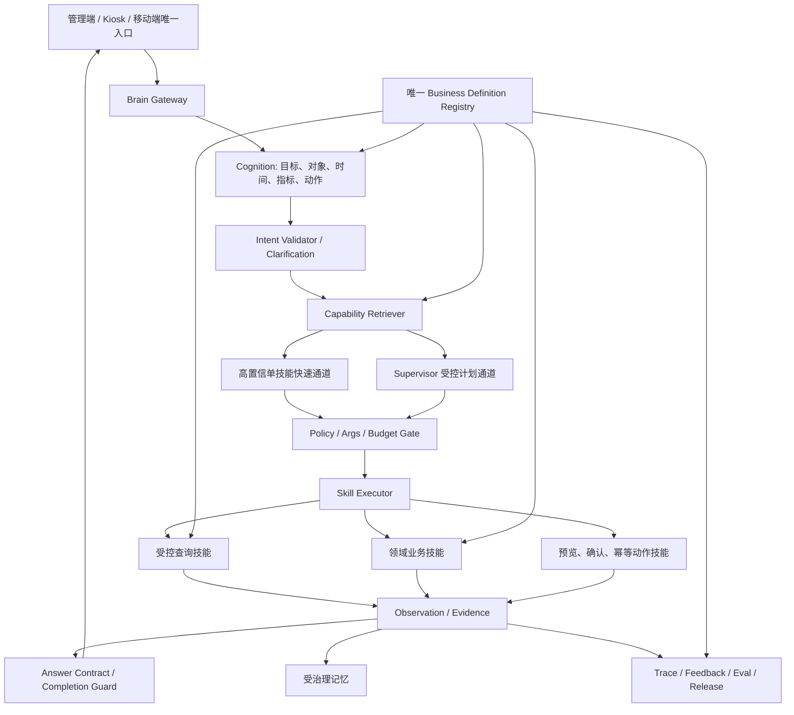

# Ami Agent 历代版本失败复盘与下一版 Ami-Brain 避坑综合分析报告

生成日期：2026-07-12

审计范围：Ami AI、Agent V1、V2、V3、V4、V5、V6 文档阶段、当前 Ami Brain

报告用途：解释“为什么做了多版仍没有一版真正可用”，并为下一阶段 Ami-Brain 的产品收口、架构取舍、开发顺序和验收门禁提供决策依据。

## 1. 执行摘要

历代 Agent 没有形成稳定可用版本，根因不是模型能力不足，也不是研发没有做功能，而是产品目标、业务语义、能力供给、执行链路、评测口径和发布机制没有在同一个版本里同时闭环。

过去每一版都解决了上一版的一个局部问题：

- V1 解决“能调用业务工具”。
- V2 解决“能力可治理、可发布、可审计”。
- V3 解决“自然语言自由问数”。
- V4 解决“从问数走向生命周期经营”。
- V5 解决“全业务 Ontology 路由和领域 Adapter”。
- V6 解决“从历史包袱中重新定义独立产品”。
- Ami Brain 解决“统一会话、语义、技能、动作、记忆、治理和多端入口”。

但这些版本都没有在立项时锁定同一套“真正可用”标准。结果是系统不断增加新架构，却没有优先清除旧链路、语义缺口、假阳性评测和真实业务闭环断点。

最关键的证据是评测口径失真：

- 2026-07-08 的旧口径中，V4 可用率 91.4%、V1 89.7%、Ami AI 89.4%。
- 旧口径只要运行完成且存在回答、证据、表格、动作、结构化块或 trace 之一，就会记为“可用”。
- 在该口径下，Ami AI 明确回答“无法访问实时数据，但可以给模板”，仍被记为可用；V4 用“识别出 1456 个生命周期机会”回答“今天店里情况怎么样”，也被记为可用。
- Ami Brain 后续引入意图、指标、时间和回答粒度一致性后，同一 2026-07-10 基线的旧口径可用率为 15.5%，真实可用率只有 3.7%，并识别出 77 个假阳性。

因此，过去的高分不能证明产品可用，只能证明服务返回了结构完整的内容。

当前 Ami Brain 已经跨过“空入口”和“假成功”阶段。最新 650 题真实请求路径评测达到 69.2% 真实可用率，假阳性为 0，权限绕过、跨门店读取、roleHint 绕过和假动作确认均为 0。但它仍不满足正式全量可用标准：193 题意图未覆盖，前台接待只有 56%，客户查询只有 16%，采购建议和权益投入产出均为 40%，否定与纠正只有 30%。

下一版 Ami-Brain 不应再定义为“新增一个 Agent 版本”，而应定义为“收敛现有能力、淘汰历史入口、建立真实可用门禁的唯一经营智能体产品”。

## 2. 第一性原理：什么才叫 Agent 可用

经营 Agent 的价值不是“生成了一段回答”，而是把用户目标稳定转换成可验证的经营结果。

一个请求只有同时满足以下七项，才能记为可用：

1. **理解正确**：识别目标、对象、时间、指标、维度、筛选、排序、输出形式和操作意图。
2. **数据正确**：读取正确门店、正确业务表、正确时间范围和统一指标口径。
3. **回答对题**：排行必须返回排行，名单必须返回名单，对比必须返回对比，动作必须返回预览或执行回执。
4. **证据完整**：显示来源、时间范围、口径、对象和关键计算依据。
5. **边界安全**：无越权、无跨店、无敏感泄露、无未确认写入、无伪造成功。
6. **链路稳定**：真实接口可调用，数据存在时能返回，失败时能诊断和恢复。
7. **体验达标**：用户只有一个入口，不需要选择技术版本，首字、完整响应和多轮上下文达到产品门禁。

过去各版本只完成了其中两到四项，所以表现为“局部能力很强，整体仍不可用”。

## 3. 版本复盘

### 3.1 Ami AI：能聊天，但不能承担事实经营

**定位**：通用模型问答和兜底话术。

**做对的事**：

- 自然语言体验流畅。
- 能解释概念、生成文案、提供通用建议。
- 在正式运行时不可用时，可以承担错误解释和交互兜底。

**不可用原因**：

- 不具备门店实时数据访问能力时，仍会生成看起来完整的经营建议。
- 缺少统一指标口径、业务对象约束、数据引用和写操作边界。
- 宽松评测把“泛化回答”误记为业务成功，89.4% 的旧口径结果没有产品意义。

**结论**：只保留为表达层和异常兜底，不允许生成事实型经营结论。

### 3.2 Agent V1：工具很多，但规则编排无法规模化

**定位**：Persona 路由、手写业务工具、审批和运行时编排。

**有效资产**：

- Run、Message、Step、ToolCall、Approval 等运行结构。
- 店长、前台、美容师、库存、财务、营销等 Persona 经验。
- 固定工具任务的确定性执行。
- 审批、证据、运行步骤和门店上下文传递。

**不可用原因**：

- Planner 和 Router 高度依赖关键词、正则和手写分支。
- 用户换一种说法就无法稳定落到正确工具。
- 新增一个业务能力需要改路由、计划、工具、输出和测试，多处同步维护。
- business-query、semantic-query 等旧问数链路逐步成为历史兼容层，但仍与后续版本共存。
- 89.7% 的旧口径结果包含大量“有结构但不对题”的假成功。

**结论**：保留统一运行时、审批和固定工具经验；停止在 V1 Planner 中继续堆分支。

### 3.3 Agent V2：治理体系领先，但把治理后台当成了用户运行时

**定位**：DB Manifest、能力中心、知识图谱、字段策略、权限、评测门禁、dry-run 和发布治理。

**有效资产**：

- 能力候选、评测、审批、发布和回滚思路。
- Policy Gateway、字段 allow/mask/deny、Persona 权限和风险等级。
- Answer Contract、Evidence、审计和部署门禁。

**不可用原因**：

- 运行时依赖“已发布且精确匹配的能力”。能力目录不完整时，用户问题直接被阻断。
- 650 题中 519 次失败原因为“没有匹配的已发布能力”，总体可用率只有 17.1%。
- 自由问法被迫映射到 capabilityId、queryKey 和工具分支，能力建设速度跟不上真实问法增长。
- 架构优先保证“能力可控发布”，没有先保证“用户高频问题可回答”。

**结论**：V2 的正确位置是治理后台，不是自然语言主入口。

### 3.4 Agent V3：安全 Text-to-SQL 方向正确，但语义层不完整

**定位**：白名单语义视图、SQL Guard、只读执行、成本控制和答案相关性校验。

**有效资产**：

- 自由问数覆盖能力高于手写工具。
- 只读账号、SELECT 限制、AST/SQL Guard、Cost Guard 和字段策略方向正确。
- 能作为其他经营 Agent 的事实查询工具。

**不可用原因**：

- 自然语言到业务对象、指标、维度、时间和语义视图的映射仍依赖不完整词典和路由规则。
- 白名单视图、字段绑定、同义词和时间口径缺失时，系统无法生成安全查询计划。
- 全版本评测中该原因出现 331 次，V3 总体可用率只有 49.2%。
- Text-to-SQL 只能解决“查什么”，不能完成建议、计划、审批、动作和归因。

**结论**：保留为受控事实查询引擎，禁止把 Text-to-SQL 本身包装成完整经营 Agent。

### 3.5 Agent V4：经营方向正确，但单域能力被包装成全局成功

**定位**：客户生命周期机会、经营计划、审批草稿、归因和质量治理。

**有效资产**：

- 从“查数据”升级到“发现机会、形成计划、提交审批、复盘归因”。
- 高风险动作只生成草稿和审批申请，不直接改业务资产。
- 经营层复用 V3 只读查询，而不是重复实现数据查询。

**不可用原因**：

- 生命周期小本体只覆盖部分经营问题，却承担了更广泛的用户入口预期。
- Intent Resolver 仍偏规则匹配，跨域问题容易被错误送入生命周期逻辑。
- 评测把“返回一个生命周期机会数”记为对经营概览问题的成功，91.4% 的旧口径结果严重失真。
- 生命周期数据质量、V3 查询质量和动作草稿接口任何一层不足，都会让最终回答偏题。

**结论**：保留客户生命周期经营闭环，作为 Ami-Brain 的领域技能，不再作为独立全业务入口。

### 3.6 Agent V5：全业务 Ontology 方向正确，但 Adapter 与兜底链路没有补齐

**定位**：全业务 Ontology Router、领域 Adapter、V3 查询兜底、记忆和经营计划。

**有效资产**：

- 把前台、财务、库存、美容师、营销、员工等能力拆成领域 Adapter。
- 具备统一路由、证据包、澄清、记忆和约束检查。
- 650 题评测中营销增长达到 93%，说明垂直 Adapter 能显著提升稳定性。

**不可用原因**：

- 未命中领域 Adapter 时大量回落到 V3，162 题因无法生成安全查询计划而失败。
- 财务风控 63%、前台接待 67%、美容师服务 66%、边界多轮 56%，高频岗位仍不稳定。
- 意图模糊和否定纠正均只有 20%，说明多轮理解没有真正进入规划主链路。
- 动作卡覆盖只有 2.8%，系统更像“能回答”，不是“能推动经营结果”。
- 71.7% 仍基于旧宽松口径，不能直接与当前 69.2% 真实可用率横向比较。

**结论**：保留 Adapter、Ontology、约束和证据包模式；淘汰 V5 独立入口和对 V3 的无条件兜底。

### 3.7 Agent V6：产品定义完整，但文档阶段没有证明运行可用

**定位**：clean-room 独立产品，强调记忆、追问、美业 Ontology、多 Agent、Capability Scanner、权限、安全、治理和阶段验收。

**做对的事**：

- 明确不复用历史 Agent 的产品方案和代码结构，切断旧版本设计惯性。
- 把生产级 Agent 定义为运行时、技能、记忆、护栏、可观测和评测的组合，而不是提示词工程。
- 明确 P0 先做可信只读闭环，再进入动作和主动经营。

**未形成可用版本的原因**：

- V6 首先是 PRD、架构、Scanner、Ontology、安全、计划和评测文档体系，不是已运行的产品版本。
- “多 Agent、全业务扫描、全领域语义、记忆、治理、主动经营”同时进入目标，范围仍然过大。
- clean-room 隔离解决了历史包袱，但不能自动解决业务数据口径、能力实现和真实场景覆盖。

**结论**：V6 的价值是重置产品定义；不能把文档完整度当成可用性证明。

### 3.8 当前 Ami Brain：已经形成主线，但仍处于受控试用阶段

**定位**：独立 `brain` 命名空间，统一会话、认知、上下文、语义、技能、Supervisor、动作、记忆、巡检、预测、评测、治理、发布和多端协议。

**已经解决的问题**：

- 650 题真实请求路径评测达到 69.2% 真实可用率，假阳性为 0。
- 权限绕过、跨门店读取、roleHint 绕过和假动作确认均为 0。
- 已支持预约、跟进任务、采购单草稿、营销草稿和服务记录等受控动作。
- 已建立资源版本、评测、发布、回滚、反馈和多端统一协议。
- SSE 首字 P95 为 2.547 秒，达到 3 秒门禁。

**仍未达到正式全量可用的原因**：

- 193/650 的意图未覆盖，占 29.7%。
- 客户查询 16%、否定纠正 30%、采购建议 40%、权益投入产出 40%、员工管理 50%、收银核销 52%、前台接待 56%。
- 7 个样本出现会话或业务对象不存在，说明评测 fixture 和真实对象解析仍需收口。
- 完整请求 P95 为 5.272 秒，最大 16.516 秒，远程数据库波动仍影响体验。
- 真实业务写入尚未在生产数据上执行浏览器验收。
- 巡检已能执行、落库和去重，但真阳性率还缺试点人工标注证明。

**结论**：当前 Ami Brain 是第一版具备真实产品主线资格的实现，但只适合受控试点，不适合宣称“全业务可用”。

## 4. 为什么版本越做越多，产品仍然不可用

### 4.1 用“新版本”替代“关闭根因”

每次遇到瓶颈，团队都新增一层架构：规则不足就上 Manifest，Manifest 不灵活就上 Text-to-SQL，Text-to-SQL 不能经营就上生命周期，生命周期不全就上全业务 Ontology，历史包袱过重就 clean-room 重做。

这些动作都合理，但缺少两个强制步骤：

1. 新版本必须证明关闭了上一版 Top 失败原因。
2. 新版本上线后必须退役旧入口、旧路由和重复能力。

仓库当前后端仍同时加载 `AiModule`、`BrainModule`、`AgentModule`、`AgentV2Module`、`AgentV3Module`、`AgentV4Module` 和 `AgentV5Module`；相关目录约 350 个文件。管理端旧工作台仍允许用户选择 V1 到 V5，Kiosk 也保留 Ami Brain 与 V1 到 V5 的多引擎分支。技术实验没有退场，直接演变成产品复杂度。

### 4.2 产品目标过宽，没有锁定首批必胜任务

“像人一样运营门店”同时包含问数、诊断、建议、排班、营销、收银、财务、库存、服务、审批、执行、巡检、预测和多角色协同。任何一个方向都能单独成为产品。

历代版本先追求全域覆盖，再补高频任务的正确率，导致：

- 架构看起来完整，高频问题仍答不对。
- 低价值长尾意图占用大量研发和测试资源。
- 每个角色都有入口，但没有一个角色形成连续一周可依赖的工作闭环。

### 4.3 业务语义不是唯一真相源

指标口径、Ontology、语义视图、Adapter、Capability Manifest、前端展示和评测预期曾分散维护。一个“营业额”会同时受到订单状态、退款、储值、支付方式、时间范围、门店范围和日结口径影响。

没有单一业务定义源时，版本越多，语义漂移越严重：

- 路由认为命中了“营业额”。
- 查询层选择了错误字段或错误视图。
- 回答层仍生成流畅结论。
- 旧评测继续把它计为成功。

### 4.4 能力供给依赖人工补洞，无法跟随业务演进

V2 依赖手工发布 Manifest，V3 依赖手工语义视图，V5 依赖手工 Adapter。业务接口、DTO、权限、字段和状态发生变化后，Agent 能力不会自动同步。

结果是仓库业务模块已经具备能力，Agent 仍不知道；或者 Agent 目录宣称有能力，底层 Service 已经变更。

### 4.5 评测优化了“返回内容”，没有优化“完成任务”

旧评测的核心错误是把结构信号当成业务正确性：

- 有 answer 不等于答对。
- 有 citation 不等于引用正确。
- 有 trace 不等于路径正确。
- completed 不等于任务完成。
- no_data 不等于真实无数据。

这导致团队根据虚高分数继续扩展新能力，没有优先修复最致命的答非所问和假成功。

### 4.6 真实数据与 Fixture 不稳定

多个版本的评测依赖 `storeId=6` 的当前数据状态。同一句问题会因门店数据为空、对象不存在、目标未配置或 fixture 不一致而出现不同结果。

没有固定 Golden Dataset、确定性时间、稳定对象 ID 和预期数值时，评测无法区分：

- 系统真的不会。
- 数据真的为空。
- 测试对象不存在。
- 时间范围发生漂移。
- 查询口径错误。

### 4.7 问数、建议和动作没有统一完成度合同

历代版本分别实现 answer、table、block、action、approval 和 trace，但没有持续使用同一个任务完成度模型。

因此会出现：

- 用户要求排行，系统返回全店汇总。
- 用户要求执行，系统只给建议。
- 用户要求对比，系统只给单期数字。
- 用户要求客户明细，系统返回“未找到”但没有提供可操作的消歧路径。

### 4.8 多入口让用户承担了架构选择

让用户选择 V1、V2、V3、V4、V5，本质上是让业务用户替系统决定“该走工具、Manifest、Text-to-SQL 还是 Ontology”。这是内部路由职责，不是产品功能。

多入口还造成会话、反馈、埋点、治理和问题复现分散，无法形成统一学习闭环。

### 4.9 没有强制退役机制

旧模块仍被 AppModule 加载，旧 API、旧页面、旧类型和旧终端分支持续维护。每增加一版，测试面和回归面同步扩大。

系统因此出现两个成本：

- 研发成本：同一能力在多套运行时中重复修复。
- 产品成本：同一问题在不同入口得到不同答案。

## 5. 历代版本应保留与淘汰的资产

| 来源 | 必须保留 | 必须淘汰或降级 |
| --- | --- | --- |
| Ami AI | 表达、总结、错误解释、非事实文案 | 事实问数、经营决策、无证据建议 |
| V1 | Run/Step/ToolCall/Approval 模型、门店上下文、固定工具经验 | 关键词主路由、持续堆 Planner 分支、legacy 问数主入口 |
| V2 | Capability 治理、Policy、字段策略、评测发布门禁、审计 | 用户自然语言直接依赖已发布 capabilityId |
| V3 | 受控只读查询、语义视图、SQL/Cost/Relevance Guard | 把 Text-to-SQL 当完整 Agent、无约束自由 SQL |
| V4 | 生命周期机会、计划、审批、归因 | 独立全业务入口、单域结果冒充综合经营答案 |
| V5 | Domain Adapter、Ontology Route、澄清、证据包、约束 | 未命中 Adapter 就无条件回落 Text-to-SQL、独立 V5 入口 |
| V6 | clean-room 产品边界、P0 先可信只读、Scanner、统一治理目标 | 一次性建设全领域、多 Agent 和全自动化的大爆炸范围 |
| Ami Brain | 独立命名空间、统一协议、安全、技能、动作、记忆、巡检、评测、发布回滚 | 与 V1-V5 长期并行面向用户、仅靠规则扩展意图覆盖 |

## 6. 下一版 Ami-Brain 的产品原则

### 原则 1：只保留一个用户入口

管理端、Kiosk 和移动端统一使用 `/api/brain/*`。历史 V1-V5 只保留内部兼容、回放和对照评测，不再出现在业务用户界面。

### 原则 2：先完成 20 个高频任务，再扩 200 个意图

首批任务必须来自真实岗位日常，而不是架构能力清单。推荐首批覆盖：

- 店长：今日经营概览、目标差距、异常、员工产能、客户流失、行动清单。
- 前台：今日预约、待到店、客户识别、卡项权益、收银入口、改约取消。
- 美容师：今日服务安排、客户档案、护理禁忌、历史项目、跟进任务。
- 财务：实收、退款、对账差异、会员卡负债、折扣异常、日结状态。
- 库存：库存数量、低库存、临期、补货建议、采购草稿。
- 营销：目标客群、活动建议、触达草稿、转化复盘。

每个任务先达到真实可用门禁，再进入下一批。

### 原则 3：只保留一套业务定义

建立统一 Business Definition Registry，统一维护：

- 业务对象和关系。
- 指标公式和状态口径。
- 时间语义和默认范围。
- 可用维度、筛选、排序和粒度。
- 权限、敏感字段和门店范围。
- 数据来源、版本和 owner。

Ontology、Metric Catalog、Semantic View、Capability Card、Adapter 和评测预期全部由该定义编译或引用，禁止各自维护一份口径。

### 原则 4：模型负责理解和规划，代码负责验证和执行

模型输出结构化 `BrainSemanticIntent` 和 `BrainExecutionPlan`；代码执行以下硬校验：

- 对象存在。
- 时间合法。
- 指标和维度兼容。
- 权限满足。
- 参数完整。
- 成本和风险在预算内。
- 写操作具备预览、确认、幂等和回执。

模型不得直接绕过 Catalog、Policy 和执行器访问数据库或业务 Service。

### 原则 5：快速通道与通用通道分离

- 高频、单意图、低风险任务走已验证 Skill 快速通道。
- 多目标、跨域、歧义和写操作进入 Supervisor 受控规划。
- 低置信度直接澄清，不把“不确定”转换成流畅答案。

### 原则 6：拒答必须可恢复

拒答要明确告诉用户：

- 缺哪个对象、时间、指标、权限或能力。
- 用户下一步需要补什么。
- 系统能提供哪些合法替代操作。

“当前能力未覆盖”不能成为长期终点，必须自动进入能力缺口队列。

### 原则 7：完成度优先于文案流畅度

每次回答必须标记：完成、部分完成、需要澄清、被安全阻断、能力未覆盖、执行失败。

部分完成时必须列出已完成项、未完成项和恢复路径，禁止用总结文案掩盖缺失。

### 原则 8：评测从第一天进入发布门禁

每个能力提交时同时提交：

- Golden Case。
- 同义改写。
- 否定和纠正。
- 空数据。
- 权限和跨店。
- 时间边界。
- 注入和敏感信息。
- 写操作确认与幂等。

没有评测资产的能力不得启用。

### 原则 9：假阳性必须为零

错误拒答会损失体验，错误成功会直接误导经营决策。排行、名单、对比、趋势、动作等问题必须执行确定性结构校验；LLM Judge 不得覆盖确定性失败。

### 原则 10：真实数据验证与离线评测分层

- Golden Dataset 验证确定性数值和语义。
- 真实门店只读评测验证数据分布、空值和性能。
- 生产写操作验证必须使用独立试点门店、明确授权和可回滚数据。

三类结果分开汇报，禁止互相替代。

### 原则 11：旧版本必须有退役计划

下一版达到门禁后：

1. 隐藏 V1-V5 用户入口。
2. Kiosk 默认且只展示 Ami Brain。
3. 旧 API 进入兼容期，只允许回放和对照评测。
4. 统计 30 天无生产调用后移出 AppModule。
5. 保留数据迁移、审计和回滚工具，不保留重复运行时。

### 原则 12：主动经营最后开放

只有问数正确、建议可解释、动作可确认、反馈可归因后，才开放主动巡检和自动化。主动发现数量不是成功指标，人工确认后的真阳性率和处置结果才是成功指标。

## 7. 推荐目标架构

架构重点不是增加更多 Agent，而是保证一个请求从理解到执行只走一条可追踪主链路。

## 8. 下一阶段交付顺序

### 阶段 A：先修“评测与真相源”

交付：

- 固定 20 个高频任务和 120 条 Golden Case。
- 固定门店、业务对象、冻结时间和预期数值。
- 建立 Business Definition Registry。
- 统一真实可用、部分可用、假阳性、拒答正确和动作成功口径。
- 将 V1-V5 评测结果按新口径离线重评分，停止引用旧可用率作为成熟度结论。

出口门禁：

- 假阳性 0。
- 核心数值正确率不低于 95%。
- 每个失败样本能归因到意图、对象、口径、能力、数据、权限、执行或回答中的一个明确层级。

### 阶段 B：完成高频只读与建议闭环

交付：

- 补齐当前 193 个未覆盖意图中的高频部分。
- 优先修客户精确查询、采购建议、权益 ROI、员工排行、否定纠正、收银核销。
- 所有排行、名单、对比、趋势返回匹配的结构化块。
- 拒答提供最小补充信息和恢复路径。

出口门禁：

- 20 个核心任务真实可用率不低于 90%。
- 六岗位最低可用率不低于 80%，禁止用总体均值掩盖短板角色。
- 意图未覆盖率低于 10%。
- 带正确 evidence 的事实回答不低于 95%。

### 阶段 C：开放受控动作

交付：

- 预约创建、改期、取消。
- 跟进任务。
- 采购草稿。
- 营销触达草稿。
- 服务记录。
- 收银和财务只开放低风险辅助动作，高风险资产变化继续审批。

出口门禁：

- 写操作确认率 100%。
- 幂等正确率 100%。
- 越权、跨店、未确认写入和假回执均为 0。
- 成功、失败、部分成功全部产生可查询 receipt。

### 阶段 D：主动巡检与经营闭环

交付：

- 将巡检发现转换成可确认任务。
- 记录处置、结果、归因和误报反馈。
- 按风险、价值、时效和可执行性排序。

出口门禁：

- 试点人工标注后的巡检真阳性率不低于 80%。
- 重复发现去重率 100%。
- 每个发现具备证据、影响、建议动作、负责人和截止时间。

### 阶段 E：退役旧入口并正式灰度

交付：

- 管理端和 Kiosk 移除 V1-V5 版本选择。
- 历史版本转为只读对照和回放。
- Ami Brain 资源版本、评测、发布、回滚和运行指标进入统一治理台。

出口门禁：

- SSE 首字 P95 小于 3 秒。
- 完整请求 P95 小于 8 秒。
- 生产灰度期间假阳性 0、跨店 0、未确认写入 0。
- 核心任务失败率连续两周低于 5%。

## 9. 下一版禁止事项

1. 禁止再创建 `agent-v6`、`agent-v7` 等新的用户运行入口。
2. 禁止使用“有回答”“有 citation”“有 trace”作为可用判定。
3. 禁止让 LLM 直接访问数据库、拼接自由 SQL或绕过 Service 权限。
4. 禁止在多个模块分别维护同一指标和业务对象定义。
5. 禁止能力未通过 Golden Case、权限、空数据和对抗测试就进入生产。
6. 禁止把全店汇总用于替代排行、名单、明细、趋势或对比。
7. 禁止把 0 当作无数据、未配置目标或查询失败的默认答案。
8. 禁止无条件从领域 Adapter 回落到通用 Text-to-SQL。
9. 禁止业务用户选择技术引擎版本。
10. 禁止新版本上线后继续无限期维护旧入口。
11. 禁止把文档完成、build 通过或测试套件通过写成业务闭环已完成。
12. 禁止在未授权真实数据上执行预约、订单、会员资产、库存、收银和财务写入。

## 10. 决策建议

### 10.1 产品决策

停止“版本竞赛”，将下一阶段统一命名为 Ami-Brain 正式版收口，不再强调 V6、V7 等技术代际。对用户只表达三个能力层级：

- 能查清。
- 能给出可验证建议。
- 经确认后能执行。

### 10.2 研发决策

以当前 `packages/server-v2/src/brain` 为唯一新功能主线。历史 Agent 只提供可提取资产，不接受新增独立业务能力。任何能力复用都通过 Skill、Capability、Business Definition 或受控查询接口进入 Brain，不直接调用旧 Orchestrator。

### 10.3 评测决策

所有历史可用率标记为“旧口径结构完成率”，不再用于发布判断。下一版只使用真实可用率、假阳性、数值正确率、任务完成度、安全、延迟和动作结果作为发布指标。

### 10.4 发布决策

当前 Ami Brain 进入受控试点，不进入全量发布。先完成高频任务、真实数据、生产写操作和巡检真阳性验证，再移除旧入口并扩大灰度。

## 11. 最终结论

项目并不是“做了很多完全失败的 Agent”，而是做了多轮技术试验，却长期没有用统一产品标准把试验收敛成一个正式产品。

真正值得继承的是：V1 的运行时和审批、V2 的治理、V3 的受控查询、V4 的经营闭环、V5 的领域 Adapter、V6 的 clean-room 产品边界，以及 Ami Brain 已建立的统一协议、安全、动作、记忆、评测和发布体系。

真正需要停止的是：多版本入口、重复运行时、手工语义孤岛、无条件兜底、宽松成功口径和“大而全先行”。

下一版 Ami-Brain 成功的标志不是目录更多、Agent 更多、文档更多或测试更多，而是店长、前台、美容师、财务、库存和营销在同一个入口里，能连续完成高频任务，并且每一个事实、建议和动作都正确、可解释、可确认、可追踪、可回滚。

## 12. 主要证据索引

- `packages/server-v2/src/app.module.ts`：当前同时加载 AI、Brain、Agent V1-V5 模块。
- `packages/server-v2/prisma/agent-all-version-eval.ts`：Ami AI、V1-V5 全版本评测入口和旧评分逻辑。
- `packages/server-v2/prisma/ami-brain-eval.ts`：Ami Brain 真实请求路径评测。
- `docs/04-测试数据/Agent评测与知识治理-2026-06-30至07-03/agent-all-version-eval-report-2026-07-08.md`：V1-V4 和 Ami AI 的 650 题结果。
- `docs/04-测试数据/Agent评测与知识治理-2026-06-30至07-03/agent-v5-eval-analysis-report-2026-07-09.md`：V5 的 650 题分析和失败分布。
- `docs/04-测试数据/Agent评测与知识治理-2026-06-30至07-03/ami-brain-eval-run-2026-07-11-p10-final-650-rerun/ami-brain-eval-report-2026-07-11.md`：当前 Ami Brain 真实可用率和剩余缺口。
- `docs/03-开发计划/01-AI智能体与问数能力/Ami-Brain-P9-P10最终验收与发布回滚演练记录-2026-07-12.md`：动作、巡检、预测、发布回滚、性能和自动化验收。
- `src/app/pages/ami-agent/AmiAgentWorkspace.tsx`：管理端仍保留 V1-V5 技术版本选择。
- `packages/Ami-Aura-Lite-Kiosk/src/app/services/agentRuntimeService.ts`：Kiosk 仍兼容 Ami Brain 和 V1-V5 多引擎。
