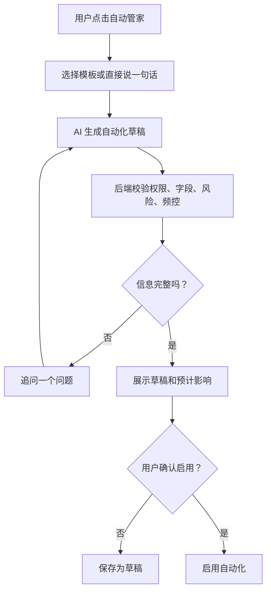
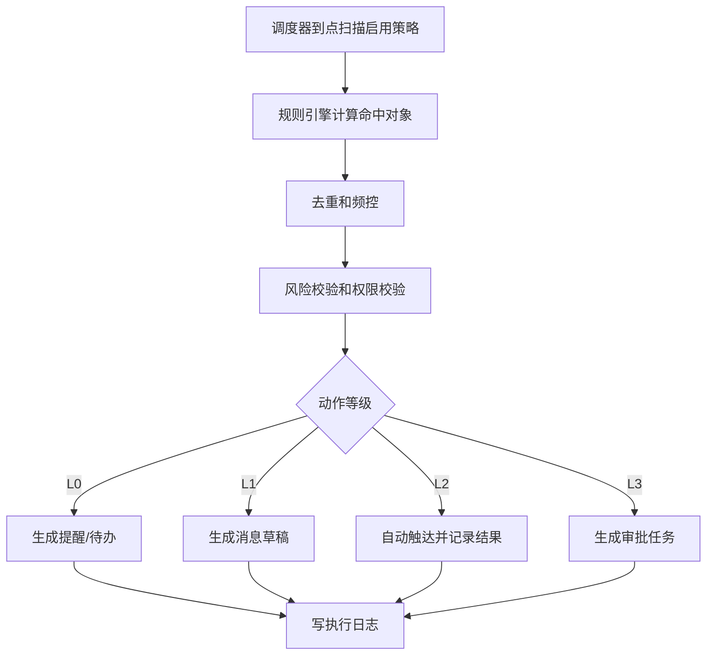

# Ami Aura Lite 美业定时业务自动化方案

版本：v1.0
日期：2026-06-03
适用范围：Ami Aura Lite 智能终端、Ami_Core 管理端、server-v2 AI Gateway / Marketing / Terminal 模块
目标用户：门店老板、店长、前台、美容师

## 1. 方案结论

建议在 Ami Aura Lite 智能终端新增“业务自动化助手”，内部代号可叫 **Ami 自动管家**。

它不是让美业从业人员去配置复杂的 cron、流程图或技术规则，而是让用户用美业日常语言创建自动化：

- “每天下班前提醒我看今日未收款和未完成服务。”
- “顾客护理后第 25 天，提醒她预约下次补水。”
- “次卡剩 1 次或 30 天内到期，自动生成跟进任务。”
- “预约前 2 小时提醒顾客，迟到 10 分钟提醒前台处理。”
- “库存低于 3 瓶时提醒店长补货。”
- “新客建档后第 3 天，让美容师回访使用感受。”

系统采用“AI 理解 + 规则落库 + 定时执行 + 人工确认 + 结果追踪”的模式。AI 负责把口语转成结构化自动化草稿，真正的定时判断、客户筛选、消息发送、任务生成、核销/订单等动作仍由 server-v2 的确定性服务执行。

核心原则：

1. AI 不直接改业务数据，只生成可审查的自动化配置。
2. 所有执行动作都走 Core API，并记录执行日志。
3. 涉及发消息、优惠、取消预约、扣次、收款等高风险动作必须有确认或审批。
4. 终端界面用美业话术和模板，不暴露技术字段。
5. 先做“提醒、待办、跟进、营销触达”四类低风险自动化，再逐步扩展到更复杂的经营编排。

## 2. 最新 AI 技术借鉴

### 2.1 结构化输出与工具调用

OpenAI Structured Outputs / function calling 的成熟方向是：让模型输出严格匹配 JSON Schema 的参数，再由业务系统决定是否执行工具。OpenAI 帮助文档也强调，开启 `strict: true` 后，函数参数会匹配提供的 JSON Schema；如果不能使用结构化输出，也应使用校验库和重试机制。

对 Ami 的启发：

- 让 AI 输出 `AutomationDraft`，而不是输出一段自由文本方案。
- 所有字段必须通过 Zod / class-validator 校验。
- 校验失败时回到“追问用户”，不要默默猜测。
- 不依赖模型直接执行动作，动作由后端自动化引擎执行。

### 2.2 Agent SDK、护栏与追踪

OpenAI Agents SDK 支持工具、handoff、guardrails 和 tracing。Guardrails 可在输入、输出和工具调用前后做检查；tracing 能记录 agent 运行、工具调用、交接等过程。

对 Ami 的启发：

- 使用“自动化创建 Agent”负责理解门店语言。
- 使用“业务规则校验器”作为护栏，检查权限、频控、金额、优惠、渠道、敏感字段。
- 每次 AI 生成、修改、启用、执行自动化都写 trace，方便回放和排障。
- 对店员展示“为什么这样推荐”，对技术侧保留完整审计。

### 2.3 MCP 的工具/资源标准化

Model Context Protocol 提供了让模型发现和调用外部工具、资源、提示词的开放规范。MCP 官方文档将服务端能力划分为 resources、prompts、tools；tools 可被模型根据上下文调用。

对 Ami 的启发：

- 暂不必一开始接入完整 MCP，但可以按 MCP 思路设计 Core 工具目录。
- 将客户搜索、预约查询、卡项查询、库存查询、任务创建、消息预览等能力抽象成权限化工具。
- 未来如果要连接企微、小程序、短信、财务、BI，可按统一工具目录扩展，避免每接一个渠道重写一套 AI 逻辑。

### 2.4 耐久工作流与人机协同

Temporal 文档强调 durable execution：流程可在崩溃、网络失败或基础设施故障后从中断处恢复。LangGraph 也提供持久化、人机中断、恢复执行等能力。

对 Ami 的启发：

- 美业自动化经常跨小时、跨天、跨月，不能只靠一次性 LLM 调用。
- 定时执行、重试、暂停、恢复、审批等待、失败补偿要由后端耐久工作流或任务调度承接。
- MVP 可先用 NestJS Schedule / BullMQ / 数据库任务表；后续复杂后可升级 Temporal。

## 3. 用户体验定位

### 3.1 功能名称

建议在终端中展示为：

- 一级入口：`自动管家`
- 创建入口：`新建自动提醒`
- 管理入口：`我的自动化`
- 执行记录：`今天自动完成了什么`

不建议在一线界面使用“Agent、Workflow、Cron、Function Calling”等技术词。

### 3.2 入口位置

智能终端不新增一个打断式的大入口。第一版建议把自动化入口放在 **店长问答输入区的发送按钮右侧**：

```text
[ 输入店长问题 / 业务指令 ]  [发送]  [定时图标]
```

交互含义：

- 点击 `发送`：按普通店长问答处理，系统即时回答。
- 点击 `定时图标`：把当前输入内容理解为“要创建一个自动化/定时业务”。
- 如果输入框为空，点击 `定时图标` 后打开“自动化一句话设置”输入态。
- 图标建议使用定时/闹钟/循环日程类图标，悬浮提示为 `设置自动提醒`。

这样设计的好处：

- 店长不用理解“自动化配置中心”，只需要在原本问问题的位置多点一下定时按钮。
- 同一句话可以有两种去向：即时问答或定时执行。
- 入口和 Codex 类自动化体验接近，但呈现为美业店长熟悉的“提醒/待办/定时安排”。

### 3.3 入口状态

店长问答输入区右侧按钮需要支持 4 种状态：

| 状态 | 展示 | 说明 |
| --- | --- | --- |
| 默认 | 定时图标 | 可创建自动化 |
| 草稿生成中 | loading | AI 正在把自然语言转成自动化草稿 |
| 信息待补充 | 定时图标 + 小红点 | 系统需要追问一个关键信息 |
| 已生成草稿 | 定时图标 + 高亮 | 点击可查看/启用刚生成的自动化草稿 |

### 3.4 自动化按钮交互补充

本次产品补充明确：自动化不是独立弹窗入口，也不是隐藏在设置页里的高级功能，而是跟随店长问答输入框使用。按钮固定放在 **店长问答发送按钮的右边**，用定时/闹钟图标表达“把这句话变成定时业务”。

标准交互：

1. 店长先在问答输入框输入自然语言，例如“每天 21 点提醒我看未收款订单”。
2. 如果点击 `发送`，系统按普通店长问答即时回答。
3. 如果点击发送按钮右侧的 `定时图标`，系统进入自动化创建流程，把当前输入解析为自动化草稿。
4. 如果系统能识别完整意图，就在问答区生成自动化草稿卡片，展示触发时间、对象范围、执行动作、频控和风险等级。
5. 如果缺少关键信息，系统不要求店长填复杂表单，而是在同一个问答区自然追问一个问题。
6. 店长回答追问后，系统继续补齐同一个自动化草稿，直到可预览、可修改、可启用。

空输入状态：

- 如果输入框为空，店长点击 `定时图标`，系统展示“自动化一句话设置”提示态，引导店长说出想定时处理的业务。
- 也可以同时展示“今天自动完成了什么”的摘要入口，让店长理解这个按钮既能新建自动化，也能查看自动化执行结果。

追问体验要求：

- 每次只追问一个最关键问题，例如时间、对象、动作三者缺一时优先追问时间。
- 追问语气要像店长助理，而不是配置表单，例如“你希望什么时候提醒？可以说每天 21:00、闭店前，或者护理后第 25 天。”
- 追问答案继续保留在当前上下文，不让用户重新输入完整需求。
- 补齐后必须回到草稿卡片，由用户点击 `启用` 后才真正落库生效。

验收标准：

- 店长问答输入框右侧可见 `发送` 与 `定时图标` 两个相邻按钮。
- 输入同一句话时，点击 `发送` 是即时问答，点击 `定时图标` 是创建自动化。
- 缺少时间、对象或动作时，系统会自然追问，不直接报错。
- 追问补齐后能生成可读草稿卡片，并支持启用、修改或取消。
- 高风险动作仍需要确认，不允许 AI 直接执行扣次、收款、取消预约等动作。

### 3.5 三类用户习惯

店长习惯：

- 关心经营结果、风险、员工跟进有没有落地。
- 更适合模板化配置和审批。
- 典型入口：每日经营提醒、沉睡客户唤醒、库存预警、员工待办。

前台习惯：

- 关心预约、到店、核销、收银、回访。
- 更适合“当天工作台自动提醒”。
- 典型入口：预约前提醒、迟到提醒、未核销提醒、收银后打印/回访。

美容师习惯：

- 关心客户护理周期、禁忌、皮肤状态、复购和下次预约。
- 更适合“服务后跟进”和“下次护理提醒”。
- 典型入口：护理后第 N 天回访、客户生日关怀、皮肤检测后建议跟进。

## 4. 核心产品形态

### 4.1 模板优先

第一版不要让用户从空白开始写规则。推荐提供 12 个美业模板：

| 分类 | 模板 | 默认规则 | 默认动作 |
| --- | --- | --- | --- |
| 预约 | 预约前提醒 | 预约前 2 小时 | 给顾客发提醒，前台可查看 |
| 预约 | 迟到提醒 | 超过预约时间 10 分钟未到店 | 提醒前台电话确认 |
| 预约 | 今日未确认预约 | 每日 09:00 | 生成前台确认清单 |
| 护理 | 护理周期提醒 | 服务完成后第 25 天 | 生成美容师回访任务 |
| 护理 | 术后/敏感肌跟进 | 服务后第 1/3/7 天 | 生成分阶段回访任务 |
| 会员 | 生日关怀 | 生日提前 7 天 | 发送祝福/优惠草稿 |
| 会员 | 沉睡客户唤醒 | 60 天未到店且无预约 | 生成店长跟进清单 |
| 卡项 | 次卡剩余提醒 | 剩余 1 次或 30 天内到期 | 生成续卡/使用提醒 |
| 收银 | 未收款提醒 | 每日 21:00 | 提醒店长核对未支付订单 |
| 库存 | 低库存提醒 | 低于安全库存 | 提醒店长补货 |
| 员工 | 服务未完成提醒 | 下班前仍未完成服务任务 | 提醒对应美容师 |
| 经营 | 每日收工报告 | 每日 21:30 | 汇总营业额、到店、风险 |

### 4.2 口语创建

用户可以直接说或输入：

> “帮我设置一个自动提醒，顾客做完补水项目 25 天后，让美容师提醒她约下次护理。”

终端生成可读草稿：

```text
自动化名称：补水护理周期提醒
触发对象：做过补水类项目的顾客
触发时间：服务完成后第 25 天上午 10:00
执行动作：给负责美容师生成回访任务
任务内容：提醒顾客预约下次补水护理
频控：同一顾客 30 天内最多提醒 1 次
需要确认：首次启用前由店长确认
```

用户只需要点：

- `启用`
- `修改时间`
- `修改话术`
- `先预览命中顾客`

### 4.3 支持追问

当用户点击店长问答发送按钮右侧的 `定时图标` 后，系统先尝试生成自动化草稿。如果缺少关键信息，不直接失败，也不默认猜测，而是在问答区内追问一个最关键问题。

示例 1：缺少触发时间

```text
店长输入：提醒我看未收款订单
点击：定时图标

系统追问：你希望什么时候提醒？可以选“每天 21:00”“每天闭店前”或直接输入时间。
```

示例 2：缺少执行对象

```text
店长输入：护理后提醒顾客约下次
点击：定时图标

系统追问：要针对哪些护理项目？例如“补水类项目”“所有面部护理”或指定项目。
```

示例 3：缺少动作方式

```text
店长输入：次卡快到期的时候处理一下
点击：定时图标

系统追问：你希望系统怎么处理？生成前台待办、生成消息草稿，还是自动发送提醒？
```

追问规则：

- 每次只追问一个问题，避免让店长像填复杂表单。
- 追问答案继续留在同一个问答上下文里。
- 补齐信息后立刻生成自动化草稿卡片。
- 高风险动作仍进入确认或审批，不因自然语言补齐而自动启用。

### 4.4 三段式配置

所有自动化统一成三段：

```text
什么时候触发？
对哪些顾客/订单/预约/库存触发？
触发后做什么？
```

界面文案示例：

```text
当：顾客护理完成后第 25 天
如果：顾客最近没有预约
就：提醒美容师回访，并推荐下次护理话术
```

这比“条件组、动作节点、cron 表达式”更符合门店人员习惯。

## 5. 自动化能力分级

### 5.1 L0 仅提醒

最低风险，适合 MVP：

- 生成终端提醒卡片
- 生成员工待办
- 每日经营摘要
- 库存/预约/服务异常提醒

特点：不主动触达顾客，不改变订单、卡项、预约。

### 5.2 L1 生成草稿

中低风险：

- 生成短信/企微/小程序消息草稿
- 生成营销活动草稿
- 生成回访话术
- 生成优惠建议

特点：需要员工点击确认后发送。

### 5.3 L2 自动触达

中风险：

- 自动发送预约提醒
- 自动发送生日祝福
- 自动发送护理周期提醒
- 自动发送卡项到期提醒

特点：必须有频控、退订、敏感词、渠道权限和执行日志。

### 5.4 L3 高风险业务动作

第一版不建议自动执行：

- 自动取消预约
- 自动扣次/核销
- 自动创建收款订单
- 自动发放大额优惠
- 自动修改客户重要资料

这些动作可以“自动发现 + 生成待办 + 人工确认”，不能直接自动完成。

## 6. MVP 推荐范围

### 6.1 P0：先做 6 个模板

第一阶段建议只做高频、低风险、容易验收的模板：

1. 预约前提醒
2. 迟到提醒
3. 护理周期回访
4. 次卡剩余/到期提醒
5. 低库存提醒
6. 每日收工报告

这些模板能覆盖前台、美容师、店长三类角色，并且复用当前 Terminal API 与 Marketing 自动化规则基础。

### 6.2 P1：扩展营销和经营

1. 生日关怀
2. 沉睡客户唤醒
3. 新客建档后跟进
4. 敏感肌分阶段跟进
5. 今日未确认预约清单
6. 服务未完成提醒

### 6.3 P2：更智能的编排

1. 根据皮肤检测结果自动推荐跟进计划
2. 根据消费画像生成复购提醒
3. 根据节假日自动生成活动草稿
4. 店长用自然语言组合多个条件
5. 多渠道触达效果自动归因

## 7. 关键交互流程

### 7.1 新建自动化



### 7.2 执行自动化



### 7.3 查看执行结果

终端展示不要做复杂报表，建议用“今天自动完成了什么”：

```text
今天自动管家已处理 18 件事

已提醒顾客：8 人
已生成员工待办：6 条
需店长确认：2 条
失败待处理：1 条

重点提醒：
1. 王女士次卡剩 1 次，建议前台引导续卡。
2. 李女士预约已迟到 12 分钟，建议电话确认。
3. 水光精华库存剩 2 瓶，建议补货。
```

## 8. 数据结构建议

### 8.1 AutomationStrategy

```ts
interface AutomationStrategy {
  id: string;
  storeId: string;
  name: string;
  description?: string;
  templateCode?: string;
  status: 'draft' | 'enabled' | 'paused' | 'archived';
  ownerRole: 'manager' | 'reception' | 'beautician';
  trigger: AutomationTrigger;
  audience: AutomationAudience;
  conditions: AutomationCondition[];
  actions: AutomationAction[];
  riskLevel: 'low' | 'medium' | 'high';
  approvalMode: 'none' | 'first_enable' | 'every_execution' | 'manager_only';
  frequencyCap: FrequencyCap;
  createdBy: string;
  createdAt: string;
  updatedAt: string;
}
```

### 8.2 AutomationDraft

AI 只允许生成草稿：

```ts
interface AutomationDraft {
  name: string;
  userFacingSummary: string;
  templateCode?: string;
  trigger: AutomationTrigger;
  audience: AutomationAudience;
  conditions: AutomationCondition[];
  actions: AutomationAction[];
  missingFields: string[];
  questions: string[];
  riskLevel: 'low' | 'medium' | 'high';
  confidence: number;
}
```

### 8.3 AutomationExecution

```ts
interface AutomationExecution {
  id: string;
  strategyId: string;
  storeId: string;
  scheduledAt: string;
  startedAt?: string;
  finishedAt?: string;
  status: 'pending' | 'running' | 'success' | 'failed' | 'partial_success' | 'cancelled';
  matchedCount: number;
  actionCount: number;
  successCount: number;
  failureCount: number;
  errorSummary?: string;
  traceId?: string;
}
```

### 8.4 AutomationTouch

用于记录每个顾客/预约/库存项的处理结果：

```ts
interface AutomationTouch {
  id: string;
  executionId: string;
  targetType: 'customer' | 'reservation' | 'card' | 'order' | 'inventory' | 'employee';
  targetId: string;
  actionType: 'reminder' | 'task' | 'message_draft' | 'message_send' | 'approval';
  channel?: 'terminal' | 'sms' | 'wechat' | 'miniapp' | 'staff_task';
  status: 'success' | 'failed' | 'skipped' | 'waiting_approval';
  skipReason?: string;
  resultSummary?: string;
  createdAt: string;
}
```

## 9. API 建议

新增到 `packages/server-v2/src/automation` 或并入 `marketing/automation` 后扩展终端入口。

| Method | Path | 说明 |
| --- | --- | --- |
| GET | `/terminal/automations/templates` | 获取终端可用自动化模板 |
| POST | `/terminal/automations/draft` | 根据自然语言或模板生成草稿 |
| POST | `/terminal/automations/preview` | 预览命中对象、风险、预计动作 |
| POST | `/terminal/automations` | 创建自动化策略 |
| GET | `/terminal/automations` | 获取当前门店自动化列表 |
| PATCH | `/terminal/automations/{id}` | 修改自动化 |
| POST | `/terminal/automations/{id}/enable` | 启用 |
| POST | `/terminal/automations/{id}/pause` | 暂停 |
| POST | `/terminal/automations/{id}/run-once` | 手动执行一次 |
| GET | `/terminal/automations/executions/today` | 查看今日执行摘要 |
| GET | `/terminal/automations/executions/{id}` | 查看执行详情 |
| POST | `/terminal/automations/approvals/{id}/approve` | 审批通过 |
| POST | `/terminal/automations/approvals/{id}/reject` | 审批拒绝 |

## 10. AI Gateway 设计

### 10.1 Agent 分工

MVP 不需要多 Agent 炫技，建议控制在 3 个角色：

| Agent | 职责 | 是否可调用写接口 |
| --- | --- | --- |
| 自动化理解 Agent | 将用户口语转成 AutomationDraft | 否 |
| 规则校验 Agent/服务 | 检查字段、权限、风险、频控、合规 | 否 |
| 话术生成 Agent | 生成顾客提醒、回访话术、员工待办文案 | 否 |

写入策略、发送消息、生成待办、创建审批等动作全部由后端服务完成。

### 10.2 Prompt 约束

系统提示词核心约束：

```text
你是 Ami 美业自动化助手。
你只能把用户意图转成自动化草稿，不能声称已经启用、发送、扣次、收款或取消预约。
你必须使用门店员工能理解的中文业务语言。
当缺少触发时间、对象范围或动作时，只追问一个最关键问题。
涉及发消息、优惠、扣次、收款、取消预约时，必须标记更高风险等级。
输出必须匹配 AutomationDraft JSON Schema。
```

### 10.3 校验与重试

每次 AI 输出后执行：

1. JSON Schema 校验。
2. 业务枚举校验：模板、触发器、动作必须存在。
3. 权限校验：当前角色能否创建该类自动化。
4. 风险校验：是否需要店长确认。
5. 频控校验：是否超过默认触达限制。
6. 敏感信息校验：不允许在话术中暴露隐私字段。

校验失败时，不启用策略，只生成追问或修正建议。

## 11. 风险控制

### 11.1 频控

默认建议：

- 同一顾客同一策略 7 天最多触达 1 次。
- 同一顾客同一渠道每天最多触达 1 次。
- 预约提醒类不受 7 天限制，但同一预约最多提醒 2 次。
- 生日关怀每年最多 1 次。
- 护理周期提醒按服务项目周期单独计算。

### 11.2 审批

必须店长审批的情况：

- 自动发送营销消息给超过 50 人。
- 优惠金额超过门店阈值。
- 使用“沉睡客户唤醒”等可能打扰顾客的策略。
- 修改默认频控。
- 首次启用外部渠道，如短信、企微、小程序。

### 11.3 审计

每条自动化记录：

- 谁创建
- 谁启用
- AI 原始输入
- AI 结构化草稿
- 用户最终修改
- 每次执行时间
- 命中对象数量
- 触达/待办/审批结果
- 失败原因

## 12. 与现有系统的关系

当前仓库已经有 `docs/marketing-trigger-rules-requirements.md`，其中覆盖了生日、节假日、护理周期、卡项到期、沉睡客户、消费金额、会员等级、肤质等规则。新功能不应推翻这套规则，而是把它包装成终端可用的“自然语言 + 模板化自动化”。

建议分工：

- 管理端：复杂策略管理、效果分析、渠道配置、审批规则。
- 智能终端：创建轻量自动化、查看今日执行、处理待确认事项。
- server-v2：规则计算、调度执行、AI Gateway、日志审计、权限校验。

## 13. 实施计划

### 第 1 周：产品与数据结构

- 定义 6 个 P0 模板。
- 定义 `AutomationStrategy / AutomationExecution / AutomationTouch`。
- 梳理角色权限和风险等级。
- 输出终端交互原型。

### 第 2-3 周：后端 MVP

- 新增自动化策略表、执行表、触达记录表。
- 实现模板列表、创建、启用、暂停、预览。
- 实现 P0 规则计算。
- 实现提醒/待办动作。
- 实现执行日志。

### 第 4 周：AI 草稿生成

- 接入 AI Gateway 的自动化草稿生成。
- 接入结构化输出校验。
- 接入缺失字段追问。
- 接入话术生成。

### 第 5 周：终端界面

- 新增“自动管家”入口。
- 新增模板创建流程。
- 新增口语创建流程。
- 新增今日执行摘要。
- 新增待确认事项处理。

### 第 6 周：验证与演示

- 门店模拟数据验证。
- 跑通预约、护理、卡项、库存、收工报告 5 类场景。
- 增加单测和核心 E2E。
- 准备演示脚本。

## 14. 验收标准

1. 店员能在终端通过模板创建自动化，无需理解技术规则。
2. 店员能通过一句话生成自动化草稿，并能修改时间、对象、动作。
3. 系统能预览预计命中对象数量和风险等级。
4. P0 六个模板能按计划生成提醒/待办/摘要。
5. 所有执行都有日志，可查看成功、失败、跳过原因。
6. 高频触达不会重复打扰同一顾客。
7. 高风险动作不会绕过人工确认。
8. AI 输出异常不会导致策略被错误启用。

## 15. 推荐 Demo 脚本

### 脚本 1：美容师护理周期提醒

用户说：

```text
帮我设置一个补水护理回访，顾客做完补水 25 天后提醒美容师联系她约下次。
```

系统展示：

```text
已生成自动化草稿：补水护理周期提醒
当顾客完成补水类服务后第 25 天上午 10:00，
如果她还没有下次预约，
就给负责美容师生成回访任务。
同一顾客 30 天内最多提醒 1 次。
```

用户点击 `启用`。

### 脚本 2：前台预约迟到提醒

用户选择模板 `迟到提醒`。

系统展示：

```text
当顾客超过预约时间 10 分钟仍未到店，
提醒前台电话确认，并在今日预约卡片标记“需跟进”。
```

用户把 10 分钟改成 15 分钟，点击启用。

### 脚本 3：店长每日收工报告

用户说：

```text
每天晚上 9 点半给我看一下今天没收款、没完成服务和低库存。
```

系统展示：

```text
已生成自动化草稿：每日收工检查
每天 21:30 汇总：
1. 未支付订单
2. 未完成服务任务
3. 低库存商品
执行动作：生成店长提醒卡片
风险等级：低
```

## 16. 参考资料

- OpenAI Agents SDK：<https://platform.openai.com/docs/guides/agents-sdk/>
- OpenAI Agents SDK Guardrails：<https://openai.github.io/openai-agents-js/guides/guardrails>
- OpenAI Function Calling Help Center：<https://help.openai.com/en/articles/8555517-function-calling-in-the-openai-api>
- OpenAI Structured Outputs：<https://platform.openai.com/docs/guides/structured-outputs>
- Model Context Protocol Specification：<https://modelcontextprotocol.io/specification/latest>
- MCP Tools Specification：<https://modelcontextprotocol.io/specification/2025-06-18/server/tools>
- Temporal Documentation：<https://docs.temporal.io/>
- LangGraph Human-in-the-loop：<https://docs.langchain.com/oss/python/langgraph/human-in-the-loop>
- LangGraph Persistence：<https://langchain-5e9cc07a.mintlify.app/oss/python/langgraph/persistence>
