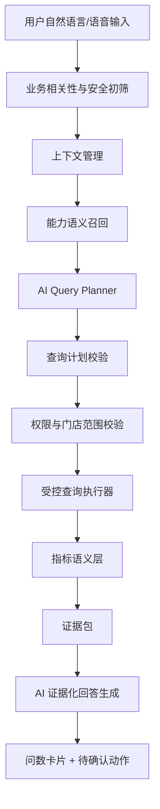

# Ami 智能问答架构方案比选

更新时间：2026-06-16

## 1. 背景与问题

当前 Ami Aura Lite 智能终端已具备 `business.query` 问数入口和一批受控查询能力，但从实际体验看，用户自然语言输入仍然不稳定。

典型问题：

> 用户问：有哪些商品适合做活动
>
> 系统返回：请说明想查询的业务领域，例如商品、项目、客户、排班、订单、卡项、财务、库存或者营销。

这个结果说明当前架构存在根本问题：系统能识别到“商品”领域，但无法理解用户真正的经营意图是“找营销机会/活动候选商品”。如果继续按一句话补一个规则，会变成无穷补丁，无法支撑真实门店随机语音问答。

## 2. 当前架构主要缺陷

### 2.1 前端规则过早拦截

当前终端侧会先通过关键词判断是否进入 `business.query`、客户查询、快捷模块或固定卡片。这种方式对短句、口语、模糊表达很脆弱。

例如：

- “最近哪些产品可以推一下”
- “有什么东西适合搞活动”
- “哪些商品可以清一清”
- “有没有能拿来做会员权益的品”

这些问题业务上接近，但关键词分布不同，前端规则很难稳定覆盖。

### 2.2 后端问数规划仍是硬编码分支

后端当前通过 `detectDomain()` 和 `detectCapability()` 判断领域和能力，本质仍是正则分流。

问题：

- 只能覆盖已写入关键词的问法。
- 用户意图往往跨领域，例如“适合做活动的商品”同时涉及商品、库存、销量、营销。
- 缺少“能力召回与评分”机制，无法从多个候选能力里选择最合适的一个。
- 不具备追问能力，例如用户继续问“为什么推荐这几个”“帮我按库存风险排序”。

### 2.3 缺少语义层

系统目前直接把自然语言映射到查询函数，没有统一的指标、维度、筛选条件、业务口径语义层。

结果是：

- “收入”“营收”“流水”“实收”容易混淆。
- “客户增长”“增长客户”“可增长客户”含义不同，但容易被混到一起。
- “适合做活动”不是单个表字段，而是组合判断：库存、销量、临期、毛利、客群、营销响应。

### 2.4 大模型没有进入正确位置

当前系统没有把大模型用于“语义理解和查询规划”，而是主要靠规则判断。另一方面，也不能简单让大模型直接查数据库或自由回答，因为会带来幻觉、越权、全表扫描和口径不一致。

正确位置应是：

- 大模型负责理解问题、生成受控查询计划、解释结果。
- 数据查询必须由受控工具、指标语义层和权限系统执行。

## 3. 目标架构原则

智能问答不应定位为“聊天机器人直接查数据库”，而应定位为：

> 自然语言入口 + 业务语义层 + 受控数据工具 + 证据化回答 + 可确认动作。

必须满足：

1. 不穷举用户问法。
2. 不让 AI 自由编造经营结论。
3. 不一次性读取所有数据。
4. 不让模型直接生成任意 SQL 上库执行。
5. 所有回答必须有数据依据、时间范围、口径和限制。
6. 涉及创建活动、补货、触达客户等动作必须二次确认。
7. 权限和门店范围必须在工具层强制执行，不能只靠提示词。

## 4. 方案比选

### 方案 A：继续补规则和能力关键词

说明：

继续在前端 `ruleIntentParser` 和后端 `detectCapability` 中补关键词、补 capability。例如为“适合做活动”新增 `marketing_opportunity_discovery`。

优点：

- 实现最快。
- 对固定演示问题有效。
- 风险低，不需要依赖大模型稳定性。

缺点：

- 无法覆盖真实自然语言随机表达。
- 每出现一种新问法就要补规则。
- 跨领域问题越来越难维护。
- 用户会感觉“不智能”。

适用场景：

- 只适合短期兜底、少量高频固定问题。

结论：

不建议作为主架构，只能作为兜底层。

### 方案 B：LLM 意图规划器 + 受控能力目录

说明：

把用户自然语言先交给大模型做“查询规划”，输出结构化 JSON：

```json
{
  "intentType": "business_query",
  "domainCandidates": ["product", "marketing", "inventory"],
  "capability": "marketing_opportunity_discovery",
  "metrics": ["stockRisk", "salesTrend", "grossMargin", "marketingFitScore"],
  "dimensions": ["product"],
  "filters": {
    "storeScope": "current_store",
    "dateRange": "last_30_days"
  },
  "confidence": 0.82,
  "clarificationNeeded": false
}
```

后端只接受 JSON 中命中的已注册 capability，不允许模型直接执行 SQL。真正查询仍由后端受控服务执行。

优点：

- 能理解更随机的自然语言。
- 用户问法不需要穷举。
- 可以支持跨领域意图，例如商品 + 库存 + 营销。
- 能自然支持追问和上下文。

缺点：

- 需要维护高质量 prompt、能力目录和 JSON schema。
- 模型可能输出不存在的 capability，需要严格校验。
- 本地 mock 或模型不可用时需要降级策略。

适用场景：

- 智能终端自然语言问答主入口。
- 店长、前台、美容师不同角色的经营问数。

结论：

建议作为近期主方案，但必须配套能力校验、权限校验和兜底解析。

### 方案 C：语义检索能力路由 + 受控查询 DSL

说明：

为每个问数能力维护标准描述、同义表达、典型问题、可用指标、可用维度。用户问题先做向量检索或语义匹配，召回 top N 能力，再用轻量模型或规则评分选择 capability，最后生成受控查询 DSL。

能力示例：

```json
{
  "capability": "marketing_opportunity_discovery",
  "description": "发现适合做活动、清库存、推会员权益或做搭售的商品/项目",
  "examples": [
    "有哪些商品适合做活动",
    "最近哪些产品可以推一下",
    "库存里有没有适合清的商品",
    "哪些项目适合做低峰活动"
  ],
  "requiredMetrics": ["stock", "sales", "margin", "expiryRisk"],
  "allowedDimensions": ["product", "project", "customerSegment"]
}
```

优点：

- 比纯规则灵活。
- 比完全依赖大模型更可控。
- 能通过维护能力描述持续提升命中率。
- 适合能力数量逐步增加的系统。

缺点：

- 需要引入 embedding 或语义相似度能力。
- 仍需要一个 planner 处理复杂组合条件和追问。
- 对非常开放的问题，单靠能力检索仍不够。

适用场景：

- 中期问数能力目录扩张。
- 多领域、多角色、多问法的稳定路由。

结论：

建议作为方案 B 的增强层。B 负责规划，C 负责能力召回和校验。

### 方案 D：Text-to-SQL Agent + 语义层 + SQL 沙箱

说明：

让大模型根据数据库 schema 和业务语义层生成 SQL，但 SQL 必须进入沙箱校验：

- 只允许 SELECT。
- 必须带 storeId 和权限范围。
- 禁止全表扫描。
- 限制行数和执行时间。
- 字段、表、JOIN 必须在白名单内。
- 查询前做 explain 或静态分析。

优点：

- 覆盖面最广。
- 对未预置 capability 的新问题适应能力强。
- 更接近成熟 BI Copilot。

缺点：

- 安全风险高。
- 业务口径容易不一致。
- 对数据库性能有压力。
- 对 prompt、schema 注释、SQL 校验、权限沙箱要求很高。
- 对当前阶段成本较大。

适用场景：

- 管理端高级分析。
- 内部运营人员探索式问数。
- 后续 BI/数据分析产品化。

结论：

不建议直接用于当前智能终端主链路。可作为中长期增强能力，并限制在只读、低风险、管理端权限下。

### 方案 E：完整经营 Agent 编排平台

说明：

将 Ami 问答升级为经营 Agent，包含：

- 意图理解。
- 数据查询。
- 推荐生成。
- 活动草稿。
- 客户跟进。
- 自动化策略。
- 结果复盘。
- 多轮任务状态管理。

用户可以说：

> 看看最近有什么适合做活动的机会，帮我列三种方案，先不要发布。

系统自动完成：

1. 查询商品、项目、客户、库存、排班、营销效果。
2. 找机会。
3. 生成活动方案。
4. 等用户确认后创建草稿。
5. 后续跟踪活动效果。

优点：

- 用户体验最好。
- 能从问答走向动作闭环。
- 符合 Ami 数字员工方向。

缺点：

- 工程复杂度最高。
- 需要稳定的工具注册、权限、任务状态、审计、回滚和人工确认机制。
- 当前数据口径和工具层还不够成熟，直接上会不稳定。

适用场景：

- 中长期产品目标。
- 在 B/C/D 基础能力成熟后建设。

结论：

作为目标形态，不适合作为当前第一步。

## 5. 推荐方案

建议采用：

> 方案 B + 方案 C 的混合架构，保留方案 A 作为兜底，暂不直接上方案 D。

即：

1. 前端不再试图理解所有自然语言，只做低风险业务相关性判断。
2. 后端建立 AI Query Planner。
3. Planner 结合能力目录、语义召回和角色权限，生成受控查询计划。
4. Query Executor 只执行注册过的能力和指标。
5. Answer Composer 基于查询结果和证据生成自然语言回答。
6. 动作类建议只返回待确认动作，不自动执行。

## 6. 推荐目标架构



### 6.1 业务相关性与安全初筛

职责：

- 判断是否属于门店经营、美业服务、客户、订单、库存、营销、排班等业务范围。
- 屏蔽天气、闲聊、代码、娱乐等明显无关问题。
- 不负责精细判断 capability。

### 6.2 上下文管理

职责：

- 记录上一轮查询计划、结果摘要、实体 ID。
- 支持追问：
  - “这些商品库存够吗”
  - “为什么推荐它们”
  - “换成近 90 天”
  - “只看高端会员”

上下文只保存摘要和 ID，不把全量数据塞给模型。

### 6.3 能力语义召回

职责：

- 从能力目录中召回候选 capability。
- 每个 capability 包含：
  - 名称
  - 业务说明
  - 示例问法
  - 同义词
  - 可用角色
  - 可用指标
  - 可用维度
  - 查询成本
  - 风险等级

### 6.4 AI Query Planner

职责：

把自然语言转成结构化计划：

```json
{
  "intentType": "query",
  "capability": "marketing_opportunity_discovery",
  "confidence": 0.84,
  "domainCandidates": ["marketing", "product", "inventory"],
  "metrics": ["marketingFitScore", "stockRisk", "salesTrend"],
  "dimensions": ["product"],
  "filters": {
    "dateRange": "last_30_days",
    "storeScope": "current_store"
  },
  "clarificationNeeded": false,
  "clarificationQuestion": null
}
```

约束：

- 只能选择能力目录中存在的 capability。
- 不能生成 SQL。
- 不能请求未授权字段。
- 低置信度必须返回澄清问题。

### 6.5 查询计划校验

职责：

- 校验 capability 是否存在。
- 校验角色是否允许。
- 校验 dateRange、limit、dimensions 是否合规。
- 自动补充 storeId、operatorId。
- 控制最大扫描范围。

### 6.6 指标语义层

职责：

统一经营指标口径：

- 销量 = 已支付/已完成订单中商品明细数量。
- 收入 = 未取消/未退款订单实收或订单金额，需要区分口径。
- 活动转化 = 活动页、自动化、推荐事件的归因转化。
- 适合做活动 = 库存风险、临期风险、销量趋势、毛利空间、客群匹配、营销响应综合评分。

### 6.7 受控查询执行器

职责：

- 每个 capability 对应一个受控查询函数或查询模板。
- 只查询所需表和字段。
- 必须带门店和权限范围。
- 必须限制数据量。
- 返回结构化结果和 evidence。

### 6.8 证据化回答生成

职责：

- 基于 evidence 和 result 生成自然语言回答。
- 不允许新增没有数据依据的事实。
- 必须说明：
  - 统计周期
  - 数据来源
  - 关键口径
  - 样本量
  - 限制条件

## 7. 能力目录设计

建议把问数能力拆成四类。

### 7.1 查询类

回答“发生了什么”。

示例：

- 今天收入怎么样
- 最近哪些商品卖得好
- 今日预约情况
- 哪些客户很久没来了

### 7.2 分析类

回答“为什么/趋势如何”。

示例：

- 哪些商品销量下滑
- 哪些项目毛利偏低
- 为什么本周预约少
- 哪些活动转化不好

### 7.3 建议类

回答“应该做什么”。

示例：

- 有哪些商品适合做活动
- 哪些客户适合邀约
- 哪些项目适合低峰活动
- 哪些商品该补货

### 7.4 动作类

回答后可进入确认动作。

示例：

- 为这些商品生成活动草稿
- 给这些客户生成跟进任务
- 根据建议生成补货单草稿

动作类必须二次确认。

## 8. 针对“有哪些商品适合做活动”的正确处理

这句话不应该匹配到 `unsupported`，也不应该简单匹配成 `marketing_conversion`。

正确意图：

```json
{
  "capability": "marketing_opportunity_discovery",
  "domainCandidates": ["marketing", "product", "inventory"],
  "metrics": [
    "currentStock",
    "safetyStock",
    "salesQuantity",
    "growthRate",
    "expiryRisk",
    "grossMargin",
    "marketingFitScore"
  ],
  "dimensions": ["product"],
  "dateRange": "last_30_days"
}
```

回答应类似：

> 近 30 天有 3 类商品适合做活动：库存压力型、销量增长型、会员搭售型。优先推荐补水精华，因为库存高于安全库存 18 件，近 30 天销量增长 42%，适合做会员专属搭售；玻尿酸面膜库存充足但增长放缓，适合做满赠；舒缓修护霜临期风险较高，只建议做顾问定向邀约，不建议公开大促。

并展示数据依据：

- Product
- StockBatch
- OrderItem
- ProductOrder
- Customer/CustomerProfile 可选
- MarketingAttribution 可选

## 9. 方案落地建议

### 阶段 1：架构收敛，2-3 天

目标：

- 前端只判断是否业务相关，不再复杂判断 capability。
- 后端新增 `QueryPlanner`：
  - 输入：question、role、storeId、context
  - 输出：BusinessQueryPlan
- 能力目录增加 examples、synonyms、metrics、dimensions、riskLevel。
- 现有 `detectDomain/detectCapability` 降级为 fallback，不作为主路径。

交付：

- `BusinessQueryPlannerService`
- `BusinessQueryCapabilityCatalog`
- planner 单测覆盖 30-50 个自然语言问法

### 阶段 2：接入 LLM Planner，3-5 天

目标：

- 使用现有 `AiService` 调用大模型生成 JSON 查询计划。
- 引入严格 schema 校验。
- 模型失败时走语义召回/规则 fallback。
- 低置信度返回澄清问题。

交付：

- `POST /api/business-query/resolve`
- LLM prompt template
- JSON schema validator
- planner audit log

### 阶段 3：建设指标语义层，5-7 天

目标：

- 抽象 Metric Registry：
  - revenue
  - paidOrderCount
  - productSalesQuantity
  - stockGap
  - churnRiskScore
  - marketingConversionRate
  - marketingFitScore
- 每个指标绑定口径、表、过滤条件、权限要求。

交付：

- `MetricRegistry`
- `DimensionRegistry`
- 查询模板和查询成本控制

### 阶段 4：开放建议类能力，3-5 天

目标：

- 新增 `marketing_opportunity_discovery`
- 新增 `customer_invitation_opportunity`
- 新增 `project_idle_campaign_opportunity`
- 新增 `product_clearance_opportunity`

交付：

- 问数卡片展示建议、理由、风险、下一步动作。
- 支持“为什么推荐”“按风险排序”“生成活动草稿”等追问。

### 阶段 5：中长期 Agent 化

目标：

- 多轮任务状态。
- 从问数到活动草稿、客户跟进、补货草稿。
- 执行结果复盘。
- 管理端配置能力目录和指标口径。

## 10. 最终建议

不建议继续按用户问法补规则。

建议采用：

```text
短期：前端放宽入口 + 后端 Planner + 能力目录语义召回
中期：LLM Query Planner + 指标语义层 + 受控查询执行
长期：经营 Agent 编排平台
```

当前最合理的下一步不是修“有哪些商品适合做活动”这一句，而是先重构问数路由架构：

1. 新增 `BusinessQueryPlannerService`。
2. 把 capability 从硬编码 if/else 迁移到能力目录评分。
3. 接入大模型只做查询规划，不直接查库。
4. 查询仍走受控 executor。
5. 补一个建议类能力 `marketing_opportunity_discovery`，作为第一个验证样板。

这样才能支撑真实门店里随机、口语化、跨领域的智能问答。
