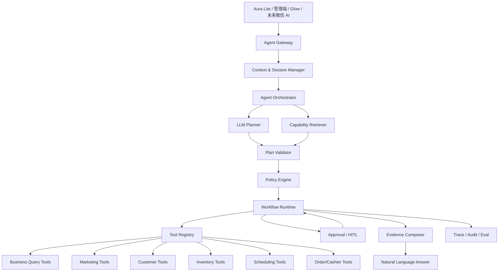
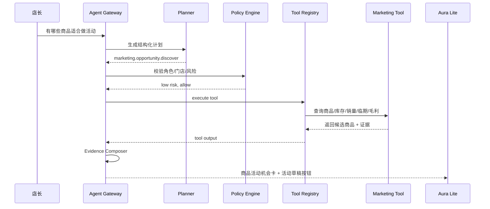

# Ami 经营 Agent 编排平台技术方案

更新时间：2026-06-16

## 1. 方案定位

本文面向 Ami 当前智能终端和管理端的下一阶段演进：从“问数 + 微应用 + 固定动作卡”升级为“经营 Agent 编排平台”。

核心目标不是做一个能聊天的机器人，而是做一个能稳定完成美业门店经营任务的 Agent 工作台：

- 能理解随机、口语化、多轮的经营问题。
- 能按权限查询真实业务数据。
- 能给出有证据的经营建议。
- 能生成活动、跟进、补货、预约等草稿。
- 高风险动作必须人工确认。
- 全过程可追踪、可复盘、可评估。

## 2. 行业落地模式参考

### 2.1 OpenAI Agents SDK：代码拥有编排，模型负责推理

OpenAI 当前推荐的落地方向是：当应用需要自己管理编排、工具执行、审批和状态时，使用 Agents SDK；简单的一次模型调用加工具可用 Responses API。OpenAI 文档将 Agent 定义为能规划、调用工具、协作并保持足够状态完成多步骤工作的应用。

对 Ami 的启发：

- 不应让大模型直接控制数据库或业务写接口。
- 应由后端代码掌握 Agent runtime、tool registry、approval、state。
- 大模型只输出结构化计划、工具调用意图和基于证据的回答。

参考：

- OpenAI Agents SDK：<https://developers.openai.com/api/docs/guides/agents>
- OpenAI MCP and Connectors：<https://developers.openai.com/api/docs/guides/tools-connectors-mcp>

### 2.2 MCP：工具标准化，而不是页面自动化

MCP 的核心价值是让外部系统以工具形式暴露给模型，工具有名称、描述和输入 schema，可被模型发现和调用。

对 Ami 的启发：

- Ami 不需要一开始接完整 MCP，但内部 Tool Registry 应按 MCP 思路设计。
- 每个业务能力都应是稳定工具，而不是让 Agent 点击管理后台页面。
- 工具必须有 schema、权限、风险等级、审计字段和幂等策略。

参考：

- MCP Tools Specification：<https://modelcontextprotocol.io/specification/2025-06-18/server/tools>

### 2.3 Salesforce Agentforce：企业 Agent 必须有生命周期、上下文和护栏

Salesforce Agentforce 强调完整生命周期管理、Intelligent Context、Agent Script、Atlas Reasoning Engine 和 guardrails。特别值得借鉴的是“确定性流程 + LLM 弹性推理”的混合模式。

对 Ami 的启发：

- 门店经营不能完全交给 LLM 自由决定。
- 固定业务逻辑必须顺序执行，例如权限、门店范围、库存校验、活动审批。
- LLM 适合处理口语理解、方案生成、解释和复杂建议排序。
- 管理端必须提供配置、测试、监督和复盘视图。

参考：

- Salesforce Agentforce：<https://www.salesforce.com/agentforce/>

### 2.4 Microsoft Copilot Studio：触发器 + 自主任务 + Activity 可见性

Microsoft Copilot Studio 已将 autonomous agents、trigger、agent flows、generative orchestration、MCP 等能力产品化。其重点不是只做聊天，而是让 agent 监听事件并执行一组受控动作，同时保留 Activity 可见性。

对 Ami 的启发：

- Agent 不能只响应用户提问，还要能响应经营事件。
- 例如：库存低于安全线、客户 60 天未到店、活动转化异常、今日排班空档。
- 自动任务必须有活动日志、失败原因、人工接管入口。

参考：

- Microsoft Copilot Studio March 2025 updates：<https://www.microsoft.com/en-us/microsoft-copilot/blog/copilot-studio/whats-new-in-copilot-studio-march-2025/>

### 2.5 LangGraph/HITL：可暂停、可审批、可恢复

LangGraph 的 Human-in-the-Loop 模式强调：当工具调用涉及写操作、SQL 或高风险动作时，系统可以中断执行，保存状态，等待人工 approve/edit/reject/respond 后继续。

对 Ami 的启发：

- 创建营销活动、批量触达客户、生成补货单、调整排班都必须支持暂停审批。
- AgentRun 必须可持久化，不能依赖一次 HTTP 请求完成所有步骤。
- 用户改写方案后，Agent 应从同一任务状态继续，而不是重新开始。

参考：

- LangChain Human-in-the-loop：<https://docs.langchain.com/oss/python/langchain/human-in-the-loop>

### 2.6 Google A2A：跨系统 Agent 协作是后续生态，不是当前 P0

Google A2A 的定位是让不同厂商、不同框架的 agent 能互相发现、通信和协作。它对长期生态重要，但当前 Ami 主要问题是内部工具化、权限、状态和审批还不完整。

对 Ami 的启发：

- P0 不做 A2A。
- 先把 Ami Core 能力工具化，未来再考虑让外部供应链、财务、微信 AI、第三方客服 Agent 通过 A2A 协作。

参考：

- Google Agent2Agent Protocol：<https://developers.googleblog.com/en/a2a-a-new-era-of-agent-interoperability/>

## 3. 总体结论

行业可落地 Agent 的共识是：

```text
Agent = LLM Planner + Tool Registry + Policy Engine + Workflow Runtime + HITL + Trace/Eval
```

不建议：

- 让大模型直接查数据库。
- 让大模型生成任意 SQL 并执行。
- 让 Agent 点击页面完成交易。
- 靠前后端关键词穷举用户自然语言。
- 一开始做多 Agent 炫技。

建议：

- 先做单 Orchestrator + 多个领域 Agent Skill。
- 工具全部由 server-v2 暴露。
- 所有读写动作进入统一 policy 和 approval。
- 用 AgentRun 持久化多轮任务状态。
- 先做“建议 + 草稿 + 人工确认”，再逐步开放自动化。

## 4. Ami 推荐目标架构



## 5. 核心模块设计

### 5.1 Agent Gateway

入口层，统一接收来自 Aura Lite、管理端、Glow 小程序、未来微信 AI 的请求。

建议接口：

```http
POST /api/agent/runs
POST /api/agent/runs/:id/messages
GET  /api/agent/runs/:id
POST /api/agent/runs/:id/approvals/:approvalId/approve
POST /api/agent/runs/:id/approvals/:approvalId/reject
POST /api/agent/runs/:id/approvals/:approvalId/edit
```

职责：

- 统一鉴权。
- 注入 userId、storeId、role、deviceId。
- 创建或恢复 AgentRun。
- 返回流式或卡片式结果。

### 5.2 Agent Orchestrator

Agent 编排核心。

职责：

- 接收用户输入和上下文。
- 调用 Planner 生成计划。
- 调用 Policy Engine 校验计划。
- 调用 Tool Registry 执行工具。
- 处理审批中断。
- 组织最终回答和下一步动作。

建议采用代码实现，不依赖低代码 Agent Builder。原因是 OpenAI 已在 2026-06-03 公告中说明 Agent Builder 和 Evals 产品将于 2026-11-30 后停止可用，持续性工作流推荐用 Agents SDK 或代码化方案。

### 5.3 LLM Planner

负责把自然语言转成结构化计划。

输入：

```json
{
  "message": "有哪些商品适合做活动",
  "role": "manager",
  "storeId": 1,
  "context": {
    "lastCapability": "product_sales_trend",
    "selectedEntities": []
  },
  "availableCapabilities": []
}
```

输出：

```json
{
  "intentType": "analysis_and_recommendation",
  "goal": "发现适合做营销活动的商品",
  "agentSkill": "marketing_agent",
  "toolPlan": [
    {
      "tool": "marketing.opportunity.discover",
      "args": {
        "targetType": "product",
        "dateRange": "last_30_days",
        "signals": ["stock", "sales", "expiry", "margin", "customerFit"]
      }
    }
  ],
  "requiresApproval": false,
  "confidence": 0.86,
  "clarificationNeeded": false
}
```

约束：

- 必须输出 JSON。
- 只能选择 Tool Registry 中存在的工具。
- 不能输出 SQL。
- 不能输出未授权动作。
- 置信度低于阈值时必须提出澄清问题。

### 5.4 Capability Retriever

能力召回层，用于减少 Planner 盲猜。

每个能力维护：

- capabilityId
- 业务描述
- 示例问法
- 同义表达
- 所需实体
- 可用指标
- 可用维度
- 可用角色
- 风险等级
- 工具列表

短期可用关键词 + BM25，后续可用 pgvector/embedding。

### 5.5 Policy Engine

Agent 安全核心。

校验维度：

- 当前用户角色是否可调用工具。
- 当前门店是否在授权范围内。
- 工具是否只读、草稿、写入、高风险。
- 是否需要人工确认。
- 是否超过数据扫描上限。
- 是否涉及客户隐私字段。
- 是否涉及批量触达、扣费、收银、核销等高风险动作。

工具风险等级：

| 风险 | 说明 | 处理 |
| --- | --- | --- |
| low | 只读查询、解释、卡片展示 | 可直接执行 |
| medium | 生成草稿、生成客户名单、生成补货建议 | 需要展示确认 |
| high | 发送触达、创建正式活动、收银、核销、退款、改排班 | 必须人工确认和审计 |

### 5.6 Workflow Runtime

运行时负责持久化 AgentRun。

状态机：

```text
created -> planning -> validating -> running_tool -> waiting_approval -> composing -> completed
                                              -> failed
                                              -> cancelled
```

能力：

- 支持多步任务。
- 支持中断和恢复。
- 支持用户修改工具参数后继续。
- 支持失败重试。
- 支持任务超时。

### 5.7 Tool Registry

工具注册中心。

每个工具必须定义：

```ts
type AgentToolDefinition = {
  name: string;
  description: string;
  inputSchema: JsonSchema;
  outputSchema: JsonSchema;
  riskLevel: 'low' | 'medium' | 'high';
  requiredPermissions: string[];
  requiredRole: Array<'manager' | 'reception' | 'beautician'>;
  idempotencyKeyFields?: string[];
  requiresApproval: boolean;
  maxRows?: number;
  timeoutMs: number;
};
```

工具执行必须通过统一入口：

```ts
toolRegistry.execute({
  name,
  args,
  actor: { userId, role, storeId },
  runId,
  approvalId,
});
```

### 5.8 Evidence Composer

负责把工具结果整理成证据包。

证据包必须包含：

- 数据来源。
- 时间范围。
- 业务口径。
- 样本量。
- 过滤条件。
- 限制说明。
- 结果 ID 列表。

LLM 生成最终回答时，只能基于 evidence 和 tool output，不允许补充没有依据的结论。

### 5.9 Trace / Audit / Eval

每次 AgentRun 记录：

- 原始用户输入。
- Planner 输出。
- 工具调用列表。
- 工具参数。
- 工具结果摘要。
- 审批记录。
- 最终回答。
- 用户是否采纳。
- 错误原因。
- token 成本和耗时。

同时建立评测集：

- 自然语言路由准确率。
- 工具选择准确率。
- 回答证据一致性。
- 高风险动作拦截率。
- 低置信度澄清率。

## 6. Agent 分工建议

P0 不建议做多个完全自治 Agent，而是采用“一个 Orchestrator + 多个 Skill Agent”。

| Skill Agent | 负责场景 | 第一批工具 |
| --- | --- | --- |
| 店长经营 Agent | 经营概览、收入、异常、门店对比 | business.query、business.anomaly.detect |
| 营销 Agent | 活动机会、客户触达、活动草稿 | marketing.opportunity.discover、marketing.activity.draft |
| 客户经营 Agent | 流失、增长、邀约、客户画像 | customer.segment.query、customer.invitation.plan |
| 库存 Agent | 库存预警、补货、临期消化 | inventory.alert.query、inventory.replenishment.draft |
| 排班 Agent | 今日排班、空档、请假忙碌 | scheduling.utilization.query、scheduling.availability.query |
| 前台运营 Agent | 预约、收银、核销、办卡 | reservation.query、checkout.draft、card.verify.precheck |
| 服务 Agent | 美容师服务记录、护理建议 | service.record.draft、care.advice.generate |

## 7. 工具分层设计

### 7.1 Read Tools

只读查询，可直接执行。

示例：

- `business.query.ask`
- `product.sales.trend`
- `inventory.alert.query`
- `customer.churn.query`
- `reservation.today.query`
- `marketing.effect.query`

### 7.2 Draft Tools

生成草稿，需要用户确认后才能落正式业务。

示例：

- `marketing.activity.draft`
- `customer.followup.task.draft`
- `inventory.purchase.draft`
- `service.record.draft`

### 7.3 Commit Tools

正式写入业务，必须人工确认。

示例：

- `marketing.activity.publish`
- `marketing.touch.send`
- `checkout.order.create`
- `card.usage.verify`
- `reservation.update`
- `schedule.status.update`

### 7.4 External Tools

未来用于外部系统。

示例：

- 供应商订货。
- 微信 AI / 微信小程序能力。
- 短信/企微触达。
- 财务对账。
- 第三方 CRM。

P0 不建议开放外部高风险工具。

## 8. 示例任务流

### 8.1 用户问：有哪些商品适合做活动



返回结果应包含：

- 推荐商品。
- 推荐类型：临期消化、库存压力、增长搭售、会员权益。
- 推荐理由。
- 风险提示。
- 适合渠道：小程序、微信、到店顾问。
- 待确认动作：生成活动草稿。

### 8.2 用户继续问：帮我生成活动草稿

流程：

1. 读取上一轮 AgentRun 的商品候选。
2. 调用 `marketing.activity.draft`。
3. 生成活动名称、目标客户、权益、活动页结构。
4. 状态进入 `waiting_approval`。
5. 用户确认后才创建正式草稿。

## 9. 数据模型建议

### 9.1 AgentDefinition

```prisma
model AgentDefinition {
  id          Int      @id @default(autoincrement())
  code        String   @unique
  name        String
  roleScope   Json
  description String?
  status      String   @default("active")
  configJson  Json?
  createdAt   DateTime @default(now())
  updatedAt   DateTime @updatedAt
}
```

### 9.2 AgentRun

```prisma
model AgentRun {
  id          Int      @id @default(autoincrement())
  runNo       String   @unique
  storeId     Int
  userId      Int?
  deviceId    Int?
  role        String
  agentCode   String
  status      String
  userInput   String
  planJson    Json?
  contextJson Json?
  evidenceJson Json?
  resultJson  Json?
  errorMessage String?
  startedAt   DateTime @default(now())
  completedAt DateTime?
  createdAt   DateTime @default(now())
}
```

### 9.3 AgentStep

```prisma
model AgentStep {
  id        Int      @id @default(autoincrement())
  runId     Int
  stepType  String
  name      String
  status    String
  inputJson Json?
  outputJson Json?
  startedAt DateTime @default(now())
  endedAt   DateTime?
}
```

### 9.4 AgentToolCall

```prisma
model AgentToolCall {
  id             Int      @id @default(autoincrement())
  runId          Int
  toolName       String
  riskLevel      String
  status         String
  argsJson       Json
  resultJson     Json?
  approvalId     Int?
  idempotencyKey String?
  latencyMs      Int?
  createdAt      DateTime @default(now())
}
```

### 9.5 AgentApproval

```prisma
model AgentApproval {
  id          Int      @id @default(autoincrement())
  runId       Int
  toolCallId  Int?
  status      String
  requestedBy Int?
  approvedBy  Int?
  beforeJson  Json?
  afterJson   Json?
  comment     String?
  createdAt   DateTime @default(now())
  decidedAt   DateTime?
}
```

### 9.6 AgentEvalCase

```prisma
model AgentEvalCase {
  id              Int      @id @default(autoincrement())
  scenario        String
  input           String
  expectedTool    String?
  expectedOutcome Json?
  role            String
  status          String @default("active")
  createdAt       DateTime @default(now())
}
```

## 10. 与现有系统的衔接

### 10.1 复用现有能力

当前已有基础：

- `packages/server-v2/src/ai`：AI Gateway、终端意图解析、模型调用。
- `packages/server-v2/src/business-query`：第一批受控问数能力。
- `packages/server-v2/src/marketing`：营销推荐、活动、自动化、效果归因。
- `packages/server-v2/src/terminal`：终端设备、客户、核销、收银、服务记录。
- `packages/Ami-Aura-Lite-Kiosk`：现场交互入口和微应用展示。

### 10.2 需要新增的后端模块

建议新增：

```text
packages/server-v2/src/agent/
  agent.module.ts
  agent.controller.ts
  agent-orchestrator.service.ts
  agent-planner.service.ts
  agent-capability-retriever.service.ts
  agent-policy.service.ts
  agent-tool-registry.service.ts
  agent-workflow-runtime.service.ts
  agent-evidence.service.ts
  agent-audit.service.ts
  tools/
    business-query.tools.ts
    marketing.tools.ts
    customer.tools.ts
    inventory.tools.ts
    scheduling.tools.ts
    terminal.tools.ts
  dto/
  schemas/
```

### 10.3 前端改造

Aura Lite：

- 输入框统一进入 Agent Gateway。
- 快捷卡仍保留，但只作为推荐入口。
- 支持 AgentRun 卡片：
  - planning
  - running
  - waiting_approval
  - completed
  - failed
- 支持用户审批、编辑参数、继续执行。

管理端：

- Agent 能力配置。
- 工具权限配置。
- 审批中心。
- Agent 运行日志。
- 评测集维护。
- 成本和效果看板。

## 11. P0 落地范围

P0 不做完整自主经营，只做“可证明有效”的小闭环。

### 11.1 P0 场景

1. 经营问数：
   - 今天经营怎么样
   - 最近哪些商品卖得好
   - 哪些客户有流失风险

2. 营销机会：
   - 有哪些商品适合做活动
   - 哪些客户适合邀约
   - 哪些项目适合低峰活动

3. 草稿生成：
   - 生成活动草稿
   - 生成客户跟进任务草稿
   - 生成补货单草稿

### 11.2 P0 工具

| 工具 | 风险 | 说明 |
| --- | --- | --- |
| `business.query.ask` | low | 复用现有问数能力 |
| `marketing.opportunity.discover` | low | 发现商品/项目/客户营销机会 |
| `marketing.activity.draft` | medium | 创建活动草稿，不发布 |
| `customer.followup.task.draft` | medium | 创建跟进任务草稿 |
| `inventory.replenishment.draft` | medium | 创建补货建议草稿 |

### 11.3 P0 不做

- 不自动发布活动。
- 不自动发券/短信/微信。
- 不自动收银、核销、退款。
- 不直接生成任意 SQL。
- 不接外部 A2A。

## 12. 实施计划

### 阶段 1：Agent Runtime 骨架，3-5 天

交付：

- `AgentRun` / `AgentStep` / `AgentToolCall` / `AgentApproval` 数据模型。
- `AgentController`。
- `AgentOrchestratorService`。
- `AgentToolRegistryService`。
- Aura Lite AgentRun 卡片基础展示。

验收：

- 用户输入能创建 run。
- run 可记录 planning、tool_call、completed。
- 只读工具能被统一调用。

### 阶段 2：Planner + Policy，3-5 天

交付：

- `AgentPlannerService`。
- 能力目录召回。
- LLM JSON planner。
- fallback planner。
- `AgentPolicyService`。

验收：

- 30-50 条随机自然语言问法能稳定选择工具。
- 低置信度能追问。
- 未授权工具被拦截。

### 阶段 3：营销机会样板闭环，5-7 天

交付：

- `marketing.opportunity.discover`。
- 商品活动机会评分。
- 项目低峰活动机会。
- 客户邀约机会。
- 活动草稿工具。

验收：

- “有哪些商品适合做活动”返回真实候选、理由、风险和证据。
- “帮我生成活动草稿”进入待确认状态。
- 用户确认后生成活动草稿。

### 阶段 4：审批和审计中心，3-5 天

交付：

- 管理端审批中心。
- Agent run 日志。
- 工具调用详情。
- 失败原因和重试。

验收：

- 高风险工具不能绕过审批。
- 每次动作可追溯到用户、门店、设备、工具、参数。

### 阶段 5：评测与灰度，持续

交付：

- AgentEvalCase。
- 每日自动评测。
- 命中率、失败率、审批率、采纳率看板。

验收：

- 新增能力前必须补评测集。
- 关键问法回归失败时阻止发布。

## 13. 技术选型建议

### 13.1 当前推荐

| 层级 | 推荐 |
| --- | --- |
| 编排 | 自研 NestJS Agent Runtime，结构参考 Agents SDK |
| 模型调用 | 复用现有 `AiService`，后续可切 Responses API / Agents SDK |
| 工具协议 | 内部 Tool Registry，schema 兼容 MCP 思路 |
| 状态 | PostgreSQL 持久化 AgentRun |
| 语义召回 | 短期 BM25/关键词，后续 pgvector |
| 审批 | 自研 HITL 状态机 |
| 审计 | 复用并扩展 `AiAuditLog`，新增 AgentRun 级 trace |

### 13.2 暂不建议

- 不依赖 AgentKit Agent Builder，因为该产品已公告将停止可用。
- 不直接引入 A2A，当前阶段内部能力工具化更重要。
- 不直接上 Text-to-SQL Agent，除非后续建立 SQL 沙箱和指标语义层。
- 不让前端负责复杂意图判断。

## 14. 风险与控制

| 风险 | 控制 |
| --- | --- |
| Agent 幻觉 | 回答只能引用 tool output 和 evidence |
| 错误工具调用 | Planner 输出必须经过 Tool Registry 校验 |
| 越权查询 | Policy Engine 强制 storeId/userId/role |
| 错误写入 | medium/high 工具必须审批 |
| 全表扫描 | 每个工具配置 maxRows、timeout、dateRange |
| 成本不可控 | 每个 run 记录 token、工具耗时、失败率 |
| 用户不信任 | 展示证据、口径、限制、可修改参数 |
| 复杂度失控 | P0 只做一个 Orchestrator，不做多 Agent 自治 |

## 15. 最终建议

Ami 可以落地完整经营 Agent，但不应一步到位做“全自治多 Agent”。

建议采用：

```text
单 Orchestrator
+ 领域 Skill Agent
+ 受控 Tool Registry
+ Policy Engine
+ Workflow Runtime
+ HITL 审批
+ Trace/Eval
```

第一阶段选择“营销机会发现”作为样板最合适，因为它能直接解决当前暴露的问题：

> 用户自然问“有哪些商品适合做活动”，系统应该理解为经营建议任务，而不是返回 unsupported。

这个样板可以验证 Agent 平台的关键能力：

- 随机自然语言理解。
- 多领域数据查询。
- 证据化建议。
- 草稿生成。
- 人工确认。
- 运行追踪。

如果这个闭环稳定，再扩展到客户邀约、补货、排班、收银预检和服务记录。
