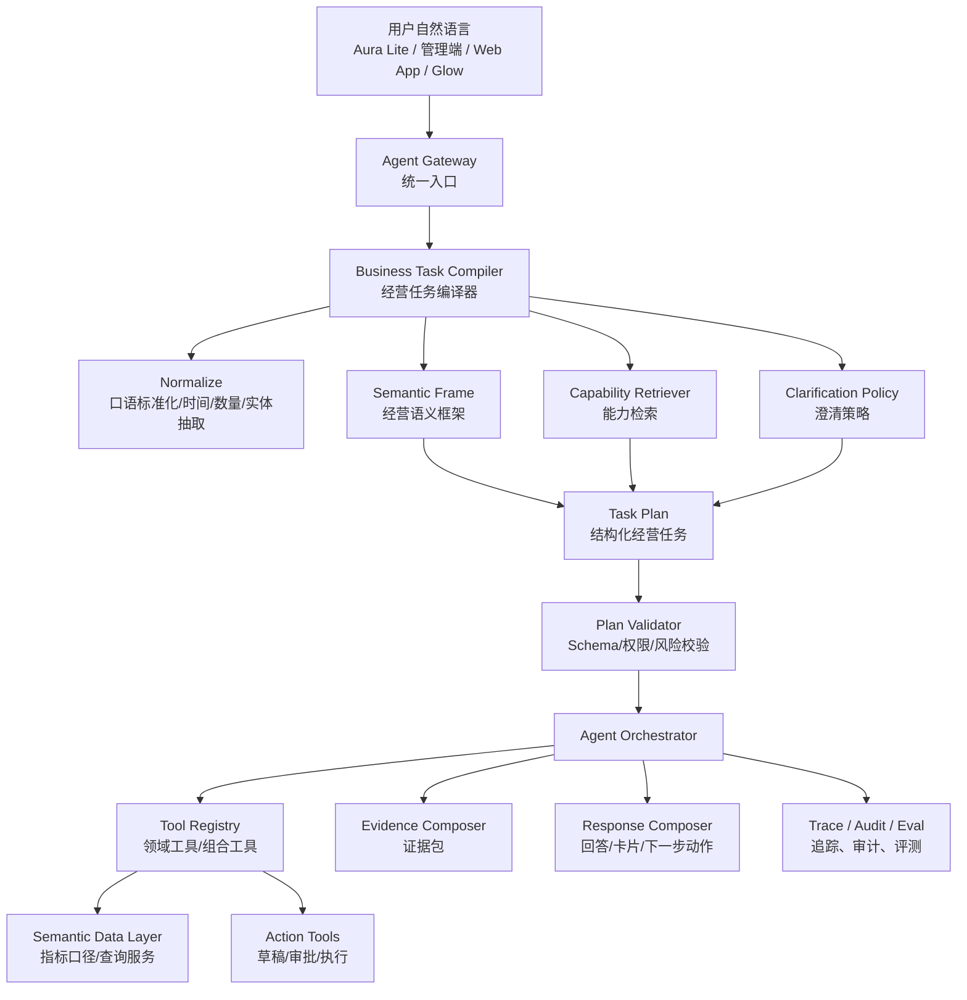

# Ami 经营语义中枢与智能问答重构方案

更新时间：2026-06-17

关联文档：

- `docs/02-产品设计/Ami_AI问数与运营数据查询需求文档.md`
- `docs/02-产品设计/Ami经营Agent编排平台技术方案.md`
- `docs/03-开发计划/Ami经营Agent详细开发计划.md`

## 1. 背景与问题判断

当前 Ami 智能问答已经经历了多轮改造：从前端关键词、微应用入口、BusinessQueryRouter，到后端经营 Agent、Tool Registry、Approval、Audit、Eval。虽然能力在增加，但用户自然语言问答体验仍不稳定。

典型问题：

- 用户问“近期销量增长的商品”，系统曾被“增长”误导到客户增长卡片。
- 用户问“有哪些商品适合做活动”，系统曾返回 unsupported 或澄清卡。
- 用户问“今天最值得跟进的 10 个客户”，系统可能落到单客户档案卡片，只返回 1 个客户。
- 每次修复都像新增关键词、补一个工具、改一段路由规则，无法覆盖用户随机表达。

核心判断：

当前问题不是缺少某一个 `TopN 客户工具`，也不是模型“不够聪明”，而是架构层级仍然偏低。系统还在用“前端意图路由 + 固定工具命中 + 旧卡片兜底”的方式承接自然语言，而自然语言经营问题本质上需要先被编译成稳定的经营任务。

因此，下一步不应继续补单个工具，而应引入 **经营语义中枢**。

## 2. 目标定位

经营语义中枢的目标：

> 把用户随机自然语言，统一编译成可执行、可校验、可审计的经营任务规范，再由 Agent 编排工具、数据和动作。

它不是再加一个问答工具，而是取代当前散落在前端、BusinessQuery、Agent Planner、AI fallback 中的意图判断逻辑。

### 2.1 要解决的问题

1. 不再靠前端关键词决定经营问答走向。
2. 不要求穷举所有用户问法。
3. 不让模型直接编造业务事实。
4. 不为每个自然语言表达单独加一个工具。
5. 用户指定的数量、时间、对象、排序、动作意图必须结构化保留。
6. 问数、推荐、草稿、审批、执行统一进入同一条任务链路。
7. 系统不能处理时，必须明确缺什么条件，而不是随便返回旧卡片。

## 3. 目标架构



## 4. 核心思想：从 Intent 路由升级为 Task 编译

### 4.1 当前方式的问题

当前系统实际存在多套路由：

- Aura Lite 前端规则识别 `manager.customers`、`manager.inventory`、`business.query`。
- AI intent fallback 再判断一次 action。
- BusinessQueryRouter 判断领域和能力。
- Agent Planner 判断 tool plan。
- 旧卡片路径还有自己的兜底。

这导致一个用户问题可能在多个地方被截走。

例如：

```text
今天最值得跟进的10个客户
```

它本质是：

```json
{
  "taskType": "recommendation",
  "domain": "customer",
  "object": "customer",
  "metricIntent": "follow_up_priority",
  "timeRange": "today",
  "limit": 10,
  "sortBy": "priority_score",
  "output": "ranked_list",
  "nextActions": ["create_followup_task_draft", "view_customer_detail"]
}
```

但在旧架构里，它可能被识别成：

```json
{
  "action": "customer.search",
  "keyword": "今天最值得跟进的10个客户"
}
```

这就是架构错误。

### 4.2 新方式

所有自然语言经营问题先进入 `Business Task Compiler`。

前端只做三类明确直达：

1. 明确按钮点击：如“收银”“核销”“我的预约”。
2. 明确实体跳转：如 `customer:张三`、`appointment:confirm:123`。
3. 明确离题拦截：天气、新闻、代码、作文等。

其他自然语言都进入后端编译器。

## 5. Business Task Schema

经营任务统一结构：

```ts
type BusinessTask = {
  taskType:
    | 'query'
    | 'ranking'
    | 'recommendation'
    | 'diagnosis'
    | 'forecast'
    | 'draft'
    | 'workflow'
    | 'clarify';

  domain:
    | 'business'
    | 'customer'
    | 'product'
    | 'project'
    | 'reservation'
    | 'schedule'
    | 'order'
    | 'card'
    | 'memberCard'
    | 'inventory'
    | 'finance'
    | 'marketing'
    | 'staff'
    | 'store';

  objective: string;
  entities: Array<{
    type: string;
    id?: number;
    name?: string;
    confidence: number;
  }>;
  metrics: string[];
  filters: Record<string, unknown>;
  timeRange?: {
    preset?: 'today' | 'yesterday' | 'last_7_days' | 'last_30_days' | 'month_to_date' | 'next_30_days';
    start?: string;
    end?: string;
  };
  sort?: Array<{
    field: string;
    direction: 'asc' | 'desc';
  }>;
  limit?: number;
  outputMode: 'summary' | 'ranked_list' | 'table' | 'card' | 'draft' | 'workflow';
  expectedEvidence: string[];
  riskLevel: 'low' | 'medium' | 'high';
  requiresApproval: boolean;
  missingSlots: string[];
  confidence: number;
};
```

关键要求：

- 用户说“10个”，必须进入 `limit=10`。
- 用户说“今天”，必须进入 `timeRange=today`。
- 用户说“最值得”，不能当成普通查询，必须映射为排序或推荐任务。
- 用户说“跟进”，要区分“给名单”和“创建任务”：
  - “最值得跟进的客户” = ranking/recommendation，只读。
  - “生成跟进任务” = draft/workflow，需要审批。

## 6. 经营语义框架

系统不穷举问法，而是维护一套经营语义框架。

### 6.1 任务类型识别

| 用户表达 | taskType | 说明 |
| --- | --- | --- |
| 今天收入怎么样 | query | 指标查询 |
| 哪些商品增长最快 | ranking | 排名 |
| 哪些客户最值得跟进 | recommendation | 推荐名单 |
| 为什么今天收入下降 | diagnosis | 归因诊断 |
| 下周可能缺哪些耗材 | forecast | 预测 |
| 帮我生成活动草稿 | draft | 草稿 |
| 给这些客户建跟进任务 | workflow | 动作流 |

### 6.2 经营对象识别

| 对象 | 别名 |
| --- | --- |
| customer | 客户、顾客、会员、老客、新客、沉睡客户、流失客户、高价值客户 |
| product | 商品、产品、耗材、库存品、家居产品 |
| project | 项目、护理、服务、疗程 |
| reservation | 预约、到店、爽约、改约 |
| schedule | 排班、班表、人手、忙闲、请假 |
| order | 订单、收银、流水、消费、成交 |
| card | 次卡、疗程卡、项目卡、剩余次数 |
| memberCard | 会员卡、储值卡、余额、充值 |
| inventory | 库存、补货、临期、缺货 |
| marketing | 活动、营销、优惠、触达、转化 |

### 6.3 经营意图识别

| 表达 | 语义 |
| --- | --- |
| 最值得、优先、重点 | priority ranking |
| 增长最快、下降最多 | trend ranking |
| 为什么、原因、归因 | diagnosis |
| 适合做活动、可以推 | opportunity recommendation |
| 要不要补货 | replenishment recommendation |
| 有风险、预警 | risk detection |
| 给我方案、怎么做 | recommendation + action plan |

## 7. Capability Retriever：不是工具枚举，而是能力检索

继续穷举工具会失败。正确方式是维护能力目录，并让编译器按任务结构检索能力。

### 7.1 能力定义

```ts
type BusinessCapability = {
  id: string;
  domain: BusinessTask['domain'];
  supportedTaskTypes: BusinessTask['taskType'][];
  description: string;
  inputSchema: JsonSchema;
  outputSchema: JsonSchema;
  requiredMetrics: string[];
  dataSources: string[];
  riskLevel: 'low' | 'medium' | 'high';
  requiredPermissions: string[];
  allowedRoles: string[];
  examples: string[];
  negativeExamples: string[];
};
```

### 7.2 能力匹配逻辑

```text
用户问题
-> BusinessTask
-> 根据 domain + taskType + metrics + outputMode 检索能力
-> 如果能力唯一且参数完整：执行
-> 如果多个能力可用：生成组合计划
-> 如果缺少关键参数：澄清
-> 如果无能力：明确说明当前不支持，并给可支持替代问题
```

例如：

```text
今天最值得跟进的10个客户
```

检索结果不是固定命中某个工具名，而是：

```text
domain=customer
taskType=recommendation/ranking
metrics=follow_up_priority, churn_risk, repurchase_opportunity, marketing_response
outputMode=ranked_list
limit=10
```

匹配能力：

```text
customer_priority_recommendation
```

该能力内部可以组合多个工具：

- 客户基础数据。
- 预测快照。
- 最近到店/预约。
- 卡项到期。
- 营销响应。
- 历史跟进任务。

这不是“加一个 TopN 工具”，而是新增一种能力编排模式。

## 8. Semantic Data Layer：指标口径必须独立出来

Agent 不应直接知道“流失风险怎么计算”“收入怎么算”“库存预警怎么算”。这些应由语义数据层统一定义。

### 8.1 指标注册

```ts
type MetricDefinition = {
  id: string;
  name: string;
  domain: string;
  formula: string;
  dataSources: string[];
  defaultTimeRange?: string;
  dimensions: string[];
  permissions: string[];
};
```

示例：

| 指标 | 口径 |
| --- | --- |
| follow_up_priority_score | 流失风险、复购机会、LTV、最近互动、未来预约、卡项到期综合评分 |
| churn_risk_score | 最近到店间隔、消费金额、到店次数、预约缺失综合评分 |
| revenue | 有效订单实收金额，不含取消/退款 |
| stock_risk_score | 当前库存、安全库存、近 30 天消耗、到期批次综合评分 |

### 8.2 好处

- 问数、推荐、报表、Agent 使用同一套口径。
- 后续用户换问法，不需要新增工具，只要能映射到同一指标。
- 结果可解释，能输出 evidence。

## 9. 计划生成：LLM 参与，但不能自由发挥

LLM 可以做：

- 口语归一化。
- 任务类型判断。
- 实体和槽位抽取。
- 多能力组合计划建议。
- 回答组织。

LLM 不可以做：

- 编造业务结果。
- 自行生成 SQL 执行。
- 绕过权限。
- 直接执行写操作。
- 用常识替代数据。

### 9.1 推荐实现方式

采用两阶段 Planner：

```text
Stage 1：Deterministic Pre-parser
- 时间、数量、金额、对象、明确动作先用代码抽取。
- 例如“10个”“今天”“下周”“张三”“商品”等。

Stage 2：LLM Task Compiler
- 基于 schema 输出 BusinessTask。
- 输入包含角色、权限、能力目录摘要、近期上下文。
- 输出必须通过 JSON Schema 校验。

Stage 3：Plan Validator
- 校验 domain、taskType、limit、risk、权限、缺失槽位。
- 不通过则澄清或降级。
```

## 10. 回答策略

回答必须和任务类型匹配。

### 10.1 查询类

输出：

- 结论。
- 指标值。
- 统计口径。
- 数据范围。
- 样本量。
- 限制。

### 10.2 排名/推荐类

输出：

- 列表。
- 每项得分。
- 推荐原因。
- 建议动作。
- 为什么不是其他对象。
- 样本量和限制。

### 10.3 诊断类

输出：

- 主要原因。
- 证据。
- 影响程度。
- 建议动作。
- 待确认假设。

### 10.4 草稿/动作类

输出：

- 草稿内容。
- 风险等级。
- 需要人工确认的动作。
- 可编辑项。
- 审批入口。

## 11. 前端迁移原则

### 11.1 Aura Lite

前端不再维护复杂经营意图判断。

保留：

- 快捷按钮直接打开固定卡片。
- 明确操作命令：收银、核销、办卡、充值、打印、预约确认。
- 明确客户搜索：`查客户张三`。

迁移：

- 经营分析。
- 排名。
- 推荐。
- 风险。
- 机会。
- 趋势。
- 诊断。
- “最值得/优先/建议/怎么做”类问题。

全部进入：

```text
POST /api/agent/runs
```

### 11.2 管理端

管理端保留完整页面，但 Agent 结果可以跳转页面。

例如：

- 推荐客户 -> 客户列表筛选页。
- 生成活动草稿 -> 活动编辑页。
- 低库存建议 -> 采购单草稿。
- 排班优化 -> 排班预览页。

### 11.3 Web App / Glow

同样接入 Agent Gateway，不再使用独立关键词或旧 `/v1/messages`。

## 12. 与当前 Agent 的关系

当前经营 Agent 不是废掉，而是下沉为执行层。

```text
现在：
用户输入 -> 前端规则/AI intent -> Agent Planner -> Tool

目标：
用户输入 -> Business Task Compiler -> Capability Plan -> Agent Orchestrator -> Tool/Data/Action
```

当前已有模块可复用：

- AgentRun。
- Tool Registry。
- Policy Engine。
- Approval。
- Audit。
- Eval。
- BusinessQuery 部分能力。

需要重构：

- 前端自然语言路由。
- Agent Planner 的职责。
- BusinessQueryRouter 的领域识别。
- 能力目录从硬编码工具升级为 capability registry。
- 评测从少量问法测试升级为任务编译测试。

## 13. 落地阶段

### 阶段 1：路由收敛

目标：

- 终端自然语言经营问题统一进 Agent Gateway。
- 前端只保留明确操作/实体直达。

交付：

- 调整 Aura Lite `ruleIntentParser`。
- 增加 `shouldRouteToAgent()`。
- 禁止经营类自然语言落到旧客户档案或旧客户增长卡片。

验收：

- “今天最值得跟进的10个客户”进入 Agent。
- “近期销量增长的商品”进入 Agent。
- “为什么今天收入下降”进入 Agent。
- “查客户张三”仍进入客户档案。
- “收银”仍进入收银流程。

### 阶段 2：Business Task Compiler

目标：

- 新增后端经营任务编译器。

交付：

- `business-task.types.ts`
- `business-task-compiler.service.ts`
- deterministic pre-parser。
- schema validator。
- compiler eval cases。

验收：

- 数量、时间、领域、任务类型、输出模式被结构化抽取。
- 编译失败返回明确澄清。

### 阶段 3：Capability Registry

目标：

- 将工具从“直接按工具名命中”升级为“按能力匹配”。

交付：

- `capability-registry.service.ts`
- capability schema。
- 能力检索。
- 能力到工具组合计划映射。

验收：

- 同一能力可承接多种问法。
- 无能力时不乱答。

### 阶段 4：Semantic Data Layer

目标：

- 核心指标口径注册。

第一批指标：

- revenue。
- order_count。
- customer_count。
- follow_up_priority_score。
- churn_risk_score。
- repurchase_opportunity_score。
- product_sales_growth。
- stock_risk_score。
- reservation_utilization。
- marketing_conversion_rate。

验收：

- Agent、问数、报表共享同一指标定义。

### 阶段 5：领域能力扩展

目标：

- 不按单句加工具，而是按领域能力补齐。

第一批能力：

- customer_priority_recommendation。
- customer_churn_ranking。
- product_opportunity_recommendation。
- inventory_risk_ranking。
- revenue_diagnosis。
- reservation_gap_detection。
- marketing_conversion_diagnosis。

验收：

- 每个能力覆盖 20 条以上自然语言评测。

### 阶段 6：评测和观测

目标：

- 用 Eval 驱动迭代，而不是靠用户发现问题。

评测维度：

- 编译准确率。
- 能力命中率。
- 参数保真率。
- 数量约束保真率。
- 不支持场景拒答率。
- 回答证据完整率。
- 旧路由误拦截率。

验收：

- 高频经营问法 200 条评测集通过率达到 90% 以上。
- P0 经营问法 50 条通过率达到 98%。

## 14. 为什么这不是打补丁

补丁式做法：

```text
用户问错一次 -> 新增关键词 -> 新增工具 -> 新增卡片
```

新方案：

```text
用户自然语言
-> 编译成 BusinessTask
-> 按 taskType/domain/metric/output 检索能力
-> 组合工具执行
-> 基于证据回答
-> 用评测集回归
```

差异：

| 维度 | 补丁式 | 经营语义中枢 |
| --- | --- | --- |
| 问法覆盖 | 靠关键词 | 靠任务语义 |
| 数量/时间/对象 | 容易丢 | 结构化保留 |
| 工具扩展 | 每问一类加一个 | 按能力域扩展 |
| 前端职责 | 重路由 | 轻入口 |
| 后端职责 | 工具执行 | 任务编译 + 编排 |
| 失败方式 | 误进旧卡片 | 澄清/拒答 |
| 迭代方式 | 用户报错后修 | Eval 驱动 |

## 15. 近期最小实施建议

不要马上重写全部 Agent。建议先做一个垂直切片：

```text
路由收敛
-> BusinessTask Schema
-> 经营任务编译器
-> customer_priority_recommendation 能力
-> 评测集
-> Aura Lite 结果卡
```

选客户经营作为第一条切片，原因：

- 用户高频问。
- 现有问题明显。
- 已有客户、预测、营销、跟进任务数据基础。
- 能验证“最值得/优先/10个/今天/跟进”这类复杂自然语言。

完成后再扩到商品、库存、收入诊断、预约排班。

## 16. 最终判断

Ami 智能问答要从“工具调用问答”升级为“经营任务编译与执行系统”。

经营 Agent、Tool Registry、BusinessQuery 都是必要组件，但它们不是最上层入口。最上层必须是经营语义中枢，它负责把用户自然语言变成稳定的业务任务。

只有这样，系统才能承接用户随机问法，而不是继续在每个失败样例后补一个关键词或工具。
