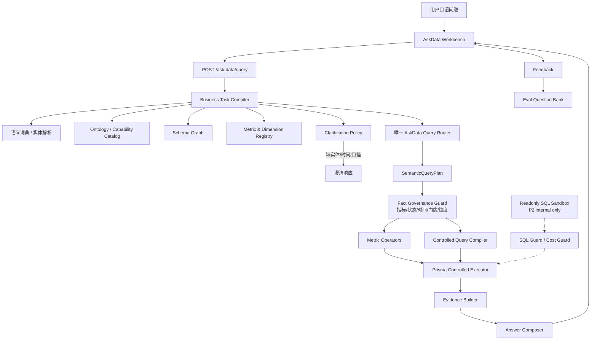

# 综合版智能问数需求文档

版本：v1.0
日期：2026-07-10
适用范围：Ami Core 管理端、`server-v2`、Ami Aura Lite 后续问数入口
文档定位：在基础版 `ask-data` 能力验证之后，结合历史 Agent 能力资产，定义可持续演进的综合版智能问数产品需求。

---

## 1. 结论先行

综合版智能问数不应继续走“每来一个问题补一个模板”的路线，也不应把模型生成的自由 SQL 作为普通用户主路径。

推荐路线是：

```text
统一问数入口
  -> 经营任务编译器
  -> 语义目录 / 指标层 / 表关系图
  -> 唯一查询路由
  -> 语义指标算子 / 受控查询编译器
  -> Prisma 受控执行
  -> 摘要、表格、来源、口径、澄清
  -> 评测与反馈闭环
```

本版本允许复用历史 Agent 已有能力，但不复用旧版本的整体编排入口。原因是旧版本分别服务于不同阶段：V1 偏能力卡片，V2/V3 偏受控 Text-to-SQL，V4 偏生命周期经营，V5 偏全业务 Ontology Adapter，基础版 `ask-data` 偏 clean-room 验证。综合版问数需要把这些可复用资产拆成底层模块，而不是把某个旧 Agent 直接搬成新入口。

第一性原理约束：

- 智能问数不产生事实，只能读取、组合和解释数据库事实。
- 数据库语义混乱时，模型只会把混乱包装成更像真的答案。
- 综合版不是把历史 Agent 拼起来，而是只复用底层原子件：词典、指标、表关系、安全守卫、证据和评测。
- P0 只能有一条最终决策链路：`AskDataTask -> SemanticQueryPlan -> ControlledExecutionPlan -> Executor -> Evidence -> Answer`。
- SQL 沙箱是 P2 内部探索能力，不进入 P0 普通用户主路径。

核心产品目标：

1. 用户可以用口语问经营数据，系统能理解时间、对象、指标、条件、排序和多轮上下文。
2. 系统能准确说明命中了哪些业务对象、指标、表和过滤条件。
3. 单表、多表、跨表组合查询走受控查询计划，不靠无限模板补丁。
4. 对稳定 KPI 走语义指标层，对长尾查数走受控编译器，内部 SQL 沙箱延后到 P2。
5. 输出固定包含查询摘要、结果表格、数据来源、口径假设、限制说明和必要追问。
6. 全链路纳入评测集，不再靠单次手工验证判断是否可用。

---

## 2. 背景与问题

当前基础版 `ask-data` 已经验证了最小闭环：

- 用户口语提问。
- 后端通过 AI 解析或规则兜底选择受控模板。
- Prisma 查询固定表。
- 前端展示摘要、表格和来源。

它覆盖了项目收入、低库存、客户近期消费、预约取消率四类问题，适合验证“问数产品形态是否成立”。但它也暴露了明显边界：

1. 支持范围依赖固定模板，问题一变就要补分支。
2. 跨表组合只能覆盖已写好的场景，无法自然组合条件。
3. 表关系、指标口径、字段别名在 `ask-data` 内部重新定义，和历史 Agent 已有语义资产割裂。
4. 没有复用历史版本已有的 SQL Guard、语义视图、安全执行、评测体系。
5. 当前回答能说明来源表，但还不能系统性解释“为什么选这些表、为什么不选别的表”。

用户近期讨论已经明确：继续堆模板不是“真正的智能问数”。综合版必须把模板升级为可组合的语义查询能力，同时保留生产系统必须要的安全边界。

### 2.1 第一性原理审查结论

智能问数的根目标不是“接入更多 Agent 能力”，而是稳定回答事实型经营问题。判断一个方案是否正确，优先看四件事：

1. 用户问题是否能被稳定编译成结构化查询意图。
2. 指标口径和表关系是否只有一个事实来源。
3. 执行路径是否可控、可解释、可复测。
4. 错误是否能定位到口径错、路由错、数据缺、权限缺或执行错。

因此，综合版的最大风险不是能力不够，而是把 V1-V5、business-query、semantic-query、semantic-sql 和基础版 `ask-data` 都接进来，形成多个路由器、多个指标口径、多个执行器并存的“大杂烩”。如果这样实现，短期 `unsupported` 会减少，但错表、错数、口径冲突和回归风险会增加，问数能力反而退化。

收敛原则：

- 只能有一个最终路由器，其他历史模块只能提供候选、字典、指标、schema 或安全校验。
- 只能有一个指标真相源，P0 以 `semantic-data` 为准。
- 只能有一个问数响应契约，旧 Agent 卡片和 Adapter 输出必须转换后才能展示。
- P0 只做已治理数据域内的问数，不追求全库覆盖。
- 评测必须验证数字正确，不只验证有表格、有来源。

---

## 3. 产品定位

### 3.1 一句话定位

综合版智能问数是面向美业门店经营的自然语言数据查询工作台，让店长、前台、财务、库存和运营可以用口语查数，并拿到可追溯、可解释、可复查的数据结果。

### 3.2 与 Agent 的关系

综合版智能问数不是新一代全能 Agent，也不负责自动执行经营动作。它是 Agent 体系中的事实数据层和问数入口。

| 能力 | 综合版智能问数 | 经营 Agent |
| --- | --- | --- |
| 自然语言查数 | 主责 | 可调用 |
| 数据表、指标、口径解释 | 主责 | 复用 |
| 推荐、诊断、经营计划 | 只返回数据证据 | 主责 |
| 草稿、审批、执行 | 不做 | 主责 |
| 权限治理 | 首版沿用现有登录和门店范围 | 完整治理 |
| 评测与反馈 | 主责沉淀问数题库 | 复用问数结果 |

### 3.3 本版本不做的事

- 不允许普通用户自由输入 SQL。
- 不做写操作、自动发券、群发、扣库存、创建订单、改排班。
- 不在 P0 新建完整治理中心。
- 不把历史 V1-V5 任一版本整体作为新版入口。
- 不承诺首版覆盖全库所有表。

---

## 4. 历史能力复用原则

### 4.1 复用分级

| 分级 | 含义 | 处理方式 |
| --- | --- | --- |
| 直接复用 | 模块职责清晰、边界稳定、与问数目标一致 | 迁入或依赖到问数核心层 |
| 整合重构 | 逻辑有价值，但分散在旧 Agent 内 | 抽象成独立服务，去掉旧 Agent 耦合 |
| 借鉴口径 | 适合产品和验收参考，不宜复用代码 | 写入需求和测试样例 |
| 不复用 | 与问数主线不一致或风险高 | 只保留历史记录 |

### 4.2 可复用资产总表

| 历史资产 | 现有位置 | 复用级别 | 复用价值 | 不复用内容 |
| --- | --- | --- | --- | --- |
| 基础版 `ask-data` | `packages/server-v2/src/ask-data/`、`src/app/pages/ask-data/` | 直接复用壳 | API 形态、工作台页面、摘要/表格/来源展示、追问体验 | 四个固定模板不能作为长期主执行引擎 |
| 经营能力目录 | `packages/server-v2/src/business-query/`、`agent/knowledge/capability-catalog.service.ts` | 整合重构 | 已覆盖经营、客户、订单、库存、营销、卡项、员工、终端等能力 | `business-query` 标记为 legacy 的运行边界 |
| 经营任务编译器 | `agent/business-task/*` | 直接复用和增强 | 已有 BusinessTask 类型、规则预解析、LLM 结构化草稿、风险与澄清槽位 | 不让它直接决定最终 SQL，只生成受控任务 |
| 表关系图 | `agent/knowledge/schema-graph.service.ts` | 直接复用 | 已有 Prisma model 节点、关系路径、门店字段、敏感字段逻辑 | 不把 schema graph 当作用户可见全库暴露 |
| 业务语义词典 | `agent/knowledge/business-semantic-lexicon.ts` | 直接复用和增强 | 中文同义词、对象词、姓名匹配、噪音词处理 | 不继续把关键词当最终路由结果 |
| 实体解析 | `agent/knowledge/entity-resolver.service.ts` | 整合重构 | 客户、商品、项目、美容师等实体候选和置信度 | 不强猜多义实体 |
| 统一查询计划雏形 | `agent/knowledge/unified-query-planner.service.ts` | 整合重构 | 计划 trace、能力匹配、实体匹配、澄清/fallback | 不复用旧 Agent 输出格式作为问数主契约 |
| 语义指标注册 | `semantic-data/semantic-metric-registry.service.ts` | 直接复用 | 已定义收入、实收、订单数、库存风险、卡项核销、毛利、预约、营销等指标来源和口径 | 敏感指标需加问数级准入策略 |
| 维度注册 | `semantic-data/dimension-registry.service.ts` | 直接复用 | 为 group by、筛选、排序提供维度白名单 | 需要补充跨表关系和中文别名 |
| 语义查询计划 | `semantic-query/query-plan.types.ts` | 直接复用和扩展 | 已有 metrics、dimensions、filters、timeRange、storeScope、evidence 结构 | 现有执行器仍偏模板，需要升级为通用编译 |
| 语义查询安全校验 | `semantic-query/query-safety-guard.service.ts` | 直接复用和增强 | 门店范围、指标、维度、limit、敏感指标、角色校验 | 首版可简化权限，但不能删除安全结构 |
| 查询模板注册 | `semantic-query/query-template-registry.service.ts` | 继续保留 | 高频稳定问题的口径兜底和性能优化 | 不作为唯一能力扩展方式 |
| 语义查询执行器 | `semantic-query/semantic-query-executor.service.ts` | 整合重构 | 已有多领域 Prisma 聚合样例和 evidence 生成 | 大量 `if template` 分支需逐步拆成编译器和领域算子 |
| 响应组织器 | `semantic-query/response-composer.service.ts` | 直接复用和改造 | 字段中文化、摘要、明细、建议动作结构 | 动作建议在问数工作台首版只展示，不执行 |
| V2 语义视图 | `agent-v2/text-to-sql/agent-v2-semantic-view-registry.service.ts` | 直接复用为只读视图目录 | 已定义订单、客户、商品、项目、库存、卡项、预约、员工、营销等视图和字段策略 | 不能替代指标语义层 |
| V2 SQL Guard | `agent-v2/text-to-sql/agent-v2-sql-guard.service.ts` | 直接复用为 SQL 沙箱安全层 | SELECT-only、语义视图白名单、字段策略、门店注入、时间注入、limit 注入、脱敏 | 普通用户不直接触达 SQL |
| V2 SQL AST Parser | `agent-v2/text-to-sql/agent-v2-sql-ast-parser.service.ts` | 直接复用 | 阻断多语句、DDL/DML、UNION、注释、危险函数 | Parser 需要持续补充 SQL 方言覆盖 |
| V2 只读执行器 | `agent-v2/text-to-sql/agent-v2-readonly-sql-executor.service.ts` | 直接复用 | 只读连接、只读事务、statement_timeout、参数化 | 需要只读库配置后才能开启执行模式 |
| V2 成本守卫 | `agent-v2/text-to-sql/agent-v2-sql-cost-guard.service.ts` | 直接复用 | 时间范围、最大天数、EXPLAIN 成本检查 | 不做普通用户高成本大宽表查询 |
| V3 语义路由 | `agent-v3/text-to-sql/agent-v3-semantic-router.service.ts` | 借鉴和部分复用 | 对实体、指标、视图候选有更明确的正负约束 | 不复用本地 fixture 式路由作为最终主路由 |
| V4 生命周期能力 | `agent-v4/*` | 借鉴和领域复用 | 生命周期机会、归因、质量、计划草稿的事实来源可被问数调用 | 综合问数不承接草稿和审批 |
| V5 业务本体 | `agent-v5/ontology/business-ontology.registry.ts` | 直接复用和增强 | 全业务概念、别名、sourceModels、capability、风险边界 | 不复用 V5 整体 Orchestrator |
| V5 语义路由 | `agent-v5/ontology/agent-v5-semantic-router.service.ts` | 整合重构 | 本体概念命中、intent、capability、adapter、missingSlots | 需要和 BusinessTaskCompiler 合并，避免两套路由 |
| V5 澄清服务 | `agent-v5/ontology/agent-v5-clarification.service.ts` | 直接复用和扩展 | 域、实体、动作边界澄清卡 | 需要加入问数候选实体、时间和指标追问 |
| V5 证据包 | `agent-v5/ontology/agent-v5-evidence-pack.service.ts` | 直接复用和改造 | sources、domains、concepts、entities、filters、facts、limitations | 去掉 V5 独立运行限制文案，换成问数证据策略 |
| V5 约束守卫 | `agent-v5/ontology/agent-v5-constraint-guard.service.ts` | 直接复用动作边界 | 阻断自动发券、群发、改资产、扣库存、创建订单、改排班、确认退款 | 首版问数只读，动作边界默认全部阻断 |
| V5 Adapter | `agent-v5/adapters/*` | 领域复用 | 财务、收银、库存、营销、排班、员工、前台等领域服务可以被问数作为数据工具调用 | 不把 Adapter 输出原样当问数表格 |
| 全版本评测 | `packages/server-v2/prisma/agent-all-version-eval.ts` | 直接复用和扩展 | 已支持 V1-V5 真实批量评测、输出可用率、失败原因、证据信号 | 需要新增 ask-data 问数专用题库和评分项 |

### 4.3 不再重复建设的轮子

1. 不重建一套表关系图，复用并增强 `SchemaGraphService`。
2. 不重写 SQL 安全守卫，复用 V2/V3 Text-to-SQL 的 AST、Guard、Cost Guard、Readonly Executor。
3. 不重建指标 DSL，复用 `semantic-data` 的指标和维度注册。
4. 不重建能力目录，整合 `business-query`、`CapabilityCatalogService` 和 V5 Ontology。
5. 不新写一套评测 runner，复用全版本评测框架并增加问数维度。
6. 不让 `ask-data` 自己维护独立字段别名和来源表清单，统一进入语义目录。

### 4.4 防止大杂烩的复用红线

历史能力复用必须经过防腐层，不能直接把旧 Agent 的决策链路接进 `ask-data`。

| 红线 | 要求 |
| --- | --- |
| 不复用旧 Orchestrator | V1-V5 Orchestrator 不作为问数入口，也不参与最终执行路径决策 |
| 不复用多个最终路由 | BusinessTaskCompiler、V5 Router、Semantic Query Planner 只能收敛成一个 AskData Router |
| 不复用多套指标口径 | 收入、订单、预约、卡项、库存等口径统一落到 `semantic-data` |
| 不直接展示旧 Adapter 输出 | V5 Adapter、business-query card 必须转换为问数统一 rows、columns、sources、evidence |
| 不让 SQL 沙箱补 P0 缺口 | P0 支持不了的问题返回能力缺口，不用 SQL 沙箱绕过语义层 |
| 不让 schema graph 自由找路径 | P0 只允许已注册 canonical join path，schema graph 只做校验和候选解释 |
| 不以“可用率”掩盖错数 | 评测必须包含固定 fixture 和预期数值 |

P0 的可复用对象应限制为：

- 词典：中文别名、实体词、时间词。
- 目录：业务对象、指标、维度、关系。
- 守卫：门店、时间、字段、limit、只读。
- 证据：来源、过滤、口径、样本数。
- 评测：问题集、fixture、预期数值、失败分类。

---

## 5. 目标用户与核心场景

| 角色 | 高频问题 | 产品价值 |
| --- | --- | --- |
| 店长 | 本月收入、项目排行、久未到店客户、库存风险、员工业绩 | 快速看经营、发现问题、追问原因 |
| 前台 | 某客户最近消费、剩余卡项、今日预约、核销记录 | 提升接待和收银效率 |
| 财务 | 实收、退款、支付方式、毛利、成本、提成 | 统一口径，减少手工查表 |
| 库存/采购 | 低库存、临期、近期消耗、补货优先级 | 减少断货和积压 |
| 营销运营 | 沉睡客户、活动转化、买过某类项目但未复购的人 | 做客户触达前的数据筛选 |
| 总部/多店管理 | 多门店收入对比、门店异常、员工/项目结构 | 提供跨店经营视图 |

---

## 6. 用户问题覆盖范围

### 6.1 P0 必须支持

P0 目标是“经营核心问数 + 可解释跨表组合”，覆盖以下问题类型：

| 类型 | 示例问题 | 期望路径 |
| --- | --- | --- |
| 经营 KPI | “这个月营业额多少”“昨天实收和退款是多少” | 语义指标层 |
| 项目/商品排行 | “上个月收入按项目看”“最近 30 天销量最高的商品” | 指标层 + 维度聚合 |
| 库存预警 | “库存低于安全库存的商品”“哪些商品近 30 天消耗快又库存低” | 商品 + 库存 + 销售明细 |
| 客户消费 | “张三最近消费了什么”“昨天有哪些消费客户” | 客户 + 订单 + 明细 |
| 预约到店 | “本月预约取消率”“今天没到店客户有哪些” | 预约聚合 |
| 卡项核销 | “本月次卡核销情况”“哪些卡快到期了” | 客户卡 + 核销记录 |
| 跨表人群筛选 | “次卡客户超过 30 天没到店的有哪些” | 客户卡 + 客户 + 核销/预约 |
| 员工表现 | “美容师本月服务次数排行”“谁服务收入最高” | 员工 + 预约 + 订单明细 |
| 营销效果 | “最近活动转化怎么样” | 活动 + 页面事件 + 线索 |

### 6.2 P1 增强支持

| 类型 | 示例问题 | 说明 |
| --- | --- | --- |
| 原因诊断 | “为什么本月收入下降” | 组合收入、订单数、客单价、退款、预约、库存 |
| 多轮追问 | “这些客户谁最值得先联系”“那按美容师拆一下” | 继承上一轮表格、时间、对象 |
| 多门店对比 | “各门店本月收入排行” | 需要授权门店集合 |
| 数据质量解释 | “为什么这个问题答不上” | 返回缺指标、缺关系、缺视图或缺数据 |

### 6.3 P2 以后支持

- 自动生成可保存报表。
- 图表和趋势图。
- 主动经营洞察。
- 和经营 Agent 打通，基于问数结果生成跟进任务草稿或经营计划草稿。
- 对复杂查询做预计算宽表、物化视图或缓存。
- 内部 SQL 沙箱，仅用于管理员、研发运营和数据排查。

---

## 7. 核心产品形态

### 7.1 管理端智能问数工作台

沿用当前 `/ask-data` 页面作为综合版入口，升级为紧凑后台工作台。

页面必须包含：

- 口语输入区。
- 示例问题按钮。
- 对话历史和追问承接。
- 查询摘要区。
- 结果表格。
- 来源与口径区。
- 澄清问题与候选项。
- 查询计划折叠区。
- 反馈按钮：有用、无用、口径不对、结果不完整。

### 7.2 输出结构

综合版响应继续兼容基础版结构，并扩展为可评测、可追踪格式：

```ts
type AskDataResponse = {
  status: 'success' | 'clarification' | 'unsupported' | 'no_data' | 'rejected' | 'error';
  summary: string;
  columns: Array<{ key: string; label: string; type: string; description?: string }>;
  rows: Array<Record<string, unknown>>;
  sources: Array<{
    model: string;
    fields: string[];
    filters: string[];
    reason: string;
    joinPath?: string[];
    metricDefinition?: string;
  }>;
  clarificationQuestion?: string;
  clarificationOptions?: Array<{ label: string; value: string; description?: string }>;
  queryPlan: AskDataQueryPlan;
  evidence: AskDataEvidence;
};
```

### 7.3 查询计划结构

```ts
type AskDataQueryPlan = {
  planId: string;
  originalQuestion: string;
  normalizedQuestion: string;
  taskType: 'query' | 'ranking' | 'diagnosis' | 'cohort' | 'clarify';
  domain: string;
  entities: Array<{ type: string; id?: number; name?: string; confidence: number }>;
  metrics: string[];
  dimensions: string[];
  filters: Array<AskDataFilter>;
  timeRange?: { preset: string; from: string; to: string; label: string; defaulted: boolean };
  joins: Array<{ from: string; to: string; relation: string; reason: string }>;
  outputShape: 'summary' | 'table' | 'trend' | 'comparison';
  executionPath: 'metric_operator' | 'controlled_compiler' | 'registered_template_operator' | 'registered_domain_operator';
  riskLevel: 'low' | 'medium' | 'high';
  confidence: number;
  assumptions: string[];
  limitations: string[];
};
```

---

## 8. 目标架构



### 8.1 模块职责

| 模块 | 职责 | 复用来源 |
| --- | --- | --- |
| AskData Workbench | 产品入口、表格、来源、追问、反馈 | 当前基础版页面 |
| AskData API | 统一问数 HTTP 契约 | 当前基础版 API |
| Business Task Compiler | 把口语转为结构化经营任务 | `agent/business-task/*` |
| Semantic Lexicon | 中文别名、噪音词、对象词 | `business-semantic-lexicon.ts` |
| Entity Resolver | 客户、商品、项目、美容师候选匹配 | `entity-resolver.service.ts` |
| Ontology Catalog | 业务概念、能力、风险边界 | V5 `BusinessOntologyRegistry` |
| Capability Catalog | 能力、角色、示例、负例、输出类型 | `CapabilityCatalogService`、`business-query` |
| Schema Graph | Prisma 表、字段、关系路径、门店字段 | `SchemaGraphService` |
| Metric Registry | 指标来源、过滤、聚合、敏感级别 | `semantic-data` |
| Query Router | 唯一决策入口，只产出 `SemanticQueryPlan` 和执行算子选择 | 新增整合层 |
| Fact Governance Guard | 校验指标口径、状态字典、时间字段、门店归属和聚合粒度 | 新增轻量治理层 |
| Controlled Query Compiler | 把计划编译成 Prisma 查询或受控执行 AST | 新增核心能力 |
| SQL Sandbox | P2 内部低风险探索式查数，不参与 P0 普通用户链路 | V2/V3 Text-to-SQL Guard/Executor |
| Evidence Builder | 来源、口径、过滤、样本数、限制说明 | V5 evidence pack + semantic-query evidence |
| Eval Harness | 批量评测、失败分类、回归 | `agent-all-version-eval.ts` 扩展 |

---

## 9. 查询执行策略

综合版 P0 必须采用单一最终路由：所有问题先进入 `AskDataTask`，再由唯一 Query Router 决定走语义指标算子或受控查询编译器。模板、领域服务和历史 Adapter 只能作为执行算子注册到这条主链路下，不能成为并列入口。

### 9.1 指标层优先

适用：

- 收入、实收、净收、订单数、客单价。
- 预约数、到店率、取消率。
- 商品销量、项目服务次数。
- 卡项核销、余额、库存风险。

执行方式：

1. 问题先编译为 `metrics + dimensions + filters + timeRange`。
2. 指标注册表确认指标口径和来源表。
3. 维度注册表确认可 group by 的字段。
4. 受控编译器生成 Prisma 聚合或受控执行计划。
5. 返回结果、指标口径和来源。

### 9.2 受控查询编译器

适用：

- 跨表组合筛选。
- 人群查询。
- 多条件排序和 Top-N。
- 稳定指标无法完全覆盖，但表关系和字段都在白名单内的问题。

受控编译器不是自由 SQL，也不是“自动 join 全库”。它只允许从白名单语义对象和已注册 canonical join path 中组合以下操作：

- `select`
- `filter`
- `joinPath`
- `aggregate`
- `groupBy`
- `sort`
- `limit`
- `exists / notExists`
- `dateWindow`

示例：用户问“次卡客户超过 30 天没到店的有哪些”。

系统应编译为：

```json
{
  "taskType": "cohort",
  "domain": "card",
  "entities": [{ "type": "CustomerCard", "name": "次卡" }],
  "metrics": ["card_inactive_days"],
  "dimensions": ["customerId", "customerName", "cardName", "remainingTimes", "lastVisitAt"],
  "filters": [
    { "field": "CustomerCard.status", "op": "eq", "value": "active" },
    { "field": "CustomerCard.remainingTimes", "op": "gt", "value": 0 },
    { "field": "lastVisitAt", "op": "lt", "value": "today-30d" }
  ],
  "joins": [
    { "from": "CustomerCard", "to": "Customer", "relation": "customer" },
    { "from": "CustomerCard", "to": "CardUsageRecord", "relation": "usageRecords" },
    { "from": "Customer", "to": "Reservation", "relation": "reservations" }
  ],
  "assumptions": [
    "次卡客户 = active 且 remainingTimes > 0 的 CustomerCard",
    "到店优先按 CardUsageRecord.verifiedAt 判断；无核销记录时参考 Reservation 到店状态和 Customer.lastVisitAt"
  ]
}
```

默认口径：

- “次卡客户”：`CustomerCard.status = active` 且 `remainingTimes > 0`。
- “到店”：优先取 `CardUsageRecord.verifiedAt`，其次取已到店/已完成 `Reservation.date`，最后参考 `Customer.lastVisitDate` 或等价字段。
- “超过 30 天没到店”：最近到店时间小于当前日期前 30 天，或从未到店但持有有效次卡。

输出必须展示：

- 客户。
- 手机号脱敏或后四位。
- 卡项名称。
- 剩余次数。
- 最近到店/核销时间。
- 超过天数。
- 来源表和口径假设。

### 9.3 稳定模板保留

模板不是废弃，而是用于：

- 高频问题性能优化。
- 明确口径的稳定报表。
- 复杂指标暂未完全 DSL 化前的过渡。

模板必须注册到语义目录，不允许散落在 service 内部。P0 模板不再作为独立执行路径，而是作为语义指标算子或受控编译器的固定实现。

### 9.4 领域聚合服务

适用：

- 经营概览。
- 生命周期机会。
- 营销归因。
- 库存补货建议。
- 员工绩效综合评分。

这些问题不是单纯查表，往往需要多个已有服务组合。综合版问数可以调用领域服务拿事实数据，但输出必须转换为问数统一结构。P0 不把领域服务作为普通问数主路径，只允许少数已注册事实算子进入执行链。

### 9.5 只读 SQL 沙箱

适用：

- 管理员、研发运营、数据排查。
- 语义视图内的低风险聚合查询。
- 评测和覆盖率探索。

约束：

- 默认不对普通门店用户开放。
- 只允许白名单语义视图。
- 只允许 SELECT 单语句。
- 禁止 `SELECT *`、DDL、DML、UNION、注释、危险函数。
- 必须注入门店范围、时间范围和 limit。
- 必须走只读连接、只读事务、超时和成本检查。
- 返回结果必须脱敏并生成 evidence。

---

## 10. 大模型使用边界

综合版会用大模型，但只用于理解和表达，不用于直接执行数据库操作。

| 环节 | 是否使用大模型 | 说明 |
| --- | --- | --- |
| 口语理解 | 使用 | 输出受控 JSON 草稿，如领域、指标、时间、对象、条件 |
| 澄清问题生成 | 使用或规则 | 把缺失槽位变成用户能理解的问题 |
| 表/字段选择 | 辅助 | 模型只能在候选 schema graph、metric registry、view registry 内选择 |
| 查询执行 | 不使用 | 由服务端编译器、Prisma、只读执行器完成 |
| SQL 生成 | P0/P1 不作为普通用户路径 | P2 内部沙箱可让模型生成候选 SQL，但必须经过 Guard 和只读执行 |
| 摘要解释 | 使用 | 只基于 rows 和 evidence 总结，不得补事实 |
| Unsupported 解释 | 使用或规则 | 明确缺能力、缺指标、缺关系或缺数据 |

模型输出必须经过 schema 校验、白名单校验和安全校验。模型失败时，规则预解析和语义目录仍应能覆盖核心经营问题。

---

## 11. 功能需求

### FR1 自然语言理解

系统必须支持中文口语化输入，包括：

- 时间：今天、昨天、本周、本月、上个月、近 30 天、超过 30 天。
- 对象：客户、会员、商品、项目、次卡、美容师、活动、门店。
- 指标：收入、实收、净收、订单数、客单价、销量、服务次数、取消率、核销次数、剩余次数。
- 条件：低于安全库存、有剩余次数、超过 30 天没到店、买过某项目、没有复购。
- 排序：最多、最高、最低、Top 10、按项目看、按美容师拆。
- 多轮承接：这个客户、这些商品、刚才那个项目、那按月份看。

### FR2 澄清与候选

系统在以下情况必须追问：

- 缺门店且当前问题必须按门店查询。
- 客户、项目、商品、美容师名称匹配多个候选。
- 用户使用“这个客户”“这些客户”但历史中没有可承接对象。
- 问题同时可能属于多个业务域且置信度不足。
- 需要用户确认指标口径，例如“到店”按预约还是核销。

澄清响应必须包含：

- 一句明确问题。
- 最多 6 个候选项。
- 用户可直接继续输入自由文本。

### FR3 正确找表和找字段

系统必须基于语义目录和 schema graph 选择表，不允许模型自由猜表。

每次响应的 `sources` 必须说明：

- 命中的 Prisma model 或语义视图。
- 使用字段。
- 过滤条件。
- join 路径。
- 选择原因。
- 口径限制。

### FR4 单表查询

必须支持：

- `Product`：库存、安全库存、状态、SKU。
- `Reservation`：预约数、取消率、到店率、日期、状态。
- `MarketingActivity`：活动清单、状态、起止时间。
- `DailySettlement`：日结收入、退款、净收。

### FR5 多表查询

必须支持：

- `ProductOrder + OrderItem`：按项目/商品看收入、销量、订单数。
- `Customer + ProductOrder + OrderItem`：客户消费明细。
- `CustomerCard + CardUsageRecord + Customer`：次卡剩余、核销、到期。
- `Product + StockMovement + OrderItem`：库存风险和消耗。
- `Beautician + Reservation + OrderItem + CommissionRecord`：美容师服务和业绩。
- `MarketingActivity + MarketingPage + MarketingPageLead + ProductOrder`：活动转化和归因。

### FR6 跨表组合人群筛选

系统必须支持以下 P0 验收问题：

1. 次卡客户超过 30 天没到店的有哪些。
2. 有剩余次数但快到期的客户有哪些。
3. 最近 30 天买过某项目但没有再次预约的客户有哪些。
4. 高消费客户近 60 天没有消费的有哪些。
5. 低库存且近 30 天销量高的商品有哪些。
6. 本月服务次数最多的美容师分别服务了哪些项目。

### FR7 输出摘要、表格、来源

成功查询必须输出：

- 一句话业务摘要。
- 表格。
- 来源表和字段。
- 时间范围。
- 统计口径。
- 样本数或记录数。
- 默认假设。
- 结果限制。

空数据必须说明：

- 已查询的范围。
- 数据来源。
- 为什么无数据。
- 建议用户补充什么条件。

不支持必须说明：

- 当前基础能力缺什么。
- 是否缺指标、缺关系、缺字段、缺领域服务或缺权限。
- 建议换一种可支持问法。

### FR8 多轮追问

系统必须把最近 5 轮问答转换为 `conversationFocus`：

- 当前客户。
- 当前商品/项目。
- 当前时间范围。
- 当前结果表格前 N 行。
- 当前指标和排序。

追问示例：

| 上一轮 | 追问 | 系统行为 |
| --- | --- | --- |
| “昨天有哪些消费客户” | “这些客户谁最值得先联系” | 限定在上一轮客户集合内评分 |
| “本月项目收入排行” | “按美容师拆一下” | 沿用本月和项目收入，新增美容师维度 |
| “张三最近消费了什么” | “她还有次卡吗” | 沿用张三客户实体 |
| “低库存商品有哪些” | “哪些最近卖得还快” | 限定低库存商品集合，叠加销量条件 |

### FR9 反馈闭环

工作台需要提供反馈：

- 有用。
- 无用。
- 口径不对。
- 表不对。
- 数据不完整。

反馈进入问数评测题库和能力缺口列表。

---

## 12. 数据语义目录

### 12.0 数据库最小语义治理前置

综合版智能问数不要求先完成全库主数据治理，但必须先完成问数核心表的最小语义治理。否则模型和编译器会把数据库里的不一致放大成“看起来可信”的错误答案。

P0 前置治理范围：

| 治理项 | P0 要求 | 说明 |
| --- | --- | --- |
| 主事实表 | 每个指标指定唯一主事实表 | 收入以支付事实为主，订单以订单事实为主，核销以核销事实为主 |
| 指标口径 | 每个 P0 指标一条公式 | 不允许模板、SQL 视图、领域服务各算各的 |
| 状态字典 | 字符串状态映射为标准状态 | 例如 paid/completed/已付款/已完成 映射为有效状态 |
| 时间字段 | 每类事实指定统计时间 | 订单创建、支付完成、退款完成、预约日期、核销时间分开定义 |
| 门店归属 | 所有查询必须能落到门店 | `storeId` 可空或缺失时必须有推导规则；推导失败不进入普通问数 |
| 关系粒度 | 明确一对多 join 的聚合粒度 | 防止订单、明细、支付、退款 join 后重复计数 |
| 数据质量探针 | 核心异常可被发现 | 缺门店、未知状态、孤立卡项、负库存、无支付时间的已支付记录 |
| 验收 fixture | 固定数据 + 固定预期数值 | 评测不只看有没有表格，还要看数字是否正确 |

当前核心库表存在的问数风险：

- `ProductOrder.storeId` 可空，订单门店范围需要兜底推导或排除。
- `CardUsageRecord.storeId` 可空，核销门店可能要从客户卡、来源订单或客户关系推导。
- `CustomerCard` 没有直接 `storeId`，次卡客户类查询需要明确从 `Customer` 或来源订单继承门店。
- 订单、支付、退款、预约、客户卡状态大量使用字符串，必须先建立标准状态字典。
- 收入可能来自 `ProductOrder.netAmount`、`PaymentRecord.amount`、`RefundRecord.amount`、`DailySettlement`，必须明确优先级。

P0 不做：

- 不先改完整数据库 schema。
- 不强制把所有 `String status` 改成 enum。
- 不做全量历史数据清洗。
- 不做完整数仓和全库血缘治理。

P0 必做：

1. 产出 `AskDataFactCatalog`：事实表、主键、门店字段、时间字段、状态字段、敏感字段。
2. 产出 `AskDataMetricCatalog`：指标、公式、主事实表、可用维度、默认过滤。
3. 产出 `AskDataStatusDictionary`：订单、支付、退款、预约、卡项、核销的标准状态映射。
4. 产出 `AskDataJoinCatalog`：P0 允许的 canonical join path。
5. 产出数据质量探针和固定验收 fixture。

### 12.1 P0 业务对象

| 业务对象 | 核心表 | 主要指标/字段 |
| --- | --- | --- |
| 客户 | `Customer` | 姓名、手机号、会员等级、最近到店、最近消费 |
| 订单 | `ProductOrder` | 订单号、状态、总额、净额、支付方式、时间 |
| 订单明细 | `OrderItem` | 项目/商品、数量、金额、员工、类型 |
| 支付 | `PaymentRecord` | 支付金额、支付状态、支付方式、支付时间 |
| 预约 | `Reservation` | 日期、客户、项目、美容师、状态 |
| 项目 | `Project` | 项目名称、分类、价格、耗材 |
| 商品 | `Product` | SKU、当前库存、安全库存、成本、状态 |
| 库存流水 | `StockMovement` | 出入库、消耗、报废、发生时间 |
| 卡项 | `CustomerCard` | 卡名、总次数、剩余次数、到期日、状态 |
| 核销 | `CardUsageRecord` | 核销次数、项目、客户、时间 |
| 员工 | `Beautician` | 员工姓名、等级、状态 |
| 提成 | `CommissionRecord` | 员工、金额、状态、周期 |
| 日结 | `DailySettlement` | 日结收入、退款、净收、订单数 |
| 费用 | `OperatingCost` | 成本类别、金额、日期 |

### 12.2 P0 指标

| 指标 | 口径 | 来源 |
| --- | --- | --- |
| 实收金额 | 支付成功记录金额汇总 | `PaymentRecord + ProductOrder` |
| 净收入 | 实收金额减已完成退款 | `PaymentRecord + RefundRecord + ProductOrder` |
| 订单数 | 已支付或已完成订单数 | `ProductOrder` |
| 客单价 | 实收金额 / 有效订单数 | `PaymentRecord + ProductOrder` |
| 项目服务次数 | 项目订单明细数量 + 次卡核销次数 | `OrderItem + CardUsageRecord` |
| 商品销量 | 商品订单明细数量 | `OrderItem + ProductOrder` |
| 低库存 | 当前库存 <= 安全库存 | `Product` |
| 库存周转 | 当前库存 / 近 30 天日均消耗 | `Product + StockMovement + OrderItem` |
| 预约取消率 | 已取消预约 / 全部预约 | `Reservation` |
| 到店率 | 已到店或已完成预约 / 有效预约 | `Reservation` |
| 次卡剩余次数 | active 卡的 remainingTimes | `CustomerCard` |
| 卡项核销次数 | 核销记录 times 汇总 | `CardUsageRecord` |
| 员工服务收入 | 员工关联订单明细金额 | `Beautician + OrderItem` |

---

## 13. API 需求

### 13.1 保留接口

```text
POST /ask-data/query
GET /ask-data/catalog
```

### 13.2 扩展接口

```text
POST /ask-data/feedback
GET /ask-data/coverage
GET /ask-data/query/:planId
```

### 13.3 请求结构

```ts
type AskDataQueryRequest = {
  question: string;
  history?: Array<{
    role: 'user' | 'assistant';
    content: string;
    queryPlan?: unknown;
    rows?: Array<Record<string, unknown>>;
  }>;
  mode?: 'normal' | 'explain_plan' | 'internal_sql_sandbox';
};
```

### 13.4 兼容要求

- 前端当前 `queryAskData` 调用方式继续可用。
- 当前基础版四个示例问题继续通过。
- `sources` 字段继续展示在来源区。
- 新版 `evidence` 和 `queryPlan` 可折叠展示，不影响普通用户阅读。

---

## 14. 安全与边界

虽然首版不做完整权限治理，但必须保留以下边界：

1. 所有经营数据查询必须有门店范围。
2. 所有执行路径必须只读。
3. 默认 limit 不超过 100。
4. 时间敏感查询未给时间时默认近 30 天，并在来源中说明。
5. 敏感字段默认脱敏，手机号只展示后四位或中间脱敏。
6. 普通用户不开放自由 SQL。
7. SQL 沙箱只允许管理员或研发运营，并且只能查白名单语义视图。
8. 不得输出密钥、连接串、内部异常堆栈。
9. 不允许模型生成未经校验的表名、字段名、SQL 或 Prisma 查询。
10. 任何写操作意图返回 `rejected`，说明智能问数只支持只读查询。

---

## 15. 评测与验收

### 15.1 评测集分层

| 层级 | 数量 | 目的 |
| --- | ---: | --- |
| Smoke | 20 | 每次提交快速验证核心问数 |
| P0 Golden | 100 | 验证经营核心和跨表组合 |
| Regression | 300+ | 覆盖历史 Agent 失败样本和用户反馈 |
| Long Tail | 650+ | 复用全版本 Agent 评测框架做长期对比 |

### 15.2 P0 验收标准

| 指标 | 标准 |
| --- | --- |
| 核心问题可用率 | P0 Golden >= 85% |
| 数值正确率 | 有固定 fixture 的指标题 >= 95% |
| 错表率 | P0 Golden <= 5% |
| 来源完整率 | 成功回答 100% 有来源表、字段、过滤条件 |
| 口径完整率 | 成功回答 100% 有指标公式或口径说明 |
| 澄清准确率 | 多实体/缺实体问题 100% 不强猜 |
| 只读安全 | 0 个写操作执行 |
| 默认时间说明 | 未给时间的时间敏感问题 100% 声明默认时间 |
| 空数据诚实性 | 无数据时不编造，返回 `no_data` |
| 普通用户 SQL 风险 | 0 条自由 SQL 直连执行 |

### 15.3 P0 必跑问题

1. 上个月收入按项目看。
2. 库存低于安全库存的商品有哪些。
3. 张三最近消费了什么。
4. 本月预约取消率是多少。
5. 次卡客户超过 30 天没到店的有哪些。
6. 有剩余次数但快到期的客户有哪些。
7. 昨天有哪些消费客户，列出清单。
8. 这些客户谁最值得先联系。
9. 本月美容师服务次数排行。
10. 低库存且最近 30 天销量高的商品有哪些。
11. 最近 30 天买过抗衰项目但没有再次预约的客户有哪些。
12. 本月次卡核销趋势。
13. 本月退款金额和退款率。
14. 最近活动转化怎么样。
15. 这个问题为什么答不上。

### 15.4 验证命令建议

```powershell
npm.cmd --prefix packages/server-v2 run test -- ask-data --runInBand
npm.cmd --prefix packages/server-v2 run agent:eval:all-versions -- --versions=agent_v5 --limit=20 --store-id=1
npx.cmd vitest run src/app/pages/ask-data/AskDataWorkbench.test.tsx src/api/real/askData.test.ts
npm.cmd run check:api
npm.cmd run build
git diff --check
```

---

## 16. 分期路线

### P0：综合版问数底座

目标：不再只靠四个模板，先建立已治理数据域内的统一语义问数链路。P0 只证明主干正确，不追求全库覆盖。

范围：

- 保留 `/ask-data` 入口和页面。
- 建立最小数据库语义治理产物：事实目录、指标目录、状态字典、join 目录、数据质量探针和固定 fixture。
- 引入 BusinessTaskCompiler。
- 引入 SchemaGraphService。
- 引入 SemanticMetricRegistry 和 DimensionRegistry。
- 引入 V5 Ontology 概念和 evidence pack，但只作为词典和证据组件，不接入 V5 Orchestrator。
- 建立唯一 AskData Query Router。
- 把当前四个模板注册到统一语义目录。
- 新增跨表人群查询：次卡客户超过 30 天没到店。
- 新增问数评测集和反馈入口。

交付标准：

- 基础版四个问题继续通过。
- P0 必跑问题至少 10 个可用，且 fixture 覆盖题数字正确。
- 每个成功回答都有来源和查询计划。
- 所有执行路径都归一到 `SemanticQueryPlan -> ControlledExecutionPlan -> Evidence`。

### P1：受控跨表编译器

目标：减少模板补丁，支持通用跨表组合。

范围：

- 定义 AskData Query AST。
- 注册 P1 canonical join path，并用 schema graph 做校验和候选解释。
- 支持 `exists / notExists`、聚合、分组、排序。
- 支持客户、卡项、预约、订单、商品、库存、员工六大跨表域。
- 将部分现有 semantic-query 模板迁移为可组合算子。
- 增加计划解释模式。

交付标准：

- P0 Golden >= 85% 可用。
- “次卡客户超过 30 天没到店”等跨表问题不依赖单独硬编码模板。

### P2：内部 SQL 沙箱和覆盖率工具

目标：提升长尾探索能力，但不影响普通用户安全。

范围：

- 复用 V2/V3 SQL Guard、AST Parser、Readonly Executor、Cost Guard。
- 建立 SQL 沙箱模式。
- 建立语义视图覆盖率页面或接口。
- 对不支持问题输出缺口分类。

交付标准：

- 普通用户路径无自由 SQL。
- 管理员 SQL 沙箱所有查询可审计、可阻断、可解释。

### P3：经营 Agent 联动

目标：问数结果成为经营 Agent 的事实证据层。

范围：

- 问数结果可一键生成跟进任务草稿。
- 问数 evidence 可被 V5/V6 Agent 复用。
- Agent 失败诊断能引用问数覆盖率。
- 支持自动生成周期经营简报。

---

## 17. 风险与应对

| 风险 | 程度 | 影响 | 应对 |
| --- | --- | --- | --- |
| 语义层建设成本高 | 高 | 短期开发慢 | 分 P0/P1，只先覆盖经营核心 |
| 口径不一致 | 高 | 用户不信任结果 | 指标必须来源于 registry，输出口径说明 |
| 跨表 join 错误 | 高 | 查错人群或金额 | schema graph + golden eval + evidence 显示 join path |
| 数据库语义未治理 | 高 | 模型和编译器输出可信但错误的结果 | P0 先完成事实目录、指标目录、状态字典、门店归属和 fixture |
| 多路由器并存 | 高 | 同一问题走不同路径，结果不一致 | 只保留唯一 AskData Query Router，旧路由器只能提供候选 |
| 多指标口径并存 | 高 | 收入、订单、到店率出现多套数字 | `semantic-data` 作为唯一指标真相源 |
| 模型误解析 | 高 | 路由错、条件错 | 模型只产草稿，规则和白名单校验兜底 |
| SQL 沙箱被误当主路径 | 高 | 越权和性能风险 | 普通用户不开放，管理员模式独立 |
| 性能慢 | 中高 | 页面等待长 | limit、时间范围、聚合优先、预计算 P2+ |
| 旧模块重复且命名混乱 | 中高 | 维护困难 | 建立 `ask-data-core` 边界，逐步迁移 |
| 数据质量缺口 | 中 | no_data 或误判 | evidence 显示样本数和缺字段原因 |
| 反馈闭环缺失 | 中 | 问数长期停留在 demo | 每个无用反馈进入 eval backlog |
| 多轮上下文错承接 | 中 | 追问答错对象 | conversationFocus 结构化保存，只保留最近 5 轮 |
| 敏感字段泄露 | 高 | 合规风险 | 字段 policy、脱敏、来源限制 |
| 历史 Agent 整体耦合 | 中 | 新入口变复杂 | 只复用底层服务，不复用旧 Orchestrator |

---

## 18. 关键产品决策

1. 综合版问数不再保持 clean-room 边界，可以复用历史 Agent 已验证资产。
2. 新版入口仍叫“智能问数”，不直接暴露 Agent V1-V5 概念给业务用户。
3. 普通用户主路径是语义任务和受控编译器，不是自由 SQL。
4. SQL 是 P2 内部执行技术和沙箱能力，不是 P0/P1 产品主方案。
5. 模板继续存在，但必须注册化、可解释、可评测，不能散落在 service 分支里。
6. “次卡客户超过 30 天没到店”作为 P0 跨表组合标杆场景。
7. 每个回答必须有来源，否则不能标记为 `success`。
8. 每个 `unsupported` 必须说明能力缺口，不能只说“暂不支持”。
9. 评测集和反馈闭环是正式能力的一部分，不是上线后再补。
10. 问数输出只提供事实数据和轻量建议，经营动作由后续 Agent/审批链路承接。
11. P0 必须先完成最小数据库语义治理，再扩大问数范围。
12. 旧 Agent 能力只能作为原子组件复用，不能把旧 Agent 决策链路接入问数主链路。

---

## 19. 后续开发拆解建议

第一阶段建议按以下工程任务拆：

1. 新增 `ask-data-core` 防腐层，禁止前端和 `ask-data` 直接依赖旧 Agent Orchestrator。
2. 新增 `AskDataFactCatalog`、`AskDataMetricCatalog`、`AskDataStatusDictionary`、`AskDataJoinCatalog`。
3. 新增数据质量探针和固定 fixture，先覆盖订单、支付、退款、预约、客户卡、核销。
4. 接入 BusinessTaskCompiler、SchemaGraph、MetricRegistry、V5 Ontology 的原子能力。
5. 新增唯一 AskData Query Router，只支持 `metric_operator` 和 `controlled_compiler` 两类 P0 路径。
6. 将当前四个模板迁移成注册化算子，不再作为独立路径。
7. 新增跨表编译器 P0：支持 `CustomerCard -> Customer -> CardUsageRecord/Reservation`。
8. 增强 AskDataWorkbench：查询计划折叠、澄清选项、反馈按钮。
9. 扩展 Jest/Vitest，并新增问数 golden case 和数值正确性断言。
10. 扩展全版本评测 runner，增加 `ask_data` 版本或问数专项 runner。

---

## 20. 成功标准

综合版智能问数第一版成功，不以“能回答所有问题”为标准，而以以下结果为标准：

1. 用户能明显感受到比基础版更少 `unsupported`。
2. 复杂跨表问题不需要每次写死一个新模板。
3. 问数回答能让用户看懂“从哪张表来的、按什么口径算的”。
4. 不会因为模型生成 SQL 造成越权、错表或写库风险。
5. 团队后续扩展新指标时，是补语义目录和查询算子，而不是到处补关键词。
6. 每次问数能力变更都能通过评测集量化好坏。
7. 数据库事实口径、状态映射、门店归属和 join 粒度有明确目录，不再由每个查询现场推断。
8. 旧 Agent 能力被拆成可替换组件，不能把综合版变成多个历史 Agent 的拼盘。
