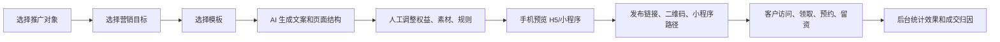

# 营销 H5（小程序）生成器方案

版本：v1.0
日期：2026-06-06
适用范围：Ami_Core 管理端、`packages/server-v2` 后端、营销活动、商品、服务项目、卡项/套餐、小程序/H5 推广页

## 1. 方案结论

营销 H5（小程序）生成器不应只做“海报或页面编辑器”，而要做成“营销资产生成 + 发布分享 + 留资预约 + 转化归因”的闭环工具。

建议采用“同一套 Page Schema，多端渲染”的方案：

- 管理端负责选择推广对象、配置权益、AI 生成页面、预览、发布、查看效果。
- H5 端优先落地，用公开链接和二维码承接微信、社群、朋友圈、短信、门店海报等渠道。
- 小程序第一阶段可用 `web-view` 承载 H5，降低小程序原生开发与审核成本。
- 第二阶段再把同一套 Page Schema 渲染成微信小程序原生页面，提升性能、留存和支付能力。

MVP 建议先支持“营销活动 + 智能推荐生成活动页”，因为当前项目已经具备活动页 Schema、AI 生成接口、活动发布状态和小程序预览雏形。随后扩展到商品、项目、卡项/套餐。

## 2. 建设目标

### 2.1 产品目标

1. 店长可以从商品、服务项目、卡项、营销推荐或营销活动中，一键生成可推广的 H5/小程序页面。
2. 页面能自动带出图片、价格、优惠、适用人群、预约入口、门店联系方式和活动规则。
3. 页面能通过链接、二维码、微信、小程序、短信、社群、朋友圈、门店海报分发。
4. 客户在页面内可以完成浏览、领取权益、预约、留资、联系顾问等动作。
5. 后台能追踪曝光、访问、点击、留资、预约、到店、成交、归因收入和 ROI。

### 2.2 不做什么

MVP 不建议一开始做复杂拖拽式建站，也不建议直接上完整商城支付闭环。当前更重要的是先让门店能快速生成页面、分享出去、拿到线索和预约，再逐步接入支付、拼团、分销、会员积分等能力。

## 3. 当前项目可复用基础

| 现有能力 | 位置 | 可复用方式 |
| --- | --- | --- |
| 营销活动表 | `packages/server-v2/prisma/schema.prisma` 的 `MarketingActivity` | 已有 `pageSchema`、`aiGenerationId`、`publishStatus`、`publishedAt`，可作为 MVP 页面发布存储 |
| AI 活动页生成接口 | `packages/server-v2/src/ai/ai.controller.ts`、`ai.service.ts` | 已有 `/ai/generate/activity-page`，可继续扩展输入字段和模板类型 |
| 前端活动页结构类型 | `src/types/ai.ts` | 已有 `ActivityPageSchema`、`ActivityPageSection`，可升级为通用 `MarketingPageSchema` |
| 活动小程序预览 | `src/app/components/ActivityMiniPage.tsx` | 可作为管理端手机预览组件基础 |
| 智能推荐发布活动页 | `src/app/pages/MarketingRecommendation.tsx` | 已能从推荐生成客户可见页面并发布营销活动 |
| 营销活动 CRUD | `src/api/real/marketing.ts`、`packages/server-v2/src/marketing` | 可扩展页面生成、发布、下线、埋点接口 |
| 行为事件入口 | `/marketing/customer-events` | 可扩展为 H5/小程序访问、点击、预约、领取等事件采集 |
| 商品/项目图片字段 | `Product.image`、`Project.image` | 可直接进入营销页面素材池 |
| 分享域名配置 | `src/config/marketingAssets.ts` | 已有 `VITE_MARKETING_SHARE_BASE_URL` 和活动链接生成函数 |

## 4. 业务对象与推广页类型

### 4.1 推广对象

| 对象 | 典型来源 | 页面目标 | 第一阶段建议 |
| --- | --- | --- | --- |
| 商品 | 商品管理、库存、智能推荐 | 种草、引导咨询、搭配项目、到店购买 | 支持 |
| 服务项目 | 项目管理、皮肤检测推荐、终端服务建议 | 在线预约、体验价转化、到店咨询 | 支持 |
| 营销活动 | 活动管理、智能推荐、自动营销策略 | 领取权益、预约、老客唤醒、节日促销 | MVP 优先 |
| 卡项/套餐 | 次卡、折扣卡、储值卡、套餐包 | 开卡咨询、充值、套餐销售 | 第二阶段 |
| 门店专题 | 门店信息、节日档期、品牌活动 | 门店引流、活动合集、顾问转介绍 | 第二阶段 |

### 4.2 页面类型

| 页面类型 | 使用场景 | 核心模块 |
| --- | --- | --- |
| 单品种草页 | 护肤品、仪器耗材、家居护理产品 | 商品图、卖点、适用肤质、搭配项目、到店购买 CTA |
| 项目预约页 | 补水、清洁、抗衰、美睫、美甲、SPA 等 | 项目图、时长、价格、护理流程、预约 CTA |
| 限时活动页 | 节日促销、会员日、老客回店 | 倒计时、优惠权益、适用人群、活动规则、领取/预约 CTA |
| 会员权益页 | 生日、VIP、卡项权益提醒 | 权益说明、会员等级、顾问建议、核销规则 |
| 老带新裂变页 | 推荐新客、拼团、闺蜜同行 | 分享海报、邀请码、双方权益、排行榜可选 |
| 皮肤检测引流页 | 到店检测、AI 肤质分析 | 检测价值、适用人群、预约检测 CTA |

## 5. 核心用户流程



### 5.1 管理端创建流程

1. 入口：智能营销新增“营销页面生成器”，并在商品、项目、活动详情页提供“生成推广页”快捷按钮。
2. 选择对象：商品、项目、活动、卡项、智能推荐。
3. 选择目标：预约引流、领取优惠、到店咨询、老客唤醒、新客转化、会员关怀、节日促销。
4. 选择模板：单品种草、项目预约、限时活动、会员权益、裂变分享等。
5. AI 生成：根据对象资料、门店信息、人群标签、优惠权益生成页面结构和多渠道文案。
6. 人工确认：运营人员调整标题、主图、权益、规则、CTA、渠道追踪参数。
7. 预览发布：手机框预览 H5 和小程序效果，确认后发布。
8. 分发：复制链接、下载二维码、生成分享海报、推送到短信/微信/小程序/社群。
9. 复盘：查看访问、预约、成交、收入和 ROI。

### 5.2 客户端访问流程

1. 客户通过微信、朋友圈、短信、社群或门店二维码打开页面。
2. 页面加载时记录 `view` 事件，识别渠道、页面、门店、活动和分享人。
3. 客户可点击 CTA：领取权益、预约项目、联系顾问、提交手机号、打开地图。
4. 已登录/已识别客户直接关联 `customerId`；未识别客户生成临时 `sessionId`，提交手机号后可合并客户。
5. 到店预约、核销、下单后进入营销归因链路。

## 6. 页面生成器能力设计

### 6.1 页面结构

当前 `ActivityPageSchema` 已包含：

- `hero`：首屏主视觉
- `offer`：优惠权益
- `benefits`：卖点收益
- `project_recommendation`：推荐项目
- `product_recommendation`：推荐商品
- `skin_care_advice`：护肤建议
- `consultant_note`：顾问建议
- `faq`：常见问题
- `notice`：活动须知
- `store_info`：门店信息
- `cta`：预约、领券、联系顾问

建议升级为 `MarketingPageSchema`，在兼容原有字段的基础上新增这些模块：

| 新模块 | 用途 |
| --- | --- |
| `item_gallery` | 商品/项目/门店图片轮播 |
| `price_card` | 原价、活动价、套餐价、权益说明 |
| `countdown` | 限时活动倒计时 |
| `coupon_claim` | 领券、权益锁定、核销码 |
| `booking_form` | 预约项目、预约时间、顾问备注 |
| `lead_form` | 手机号、姓名、需求留资 |
| `referral_share` | 老带新分享码、分享海报 |
| `deposit_payment` | 预约金、定金支付，后续阶段接入 |
| `staff_card` | 专属顾问、联系电话、企微二维码 |
| `store_map` | 门店地址、导航、营业时间 |
| `compliance_notice` | 禁用词、适用限制、退款/核销规则 |

### 6.2 生成输入

| 输入类型 | 字段示例 |
| --- | --- |
| 推广对象 | `sourceType=product/project/activity/card/recommendation`、`sourceId` |
| 门店信息 | 门店名、电话、地址、营业时间、店铺二维码 |
| 素材 | 主图、轮播图、商品图、项目图、海报模板 |
| 权益 | 折扣、满减、赠品、体验价、套餐价、有效期、每人限用次数 |
| 人群 | 会员等级、肤质、生日、沉睡客户、新客、VIP、高响应客户 |
| 渠道 | H5、微信、小程序、短信、社群、朋友圈、门店海报 |
| 目标 | 预约、领券、咨询、到店、成交、裂变分享 |

### 6.3 AI 生成策略

AI 负责“生成可用草稿”，不替代人工审核。

生成内容包括：

- 页面标题、首屏副标题、活动卖点
- 商品/项目卖点转译成客户可理解表达
- 针对渠道的分享文案：短信、微信、朋友圈、社群、小程序通知
- 页面模块顺序建议
- FAQ、活动规则、护理建议
- 风险提示和需要人工确认的内容

必须保留当前项目已经实现的安全逻辑：

- 不向客户暴露“高流失风险、LTV、模型、算法、命中客户、策略”等内部运营标签。
- 不输出医疗承诺、疗效保证、夸大宣传。
- 价格、有效期、库存、门店信息必须以系统数据为准，AI 只能生成表达，不能凭空编造。
- AI 结果要保存 `aiGenerationId`、`promptTemplateVersion`、`safety`，方便审计和复盘。

## 7. 数据模型建议

### 7.1 MVP：复用 `MarketingActivity`

第一阶段可以继续把发布页挂在 `MarketingActivity` 下，减少开发量：

- `pageSchema`：保存页面结构
- `aiGenerationId`：保存 AI 生成记录 ID
- `publishStatus`：`draft/published/offline`
- `publishedAt`：发布时间
- `sourceRecommendationId`：来源推荐
- `audienceSnapshotJson`、`offerJson`、`recommendedItemsJson`：保存推荐上下文

这适合“营销活动页”优先上线。

### 7.2 增强版：新增通用营销页面模型

当商品、项目、卡项都需要独立生成页面时，建议新增通用模型，避免把所有页面都塞进活动表。

```prisma
model MarketingPage {
  id              Int      @id @default(autoincrement())
  storeId          Int
  activityId       Int?
  sourceType       String   // product/project/activity/card/package/recommendation/store_topic
  sourceId         String?
  title            String
  slug             String   @unique
  runtimeType      String   // h5/miniapp/both
  pageSchema       Json
  themeJson        Json?
  shareTitle       String?
  shareDescription String?
  shareImage       String?
  status           String   @default("draft") // draft/published/offline
  shareUrl         String?
  miniappPath      String?
  qrCodeUrl        String?
  aiGenerationId   String?
  promptVersion    String?
  publishedAt      DateTime?
  offlineAt        DateTime?
  createdBy        Int?
  createdAt        DateTime @default(now())
  updatedAt        DateTime @updatedAt

  @@index([storeId, status])
  @@index([sourceType, sourceId])
}

model MarketingPageVersion {
  id              Int      @id @default(autoincrement())
  pageId          Int
  version         Int
  pageSchema      Json
  snapshotJson    Json
  aiGenerationId  String?
  createdBy       Int?
  createdAt       DateTime @default(now())

  @@index([pageId, version])
}

model MarketingPageEvent {
  id             Int      @id @default(autoincrement())
  pageId         Int
  storeId        Int
  activityId     Int?
  customerId     Int?
  sessionId      String?
  openId         String?
  eventType      String   // view/share/click_cta/lead_submit/coupon_claim/book/pay/converted
  channel        String?
  referrer       String?
  staffId        Int?
  metadataJson   Json?
  occurredAt     DateTime @default(now())

  @@index([pageId, eventType, occurredAt])
  @@index([storeId, occurredAt])
  @@index([customerId])
}
```

### 7.3 页面快照

发布时必须保存页面快照，而不是每次实时读取商品/项目当前字段。原因：

- 活动价、主图、规则发布后需要稳定展示。
- 商品或项目后续改价，不应影响已投放页面，除非运营主动重新发布。
- 营销效果复盘时需要知道客户当时看到的页面内容。

## 8. API 方案

### 8.1 管理端 API

| 方法 | 路径 | 用途 |
| --- | --- | --- |
| `GET` | `/marketing/page-templates` | 获取页面模板列表 |
| `POST` | `/marketing/pages/generate` | 根据对象和目标生成页面草稿 |
| `GET` | `/marketing/pages` | 页面列表，支持按对象、状态、门店筛选 |
| `POST` | `/marketing/pages` | 保存页面草稿 |
| `GET` | `/marketing/pages/:id` | 页面详情 |
| `PUT` | `/marketing/pages/:id` | 更新页面配置 |
| `POST` | `/marketing/pages/:id/publish` | 发布页面，生成链接、二维码、小程序路径 |
| `POST` | `/marketing/pages/:id/offline` | 下线页面 |
| `POST` | `/marketing/pages/:id/duplicate` | 复制页面，用于复用模板 |
| `GET` | `/marketing/pages/:id/effects` | 页面效果统计 |

MVP 可以先不新增全部接口，而是在现有 `/marketing/activities` 上补齐：

- `POST /marketing/activities/:id/publish`
- `POST /marketing/activities/:id/offline`
- `GET /marketing/activities/:id/effects`

### 8.2 公开 H5/小程序 API

| 方法 | 路径 | 用途 |
| --- | --- | --- |
| `GET` | `/public/marketing/pages/:slug` | 获取公开页面配置，无需后台登录 |
| `POST` | `/public/marketing/pages/:id/events` | 记录浏览、分享、点击、停留等事件 |
| `POST` | `/public/marketing/pages/:id/leads` | 提交手机号、姓名、需求 |
| `POST` | `/public/marketing/pages/:id/bookings` | 创建预约或预约意向 |
| `POST` | `/public/marketing/pages/:id/coupons/claim` | 领取活动权益，生成核销码 |

公开 API 要注意：

- 不返回内部客户分层、预测分数、成本价、库存成本等敏感字段。
- 需要限流和防刷。
- 手机号提交、领券、预约要做验证码或微信身份校验，避免垃圾线索。

### 8.3 AI API 扩展

保留现有：

- `POST /ai/generate/activity-page`
- `POST /ai/generate/marketing-copy`

新增或扩展：

| 方法 | 路径 | 用途 |
| --- | --- | --- |
| `POST` | `/ai/generate/marketing-page` | 通用推广页生成，支持商品、项目、活动、卡项 |
| `POST` | `/ai/generate/share-copy` | 生成多渠道分享文案 |
| `POST` | `/ai/generate/page-variants` | 生成 A/B 测试版本 |

## 9. 前端产品设计

### 9.1 管理端入口

建议增加三个入口：

1. 智能营销 > 营销页面生成器
2. 商品管理/项目管理列表行操作：“生成推广页”
3. 营销活动详情或活动列表操作：“生成 H5/小程序”

### 9.2 管理端页面结构

页面生成器建议采用左侧配置、右侧手机预览：

- 顶部：推广对象、状态、保存、发布、复制链接、下载二维码
- 左侧 Tab：
  - 基础信息：标题、副标题、分享标题、分享图
  - 推广对象：商品/项目/活动/卡项选择
  - 权益规则：折扣、赠品、体验价、有效期、限领
  - 页面模块：模块开关、排序、文案编辑
  - 渠道设置：渠道参数、顾问/员工码、分享渠道
  - 风控检查：敏感词、价格有效期、规则完整度
- 右侧：H5/小程序手机预览，支持切换模板和刷新 AI 文案

### 9.3 模板库

模板需要能给店长快速选择，而不是让店长从空白开始。

| 模板 | 推荐对象 | 默认 CTA |
| --- | --- | --- |
| 项目体验价模板 | 服务项目 | 立即预约 |
| 商品种草模板 | 商品 | 咨询顾问/到店购买 |
| 节日活动模板 | 营销活动 | 领取权益 |
| 生日会员模板 | 会员活动 | 预约专属护理 |
| 老客回店模板 | 智能推荐 | 领取回店礼 |
| 皮肤检测模板 | 项目/门店专题 | 预约检测 |
| 老带新模板 | 活动/卡项 | 分享给好友 |

## 10. H5 与小程序技术方案

### 10.1 H5 优先方案

建议新增独立 H5 前台应用，例如：

```text
packages/marketing-h5
```

职责：

- 渲染公开推广页
- 适配微信内置浏览器、普通浏览器、小程序 web-view
- 上报访问和行为事件
- 承接手机号留资、预约、领券
- 支持二维码打开和渠道参数

部署建议：

- 使用独立域名，例如 `https://mini.ami-core.com`
- 当前 `VITE_MARKETING_SHARE_BASE_URL` 已默认指向该域名，可继续沿用
- H5 静态资源走 CDN，页面数据走 `server-v2` public API

### 10.2 小程序分阶段方案

| 阶段 | 方案 | 交付影响 |
| --- | --- | --- |
| 阶段 1 | 小程序 `web-view` 加载 H5 页面 | 最快上线，页面能力和 H5 一致 |
| 阶段 2 | 小程序原生 Schema Renderer | 性能更好，可接入微信登录、订阅消息、原生分享 |
| 阶段 3 | 原生交易闭环 | 接入微信支付、卡券、积分、拼团、分销 |

建议先做阶段 1。原因是本项目已经有 H5 链接生成基础，且营销推广首要目标是快速投放和转化线索。

## 11. 埋点与转化归因

### 11.1 页面漏斗

| 漏斗层级 | 事件 | 指标 |
| --- | --- | --- |
| 曝光 | `impression` | 海报/短信/推送曝光，可选 |
| 访问 | `view` | PV、UV、渠道访问 |
| 互动 | `click_cta`、`share`、`scroll_depth` | 点击率、分享率、停留 |
| 线索 | `lead_submit` | 留资人数、有效手机号 |
| 权益 | `coupon_claim` | 领券数、核销码生成数 |
| 预约 | `book` | 预约人数、预约项目、预约时间 |
| 到店 | `arrived` | 到店率 |
| 成交 | `order_paid` | 成交订单、实付金额 |
| 归因 | `converted` | 归因收入、ROI |

### 11.2 渠道追踪

链接建议包含以下参数：

```text
pageId=123
campaignId=456
channel=wechat_group
staffId=12
customerId=789
shareId=abc
utm_source=wechat
utm_medium=group
utm_campaign=summer_hydration
```

员工或顾问分享时生成专属二维码，方便统计谁带来的访问、线索和成交。

### 11.3 归因口径

建议沿用项目已有“营销归因闭环”方向：

- 默认归因窗口：30 天
- 同一客户多次触达：最近一次有效触达优先
- 同一订单不要重复归因到同一活动或页面
- 退款后需要冲减归因收入
- 页面线索转预约、预约转订单要保留链路

## 12. 权限与运营风控

### 12.1 权限建议

| 动作 | 权限 |
| --- | --- |
| 查看页面 | `core:marketing:view` |
| 创建草稿 | `core:marketing:create` |
| 编辑页面 | `core:marketing:update` |
| 发布/下线 | 建议新增 `core:marketing:publish`，也可 MVP 复用 `core:marketing:update` |
| 查看效果 | `core:marketing:analytics` |
| 删除页面 | `core:marketing:delete` |

### 12.2 风控检查

发布前必须检查：

- 标题、主图、价格、活动时间、门店信息完整。
- 活动结束时间不能早于开始时间。
- 有优惠权益时必须有使用规则。
- 医美、美容功效类表达禁止出现“治愈、根治、保证、永久、100%有效”等高风险词。
- AI 生成内容不能包含内部策略标签。
- 商品停售、项目下架、门店停用时要阻止发布或提示下线。

## 13. MVP 范围

### 13.1 第一版必须有

1. 从营销活动或智能推荐生成 H5 页面。
2. 使用现有 `ActivityPageSchema` 渲染页面。
3. 管理端手机预览、保存草稿、发布、下线。
4. 发布后生成 H5 链接和二维码。
5. 公开 H5 页面可访问，无需后台登录。
6. 支持客户点击预约/留资/联系顾问。
7. 记录 `view`、`click_cta`、`lead_submit`、`book` 事件。
8. 活动效果页增加页面访问、线索、预约等指标。

### 13.2 第一版暂缓

1. 完整拖拽式页面搭建。
2. 微信支付、拼团、分销佣金。
3. 多租户复杂域名绑定。
4. 小程序原生页面全量重写。
5. 自动大规模群发，仍需要人工确认发布和触达。

## 14. 开发分期

### 阶段 0：方案确认与字段梳理，2-3 天

交付：

- 页面 Schema 升级清单
- 模板清单
- MVP API 清单
- 风控词和活动规则校验清单

### 阶段 1：营销活动 H5 MVP，1-2 周

交付：

- `MarketingActivity` 发布/下线接口
- 独立 H5 页面渲染或管理端 public route
- H5 链接、二维码、渠道参数
- 管理端手机预览和发布按钮
- 基础埋点：访问、点击、留资、预约
- 活动效果页展示页面漏斗

验收：

- 店长可从营销活动发布一个可访问 H5 页面。
- 客户扫码后能看到活动内容并提交预约/留资。
- 后台能看到访问、点击、线索、预约数量。

### 阶段 2：商品/项目生成器，2-3 周

交付：

- 推广对象选择器：商品、项目、活动
- 商品种草模板、项目预约模板、节日活动模板
- 通用 `MarketingPage` 模型
- 页面版本和发布快照
- 分享海报和员工专属二维码

验收：

- 商品和项目列表能直接生成推广页。
- 页面能自动带出图片、价格、项目时长、活动权益。
- 不同渠道链接能分开统计效果。

### 阶段 3：小程序与交易增强，3-5 周

交付：

- 微信小程序 web-view 或原生 Schema Renderer
- 微信登录/openId 识别
- 订阅消息提醒
- 卡券领取与核销
- 可选接入预约金/定金支付
- 与订单、核销、营销归因打通

验收：

- 小程序内可打开同一营销页。
- 客户行为能关联微信身份或客户档案。
- 成交订单能回流页面/活动效果统计。

## 15. 关键验收指标

| 指标 | MVP 目标 |
| --- | --- |
| 创建效率 | 店长 3 分钟内生成并发布一个活动 H5 |
| 页面可用性 | 微信内访问正常，首屏 2 秒内可见主体内容 |
| 数据完整性 | 访问、点击、留资、预约事件可追踪 |
| 内容安全 | 客户可见页面不出现内部标签和高风险宣传词 |
| 运营复盘 | 活动效果页能看到访问到预约的基础漏斗 |
| 扩展性 | 后续商品、项目、卡项可复用同一套 Schema 和渲染器 |

## 16. 风险与处理建议

| 风险 | 影响 | 建议 |
| --- | --- | --- |
| 商品/项目图片质量参差 | 页面观感差，影响转化 | 发布前提示缺图，优先复用测试数据中的项目效果图和商品图，后续接素材库 |
| AI 编造价格或功效 | 合规和客诉风险 | 价格、时间、权益由系统字段锁定，AI 只负责表达 |
| 客户身份识别不稳定 | 归因不准 | 未登录用 `sessionId`，提交手机号或微信授权后合并 |
| 小程序原生开发周期长 | 上线慢 | MVP 用 H5 + 小程序 web-view |
| 页面太像后台预览 | 客户体验弱 | H5 前台要独立设计，不直接复用后台弹窗样式 |
| 营销归因口径争议 | ROI 不可信 | 先采用 30 天最近有效触达，后台标明口径 |

## 17. 推荐落地路径

建议先做“营销活动 H5 发布器”，再做“通用营销页面生成器”。

第一步直接复用现有能力：

- `ActivityMiniPage` 继续作为管理端预览。
- `/ai/generate/activity-page` 继续生成活动页结构。
- `MarketingActivity.pageSchema` 保存页面结构。
- `publishStatus` 控制草稿、发布、下线。
- `VITE_MARKETING_SHARE_BASE_URL` 生成分享链接。

第二步新增公开 H5 渲染端和事件采集：

- 新建 `packages/marketing-h5` 或独立 public route。
- 通过 `slug` 获取页面快照。
- 上报页面行为事件。
- 支持留资和预约。

第三步抽象成通用 `MarketingPage`：

- 商品、项目、卡项、活动都生成页面。
- 页面版本、模板库、员工二维码、渠道效果统一管理。
- 小程序原生渲染复用同一套 Schema。

## 18. 后续可拆分任务

1. 输出 `MarketingPageSchema v1` 字段定义。
2. 设计营销页面生成器管理端原型。
3. 补充 `MarketingActivity` 发布/下线 API。
4. 新建 H5 前台页面渲染包。
5. 设计公开 API 的鉴权、限流和防刷策略。
6. 建立页面事件表和基础漏斗看板。
7. 扩展商品/项目生成入口。
8. 评估微信小程序 web-view 接入和备案/域名要求。
