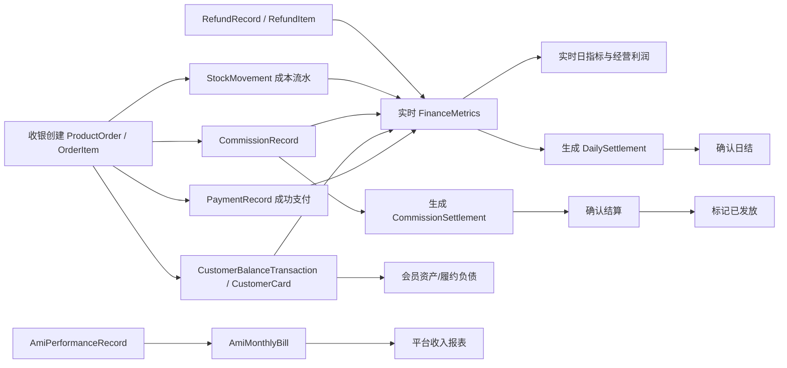
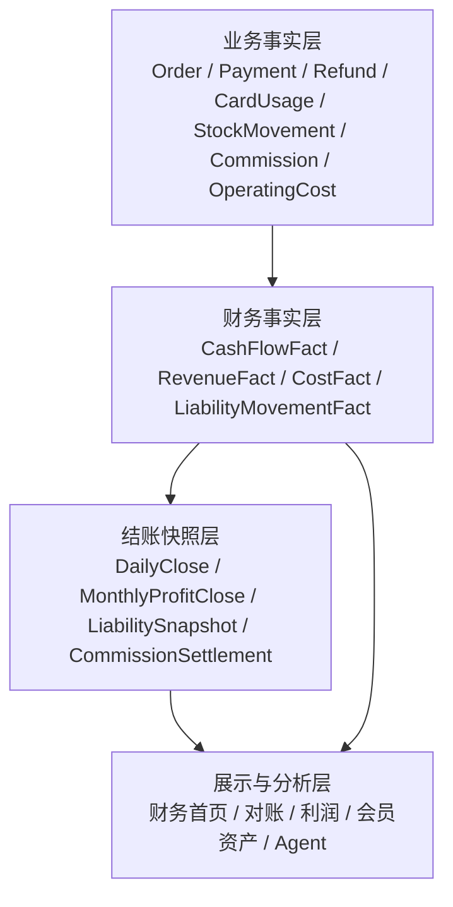

# 财务中心模块业务流程、数据流程与数据口径审计及修改建议

> 审计日期：2026-07-12  
> 审计范围：管理端财务中心、`server-v2` 财务指标/提成/经营利润服务、Prisma 数据模型、当前数据库迁移与只读数据状态  
> 审计性质：只读审计，不包含业务数据写入和代码修改

## 1. 执行结论

当前财务中心已经形成“收银对账、员工提成、经营利润、会员资产、数字员工账单”五个工作台，支付、退款、日结、成本、提成、储值和次卡也已经接入真实数据表。

但从第一性原理看，财务系统必须回答四个问题：

1. 钱是否真实发生；
2. 收入、成本应在哪个时点确认；
3. 已确认的账能否被冻结并可追溯调整；
4. 不同报表能否基于同一事实相互勾稽。

当前系统只能稳定回答第 1 个问题的一部分，第 2 至第 4 个问题仍有结构性缺陷。因此，当前模块应定位为“经营财务与结算工作台”，不能作为正式关账、法定会计或税务报表的最终真相源。

最关键的缺陷有五项：

- 同名“日结”同时存在实时计算结果和持久化日结单，两者不是同一对象；
- 已确认日结可以被重新生成直接覆盖，缺少结账冻结、重开账和调整流水；
- 营业收入按订单创建时间、现金流按支付时间、履约收入按核销时间，缺少统一事件日期，跨日数据无法稳定勾稽；
- 混合订单退款仍按订单金额比例冲减经营收入，没有按退款明细准确冲减项目、商品和预收；退货成本也未进入统一利润冲回；
- 门店级财务对象的按 ID 查询/确认缺少服务端门店归属校验，平台收入接口的权限码与前端路由权限不一致。

建议采用“方案 B：统一财务事实口径 + 日/月结冻结”，先把现有真实业务表统一成可勾稽的经营财务事实层，再补结账控制，不直接建设完整总账系统。

## 2. 审计边界与验证证据

### 2.1 已核对链路

- 路由与权限：`src/app/routes.tsx`、`src/app/components/Layout.tsx`；
- 财务页面：`src/app/pages/finance/*`、`src/app/pages/operation-profit/*`；
- 前端 API：`src/api/commission.ts`、`src/api/financeMetrics.ts`、`src/api/operationProfit.ts` 及其 `real` 实现；
- 后端：`commission`、`finance-metrics`、`operation-profit`；
- 数据模型：`PaymentRecord`、`RefundRecord`、`DailySettlement`、`CashierShift`、`CommissionRecord`、`CommissionSettlement`、`OperatingCost`、`CustomerCard`、`CustomerBalanceAccount`、`CardUsageRecord`、`AmiMonthlyBill`；
- 数据库：Prisma 迁移状态、经营利润 readiness/audit、退款库存追溯 audit；
- 定向测试：后端 67 个测试、前端 23 个测试。

### 2.2 当前数据库只读快照

| 项目 | 当前状态 | 交付含义 |
|---|---:|---|
| Prisma migrations | 81 个，数据库已全部应用 | 新退款/退货模型已进入当前数据库 |
| 日结单 | 43 张：7 张已确认、36 张草稿 | 大多数日结尚未形成已确认财务结果 |
| 成功支付 | 646 笔，合计 312,850.11 元 | 现金流事实源已有规模 |
| 成功退款 | 41 笔，合计 18,000.67 元 | 退款已形成独立事实源 |
| 提成流水 | 119 条，其中 111 条已确认、8 条已结算 | 提成生成链路已运行，但月结覆盖率低 |
| 提成结算单 | 4 张：3 张草稿、1 张已发放 | 尚未形成稳定月结习惯 |
| 2026-07 经营费用 | 0 条 | 2026-07 经营利润必然高估，readiness 为 blocked |
| 2026-07 商品/项目提成缺口 | 22 条业务明细中缺 1 条 | 毛利存在确定性高估点 |
| 历史退款 | 41 条需追溯审计 | 新退款模型已应用，但历史追溯未闭合 |
| 缺订单明细关联的库存流水 | 商品出库 49 条、服务耗用 246 条 | 历史退货和成本反查仍存在断点 |
| 活跃储值账户 | 337 个，本金余额 983,768.61 元、赠送余额 181,124.95 元 | 会员资金规模较高，必须支持历史时点和审计 |
| 活跃未消耗次卡 | 359 张、剩余 3,305 次 | 履约负债是财务中心核心风险 |
| Ami 账单 | 2 张，全部为草稿 | 当前平台收入会把草稿账单计入收入，口径不成立 |

## 3. 当前业务流程

### 3.1 收银对账流程

现状流程为：查看实时日指标 → 查看支付/退款流水 → 查看异常 → 查看班次差异。持久化日结单由定时任务或接口生成，并可确认。

缺陷是用户在“收银对账”的“日结总览”看到的是 `FinanceMetrics` 实时计算结果，不是 `DailySettlement` 日结单；页面还明确提示“无需人工确认审核”。财务首页却按 `DailySettlement.status` 提醒“未生成/待确认”。同一业务名称出现两套状态和两套数据。

### 3.2 员工提成流程

现状流程为：业务发生生成提成流水 → 财务确认流水 → 按员工和月份生成结算单并锁定明细 → 确认结算 → 标记已发放。

该链路已比早期版本完整，但缺少扣款/补款调整单、确认人落库、付款凭证和严格状态机。

### 3.3 经营利润流程

现状按订单项目/商品净额、次卡核销收入、耗材/商品成本、提成和经营费用计算毛利与经营利润，并暴露成本质量状态。

该方向正确，但订单收入日期、退款冲回、经营费用期间分摊和趋势计算仍不满足财务可复算要求。

### 3.4 会员资产流程

现状按次卡剩余次数估值，加上储值本金和赠送余额，形成会员履约负债和风险列表。

该页面只能反映当前余额，不能回答“某月末负债是多少”；赠送权益与现金合同负债虽然分列，但仍按面值直接汇总到一个总负债。

### 3.5 数字员工与平台收入流程

现状由 Ami 绩效记录汇总生成月账单，平台报表再汇总 Ami 账单和供应链结算。

账单状态定义了草稿、确认、开票、已付，但后端没有完整状态流转；平台收入汇总也没有过滤草稿或未确认结算，当前只能视为测算值。

## 4. 数据口径现状

| 指标 | 当前事实源 | 当前归属时间 | 当前公式/含义 |
|---|---|---|---|
| 支付现金流 | `PaymentRecord` | `paidAt`，为空回退 `createdAt` | 成功支付金额，限现金/微信/支付宝/银行卡 |
| 营业收入 | `OrderItem` + `CardUsageRecord` - 退款分摊 | 订单 `createdAt`、核销 `verifiedAt`、退款 `refundedAt` | 项目/商品净额 + 次卡履约 - 退款经营份额 |
| 预收新增 | 办卡/充值类 `OrderItem` | 订单 `createdAt` | 充值和办卡等未履约金额 |
| 会员余额消费 | `CustomerBalanceTransaction` | `createdAt` | 本金扣减 + 赠送扣减 |
| 毛利 | 营业收入 - 耗材 - 商品成本 - 提成 | 多种事实日期混合 | 未扣经营费用 |
| 经营利润 | 毛利 - `OperatingCost` | 查询区间 + 月份 | 月度经营费用直接计入查询期 |
| 日结支付 | `DailySettlement.summary.total` 或渠道字段合计 | `settleDate` | 与成功支付流水勾稽，退款单独比较 |
| 会员负债 | 当前次卡剩余价值 + 当前储值本金 + 当前赠送余额 | 当前状态 | 不支持历史时点 |
| 平台收入 | Ami 月账单 + 供应链结算 | `settleMonth` | 当前包含草稿状态 |

## 5. 缺陷清单与修改建议

### P0-1：已确认日结仍可被重新生成覆盖

**证据**

- `generateDailySettlement` 对同一门店和日期执行 `upsert`；
- 更新分支会覆盖收入、渠道、退款、成本、毛利和汇总字段；
- 更新时不检查 `status === confirmed`，也不会重置或创建新版本；
- `confirmDailySettlement` 只更新状态和时间，没有金额快照、版本或审计记录。

**业务影响**

已确认数字会因后续退款、补录成本或重复生成发生变化，财务人员无法证明“当时确认的数字是什么”。这使日结确认失去财务意义。

**修改建议**

1. 已确认日结禁止直接覆盖；
2. 增加 `version`、`lockedAt`、`lockedBy`、`sourceUpdatedAt`、`reopenedAt`、`reopenedBy`；
3. 后续差异生成 `DailySettlementAdjustment`，不改原确认快照；
4. 需要重算时走“申请重开 → 审批 → 生成新版本 → 重新确认”；
5. 所有确认/重开/调整记录进入财务审计日志。

### P0-2：实时日指标与持久化日结单双真相

**证据**

- 财务首页用 `getDailySettlements` 判断日结是否生成和确认；
- 收银对账的“日结总览”使用 `getFinanceDailyMetrics`；
- 实时页面写明“无需人工确认审核”；
- 路由 `/finance/daily-settlement` 也指向实时指标页。

**业务影响**

用户会把实时测算当成已结账结果；首页提示“未日结”时，进入页面却能看到完整日结数字，无法判断应该处理什么。

**修改建议**

- 页面明确拆成“实时经营日报”和“财务日结单”；
- 收银对账默认展示 `DailySettlement` 状态、版本和差异；
- 实时指标作为“重算预览”，不能使用“已日结”文案；
- 首页所有指标显示口径标签：实时、草稿、已确认、含估算、存在补录。

### P0-3：收入确认时点不统一，跨日无法勾稽

**证据**

- 项目/商品营业收入按 `ProductOrder.createdAt` 归属；
- 支付现金流按 `PaymentRecord.paidAt` 归属；
- 次卡收入按 `CardUsageRecord.verifiedAt` 归属；
- 提成按 `CommissionRecord.createdAt` 归属；
- 成本按 `StockMovement.occurredAt` 归属。

**业务影响**

跨日支付、补录提成、延迟出库、先下单后付款时，同一业务会落在不同日期。某天会出现只有收入没有收款，另一天只有收款没有收入；利润、日结和对账无法稳定复算。

**修改建议**

建立统一事件日期规则：

| 事件 | 建议确认日期 |
|---|---|
| 现金收款 | `paidAt` |
| 单次项目收入 | 服务完成时间；暂缺时回退支付完成时间，并标记来源 |
| 商品销售收入 | 交付/出库完成时间；暂缺时回退支付完成时间 |
| 次卡履约收入 | `verifiedAt` |
| 退款冲回 | `refundedAt` |
| 商品退货成本冲回 | 反向库存流水 `occurredAt` |
| 提成成本 | 对应收入确认事件日期，不使用流水创建时间 |
| 经营费用 | `costDate`，月度费用按明确分摊规则进入每日趋势 |

短期不需要新建总账，可先增加统一 `recognizedAt`/`businessDate` 解析服务和财务事实查询视图。

### P0-4：退款冲减收入和成本不精确

**证据**

- 财务指标按“退款金额 × 订单经营项目金额 / 订单总净额”估算经营退款份额；
- 已存在 `RefundItem.orderItemId`、`refundAmount`、`quantity`，但财务指标未按退款明细冲减；
- 退货已产生反向库存流水，但财务指标只汇总销售/服务消耗类型，没有统一处理退款成本冲回。

**业务影响**

混合订单中仅退充值、仅退商品或仅退项目时，会错误冲减其他业务收入。商品退货后若成本不冲回，利润会被低估；仅退款的服务成本又不应冲回，必须按退款模式区分。

**修改建议**

- 按 `RefundItem.orderItemId` 精确冲减对应项目、商品、卡项或充值；
- 商品 `return_and_refund` 按反向库存成本快照冲回商品成本；
- 服务 `refund_only` 默认保留已发生成本，除非存在明确耗材撤销；
- 退款后同步冲销对应未结算提成，已结算提成生成负向调整流水；
- 日结异常增加“退款明细合计 != 退款单金额”“退款收入冲回 != 对应订单明细”“退货成本未冲回”。

### P0-5：门店数据权限和平台权限未闭环

**证据**

- 多个按 ID 操作只校验权限码，服务方法未接收当前门店：规则详情/更新/归档、提成流水确认/更新、结算单详情/确认/发放、日结确认；
- `/commission/platform/revenue` 后端要求 `core:finance:view`，前端路由要求 `core:platform-revenue:view`；
- 平台收入接口不接收门店范围，返回全部门店排行和平台收入。

**业务影响**

拥有门店财务管理权限的账号可通过对象 ID 尝试操作其他门店数据；拥有基础财务查看权限的账号可直接调用平台级收入接口。

**修改建议**

- 所有门店财务写操作必须传入当前用户、平台范围和门店范围；
- 查询条件统一增加 `id + storeId`，超级管理员通过明确平台 scope 绕过；
- 平台收入控制器改为 `core:platform-revenue:view`；
- 增加跨门店 IDOR 测试和权限审计日志。

### P1-1：日结确认人实际没有落库

`DailySettlement` 和 `CommissionSettlement` 已有 `confirmedBy`，但控制器确认接口没有读取当前用户并传给 service，数据库中的确认人会为空。应通过 `@CurrentUser('id')` 或现有用户装饰器传入，并在页面显示确认人、确认时间和版本。

### P1-2：经营费用在任意部分月份查询中会整月计入

`getOperatingCosts` 使用“成本日期落在区间，或 `periodMonth` 属于查询月份”的条件。查询 7 月 1 日至 7 月 10 日时，7 月 20 日的月度费用也会被整笔扣除。

建议：

- `allocationType = actual_date` 只按 `costDate`；
- `store_month` 支持整月口径和按天分摊口径；
- 非完整月份默认显示“期间经营利润（费用按天分摊）”；
- 月结确认后固化费用分摊快照。

### P1-3：利润趋势是按整体利润率摊算，不是每日真实利润

当前趋势先计算整个区间毛利率/净利率，再用“每日经营收入 × 区间利润率”生成每日利润。该趋势会抹平退款、成本、提成和费用在具体日期的波动。

建议直接复用每日财务事实，按日汇总收入、退款、成本和费用；没有日级费用时明确展示“分摊值”，禁止把比例摊算结果命名为真实每日利润。

### P1-4：客单价和顾客数口径错误或命名不准确

- 日客单价使用“营业收入 / 去重顾客数”，实际是“人均消费”，不是“平均订单金额”；
- 区间顾客数通过每日去重顾客数相加，同一顾客跨天消费会重复计数；
- 区间客单价继续使用该重复顾客数。

建议同时提供：

- 平均订单金额 = 营业收入 / 有效经营订单数；
- 消费客单价 = 营业收入 / 区间去重消费顾客数；
- 到店人均产值 = 营业收入 / 区间去重到店顾客数；
- 区间统计必须在整个区间一次性去重。

### P1-5：会员负债没有历史时点，也没有负债分层

当前次卡按当前剩余次数估值，储值按当前账户余额展示，只能回答“现在还有多少”，不能回答月末余额和历史变化。

建议：

- 基于 `CustomerBalanceTransaction` 重建任意时点储值余额；
- 为次卡建立权益变动台账或月末快照，记录开卡、赠送、核销、退卡、过期和调整；
- 分开披露“现金合同负债”“赠送权益义务”“预计履约成本”；
- 过期权益需要明确 breakage/失效收入规则和审批，不得静默消失。

### P1-6：提成结算缺少调整、凭证和严格状态机

当前 `deductions` 字段存在，但没有完整扣款/补款业务对象；`mark-paid` 后端未强制结算单必须先确认；单条提成确认也没有确认人和状态前置校验。

建议状态机：

`pending → confirmed → locked_in_settlement → paid`，退款或更正通过 `CommissionAdjustment` 正负调整，不直接修改已锁定流水。付款时记录付款批次、支付方式、凭证号、操作人和时间。

### P1-7：Ami 账单和平台收入仍是测算口径

- Ami 月账单重复生成会覆盖原账单金额，未限制已确认/已开票/已支付状态；
- 后端没有完整确认、开票、作废和支付接口；
- 平台收入汇总包含所有状态的 Ami 账单和供应链结算，包括草稿；
- LTV 仅为当前 ARPU × 12，不是基于留存的客户生命周期价值。

建议：平台收入只统计 `confirmed/invoiced/paid`；草稿单独展示“预计收入”。LTV 改名为“年化收入估算”，在具备门店留存数据后再提供真正 LTV。

### P1-8：当前真实数据尚不满足利润发布条件

2026-07 没有经营费用，且 22 条项目/商品业务明细中有 1 条缺提成。财务首页虽然能展示利润，但该数字必须显示“不可发布/待补录”，不能只显示净利率。

建议增加利润发布门禁：经营费用、成本、BOM、提成、退款追溯任一关键项不完整时，状态为 `blocked`，只允许查看测算值，不允许标记为已确认利润。

### P2-1：历史库存与退款追溯仍未闭合

只读审计显示 41 条历史退款、49 条商品出库和 246 条服务耗用缺少订单明细关联。新代码已具备退款明细模型，但历史数据仍无法完整回答“这笔退款冲回了哪项收入和哪批成本”。

建议先生成三类清单：唯一匹配可回填、歧义需人工确认、不可匹配保留缺口。真实回填必须另行授权。

### P2-2：财务中心名称超过当前产品能力边界

当前没有总账、会计科目、应收应付、银行对账、发票税务、费用审批、凭证和关账期间。若继续使用“财务中心”，必须在产品说明中明确这是“经营财务中心”，不等同于会计系统。

## 6. 三种改造方案

### 方案 A：局部修补

修复权限、日结确认人、状态校验、退款明细冲减和页面文案。

- 优点：改动小、上线快；
- 缺点：收入日期、历史时点和结账冻结仍不彻底；
- 适用：仅作为 1 个短迭代的止血方案。

### 方案 B：统一财务事实口径 + 日/月结冻结（推荐）

保留当前业务表，增加统一财务事实聚合层、事件日期规则、确认快照、调整流水和月末负债快照。

- 优点：能解决当前最核心的可信度和勾稽问题；
- 缺点：需要跨收银、退款、库存、提成、会员资产改造；
- 适用：当前产品阶段，兼顾交付速度和长期可维护性。

### 方案 C：完整会计总账

建设会计科目、借贷分录、凭证、应收应付、税务和银行对账。

- 优点：具备正式财务系统能力；
- 缺点：范围大，需要会计产品设计和合规投入；
- 适用：未来向连锁集团、财务共享或 ERP 产品演进时启动。

## 7. 推荐目标数据架构

不建议立即把所有业务写入一个万能 `FinanceEvent` 表。推荐采用“业务事实不变、财务事实统一、结账快照冻结”的三层结构。

### 7.1 财务事实层最小字段

| 字段 | 说明 |
|---|---|
| `storeId` | 门店归属 |
| `businessDate` | 统一经营日 |
| `recognizedAt` | 实际确认时间 |
| `factType` | cash_in、cash_out、revenue、cost、liability_add、liability_release 等 |
| `sourceType/sourceId` | 原始业务对象 |
| `orderId/orderItemId` | 订单与明细追溯 |
| `amount` | 金额 |
| `amountNature` | cash、gift、prepaid、operating 等 |
| `qualityStatus` | actual、estimated、missing、legacy |
| `reversalOfId` | 冲销原事实 |
| `createdBy/createdAt` | 审计信息 |

可以先用服务层 DTO/数据库视图实现，不要求第一阶段就物理落表；结账快照必须落表并不可变。

## 8. 推荐目标业务流程

### 8.1 每日收银对账

1. 系统汇总当日支付、退款、会员余额和现金班次；
2. 生成实时对账预览；
3. 异常中心列出缺日结、金额差异、退款晚于日结、库存冲回缺失、班次现金差异；
4. 财务处理异常；
5. 生成日结草稿；
6. 财务确认并冻结版本；
7. 后续变化进入调整单或重开账流程。

### 8.2 月度经营利润结账

1. 汇总已确认营业收入、成本、提成和经营费用；
2. 执行数据质量门禁；
3. 生成月度利润草稿；
4. 补录或确认估算项；
5. 生成月结快照；
6. 财务确认后冻结；
7. 后续更正走调整期，不覆盖原月结。

### 8.3 会员负债月结

1. 重建月末储值本金和赠送余额；
2. 汇总次卡剩余履约价值；
3. 核对充值、核销、退款、退卡、过期和调整；
4. 生成门店月末负债快照；
5. 与经营收入中的履约释放额勾稽。

### 8.4 提成月结

1. 只选择已确认且未锁定的提成流水；
2. 生成结算单并锁定明细；
3. 财务录入扣款/补款调整；
4. 确认结算；
5. 发放并记录付款凭证；
6. 退款或纠错生成下期负向调整。

## 9. 推荐指标字典

| 指标 | 推荐公式 | 禁止混入 |
|---|---|---|
| 现金净流入 | 成功外部支付 - 成功原路退款 | 会员余额划扣、次卡核销 |
| 预收新增 | 储值充值本金 + 次卡/疗程实际成交净额 | 赠送金额、赠送次数 |
| 营业收入 | 单次项目履约 + 商品交付 + 次卡核销 + 储值消费履约 - 对应退款冲回 | 充值、办卡预收 |
| 毛利 | 营业收入 - 服务耗材 - 商品成本 - 直接提成 | 房租、营销、折旧 |
| 经营利润 | 毛利 - 经营费用 | 预收新增 |
| 现金合同负债 | 未消费储值本金 + 未履约次卡成交价值 | 赠送权益 |
| 赠送权益义务 | 未消费赠送余额 + 未履约赠送次数 | 现金合同负债 |
| 平均订单金额 | 营业收入 / 有效经营订单数 | 充值订单 |
| 消费客单价 | 营业收入 / 区间去重消费顾客数 | 重复日顾客数相加 |

## 10. 实施优先级

### 第一阶段：财务可信度止血（P0）

- 修复门店对象权限和平台收入权限；
- 拆分实时日报与持久化日结单；
- 冻结已确认日结，补确认人和审计记录；
- 退款按 `RefundItem` 精确冲减收入和成本；
- 平台收入排除草稿账单/结算单。

### 第二阶段：统一财务事实（P1）

- 统一 `businessDate/recognizedAt`；
- 重做区间顾客数、客单价和每日利润趋势；
- 经营费用支持实际日期和月度分摊；
- 提成调整与付款凭证；
- 利润发布门禁。

### 第三阶段：历史与月末闭环（P1/P2）

- 会员负债历史时点和月末快照；
- 退款/库存历史追溯回填；
- 月度利润结账快照和调整期；
- 决定是否进入总账、应收应付和税务能力建设。

## 11. 验收门禁

完成改造后，至少满足以下验收条件：

1. 已确认日结重复生成不会改变原金额；
2. 同一天支付流水、退款流水、日结快照可逐笔勾稽；
3. 跨日下单/支付不会把收入和现金流错误放在同一天；
4. 混合订单只退充值时不冲减项目/商品营业收入；
5. 商品退货同时冲回收入和对应批次成本；
6. 门店账号不能按 ID 查看或确认其他门店财务对象；
7. 平台收入不包含草稿账单和草稿供应商结算；
8. 部分月份利润不会整笔扣除全月费用；
9. 区间去重顾客数和平均订单金额可用样本复算；
10. 任意月末都能复算储值本金、赠送权益和次卡履约负债；
11. 成本、提成、退款追溯不完整时利润状态为 blocked；
12. 所有确认、重开、调整和发放动作均有操作人、时间和原因。

## 12. 最终建议

财务中心下一步不应继续优先增加图表，而应先把“事件时点、结账冻结、退款冲销、权限范围、历史快照”五个基础能力补齐。

推荐产品定位调整为“经营财务中心”，并采用方案 B。完成第一、第二阶段后，模块可以成为门店经营管理和内部结算的可信系统；在总账、凭证、税务和银行对账完成前，不应对外表述为完整会计系统。
