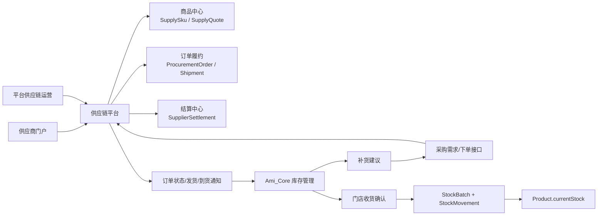

# 供应链平台一站式供货方案

版本：v1.1
日期：2026-06-21
适用范围：独立供应链平台、Ami_Core 管理端库存管理、server-v2、Ami Aura Lite 终端经营提醒

## 1. 最新结论

供应链平台应从 Ami_Core 管理端中拆出来，成为一个可独立运营、可让供应商自行上架产品和供货的平台。Ami_Core 管理端不再承载完整供应链后台，只在“库存管理”中保留必要入口：

1. 库存预警和补货建议。
2. 从供应链平台选择可采购商品并发起采购需求/采购订单。
3. 查看采购履约状态。
4. 门店确认收货后自动入库。
5. 查询与库存流水相关的采购来源。

因此，产品边界调整为：

> 供应链平台负责“供应商、商品上架、报价、供货、发货、结算”；Ami_Core 负责“门店库存主账、服务消耗、销售扣减、补货触发、收货入库”。

这意味着现有管理端中已经出现的供应商管理、供应链采购单、供应商结算等模块，长期应迁移到供应链平台；管理端库存管理只保留与门店库存闭环直接相关的轻入口。

## 2. 最新产品定位

### 2.1 供应链平台定位

供应链平台是 Ami 体系的供货与履约中台，面向供应商、平台供应链运营、连锁总部和门店库存系统提供服务。

核心目标：

- 让供应商可自行入驻、维护资质、上架商品、维护报价、接单发货。
- 让平台运营可审核商品、管理报价、监管履约和结算。
- 让 Ami_Core 库存管理能从供应链平台获得一站式供货能力。
- 让门店老板不需要自己找供应商、比价、催货和手工入库。

### 2.2 Ami_Core 管理端定位

Ami_Core 管理端仍是门店经营系统，不成为供应链运营后台。

管理端库存管理只保留：

| 保留能力 | 说明 |
| --- | --- |
| 库存列表 | 继续维护门店本地商品、库存数量、安全库存、批次和效期 |
| 服务/销售扣库存 | 继续由订单、次卡核销、项目 BOM、商品销售产生库存流水 |
| 补货建议 | 根据当前库存、消耗、在途数量、供应链可售商品生成建议 |
| 采购下单 | 调用供应链平台接口创建采购需求或订单 |
| 收货入库 | 门店确认到货后写 `StockBatch`、`StockMovement` 和 `Product.currentStock` |
| 状态查询 | 查询供应链订单状态、预计到货、物流、异常 |

管理端不再长期承载：

| 迁出能力 | 迁移目标 |
| --- | --- |
| 供应商资料管理 | 供应链平台供应商中心 |
| 供应商商品维护 | 供应链平台商品中心 |
| 报价、MOQ、交期维护 | 供应链平台报价中心 |
| 平台采购单运营 | 供应链平台订单中心 |
| 供应商发货管理 | 供应链平台履约中心/供应商门户 |
| 供应商月结、返利、平台服务费 | 供应链平台结算中心 |

## 3. 当前项目现状与迁移判断

### 3.1 已有基础

| 当前能力 | 当前对象/入口 | 迁移判断 |
| --- | --- | --- |
| 商品库存主账 | `Product.currentStock`、`safetyStock`、`StockMovement` | 保留在 Ami_Core |
| 服务耗材扣减 | `ProjectBomItem` + 订单/核销库存流水 | 保留在 Ami_Core |
| 补货建议 | `GET /inventory/replenishment`、`PurchaseManagement.tsx` | 保留入口，但供货数据来自供应链平台 |
| 旧采购单 | `PurchaseOrder`、`/inventory/purchase` | 降级为历史兼容，不作为新主线 |
| 供应商管理 | `Supplier`、`/supply-chain/suppliers` | 迁移到供应链平台 |
| 商品供应关系 | `ProductSupplier` | 迁移为供应链平台报价/映射能力，Ami_Core 只保留必要镜像 |
| 供应链采购单 | `SupplierOrder`、`/supply-chain/orders` | 迁移到供应链平台订单中心 |
| 收货入库 | `receiveOrder()` 写 `StockBatch` 和 `purchase_inbound` 流水 | 收货入库动作保留在 Ami_Core，但订单来源为供应链平台 |
| 供应商结算 | `SupplierSettlement`、`/supply-chain/settlements` | 迁移到供应链平台结算中心 |
| 权限菜单 | `core:supply:view/manage`、供应链菜单 | 管理端侧应逐步弱化，供应链平台使用独立权限体系 |

### 3.2 最新缺口

| 缺口 | 影响 |
| --- | --- |
| 供应链能力还嵌在管理端路由和权限里 | 未来供应商自助上架、接单和结算无法面向外部供应商开放 |
| 缺少平台级供应商门户 | 供应商不能自行维护商品、报价、库存和发货 |
| 缺少平台级 SKU/报价模型 | 当前更像门店商品绑定供应商，不是真正供货商品池 |
| 管理端补货入口还未变成接口消费方 | 容易把管理端继续做成采购后台 |
| 收货入库与外部履约状态边界不清 | 需要明确订单归供应链平台，库存入库归 Ami_Core |
| 结算能力没有独立运营边界 | 供应商结算、返利、平台服务费不应暴露在普通门店管理端 |

## 4. 目标业务架构



## 5. 角色与权限

| 角色 | 所属系统 | 核心能力 |
| --- | --- | --- |
| 供应商管理员 | 供应链平台 | 入驻资料、资质、商品上架、报价、接单、发货、售后 |
| 平台供应链运营 | 供应链平台 | 审核供应商和商品、维护类目、监管履约、处理异常 |
| 平台财务/结算 | 供应链平台 | 对账、返利、服务费、供应商付款、发票 |
| 连锁总部采购 | 供应链平台 + Ami_Core | 配置供应商池、采购策略、总部审批、统一价格 |
| 门店店长 | Ami_Core | 查看补货建议、确认下单、确认收货 |
| 库存管理员 | Ami_Core | 收货入库、批次效期、库存盘点、异常备注 |
| 美容师/前台 | Ami_Core / Ami Aura Lite | 只接收库存提醒，不接触供应商价格和结算 |

## 6. 核心业务闭环

### 6.1 供应商上架供货闭环

1. 供应商在供应链平台注册账号并提交资质。
2. 平台审核供应商资质、服务区域、主营品类和结算方式。
3. 供应商上架商品，维护品牌、规格、单位、图片、资质附件、起订量、供货库存。
4. 供应商维护报价，包含含税价、阶梯价、有效期、区域、交期。
5. 平台审核商品和报价。
6. 已审核商品进入供应链商品池，可被 Ami_Core 库存管理调用。

### 6.2 门店库存补货闭环

1. Ami_Core 根据 `Product.currentStock`、`safetyStock`、近 30 天消耗、在途数量生成补货建议。
2. 管理端库存管理查询供应链平台可供货商品和报价。
3. 店长确认商品、数量和期望到货时间。
4. Ami_Core 调用供应链平台创建采购需求或采购订单。
5. 供应商在供应链平台接单并发货。
6. Ami_Core 查询或接收订单状态和发货信息。
7. 门店确认收货。
8. Ami_Core 写入 `StockBatch`、`StockMovement(type=purchase_inbound)`，并更新 `Product.currentStock`。
9. 供应链平台收到收货确认，进入结算。

### 6.3 结算闭环

1. 供应链平台按已收货订单生成供应商月结。
2. 平台计算供应商应收、平台服务费、返利、优惠和异常扣款。
3. 平台财务确认结算。
4. 供应商查看对账单并确认。
5. 平台付款并归档。
6. Ami_Core 只保留门店采购成本和库存来源，不展示供应商结算细节。

## 7. 系统边界

### 7.1 供应链平台拥有的数据

| 数据 | 说明 |
| --- | --- |
| `Supplier` | 供应商主体、资质、联系人、服务区域、状态 |
| `SupplySku` | 供应商可供货商品，包含品牌、规格、单位、图片、条码、资质 |
| `SupplyQuote` | 供货报价、MOQ、交期、阶梯价、有效期、区域价 |
| `SupplyInventory` | 供应商可供库存或供货状态 |
| `ProcurementOrder` | 平台采购订单和履约状态 |
| `SupplierShipment` | 发货单、物流、批次、效期、发货数量 |
| `SupplierSettlement` | 供应商结算、返利、平台服务费 |
| `SupplyAfterSales` | 退换货、破损、少发、多发、售后处理 |

### 7.2 Ami_Core 拥有的数据

| 数据 | 说明 |
| --- | --- |
| `Product` | 门店本地商品/耗材档案和库存主账 |
| `StockBatch` | 门店实际到货批次和效期 |
| `StockMovement` | 门店库存流水，包含采购入库、销售出库、服务扣耗 |
| `ProjectBomItem` | 门店项目耗材标准 |
| `ProductOrder` / `CardUsageRecord` | 销售和服务消耗来源 |
| `InventoryReplenishmentSuggestion` | 门店侧补货建议结果，可由接口实时计算 |

### 7.3 双方共享/映射的数据

| 映射 | 用途 |
| --- | --- |
| `SupplySku` -> `Product` | 从平台商品创建门店商品，或将本地商品绑定可采购 SKU |
| `ProcurementOrder` -> `StockMovement.sourceId/sourceNo` | 收货入库后可追溯采购来源 |
| `SupplierShipment` -> `StockBatch` | 到货批次、生产日期、效期进入门店库存 |
| `SupplyQuote` -> 补货建议 | 用报价、MOQ、交期计算建议数量和金额 |

## 8. Ami_Core 管理端保留入口

### 8.1 库存管理页面

| 页面 | 保留/调整 | 目标形态 |
| --- | --- | --- |
| `/inventory/stock` 库存列表 | 保留 | 展示库存状态，并提供“补货”入口 |
| `/inventory/purchase` 采购管理 | 调整 | 只做补货建议、采购下单、采购状态、收货确认 |
| `/inventory/consumption` 服务消耗 | 保留 | 继续作为补货建议和成本分析的数据来源 |
| `/inventory/expiry` 临期管理 | 保留 | 临期商品不直接进入供应链平台，只影响补货建议 |
| `/inventory/transfer` 门店调拨 | 保留 | 多门店内部调拨仍属 Ami_Core |

### 8.2 管理端应下线或迁出的页面

| 当前页面 | 目标处理 |
| --- | --- |
| `/supply-chain/suppliers` | 迁移到供应链平台供应商中心，管理端不作为主入口 |
| `/supply-chain/orders` | 迁移到供应链平台订单中心；管理端只展示与本门店相关的采购状态 |
| `/supply-chain/settlements` | 迁移到供应链平台结算中心，门店管理端默认不可见 |

## 9. 供应链平台功能模块

### 9.1 供应商中心

P0 能力：

- 供应商注册、登录、资料维护。
- 营业执照、品牌授权、检测报告、发票信息上传。
- 平台审核：待审核、已通过、驳回、冻结、黑名单。
- 服务区域、主营品类、结算方式、默认交期。

### 9.2 商品上架中心

P0 能力：

- 供应商自行新增商品。
- 商品字段：名称、品牌、规格、单位、条码、图片、类目、效期、资质附件。
- 商品状态：草稿、待审核、已上架、已下架、锁定。
- 平台审核商品信息和资质。

P1 能力：

- 商品模板和类目标准化。
- 同类商品去重与合并。
- 替代品推荐。
- 与行业商品模板、BOM 耗材模板映射。

### 9.3 报价与供货中心

P0 能力：

- 供应商维护供货价、MOQ、交期、库存状态、报价有效期。
- 支持区域可售和指定门店可售。
- 平台审核报价后才允许被 Ami_Core 调用。

P1 能力：

- 阶梯价、合同价、连锁总部专属价。
- 价格变动记录和到期提醒。
- 价格保护和报价可见性规则。

### 9.4 采购订单与履约中心

P0 能力：

- 接收 Ami_Core 的采购需求/订单。
- 供应商确认接单或拒单。
- 供应商填写发货数量、物流、批次、生产日期、效期。
- 支持部分发货和部分收货。
- 订单状态同步给 Ami_Core。

P1 能力：

- 缺货替代推荐。
- 多供应商拆单。
- 异常履约评分。
- 售后退换货。

### 9.5 结算中心

P0 能力：

- 按已收货订单生成月结。
- 计算供应商应收、返利、平台服务费、异常扣款。
- 支持结算确认和付款标记。

P1 能力：

- 发票管理。
- 供应商对账确认。
- 平台收入看板。
- 连锁总部采购报表。

## 10. 接口设计建议

### 10.1 Ami_Core 调用供应链平台

| 能力 | 建议接口 | 用途 |
| --- | --- | --- |
| 查询可采购商品 | `GET /supply/skus` | 库存补货选择商品 |
| 查询报价 | `GET /supply/quotes` | 获取供货价、MOQ、交期 |
| 创建采购需求 | `POST /procurement/requisitions` | 门店从补货建议发起采购 |
| 创建采购订单 | `POST /procurement/orders` | 直接下单 |
| 查询订单状态 | `GET /procurement/orders/{id}` | 库存采购页展示履约状态 |
| 确认收货 | `POST /procurement/orders/{id}/receipts` | 门店收货后通知平台进入结算 |
| 查询发货单 | `GET /procurement/orders/{id}/shipments` | 获取批次、效期、物流 |

### 10.2 供应链平台回调 Ami_Core

| 事件 | 用途 |
| --- | --- |
| `supply.order.accepted` | 供应商已接单 |
| `supply.order.rejected` | 供应商拒单，需要门店重新选择供应商 |
| `supply.shipment.created` | 供应商已发货 |
| `supply.shipment.updated` | 物流或发货数量变更 |
| `supply.order.cancelled` | 订单取消 |
| `supply.quote.changed` | 报价变化，影响下次补货建议 |
| `supply.sku.offline` | 商品下架，影响本地商品可采购状态 |

## 11. 补货建议规则

补货建议仍由 Ami_Core 发起，因为真实库存、服务消耗和销售出库在 Ami_Core。

建议口径：

```text
建议补货量 = max(安全库存 * 2 - 当前库存 - 在途未收货数量, MOQ)
预计金额 = 建议补货量 * 供应链平台报价
建议原因 = 当前库存 + 安全库存 + 近30天消耗 + 在途数量 + 供应商交期
```

在途数量来自供应链平台订单状态：

- 统计已接单、已发货、部分收货但未完成的数量。
- 已取消、已拒单、已全部收货不计入。

如果供应链平台没有可供 SKU：

- 管理端展示“暂无平台供货，可手动采购”。
- 可保留手动采购入库，但不进入供应链结算。

## 12. 收货入库规则

门店确认收货时，Ami_Core 必须完成本地库存入账：

1. 从供应链平台读取订单、发货单、商品、数量、批次和效期。
2. 将 `SupplySku` 映射到本地 `Product`；若没有映射，引导创建本地商品。
3. 创建或更新 `StockBatch`。
4. 创建 `StockMovement`：
   - `movementType = purchase_inbound`
   - `sourceType = supply_platform_order`
   - `sourceId = 平台订单ID或本地镜像ID`
   - `sourceNo = 平台订单号`
5. 更新 `Product.currentStock`。
6. 回调供应链平台确认收货结果。

收货入库是 Ami_Core 的职责，不应由供应链平台直接改门店库存主账。

## 13. 数据迁移策略

### 13.1 管理端模块迁移

| 当前模块 | 迁移目标 | 迁移方式 |
| --- | --- | --- |
| `src/app/pages/supply-chain/SupplierManagement.tsx` | 供应链平台供应商中心 | 迁出为独立平台页面或后台应用 |
| `src/app/pages/supply-chain/PurchaseOrders.tsx` | 供应链平台订单中心 | 管理端保留门店采购状态轻视图 |
| `src/app/pages/supply-chain/SupplierSettlements.tsx` | 供应链平台结算中心 | 从管理端移除或仅平台管理员可见 |
| `src/api/real/supply-chain.ts` | 供应链平台 API client | 管理端改为调用开放接口，不直接维护平台数据 |
| `packages/server-v2/src/supply-chain` | 可先保留为过渡模块 | 后续拆为供应链平台服务或独立 bounded context |

### 13.2 数据迁移

| 当前数据 | 目标数据 |
| --- | --- |
| `Supplier` | 迁移为供应链平台供应商 |
| `ProductSupplier` | 拆为 `SupplyQuote` + `SupplyCatalogMapping` |
| `SupplierOrder` | 迁移为供应链平台采购订单，本地保留订单镜像和收货记录 |
| `SupplierSettlement` | 迁移为供应链平台结算单 |
| `PurchaseOrder` | 仅保留历史兼容，新增采购不再使用 |

迁移期间允许双轨：

- 老数据继续可查。
- 新补货订单走供应链平台订单。
- 管理端页面明确区分“历史采购单”和“平台供货订单”。

## 14. 分阶段路线

### Phase 1：边界收敛，2 周

目标：先把产品边界讲清楚，避免继续把供应链后台堆进管理端。

交付：

- 管理端供应链菜单标记为过渡能力。
- `/inventory/purchase` 改为库存补货入口，只聚焦补货、下单、状态、收货。
- API 契约明确：供应商、商品、报价、结算属于供应链平台；库存和入库属于 Ami_Core。
- 文档更新 `docs/api-contract.md` 和本方案。

### Phase 2：供应链平台 MVP，4 周

目标：供应商可以自行上架产品和供货。

交付：

- 供应商注册/登录/资料/资质审核。
- 供应商商品上架、报价、MOQ、交期、上下架。
- 平台审核商品和报价。
- Ami_Core 可查询可采购 SKU 和报价。

### Phase 3：采购履约打通，3 周

目标：管理端库存补货能调用供应链平台完成下单和状态同步。

交付：

- Ami_Core 从补货建议创建供应链平台采购需求/订单。
- 供应商接单、发货、部分发货。
- 管理端库存采购页查看订单状态、物流和预计到货。
- 门店收货后写本地库存并通知平台。

### Phase 4：结算与运营看板，3 周

目标：供应链平台具备商业化能力。

交付：

- 供应商月结、返利、平台服务费。
- 平台 GMV、订单履约率、缺货率、供应商评分。
- 门店采购降本、到货及时率、缺货减少率。

### Phase 5：连锁与智能补货增强，4 周

目标：支持连锁总部统一采购和更智能的补货。

交付：

- 总部供应商池、总部价格、采购审批。
- SKU 替代推荐。
- 基于预约、BOM、销售、在途订单的补货建议。
- 多门店调拨优先级：先调拨，后采购。

## 15. 验收标准

| 验收项 | 通过标准 |
| --- | --- |
| 供应商自助上架 | 供应商可提交商品和报价，平台审核后进入可采购商品池 |
| 管理端边界清晰 | 管理端库存页不维护供应商商品和结算，只调用供货接口 |
| 一键补货 | 低库存商品可从 Ami_Core 发起供应链平台采购订单 |
| 状态同步 | 供应商接单、发货、取消、部分发货能同步到管理端库存采购页 |
| 收货入库 | 门店确认收货后，本地库存增加并写库存流水 |
| 可追溯 | 库存流水能追溯到供应链平台订单号和发货单 |
| 结算独立 | 供应商结算在供应链平台完成，普通门店管理端不可见结算细节 |
| 兼容历史 | 旧 `PurchaseOrder` 可查，但新增主线采购走供应链平台 |

## 16. 推荐下一步

下一步不建议继续扩展管理端 `/supply-chain/*` 页面，而应先做一次“供应链平台边界收敛”：

1. 将本方案作为最新口径，覆盖旧的“管理端内置供应链后台”理解。
2. 在 `docs/api-contract.md` 增加“供应链平台开放接口”和“Ami_Core 库存接口边界”。
3. 将 `/inventory/purchase` 定义为唯一门店侧供货入口。
4. 将 `/supply-chain/suppliers`、`/supply-chain/orders`、`/supply-chain/settlements` 标记为过渡后台，后续迁到独立供应链平台。
5. 新增供应链平台 MVP 开发计划：供应商入驻、商品上架、报价审核、订单履约、结算。
