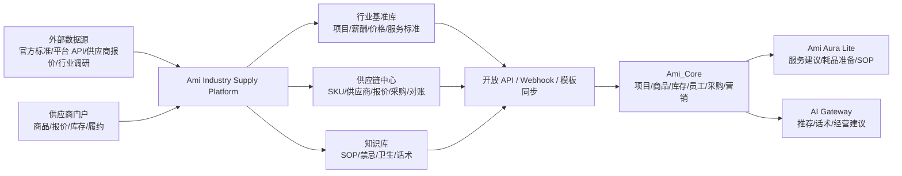
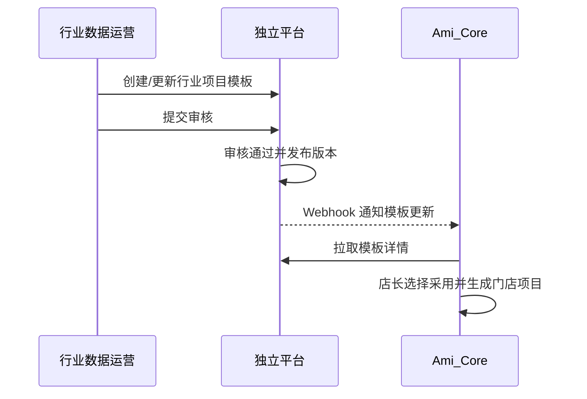
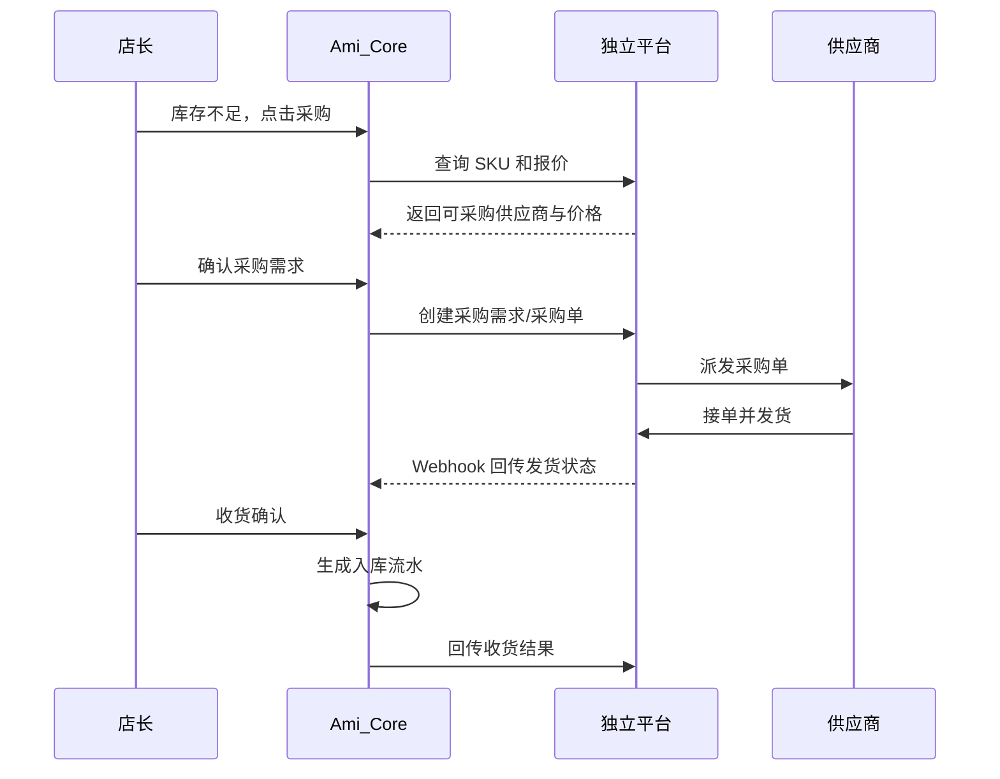
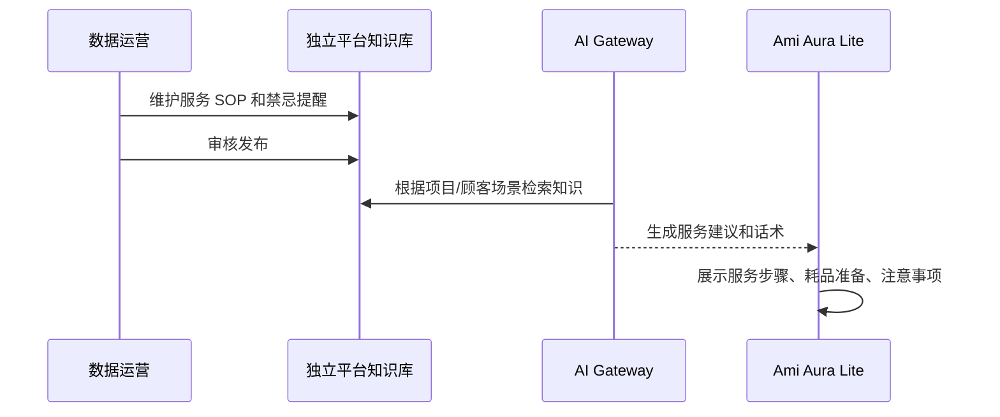

# 美业行业数据与供应链平台需求文档

版本：v1.0
日期：2026-06-07
产品暂定名：Ami Industry Supply Platform
适用范围：独立行业数据与供应链平台、Ami_Core 管理端、server-v2、Ami Aura Lite 终端、AI Gateway

## 1. 文档目的

本文定义一个独立于 Ami_Core 的美业行业数据与供应链平台。该平台负责沉淀行业数据、知识库、供应商、商品/耗品、报价、采购履约等能力，并通过 API、模板同步、事件回调等方式向 Ami_Core 提供行业配置和供应链服务。

平台不是 Ami_Core 的一个普通模块，而是可独立运营的数据与供应链中台。Ami_Core 继续负责门店经营，包括客户、项目、订单、库存、员工、营销、终端服务等；新平台负责更上游的行业基准、商品供应、采购协同和数据服务。

## 2. 背景

当前 Ami_Core 已覆盖门店经营主链路，包括商品、库存、项目、订单、客户、营销、终端服务和 AI 推荐。但门店在配置和经营过程中仍存在几个痛点：

1. 新门店初始化成本高：项目、商品、卡项、耗品、岗位薪酬都要从零配置。
2. 定价缺少参考：店长不知道同城同类项目合理价格、耗品成本和毛利空间。
3. 采购不透明：耗品和院装商品价格分散，供应商报价、起订量、批次、效期没有统一管理。
4. 服务标准难复制：服务 SOP、耗品用量、禁忌提醒、卫生规范分散在文档或经验中。
5. AI 推荐缺少行业知识支撑：模型知道通用美业常识，但缺少可审计、可更新、可配置的行业数据底座。

因此需要建设独立平台，把行业数据和供应链能力沉淀为 Ami 产品体系的上游能力。

## 3. 产品定位

### 3.1 一句话定位

Ami Industry Supply Platform 是面向美业门店、连锁总部、供应商和 Ami_Core 的行业配置与供应链数据平台，提供行业基准、知识库、供应商商品、采购履约和开放 API。

### 3.2 平台边界

| 能力 | 放在独立平台 | 放在 Ami_Core |
| --- | --- | --- |
| 行业项目模板 | 是 | 调用并落地为门店项目 |
| 行业商品/耗品模板 | 是 | 调用并落地为门店商品、库存商品 |
| 行业薪酬基准 | 是 | 调用并辅助员工岗位配置 |
| 服务 SOP 和知识库 | 是 | 调用给 AI、终端、培训、项目配置 |
| 供应商管理 | 是 | 仅展示可采购供应商和采购状态 |
| 供应商报价 | 是 | 调用参考价、采购价 |
| 采购询价/下单/履约 | 是 | 发起采购需求、接收采购结果和入库建议 |
| 门店库存流水 | 否 | 是 |
| 门店销售订单 | 否 | 是 |
| 门店服务消耗 | 否 | 是 |
| 顾客数据和会员资产 | 否 | 是 |
| AI 业务推荐 | 提供知识和数据 | 结合顾客、订单、库存执行推荐 |

## 4. 建设目标

### 4.1 业务目标

1. 为 Ami_Core 提供可调用的美业项目、商品、耗品、薪酬、服务标准模板。
2. 建立供应商、SKU、报价、采购履约、对账的供应链管理能力。
3. 让门店在 Ami_Core 中可以基于行业数据快速完成配置。
4. 让门店采购从“手工找供应商”升级为“系统推荐、比价、下单、履约追踪”。
5. 让 AI 和终端服务建议基于已审核的行业知识和真实供应链数据。

### 4.2 产品目标

1. 平台可独立登录和运营，支持平台运营、数据运营、供应商、连锁总部等角色。
2. Ami_Core 可通过 API 调用行业数据和供应链能力。
3. 所有外部数据必须可追溯来源、授权方式、更新时间和可信等级。
4. 所有发布给 Ami_Core 的行业数据必须经过审核和版本管理。
5. 供应链数据必须支持多租户隔离，供应商报价不能跨客户裸露。

## 5. 目标用户与角色

| 角色 | 使用系统 | 主要诉求 |
| --- | --- | --- |
| 平台超级管理员 | 独立平台 | 管理租户、权限、系统配置、数据源 |
| 行业数据运营 | 独立平台 | 维护行业模板、薪酬、价格、知识库、数据质量 |
| 供应链运营 | 独立平台 | 管理供应商、SKU、报价、采购履约、对账 |
| 供应商管理员 | 独立平台供应商门户 | 维护商品、报价、库存、发货、售后 |
| 连锁总部管理员 | 独立平台 + Ami_Core | 建立总部标准品类、供应商池、门店采购策略 |
| 门店店长 | Ami_Core | 调用行业模板、查看建议价、发起采购、跟踪到货 |
| 美容师/顾问 | Ami Aura Lite / Ami_Core | 查看服务 SOP、耗品准备、推荐原因 |
| Ami 系统管理员 | Ami_Core | 配置平台连接、同步规则、接口密钥、数据权限 |

## 6. 总体架构



## 7. 核心功能需求

### 7.1 行业数据中心

#### 7.1.1 数据源管理

| 编号 | 需求 | 优先级 |
| --- | --- | --- |
| ID-001 | 支持维护数据源，包括官方公开、平台 API、供应商报价、门店内部、人工调研、第三方报告 | P0 |
| ID-002 | 每个数据源需记录授权方式、使用范围、可信等级、更新频率、负责人、到期时间 | P0 |
| ID-003 | 支持上传原始证据，包括链接、PDF、Excel、报价单、截图、合同附件 | P0 |
| ID-004 | 支持数据源状态：待接入、接入中、可用、暂停、到期、废弃 | P1 |
| ID-005 | 支持数据源变更审计，记录谁在什么时候修改了什么字段 | P1 |

#### 7.1.2 行业项目库

| 编号 | 需求 | 优先级 |
| --- | --- | --- |
| ID-010 | 支持维护服务项目分类，如面部护理、身体护理、美睫、美甲、头皮护理、美发、轻养生 | P0 |
| ID-011 | 支持维护项目标准名称、别名、适用人群、禁忌、建议时长、建议价格区间 | P0 |
| ID-012 | 支持维护项目标准耗品清单和单次标准用量 | P0 |
| ID-013 | 支持按城市、门店定位、门店类型维护价格带 | P1 |
| ID-014 | 支持项目模板发布给 Ami_Core，Ami_Core 可一键采用并生成门店项目 | P0 |
| ID-015 | 支持项目模板版本管理，历史版本可追溯 | P1 |

#### 7.1.3 行业商品与耗品模板库

| 编号 | 需求 | 优先级 |
| --- | --- | --- |
| ID-020 | 支持维护商品/耗品分类、品牌、规格、单位、包装、条码、适用项目 | P0 |
| ID-021 | 支持区分零售商品、院装耗品、一次性耗材、仪器耗材、消毒用品 | P0 |
| ID-022 | 支持维护参考采购价、参考零售价、建议毛利率、效期规则 | P0 |
| ID-023 | 支持规格标准化，如 ml、g、片、盒、支、套等单位换算 | P1 |
| ID-024 | 支持模板同步给 Ami_Core 商品管理和库存商品 | P0 |

#### 7.1.4 行业薪酬与岗位库

| 编号 | 需求 | 优先级 |
| --- | --- | --- |
| ID-030 | 支持岗位模板，包括美容师、美发师、顾问、前台、店长、店助、培训师 | P0 |
| ID-031 | 支持维护岗位等级、能力要求、底薪区间、提成区间、手工费区间 | P0 |
| ID-032 | 支持按城市、门店定位、员工等级维护薪酬参考 | P1 |
| ID-033 | 支持同步到 Ami_Core 员工岗位、等级、绩效配置页作为参考 | P0 |

#### 7.1.5 行业知识库

| 编号 | 需求 | 优先级 |
| --- | --- | --- |
| ID-040 | 支持维护服务 SOP、卫生规范、职业技能标准、禁忌提醒、产品成分、销售话术 | P0 |
| ID-041 | 知识条目支持标签、适用项目、适用岗位、适用终端场景 | P0 |
| ID-042 | 知识条目支持结构化字段和正文内容同时保存 | P0 |
| ID-043 | 支持审核流程：草稿、待审核、已发布、已下线 | P0 |
| ID-044 | 支持向 AI Gateway 提供已发布知识，不允许 AI 调用未审核内容 | P0 |
| ID-045 | 支持知识版本管理和失效日期 | P1 |

### 7.2 供应链管理中心

#### 7.2.1 供应商管理

| 编号 | 需求 | 优先级 |
| --- | --- | --- |
| SC-001 | 支持供应商入驻、资质上传、审核、启用、停用 | P0 |
| SC-002 | 支持供应商基础信息：公司、联系人、区域、主营品类、结算方式、发票信息 | P0 |
| SC-003 | 支持供应商服务范围：全国、区域、省、市、指定门店 | P0 |
| SC-004 | 支持供应商评级：价格、履约、售后、质量、时效 | P1 |
| SC-005 | 支持黑名单和风险提示 | P1 |

#### 7.2.2 供应链 SKU 中心

| 编号 | 需求 | 优先级 |
| --- | --- | --- |
| SC-010 | 支持供应商维护 SKU、规格、图片、条码、品牌、分类、起订量、效期、库存状态 | P0 |
| SC-011 | 支持平台将供应商 SKU 映射到行业商品/耗品模板 | P0 |
| SC-012 | 支持 SKU 上架、下架、审核、锁定、替代品推荐 | P0 |
| SC-013 | 支持同一标准品关联多个供应商 SKU，用于比价 | P1 |
| SC-014 | 支持商品资质、检测报告、授权书、使用说明附件 | P1 |

#### 7.2.3 报价与价格策略

| 编号 | 需求 | 优先级 |
| --- | --- | --- |
| SC-020 | 支持供应商维护报价，包含含税价、不含税价、阶梯价、起订量、有效期 | P0 |
| SC-021 | 支持按租户、连锁总部、区域、门店、采购量设置专属报价 | P0 |
| SC-022 | 支持报价审核，审核通过后才可被 Ami_Core 采购调用 | P0 |
| SC-023 | 支持历史价格曲线和价格变动提醒 | P1 |
| SC-024 | 支持价格保护和不可见规则，避免供应商报价互相暴露 | P0 |

#### 7.2.4 采购需求与订单

| 编号 | 需求 | 优先级 |
| --- | --- | --- |
| SC-030 | Ami_Core 可发起采购需求，包含门店、商品、数量、期望到货时间、备注 | P0 |
| SC-031 | 平台可根据采购需求推荐供应商和报价 | P0 |
| SC-032 | 支持采购单创建、确认、供应商接单、发货、到货、取消 | P0 |
| SC-033 | 支持采购单状态同步回 Ami_Core | P0 |
| SC-034 | 支持部分发货、部分到货、缺货替代建议 | P1 |
| SC-035 | 支持采购审批规则，如金额阈值、总部审批、门店自采权限 | P1 |

#### 7.2.5 收货、入库与对账

| 编号 | 需求 | 优先级 |
| --- | --- | --- |
| SC-040 | 供应商发货后，Ami_Core 可查看物流、批次、效期、发货数量 | P0 |
| SC-041 | 门店在 Ami_Core 完成收货确认后，平台记录履约完成 | P0 |
| SC-042 | Ami_Core 收货确认后，可按采购单生成库存入库建议 | P0 |
| SC-043 | 支持采购差异：少发、多发、破损、过期、拒收 | P1 |
| SC-044 | 支持对账单生成，包含订单、收货、退货、优惠、税费、应付金额 | P1 |

#### 7.2.6 补货建议

| 编号 | 需求 | 优先级 |
| --- | --- | --- |
| SC-050 | Ami_Core 可把库存、消耗、销售数据按授权范围回传给平台 | P1 |
| SC-051 | 平台根据消耗速度、安全库存、供应周期生成补货建议 | P1 |
| SC-052 | 补货建议可回传 Ami_Core，由店长确认后生成采购需求 | P1 |

### 7.3 开放 API 与集成服务

#### 7.3.1 Ami_Core 调用行业数据

| 编号 | 接口能力 | 说明 | 优先级 |
| --- | --- | --- | --- |
| API-001 | 查询行业项目模板 | 按分类、城市、门店定位、关键词查询 | P0 |
| API-002 | 查询商品/耗品模板 | 按品类、品牌、规格、适用项目查询 | P0 |
| API-003 | 查询薪酬模板 | 按城市、岗位、等级、门店定位查询 | P0 |
| API-004 | 查询服务 SOP | 按项目、岗位、终端场景查询 | P0 |
| API-005 | 查询价格/成本基准 | 返回参考价、耗品成本、可信等级和来源摘要 | P0 |

建议路径示例：

```text
GET /industry/service-templates
GET /industry/product-templates
GET /industry/salary-benchmarks
GET /industry/service-benchmarks
GET /knowledge/items
```

#### 7.3.2 Ami_Core 调用供应链

| 编号 | 接口能力 | 说明 | 优先级 |
| --- | --- | --- | --- |
| API-010 | 搜索可采购 SKU | 按标准品、供应商、价格、区域查询 | P0 |
| API-011 | 查询 SKU 报价 | 返回可见报价、起订量、有效期、供应商 | P0 |
| API-012 | 创建采购需求 | Ami_Core 发起采购需求 | P0 |
| API-013 | 创建采购单 | 采购需求确认后生成采购单 | P0 |
| API-014 | 查询采购单状态 | Ami_Core 展示履约状态 | P0 |
| API-015 | 收货确认回传 | Ami_Core 完成收货后回传平台 | P0 |

建议路径示例：

```text
GET /supply/skus
GET /supply/quotes
POST /procurement/requisitions
POST /procurement/orders
GET /procurement/orders/{id}
POST /procurement/orders/{id}/receipts
```

#### 7.3.3 Webhook 回调

平台需向 Ami_Core 支持事件回调：

| 事件 | 说明 |
| --- | --- |
| `industry.template.published` | 行业模板发布或更新 |
| `supply.sku.updated` | 可采购 SKU 更新 |
| `quote.updated` | 报价更新 |
| `procurement.order.confirmed` | 供应商确认采购单 |
| `procurement.order.shipped` | 采购单发货 |
| `procurement.order.partially_shipped` | 部分发货 |
| `procurement.order.cancelled` | 采购单取消 |
| `procurement.order.after_sales_updated` | 售后状态更新 |

Webhook 要求：

1. 支持签名校验。
2. 支持幂等事件 ID。
3. 支持失败重试。
4. Ami_Core 可在后台查看最近回调记录和失败原因。

## 8. Ami_Core 侧改造需求

### 8.1 系统设置

1. 新增“行业数据与供应链平台连接”配置。
2. 支持配置平台 API 地址、租户 ID、应用 ID、密钥、Webhook 密钥。
3. 支持测试连接。
4. 支持开启/关闭行业模板调用、供应链采购调用、知识库调用。

### 8.2 项目管理

1. 新增“从行业模板创建项目”。
2. 项目编辑页显示建议价、建议时长、标准耗品成本、服务 SOP。
3. 支持一键采用建议字段，也支持仅查看不采用。

### 8.3 商品与库存

1. 新增“从供应链 SKU 创建商品/耗品”。
2. 商品详情显示参考采购价、供应商报价、历史价格趋势。
3. 库存低于阈值时，可调用平台生成采购建议。
4. 收货确认后，沿用 Ami_Core 现有 `StockBatch`、`StockMovement` 规则生成入库记录。

### 8.4 员工与薪酬

1. 岗位配置页显示行业岗位模板和薪酬区间。
2. 美容师等级配置可参考职业技能等级。
3. 绩效方案可显示行业提成区间，但最终仍由门店确认。

### 8.5 AI 与终端

1. AI Gateway 调用已发布知识库，生成服务建议、顾问话术、培训内容。
2. Ami Aura Lite 终端展示服务 SOP、耗品准备、禁忌提醒。
3. AI 输出需标记数据来源为“行业知识库/门店数据/模型生成”，便于用户理解可信度。

## 9. 数据对象

### 9.1 独立平台核心对象

| 对象 | 说明 |
| --- | --- |
| `Tenant` | 平台租户，可对应 Ami 客户、连锁总部或内部运营空间 |
| `IndustryDataSource` | 行业数据来源 |
| `IndustryTemplate` | 行业模板基类，可扩展项目、商品、岗位 |
| `IndustryServiceTemplate` | 服务项目模板 |
| `IndustryProductTemplate` | 商品/耗品模板 |
| `IndustrySalaryBenchmark` | 薪酬基准 |
| `IndustryKnowledgeItem` | 知识库条目 |
| `Supplier` | 供应商 |
| `SupplierQualification` | 供应商资质 |
| `SupplySku` | 供应链 SKU |
| `SupplyQuote` | 报价 |
| `ProcurementRequisition` | 采购需求 |
| `ProcurementOrder` | 采购单 |
| `ProcurementShipment` | 发货记录 |
| `ProcurementReceipt` | 收货记录 |
| `ReconciliationStatement` | 对账单 |

### 9.2 Ami_Core 映射关系

| 独立平台 | Ami_Core | 说明 |
| --- | --- | --- |
| `IndustryServiceTemplate` | `Project` | 行业项目模板生成门店项目 |
| `IndustryProductTemplate` / `SupplySku` | `Product` | 商品/耗品模板生成门店商品 |
| `SupplyQuote` | 商品采购价参考 | 不直接覆盖门店成本价，需用户确认 |
| `ProcurementReceipt` | `StockBatch` / `StockMovement` | 收货确认后生成库存入库 |
| `IndustrySalaryBenchmark` | 员工等级/岗位配置 | 仅作为参考 |
| `IndustryKnowledgeItem` | AI / 终端知识调用 | 只调用已发布知识 |

## 10. 权限与租户隔离

1. 平台必须支持多租户。
2. 平台运营可看全局数据，供应商只能看自己的商品、报价、订单。
3. 连锁总部可看总部授权范围内的门店采购数据。
4. 单店只能看本门店可见供应商、可见报价、自己的采购单。
5. 供应商报价支持可见范围，不同租户可看到不同价格。
6. Ami_Core 调用 API 时必须带租户、门店、用户、权限上下文。
7. 所有关键操作必须写审计日志。

## 11. 非功能需求

| 类别 | 要求 |
| --- | --- |
| 安全 | API 使用应用密钥或 JWT，Webhook 使用签名，敏感字段加密存储 |
| 隔离 | 多租户数据隔离，供应商报价和合同价不能跨租户泄露 |
| 审计 | 数据源、报价、采购单、知识发布、接口调用均需审计 |
| 版本 | 行业模板、知识库、报价均需版本或历史记录 |
| 可用性 | 核心查询接口目标可用性 99.5% 起步 |
| 性能 | 行业模板查询 P95 小于 500ms，供应链报价查询 P95 小于 800ms |
| 幂等 | 采购单创建、收货确认、Webhook 事件必须支持幂等 |
| 可追溯 | 行业数据必须能追溯来源、证据、更新时间、审核人 |
| 可降级 | 平台不可用时，Ami_Core 仍可使用本地已同步模板和门店自有数据 |

## 12. MVP 范围

最新版 MVP 详见 `docs/02-产品设计/美业行业数据与供应链平台MVP方案.md`。项目 BOM 是首版核心能力，不再作为后续增强项。

### 12.1 MVP 必做

1. 独立平台登录和基础权限。
2. 行业数据源管理。
3. 服务项目模板库。
4. 项目 BOM 模板库，为服务项目维护标准耗品、用量、单位、损耗率、标准成本和可替代 SKU。
5. 商品/耗品模板库。
6. 岗位薪酬模板库。
7. 知识库条目管理和发布。
8. 供应商管理。
9. SKU 和报价管理。
10. Ami_Core 查询行业模板 API。
11. Ami_Core 查询并采用项目 BOM，生成本地 `ProjectBomItem`。
12. Ami_Core 搜索 SKU、查看报价、创建采购需求、查询采购状态。
13. Webhook 同步采购单状态。
14. Ami_Core 项目、商品、员工配置页展示行业参考。
15. Ami_Core 服务消耗、库存扣减和经营利润模块可使用项目 BOM 做成本估算和缺口提示。

### 12.2 MVP 暂不做

1. 自动爬取平台价格。
2. 自动付款和在线结算。
3. 复杂财务对账。
4. 多级分销。
5. 跨供应商自动拆单。
6. 供应链金融。
7. 医疗美容诊疗标准和医疗处方类知识。
8. 向第三方门店开放售卖行业大数据。

## 13. 核心业务流程

### 13.1 行业模板发布到 Ami_Core



### 13.2 Ami_Core 发起采购



### 13.3 知识库供 AI 和终端调用



## 14. 验收标准

### 14.1 行业数据

1. 平台可创建并发布服务项目、商品/耗品、岗位薪酬、知识条目。
2. 每条已发布行业数据都能查看来源、审核人、发布时间和版本。
3. Ami_Core 可以查询并采用行业项目模板生成门店项目。
4. Ami_Core 可以查询商品/耗品模板并生成门店商品。
5. Ami_Core 可以查询薪酬模板并在岗位配置页展示参考区间。

### 14.2 供应链

1. 平台可创建供应商、SKU、报价。
2. Ami_Core 可以搜索可采购 SKU，并查看供应商报价。
3. Ami_Core 可以创建采购需求或采购单。
4. 平台采购单状态变化后，Ami_Core 能收到回调并展示最新状态。
5. Ami_Core 收货确认后，能生成本地库存入库流水，并把收货结果回传平台。

### 14.3 安全与隔离

1. 不同门店看不到未授权供应商报价。
2. 供应商看不到其他供应商商品和报价。
3. Webhook 签名校验失败时不能更新采购状态。
4. 重复回调不会导致采购状态或库存重复写入。
5. 所有采购单、报价、知识发布操作都有审计记录。

## 15. 关键风险

| 风险 | 影响 | 应对 |
| --- | --- | --- |
| 外部平台数据授权难 | 无法直接拿到完整价格和交易数据 | MVP 先用供应商报价、门店采购、人工模板 |
| 商品规格不统一 | 比价和耗材成本计算不准 | 建立标准品和供应商 SKU 映射 |
| 报价泄露 | 供应商合作风险 | 做租户隔离、可见范围、接口审计 |
| Ami_Core 与平台职责混乱 | 重复建设库存/订单 | 明确平台管供应链采购，Ami_Core 管门店库存和销售 |
| AI 使用未审核知识 | 可能输出错误或违规建议 | AI 只调用已发布知识，知识有版本和来源 |
| 供应商履约不稳定 | 影响门店采购体验 | 建供应商评级、履约记录、替代供应商 |

## 16. 里程碑建议

### M1：行业数据平台 MVP

周期：2-3 周

交付：

- 数据源管理。
- 项目模板、商品模板、岗位薪酬模板。
- 知识库发布。
- Ami_Core 查询和采用模板。

### M2：供应链基础能力

周期：3-5 周

交付：

- 供应商管理。
- SKU 管理。
- 报价管理。
- Ami_Core 搜索 SKU 和创建采购需求。

### M3：采购履约闭环

周期：3-5 周

交付：

- 采购单、接单、发货、收货。
- Webhook 回调。
- Ami_Core 入库联动。
- 基础对账字段。

### M4：智能补货与行业经营建议

周期：4-6 周

交付：

- 基于 Ami_Core 库存、消耗、销售的补货建议。
- 价格波动提醒。
- 项目毛利与耗品成本分析。
- AI 推荐调用行业知识和供应链价格。

## 17. 产品命名建议

可选命名：

1. Ami Industry Supply Platform：偏平台和中台，适合内部产品线。
2. Ami Supply Intelligence：强调供应链智能。
3. Ami Beauty Data Cloud：强调行业数据云。
4. Ami Beauty Supply Hub：强调供应链枢纽。

建议内部先使用 `Ami Industry Supply Platform`，对外可包装为“美业行业配置库 + 智能供应链平台”。
