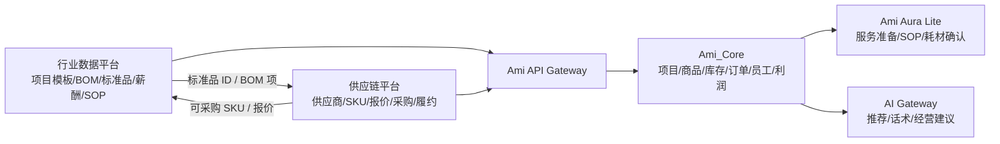

# 行业数据平台与供应链平台拆分对比方案

版本：v1.0
日期：2026-06-20
关联文档：

- `docs/02-产品设计/美业行业数据与供应链平台需求文档.md`
- `docs/02-产品设计/美业行业数据与供应链平台MVP方案.md`

## 1. 结论

建议从产品和组织边界上拆成两个平台：

1. **Ami Industry Data Platform：行业数据平台**
2. **Ami Supply Chain Platform：供应链平台**

但在 MVP 技术实现上，不建议一开始完全拆成两个孤立系统。更稳妥的方式是：

> 产品边界先拆清楚，后台权限、菜单、数据域、API 命名先拆清楚；技术部署可以先共用一套服务和数据库，等供应链交易规模、供应商门户、采购履约复杂度上来后，再拆成独立服务。

核心原因：

- 行业数据平台是“标准和知识”：项目模板、项目 BOM、商品/耗品标准品、薪酬、SOP、卫生安全。
- 供应链平台是“交易和履约”：供应商、SKU、报价、采购需求、采购单、发货、收货、售后、对账。
- 两者通过“标准品/项目 BOM/SKU 映射”连接。
- Ami_Core 不应该直接感知内部是一体平台还是两个平台，只需要通过统一 API 网关调用行业配置和供应链能力。

## 2. 方案定义

### 2.1 当前方案：行业数据与供应链一体平台

当前文档中的方案是一个独立平台，内部同时包含：

- 行业基准库
- 项目模板库
- 项目 BOM 模板库
- 商品/耗品模板库
- 岗位薪酬模板
- 知识库
- 供应商
- SKU
- 报价
- 采购履约
- Webhook/API

产品定位是一个综合型“行业数据与供应链中台”。

### 2.2 拆分方案：两个平台

拆分后，平台边界如下：

| 平台 | 定位 | 核心职责 |
| --- | --- | --- |
| 行业数据平台 | 行业标准、模板、知识和配置基准 | 项目模板、项目 BOM、标准商品/耗品、薪酬基准、SOP、卫生安全、价格/成本基准 |
| 供应链平台 | 供应商商品、报价、采购和履约 | 供应商、供应链 SKU、报价、采购需求、采购单、发货、收货、售后、对账 |
| Ami_Core | 门店经营系统 | 门店项目、商品、库存、订单、服务消耗、客户、员工、营销、经营利润 |

## 3. 能力边界对比

| 能力 | 一体平台方案 | 拆分为两个平台 |
| --- | --- | --- |
| 项目模板 | 一体平台内维护 | 行业数据平台维护 |
| 项目 BOM 模板 | 一体平台内维护，直接可映射 SKU | 行业数据平台维护 BOM 标准；供应链平台提供 SKU 映射和报价 |
| 商品/耗品模板 | 一体平台内维护 | 行业数据平台维护标准品 |
| 供应链 SKU | 一体平台内维护 | 供应链平台维护，映射行业标准品 |
| 报价 | 一体平台内维护 | 供应链平台维护 |
| 薪酬基准 | 一体平台内维护 | 行业数据平台维护 |
| SOP/知识库 | 一体平台内维护 | 行业数据平台维护 |
| 采购履约 | 一体平台内维护 | 供应链平台维护 |
| 数据源管理 | 行业和供应链来源混在同一套管理 | 行业来源归行业数据平台，供应商/报价来源归供应链平台 |
| 运营角色 | 数据运营和供应链运营共用后台 | 两类运营后台可分离，职责更清楚 |
| 对 Ami_Core 调用 | 一个平台 API | API 网关统一暴露，内部路由到两个平台 |

## 4. 产品价值对比

| 维度 | 一体平台 | 拆分两个平台 |
| --- | --- | --- |
| 首版交付速度 | 快，系统少，接口少 | 中等，需要定义两个平台边界和中间契约 |
| 产品边界清晰度 | 中等，行业数据和交易履约容易混在一起 | 高，标准归标准，交易归交易 |
| 后续商业化 | 容易变成一个大中台，包装复杂 | 更利于分别商业化：行业数据订阅、供应链交易服务 |
| 组织协作 | 初期简单 | 更适合后续数据运营、供应链运营、供应商 BD 分工 |
| 技术复杂度 | 初期低，后期容易变重 | 初期略高，长期可演进性更好 |
| 供应商接入 | 简单接入即可 | 更适合做供应商门户和报价权限隔离 |
| 数据治理 | 行业标准和交易数据可能混杂 | 数据口径更干净 |
| Ami_Core 使用体验 | 可做成无感 | 仍可通过统一 API 做成无感 |

## 5. 项目 BOM 的归属建议

项目 BOM 是拆分方案里最关键的边界点。

### 5.1 推荐归属

| BOM 内容 | 归属平台 | 说明 |
| --- | --- | --- |
| 项目标准 BOM 模板 | 行业数据平台 | 定义一个服务项目标准消耗什么、多少、是否必需 |
| BOM 项对应的标准商品/耗品 | 行业数据平台 | 使用标准品，而不是直接绑定某个供应商商品 |
| 标准品到供应链 SKU 的映射 | 供应链平台 | 同一个标准品可以有多个供应商 SKU |
| SKU 报价、起订量、库存、区域 | 供应链平台 | 属于交易和履约数据 |
| 门店采用后的项目 BOM | Ami_Core | 门店项目自己的 BOM 快照，可被店长调整 |
| 实际服务消耗 | Ami_Core | 来自服务记录和库存扣减 |

### 5.2 为什么不能把 BOM 全放供应链平台

如果 BOM 全放供应链平台，会出现问题：

1. 项目标准会被供应商商品绑架，失去行业中立性。
2. 没有供应商 SKU 的耗品无法进入项目标准。
3. 服务 SOP、成本估算、终端准备清单会依赖交易系统。
4. 行业模板很难沉淀为可复用标准。

### 5.3 为什么不能把 SKU 和报价放行业数据平台

如果 SKU 和报价也放行业数据平台，会出现问题：

1. 报价有租户、区域、有效期、合同价、阶梯价，复杂度高。
2. 供应商报价需要严格隔离，和公开行业数据权限模型不同。
3. 采购履约、发货、收货、售后、对账不是行业知识问题。

因此最稳的边界是：

> 行业数据平台定义“应该用什么标准耗品”；供应链平台回答“现在从谁那里买、多少钱、能不能发货”。

## 6. 推荐架构



### 6.1 API 网关原则

Ami_Core 不直接关心内部拆分，统一通过 Ami API Gateway 调用：

```text
GET /industry/service-templates
GET /industry/service-templates/{id}/bom
GET /industry/product-templates
GET /industry/salary-benchmarks
GET /knowledge/items

GET /supply/skus
GET /supply/quotes
POST /procurement/requisitions
GET /procurement/requisitions/{id}
```

即使后端拆成两个平台，Ami_Core 前端和 server-v2 的调用口径也保持稳定。

## 7. 数据对象拆分

### 7.1 行业数据平台对象

| 对象 | 说明 |
| --- | --- |
| `IndustryDataSource` | 行业数据来源 |
| `IndustryServiceTemplate` | 服务项目模板 |
| `IndustryProjectBomTemplate` | 项目 BOM 模板 |
| `IndustryProjectBomItemTemplate` | 项目 BOM 明细 |
| `IndustryProductTemplate` | 标准商品/耗品模板 |
| `IndustrySalaryBenchmark` | 岗位薪酬基准 |
| `IndustryKnowledgeItem` | SOP、禁忌、卫生、话术 |
| `IndustryTemplateVersion` | 模板版本 |
| `IndustryAdoptionRecord` | Ami_Core 采用记录 |

### 7.2 供应链平台对象

| 对象 | 说明 |
| --- | --- |
| `Supplier` | 供应商 |
| `SupplierQualification` | 供应商资质 |
| `SupplySku` | 供应商 SKU |
| `StandardProductSkuMapping` | 行业标准品到供应链 SKU 的映射 |
| `SupplyQuote` | 报价 |
| `ProcurementRequisition` | 采购需求 |
| `ProcurementOrder` | 采购单 |
| `ProcurementShipment` | 发货记录 |
| `ProcurementReceipt` | 收货记录 |
| `AfterSalesRequest` | 售后 |
| `ReconciliationStatement` | 对账单 |

### 7.3 Ami_Core 对象

| 对象 | 说明 |
| --- | --- |
| `Project` | 门店项目 |
| `ProjectBomItem` | 门店项目 BOM 快照 |
| `Product` | 门店商品/耗品 |
| `StockBatch` | 库存批次 |
| `StockMovement` | 库存流水 |
| `ServiceTask` | 服务任务 |
| `ConsumptionRecord` | 服务消耗记录 |
| `ProductOrder` / `OrderItem` | 销售和项目订单 |

## 8. MVP 对比

### 8.1 当前一体平台 MVP

| 模块 | 内容 |
| --- | --- |
| 行业服务项目模板 | 50 个 |
| 项目 BOM 模板 | 50 套 |
| 商品/耗品模板 | 100 个 |
| 供应链 SKU/报价 | 50 个 SKU、50 条报价 |
| 岗位薪酬模板 | 10 个 |
| 知识库 | SOP、卫生安全、话术 |
| Ami_Core 调用 | 采用项目、商品、BOM，查看报价，创建采购需求 |

优点：

- 首版路径短。
- 数据和 SKU 映射可以在一个后台完成。
- 对 Ami_Core 集成简单。

问题：

- 后续供应链交易复杂后，平台会膨胀。
- 数据运营和供应链运营权限容易纠缠。
- 供应商门户、报价隔离、采购履约会把行业数据平台复杂化。

### 8.2 拆分后最新 MVP

#### 行业数据平台 MVP

最新优先级：先做行业数据平台，供应链平台不进入首期 MVP。行业模板数量不再按固定条数验收，改为按“成熟市场项目、商品、耗品、岗位的主流经营场景覆盖”和“能否被 Ami_Core 直接采用配置”验收。

| 模块 | 内容 |
| --- | --- |
| 行业数据源管理 | 官方标准、人工调研、第三方报告、门店脱敏汇总 |
| 服务项目模板 | 基于市场成熟项目建立首版模板包，不限定固定数量 |
| 项目 BOM 模板 | 纳入首版项目原则上配置标准 BOM；暂无法标准化的需标记原因 |
| 标准商品/耗品模板 | 基于成熟项目 BOM 和门店常用耗品建立标准品库，不限定固定数量 |
| 岗位薪酬模板 | 覆盖门店核心岗位和等级 |
| 知识库 | 覆盖 SOP、禁忌、卫生安全、销售话术、培训知识 |
| 发布能力 | 模板审核、版本发布、Ami_Core 采用记录 |
| 供应链预留 | 标准品编码、供应链类目编码、未来映射键、占位查询接口 |

#### 供应链平台

| 模块 | 内容 |
| --- | --- |
| 供应商管理 | 首期不做，未来供应链平台建设 |
| 供应链 SKU | 首期不做，行业数据平台只预留标准品映射字段 |
| 标准品-SKU 映射 | 首期不做真实映射，只保留未来映射状态 |
| 报价管理 | 首期不做实时报价，只维护行业参考成本区间 |
| 采购需求 | 首期不做采购需求，只保留未来接口路径 |
| 状态同步 | 首期不做采购状态同步 |

#### Ami_Core 集成 MVP

| 模块 | 内容 |
| --- | --- |
| 项目管理 | 从行业数据平台采用项目模板和 BOM |
| 商品管理 | 从行业标准品创建商品/耗品，暂不从供应链 SKU 创建 |
| 服务消耗 | 按门店项目 BOM 生成默认耗材清单 |
| 经营利润 | 实耗优先，缺实耗时按 BOM 估算 |
| 库存采购 | 首期不做采购闭环；仅保留未来由 BOM/库存触发供应链采购的接口预留 |

## 9. 关键差异

| 维度 | 一体平台 | 拆分平台 |
| --- | --- | --- |
| 产品线数量 | 1 个 | 2 个 |
| 后台入口 | 一个后台内分模块 | 两个后台，或同一后台两个工作台 |
| 数据模型 | 行业模板和供应链交易在同一域 | 标准数据和交易数据分域 |
| 项目 BOM | 平台内同时管理标准 BOM 和 SKU 映射 | 行业平台管标准 BOM，供应链平台管 SKU 映射 |
| 供应商门户 | 后续内嵌进一体平台 | 天然属于供应链平台 |
| 商业化 | 更像综合中台 | 可分别做数据订阅和供应链服务 |
| 风险 | 后续大而全 | 初期接口契约更多 |
| 推荐程度 | 适合快速验证 | 更适合长期产品化 |

## 10. 推荐决策

### 10.1 产品推荐

推荐采用“拆分平台”的产品架构：

1. 行业数据平台：先做行业标准和配置能力。
2. 供应链平台：先做供应商、SKU、报价和采购需求。
3. Ami_Core：只作为调用方和门店经营落地方。

这样更符合长期业务边界，也更方便未来分别扩展：

- 行业数据平台可以做成行业模板、知识库、经营基准订阅。
- 供应链平台可以做成供应商撮合、采购履约、交易服务。
- Ami_Core 可以保持门店经营 SaaS 的清晰定位。

### 10.2 技术推荐

技术上建议分两阶段：

#### 阶段 1：逻辑拆分，物理不强拆

MVP 阶段建议：

- 一个代码仓库或一个后台工程。
- 菜单拆成“行业数据平台”和“供应链平台”两个工作台。
- 数据表按领域前缀拆分。
- API 路由按 `/industry/*`、`/supply/*`、`/procurement/*` 拆分。
- 权限按数据运营、供应链运营、供应商、Ami_Core 应用分别控制。

这样既能保证边界清晰，又不会因为过早微服务化拖慢 MVP。

#### 阶段 2：供应链交易成熟后物理拆分

当出现以下情况，再考虑拆成独立服务：

1. 供应商门户需要独立登录和运营。
2. 报价、订单、发货、售后、对账复杂度上升。
3. 采购订单量显著增长。
4. 供应链平台需要独立部署、独立安全审计。
5. 行业数据平台开始对外做数据订阅，而供应链平台做交易服务。

## 11. 对现有方案的调整建议

### 11.1 文档调整

建议把现有文档拆成三份：

1. `美业行业数据平台需求文档.md`
2. `美业供应链平台需求文档.md`
3. `行业数据平台与供应链平台集成方案.md`

当前 `美业行业数据与供应链平台MVP方案.md` 可保留为总览，但需要标注它是“两平台协同 MVP”。

### 11.2 MVP 调整

原 MVP：

```text
行业配置库 + 项目 BOM 库 + 供应链 SKU/报价库
```

调整后：

```text
行业数据平台：
服务项目模板 + 项目 BOM 模板 + 标准商品/耗品 + 薪酬模板 + SOP/知识库

供应链平台：
供应商 + 供应链 SKU + 标准品-SKU 映射 + 报价 + 采购需求

Ami_Core：
采用行业模板/BOM + 创建门店商品 + 服务扣耗 + 经营利润 + 采购入口
```

### 11.3 项目 BOM 调整

项目 BOM 要保留在行业数据平台，供应链平台只做 SKU 映射和报价。

标准链路：

```text
行业服务项目模板
-> 项目 BOM 模板
-> 行业标准商品/耗品
-> 供应链 SKU 映射
-> 供应商报价
-> Ami_Core 采用项目和 BOM
-> 服务消耗/库存扣减/经营利润/采购需求
```

## 12. 最终建议

最终建议是：

1. **产品上拆成两个平台**：行业数据平台、供应链平台。
2. **Ami_Core 只对接统一 API 网关**，不直接绑定某个内部平台。
3. **项目 BOM 放行业数据平台**，作为行业项目标准的一部分。
4. **SKU、报价、采购履约放供应链平台**，作为交易能力。
5. **MVP 技术上先逻辑拆分**，不要一开始强行拆微服务。
6. **等供应链复杂度上来后再物理拆分**，避免首版交付过重。

这比一体平台更适合长期产品化，但不会牺牲 MVP 的交付速度。
