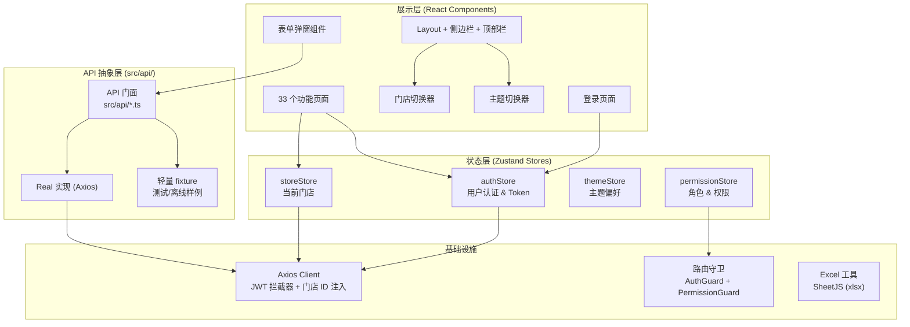
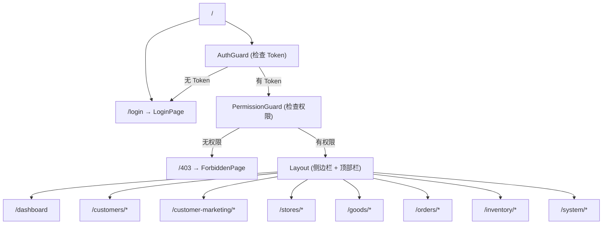

# 技术设计文档：美业管理平台前端功能完善

## 概述

本设计文档描述将美业管理平台从静态 UI 原型升级为完整可交互业务系统的技术方案。当前项目已完成 33 个功能页面的 UI 搭建，使用 Mock 数据，但缺少登录认证、表单提交逻辑、服务端分页、权限控制、数据导入导出、暗色主题切换、门店切换等关键功能。

本设计覆盖 11 项需求：用户登录与认证、路由守卫与 Token 管理、冗余文件清理、表单弹窗提交逻辑、排班管理增强、服务端分页、数据导入导出、暗色主题切换、门店切换器、RBAC 权限控制、API 层真实后端主线。

技术栈：React 18 + TypeScript、Vite 6、Tailwind CSS 4 + shadcn/ui (Radix UI)、React Router 7、Zustand、Axios、Zod + react-hook-form、Recharts、Sonner、Vitest + React Testing Library。

## 架构

### 整体架构

系统采用分层架构，从上到下依次为：展示层 → 状态层 → API 抽象层 → 网络层。



### 路由架构



## 组件与接口

### 1. 认证模块

#### LoginPage 组件
- 路径：`src/app/pages/LoginPage.tsx`
- 职责：渲染登录表单，使用 react-hook-form + Zod 校验，调用 `authApi.login()`
- Props：无
- 状态：`isSubmitting`（加载状态）

#### AuthGuard 组件
- 路径：`src/app/components/AuthGuard.tsx`
- 职责：包裹受保护路由，检查 `authStore` 中的 Token 有效性
- 行为：无 Token → 重定向 `/login`；已登录访问 `/login` → 重定向 `/dashboard`

#### authStore (Zustand)
- 路径：`src/stores/authStore.ts`
- 状态：`token: string | null`、`user: User | null`、`permissions: string[]`、`roles: string[]`
- 方法：`login(username, password)`、`logout()`、`loadUserInfo()`

### 2. 权限模块

#### PermissionGuard 组件
- 路径：`src/app/components/PermissionGuard.tsx`
- 职责：检查当前用户是否有权限访问目标路由
- 行为：无权限 → 渲染 403 页面

#### usePermission Hook
- 路径：`src/hooks/usePermission.ts`
- 签名：`usePermission(permissionCode: string): boolean`
- 用途：控制页面内按钮的显示/隐藏

#### 动态侧边栏菜单
- 修改 `Layout.tsx`，根据 `permissionStore` 中的权限列表过滤 `MENU_ITEMS`

### 3. 门店切换模块

#### StoreSwitcher 组件
- 路径：`src/app/components/StoreSwitcher.tsx`
- 职责：顶部栏下拉选择器，切换当前操作门店
- 数据源：`storeApi.getAccessibleStores()`
- 行为：切换门店 → 更新 `storeStore` → 触发当前页面数据刷新

#### storeStore (Zustand)
- 路径：`src/stores/storeStore.ts`
- 状态：`currentStoreId: number | null`、`stores: Store[]`
- 方法：`setCurrentStore(id)`、`loadStores()`

### 4. 主题切换模块

#### ThemeSwitcher 组件
- 路径：`src/app/components/ThemeSwitcher.tsx`
- 职责：太阳/月亮图标按钮，切换 `<html>` 元素的 `dark` 类
- 持久化：`localStorage.setItem('theme', 'dark' | 'light')`

#### themeStore (Zustand)
- 路径：`src/stores/themeStore.ts`
- 状态：`theme: 'light' | 'dark'`
- 初始化：读取 `localStorage.getItem('theme')`，默认 `'light'`

### 5. 表单弹窗通用模式

#### FormDialog 通用模式
每个业务模块的表单弹窗遵循统一模式：

```typescript
// 通用表单弹窗 Props 接口
interface FormDialogProps<T> {
  open: boolean;
  onOpenChange: (open: boolean) => void;
  mode: 'create' | 'edit';
  initialData?: T;
  onSuccess: () => void; // 成功后刷新父页面
}
```

- 使用 `react-hook-form` 的 `useForm` + `zodResolver` 绑定校验
- 提交时调用对应 API 函数
- 成功：关闭弹窗 + `toast.success("创建成功")` + 调用 `onSuccess`
- 失败：保持弹窗 + `toast.error(errorMessage)`
- 加载中：禁用提交按钮 + 显示 Spinner

### 6. 服务端分页

#### usePagination Hook
- 路径：`src/hooks/usePagination.ts`
- 签名：

```typescript
interface PaginationParams {
  page: number;
  pageSize: number;
}

interface PaginatedResponse<T> {
  data: T[];
  total: number;
  page: number;
  pageSize: number;
}

function usePagination<T>(
  fetchFn: (params: PaginationParams & Record<string, any>) => Promise<PaginatedResponse<T>>,
  filters?: Record<string, any>
): {
  data: T[];
  total: number;
  page: number;
  pageSize: number;
  loading: boolean;
  setPage: (page: number) => void;
  setPageSize: (size: number) => void;
  refresh: () => void;
}
```

### 7. 数据导入导出

#### Excel 工具模块
- 路径：`src/utils/excel.ts`
- 依赖：`xlsx`（SheetJS）
- 导出函数：`exportToExcel(data, columns, filename)`
- 导入函数：`parseExcelFile(file): Promise<ParsedRow[]>`
- 模板下载：`downloadTemplate(templateName)`

#### ImportDialog 组件
- 路径：`src/app/components/ImportDialog.tsx`
- 职责：文件选择 → 解析预览 → 错误标记 → 确认导入
- 接受 `.xlsx` 和 `.xls` 格式

### 8. API 层真实后端主线

#### 运行机制
- 管理端运行时固定走 `src/api/real/*` 与 `server-v2`，不再通过环境变量切换 Mock/Real。
- 每个 API 模块文件结构：

```typescript
// src/api/product.ts
import { realGetProducts, realCreateProduct } from './real/product';

export const getProducts = realGetProducts;
export const createProduct = realCreateProduct;
```

`src/api/mock` 仅保留轻量 fixture 和历史离线样例，不作为管理端运行时数据源。

#### 新增 API 模块
- `src/api/auth.ts` — 登录、登出、获取用户信息
- `src/api/scheduling.ts` — 排班查询、保存
- `src/api/store.ts` — 门店列表、门店 CRUD
- `src/api/role.ts` — 角色列表、权限配置
- `src/api/marketing.ts` — 营销活动 CRUD
- `src/api/bom.ts` — BOM 管理、消耗记录

## 数据模型

### 新增类型定义

#### 认证相关 (`src/types/auth.ts`)

```typescript
interface LoginRequest {
  username: string;
  password: string;
}

interface LoginResponse {
  token: string;
  user: AuthUser;
}

interface AuthUser {
  id: number;
  username: string;
  name: string;
  phone: string;
  email?: string;
  roles: string[];        // 角色编码列表
  permissions: string[];  // 权限编码列表
  storeIds: number[];     // 可访问门店 ID 列表
}
```

#### 权限相关 (`src/types/permission.ts`)

```typescript
interface Role {
  id: number;
  name: string;
  code: string;           // 如 'super_admin', 'store_manager'
  description: string;
  isSystem: boolean;      // 系统预置角色不可删除
  userCount: number;
  permissions: string[];  // 权限编码列表
}

interface Permission {
  code: string;           // 如 'customer:view', 'product:create'
  name: string;
  type: 'menu' | 'operation';
  module: string;         // 所属模块
  children?: Permission[];
}
```

#### 分页响应 (`src/types/pagination.ts`)

```typescript
interface PaginatedResponse<T> {
  data: T[];
  total: number;
  page: number;
  pageSize: number;
}

interface PaginationParams {
  page: number;
  pageSize: number;
}
```

#### 导入导出相关 (`src/types/excel.ts`)

```typescript
interface ImportResult {
  success: number;
  failed: number;
  errors: ImportError[];
}

interface ImportError {
  row: number;
  field: string;
  message: string;
}

interface ExportColumn {
  key: string;
  header: string;
  width?: number;
}
```

### 现有类型扩展

#### Zod Schema 定义

为每个表单弹窗定义对应的 Zod Schema，统一放置在 `src/schemas/` 目录：

```typescript
// src/schemas/product.ts
import { z } from 'zod';

export const productSchema = z.object({
  name: z.string().min(1, '产品名称不能为空'),
  brand: z.string().min(1, '品牌不能为空'),
  spec: z.string().min(1, '规格不能为空'),
  unit: z.enum(['瓶', '盒', '支', '个', '套']),
  costPrice: z.number().positive('成本价必须大于 0'),
  retailPrice: z.number().positive('零售价必须大于 0'),
  shelfLife: z.number().int().positive('保质期必须为正整数'),
  categoryId: z.number().int().positive('请选择分类'),
  supplier: z.string().min(1, '供应商不能为空'),
  minPurchaseQty: z.number().int().positive('最小采购量必须为正整数'),
});

// src/schemas/auth.ts
export const loginSchema = z.object({
  username: z.string().min(1, '用户名不能为空'),
  password: z.string().min(6, '密码至少 6 位'),
});
```

### Zustand Store 结构

```typescript
// authStore 状态结构
interface AuthState {
  token: string | null;
  user: AuthUser | null;
  isAuthenticated: boolean;
  login: (req: LoginRequest) => Promise<void>;
  logout: () => void;
  loadUserInfo: () => Promise<void>;
}

// storeStore 状态结构
interface StoreState {
  currentStoreId: number | null;
  stores: Store[];
  setCurrentStore: (id: number | null) => void;
  loadStores: () => Promise<void>;
}

// themeStore 状态结构
interface ThemeState {
  theme: 'light' | 'dark';
  toggleTheme: () => void;
}
```


## 正确性属性

*属性是一种在系统所有有效执行中都应成立的特征或行为——本质上是关于系统应该做什么的形式化陈述。属性是人类可读规范与机器可验证正确性保证之间的桥梁。*

### Property 1: 登录表单 Schema 校验

*For any* 用户名和密码组合，如果用户名为空字符串或密码长度小于 6，则 loginSchema 的 `safeParse` 应返回 `success: false`；如果用户名非空且密码长度 >= 6，则应返回 `success: true`。

**Validates: Requirements 1.5**

### Property 2: 登录成功后存储完整认证状态

*For any* 有效的登录响应（包含 token、user、roles、permissions），调用 `authStore.login()` 后，`authStore` 的 `token` 应等于响应中的 token，`user` 应等于响应中的 user，`permissions` 应包含响应中的所有权限编码。

**Validates: Requirements 1.2, 10.1**

### Property 3: 路由守卫拦截未认证访问

*For any* 受保护路由路径，当 `authStore.token` 为 `null` 时，`AuthGuard` 组件应将导航重定向到 `/login`。

**Validates: Requirements 2.1, 2.2**

### Property 4: JWT 拦截器自动附加 Bearer Token

*For any* API 请求，当 localStorage 中存在 token 时，请求的 `Authorization` 头应等于 `Bearer {token}`。

**Validates: Requirements 2.5**

### Property 5: JWT 拦截器处理 401 响应

*For any* 返回 HTTP 401 状态码的 API 响应，拦截器应清除 localStorage 中的 token 并触发重定向到 `/login`。

**Validates: Requirements 2.4**

### Property 6: Zod Schema 校验正确性

*For any* 业务表单的 Zod Schema 和任意输入数据，如果输入数据不满足 Schema 约束（如必填字段为空、数值不为正数），则 `safeParse` 应返回 `success: false` 且 `error.issues` 中包含对应字段的错误信息；如果输入数据满足所有约束，则应返回 `success: true`。

**Validates: Requirements 4.2, 4.3**

### Property 7: 排班时段点击切换

*For any* 排班时段（ScheduleSlot），点击该时段后其 `available` 属性应取反（true → false，false → true），且其他时段的状态不受影响。

**Validates: Requirements 5.1**

### Property 8: 排班保存失败回滚

*For any* 排班状态，如果用户修改了若干时段后保存失败，则排班状态应回滚到修改前的原始状态。

**Validates: Requirements 5.4**

### Property 9: 分页请求与响应契约

*For any* 分页参数（page >= 1, pageSize > 0），API 请求应包含 `page` 和 `pageSize` 参数，响应应包含 `total` 字段且 `total >= 0`。当 `pageSize` 变更时，`page` 应自动重置为 1。

**Validates: Requirements 6.2, 6.3, 6.5**

### Property 10: Excel 导出/导入 Round-Trip

*For any* 有效的表格数据集合和列定义，将数据导出为 Excel 文件后再导入解析，解析结果应与原始数据在字段值上等价。

**Validates: Requirements 7.3, 7.6**

### Property 11: 导入数据校验标记无效行

*For any* 包含无效数据的导入行（如必填字段缺失、数值格式错误），解析校验后该行应被标记为错误，且错误信息应包含具体的字段名和错误原因。

**Validates: Requirements 7.4**

### Property 12: 主题切换 Round-Trip

*For any* 初始主题状态，调用 `toggleTheme()` 后，`<html>` 元素的 `classList.contains('dark')` 应与 `themeStore.theme === 'dark'` 一致，且 `localStorage.getItem('theme')` 应等于当前主题值。连续两次 `toggleTheme()` 应恢复到初始状态。

**Validates: Requirements 8.2, 8.3**

### Property 13: 门店选择更新全局状态与 API 请求

*For any* 门店 ID，调用 `storeStore.setCurrentStore(id)` 后，`storeStore.currentStoreId` 应等于该 ID，且后续 API 请求应在请求头或参数中包含该门店 ID。

**Validates: Requirements 9.3, 9.5**

### Property 14: 门店切换器按角色过滤

*For any* 门店管理员用户，`StoreSwitcher` 组件渲染的门店列表应仅包含该用户 `storeIds` 中的门店，不应包含其他门店。

**Validates: Requirements 9.7**

### Property 15: 权限控制访问

*For any* 权限编码和用户权限列表，`usePermission(code)` 应返回 `permissions.includes(code)` 的结果。对于任意路由和用户权限列表，如果该路由所需权限不在用户权限列表中，`PermissionGuard` 应渲染 403 页面。侧边栏菜单应仅包含用户有权限访问的菜单项。

**Validates: Requirements 10.2, 10.3, 10.4**

### Property 16: API 模式切换一致性

*For any* API 模块的导出函数，当 `VITE_API_MODE` 为 `mock` 时应指向 mock 实现，为 `real` 时应指向 real 实现。mock 实现和 real 实现的函数签名（参数类型和返回类型）应完全一致。

**Validates: Requirements 11.1, 11.2, 11.3, 11.5**

## 错误处理

### 网络错误
- Axios 响应拦截器统一捕获网络错误，通过 `toast.error()` 显示友好提示
- 401 响应：清除 token，重定向到登录页
- 403 响应：显示"无权限"提示
- 500 响应：显示"服务器错误，请稍后重试"
- 网络断开：显示"网络连接失败，请检查网络"

### 表单校验错误
- Zod Schema 校验失败时，`react-hook-form` 自动在对应字段下方显示红色错误文本
- 服务端返回的业务校验错误（如"用户名已存在"）通过 `toast.error()` 显示

### 数据导入错误
- Excel 文件格式不支持：提示"仅支持 .xlsx 和 .xls 格式"
- 文件解析失败：提示"文件解析失败，请检查文件格式"
- 数据校验错误：在预览表格中逐行标记错误，红色高亮错误行，显示具体错误原因
- 部分导入失败：显示"成功 N 条，失败 M 条"的汇总结果

### 排班保存错误
- 保存失败时回滚 UI 状态到修改前
- 通过 `toast.error()` 显示具体错误原因

### 权限错误
- 路由级：`PermissionGuard` 渲染 403 无权限页面
- 按钮级：无权限的操作按钮不渲染（而非禁用），避免用户困惑

## 测试策略

### 测试框架
- 单元测试 & 属性测试：Vitest + React Testing Library
- 属性测试库：`fast-check`（需新增依赖）
- 每个属性测试配置最少 100 次迭代

### 单元测试范围

单元测试聚焦于具体示例、边界情况和集成点：

1. **LoginPage 组件**：渲染检查、表单提交流程、错误显示、加载状态
2. **AuthGuard 组件**：有 token 时渲染子组件、无 token 时重定向
3. **ThemeSwitcher 组件**：点击切换、初始化读取 localStorage
4. **StoreSwitcher 组件**：门店列表渲染、选择事件、角色过滤
5. **ImportDialog 组件**：文件选择、预览渲染、错误标记
6. **usePagination Hook**：初始状态、翻页、pageSize 变更
7. **usePermission Hook**：有权限返回 true、无权限返回 false

### 属性测试范围

每个属性测试对应一个设计文档中的 Correctness Property，使用 `fast-check` 生成随机输入：

1. **Feature: frontend-completion, Property 1: 登录表单 Schema 校验** — 生成随机用户名和密码字符串，验证 loginSchema 的校验结果与预期一致
2. **Feature: frontend-completion, Property 2: 登录成功后存储完整认证状态** — 生成随机 LoginResponse，验证 authStore 状态更新正确
3. **Feature: frontend-completion, Property 3: 路由守卫拦截未认证访问** — 生成随机受保护路由路径，验证无 token 时重定向
4. **Feature: frontend-completion, Property 4: JWT 拦截器自动附加 Bearer Token** — 生成随机 token 字符串，验证请求头
5. **Feature: frontend-completion, Property 5: JWT 拦截器处理 401 响应** — 验证 401 响应触发 token 清除和重定向
6. **Feature: frontend-completion, Property 6: Zod Schema 校验正确性** — 生成随机有效/无效表单数据，验证 Schema 校验结果
7. **Feature: frontend-completion, Property 7: 排班时段点击切换** — 生成随机排班数据，验证点击切换逻辑
8. **Feature: frontend-completion, Property 8: 排班保存失败回滚** — 生成随机排班修改，模拟保存失败，验证状态回滚
9. **Feature: frontend-completion, Property 9: 分页请求与响应契约** — 生成随机分页参数，验证请求参数和响应结构
10. **Feature: frontend-completion, Property 10: Excel 导出/导入 Round-Trip** — 生成随机表格数据，验证导出后导入的数据一致性
11. **Feature: frontend-completion, Property 11: 导入数据校验标记无效行** — 生成包含随机无效字段的数据行，验证错误标记
12. **Feature: frontend-completion, Property 12: 主题切换 Round-Trip** — 验证 toggleTheme 的幂等性和持久化一致性
13. **Feature: frontend-completion, Property 13: 门店选择更新全局状态与 API 请求** — 生成随机门店 ID，验证状态和请求头
14. **Feature: frontend-completion, Property 14: 门店切换器按角色过滤** — 生成随机用户 storeIds 和门店列表，验证过滤结果
15. **Feature: frontend-completion, Property 15: 权限控制访问** — 生成随机权限列表和权限编码，验证 usePermission 和菜单过滤
16. **Feature: frontend-completion, Property 16: API 模式切换一致性** — 验证 mock 和 real 实现的函数签名类型一致

### 测试配置

```typescript
// vitest.config.ts 中确保 fast-check 可用
// 每个属性测试示例：
import fc from 'fast-check';
import { describe, it, expect } from 'vitest';

describe('Property Tests', () => {
  it('Property 1: 登录表单 Schema 校验', () => {
    fc.assert(
      fc.property(fc.string(), fc.string(), (username, password) => {
        const result = loginSchema.safeParse({ username, password });
        const shouldPass = username.length > 0 && password.length >= 6;
        expect(result.success).toBe(shouldPass);
      }),
      { numRuns: 100 }
    );
  });
});
```
