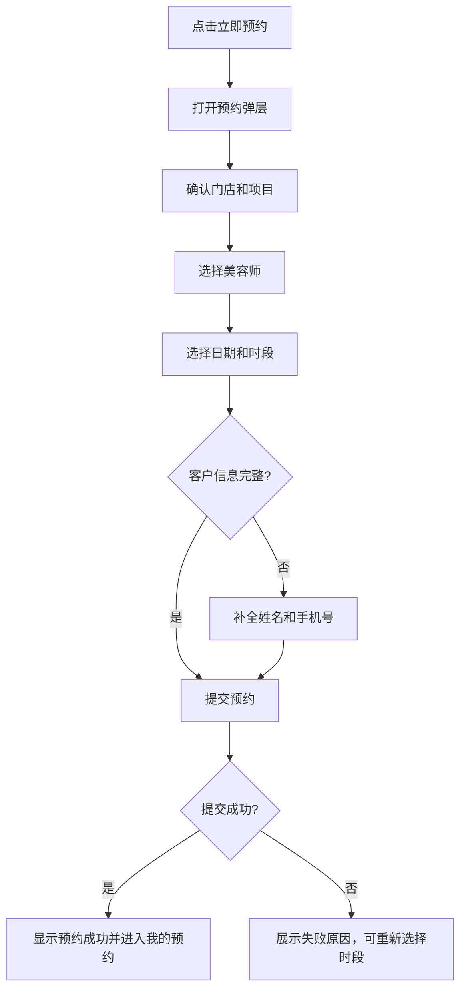
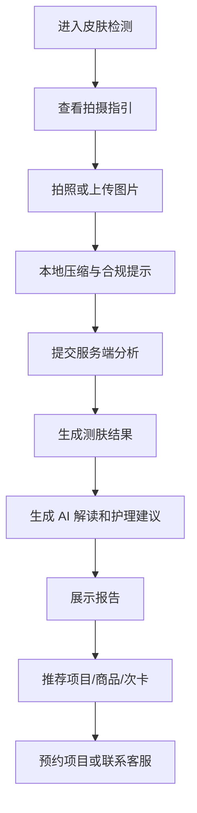

# Ami Glow 客户服务小程序需求文档

版本：v1.0  
日期：2026-06-08  
适用范围：Ami Glow 微信小程序、Ami_Core 管理端、`packages/server-v2` 后端、AI Gateway、营销/项目/预约/客户/次卡/测肤模块  
原型来源：`docs/02-产品设计/Ami_Glow/` 下 6 张小程序原型截图

## 1. 文档结论

Ami Glow 定位为面向门店消费客户的服务小程序，是 Ami 产品体系中的客户侧入口。它不是独立商城，也不是单纯活动页，而是把门店管理端已经配置好的营销内容、项目、商品、次卡、预约和 AI 测肤能力，以客户可理解、可转化的方式呈现出来。

MVP 需要优先完成四个闭环：

1. 首页推广闭环：展示门店、轮播图、推荐服务，内容来自管理端已发布的营销内容、项目、商品和活动。
2. 项目预约闭环：客户从首页或预约列表进入项目详情，选择门店、美容师、日期和时段后提交预约，预约数据回写管理端。
3. AI 测肤闭环：客户在小程序完成拍照/上传，调用服务端 AI 测肤能力，生成测肤报告、护理建议和推荐项目，并同步进入客户档案。
4. 个人中心闭环：客户可查看我的预约、我的次卡、消费记录、会员卡、联系客服和门店信息。

MVP 不建议一开始做完整在线支付商城。第一阶段重点是引流、预约、测肤、会员服务和到店转化；商品、次卡和活动先以展示、咨询、预约、留资为主，后续再接入微信支付、优惠券核销、拼团、分销等复杂能力。

## 2. 产品定位

### 2.1 产品名称

中文/英文统一展示为：**Ami Glow**

命名寓意：

- Glow 代表发光、焕亮、好气色和健康光彩。
- 与美业服务结果强相关，适合承载皮肤检测、护理预约、会员权益和营销推广。
- 与 Ami Aura Lite 等终端保持 Ami 品牌前缀，形成同一产品矩阵。

### 2.2 用户角色

| 用户 | 目标 | 典型行为 |
| --- | --- | --- |
| 新客 | 了解门店服务、活动和项目，完成首次预约或测肤 | 看首页推荐、进入项目详情、预约体验项目、联系客服 |
| 老客/会员 | 查看预约、次卡、消费记录和会员权益，复购护理项目 | 查我的预约、查次卡余额、再次预约、查看测肤报告 |
| 门店运营人员 | 在管理端配置客户可见内容并跟踪转化 | 发布活动、配置推荐项目、查看预约和营销效果 |
| 美容师/顾问 | 接收客户预约和测肤结果，提供后续服务 | 查看预约、查看客户测肤报告、到店服务转化 |

### 2.3 核心价值

对客户：

- 不用下载 App，通过微信即可完成看活动、看项目、预约、测肤和查权益。
- 个人预约、次卡、消费记录集中查询，减少反复问客服。
- AI 测肤后能获得更明确的护理建议和适合项目。

对门店：

- 管理端配置一次，客户小程序自动展示，降低重复运营成本。
- 活动、商品、项目、次卡可以直接导向预约或咨询。
- 小程序行为、预约、测肤和消费记录能进入客户画像和营销归因。

## 3. 原型页面识别

| 原型图片 | 页面/状态 | 主要内容 | MVP 处理 |
| --- | --- | --- | --- |
| `微信图片_20260608195734_593_165.jpg` | 首页 | 门店定位、扫码/切换入口、轮播 Banner、推荐服务、底部 Tab | 必做 |
| `微信图片_20260608195735_594_165.jpg` | 预约/美容列表页 | 搜索、推荐/全部筛选、筛选按钮、项目卡片列表 | 必做 |
| `微信图片_20260608195731_590_165.jpg` | 项目详情页 | 顶部项目图、价格、分享、收藏/开关、项目简介、项目详情、立即预约 | 必做 |
| `微信图片_20260608195730_589_165.jpg` | 项目预约弹层 | 预约门店、预约项目、预约美容师、日期周选择、确认按钮 | 必做 |
| `微信图片_20260608195733_592_165.jpg` | 工具页 | 皮肤检测、护肤知识、电话客服、护肤知识列表 | 必做 |
| `微信图片_20260608195732_591_165.jpg` | 我的页 | 用户头像、会员等级、我的预约、我的次卡、消费记录、会员卡、联系客服、关于我们 | 必做 |

## 4. 信息架构

```text
Ami Glow
├─ 首页
│  ├─ 当前门店
│  ├─ 首页轮播
│  ├─ 推荐服务
│  ├─ 推荐活动
│  ├─ 推荐商品
│  └─ 推荐次卡
├─ 预约
│  ├─ 项目搜索
│  ├─ 分类/推荐/全部筛选
│  ├─ 项目列表
│  ├─ 项目详情
│  └─ 预约提交
├─ 工具
│  ├─ AI 皮肤检测
│  ├─ 护肤知识
│  └─ 电话客服
└─ 我的
   ├─ 微信用户信息/会员等级
   ├─ 我的预约
   ├─ 我的次卡
   ├─ 消费记录
   ├─ 会员卡
   ├─ 联系客服
   └─ 关于我们
```

底部 Tab 按原型还原为：

| Tab | 文案 | 说明 |
| --- | --- | --- |
| 首页 | 首页 | 展示营销和推荐内容 |
| 预约 | 预约 | 项目列表和项目预约入口，原型标题可显示“美容” |
| 工具 | 工具 | AI 测肤、护肤知识、客服 |
| 我的 | 我的 | 个人信息、预约、卡项、消费记录 |

## 5. 页面需求

### 5.1 首页

#### 页面目标

首页承担客户进入小程序后的第一转化入口：快速识别门店、展示门店当前主推内容，并引导客户进入项目详情、预约、测肤或活动。

#### 页面结构

1. 顶部标题：`首页`。
2. 门店位置行：
   - 左侧位置图标。
   - 展示当前门店名称，超长省略，例如原型中的“心悦荟美容养生...”
   - 右侧扫码/门店切换入口。MVP 可用于扫码绑定门店或切换门店。
3. 轮播 Banner：
   - 圆角图片卡片。
   - 支持 1-5 张轮播图。
   - 支持点击跳转活动、商品、项目、次卡或外部客服。
4. 推荐服务：
   - 标题“推荐服务”，下划线装饰按原型还原。
   - 卡片列表展示推荐项目。
   - 卡片字段：图片、项目名称、服务时长、价格、标签。
5. 底部 Tab：
   - 当前选中首页，紫色高亮。

#### 内容来源

| 内容 | 管理端来源 | 规则 |
| --- | --- | --- |
| 门店名称 | 门店管理 | 默认显示客户最近关联门店；未关联时显示扫码/选择门店 |
| Banner | 营销活动、营销页面、推荐项目/商品配置 | 仅展示已发布、在有效期内、适用于当前门店的内容 |
| 推荐服务 | 项目管理 + 营销推荐 | 优先展示管理端设置为推荐/热门的项目，其次按营销推荐排序 |
| 推荐活动 | 营销活动/优惠活动 | 仅展示 published/active 状态 |
| 推荐商品 | 商品管理 + 营销推荐 | MVP 可展示，不直接下单 |
| 推荐次卡 | 次卡管理 + 营销活动 | MVP 可展示，引导咨询或预约 |

#### 交互要求

1. 点击门店名称：进入门店选择页或门店详情页。
2. 点击扫码图标：调用微信扫码，用于识别门店二维码、活动二维码或客户绑定码。
3. 点击 Banner：按配置跳转到活动详情、项目详情、商品详情、次卡详情或客服。
4. 点击推荐服务卡片：进入项目详情页。
5. 首页下拉刷新：重新拉取首页配置和推荐内容。
6. 首页接口失败：展示空状态和“重新加载”，不阻断底部 Tab。

### 5.2 预约/美容列表页

#### 页面目标

让客户快速找到可预约项目，并进入项目详情或直接发起预约。

#### 页面结构

1. 顶部标题：原型为“美容”，底部 Tab 文案为“预约”。建议页面标题可配置，MVP 使用“美容”。
2. 搜索框：
   - 占位符：`搜索项目名称`
   - 右侧搜索图标。
3. 筛选区：
   - 快捷筛选：`推荐`、`全部`。
   - 右侧筛选图标。
4. 项目列表：
   - 大图卡片。
   - 标签：推荐/热门/新品/会员专享。
   - 字段：项目名称、简介、价格、时长。
5. 底部 Tab：当前选中预约。

#### 筛选规则

| 筛选 | 说明 |
| --- | --- |
| 推荐 | 管理端设置推荐、营销策略推荐或系统按客户画像推荐 |
| 全部 | 当前门店上架且可预约的全部项目 |
| 分类 | 按项目类型，如补水、清洁、抗衰、美眼、美体等 |
| 价格 | 低到高、高到低 |
| 时长 | 30 分钟内、30-60 分钟、60 分钟以上 |
| 适用肤质 | 干皮、油皮、敏感肌、混合肌等，后续可与测肤结果联动 |

#### 项目卡片字段

| 字段 | 必填 | 说明 |
| --- | --- | --- |
| projectId | 是 | 项目 ID |
| name | 是 | 项目名称 |
| image | 是 | 项目图片，无图使用默认美业占位图 |
| price | 是 | 售价/会员价 |
| duration | 是 | 服务时长 |
| description | 否 | 简介，列表最多展示 2 行 |
| tags | 否 | 推荐、热门等 |
| canBook | 是 | 是否可预约 |

#### 交互要求

1. 输入关键词后点击搜索或键盘搜索，刷新列表。
2. 点击“推荐/全部”切换列表数据。
3. 点击筛选图标，弹出筛选面板。
4. 点击项目卡片进入项目详情。
5. 列表触底加载下一页。
6. 无结果时提示“暂无符合条件的项目”。

### 5.3 项目详情页

#### 页面目标

承接项目种草和预约转化，展示项目卖点、价格、详情和预约入口。

#### 页面结构

1. 顶部导航：
   - 返回按钮。
   - 标题显示项目名称，例如“巨补水”。
   - 微信小程序原生菜单区域保留。
2. 项目主图：
   - 大图展示。
   - 标签：推荐。
   - 支持轮播点。
3. 信息卡片：
   - 会员价标签。
   - 价格，例如 `¥199`。
   - 分享入口。
   - 项目名称。
   - 收藏/关注开关，MVP 可先作为收藏状态。
   - 项目简介。
4. 项目详情：
   - 标题“项目详情”。
   - 内容来自管理端项目详情/营销详情。
   - 支持图文、流程、适用人群、注意事项。
5. 固定底部按钮：
   - `立即预约`

#### 内容来源

| 内容 | 来源 | 说明 |
| --- | --- | --- |
| 主图/轮播图 | 项目管理图片、营销素材 | 优先使用项目详情图片 |
| 价格 | 项目管理 | 支持普通价、会员价、活动价 |
| 简介/详情 | 项目管理描述、营销活动文案 | 支持富文本降级为小程序可渲染结构 |
| 推荐标签 | 营销推荐/项目推荐配置 | 当前客户命中推荐时展示 |
| 适用活动 | 优惠活动 `promotions` | 可在详情页展示优惠说明 |

#### 交互要求

1. 点击返回：回到上一页。
2. 点击分享：触发微信分享，分享卡片带项目名称、图片、门店和渠道参数。
3. 点击收藏开关：保存到客户收藏，未登录时先静默授权或提示登录。
4. 点击立即预约：打开项目预约弹层。
5. 项目不可预约时：底部按钮置灰并说明原因，例如“暂不可预约”。

### 5.4 项目预约弹层

#### 页面目标

客户在不离开项目详情的情况下完成预约信息选择和提交。

#### 页面结构

弹层按原型从底部升起，圆角顶部，包含：

1. 标题：`项目预约`
2. 关闭按钮。
3. 预约门店：
   - 必填。
   - 默认当前门店。
   - 若项目跨门店可用，允许切换。
4. 预约项目：
   - 默认当前项目。
   - 只读。
5. 预约美容师：
   - 必填或可选，取决于门店配置。
   - 点击进入美容师选择。
6. 预约时间：
   - 日期周选择，一次展示 7 天。
   - 上一周/下一周。
   - 日期选中态按原型紫色渐变。
   - 选中日期后展示可预约时段。
7. 底部确认按钮：
   - 未满足必填项时置灰。
   - 满足后高亮。

#### 预约字段

| 字段 | 必填 | 说明 |
| --- | --- | --- |
| storeId | 是 | 预约门店 |
| projectId | 是 | 预约项目 |
| beauticianId | 按配置 | 美容师，不选时可由门店分配 |
| date | 是 | 预约日期 |
| startTime | 是 | 开始时间 |
| endTime | 是 | 结束时间，默认由项目时长计算 |
| customerId | 是 | 当前客户 |
| customerName | 是 | 客户姓名，首次需补全 |
| customerPhone | 是 | 手机号，首次需授权或填写 |
| source | 是 | 固定 `ami_glow` |
| channel | 否 | 分享/活动/自然访问来源 |
| marketingPageId | 否 | 由活动或营销页进入时记录 |
| promotionId | 否 | 适用优惠活动 |
| remark | 否 | 客户备注 |

#### 可预约时段规则

1. 基于门店营业时间生成可选时段。
2. 根据项目时长计算占用区间。
3. 过滤美容师已有预约、请假、忙碌时段。
4. 若选择“到店分配美容师”，则只要门店在该时段有至少一位可服务美容师即可选。
5. 当天过去时段不可选。
6. 管理端已确认预约、客户取消、爽约等状态需纳入冲突判断。

#### 提交流程



#### 状态与提示

| 场景 | 页面反馈 |
| --- | --- |
| 未选美容师 | 按配置提示“请选择美容师”或允许“到店分配” |
| 无可预约时段 | 显示“当天暂无可预约时段，请选择其他日期” |
| 时段被抢占 | 提示“该时段刚刚被预约，请重新选择” |
| 未授权手机号 | 弹出手机号授权/填写表单 |
| 提交成功 | Toast + 成功页/我的预约入口 |
| 提交失败 | 保留弹层和已选信息，展示错误原因 |

### 5.5 工具页

#### 页面目标

工具页承载 AI 测肤、护肤知识和客服联系，是客户获取专业感和服务支持的入口。

#### 页面结构

1. 顶部标题：`工具`。
2. 三个功能入口卡片：
   - 皮肤检测。
   - 护肤知识。
   - 电话客服。
3. 护肤知识区域：
   - 标题“护肤知识”。
   - 展示知识条目列表。
   - 原型中展示：抗衰老护肤步骤、如何正确使用眼霜、正确的洗脸方式是怎样的、如何去除黑头、不同季节护肤重点是什么。
4. 底部 Tab：当前选中工具。

#### AI 皮肤检测入口

点击“皮肤检测”进入 AI 测肤流程。MVP 需要与管理端/终端当前测肤能力保持一致：

1. 同一套测肤指标口径。
2. 同一套测肤报告解释能力。
3. 同一套推荐项目/商品/护理建议生成逻辑。
4. 测肤结果可以绑定到客户健康档案。
5. 客户侧展示需要增加免责声明，避免把 AI 结果表达为医疗诊断。

#### 护肤知识

| 字段 | 说明 |
| --- | --- |
| title | 知识标题 |
| category | 护肤分类 |
| summary | 简介 |
| content | 正文，可来自管理端内容库或初期固定配置 |
| relatedProjects | 关联项目 |
| relatedProducts | 关联商品 |
| publishStatus | 发布状态 |

MVP 可先用固定知识内容，后续在管理端增加内容管理。

#### 电话客服

1. 点击“电话客服”直接调用 `wx.makePhoneCall`。
2. 电话号码来自当前门店配置。
3. 未配置电话时显示“门店暂未配置客服电话”。

### 5.6 AI 测肤流程

#### 页面目标

客户通过自拍或上传照片完成皮肤检测，获取报告、护理建议和可预约项目，结果同步给管理端形成客户画像。

#### 推荐流程



#### 拍摄指引

1. 保持正脸、光线充足。
2. 尽量素颜或淡妆。
3. 避免遮挡额头、脸颊和下巴。
4. 结果仅作为美容护理参考，不作为医疗诊断。

#### 测肤指标

MVP 指标应与现有终端测肤能力对齐，建议包含：

| 指标 | 展示方式 | 说明 |
| --- | --- | --- |
| skinType | 文本 | 干性、油性、混合、敏感等 |
| moistureScore | 分数/等级 | 水分状态 |
| oilScore | 分数/等级 | 油脂状态 |
| sensitivityScore | 分数/等级 | 敏感风险 |
| poreScore | 分数/等级 | 毛孔状态 |
| acneScore | 分数/等级 | 痘痘/闭口状态 |
| spotScore | 分数/等级 | 色斑/暗沉状态 |
| wrinkleScore | 分数/等级 | 细纹状态 |
| overallScore | 分数/等级 | 综合状态 |
| skinStatus | 文本 | 状态总结 |
| advice | 文本 | 护理建议 |

#### 结果页内容

1. 综合评分和肤质类型。
2. 关键问题排序，例如“缺水”“敏感”“毛孔明显”。
3. AI 解读，调用服务端 `/ai/generate/skin-test-explanation` 或同等能力。
4. 推荐项目：
   - 按测肤问题匹配项目类型。
   - 例如缺水推荐补水项目，敏感推荐修护项目。
5. 推荐商品：
   - MVP 可展示护肤建议，不直接售卖。
6. 推荐次卡：
   - 对适合周期护理的项目推荐次卡咨询。
7. CTA：
   - `预约护理`
   - `联系客服`
   - `保存报告`

#### 数据写回

| 写回对象 | 说明 |
| --- | --- |
| SkinTest | 保存测肤结果 |
| CustomerHealthProfile | 更新客户肤质、皮肤状态和最近测肤时间 |
| MarketingEvent | 记录测肤行为，用于后续营销触发 |
| RecommendationEvent | 记录推荐项目曝光和点击 |

### 5.7 我的页

#### 页面目标

客户自助查询个人服务信息，减少门店客服压力，增强会员感。

#### 页面结构

1. 顶部标题：`我的`。
2. 用户信息卡：
   - 头像。
   - 昵称/姓名。
   - 会员等级，例如“普通会员”。
3. 功能列表：
   - 我的预约。
   - 我的次卡。
   - 消费记录。
   - 会员卡。
   - 联系客服。
   - 关于我们。
4. 底部 Tab：当前选中我的。

#### 功能说明

| 功能 | 需求 |
| --- | --- |
| 我的预约 | 查看待确认、已确认、已到店、已完成、已取消预约；支持取消未到店预约 |
| 我的次卡 | 查看客户持有次卡、剩余次数、有效期、适用项目、使用记录 |
| 消费记录 | 查看项目消费、商品消费、次卡核销、会员卡充值/扣款 |
| 会员卡 | 查看储值余额、会员等级、权益说明、交易明细 |
| 联系客服 | 调用电话或企业微信/微信客服 |
| 关于我们 | 展示门店介绍、地址、营业时间、联系方式 |

#### 登录与绑定

1. 首次进入小程序，可先以游客浏览首页、项目和活动。
2. 执行预约、查看个人信息、测肤保存结果时，需要微信授权并绑定手机号。
3. 绑定逻辑：
   - 通过微信 openid/unionid 识别小程序用户。
   - 手机号匹配管理端客户档案。
   - 若手机号已存在，绑定已有客户。
   - 若手机号不存在，创建新客户，来源为 `ami_glow`。
4. 后续访问自动识别客户。

## 6. 管理端联动需求

### 6.1 内容配置

管理端需要为 Ami Glow 提供客户可见内容配置能力。MVP 可以复用已有模块，新增“是否在 Ami Glow 展示/推荐”的字段或配置入口。

| 模块 | 现有来源 | 小程序展示 |
| --- | --- | --- |
| 门店 | 门店管理 | 门店名称、电话、地址、营业时间 |
| 项目 | 项目管理 | 首页推荐、预约列表、项目详情、测肤推荐 |
| 商品 | 商品管理 | 首页推荐、详情展示、测肤护理建议 |
| 次卡 | 次卡管理 | 首页推荐、我的次卡、详情展示 |
| 优惠活动 | 优惠活动/营销活动 | Banner、活动详情、项目优惠 |
| 智能营销 | 营销推荐、自动营销策略 | 个性化推荐、营销归因 |
| 客户档案 | 客户管理 | 会员信息、消费记录、健康档案 |
| AI 测肤 | Terminal/AI Gateway | 客户测肤报告、护理建议 |

### 6.2 推荐配置

建议管理端增加 Ami Glow 展示配置：

| 配置项 | 说明 |
| --- | --- |
| showInAmiGlow | 是否在 Ami Glow 展示 |
| amiGlowSort | 展示排序 |
| amiGlowTags | 展示标签，如推荐、热门、新品 |
| amiGlowBannerImage | 小程序专用 Banner 图 |
| amiGlowSummary | 小程序摘要 |
| amiGlowCtaType | 预约、咨询、领取、查看详情 |
| amiGlowPublishStatus | 草稿、已发布、已下线 |
| amiGlowPublishStartAt/EndAt | 展示时间范围 |

### 6.3 营销归因

小程序需要记录客户行为并回传管理端：

| 事件 | 触发时机 |
| --- | --- |
| miniapp_view_home | 访问首页 |
| miniapp_view_banner | Banner 曝光 |
| miniapp_click_banner | 点击 Banner |
| miniapp_view_project | 查看项目详情 |
| miniapp_click_book | 点击立即预约 |
| miniapp_submit_reservation | 提交预约 |
| miniapp_reservation_success | 预约成功 |
| miniapp_start_skin_test | 开始测肤 |
| miniapp_complete_skin_test | 完成测肤 |
| miniapp_click_recommendation | 点击测肤推荐 |
| miniapp_view_cards | 查看我的次卡 |
| miniapp_contact_service | 联系客服 |

每条事件至少包含：

| 字段 | 说明 |
| --- | --- |
| eventType | 事件类型 |
| storeId | 门店 |
| customerId | 已绑定客户 ID |
| openid/unionid | 微信身份 |
| sessionId | 游客会话 |
| source | 固定 `ami_glow` |
| channel | 渠道 |
| targetType | project/product/card/promotion/page |
| targetId | 目标对象 ID |
| promotionId | 活动 ID |
| marketingPageId | 营销页 ID |
| createdAt | 事件时间 |

## 7. 后端与接口需求

### 7.1 接口设计原则

1. 客户小程序不应直接使用管理端 JWT 权限接口，也不应直接使用设备鉴权的 `terminal/*` 接口。
2. 建议在 `packages/server-v2` 新增面向客户小程序的 API 聚合层，例如 `/customer-app/*` 或 `/miniapp/*`。
3. 聚合层内部复用现有项目、活动、预约、客户、次卡、测肤和 AI 服务。
4. 所有接口必须按门店隔离数据。
5. 所有写操作必须带客户身份、手机号绑定状态和幂等 key。

### 7.2 建议接口清单

#### 小程序会话

| Method | Path | 说明 |
| --- | --- | --- |
| POST | `/customer-app/auth/wechat-login` | 微信登录，换取小程序 token |
| POST | `/customer-app/auth/bind-phone` | 绑定手机号并匹配/创建客户 |
| GET | `/customer-app/me` | 当前客户信息 |
| PUT | `/customer-app/me/profile` | 更新客户基础信息 |

#### 首页与内容

| Method | Path | 说明 |
| --- | --- | --- |
| GET | `/customer-app/home` | 首页聚合数据 |
| GET | `/customer-app/stores/current` | 当前门店信息 |
| GET | `/customer-app/stores` | 可选门店列表 |
| GET | `/customer-app/promotions` | 客户可见活动列表 |
| GET | `/customer-app/promotions/:id` | 活动详情 |

#### 项目与预约

| Method | Path | 说明 |
| --- | --- | --- |
| GET | `/customer-app/projects` | 项目列表 |
| GET | `/customer-app/projects/:id` | 项目详情 |
| GET | `/customer-app/projects/:id/available-beauticians` | 项目可预约美容师 |
| GET | `/customer-app/reservations/availability` | 可预约日期和时段 |
| POST | `/customer-app/reservations` | 创建预约 |
| GET | `/customer-app/me/reservations` | 我的预约 |
| GET | `/customer-app/me/reservations/:id` | 我的预约详情 |
| POST | `/customer-app/me/reservations/:id/cancel` | 客户取消预约 |

#### AI 测肤

| Method | Path | 说明 |
| --- | --- | --- |
| POST | `/customer-app/skin-tests/analyze` | 上传图片并创建测肤 |
| GET | `/customer-app/skin-tests` | 我的测肤记录 |
| GET | `/customer-app/skin-tests/:id` | 测肤报告详情 |
| GET | `/customer-app/skin-tests/:id/recommendations` | 测肤推荐项目/商品/次卡 |

#### 我的

| Method | Path | 说明 |
| --- | --- | --- |
| GET | `/customer-app/me/cards` | 我的次卡 |
| GET | `/customer-app/me/card-usage-records` | 次卡使用记录 |
| GET | `/customer-app/me/consumption-records` | 消费记录 |
| GET | `/customer-app/me/member-card` | 会员卡/储值余额 |
| GET | `/customer-app/me/member-card/transactions` | 会员卡交易记录 |

#### 护肤知识和客服

| Method | Path | 说明 |
| --- | --- | --- |
| GET | `/customer-app/knowledge` | 护肤知识列表 |
| GET | `/customer-app/knowledge/:id` | 护肤知识详情 |
| GET | `/customer-app/contact` | 当前门店客服信息 |

#### 行为事件

| Method | Path | 说明 |
| --- | --- | --- |
| POST | `/customer-app/events` | 上报客户小程序行为事件 |

### 7.3 关键数据结构

#### 首页响应

```json
{
  "store": {
    "id": 1,
    "name": "心悦荟美容养生会所",
    "address": "门店地址",
    "phone": "13800000000"
  },
  "banners": [
    {
      "id": "banner-1",
      "title": "高质量补水项目",
      "image": "https://...",
      "targetType": "project",
      "targetId": 101,
      "tag": "推荐"
    }
  ],
  "recommendedProjects": [
    {
      "id": 101,
      "name": "巨补水",
      "image": "https://...",
      "price": 199,
      "memberPrice": 199,
      "duration": 40,
      "tags": ["热门"]
    }
  ],
  "recommendedPromotions": [],
  "recommendedProducts": [],
  "recommendedCards": []
}
```

#### 创建预约请求

```json
{
  "storeId": 1,
  "projectId": 101,
  "beauticianId": 8,
  "date": "2026-06-08",
  "startTime": "14:00",
  "endTime": "14:40",
  "customerName": "张女士",
  "customerPhone": "13800000000",
  "remark": "敏感肌，请安排温和护理",
  "source": "ami_glow",
  "channel": "home_recommendation",
  "promotionId": 12,
  "idempotencyKey": "miniapp-reservation-uuid"
}
```

#### 测肤报告响应

```json
{
  "id": 9001,
  "customerId": 1001,
  "skinType": "干性敏感肌",
  "overallScore": 76,
  "scores": {
    "moisture": 62,
    "oil": 48,
    "sensitivity": 70,
    "pore": 66,
    "spot": 58,
    "wrinkle": 60
  },
  "summary": "当前肌肤偏干，屏障状态需要修护。",
  "advice": "建议优先选择补水修护类项目，并减少刺激性清洁。",
  "recommendations": [
    {
      "type": "project",
      "id": 101,
      "name": "巨补水",
      "reason": "适合当前缺水和屏障修护需求"
    }
  ],
  "createdAt": "2026-06-08T12:00:00.000Z"
}
```

## 8. 权限、隐私与合规

### 8.1 登录授权

| 场景 | 授权要求 |
| --- | --- |
| 浏览首页/项目/活动 | 可游客访问 |
| 创建预约 | 必须绑定手机号 |
| AI 测肤并保存报告 | 必须绑定手机号并确认隐私授权 |
| 查看我的预约/次卡/消费记录 | 必须登录并绑定客户 |
| 联系客服 | 可游客使用 |

### 8.2 隐私提示

AI 测肤前必须展示并要求确认：

1. 用户同意上传面部照片用于皮肤状态分析。
2. 照片和分析结果仅用于美容护理建议、客户服务和门店服务记录。
3. 测肤结果仅供美容护理参考，不构成医疗诊断。
4. 用户可联系门店删除或更正个人信息。

### 8.3 数据安全

1. 小程序端不保存大模型 Key。
2. AI 分析必须通过 `server-v2` 转发。
3. 图片上传使用临时授权地址或后端中转，避免公开敏感图片。
4. 客户只能查看自己的预约、次卡、消费记录和测肤报告。
5. 管理端查看客户测肤图片和报告需要对应门店权限。

## 9. 视觉还原要求

### 9.1 设计风格

按原型还原以下视觉特征：

| 项 | 要求 |
| --- | --- |
| 主色 | 紫色/淡紫色渐变 |
| 背景 | 浅粉紫背景 |
| 卡片 | 白底、细紫色描边、轻阴影、大圆角 |
| 按钮 | 紫色渐变胶囊按钮 |
| 选中态 | 紫色高亮，未选中为黑/灰 |
| 字体 | 微信小程序系统字体 |
| 图标 | 保持简洁线性风格，可使用小程序图标或自定义 icon |

### 9.2 关键还原点

1. 首页 Banner 大图比例和圆角需要接近原型。
2. 推荐服务卡片需要保留右上角“热门”角标。
3. 预约列表首张卡片采用大图上、信息下的结构。
4. 项目详情底部“立即预约”按钮固定在底部。
5. 预约弹层顶部大圆角、右上角关闭按钮、底部固定确认按钮。
6. 我的页顶部会员卡使用紫色渐变背景。
7. 底部 Tab 高亮颜色与原型一致。

### 9.3 适配要求

1. 以微信小程序常见 375px 宽度为基准适配。
2. iPhone 刘海屏、安卓全面屏底部安全区必须兼容。
3. 图片必须设置固定比例，避免加载中页面跳动。
4. 文案超长时最多两行省略，不允许撑破卡片。
5. 底部固定按钮不得遮挡页面内容。

## 10. 非功能需求

### 10.1 性能

| 指标 | 要求 |
| --- | --- |
| 首页首屏 | 2 秒内完成可用内容展示 |
| 项目列表 | 分页加载，每页 10-20 条 |
| 图片 | 必须使用压缩图/缩略图 |
| AI 测肤 | 10 秒内返回结果；超过 10 秒展示等待状态 |
| 接口失败 | 不白屏，提供重试 |

### 10.2 可用性

1. 预约提交必须防重复点击。
2. 写操作必须使用幂等 key。
3. 网络失败时保留用户已填写内容。
4. 重要操作成功后给出明确下一步，例如“查看我的预约”。
5. 客户取消预约需要二次确认。

### 10.3 兼容性

1. 支持微信小程序基础库当前主流版本。
2. iOS 和 Android 均需验证。
3. 支持弱网下图片延迟加载。
4. 支持小程序分享路径带参数恢复页面。

## 11. 埋点与报表

### 11.1 核心指标

| 指标 | 说明 |
| --- | --- |
| 首页访问人数 | UV |
| Banner 点击率 | 点击/曝光 |
| 项目详情访问人数 | 项目种草效果 |
| 预约提交人数 | 转化意向 |
| 预约成功人数 | 有效转化 |
| 测肤开始人数 | 工具使用 |
| 测肤完成人数 | AI 能力转化 |
| 测肤后预约人数 | AI 推荐转化 |
| 我的页访问人数 | 会员服务使用 |
| 联系客服次数 | 人工咨询需求 |

### 11.2 归因口径

预约成功归因优先级：

1. 直接从活动/Banner 进入项目并预约，归因到该活动。
2. 从测肤推荐进入项目并预约，归因到测肤推荐。
3. 从首页推荐进入项目并预约，归因到首页推荐。
4. 从预约列表自然浏览进入，归因为自然预约。

## 12. MVP 范围

### 12.1 P0 必做

1. 小程序四 Tab：首页、预约、工具、我的。
2. 首页展示门店、Banner、推荐项目。
3. 预约列表展示项目，支持搜索、推荐/全部筛选。
4. 项目详情页和预约弹层。
5. 创建预约并同步管理端。
6. 微信登录、手机号绑定、客户档案匹配。
7. 我的预约、我的次卡、消费记录、会员卡基础查询。
8. 工具页皮肤检测入口、电话客服入口。
9. AI 测肤基础流程：上传图片、生成报告、推荐项目、保存结果。
10. 行为埋点和预约归因基础字段。

### 12.2 P1 建议

1. 管理端 Ami Glow 展示配置。
2. 商品详情、次卡详情和活动详情。
3. 护肤知识内容管理。
4. 测肤报告历史对比。
5. 客户取消/改期预约。
6. 个性化推荐：基于测肤结果、消费记录、次卡余量推荐项目。
7. 微信客服/企业微信客服接入。

### 12.3 P2 后续

1. 微信支付购买商品/次卡/项目套餐。
2. 优惠券领取和核销。
3. 拼团、老带新、分销。
4. 积分体系。
5. 会员等级成长体系。
6. 营销自动化触达小程序订阅消息。
7. 多门店就近推荐和地图导航。

## 13. 开发拆分建议

### 13.1 前端小程序

建议新增独立小程序工程，例如：

```text
packages/Ami-Glow-MiniApp
```

如果后续希望同时发布微信小程序和 H5，可考虑 Taro/uni-app；如果只做微信小程序且追求审核稳定，可采用原生微信小程序。

前端任务拆分：

1. 工程初始化和主题变量。
2. 底部 Tab 与页面骨架。
3. 首页还原。
4. 预约列表还原。
5. 项目详情和预约弹层。
6. 工具页和测肤流程。
7. 我的页和个人查询页。
8. 登录绑定和请求封装。
9. 埋点 SDK 封装。

### 13.2 后端

建议新增模块：

```text
packages/server-v2/src/customer-app
```

后端任务拆分：

1. 微信登录与小程序 token。
2. 客户绑定与客户档案匹配。
3. 首页聚合接口。
4. 项目列表/详情接口。
5. 可预约时段和预约创建接口。
6. 我的预约/次卡/消费记录接口。
7. AI 测肤客户侧接口。
8. 行为事件和营销归因接口。

### 13.3 管理端

管理端任务拆分：

1. 项目、商品、次卡、活动增加 Ami Glow 展示配置。
2. 门店增加小程序展示信息配置。
3. 营销活动支持小程序 Banner 和跳转配置。
4. 客户详情增加小程序来源、测肤报告和行为轨迹。
5. 营销效果报表增加 Ami Glow 渠道。

## 14. 验收标准

### 14.1 页面还原

1. 首页、预约、工具、我的四个 Tab 与原型结构一致。
2. 首页 Banner、推荐服务卡片、底部 Tab 视觉与原型接近。
3. 预约列表搜索、筛选、项目卡片布局与原型接近。
4. 项目详情页主图、价格卡、详情区域、底部立即预约按钮与原型接近。
5. 预约弹层字段、日期选择、按钮状态与原型接近。
6. 我的页会员卡和功能列表与原型接近。

### 14.2 业务闭环

1. 管理端上架项目后，小程序预约列表能看到。
2. 管理端发布活动/Banner 后，小程序首页能展示。
3. 客户可从项目详情创建预约，管理端预约列表可看到。
4. 客户可查看自己的预约、次卡和消费记录。
5. 客户可完成 AI 测肤，报告能保存并在管理端客户档案中查看。
6. 测肤推荐项目可跳转预约。
7. 客服电话能按当前门店配置拨打。

### 14.3 数据与安全

1. 未绑定手机号不能查看个人隐私数据。
2. 客户只能访问自己的记录。
3. 预约提交防重复。
4. AI 测肤图片和结果不在小程序端长期明文缓存。
5. 行为事件能记录来源、门店、客户和目标对象。

### 14.4 测试建议

1. 小程序页面视觉截图对比。
2. 首页数据加载和空状态测试。
3. 项目搜索和筛选测试。
4. 预约成功、时段冲突、重复提交、取消预约测试。
5. 微信登录和手机号绑定测试。
6. AI 测肤成功、失败、超时、无推荐结果测试。
7. 我的预约、我的次卡、消费记录权限测试。
8. 管理端发布/下线内容后小程序展示同步测试。

## 15. 风险与待确认问题

| 问题 | 影响 | 建议 |
| --- | --- | --- |
| 小程序技术栈未确定 | 影响工程结构和组件实现 | 先确认原生微信小程序、Taro 或 uni-app |
| 管理端缺少客户可见配置 | 首页和列表推荐可能不可控 | MVP 先按状态和推荐字段读取，后续补配置 |
| 客户身份绑定规则需明确 | 影响个人信息查询和重复客户 | 以手机号匹配为主，openid/unionid 绑定为辅 |
| 可预约时段规则复杂 | 影响预约准确性 | MVP 先基于营业时间、项目时长、美容师占用过滤 |
| AI 测肤供应商和图片存储策略 | 影响成本、合规和效果 | 统一走 server-v2 AI Gateway，不在前端保存 Key |
| 商品/次卡是否支持支付 | 影响需求范围和审核 | MVP 先展示和咨询，支付放 P2 |

## 16. 一期交付清单

一期建议交付：

1. Ami Glow 小程序工程。
2. 首页、预约、项目详情、预约弹层、工具、我的页面。
3. 客户登录和手机号绑定。
4. 首页聚合、项目列表、项目详情、可预约时段、创建预约接口。
5. 我的预约、我的次卡、消费记录、会员卡查询接口。
6. AI 测肤上传、报告、推荐项目接口。
7. 客服电话和门店信息。
8. 基础埋点和预约归因。
9. 管理端基础展示配置或最小可用读取规则。

一期完成后，Ami Glow 应能支撑门店完成“客户浏览活动/项目 -> AI 测肤或查看详情 -> 预约到店 -> 管理端承接服务”的完整链路。
