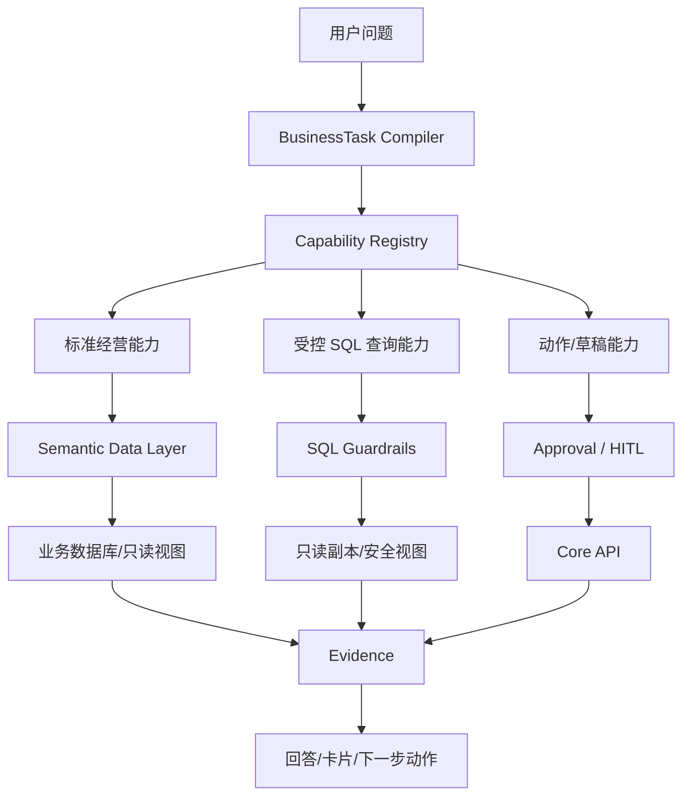

# Ami 智能问答 Text-to-SQL 方案对比分析

更新时间：2026-06-17

关联文档：

- `docs/02-产品设计/Ami经营语义中枢与智能问答重构方案.md`
- `docs/03-开发计划/Ami经营语义中枢详细开发计划.md`
- `docs/02-产品设计/Ami_AI问数与运营数据查询需求文档.md`
- `docs/02-产品设计/Ami经营Agent编排平台技术方案.md`

## 1. 结论先行

Text-to-SQL 不建议作为 Ami 智能问答的主路径。

建议定位：

```text
主路径：经营语义中枢 + BusinessTask + Capability Registry + Semantic Data Layer
辅助路径：受控 Text-to-SQL / Semantic SQL，用于内部分析、探索式问数和低风险只读查询
禁止路径：用户自然语言直接生成 SQL 查生产库
```

原因：

1. Ami 的核心问题不是“SQL 生成不了”，而是“用户问题需要经营语义、权限、指标口径、动作边界和可解释建议”。
2. Text-to-SQL 擅长临时查数，不擅长稳定完成“推荐、诊断、下一步动作、审批草稿”。
3. 美业经营数据跨客户、订单、卡项、库存、排班、营销、服务记录，表间语义复杂，直接 SQL 容易口径错。
4. 用户经常问的是“最值得、适合、为什么、怎么做”，这不是普通 SQL 查询，而是经营决策任务。
5. 生产系统需要权限、门店隔离、脱敏、审计、限流和写操作边界，Text-to-SQL 作为主路径风险高。

## 2. Text-to-SQL 是什么

Text-to-SQL 指用户用自然语言提问，系统将其转为 SQL 查询数据库，再把结果解释给用户。

示例：

```text
用户：近30天销量最高的10个商品
SQL：SELECT product_id, SUM(quantity) ... GROUP BY product_id ORDER BY quantity DESC LIMIT 10
```

它适合：

- 明确指标查询。
- 简单聚合。
- 排名。
- 筛选。
- 内部数据分析。
- 临时探索。

它不适合直接承担：

- 经营推荐。
- 归因诊断。
- 工作流动作。
- 权限复杂的多角色场景。
- 需要审批的写操作。
- 需要稳定产品体验的终端问答。

## 3. 与经营语义中枢的本质区别

| 维度 | Text-to-SQL | 经营语义中枢 |
| --- | --- | --- |
| 核心产物 | SQL | BusinessTask |
| 关注点 | 查出数据 | 理解经营任务并编排能力 |
| 适合问题 | 明确查数 | 查数、推荐、诊断、草稿、动作 |
| 指标口径 | 容易由 SQL 临时拼 | 由 Semantic Data Layer 统一 |
| 权限控制 | 需要 SQL 层额外限制 | 任务、能力、工具三层控制 |
| 动作能力 | 基本没有 | 可进入草稿、审批、执行流 |
| 多轮上下文 | 难维护 | AgentRun 维护 |
| 可解释性 | 解释 SQL 结果 | 解释任务、能力、指标和证据 |
| 风险 | SQL 错、口径错、越权 | 架构复杂、建设周期长 |
| 适合定位 | 辅助查询工具 | 智能问答主路径 |

## 4. 用 Ami 典型问题对比

### 4.1 今天最值得跟进的10个客户

用户真实意图：

```text
从当前门店客户中，结合流失风险、复购机会、LTV、未来预约、营销响应和历史跟进，给出今天最值得跟进的 10 个客户及原因。
```

Text-to-SQL 的困难：

- “最值得”不是一个表字段。
- 需要多个指标合成评分。
- 需要排除今日已有预约、最近已跟进客户。
- 需要输出行动建议。
- 需要解释每个客户为什么入选。
- 需要后续支持“生成这些客户的跟进任务草稿”。

经营语义中枢处理方式：

```json
{
  "taskType": "recommendation",
  "domain": "customer",
  "metrics": ["follow_up_priority_score"],
  "timeRange": { "preset": "today" },
  "limit": 10,
  "outputMode": "ranked_list"
}
```

然后命中：

```text
customer_priority_recommendation
```

该能力内部可以调用语义指标和多张表，不暴露 SQL 给模型。

结论：

- Text-to-SQL 可做底层临时查询。
- 不能作为这个问题的主路径。

### 4.2 近期销量增长的商品

Text-to-SQL 表现：

- 适合。
- 可以用两个时间窗口聚合销量并计算增长率。

风险：

- 订单状态口径要统一。
- 退单、退款、赠品、套餐拆分、次卡赠送等口径容易错。
- 商品和项目订单可能混淆。

经营语义中枢表现：

- 将问题编译为 `product_sales_ranking`。
- 由 Semantic Data Layer 提供 `product_sales_growth` 口径。
- SQL 可作为该能力内部执行方式。

结论：

- 这是 Text-to-SQL 可辅助的典型场景。
- 但仍建议通过语义指标层生成 SQL，而不是自由 SQL。

### 4.3 为什么今天收入下降

Text-to-SQL 表现：

- 可查询今天收入和昨日/上周收入。
- 可按订单类型、项目、商品、支付方式拆分。

不足：

- “为什么”需要诊断假设。
- 需要比较预约数、客单价、成交率、退款、缺货、排班、人手、活动转化等因素。
- 单条 SQL 很难完成。

经营语义中枢表现：

- 编译为 `diagnosis`。
- 检索收入诊断能力。
- 组合多个指标查询。
- 输出主要原因、证据、影响程度和建议动作。

结论：

- Text-to-SQL 只能做诊断的数据子步骤。
- 主路径仍应是经营任务编排。

### 4.4 帮我生成这些客户的跟进任务

Text-to-SQL 表现：

- 不适合。
- 这是写入/工作流，不是查询。

经营语义中枢表现：

- 编译为 `workflow` 或 `draft`。
- 进入中风险工具。
- 生成草稿。
- 人工确认后写入。
- 全程审计。

结论：

- Text-to-SQL 不能承接动作类智能问答。

## 5. Text-to-SQL 的优势

### 5.1 覆盖长尾查数问题

用户可能问：

- 近 90 天买过某商品的客户有多少。
- 上个月周末收入比工作日高多少。
- 今年新客成交客单价是多少。

这些长尾查询如果都做成能力，建设成本高。Text-to-SQL 可以作为探索工具补充覆盖。

### 5.2 内部调试效率高

产品、运营、实施人员可以快速验证数据：

- 某个指标是否有数据。
- 某类客户规模多大。
- 某个活动是否产生订单。

### 5.3 适合生成报表原型

当一个问题被频繁查询时，可以先用受控 SQL 探索，再沉淀成正式能力。

流程：

```text
长尾问题 -> Text-to-SQL 探索 -> 审计高频问题 -> 沉淀 Semantic Metric / Capability
```

## 6. Text-to-SQL 的主要风险

### 6.1 口径错误

美业系统里“收入”可能涉及：

- 商品订单。
- 项目订单。
- 次卡订单。
- 会员卡充值。
- 退款。
- 优惠。
- 赠送项目。
- 预收款和实收款。

如果模型直接写 SQL，很容易把不同业务口径混在一起。

### 6.2 越权和门店隔离

必须保证：

- 店长只能看本门店。
- 美容师只能看本人相关服务客户。
- 前台不能看敏感财务。
- 多门店数据需要授权。

自由 SQL 很难保证每条都正确带上 `storeId`、角色过滤和脱敏。

### 6.3 数据泄露

SQL 可能查出：

- 手机号。
- 会员余额。
- 消费明细。
- 员工提成。
- 多门店经营数据。

必须有列级权限和结果脱敏。

### 6.4 性能风险

模型生成的 SQL 可能：

- 无限制扫描大表。
- 多表 join 过重。
- 忘记 limit。
- 使用不合理排序。

终端问答不能接受长时间卡顿。

### 6.5 难以承接动作

Text-to-SQL 查完后，用户常继续说：

- 给这些客户建任务。
- 生成活动草稿。
- 安排美容师跟进。
- 创建补货单。

这些必须进入 Agent 工作流，而不是 SQL。

## 7. 推荐架构：Semantic SQL，而不是自由 Text-to-SQL

建议不要做：

```text
自然语言 -> LLM -> SQL -> 生产数据库
```

建议做：

```text
自然语言
-> BusinessTask
-> Capability / Semantic Metric
-> 受控 Query Builder / Semantic SQL
-> 只读副本或受限视图
-> Evidence
-> Agent Answer
```

也就是：

> SQL 可以是执行层，不应该是语义层。

## 8. Ami 推荐分层



## 9. Text-to-SQL 的安全边界

如果要引入，必须满足以下条件。

### 9.1 只读

- 只允许 `SELECT`。
- 禁止 `INSERT / UPDATE / DELETE / DROP / ALTER / TRUNCATE`。
- 禁止调用函数执行副作用。

### 9.2 只读副本或安全视图

不直接连生产主库。

推荐：

```text
analytics schema
read-only db user
safe views
materialized views
row-level security
```

### 9.3 SQL AST 校验

不能只用字符串检查。

必须解析 SQL AST，校验：

- 查询类型。
- 表白名单。
- 列白名单。
- where 是否包含 store scope。
- limit 是否存在。
- join 数量。
- 禁止子查询滥用。

### 9.4 权限注入

系统强制注入：

```text
storeId
role scope
userId / beauticianId
timeRange
limit
masked columns
```

不能让模型自己决定。

### 9.5 结果限制

- 默认 limit 50。
- 最大 limit 200。
- 超过自动截断。
- 大结果只返回聚合，不返回明细。

### 9.6 审计

记录：

- 原始问题。
- BusinessTask。
- 生成 SQL。
- SQL AST 校验结果。
- 执行耗时。
- 行数。
- 数据源。
- 操作人。
- 门店。
- 脱敏策略。

## 10. 产品形态建议

### 10.1 不建议给一线终端开放自由 Text-to-SQL

Aura Lite 场景：

- 一线使用频繁。
- 响应要快。
- 结果要行动导向。
- 错误成本高。

因此不应让终端自然语言直接自由生成 SQL。

### 10.2 可给管理端做“探索式问数 Beta”

适合角色：

- 超级管理员。
- 总部运营。
- 数据分析人员。
- 内部实施。

形态：

- 标记为 Beta。
- 只读。
- 展示 SQL 和口径。
- 需要用户确认执行。
- 支持一键沉淀为正式指标/能力。

### 10.3 可作为 Agent 内部 fallback

当 BusinessTask 已明确且无标准能力时：

- 低风险聚合查询可尝试 Semantic SQL。
- 明细查询、敏感字段、高风险领域必须澄清或拒绝。

示例：

```text
用户：近30天周末收入比工作日高多少？
系统：BusinessTask明确，指标为 revenue，维度为 weekday/weekend，可走受控 SQL。
```

## 11. 与经营语义中枢的组合方案

推荐最终方案：

```text
经营语义中枢为主
Semantic Data Layer 统一指标
标准 Capability 承接高频经营任务
受控 Text-to-SQL 承接低风险长尾查询
Agent Orchestrator 负责多步任务、动作和审批
```

### 11.1 路由策略

| 问题类型 | 推荐路径 |
| --- | --- |
| 高频经营查询 | 标准 Capability |
| 推荐/排行/诊断 | Capability + Semantic Metrics |
| 长尾低风险聚合 | Semantic SQL |
| 明细敏感查询 | Capability 或拒绝 |
| 写操作/任务创建 | Agent Tool + Approval |
| 无明确口径问题 | 澄清 |

### 11.2 示例

```text
今天最值得跟进的10个客户
-> customer_priority_recommendation
```

```text
近30天销量增长最快的商品
-> product_sales_ranking
```

```text
上个月周末收入比工作日高多少
-> Semantic SQL fallback
```

```text
帮我把这些客户都发短信
-> high risk 拦截，建议先生成触达草稿并审批
```

## 12. 开发建议

### 12.1 P0 不做 Text-to-SQL 主链路

当前最急的问题是：

- 路由乱。
- 数量槽位丢。
- 经营任务没结构化。
- 旧卡片误触发。

这些不是 Text-to-SQL 能优先解决的。

P0 应先完成：

- BusinessTask。
- Capability Registry。
- Semantic Data Layer 基础。
- 客户经营推荐切片。
- Eval。

### 12.2 P1 做 Semantic SQL Beta

P1 可新增：

```text
packages/server-v2/src/semantic-sql/
  semantic-sql.module.ts
  semantic-sql-planner.service.ts
  semantic-sql-guard.service.ts
  semantic-sql-executor.service.ts
  semantic-sql-audit.service.ts
```

用途：

- 管理端探索式问数。
- 内部运营分析。
- 长尾只读聚合。

### 12.3 P2 将高频 SQL 沉淀为正式能力

通过审计发现：

- 高频问题。
- 高价值问题。
- 反复使用的 SQL。

沉淀为：

- `MetricDefinition`
- `BusinessCapability`
- 固定数据卡片。
- Agent 下一步动作。

## 13. 最终建议

不建议把 Ami 智能问答做成纯 Text-to-SQL。

更合理的目标是：

```text
BusinessTask Compiler + Capability Registry + Semantic Data Layer + 受控 Semantic SQL
```

其中：

- BusinessTask 负责理解用户到底要完成什么经营任务。
- Capability 负责承接高频、稳定、可行动的经营能力。
- Semantic Data Layer 负责统一指标口径。
- Semantic SQL 负责低风险、长尾、探索式只读查询。

一句话：

> Text-to-SQL 可以是 Ami 智能问答的“探索型查询引擎”，但不能成为“经营 Agent 大脑”。

