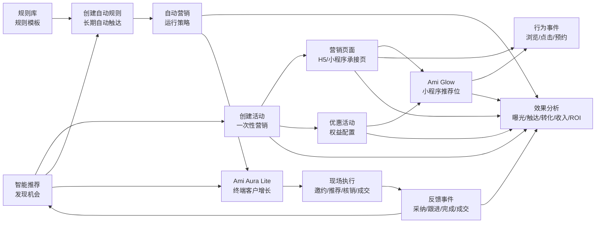
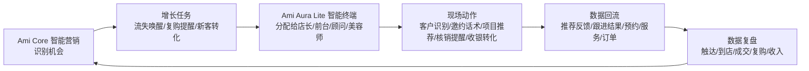

# 智能营销当前状态与简化建议

更新时间：2026-06-14  
范围：管理端 `src/app/pages/*`、智能营销路由、前端 API、`server-v2` 后端模型

## 1. 结论

智能营销当前已经从“功能堆叠”进入“闭环能力基本齐全”的状态：能发现客户机会、生成活动或自动规则、沉淀规则模板、发布推广页、配置优惠和小程序推荐位，并查看统一效果。再结合 Ami Aura Lite 智能终端，系统已经具备“后台发现机会、终端现场执行、结果回流复盘”的客户增长闭环基础。

但对门店用户来说，当前心智仍然偏复杂。原因不是能力太多，而是多个同级入口同时出现，用户难以判断应该先做什么：

- 智能推荐、规则库、自动营销都像“开始营销”的入口。
- 营销活动、营销页面、优惠活动、Ami Glow 都像“活动/资产”的入口。
- 活动效果、统一效果分析、页面效果又形成多个复盘入口。

建议简化方向：底层对象不删，用户入口收敛。短期可以从 5 个菜单降到“3 个日常入口 + 高级能力入口”，并新增一个默认的“营销工作台”承接普通用户的日常流程。

## 2. 当前页面与路由状态

### 2.1 侧边栏当前显示的智能营销入口

当前 `Layout.tsx` 中智能营销只显示 5 个二级菜单：

| 菜单 | 路由 | 页面组件 | 面向用户的定位 | 当前复杂点 |
| --- | --- | --- | --- | --- |
| 智能推荐 | `/customer-marketing/intelligent-recommendation` | `MarketingRecommendation` | 发现营销机会，一键创建活动或自动规则 | 推荐卡同时展示客户、预测、渠道、权益、项目，信息密度较高 |
| 规则库 | `/customer-marketing/rule-library` | `MarketingRuleLibrary` | 管理系统规则和门店自定义规则模板 | 对普通店长偏后台配置，更像高级能力 |
| 自动营销 | `/customer-marketing/automation` | `CreateMarketing` | 管理长期运行的自动营销策略 | 与规则库边界需要解释：规则库是模板，自动营销是运行策略 |
| 营销资产 | `/customer-marketing/assets` | `MarketingAssets` | 聚合页面、优惠、小程序推荐位、行为事件 | Tab 内对象较多，适合运营人员，不适合新手直接理解 |
| 效果分析 | `/customer-marketing/effect-analysis` | `MarketingAnalytics` | 统一查看活动、自动营销、页面、优惠、Ami Glow 效果 | 复盘入口与活动详情、页面效果弹窗有重叠 |

### 2.2 已保留但不在菜单显式展示的旧入口

`routes.tsx` 中仍保留多个旧路由，主要用于兼容和内部跳转：

| 路由 | 页面组件 | 当前角色 | 建议 |
| --- | --- | --- | --- |
| `/customer-marketing/activity-management` | `MarketingStrategy` | 活动管理旧入口 | 不作为主菜单；可并入营销工作台或营销资产 |
| `/customer-marketing/activity-effect/:id` | `MarketingActivityEffect` | 单活动效果详情 | 当前仍是本地模拟数据结构，建议后续接统一效果接口或降级隐藏 |
| `/customer-marketing/pages` | `MarketingPageManagement` | 营销页面旧入口 | 保留路由，菜单隐藏，由营销资产 Tab 承接 |
| `/customer-marketing/promotions` | `PromotionManagement` | 优惠活动旧入口 | 保留路由，菜单隐藏，由营销资产 Tab 承接 |
| `/customer-marketing/ami-glow` | `AmiGlowManagement` | Ami Glow 旧入口 | 保留路由，菜单隐藏，由营销资产 Tab 承接 |
| `/customer-marketing/strategy-templates` | `CreateMarketing` | 自动营销旧路径 | 保留兼容，菜单指向 `/automation` |

## 3. 当前模块关系

当前智能营销的实际关系不是平铺模块，而是一个运营闭环：



用产品语言描述：

1. 智能推荐告诉用户“现在最值得做什么”。
2. 用户选择“发一次活动”或“启用长期自动触达”。
3. 活动需要页面和优惠来承接。
4. 自动营销需要规则模板和触达动作来长期执行。
5. 页面、小程序、优惠和触达都会产生日志与效果。
6. 智能终端把后台机会转成现场动作，例如邀约回店、项目推荐、核销提醒、办卡升级。
7. 终端执行结果回写为推荐反馈、跟进任务、预约、核销、收银和服务记录。
8. 效果分析负责统一复盘，并反哺下一轮智能推荐。

## 4. 与智能终端-客户增长的关系

智能营销负责“增长策略和资产”，智能终端负责“门店现场执行和反馈”。两者不应该做成两个独立模块，而应该形成一个客户增长飞轮：



### 4.1 两端职责边界

| 能力 | 管理端智能营销 | Ami Aura Lite 智能终端 |
| --- | --- | --- |
| 机会发现 | 跑预测、生成推荐卡、沉淀规则模板 | 在店长“客户增长”入口展示今日优先客户 |
| 策略生产 | 创建活动、自动触达、推广页、优惠权益 | 不从零配策略，只承接可执行任务 |
| 客户触达 | 配置短信、小程序、企微、优惠和页面 | 前台/顾问按客户状态执行电话、企微、到店沟通 |
| 到店转化 | 统计活动、页面、自动触达效果 | 现场完成推荐、预约、核销、办卡、收银 |
| 数据回流 | 汇总曝光、触达、转化、收入和 ROI | 回写推荐采纳、跟进完成、服务记录、核销和订单 |

产品上建议这样表达：

- 管理端：今天门店应该经营哪些客户。
- 智能终端：现在员工应该对这个客户做什么。
- 数据复盘：这些动作有没有带来到店、复购和成交。

### 4.2 当前已有连接点

代码和接口里已经出现了多处连接基础：

| 连接点 | 当前能力 | 增长意义 |
| --- | --- | --- |
| 店长角色入口 | 终端角色菜单中 `manager.customers` 标记为“客户增长” | 店长可在终端直接查看增长/流失机会，不必进复杂后台 |
| 客户增长候选 | `/terminal/customers/growth-candidates`、`/terminal/dashboard/customer-growth` | 把预测客户转为今日可处理名单 |
| 单客户下一步动作 | `/terminal/customers/:id/next-best-actions` | 将推荐项目、护理建议、邀约建议合并为员工可执行动作 |
| 推荐反馈 | `/terminal/recommendation-events` | 记录推荐展示、采纳、跳过、转化等行为，反哺推荐质量 |
| 跟进任务 | `/terminal/follow-up-tasks`、`/terminal/follow-up-tasks/:id/complete` | 把智能营销推荐落为电话/企微/前台跟进任务 |
| 皮肤检测推荐 | `/terminal/skin-tests/:id/recommendations` | 用现场检测补充客户画像，提升个性化推荐准确度 |
| 可用活动 | `/terminal/promotions/available` | 终端现场可直接拿后台配置好的权益承接转化 |
| 自动触达跟进 | `/terminal/automations/touches/:id/follow-up` | 自动营销触达后，终端可标记人工跟进状态 |

### 4.3 对“简化建议”的影响

加入智能终端后，智能营销不应只简化为后台菜单，而应按“谁负责增长动作”来简化：

| 原后台入口 | 简化后定位 | 与终端关系 |
| --- | --- | --- |
| 营销工作台 | 店长看机会、定优先级 | 同步到终端“客户增长”卡片，形成今日跟进名单 |
| 自动触达 | 系统长期自动提醒客户 | 终端承接自动触达后的人工跟进和到店转化 |
| 推广资产 | 准备推广页、优惠、小程序展示 | 终端现场调用可用权益、推荐项目和推广页给客户 |
| 数据复盘 | 看活动、触达、页面、小程序效果 | 纳入终端推荐采纳、跟进完成、核销、收银和复购结果 |
| 规则模板 | 总部/运营配置默认打法 | 普通终端用户不感知规则，只看到“下一步动作” |

因此，菜单简化时建议把“营销工作台”定义成跨端增长入口：

```text
营销工作台
├─ 后台：客户机会、推荐策略、活动/自动触达创建
└─ 终端：今日客户增长、邀约任务、到店推荐、成交反馈
```

### 4.4 建议补充的产品闭环

为了让智能营销与终端真正形成客户增长闭环，建议后续补齐四个产品动作：

1. 推荐卡生成“终端跟进任务”
   - 智能推荐除了“发一次活动/开启自动触达”，增加“下发到终端跟进”。
   - 适用于高价值客户沉默、即将流失、复购窗口客户。

2. 终端客户增长卡可反向打开推荐详情
   - 店长在终端看到客户增长候选时，可以查看推荐原因、建议话术、推荐项目、可用优惠。
   - 不展示 LTV、算法、模型等后台术语。

3. 终端反馈进入数据复盘
   - 推荐给客户、已邀约、客户拒绝、已预约、已到店、已成交、已办卡都要进入统一效果统计。
   - 数据复盘新增“终端执行”维度，区分自动触达和人工跟进的贡献。

4. 终端现场数据反哺智能推荐
   - 皮肤检测、服务记录、顾问备注、核销、收银、未到店、拒绝原因都应成为下一轮推荐信号。
   - 这样智能推荐不只是看历史消费，也能看真实服务现场变化。

### 4.5 简化后的跨端用户故事

推荐用这条故事线指导产品呈现：

1. 早上店长打开营销工作台，看到“今天 12 位客户值得优先跟进”。
2. 后台建议其中 5 位适合自动触达，3 位适合发活动页，4 位适合顾问人工邀约。
3. 店长确认后，任务同步到 Ami Aura Lite 的“客户增长”。
4. 前台或顾问在终端看到客户名单、推荐话术、可用优惠和推荐项目。
5. 客户到店后，终端完成识别、推荐、核销、服务记录和收银。
6. 数据回到后台，数据复盘展示哪些客户被触达、哪些到店、哪些成交、带来多少收入。
7. 下一次智能推荐基于真实执行结果调整优先级和推荐动作。

## 5. 当前已经落地的能力

### 5.1 智能推荐

当前能力：

- 可运行预测批次并拉取推荐列表。
- 推荐卡包含目标客群、预估营收、周期、推荐项目/商品、渠道、权益和数据依据。
- 可查看推荐命中的客户名单。
- 可跳转自动营销，并通过 URL 参数带入推荐名称、触发规则、动作、渠道、推荐商品、来源信号等。
- 可打开活动创建弹窗并生成客户可见活动页。

产品判断：

- 能力完整，但普通用户不需要同时看到太多预测字段。
- 页面应突出“建议动作”，弱化“算法解释”。

### 5.2 规则库

当前能力：

- 支持系统推荐规则和门店自定义规则。
- 支持按来源、分类、场景、优先级、状态筛选。
- 支持查看、复制、编辑、启用、停用规则。
- 启用规则后会生成自动营销策略，并提供“查看自动营销”的跳转。

产品判断：

- 这是运营方法资产，不适合作为新手第一入口。
- 对普通门店可隐藏到自动营销页面里的“规则模板”Tab。

### 5.3 自动营销

当前能力：

- 支持策略列表、来源字段、触发规则、状态、覆盖客户、效果摘要。
- 支持新建、编辑、复制、启用、暂停、立即执行、删除。
- 新建流程分为规则、动作、预估三步。
- 支持预估命中客户和展示预测转化、LTV 等字段。

产品判断：

- 是长期运营的主线能力，应保留。
- 但创建流程需要用业务语言包装，避免让用户感觉在配置“规则引擎”。

### 5.4 营销资产

当前能力：

- 已用 `MarketingAssets` 聚合 4 个 Tab：
  - 营销页面
  - 优惠活动
  - 小程序推荐位
  - 行为事件
- 营销页面支持发布/下线、复制链接、预览、渠道链接、二维码、效果、归因。
- 优惠活动支持新建、编辑、发布、下线、删除。
- Ami Glow 支持把项目、商品、卡项、优惠、营销页面配置到小程序推荐位。
- 行为事件可查看客户小程序浏览、点击、预约等行为数据。

产品判断：

- 聚合方向正确。
- 但“行为事件”对普通用户过于技术化，建议默认隐藏到“数据明细”。

### 5.5 效果分析

当前能力：

- 统一拉取 `/marketing/effects/unified`。
- 支持按对象类型筛选：全部、营销活动、自动营销、营销页面、优惠活动、Ami Glow。
- 展示营销对象数、曝光触达、转化收入、ROI。
- 支持点击明细跳转。

产品判断：

- 方向正确，是统一复盘入口。
- 与活动详情页、营销页面效果弹窗存在重叠。建议统一效果分析作为主入口，其它页面只保留摘要和跳转。

## 6. 主要冗余点

| 冗余点 | 现象 | 对用户的影响 | 建议处理 |
| --- | --- | --- | --- |
| 智能推荐 vs 规则库 vs 自动营销 | 三个入口都能发起营销动作 | 用户不知道应该先点哪个 | 默认从“营销工作台/智能推荐”开始；规则库放到自动营销高级配置 |
| 活动管理 vs 营销页面 vs 优惠活动 | 活动、页面、优惠都像营销承接物 | 创建活动后还要理解页面和优惠的区别 | 用“推广资产”统一承接，活动作为一种推广对象 |
| Ami Glow vs 营销页面 | 都能展示给客户 | 用户不知道是页面还是小程序入口 | 文案改为“小程序展示位”，归入推广资产 |
| 行为事件 vs 效果分析 | 都是数据 | 普通用户看事件表没有直接价值 | 行为事件默认隐藏，效果分析展示业务指标 |
| 活动效果详情 vs 统一效果分析 | 两套复盘页面 | 指标口径可能不一致 | 活动详情只保留摘要，完整复盘跳统一效果分析 |
| 技术化词汇过多 | 规则、触发、LTV、预测、命中、策略等 | 门店用户理解成本高 | 前台改成“客户机会、自动提醒、回店邀约、推广页、复盘” |

## 7. 是否可以简化

可以，而且建议分层简化，不建议直接删功能。

### 7.1 推荐目标信息架构

面向门店日常使用，建议收敛为 3 个主入口：

```text
智能营销
├─ 营销工作台
├─ 自动触达
└─ 推广资产
```

高级运营或总部角色再显示：

```text
高级设置
├─ 规则模板
└─ 数据复盘
```

如果暂时不做角色差异，也可以先做 4 个入口：

```text
智能营销
├─ 营销工作台
├─ 自动触达
├─ 推广资产
└─ 数据复盘
```

### 7.2 新旧模块映射

| 新入口 | 承接当前页面 | 用户理解 |
| --- | --- | --- |
| 营销工作台 | 智能推荐 + 活动管理摘要 + 效果摘要 | 今天该做什么营销 |
| 自动触达 | 自动营销 + 规则库 Tab | 让系统长期自动提醒客户 |
| 推广资产 | 营销页面 + 优惠活动 + Ami Glow + 行为事件 | 准备客户看到的内容和权益 |
| 数据复盘 | 统一效果分析 + 活动/页面效果摘要 | 看有没有带来预约和收入 |
| 高级设置 | 规则库、事件明细、参数配置 | 给总部/运营/管理员使用 |

## 8. 推荐的简化方案

### 8.1 方案 A：低风险菜单简化，最快落地

不改数据库，不删路由，只改用户可见入口和页面文案。

调整：

- 新增 `/customer-marketing` 或 `/customer-marketing/workbench` 作为“营销工作台”。
- 左侧菜单改为：

```text
营销工作台
自动触达
推广资产
数据复盘
```

- 规则库从主菜单移到自动触达页面内，作为“规则模板”Tab。
- 活动管理继续隐藏，只从工作台和数据复盘进入。
- 行为事件默认折叠为“数据明细”。

适合当前阶段，工程风险最低。

### 8.2 方案 B：角色化简化，体验最好

按角色展示不同入口：

| 角色 | 默认入口 | 隐藏/折叠能力 |
| --- | --- | --- |
| 店长 | 营销工作台、自动触达、推广资产 | 规则模板、事件明细、复杂归因 |
| 美容顾问 | 今日邀约、客户跟进、推广链接 | 自动规则配置、ROI 分析 |
| 总部运营 | 营销工作台、自动触达、推广资产、数据复盘、规则模板 | 不隐藏 |
| 超级管理员 | 全部入口 | 不隐藏 |

适合演示和真实门店试用，但需要结合权限或角色配置。

### 8.3 方案 C：流程化重构，长期最优

把智能营销做成一个向导式流程：

```text
选目标 -> 选客户 -> 选权益/页面 -> 选择发一次或长期自动 -> 发布 -> 复盘
```

适合后续产品成熟期。当前不建议一步到位，因为会改动更多页面结构。

## 9. 建议的具体产品改动

### 9.1 智能推荐改为“营销工作台”

页面顶部只回答三个问题：

1. 今天最值得做什么？
2. 预计能覆盖多少客户？
3. 一键发活动还是开启自动触达？

推荐卡简化：

- 主标题：例如“唤回 38 位 60 天未到店老客”
- 主动作：开启自动触达 / 发一次活动
- 次级信息：预计收入、推荐权益、推荐渠道
- 折叠信息：数据依据、客户明细、模型批次

### 9.2 自动营销改为“自动触达”

文案从配置语言改成业务语言：

| 当前说法 | 建议说法 |
| --- | --- |
| 自动营销 | 自动触达 |
| 触发规则 | 什么时候提醒 |
| 执行动作 | 怎么联系客户 |
| 覆盖客户 | 会影响多少客户 |
| 立即执行 | 立即触达 |
| 规则库 | 规则模板 |

页面结构：

```text
自动触达
├─ 运行中
├─ 草稿
├─ 已暂停
└─ 规则模板
```

### 9.3 营销资产改为“推广资产”

当前“营销资产”对非运营用户偏抽象，建议改成“推广资产”或“推广内容”。

Tab 建议：

```text
推广资产
├─ 推广页
├─ 优惠权益
├─ 小程序展示
└─ 数据明细
```

默认隐藏“行为事件”，改成二级入口“数据明细”。

### 9.4 效果分析改为“数据复盘”

默认只展示业务指标：

- 带来多少访问
- 带来多少预约
- 带来多少成交
- 带来多少收入
- 哪个活动/渠道最有效

高级筛选如 objectType、ROI、归因窗口可以折叠。

### 9.5 活动管理降级

活动管理不建议继续作为智能营销主入口。它更像“活动对象列表”，可以有三种处理：

1. 放到营销工作台的“进行中活动”卡片。
2. 放到推广资产里作为“活动”筛选。
3. 保留旧路由，但不在菜单展示。

## 10. 推荐落地顺序

### 第 1 阶段：不动接口，先降复杂度

目标：1-2 天内让体验明显变简单。

- 新增“营销工作台”入口。
- 左侧菜单改为 4 个入口：营销工作台、自动触达、推广资产、数据复盘。
- 规则库移入自动触达页面 Tab，主菜单隐藏。
- 营销资产改名为推广资产。
- 效果分析改名为数据复盘。
- 保留所有旧路由，避免外链和历史跳转失效。

### 第 2 阶段：统一主流程

目标：让用户不用理解多个对象关系。

- 智能推荐卡只保留两个主动作：发一次活动、开启自动触达。
- 对高价值沉默、流失风险、复购窗口等客户，增加第三个动作：下发到终端跟进。
- 发一次活动后自动创建活动 + 推广页 + 可选优惠。
- 开启自动触达后自动进入策略确认页，不让用户从零配规则。
- 终端“客户增长”展示后台下发的今日跟进名单、推荐话术、推荐项目和可用优惠。
- 所有页面的“查看效果”统一跳数据复盘，并纳入终端跟进、预约、核销、收银等执行结果。

### 第 3 阶段：角色化和高级能力收纳

目标：适配真实门店和总部运营。

- 店长默认不显示规则模板和事件明细。
- 总部运营显示规则模板、归因明细、事件明细。
- 超级管理员保留全部配置入口。
- 终端按角色拆分动作：店长看客户增长优先级，前台看邀约/预约/核销，美容师看护理建议和服务记录。

## 11. 不建议做的事

- 不建议删除 `MarketingRuleTemplate`、`MarketingAutomationStrategy`、`MarketingPage`、`Promotion`、`AmiGlowDisplayConfig` 等底层对象；这些对象承担不同数据职责。
- 不建议把规则库和自动营销在数据库层合并；规则是模板，策略是运行实例。
- 不建议把营销页面和活动完全合并；页面后续会承接商品、项目、卡项，不只服务活动。
- 不建议让普通用户直接面对行为事件表；应转译成访问、点击、预约、成交等业务指标。
- 不建议继续扩展活动效果详情的独立模拟数据；应统一接入真实效果分析口径。

## 12. 一句话建议

智能营销当前能力已经足够完整，下一步重点不是继续加模块，而是把入口改成“今天该经营哪些客户、系统自动做什么、终端现场做什么、客户看到什么、最后效果如何”。建议先用菜单和页面聚合做低风险简化，再把 Ami Aura Lite 的客户增长入口纳入同一条执行和反馈闭环。
