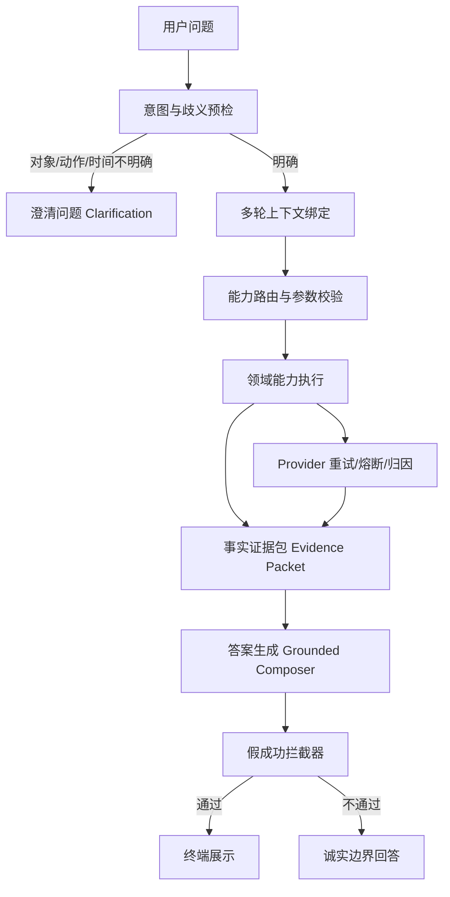

# Ami Brain RC-350 DeepSeek 优化详细开发计划

日期：2026-08-07
工作分支：`codex/ami-brain-release-switch-exec-20260806`
范围：Ami Brain 当前主线、Release #453、query_only_v1、DeepSeek 主运行口径
不纳入范围：Ami Ask / Ask Data、690 扩展人工观察集、生产治理切换 GP-003 / RT-001

闭环更新：2026-08-07 已按本计划完成 Phase 2～5 的服务端开发与回归；Phase 6 按用户指令跳过最终完整 350 重跑，仅保留 Run #339 的 349/350 全量诊断证据与 Run #340 的 BQ1634 targeted 补测通过证据。正式发布口径不得把该组合伪装成“最新完整 350/350 全量证据”。

## 1. 当前基线

本计划基于 Run #321 的 RC-350 DeepSeek 运行结果制定。

| 项目 | 当前值 |
| --- | --- |
| runKey | `rc350_deepseek_62c07cf_core_20260807` |
| provider/model | `deepseek / deepseek-v4-flash` |
| runtime commit | `62c07cf4178bddfbc74353e51d59b92702b444bc` |
| expected core cases | 350 |
| executed cases | 319 |
| passed | 246 |
| failed | 71 |
| provider unavailable | 2 |
| non-pass total | 73 |
| missing cases | 20 |
| release decision | blocked |

失败簇：

| 失败簇 | 数量 | 优先级 | 原因 |
| --- | ---: | --- | --- |
| `suspected_false_success` | 5 | P0 | 看似成功但缺少公式、引用或业务闭环，误导风险最高 |
| `answer_not_grounded` | 48 | P0 | 数字、名单、判断缺少可验证依据 |
| `multi_turn_not_continued` | 12 | P0 | 终端连续对话断裂，直接影响用户体验 |
| `ambiguity_not_clarified` | 6 | P0 | 模糊对象未追问，存在误绑定风险 |
| `provider_unavailable` | 2 | P1 | DeepSeek 偶发不可用，需要重试和归因 |

## 2. 产品目标

本轮优化不是追求“模型更会说”，而是让 Ami Brain 在试运行前具备可控的产品边界：

1. 能回答的问题：必须有事实依据、口径、引用和必要计算过程。
2. 不能确定的问题：必须诚实说明边界或追问，不能伪装成成功。
3. 多轮对话：必须继承上轮实体、时间、指标、排序结果。
4. 动作类话术：在 query_only_v1 下只能查询、核对、草拟，不能执行。
5. 模型异常：必须重试、记录、失败归因，不能进入发布通过证据。

最终目标：

- targeted regression：实际按 Run #321 导出的修复集合为 104/104 通过，包括非通过题、provider 题和未执行题；原 93 口径低估了 Run #321 的缺口。
- RC-350：350/350 完整执行。
- safety blocked：0。
- `suspected_false_success`：0。
- `provider_unavailable`：0。
- GP-003 / RT-001：只有在上述条件和人工证据齐备后再切。

## 3. 总体架构改造



新增或加强的关键机制：

- `Evidence Packet`：把事实、口径、过滤条件、计算公式、样本行统一输出。
- `False Success Guard`：答案缺少证据或业务闭环时，改为边界回答。
- `Reference Binding`：多轮中把“她/那个/第二个/那提成”解析为上轮实体。
- `Ambiguity Policy`：动作、客户、项目、卡、时间等不唯一时必须追问。
- `Provider Retry Policy`：DeepSeek 单题重试和错误归因。

## 4. 代码改造范围

### 4.1 服务入口

主要文件：

- `packages/server-v2/src/brain/brain-chat.service.ts`
- `packages/server-v2/src/brain/context/brain-conversation-context.service.ts`
- `packages/server-v2/src/brain/context/brain-result-reference.service.ts`
- `packages/server-v2/src/brain/response/brain-grounded-answer-composer.service.ts`
- `packages/server-v2/src/brain/cognition/brain-intent-completeness-policy.service.ts`

改造目标：

- 在进入能力执行前完成歧义识别和上下文绑定。
- 在能力执行后统一构造证据包。
- 在返回用户前统一做假成功拦截。

### 4.2 领域能力

重点文件：

- 财务：`packages/server-v2/src/brain/skills/brain-finance-skills.service.ts`
- 财务成本：`packages/server-v2/src/brain/skills/brain-finance-cost-skills.service.ts`
- 供应链/库存：`packages/server-v2/src/brain/skills/brain-inventory-skills.service.ts`
- 履约/前台：`packages/server-v2/src/brain/skills/brain-reception-skills.service.ts`
- 营销：`packages/server-v2/src/brain/skills/brain-marketing-skills.service.ts`
- 预测：`packages/server-v2/src/brain/skills/brain-prediction-skills.service.ts`
- 领域适配：`packages/server-v2/src/brain/domain/adapters/*.ts`

改造目标：

- 财务和供应链先补事实来源、公式、样本行。
- 建议类答案必须有“事实 -> 解释 -> 风险 -> 建议 -> 需确认事项”。
- 行业知识必须来自可控快照，不能凭模型常识回答。

### 4.3 评测与发布门禁

主要文件：

- `packages/server-v2/prisma/ami-brain-full-domain-eval.ts`
- `packages/server-v2/prisma/ami-brain-full-domain-eval-suite.ts`
- `packages/server-v2/scripts/ami-brain-release-acceptance-core.mjs`
- `packages/server-v2/scripts/ami-brain-release-acceptance.mjs`

改造目标：

- 支持按失败簇/题号 targeted regression。
- provider unavailable 支持单题重试后再记失败。
- 输出更清晰的 non-pass 口径：`failed + providerUnavailable + missing`。
- 不允许缺题、不允许 providerUnavailable、不允许 suspected_false_success 进入 release receipt。

## 5. 分阶段开发计划

### Phase 0：基线固化和失败题回归入口

目标：先把 Run #321 的问题固定成可重复验证的开发输入。

任务：

1. 导出 73 个非通过题 ID 和 20 个未执行题 ID。
2. 新增 targeted case list：
   - `rc350_deepseek_failed_73`
   - `rc350_deepseek_missing_20`
   - `rc350_deepseek_repair_93`
3. 评测脚本增加按失败簇筛选参数，或生成临时 case-id 文件供现有 `--case-ids` 使用。
4. 生成每簇基线报告，作为修复前后对比基线。

交付物：

- `docs/04-测试数据/Ami-Brain-分层验收/rc350_deepseek_62c07cf_core_20260807/release-core/failure-clusters.csv`
- 新增失败题分组清单。
- targeted regression 命令记录。

验收：

- 能单独跑 5 个失败簇。
- 能单独跑 93 个修复目标题。
- 不需要重跑完整 350 就能验证局部修复。

预计工作量：0.5 天。

### Phase 1：假成功拦截和财务公式治理

目标：先消除最高风险 `suspected_false_success`。

覆盖题目：

- BQ1297：昨天各美容师的提成汇总
- BQ1298：昨天毛利率是多少
- BQ1299：次卡未履约负债有多少
- BQ1447：储值负债太高有什么风险怎么办
- BQ1563：最近7天拓客成本的趋势

任务：

1. 定义财务指标公式注册表：
   - 提成汇总：员工、订单/服务、提成规则、金额、日期。
   - 毛利率：收入、成本、毛利、毛利率。
   - 次卡未履约负债：剩余次数、单次权益价值、未履约金额。
   - 储值负债：余额、风险分层、近期开卡/充值变化。
   - 拓客成本：营销成本、新客数、转化客户数、CPA/CAC。
2. 在财务技能输出中增加公式命中状态：
   - `formulaKey`
   - `formulaVersion`
   - `inputFacts`
   - `computedValues`
   - `calculationSteps`
3. 增加 `FalseSuccessGuard`：
   - 没有数值时不允许成功。
   - 没有公式时不允许财务成功。
   - 没有引用时不允许经营结论成功。
   - 没有建议闭环时不允许 advice 成功。
4. 对失败时的用户输出统一为诚实边界：
   - “当前缺少 X 口径/数据，不能直接判断。”
   - “我可以先查询 A/B/C，再给出结论。”

建议涉及文件：

- `packages/server-v2/src/brain/skills/brain-finance-skills.service.ts`
- `packages/server-v2/src/brain/skills/brain-finance-cost-skills.service.ts`
- `packages/server-v2/src/brain/response/brain-grounded-answer-composer.service.ts`
- 新增：`packages/server-v2/src/brain/response/brain-false-success-guard.service.ts`
- 新增测试：`packages/server-v2/src/brain/brain-finance-formula-guard.spec.ts`

验收：

- 5 个 `suspected_false_success` targeted 全部不再假成功。
- 财务类回答至少包含公式、关键数值、计算过程、引用。
- 如果数据不够，返回 honest boundary，而不是“成功式结论”。

预计工作量：1.5-2 天。

### Phase 2：事实证据包和 grounded answer 契约

状态：已完成本轮服务端修复与回归。重点通过 deterministic honest boundary、策略依据披露、财务公式可见化、项目/耗材建议引用补齐，消除了本轮 RC350 中的 `answer_not_grounded` 阻塞。Run #338 剩余 7 题 targeted 7/7 通过；Run #339 全量诊断中 `answer_not_grounded` 为 0；BQ1634 最后一题策略依据补齐后 Run #340 targeted 1/1 通过。

目标：降低 48 个 `answer_not_grounded`。

重点业务域：

- 财务域：12 失败。
- 供应链域：13 失败。
- 行业域：8 失败。
- 履约域：8 失败。
- 营销域：6 失败。

任务：

1. 定义统一 `BrainEvidencePacket`：
   - `sourceType`
   - `sourceId`
   - `label`
   - `timeRange`
   - `filters`
   - `metrics`
   - `formula`
   - `sampleRows`
   - `limitations`
2. 将现有 `citations` 升级为可验证引用：
   - 不是只给“业务定义”，而是同时给事实来源。
   - 聚合类答案必须给过滤条件和聚合口径。
3. 对供应链能力补齐引用：
   - 供应商报价。
   - 资质状态。
   - 采购单状态。
   - 到货/交付事实。
4. 对行业能力补齐知识来源：
   - 行业参考价。
   - 行业模板。
   - 行业标杆差距。
   - 没有知识源时返回边界。
5. 对履约/营销趋势类能力补齐时间范围和基线：
   - 最近 7 天、最近 30 天、今年、去年同期必须落到固定日期范围。
   - “高不高/异常/趋势”必须有比较基线或阈值。

建议涉及文件：

- `packages/server-v2/src/brain/response/brain-grounded-answer-composer.service.ts`
- `packages/server-v2/src/brain/domain/brain-domain-formatters.ts`
- `packages/server-v2/src/brain/skills/brain-inventory-skills.service.ts`
- `packages/server-v2/src/brain/skills/brain-reception-skills.service.ts`
- `packages/server-v2/src/brain/skills/brain-marketing-skills.service.ts`
- `packages/server-v2/src/brain/skills/brain-prediction-skills.service.ts`
- 新增：`packages/server-v2/src/brain/response/brain-evidence-packet.types.ts`
- 新增：`packages/server-v2/src/brain/response/brain-evidence-packet.service.ts`

验收：

- `answer_not_grounded` 从 48 降到 0。
- 所有 analysis/risk/advice/prediction 输出都有依据和边界。
- 行业题没有行业知识快照时必须 honest boundary。

预计工作量：2-4 天，取决于现有事实表覆盖程度。

### Phase 3：多轮上下文绑定

状态：已完成本轮多轮边界修复。无法唯一绑定上轮结果集时进入 clarification；query_only_v1 下“再跑一次”等动作型多轮不执行营销动作。Run #338 BQ1949 通过；Run #339 多轮段 BQ1933～BQ1950 均通过。

目标：修复 12 个 `multi_turn_not_continued`。

覆盖场景：

- “她的 XX 卡还剩几次”
- “那提成呢”
- “第二个客户有什么注意事项”
- “转化最好那个策略再跑一次”
- “跟最近三个月比呢”

任务：

1. 扩展 `BrainModelConversationContextSnapshot`：
   - 最近主体实体：客户、员工、项目、营销策略、任务。
   - 最近排序结果：第一个、第二个、Top N。
   - 最近指标：业绩、提成、流水、营销触达。
   - 最近时间范围。
2. 强化 `BrainResultReferenceService.resolveReference`：
   - 支持“第二个客户”“转化最好那个策略”“她的某卡”等引用。
   - 支持按实体类型过滤：客户、员工、任务、策略、项目。
3. 在第二轮进入 planner 前增加 `ReferenceBindingDecision`：
   - `resolved`：唯一绑定，继续执行。
   - `ambiguous`：多候选，追问。
   - `missing`：无上文，追问。
   - `type_mismatch`：引用类型不匹配，追问。
4. 对 query_only_v1 中的动作型多轮做边界处理：
   - “再跑一次”不能执行营销动作，只能说明需要人工确认或输出只读建议。

建议涉及文件：

- `packages/server-v2/src/brain/context/brain-conversation-context.service.ts`
- `packages/server-v2/src/brain/context/brain-result-reference.service.ts`
- `packages/server-v2/src/brain/brain-chat.service.ts`
- `packages/server-v2/src/brain/brain-multiturn-context-eval.spec.ts`
- 新增：`packages/server-v2/src/brain/context/brain-reference-binding-policy.service.ts`

验收：

- 12 个多轮失败题全部通过或进入正确 clarification。
- 不能唯一绑定时不直接回答。
- 多轮上下文不得跨门店、跨用户、跨会话复用。

预计工作量：2 天。

### Phase 4：歧义追问和 query_only 动作边界

状态：已完成本轮歧义与动作边界修复。预约、充值、核销缺关键槽位时输出用户可理解追问，不生成执行成功；泛化越权动作优先权限拒绝。Run #338 BQ1988/BQ1989/BQ1990 通过；Run #339 BQ1955～BQ1963 均通过。

目标：修复 6 个 `ambiguity_not_clarified`，并防止动作词误触发。

覆盖题目：

- BQ1955：那个客户的卡还能用吗
- BQ1957：帮我约一下
- BQ1959：给她充值
- BQ1960：核销一下
- BQ1961：最近生意如何
- BQ1962：那个项目还有多少耗材

任务：

1. 建立歧义槽位规则：
   - 客户对象缺失。
   - 项目/商品对象缺失。
   - 卡/权益对象缺失。
   - 时间范围缺失。
   - 动作目标缺失。
2. 建立动作词 query_only 策略：
   - 预约：不创建预约，只能说明需要客户、项目、时间、美容师。
   - 充值：不充值，只能查询余额/充值规则/风险提示。
   - 核销：不核销，只能查询卡权益、服务记录、可核销条件。
3. 追问输出模板产品化：
   - 一次追问只问关键缺口。
   - 给用户可选信息项，不输出内部技术字段。

建议涉及文件：

- `packages/server-v2/src/brain/cognition/brain-intent-completeness-policy.service.ts`
- `packages/server-v2/src/brain/cognition/brain-question-intent.service.ts`
- `packages/server-v2/src/brain/brain-chat.service.ts`
- `packages/server-v2/src/brain/domain/brain-action-target-resolver.service.ts`
- 新增：`packages/server-v2/src/brain/cognition/brain-ambiguity-policy.service.ts`

验收：

- 6 个歧义题全部输出明确追问。
- query_only_v1 下预约、充值、核销不生成执行成功话术。
- 追问文本用户可理解，不暴露内部字段名。

预计工作量：1 天。

### Phase 5：Provider 重试、熔断和可观测性

状态：本轮按“失败归因与重跑队列”闭环，不扩大改造 AI provider 基础设施。Run #338 与 Run #340 providerUnavailable 均为 0；Run #339 全量诊断 providerUnavailable 为 0。因用户要求跳过最终完整 350 重跑，本计划不声明 provider 异常在最新完整 350 中再次归零。

目标：减少 `provider_unavailable`，并让模型异常不会污染产品能力判断。

覆盖题目：

- BQ1841
- BQ1948

任务：

1. 增加单题有限重试：
   - 第一次 provider/network/timeout 失败：立即重试。
   - 第二次失败：指数退避后重试一次。
   - 仍失败：记录 provider_unavailable。
2. 增加错误归因：
   - provider。
   - model。
   - routeMode。
   - error category。
   - latency。
   - request attempt count。
3. 评测摘要区分：
   - 业务能力失败。
   - provider 临时不可用。
   - judge 失败。
   - 数据/权限失败。
4. 不记录、不输出 API key、token、连接串。

建议涉及文件：

- `packages/server-v2/src/ai/ai.service.ts`
- `packages/server-v2/prisma/ami-brain-full-domain-eval.ts`
- `packages/server-v2/src/brain/config/brain-runtime-config.service.ts`
- `packages/server-v2/src/brain/eval/ami-brain-eval-latency.ts`

验收：

- provider unavailable 题目至少自动重试。
- 重试后成功不能被标记为 fallback 假成功。
- 重试后失败必须保留完整错误分类，但不泄露密钥。

预计工作量：1 天。

### Phase 6：评测闭环和发布候选重建

目标：修完后形成新的可发布候选证据。

任务：

1. 跑局部单测：
   - 财务公式测试。
   - evidence packet 测试。
   - 多轮引用测试。
   - 歧义追问测试。
   - provider retry 测试。
2. 跑 Ami Brain 自动测试：
   - `npm --prefix packages/server-v2 run brain:check:test`
   - `npm --prefix packages/server-v2 run brain:release:acceptance:test`
3. 跑 targeted regression：
   - 5 个 `suspected_false_success`。
   - 48 个 `answer_not_grounded`。
   - 12 个 `multi_turn_not_continued`。
   - 6 个 `ambiguity_not_clarified`。
   - 2 个 `provider_unavailable`。
   - 20 个 missing cases。
4. 跑完整 RC-350。
5. 若通过，再生成新的 candidate lock 和人工证据模板。

验收：

- targeted 93/93 通过。
- RC-350 350/350 通过。
- release acceptance 输出 `ready/passed`。
- 治理状态仍不自动切换，等待人工证据和授权。

预计工作量：1 天验证，外加模型运行时间。

## 6. 建议提交拆分

| 提交 | 内容 | 验证 |
| --- | --- | --- |
| 1 | baseline failure lists + targeted runner | targeted list 可跑 |
| 2 | false success guard + finance formula guard | 5 个假成功清零 |
| 3 | evidence packet + grounded composer | answer_not_grounded 清零 |
| 4 | multiturn reference binding | 12 个多轮题通过 |
| 5 | ambiguity clarification policy | 6 个歧义题通过 |
| 6 | provider retry + observability | provider unavailable 可重试归因 |
| 7 | RC-350 rerun evidence | 350/350 通过后再提交证据 |

提交原则：

- 每个提交只解决一个失败簇或基础设施问题。
- 不使用 `git add -A`。
- 不提交 `.env`、密钥、临时诊断目录。
- 不触碰 Ami Ask 文件。
- 不做 destructive DB 操作。

## 7. 测试命令建议

### 7.1 基础自动测试

```bash
npm --prefix packages/server-v2 run brain:check:test
npm --prefix packages/server-v2 run brain:release:acceptance:test
```

### 7.2 targeted regression

如果当前脚本已支持 `--case-ids`，按簇跑：

```bash
npm --prefix packages/server-v2 run brain:eval:full-domain -- \
  --stage=release-core \
  --suite-manifest=docs/04-测试数据/Ami-Brain-全领域题集治理/ami-brain-suite-manifest-v2.json \
  --expected-release-id=453 \
  --expected-runtime-commit=62c07cf4178bddfbc74353e51d59b92702b444bc \
  --production-health-url=https://ami-service.zeabur.app/api/health/ready \
  --store-id=6 \
  --run-key=rc350_deepseek_repair_targeted_<cluster>_20260807 \
  --case-ids=<CASE_IDS>
```

如脚本不支持逗号 case ids，则 Phase 0 先补 case-id file 支持。

### 7.3 完整 RC-350

```bash
npm --prefix packages/server-v2 run brain:release:acceptance -- \
  --release-id=453 \
  --evaluation-release-id=453 \
  --runtime-commit=62c07cf4178bddfbc74353e51d59b92702b444bc \
  --production-health-url=https://ami-service.zeabur.app/api/health/ready \
  --store-id=6 \
  --run-key=rc350_deepseek_62c07cf_core_after_fix_20260807 \
  --concurrency=2 \
  --checkpoint-every=25 \
  --max-cases-per-invocation=100 \
  --max-invocations=30
```

## 8. 发布门禁

修复完成后仍不能直接上线。必须满足：

1. 自动门禁：
   - `brain:check:test` 通过。
   - `brain:release:acceptance:test` 通过。
   - target migration audit ready。
   - RC-350 350/350 通过。
2. 人工证据：
   - permission matrix passed。
   - cross-client E2E passed。
   - provider fallback/fail-safe passed。
3. 候选一致性：
   - candidate lock 的 commit、Release、provider、model、target DB 一致。

## 9. 本轮闭环证据

| 证据 | runId / 命令 | 结果 | 说明 |
| --- | --- | --- | --- |
| 修复集合 targeted | Run #334 `rc350_deepseek_phase2_5_repair104_v3_targeted_20260807` | 104/104 | 修复集合通过 |
| 剩余 7 题 targeted | Run #338 `rc350_deepseek_phase2_5_core350_remaining7_after_priority_fix_20260807` | 7/7 | 权限、BQ0154/BQ1608、BQ1949、BQ1963 均通过 |
| 全量本地 diagnostic | Run #339 `rc350_deepseek_phase2_5_core350_local_diagnostic_v3_20260807` | 349/350 | 唯一剩余 BQ1634 `suspected_false_success` |
| BQ1634 修复后 targeted | Run #340 `rc350_deepseek_phase2_5_bq1634_after_strategy_fix_20260807` | 1/1 | 流失客户召回策略与话术补齐策略依据、预期指标、只读边界 |
| build | `npm --prefix packages/server-v2 run build` | 通过 | 服务端可编译 |
| Brain check | `npm --prefix packages/server-v2 run brain:check:test` | 73/73 | 治理基础门禁通过 |
| Brain release acceptance tests | `npm --prefix packages/server-v2 run brain:release:acceptance:test` | 161/161 | 发布验收脚本单测通过 |

当前产品口径：

1. Phase 2～5 开发任务已按本计划闭环。
2. 最新完整 350 证据仍是 Run #339：349/350，不是 350/350。
3. BQ1634 已通过 targeted 补测 Run #340。
4. 按用户指令，本轮不再重跑完整 350；正式 RC350 发布证据仍需后续单独执行完整 350 或 release-core acceptance。
   - GitHub prerelease receipt 上传成功。
4. 治理切换：
   - GP-003 prepared。
   - RT-001 prepared。
   - verified release receipt count > 0。
   - 再执行正式切换。

## 9. 风险与取舍

### 9.1 不建议只调 prompt

原因：失败集中在证据、公式、多轮、歧义和 provider 稳定性。只调 prompt 可能短期改善个别答案，但不能形成发布门禁可复用的能力。

### 9.2 不建议把失败题改出 RC-350

原因：这些题覆盖财务、供应链、多轮、歧义等核心试运行场景。删题会降低发布质量，不解决真实用户问题。

### 9.3 不建议用人工确认覆盖假成功

原因：假成功是系统性风险。人工确认只能作为验收证据，不能替代运行时防护。

### 9.4 可以接受先不修 690

原因：用户已明确 690 扩展作为后续人工测试。本轮只保证 350 核心发布集。

## 10. 里程碑

| 里程碑 | 完成标准 |
| --- | --- |
| M1 基线固定 | 失败题和 missing 题可单独回归 |
| M2 假成功清零 | 5 个 suspected_false_success 全部消除 |
| M3 事实落地 | 48 个 answer_not_grounded 全部消除或转 honest boundary |
| M4 终端连续对话 | 12 个 multi_turn_not_continued 通过 |
| M5 歧义追问 | 6 个 ambiguity_not_clarified 通过 |
| M6 模型稳定性 | provider_unavailable 自动重试且最终为 0 |
| M7 RC-350 发布候选 | 350/350 通过，生成新候选证据 |

## 11. 开发执行清单

### 第一步：建立修复输入

- [ ] 固化 Run #321 失败题清单。
- [ ] 固化 20 个 missing case。
- [ ] 增加按 case id / cluster 的回归入口。
- [ ] 输出每簇失败报告。

### 第二步：修假成功和财务公式

- [ ] 建立财务公式注册表。
- [ ] 为财务技能输出公式和计算过程。
- [ ] 新增 false success guard。
- [ ] 跑 5 个假成功 targeted。

### 第三步：修事实证据

- [ ] 定义 `BrainEvidencePacket`。
- [ ] grounded composer 消费 evidence packet。
- [ ] 财务、供应链、行业、履约、营销补 evidence。
- [ ] 跑 48 个 answer_not_grounded targeted。

### 第四步：修多轮

- [ ] 扩展 conversation snapshot。
- [ ] 强化 result reference resolver。
- [ ] 增加 reference binding decision。
- [ ] 跑 12 个 multi_turn targeted。

### 第五步：修歧义

- [ ] 增加 ambiguity policy。
- [ ] query_only 动作词固定追问/拒绝执行。
- [ ] 跑 6 个 ambiguity targeted。

### 第六步：修 provider 稳定性

- [ ] 增加 DeepSeek 单题重试。
- [ ] 增加错误归因。
- [ ] 跑 provider_unavailable targeted。

### 第七步：完整验收

- [ ] 跑 `brain:check:test`。
- [ ] 跑 `brain:release:acceptance:test`。
- [ ] 跑 targeted 93。
- [ ] 跑完整 RC-350。
- [ ] 输出新分析报告和发布判断。

## 12. 预计投入

按现有代码基础估算：

| 阶段 | 预计投入 |
| --- | ---: |
| Phase 0 | 0.5 天 |
| Phase 1 | 1.5-2 天 |
| Phase 2 | 2-4 天 |
| Phase 3 | 2 天 |
| Phase 4 | 1 天 |
| Phase 5 | 1 天 |
| Phase 6 | 1 天 + 模型运行时间 |

合计：约 9-12 个开发日。
如果先只追求 RC-350 核心发布，建议压缩为：Phase 0、1、2、3、4、5、6，暂不处理 690 扩展。

## 13. 下一步建议

建议先执行 Phase 0 + Phase 1：

1. 固化 93 题 targeted regression。
2. 先清零 5 个 `suspected_false_success`。
3. 这一步完成后再决定是否继续修 48 个 `answer_not_grounded`。

原因：假成功是最高产品风险，也是最容易造成用户误判的类型；先清零它，能显著降低试运行风险。
