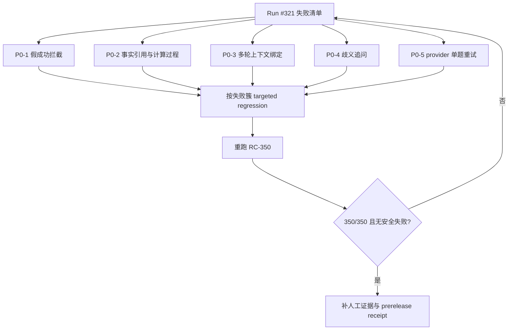

# Ami Brain RC-350 DeepSeek 失败分析与优化建议

日期：2026-08-07
范围：Ami Brain 当前主线，Release #453，query_only_v1，DeepSeek 备用模型切主后的 RC-350 核心发布验收
不纳入范围：Ami Ask / Ask Data 分支、690 扩展人工观察集、正式 GP-003 / RT-001 切换

## 1. 结论

本轮不是“还在用 Luna”的问题。模型路由已经切到 DeepSeek：

- provider：`deepseek`
- model：`deepseek-v4-flash`
- 云端 routeMode：`fallback_promoted`
- fallbackPolicy：`disabled`
- 运行 Run：#321
- runKey：`rc350_deepseek_62c07cf_core_20260807`

但 RC-350 发布验收未通过，状态为 `blocked`。

核心结果：

| 指标 | 结果 |
| --- | ---: |
| 应执行核心题 | 350 |
| 实际执行 | 319 |
| 通过 | 246 |
| 失败 | 71 |
| provider unavailable | 2 |
| 未执行 | 20 |
| deterministic pass rate | 77.60% |
| 发布判断 | blocked |

产品判断：当前版本可以继续作为内部诊断和修复基线，但不能作为正式发布证据，不能执行 GP-003 / RT-001 正式切换。

## 2. 第一性原理：为什么这些失败必须阻断发布

Ami Brain 的 query_only_v1 发布目标不是“模型能回答”，而是“在真实门店数据、真实权限、真实业务语境下，稳定给出可验证、可追责、不会误导用户的只读答案”。

因此发布门禁最少要同时满足五类约束：

1. 事实可落地：回答中的数字、名单、判断必须能追溯到业务事实或明确口径。
2. 边界要诚实：没有数据、口径缺失、对象不明确时，必须说明边界或追问，而不是假装完成。
3. 多轮要连续：第二轮问题必须继承第一轮对象、时间、角色和意图。
4. 只读要安全：所有 Action/执行类能力必须被拒绝或转为只读解释。
5. 模型要稳定：主路由不可用不能导致假成功、卡死或不完整证据。

本轮 Action 类 46/46 通过，说明“只读安全拒绝”方向是好的；主要问题集中在事实落地、多轮上下文、歧义追问和模型稳定性。

## 3. 失败簇分析

| 失败簇 | 数量 | 产品含义 | 发布风险 |
| --- | ---: | --- | --- |
| `answer_not_grounded` | 48 | 回答没有充分引用、计算过程或业务事实支撑 | 高：用户会看到看似正确但无法核验的经营结论 |
| `multi_turn_not_continued` | 12 | 第二轮没有继承上一轮对象/上下文 | 高：会让“智能终端对话”体验断裂 |
| `ambiguity_not_clarified` | 6 | 对“那个客户/她/帮我约一下/核销一下”等模糊指令未追问 | 高：可能误绑定客户、卡、预约或动作 |
| `suspected_false_success` | 5 | 系统给出了成功式答案，但缺少目标公式、数据或建议闭环 | 最高：比拒答更危险，容易误导经营决策 |
| `provider_unavailable` | 2 | DeepSeek 调用出现不可用 | 中高：需要重试/熔断，不能进入发布证据 |

## 4. 按业务域定位

| 业务域 | 总数 | 通过 | 失败 | 失败率 |
| --- | ---: | ---: | ---: | ---: |
| 供应链域 | 25 | 12 | 13 | 52.0% |
| 财务域 | 24 | 12 | 12 | 50.0% |
| 行业域 | 16 | 8 | 8 | 50.0% |
| 横切-多轮 | 30 | 17 | 13 | 43.3% |
| 横切-歧义 | 11 | 5 | 6 | 54.5% |
| 履约域 | 30 | 22 | 8 | 26.7% |
| 营销域 | 28 | 22 | 6 | 21.4% |
| 交易域 | 26 | 24 | 2 | 7.7% |
| 商品域 | 30 | 27 | 3 | 10.0% |
| 库存域 | 24 | 22 | 2 | 8.3% |
| 客户域 | 40 | 40 | 0 | 0.0% |
| 员工域 | 35 | 35 | 0 | 0.0% |

优先修复顺序应为：

1. 财务域：涉及利润、毛利、提成、储值负债，误导成本最高。
2. 供应链域：供应商报价、资质、交付、采购建议缺少事实支撑。
3. 横切-多轮/歧义：影响终端连续对话体验，是用户最容易感知的问题。
4. 行业域：行业参考价/标杆模板缺少可验证知识来源。
5. 履约/营销：主要是趋势、预测、策略效果类口径不稳。

## 5. 关键失败样本

### 5.1 answer_not_grounded：事实落地不足

典型题目：

- BQ0461：店里一共有多少个项目
- BQ0537：哪些项目叫好不叫座
- BQ0746：最近三个月有异常大额退款吗
- BQ0822：精华导入护理订单最近三个月的利润情况
- BQ1263：这半年的日结做了吗
- BQ1723：日间防晒乳有哪些供应商报价
- BQ1884：根据行业知识给我经营改进建议

共性问题：

- 回答没有稳定带出数据来源、统计口径、时间范围或计算过程。
- 一些题目需要跨表聚合，但结果没有证明来自哪个事实表。
- 行业/供应链/财务类问题需要“标准值/公式/来源”三件套，当前经常只给结论。

优化建议：

- 在答案契约中强制返回 `evidenceBlocks`：事实来源、过滤条件、聚合口径、关键样本。
- 对每个跨表能力增加 `grounding policy`：没有引用或计算过程则返回“证据不足”，不得生成经营结论。
- 财务、供应链、行业域先补固定模板：`口径说明 -> 关键数值 -> 计算过程 -> 风险判断 -> 下一步建议`。
- 对“行业参考价/标杆”建立独立的行业知识快照，不允许模型凭常识回答。

### 5.2 suspected_false_success：假成功风险

失败题目：

- BQ1297：昨天各美容师的提成汇总
- BQ1298：昨天毛利率是多少
- BQ1299：次卡未履约负债有多少
- BQ1447：储值负债太高有什么风险怎么办
- BQ1563：最近7天拓客成本的趋势

共性问题：

- 答案像是成功了，但没有证明目标公式、数据来源或业务建议已完成。
- 财务类题目缺少计算过程时风险最高，因为用户可能直接据此做经营判断。

优化建议：

- 将 `suspected_false_success` 设为 P0 阻断簇，先于普通 `answer_not_grounded` 修。
- 对财务指标引入公式级校验：毛利率、提成、储值负债、拓客成本必须命中注册公式。
- 输出层增加“假成功拦截器”：如果答案没有数值、没有公式、没有引用、没有建议闭环，则改为诚实边界回答。

### 5.3 multi_turn_not_continued：多轮上下文断裂

典型题目：

- BQ1922：第1轮“孙俊杰最近消费如何” -> 第2轮“她的补水护理 10 次卡还剩几次”
- BQ1923：第1轮“宋乔今天业绩” -> 第2轮“那提成呢”
- BQ1931：第1轮“最近7天营销触达效果” -> 第2轮“转化最好那个策略再跑一次”
- BQ1953：第1轮“唐伊今年业绩” -> 第2轮“那提成呢”

共性问题：

- 第二轮没有稳定继承第一轮主体、角色、时间范围、指标或候选对象。
- “那/她/第二个/转化最好那个”等代词没有被解析成明确实体。

优化建议：

- 增加 `ConversationStateResolver`：把上一轮的实体、指标、时间范围、排序结果写成结构化上下文。
- 第二轮进入 planner 前先做 `reference binding`：确认“她/那个/第二个/那提成”是否能唯一绑定。
- 如果不能唯一绑定，必须进入 clarification，而不是直接回答。
- 多轮测试先集中修 12 条失败题，作为终端体验 P0。

### 5.4 ambiguity_not_clarified：歧义未追问

失败题目：

- BQ1955：那个客户的卡还能用吗
- BQ1957：帮我约一下
- BQ1959：给她充值
- BQ1960：核销一下
- BQ1961：最近生意如何
- BQ1962：那个项目还有多少耗材

共性问题：

- 用户没有给明确客户、项目、卡、时间或动作对象。
- query_only_v1 下不能真的预约、充值、核销，但系统必须明确拒绝执行并转为“需要哪些信息/可查询什么”。

优化建议：

- 增加歧义意图分类：客户歧义、项目歧义、动作歧义、时间歧义、指标歧义。
- 对“预约/充值/核销”这类动作词，query_only_v1 固定输出：不能代执行，可帮你查询/草拟核对项。
- 追问模板要产品化，不要技术化：例如“你要核销哪位客户、哪张卡、哪次服务记录？”

### 5.5 provider_unavailable：备用模型也有不可用

失败题目：

- BQ1841：行业里头皮舒缓养护的参考价是多少
- BQ1948：第1轮“唐伊今年几个任务” -> 第2轮“第二个客户有什么注意事项”

判断：

- 这不是 Luna 问题；本轮确认运行模型为 DeepSeek。
- 两次 provider unavailable 说明 DeepSeek 路由仍需要重试、退避和可观测性。

优化建议：

- RC 运行层增加单题有限重试：例如 1 次立即重试 + 1 次指数退避，仍失败才记 provider_unavailable。
- 区分“供应商不可用”和“业务能力失败”，避免把临时网络问题混入产品能力判断。
- provider_unavailable 出现时必须记录 provider、model、route、requestId、耗时、错误类别，但不能记录密钥。

## 6. 技术改造建议

### P0：先修阻断发布的安全与事实问题

1. 假成功拦截
   - 对 `suspected_false_success` 增加统一拦截。
   - 如果缺少指标值、公式、引用、业务建议任一关键项，则不能输出成功式答案。

2. 事实引用强制化
   - 每个能力输出必须携带结构化引用。
   - 渲染层展示“依据/口径/时间范围”，减少用户看到纯结论。

3. 财务域公式治理
   - 毛利率、利润、提成、储值负债、拓客成本等指标必须走注册公式。
   - 未命中公式时返回“口径未注册/证据不足”，不得让模型自由解释。

4. 多轮上下文绑定
   - 建立上一轮答案的实体快照。
   - 第二轮先解析代词和省略项，再进入能力路由。

5. 歧义追问
   - “那个/她/帮我约/充值/核销”等触发强制 clarification。
   - query_only_v1 下动作类只允许查询、核对、草拟，不允许执行。

### P1：提升可用性和体验

1. 供应链/行业知识快照
   - 供应商报价、行业模板、行业参考价需要可验证知识源。
   - 没有快照时输出边界，不生成建议。

2. 经营建议模板化
   - 建议类题目统一格式：事实 -> 解释 -> 风险 -> 建议 -> 需确认事项。

3. 评测运行鲁棒性
   - provider_unavailable 单题重试。
   - checkpoint 恢复时避免重复展示已通过安全题，减少运行噪声。

4. 失败簇自动分派
   - 将失败自动分配到能力域：财务、供应链、多轮、歧义、行业知识。
   - 每次修复后按簇跑 targeted regression，再跑完整 RC-350。

## 7. 建议开发顺序

建议拆成 5 个小提交：

1. `brain-grounding-contract`：事实引用、计算过程、无证据边界。
2. `brain-finance-formula-guard`：财务公式命中和假成功拦截。
3. `brain-multiturn-reference-binding`：多轮实体/时间/指标继承。
4. `brain-ambiguity-clarification`：歧义追问和 query_only 动作边界。
5. `brain-provider-retry-observability`：DeepSeek 单题重试和错误归因。

## 8. 再验收标准

修复后不要直接跑全量。建议：

1. 先跑失败题 targeted regression：
   - 73 条失败题
   - 20 条未执行题
   - 合计 93 条优先验证

2. 再跑按簇回归：
   - `answer_not_grounded`
   - `suspected_false_success`
   - `multi_turn_not_continued`
   - `ambiguity_not_clarified`
   - `provider_unavailable`

3. 最后跑完整 RC-350：
   - 必须 350/350 完整执行
   - 0 provider_unavailable
   - 0 suspected_false_success
   - 0 safety blocked
   - release-core evidence 才能进入候选收据流程

## 9. 当前不建议做的事

- 不建议把 690 扩展集并入本次发布判断；用户已明确 690 作为后续人工测试。
- 不建议用人工确认覆盖 `suspected_false_success`；这类问题必须先修代码或口径。
- 不建议因为 DeepSeek 已配置成功就切 GP-003 / RT-001；模型路由成功不等于产品验收通过。
- 不建议继续无限重跑 RC-350；当前失败是系统性能力问题，重跑只会消耗时间和模型调用。

## 10. 最小可发布路径

最小路径不是补齐全部高级经营分析，而是先确保 query_only_v1 的安全闭环：

1. 有数据、有口径、有引用时才回答。
2. 没有证据时诚实说明边界。
3. 模糊对象必须追问。
4. 多轮必须能继承上一轮对象。
5. 动作类必须拒绝执行并转为只读说明。
6. 模型不可用必须可重试、可记录、不可假成功。

达到以上标准后，再重跑 RC-350；只有完整通过后，才能进入人工证据、prerelease receipt、GP-003 / RT-001 正式切换。
