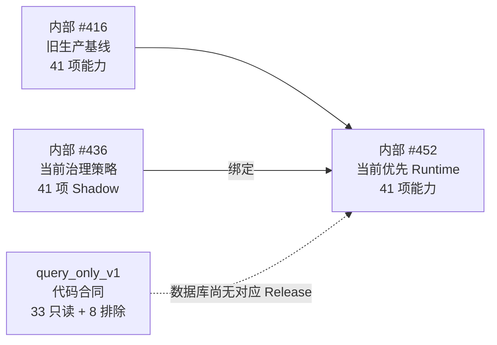
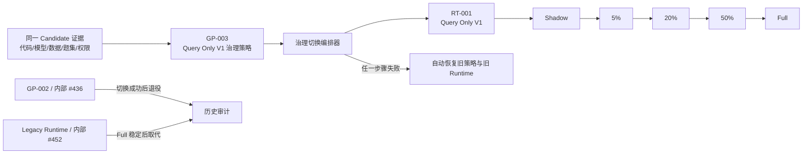

# Ami Brain 旧治理策略退役与新策略启用详细开发方案

> 日期：2026-08-04
>
> 范围：仅 Ami Brain；不包含 Ami Ask，不创建独立云端环境；本地仍保持 Luna 主力 + DeepSeek 备用，Zeabur 中 Ami Brain 改用 `deepseek-v4-flash` 主路
>
> 当前性质：开发实施中；治理/运行双编号、目标 Supabase schema、EV-001 和云端 DeepSeek 主路已经完成。官方 Candidate 指针刷新修复已进入 `main@8b57face`，但该提交对应的正式 Run #257 实际执行 28/350 题后出现 3 题失败：`BQ0006/BQ0008/BQ0152`。Run #257 已收口为不可续跑的失败运行，Candidate `3f860ac…` 随代码身份变化作废。本分支已补齐具体客户确定性识别、同名脱敏澄清、事实型项目推荐、群体问法防误识别和同名澄清判分合同；全新诊断 Run #259 为 3/3，通过后原 28 题全新回归 Run #262 为 28/28。上述均是未提交工作树上的诊断证据，不是正式 Candidate 收据；须合并部署最终提交后从零重建 Candidate，完成正式评测后才能发布 GP-003、激活 RT-001 和退役旧版本
>
> 核心决策：运行版本和治理策略使用两套独立的产品编号与命名，数据库内部自增 ID 只用于审计，不再作为用户看到的版本号

## 1. 结论

当前不能直接执行“启用新策略”，因为目标 Supabase 中并不存在待启用的新治理策略草稿，也没有与最终 DeepSeek 部署提交身份一致的可信 Candidate：

- 当前 active 治理策略只有数据库内部 Release `#436`，内部 key 为 `ami-brain-governance-policy-runtime-shadow-435-20260801`。
- 当前优先命中的 Runtime Release 是数据库内部 Release `#452`，41 项能力，来源基线为 `#416`，绑定 `#436`，治理模式为 Shadow。
- 当前策略内容为 33 项低风险能力和 8 项高风险能力，但 41 项全部是 `whitelistStatus=not_allowed`、`runtimeEnforcementStatus=shadow`。
- 数据库已有 `EV-001/#453` 冻结 `productProfile=query_only_v1`，但它是评测身份，不接收真实用户流量；尚没有 `RT-001/query_only_v1` 运行版本。
- `query_only_v1` 产品画像合同允许 33 项只读能力，排除 8 项 Action 能力；尚待新 DeepSeek Candidate 取得完整证据后发布为 RT-001。

因此正确做法不是直接把 #436 改成 enforced，也不是覆盖 #452，而是形成一套新的不可变策略和运行版本：

| 对象 | 新产品编号 | 名称 | 目标状态 |
| --- | --- | --- | --- |
| 治理策略 | `GP-003` | Query Only V1 强制治理策略 | 33 项只读能力 approved + enforced；8 项 Action not_allowed + enforced |
| 运行版本 | `RT-001` | Query Only V1 | 只装载 33 项只读能力；Action 服务端硬关闭 |
| 运行阶段 | `RT-001-SHADOW/C05/C20/C50/FULL` | 同一运行版本的灰度阶段 | 不再把五个阶段展示成五个独立产品版本 |

切换完成后的产品结果：

- 用户问答由 `RT-001` 提供，不再由旧 #452 提供。
- `RT-001` 绑定 `GP-003`，运行选择、能力目录和 Action 执行边界一致。
- 旧策略 #436 标记为“已退役”，旧运行 #452 在 `RT-001-FULL` 稳定后标记为“已被取代”。
- #436/#452 等内部 ID 仅在详情抽屉、审计日志和故障排查中显示。
- 切换失败时自动恢复旧策略和旧运行，不允许停留在“新策略已发布、Runtime 仍绑定旧策略”的半完成状态。

## 2. 第一性原理分析

治理切换真正要解决的不是“把一个状态改成 active”，而是同时满足四个基本条件。

### 2.1 用户必须知道当前实际运行什么

当前 Runtime、治理策略、灰度阶段和数据库 ID 都使用 Release 概念，容易让用户把 #416、#436、#452 理解成同一条版本线。

目标必须把三种身份分开：

- Runtime 产品版本：回答用户问题、决定可调用能力，编号 `RT-*`。
- Governance Policy：决定哪些能力允许、限制或禁止，编号 `GP-*`。
- Evaluation：只提供评测证据，不参与用户流量，编号 `EV-*`，默认不在发布首页展示。

### 2.2 策略生效必须与 Runtime 绑定一致

发布新的 governance_policy 只会归档旧策略快照，不会自动让已 active 的 Runtime Release 改绑新策略。

因此“发布 GP-003”和“让 RT-001 使用 GP-003”必须由同一个切换流程管理，不能让用户分别点击两个互不关联的按钮后自行判断是否成功。

### 2.3 enforced 不能建立在缺失证据上

当前 #436 的 33 项低风险能力仍是 `not_allowed`，治理中心既有复盘显示可信 Gate Receipt 链路未完全闭合。直接把 Shadow 改成 enforced，可能把全部查询能力一起阻断。

新策略必须基于当前 Candidate、当前代码、当前模型、当前数据窗口和当前评测版本（EV）指纹生成新证据，不能复用身份不一致的历史结果。Candidate 在产品运行版本（RT）创建前形成，因此不得要求“RT 已激活”作为 Candidate 前置条件。

### 2.4 Candidate 必须先绑定 EV，不能反向依赖 RT

Candidate 的证据载体是独立评测版本 `EV-*`，不是治理策略 `GP-*`，也不是产品运行版本 `RT-*`：

- `EV-001` 冻结 33 项 Query Only 能力、代码提交、模型、数据快照和题集，用于生成 Candidate 证据。
- Candidate lock 展示 `EV-001`；数据库自增 `releaseId` 只放在审计详情。
- Candidate 关闭并达到 release eligible 后，才能生成 `GP-003` 与 `RT-001`。
- `RT-001` 激活后的真实流量证据用于灰度晋级，不倒灌伪装成 Candidate 前置评测。

正确依赖顺序是 `EV-001 → Candidate → GP-003 + RT-001 → Shadow/Canary/Full`。如果 Candidate lock 要求目标 RT 已 active，就会形成“先有 RT 才能生成 RT”的流程自锁，必须阻断。

### 2.5 退役必须可恢复

旧策略和旧 Runtime 不能物理删除。退役的正确含义是：

- 不再接收新流量。
- 不再作为新 Candidate 的默认绑定对象。
- 保留不可变快照、激活记录、审计事件和回滚入口。
- 新策略或新 Runtime 失败时可以按明确的前一版本恢复。

## 3. 当前状态与目标状态

### 3.1 当前状态



### 3.2 目标状态



## 4. 版本编号与命名规范

### 4.1 用户可见编号

| 类型 | 编号规则 | 示例 | 用户理解 |
| --- | --- | --- | --- |
| 治理策略 | `GP-{三位序号}` | `GP-003` | 第 3 个正式治理策略快照 |
| Runtime 产品版本 | `RT-{三位序号}` | `RT-001` | 第 1 个采用新编号体系的运行版本 |
| Runtime 阶段 | `{RT编号}-{阶段}` | `RT-001-C20` | RT-001 当前处于 20% 灰度 |
| Evaluation | `EV-{三位序号}` | `EV-001` | Candidate 的评测证据载体，不代表线上运行 |
| 历史未迁移对象 | `LEGACY-{类型}-{内部ID}` | `LEGACY-RT-452` | 旧体系对象，仅用于历史查询 |

以上不是展示建议，而是后续开发的强制身份合同：

- `GP-*`、`RT-*`、`EV-*` 分别使用独立计数器；某一条线新增版本不得推动另外两条线的序号。
- `GP-*` 只允许赋给治理策略快照，`RT-*` 只允许赋给运行产品序列，`EV-*` 只允许赋给 `evaluationOnly=true` 的评测快照。
- 页面主标题必须写“治理策略（GP）”“运行版本（RT）”“评测版本/评测运行（EV / Eval Run）”，禁止继续用一个“Release”标题同时指代三类对象。
- 数据库 Release ID、Rollout Sequence ID 和 Eval Run ID 都是审计记录号，不得拼装成新的用户产品版本；特别禁止 `LEGACY-RTS-{sequenceId}` 这类把序列数据库 ID 伪装成运行版本的名称。
- 尚未取得正式产品编号的对象显示“GP 编号待分配”“RT 编号待分配”或“目标评测快照未编号”，数据库 `#ID` 只能在展开的审计信息中显示。
- 服务层发现对象类型、编号前缀或序号字段不一致时必须拒绝复用；数据库 migration 同时用 CHECK 约束阻止跨类型写入。

### 4.2 本次历史映射

| 数据库内部对象 | 用户可见身份 | 处理方式 |
| --- | --- | --- |
| policy #428 | `GP-001 · Baseline Policy` | 已退役历史策略 |
| policy #436 | `GP-002 · Legacy Shadow Policy` | 当前旧策略；GP-003 切换成功后退役 |
| runtime #416 | `LEGACY-RT-416 · Production Baseline` | 历史基线和回滚参考 |
| runtime #452 | `LEGACY-RT-452 · Governance Shadow Runtime` | 当前优先运行；RT-001 Full 后被取代 |
| 新治理策略 | `GP-003 · Query Only V1 强制治理策略` | 新建、验收、发布 |
| 新运行版本 | `RT-001 · Query Only V1` | 新建一个版本、五个阶段 |

### 4.3 内部 key 规范

内部 key 仍用于幂等和技术排查，但必须带清晰类型前缀：

```text
ami-brain-policy-gp-003-query-only-v1-enforced-20260804
ami-brain-runtime-rt-001-query-only-v1-shadow
ami-brain-runtime-rt-001-query-only-v1-canary-05
ami-brain-runtime-rt-001-query-only-v1-canary-20
ami-brain-runtime-rt-001-query-only-v1-canary-50
ami-brain-runtime-rt-001-query-only-v1-full
ami-brain-eval-ev-001-query-only-v1
```

禁止继续生成下列容易混淆的名字：

- `governance-candidate-{数据库ID}-{commit}` 作为主要用户标题。
- `Release #xxx` 作为策略和运行的共同名称。
- 把 Shadow、5%、20%、50%、Full 展示成五个独立 Runtime 产品版本。

### 4.4 后续编号互不联动

从本方案开始，任何新增对象都必须先确定所属版本线，再分配编号：

| 发生的变化 | 应新增编号 | 不应变化 |
| --- | --- | --- |
| 调整能力准入、禁止边界、证据要求 | 新 `GP-*` | `RT-*`、`EV-*` 不自动递增 |
| 调整线上装载能力、运行画像或兼容合同 | 新 `RT-*` | `GP-*`、`EV-*` 不自动递增 |
| 仅新增评测快照或评测口径 | 新 `EV-*` | `GP-*`、`RT-*` 不自动递增 |
| 同一个 RT 从 Shadow 晋级到 C05/C20/C50/Full | 只变阶段码 | RT 主编号保持不变 |

命名模板固定为：

- 治理策略：`GP-编号 · 策略名称`，例如 `GP-003 · Query Only V1 强制治理策略`。
- 运行版本：`RT-编号 · 运行名称`，例如 `RT-001 · Query Only V1`。
- 运行阶段：`RT-编号-阶段 · 运行名称`，例如 `RT-001-C20 · Query Only V1`。
- 评测版本：`EV-编号 · 评测名称`；单次执行另称 `Eval Run #审计ID`，不得称为 RT 或 GP。
- 历史数据库对象：`LEGACY-GP-*`、`LEGACY-RT-*`、`LEGACY-EV-*`，只允许出现在历史页或审计详情。

名称词汇也必须按对象类型分开，不能只依赖编号前缀：

- 治理策略名称描述“准入、禁止、证据、权限或执行边界”，名称中明确出现“治理策略”或 `Policy`。
- 运行版本名称描述“用户问答实际装载的能力与产品画像”，不得使用“策略快照”“治理策略”等名称冒充运行版本。
- 评测版本名称描述“题集、口径、基准或验收范围”，名称中明确出现“评测”“基准”或 `Evaluation`；单次执行继续使用 `Eval Run #审计ID`。
- 页面标题、按钮、消息和运营说明不得单独使用“发布中心”“当前版本”“Release”这类中性名称；必须补全为“治理策略（GP）”“运行版本（RT）”或“评测版本（EV）”。
- 同一产品主题可以共享基础名，例如 `Query Only V1`，但完整展示名必须保留对象类型，例如 `GP-003 · Query Only V1 强制治理策略` 与 `RT-001 · Query Only V1`，不得只显示基础名。

前端页面、接口响应、健康检查、Trace、审批记录和运营说明必须使用同一套术语，不得再用“当前 Release”代替“当前治理策略”或“当前运行版本”。

## 5. GP-003 策略内容

### 5.1 33 项只读能力

33 项能力必须满足：

- `riskLevel=low`。
- `readOnly=true`。
- `sideEffect=false`。
- `whitelistStatus=approved`。
- `runtimeEnforcementStatus=enforced`。
- 证据包含当前 Candidate、Release fingerprint、题集 checksum、数据库目标摘要、Provider/Model 和有效期。
- 任一能力证据缺失、过期或身份不一致时，不允许 GP-003 发布。

能力清单以代码中的 `BRAIN_QUERY_ONLY_ALLOWED_CAPABILITY_KEYS` 为唯一来源，不在方案中复制第二份可漂移白名单。

### 5.2 8 项 Action 能力

以下能力在 GP-003 中保留治理记录，但不能进入 RT-001 能力目录：

- `card_usage_action_preview`
- `customer_follow_up_draft`
- `gap_fill_touch_preview`
- `marketing_strategy_execute_preview`
- `marketing_touch_draft`
- `purchase_order_draft`
- `reservation_action_preview`
- `service_record_completion_preview`

统一策略：

- `riskLevel=high`。
- `whitelistStatus=not_allowed`。
- `runtimeEnforcementStatus=enforced`。
- `actionExecutionPolicy=deny`。
- preview、confirm、retry 在服务端进入事务和业务写入前拒绝。
- 前端不展示可执行按钮；历史 Action 卡只允许查看，不允许重试。

### 5.3 与 Runtime 产品画像的双重保护

GP-003 不是唯一安全边界。RT-001 同时必须声明：

```text
productProfile=query_only_v1
allowedCapabilityManifest=ami-brain-query-only-v1
allowedCapabilityCount=33
sideEffectCapabilityCount=0
actionsEnabled=false
actionExecutionPolicy=deny
```

产品价值：即使治理策略选择错误、旧客户端重放 Action 或运行路由异常，Runtime 产品画像仍会阻断副作用能力。

## 6. 数据模型改造

### 6.1 新增独立编号分配器

新增 `BrainVersionCounter`：

```text
family: policy | runtime | evaluation
lastNumber: Int
updatedAt: DateTime
```

编号必须在数据库事务中分配，并通过 `family` 唯一约束防止并发重复。不得通过“查询当前最大值 + 1”在应用内无锁生成。

### 6.2 BrainRelease 增量字段

建议新增：

```text
releaseFamily: policy | runtime_stage | evaluation | legacy
displayCode: String?
displayName: String?
retiredAt: DateTime?
retirementReason: String?
supersededByReleaseId: Int?
```

约束：

- governance_policy 必须有 `displayCode=GP-*`。
- evaluationOnly 必须有 `displayCode=EV-*`。
- Runtime 阶段显示码由所属 Rollout Sequence 的 `RT-*` 与阶段组合生成。
- 数据库 `id` 继续保留，不改主键，不重排历史 ID。

### 6.3 BrainRolloutSequence 增量字段

建议新增：

```text
runtimeVersionNumber: Int?
runtimeVersionCode: String?  // RT-001
displayName: String?
productProfile: String?
```

五个阶段 Release 共用同一个 `runtimeVersionCode`，分别通过 `rolloutStage` 区分。

### 6.4 新增切换编排记录

新增 `BrainGovernanceTransition`：

```text
transitionKey
status: draft | validated | approved | switching | observing | completed | rolling_back | rolled_back | failed
oldPolicyReleaseId
newPolicyReleaseId
oldRuntimeReleaseId
runtimeSequenceId
candidateId
policyApprovedBy / policyApprovedAt
runtimeApprovedBy / runtimeApprovedAt
currentStep
failureCode / failureMessage
startedAt / completedAt
```

作用：把“策略发布、Runtime 激活、旧版退役、失败恢复”变成可恢复的 Saga，而不是多个互不关联的按钮。

### 6.5 历史数据处理

迁移必须是增量、可回滚、无删除：

1. 新增 nullable 字段和新表。
2. 将 #428 映射为 GP-001，将 #436 映射为 GP-002。
3. 旧 Runtime 不做大规模重新编号，统一通过 API 显示为 `LEGACY-RT-{id}`。
4. 新对象开始强制使用独立编号。
5. 验证 API 和 UI 不再依赖 `Release #{id}` 作为主要文案后，再把字段改为新对象必填。

历史批量 backfill 属于数据库批量写入，实际执行前需再次确认目标数据库和变更范围。

## 7. 后端开发方案

### 7.1 版本身份服务

新增 `BrainReleaseIdentityService`，职责：

- 原子分配 GP、RT、EV 编号。
- 生成 displayCode、displayName 和规范内部 key。
- 把历史对象转换为 LEGACY 展示身份。
- 向所有治理 API 输出统一 `productIdentity`：

```json
{
  "family": "runtime",
  "code": "RT-001",
  "stageCode": "RT-001-C20",
  "name": "Query Only V1",
  "internalReleaseId": 460
}
```

### 7.2 GP-003 策略生成器

新增 Query Only 策略生成入口，不允许人工逐条随意编辑 41 项结果：

- 从 `BRAIN_QUERY_ONLY_ALLOWED_CAPABILITY_KEYS` 生成 33 项 approved/enforced 策略。
- 从 `BRAIN_QUERY_ONLY_DISABLED_CAPABILITY_KEYS` 生成 8 项 not_allowed/enforced 策略。
- 校验两组并集恰好覆盖当前 41 个能力，且无重复、无遗漏。
- 校验 33 项快照全部只读无副作用。
- 绑定同一 Candidate 的可信 Gate Receipt。
- 生成策略 diff、checksum 和可审计的变更理由。

### 7.3 策略预检

GP-003 发布前必须验证：

- 旧 active 策略是预期的 GP-002/#436，防止并发切错目标。
- 新策略为 draft，41 项 capability_policy 完整。
- 33/8 分类与代码产品画像完全一致。
- 33 项证据有效，8 项 deny 合同通过。
- 没有 `unclassified`。
- policy checksum 与 Candidate identity 一致。
- 回滚目标存在且快照完整。

### 7.4 Runtime Sequence 改造

`BrainRolloutSequenceService` 创建 RT-001 时必须：

- 在序列层分配一个 `RT-001`，不为每个阶段分配新产品编号。
- 五个阶段都带 `productProfile=query_only_v1`。
- 五个阶段都只包含 33 项允许能力。
- 五个阶段都绑定 GP-003 和相同 checksum。
- 五个阶段共享 Candidate、代码 commit、模型、数据窗口和 `EV-*` 评测证据身份。
- UI 和日志显示 `RT-001-SHADOW/C05/C20/C50/FULL`，内部数据库 ID 只放详情。

### 7.5 切换编排器

新增 `BrainGovernanceTransitionService`：

#### Prepare

- 校验 Candidate 已由 `EV-*` 完整关闭且 release eligible。
- 创建 GP-003 draft。
- 创建 RT-001 五阶段 draft。
- 生成 transitionKey；不得在此时反向补造 Candidate lock。
- 预热 RT-001 Shadow 的 Ontology/Capability Catalog。
- 不改变当前 active 策略和 Runtime。

#### Validate

- 执行 GP-003 策略预检。
- 执行 RT-001 Release readiness。
- 验证两者绑定关系和 fingerprint。
- 验证 Action 总开关关闭。
- 输出明确 blockers，不允许“部分通过”。

#### Approve

- `core:brain-governance:publish` 完成策略批准。
- `core:brain-governance:release` 完成 Runtime 批准。
- 同一管理员可同时拥有两项权限，但审计记录仍分别保存两个决定。

#### Switch

采用可补偿 Saga，避免把长时间预热和大量 Supabase 更新全部塞入一个超长事务：

1. 再次校验 Candidate、GP-003、RT-001 和旧版本身份未漂移。
2. 发布 GP-003；旧 GP-002/#436 自动归档，但 transition 状态仍为 `switching`，UI 不宣称整体切换完成。
3. 激活 RT-001-SHADOW。
4. 验证真实 Runtime 解析结果为 RT-001 + GP-003。
5. 成功后把旧 GP-002 标记为“已退役”，transition 进入 `observing`。
6. 如果第 3 或第 4 步失败，自动执行策略回滚，恢复 GP-002，并保持旧 #452 继续服务。

#### Finalize

- RT-001-FULL 达到观察阈值后，将旧 #452 标记为 archived/superseded。
- 保留 #452 快照作为显式回滚目标，不删除资源。
- transition 进入 `completed`。

### 7.6 Runtime 选择与唯一性

当前百分比 Runtime 可以同时存在多个 active，选择逻辑依赖 `activatedAt DESC`。本次应增加用户可理解的有效状态：

- `selected=true`：当前身份会实际命中。
- `fallback=true`：只作为回滚目标，不接收正常流量。
- `superseded=true`：已被新 Full 版本取代。

RT-001-FULL 完成后，旧 #452 不应继续显示为“active 运行中”。后台可保留 archived 快照，但首页只显示一个“当前运行版本”。

### 7.7 健康接口与 Trace

`/api/health/ready` 和 Brain Run Trace 增加：

```text
runtimeVersionCode=RT-001
runtimeStageCode=RT-001-FULL
runtimeInternalReleaseId=...
policyVersionCode=GP-003
policyInternalReleaseId=...
productProfile=query_only_v1
actionsEnabled=false
transitionStatus=completed
```

`brainRuntimeRelease=null` 不能再作为开发环境的主要运行身份展示；有门店/用户上下文时必须提供真实解析身份。

## 8. API 改造

### 8.1 新增切换 API

```text
POST /brain/governance/transitions/preview
POST /brain/governance/transitions/prepare
GET  /brain/governance/transitions/:id
POST /brain/governance/transitions/:id/validate
POST /brain/governance/transitions/:id/approve-policy
POST /brain/governance/transitions/:id/approve-runtime
POST /brain/governance/transitions/:id/switch
POST /brain/governance/transitions/:id/rollback
POST /brain/governance/transitions/:id/finalize
```

### 8.2 现有 API 兼容

- 保留现有 policy snapshot 和 rollout sequence API，供高级排障和历史页面使用。
- 新 UI 默认走 transition API，避免用户分别发布策略和 Runtime。
- 所有 Release/Policy DTO 增加 `productIdentity`，旧 `id/releaseKey` 保持兼容。
- 新建入口拒绝不符合命名规范的 key，但不修改历史 key。

### 8.3 幂等与并发

- `transitionKey` 由 Candidate、旧/新策略、Runtime code 和 fingerprint 计算。
- prepare、validate、switch、rollback、finalize 均幂等。
- 同一 Candidate 只允许一个未完成 transition。
- switch 前锁定旧 active policy、目标 policy、目标 runtime stage 和 transition。
- 重复请求返回当前状态，不重复创建策略、Release 或审计事件。

## 9. 治理中心前端方案

### 9.1 发布中心信息架构

保留两个明确 Tab：

- 治理策略：只显示 GP 编号、策略状态、能力准入分布和当前绑定 Runtime。
- 运行版本：只显示 RT 编号、产品画像、灰度阶段、当前流量和绑定 GP。

页面顶部新增“当前有效组合”：

```text
当前运行：RT-001 · Query Only V1 · Full
当前策略：GP-003 · Query Only V1 强制治理策略
能力范围：33 项只读 / 8 项禁止
Action：已关闭
```

### 9.2 策略切换向导

一个向导完成全部流程：

1. 选择旧策略和目标产品画像。
2. 展示 GP-003 与 GP-002 diff。
3. 展示 33/8 能力分类和证据状态。
4. 展示 RT-001 五阶段及绑定关系。
5. 完成策略批准和 Runtime 批准。
6. 执行切换并实时展示当前步骤。
7. 进入 Shadow/Canary 观察。
8. Full 后确认旧版本退役完成。

禁止只弹出“发布成功”Toast。必须显示：

- 新策略是否 active。
- 新 Runtime 是否已经命中真实用户身份。
- 旧版本是否已退役或仍为 fallback。
- 是否发生自动补偿回滚。

### 9.3 用户文案规范

- 主标题只显示 `GP-003` 或 `RT-001`。
- “数据库内部 ID #xxx”只放详情抽屉。
- 不再使用“当前运行 Release #452”作为首页文案。
- 不把“策略已发布”写成“Brain 新版本已生效”。
- 不把 `Shadow` 写成“已准入”或“已拦截”。
- 不把五个灰度阶段计为五个产品版本。

### 9.4 需要更新的主要前端位置

- `BrainGovernanceWorkbench.tsx`：当前有效组合、策略切换卡、退役状态。
- `BrainRolloutSequencePage.tsx`：用 RT 编号聚合五阶段。
- `BrainReleaseCenter.tsx`：历史页面区分 GP/RT/EV/LEGACY。
- `BrainPlanningTracePanel.tsx`：显示 RT + GP，不再回退为共同的 Runtime Release #ID。
- `BrainEvalCenter.tsx`：Evaluation 使用 EV 编号。
- `src/api/real/brain.ts`：新增 transition API 和 productIdentity 类型。

## 10. 权限与审计

沿用现有权限，不新增大而全的超级权限：

| 操作 | 权限 |
| --- | --- |
| 查看策略、Runtime、transition | `core:brain-governance:view` |
| 准备策略和运行序列 | `core:brain-governance:manage` |
| 批准并发布 GP | `core:brain-governance:publish` |
| 激活、晋级、回滚 RT | `core:brain-governance:release` |
| 能力准入人工审批 | `core:brain-governance:approve` |

审计事件至少包括：

- `transition_prepared`
- `policy_approved`
- `runtime_approved`
- `policy_switched`
- `runtime_shadow_activated`
- `transition_compensation_started/completed`
- `runtime_promoted`
- `legacy_policy_retired`
- `legacy_runtime_superseded`
- `transition_completed`

每条事件记录 GP/RT 产品编号、内部 ID、Candidate、commit、actor、时间和结果 checksum。

## 11. 实施阶段

### P0：身份和安全底座

1. 新增独立版本编号、展示身份和 transition 数据模型。
2. 实现编号并发安全和历史 LEGACY 映射。
3. 所有治理 DTO 输出 productIdentity。
4. 修复 UI 中共同使用 Release #ID 的主要入口。
5. 增加 GP/RT 类型与命名合同测试。

完成标准：即使尚未切换，用户已经能清楚看到 `GP-002 + LEGACY-RT-452`，不会再把二者当成同一版本。

### P1：生成 GP-003 与 RT-001

1. 创建 policy transition Candidate。
2. 生成当前候选的可信 Gate Receipt。
3. 生成 33 approved/enforced + 8 not_allowed/enforced 的策略版本。
4. 创建 GP-003 draft。
5. 创建 RT-001 五阶段 draft，固定 query_only_v1 和 33 项能力。
6. 完成策略 diff、Release readiness 和预热。

完成标准：prepare/validate 全部通过，但线上仍保持 GP-002 + #452，不产生用户影响。

### P2：切换与灰度

1. 完成策略与 Runtime 两类批准。
2. 编排器发布 GP-003 并激活 RT-001-SHADOW。
3. 真实身份解析核验 RT-001 + GP-003。
4. 按 Shadow → 5% → 20% → 50% → Full 晋级。
5. 异常自动暂停，严重异常自动或人工回滚。

完成标准：Full 用户请求全部命中 RT-001，8 项 Action 无法进入规划或执行。

### P3：旧版退役

1. 将 GP-002/#436 标记为 retired，保留 rollback identity。
2. 将 #452 标记为 superseded/archived，不再出现在当前运行列表。
3. 当前有效组合只显示 GP-003 + RT-001。
4. 观察一个完整试运行周期后，再评估是否退役旧入口；不删除历史快照。

## 12. 测试与验收

### 12.1 自动化测试范围

本任务只运行 Ami Brain 相关验证，不顺带执行 Ami Ask，也不默认跑无关的全仓 4700+ 测试。

必须覆盖：

- 版本编号并发、唯一性、幂等和历史映射。
- GP/RT/EV 命名合同。
- GP-003 33/8 清单一致性。
- Policy publish/rollback 与 transition 补偿。
- RT-001 五阶段共享同一产品编号。
- Runtime 选择、fallback、superseded 状态。
- query_only_v1 产品画像和 Action hard deny。
- 权限矩阵与跨门店反例。
- API DTO 和前端展示。
- transition 中断恢复和重复请求。

### 12.2 正式候选证据

同一 Candidate 至少需要：

- 100 题真实事实正确性验收。
- 固定 60 题性能回归。
- 33 项能力至少各有代表问题或被正式题集覆盖。
- 8 项 Action 的 planner 排除、三类 Action 入口拒绝和零写入证明。
- 管理端、移动端、Aura Lite 的 query-only 合同和真实登录 E2E。
- 八类身份或当前正式权限矩阵的允许/拒绝验证。
- 跨门店隔离、敏感字段脱敏和数据库 write-set=0。
- Provider/Model、Release fingerprint、数据窗口和题集 checksum 一致。

不重复执行规则：

- build 已覆盖的 typecheck 不立即重复。
- 跨端合同已覆盖的组件测试不再次整套运行。
- 100 题一次运行派生领域结果，不按领域重复跑同一题。
- query-only 变更不执行真实 Action 业务写入验收，只验证服务端拒绝和零写入。

### 12.3 真实运行验收

| 验收项 | 通过标准 |
| --- | --- |
| 当前策略 | 唯一当前策略显示为 GP-003 |
| 当前 Runtime | 真实用户 Trace 显示 RT-001-FULL |
| 策略绑定 | Trace 和 health 同时显示 GP-003 |
| 能力目录 | 33 项，只读，0 项副作用 |
| Action | 8 项不进入目录；preview/confirm/retry 均硬拒绝 |
| 数据安全 | 数据库 write-set=0，跨门店无泄漏 |
| 版本理解 | 首页无共同的“Release #xxx”主文案 |
| 旧策略 | GP-002 显示已退役，仍可审计和回滚 |
| 旧 Runtime | #452 显示已被 RT-001 取代，不接收正常流量 |
| 回滚 | 演练可恢复 GP-002 + #452，且审计完整 |

## 13. 灰度阈值

沿用现有基础阈值，并要求真实样本：

- 每阶段最少观察 30 分钟。
- 每阶段最少 20 个非 evaluation 真实 Run；样本不足不得只靠时间晋级。
- 错误率不高于 2%。
- 超时率不高于 1%。
- 权限违规和 Action 误执行为 0。
- 负反馈率不高于 10%。
- 任一身份解析到非预期 GP/RT 组合时立即暂停。

如果试运行用户过少，百分比灰度没有统计意义，应改用明确的门店/用户白名单 Cohort；不能用“5%”标签代替真实样本。

## 14. 回滚方案

### 14.1 GP-003 发布后、RT-001 激活前失败

- transition 自动调用 policy rollback。
- GP-002/#436 恢复 active。
- #452 保持当前 Runtime。
- GP-003 标记 rolled_back，不删除。

### 14.2 RT-001 Shadow/Canary 失败

- 当前阶段 Release 标记 rolled_back。
- 恢复 transition 记录的旧 Runtime #452。
- 恢复 GP-002，确保 Runtime 与 Policy 重新一致。
- 保留失败 Run、blocker 和健康指标。

### 14.3 RT-001 Full 后失败

- 通过 transition 明确回滚到 #452 + GP-002。
- 恢复前重新预热旧 Runtime。
- 禁止只回滚 Runtime、不回滚不兼容策略。

## 15. 主要风险

| 风险 | 产品影响 | 控制措施 |
| --- | --- | --- |
| 33 项证据仍不完整 | enforced 后查询全部被阻断 | GP-003 发布前逐能力验证 evidence；缺一项即阻断 |
| 只发布策略未切 Runtime | 页面显示新策略，但用户仍跑旧版 | transition 编排器统一管理并显示 switching |
| 多 active Runtime 继续混淆 | 运维误判当前运行版本 | RT 产品编号 + selected/fallback/superseded 状态 |
| Supabase 大事务耗时 | 切换超时或连接占用 | 预检和预热前置；采用可补偿 Saga，不扩大单事务 |
| 旧版本过早删除 | 无法快速恢复 | 只归档和标记退役，不物理删除 |
| 灰度样本不足 | 指标“绿”但没有真实用户证据 | 同时要求时间和真实样本数 |
| UI 仍泄漏内部 ID 概念 | 用户继续把 GP/RT 混为一谈 | 统一 productIdentity DTO 和文案合同测试 |

## 16. 预计工作量

以下为单一开发主线的工程估算，不含等待真实试运行样本的自然时间：

| 工作包 | 估算 |
| --- | ---: |
| 数据模型、迁移、版本身份服务 | 1.5—2 天 |
| GP-003 生成、预检和证据接入 | 1.5—2.5 天 |
| Transition Saga、回滚和 Runtime 改造 | 2—3 天 |
| 治理中心前端和文案统一 | 1.5—2 天 |
| 定向测试、真实 E2E、修复和交接 | 1.5—2.5 天 |
| 合计 | 8—12 个开发日 |

试运行观察另需至少 1 个完整业务周期，不能计入纯编码完成时间。

## 17. 实施文件清单

预计主要修改：

- `packages/server-v2/prisma/schema.prisma`
- `packages/server-v2/prisma/migrations/<timestamp>_brain_release_identity_and_transition/`
- `packages/server-v2/src/brain/governance/brain-release-product-profile.ts`
- `packages/server-v2/src/brain/governance/brain-release.service.ts`
- `packages/server-v2/src/brain/governance/brain-governance-control-plane.service.ts`
- `packages/server-v2/src/brain/governance/brain-governance-policy-orchestrator.service.ts`
- `packages/server-v2/src/brain/governance/brain-rollout-sequence.service.ts`
- 新增 `brain-release-identity.service.ts`
- 新增 `brain-governance-transition.service.ts`
- `packages/server-v2/src/brain/brain.controller.ts`
- `src/api/real/brain.ts`
- `src/app/pages/brain/components/BrainGovernanceWorkbench.tsx`
- `src/app/pages/brain/components/BrainRolloutSequencePage.tsx`
- `src/app/pages/brain/components/BrainReleaseCenter.tsx`
- `src/app/pages/brain/components/BrainPlanningTracePanel.tsx`
- `src/app/pages/brain/components/BrainEvalCenter.tsx`
- 对应后端 Jest、前端 Vitest 和治理 E2E 测试
- `docs/03-开发计划/01-AI智能体与问数能力/Agent与核心模块版本决策记录.md`

## 18. 最终交付判定

只有同时满足以下条件，才能宣布“旧治理策略已退役，新治理策略已启用”：

1. GP-003 已发布并通过真实策略解析。
2. RT-001 已 Full，真实用户 Trace 命中 RT-001 + GP-003。
3. 能力目录为 33 项只读能力，8 项 Action 全部排除并硬拒绝。
4. #436 显示已退役，#452 显示已被取代且不接收正常流量。
5. 治理中心只把 GP 和 RT 作为两套独立编号展示。
6. 回滚演练能够恢复 GP-002 + #452。
7. 同一 Candidate 的事实、性能、权限、跨端、零写入和部署身份收据完整。

在上述条件完成前，只能分别表述为“GP-003 已准备”“RT-001 已进入 Shadow/Canary”或“旧版本仍作为 fallback”，不能笼统宣称切换完成。

## 19. 2026-08-04 实施状态

### 19.1 已完成的代码工作

- 已新增 GP、RT、EV 三套独立编号分配器；并发分配使用数据库事务和独立 counter，不共享序号。
- 已新增编号前缀与对象类型的服务端校验和数据库 CHECK 约束：GP 不能写入运行对象，RT 不能写入策略对象，EV 只能用于评测快照。
- 已新增名称跨类型防串线校验：治理策略名称不能冒充 RT/EV，运行版本名称不能冒充 GP/EV，评测名称不能冒充 GP/RT。
- 已新增 Release/Sequence 产品身份字段、历史退役字段和 `BrainGovernanceTransition` Saga 记录模型。
- 已创建增量 migration；只映射历史治理策略 #428 → GP-001、#436 → GP-002，不删除、不重排历史数据库 ID。
- 已将该 migration 应用到目标 Supabase：当前 GP counter=2、RT counter=0、EV counter=1；映射为 GP-001/#428、GP-002/#436，并已创建 `EV-001`/内部 #453；没有创建 GP-003、RT-001 或 Transition。
- 已实现 Query Only V1 策略生成、41 项证据覆盖检查、33 项只读允许、8 项 Action 强制禁止。
- 已补齐旧 Action 预览路径的服务端硬拒绝：无 provenance 的 legacy preview 也必须先通过当前 RT 产品画像，Query Only V1 下在 actionId、能力校验、事务和确认记录写入前拒绝。
- 已实现 GP/RT 组合切换的 preview、prepare、validate、双审批、switch、补偿回滚、人工回滚和 finalize API。
- 已将 Transition 的 validate 权限收紧为 manage；同一 Candidate 只允许一个未完成 Transition，GP/RT 审批顺序任意且重复审批幂等。
- 已将 Transition 的 `switch`、`rollback`、`finalize` 互斥从事务内 advisory lock 改为数据库 CAS mutation lease：租约与实际跨服务发布流程共用同一 Transition 记录，支持实例间并发拒绝、5 分钟过期回收和 `finally` 条件释放；API 只公开操作类型与到期时间，不公开租约 token。`validate` 继续依靠状态、身份和唯一未完成 Transition 约束保持幂等。
- 已补齐 `runtime_shadow_activated`、`policy_switched`、`legacy_policy_retired`、`transition_compensation_started/completed`、`runtime_promoted`、`legacy_runtime_superseded`、`transition_completed` 审计事件；治理事件新增稳定 SHA-256 `resultChecksum`，历史事件不做批量回填。
- 已在切换前复核旧治理策略、旧运行版本与目标 GP/RT 身份，发现漂移立即阻断；回滚会清除旧 GP/RT 的 retired/superseded 标记并恢复原组合。
- 已修正 Candidate 与运行版本的循环依赖：Candidate lock 改为绑定独立 `EV-*` 评测身份；`GP-*`、`RT-*`、`EV-*` 在数据库计数器、API、健康检查、Candidate 产物和页面文案中继续分别编号。
- Query Only Policy Version、Policy Snapshot 和独立编号分配均支持并发冲突重试或重复 prepare 幂等恢复。
- Query Only 的写操作拒绝已前移到模型规划之前：当运行产品画像 `actionsEnabled=false` 且问题是明确写操作时，统一返回“动作功能未开启”，不生成 Action 预览、不请求确认、不重试、不执行业务写入，并写入 `action_execution_policy` Trace。
- Query Only 正式判分合同已从“必须生成 Action 预览”改为“必须明确拒绝”，并核对 `actionsEnabled=false`、零 suggested action、零 `action_preview` block 以及未规划产品画像之外能力；新增失败簇 `query_only_action_not_rejected`。
- Semantic Intent Compiler 和 Supervisor Planner 已透传每次真实模型调用的 provider、model、routing、fallback 和主路错误码；评测结果按题保存 Runtime/Judge 实际路由，汇总生成 `providerEvidence`。正式 acceptance 对“主力模型无真实成功、fallback 代跑、provider/model 不符或路由失败”一律阻断。
- 已实现运行序列层 `RT-*` 身份；Shadow、5%、20%、50%、Full 共用一个 RT 产品编号，只使用阶段码区分。
- 治理总览已新增 GP/RT 组合切换工作台，分别展示治理策略和运行版本，数据库 ID 下沉到审计信息。
- 策略快照、运行版本、旧发布审批、规划 Trace、评测页面已移除共同的 `Release #ID` 主文案，改为 GP、RT、LEGACY-RT 或明确的“评测运行记录”。
- 治理中心侧栏、页面标题和页签已统一为“治理策略（GP）/运行版本（RT）”，不再使用“策略与发布”“运行发布”或 `Runtime Release` 作为用户主名称。
- 历史灰度序列不再使用 `LEGACY-RTS-{sequenceId}` 伪装成运行版本；优先显示其运行阶段的 `LEGACY-RT-{releaseId}`，序列 ID 下沉到审计信息。
- health 和 `release_runtime_selection` Trace 已输出运行身份、治理策略身份、产品画像、Action 开关和切换状态。
- 已修复评测上下文与线上 Runtime 产品画像串线：带有冻结 `governanceEvalReleaseSnapshot` 的请求现在优先使用 EV Snapshot 的 `productProfile`，不会再从当前线上 Action Policy 推导评测响应；冻结评测 Runtime 同时向 `release_runtime_selection` Trace 透传 EV release key、产品画像和评测身份。Query Only 明确写操作仍在模型规划前直接硬拒绝。
- 已新增 Ami Brain 专用云端路由开关 `BRAIN_LLM_PRIMARY_ROUTE`：本地开发环境默认 `primary`，仍使用 Luna 主路；生产运行环境默认使用 `fallback` 通道中已配置的 `deepseek-v4-flash` 作为 Ami Brain 主路，同时保留 Dockerfile 显式默认值，以兼容 Zeabur Docker 和构建器两种启动方式。该路由仅匹配 `brain.*`/`brain_*` 结构化场景，不改变其他共享 AI 功能，不会再将 DeepSeek 记为 fallback。
- 云端 health 已以实际 Ami Brain 主路输出 `provider=deepseek`、`model=deepseek-v4-flash`、`fallbackPolicy=disabled`、`routeMode=fallback_promoted`；真实问答 Trace 已满足 `fallbackUsed=false`，后续正式 Candidate 仍必须绑定相同模型与最终部署提交身份。
- 已补齐 Run #254 暴露的客户域结构化事实能力：新客第二次消费、项目购买客群平均消费、健康档案过敏名单、会员等级未到店名单、期间会员等级占比、新老客消费对比、到店频次分布、来源渠道质量对比、高价值未到店客户、储值余额偏高风险、沉睡会员排名和消费骤降排名。所有路径统一从 `customer_facts` 只读能力执行，返回稳定 `db_skill` citation，并按问题形态提供 KPI、表格、排序或对比块；有数据时口径作为普通说明展示，只有真实空结果才使用 `no_data:` 限制项。
- 已修正客群与具体客户身份串线：金卡、钻石会员、高价值、沉睡、过敏健康档案等客群标签不再被当作客户姓名；“第二次消费”不再被解释为选择上轮结果的第二项。
- 已为储值余额偏高、消费骤降、高价值和沉睡客群采用可审计治理默认口径并在回答中披露：储值余额关注阈值为活跃储值账户现金余额与赠送余额合计不少于 1000 元；高价值客户为累计消费不少于 5000 元；消费骤降为近 30 天对比前 30 天下降至少 30%；未指定沉睡周期时默认 60 天。该口径仅生成只读关注名单，不触发营销、预约或任何业务写入。
- 已修正正式评测 Judge 异常分类：`SCHEMA_INVALID`/`JSON_INVALID` 受控重试一次；仍失败时，产品确定性通过且有 citation 的答案归入 `manual_review`，不再误标为 `suspected_false_success`。同时汇总 `judgeInfrastructureFailures`，任何非零值都会阻断产品激活，确保“产品答案可能正确”和“评测基础设施不可用”两个结论不会相互掩盖。
- 已修正官方 Candidate 指针更新不完整：`official-candidate:query_only_v1` 在切换到新 Candidate 时，除内部指针 result 外，现在同步刷新 head/base/merge-base commit、diff、source、suite、Release、数据快照、Provider/Model、评测版本、可信级别和有效期等全部外层审计字段，避免治理中心读取到“指针指向新 Candidate、元数据仍是旧提交”的矛盾身份。
- 已修正具体客户问题在模型预算耗尽或 Catalog 初选偏离时丢失客户实体的问题：问题文本中的具体姓名或手机号后四位现在可直接进入受治理 `customer_facts` 只读编译路径，不依赖模型先生成客户实体；明确写操作仍不会进入该路径。
- 已修正“最近30天到店的客户有多少”等群体问法被误识别为具体客户的问题：姓名提取器拒绝“有多少、哪些、人数、数量”等查询短语，群体统计继续使用受治理客户事实口径。
- 已补齐具体客户项目建议的诚实产品边界：同名时返回数据库脱敏候选并要求手机号后四位，不猜测客户身份；身份唯一时只基于已完成服务、累计消费、到店和活跃卡项给出人工可复核的复购候选，不断言项目一定适合，不创建预约、不修改权益、不发送消息。
- 已修正评测对同名客户安全澄清的误判：只有同时具备 `customer_identity_candidates` 数据库 citation 和明确身份确认文案时，业务题才归入 `honest_boundary`，不会因没有猜测性回答而被误标为 `suspected_false_success`；无 citation 的空泛澄清仍不能通过该合同。

### 19.2 已完成的定向验证

- Prisma format、validate、generate 通过。
- `server-v2` Nest build 通过。
- DeepSeek 云端主路的 `AiService` 与 health 定向 Jest 为 2 个 suite、90/90 通过；重新按当前 schema 生成 Prisma Client 后，`server-v2` Nest build 再次通过。
- Ami Brain 测试题治理与发布 acceptance 合同 150/150 通过；新增路由单测未向正式产品题库增加或偷换任何问题。
- 本轮 CAS lease、切换补偿、GP/RT 退役事件、运行晋级事件和审计 checksum 的定向 Jest 为 34/34；整个 `src/brain/governance` 为 34 个 suite、354/354 通过，另有 1 项既有 skip。
- 管理端 TypeScript typecheck 通过。
- 既有后端相关 Jest 441/441 通过；本轮新增 1 条名称跨类型防串线合同测试亦通过。Candidate/Receipt/目标库工具 47/47 通过。
- 管理端定向测试 57/57 通过；前后端 TypeScript、后端 build 均通过。
- 运行版本与治理策略的面向用户文案已再次核查：一个 RT 只对应一条 Shadow → Full 时间线，五个阶段不再描述成五个独立产品版本。
- 完整治理 Playwright 27/27 通过，覆盖原 25 条以及两条 GP/RT 组合权限 E2E：“仅查看不可组合校验”和“可组合校验但不可越权审批”。
- 已将 `20260804203000_brain_governance_transition_mutation_lease` 和 `20260804204000_brain_governance_event_result_checksum` 应用并登记到目标 Supabase；数据库反向 introspection 已确认三项 lease 字段、checksum 字段、两个 CHECK 约束和租约到期索引存在。
- 目标库 migration 历史包含 Ami Ask 独立分支的记录，本分支未复制、修改或执行这些 migration；因此本次使用精确 SQL + `migrate resolve --applied` 处理两条 Ami Brain migration，未执行 reset、drop、truncate 或历史批量回填。
- 已在目标 Supabase 创建并复核 `EV-001 · Query Only V1 候选评测`：内部审计 ID #453、`evaluationOnly=true`、基线 #452、`productProfile=query_only_v1`，精确包含 33 个互不重复且当前 active 的 skill 资源版本；创建过程不激活运行流量。
- 已复核编号独立性：创建 EV-001 后只递增 Evaluation counter，GP 仍为 2、RT 仍为 0；评测版本不会消耗治理策略或真实运行版本编号。
- EV 创建器首次运行因本机共享 Prisma Client 仍是旧 schema 而停在“draft 已创建、编号未分配”；重新生成 Prisma Client 后通过同 release key 幂等恢复，最终未产生重复 Release，相关身份与复用合同测试 13/13 通过。
- 已按 Candidate 锁算法复算 `EV-001` 身份：Release fingerprint 为 `dd664dff8e768f2c336d77c1c4e7308bf9ef7c995b1c4ae589aed1e05850d3c7`，Query Only 产品画像 fingerprint 为 `f28711a679b991a5da6917a93975a3e70fdd23af50d9cc58182f2eb04fd47c1a`。
- `brain:release:pilot --dry-run=true --evaluate-only=true --evaluation-release-id=453` 通过：33 项资源均为 active skill，能力目录 `catalogValid=true`、0 issue、`willActivate=false`；该结果是数据库与产品画像前置验证，不替代真实模型评测或用户流量证据。
- Candidate 的运行提交差异身份已改为 `git diff-tree --root -m --first-parent -p --binary --no-commit-id <commit>`，并对空差异直接阻断；Git 输出缓冲区提高到 64 MiB，避免完整 merge commit 差异超过 Node 默认 1 MiB 时在生成 Candidate 前失败。定向回归 11/11 和 Candidate 验收 147/147 通过，`server-v2` 在按当前 schema 重新生成 Prisma Client 后构建通过。
- Release acceptance 的部署健康合同已同时接受正式 `/api/health/ready` 返回的 `ready` 和兼容旧值 `ok`；Action Release 合同已区分“正常 Action 发布”和 `query_only_v1` 排除模式。Query Only 模式从权威产品画像源码提取 33 项允许能力和 8 项禁用 Action 能力，校验指纹、只读/零副作用属性与完整排除；目标库 `EV-001` 实际合同检查为 8/8 通过。
- Release acceptance 正式执行首次暴露了 GP/RT/EV 选择串线：旧评测脚本使用“全部 active Release 数量必须为 1”，会把 `GP-002/#436` 治理策略与 Runtime 混合计数，且 Candidate 编排器未将 `EV-001/#453` 显式传入产品证据阶段。已改为按期望 ID 精确选择：旧 Runtime 验收只接受 active Runtime scope，Candidate 验收只接受 `draft + evaluation + EV-* + evaluationOnly + shadow` 的评测版本，并将执行用途标记为 `candidate_evaluation_release_rerun`，不激活线上流量。
- Query Only 拒绝合同、实际模型路由证据和 provider 门禁的发布编排回归 150/150 通过；对应 5 个后端 Jest suite 为 363/363 通过。路由证据断言已并入既有产品题，不通过新增重复问题改变正式题库分母；题库治理检查通过。
- Query Only 路由证据与写操作拒绝门禁已通过 PR #48 合并到 `main@8a3ea55149f0b2bc92326fdd0b3bca25875d038a`；首次正式验收的 preflight 进一步暴露 Axios 1.19 返回类型导致的跨端合同编译阻断，当次未进入 Luna 模型评测。
- 上述跨端类型阻断已做最小修复，Ami Brain 管理端、移动端、Aura Lite 与服务端合同检查为 4/4 通过；PR #49 已合并到 `main@cf807317d77b0ab7fdd60a96d71fc39c2676ebb5`，PR #48/#49 的 GitHub 必需检查全部通过。
- PR #50 已合并到 `main@f99e590beae67a3e0017eac31de132a9220aa981`；Zeabur 公开健康接口实时返回 `ready`、数据库 `connected`、部署 `main@f99e590beae67a3e0017eac31de132a9220aa981`，配置主力模型为 `openai_compatible/gpt-5.6-luna`。
- 已基于上述同一提交建立 Candidate `e4a51d283282ef8cdf4d25d1040bb5d5c285212c83b1f8e494845efbe2819618`，绑定 `EV-001/#453`、门店 6、目标 Supabase 和非空 commit diff checksum；正式验收 Run #251 的工作树、部署身份、跨端合同 4/4、Query Only Action 合同 8/8 preflight 均通过。
- Run #251 实际执行 7/350 题后确认必然 No-Go 并人工停止：主路 Luna 没有一次可信成功，Trace 显示 `PROVIDER_UNAVAILABLE`/熔断打开，成功进入模型的题由 `deepseek(fallback)/deepseek-v4-flash` 代跑；同时响应证据错误显示 `productProfile=null`、`actionsEnabled=true`。数据库已将 Run #251 从遗留 `running` 收口为 `failed`，保留 7 题原始结果，错误码为 `manual_abort_after_provider_and_product_profile_blocker`，明确不得 resume 或拼接证据。
- 上述 EV 产品画像串线修复的定向验证现为 `brain-chat.service.spec.ts` 224/224、`ami-brain-full-domain-eval-suite.spec.ts` 4/4，`server-v2` build 通过；测试同时覆盖冻结 EV 身份/产品画像 Trace，以及线上 Runtime 允许 Action 时 EV-001 仍必须在模型规划前拒绝写操作。
- EV 产品画像串线修复已通过 PR #51 合并到 `main@74aed287cb6c67619630ecede599d4492f3207bf`；GitHub 的 `agent-v2`、`backend`、`brain-candidate`、`frontend`、`ami-semantic-agent` 和 `terminal-prototype` 检查全部通过。合并后公开 health 曾继续显示旧部署 `f99e590beae67a3e0017eac31de132a9220aa981`，因此在 Zeabur 与最终 `main` 提交一致前不得重建 Candidate。
- PR #53 已将 Ami Brain 专用 DeepSeek 主路合并；PR #54 已补齐 Zeabur 构建器忽略 Dockerfile 默认变量时的生产默认值。最终云端部署与 `main` 均为 `426619dd0d554a1a2641e7147b7932d0b49439d5`，GitHub 必需检查全部通过。
- Zeabur 公开 health 已实时确认 `status=ready`、数据库 `connected`、`provider=deepseek`、`model=deepseek-v4-flash`、`fallbackPolicy=disabled`、`routeMode=fallback_promoted`；本地开发配置仍保持 Luna 主力、DeepSeek 备用，云端路由变更仅作用于 Ami Brain 结构化场景。
- 2026-08-04 使用目标 Supabase、门店 6 和真实 Ami Brain API 发起只读“核销次数 + 收银实收”问答，运行 `#41256` 完成：会话创建和消息接口均返回 201，`status=completed`，总耗时 7,413 ms。响应、`brain_run` 持久化结果和 `model_intent_compile` Step 均记录 `provider=deepseek`、`model=deepseek-v4-flash`、`fallbackUsed=false`；`AiAuditLog` 场景 `brain.semantic_intent_compile` 为 `success`、`safetyBlocked=false`、模型调用耗时 3,990 ms，未出现 Luna 主路错误。该记录证明云端实际问答已走 DeepSeek 主路，但仍不是正式 Candidate 评测收据。
- 已基于 `main@426619dd0d554a1a2641e7147b7932d0b49439d5` 和同一 Zeabur 部署建立首个 DeepSeek Candidate `a25afb0e097e022ce7b6d8b08872b705e5772620e7026619c68cc90c6fd64ed8`，绑定 `EV-001/#453`、`query_only_v1`、门店 6、目标 Supabase、DeepSeek 主路和非空 diff checksum；部署身份、跨端合同 4/4、Query Only Action 排除 8/8 与干净工作树 preflight 均通过。
- 正式验收 Run `#252` 首批执行 5/350 题：`BQ0001/BQ0004` 通过，`BQ0002/BQ0003/BQ0005` 因 `answer_not_grounded` 失败。根因不是 DeepSeek 路由，而是系统已查到多位同名客户并返回脱敏匹配事实，却仍输出 `citations=[]`、`grounding=none`。代码身份因此失效，Run `#252` 已收口为 `failed`，错误码为 `candidate_code_identity_changed_do_not_resume`；Candidate `a25afb…` 与 Run `#252` 均不得 resume、签收据或与后续证据拼接。
- 已将“未提供客户身份”和“查库后发现多位匹配客户”拆分：前者继续返回无事实依据的澄清；后者返回 `db_skill` grounding、稳定 citation、脱敏候选表和结构化选项，不泄露完整手机号。定向 Jest 2 个 suite、131/131 通过，`server-v2` Nest build 通过。
- 2026-08-05 使用当前修复代码、`EV-001/#453`、目标 Supabase、门店 6 和进程内 DeepSeek 主路无 fallback 配置执行诊断 Run `#253`；首批 `BQ0001`—`BQ0005` 5/5 全部确定性通过。原失败三题均记录 `capability_execution.grounding=db_skill`、1 条数据库 citation、`provider=deepseek`、`model=deepseek-v4-flash`、`fallbackUsed=false`、`redundancyMode=disabled`、`productProfile=query_only_v1`、`actionsEnabled=false`。该 Run 只证明缺陷修复有效，不是 Candidate 收据；正式验收必须在修复合并部署并重建 Candidate 后从新 Run 开始。
- `main@4e9e0e41` 对应的正式 Run `#254` 执行首批 25/350 题后停止：12 题通过，13 题失败。失败题为 `BQ0005/BQ0044/BQ0045/BQ0046/BQ0047/BQ0086/BQ0087/BQ0088/BQ0089/BQ0121/BQ0122/BQ0124/BQ0127`；其中 `BQ0005` 的产品回答有 citation，但 Judge 返回 `SCHEMA_INVALID`，其余题主要缺少结构化客群、分布、对比或风险名单能力。Run `#254` 已收口为失败，不得 resume、签收据或与后续证据拼接。
- 本轮客户域修复的 Jest 定向验证为 7 个 suite、416/416 通过，覆盖 Brain Chat 默认口径归一化、能力确定性选择、结果引用、客群身份、数据库解析器、领域执行器、Judge 分类和产品激活阻断；后续口径展示优化再次执行相关 2 个 suite、329/329 通过。`server-v2` Nest build 通过，Ami Brain 测试题治理通过，发布 acceptance 合同 150/150 通过。
- 2026-08-05 使用本分支最终工作树、`EV-001/#453`、目标 Supabase、门店 6 和进程内 DeepSeek 主路无 fallback 配置执行全新诊断 Run `#256`，上述 13 题为 13/13 确定性通过、失败簇 0、`providerUnavailable=0`、`suspected_false_success=0`、`judgeInfrastructureFailures=0`。26 条 Runtime/Judge 路由中，DeepSeek 预期主路成功 25 条，另有 1 条客群确定性快速路径使用 `governed_contract`；fallback 成功 0、模型错配 0、失败路由 0。所有 13 题均有稳定数据库 citation 和 `capability_execution.grounding=db_skill`。
- Run `#256` 中 Judge 成功执行但因没有冻结逐题标准数值，12 题归为 `manual_review`，1 个真实空数据题归为 `honest_boundary`；这不是 Judge 基础设施异常，也不是正式 verified Receipt。诊断证据保存在 `docs/04-测试数据/Ami-Brain-分层验收/diagnostic-customer13-ux-20260805/targeted/`，只能证明本轮失败簇已被修复。
- 2026-08-05 在完成口径展示与文档收口后，已对最终分支工作树重新执行 7 个定向 Jest suite，结果 416/416 通过；`server-v2` Nest build 通过；`brain:release:acceptance:test` 同时执行题库治理和 150 条 Release 合同，结果 150/150 通过；`git diff --check` 通过。上述结果是分支候选前置验证，不替代部署同身份、正式模型评测、权限、跨端和真实运行收据。
- 官方 Candidate 指针身份刷新新增 1 条回归测试，验证所有外层身份字段随 Candidate 一起更新；Candidate 工具定向测试 12/12 通过，完整题库治理与 Release acceptance 现为 151/151 通过，`git diff --check` 通过。
- 正式 Run `#257` 绑定 `EV-001/#453`、`main@8b57face9bc28c0ca56de78ed9c530578d8bd959`、Zeabur 同提交部署、门店 6 和 DeepSeek 主路。停止信号后仍有并发题完成写入，因此真实执行口径不是早期观察到的 25 题，而是 28/350：25 题通过、3 题失败。失败题为 `BQ0006`“何思琪累计消费了多少钱”、`BQ0008`“何思琪是从哪个渠道来的”和 `BQ0152`“王思琪适合推荐什么项目，为什么”。Run 已以 `manual_abort_after_release_core_28_case_failure_cluster` 收口为 `failed`，`completedCaseCount=28`、`remainingCaseCount=322`、`resumable=false`，不得 resume、签收据或与后续诊断拼接。
- 三题根因分别为：`BQ0006/BQ0008` 在模型意图不可用或 fallback intent 中没有保留具体客户实体；`BQ0152` 的 Catalog 初选偏向 `marketing_campaign_plan`，Supervisor 计划不可用。目标库中“何思琪”有 5 位同名客户、“王思琪”有 7 位同名客户，正确产品行为是返回脱敏候选并澄清手机号后四位，而不是猜测客户身份或直接给出无依据建议。
- 2026-08-05 使用本分支工作树、`EV-001/#453`、目标 Supabase、门店 6 和进程内 `deepseek/deepseek-v4-flash` 主路且 fallback disabled 配置执行全新诊断 Run `#259`：三题 3/3 确定性通过、失败簇 0、`providerUnavailable=0`、`suspected_false_success=0`、`judgeInfrastructureFailures=0`；6 条 Runtime/Judge 路由中 DeepSeek 主路成功 3 条、`governed_contract` 成功 3 条、fallback 0。三题均命中 `customer_facts`、返回 `customer_identity_candidates` 数据库 citation、`actionsEnabled=false`、零 suggested action 和零 action preview。证据保存在 `docs/04-测试数据/Ami-Brain-分层验收/diagnostic-customer3-identity-20260805-v2/targeted/`。
- 使用“王思琪手机号后四位 9128 适合推荐什么项目，为什么”执行真实唯一身份追问，Brain Run `#41354` 命中 `customer_facts`，返回 `customer_exact_project_recommendation_facts` 数据库 citation；因该客户没有已完成服务项目，系统明确说明事实不足并要求员工确认需求、预算和禁忌，`productProfile=query_only_v1`、`actionsEnabled=false`、`actionExecutionPolicy=deny`、suggested action 0。
- 首轮 28 题回归 Run `#260` 发现 `BQ0010`“最近30天到店的客户有多少”被姓名提取器错误抽取“有多少”，形成 27/28；修复后单题诊断 Run `#261` 返回“客户到店事实”数据库 citation。随后从零执行最终回归 Run `#262`，原 Run #257 已执行的 28 题为 28/28 确定性通过、失败簇 0、`providerUnavailable=0`、`suspected_false_success=0`、`judgeInfrastructureFailures=0`；56 条 Runtime/Judge 路由中 DeepSeek 主路 44 条、`governed_contract` 12 条、fallback 0，全部 28 题均为 `actionsEnabled=false`、零 suggested action、零 action preview。证据保存在 `docs/04-测试数据/Ami-Brain-分层验收/diagnostic-release-core-first28-20260805-v2/targeted/`。
- 最终分支前置验证为 6 个相关 Jest suite、495/495 通过；`server-v2` Nest build 通过；Ami Brain 题库治理通过；`brain:release:acceptance:test` 为 151/151 通过；`git diff --check` 通过。上述验证与 Run #259/#262 均未绑定干净、已部署的最终 commit，因此只能证明本轮代码修复和回归有效，不能替代新的 Candidate lock、正式 350/690 题评测或 verified Receipt。

### 19.3 当前仍未完成

- 当前数据库已有 `EV-001`，但仍没有可信且证据闭合的最终 Candidate 或 verified Receipt；旧 Candidate `bbd3a34e76197c1aae664fa5108655fe2892f58ce8a745ef6cb02c56f6a96304` 的 `diffChecksum=e3b0c442…` 是空内容哈希，已明确作废。后续 Candidate `fb9fe63a0abe078a3f32f84aa5e804bb5ae622b56c428e963a7bdc1db292a4cd` 的差异哈希有效，但其绑定的 `main@e40b8ef` 不包含 release acceptance 选择合同修复，因而不得继续签收据或用于 prepare。
- Candidate `2be2614ad229a4871543b3fa8a4fe2209cb411e02de200f5b70b38e2d988a802` 虽已绑定 `main@7fa99e40654e5e22aad57767e15fd625af510522`、`EV-001/#453` 和目标 Supabase，但正式 Eval Run `#250` 只执行了 release-core 100/350 题即被产品安全门禁阻断；且它不包含本次 Query Only 统一拒绝和实际模型路由门禁代码，现已作废。本次代码部署后必须以最终 commit 重建 Candidate，不得续跑、复用或拼接 `#250` 的旧证据。
- Candidate `40bace7bfc2bd99f1f64209d7db87cf12851e82dc43a0ed3aac9a4965ccd2489` 绑定 `main@8a3ea55149f0b2bc92326fdd0b3bca25875d038a`，仅在 preflight 被 `cross_client_contract_failed` 阻断，未进入 Luna 模型评测。跨端修复后 `main` 已变为 `cf807317d77b0ab7fdd60a96d71fc39c2676ebb5`，因此该 Candidate 的代码指纹已失效，不得续跑或复用。
- Candidate `e4a51d283282ef8cdf4d25d1040bb5d5c285212c83b1f8e494845efbe2819618` 绑定 `main@f99e590beae67a3e0017eac31de132a9220aa981`，但 Run #251 已证明该提交没有把 EV-001 产品画像传入问答响应，而且 Luna 主路实际不可用。修复已进入更新后的 `main`，因此该 Candidate 与 Run #251 均已作废；不得 resume、签收据或用于 Transition prepare。
- Candidate `a25afb0e097e022ce7b6d8b08872b705e5772620e7026619c68cc90c6fd64ed8` 绑定 `main@426619dd0d554a1a2641e7147b7932d0b49439d5`，但正式 Run `#252` 暴露同名客户事实澄清缺少 citation。当前修复改变了运行代码身份，因此该 Candidate 与 Run `#252` 已作废；诊断 Run `#253` 也不得替代最终 Candidate 验收。
- 正式 Run `#254` 绑定 `EV-001/#453`、`main@4e9e0e41a30710b8ef57f1955c40b7c69ee6bc99`、Zeabur 同提交部署和 DeepSeek 主路，首批 25/350 题出现 13 题产品失败后已以 `manual_abort_after_release_core_25_case_failure_cluster` 收口为 `failed`。本轮客户事实能力与 Judge 分类修复改变了代码身份，因此 Run `#254` 对应的候选评测身份已作废；不得 resume、签 verified Receipt、补跑剩余 325 题或与诊断 Run `#256` 拼接证据。
- Candidate `5027a0302758cb033398ce6fbea43f0cc1a653f45caf83173c5df6dabe8e85a3` 绑定 `main@36fcda34df793caf15dde29771639d15151e41b9`、Zeabur 同提交部署、`EV-001/#453` 和 DeepSeek 主路，Candidate lock 本身正确；但生成后实时数据库审计发现官方指针 receipt 的 `result.candidateId` 已更新、外层 `headCommit` 仍为旧 `5757507d…`。该 Candidate 未启动正式 Eval Run，也不得签收据或用于 Transition；需在指针同步修复部署后以新的最终提交重建 Candidate。
- Candidate `3f860ac4862bcd794960105365fcf32120f7d744b767c78f3fc8957eb2787fc5` 绑定 `main@8b57face9bc28c0ca56de78ed9c530578d8bd959`，其正式 Run #257 已暴露 3 题产品缺陷。本轮修复改变了 Runtime 代码和评测判分合同，因此该 Candidate 与 Run #257 均已作废；不得 resume、复用、拼接或继续签任何 receipt。
- RT-001 的 33 项正式 Release、同指纹评测证据、100 题事实、60 题性能、权限/跨门店、Action 零写入和三端真实 E2E 尚未形成。
- GP-003 尚未发布，RT-001 尚未激活 Shadow，更未进入 Full；#436/#452 尚未实际退役。
- 尚未执行 GP/RT 发布切换、真实观察晋级和回滚演练。
- Zeabur 旧部署曾保存主力 `openai_compatible/gpt-5.6-luna`（AICODEWITH）和备用 `deepseek/deepseek-v4-flash` 路由配置。Run #250/#251 与普通线上预检均证明 Luna 主路不可用，DeepSeek 仅以 fallback 代跑；这些结果保留为历史失败证据，不得并入新 Candidate 分母。
- 产品决策“Zeabur 中 Ami Brain 使用 `deepseek-v4-flash` 主路”已完成基础路由代码合并、部署和真实零 fallback Trace；Luna 不再是云端 Ami Brain 的发布前提。当前下一步是将本分支的 Run #257 三题修复及群体问法防回归合同合并至 `main`、等待 Zeabur 部署最终新提交，再重建 Candidate；Candidate runtime commit、Zeabur deployment commit、评测 provider/model 和问题 checksum 必须完全一致。
- PR #52 合并后，Zeabur 公开健康接口已实时确认 `ready`、数据库 `connected`，部署和当时 `main` 均为 `62e09df6083e6569340e6705aea85b07f4c12216`；已据此建立候选锁 `5c72cc01e8921883fe057b9443d86d92bd85d40d8f2d8cfde4402af484ce307b`，绑定 `EV-001/#453`、`query_only_v1`、门店 6、`openai_compatible/gpt-5.6-luna` 和非空 diff checksum `85f06ae95ef84ee815420f8fd6cdddd034a693494f471a3d6f59bd059dbefb1c`。由于云端目标模型已改为 DeepSeek，该 Luna Candidate 现已作废，不得创建正式 Eval Run。
- 2026-08-04 通过同一 Zeabur 部署、目标 Supabase 和门店 6 发起了一条真实只读核销问答，创建普通会话 `#40866` 和运行 `#41255`；接口返回 201、总耗时 7,755 ms、0 个建议动作。响应与治理 Trace 一致记录实际路由为 `deepseek(fallback)/deepseek-v4-flash`，`fallbackUsed=true`，Luna 主路错误为 `PROVIDER_AUTH_FAILED`，说明当前阻断已从本地 DNS/网络不确定性收敛为 Zeabur 中 AICODEWITH 凭证无效、过期或没有 `gpt-5.6-luna` 权限。该运行只用于供应商预检，不属于 Candidate 评测收据，不得并入正式验收分母。
- 上述普通线上问答命中了现役旧 Runtime `ami-brain-runtime-governance-shadow-evidence-451-20260801`，因此其 `productProfile=null`、`actionsEnabled=true` 只反映当前线上 Runtime 尚未切换到 `RT-001/query_only_v1`；它不能否定已修复的 EV-001 冻结产品画像透传，也不能作为新策略已启用的证据。新的 DeepSeek Candidate 必须证明 `evaluationIdentity=EV-001/#453`、`productProfile=query_only_v1`、`actionsEnabled=false`、DeepSeek 主路成功且零 fallback。

因此当前准确状态是“新治理与运行双版本体系的代码、前端和数据库结构已就绪，EV-001 已冻结 33 项评测能力；Ami Brain 云端 DeepSeek 主路已部署并通过真实零 fallback 问答验证；Run #254 的 13 题缺陷已经修复并部署，但后续正式 Run #257 又在 28/350 题中暴露 3 个具体客户身份与建议路由缺陷。该三题修复已在本分支完成，诊断 Run #259 为 3/3，原 28 题最终回归 Run #262 为 28/28，失败簇、Provider 不可用、疑似假成功和 Judge 基础设施失败均为 0；但本轮修复尚未合并部署，Candidate `3f860ac…` 已作废，也没有最终 Candidate 收据。最终新提交部署后仍须从零重建 Candidate，完成 350 题发布核心与 690 题扩展验收、100 题事实、60 题性能、权限/跨门店、Action 零写入、三端真实 E2E 和回滚演练，之后才能发布 GP-003、推进 RT-001 至 Full 并退役旧版本”，不是“新策略已经启用”。
