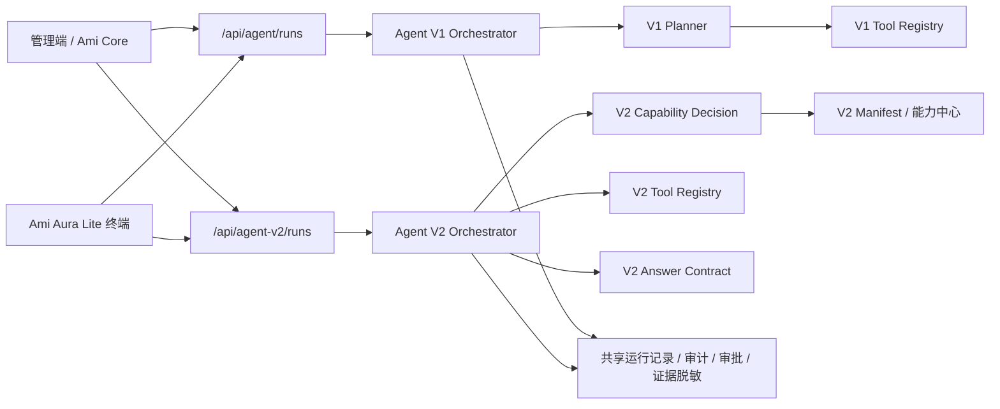

# Agent V1 与 V2 独立拆分详细开发计划

日期：2026-07-04

## 1. 背景

当前 Agent V2 已经具备能力目录、能力中心、V2 工具注册、权限字段策略、回答契约校验和评测门禁，但运行入口仍嵌在旧 Agent 链路内：

- 管理端和终端仍主要调用旧入口 `/api/agent/runs`。
- 后端旧编排器 `AgentOrchestratorService` 会先尝试 `AgentV2OrchestratorBridgeService.tryProcessRun()`。
- V2 未命中或无法处理时，会继续走旧 Agent planner / tool registry。
- 审计里虽然有 `architecture: agent_v2`，但产品验收时仍容易出现“以为在测 V2，实际由旧链路兜底”的问题。

这会影响三个交付判断：

- Agent V2 的真实覆盖率不可见。
- 旧 Agent 的关键词路由和旧工具问题会继续混入 V2 验收。
- 能力中心发布后的能力是否真实生效，无法从入口层面彻底确认。

因此，本计划采纳“V1/V2 业务决策完全独立，基础设施有限复用”的方案。

## 2. 总目标

将 Agent V1 与 Agent V2 拆成两套可独立运行、独立验收、独立灰度的 Agent 引擎：

- V1 保留旧入口、旧 planner、旧工具、旧回退逻辑。
- V2 新增独立入口、独立编排器、独立能力选择、独立工具、独立评测和审计。
- 两者只复用登录、权限、门店范围、运行记录、审批、证据脱敏、审计查询等基础设施。
- V2 默认不再隐式回退 V1；未覆盖时直接返回“能力未覆盖/需要补能力/需要澄清”。

## 3. 拆分原则

| 模块 | 是否独立 | 原因 |
| --- | --- | --- |
| API 入口 | 必须独立 | 用户、终端、测试脚本必须明确知道调用的是 V1 还是 V2 |
| 编排器 | 必须独立 | 避免 V2 验收结果被旧链路污染 |
| Planner / 能力决策 | 必须独立 | V2 只能由 Manifest 和能力中心驱动 |
| Tool Registry | 必须独立 | V2 工具必须可按能力目录治理和评测 |
| 回答契约 | 必须独立 | V2 要强制“证据包 + 契约校验 + 输出形态” |
| 评测门禁 | 必须独立 | V1/V2 要能分别跑 650 题并输出差异报告 |
| 登录/权限/门店 | 可复用 | 属于基础设施，重复实现会增加风险 |
| 审计记录/运行记录 | 可复用但要加版本字段 | 需要统一查询，但必须能按引擎版本区分 |
| 证据脱敏/审批 | 可复用 | 属于横切安全能力 |

## 4. 目标架构



## 5. 范围

### 5.1 本次开发范围

- 新增 Agent V2 独立运行 API。
- 新增 Agent V2 独立编排器。
- 从旧 Agent 编排器移除 V2 bridge 隐式接管。
- 抽取可复用的 Agent 基础设施模块。
- 管理端和终端支持选择 V1/V2。
- 审计、能力中心和评测报告显示引擎版本。
- 新增 V1/V2 分离评测和 shadow 对比。

### 5.2 不在本次范围

- 不重写全部 V2 queryKey 工具。
- 不删除 V1。
- 不强制所有业务问法一次性切到 V2。
- 不做真实业务写入类能力的自动执行扩容。
- 不将 V2 能力中心改成新的业务配置中心。

## 6. 阶段任务

## M0. 开工保护与现状冻结

目标：避免在当前大量未提交改动上继续混入不可追踪变更。

任务：

- [ ] 输出当前 Git 状态快照。
- [ ] 确认 `packages/server-v2/src/agent-v2/` 是否纳入版本管理。
- [ ] 确认能力中心相关迁移、前端页面、API facade 是否属于本轮基线。
- [ ] 新建独立开发分支或本地保护点。
- [ ] 标记本次拆分涉及文件范围。

验收：

- [ ] 有清晰的本轮改动文件清单。
- [ ] 不覆盖用户已有未提交业务改动。
- [ ] Agent V1/V2 当前调用链路有现状说明。

## M1. Agent 运行记录增加引擎版本字段

目标：所有运行记录都能明确区分 V1/V2。

后端任务：

- [ ] 检查 `AgentRun` 当前 schema。
- [ ] 新增或补齐字段：
  - `engineVersion`: `agent_v1 | agent_v2`
  - `entrypoint`: `admin | kiosk | api | eval | shadow`
  - `manifestVersionId`: V2 命中时记录
  - `capabilityId`: V2 命中时记录
  - `toolNames`: 实际执行工具列表
  - `fallbackPolicy`: `none | explicit_legacy | shadow_only`
  - `fallbackReason`: 仅允许显式回退时记录
- [ ] Prisma migration。
- [ ] 更新 Agent run 创建、查询、审计序列化。
- [ ] 保持旧记录兼容：旧记录默认 `engineVersion=agent_v1`。

前端任务：

- [ ] Agent 审计列表增加“引擎版本”。
- [ ] Agent 审计详情显示 `capabilityId`、`manifestVersionId`、`toolNames`、`fallbackPolicy`。

验收：

- [ ] 新建 V1 run 显示 `agent_v1`。
- [ ] 新建 V2 run 显示 `agent_v2`。
- [ ] 旧数据查询不报错。

## M2. 新增 Agent V2 独立 API 入口

目标：V2 不再依赖 `/api/agent/runs`。

后端任务：

- [ ] 新增 `AgentV2Controller`。
- [ ] 新增接口：
  - `POST /api/agent-v2/runs`
  - `GET /api/agent-v2/runs/:id`
  - `POST /api/agent-v2/runs/:id/messages`
  - `POST /api/agent-v2/runs/:id/approvals/:approvalId/confirm`
  - `GET /api/agent-v2/runs`
- [ ] V2 创建 run 时强制写入 `engineVersion=agent_v2`。
- [ ] V2 接口不调用 `AgentOrchestratorService`。
- [ ] V2 接口只调用新的 `AgentV2OrchestratorService`。

前端任务：

- [ ] 新增 `src/api/real/agentV2.ts`。
- [ ] 新增 `src/api/agentV2.ts` facade。
- [ ] 类型补齐 `AgentV2Run`、`AgentV2RunRequest`、`AgentV2RunResult`。

验收：

- [ ] 直接请求 `/api/agent-v2/runs` 能创建 V2 run。
- [ ] 请求 `/api/agent/runs` 不会进入 V2。
- [ ] V2 未覆盖问题不会自动回退 V1。

## M3. 新增 Agent V2 独立编排器

目标：替换当前 bridge 模式。

后端任务：

- [ ] 新建 `AgentV2OrchestratorService`。
- [ ] 将 `AgentV2OrchestratorBridgeService` 中真正属于 V2 的流程迁移到新编排器：
  - 能力决策
  - 权限策略校验
  - 工具执行
  - 证据包生成
  - 回答契约校验
  - 审批拦截
  - 结构化输出
- [ ] 删除或废弃 `tryProcessRun()` 隐式接管语义。
- [ ] `AgentOrchestratorService` 不再 import `AgentV2OrchestratorBridgeService`。
- [ ] `AgentModule` 不再 import `AgentV2Module`，避免循环依赖。

验收：

- [ ] 旧 `/api/agent/runs` 只走 V1。
- [ ] 新 `/api/agent-v2/runs` 只走 V2。
- [ ] 代码搜索不到 `AgentOrchestratorService -> AgentV2` 的桥接调用。

## M4. 抽取共享 Agent 基础设施模块

目标：避免为了“完全独立”重复造运行记录、审计、审批、证据脱敏。

后端任务：

- [ ] 新建 `agent-runtime` 或 `agent-core-runtime` 模块。
- [ ] 从旧 `agent` 模块抽出：
  - `AgentWorkflowRuntimeService`
  - `AgentEvidenceService`
  - run/message persistence
  - approval persistence
  - audit helper
- [ ] V1/V2 都依赖该基础设施模块。
- [ ] 基础设施模块不得依赖 V1 planner 或 V2 capability decision。

验收：

- [ ] V1/V2 都能创建、更新、查询 run。
- [ ] 基础设施模块没有业务能力选择逻辑。
- [ ] Nest module 依赖无循环。

## M5. V2 工具命名空间隔离

目标：避免 V1/V2 工具混用。

后端任务：

- [ ] V2 工具统一命名：
  - `v2.business.record.query`
  - `v2.business.metric.query`
  - `v2.business.trend.query`
  - `v2.business.detail.query`
  - `v2.business.action.draft`
  - `v2.navigation.open`
- [ ] Manifest 中工具名同步调整。
- [ ] 能力中心 queryKey 工具登记同步调整。
- [ ] V2 编排器拒绝执行非 `v2.` 前缀工具。
- [ ] V1 编排器拒绝执行 `v2.` 前缀工具。

验收：

- [ ] V2 run 的 `toolNames` 全部为 `v2.*`。
- [ ] V1 run 不出现 `v2.*` 工具。
- [ ] 能力中心预检能识别 V2 工具是否已注册。

## M6. V2 不再隐式回退 V1

目标：让能力缺口暴露出来，而不是被旧链路掩盖。

后端任务：

- [ ] V2 能力未命中时返回 `unsupported_capability`。
- [ ] V2 工具缺失时返回 `tool_not_implemented`。
- [ ] V2 契约失败时返回 `contract_failed`。
- [ ] V2 权限不足时返回 `permission_denied`。
- [ ] 所有失败都进入 Agent 审计，不能静默切 V1。

可选灰度：

- [ ] 支持 `fallbackPolicy=explicit_legacy`，只允许管理后台配置开启。
- [ ] 默认生产策略为 `none`。

验收：

- [ ] 问一个 V2 未覆盖问题，返回明确缺口。
- [ ] 审计中能看到失败原因。
- [ ] 不产生 V1 run 或 V1 tool call。

## M7. 管理端支持选择 Agent 引擎

目标：运营和测试人员可以明确进入 V1 或 V2。

前端任务：

- [ ] Agent 调试入口增加引擎选择：
  - Agent V1
  - Agent V2
  - Shadow 对比
- [ ] 默认引擎由系统配置控制。
- [ ] 发送问题时按引擎调用不同 API。
- [ ] 回答顶部显示：
  - 引擎版本
  - 能力 ID
  - Manifest 版本
  - 工具列表
  - 证据来源
- [ ] Agent 能力中心增加“用 V2 试问”入口。

验收：

- [ ] 选择 V1 只产生 V1 run。
- [ ] 选择 V2 只产生 V2 run。
- [ ] 页面可直接看到本次回答属于哪套引擎。

## M8. Ami Aura Lite 终端支持 Agent 引擎配置

目标：终端也能灰度切换 V1/V2。

终端任务：

- [ ] `agentRuntimeService` 增加 `engineVersion` 配置。
- [ ] V1 调用 `/api/agent/runs`。
- [ ] V2 调用 `/api/agent-v2/runs`。
- [ ] 终端调试信息显示当前引擎。
- [ ] 支持按门店、角色或设备灰度。

后端任务：

- [ ] 增加系统配置：
  - `agent.defaultEngine.admin`
  - `agent.defaultEngine.kiosk`
  - `agent.shadow.enabled`
  - `agent.v2.fallbackPolicy`

验收：

- [ ] 管理端和终端可以使用不同默认引擎。
- [ ] 指定门店可单独切 V2。
- [ ] 终端问答审计能看到引擎版本。

## M9. Shadow 对比评测

目标：在不影响用户实际回答的前提下验证 V2。

后端任务：

- [ ] 新增 `AgentShadowRunService`。
- [ ] 支持同一个问题同时跑 V1 和 V2。
- [ ] 只展示主引擎结果，另一个结果只入评测表。
- [ ] 记录差异：
  - 是否命中同一业务对象
  - 是否使用正确数据源
  - 是否权限一致
  - 是否输出形态一致
  - 是否答非所问
  - 是否缺证据

评测任务：

- [ ] 650 条题分别跑 V1、V2。
- [ ] 输出 V1/V2 对比报告：
  - V2 已覆盖题数
  - V2 未覆盖题数
  - V2 错路由题数
  - V2 权限风险题数
  - V2 输出契约失败题数
  - V1 答对但 V2 不支持题数
  - V2 答对但 V1 错误题数

验收：

- [ ] 能生成 `agent-v1-v2-shadow-eval-report.md`。
- [ ] 每条题能追溯 V1/V2 各自 runId。
- [ ] 评测报告能作为切换决策依据。

## M10. 能力中心联动改造

目标：能力中心只发布到 V2，不再被旧 Agent 混用。

后端任务：

- [ ] 能力中心 Manifest 发布只影响 `/api/agent-v2/runs`。
- [ ] Manifest 版本激活后刷新 V2 provider。
- [ ] 能力中心预检增加：
  - 是否有 V2 工具
  - 是否有 DTO
  - 是否有权限
  - 是否有字段策略
  - 是否有评测题覆盖
  - 是否允许自动发布
- [ ] 发布记录写入 `manifestVersionId`。

前端任务：

- [ ] 能力中心列表增加“V2 发布状态”。
- [ ] 能力详情增加“运行入口：Agent V2”。
- [ ] 能力预检结果明确标注“不会进入 Agent V1”。

验收：

- [ ] 发布一个能力后，只影响 V2。
- [ ] V1 结果不因 V2 Manifest 发布而变化。

## M11. 审计与监控

目标：上线后能判断哪套 Agent 在工作、哪里失败。

后端任务：

- [ ] Agent 审计增加统计接口：
  - V1 run 数
  - V2 run 数
  - V2 unsupported 数
  - V2 contract_failed 数
  - V2 permission_denied 数
  - Shadow 差异数
- [ ] 日志中统一输出 `engineVersion`。
- [ ] 异常告警区分 V1/V2。

前端任务：

- [ ] Agent 审计页增加 V1/V2 筛选。
- [ ] Agent 能力中心增加 V2 运行健康卡片。
- [ ] 详情页展示完整执行链路。

验收：

- [ ] 能按 V1/V2 查询审计。
- [ ] 能定位单次 V2 失败原因。
- [ ] 能按能力 ID 查看 V2 使用量和失败率。

## M12. V1 保留与退出策略

目标：V1 不立即删除，但逐步退出核心业务问答。

任务：

- [ ] 标记 V1 为 legacy engine。
- [ ] V1 不再新增业务能力。
- [ ] 新能力只允许进入 V2 能力中心。
- [ ] V1 仅保留：
  - 历史兼容
  - 应急回退
  - 对比评测
- [ ] 按领域制定 V2 切换顺序：
  1. 财务结构化查询
  2. 库存结构化查询
  3. 订单与收银查询
  4. 客户与营销查询
  5. 行动建议与草稿生成
  6. 高风险写入类动作

验收：

- [ ] 新增能力无法配置到 V1。
- [ ] V1/V2 切换矩阵清晰。
- [ ] 每个领域有独立切换状态。

## 7. 数据模型建议

### 7.1 AgentRun 增量字段

```ts
engineVersion: 'agent_v1' | 'agent_v2';
entrypoint: 'admin' | 'kiosk' | 'api' | 'eval' | 'shadow';
capabilityId?: string;
manifestVersionId?: string;
toolNames?: string[];
fallbackPolicy: 'none' | 'explicit_legacy' | 'shadow_only';
fallbackReason?: string;
contractStatus?: 'passed' | 'failed' | 'not_required';
policyStatus?: 'passed' | 'denied' | 'approval_required';
```

### 7.2 AgentShadowEvalRun

```ts
id: string;
question: string;
v1RunId: string;
v2RunId: string;
expectedCapabilityId?: string;
v1ResultStatus: string;
v2ResultStatus: string;
diffSummary: string;
decision: 'v2_pass' | 'v2_gap' | 'v2_wrong_route' | 'manual_review';
createdAt: Date;
```

## 8. API 清单

### 8.1 V1 保留

- `POST /api/agent/runs`
- `GET /api/agent/runs`
- `GET /api/agent/runs/:id`
- `POST /api/agent/runs/:id/messages`

### 8.2 V2 新增

- `POST /api/agent-v2/runs`
- `GET /api/agent-v2/runs`
- `GET /api/agent-v2/runs/:id`
- `POST /api/agent-v2/runs/:id/messages`
- `POST /api/agent-v2/runs/:id/approvals/:approvalId/confirm`
- `POST /api/agent-v2/shadow-runs`
- `GET /api/agent-v2/shadow-runs`
- `GET /api/agent-v2/shadow-runs/:id`
- `POST /api/agent-v2/eval/run`
- `GET /api/agent-v2/eval/reports`

## 9. 验收用例

### 9.1 入口隔离

- [ ] 管理端选择 V1，后端只产生 `engineVersion=agent_v1`。
- [ ] 管理端选择 V2，后端只产生 `engineVersion=agent_v2`。
- [ ] 终端选择 V1，不调用 `/api/agent-v2/runs`。
- [ ] 终端选择 V2，不调用 `/api/agent/runs`。

### 9.2 回退隔离

- [ ] V2 未覆盖问题返回 `unsupported_capability`。
- [ ] V2 工具缺失返回 `tool_not_implemented`。
- [ ] V2 权限不足返回 `permission_denied`。
- [ ] V2 失败不会自动调用 V1。

### 9.3 能力中心

- [ ] 发布 Manifest 后 V2 生效。
- [ ] 发布 Manifest 后 V1 不变化。
- [ ] 能力预检显示 V2 工具、DTO、权限和评测状态。

### 9.4 审计

- [ ] 审计列表可按 V1/V2 筛选。
- [ ] 审计详情显示能力 ID、Manifest 版本、工具列表。
- [ ] Shadow 对比能追溯 V1/V2 runId。

### 9.5 650 题评测

- [ ] 650 条题可单独跑 V1。
- [ ] 650 条题可单独跑 V2。
- [ ] 650 条题可跑 V1/V2 shadow 对比。
- [ ] 报告能输出 V2 覆盖、缺口、错路由、权限风险和契约失败。

## 10. 验证命令

```powershell
npm.cmd --prefix packages/server-v2 run db:generate
npm.cmd --prefix packages/server-v2 run test -- --runTestsByPath src/agent src/agent-v2 --runInBand
npm.cmd --prefix packages/server-v2 run agent-v2:capability-drafts
npm.cmd --prefix packages/server-v2 run agent-v2:eval-gate:strict
npm.cmd run check:api
npm.cmd run build
npm.cmd --prefix packages/Ami-Aura-Lite-Kiosk run build
```

新增建议命令：

```powershell
npm.cmd --prefix packages/server-v2 run agent:eval:v1
npm.cmd --prefix packages/server-v2 run agent-v2:eval
npm.cmd --prefix packages/server-v2 run agent:eval:shadow
```

## 11. 风险与处理

| 风险 | 影响 | 处理 |
| --- | --- | --- |
| V2 独立后未覆盖问题增加 | 用户感觉能力变弱 | 用 shadow 模式先评测，不直接切生产 |
| 旧 run 数据无版本字段 | 审计统计不准 | 旧数据默认补 `agent_v1` |
| Nest module 循环依赖 | 后端启动失败 | 抽 `agent-runtime` 基础模块 |
| 前端/终端调用入口混乱 | 验收无法判断 | UI 显示引擎版本，API facade 分开 |
| 能力中心发布后未即时生效 | 管理员误判 | ManifestProvider 增加刷新和版本显示 |
| V2 工具命名迁移影响已有 Manifest | 运行失败 | 提供 Manifest migration 脚本 |

## 12. 里程碑

### 阶段 A：拆入口和审计

交付：

- `/api/agent-v2/runs`
- `engineVersion` 字段
- 管理端 V1/V2 选择
- 审计可区分 V1/V2

验收标准：

- V1/V2 run 完全可区分。
- V2 不再通过旧入口隐式触发。

### 阶段 B：拆编排和工具

交付：

- `AgentV2OrchestratorService`
- 移除 V1 编排器内 V2 bridge
- V2 工具 `v2.*` 命名空间

验收标准：

- 代码层面无 `AgentOrchestratorService -> AgentV2` 接管调用。
- V1/V2 工具不会互相执行。

### 阶段 C：灰度和评测

交付：

- Shadow 对比服务
- 650 题 V1/V2 对比报告
- 能力中心 V2 运行健康卡

验收标准：

- 每条题能追溯 V1/V2 结果。
- 能基于报告决定哪些领域切 V2。

### 阶段 D：领域切换

交付：

- 财务、库存、订单、客户、营销按领域切换矩阵。
- V1 仅保留应急和历史兼容。

验收标准：

- 新能力只进 V2。
- V1 不再承担新增能力开发。

## 13. 最终完成定义

- [ ] V1/V2 有独立 API 入口。
- [ ] V1/V2 有独立编排器。
- [ ] V1/V2 有独立工具注册。
- [ ] V2 不再隐式回退 V1。
- [ ] 管理端和终端可配置使用 V1/V2。
- [ ] Agent 审计可按引擎版本、能力、工具和 Manifest 版本追溯。
- [ ] 650 题可分别跑 V1、V2、Shadow 对比。
- [ ] 能力中心发布只影响 V2。
- [ ] 新增能力只允许进入 V2 能力中心。
