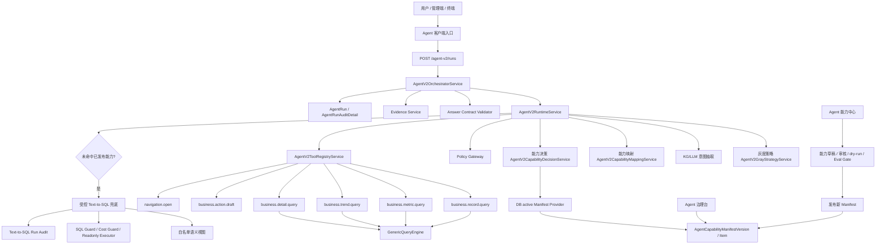

# Agent V2 当前最新架构

更新时间：2026-07-07  
适用范围：Ami_Core 管理端、Ami Aura Lite 终端、server-v2 Agent V2 Runtime、Agent 能力中心、Agent 治理台、受控 Text-to-SQL 兜底。

## 1. 产品结论

当前 Agent V2 已经从“固定问答/正则能力”升级为“能力发布驱动的 Agent Runtime”：

- 能力真相源统一为数据库 active Manifest。能力中心发布什么，Runtime 默认就运行什么。
- 运行时先走已发布能力和 QueryEngine，不再默认依赖内置 Manifest 自动补齐能力。
- 未命中已发布能力时，可按开关进入受控 Text-to-SQL 兜底，用白名单语义视图做只读查询。
- Agent 治理台负责观测、灰度、评测、dry-run、知识图谱、自动发布日志和 Text-to-SQL 审计。
- 写操作、发券、删除、审批、下发仍不允许自动执行；当前只支持生成动作草稿或要求人工确认。

这套架构的目标不是让 LLM 直接“自由查库/自由调接口”，而是让 Agent 在能力目录、权限、门店范围、字段策略、证据包和审计链路内自动完成经营问数与低风险辅助动作。

## 2. 总体架构图



## 3. 运行时主链路

### 3.1 入口

后端入口：

- `POST /agent-v2/runs`：创建 Agent V2 会话并处理首条消息。
- `POST /agent-v2/runs/:id/messages`：继续会话。
- `GET /agent-v2/runs`、`GET /agent-v2/runs/:id/detail`：运行记录与审计详情。
- `GET /agent-v2/tools`：当前注册的 V2 工具。

核心代码：

- `packages/server-v2/src/agent-v2/agent-v2.controller.ts`
- `packages/server-v2/src/agent-v2/agent-v2-orchestrator.service.ts`
- `packages/server-v2/src/agent-v2/agent-v2-runtime.service.ts`

产品表现：

- 管理端和终端可以切换 Agent V2 Runtime。
- 每次运行都会写入 Agent run、step、tool call、evidence、audit detail，治理台可回放和定位问题。

### 3.2 运行时决策

Agent V2 Runtime 的能力选择分三层：

1. 灰度策略：决定当前使用 `legacy_regex`、`shadow`、`kg_llm_preferred`、`legacy_retired` 等模式。
2. 意图识别：KG/LLM 意图抽取，把自然语言映射为领域、对象、动作、时间、指标等结构化意图。
3. Manifest 能力匹配：从 DB active Manifest 中选择可执行能力，生成 toolPlan。

当前默认策略仍保留灰度兼容能力：

- `kg_llm_preferred`：优先 KG/LLM，必要时回退高置信旧决策。
- `shadow`：双跑对比，但返回旧链路结果。
- `legacy_retired`：最终可收敛到只用新意图引擎。

产品意义：

- 能逐步从旧规则迁到 KG/LLM，不需要一次性切断。
- 治理台可以对比“当前模式、旧正则、目标 Manifest”的差异。

## 4. Manifest 真相源

当前 Runtime 默认以数据库 active Manifest 为真相源：

- active 版本来自 `AgentCapabilityManifestVersion.status = active`。
- 可执行能力来自该版本下 enabled 的 `AgentCapabilityManifestItem`。
- 如果 DB active 缺失，Runtime 默认能力为空，并在审计/治理里暴露缺失原因。
- 内置 Manifest 文件仍保留为开发参考、测试 fixture 和调试查看来源，但不作为默认运行补齐来源。

核心代码：

- `packages/server-v2/src/agent-v2/capability-center/agent-v2-manifest-provider.service.ts`
- `packages/server-v2/src/agent-v2/capability/agent-v2-capability-manifest.ts`
- `packages/server-v2/prisma/schema.prisma`

需要注意：

- Provider 刷新失败但内存中已有上一版 active 时，会继续使用上一版并标记 source=fallback，避免短暂 DB 抖动导致线上能力瞬间清空。
- 若服务启动时没有任何 active DB Manifest，则不会自动回退内置 Manifest。

## 5. 能力中心与治理发布

能力中心负责“从候选能力到可运行 Manifest”的发布闭环：

1. 导入候选能力草稿。
2. 自动治理，补齐 DTO、权限、工具、字段策略、发布策略。
3. validate 预检。
4. queryKey dry-run。
5. Eval Gate。
6. 审核。
7. 发布到 DB active Manifest。
8. 发布后 smoke test。

主要 API：

- `GET /agent-v2/capability-center/drafts`
- `POST /agent-v2/capability-center/drafts/import`
- `POST /agent-v2/capability-center/auto-governance`
- `POST /agent-v2/capability-center/drafts/:capabilityId/dry-run`
- `POST /agent-v2/capability-center/eval-gate`
- `POST /agent-v2/capability-center/reviews`
- `POST /agent-v2/capability-center/publish`
- `GET /agent-v2/capability-center/manifest-versions`

主要代码：

- `packages/server-v2/src/agent-v2/capability-center/agent-v2-capability-center.controller.ts`
- `packages/server-v2/src/agent-v2/capability-center/agent-v2-capability-center.service.ts`
- `packages/server-v2/src/agent-v2/capability-center/agent-v2-auto-publish.service.ts`

产品意义：

- “能力是否能被 Agent 调用”不再靠写死代码判断，而由能力中心治理、审核、发布决定。
- 无法发布的能力会进入待补齐/待复核，不再混在已审核能力里造成运行时失败。

## 6. 工具层

当前 V2 工具注册表包含 6 类工具：

| 工具 | 作用 | 风险 |
| --- | --- | --- |
| `business.record.query` | 业务记录列表查询，如订单、库存流水、核销记录 | 低 |
| `business.metric.query` | 指标查询，如营收、客单价、数量、汇总 KPI | 低 |
| `business.trend.query` | 趋势与图表查询 | 低 |
| `business.detail.query` | 单据/客户/项目等详情查询 | 低 |
| `business.action.draft` | 动作草稿生成，不直接写业务数据 | 中 |
| `navigation.open` | 打开页面入口，不写数据 | 低 |

主要代码：

- `packages/server-v2/src/agent-v2/agent-v2-tool-registry.service.ts`
- `packages/server-v2/src/agent-v2/tools/*`
- `packages/server-v2/src/agent-v2/query-engine/generic-query-engine.service.ts`

当前查询工具底层主要复用 `GenericQueryEngine`：

- 使用 Manifest 的 `sourceModels`、`fieldPolicies`、`storeScope` 和 executor queryKey。
- 统一输出 data、evidence、queryTrace、限制说明。
- 对无数据场景返回 no_data，不把“没查到数据”误判为系统失败。

## 7. 受控 Text-to-SQL 兜底

受控 Text-to-SQL 是 Agent V2 的兜底层，不是主路径：

- 主路径仍是已发布能力 / QueryPlan / GenericQueryEngine。
- 当没有已发布能力命中，并且开关允许时，才进入 Text-to-SQL。
- 默认仅管理员、经理或具备治理权限的角色可进入。
- 只允许查询白名单语义视图，不允许直接访问任意业务表。
- SQL 经过 AST/Guard/Cost Guard/权限/门店范围/字段策略检查。
- 执行器使用独立只读连接串；未配置只读连接串时只能 dry-run 或阻断。

核心代码：

- `packages/server-v2/src/agent-v2/text-to-sql/agent-v2-controlled-text-to-sql.service.ts`
- `packages/server-v2/src/agent-v2/text-to-sql/agent-v2-text-to-sql-planner.service.ts`
- `packages/server-v2/src/agent-v2/text-to-sql/agent-v2-sql-guard.service.ts`
- `packages/server-v2/src/agent-v2/text-to-sql/agent-v2-readonly-sql-executor.service.ts`
- `packages/server-v2/src/agent-v2/text-to-sql/agent-v2-text-to-sql-audit.service.ts`

数据库对象：

- `agent_v2_text_to_sql_runs`
- `agent_v2_text_to_sql_semantic_views`
- `agent_v2_text_to_sql_feedback`
- `agent_v2_*_view` 白名单语义视图

当前迁移定义了 40 个语义视图，覆盖门店、客户、订单、项目、库存、采购、供应商、卡项、预约、员工、服务、营销、终端、财务、系统、Agent 治理等主要领域。

产品意义：

- 用户换一种问法时，不一定需要先人工补 Manifest，低风险只读问数可以通过语义视图兜底回答。
- 高频兜底问题可以沉淀为正式能力，再进入能力中心治理发布。

## 8. 时间解析能力

Agent V2 已抽出共享时间范围模块：

- 统一支持今天、本周、本月、上个月、最近 7 天、最近 30 天等常见表达。
- record、metric、trend、detail、Text-to-SQL 均应复用同一套时间解析规则。
- 目标是避免“本月销量”“最近 30 天报废”在不同工具里出现不同口径。

主要代码：

- `packages/server-v2/src/agent-v2/utils/agent-v2-date-range.ts`
- `packages/server-v2/src/agent-v2/utils/agent-v2-date-range.spec.ts`

## 9. 安全与权限边界

当前安全边界分为 7 层：

1. 路由权限：管理端入口需要 `core:agent-governance:view/manage` 等权限。
2. Manifest 权限：每个能力携带 permissionCodes。
3. Policy Gateway：校验能力、工具、角色、审批策略、字段策略。
4. 门店范围：查询默认限制当前门店或用户授权门店。
5. 字段策略：敏感字段隐藏、脱敏或禁止输出。
6. Answer Contract：回答必须满足输出形态和证据要求，否则拦截或重试。
7. Text-to-SQL Guard：只读、白名单视图、LIMIT、时间范围、成本、权限、SQL 脱敏。

写操作当前不直接开放：

- `business.action.draft` 只生成待确认草稿。
- 高风险、写入、发券、删除、下发类能力不能按 auto_publish 自动执行。
- 后续如果要开放动作执行，需要单独的审批、人机确认、回滚和审计链路。

## 10. 管理端与治理台

管理端目前有两个核心入口：

- `系统设置 / Agent 治理台`
- `系统设置 / Agent 能力中心`

路由：

- `/system/agent-governance`
- `/system/agent-governance/runs`
- `/system/agent-governance/knowledge-graph`
- `/system/agent-governance/capabilities`
- `/system/agent-governance/auto-publish`
- `/system/agent-governance/eval`
- `/system/agent-governance/debug`
- `/system/agent-governance/text-to-sql`
- `/system/agent-capabilities`

前端代码：

- `src/app/pages/system/AgentGovernanceCenter.tsx`
- `src/app/pages/system/AgentCapabilityCenter.tsx`
- `src/api/real/agentGovernance.ts`
- `src/api/real/agentCapabilityCenter.ts`
- `src/types/agentGovernance.ts`
- `src/types/agentCapabilityCenter.ts`

产品意义：

- 治理台负责“看运行效果、查失败原因、做灰度评测”。
- 能力中心负责“把能力变成可发布、可治理、可运行的 Manifest”。

## 11. 自动发布与部署 hook

当前自动发布分两种：

- 手动触发：管理员在能力中心或治理台触发自动治理/自动发布。
- deploy hook：生产环境可通过部署 hook 触发自动发布流水线。

当前产品选择：

- 平时不做定时自动发布。
- 每次提交 GitHub 后由 Zeabur/部署平台同步最新代码；能力自动发布先按“提交后发布/手动触发”策略预留。
- `AGENT_V2_DEPLOY_HOOK_URL`、deploy token、GitHub Secret、后端环境变量可后续配置。

产品影响：

- 不配置生产 hook 不影响本地开发、测试、灰度和常规代码部署。
- 影响的是“代码合并后自动触发生产能力发布”的自动化程度。

## 12. 当前已具备能力

从产品能力看，当前 Agent V2 已具备：

- 已发布能力驱动的只读业务问数。
- 业务记录、指标、趋势、详情查询。
- 页面语义 adapter 与导航类能力。
- 动作草稿能力。
- KG/LLM 与旧规则的灰度对比。
- 能力中心自动治理、dry-run、Eval Gate、审核、发布。
- DB active Manifest 严格运行源。
- 受控 Text-to-SQL 独立兜底链路。
- Text-to-SQL 语义视图、只读执行、审计、反馈和灰度验收 Runbook。
- 治理台运行审计、失败回放、图谱、评测、灰度、Text-to-SQL 状态查看。

## 13. 当前边界与下一步

当前仍不是“所有业务功能都能自动写入/自动执行”的阶段，边界如下：

- Text-to-SQL 只覆盖只读问数，不覆盖写操作。
- 白名单语义视图已覆盖主要领域，但执行依赖 migration 和只读 DB URL。
- DB active Manifest 缺失时，Runtime 不会用内置 Manifest 兜底。
- 复杂跨领域分析如果未被 Manifest 命中，会先走 Text-to-SQL 兜底；高频问题仍建议沉淀为正式能力。
- 生产自动发布 hook 目前是预留配置，不是主功能依赖。

建议下一阶段：

1. 完成生产 Text-to-SQL migration 与只读账号配置。
2. 把高频兜底问题沉淀成 QueryPlan/Manifest 能力。
3. 建立“用户问题 -> 未命中原因 -> 自动生成候选能力 -> 自动治理 -> Eval Gate -> 发布”的闭环。
4. 对写操作单独建设审批、预览、确认、回滚和审计链路，不混入只读问数架构。

## 14. 本地验证口径

当前本地门禁已覆盖：

- 后端完整 Jest。
- 管理端 lint/build/test。
- Agent V2 Text-to-SQL 定向测试。
- Ami Query Hub 检查。
- Kiosk 构建。
- `git diff --check`。

建议发布前继续执行：

```powershell
npm.cmd --prefix packages/server-v2 test
npm.cmd --prefix packages/server-v2 run build
npm.cmd run lint
npm.cmd run test
npm.cmd run build
npm.cmd run check:ami-query-hub
npm.cmd run check:agent-v2-text-to-sql
git diff --check
```

