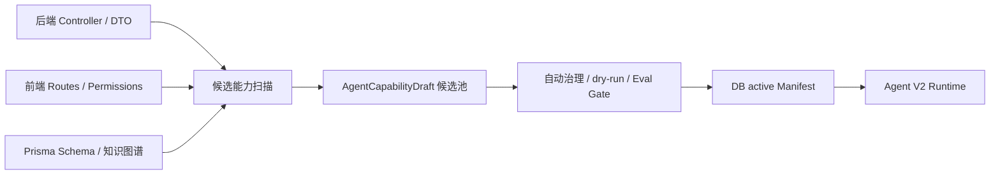
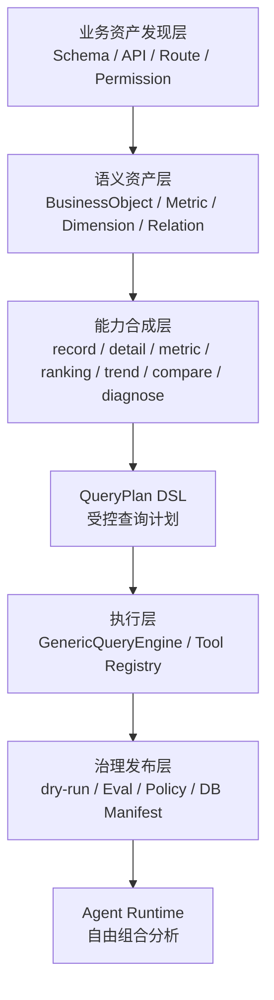
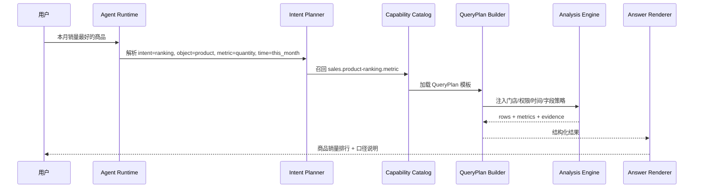

# Agent V2 能力自动合成层与自由组合分析解决方案

日期：2026-07-06

## 1. 背景与结论

当前 Agent V2 已经把运行时 Manifest 收敛为数据库 active 版本，能力中心发布什么，Runtime 就使用什么。但这还不等于“管理端和后台所有业务、功能、数据都已经能被 Agent 自由调用”。

当前能力目录的真实链路是：



这条链路解决了“能力治理和发布”问题，但还没有完全解决“能力自动合成”问题。像“本月销量最好的商品”这类问题，后台数据是有的，核心表是 `ProductOrder + OrderItem + Product`，但是当前系统没有自动把它合成为一个可发布的 `ranking` 能力，所以 Runtime 只能在已有能力里找近似项，最终误命中库存健康能力。

核心结论：

- 当前能力目录来自数据库 active Manifest，但 active Manifest 只包含已治理发布的能力，不代表全业务全集。
- 现有自动扫描更偏“接口级能力”和“页面语义能力”，不擅长自动合成跨表聚合、排行、对比、归因、推荐类经营分析。
- 要实现“管理端和后台所有业务、功能、数据都能被 Agent 调用”，需要新增 Agent V2 能力自动合成层，把数据资产、业务对象、指标、维度、时间、权限、查询模板自动组合为可执行能力。
- LLM 不应直接访问数据库或自由拼 SQL；自由组合应发生在受控 DSL、权限网关、字段策略和 dry-run 之后。

## 2. 当前为什么不支持“本月销量最好的商品”

### 2.1 现有能力能覆盖一部分，但不是这个问题

当前相关能力包括：

| 能力 | 能做什么 | 为什么不够 |
| --- | --- | --- |
| 商品订单记录查询 | 查询商品订单明细 | 返回记录，不做 TopN 聚合排行 |
| 商品毛利指标 | 统计商品收入、成本、毛利、毛利率 | 当前主要按毛利或毛利率排序，不按销量排序 |
| 库存状态与消耗健康查询 | 查询库存、缺货、安全库存、临期等 | 和“销量最好”不是同一业务问题 |

“本月销量最好的商品”的正确口径应该是：

- 事实表：`OrderItem`
- 订单主表：`ProductOrder`
- 商品维表：`Product`
- 时间字段：`ProductOrder.createdAt`
- 门店过滤：`ProductOrder.storeId`
- 商品过滤：`OrderItem.itemType in product/goods/sku/retail`
- 销量：`sum(OrderItem.quantity)`
- 销售额：`sum(OrderItem.netAmount)`
- 排序：默认 `sum(quantity) desc`
- 输出：商品名、SKU、销量、销售额、订单数、均价、证据说明

这不是单接口查询，而是一个典型的经营分析型 `ranking` 能力。

### 2.2 自动生成链路缺少“业务分析模板”

现有 `agent-v2-capability-draft-generator` 主要扫描：

- 后端 controller endpoint
- DTO
- 前端 route
- 已有内置 Manifest
- 评测题和知识图谱候选

它可以发现“有订单接口”“有商品模型”“有 OrderItem.quantity 字段”，但不能稳定推导：

- 哪些字段能做指标
- 哪些字段能做维度
- 哪些字段能做时间过滤
- 哪些字段能做门店授权过滤
- 哪些聚合组合是业务上有意义的
- 结果应该是 table、kpi、chart、ranking 还是 evidence panel

所以它能生成候选，却不能自动发布为可执行能力。

### 2.3 知识图谱已经发现了问法，但没有闭环到能力

知识图谱增强候选里已经出现过：

> 最近卖得最好的产品是什么

但它被标记为“缺能力、同义词或输出形态确认”。这说明系统已经有“发现问题”的能力，但缺少“把问题转成可执行 QueryPlan 并发布”的能力。

## 3. 目标架构：从能力目录升级为语义能力合成层

目标不是让 Agent 随便调用所有 API，而是让 Agent 能在安全边界内自由组合所有业务数据。

建议新增 6 层：



### 3.1 业务资产发现层

自动读取并归档以下资产：

- Prisma models、fields、relations、indexes
- Controller endpoints、HTTP method、permission decorators
- DTO 入参出参
- 前端 routes、页面权限、页面标题
- 现有报表、看板、列表页使用的 API
- 已有 Agent Manifest、评测题、用户历史问法

输出统一资产索引：

```ts
type AgentSemanticAsset = {
  assetId: string;
  assetType: 'model' | 'field' | 'relation' | 'api' | 'route' | 'permission' | 'capability' | 'question';
  domain: string;
  businessObject: string;
  name: string;
  displayName: string;
  sourcePath?: string;
  confidence: number;
  metadata: Record<string, unknown>;
};
```

产品意义：系统先知道“有什么业务对象、字段、接口、权限和页面”。

### 3.2 语义资产层

在资产基础上自动标注经营语义：

| 语义类型 | 示例 | 作用 |
| --- | --- | --- |
| Fact Model | `OrderItem`, `ProductOrder`, `PaymentRecord` | 适合做明细、统计、趋势 |
| Dimension | `Product.name`, `Customer.source`, `User.name` | 适合 group by |
| Metric | `sum(quantity)`, `sum(netAmount)`, `count(orderId)` | 适合指标和排行 |
| Time Field | `ProductOrder.createdAt`, `PaymentRecord.paidAt` | 适合时间过滤 |
| Scope Field | `storeId`, `tenantId`, `operatorId` | 权限和门店过滤 |
| Sensitive Field | phone、remark、cost、internalNote | 字段脱敏和拒绝 |
| Action Surface | POST/PUT/PATCH/DELETE | 写入、删除、发券等高风险动作 |

输出示例：

```ts
type AgentMetricDefinition = {
  metricId: string;
  displayName: string;
  domain: string;
  factModel: string;
  expression: {
    op: 'sum' | 'count' | 'avg' | 'min' | 'max';
    field?: string;
    distinct?: boolean;
  };
  defaultTimeField: string;
  defaultScope: 'store' | 'tenant' | 'global';
  allowedDimensions: string[];
  allowedFilters: string[];
  fieldPolicies: AgentV2FieldPolicy[];
};
```

产品意义：系统不只是知道有 `quantity` 字段，而是知道它在 `OrderItem` 上可以代表“销量”。

### 3.3 能力合成层

基于语义资产自动生成能力草稿，不再只生成 API 候选。

能力模板：

| 模板 | 用途 | 示例 |
| --- | --- | --- |
| record | 明细列表 | 今天有哪些商品订单 |
| detail | 单条详情 | 查看订单 POxxx |
| metric | 指标汇总 | 本月营业额多少 |
| ranking | TopN 排行 | 本月销量最好的商品 |
| trend | 趋势 | 近 7 天营业额走势 |
| compare | 对比 | 本月和上月商品销量对比 |
| diagnose | 归因诊断 | 为什么利润下降 |
| recommendation | 建议 | 哪些商品适合做促销 |
| action_draft | 动作草稿 | 生成补货草稿 |
| page_context | 页面语义 | 客户数据页面能查什么 |

自动合成规则示例：

```ts
if (
  factModel === 'OrderItem' &&
  hasRelation('OrderItem.order', 'ProductOrder') &&
  hasRelation('OrderItem.product', 'Product') &&
  hasMetric('sum(quantity)') &&
  hasDimension('Product.name')
) {
  synthesize('sales.product-ranking.metric');
}
```

生成 Manifest 草稿：

```json
{
  "capabilityId": "sales.product-ranking.metric",
  "displayName": "商品销量排行",
  "domain": "sales",
  "businessObject": "Product",
  "actions": ["summary", "list", "analyze"],
  "sourceModels": ["ProductOrder", "OrderItem", "Product", "Store"],
  "executor": {
    "type": "generic_query_plan",
    "tool": "business.analysis.query",
    "queryKey": "sales.product-ranking"
  },
  "outputKinds": ["table", "kpi", "evidence_panel"],
  "releaseStrategy": "auto_publish",
  "riskLevel": "low",
  "permissionCodes": ["core:order:view"],
  "examples": [
    "本月销量最好的商品",
    "最近卖得最好的产品是什么",
    "这个月热销商品排行",
    "本周卖得最多的产品"
  ],
  "triggerKeywords": ["销量最好", "热销商品", "卖得最好", "商品销量排行", "产品销量排行"]
}
```

产品意义：高频经营分析不再靠人工一个个写 Manifest，而是由模板合成、治理后发布。

### 3.4 QueryPlan DSL

自由组合分析必须落到受控 DSL，而不是自由 SQL。

建议 QueryPlan：

```ts
type AgentQueryPlan = {
  planId: string;
  planType: 'record' | 'detail' | 'metric' | 'ranking' | 'trend' | 'compare' | 'diagnose';
  factModel: string;
  joins: Array<{
    from: string;
    relation: string;
    to: string;
    required: boolean;
  }>;
  scope: {
    type: 'store' | 'tenant' | 'global';
    path: string;
  };
  time: {
    field: string;
    range: AgentV2DateRange;
  };
  dimensions: Array<{
    id: string;
    path: string;
    label: string;
  }>;
  metrics: Array<{
    id: string;
    op: 'sum' | 'count' | 'avg' | 'min' | 'max';
    path?: string;
    label: string;
    format: 'money' | 'number' | 'percent' | 'text';
  }>;
  filters: Array<{
    path: string;
    op: 'eq' | 'in' | 'gte' | 'lte' | 'contains';
    value: unknown;
  }>;
  orderBy: Array<{
    metricId: string;
    direction: 'asc' | 'desc';
  }>;
  limit: number;
  fieldPolicies: AgentV2FieldPolicy[];
};
```

“本月销量最好的商品”的 QueryPlan：

```json
{
  "planType": "ranking",
  "factModel": "OrderItem",
  "joins": [
    { "from": "OrderItem", "relation": "order", "to": "ProductOrder", "required": true },
    { "from": "OrderItem", "relation": "product", "to": "Product", "required": false }
  ],
  "scope": { "type": "store", "path": "order.storeId" },
  "time": { "field": "order.createdAt", "range": "this_month" },
  "dimensions": [
    { "id": "product", "path": "product.name", "label": "商品" },
    { "id": "sku", "path": "product.sku", "label": "SKU" }
  ],
  "metrics": [
    { "id": "quantity", "op": "sum", "path": "quantity", "label": "销量", "format": "number" },
    { "id": "revenue", "op": "sum", "path": "netAmount", "label": "销售额", "format": "money" },
    { "id": "orderCount", "op": "count", "path": "orderId", "label": "订单数", "format": "number" }
  ],
  "filters": [
    { "path": "itemType", "op": "in", "value": ["product", "goods", "sku", "retail"] }
  ],
  "orderBy": [{ "metricId": "quantity", "direction": "desc" }],
  "limit": 10
}
```

产品意义：用户可以问“本月销量最好的商品”，也可以追问“这些商品库存还够吗”，系统能把两个 QueryPlan 串起来，而不是重新写固定能力。

### 3.5 执行层

新增 `business.analysis.query` 工具，内部由 `GenericQueryEngine` 执行 QueryPlan。

执行职责：

- 校验 factModel、joins、scope、time、metrics、dimensions 是否在白名单内
- 自动注入门店、用户、角色权限过滤
- 应用字段策略：allow、mask、deny
- 执行 Prisma 聚合或安全 SQL builder
- 输出统一结构：summary、metrics、rows、evidence、queryTrace、dataGap

返回结构：

```ts
type AgentAnalysisResult = {
  status: 'success' | 'no_data' | 'unsupported' | 'needs_development';
  title: string;
  summary: string;
  metrics: Record<string, unknown>;
  rows: Array<Record<string, unknown>>;
  evidence: {
    sourceModels: string[];
    metricDefinition: string;
    filters: string[];
    sampleSize: number;
  };
  queryTrace: {
    planType: string;
    factModel: string;
    joins: string[];
    filters: string[];
    sqlSummary?: string;
  };
};
```

### 3.6 治理发布层

自动合成不等于自动上线。建议沿用当前能力中心治理，但把输入从“扫描草稿”升级为“合成草稿”。

发布规则：

| 能力类型 | 默认策略 | 原因 |
| --- | --- | --- |
| record/detail/metric/ranking/trend/compare | auto_publish | 只读，可 dry-run |
| diagnose/recommendation | needs_review | 可能影响经营决策，先复核 |
| action_draft | approval_required | 只能生成草稿 |
| write/delete/coupon issue/direct dispatch | write_blocked | 不允许 Agent 自动执行 |

自动门禁：

- Manifest schema 校验
- QueryPlan schema 校验
- 权限码存在校验
- 工具 dry-run
- 字段策略校验
- storeScope 校验
- Eval 题命中校验
- no-data 不阻断发布，但必须返回明确 data gap
- 高风险动作必须阻断

## 4. Agent 自由组合分析如何工作

### 4.1 单问题分析

用户问：

> 本月销量最好的商品

流程：



### 4.2 多能力组合分析

用户问：

> 本月销量最好的商品，库存还够吗，适不适合做活动？

系统应拆成 3 个子计划：

1. 商品销量排行：`sales.product-ranking.metric`
2. 库存健康：`inventory.stock-health.by-product`
3. 活动建议：`marketing.product-campaign-opportunity.recommendation`

组合输出：

- Top 商品销量排行
- 对应库存、临期、安全库存
- 建议动作：补货、促销、搭配销售、活动草稿
- 写入动作只生成草稿，不自动发布活动

组合计划结构：

```ts
type AgentCompositePlan = {
  goal: string;
  steps: Array<{
    stepId: string;
    capabilityId: string;
    queryPlan: AgentQueryPlan;
    dependsOn?: string[];
    joinOn?: Array<{ fromStep: string; fromField: string; toField: string }>;
  }>;
  finalAnswer: {
    layout: 'summary_table_actions' | 'diagnosis' | 'dashboard';
    evidenceRequired: true;
  };
};
```

### 4.3 多轮追问

用户追问：

> 那这几个商品有没有库存风险？

Agent 从上一轮结果取 `productIds`，进入库存风险 QueryPlan：

- context.productIds = 上一轮 TopN 商品
- capability = `inventory.expiring-risk.list` 或 `inventory.stock-health.by-product`
- 输出只针对这些商品

这需要 Runtime 保存：

- 上一轮 capabilityId
- rows 的实体 ID
- QueryPlan trace
- 可追问字段

## 5. 数据库与后端建议

### 5.1 新增语义资产表

建议新增表：

- `agent_semantic_assets`
- `agent_metric_definitions`
- `agent_dimension_definitions`
- `agent_relation_paths`
- `agent_query_plan_templates`
- `agent_capability_synthesis_runs`
- `agent_composite_plan_runs`

最小可先不新增全量表，先把 QueryPlan JSON 放入现有 Manifest 的 `manifestJson.queryPlan`，后续再拆表。

### 5.2 Manifest 扩展

当前 Manifest 可扩展：

```ts
type AgentV2CapabilityManifest = {
  capabilityId: string;
  executor: {
    type: AgentV2ExecutorType | 'generic_query_plan';
    tool: string;
    queryKey: string;
  };
  queryPlan?: AgentQueryPlanTemplate;
  synthesis?: {
    source: 'schema' | 'api' | 'route' | 'question_bank' | 'manual';
    confidence: number;
    generatedAt: string;
    evidence: string[];
  };
};
```

### 5.3 自动合成器

新增服务：

- `AgentV2SemanticAssetScannerService`
- `AgentV2MetricDefinitionService`
- `AgentV2CapabilitySynthesisService`
- `AgentV2QueryPlanBuilderService`
- `AgentV2CompositePlannerService`

职责：

| 服务 | 职责 |
| --- | --- |
| SemanticAssetScanner | 扫 schema、API、route、permission |
| MetricDefinition | 推导指标、维度、时间字段、scope |
| CapabilitySynthesis | 生成 record/detail/metric/ranking/trend/compare 草稿 |
| QueryPlanBuilder | 把自然语言 slot 绑定到 QueryPlan |
| CompositePlanner | 多能力组合分析、追问上下文 |

### 5.4 GenericQueryEngine 扩展

需要支持：

- groupBy
- aggregate metrics
- orderBy aggregate
- relation path filter
- relation path group dimension
- multi-step query plan
- result join
- no_data evidence
- query cost limit

查询成本限制：

- 默认 limit <= 100
- TopN 默认 <= 10
- 聚合维度 <= 3
- join path <= 4
- 时间范围超过 1 年需要降采样或确认
- 禁止无 storeScope 的门店业务数据查询

## 6. 管理端能力中心改造

能力中心需要从“候选能力清单”升级为“能力自动合成工作台”。

新增视图：

1. 资产覆盖
   - 已识别模型数
   - 已识别 API 数
   - 已识别页面数
   - 有权限资产数
   - 有字段策略资产数

2. 自动合成
   - record/detail/metric/ranking/trend/compare 生成数量
   - 自动通过数量
   - 待补齐原因

3. QueryPlan 预览
   - factModel
   - joins
   - metrics
   - dimensions
   - filters
   - scope
   - fieldPolicies

4. 问法覆盖
   - 高频未覆盖问法
   - 已覆盖问法
   - 误路由问法
   - 需要澄清问法

5. 自动发布
   - 只读能力自动发布
   - 写入能力阻断
   - 草稿能力待审批

产品验收指标：

- 后台只读 API 覆盖率
- Prisma 业务模型覆盖率
- 高频问法覆盖率
- 误路由率
- no_data 正确率
- dry-run 通过率
- 自动发布成功率

## 7. 关键场景覆盖矩阵

| 用户问题 | 自动合成能力 | QueryPlan 类型 | 数据源 |
| --- | --- | --- | --- |
| 本月销量最好的商品 | `sales.product-ranking.metric` | ranking | ProductOrder + OrderItem + Product |
| 最近卖得最好的项目 | `sales.project-ranking.metric` | ranking | ProductOrder + OrderItem + Project |
| 这个月客户复购最高的项目 | `customer.project-repurchase-ranking.metric` | ranking | Customer + OrderItem + Project |
| 本月哪个员工销售额最高 | `staff.sales-ranking.metric` | ranking | User/Beautician + OrderItem |
| 哪些商品库存不足但销量高 | `inventory.sales-stock-opportunity.metric` | composite | sales ranking + stock health |
| 哪些商品适合做活动 | `marketing.product-campaign-opportunity.recommendation` | recommendation | sales + stock + margin |
| 这个月利润为什么低 | `finance.profit-diagnosis.metric` | diagnose | revenue + cost + commission |
| 下次采购需要补什么货 | `procurement.replenishment-recommendation.draft` | action_draft | stock + sales + safety stock |

## 8. 开发路线

### Phase 1：补齐 QueryPlan DSL 与 Ranking 能力

目标：先解决“本月销量最好的商品”这类高频误路由。

任务：

- 新增 `AgentQueryPlan` 类型。
- 新增 `business.analysis.query` 工具。
- GenericQueryEngine 支持 `ranking` QueryPlan。
- 合成并发布：
  - `sales.product-ranking.metric`
  - `sales.project-ranking.metric`
  - `staff.sales-ranking.metric`
- 路由补齐：
  - 销量最好
  - 热销商品
  - 卖得最好
  - 销售排行
  - Top 商品

验收：

- “本月销量最好的商品”命中 `sales.product-ranking.metric`。
- 不再命中库存健康。
- 返回 TopN 商品、销量、销售额、订单数、证据。

### Phase 2：自动合成器 MVP

目标：从 Schema/API/Route 自动生成第一批 QueryPlan 草稿。

任务：

- 扫描 Prisma relation path。
- 标注 factModel、dimension、metric、timeField、scopeField。
- 自动生成 `record/detail/metric/ranking/trend` 草稿。
- 写入能力中心候选池。
- dry-run 通过后进入已审核。

验收：

- 自动合成不少于 50 条只读 QueryPlan 能力草稿。
- 至少 20 条可自动 dry-run 通过。
- 待补齐原因可解释。

### Phase 3：自由组合分析

目标：支持一个问题组合多个能力。

任务：

- 新增 CompositePlanner。
- 支持多步 QueryPlan。
- 支持结果实体传递：productIds、customerIds、staffIds。
- 支持跨能力 evidence 合并。
- 支持追问上下文。

验收：

- “本月销量最好的商品，库存还够吗”返回销量 + 库存组合分析。
- “这些商品适合做活动吗”基于上一轮商品继续分析。
- 写入动作只生成草稿。

### Phase 4：全业务覆盖度治理

目标：让能力中心可视化“哪些业务还没被 Agent 覆盖”。

任务：

- 新增覆盖率报表。
- 新增未覆盖高频问法池。
- 新增误路由回流机制。
- 新增自动生成评测题。
- GitHub push 后自动运行 synthesis + governance + publish gate。

验收：

- 管理端能看到每个业务域覆盖率。
- 未覆盖问法可一键生成候选能力。
- 高频只读问法可自动闭环到发布。

## 9. 安全边界

必须坚持：

- LLM 不直接访问数据库。
- LLM 不直接生成 SQL 执行。
- Agent 不绕过权限。
- 所有查询走 QueryPlan DSL。
- 所有字段走 fieldPolicies。
- 所有门店数据走 storeScope。
- 写入、删除、发券、下发不自动执行。
- 动作类只生成草稿或阻断。
- 无数据时返回 `no_data`，不能编造。

自由组合的边界：

| 类型 | 是否允许自动执行 | 说明 |
| --- | --- | --- |
| 只读记录 | 允许 | 需权限和字段策略 |
| 指标汇总 | 允许 | 需 evidence |
| 排行分析 | 允许 | 需 QueryPlan |
| 趋势对比 | 允许 | 时间范围受限 |
| 诊断建议 | 允许但需标注推断 | 不能当事实 |
| 草稿生成 | 需确认 | 不写正式业务表 |
| 发券/删除/下发 | 阻断 | 只能走审批或人工 |

## 10. 对当前问题的落地建议

针对“本月销量最好的商品”，建议作为 Phase 1 第一条能力：

能力 ID：

```text
sales.product-ranking.metric
```

工具：

```text
business.analysis.query
```

QueryPlan：

- factModel：`OrderItem`
- join：`ProductOrder`, `Product`
- metric：`sum(quantity)`, `sum(netAmount)`, `count(orderId)`
- dimension：`productId`, `productName`, `sku`
- timeField：`ProductOrder.createdAt`
- scope：`ProductOrder.storeId`
- orderBy：`sum(quantity) desc`
- limit：10

命中问法：

- 本月销量最好的商品
- 最近卖得最好的产品
- 热销商品排行
- 本周卖得最多的产品
- 商品销量 Top10

错误规避：

- 不命中库存健康能力。
- 不命中商品毛利能力，除非用户明确问毛利/利润/毛利率。
- 不命中商品订单记录能力，除非用户明确问订单明细/流水/记录。

## 11. 完成后的产品效果

上线后，Agent 的能力边界会从“已发布的少量固定能力”升级为：

- 管理端和后台业务资产自动入库。
- 只读数据能力自动合成。
- 高频问法自动沉淀为 QueryPlan。
- Agent 可以组合多个能力分析一个经营问题。
- 能力中心能看到覆盖率、缺口、误路由和发布状态。
- 低风险问数自动发布，高风险动作受控审批。

这才接近“所有业务、功能、数据都能被 Agent 调用”的目标：不是无边界开放，而是在权限、证据、字段策略和 QueryPlan 约束下实现自由组合。
