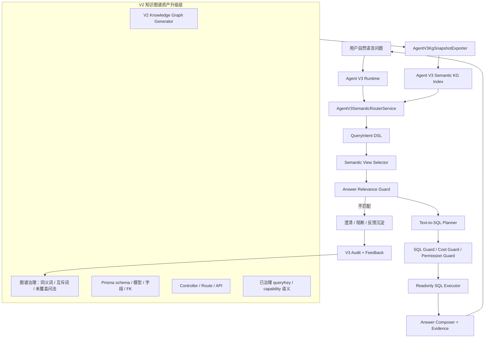

# Agent V3 基于知识图谱的独立语义路由方案

日期：2026-07-07
版本定位：Agent V3 语义路由增强方案
适用范围：Ami Aura Lite 终端 V3、server-v2 Agent V3 Text-to-SQL、Agent V2 知识图谱资产升级与迁移
核心原则：基于 Agent V2 知识图谱升级语义资产，但 Agent V3 不直接调用 V2 Runtime、V2 Manifest、V2 能力中心发布链路。

## 1. 背景与问题

Agent V3 采用纯 Text-to-SQL 路线，目标是支持自由问数和跨业务组合分析。当前已经具备：

- V3 独立运行入口；
- 受控 Text-to-SQL；
- 白名单语义视图；
- SQL Guard、字段脱敏、门店范围、只读执行、审计；
- 终端 V1/V2/V3 切换。

但实际使用中已经暴露出 Text-to-SQL 最大风险：**SQL 合法，但问题语义选错了业务对象**。

典型案例：

用户问：

```text
最近一个月最受欢迎的项目有哪几个
```

期望语义：

- 业务对象：项目 / 护理项目 / 服务项目；
- 指标：服务次数或项目销售额；
- 时间：最近一个月；
- 排序：热门排行；
- 目标视图：`agent_v3_project_service_sales_view`。

实际结果：

- 返回了 `customer_id / customer_name_masked / member_level / total_paid_amount`；
- 说明被错误路由到 `agent_v3_customer_profile_summary_view`；
- 结果不是查不出来，而是“答非所问”。

这类问题不能只靠补关键词解决。关键词补丁可以修一个问法，但换成“最近做得最多的护理项目”“本月热门服务”“哪些项目最受客户欢迎”仍可能再错。需要在 SQL 生成前增加稳定的语义路由层。

## 2. 目标

本方案目标是把 Agent V2 已建设的知识图谱资产升级为 Agent V3 可独立使用的语义路由底座，让 V3 在生成 SQL 前先回答清楚四个问题：

1. 用户问的是哪个业务对象；
2. 用户要看的指标是什么；
3. 应该使用哪个语义视图；
4. 返回字段是否和问题实体匹配。

最终产品目标：

- 用户自由提问时，优先减少“答非所问”；
- V3 不再只靠正则或样例问题做视图召回；
- 知识图谱用于理解业务语义，不直接执行工具；
- V3 保持独立版本边界，不回到 V2 Manifest/能力发布体系；
- 失败样本可以沉淀回知识图谱，而不是每次人工补硬编码。

## 3. 核心边界

### 3.1 可以复用什么

可以复用 Agent V2 已建设或沉淀的“语义资产”：

- 业务对象词典；
- 同义词；
- 互斥词；
- Prisma 模型和字段关系；
- Controller / route / endpoint 映射；
- source model 到业务对象的归属；
- 业务对象之间的关系；
- 权限码；
- 门店范围路径；
- 已治理过的 queryKey、capabilityId、manifest item 中的业务含义；
- 失败问法与人工治理记录。

### 3.2 不能直接复用什么

Agent V3 不直接调用：

- Agent V2 Orchestrator；
- Agent V2 Runtime；
- Agent V2 Manifest Provider；
- Agent V2 Tool Registry；
- Agent V2 Capability Center 发布链路；
- Agent V2 CapabilityDecisionService；
- Agent V2 已发布能力执行器。

原因：

- V3 的产品定位是纯 Text-to-SQL，不是 V2 Manifest 的另一个入口；
- 直接调用 V2 会让 V3 重新继承 V2 的能力治理、发布、工具缺口和历史债；
- V3 的故障边界、审计边界、权限边界需要独立；
- V3 要解决的是自由问数的语义路由与受控 SQL，而不是执行 V2 工具。

### 3.3 推荐复用方式

推荐方式是：

```text
Agent V2 知识图谱生成器/治理资产
  -> 生成 V3 专用语义路由快照
  -> 写入 Agent V3 独立 KG Index
  -> V3 Runtime 只读消费 V3 KG Index
```

也就是说，复用“数据和语义资产”，不复用“运行时和执行链路”。

## 4. 总体架构



## 5. V3 KG Index 的产品定位

V3 KG Index 不是运行时工具注册表，也不是能力目录。它是一个只读语义索引，帮助 V3 做三件事：

1. **识别问题实体**
   - 项目、商品、客户、员工、预约、库存、营收、退款、卡项、营销活动等。

2. **识别指标口径**
   - 受欢迎、热门、最多、排行、趋势、下降、转化、复购、沉睡、毛利、实收等。

3. **选择语义视图**
   - 把业务对象和指标映射到 V3 白名单语义视图。

示例：

| 用户表达 | 图谱归一实体 | 指标口径 | 推荐视图 |
| --- | --- | --- | --- |
| 最受欢迎的项目 | project | service_quantity ranking | `agent_v3_project_service_sales_view` |
| 销量最好的商品 | product | quantity ranking | `agent_v3_order_item_sales_view` |
| 最近3个月营业情况 | order / finance | paid_amount trend | `agent_v3_order_summary_view` |
| 哪些客户很久没来 | customer | inactivity ranking | `agent_v3_customer_profile_summary_view` |
| 报废最多的产品 | inventory / product | scrap_quantity ranking | `agent_v3_inventory_scrap_view` |

## 6. QueryIntent DSL

V3 语义路由层的输出不应该直接是 SQL，而是结构化 QueryIntent。

建议结构：

```ts
type AgentV3QueryIntent = {
  originalQuestion: string;
  normalizedQuestion: string;
  domain: 'order' | 'product' | 'project' | 'customer' | 'staff' | 'inventory' | 'reservation' | 'marketing' | 'finance' | 'card' | 'store' | 'unknown';
  entity: {
    type: string;
    canonicalName: string;
    aliases: string[];
    confidence: number;
  };
  metric: {
    type: 'amount' | 'count' | 'quantity' | 'rate' | 'trend' | 'ranking' | 'status' | 'unknown';
    canonicalName: string;
    fieldCandidates: string[];
    sortDirection?: 'asc' | 'desc';
    confidence: number;
  };
  timeRange: {
    preset?: 'today' | 'yesterday' | 'last_7_days' | 'last_30_days' | 'this_month' | 'last_month' | 'last_3_months';
    start?: string;
    end?: string;
    confidence: number;
  };
  shape: 'metric' | 'ranking' | 'trend' | 'comparison' | 'list' | 'detail' | 'unknown';
  selectedViewCandidates: Array<{
    viewName: string;
    score: number;
    reasons: string[];
  }>;
  risks: Array<'ambiguous_entity' | 'ambiguous_metric' | 'no_view' | 'permission_risk' | 'sensitive_data' | 'cross_store'>;
};
```

这层的核心价值是：即使后续 SQL 生成失败，也能清楚知道失败在“实体识别”“指标口径”“视图选择”还是“权限/字段限制”。

## 7. V2 图谱资产如何升级

### 7.1 现有 V2 图谱资产

当前 V2 图谱建设已经包含：

- Prisma schema 解析；
- 模型、字段、FK 关系；
- Controller / endpoint 关系；
- 业务对象和权限；
- 知识图谱治理页；
- 同义词、互斥词、未覆盖问法治理；
- sourceModels、fieldPolicies、storeScope 路径；
- GenericQueryEngine 使用 FK 推导门店过滤路径。

这些资产可以成为 V3 语义路由的源头。

### 7.2 升级为 V3 专用快照

新增离线导出器：

```text
AgentV3KgSnapshotExporter
```

输入：

- V2 KG generated artifacts；
- V2 图谱治理记录；
- V2 已发布/已治理能力中的业务语义；
- V3 semantic view registry；
- Prisma schema；
- API route metadata。

输出：

```text
agent-v3-semantic-kg.snapshot.json
```

快照内容：

- `businessObjects`：业务对象；
- `synonyms`：同义词；
- `mutualExclusions`：互斥关系；
- `metricVocabulary`：指标词；
- `viewBindings`：业务对象 + 指标 -> V3 semantic view；
- `fieldBindings`：指标 -> 字段候选；
- `permissionBindings`：对象/视图 -> 权限码；
- `timeFieldBindings`：对象/视图 -> 默认时间字段；
- `negativeExamples`：禁止误路由样本；
- `regressionQuestions`：回归问题集。

### 7.3 写入 V3 独立表

建议新增 V3 独立表，而不是直接读 V2 图谱表：

- `AgentV3SemanticKgSnapshot`
- `AgentV3SemanticEntity`
- `AgentV3SemanticAlias`
- `AgentV3SemanticMetric`
- `AgentV3SemanticViewBinding`
- `AgentV3SemanticRoutingExample`
- `AgentV3SemanticRoutingFeedback`

产品意义：

- V3 可独立发布、回滚、审计；
- V2 图谱升级不会直接影响 V3 线上路由；
- V3 可以有自己的置信度、负样本、回归集；
- 后续 V3 迁移或重构不被 V2 表结构绑定。

## 8. 语义路由执行流程

### 8.1 第一步：问题标准化

输入：

```text
最近一个月最受欢迎的项目有哪几个
```

标准化：

```json
{
  "normalizedQuestion": "最近30天 热门 项目 排行",
  "tokens": ["最近一个月", "受欢迎", "项目", "几个"],
  "timeRange": "last_30_days"
}
```

### 8.2 第二步：实体识别

图谱识别：

```json
{
  "entity": {
    "type": "project",
    "canonicalName": "项目",
    "aliases": ["护理项目", "服务项目", "疗程", "项目服务"],
    "confidence": 0.94
  }
}
```

负向约束：

```json
{
  "mustNotUse": ["customer_profile_summary", "staff_profile", "store_summary"]
}
```

### 8.3 第三步：指标识别

“受欢迎”不是客户字段，它需要结合实体解释：

| 实体 | “受欢迎”默认指标 |
| --- | --- |
| 项目 | 服务次数 `service_quantity` |
| 商品 | 销售数量 `quantity` |
| 营销活动 | 转化数或归因收入 |
| 员工 | 服务次数或业绩 |
| 客户 | 消费金额或到店频次 |

当前问题中：

```json
{
  "metric": {
    "canonicalName": "service_quantity",
    "type": "ranking",
    "sortDirection": "desc",
    "confidence": 0.88
  }
}
```

### 8.4 第四步：视图选择

候选视图：

```json
[
  {
    "viewName": "agent_v3_project_service_sales_view",
    "score": 0.96,
    "reasons": ["entity=project", "metric=service_quantity", "timeField=order_created_at"]
  },
  {
    "viewName": "agent_v3_project_catalog_view",
    "score": 0.42,
    "reasons": ["entity=project", "but no sales metric"]
  }
]
```

不允许出现：

```json
{
  "viewName": "agent_v3_customer_profile_summary_view",
  "reason": "question entity is project, result entity is customer"
}
```

### 8.5 第五步：生成 QueryIntent

```json
{
  "domain": "project",
  "entity": "project",
  "metric": "service_quantity",
  "shape": "ranking",
  "timeRange": "last_30_days",
  "selectedView": "agent_v3_project_service_sales_view",
  "expectedFields": ["project_id", "project_name", "service_quantity", "net_amount"],
  "sort": [{ "field": "service_quantity", "direction": "desc" }],
  "limit": 10
}
```

### 8.6 第六步：生成 SQL

Planner 只能基于 QueryIntent 生成 SQL，不再直接从原始自然语言跳 SQL。

预期 SQL 形态：

```sql
SELECT
  project_id,
  project_name,
  project_type,
  SUM(service_quantity) AS service_quantity,
  SUM(net_amount) AS net_sales_amount
FROM agent_v3_project_service_sales_view
WHERE order_created_at >= :startDate
  AND order_created_at < :endDate
GROUP BY project_id, project_name, project_type
ORDER BY service_quantity DESC, net_sales_amount DESC
LIMIT 10
```

再由 SQL Guard 注入门店范围：

```sql
AND store_id = ANY(:allowedStoreIds)
```

## 9. Answer Relevance Guard

即使 SQL Guard 通过，也不能直接回答。必须新增回答相关性校验。

### 9.1 校验规则

| 问题实体 | 结果必须包含 | 禁止主要返回 |
| --- | --- | --- |
| 项目 | `project_id` / `project_name` | `customer_id` / `customer_name_masked` |
| 商品 | `product_id` / `product_name` / `sku` | `customer_id` |
| 客户 | `customer_id` / `customer_name_masked` | 纯商品字段 |
| 员工 | `staff_id` / `staff_name` | 客户画像字段 |
| 营业情况 | `paid_amount` / `net_amount` / `order_count` | 客户列表 |

### 9.2 阻断输出

如果不匹配：

```text
当前查询计划与问题对象不匹配：问题识别为“项目排行”，但候选结果来自“客户画像”。已阻断错误回答，请选择“按服务次数排行”或“按销售额排行”。
```

产品意义：

- 宁可不答，也不答错；
- 用户知道为什么没有返回；
- 审计系统可以沉淀失败样本。

## 10. 置信度与澄清策略

### 10.1 自动执行条件

满足以下条件才自动生成 SQL：

- entity confidence >= 0.75；
- metric confidence >= 0.65；
- top view score >= 0.75；
- top view 与第二候选差值 >= 0.15；
- Answer Relevance Guard pass；
- SQL Guard pass。

### 10.2 需要澄清的情况

示例：

```text
最受欢迎的是哪些
```

这句话缺对象。不能猜客户/商品/项目，应澄清：

```text
你想看“最受欢迎的项目”“最受欢迎的商品”，还是“最受欢迎的营销活动”？
```

示例：

```text
项目表现怎么样
```

指标不明确，应澄清：

```text
你想按服务次数、销售额，还是毛利看项目表现？
```

## 11. V3 与 V2 的协作关系

### 11.1 V2 继续负责

- 知识图谱生成；
- 图谱治理；
- 同义词、互斥词治理；
- 能力中心治理；
- 已发布 Manifest 能力运行；
- 自动发布和发布审计；
- 生产能力治理看板。

### 11.2 V3 新增负责

- V3 KG Index；
- V3 Semantic Router；
- QueryIntent DSL；
- Semantic View Selector；
- Answer Relevance Guard；
- V3 Text-to-SQL Planner；
- V3 SQL 审计；
- V3 失败问法反馈。

### 11.3 数据协作方式

```text
V2 KG / Governance
  -> 离线导出
  -> V3 KG Snapshot
  -> V3 独立表
  -> V3 Runtime 只读使用
```

V3 不在线调用 V2 服务，因此：

- V2 发布异常不影响 V3 运行；
- V3 路由异常不影响 V2 能力中心；
- 两者可以独立回滚。

## 12. 失败样本沉淀机制

每次发生以下情况，都写入 `AgentV3SemanticRoutingFeedback`：

- 用户点“无用”；
- Answer Relevance Guard 阻断；
- 语义视图候选置信度低；
- SQL 执行成功但用户反馈答非所问；
- 结果字段与问题实体不匹配；
- 问题无法识别实体或指标。

沉淀字段：

```json
{
  "question": "最近一个月最受欢迎的项目有哪几个",
  "expectedEntity": "project",
  "wrongView": "agent_v3_customer_profile_summary_view",
  "expectedView": "agent_v3_project_service_sales_view",
  "wrongFields": ["customer_id", "customer_name_masked"],
  "expectedFields": ["project_id", "project_name", "service_quantity"],
  "resolution": "add_alias_and_negative_example",
  "status": "pending_governance"
}
```

治理后生成：

- KG alias；
- negative example；
- regression test case；
- view binding rule。

## 13. 数据模型建议

### 13.1 AgentV3SemanticKgSnapshot

用途：记录一次 V3 KG 快照版本。

字段建议：

- `id`
- `version`
- `sourceV2KgVersion`
- `snapshotJson`
- `statsJson`
- `status`
- `createdAt`
- `activatedAt`

### 13.2 AgentV3SemanticEntity

用途：业务实体归一化。

字段建议：

- `id`
- `snapshotId`
- `entityType`
- `canonicalName`
- `domain`
- `description`
- `sourceModel`
- `status`

### 13.3 AgentV3SemanticAlias

用途：实体同义词、指标同义词。

字段建议：

- `id`
- `entityId`
- `alias`
- `aliasType`
- `confidence`
- `source`

### 13.4 AgentV3SemanticMetric

用途：指标归一化。

字段建议：

- `id`
- `domain`
- `canonicalMetric`
- `aliasesJson`
- `fieldCandidatesJson`
- `defaultSort`
- `defaultAggregation`

### 13.5 AgentV3SemanticViewBinding

用途：实体 + 指标到语义视图绑定。

字段建议：

- `id`
- `entityType`
- `metric`
- `viewName`
- `timeField`
- `storeScopeField`
- `requiredFieldsJson`
- `forbiddenFieldsJson`
- `requiredPermissionsJson`
- `confidence`

### 13.6 AgentV3SemanticRoutingExample

用途：正负样本。

字段建议：

- `id`
- `question`
- `expectedEntity`
- `expectedMetric`
- `expectedView`
- `forbiddenViewsJson`
- `source`
- `status`

## 14. API 与治理入口

### 14.1 调试接口

新增：

```text
POST /api/agent-v3/semantic-router/inspect
```

输入：

```json
{
  "question": "最近一个月最受欢迎的项目有哪几个",
  "storeId": 1
}
```

输出：

```json
{
  "intent": {},
  "entityCandidates": [],
  "metricCandidates": [],
  "viewCandidates": [],
  "selectedView": "agent_v3_project_service_sales_view",
  "blocked": false,
  "reasons": []
}
```

### 14.2 快照接口

新增：

```text
GET /api/agent-v3/semantic-router/snapshots
POST /api/agent-v3/semantic-router/snapshots/generate
POST /api/agent-v3/semantic-router/snapshots/:id/activate
```

### 14.3 反馈接口

新增：

```text
GET /api/agent-v3/semantic-router/feedback
POST /api/agent-v3/semantic-router/feedback/:id/resolve
```

## 15. 管理端产品表现

在 Agent 治理台新增 V3 语义路由视角：

1. **语义路由概览**
   - 今日 V3 问题数；
   - 自动路由成功率；
   - 低置信度问题数；
   - 答非所问阻断数；
   - 用户无用反馈数。

2. **问题路由详情**
   - 原始问题；
   - 识别实体；
   - 识别指标；
   - 候选视图；
   - 被选视图；
   - SQL Guard 结果；
   - Answer Relevance Guard 结果。

3. **待治理样本**
   - 错误视图；
   - 期望视图；
   - 建议新增同义词；
   - 建议新增负样本；
   - 一键生成回归用例。

4. **V3 KG 快照**
   - 当前 active 版本；
   - 来源 V2 KG 版本；
   - 实体数量；
   - 同义词数量；
   - view binding 数量；
   - 负样本数量。

## 16. 分阶段实施计划

### 阶段 1：修复当前答非所问缺口

目标：先把“项目受欢迎”这类问题拦住并路由正确。

开发内容：

- 新增 `AgentV3SemanticRouterService` 雏形；
- 基于当前 registry 增加 entity / metric / view binding；
- 增加项目类问法路由；
- 增加 Answer Relevance Guard；
- 增加单测：
  - “最近一个月最受欢迎的项目有哪几个” -> `agent_v3_project_service_sales_view`;
  - “本月销量最好的商品” -> `agent_v3_order_item_sales_view`;
  - “哪些客户很久没来” -> `agent_v3_customer_profile_summary_view`;
  - 问项目但返回客户字段时阻断。

验收标准：

- 当前截图问题不再返回客户表；
- 至少 20 条高频问法路由正确；
- 错误视图不允许进入回答。

### 阶段 2：V2 KG 导出到 V3 KG Snapshot

目标：让 V3 不再靠手写 registry 规则。

开发内容：

- 新增 `AgentV3KgSnapshotExporter`；
- 从 V2 KG generated artifacts、同义词治理、互斥治理、未覆盖问法治理导出 V3 快照；
- 生成 `agent-v3-semantic-kg.snapshot.json`；
- 增加快照结构校验；
- 增加快照差异报告。

验收标准：

- V3 快照可生成；
- 覆盖 P0 业务对象；
- 每个 enabled semantic view 至少有 entity binding 和 metric binding；
- 快照不包含 V2 runtime/tool 依赖。

### 阶段 3：V3 独立表与激活机制

目标：V3 Runtime 从 DB active 快照读取语义路由资产。

开发内容：

- 新增 Prisma migration；
- 新增 V3 KG Index 表；
- 支持导入、激活、回滚；
- V3 Router 默认读取 active snapshot；
- active 缺失时 fallback 到内置最小 registry，但标记 `source=local_fixture`。

验收标准：

- DB active 快照可读；
- 无 active 时不会误报生产就绪；
- 快照激活不影响 V2。

### 阶段 4：LLM + KG 混合路由

目标：从关键词规则升级为 KG 约束下的结构化 LLM 路由。

开发内容：

- LLM 输出 QueryIntent；
- KG 提供候选实体、指标、视图和负样本；
- LLM 只能在候选集合内选择，不能自由编造表名字段；
- Router 对 LLM 输出做 schema validation 和 KG validation；
- LLM 失败时 fallback KG deterministic router。

验收标准：

- LLM 不能输出未登记视图；
- LLM 不能绕过字段和权限；
- 低置信度触发澄清；
- 100 条回归问法稳定通过。

### 阶段 5：反馈闭环与自动治理

目标：让“答非所问”样本自动进入治理，而不是靠人工重复排查。

开发内容：

- V3 feedback -> semantic routing feedback；
- 自动建议 alias / negative example / view binding；
- 管理端一键确认；
- 自动生成 regression case；
- 每次 build 跑 V3 routing regression。

验收标准：

- 用户点“无用”后可在治理台看到路由诊断；
- 能生成建议修复项；
- 修复后进入自动回归。

## 17. 测试计划

### 17.1 后端单测

新增：

```text
agent-v3-semantic-router.service.spec.ts
agent-v3-query-intent.service.spec.ts
agent-v3-answer-relevance-guard.service.spec.ts
agent-v3-kg-snapshot-exporter.spec.ts
agent-v3-semantic-routing-regression.spec.ts
```

覆盖：

- 项目热门问法；
- 商品销量问法；
- 客户沉睡问法；
- 门店经营问法；
- 员工人效问法；
- 营销转化问法；
- 低置信度澄清；
- 负样本阻断；
- V3 不 import V2 Runtime/Manifest/Tool Registry。

### 17.2 集成测试

覆盖链路：

```text
question -> semantic router -> QueryIntent -> selected view -> SQL -> Guard -> answer relevance -> answer
```

关键断言：

- 问“项目”不能返回客户主字段；
- 问“商品”不能返回项目主字段；
- 问“客户”不能返回纯商品排行；
- 问“营业情况”不能返回客户画像列表；
- SQL 仍然只能访问 V3 白名单视图。

### 17.3 回归问题集

首批至少 30 条：

| 问题 | 期望视图 |
| --- | --- |
| 最近一个月最受欢迎的项目有哪几个 | `agent_v3_project_service_sales_view` |
| 本月做得最多的护理项目 | `agent_v3_project_service_sales_view` |
| 最近30天项目销售额排行 | `agent_v3_project_service_sales_view` |
| 本月销量最好的商品 | `agent_v3_order_item_sales_view` |
| 最近30天销售额最高的商品 | `agent_v3_order_item_sales_view` |
| 最近3个月门店营业情况如何 | `agent_v3_order_summary_view` |
| 上个月营业额 | `agent_v3_order_summary_view` |
| 最近哪些客户很久没来 | `agent_v3_customer_profile_summary_view` |
| 退款率为什么升高 | `agent_v3_payment_refund_view` |
| 最近30天报废的产品有哪些 | `agent_v3_inventory_scrap_view` |

## 18. 风险与控制

### 风险 1：V3 又变成 V2 的变体

控制：

- V3 只读消费快照；
- 禁止 import V2 runtime/tool/manifest；
- CI 增加依赖扫描；
- 文档明确边界。

### 风险 2：LLM 路由仍然幻觉

控制：

- LLM 只能在 KG 候选内选择；
- schema validation；
- KG validation；
- answer relevance guard；
- 低置信度澄清。

### 风险 3：图谱更新影响线上结果

控制：

- 快照版本化；
- 激活机制；
- 回滚机制；
- 快照差异报告；
- 激活前 routing regression。

### 风险 4：规则越来越多难维护

控制：

- 规则沉淀为 KG alias、metric、view binding、negative example；
- 不把所有问题写成 if/else；
- 高频失败样本进入治理台；
- 自动生成回归。

## 19. 成功标准

### 产品成功标准

- 高频自由问数不再明显答非所问；
- 用户问项目、商品、客户、员工、库存时，返回对象符合问题；
- 无法判断时会澄清，不乱答；
- 答案里能解释“为什么选这个数据源”。

### 技术成功标准

- V3 Semantic Router 独立存在；
- V3 KG Index 独立表和快照版本可用；
- V3 不直接调用 V2 Runtime/Manifest/Tool Registry；
- SQL Guard、只读执行、权限、字段脱敏仍生效；
- routing regression 进入 CI。

### 验收成功标准

- “最近一个月最受欢迎的项目有哪几个”命中 `agent_v3_project_service_sales_view`；
- 结果包含 `project_name/service_quantity/net_sales_amount`；
- 不再返回 `customer_id/customer_name_masked/member_level`；
- 管理端审计可看到 QueryIntent、视图候选和路由原因；
- 用户反馈可进入 V3 语义治理闭环。

## 20. 推荐结论

采纳“基于 Agent V2 知识图谱升级，再独立开发 Agent V3 使用”的方案。

关键判断：

- V2 知识图谱的价值在“业务语义资产”，不是 V2 Runtime；
- V3 应该复用图谱资产，但必须独立成 V3 KG Index；
- V3 的 Text-to-SQL 不应直接从自然语言生成 SQL，而应先生成 QueryIntent；
- Answer Relevance Guard 是防止答非所问的硬门禁；
- 当前“项目受欢迎返回客户表”的问题，应作为首个 P0 回归样本。

最优开发顺序：

1. 先补 V3 Semantic Router 雏形和 Answer Relevance Guard；
2. 修复项目/商品/客户/营业四类高频路由；
3. 再做 V2 KG -> V3 KG Snapshot 导出；
4. 最后引入 LLM + KG 混合路由和治理台反馈闭环。
