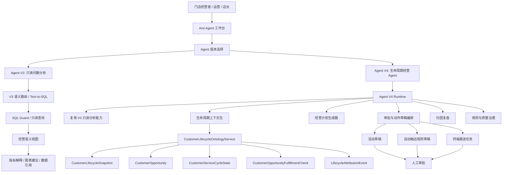

# Agent V4 基于客户全生命周期服务营销小本体升级详细方案

> 日期：2026-07-08
> 范围：Ami Agent / Agent V3 / 客户全生命周期服务营销小本体 / 营销经营计划
> 结论：不再把客户全生命周期服务营销小本体直接塞进 Agent V3，而是保留 Agent V3 作为稳定的只读问数分析版本，基于 V3 的查询、语义视图和安全能力，扩展开发独立的 Agent V4。

## 1. 调整后的产品定位

原方案是“Agent V3 接入客户全生命周期服务营销小本体”。这个做法能快速增强 V3，但会让 V3 的边界变复杂：既要做自然语言问数，又要做经营诊断、营销计划、审批动作和归因复盘，后续版本治理会变重。

新的方案改为：

- Agent V3 保留：定位为受控、可审计、只读的 Text-to-SQL / 数据分析 Agent。
- Agent V4 新增：定位为基于客户生命周期小本体的经营决策与营销编排 Agent。
- V4 复用 V3 的底座能力，但独立 runtime、独立 API、独立页面入口、独立审批和质量治理。
- V4 默认只能生成建议、计划、草稿和审批单，不直接发券、不直接群发、不改客户资产、不扣库存、不创建订单。

### 版本边界

| 版本 | 核心定位 | 主要能力 | 是否保留 | 是否直接接入生命周期本体 |
| --- | --- | --- | --- | --- |
| Agent V2 | 稳定工具型 Agent | 固定技能、自动化、审批流、业务工具调用 | 保留 | 不作为主接入口 |
| Agent V3 | 只读问数分析 Agent | Text-to-SQL、语义路由、安全 SQL、数据解释、图表建议 | 保留 | 只读取生命周期语义视图，不承接动作编排 |
| Agent V4 | 生命周期经营 Agent | 客户生命周期诊断、机会识别、经营计划、审批动作、归因复盘 | 新增 | 主接入口 |

## 2. 为什么要独立做 Agent V4

### 2.1 优势

1. 版本边界更清楚
   V3 继续做“问数据、查趋势、解释指标”，V4 做“诊断客户生命周期、生成经营动作、审批执行”。这样 V3 不会因为营销编排变复杂而影响原有问数稳定性。

2. 风险隔离更好
   生命周期本体会接触客户资产、营销触达、库存、产能、归因、审批。独立 V4 可以单独加权限、审计、审批和动作白名单，不污染 V3 的只读安全边界。

3. 产品表达更清晰
   面向门店经营者时，V4 可以直接叫“经营 Agent”或“生命周期经营助手”，不是“问数助手里加一个营销功能”。用户理解成本更低。

4. 工程演进更稳
   V4 可以复用 V3 的语义路由、SQL Guard、语义视图、答案生成和反馈机制，同时新增生命周期上下文包、计划生成、审批动作和归因复盘，不需要重写 V3。

5. 便于后续商业化
   V3 可以作为数据分析能力，V4 可以作为更高阶的经营增长能力。版本能力和定价边界更容易拆。

### 2.2 代价

1. 短期会多一条 runtime 和 API 线
   需要新增 `agent-v4` 模块、类型、页面入口和测试，不是只在 V3 里加 prompt。

2. 需要做好 V3/V4 的能力复用边界
   V4 可以调用 V3 的只读分析服务，但不能直接复制一套 SQL 生成逻辑，避免后续两边分叉。

3. UI 上要避免用户困惑
   需要在 Ami Agent 里明确区分“数据分析 V3”和“经营计划 V4”，否则用户会不知道该选哪个。

## 3. Agent V4 的能力目标

Agent V4 的目标不是替代营销推荐页，也不是替代生命周期小本体服务，而是在两者之上提供自然语言经营入口。

### 3.1 V4 能回答的问题

- 本周哪些客户最应该触达？为什么？
- 哪些客户进入护理周期到期、次卡到期、沉睡召回、领券未核销、浏览未预约？
- 哪些服务项目有复购机会？库存和产能能不能承接？
- 本周应该做哪几个营销动作？目标客户是谁？预计收益和风险是什么？
- 某个活动触达后，到底有没有带来点击、预约、核销、订单、库存消耗或排期填充？
- 为什么某个推荐不建议直接执行？
- 哪些规则版本命中率低、字段覆盖不足或归因不完整？

### 3.2 V4 不能直接做的事

- 不直接发券。
- 不直接群发短信、微信、小程序消息。
- 不直接改客户会员卡、权益、余额、积分。
- 不直接扣库存。
- 不直接创建订单。
- 不直接改排班。
- 不绕过审批创建正式活动或自动规则。

V4 只允许生成：

- 经营诊断。
- 生命周期机会解释。
- 周经营计划。
- 活动草稿。
- 自动触达规则草稿。
- 终端跟进任务草稿。
- 审批申请。
- 归因复盘报告。

## 4. 总体架构



## 5. 分层接入方案

### 5.1 第一层：复用 Agent V3 的只读数据能力

V4 不重新发明 Text-to-SQL。V4 可以把以下能力作为内部只读工具调用：

- 自然语言意图识别。
- 指标和维度语义映射。
- SQL Guard。
- 只读查询执行。
- 数据引用和解释。
- 图表建议。
- 问答审计和反馈。

V4 使用方式：

- 当用户问“为什么这批客户被推荐”时，V4 先查生命周期机会，再调用 V3 只读分析能力补充数据解释。
- 当用户问“最近 30 天沉睡客户召回效果如何”时，V4 先定位生命周期机会和归因事件，再用 V3 查询成交、预约、核销等指标。
- 当用户问“本周该做什么”时，V4 不只返回 SQL 结果，而是生成经营计划和审批动作。

### 5.2 第二层：接入生命周期小本体上下文

V4 新增生命周期上下文包，来源于 P0/P1/P2 已建设的轻量持久化表：

- `CustomerLifecycleSnapshot`：客户生命周期阶段、LTV 分层、流失风险、触达疲劳、证据。
- `CustomerLifecycleEvent`：生命周期阶段变化流水。
- `CustomerOpportunity`：客户级机会。
- `CustomerServiceCycleState`：客户-项目维度服务周期状态。
- `CustomerOpportunityFulfillmentCheck`：库存和产能承接校验。
- `LifecycleAttributionEvent`：触达、行为、预约、核销、订单、库存消耗、排期填充归因链。
- `CustomerLifecycleRuleVersion`：规则版本。
- `CustomerLifecycleQualitySnapshot`：质量快照。
- `LifecycleBusinessPlan`：经营计划。

V4 的回答必须带结构化证据，不能只给自然语言：

```ts
type AgentV4EvidencePack = {
  lifecycleStages: string[];
  opportunityTypes: string[];
  customerCount: number;
  topCustomers: Array<{
    customerId: string;
    customerName?: string;
    lifecycleStage?: string;
    opportunityTypes: string[];
    evidence: Record<string, unknown>;
  }>;
  fulfillment?: {
    inventoryReady: boolean;
    capacityReady: boolean;
    riskWarnings: string[];
  };
  attribution?: {
    touchCount: number;
    clickCount: number;
    reservationCount: number;
    orderCount: number;
    revenueAmount?: number;
  };
  dataQuality?: {
    fieldCoverageRate?: number;
    attributionCompletenessRate?: number;
    ruleHitRate?: number;
  };
};
```

### 5.3 第三层：经营计划与审批动作

V4 生成经营计划，但执行动作必须走审批。

经营计划结构：

```ts
type AgentV4BusinessPlan = {
  id: string;
  storeId: string;
  periodStart: string;
  periodEnd: string;
  objective: string;
  summary: string;
  targetMetrics: Array<{
    metric: string;
    baseline?: number;
    target?: number;
    unit?: string;
  }>;
  recommendedActions: Array<{
    actionType: 'campaign_draft' | 'automation_rule_draft' | 'terminal_followup_task';
    title: string;
    opportunityType: string;
    targetCustomerCount: number;
    recommendedChannels: string[];
    recommendedOffer?: Record<string, unknown>;
    riskControls: string[];
    evidence: Record<string, unknown>;
  }>;
  approvalStatus: 'draft' | 'submitted' | 'approved' | 'rejected' | 'executed';
};
```

审批边界：

- V4 可以提交审批。
- 审批通过后，只创建活动草稿、自动规则草稿或终端跟进任务。
- 正式发布、群发、发券、改资产、扣库存仍由对应业务系统完成。

## 6. 后端实现方案

### 6.1 新增模块

新增：

```text
packages/server-v2/src/agent-v4/
  agent-v4.module.ts
  agent-v4.controller.ts
  agent-v4.service.ts
  agent-v4-runtime.service.ts
  agent-v4-context.service.ts
  agent-v4-planner.service.ts
  agent-v4-approval.service.ts
  agent-v4-attribution.service.ts
  dto/
  types/
```

V4 模块依赖：

- `AgentV3Module` 或 V3 内部只读分析服务。
- `MarketingModule`。
- `CustomerLifecycleOntologyService`。
- `MarketingAttributionService`。
- `AgentAutomationService` / 审批能力。
- Prisma。

原则：

- V4 不复制 V3 SQL 生成逻辑。
- V4 调用 V3 时只能走只读接口。
- V4 写入只允许写 Agent 运行记录、经营计划、审批单、草稿动作关联，不写订单、库存、客户资产。

### 6.2 API 设计

新增 V4 API：

```http
POST /agent-v4/runs
POST /agent-v4/runs/:id/messages
GET  /agent-v4/runs
GET  /agent-v4/runs/:id
POST /agent-v4/business-plans
GET  /agent-v4/business-plans
GET  /agent-v4/business-plans/:id
POST /agent-v4/business-plans/:id/submit-actions
GET  /agent-v4/lifecycle/context
GET  /agent-v4/lifecycle/attribution
GET  /agent-v4/lifecycle/quality
```

继续复用生命周期 API：

```http
POST /marketing/lifecycle/rebuild
GET  /marketing/lifecycle/opportunities
GET  /marketing/lifecycle/customers/:id
GET  /marketing/lifecycle/service-cycles
GET  /marketing/lifecycle/opportunities/:id/fulfillment
GET  /marketing/lifecycle/attribution
GET  /marketing/lifecycle/quality
GET  /marketing/lifecycle/rules
POST /marketing/lifecycle/rules
POST /marketing/lifecycle/rules/:id/publish
POST /marketing/lifecycle/rules/:id/rollback
```

### 6.3 Runtime 调度

V4 请求流程：

1. 识别用户意图：
   - 数据分析类：转给 V3 只读分析。
   - 生命周期诊断类：读取生命周期上下文包。
   - 经营计划类：调用计划生成器。
   - 动作创建类：生成草稿或审批请求。
   - 归因复盘类：读取归因链和质量快照。

2. 构建上下文：
   - 门店、时间范围、目标客群。
   - 生命周期阶段和机会。
   - 库存/产能承接状态。
   - 历史触达和归因效果。
   - 当前规则版本和质量指标。

3. 生成回答：
   - 必须包含结论。
   - 必须包含结构化证据。
   - 涉及动作时必须包含风险控制和审批状态。

4. 写入审计：
   - 运行记录。
   - 使用的数据源。
   - 推荐动作。
   - 审批状态。
   - 后续归因关联。

## 7. 前端实现方案

### 7.1 Ami Agent 入口

在 Ami Agent 工作台保留版本选择：

- Agent V2：稳定工具型。
- Agent V3：数据分析 / 问数。
- Agent V4：生命周期经营。

V3 页面不改主体验，只增加“可查看生命周期指标”的语义能力。

V4 新增独立体验：

- 经营问题输入框。
- 生命周期诊断卡。
- 本周经营计划卡。
- 推荐动作审批卡。
- 归因复盘卡。
- 规则质量提示卡。

### 7.2 V4 卡片组件

新增或扩展组件：

```text
src/app/pages/ami-agent/components/
  AgentV4LifecycleDiagnosisCard.tsx
  AgentV4OpportunityPlanCard.tsx
  AgentV4ApprovalActionCard.tsx
  AgentV4AttributionReplayCard.tsx
  AgentV4QualityCard.tsx
```

卡片显示原则：

- 不用大段解释代替证据。
- 每个推荐动作必须展示目标客户数、机会类型、证据、库存/产能状态、风险提示、审批状态。
- 已生成草稿或审批的动作要显示承接状态。

### 7.3 与现有页面关系

V4 不替代以下页面：

- 智能推荐页：继续展示推荐卡和执行入口。
- 客户资料页：继续展示单客户生命周期。
- 客户画像页：继续展示预测和分群。
- 本体治理/质量页：继续展示规则和质量。

V4 是自然语言入口，把这些页面的能力组织成经营对话和计划。

## 8. 数据与权限边界

### 8.1 权限建议

新增权限：

```text
core:agent-v4:use
core:agent-v4:plan
core:agent-v4:submit-approval
core:agent-v4:read-attribution
core:agent-v4:manage-rules
```

权限映射：

- 店长：可使用 V4、生成计划、提交审批。
- 运营：可使用 V4、查看归因、创建草稿。
- 系统管理员：可管理规则版本和质量看板。
- 普通员工：默认不可使用 V4 经营计划能力，只能查看被下发的跟进任务。

### 8.2 写入白名单

V4 可写：

- Agent 运行记录。
- 经营计划。
- 审批申请。
- 活动草稿。
- 自动规则草稿。
- 终端跟进任务。
- 推荐事件。

V4 禁止写：

- 正式订单。
- 库存扣减。
- 客户会员卡资产。
- 客户余额、积分、权益。
- 正式群发记录。
- 正式发券记录。
- 排班修改。

## 9. 分阶段开发计划

### P0：V4 独立壳与 V3 能力复用

目标：V4 可以独立启动、独立请求、独立审计，并复用 V3 的只读问数能力。

任务：

- 新增 `agent-v4` 后端模块。
- 新增 V4 run/message API。
- 新增 V4 前端入口和版本选择。
- 接入 V3 只读分析工具。
- 输出基础回答结构：结论、证据、下一步建议。
- 明确 V3/V4 runtime 不互相覆盖。

验收：

- Agent V3 原有问数能力不受影响。
- Agent V4 能回答只读数据问题，并标记为 V4 会话。
- V4 的写操作白名单为空或只写 run 审计。

### P1：生命周期诊断能力

目标：V4 能基于客户生命周期小本体回答经营诊断问题。

任务：

- 接入 `CustomerLifecycleSnapshot`、`CustomerOpportunity`、`CustomerServiceCycleState`。
- 生成生命周期上下文包。
- 支持五类 P0 机会和 P1 项目服务周期机会：
  - `care_cycle_due`
  - `card_expiring`
  - `dormant_winback`
  - `coupon_claimed_unused`
  - `browse_abandonment`
  - `project_cycle_due`
  - `homecare_bundle`
  - `service_upgrade`
  - `project_idle_capacity`
  - `inventory_clearance`
- 回答必须包含目标客户数、机会类型、证据摘要和建议动作。

验收：

- V4 能回答“本周哪些客户该触达”。
- V4 能解释“为什么推荐这些客户”。
- 无生命周期数据时，能提示先运行预测或重建生命周期本体，不空白。

### P2：经营计划与审批动作

目标：V4 能生成周经营计划，并把动作提交到审批或草稿，不直接执行。

任务：

- 接入 `LifecycleBusinessPlan`。
- 生成周经营计划。
- 每个动作关联机会、证据、库存/产能承接状态和风险控制。
- 支持提交三类动作：
  - 活动草稿。
  - 自动触达规则草稿。
  - 终端跟进任务。
- 接入现有 Agent 审批能力。

验收：

- V4 能生成“本周经营计划”。
- 计划能拆出 3 类待审批动作。
- 审批前不创建正式活动、不群发、不发券。
- 审批后只创建草稿或跟进任务。

### P3：归因复盘、质量治理与规则治理

目标：V4 能解释动作效果，并对规则和数据质量给出治理建议。

任务：

- 接入 `LifecycleAttributionEvent`。
- 接入 `CustomerLifecycleQualitySnapshot`。
- 接入 `CustomerLifecycleRuleVersion`。
- 支持按经营计划、推荐动作、机会类型复盘：
  - 触达。
  - 点击/行为。
  - 预约。
  - 核销。
  - 订单。
  - 库存消耗。
  - 排期填充。
- 支持规则命中率、字段覆盖率、归因完整率解释。
- 只能建议规则调整；规则发布/回滚仍走治理接口和权限。

验收：

- V4 能回答“上周沉睡召回效果如何”。
- V4 能指出归因断点。
- V4 能解释某条规则为什么命中率低。
- V4 不自动发布或回滚规则。

## 10. 测试计划

### 后端

```powershell
npm.cmd --prefix packages/server-v2 run db:generate
npm.cmd --prefix packages/server-v2 run test -- agent-v4.service.spec.ts --runInBand
npm.cmd --prefix packages/server-v2 run test -- marketing.service.spec.ts --runInBand
npm.cmd --prefix packages/server-v2 run build
```

覆盖：

- V4 runtime 不影响 V3。
- V4 只读问题走 V3 分析能力。
- 生命周期诊断能返回结构化证据。
- 无生命周期数据时返回可解释空态。
- 经营计划生成正确关联机会和承接校验。
- 提交动作只生成草稿/审批，不执行高风险写入。
- 归因复盘能串起触达、行为、预约、订单和库存/排期证据。

### 前端

```powershell
npx.cmd vitest run src/test/api.test.ts
npm.cmd run build
```

覆盖：

- API facade 导出。
- Agent 版本选择。
- V4 卡片渲染。
- 生命周期证据空态。
- 审批动作状态展示。

### 业务验收

- V3 仍可独立问数。
- V4 能生成客户生命周期诊断。
- V4 能生成本周经营计划。
- V4 能提交活动草稿、自动规则草稿、终端跟进任务。
- V4 不直接发券、不群发、不改资产、不扣库存、不创建订单。
- V4 能复盘触达后的预约、核销、订单、库存消耗或排期填充证据。

## 11. 与现有生命周期 P0/P1/P2 的关系

生命周期小本体仍是业务事实层，Agent V4 是智能交互层。

| 能力 | 生命周期小本体 | Agent V4 |
| --- | --- | --- |
| 客户阶段计算 | 负责 | 读取并解释 |
| 机会生成 | 负责 | 读取、排序、组合成经营动作 |
| 库存/产能校验 | 负责 | 解释风险和承接状态 |
| 归因事件聚合 | 负责 | 复盘和解释效果 |
| 规则版本治理 | 负责 | 给出建议，不绕过治理 |
| 经营计划 | 提供数据支撑 | 生成计划和审批动作 |

当前 P1/P2 生命周期表已经按轻量持久化路线设计，V4 只需要兼容不同环境的迁移状态：开发和演示库可直接使用；测试、生产环境如果尚未执行 migration，V4 需要返回“生命周期数据未准备”的可解释空态。

## 12. 关键取舍结论

1. 不建议继续把生命周期经营能力直接并入 Agent V3。
   V3 的价值是稳定、只读、可审计的数据分析；强行承接经营动作会拉高风险。

2. 建议把 V4 定义为“基于 V3 数据底座 + 生命周期小本体 + 审批编排”的独立经营 Agent。
   这样既复用 V3，又不会破坏 V3 的版本边界。

3. V4 首版不要追求自动执行。
   应先把诊断、计划、草稿、审批、归因打通，再考虑更高自动化。

4. V4 的核心验收不是“能聊天”，而是“能拿证据生成可审批的经营动作，并能回看效果”。
   这才是客户全生命周期服务营销小本体对 Agent 的真实增益。

## 13. 本轮 P0-P3 开发完成记录

本轮已按“保留 Agent V3，独立扩展 Agent V4”的口径完成全量开发：

- 新增后端 `agent-v4` 独立模块，提供 `/agent-v4/runs`、追加消息、列表和详情接口，所有 V4 运行写入 `AgentRun.agentCode = agent_v4`。
- V4 orchestrator 已支持生命周期诊断、V3 只读问数复用、经营计划生成、经营计划审批提交、归因复盘、规则与质量解释。
- 生命周期经营计划提交审批已支持 `sourceAgentCode/sourceRunId/sourceEntrypoint`，从 V4 发起时审批 run 关联 `agent_v4`；直接营销入口仍兼容原默认 `lifecycle_business_agent`。
- 管理端 Ami Agent 工作台已扩展 V1/V2/V3/V4 运行模式，V4 模式下“生成本周经营计划”通过 V4 对话链路触发，不再绕过 Agent runtime。
- Ami Aura 终端已扩展 `agent_v4` 运行模式、顶部切换、runtime adapter、micro app context 和消息架构标签。
- 未新增 Prisma 表，未执行真实数据库 migration；V4 复用现有 Agent runtime 表和客户生命周期 P0/P1/P2 表。

已验证：

```powershell
npm.cmd --prefix packages/server-v2 run test -- agent-v4-orchestrator.service.spec.ts customer-lifecycle-ontology.service.spec.ts agent-v3-orchestrator.service.spec.ts --runInBand
npx.cmd vitest run src/test/api.test.ts src/app/pages/ami-agent/AmiAgentWorkspace.test.tsx
npx.cmd vitest run packages/Ami-Aura-Lite-Kiosk/src/app/services/auraCoreService.auth.test.ts packages/Ami-Aura-Lite-Kiosk/src/app/microApps/runMicroApp.test.ts
npm.cmd --prefix packages/server-v2 run build
npm.cmd run build
```
