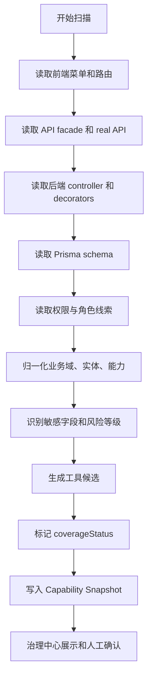

# Agent V6 Ami Core Capability Scanner 详细设计

版本：v1.0
日期：2026-07-09
依据：《Agent V6 完全独立经营管理 Agent 需求文档-2026-07-09.md》
边界：Scanner 是 Agent V6 的独立能力发现器，只扫描 Ami Core 的业务表面和元数据，不复用历史 Agent 能力目录。

## 1. 设计目标

Capability Scanner 的目标是把 Ami Core 的菜单、路由、API、权限、schema、业务对象和可执行动作扫描成结构化能力地图，让 Agent V6 知道：

- 哪些业务域存在。
- 哪些数据可读、哪些动作可写。
- 每个能力需要什么权限和门店范围。
- 每个字段是否敏感。
- 哪些接口可以封装成工具。
- 哪些能力因为缺口径、缺权限、缺 schema 或风险过高不能接入。

P0 只做只读扫描和候选生成，不自动启用写工具。

## 2. 扫描输入

Scanner P0 输入分为 6 类：

| 输入源 | 路径/来源 | 读取内容 | P0 用途 |
| --- | --- | --- | --- |
| 前端路由 | `src/app/routes.tsx` | path、permission、页面组件 | 识别管理端能力入口 |
| 前端菜单 | `src/app/components/Layout.tsx` | 菜单分组、标题、path、permission | 建立业务域和用户可见入口 |
| API facade | `src/api/*.ts`、`src/api/real/*.ts` | 前端调用方法、URL、参数 | 识别可接入 API |
| 后端 controller | `packages/server-v2/src/**/*.controller.ts` | HTTP method、path、permission、DTO | 识别后端能力 |
| Prisma schema | `packages/server-v2/prisma/schema.prisma` | model、field、relation、enum | 识别实体和关系 |
| 权限与角色 | role/user/auth 相关服务和 seed | permission code、role、store scope | 识别权限策略 |

P1/P2 可扩展输入：

- Swagger/OpenAPI 文档。
- 运行日志和真实调用频率。
- 业务事件、任务、审批、通知。
- Kiosk、小程序、营销 H5 的接口契约。

## 3. 扫描输出

每次扫描生成一个 `AgentV6CapabilitySnapshot`，快照下包含多条 `AgentV6CapabilityItem`。

### 3.1 Snapshot

```json
{
  "id": "cap_snapshot_20260709_001",
  "source": "repo_static_scan",
  "status": "completed",
  "startedAt": "2026-07-09T10:00:00.000Z",
  "finishedAt": "2026-07-09T10:00:15.000Z",
  "summary": {
    "domains": 12,
    "entities": 48,
    "routes": 96,
    "apiCandidates": 140,
    "toolCandidates": 64,
    "blockedItems": 18
  },
  "warnings": []
}
```

### 3.2 Capability Item

```json
{
  "domain": "inventory",
  "name": "库存预警查询",
  "entity": "Product",
  "sourceType": "route+controller+schema",
  "sourceRefs": [
    "src/app/routes.tsx:/inventory/stock",
    "packages/server-v2/src/inventory/inventory.controller.ts",
    "packages/server-v2/prisma/schema.prisma:model Product"
  ],
  "readCapability": {
    "enabled": true,
    "operations": ["list", "summary", "detail"]
  },
  "writeCapability": {
    "enabled": false,
    "reason": "P0 forbids inventory write tools"
  },
  "permissionPolicy": {
    "requiredPermissions": ["core:inventory:stock"],
    "storeScoped": true,
    "sensitiveFields": ["costPrice", "supplierId"]
  },
  "riskLevel": "L0",
  "toolCandidate": {
    "name": "inventory.lowStock.list",
    "status": "candidate",
    "requiresHumanReview": true
  },
  "coverageStatus": "connectable",
  "owner": "inventory"
}
```

## 4. 业务域映射

Scanner 不按文件夹名直接判断业务含义，而按菜单、路由、权限、API 和 schema 交叉归类。

| V6 领域 | 前端路径线索 | 权限线索 | Schema 线索 |
| --- | --- | --- | --- |
| 客户经营 | `/customers/*` | `core:customer:*` | `Customer`、`CustomerPredictionSnapshot` |
| 预约到店 | `/stores/reservations`、`/stores/scheduling` | `core:store:reservations` | `Reservation`、`ServiceTask` |
| 服务履约 | `/orders/card-usage` | `terminal:service:view` | `CardUsageRecord`、`ServiceTask` |
| 会员资产 | `/finance/member-assets`、`/orders/member-cards` | `core:prepaid-liability:view` | `CustomerCard`、`CustomerBalanceAccount` |
| 收银财务 | `/orders/*`、`/finance/*` | `core:finance:view` | `ProductOrder`、`PaymentRecord`、`RefundRecord` |
| 库存供应链 | `/inventory/*`、`/supply-platform` | `core:inventory:*`、`core:supply:view` | `Product`、`StockBatch`、`StockMovement` |
| 营销增长 | `/customer-marketing/*` | `core:marketing:*` | `MarketingActivity`、`MarketingAutomationTouch` |
| 员工人效 | `/stores/beauticians`、`/finance/staff-commission` | `core:store:beauticians`、`core:finance:view` | `Beautician`、`CommissionRecord` |
| 风险合规 | dashboard、operation-profit、agent-v6 | 多权限组合 | 风险事件、异常聚合 |
| 系统运维 | `/system/*`、terminal | `core:system:*` | `TerminalDevice`、用户角色表 |

## 5. 扫描流程



### 5.1 路由扫描

读取项：

- path。
- permission。
- 页面组件名称。
- redirect 关系。
- handle.permission。

输出：

- 用户可见业务入口。
- 菜单归属。
- 权限码。
- 页面能力候选。

规则：

- redirect 路由只作为 alias，不生成独立能力。
- 无 permission 的受保护业务页标为 `missing_permission`。
- 历史 Agent 路由不进入 V6 能力，仅作为 Ami Core 存量系统入口记录。

### 5.2 菜单扫描

读取项：

- 一级菜单标题。
- 子菜单标题。
- path。
- permission。
- icon 不进入能力判断，只作为展示元数据。

输出：

- domain 名称候选。
- 用户语言别名。
- 入口优先级。

### 5.3 API 扫描

读取项：

- API 方法名。
- HTTP method。
- URL path。
- 参数类型。
- 返回类型。
- 是否走 `src/api/real/*`。

输出：

- read/write capability。
- tool candidate。
- 需要补类型或 DTO 的缺口。

规则：

- GET 默认 L0/L1 候选。
- POST/PUT/PATCH/DELETE 默认 L2-L4，P0 不自动启用。
- API facade 无 real 实现时标记 `missing_real_api`。

### 5.4 Controller 扫描

读取项：

- `@Controller` path。
- `@Get`、`@Post`、`@Put`、`@Patch`、`@Delete`。
- `@Permissions`。
- `@UseGuards`。
- DTO class。
- `@ApiOperation` summary。

输出：

- 后端能力入口。
- 权限需求。
- 风险等级初判。
- Swagger 文案候选。

规则：

- 有 `@Permissions` 但缺 `PermissionsGuard` 的 controller 标为 `permission_guard_review_required`。
- 写接口即使有权限也必须标记人工复核。
- 缺 DTO 的写接口标为 `schema_incomplete`。

### 5.5 Schema 扫描

读取项：

- model 名称。
- field 名称和类型。
- relation。
- enum。
- index 和 unique。

输出：

- 业务对象。
- 跨表关系。
- 字段敏感级别。
- 查询可追溯能力。

敏感字段初判：

- P2 高敏：手机号、支付、余额、退款、会员资产、绩效、提成、成本、客诉、健康禁忌。
- P1 中敏：客户标签、营销触达、员工排班、供应商、采购价格。
- P0 普通：公开配置、项目名称、库存数量汇总、活动公开状态。

## 6. Coverage Status

每个能力必须有明确状态：

| 状态 | 含义 | Agent 可用性 |
| --- | --- | --- |
| `connected` | 已人工确认并注册工具 | 可按权限调用 |
| `connectable` | 元数据完整，可接入 | 不自动调用，等待确认 |
| `candidate` | 有能力线索但缺部分信息 | 只能展示，不可调用 |
| `missing_permission` | 缺权限码或权限链路不清 | 不可调用 |
| `missing_schema` | 缺 DTO/类型/字段口径 | 不可调用 |
| `high_risk_blocked` | 高风险写操作 | P0 禁止调用 |
| `legacy_reference_only` | 历史/旧入口，仅作参考 | 不进入 V6 工具 |
| `unsupported` | 无法可靠接入 | 不可调用 |

## 7. 风险分级

| 风险等级 | 典型能力 | P0 处理 |
| --- | --- | --- |
| L0 | 只读汇总、解释、指标口径 | 可注册工具 |
| L1 | 低风险草稿、内部提醒 | 可生成草稿，不写业务表 |
| L2 | 可撤销业务草案 | 只生成 V6 草案 |
| L3 | 预约改动、发券、库存调整、营销群发 | 拦截到审批说明 |
| L4 | 退款、会员资产变更、财务冲正、权限变更 | 默认禁止执行 |

Scanner 只负责初判，最终风险等级由治理中心人工确认。

## 8. 工具候选生成

工具命名规则：

`{domain}.{entityOrScenario}.{operation}`

示例：

- `customer.search`
- `customer.churnRisk.list`
- `reservation.today.list`
- `reservation.emptySlot.list`
- `finance.cashierAnomaly.scan`
- `memberAsset.liability.summary`
- `inventory.lowStock.list`
- `inventory.expiringBatch.list`
- `marketing.segment.preview`
- `staff.performance.summary`

每个工具候选必须包含：

- 工具名称。
- 业务域。
- 输入 schema。
- 输出 schema。
- required permission。
- store scope。
- risk level。
- evidence template。
- source refs。
- review status。

P0 工具必须满足：

- 只读或只生成 V6 内部草稿。
- 有权限码。
- 有明确数据来源。
- 有证据模板。
- 有单测用例。

## 9. 人工确认流程

Scanner 输出不直接等于可用工具。

确认流程：

1. Scanner 生成 capability snapshot。
2. 治理中心展示新增、变更、风险、缺口。
3. 产品/研发确认 domain、名称、口径。
4. 安全/管理员确认权限和风险等级。
5. 研发补充缺失 schema 或 adapter。
6. 工具进入 `connected`。

确认记录：

- 确认人。
- 确认时间。
- 调整项。
- 生效版本。
- 回滚版本。

## 10. 不可接入判定

以下情况必须标记不可接入：

- 无权限码且无法确认业务归属。
- 写操作会影响资金、会员资产、库存实数、营销群发或权限。
- 数据表关系无法确认，模型可能误读口径。
- 字段敏感级别不明。
- API 只有 mock，没有 real 后端。
- 入口属于历史 Agent 运行时，不属于 Ami Core 业务能力。
- 需要真实写库验证但当前无授权。

不可接入项也要进入治理中心，方便后续补口径和权限。

## 11. P0 验收

P0 Scanner 通过标准：

- 能生成一份 capability snapshot。
- 能覆盖菜单、路由、API、controller、schema、permission 六类输入。
- 能按 12 个 V6 业务域归类。
- 能输出 `connected/connectable/candidate/blocked` 状态。
- 能识别至少 20 个 P0 只读工具候选。
- 能把高风险写操作标成 L3/L4 并禁止 P0 自动启用。
- 能在治理中心按领域、状态、风险、权限筛选。
