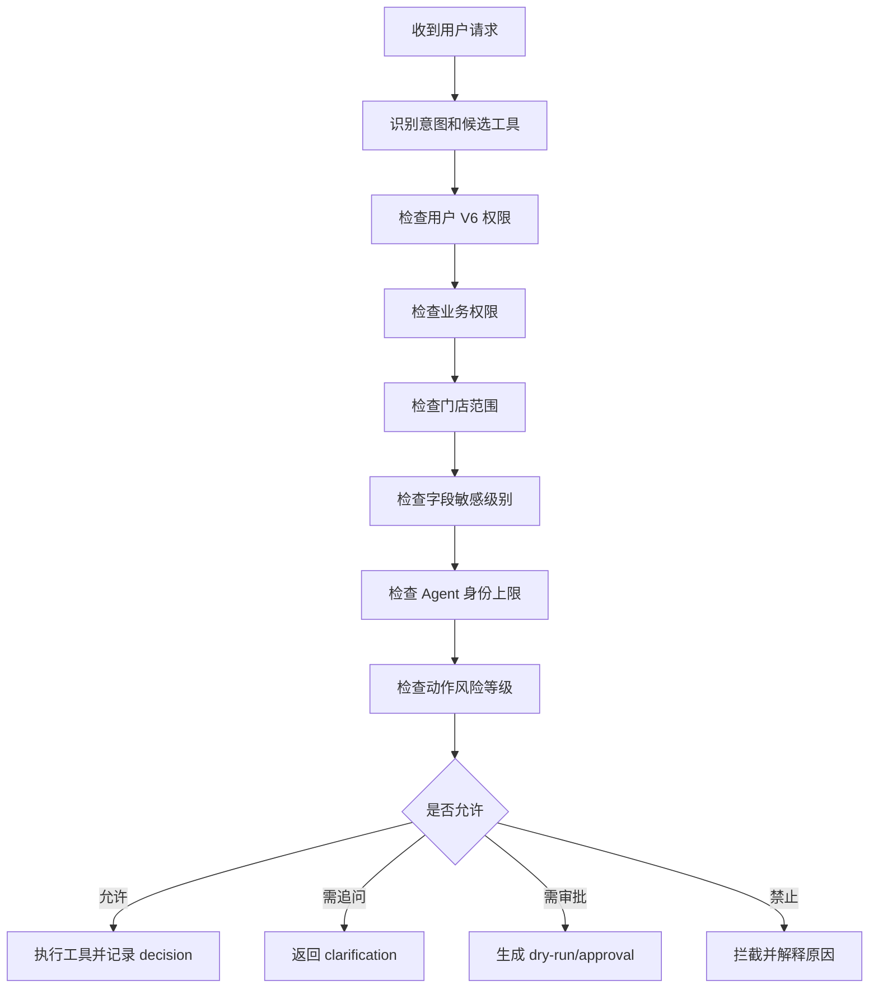

# Agent V6 权限、审批与安全护栏方案

版本：v1.0
日期：2026-07-09
依据：《Agent V6 完全独立经营管理 Agent 需求文档-2026-07-09.md》
边界：本文定义 Agent V6 独立安全模型，不复用历史 Agent 权限实现；可复用 Ami Core 现有用户、角色、门店和权限基础设施。

## 1. 安全目标

Agent V6 的安全目标是让系统敢于接入真实经营数据，又不会因为自然语言入口导致越权、误操作或不可追责。

P0 必须做到：

- 用户自然语言不能绕过菜单/API 权限。
- Agent 只能在用户门店范围内查询。
- 敏感字段默认脱敏。
- L3/L4 高风险动作必须被拦截。
- 每次回答都有权限决策和审计记录。

P1/P2 才逐步开放 dry-run、审批和受控执行。

## 2. 权限模型

Agent V6 使用四层权限模型：


### 2.1 RBAC

沿用 Ami Core 权限码，并新增 V6 权限：

| 权限码 | 含义 |
| --- | --- |
| `core:agent-v6:view` | 使用 Agent V6 工作台 |
| `core:agent-v6:operate` | 生成低风险任务和草案 |
| `core:agent-v6:governance` | 查看治理中心 |
| `core:agent-v6:approve` | 审批 V6 动作 |
| `core:agent-v6:admin` | 管理工具、策略、kill switch |

V6 查询业务数据时，还必须同时具备对应业务权限。例如查询库存需要 `core:inventory:stock`，查询财务需要 `core:finance:view`。

### 2.2 ABAC

P0 采用最小 ABAC：

- `storeId`：只能看当前门店或用户可访问门店。
- `role`：老板、店长、前台、美容师、财务、库存、客服、管理员。
- `surface`：admin、kiosk、mobile、scheduler。
- `sensitivity`：字段敏感级别。
- `riskLevel`：动作风险等级。

### 2.3 Agent 服务身份

每个角色 Agent 都有能力上限：

| Agent | 最大默认风险 | 说明 |
| --- | --- | --- |
| 店长总控 Agent | L2 | 可生成计划和草案，不直接改高风险业务 |
| 前台接待 Agent | L1 | 提醒、查询、低风险任务 |
| 营销增长 Agent | L2 | 分群和活动草案，不能自动群发 |
| 财务风控 Agent | L1 | 查询和核查任务，不能改账 |
| 库存采购 Agent | L2 | 采购草案，不能直接调库存 |
| 美容师服务 Agent | L1 | 授权客户建议，不能改高敏记录 |
| 客服回访 Agent | L1 | 回访任务和话术草案 |
| 数据审计 Agent | L0 | 只读审计 |
| 安全治理 Agent | L2 | 策略建议，禁用工具需管理员 |

用户权限和 Agent 上限取交集，不能取并集。

## 3. 字段敏感级别

| 等级 | 示例 | 默认处理 |
| --- | --- | --- |
| P0 普通 | 项目名、公开活动、库存汇总 | 可按权限展示 |
| P1 内部 | 客户标签、预约、员工排班 | 授权后展示，跨端摘要化 |
| P2 高敏 | 手机号、余额、支付、退款、成本、提成、客诉、健康禁忌 | 默认脱敏，明细需强权限 |
| P3 极敏 | 权限变更、财务冲正、批量删除、密钥 | V6 不直接展示或执行 |

脱敏规则：

- 手机号显示后三或后四位。
- 金额按权限显示精确值或区间。
- 客诉和健康禁忌默认只展示“存在风险”，不展示细节。
- 员工绩效给普通管理者看汇总，给授权财务/老板看明细。

## 4. 动作风险等级

| 等级 | 动作 | P0 策略 | P1/P2 策略 |
| --- | --- | --- | --- |
| L0 | 查询、解释、汇总 | 允许 | 允许 |
| L1 | 内部提醒、保存分析、生成话术 | 允许写 V6 内部记录 | 可写 V6 任务 |
| L2 | 客户跟进草案、营销草案、采购草案 | 生成草案，不触业务表 | dry-run + 确认 |
| L3 | 改约、发券、营销群发、库存调整 | 拦截并提示审批 | 审批后执行 |
| L4 | 退款、会员资产、财务冲正、权限变更、批量删除 | 禁止执行，只能申请 | 默认仍禁止自动执行 |

动作风险由 Scanner 初判，治理中心人工确认后生效。

## 5. Policy Engine 决策流程



`PermissionDecision` 必须记录：

- userId。
- storeId。
- agentRole。
- toolName。
- requestedAction。
- requiredPermissions。
- matchedPermissions。
- deniedReason。
- fieldMasking。
- riskLevel。
- finalDecision。

## 6. 审批机制

### 6.1 审批对象

P1 起审批对象为 `AgentV6ApprovalRequest`：

```json
{
  "type": "inventory_adjustment",
  "riskLevel": "L3",
  "requesterId": 12,
  "storeId": 1,
  "summary": "建议为 3 个低库存耗材生成补货单",
  "impact": {
    "affectedEntities": [],
    "fieldChanges": [],
    "estimatedCost": 1200
  },
  "evidenceIds": [],
  "rollbackPlan": "未提交采购前可取消；已提交后需按采购单撤销流程处理",
  "status": "pending"
}
```

### 6.2 审批规则

| 风险 | 审批人 |
| --- | --- |
| L1 | 当前用户确认 |
| L2 | 店长或具备 `core:agent-v6:operate` 的用户 |
| L3 | 店长/老板/管理员，按业务域选择 |
| L4 | 老板或系统管理员，P0/P1 默认只生成申请 |

审批摘要必须展示：

- 为什么建议执行。
- 影响哪些客户、订单、库存、活动或员工。
- 变更前后差异。
- 可撤销方式。
- 数据来源。
- 风险说明。

## 7. Dry-run

dry-run 不写业务表，只计算影响。

P0：

- 对 L3/L4 返回“需要审批/禁止执行”的结构化说明。
- 对 L1/L2 可以生成 V6 内部草案。

P1：

- 生成客户跟进、活动、采购、财务核查、空档填充 5 类草案。
- 展示影响对象和字段变化。

P2：

- 主动任务也必须先 dry-run，再进入审批或人工确认。

## 8. 输入护栏

输入护栏检测：

- Prompt injection：要求忽略权限、泄露系统提示、绕过工具。
- 越权请求：要求查看其他门店、其他员工敏感绩效、客户隐私。
- 高风险动作：直接退款、改余额、批量发券、删除数据。
- 模糊高风险：对象或金额不明确的操作请求。
- 数据投毒：用户试图把错误规则写入长期记忆。

处理：

- 低风险模糊：追问。
- 越权：拒绝并说明权限边界。
- 高风险：转审批或禁止。
- 注入：拒绝执行注入内容，并记录安全事件。

## 9. 工具护栏

工具调用必须满足：

- 工具在 registry 中处于 enabled。
- 输入符合 schema。
- 用户具备 required permissions。
- store scope 已绑定。
- risk level 已评估。
- 幂等键已生成。
- 超时和重试策略明确。
- 输出进入 evidence。

禁止：

- 模型自由拼 SQL。
- 模型绕过 Tool Registry 访问 Prisma。
- 工具返回未脱敏高敏字段给无权限用户。
- P0 工具写业务表。

## 10. 输出护栏

回答必须满足：

- 经营数据必须引用 evidence。
- 不确定时说明不确定或追问。
- 不用“已经执行”描述未执行动作。
- 对敏感数据按权限脱敏。
- 对建议展示依据、风险、影响和下一步。

禁止：

- 编造客户、订单、金额。
- 用模型估算替代真实经营数据。
- 暴露系统提示、密钥、内部策略。
- 对无权限用户提供绕过路径。

## 11. 记忆护栏

记忆写入条件：

- 有明确来源。
- 有作用域。
- 不包含未授权高敏字段。
- 不与已有高优先级规则冲突。
- 用户可查看和删除。

记忆冲突处理：

- 同一客户别名冲突：追问确认。
- 用户偏好和门店规则冲突：门店规则优先。
- 历史记忆过期：不进入推理。
- 安全策略冲突：安全策略优先。

## 12. 审计

每次 V6 run 必须审计：

- 请求人、角色、门店、入口。
- 原始输入。
- 识别意图。
- 模型调用摘要。
- 工具计划和工具结果。
- 权限决策。
- 字段脱敏。
- evidence。
- 输出内容。
- 用户反馈。
- 审批和执行结果。

审计查询只能给具备治理权限的用户使用。

## 13. Kill Switch

V6 需要三个级别的 kill switch：

| 级别 | 作用 |
| --- | --- |
| 全局 | 关闭全部 Agent V6 运行 |
| 工具级 | 禁用单个工具 |
| 动作级 | 禁用某类风险动作 |

触发条件：

- 大量工具失败。
- 安全注入命中率异常。
- 发现权限穿透。
- 业务写操作异常。
- 模型成本或延迟异常。

## 14. P0 验收

安全 P0 通过标准：

- 无 `core:agent-v6:view` 不能使用工作台。
- 无业务权限不能通过 V6 查询对应业务明细。
- 跨门店请求被拦截。
- 手机号、余额、退款、提成等高敏字段按权限脱敏。
- L3/L4 请求不写业务表。
- prompt injection 请求被拒绝并记录。
- 每个工具调用都有 permission decision。
- 每个回答都能追踪到 evidence 或明确说明无数据。
