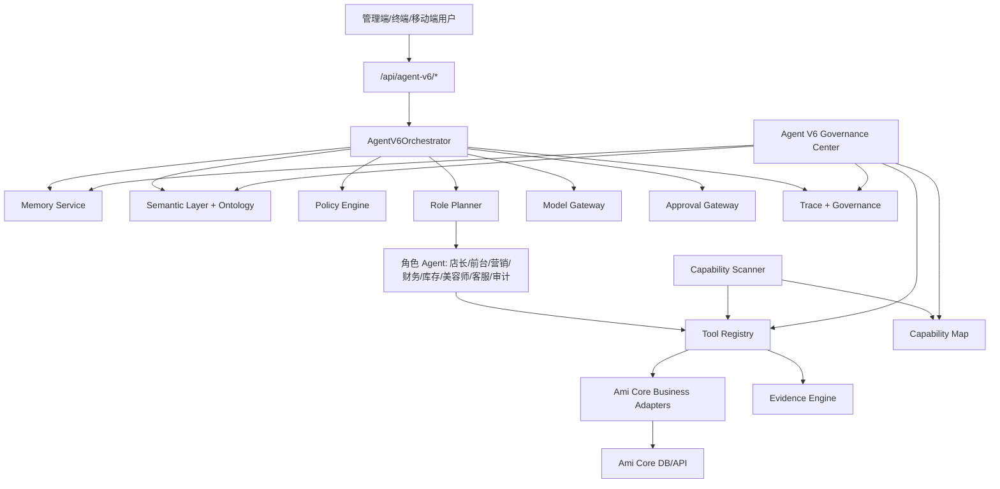

# Agent V6 独立技术架构方案

版本：v1.0
日期：2026-07-09
依据：《Agent V6 完全独立经营管理 Agent 需求文档-2026-07-09.md》
边界：本文只定义 Agent V6 独立架构，不复用本项目历史 Agent V1-V5 的代码结构、数据表、提示词和评测实现。

## 1. 架构目标

Agent V6 的技术目标不是再做一个问答入口，而是新增一套独立的数字经营运行时：

1. 让用户能用口语化输入完成经营查询、风险识别、建议生成和受控业务动作。
2. 让每一次回答都有数据来源、权限决策、工具调用、运行轨迹和可审计结果。
3. 让 Agent 能扫描 Ami Core 的业务能力，形成能力地图，再按权限和风险注册为工具。
4. 让 P0 可稳定落地为只读可信闭环，P1/P2 能在不推翻底座的前提下扩展到审批、任务和自动化。

## 2. 总体架构



核心原则：

- Agent V6 有独立 namespace、独立模块、独立数据表和独立治理中心。
- Ami Core 是被扫描和接入的业务系统，不是 Agent V6 的历史实现来源。
- 模型只负责理解、规划、表达和低风险生成；经营事实必须来自工具和 evidence。
- 所有工具调用先经过策略引擎，再经过工具 schema 校验，最后进入 evidence 记录。

## 3. 后端模块设计

后端新增 `packages/server-v2/src/agent-v6`，按职责拆分为以下模块：

| 模块 | 责任 | P0 交付 | P1/P2 扩展 |
| --- | --- | --- | --- |
| `AgentV6Module` | NestJS 模块注册、controller/service 聚合 | 注册独立模块 | 扩展 scheduler 和跨端 API |
| `AgentV6Controller` | `/api/agent-v6/*` 入口 | runs、memories、ontology、capabilities、governance | approvals、tasks、surfaces |
| `AgentV6OrchestratorService` | 主编排器 | 意图识别、追问、工具规划、答案组装 | 多 Agent 协同、主动任务 |
| `AgentV6ModelGateway` | 可插拔模型网关 | mock adapter + OpenAI adapter 接口 | 多模型路由、成本控制 |
| `AgentV6MemoryService` | 分层记忆 | 会话记忆、用户偏好、实体别名 | 决策记忆、反馈记忆、任务记忆 |
| `AgentV6SemanticLayerService` | Ontology 与指标口径 | 12 域、核心对象、P0 指标 | 图谱增强、跨域推理 |
| `AgentV6CapabilityScannerService` | Ami Core 能力扫描 | menu/API/schema/permission 只读扫描 | 定时扫描、差异归因 |
| `AgentV6ToolRegistryService` | 工具注册与执行入口 | 只读查询工具、风险工具 | 写操作草案、跨端工具 |
| `AgentV6PolicyEngine` | 权限与风险策略 | RBAC、门店范围、字段脱敏、L3/L4 拦截 | ABAC、审批策略配置 |
| `AgentV6EvidenceService` | 证据和引用 | 数据来源、查询范围、明细引用 | 反事实检查、质量评分 |
| `AgentV6ApprovalGateway` | dry-run 与审批 | P0 只生成拦截结果 | P1 审批、执行、回滚记录 |
| `AgentV6GovernanceService` | 治理台数据 | run、tool、capability、feedback | eval、价值看板 |
| `AgentV6EvaluationService` | 评测与回归 | P0 评测用例结构 | CI gate、线上抽检 |
| `AgentV6SchedulerService` | 主动扫描 | 不启用自动任务 | P2 主动经营驾驶舱 |

## 4. API 设计

所有接口使用 `/api/agent-v6` 前缀，并使用 `JwtAuthGuard + PermissionsGuard`。V6 内部还要二次校验门店范围、字段敏感级别和工具风险等级。

### 4.1 对话与运行

`POST /api/agent-v6/runs`

入参：

```json
{
  "conversationId": "optional-existing-conversation-id",
  "message": "这周谁快流失了，帮我排一下跟进优先级",
  "roleHint": "store_manager",
  "surface": "admin",
  "storeId": 1,
  "dryRun": true
}
```

出参：

```json
{
  "runId": "v6run_20260709_001",
  "conversationId": "v6conv_001",
  "status": "completed",
  "answer": {
    "summary": "本周有 8 位客户需要优先跟进，其中 3 位为高价值流失风险。",
    "sections": [],
    "nextBestActions": []
  },
  "clarification": null,
  "evidence": [],
  "actionCards": [],
  "traceSummary": {
    "agents": ["store_manager", "marketing", "data_auditor"],
    "tools": ["customer_churn_risk.list"],
    "riskLevel": "L0"
  },
  "permissionDecisions": []
}
```

当缺少关键参数时，`status = "needs_clarification"`，返回 `clarification`：

```json
{
  "question": "你想看哪个时间范围？",
  "options": [
    { "label": "最近 7 天", "value": "last_7_days" },
    { "label": "最近 30 天", "value": "last_30_days" }
  ],
  "requiredSlots": ["dateRange"]
}
```

### 4.2 运行追踪

- `GET /api/agent-v6/runs/:id`：运行摘要。
- `GET /api/agent-v6/runs/:id/trace`：step、tool invocation、permission decision、evidence。
- `POST /api/agent-v6/runs/:id/feedback`：点赞、踩、纠错、采纳、拒绝。

### 4.3 记忆

- `GET /api/agent-v6/memories`：按当前用户和权限返回可见记忆。
- `PATCH /api/agent-v6/memories/:id`：禁用、改作用域、改有效期。
- `DELETE /api/agent-v6/memories/:id`：删除用户可管理的记忆。

P0 只开放三类记忆：会话、用户偏好、实体别名。敏感字段默认不可进入长期记忆。

### 4.4 Ontology 与指标

- `GET /api/agent-v6/ontology`：对象、关系、别名、状态机。
- `GET /api/agent-v6/metrics`：指标口径、维度、权限等级、可追溯能力。
- `GET /api/agent-v6/metrics/:key/evidence-template`：指标证据模板。

### 4.5 能力扫描与工具注册

- `POST /api/agent-v6/capabilities/scan`：触发只读扫描。
- `GET /api/agent-v6/capabilities`：能力地图。
- `GET /api/agent-v6/tools`：工具注册中心。
- `PATCH /api/agent-v6/tools/:id`：启停、风险等级、人工确认状态。

P0 禁止扫描器自动启用写工具，只能生成候选工具。

### 4.6 审批与任务

- `POST /api/agent-v6/actions/dry-run`：计算动作影响。
- `POST /api/agent-v6/approvals`：生成审批申请。
- `POST /api/agent-v6/approvals/:id/approve`：审批通过。
- `POST /api/agent-v6/approvals/:id/reject`：审批拒绝。
- `GET /api/agent-v6/tasks`：Agent 生成的经营任务。

P0 仅保留接口契约和风险拦截返回，不执行真实业务写操作。

## 5. Prisma 数据域

Agent V6 独立建模，避免与历史 Agent 表混用。P0 建议模型：

| 模型 | 说明 | P0 必需 |
| --- | --- | --- |
| `AgentV6Conversation` | 会话主记录 | 是 |
| `AgentV6Run` | 单次运行 | 是 |
| `AgentV6Step` | 运行步骤 | 是 |
| `AgentV6Message` | 用户与系统消息 | 是 |
| `AgentV6MemoryItem` | 记忆项 | 是 |
| `AgentV6OntologyNode` | 语义节点 | 是 |
| `AgentV6OntologyEdge` | 语义关系 | 是 |
| `AgentV6MetricDefinition` | 指标定义 | 是 |
| `AgentV6CapabilitySnapshot` | 扫描快照 | 是 |
| `AgentV6CapabilityItem` | 能力项 | 是 |
| `AgentV6ToolDefinition` | 工具定义 | 是 |
| `AgentV6ToolInvocation` | 工具调用 | 是 |
| `AgentV6PermissionDecision` | 权限决策 | 是 |
| `AgentV6Evidence` | 证据引用 | 是 |
| `AgentV6Feedback` | 用户反馈 | 是 |
| `AgentV6EvaluationCase` | 评测用例 | 是 |
| `AgentV6EvaluationResult` | 评测结果 | 是 |
| `AgentV6ApprovalRequest` | 审批申请 | P1 |
| `AgentV6Task` | 经营任务 | P1 |
| `AgentV6RiskSignal` | 风险信号 | P2 |
| `AgentV6SurfaceSync` | 跨端同步 | P2 |

P0 设计要点：

- 所有 JSON 字段必须有 TypeScript 类型约束，不让业务含义散落在调用方。
- `runId`、`toolInvocationId`、`evidenceId` 要串联，保证治理台可回放。
- 经营查询结果不长期复制业务明细，只保存证据索引、口径、范围和必要摘要。
- 记忆项必须保存 `scope`、`source`、`expiresAt`、`sensitivity`、`status`。

## 6. 模型网关

Agent V6 采用可插拔模型网关：

```ts
interface AgentV6ModelGateway {
  complete(input: AgentV6ModelInput): Promise<AgentV6ModelOutput>;
  classifyIntent(input: AgentV6IntentInput): Promise<AgentV6IntentOutput>;
  generateClarification(input: AgentV6ClarificationInput): Promise<AgentV6ClarificationOutput>;
  composeAnswer(input: AgentV6AnswerInput): Promise<AgentV6AnswerOutput>;
}
```

P0 适配器：

- `mock`：确定性返回，用于单测、CI 和无 key 环境。
- `openai`：真实模型适配器，通过环境变量启用。

约束：

- 模型不能直接访问数据库。
- 模型输出必须经过 schema 校验。
- 模型提出的工具计划必须经过策略引擎批准。
- 工具结果回传模型前必须按权限脱敏。

## 7. 工具注册与执行

工具按领域注册：

| 工具域 | P0 工具示例 | 风险 |
| --- | --- | --- |
| 客户 | `customer.search`、`customer.churnRisk.list` | L0/L1 |
| 预约 | `reservation.today.list`、`reservation.emptySlots.list` | L0/L1 |
| 收银财务 | `finance.cashierAnomaly.scan`、`memberAsset.summary` | L0/L2 |
| 库存 | `inventory.lowStock.list`、`inventory.expiringBatch.list` | L0/L2 |
| 营销 | `marketing.segment.preview`、`campaign.performance.summary` | L0/L2 |
| 员工 | `staff.performance.summary` | L0/L2 |
| 治理 | `capability.map.query`、`run.trace.query` | L0 |

执行流程：

1. Orchestrator 生成工具计划。
2. Policy Engine 校验用户权限、门店范围、字段敏感级别和动作风险。
3. Tool Registry 校验工具 schema 和参数。
4. Business Adapter 调用 Ami Core service/API/Prisma read model。
5. Evidence Service 记录来源、范围、明细引用和口径。
6. Answer Composer 组装回答和建议。

## 8. 前端入口

### 8.1 Agent V6 工作台

建议路径：`/agent-v6`

主要区域：

- 经营对话区：支持追问、证据引用、动作卡。
- 今日任务区：展示 P0 风险提示和建议动作。
- 证据抽屉：展示数据来源、时间范围、口径、明细链接。
- 协同过程区：展示店长/营销/财务/库存等角色分工。
- 风险提示区：展示被拦截的 L3/L4 动作和审批说明。

### 8.2 Agent V6 治理中心

建议路径：`/system/agent-v6-governance`

主要 tab：

- 运行追踪。
- 能力地图。
- 工具注册。
- 记忆管理。
- Ontology 与指标。
- 权限与审批。
- 评测中心。
- 价值看板。

UI 原则：

- 管理工具应密集、清晰、可扫描，不做营销式 hero。
- 每个 run 必须能从回答跳到 trace。
- 每个工具必须展示风险等级、权限、来源和启用状态。

## 9. 跨端协同

P2 的跨端协同按 API 优先，不做实时语音。

接口：

- `GET /api/agent-v6/surfaces/kiosk/briefing`：终端展示今日重点、客户服务建议、风险摘要。
- `GET /api/agent-v6/surfaces/mobile/briefing`：移动端展示个人任务、审批、回访建议。
- `POST /api/agent-v6/surfaces/:surface/feedback`：跨端反馈回流。

约束：

- Kiosk 和移动端只能看到当前用户/设备授权范围内的数据。
- 跨端 briefing 不带高敏明细，只给摘要和可跳转任务。
- 语音实时对话只保留后续扩展接口，不纳入 P0。

## 10. P0/P1/P2 架构演进

### P0：独立底座和可信只读闭环

交付：

- 独立 V6 API、数据表、工作台、治理中心。
- 记忆 P0、追问 P0、Ontology P0、Scanner P0。
- 只读查询工具、风险提示、证据引用、权限拦截。
- 评测中心和基础评测集。

### P1：受控业务操作和多角色协同

交付：

- 多 Agent 协同任务卡。
- 5 类业务草案：客户跟进、营销活动、采购、财务核查、空档填充。
- dry-run、审批、执行记录、反馈进入 backlog。

### P2：数字店长和经营自动化

交付：

- 主动风险 scheduler。
- 每日经营驾驶舱。
- 目标拆解、复盘、预测建议。
- Kiosk/移动端 briefing API。

## 11. 验收门禁

P0 架构验收：

- V6 controller 全部独立 `/api/agent-v6/*`。
- V6 数据表全部以 `AgentV6` 前缀命名。
- 不导入历史 Agent service、prompt、eval、adapter。
- 任意经营回答都有 run、step、tool invocation、permission decision、evidence。
- L3/L4 动作在 P0 被拦截，不发生真实业务写入。
- mock 模型网关可跑完整单测。

P1/P2 架构验收：

- 审批和任务不绕过 V6 审计。
- 主动任务可解释触发原因。
- 跨端 briefing 可按权限脱敏。
- 治理中心可看到能力、运行、工具、评测、反馈、价值。
