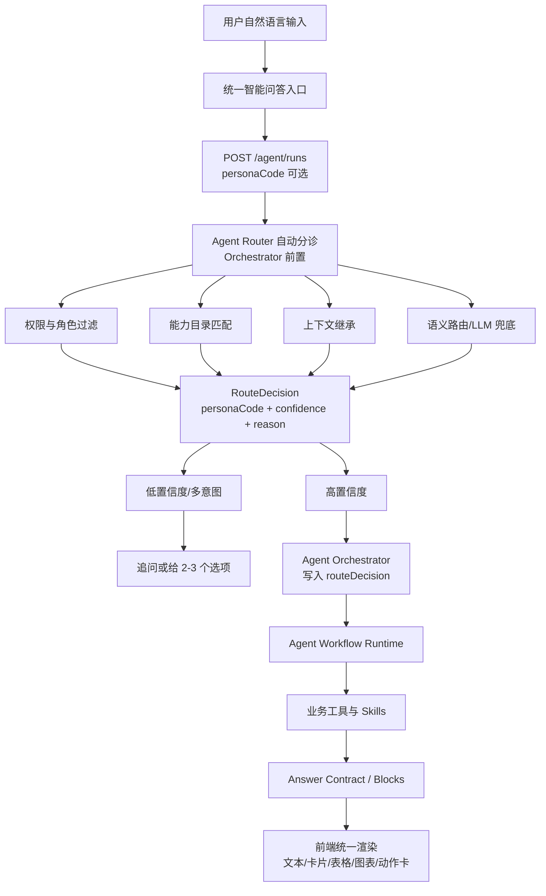

# Agent Router 自动分诊改造方案

更新时间：2026-06-28

## 1. 结论

建议采纳：**终端与管理端默认隐藏多个角色 Agent 切换按钮，用户只看到一个“洞悉美业·门店运营智能体 / Ami 智能问答”入口；用户输入后，由系统先识别问题应该交给哪个 Agent，再路由给店长经营、营销增长、前台接待、库存采购、财务风控、美容师服务等 Persona。**

这样更符合门店真实使用习惯：店长、前台、美容师不会先思考“我该选哪个 Agent”，只会直接说“查客户卡项”“今天预约有没有风险”“哪些库存临期”“这个月利润为什么下降”。系统应承担分诊工作。

但改造不能做成前端关键词规则。最优方案是：**前端弱化/隐藏 Persona，后端 Agent Orchestrator 前置 Agent Router，基于 Persona 能力目录、权限和上下文统一决策。**

## 1.1 实施状态

状态：**已完成阶段 0-4 的首版落地与验证**。

最终实现选择：

- Router 放在 `AgentOrchestratorService` 前置，而不是直接放进 `AgentWorkflowRuntimeService`。
- 原因：当前 `AgentWorkflowRuntimeService.createRun()` 创建 `AgentRun` 时必须已经有 `personaCode`，所以需要先完成分诊，再创建 run。
- v1 不新增 `/agent/route` 接口；路由内聚在 `/agent/runs` 与 `/agent/runs/:id/messages`。
- v1 不依赖外部 LLM 分诊，先用 Persona 配置、工具组、推荐问题、能力描述和权限做本地评分；后续保留 LLM fallback 扩展位。

## 2. 当前现状

### 2.1 Kiosk 当前链路

当前 Kiosk 已有六类 Persona 配置，并在页面顶部通过 `PersonaSwitcher` 显式展示：

- 店长经营
- 营销增长
- 前台接待
- 美容师服务
- 库存采购
- 财务风控

当前提交问题时，前端会把 `activePersonaCode` 传给 Agent Runtime：

```text
用户输入 -> 当前选中的 activePersonaCode -> createTerminalAgentRun/appendTerminalAgentMessage -> /agent/runs -> AgentOrchestrator
```

这意味着用户必须先选对 Agent。如果用户停留在“前台接待”，但问“哪些库存临期”，系统仍带着前台 Persona 去处理，容易出现答非所问或能力错配。

### 2.2 当前问题

- 角色 Agent 暴露太早，增加用户认知成本。
- 用户随机自然语言输入时，很难保证先选中正确 Agent。
- 当前 Persona 更像“内部分工”，不应该强迫门店用户理解。
- 前端手动切换会影响多轮上下文：上轮查库存、下轮问“那怎么处理”，如果用户切了 Persona，可能破坏上下文连续性。
- 后续 Agent 越多，顶部按钮越多，终端首屏会越来越重。

## 3. 目标体验

### 3.1 用户视角

默认只显示一个入口：

```text
Ami 智能问答
输入框：例如：查客户卡项 / 今天预约风险 / 哪些库存临期 / 本月利润为什么下降
```

用户不需要选择 Agent。系统根据问题自动分配：

| 用户输入 | 系统路由 |
|---|---|
| “今天有哪些预约要确认？” | 前台接待 Agent |
| “这个客户还有什么卡和权益？” | 前台接待 Agent |
| “哪些库存临期？” | 库存采购 Agent |
| “最近哪些客户适合召回？” | 营销增长 Agent |
| “本月利润为什么下降？” | 财务风控 Agent |
| “今天我应该重点关注什么？” | 店长经营 Agent |
| “我今天有哪些客户？” | 美容师服务 Agent |

回答完成后，可以在答案卡片角落轻量展示：

```text
由 库存采购 Agent 处理 · 数据来源：库存批次/商品
```

这让用户知道系统如何分工，但不要求用户先选择。

### 3.2 模糊问题处理

如果问题存在多种合理解释，不要强行猜：

- “查一下客户” -> 追问：“要查哪位客户？”
- “看一下风险” -> 默认店长经营 Agent 汇总风险；如果需要，可提供 chips：“客户风险 / 库存风险 / 财务风险”
- “帮我处理一下” -> 结合上一轮上下文；无上下文时追问一次

每次最多追问一个关键问题。

## 4. 目标架构



## 5. Agent Router 设计

### 5.1 输入

Router 输入不只是一句话，需要带上下文：

```ts
type AgentRouteInput = {
  message: string;
  role: "manager" | "reception" | "beautician";
  storeId: number;
  userId?: number;
  entrypoint: "terminal:kiosk" | "ami-agent:web";
  context?: {
    previousRun?: unknown;
    conversationFocus?: unknown;
    terminal?: {
      source?: "text" | "voice" | "quick_action";
      sourceAction?: string;
    };
  };
  manualPersonaCode?: string | null;
};
```

### 5.2 输出

```ts
type AgentRouteDecision = {
  personaCode:
    | "manager"
    | "marketing"
    | "reception"
    | "beautician"
    | "inventory"
    | "finance";
  confidence: number;
  reason: string;
  candidates: Array<{
    personaCode: string;
    score: number;
    matchedCapabilities: string[];
  }>;
  clarificationNeeded: boolean;
  clarificationQuestion?: string;
  deniedReason?: string;
  mode: "manual" | "context_inherit" | "auto" | "role_default";
  routeChanged?: boolean;
};
```

### 5.3 决策优先级

1. **手动指定优先**：如果管理端调试模式或审计筛选显式传 `personaCode`，先尊重手动值。
2. **权限过滤**：例如财务风控只允许店长；美容师不能越权查询全店利润。
3. **上下文继承**：如果上一轮由库存采购 Agent 回答，用户追问“那怎么处理”，优先继续库存采购。
4. **能力目录匹配**：根据 Persona 的 `toolGroups`、capability 描述、示例问题做语义匹配。
5. **轻量 LLM 分诊兜底**：当语义匹配接近或不确定时，可用结构化输出选择 Agent；首版暂不强依赖外部 LLM。
6. **低置信度追问**：置信度低于阈值时不执行工具，先追问。

## 6. 前端改造

### 6.1 Kiosk

保留：

- 底部业务快捷键：经营、员工、客户增长、客户跟进、库存、预约、核销、收银、办卡、充值等。
- 输入框建议问题：作为 placeholder 或空状态引导。
- 答案里的 follow-up chips。

隐藏：

- 顶部 PersonaSwitcher 默认不展示。

新增：

- 回答卡片轻量显示“由哪个 Agent 处理”。
- 可选的“更多 / 调试”入口，用于内部测试时查看或切换 Agent，不面向门店默认用户。
- placeholder 不再只来自当前 active Persona，而是来自“当前角色可用的推荐问题池”，例如店长看到经营、客户、库存、财务混合建议。

### 6.2 管理端 `/ami-agent`

建议也从“左侧六个 Agent 固定入口”逐步升级为：

- 默认统一入口：洞悉美业·门店运营智能体。
- Agent 列表变成筛选/审计维度，而不是用户必须先选的入口。
- 对话消息展示 route badge：`路由：库存采购 Agent · 置信度 0.86`。
- 调试面板保留强制指定 Persona，用于研发和运营校验。

## 7. 后端改造

### 7.1 DTO

`CreateAgentRunDto.personaCode` 改为真正可选：

- 有值：手动路由模式。
- 无值：自动分诊模式。

当前前端可以继续传值；改造后 Kiosk 默认不传，管理端调试模式可传。

### 7.2 Orchestrator / Runtime

最终实现把 Router 放在 `AgentOrchestratorService` 前置，Runtime 保持“收到已解析 Persona 后创建 run”的职责。

改造为：

```text
AgentOrchestratorService.createRun()
  -> AgentRouter.route(input)
  -> resolvedActor.personaCode = routeDecision.personaCode
  -> runtime.createRun(resolvedActor)
  -> AgentRun.contextJson.routeDecision
  -> processRun()

AgentOrchestratorService.appendMessage()
  -> load existing run
  -> AgentRouter.route(message + previousPersonaCode)
  -> context_inherit 或 routeChanged
  -> update run.personaCode/contextJson.routeDecision
  -> processRun()
```

### 7.3 Orchestrator

`AgentOrchestratorService.createRun()` 和 `appendMessage()` 需要统一调用路由逻辑：

- 新会话：自动分诊。
- 追问：优先继承当前 run 的 persona；如果用户明显换域，例如从“库存临期”跳到“本月利润”，允许重路由，并记录 route transition。
- 审批动作、快捷按钮动作不走分诊，仍走 FlowCard / approval API。

### 7.4 Planner / Tool Registry

Router 不应凭关键词硬分配。更稳妥的做法是复用现有能力目录：

```text
Persona -> toolGroups -> capabilities -> examples -> semantic tags
```

例如：

- `inventory.expiring.clearance.draft` -> 库存采购
- `finance.profit.diagnose` -> 财务风控
- `reception.card.benefit.summary` -> 前台接待
- `marketing.customer.segment.discover` -> 营销增长

这也是后续“Skills 增强”的基础：每个 Skill 挂到对应 capability，Router 只选择能力域，不写死问法。

## 8. 时延控制

这条链路不会明显变慢，前提是 Router 设计成轻量前置层。

建议分三档：

| 场景 | 路由方式 | 目标耗时 |
|---|---|---|
| 明确问题，如“库存临期”“今天预约” | 本地语义/能力目录匹配 | 20-80ms |
| 多轮追问，如“那怎么处理” | 继承上一轮 persona | <20ms |
| 模糊或跨域问题 | 轻量 LLM 结构化分诊 | 300-800ms |

关键点：Router 和 Planner 不要拆成两个独立慢调用。可以在 `/agent/runs` 内部完成：

```text
一次请求 -> Router 决定 persona -> Planner 规划工具 -> 执行 -> 返回
```

前端不额外多请求一次路由接口。

## 9. 分阶段开发计划

### 阶段 0：产品口径收敛（已完成）

- [x] Kiosk 默认隐藏顶部 PersonaSwitcher。
- [x] 保留研发调试开关，可通过环境变量或 debug 参数显示 PersonaSwitcher。
- [x] 统一文案为“洞悉美业·门店运营智能体 / Ami 智能问答”。
- [x] 输入框 placeholder 改为跨 Persona 推荐问题池。

验收：

- 门店用户默认看不到六个 Agent 按钮。
- 底部业务快捷键不受影响。
- 输入框仍有建议问题。

### 阶段 1：后端 Agent Router（已完成）

- [x] 新增 `AgentRouterService`。
- [x] 基于 Persona 配置、toolGroups、capability registry 建立路由候选。
- [x] 支持 `personaCode` 可选：未传时自动路由。
- [x] RouteDecision 写入 `AgentRun.contextJson.routeDecision`。
- [x] 低置信度时返回澄清问题，不执行业务工具。

验收：

- “哪些库存临期” 自动路由到 `inventory`。
- “本月利润为什么下降” 自动路由到 `finance`。
- “今天有哪些预约” 自动路由到 `reception`。
- “哪些客户适合召回” 自动路由到 `marketing`。
- 无权限访问财务时不越权，只返回权限说明和可替代建议。

### 阶段 2：Kiosk 接入自动分诊（已完成）

- [x] `createTerminalAgentRun()` 默认不传 `personaCode`。
- [x] `appendTerminalAgentMessage()` 对追问带 `activeRunId`，由后端决定继承或重路由。
- [x] `terminalFacts` 保留 role、operator、sourceAction，但不再把 active Persona 当用户选择。
- [x] 回答卡片展示“由 X Agent 处理”的轻量标签。

验收：

- 用户不选 Agent 也能问库存、财务、预约、客户卡项。
- 输入框输入“收银/核销/办卡”仍进入 Agent，不误触快捷按钮。
- 点击底部“收银/核销/办卡”仍直接打开 FlowCard，不走 Agent 分诊。

### 阶段 3：管理端 `/ami-agent` 接入（已完成）

- [x] 默认统一智能体入口。
- [x] 左侧 Agent 列表降级为筛选/调试，不作为主交互路径。
- [x] 对话消息展示 route badge 和 route reason。
- [x] Agent 审计、质量报告继续可按 personaCode 筛选。

验收：

- 管理端用户可直接问跨域问题。
- 运营/研发仍能按 Agent 查看失败率、反馈和审批。

### 阶段 4：评测与观测（首版已完成，持续扩容）

- [x] 增加路由评测集：预约、客户、库存、财务、营销、员工、美容师六类自然语言问法首版。
- [x] 增加混合/模糊问题评测首版。
- [x] 观测数据新增 routeDecision，可派生 routeAccuracy、routeConfidence、routeOverrideRate、clarificationRate。
- [x] 用户消息 metadata 与结果返回记录 routeDecision，便于判断是路由错还是工具答错。

验收：

- P0 路由准确率 >= 90%。
- 低置信度问题不自信乱答。
- 用户不需要手动切换 Agent 也能覆盖主要门店问题。

## 10. 本次验收记录

已执行并通过：

```powershell
npm.cmd --prefix packages/server-v2 test -- agent-router.service.spec.ts agent-orchestrator.service.spec.ts --runInBand
npm.cmd --prefix packages/Ami-Aura-Lite-Kiosk exec vitest run src/app/components/SmartCommandBar.test.tsx src/app/components/AgentMessageItem.test.tsx src/app/AppContent.performance.test.ts --runInBand
npx.cmd vitest run src/app/pages/ami-agent/AmiAgentWorkspace.test.tsx
npx.cmd playwright test -c playwright.kiosk.config.ts packages/Ami-Aura-Lite-Kiosk/e2e/business-agent.spec.ts
npm.cmd --prefix packages/server-v2 run build
npm.cmd --prefix packages/Ami-Aura-Lite-Kiosk run build
npm.cmd run build
```

验收结论：

- 后端 Router/Orchestrator 单测通过：2 个测试文件，35 条用例。
- Kiosk 组件与性能静态检查通过：3 个测试文件，16 条用例。
- 管理端 `/ami-agent` 单测通过：1 个测试文件，2 条用例。
- Kiosk Browser Eval 通过：16 条 E2E 用例。
- 后端、Kiosk、管理端三端构建均通过。

未覆盖风险：

- 阶段 4 的大样本自然语言评测集仍需在运营期继续扩容，当前已具备 routeDecision 记录和首版门禁，但还不是统计意义上的全量准确率评估。
- Kiosk 构建存在既有 chunk size 警告，本次改造未处理包体拆分。

## 11. 风险与边界

### 风险 1：自动分诊错路由

缓解：

- 保留 route badge 和反馈。
- 低置信度追问。
- 审计面板可查看路由原因。
- 研发调试模式允许手动指定 Persona。

### 风险 2：多轮对话跨域

缓解：

- 默认继承上一轮 Persona。
- 如果新问题强烈命中新域，允许重路由。
- routeDecision 记录 `isContinuation` 和 `routeChanged`。

### 风险 3：权限越界

缓解：

- Router 先做权限过滤，再做能力匹配。
- 财务、全店业绩等敏感域只能路由到用户有权访问的 Persona。
- 无权限时由当前可用 Persona 给出解释和下一步建议，不绕过后端权限。

## 12. 最终建议

采用“**默认隐藏角色 Agent + 后端自动分诊 + 回答后透明展示处理 Agent**”。

不要继续让用户手动选择角色 Agent，也不要在前端用关键词规则硬分配。Persona 应成为系统内部的专业分工和观测维度，而不是门店一线用户的操作负担。

最小可落地版本是：

1. Kiosk 隐藏顶部 PersonaSwitcher。
2. Kiosk 提问默认不传 `personaCode`。
3. 后端 `AgentRouterService` 根据语义和能力目录自动选择 `personaCode`。
4. 答案卡片展示“由 X Agent 处理”。
5. 保留调试模式手动切换 Agent。
