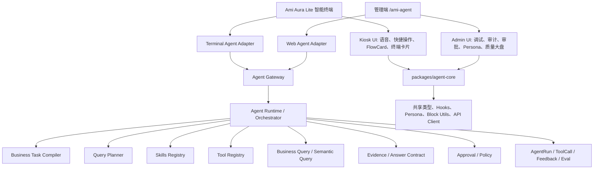

# 洞悉美业 Agent Runtime 与前端对话内核统一最优方案

版本：v1.0
日期：2026-06-27
适用范围：管理端 `/ami-agent`、Ami Aura Lite 智能终端“智能问答”、`server-v2` Agent Runtime

---

## 1. 结论

最优方案不是简单二选一，而是分层合并：

1. 先统一后端 Agent Runtime，让管理端和智能终端都走同一套语义规划、Skills、工具调用、证据包、审计和反馈链路。
2. 再建设 `packages/agent-core`，统一两端前端对话状态、Persona、Block 类型、渲染协议和反馈组件。
3. 保留 Kiosk 和管理端的不同产品定位：Kiosk 是门店一线工作台，管理端 `/ami-agent` 是 Agent 治理、调试、审计、审批和质量管理面板。

如果只做 `packages/agent-core`，会出现“界面统一了，但终端仍在旧 AI Chat 链路里”的问题；如果只做后端 Runtime 统一，又会出现两端渲染协议、Persona、反馈体验重复建设的问题。因此推荐采用“后端运行时统一优先，前端内核统一随后承接”的组合方案。

---

## 2. 目标架构



---

## 3. 产品定位

### 3.1 Ami Aura Lite 智能终端

定位：门店一线工作台和经营问答主入口。

重点能力：

- 店长、前台、美容师可直接用自然语言问业务问题。
- 支持语音、快捷问题、FlowCard、收银、核销、预约、库存、客户跟进等现场操作。
- 高风险动作必须确认，例如批量触达、生成采购单、创建营销活动。
- 终端回答必须基于业务事实，可展示卡片、表格、清单、图表和下一步动作。

### 3.2 管理端 `/ami-agent`

定位：Agent 治理后台和调试工作台。

重点能力：

- 调试不同 Persona 的对话效果。
- 查看 AgentRun、ToolCall、Evidence、Approval、Feedback。
- 管理 Persona 推荐问题、工具权限和质量评测。
- 观察失败问题、低置信度问题、用户负反馈和能力缺口。

---

## 4. 当前主要问题

1. 智能终端“智能问答”和管理端 `/ami-agent` 目前是两条运行链路。
2. 终端问答仍大量依赖 Kiosk 本地上下文拼装和 `/ai/chat/messages`，没有完整复用 AgentRun、Skills、Evidence 和 Feedback。
3. 管理端 Agent 已经有较多工具能力，但终端不能自动继承。
4. 终端库存、客户、预约等卡片数据有时只把 summary 交给 AI，没有把明细作为事实传入，导致回答“没有数据”或答非所问。
5. 两端 Block 类型、Persona、对话状态、反馈按钮和推荐问题存在重复建设风险。

---

## 5. 最优改造路径

## 阶段 0：运行链路冻结与现状审计

目标：先把两套问答链路查清楚，避免边改边引入新分叉。

任务：

- 梳理 Kiosk 智能问答入口：
  - `AppContent.tsx`
  - `auraCoreService.ts`
  - `runMicroApp.ts`
  - intent parser
  - FlowCard 调用链
- 梳理管理端 Agent 入口：
  - `AmiAgentWorkspace.tsx`
  - `src/api/real/agent.ts`
  - `AgentController`
  - `AgentOrchestratorService`
- 标记必须保留的 Kiosk 现场能力：
  - 收银
  - 核销
  - 预约
  - 客户建档
  - 库存卡片
  - 设备状态
- 标记必须统一的 Agent 能力：
  - 语义理解
  - Query Planner
  - Skills
  - Evidence
  - AgentRun
  - Feedback

验收：

- 输出一张“旧终端问答链路 vs 新 AgentRun 链路”的调用表。
- 明确哪些命令继续走 FlowCard，哪些命令切到 Agent Runtime。

---

## 阶段 1：统一后端 Agent Runtime

目标：Kiosk 和管理端都通过统一 Agent Gateway 进入 `AgentOrchestratorService`。

任务：

### 1.1 新增 Terminal Agent Adapter

职责：

- 接收终端自然语言输入。
- 映射终端角色到 Agent role/persona。
- 注入终端上下文，例如当前门店、当前操作员、设备状态、最近 FlowCard 上下文。
- 调用 `/agent/runs` 或 `/agent/runs/:id/messages`。

建议 entrypoint：

```ts
entrypoint: "terminal:kiosk"
```

建议 persona 映射：

| 终端角色 | 默认 Persona | 可切换 Persona |
|---|---|---|
| 店长 | manager | manager, marketing, reception, inventory, finance |
| 前台 | reception | reception, marketing |
| 美容师 | beautician | beautician |

### 1.2 明确 FlowCard 与 Agent 的分流规则

FlowCard 继续负责强流程操作：

- 收银
- 核销
- 预约确认
- 客户建档
- 打印
- 扫码
- 设备检查

Agent Runtime 负责经营问答和智能建议：

- 今日经营
- 客户流失
- 昨日消费客户清单
- 临期库存
- 补货建议
- 员工业绩
- 营销机会
- 财务风险
- 复购承接

### 1.3 AgentRun 全量记录终端来源

每次终端问答都应记录：

- `entrypoint`
- `role`
- `personaCode`
- `storeId`
- `deviceId`
- `operatorId`
- `sourceCommand`
- `toolCalls`
- `evidence`
- `renderedBlocks`
- `feedback`

验收：

- 终端问“昨天有哪些消费客户”时，后台出现 `AgentRun`。
- 终端问“临期库存有哪些”时，调用库存相关 Skill 或 Business Query，而不是只走 `/ai/chat/messages`。
- 管理端审计页能查到终端来源的 AgentRun。

---

## 阶段 2：补齐业务事实注入与 Answer Contract

目标：让 Agent 的回答有数据、有来源、有结构，不再只依赖 summary。

任务：

### 2.1 统一业务事实包

为 Agent 工具返回统一结构：

```ts
interface AgentFactPacket {
  source: string[];
  metricDefinition: string;
  filters: string[];
  sampleSize: number;
  limitations?: string[];
  data: unknown;
}
```

### 2.2 终端库存事实补齐

针对临期库存问题，必须返回：

- 产品名
- SKU
- 批次号
- 到期日
- 剩余天数
- 当前库存
- 单位
- 成本金额
- 零售价
- 风险等级
- 建议处理动作

### 2.3 回答协议统一

所有 Agent 输出统一为：

- `answer`
- `renderedBlocks`
- `evidence`
- `actions`
- `followUpSuggestions`
- `confidence`
- `limitations`

验收：

- 问“近期有哪些临期库存产品”，终端直接列出明细清单。
- 如果没有临期批次，回答“未来 N 天暂无临期库存批次”，并说明数据来源。
- 不允许在已有数据的情况下回答“当前数据未提供临期库存信息”。

---

## 阶段 3：建设 `packages/agent-core` 前端共享包

目标：复用两端对话类型、Hooks、Persona、Block 工具和 API 封装。

保留 `agent-core-unification-tasks.md` 中的核心设计，但调整执行顺序：必须在阶段 1、2 后落地。

包结构：

```text
packages/agent-core/
├── package.json
├── tsconfig.json
├── index.ts
├── types/
│   ├── blocks.ts
│   ├── conversation.ts
│   ├── persona.ts
│   └── result.ts
├── logic/
│   ├── conversationContext.ts
│   ├── personaAccess.ts
│   └── blockUtils.ts
├── hooks/
│   ├── useAgentConversation.ts
│   └── usePersona.ts
└── api/
    └── agentApi.ts
```

优先迁移：

- `AuraResponseBlock`
- `AgentRunResultV2`
- `AgentConversationMessage`
- `Persona` 访问规则
- `useAgentConversation`
- `usePersona`
- `createAgentApi`
- Block 排序与分组工具

验收：

- Kiosk 和管理端都能从 `@ami/agent-core` 引用 Agent 类型。
- 两端不再重复定义 `AuraResponseBlock`。
- 两端都能使用统一 `useAgentConversation` 调用 `/agent/runs`。

---

## 阶段 4：Kiosk 智能终端体验升级

目标：让 Kiosk 成为洞悉美业智能体的一线主入口。

任务：

### 4.1 Agent 对话区与 FlowCard 分区

Kiosk 消息分为两类：

- Agent 对话消息：问答、分析、建议、清单、图表、follow-up。
- FlowCard 操作消息：收银、核销、预约、客户登记等强流程。

### 4.2 Persona 切换器

根据当前角色显示可用 Persona：

- 店长：店长经营、营销增长、前台接待、库存采购、财务风控
- 前台：前台接待、营销增长
- 美容师：美容师服务

### 4.3 BlockRenderer 升级

至少支持：

- `summary_text`
- `kpi_card`
- `table`
- `chart`
- `customer_card`
- `inventory_item_card`
- `opportunity_card`
- `activity_draft_card`
- `confirm_action`
- `action_card`
- `evidence`
- `follow_up_chips`

### 4.4 反馈与追问

每条 Agent 回复支持：

- 有用
- 无用
- 继续追问
- 查看数据来源
- 执行建议动作

验收：

- 终端能切换 Persona。
- 问经营类问题走 Agent 对话。
- 问收银/核销类问题走 FlowCard。
- Agent 回复支持结构化卡片和反馈。

---

## 阶段 5：管理端 `/ami-agent` 治理化改造

目标：管理端不再和 Kiosk 抢主入口，而是成为 Agent 管理后台。

Tab 设计：

| Tab | 作用 |
|---|---|
| 对话调试 | 测试 Persona、工具调用、结构化输出 |
| 运行审计 | 查看 AgentRun、ToolCall、Evidence |
| 审批管理 | 处理高风险动作 |
| Persona 配置 | 管理推荐问题、角色权限、工具分组 |
| 评测集 | 管理 Eval cases 和回归测试 |
| 质量大盘 | 反馈采纳率、失败率、无数据率、负反馈 |

验收：

- 能按 `entrypoint=terminal:kiosk` 筛选终端 AgentRun。
- 能看到终端用户的负反馈和失败问题。
- 能定位某个回答用了哪些工具、哪些数据来源。

---

## 阶段 6：质量评测与灰度迁移

目标：避免一次性切换导致终端现场不可用。

策略：

1. 灰度开关：
   - `VITE_KIOSK_AGENT_RUNTIME_ENABLED`
   - `AGENT_TERMINAL_RUNTIME_ENABLED`
2. 双轨对比：
   - 旧 AI Chat 结果保留为 fallback。
   - 新 AgentRun 失败时可降级旧链路，但必须记录失败原因。
3. 评测集覆盖：
   - 昨日消费客户清单
   - 临期库存清单
   - 库存补货建议
   - 今日经营风险
   - 流失客户跟进
   - 员工业绩排行
   - 预约空档处理
   - 卡项到期提醒

验收：

- 核心问答 Eval 通过率达到 90% 以上。
- 终端 AgentRun 错误率低于旧链路。
- 负反馈问题能进入能力缺口池。

---

## 6. 推荐执行顺序

| 优先级 | 阶段 | 工期 | 交付物 |
|---|---|---:|---|
| P0 | 阶段 0：链路审计 | 0.5 天 | 调用链路表、分流边界 |
| P0 | 阶段 1：统一后端 Runtime | 1.5 天 | Kiosk 接入 `/agent/runs`、AgentRun 审计可见 |
| P0 | 阶段 2：事实注入与 Answer Contract | 1 天 | 临期库存、消费客户等问题可结构化回答 |
| P1 | 阶段 3：`packages/agent-core` | 1 天 | 类型、hooks、API、Persona 共享 |
| P1 | 阶段 4：Kiosk 体验升级 | 1.5 天 | Persona、BlockRenderer、反馈、追问 |
| P2 | 阶段 5：管理端治理化 | 1 天 | 调试、审计、审批、质量大盘 |
| P2 | 阶段 6：评测与灰度 | 0.5 天 | Eval、灰度开关、fallback |

总工期估算：7 天。

---

## 7. 与原 `agent-core-unification-tasks.md` 的关系

原文档保留，但建议调整定位：

- 原文档是“前端对话内核统一详细任务”。
- 本文档是“端到端 Agent 统一最优方案”。
- 原文档中的阶段 A/B/C/D/E/F/G 可以作为本文阶段 3/4/5 的细化任务使用。
- 执行时不要先从 `packages/agent-core` 开始，而应先让 Kiosk 接入统一 Agent Runtime，否则会出现前端统一但智能能力仍分裂的问题。

---

## 8. 关键验收问题

改造完成后，以下问题必须能在 Kiosk 和管理端得到一致、可审计的回答：

1. 昨天有哪些消费的客户，列出清单。
2. 近期有哪些临期库存产品。
3. 哪些客户最值得优先回访。
4. 今天经营有什么风险。
5. 哪些商品需要补货。
6. 本月员工业绩排行。
7. 最近有哪些卡项即将到期。
8. 临期库存怎么处理，生成草稿建议。

每个回答必须满足：

- 有明确数据来源。
- 有结构化结果。
- 有必要的限制说明。
- 有 1 到 3 个关联追问。
- 高风险动作必须确认。
- 管理端审计可追踪。

---

## 9. 最终建议

采纳“后端 Agent Runtime 统一 + 前端 agent-core 统一”的组合方案。

短期先解决能力一致性：让 Kiosk 接入 `/agent/runs`，终端问答复用管理端已有 Skills 和 Evidence。

中期解决体验一致性：抽 `packages/agent-core`，统一类型、Hooks、Persona 和 Block 渲染。

长期形成产品闭环：Kiosk 做门店一线智能体，管理端做智能体治理后台，所有问答、工具调用、审批、反馈和评测都沉淀到同一套 Agent 质量体系里。
