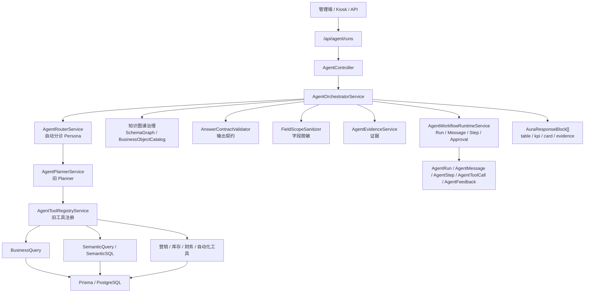
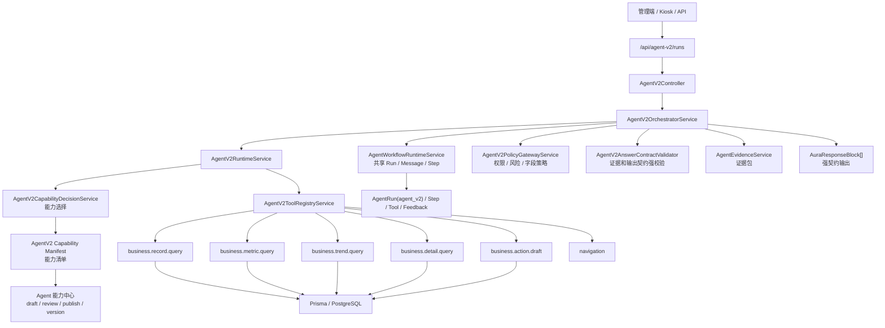
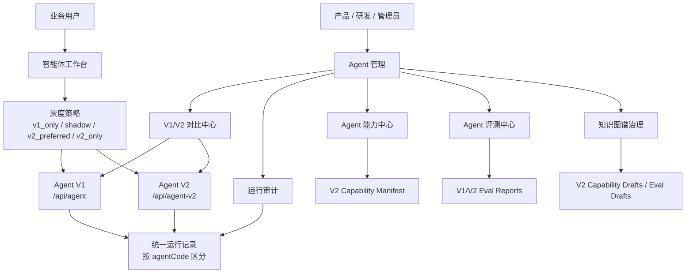

# Agent V1 与 Agent V2 架构对比分析

> 日期：2026-07-04
> 范围：Ami_Core 管理端、Ami Aura Lite 终端、`packages/server-v2/src/agent`、`packages/server-v2/src/agent-v2`、Agent 管理模块设计。

---

## 1. 总结

当前项目里已经形成两套 Agent 引擎：

- **Agent V1**：旧主线 Agent，入口是 `/api/agent/*`，特点是兼容已有业务、Persona 分诊、旧 Planner、旧 ToolRegistry、BusinessQuery 和知识图谱治理混合使用。
- **Agent V2**：新一代独立 Agent，入口是 `/api/agent-v2/*`，特点是 Manifest 驱动、能力中心治理、V2 ToolRegistry、Policy Gateway、AnswerContract 强校验。

两者的核心区别不是“页面不同”，而是 **能力决策方式不同**：

- V1 更像“编排型 Agent”：Router 判断角色，Planner 生成计划，再调用工具。
- V2 更像“能力目录型 Agent”：先从 Manifest 中选中一个明确能力，再按该能力的工具、权限、字段策略和输出契约执行。

---

## 2. Agent V1 架构

### 2.1 V1 架构图



### 2.2 V1 核心链路

1. 用户从管理端或终端发起问题。
2. `/api/agent/runs` 进入 `AgentController`。
3. `AgentOrchestratorService` 调用 `AgentRouterService` 判断 Persona。
4. `AgentPlannerService` 生成计划。
5. `AgentToolRegistryService` 调用旧工具或 BusinessQuery。
6. `AgentEvidenceService`、字段脱敏、AnswerContract 做补充校验。
7. `AgentWorkflowRuntimeService` 记录 run、message、step、tool call、feedback。
8. 返回 `AuraResponseBlock[]` 给前端渲染。

### 2.3 V1 特点

| 项目 | V1 表现 |
|---|---|
| 优势 | 已接入现有管理端和终端，覆盖面较广，兼容历史能力 |
| 问题 | Planner、Skill、Tool、BusinessQuery、知识图谱之间耦合较多 |
| 能力来源 | Persona、CapabilityCatalog、SkillRegistry、ToolRegistry、BusinessQuery |
| 治理方式 | 通过 knowledge scan、eval、运行审计持续补齐 |
| 输出 | 支持 structured blocks，但部分字段和卡片仍有历史补丁痕迹 |
| 风险 | 新问题容易靠关键词、旧规则或兜底能力误命中 |

---

## 3. Agent V2 架构

### 3.1 V2 架构图



### 3.2 V2 核心链路

1. 用户或调试入口调用 `/api/agent-v2/runs`。
2. `AgentV2Controller` 进入 `AgentV2OrchestratorService`。
3. `AgentV2RuntimeService` 调用 `AgentV2CapabilityDecisionService`。
4. 能力只从 `AgentV2 Capability Manifest` 中选择。
5. 命中能力后，按 Manifest 指定的 executor 和 tool 执行。
6. `AgentV2PolicyGatewayService` 做权限、风险、字段策略校验。
7. V2 ToolRegistry 执行 record、metric、trend、detail、draft、navigation 等原生工具。
8. `AgentV2AnswerContractValidator` 强制校验证据和输出契约。
9. 未命中 V2 能力时，返回“V2 当前没有匹配能力”，不应隐式回退 V1。

### 3.3 V2 特点

| 项目 | V2 表现 |
|---|---|
| 优势 | 能力来源明确、可审核、可发布、可版本化 |
| 问题 | 覆盖面依赖 Manifest 和能力中心治理，未发布能力不会自动回答 |
| 能力来源 | V2 Capability Manifest |
| 治理方式 | 草案导入、人工审核、dry-run、eval gate、manifest 发布 |
| 输出 | 强制 evidence、fieldPolicies、AnswerContract |
| 风险 | 如果 Manifest 没覆盖，会直接提示缺能力，短期看起来“不如 V1 灵活” |

---

## 4. V1/V2 对比表

| 维度 | Agent V1 | Agent V2 | 建议 |
|---|---|---|---|
| 产品定位 | 旧主线、兼容层 | 新主线、目标层 | V1 保留，V2 主推 |
| API 入口 | `/api/agent/*` | `/api/agent-v2/*` | 管理模块必须显式区分 |
| 能力决策 | Router + Planner + Skill/Tool | Manifest + CapabilityDecision | 新能力优先进 V2 |
| Persona | 强依赖 Persona 分诊 | 可带 persona，但能力由 Manifest 决定 | Persona 作为权限和场景，不作为唯一能力源 |
| Tool | 旧 ToolRegistry，工具类型较混合 | V2 ToolRegistry，工具命名和结构更收敛 | V2 工具应保持命名空间隔离 |
| 知识图谱 | 辅助 Planner、字段、证据和治理扫描 | 应成为 Manifest 生成和校验底座 | V2 更适合吃知识图谱治理结果 |
| Capability | CapabilityCatalog / SkillRegistry | Capability Manifest / 能力中心 | V1 只读对照，V2 可治理发布 |
| 权限 | 旧 AgentPolicy + 字段脱敏 | PolicyGateway + permissionCodes + fieldPolicies | V2 更适合高风险能力上线 |
| 输出契约 | 有 AnswerContract，但历史兼容较多 | 强制 AnswerContract，失败可拦截 | V2 输出质量更可控 |
| 评测 | knowledge-map / remaining-supported | v2 eval gate / capability drafts | 需要 V1/V2 同题对比 |
| 审计 | run、step、tool、feedback | 同样复用 run 体系，但 agentCode=agent_v2 | 审计列表必须展示引擎版本 |
| 失败策略 | 更容易兜底或走旧能力 | 未命中能力直接 unsupported | V2 不应隐式回退 V1 |
| 适合场景 | 生产兜底、历史能力、覆盖广 | 新能力、灰度、严格验收 | 逐能力灰度迁移 |

---

## 5. 与 Agent 管理模块的关系

Agent 管理模块不能只把几个页面挪到一个菜单下，它要解决 V1/V2 双轨期间的三个问题：

1. **使用入口统一**：普通用户只进“智能体工作台”，不需要理解 V1/V2。
2. **研发验收清晰**：产品和研发能看到一个问题到底由 V1 还是 V2 处理。
3. **能力迁移闭环**：V1 能答但 V2 不能答的问题，能进入 V2 能力草案和评测。

### 5.1 推荐管理模块结构

```text
Agent 管理
├─ 总览
├─ 智能体工作台
├─ V1/V2 对比中心
├─ Agent 运行审计
├─ Agent 能力中心
├─ Agent 评测中心
├─ 知识图谱治理
├─ 自动化与审批
├─ AI 调用审计
└─ 数字员工账单
```

### 5.2 各页面与 V1/V2 的关系

| 页面 | V1 | V2 | 设计重点 |
|---|---|---|---|
| 智能体工作台 | 可作为默认/兜底 | 可作为灰度/目标 | 普通用户不直接选版本，管理员 debug 可选 |
| V1/V2 对比中心 | 左侧对照 | 右侧目标 | 同题双跑，判断迁移优先级 |
| Agent 运行审计 | 必须展示 | 必须展示 | `agent_v1/agent_v2` 是一级筛选 |
| Agent 能力中心 | 只读对照 | 可编辑、审核、发布 | 不再扩展 V1 配置复杂度 |
| Agent 评测中心 | 跑基线 | 跑门禁 | 输出差异报告 |
| 知识图谱治理 | 辅助修补 | 驱动生成和校验 | V2 能力草案应从图谱和 API 扫描生成 |
| AI 调用审计 | 统计调用 | 统计调用 | 引擎、模型、成本分开看 |

---

## 6. V1/V2 对比中心建议

### 6.1 页面结构

```text
V1/V2 对比中心
├─ 单问题对比
├─ 批量 Eval 对比
├─ 能力覆盖矩阵
├─ 失败分类
└─ 迁移建议
```

### 6.2 单问题对比展示

| 区块 | 展示内容 |
|---|---|
| 输入问题 | 用户原始问题、角色、门店、入口 |
| V1 结果 | 命中 persona、capability/skill、工具、答案、blocks、耗时 |
| V2 结果 | 命中 manifest capability、工具、contract、证据、耗时 |
| 对比结论 | v2_better / v1_better / same_quality / v2_missing_capability |
| 下一步 | 生成 V2 能力草案、生成 Eval、标记可灰度、标记暂不迁移 |

### 6.3 批量对比指标

| 指标 | 说明 |
|---|---|
| V1 通过率 | V1 在题库中的成功率 |
| V2 通过率 | V2 在题库中的成功率 |
| V2 覆盖率 | V2 已发布能力覆盖多少问题 |
| V2 契约通过率 | 命中能力后是否输出合规 |
| V2 优于 V1 | 证据、准确度、耗时、结构化输出更好 |
| V1 优于 V2 | 需要补 V2 能力 |
| 双方都失败 | 可能是系统无业务、数据缺口或题目不合理 |

---

## 7. 迁移策略

### 7.1 推荐灰度维度

| 维度 | 说明 |
|---|---|
| 按能力 | 如营销活动链接查询先切 V2 |
| 按 Persona | 如库存采购 Agent 先切 V2 |
| 按门店 | 选择演示门店或内部门店 |
| 按入口 | 管理端先切，终端后切 |
| 按风险 | 低风险查询先切，高风险动作后切 |

### 7.2 推荐状态

| 状态 | 含义 |
|---|---|
| `v1_only` | 只走 V1 |
| `shadow` | 用户拿 V1 答案，后台跑 V2 对比 |
| `v2_preferred` | V2 命中已发布能力则用 V2 |
| `v2_only` | 强制 V2，用于验收或已成熟能力 |
| `legacy_retired` | V1 对应能力退役 |

---

## 8. 产品建议

1. **不要让普通用户选择 V1/V2**
   用户只需要一个“洞悉美业智能体”入口。V1/V2 是管理和灰度概念。

2. **V2 是未来主线，V1 是兼容基线**
   新增能力、评测、权限、字段策略、输出契约都应该优先进入 V2。

3. **Agent 能力中心只治理 V2**
   V1 可以做只读对照，不建议继续扩展 V1 的配置复杂度。

4. **V1/V2 对比中心必须做**
   没有对比中心，就无法判断 V2 是否真的更好，也无法有序退役 V1。

5. **运行审计必须按引擎筛选**
   每条 run 都要明确是 `agent_v1` 还是 `agent_v2`，否则验收会混淆。

6. **知识图谱治理应主要服务 V2**
   SchemaGraph、BusinessObjectCatalog、字段字典和 API 扫描结果，应优先生成 V2 capability drafts 和 eval cases。

---

## 9. 最终推荐架构



最终原则：

- **一个用户入口，两个引擎版本。**
- **V1 保稳定，V2 做未来。**
- **管理模块负责对比、治理、灰度、退役，而不是把复杂度暴露给业务用户。**
