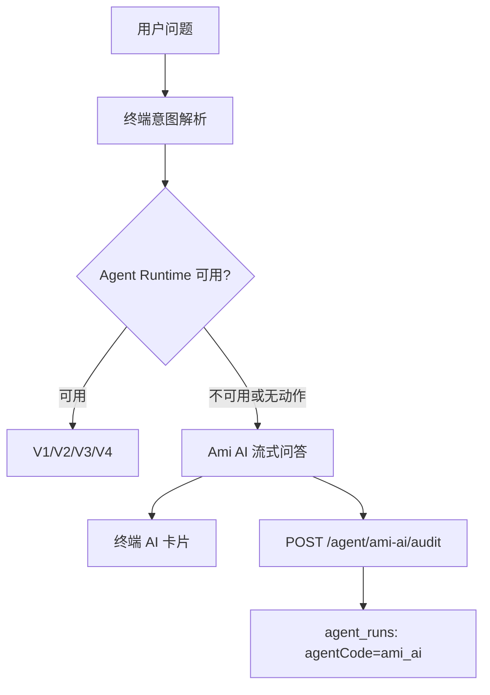
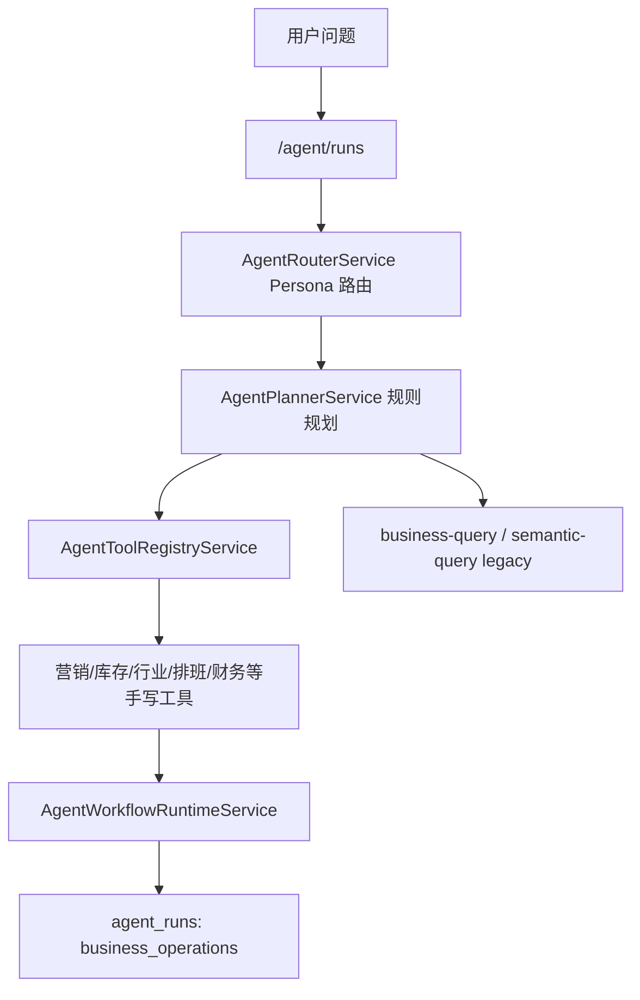
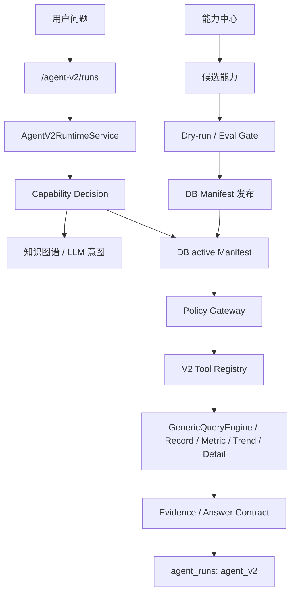
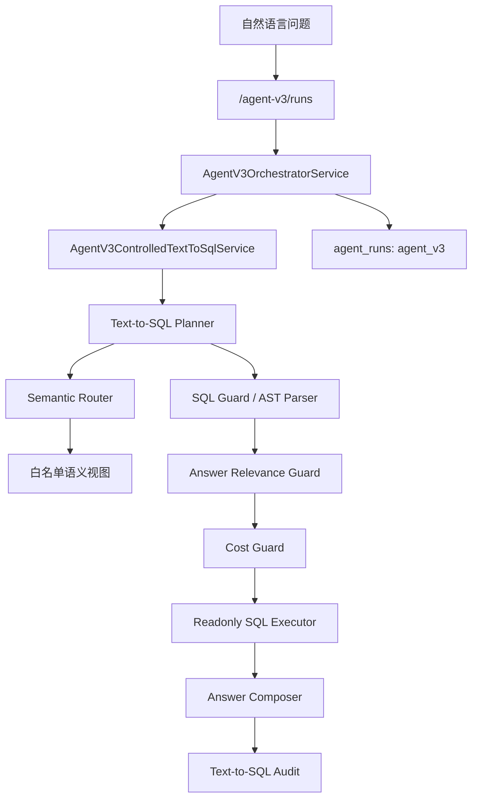
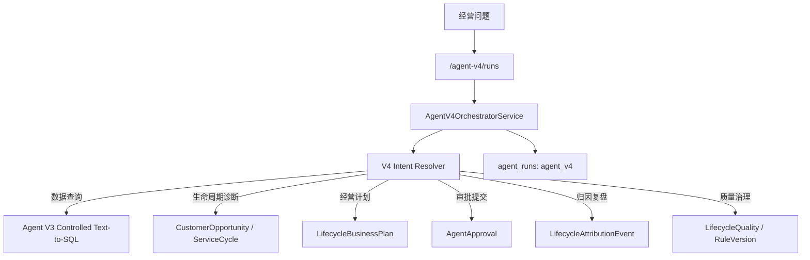
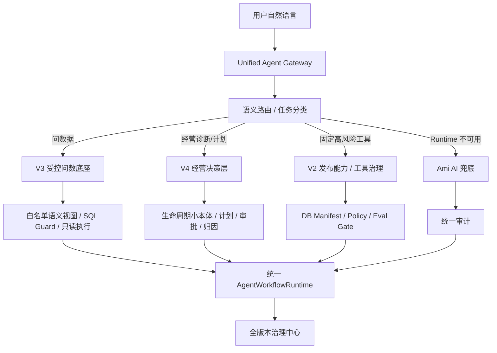

# Agent 全版本架构对比分析

> 日期：2026-07-08
> 范围：Ami AI / Agent V1 / Agent V2 / Agent V3 / Agent V4
> 目标：厘清各版本技术架构、能力边界、优劣势，以及未来正式版本值得复用的模块。
> 结论：未来正式版不建议继续保留多个用户可见版本长期并行；更适合收敛成“统一 Agent Runtime + V3 受控问数底座 + V4 经营决策层 + V2 治理发布体系 + Ami AI 兜底体验”的组合架构。

## 1. 当前版本总览

| 版本 | 当前定位 | 运行入口 | 后端 agentCode | 核心技术路线 | 产品状态 |
| --- | --- | --- | --- | --- | --- |
| Ami AI | 兜底问答 / AI 建议 | Kiosk 流式问答、Agent Runtime 失败兜底 | `ami_ai` | 终端侧业务上下文 + AI 问答流 + 统一审计写入 | 可保留为兜底层，不应作为主运行版本 |
| Agent V1 | 旧业务工具链 / 角色工具 Agent | `/agent/*`、终端 V1 | `business_operations` | 规则路由 + Persona + 手写工具 + legacy business-query/semantic-query | 兼容保留，不建议继续扩新能力 |
| Agent V2 | 能力目录与治理型 Agent | `/agent-v2/*`、能力中心、治理中心 | `agent_v2` | DB active Manifest + 知识图谱/LLM 意图 + Tool Registry + Policy Gateway + Eval Gate | 适合作为能力治理和发布体系 |
| Agent V3 | 独立受控 Text-to-SQL 问数 Agent | `/agent-v3/*`、终端 V3 | `agent_v3` | 语义路由 + 白名单语义视图 + SQL Guard + Cost Guard + 只读执行 + 答案相关性校验 | 适合作为未来问数底座 |
| Agent V4 | 生命周期经营 Agent | `/agent-v4/*`、终端 V4 | `agent_v4` | 生命周期小本体 + 经营计划/审批草稿 + 归因复盘 + 复用 V3 只读查询 | 正在引入，适合作为经营决策层 |

## 2. 端到端运行链路

### 2.1 终端版本切换

终端顶部当前支持 `V1 / V2 / V3 / V4` 切换：

- `packages/Ami-Aura-Lite-Kiosk/src/app/components/TopStatusBar.tsx`
- `packages/Ami-Aura-Lite-Kiosk/src/app/AppContent.tsx`
- `packages/Ami-Aura-Lite-Kiosk/src/app/services/terminalAgentAdapter.ts`
- `packages/Ami-Aura-Lite-Kiosk/src/app/services/agentRuntimeService.ts`

核心逻辑：

1. 终端保存当前选择的 `agentEngine`。
2. 微应用意图进入 Agent Runtime 时，把 `agentEngine`、`architecture`、`terminalFacts` 放进上下文。
3. `agentRuntimeService` 根据版本分别调用：
   - V1：`createAgentRun` / `appendAgentMessage`
   - V2：`createAgentV2Run` / `appendAgentV2Message`
   - V3：`createAgentV3Run` / `appendAgentV3Message`
   - V4：`createAgentV4Run` / `appendAgentV4Message`
4. Runtime 调用失败时，终端切换到 Ami AI 流式兜底，并把新兜底回答写入统一 `agent_runs`。

### 2.2 统一运行审计

各版本最终都写入 `agent_runs`：

- V1 默认 `agentCode=business_operations`
- V2 固定 `agentCode=agent_v2`
- V3 固定 `agentCode=agent_v3`
- V4 固定 `agentCode=agent_v4`
- Ami AI 固定 `agentCode=ami_ai`

当前治理中心已经支持 `all / ami_ai / agent_v1 / agent_v2 / agent_v3` 的运行指标筛选，但尚未把 `agent_v4` 纳入治理筛选类型。这是当前版本边界的一个明显缺口：终端已经有 V4，后端也有 V4 审计记录，但治理中心的“全版本运行审计”还没有覆盖 V4。

## 3. Ami AI

### 3.1 技术架构

Ami AI 不是独立 Agent Runtime，而是终端侧兜底问答能力：

关键实现：

- 终端兜底：`packages/Ami-Aura-Lite-Kiosk/src/app/microApps/runMicroApp.ts`
- 流式展示与审计：`packages/Ami-Aura-Lite-Kiosk/src/app/AppContent.tsx`
- 审计写入：`packages/server-v2/src/agent/agent.controller.ts`

### 3.2 能力

- Agent Runtime 异常时继续给用户一个可读回答。
- 可以基于终端上下文给经营建议或解释。
- 新增后可以被统一运行审计和“无用”反馈诊断统计。

### 3.3 优势

- 用户体验韧性强：主 Runtime 挂了也不至于空白。
- 接入成本低：不依赖 Manifest、语义视图或审批流。
- 对非结构化建议友好：适合“给我建议”“怎么处理”类问题。

### 3.4 劣势

- 不适合作为事实型问数主链路，容易回答泛化。
- 对权限、字段脱敏、证据引用和可重复性控制弱于 V2/V3/V4。
- 不是严格业务动作执行器，不能承诺结果准确来自数据库。

### 3.5 值得复用

- 流式体验。
- Runtime 不可用兜底机制。
- 兜底原因、回答摘要、用户反馈写入统一审计。
- “建议由 Ami AI 生成，业务事实以 Ami_Core 数据为准”的产品提示口径。

### 3.6 不建议复用为正式主链路

- 不建议让 Ami AI 直接承担正式问数、经营计划或自动化动作。
- 正式版中 Ami AI 应定位为“体验兜底层”，不是“事实源”。

## 4. Agent V1

### 4.1 技术架构

V1 是旧主线 Agent：

关键实现：

- Runtime 入口：`packages/server-v2/src/agent/agent.controller.ts`
- 编排器：`packages/server-v2/src/agent/agent-orchestrator.service.ts`
- 角色路由：`packages/server-v2/src/agent/agent-router.service.ts`
- 规则规划：`packages/server-v2/src/agent/agent-planner.service.ts`
- legacy 问数：`packages/server-v2/src/business-query/business-query.service.ts`

### 4.2 能力

- 多 Persona：店长、营销、前台、美容师、库存、财务。
- 能调用较多手写工具，覆盖经营简报、财务、库存、营销、预约等。
- 有审批、工具调用、消息、步骤、证据等运行时结构。
- business-query/semantic-query 提供旧版问数能力。

### 4.3 优势

- 历史覆盖面广，很多早期业务功能已接入。
- 手写工具确定性较强，适合固定任务。
- Persona 路由、审批、工具调用、运行审计这些基础模块值得保留。

### 4.4 劣势

- 规划逻辑大量依赖规则和手写分支，新增能力成本高。
- 旧 business-query/semantic-query 已被标记为 `agent_v1_legacy`，不适合作为未来主问数入口。
- 问法变化时，容易落不到正确工具。
- 能力治理、发布、评测与自动化程度弱于 V2。

### 4.5 值得复用

- `AgentWorkflowRuntimeService`：统一 Run / Message / Step / ToolCall / Approval 存储。
- `AgentRouterService` 的 Persona 思路：但正式版应升级为语义路由 + 权限路由，而不是纯关键词。
- `AgentPolicyService` / 审批流基础设施。
- `AgentEvidenceService` / 运行步骤记录。
- 终端上下文、角色、门店、设备身份传递方式。

### 4.6 应限制继续扩展

- 不建议继续在 V1 `AgentPlannerService` 里增加大量新 if/else 能力。
- 不建议继续增强 legacy business-query 作为主问数能力。
- V1 应转为兼容层和少量固定工具入口。

## 5. Agent V2

### 5.1 技术架构

V2 是能力目录和治理发布型 Agent：

关键实现：

- 运行入口：`packages/server-v2/src/agent-v2/agent-v2.controller.ts`
- 编排器：`packages/server-v2/src/agent-v2/agent-v2-orchestrator.service.ts`
- Runtime：`packages/server-v2/src/agent-v2/agent-v2-runtime.service.ts`
- Manifest Provider：`packages/server-v2/src/agent-v2/capability-center/agent-v2-manifest-provider.service.ts`
- Policy Gateway：`packages/server-v2/src/agent-v2/policy/agent-v2-policy-gateway.service.ts`
- 能力中心：`packages/server-v2/src/agent-v2/capability-center/*`
- 知识图谱：`packages/server-v2/src/agent-v2/knowledge-graph/*`

### 5.2 能力

- 基于 DB active Manifest 运行，不再默认混入内置 Manifest。
- 支持能力候选、自动治理、评测门禁、dry-run、发布版本。
- 支持字段策略：allow / mask / deny。
- 支持权限、Persona、releaseStrategy、风险等级、人工审批。
- 支持知识图谱 + LLM 意图与 legacy regex 灰度对比。

### 5.3 优势

- 治理体系最完整：能力从候选、评测、审批到发布都有闭环。
- 能力目录适合可控发布，适合“正式业务工具”。
- 安全性强：Manifest、权限、字段策略、发布策略都可审计。
- 对产品管理友好：能力中心能解释“哪些能力已发布、待补齐、待复核”。

### 5.4 劣势

- 对自由组合分析不够灵活；每类新问题都可能需要补 capability、queryKey、tool branch。
- Manifest 维护成本高，发布门禁严格，短期迭代慢。
- 如果工具内部没有支持对应 capabilityId，会出现“工具已注册但内部尚未支持”。
- 不适合作为自由 Text-to-SQL 的唯一入口。

### 5.5 值得复用

- 能力中心和 Manifest 发布治理。
- Dry-run / Eval Gate / Answer Contract。
- Policy Gateway 字段级控制和证据审计。
- 知识图谱构建与能力自动治理经验。
- 全版本运行审计和无用诊断思路。

### 5.6 正式版定位建议

V2 不应继续承担所有用户问法的实时运行；它更适合成为“正式能力治理和发布后台”：

- 治理 V3/V4 的语义视图、业务动作、工具能力。
- 发布可执行工具和自动化动作。
- 作为高风险动作进入审批和发布门禁的控制台。

## 6. Agent V3

### 6.1 技术架构

V3 是独立受控 Text-to-SQL 数据分析 Agent：

关键实现：

- 运行入口：`packages/server-v2/src/agent-v3/agent-v3.controller.ts`
- 编排器：`packages/server-v2/src/agent-v3/agent-v3-orchestrator.service.ts`
- Text-to-SQL 模块：`packages/server-v2/src/agent-v3/text-to-sql/*`
- 共享时间解析：`packages/server-v2/src/agent-v3/utils/agent-v3-date-range.ts`
- API：`src/api/real/agentV3.ts`

### 6.2 能力

- 面向自然语言问数：营业额、商品销量、项目销量、库存报废、客户消费、趋势对比等。
- 支持语义视图白名单、字段策略、权限、门店范围。
- 只允许 SELECT 只读查询。
- 支持 SQL Guard、Cost Guard、相关性校验。
- 支持中文表头、小数格式、日期格式和前端展示规范。

### 6.3 优势

- 灵活性最好，能覆盖大量临时问数和自由组合分析。
- 比纯 LLM 生成 SQL 安全：有白名单视图、SQL Guard、只读账号、字段策略、成本控制。
- 适合未来作为“所有业务数据可问”的底座。
- 能被 V4 复用，不需要每个经营 Agent 重新实现 SQL。

### 6.4 劣势

- 语义路由和字段含义仍可能误判，导致“最近最受欢迎的项目”查成客户或商品。
- 白名单语义视图不完整时，会看似能答，实际答偏。
- 需要持续维护业务词典、语义视图、同义词、指标口径和 answer relevance guard。
- 对写动作、经营计划、审批编排不适合，必须上层 Agent 接管。

### 6.5 值得复用

- V3 Controlled Text-to-SQL 整条安全链路。
- Semantic View Registry。
- SQL Guard / AST Parser / Cost Guard。
- Readonly SQL Executor。
- Answer Composer 和格式化层。
- Answer Relevance Guard。
- Text-to-SQL Audit。

### 6.6 正式版定位建议

V3 应作为未来正式版的“数据分析底座”，但用户不一定需要看到 V3 这个版本名。正式产品里可以把它变成：

- 通用问数服务。
- V4 和未来经营 Agent 的只读数据工具。
- 治理中心的语义视图、口径和错误诊断对象。

## 7. Agent V4

### 7.1 技术架构

V4 是基于客户全生命周期服务营销小本体的经营 Agent：

关键实现：

- 模块：`packages/server-v2/src/agent-v4/agent-v4.module.ts`
- 入口：`packages/server-v2/src/agent-v4/agent-v4.controller.ts`
- 编排器：`packages/server-v2/src/agent-v4/agent-v4-orchestrator.service.ts`
- 前端 API：`src/api/real/agentV4.ts`
- 产品方案：`docs/03-开发计划/01-AI智能体与问数能力/Agent V4基于客户全生命周期服务营销小本体升级详细方案-2026-07-08.md`

### 7.2 能力

- 生命周期机会诊断。
- 护理周期、次卡到期、沉睡召回、领券未核销、浏览未预约等机会解释。
- 经营计划草稿生成。
- 经营计划审批提交。
- 归因复盘。
- 规则与质量治理。
- 只读数据分析时复用 V3 Text-to-SQL。

### 7.3 优势

- 产品目标更接近“智能经营助手”，不是只查数据。
- 能把客户、营销、库存、产能、审批、归因串成经营闭环。
- 风险边界清楚：只生成建议、计划、草稿和审批申请，不直接发券、群发、改客户资产、扣库存、创建订单或改排班。
- 复用 V3 问数能力，避免再次发明 SQL。

### 7.4 劣势

- 当前仍是新引入链路，治理中心未完全纳入 V4 版本筛选。
- Intent Resolver 目前偏规则匹配，后续复杂问法仍可能误路由。
- 生命周期小本体数据质量会直接影响 V4 输出质量。
- 需要把审批后的动作执行边界和营销模块真实草稿接口继续打磨。

### 7.5 值得复用

- “经营 Agent = 决策层 + 只读问数工具 + 草稿/审批边界”的架构。
- 生命周期小本体数据结构和证据包。
- 经营计划草稿、审批、归因、质量治理的闭环。
- V4 复用 V3 而不是复制 V3 的方式。

### 7.6 需要补齐

- 治理中心 `engine=agent_v4`。
- V4 无用诊断归因：区分语义路由错、生命周期数据缺、V3 查询错、审批/草稿失败。
- V4 运行详情展示：意图、生命周期证据、V3 查询 trace、审批边界。
- V4 Intent Resolver 从规则升级为“小本体语义路由 + 约束计划”。

## 8. 横向优劣势对比

| 维度 | Ami AI | V1 | V2 | V3 | V4 |
| --- | --- | --- | --- | --- | --- |
| 自由问法适配 | 中 | 低-中 | 中 | 高 | 中-高 |
| 数据准确性 | 低-中 | 中 | 高，限已发布能力 | 高，取决于语义视图和路由 | 高，取决于本体和 V3 |
| 业务动作能力 | 无 | 中 | 高，可治理 | 无，只读 | 中，草稿/审批 |
| 安全边界 | 弱 | 中 | 强 | 强 | 强 |
| 证据可追溯 | 弱-中 | 中 | 强 | 强 | 强 |
| 新能力扩展成本 | 低 | 高 | 中-高 | 中 | 中 |
| 适合临时问数 | 中 | 低 | 低-中 | 高 | 中 |
| 适合正式发布能力 | 低 | 中 | 高 | 中-高 | 高 |
| 适合经营闭环 | 低 | 中 | 中 | 低 | 高 |
| 长期维护成本 | 中 | 高 | 中 | 中 | 中 |

## 9. 边界是否切干净

### 9.1 已经切干净的部分

1. 后端 Runtime 入口已独立：
   - V1：`/agent`
   - V2：`/agent-v2`
   - V3：`/agent-v3`
   - V4：`/agent-v4`

2. 运行记录已通过 `agentCode` 区分：
   - `business_operations`
   - `agent_v2`
   - `agent_v3`
   - `agent_v4`
   - `ami_ai`

3. 终端版本选择已能路由到不同 API。

4. V3 是独立 Text-to-SQL，不再依赖 V2 Manifest。

5. V4 是独立生命周期经营 Agent，数据查询复用 V3，但不直接混入 V3 Runtime。

### 9.2 还没有完全切干净的部分

1. 治理中心版本筛选缺 V4
   当前全版本运行审计只支持 `all / ami_ai / agent_v1 / agent_v2 / agent_v3`，需要补 `agent_v4`。

2. V1 旧模块仍然很大
   `AgentModule` 里仍保留大量旧工具、semantic-query、business-query、知识图谱组件。未来需要标注为 legacy/internal，避免新能力继续进入 V1。

3. V2 Text-to-SQL 历史链路仍在
   V2 目录下仍有 text-to-sql 模块，应明确为治理/候选能力工具，不作为用户主问数入口。

4. V4 复用 V3 的 trace 展示还不够产品化
   用户看到 V4 回答时，应能展开看到“生命周期证据 + V3 查询证据”，否则排障困难。

5. Ami AI 与正式 Agent 结果在 UI 上需要更清晰
   Ami AI 是兜底建议，不应和 V3/V4 的事实型回答表现得一样。

## 10. 未来正式版本推荐架构

不建议未来继续以 `V1 / V2 / V3 / V4` 作为长期面向用户的版本选择。建议内部保留版本边界，产品上收敛为一个“正式 Agent”：

### 10.1 正式版模块复用建议

| 来源版本 | 建议复用模块 | 复用方式 |
| --- | --- | --- |
| Ami AI | 流式兜底、兜底审计、用户体验提示 | 作为最后兜底层 |
| V1 | `AgentWorkflowRuntimeService`、审批/消息/步骤/工具调用模型、Persona 经验 | 提取为统一 runtime 基础设施 |
| V2 | 能力中心、Manifest 发布、Policy Gateway、Eval Gate、Answer Contract、字段策略 | 作为治理发布后台 |
| V3 | Controlled Text-to-SQL、Semantic View、SQL Guard、Cost Guard、只读执行、格式化输出 | 作为正式问数底座 |
| V4 | 生命周期小本体、经营计划、审批草稿、归因复盘、质量治理 | 作为经营决策和自动化编排层 |

### 10.2 不建议继续复用的部分

- V1 大量规则 if/else Planner。
- V1 legacy business-query 作为新问数入口。
- V2 运行期继续为每个自由问法补 capabilityId。
- V2 内旧 Text-to-SQL 作为用户主入口。
- Ami AI 直接生成事实型业务结论。

## 11. 建议的正式版演进路径

### P0：补齐当前治理缺口

1. 治理中心 `AgentGovernanceEngineFilter` 增加 `agent_v4`。
2. 后端 governance service 增加 `agent_v4 -> agentCode=agent_v4` 映射。
3. 全版本运行审计表和详情支持 V4。
4. 无用诊断支持 V4：区分生命周期本体缺口、V3 查询错误、计划/审批失败。

### P1：收敛用户入口

1. 终端顶部不再长期展示技术版本，改成业务模式：
   - 数据分析
   - 经营助手
   - 自动化草稿
   - 兜底问答
2. 内部仍保留 `agent_v3` / `agent_v4` / `agent_v2` / `ami_ai` agentCode。
3. 默认路由：
   - 事实问数 -> V3
   - 生命周期经营 -> V4
   - 高风险动作 -> V2 治理能力 + 审批
   - 失败兜底 -> Ami AI

### P2：正式统一 Agent Gateway

1. 新增统一入口，隐藏历史版本：
   - `POST /agent-runtime/runs`
   - `POST /agent-runtime/runs/:id/messages`
2. Gateway 内部按任务类型路由到 V3/V4/V2。
3. 所有结果统一走 Answer Contract、Evidence、Run Audit。
4. V1 只保留内部兼容，不再出现在终端版本选择里。

### P3：治理中心升级为产品质量闭环

1. 全版本指标：成功率、答非所问率、无用率、兜底率、阻断率、审批通过率。
2. 按版本诊断：
   - Ami AI：兜底原因、泛化回答、缺事实证据。
   - V1：legacy 工具缺口、规则路由错。
   - V2：Manifest 缺能力、dry-run 失败、policy 阻断。
   - V3：语义视图缺口、SQL Guard 阻断、答案相关性失败。
   - V4：生命周期数据缺口、经营计划失败、归因缺失、V3 只读查询失败。
3. “无用”反馈自动生成修复建议，并能沉淀到知识图谱、语义视图或能力中心。

## 12. 最终建议

未来正式版最值得沉淀的不是某一个历史版本，而是各版本的强项组合：

1. 用 V3 做“问数底座”：解决所有业务、模块、数据都能被自然语言查询的问题。
2. 用 V4 做“经营闭环”：把数据分析升级为客户生命周期机会、经营计划、审批草稿、归因复盘。
3. 用 V2 做“治理后台”：发布能力、控制权限、评测门禁、字段策略、审计诊断。
4. 用 V1 做“兼容层”：保留早期固定工具和运行时基础设施，但不扩新能力。
5. 用 Ami AI 做“兜底层”：保证体验不断，但不作为事实型主链路。

产品上应逐步从“多版本切换”转向“一个正式 Agent，内部多引擎路由”。这样用户不用理解 V1/V2/V3/V4，系统内部仍然保留清晰的技术边界、治理指标和可回滚能力。
