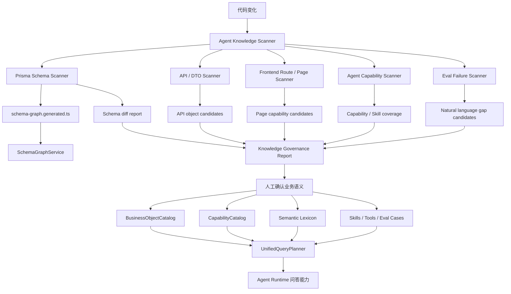

# Agent 知识图谱自动发现与治理开发方案

> 版本：2026-07-02
> 适用范围：Ami_Core 管理端持续迭代时，自动发现业务对象、数据库结构、API、页面和 Agent 能力缺口，减少每次人工维护 SchemaGraph / BusinessObjectCatalog / CapabilityCatalog 的成本。

---

## 1. 背景与目标

当前 Agent 已具备以下基础：

- `SchemaGraph`：从 Prisma schema 自动生成数据库模型、字段、索引和关系。
- `BusinessObjectCatalog`：人工维护业务对象、中文名、业务含义、来源模型、可查字段、展示字段。
- `EntityResolver`：根据用户问题查询真实业务对象，如客户、项目、商品、活动、订单、卡项。
- `CapabilityCatalog`：把自然语言问题映射到 Agent 能力。
- `UnifiedQueryPlanner`：把实体解析和能力匹配合成执行计划。
- `agent:knowledge:generate`：已有自动生成 `schema-graph.generated.ts` 的命令。

问题是：管理端仍在快速迭代，新增页面、API、DTO、表字段和业务模块后，Agent 知识底座不一定同步更新，容易出现：

- 管理端已有业务，但 Agent 不知道。
- 数据库有新字段，但字段中文名、业务含义缺失。
- 新页面有新流程，但没有对应 Agent Skill / Capability。
- 新 API 可查询真实数据，但 Agent 仍走 legacy fallback。
- 评测失败后靠人工逐条打补丁，缺少持续治理机制。

本方案目标：

1. **结构变化自动发现**：Prisma / API / DTO / 前端路由 / 类型变化自动扫描。
2. **知识图谱自动更新**：数据库结构自动生成，未同步时阻断。
3. **业务语义半自动治理**：系统自动提出候选，人工确认业务含义。
4. **Agent 能力缺口可量化**：新增业务是否进入 Agent 能力目录、技能和评测集可追踪。
5. **按风险分频率执行**：提交前跑轻量门禁，每日跑全量巡检，每周做人工治理。

---

## 2. 核心原则

### 2.1 自动化边界

| 内容 | 自动化程度 | 策略 |
|---|---:|---|
| Prisma 表、字段、索引、relation | 高 | 自动生成、提交前阻断 |
| 后端 Controller / DTO / API 变化 | 中 | 自动扫描候选，核心 API 缺 Agent 映射可阻断 |
| 前端路由、菜单、页面变化 | 中 | 自动扫描候选，生成 Agent 覆盖缺口 |
| 字段中文名、业务对象归类 | 中低 | 自动推荐，人工确认 |
| 用户自然语言问法、业务同义词 | 中低 | 从 Eval 失败样本自动提取候选，人工确认 |
| 财务/库存/营销计算口径 | 低 | 必须人工确认，不能自动猜 |
| 高风险动作权限、审批策略 | 低 | 必须人工确认并进入测试 |

### 2.2 执行原则

- **结构变化自动发现，业务含义人工确认。**
- **P0 能力阻断发布，P1/P2 进入日报和周报治理。**
- **新增业务不要求立即全量智能化，但必须能被发现、被记录、被分级。**
- **Agent 不会答但系统已有业务，归为 Agent 能力缺口，不归为系统不支持。**
- **legacy fallback 不是长期方案，必须有命中统计和废弃候选。**

---

## 3. 目标架构



---

## 4. 自动发现范围

### 4.1 Prisma Schema 自动发现

扫描源：

- `packages/server-v2/prisma/schema.prisma`

已有输出：

- `packages/server-v2/src/agent/knowledge/generated/schema-graph.generated.ts`

需要增强：

- 生成前后 diff 检查。
- 对新增 model / field / relation 输出风险等级。
- 对新增业务模型判断是否已纳入 `BusinessObjectCatalog`。
- 对敏感字段自动标记并进入脱敏门禁。

新增报告建议：

```json
{
  "schemaChanged": true,
  "newModels": ["MemberGiftAllocation"],
  "newFields": [
    {
      "model": "CustomerCard",
      "field": "giftAllocationRate",
      "type": "Decimal",
      "risk": "medium",
      "reason": "金额/比例类字段，需要确认业务含义和展示口径"
    }
  ],
  "missingBusinessObjects": ["MemberGiftAllocation"],
  "missingDisplayNames": ["CustomerCard.giftAllocationRate"]
}
```

### 4.2 API / DTO 自动发现

扫描源：

- `packages/server-v2/src/**/*.controller.ts`
- `packages/server-v2/src/**/dto/*.ts`
- `src/api/real/*.ts`
- `src/api/*.ts`

发现内容：

- 新增 endpoint。
- 新增查询参数。
- 新增返回字段。
- 新增真实数据 API 但没有 Agent Tool。
- 新增写操作 API 但没有审批/权限策略。

判断规则：

| 规则 | 输出 |
|---|---|
| Controller 新增 GET 查询 API | 生成 `candidateCapability` |
| Controller 新增 POST/PUT/DELETE | 生成 `candidateTool` + `riskLevel` |
| DTO 字段包含 amount/price/cost/profit/rate | 标记财务口径待确认 |
| DTO 字段包含 phone/token/password/secret | 标记敏感字段 |
| `src/api/real/*` 有新方法但 Agent ToolRegistry 无对应工具 | 标记 Agent 工具缺口 |

### 4.3 前端路由 / 页面自动发现

扫描源：

- `src/app/routes.tsx`
- `src/app/pages/**/*.tsx`
- `src/app/pages/workbench/workbenchConfig.ts`
- `src/config/permissions.ts`

发现内容：

- 新页面。
- 新菜单。
- 新权限码。
- 页面引用的新 API。
- 页面展示的新业务字段。

判断规则：

| 规则 | 输出 |
|---|---|
| 新页面路径出现 `finance/inventory/order/customer/marketing/scheduling` | 推荐对应 Agent persona |
| 新权限码出现但 Agent Role Policy 未覆盖 | 标记权限缺口 |
| 页面展示字段没有中文字段映射 | 标记展示字典缺口 |
| 页面有列表/详情/统计但无对应 Eval 问题 | 标记评测缺口 |

### 4.4 Agent 能力目录自动发现

扫描源：

- `packages/server-v2/src/agent/knowledge/capability-catalog.service.ts`
- `packages/server-v2/src/agent/skills/agent-skills.registry.ts`
- `packages/server-v2/src/agent/agent-tool-registry.service.ts`
- `packages/server-v2/src/business-query/business-query.capabilities.ts`
- `packages/server-v2/src/business-query/business-query.service.ts`

发现内容：

- BusinessQuery capability 是否 implemented。
- CapabilityCatalog 是否有对应能力。
- Skill 是否暴露给正确 persona。
- ToolRegistry 是否有可执行工具。
- BusinessQueryService 是否有真实执行分支。
- Answer Contract 是否要求正确输出类型。

判断规则：

| 规则 | 级别 |
|---|---|
| capability 标记 implemented，但 BusinessQueryService 无执行映射 | P0 阻断 |
| ToolRegistry 有工具，但 Skill/Capability 未暴露 | P1 |
| CapabilityCatalog 有能力，但 Eval 无覆盖 | P1 |
| legacy fallback 连续命中同一原因 | P1 |
| 已连续两个窗口未命中 fallback reason | 进入废弃候选 |

### 4.5 Eval 失败样本自动发现

扫描源：

- `docs/04-测试数据/agent-eval-questions.md`
- `docs/04-测试数据/agent-eval-remaining-supported-report.json`
- `docs/04-测试数据/agent-eval-knowledge-map-report.json`
- AgentRun / AgentToolCall / AgentFeedback 运行记录

发现内容：

- 高频失败问法。
- 缺实体解析。
- 缺能力目录。
- 缺工具。
- 缺输出类型。
- 权限承接错误。
- 数据来源缺失。

输出分类：

- `route_error`
- `entity_resolution_gap`
- `capability_missing`
- `skill_missing`
- `tool_missing`
- `query_template_missing`
- `missing_output_kind`
- `missing_evidence`
- `permission_error`
- `runtime_error`
- `legacy_fallback_overuse`

---

## 5. 推荐执行频率与门禁规则

### 5.1 总体规则

| 触发点 | 频率 | 扫描内容 | 是否阻断 |
|---|---:|---|---|
| Prisma schema 变更 | 每次提交/构建前 | 重新生成 SchemaGraph，检查 diff | 阻断 |
| 后端 Controller/DTO 变更 | 每次 PR/提交前 | 新 API、新字段、新权限、新风险动作 | 核心 API 可阻断 |
| 前端路由/菜单/页面变更 | 每次 PR/提交前 | 新页面、新菜单、新权限、页面字段 | 提醒 |
| Agent 能力目录/词典/Skill 变更 | 每次提交前 | P0 knowledge-map eval | 阻断 |
| 每日定时 | 每天 06:00 | 全量 Agent 能力缺口、fallback 统计、失败 Top 分类 | 不阻断 |
| 每周定时 | 每周一 09:30 | legacy 清理、业务字典候选、评测集归档 | 人工 review |

### 5.2 P0 阻断条件

满足任一条件，提交/发布应阻断：

- `schema.prisma` 已变化，但 `schema-graph.generated.ts` 未同步。
- 新增 Prisma model 属于业务域，但未进入 `BusinessObjectCatalog` 候选报告。
- `BusinessQueryCapability.implemented = true`，但没有执行分支。
- 高风险写操作 Tool 没有审批策略。
- 敏感字段出现在响应 blocks 中且未脱敏。
- `agent:eval:knowledge-map:gate:p0` 失败。
- P0 Eval 问题通过率下降。

### 5.3 P1 提醒条件

进入日报/周报，不阻断普通开发：

- 新增页面没有 Agent capability 候选。
- 新 API 没有 Agent Tool 候选。
- 新字段没有中文名。
- 新业务对象没有 Eval 问题。
- 同一 fallback reason 连续多次命中。
- EntityResolver 有多个候选但缺澄清问题。

### 5.4 P2 观察条件

仅进入治理台趋势：

- 新增展示字段未配置排序/格式化。
- 字段自动中文名置信度低。
- Capability 命中置信度低但 fallback 可回答。
- 低频失败问法。

---

## 6. 新增脚本与命令设计

### 6.1 `agent:knowledge:generate`

已有命令，保留：

```powershell
npm.cmd --prefix packages/server-v2 run agent:knowledge:generate
```

职责：

- 从 Prisma schema 生成 `schema-graph.generated.ts`。
- 不做业务语义判断。

### 6.2 新增 `agent:knowledge:scan`

建议新增：

```powershell
npm.cmd --prefix packages/server-v2 run agent:knowledge:scan
```

职责：

- 扫 Prisma / Controller / DTO / routes / API client / Agent 能力目录。
- 输出综合发现报告。

输出文件：

- `docs/04-测试数据/agent-knowledge-scan-report.json`
- `docs/04-测试数据/agent-knowledge-scan-summary.md`

### 6.3 新增 `agent:knowledge:check`

建议新增：

```powershell
npm.cmd --prefix packages/server-v2 run agent:knowledge:check
```

职责：

- 提交前轻量门禁。
- 检查生成文件是否同步。
- 检查 P0 能力映射是否完整。
- 检查敏感字段和高风险动作。

失败时退出非 0。

### 6.4 新增 `agent:knowledge:daily`

建议新增：

```powershell
npm.cmd --prefix packages/server-v2 run agent:knowledge:daily
```

职责：

- 跑 P2 knowledge-map eval。
- 跑 remaining-supported plan。
- 汇总 fallback reason。
- 输出日报。

### 6.5 新增 `agent:knowledge:weekly`

建议新增：

```powershell
npm.cmd --prefix packages/server-v2 run agent:knowledge:weekly
```

职责：

- 生成业务对象候选合并建议。
- 生成词典候选。
- 生成 capability 候选。
- 生成 legacy fallback 废弃候选。
- 输出人工 review 清单。

---

## 7. 报告结构设计

### 7.1 综合扫描报告 JSON

```ts
type AgentKnowledgeScanReport = {
  generatedAt: string;
  git: {
    branch: string;
    commit?: string;
    changedFiles: string[];
  };
  schema: {
    changed: boolean;
    generatedInSync: boolean;
    newModels: string[];
    newFields: Array<{
      model: string;
      field: string;
      type: string;
      risk: 'low' | 'medium' | 'high';
      reason: string;
    }>;
    missingBusinessObjectMappings: string[];
    missingDisplayNames: string[];
  };
  api: {
    newEndpoints: Array<{
      method: string;
      path: string;
      controller: string;
      risk: 'low' | 'medium' | 'high';
      candidatePersona?: string;
      candidateCapability?: string;
    }>;
    dtoFieldCandidates: Array<{
      dto: string;
      field: string;
      reason: string;
    }>;
  };
  frontend: {
    newRoutes: Array<{
      path: string;
      page: string;
      candidatePersona?: string;
      missingCapability: boolean;
    }>;
    newPermissionCodes: string[];
  };
  agent: {
    missingCapabilities: string[];
    missingTools: string[];
    missingSkills: string[];
    missingEvalCases: string[];
    fallbackReasons: Array<{
      reason: string;
      count: number;
      trend: 'up' | 'down' | 'flat';
    }>;
  };
  gate: {
    passed: boolean;
    blockers: string[];
    warnings: string[];
  };
};
```

### 7.2 Markdown 摘要报告

报告面向产品和研发：

- 本次发现了哪些新业务。
- 哪些 Agent 已覆盖。
- 哪些是系统已有但 Agent 未覆盖。
- 哪些需要产品确认口径。
- 哪些阻断发布。
- 本周 legacy fallback 是否下降。

---

## 8. 阶段开发计划

### 阶段 0：现状固化与基线确认

目标：先把当前能力边界固化，避免后续扫描无法判断新增/缺失。

任务：

- [x] 确认当前 `agent:knowledge:generate` 输出稳定。
- [x] 固化当前 `schema-graph.generated.ts` 基线。
- [x] 固化当前 `BusinessObjectCatalog` 覆盖对象列表。
- [x] 固化当前 `CapabilityCatalog` 覆盖能力列表。
- [x] 固化当前 `BusinessQueryCapability` implemented 列表。
- [x] 固化当前 Agent P0 Eval 结果。
- [ ] 固化当前 Agent P1/P2 Eval 结果。

验收：

```powershell
npm.cmd --prefix packages/server-v2 run agent:knowledge:generate
npm.cmd --prefix packages/server-v2 run agent:eval:knowledge-map:gate:p0
```

产出：

- `agent-knowledge-baseline.json`

---

### 阶段 1：SchemaGraph 自动同步门禁

目标：Prisma schema 变化后自动更新图谱，未同步时阻断。

任务：

- [x] 增强 `generate-schema-graph.ts` 输出 schema 摘要。
- [x] 新增 `agent-knowledge-schema-check.ts`。
- [x] 检查 `schema.prisma` hash 与 generated 文件中的 source hash。
- [x] 检查新增 model 是否出现在 generated graph。
- [x] 检查新增字段是否有 displayName 候选。
- [x] 检查敏感字段是否标记。

建议新增命令：

```json
{
  "agent:knowledge:schema-check": "node ... prisma/agent-knowledge-schema-check.ts"
}
```

验收：

- 修改 schema 后未生成图谱，命令失败。
- 运行 generate 后命令通过。
- 新增敏感字段可被标记。

---

### 阶段 2：BusinessObjectCatalog 缺口自动发现

目标：新增模型或字段后，自动提示哪些需要业务对象归类和中文名。

任务：

- [x] 扫描 `BUSINESS_OBJECT_CATALOG`。
- [x] 对比 generated models。
- [x] 识别未归类 model。
- [x] 识别已归类 model 中新增字段。
- [x] 根据字段名生成中文名候选缺口。
- [ ] 根据 model 名、controller 名、页面路径推荐 objectType。

候选规则：

| 命名特征 | 推荐对象 |
|---|---|
| `Order`, `Payment`, `Refund`, `Checkout` | `Order` / `FinanceMetric` |
| `Card`, `Balance`, `Usage` | `MemberCard` |
| `Stock`, `Inventory`, `Batch`, `Movement` | `InventoryProduct` |
| `Activity`, `Campaign`, `Page` | `MarketingActivity` |
| `Schedule`, `Shift` | `Schedule` |
| `Reservation`, `Appointment` | `Reservation` |
| `Commission`, `Profit`, `Margin` | `FinanceMetric` |

验收：

- 新增 model 未进入 Catalog 时，报告出现 `missingBusinessObjectMappings`。
- 新增字段未配置中文名时，报告出现 `missingDisplayNames`。
- 报告只提醒，不直接修改人工维护文件。

---

### 阶段 3：API / DTO / 页面变化扫描

目标：管理端新增业务页面或后端新增 API 后，自动生成 Agent 能力候选。

任务：

- [x] 扫描 controller method 和 route path。
- [x] 扫描 DTO 字段。
- [x] 扫描 `src/api/real/*` 方法。
- [x] 扫描 `src/app/routes.tsx` 和页面文件。
- [x] 将 API / 页面映射到候选 persona。
- [x] 检查是否已有 Capability / Skill / Tool。

示例：

```json
{
  "newEndpoint": {
    "method": "GET",
    "path": "/member-cards/gift-allocation",
    "candidatePersona": "finance",
    "candidateCapability": "member_card_gift_allocation_analysis",
    "reason": "包含 member-card + allocation + amount/rate 字段"
  }
}
```

验收：

- 新增页面但无 Agent 能力时，报告能发现。
- 新增 GET API 但无 Tool 时，报告能发现。
- 新增高风险 POST API 但无审批策略时，P0 阻断。

---

### 阶段 4：Agent 能力完整性门禁

目标：防止“能力声明了但不能执行”或“工具有了但 Agent 不会用”。

任务：

- [x] 检查 `BusinessQueryCapability.implemented = true` 是否有执行分支。
- [x] 检查 `CapabilityCatalog` 是否映射到 `BusinessQueryCapability`。
- [x] 检查 `SkillRegistry` 是否暴露给正确 persona。
- [x] 检查 `AgentToolRegistry` 是否注册工具。
- [x] 检查 `AnswerContract` 是否覆盖输出类型。
- [x] 检查 Eval 是否覆盖新增能力。

P0 阻断规则：

- implemented capability 无执行分支。
- 高风险工具无审批策略。
- 敏感字段未脱敏。
- P0 Eval 失败。

验收：

```powershell
npm.cmd --prefix packages/server-v2 run agent:knowledge:check
npm.cmd --prefix packages/server-v2 run agent:eval:knowledge-map:gate:p0
```

---

### 阶段 5：每日巡检与周治理

目标：形成可持续回归机制，不再依赖用户截图逐个发现问题。

任务：

- [x] 新增每日巡检脚本。
- [x] 新增周治理脚本。
- [x] 汇总 AgentRun fallback reason。
- [x] 汇总 Eval 失败 Top 分类。
- [x] 生成业务字典候选。
- [x] 生成 legacy fallback 废弃候选。
- [x] 输出 Markdown 周报。

每日报告内容：

- 今日新增业务对象候选。
- 今日 Agent 能力缺口。
- fallback reason Top 10。
- Eval 失败 Top 20。
- P0/P1/P2 通过率。

周报内容：

- 本周新增管理端能力。
- 已接入 Agent 的能力。
- 未接入 Agent 的能力。
- 需要产品确认的业务口径。
- 建议废弃的 legacy fallback。
- 下周能力补齐优先级。

---

### 阶段 6：治理台可视化

目标：管理端 Agent 治理台能看到自动发现结果。

任务：

- [x] 后端治理 API 返回最新 scan report。
- [x] 管理端 `语义治理` 页面展示：
  - SchemaGraph 同步状态。
  - BusinessObjectCatalog 缺口。
  - API/页面新增候选。
  - Capability/Skill/Tool 覆盖缺口。
  - Eval 失败趋势。
  - legacy fallback 候选。
- [x] 支持按 persona / 业务域 / 风险等级筛选。
- [x] 支持导出 Markdown 报告。

验收：

- 研发能在页面看到“新增页面但 Agent 未覆盖”。
- 产品能看到“需要确认的业务口径”。
- 运营能看到“最近 Agent 答错最多的业务域”。

---

## 9. 推荐优先级

### 第一优先级：必须先做

1. `agent:knowledge:schema-check`
2. `BusinessObjectCatalog` 缺口扫描
3. implemented capability 执行分支门禁
4. P0 knowledge-map gate

原因：这些直接防止数据库/能力不一致，是最容易造成 Agent 答非所问的根因。

### 第二优先级：尽快做

1. API / DTO / 页面扫描
2. 新 API 到 Agent Tool 候选报告
3. Eval 失败分类日报
4. fallback reason 趋势

原因：这些能让管理端快速迭代时，Agent 不被动掉队。

### 第三优先级：持续治理

1. 周报。
2. 治理台可视化。
3. 自动生成 capability 草案。
4. 自动生成 eval case 草案。

原因：这些提升协作效率，但不应替代人工确认业务语义。

---

## 10. 验收标准

### 10.1 功能验收

- [x] 改动 `schema.prisma` 后，未运行图谱生成会被检查命令发现。
- [x] 新增 Prisma model 后，报告能提示是否缺 BusinessObjectCatalog 映射。
- [x] 新增 API 后，报告能提示是否缺 Agent Tool / Capability。
- [x] 新增页面后，报告能提示是否缺 Agent 能力候选和 Eval 覆盖。
- [x] 新增 implemented capability 但未执行时，P0 门禁失败。
- [x] 高风险写操作没有审批策略时，P0 门禁失败。
- [x] 每日巡检能输出 fallback Top 和失败分类。
- [x] 每周报告能输出人工确认清单。

### 10.2 质量验收

- [x] P0 检查 3 分钟内完成。
- [x] 每日全量巡检可在后台执行，不阻塞开发。
- [x] 报告字段稳定，可被治理台读取。
- [x] 误报项可配置白名单，但白名单必须有原因和负责人。
- [x] 自动脚本不直接修改人工维护的 `business-object.catalog.ts`、`capability-catalog.service.ts`、`business-semantic-lexicon.ts`。

### 10.3 产品验收

- [x] 产品能看到“管理端新增了什么业务，但 Agent 还没覆盖”。
- [x] 产品能看到“哪些业务口径需要确认”。
- [x] 研发能看到“应该补哪个文件、哪个能力、哪个工具、哪个评测”。
- [x] Agent 失败不再只靠截图反馈，而能进入日报和周报。

---

## 11. 建议命令组合

### 开发者提交前

```powershell
npm.cmd --prefix packages/server-v2 run agent:knowledge:generate
npm.cmd --prefix packages/server-v2 run agent:knowledge:check
npm.cmd --prefix packages/server-v2 run agent:eval:knowledge-map:gate:p0
```

### 每日巡检

```powershell
npm.cmd --prefix packages/server-v2 run agent:knowledge:daily
```

### 每周治理

```powershell
npm.cmd --prefix packages/server-v2 run agent:knowledge:weekly
```

### 管理端能力新增后专项检查

```powershell
npm.cmd --prefix packages/server-v2 run agent:knowledge:scan -- --scope=api,page,capability
```

---

## 12. 最终建议

本方案建议采用 **“自动发现 + 人工确认 + 门禁回归”** 的混合模式。

不建议让系统完全自动修改业务字典和能力目录，因为字段名无法可靠表达业务口径。例如：

- `amount` 可能是应收、实收、退款、充值本金或赠送金。
- `rate` 可能是折扣率、毛利率、分摊比例或提成比例。
- `status` 在订单、活动、预约、核销中的业务含义不同。

最稳妥的方式是：

1. **SchemaGraph 自动生成**：保证数据库结构不落后。
2. **自动扫描差异**：保证新增业务能被发现。
3. **自动生成候选**：减少研发人工排查成本。
4. **人工确认口径**：保证 Agent 不乱解释业务。
5. **Eval 门禁回归**：保证能力持续可用。

这样能把“每次人工记得更新”变成“系统自动提醒必须更新什么”，同时避免 Agent 因自动猜业务含义而继续答非所问。

---

## 13. 本轮落地记录

> 更新时间：2026-07-02 17:12

### 13.1 已实现

- `generate-schema-graph.ts` 已输出 `schemaHash`、生成模型数量和 `SCHEMA_GRAPH_GENERATED_SUMMARY`，用于判断 `schema.prisma` 与 `schema-graph.generated.ts` 是否同步。
- 新增 `agent:knowledge:schema-check`，可检查：
  - generated graph 是否与 Prisma schema hash 一致。
  - Prisma model 是否全部进入 generated graph。
  - 敏感字段是否已标记 `sensitive`。
  - BusinessObjectCatalog 映射缺口。
  - 重要业务字段中文名缺口。
- 新增 `agent:knowledge:scan`，可扫描：
  - Prisma model 与 BusinessObjectCatalog 覆盖。
  - Controller endpoint 候选。
  - DTO 重要字段候选。
  - `src/api/real/*` 真实 API 方法候选。
  - 前端路由候选 persona。
  - BusinessQuery capability、CapabilityCatalog、SkillRegistry、AgentToolRegistry、AnswerContract 和 Eval 覆盖缺口。
- 新增 `agent:knowledge:check`，组合执行：
  - `agent:knowledge:schema-check`
  - `agent:knowledge:scan`
  - `agent:eval:knowledge-map:gate:p0`
- 新增 `agent:knowledge:daily` 和 `agent:knowledge:weekly`，已接入扫描、P2 knowledge-map eval、remaining-supported plan、运行态 fallback 统计、业务字典候选和治理 Markdown 输出。
- 后端 `/agent/knowledge/governance` 已接入最新知识治理报告，返回 `knowledgeReports.scan / daily / weekly`，并支持 `personaCode`、`riskLevel`、`domain` 查询过滤。
- 管理端 `AI 智能体 -> 对话调试 -> 语义治理` 已展示自动扫描门禁、知识治理日报、知识治理周报、业务字典候选、Agent 能力缺口、legacy fallback 和导出 Markdown。
- 新增 `packages/server-v2/prisma/agent-knowledge-whitelist.json`，误报白名单必须填写 `kind`、`target`、`reason`、`owner`，可选 `expiresAt`；无效白名单会进入 P0 阻断。
- `agent:knowledge:scan` 已新增中高风险 Agent 工具审批门禁：`riskLevel=medium/high` 且 `requiresApproval !== true` 会进入 P0 阻断。
- 新增输出报告：
  - `docs/04-测试数据/agent-knowledge-schema-check-report.json`
  - `docs/04-测试数据/agent-knowledge-scan-report.json`
  - `docs/04-测试数据/agent-knowledge-baseline.json`
  - `docs/04-测试数据/agent-knowledge-scan-summary.md`
  - `docs/04-测试数据/agent-knowledge-daily-governance-report.json`
  - `docs/04-测试数据/agent-knowledge-daily-governance-report.md`
  - `docs/04-测试数据/agent-knowledge-weekly-governance-report.json`
  - `docs/04-测试数据/agent-knowledge-weekly-governance-report.md`

### 13.2 当前扫描结果

- Prisma model：120 个。
- generated graph：120 个，已同步。
- BusinessObjectCatalog 未映射 model：99 个。
- schema-check 重要字段中文名缺口：84 个。
- full scan 重要字段中文名缺口：66 个。
- Controller endpoint 候选：576 个。
- DTO 字段候选：227 个。
- real API 方法候选：477 个。
- 前端路由候选：59 个。
- implemented BusinessQuery capability：32 个。
- CapabilityCatalog 映射缺口：0 个。
- BusinessQuery 执行分支缺口：0 个。
- SkillRegistry 暴露缺口：29 个。
- ToolRegistry 注册缺口：0 个。
- AnswerContract 支持输出类型：12 个。
- Eval 覆盖缺口：8 个。
- 中高风险工具审批缺口：0 个。
- 白名单条目：0 个，已应用：0 个，无效项：0 个。
- 最近运行态 legacy fallback 命中：0 个。
- remaining-supported 剩余可测问题：500 条，其中系统支持但 Agent 能力缺口 29 条。

### 13.3 已验证命令

```powershell
npm.cmd --prefix packages/server-v2 run agent:knowledge:generate
npm.cmd --prefix packages/server-v2 run agent:knowledge:check
npm.cmd --prefix packages/server-v2 run agent:eval:knowledge-map:gate:p0
npm.cmd --prefix packages/server-v2 run agent:knowledge:daily
npm.cmd --prefix packages/server-v2 run agent:knowledge:weekly
npx.cmd tsc -p tsconfig.agent-eval-scripts.json --noEmit --pretty false
npm.cmd --prefix packages/server-v2 run db:generate
npm.cmd --prefix packages/server-v2 run build
npx.cmd vitest run src/app/pages/ami-agent/AmiAgentWorkspace.test.tsx
npm.cmd run build
```

验证结论：

- `agent:knowledge:generate` 通过。
- `agent:knowledge:check` 通过。
- `agent:knowledge:daily` 通过，已生成日报 JSON / Markdown。
- `agent:knowledge:weekly` 通过，已生成周报 JSON / Markdown。
- `agent:knowledge:check` 通过，耗时约 7.23 秒，满足 P0 检查 3 分钟内完成。
- `tsconfig.agent-eval-scripts.json` 类型检查通过。
- `db:generate` 通过，已同步 Prisma Client。
- P0 knowledge-map gate 通过：149/149 通过，P0 50/50 通过。
- P2 knowledge-map gate 通过：149/149 通过。
- `server-v2` 构建通过。
- `AmiAgentWorkspace.test.tsx` 通过：4/4。
- 根项目 Vite 构建通过。

### 13.4 未完成和后续补强

- API 客户端扫描已覆盖 `src/api/real/*`，但暂未覆盖门面层 `src/api/*.ts`。
- SkillRegistry、AgentToolRegistry、AnswerContract 已进入静态覆盖检查；下一阶段需要把“缺 Skill 暴露”从数量报告细化到 persona 和优先级。
- 当前前端路由能力匹配仍偏保守，59 个候选全部进入提醒，需要下一阶段按页面业务对象和菜单权限降低误报。
- `agent:knowledge:daily` / `weekly` 已生成 fallback Top、失败分类趋势和 legacy 废弃候选；当前本地 AgentRun 最近窗口 legacy fallback 命中为 0。
- BusinessObjectCatalog 仍有 99 个 Prisma model 未映射，需要按“系统业务对象优先级”分批人工确认，不建议脚本直接自动写入。
- 治理台已能读取和展示报告；后续还需要做浏览器端人工验收，并按真实误报维护白名单条目。
- 本轮后端构建曾因已有 `ProjectBomItem.specUnit` 选择字段不一致失败，已调整为仅从 `Product.specUnit` 读取规格单位，并通过后端构建复验。
- 本次复查发现 `schema.prisma` 与 `schema-graph.generated.ts` hash 一度不同步，`agent:knowledge:check` 已正确阻断；重新运行 `agent:knowledge:generate` 后已恢复同步并复验通过。
