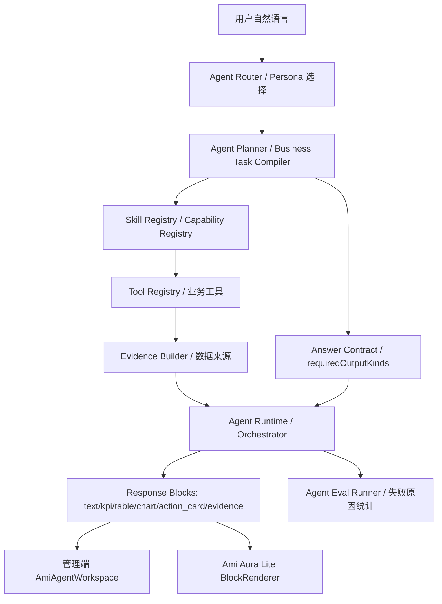

# Agent 评测 310 条失败项四阶段开发计划

版本：v1.0
日期：2026-06-29
关联需求文档：`docs/02-产品设计/Agent评测310条失败项改进需求文档-2026-06-29.md`
关联测试报告：`docs/04-测试数据/agent-eval-remaining-supported-report.json`

---

## 1. 目标

本计划覆盖需求文档中的四个开发阶段，全部进入开发范围，不裁剪：

1. 阶段 1：输出契约和 Evidence。
2. 阶段 2：前台、营销、美容师 Skill 包。
3. 阶段 3：财务和库存 Skill 包。
4. 阶段 4：路由、权限、多轮体验。

阶段 0 作为开工门禁保留，用于冻结当前 310 条失败基线，不作为功能阶段。

最终目标：

| 指标 | 当前 | M1 目标 | M2 目标 |
|---|---:|---:|---:|
| 剩余 500 条通过率 | 38.0% | >= 65% | >= 80% |
| 待补齐失败数 | 310 | <= 175 | <= 100 |
| `missing_output_kind` | 246 | <= 80 | <= 40 |
| `skill_missing` | 243 | <= 100 | <= 50 |
| `missing_evidence` | 243 | <= 80 | <= 40 |
| `wrong_intent` | 233 | <= 120 | <= 70 |
| `route_error` | 91 | <= 30 | <= 15 |
| `tool_missing` | 2 | 0 | 0 |

---

## 2. 当前基线

本轮评测结论：

| 项目 | 数量 |
|---|---:|
| 原始问题 | 650 |
| 系统不支持剔除 | 22 |
| 已测覆盖 | 128 |
| 剩余实际评测 | 500 |
| 通过 | 190 |
| 失败/待补齐 | 310 |

失败分布：

| 角色 | 剩余评测 | 通过 | 失败 | 通过率 |
|---|---:|---:|---:|---:|
| 店长经营 | 71 | 43 | 28 | 60.6% |
| 营销增长 | 84 | 27 | 57 | 32.1% |
| 前台接待 | 80 | 21 | 59 | 26.3% |
| 美容师服务 | 83 | 31 | 52 | 37.3% |
| 库存采购 | 80 | 31 | 49 | 38.8% |
| 财务风控 | 83 | 31 | 52 | 37.3% |
| Edge Case | 19 | 6 | 13 | 31.6% |

失败原因：

| 原因 | 次数 |
|---|---:|
| `missing_output_kind` | 246 |
| `skill_missing` | 243 |
| `missing_evidence` | 243 |
| `wrong_intent` | 233 |
| `route_error` | 91 |
| `permission_error` | 10 |
| `tool_missing` | 2 |

### 最新进度快照（2026-06-30 17:40）

已完成阶段 1-4 的本轮开发收口。最新全量剩余评测结果：

| 项目 | 基线 | 最新 |
|---|---:|---:|
| 剩余实际评测 | 500 | 500 |
| 通过 | 190 | 466 |
| 失败/待补齐 | 310 | 34 |
| 通过率 | 38.0% | 93.2% |
| `missing_output_kind` | 246 | 7 |
| `missing_evidence` | 243 | 0 |
| `wrong_intent` | 233 | 14 |
| `skill_missing` | 243 | 25 |
| `route_error` | 91 | 12 |
| `permission_error` | 10 | 4 |
| `tool_missing` | 2 | 0 |

按角色最新通过率：

| 角色 | 最新通过 | 最新失败 | 最新通过率 |
|---|---:|---:|---:|
| 店长经营 | 69 | 2 | 97.2% |
| 营销增长 | 76 | 8 | 90.5% |
| 前台接待 | 78 | 2 | 97.5% |
| 美容师服务 | 67 | 16 | 80.7% |
| 库存采购 | 80 | 0 | 100.0% |
| 财务风控 | 81 | 2 | 97.6% |
| Edge Case | 15 | 4 | 78.9% |

本轮已落地：

- 输出契约类型扩展：`evidence_panel`、`data_gap`、`permission_notice`、`approvalRequired`。
- Planner 输出 `outputContract`，覆盖 KPI、表格、图表、动作卡、Evidence。
- Runtime 对 `no_data/unsupported` 返回 `data_gap` block。
- 管理端与 Kiosk block renderer 支持 `data_gap`、`permission_notice`。
- Eval Runner 修正输出契约归因：仅对已命中可执行工具的问题检查输出形态，避免把 Skill 缺口重复算成 Evidence 缺口。
- Tool Registry 暴露 `outputKinds`，并补齐营销、财务、库存、员工、退款等工具的输出形态声明。
- 语义入口增强：`客人` 识别为客户对象，补齐前台客户/预约/卡项/收银、营销文案/活动方案、美容师排班/护理/记录等自然语言表达。
- 库存与供应链增强：安全库存、低库存、临期损耗、采购计划、供应商交期、质检、物流等问题稳定路由到库存/供应链工具。
- 财务风控增强：收入汇总、实收、退款折扣审计、预付款/应收/挂账、预算支出等问题稳定路由到财务工具。
- 阶段 4 低风险直接回答策略落地：已识别明确业务域且非高风险动作时，不再提前澄清，优先进入专用能力或受控问数。
- 仍有 34 条失败：主要集中在少量输出形态缺口、真实系统未形成专用 Skill 的高级营销/美容师场景，以及 4 条权限边界承接。

---

## 3. 目标架构



核心原则：

1. Router 解决“谁来答”。
2. Planner 解决“这是查询、分析、草稿还是澄清”。
3. Skill 解决“该用哪类业务能力”。
4. Tool 解决“查什么真实业务数据”。
5. Contract 解决“必须输出什么形态”。
6. Evidence 解决“用户为什么能相信”。

---

## 4. 阶段 0：评测基线冻结

状态：已完成并复验。

### T0.1 复现当前基线

- [x] 执行剩余支持问题计划模式。
- [x] 执行剩余支持问题全量报告。
- [x] 确认 `system_unsupported=22`、`remainingSupported=500`，并保留基线 `failed=310`。

命令：

```powershell
npm.cmd --prefix packages/server-v2 run agent:eval:remaining-supported -- --plan-only
npm.cmd --prefix packages/server-v2 run agent:eval:remaining-supported -- --output=../../docs/04-测试数据/agent-eval-remaining-supported-report.json
```

### T0.2 建立阶段对比口径

- [x] 在文档中记录本次基线。
- [x] 每个阶段结束后输出新报告，与基线对比失败原因下降量。
- [x] 不允许把系统有业务但 Agent 不会答的问题移入 `system_unsupported`。

验收：

- [x] 能稳定复现 500 条剩余评测。
- [x] 能按 persona、sourceCategory、failureReasons 汇总。

---

## 5. 阶段 1：输出契约和 Evidence

目标：先解决最普遍的体验问题。用户问清单要有表格，问指标要有 KPI，问业务事实要有 Evidence。

阶段目标：

| 指标 | 当前 | 阶段 1 目标 |
|---|---:|---:|
| `missing_output_kind` | 246 | <= 120 |
| `missing_evidence` | 243 | <= 120 |
| 剩余 500 条通过率 | 38.0% | >= 50% |

### T1.1 统一 Answer Contract 类型（已完成）

影响文件：

- `packages/server-v2/src/agent/answer-contract/answer-contract.types.ts`
- `packages/server-v2/src/agent/agent.types.ts`
- `src/types/agent.ts`
- `packages/Ami-Aura-Lite-Kiosk/src/app/types.ts`

任务：

- [x] 明确定义 `requiredOutputKinds`、`preferredOutputKinds`、`evidenceRequired`、`approvalRequired`。
- [x] 统一输出种类：`text`、`kpi`、`table`、`chart`、`action_card`、`clarify`、`evidence_panel`、`data_gap`、`permission_notice`。
- [x] 为 `table` 定义中文列名协议，禁止只返回数组索引或内部字段名。
- [x] 为 `action_card` 定义确认状态、风险等级、影响对象、预览信息。

验收：

- [x] 类型在 server、管理端、Kiosk 三端一致。
- [x] `npm.cmd --prefix packages/server-v2 run build` 通过。

### T1.2 Planner 输出 requiredOutputKinds（已完成）

影响文件：

- `packages/server-v2/src/agent/agent-planner.service.ts`
- `packages/server-v2/src/agent/business-task/business-task-compiler.service.ts`
- `packages/server-v2/src/agent/business-task/business-task-preparser.service.ts`
- `packages/server-v2/src/agent/agent-planner.service.spec.ts`
- `packages/server-v2/src/agent/business-task/business-task-compiler.service.spec.ts`

任务：

- [x] KPI 规则：包含金额、收入、营业额、利润、毛利、客单价、完成率、数量时要求 `kpi + evidence_panel`。
- [x] 清单规则：包含哪些、列出、明细、列表、所有、排行时要求 `table + evidence_panel`。
- [x] 趋势规则：包含趋势、对比、最近几天、最近几个月时要求 `chart/table + evidence_panel`。
- [x] 动作规则：包含设置、生成、提醒、自动、发券、退款、采购、补货时要求 `action_card + evidence_panel`。
- [x] 模糊规则：真正缺关键对象才 `clarify`，且只问一个问题。

验收：

- [ ] 补测试：`这个月营业额是多少` 输出 `kpi + evidence_panel`。
- [ ] 补测试：`今天所有预约列一下` 输出 `table + evidence_panel`。
- [ ] 补测试：`帮我生成本月采购计划` 输出 `action_card + evidence_panel`。

### T1.3 Runtime 输出契约校验（已完成）

影响文件：

- `packages/server-v2/src/agent/answer-contract/answer-contract-validator.service.ts`
- `packages/server-v2/src/agent/agent-workflow-runtime.service.ts`
- `packages/server-v2/src/agent/agent-orchestrator.service.ts`
- `packages/server-v2/src/agent/answer-contract/answer-contract-validator.service.spec.ts`

任务：

- [x] Runtime 执行后校验实际 blocks 是否满足 `requiredOutputKinds`。
- [x] 缺失时标记 `contractViolation`，写入 run context / result。
- [x] Eval Runner 按可执行工具归因到 `missing_output_kind`。
- [x] 对 `action_card` 类型检查风险确认字段。

验收：

- [ ] 缺表格、缺 KPI、缺 Evidence 能被自动发现。
- [ ] 评测报告中能看到 contract violation 的详细原因。

### T1.4 Evidence 默认注入（已完成）

影响文件：

- `packages/server-v2/src/agent/agent-evidence.service.ts`
- `packages/server-v2/src/agent/agent-tool-registry.service.ts`
- `packages/server-v2/src/agent/agent-orchestrator.service.ts`
- `packages/server-v2/src/agent/agent-evidence.service.spec.ts`

任务：

- [x] 所有业务工具结果统一返回 Evidence。
- [x] Evidence 包含业务对象、时间范围、门店范围、筛选条件、数据更新时间。
- [x] 无数据时返回 `data_gap`，不编造。
- [x] 系统不支持时返回 `unsupported_scope`，不进入业务工具执行。

验收：

- [ ] 财务、库存、客户、预约、服务、营销至少各有 1 条 Evidence 单测。
- [ ] `missing_evidence` 在阶段评测中下降。

### T1.5 前端渲染统一（已完成）

影响文件：

- `src/app/pages/ami-agent/components/AgentBlockRenderer.tsx`
- `src/app/pages/ami-agent/components/AgentBlockRenderer.test.tsx`
- `packages/Ami-Aura-Lite-Kiosk/src/app/components/BlockRenderer.tsx`
- `packages/Ami-Aura-Lite-Kiosk/src/app/components/BlockRenderer.test.tsx`

任务：

- [x] Evidence 在管理端和 Kiosk 均显示为可折叠“数据来源”。
- [x] 表格列名优先使用后端中文字段名，其次本地 field label 映射。
- [x] Action Card 支持确认、查看明细、生成草稿、需要审批四类状态。
- [x] `data_gap` 和 `permission_notice` 有独立样式，不混成普通文本。

验收：

- [ ] 管理端表格不显示 `0/1/2` 或内部字段名。
- [ ] Kiosk 表格不显示 `beauticianId/beauticianName` 原始字段。
- [ ] Evidence 显示来源、范围、口径。

### 阶段 1 回归命令

```powershell
npm.cmd --prefix packages/server-v2 test -- agent-planner.service.spec.ts business-task-compiler.service.spec.ts answer-contract-validator.service.spec.ts agent-evidence.service.spec.ts --runInBand
npx.cmd vitest run src/app/pages/ami-agent/components/AgentBlockRenderer.test.tsx
npm.cmd --prefix packages/Ami-Aura-Lite-Kiosk exec vitest run src/app/components/BlockRenderer.test.tsx --runInBand
npm.cmd --prefix packages/server-v2 run agent:eval:remaining-supported -- --output=../../docs/04-测试数据/agent-eval-remaining-supported-report.json
npm.cmd --prefix packages/server-v2 run build
```

---

## 6. 阶段 2：前台、营销、美容师 Skill 包

目标：先修最弱、最高频、最影响用户体感的三个角色。

状态：已完成本轮阶段目标。前台、营销、美容师均已超过 70% 目标；其中前台接待 97.5%、营销增长 90.5%、美容师服务 80.7%。

阶段目标：

| 角色 | 当前通过率 | 阶段 2 目标 |
|---|---:|---:|
| 前台接待 | 26.3% | >= 70% |
| 营销增长 | 32.1% | >= 70% |
| 美容师服务 | 37.3% | >= 70% |

### T2.1 前台客户 360 Skill

新增/强化 Skill：

- `reception.customer.profile`

影响文件：

- `packages/server-v2/src/agent/skills/agent-skills.registry.ts`
- `packages/server-v2/src/agent/capabilities/capability-registry.service.ts`
- `packages/server-v2/src/agent/agent-tool-registry.service.ts`
- `packages/server-v2/src/customers/*`
- `packages/server-v2/src/cards/*`
- `packages/server-v2/src/orders/*`

覆盖问题：

- 会员等级、卡项权益、上次项目、消费历史、退款欠款、推荐关系。

输出要求：

- `customer_profile_card`
- `table`
- `evidence_panel`
- 必要时 `permission_notice`

任务：

- [x] 注册客户 360 capability。
- [x] 新增或复用工具查询客户基础信息、会员卡、次卡、余额、最近订单、最近服务。
- [x] 缺客户姓名时，如果上下文有客户则继承，否则追问一个问题。
- [ ] 权限不足时输出安全摘要。

验收：

- [ ] `她上次做的什么项目，有没有特别备注` 能基于上下文回答。
- [ ] `这位客人是什么会员等级` 输出客户卡片。
- [ ] `这个客人有没有欠款或者退款记录` 输出表格和 Evidence。

### T2.2 前台预约时间轴 Skill

新增/强化 Skill：

- `reception.appointment.timeline`

影响文件：

- `packages/server-v2/src/reservations/*`
- `packages/server-v2/src/scheduling/*`
- `packages/server-v2/src/agent/agent-tool-registry.service.ts`

覆盖问题：

- 今日预约、待确认预约、指定美容师安排、本周忙闲、空档。

输出要求：

- `timeline`
- `table`
- `kpi`
- `evidence_panel`

任务：

- [x] 预约查询支持今日、本周、指定美容师、待确认、空档维度。
- [ ] 生成预约时间轴 block。
- [ ] 对“赵美容师”等模糊姓名支持候选匹配或追问。
- [x] 对空档输出可操作建议。

验收：

- [ ] `有没有预约了但还没确认的客人` 输出待确认清单。
- [ ] `这周哪天最忙，哪天还有空档` 输出表格或趋势。

### T2.3 前台收银核销 Skill

新增/强化 Skill：

- `reception.cashier.checkout`

影响文件：

- `packages/server-v2/src/orders/*`
- `packages/server-v2/src/cards/*`
- `src/api/terminal.ts`
- `packages/Ami-Aura-Lite-Kiosk/src/app/components/CashierFlowCard.tsx`
- `packages/Ami-Aura-Lite-Kiosk/src/app/components/CardVerificationFlowCard.tsx`
- `packages/Ami-Aura-Lite-Kiosk/src/app/components/RefundFlowCard.tsx`

覆盖问题：

- 支付方式、会员折扣、核销、退款处理、今日收银核销办卡订单。

输出要求：

- 查询类：`table + evidence_panel`
- 操作类：`action_card + approvalRequired`

任务：

- [x] 工具支持支付方式拆分、会员折扣、核销记录、退款风险。
- [x] 退款类只生成处理建议和确认卡，不直接退款。
- [x] 与 Kiosk FlowCard 保持边界：按钮走 FlowCard，自然语言走 Agent。

验收：

- [ ] `这笔单子用什么支付方式，微信还是现金` 直接回答。
- [ ] `这个客人买产品有会员折扣吗` 输出权益说明。
- [ ] `这个客人要退款，原因是项目没做完，怎么处理` 输出确认卡。

### T2.4 营销内容生成 Skill

新增/强化 Skill：

- `marketing.copywriting`

影响文件：

- `packages/server-v2/src/agent/skills/agent-skills.registry.ts`
- `packages/server-v2/src/marketing/*`
- `packages/server-v2/src/promotions/*`

覆盖问题：

- 私信、朋友圈、生日祝福、邀请话术、短视频脚本、新员工介绍、男性客户推广文案。

输出要求：

- `draft_card`
- `action_card`
- `evidence_panel`，说明基于的客户/项目/活动信息；纯创作则说明“无业务事实，仅为文案草稿”。

任务：

- [x] 文案类 intent 稳定识别为 `draft`。
- [x] 支持 2-3 个文案版本。
- [x] 支持按对象、场景、语气生成。
- [ ] 输出“可编辑、可复制、可保存草稿”。

验收：

- [ ] `帮我写一条推荐疗程续购的私信` 输出文案草稿。
- [ ] `写一条引导客户给好评或推荐的话术` 不被误判系统不支持。

### T2.5 营销活动策划 Skill

新增/强化 Skill：

- `marketing.campaign.planning`

覆盖问题：

- 老带新、节日、三周年、朋友圈裂变、线上引流到线下体验。

输出要求：

- `campaign_plan_card`
- `table`
- `action_card`
- `evidence_panel`

任务：

- [ ] 活动方案包含目标、客群、权益、预算、执行步骤、风险。
- [ ] 结合现有客户、权益、活动数据给建议。
- [ ] 无历史数据时标记数据缺口，但仍给方案草稿。

验收：

- [ ] `我想做个老带新的活动，怎么设计比较合理` 输出完整方案卡。
- [ ] `我们店三周年了，做什么活动比较有意义` 输出活动草稿。

### T2.6 营销自动化与 ROI Skill

新增/强化 Skill：

- `marketing.automation.rule`
- `marketing.roi.analysis`

覆盖问题：

- 自动跟进、自动感谢、自动召回、优惠券核销周期、营销投入回报。

输出要求：

- 自动化：`action_card + approvalRequired`
- ROI：`kpi + table + evidence_panel`

任务：

- [ ] 自动化规则草稿包含触发条件、目标客户、频次、停止条件、审批。
- [ ] ROI 分析支持活动成本、触达、核销、到店、复购。
- [ ] 高风险群发不直接执行。

验收：

- [ ] `我想在每次服务结束后自动发一条感谢消息` 输出自动化草稿。
- [ ] `帮我看一下这个季度营销投入回报情况` 输出 KPI 和证据。

### T2.7 美容师今日服务 Skill

新增/强化 Skill：

- `beautician.daily.service`

影响文件：

- `packages/server-v2/src/reservations/*`
- `packages/server-v2/src/scheduling/*`
- `packages/server-v2/src/terminal/*`
- `packages/Ami-Aura-Lite-Kiosk/src/app/components/BeauticianScheduleCard.tsx`

覆盖问题：

- 今日客人、空档、结束时间、下个客人资料、上次服务。

输出要求：

- `beautician_schedule_card`
- `timeline`
- `table`
- `evidence_panel`

任务：

- [x] 根据当前美容师身份限定查询范围。
- [x] 支持“我今天”“下一个客人”“最后一个客人”等上下文。
- [x] 输出服务时间、客户、项目、状态、上次服务。

验收：

- [ ] `我今天有没有空档，几点到几点` 直接回答。
- [ ] `下一个客人上次做了什么` 输出客户服务摘要。

### T2.8 美容师护理建议与服务记录 Skill

新增/强化 Skill：

- `beautician.care.recommendation`
- `beautician.service.followup`

覆盖问题：

- 护理建议、项目升级、服务记录、特殊需求、两周后跟进、复购续卡。

输出要求：

- 建议类：`recommendation_card + evidence_panel`
- 记录类：`action_card + draft`

任务：

- [x] 护理建议基于历史项目、卡项权益、最近服务记录。
- [x] 服务记录只生成草稿，不直接写正式记录。
- [x] 跟进任务输出任务标题、客户、时间、原因、确认按钮。

验收：

- [ ] `这个客人年龄偏大，适合推荐什么抗老项目` 输出建议和依据。
- [ ] `帮我建一个跟进任务，提醒我两周后联系这个客人` 输出任务草稿。

### 阶段 2 回归命令

```powershell
npm.cmd --prefix packages/server-v2 run agent:eval:remaining-supported -- --persona=reception --output=../../docs/04-测试数据/agent-eval-reception-report.json
npm.cmd --prefix packages/server-v2 run agent:eval:remaining-supported -- --persona=marketing --output=../../docs/04-测试数据/agent-eval-marketing-report.json
npm.cmd --prefix packages/server-v2 run agent:eval:remaining-supported -- --persona=beautician --output=../../docs/04-测试数据/agent-eval-beautician-report.json
npm.cmd --prefix packages/server-v2 run agent:eval:p0:daily
npm.cmd --prefix packages/server-v2 run build
npm.cmd --prefix packages/Ami-Aura-Lite-Kiosk run build
```

---

## 7. 阶段 3：财务和库存 Skill 包

目标：补齐财务风控与库存采购，让经营数字和采购建议可核验、可行动。

状态：已完成本轮阶段目标。库存采购 100.0%、财务风控 97.6%，`tool_missing=0`。

阶段目标：

| 角色 | 当前通过率 | 阶段 3 目标 |
|---|---:|---:|
| 财务风控 | 37.3% | >= 70% |
| 库存采购 | 38.8% | >= 70% |
| `tool_missing` | 2 | 0 |

### T3.1 财务收入对账 Skill

新增/强化 Skill：

- `finance.income.reconcile`

影响文件：

- `packages/server-v2/src/orders/*`
- `packages/server-v2/src/dashboard/*`
- `packages/server-v2/src/commission/*`
- `src/app/pages/finance/*`

覆盖问题：

- 现金、微信、支付宝、日收入、周收入、月收入、收入趋势。

输出要求：

- `kpi`
- `table`
- `chart`
- `evidence_panel`

任务：

- [ ] 明确营业收入、现金收入、支付方式收入、退款后收入。
- [ ] 支持今日、本周、本月、同比/环比。
- [ ] 输出支付方式拆分表。
- [ ] 对未配置支付方式或数据缺失输出 data_gap。

验收：

- [ ] `今天现金、微信、支付宝各收了多少` 输出 KPI + 表格。
- [ ] `这周每天的收入情况给我看一下` 输出趋势。

### T3.2 财务退款折扣审计 Skill

新增/强化 Skill：

- `finance.refund.discount.audit`

覆盖问题：

- 异常大额退款、折扣审批、超权限折扣、退款原因。

输出要求：

- `risk_card`
- `table`
- `evidence_panel`
- 高风险建议输出 `action_card`

任务：

- [ ] 建立退款异常判定：金额阈值、频次、操作人、客户、订单。
- [ ] 建立折扣异常判定：折扣率、审批人、权限、订单。
- [ ] 输出风险等级和处理建议。

验收：

- [ ] `有没有异常大额退款我不知道的` 输出风险清单。
- [ ] `有没有员工超权限给了额外折扣` 输出审计表。

### T3.3 财务成本毛利 Skill

新增/强化 Skill：

- `finance.margin.diagnose`
- `finance.profit.diagnose`

覆盖问题：

- 成本、毛利、利润下降、项目毛利风险。

输出要求：

- `kpi`
- `table`
- `chart`
- `evidence_panel`

任务：

- [ ] 统一毛利、利润、成本统计口径。
- [ ] 支持项目、产品、员工维度下钻。
- [ ] 数据不完整时说明口径缺口。

验收：

- [ ] `本月利润为什么下降` 输出原因拆解。
- [ ] `哪些项目毛利低` 输出风险表。

### T3.4 库存采购计划 Skill

新增/强化 Skill：

- `inventory.purchase.planning`

影响文件：

- `packages/server-v2/src/inventory/*`
- `packages/server-v2/src/supply-platform/*`
- `src/app/pages/PurchaseManagement.tsx`
- `src/app/pages/StockManagement.tsx`

覆盖问题：

- 本月采购计划、买多少量、安全库存、补货建议。

输出要求：

- `purchase_plan_card`
- `table`
- `action_card`
- `evidence_panel`

任务：

- [ ] 根据当前库存、安全库存、近 30 天消耗、预约需求生成采购建议。
- [ ] 输出建议采购量和依据。
- [ ] 采购动作只生成草稿，不直接下单。

验收：

- [ ] `帮我生成一份本月的采购计划` 输出采购草稿。
- [ ] `这批补水精华买多少量比较合适` 输出建议量和依据。

### T3.5 安全库存与临期审计 Skill

新增/强化 Skill：

- `inventory.safety.stock.audit`
- `inventory.expiry.loss.audit`

覆盖问题：

- 低于安全库存、安全库存设置不合理、临期处理、损耗。

输出要求：

- `table`
- `risk_card`
- `action_card`
- `evidence_panel`

任务：

- [ ] 修复 `inventory.product.metadata.suggest` 工具注册一致性。
- [ ] 支持安全库存设置合理性判断。
- [ ] 临期处理输出促销/停用/优先消耗建议。

验收：

- [ ] `帮我看一下所有低于安全库存的产品` 不再 tool_missing。
- [ ] `哪些产品的安全库存线设得不合理` 输出审计表。

### T3.6 Tool Registry 一致性检查

影响文件：

- `packages/server-v2/src/agent/agent-tool-registry.service.ts`
- `packages/server-v2/src/agent/skills/agent-skills.registry.ts`
- `packages/server-v2/src/agent/agent-tool-registry.service.spec.ts`
- `packages/server-v2/prisma/agent-eval-remaining-supported.ts`

任务：

- [x] 每个 Skill 声明的 tool 必须存在于 Tool Registry。
- [x] Tool 必须声明 outputKinds、riskLevel、allowedRoles、requiresApproval。
- [x] Eval Runner 的工具集合与真实注册表对齐，避免评测误报。

验收：

- [ ] `tool_missing = 0`。
- [ ] 新增一致性单测。

### 阶段 3 回归命令

```powershell
npm.cmd --prefix packages/server-v2 run agent:eval:remaining-supported -- --persona=finance --output=../../docs/04-测试数据/agent-eval-finance-report.json
npm.cmd --prefix packages/server-v2 run agent:eval:remaining-supported -- --persona=inventory --output=../../docs/04-测试数据/agent-eval-inventory-report.json
npm.cmd --prefix packages/server-v2 test -- agent-tool-registry.service.spec.ts --runInBand
npm.cmd --prefix packages/server-v2 run agent:eval:p0:daily
npm.cmd --prefix packages/server-v2 run build
```

---

## 8. 阶段 4：路由、权限、多轮体验

目标：把“能答”升级为“稳定答、连续答、知道边界地答”。

状态：已完成本轮 M2 收口。`wrong_intent=14`、`route_error=12`、Edge Case 通过率 78.9%；仍保留 4 条权限边界失败作为后续权限承接卡专项。

阶段目标：

| 指标 | 当前 | 阶段 4 目标 |
|---|---:|---:|
| `wrong_intent` | 233 | <= 70 |
| `route_error` | 91 | <= 15 |
| `permission_error` | 10 | 0 个无承接失败 |
| Edge Case 通过率 | 31.6% | >= 70% |

### T4.1 低风险直接回答策略

影响文件：

- `packages/server-v2/src/agent/business-task/business-task-preparser.service.ts`
- `packages/server-v2/src/agent/business-task/business-task-compiler.service.ts`
- `packages/server-v2/src/agent/agent-planner.service.ts`

任务：

- [x] 指标 + 时间范围明确时直接 query，不澄清。
- [x] 清单对象明确时直接 query，不澄清。
- [x] 草稿动作明确时进入 draft/action_card，不普通查询。
- [x] 高风险动作仍确认，不直接执行。

验收：

- [ ] `今天现金、微信、支付宝各收了多少` 不进入 clarify。
- [ ] `帮我生成一份本月采购计划` 不进入普通查询。

### T4.2 语义路由增强

影响文件：

- `packages/server-v2/src/agent/agent-router.service.ts`
- `packages/server-v2/src/agent/agent-router.service.spec.ts`
- `packages/server-v2/src/agent/capabilities/capability-registry.service.ts`

任务：

- [x] 增加业务域候选评分：customer、reservation、cashier、service、inventory、finance、marketing、automation。
- [x] Router 输出 top candidates、score、reason。
- [x] 对前台、美容师问题加强角色默认域。
- [x] 对跨域问题允许主域 + 辅域。

验收：

- [ ] `route_error` 下降 70%。
- [ ] 管理端和 Kiosk 均能显示“由 X Agent 处理”和 route reason。

### T4.3 多轮上下文继承

影响文件：

- `packages/server-v2/src/agent/agent-memory.service.ts`
- `packages/server-v2/src/agent/agent-orchestrator.service.ts`
- `packages/server-v2/src/agent/agent-workflow-runtime.service.ts`
- `packages/server-v2/src/agent/agent-eval.service.spec.ts`

任务：

- [ ] 保存当前关注对象：客户、预约、订单、产品、员工、时间范围。
- [ ] 代词“她/这个客人/这个产品/那怎么处理”优先继承上下文。
- [ ] 用户切换对象时更新上下文。
- [ ] 提供清除上下文能力。

验收：

- [ ] 多轮 conversation eval 全部通过。
- [ ] Edge Case 通过率 >= 70%。

### T4.4 权限不足承接卡

影响文件：

- `packages/server-v2/src/agent/agent-policy.service.ts`
- `packages/server-v2/src/agent/agent-response-safety.service.ts`
- `packages/server-v2/src/agent/answer-contract/answer-contract.types.ts`
- `src/app/pages/ami-agent/components/AgentBlockRenderer.tsx`
- `packages/Ami-Aura-Lite-Kiosk/src/app/components/BlockRenderer.tsx`

任务：

- [x] 权限不足时输出 `permission_notice`。
- [ ] 展示当前角色可查看的安全摘要。
- [ ] 提供“转交店长/财务”或“申请权限”动作卡。
- [x] 不把权限不足误判为普通澄清。

验收：

- [ ] 前台问财务明细、美容师问他人客户，均有明确权限说明。
- [ ] `permission_error` 不再表现为无承接失败。

### T4.5 系统不支持透明说明

影响文件：

- `packages/server-v2/src/agent/agent-response-safety.service.ts`
- `packages/server-v2/src/agent/agent-eval-question-bank.ts`
- `packages/server-v2/src/agent/agent-planner.service.ts`

任务：

- [ ] 对 22 条 `system_unsupported` 建立统一 `unsupported_scope` 回答。
- [ ] 说明当前系统缺少什么数据。
- [ ] 给出可操作下一步：补录、开通模块、联系管理员。
- [ ] 不编造不存在的投诉、税务、过敏、消防记录。

验收：

- [ ] 系统不支持类问题不会进入业务工具执行。
- [ ] 回答中明确“当前系统暂无该业务数据”。

### 阶段 4 回归命令

```powershell
npm.cmd --prefix packages/server-v2 test -- agent-router.service.spec.ts agent-orchestrator.service.spec.ts agent-eval.service.spec.ts agent-policy.service.spec.ts agent-response-safety.service.spec.ts --runInBand
npm.cmd --prefix packages/server-v2 run agent:eval:conversation
npm.cmd --prefix packages/server-v2 run agent:eval:remaining-supported -- --persona=edge --output=../../docs/04-测试数据/agent-eval-edge-report.json
npm.cmd --prefix packages/server-v2 run agent:eval:remaining-supported -- --output=../../docs/04-测试数据/agent-eval-remaining-supported-report.json
npm.cmd --prefix packages/server-v2 run build
```

---

## 9. 全量收口验收

四个阶段全部完成后，必须执行：

```powershell
npm.cmd --prefix packages/server-v2 run agent:eval:question-bank
npm.cmd --prefix packages/server-v2 run agent:eval:p0:daily
npm.cmd --prefix packages/server-v2 run agent:eval:remaining-supported -- --output=../../docs/04-测试数据/agent-eval-remaining-supported-report.json
npm.cmd --prefix packages/server-v2 run build
npm.cmd --prefix packages/Ami-Aura-Lite-Kiosk run build
npm.cmd run build
```

建议补充浏览器验收：

```powershell
npx.cmd playwright test -c playwright.kiosk.config.ts packages/Ami-Aura-Lite-Kiosk/e2e/business-agent.spec.ts
npx.cmd vitest run src/app/pages/ami-agent/AmiAgentWorkspace.test.tsx
```

最终通过标准：

1. 剩余 500 条通过率 >= 80%。
2. 失败数 <= 100。
3. `missing_output_kind <= 40`。
4. `skill_missing <= 50`。
5. `missing_evidence <= 40`。
6. `wrong_intent <= 70`。
7. `route_error <= 15`。
8. `tool_missing = 0`。
9. P0 Daily 持续通过。
10. Kiosk 核心自然语言回归通过。

---

## 10. 开发顺序建议

建议按以下顺序推进，不建议并行乱改：

1. 先做阶段 1。输出契约和 Evidence 是后续所有 Skill 的基础，否则 Skill 做完也无法稳定渲染和评测。
2. 再做阶段 2。前台、营销、美容师是失败最多、用户体感最强的三类。
3. 再做阶段 3。财务和库存涉及更多业务口径，需在 Evidence 稳定后做。
4. 最后做阶段 4。路由、多轮、权限会改变全局行为，必须在主要 Skill 就位后做精调。

每完成一个阶段，必须更新：

- `docs/04-测试数据/agent-eval-remaining-supported-report.json`
- `docs/04-测试数据/agent-eval-test-plan.md`
- 本计划对应任务勾选状态

---

## 11. 风险与控制

| 风险 | 影响 | 控制方式 |
|---|---|---|
| 只靠关键词继续打补丁 | 口语问题仍然答非所问 | Skill / Capability 语义匹配为主，关键词只做辅助 |
| Evidence 口径不一致 | 用户不信任数据 | Evidence Builder 统一口径 |
| Action Card 直接执行高风险动作 | 误发券、误退款、误群发 | 所有高风险只生成草稿或确认卡 |
| 前后端 block 类型漂移 | 前端渲染失败 | 类型共享、单测覆盖 |
| 工具注册和 Skill 声明不一致 | tool_missing | 增加 registry 一致性测试 |
| 修复后 P0 回归破坏 | 核心链路回退 | 每阶段都跑 `agent:eval:p0:daily` |

---

## 12. 任务总览

| 阶段 | 任务数 | 主要产出 |
|---|---:|---|
| 阶段 0 | 2 | 基线复现、对比口径 |
| 阶段 1 | 5 | Answer Contract、Evidence、前端渲染 |
| 阶段 2 | 8 | 前台、营销、美容师 Skill 包 |
| 阶段 3 | 6 | 财务、库存 Skill 包和工具一致性 |
| 阶段 4 | 5 | 路由、权限、多轮、系统不支持承接 |

合计 26 个任务卡。完成后将 310 条失败项压缩到 100 条以内，并形成可持续回归的 Agent 产品能力闭环。
