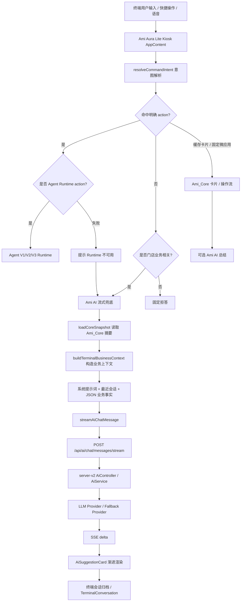

# Ami AI 当前架构说明

日期：2026-07-07

## 1. 定位

Ami AI 当前不是 Agent V3，也不是能力治理后的 Agent Runtime。它是 Ami Aura Lite 终端里的业务问答兜底与建议生成层：

- 当用户输入没有被明确路由到微应用、操作流程或 Agent Runtime 时，如果仍属于门店业务问题，则进入 Ami AI。
- 当 Agent Runtime 不可用时，终端会展示错误提示，并把同一问题降级到 Ami AI 流式问答。
- Ami AI 的回答卡片显示为 `Ami 智能问答`，底部提示 `建议由 Ami AI 生成，业务事实以 Ami_Core 卡片数据为准`。
- V3 结果会显示 `V3 数据分析`、结构化表格和 `agent_v3_*_view` 数据来源；这与 Ami AI 是两条链路。

## 2. 总体架构

## 3. 前端入口层

入口文件：

- `packages/Ami-Aura-Lite-Kiosk/src/app/AppContent.tsx`
- `packages/Ami-Aura-Lite-Kiosk/src/app/microApps/runMicroApp.ts`
- `packages/Ami-Aura-Lite-Kiosk/src/app/intent/intentRouter.ts`

处理顺序：

1. 用户通过底部输入框、语音或快捷入口提交命令。
2. `resolveCommandIntent` 先做意图解析：
   - 快捷操作直接走规则。
   - 系统命令走规则。
   - 文本和语音优先走 AI 意图解析 `resolveTerminalIntent`。
   - AI 意图解析失败或置信不足时回退为普通业务问答入口。
3. `runMicroAppIntent` 决定执行路径：
   - 有明确 `action`：进入微应用、操作流或 Agent Runtime。
   - 无明确 `action` 且非业务问题：固定拒答。
   - 无明确 `action` 但属于业务问题：返回 `aiStream`，由 Ami AI 回答。

## 4. Ami AI 编排层

入口函数：

- `appendStreamingAiAnswer`
- `getTerminalBusinessAnswerStream`
- `getTerminalBusinessAnswer`

当前有三类生成路径：

1. 流式普通业务问答
   - `getTerminalBusinessAnswerStream` 构造业务上下文。
   - 调用 `streamAiChatMessage`。
   - 前端逐段追加到 `AiSuggestionCard`。

2. 非流式业务总结
   - 微应用返回业务卡片后，如果带 `aiSummary`，会调用 `getTerminalBusinessAnswer` 生成补充建议。

3. 专用建议生成
   - 美容师护理/项目建议：`generateTerminalServiceAdvice`。
   - 下一步客户跟进行动：`recommendNextBestAction`。
   - 这两类仍标记为 `source: Ami AI`，但不是普通自由问答。

## 5. 业务上下文层

入口函数：

- `loadCoreSnapshot`
- `buildTerminalBusinessContext`
- `buildFallbackBusinessAnswer`

数据来源是 Ami_Core 当前门店业务摘要，不是 V3 SQL 语义视图。当前注入给 LLM 的主要事实包括：

- 门店名、角色、用户问题。
- 客户总数、订单数、累计收入、今日预约数。
- 客户流失/沉睡候选人。
- 今日预约列表。
- 低库存商品。
- 临期/过期库存批次。
- 高消费客户摘要。
- 上一轮业务上下文。

关键限制：

- `loadCoreSnapshot` 有 60 秒缓存。
- 对话上下文只保留最近 6 轮，且 10 分钟内有效。
- 系统提示明确要求只基于 Ami_Core 数据回答，不允许编造客户、订单、预约、库存或金额。
- LLM 失败时会退回 `buildFallbackBusinessAnswer` 的规则摘要。

## 6. 后端 AI Gateway 层

入口文件：

- `src/api/real/ai.ts`
- `packages/server-v2/src/ai/ai.controller.ts`
- `packages/server-v2/src/ai/ai.service.ts`

调用链路：

1. Kiosk 前端调用 `streamAiChatMessage`。
2. 前端请求 `POST /api/ai/chat/messages/stream`。
3. `AiController.chatStream` 以 SSE 返回增量文本。
4. `AiService.chatStream` 调用 `streamChatChunks`。
5. 根据配置走：
   - `mock`
   - `deepseek`
   - `openai_compatible`
   - Anthropic-compatible
   - fallback provider
6. 每次成功或失败写入 `AiAuditLog`，场景为 `chat_stream`。

关键环境配置：

- `LLM_PROVIDER`
- `LLM_MODEL`
- `LLM_API_KEY`
- `LLM_BASE_URL`
- `LLM_CHAT_PATH`
- `LLM_STREAM`
- `LLM_TIMEOUT_MS`
- `LLM_FALLBACK_PROVIDER`
- `LLM_FALLBACK_MODEL`
- `LLM_FALLBACK_API_KEY`
- `LLM_FALLBACK_BASE_URL`

## 7. 渲染与会话层

渲染组件：

- `AiSuggestionCard`

表现：

- 标题通常是 `Ami 智能问答`。
- 普通回答以文本段落展示。
- 部分专用建议会展示结构化块，如服务前确认、关键步骤、耗材提示、下一步动作等。
- 底部固定展示业务事实声明。

会话持久化：

- 前端将非 loading 消息转换为 `TerminalConversationMessage`。
- 跨天、离开页面或归档时调用 `saveTerminalConversation`。
- 后端 `TerminalService.saveConversation` 写入 `TerminalConversation`。

## 8. 与 Agent V1/V2/V3 的边界

| 项目 | Ami AI | Agent V1/V2/V3 |
| --- | --- | --- |
| 目标 | 兜底问答、解释、建议 | 可审计的业务能力执行 |
| 路由入口 | 无明确 action 的业务问题或 Runtime 失败 | `business.query` / Agent Runtime action |
| 数据来源 | Ami_Core 快照摘要、卡片上下文 | Agent Manifest / 能力中心 / V3 语义视图 |
| 输出形式 | 文本为主，少量结构化建议 | 结构化 blocks、表格、证据、trace |
| 审计 | `AiAuditLog` chat_stream | Agent run audit / Agent V3 text-to-SQL runs |
| 可控性 | 弱，依赖 prompt 和上下文 | 强，能力、权限、SQL/工具、证据可治理 |
| 风险 | 可能答非所问或过度总结 | 可能能力未覆盖，但边界更清楚 |

## 9. 当前问题与产品影响

1. 用户看到顶部选中 V3，并不代表所有回答都来自 V3。历史消息或未命中 V3 的开放问题仍可能来自 Ami AI。
2. Ami AI 的回答没有 V3 的 `queryIntent`、SQL、语义视图和相关性校验，因此对“最受欢迎的项目”“运营风险”这类精确问数题不够稳定。
3. Ami AI 能总结 Ami_Core 摘要，但不能保证覆盖所有业务表和全部时间筛选。
4. 对产品体验来说，Ami AI 适合作为解释层和兜底层，不适合作为主问数引擎。

## 10. 建议演进方向

短期：

- 在回答卡片上显式展示来源：`Ami AI 兜底`、`V3 数据分析`、`KG+LLM`。
- 将“运营风险、经营风险、最受欢迎、趋势、排行、最近 N 天/月”这类问题优先路由到 Agent V3。
- Ami AI 只在 V3 明确无法回答、需要解释建议或需要兜底时使用。

中期：

- Ami AI 改为解释层：消费 V3 的结构化结果、evidence 和 trace，而不是自己判断事实。
- 将 `buildTerminalBusinessContext` 的快照来源替换为可审计的语义查询结果。
- Ami AI 输出必须带数据来源摘要和不确定性提示。

长期：

- Agent V3 负责查数、权限、SQL、证据和结构化输出。
- Ami AI 负责自然语言解释、行动建议、话术生成和多轮表达。
- 两者通过统一的 Answer Composer 串联，避免用户感知到多个割裂智能体。
