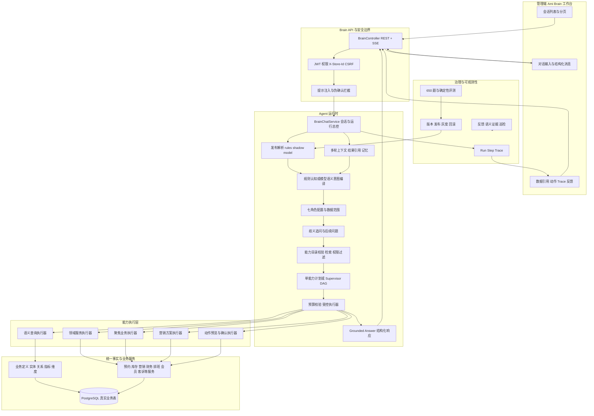
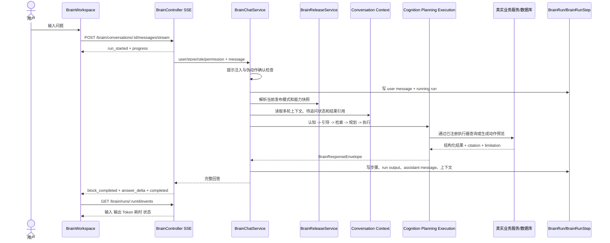
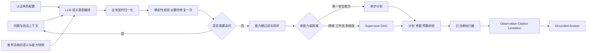
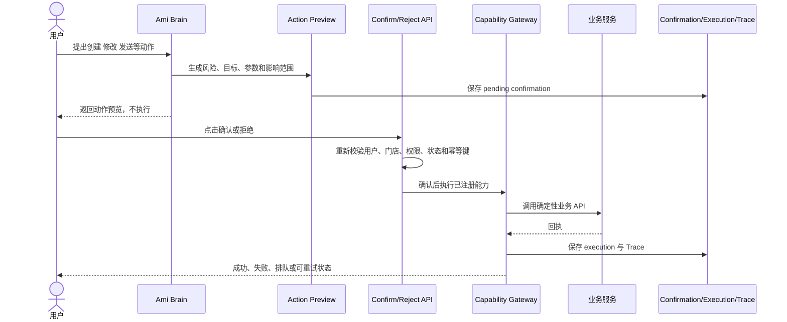
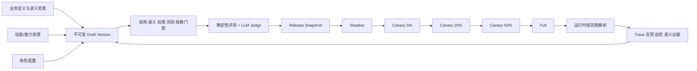

# Ami Brain 当前 Agent 架构与数据流（2026-07-22）

> 文档性质：当前代码与只读数据库状态说明，不是未来规划。
>
> 取证时间：2026-07-22 01:22（Asia/Shanghai）。
>
> 主线边界：Ami Brain 是当前门店经营智能体主线；本文不把 Agent V1–V5、Agent V6 或旧 AI 问答纳入 Ami Brain 运行架构。

## 1. 一句话结论

Ami Brain 当前是一个由发布治理控制的、语义与能力目录驱动的门店经营 Agent 平台：前端只负责会话、结构化响应、动作确认和 Trace 展示；服务端根据当前账号、门店和角色解析 `rules / shadow / model` 发布模式，再通过受治理的语义定义、角色配置、能力卡、执行器和真实业务服务完成回答或动作预览。

当前不是“所有问题都交给大模型直接生成答案”，而是：

1. 发布系统先决定本次请求使用哪条运行面。
2. 模型只负责受约束的意图编译或 Supervisor 规划，不直接访问数据库。
3. 数据查询和业务动作只能由已注册、已发布且通过权限校验的能力执行器完成。
4. 回答必须由执行结果、引用和完成状态组装；动作必须先生成预览，再由用户通过独立接口确认。
5. 会话、运行、步骤、引用、动作和反馈均落到 `brain_*` 数据表中，可在治理中心追踪。

## 2. 当前实际运行状态

### 2.1 当前浏览器账号的运行模式

当前浏览器显示的 `admin` 账号映射为 `store_manager` 角色，当前门店为 6。发布选择按 `activatedAt` 倒序匹配：

| 优先级 | 发布 | 范围 | 模式 | 当前账号是否命中 |
| --- | --- | --- | --- | --- |
| 1 | Release #388 `ami-brain-final-p1-20260721-v3-canary-20` | 20% 用户桶 | model | 否，当前桶值为 78 |
| 2 | Release #387 `ami-brain-final-p1-20260721-v3-canary-5` | 指定用户/门店/角色 | model | 否 |
| 3 | Release #386 `ami-brain-final-p1-20260721-v3-shadow` | 100% | shadow | 是 |

因此当前页面的正式回答走 rules 主链，模型链在旁路执行 shadow 观测，不改变正式答案。这就是页面 Trace 首先出现“规则认知、角色与意图路由”的原因。

### 2.2 当前治理资源快照

| 资源 | 当前数量 |
| --- | ---: |
| 已启用技能/能力 | 55 |
| 已启用角色配置 | 7 |
| active 指标 | 14 |
| active 维度 | 8 |
| active 实体 | 51 |
| active 关系 | 8 |

数据库中同时存在 9 个 `active` 发布记录。它们不是并行执行九套 Agent，而是按激活时间和 `global / store / user / role / percentage` 范围选择第一条命中的发布。当前选择逻辑位于 `BrainReleaseService.selectRelease()`。

## 3. 总体逻辑架构



## 4. Agent 分层与职责

| 层级 | 核心对象 | 当前职责 | 明确不负责 |
| --- | --- | --- | --- |
| 交互层 | `BrainWorkspace`、`BrainChatPanel`、`BrainEvidencePanel` | 会话、SSE 进度、结构化回答、引用、Trace、动作确认、反馈 | 不保存模型 Key，不直接查业务库 |
| API 层 | `BrainController` | 会话、消息、流式回答、运行轨迹、动作、反馈和治理 API | 不实现业务推理 |
| 安全上下文 | `BrainContextService`、Guards | 解析用户、门店、角色、权限、拒绝权限，阻断跨门店和提示注入 | 不接受前端角色提示作为授权依据 |
| 发布路由 | `BrainReleaseService` | 按账号、门店、角色、百分比选择 rules/shadow/model 和冻结能力快照 | 不动态拼接未发布能力 |
| 会话总控 | `BrainChatService` | 创建 Run、选择运行面、持久化消息、调用认知/规划/执行/组装、写 Trace | 不允许模型直接执行 SQL 或动作 |
| 角色层 | `BrainAgentProfile`、`BrainRoleContextBuilderService` | 七角色提示、允许技能、数据范围、知识包 | 七角色不是七个固定并行模型 |
| 认知层 | Rules Cognition、Semantic Intent Compiler | 将自然语言转成业务域、意图、实体、指标、维度、过滤、答案形态 | 不负责返回最终业务数值 |
| 引导层 | `BrainConversationGuidanceService` | 宽泛问题总览/追问、2–4 个澄清项、3 个后续问题 | 不补造无能力支撑的候选问题 |
| 能力目录 | Catalog、Retriever、Published Gate | 校验能力结构、语义版本、角色、权限、风险和发布状态，选择 Top 1/Top K | 不允许未发布能力进入生产执行 |
| 规划层 | Single Step Planner、Supervisor Planner | 单能力快路径；跨域/工作流生成受限 DAG | 不生成无限节点或无限重试计划 |
| 执行层 | Budget、Plan Validator、Executor Registry | 校验参数、超时、节点数、权限、风险后调用确定性执行器 | 不执行模型自由生成的函数名 |
| 回答层 | Completion Verifier、Grounded Answer Composer | 用 observation、citation、limitation、action preview 组装回答 | 不用语言模型补齐缺失事实 |
| 治理层 | Trace、Eval、Release、Feedback、Inspection | 评测、发布、灰度、回滚、反馈和巡检 | 不自动绕过发布审批 |

## 5. 七角色 Agent 的真实含义

当前七个角色为：

- `store_manager`：店长经营。
- `receptionist`：前台、预约和收银协同。
- `marketing`：营销与增长。
- `beautician`：美容师服务与客户跟进。
- `inventory`：库存与采购。
- `finance`：财务、利润与风险。
- `customer_service`：客户服务、反馈与投诉。

每个角色由 `brain_agent_profile` 中的版本化配置定义：

- `systemPrompt`：表达方式与岗位目标。
- `allowedSkills`：允许进入候选集的技能。
- `dataScopeRules`：数据范围规则。
- `knowledgePack`：角色知识包。

角色权限取自已认证账号。前端提交的 `roleHint` 只影响表达角色，不能提升授权角色、门店范围或技能权限。

## 6. 在线问答数据流



### 6.1 请求入口

前端使用两类传输：

- REST：会话列表、历史消息、Trace、动作状态、确认/拒绝/重试和反馈。
- SSE：发送问题并接收 `run_started`、`progress`、`block_completed`、`answer_delta`、`completed`。

每次请求必须带 JWT、`X-Store-Id` 和请求 ID；流式请求同时带 CSRF Token。

### 6.2 请求持久化

`BrainChatService.sendMessage()` 在执行业务前先创建：

1. 一条 `brain_message` 用户消息。
2. 一条状态为 `running` 的 `brain_run`。

完成后更新 Run 状态、输出和总耗时，再保存助手消息。失败时 Run 进入 `failed`，不会伪装为成功回答。

## 7. 三种运行面的数据流

### 7.1 Rules 主链

```text
用户问题
  -> 多轮上下文继承
  -> BrainCognitionService 规则认知
  -> BrainQuestionIntentService 问题类型
  -> BrainRoleIntentRouterService 角色/领域路由
  -> Supervisor / Domain Adapter / Role Skill / Semantic Query
  -> 真实业务服务或只读语义查询
  -> 确定性回答与引用
```

Rules 链不是历史 Agent V1–V5，而是 Ami Brain 内部保留的确定性运行面，用于基线、回滚和 shadow 正式回答。

### 7.2 Shadow 运行面

```text
正式输出：Rules 主链 -> 用户
旁路观测：同一问题 -> 模型语义编译 -> 校验 -> 与 Rules 结果做 diff -> Trace
```

Shadow 模型结果只写 `cognition_model` 和 `cognition_diff` 等 Trace，不覆盖正式回答。旁路失败不会使 Rules 主链失败。

### 7.3 Model 主链



模型主链的关键约束：

- LLM 输出必须符合 `BrainSemanticIntent` JSON Schema。
- 语义意图必须引用当前发布快照中的实体、指标、维度和指纹。
- 校验可给模型一次受控修复机会，仍不合法则失败关闭。
- 能力必须通过业务域、意图、风险、只读、角色、权限和定义版本硬过滤。
- 默认走单能力快路径；跨域诊断、工作流和无法安全单选的请求才进入 Supervisor。
- Supervisor 最多 8 个节点、最多 2 次重规划，总预算不超过 30 秒，模型阶段不超过 20 秒。

## 8. 业务数据读取流

### 8.1 语义定义流

```text
BusinessDefinition / BusinessDefinitionVersion
  -> 发布与证据校验
  -> BusinessDefinitionProjection
  -> BrainMetric / BrainDimension / BrainOntologyEntity / BrainOntologyRelation
  -> 生产只读 Ontology Snapshot
  -> 意图编译、能力匹配、查询编译
```

业务定义版本和指纹是能力与语义资源之间的绑定合同。能力卡引用的定义版本、定义指纹或来源指纹不一致时，能力目录校验失败，不能进入生产执行。

### 8.2 查询执行流

```text
Semantic Intent
  -> BrainQueryCompilerService
  -> 受控查询计划
  -> BrainReadonlyQueryExecutorService
  -> 真实业务表
  -> 结构化 rows
  -> 脱敏
  -> citation + answer block
```

模型不能提交任意 SQL。SQL、数据表、过滤、权限和字段范围由已登记语义定义及查询编译器控制。

### 8.3 领域服务流

复杂经营问题不统一压成 SQL，而由领域执行器调用现有服务：

| 领域 | 主要服务边界 |
| --- | --- |
| 预约与前台 | Reservations、Scheduling、Terminal |
| 库存与采购 | Inventory |
| 营销与增长 | Marketing |
| 财务与利润 | OperationProfit、结算/会员负债相关服务 |
| 会员与卡项 | Cards、客户与会员业务服务 |
| 客户服务 | CustomerFeedback、客户跟进服务 |

这些服务继续使用统一 `server-v2` 和 PostgreSQL 事实源，不在 Ami Brain 内复制第二套业务数据。

## 9. 动作数据流



聊天文本中的“我确认了”“已经授权”等内容不会被当作确认凭证。动作只能通过独立确认 API 执行，并要求 `core:brain:execute` 权限。

## 10. 核心数据表

| 类别 | 表 | 用途 |
| --- | --- | --- |
| 会话 | `brain_conversation` | 用户、门店、上下文快照与版本 |
| 消息 | `brain_message` | 用户/助手消息与响应元数据 |
| 运行 | `brain_run` | 一次请求的输入、输出、总耗时、状态和错误 |
| 步骤 | `brain_run_step` | 每个认知、规划、执行和记忆步骤的输入/输出/错误 |
| 记忆 | `brain_memory`、`brain_memory_revision` | 偏好、事实和修订历史 |
| 语义 | `brain_metric`、`brain_dimension`、`brain_ontology_entity`、`brain_ontology_relation` | 运行时指标、维度、本体实体与关系 |
| 图谱 | `brain_kg_node`、`brain_kg_edge` | 门店/通用知识图谱节点与边 |
| 能力 | `brain_skill_registry` | 能力合同、权限、风险、示例、执行约束和版本 |
| 角色 | `brain_agent_profile` | 七角色 Prompt、允许技能、数据范围和知识包 |
| 治理版本 | `brain_resource_version`、`brain_release`、`brain_release_item` | 不可变资源版本、发布快照和灰度范围 |
| 评测 | `brain_eval_case`、`brain_eval_run`、`brain_eval_result` | 评测问题、运行和逐题结果 |
| 动作 | `brain_action_confirmation`、`brain_action_execution` | 动作预览、确认、幂等执行和回执 |
| 反馈 | `brain_feedback` | 有帮助/需改进、纠正和治理状态 |
| 巡检 | `brain_inspection_rule`、`brain_inspection_run`、`brain_inspection_finding` | 主动检查、发现和修复决策 |
| 统一定义 | `business_definition*`、`business_semantic_evidence` | 业务语义真相、版本、投影、别名候选和运行证据 |

## 11. 治理发布数据流



发布条目保存资源快照，不在运行时读取一个不断变化的草稿。回滚通过切换到旧 Release 或 rules 基线完成，不通过删除历史数据完成。

## 12. Trace 与可观测性数据流

每次回答完成后，前端按助手消息中的 `runId` 请求 `/brain/runs/:runId/events`：

```text
assistant metadata.runId
  -> BrainRunStep 按 createdAt 排序
  -> stepKey / layer / status
  -> input / output / error
  -> latencyMs 或阶段时间线估算
  -> output/input 中的 usage Token
  -> 右侧运行轨迹卡片
```

当前 Trace 的产品语义：

- `Token 0（非模型）`：该步骤是规则、路由或确定性业务步骤。
- `Token 未记录`：步骤属于模型链，但历史记录或当前步骤没有持久化 usage。
- `耗时`：服务端记录的精确 `latencyMs`。
- `阶段间隔`：Run 开始时间或相邻步骤时间推导的估算值，不等于精确执行耗时。

## 13. 当前已确认的架构断点

### P0：模型 Token 没有在所有 Trace 步骤统一落盘

`BrainSemanticIntentCompilerService` 已返回 usage，但模型主链的 `model_intent_compile` Trace 当前只保存 provider、model 和 intent 摘要，没有统一保存 usage；shadow 编译路径保存了 usage。因此页面能够展示已有 Token，但不能保证每个模型步骤都有 Token。

交付影响：当前 Token 视图适合单次排障，不适合作为完整成本报表。

### P0：并非所有步骤都记录精确耗时

部分执行器和 Supervisor 节点写入 `latencyMs`，规则认知、角色路由和部分上下文步骤没有独立计时。页面对缺失项显示时间线估算或“未记录”。

交付影响：当前可以定位慢阶段，但不能把所有阶段间隔直接相加作为精确运行耗时。

### P1：active 发布数量较多，理解当前模式必须经过范围解析

数据库中存在多个不同范围的 active Release。运行时选择逻辑是“按激活时间倒序，选择第一条匹配当前账号/门店/角色/百分比的发布”。

交付影响：治理中心不能只显示“active”状态，还应显示实际覆盖人数、门店、角色和命中优先级。

### P1：Rules 与 Model 两套认知实现仍同时存在

这是当前 shadow、灰度和回滚机制的组成部分，不属于历史 V1–V5 Agent 降级。正式切换 Full Model 前仍需要保留 rules 基线。

交付影响：产品上必须区分“Ami Brain 内部运行面”与“历史 Agent 版本”，不能把 rules 模式标成旧 Agent。

### P1：业务定义与 Brain 运行投影并存

统一业务定义是治理真相源，`brain_metric / dimension / ontology_*` 是运行投影和兼容读取层。新增或修改语义必须走 Business Definition 版本与投影，不应直接把 Brain 运行表当作第二套手工真相源。

## 14. 关键代码真相源

| 主题 | 文件 |
| --- | --- |
| 工作台 | `src/app/pages/brain/BrainWorkspace.tsx` |
| 结构化回答与 Trace | `src/app/pages/brain/components/BrainResponseRenderer.tsx`、`BrainEvidencePanel.tsx` |
| 前端 API | `src/api/real/brain.ts` |
| Brain API | `packages/server-v2/src/brain/brain.controller.ts` |
| 总运行编排 | `packages/server-v2/src/brain/brain-chat.service.ts` |
| 发布解析 | `packages/server-v2/src/brain/governance/brain-release.service.ts` |
| 运行配置 | `packages/server-v2/src/brain/config/brain-runtime-config.service.ts` |
| 模型意图 | `packages/server-v2/src/brain/cognition/brain-semantic-intent-compiler.service.ts` |
| 意图校验 | `packages/server-v2/src/brain/cognition/brain-semantic-intent-validator.service.ts` |
| 歧义追问 | `packages/server-v2/src/brain/guidance/brain-conversation-guidance.service.ts` |
| 能力目录 | `packages/server-v2/src/brain/capability/brain-capability-catalog.service.ts` |
| 能力检索 | `packages/server-v2/src/brain/capability/brain-capability-retriever.service.ts` |
| 执行器注册 | `packages/server-v2/src/brain/capability/brain-capability-executor.registry.ts` |
| 语义查询 | `packages/server-v2/src/brain/semantic/brain-semantic-query-engine.service.ts` |
| Supervisor | `packages/server-v2/src/brain/planning/brain-supervisor-planner.service.ts` |
| 有界执行 | `packages/server-v2/src/brain/execution/brain-bounded-executor.service.ts` |
| 回答组装 | `packages/server-v2/src/brain/response/brain-grounded-answer-composer.service.ts` |
| 动作确认 | `packages/server-v2/src/brain/skills/brain-action-confirmation.service.ts` |
| 数据模型 | `packages/server-v2/prisma/schema.prisma` |

## 15. 与当前主线文档的关系

- 版本主线与终端退役边界：`Agent与核心模块版本决策记录.md`。
- 当前发布证据：`Ami-Brain-当前发布证据索引-2026-07-21.md`。
- 模型主线目标与门禁：`Ami-Brain-模型驱动经营智能体终极目标改进方案与实施计划-2026-07-12.md`。
- 当前歧义追问契约：`Ami-Brain-歧义意图追问功能优化方案-2026-07-21.md`。

本文负责回答“当前 Ami Brain 实际由哪些模块组成、一次问题如何流经系统、数据从哪里来、动作如何执行、当前账号为什么看到 rules Trace”，不替代发布计划和评测证据。
