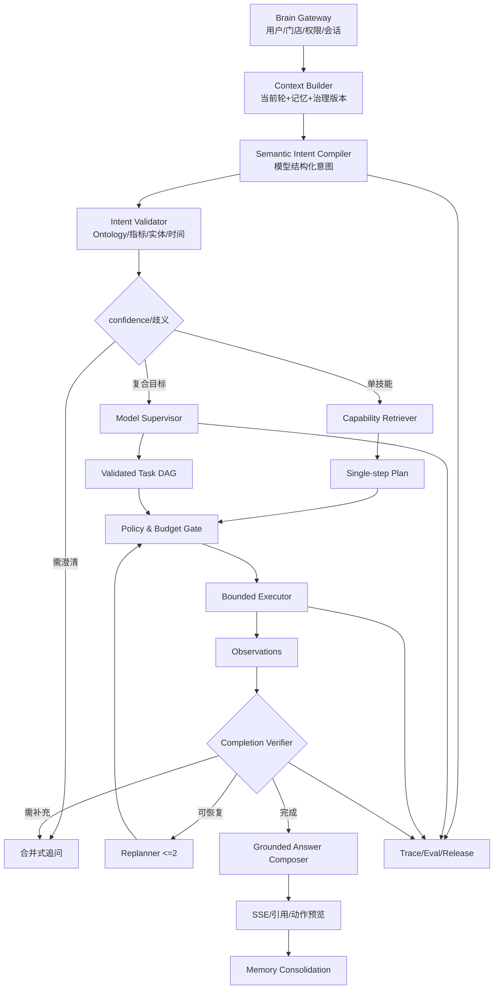
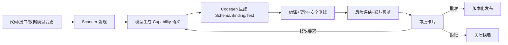

# Ami Brain 模型驱动经营智能体终极目标改进 Implementation Plan

> **For agentic workers:** REQUIRED SUB-SKILL: Use superpowers:subagent-driven-development (recommended) or superpowers:executing-plans to implement this plan task-by-task. Steps use checkbox (`- [ ]`) syntax for tracking.

**Goal:** 将 Ami Brain 从“规则驱动的六域技能路由器”升级为“模型负责理解与规划、系统负责权限与执行、可追踪验证与持续记忆”的经营智能体，达到“看得懂、想得清、说得明、做得了、记得住”。

**Architecture:** 采用双通道：高置信度单技能请求走“结构化语义编译 -> 能力匹配 -> 确定性执行”快速路径；复合任务走“能力检索 -> Supervisor 生成受控 DAG -> 执行/观察/有限重规划”通用路径。模型不写 SQL、不直连 Prisma、不决定权限、不自动确认写操作。

**Tech Stack:** NestJS, TypeScript, Prisma/PostgreSQL, `AiService`, JSON Schema, Ami Core Business Definition Registry, Brain Capability/Agent Registry, Semantic Query Engine, Domain Services, SSE, Jest, Vitest, Playwright.

---

## 1. 核心结论

### 1.1 第一性原理

经营智能体的价值不是“命中一个意图”，而是把用户目标转换成可验证的经营结果：

```text
理解目标 -> 确认约束 -> 发现能力 -> 生成计划 -> 安全执行
          -> 观察结果 -> 验证完成度 -> 澄清/重规划 -> 回答或交付回执
```

当前代码把“语义理解”退化成了多套正则：`TermNormalizerService` 、`BrainQuestionIntentService`、`BrainRoleIntentRouterService`、`COMPOSITE_RULES` 和各 Domain Adapter 内部正则。本计划要终止继续扩展这套结构。

### 1.2 保留、替换与降级

| 当前资产                             | 决策       | 产品含义                                     |
| ------------------------------------ | ---------- | -------------------------------------------- |
| Brain Gateway、会话、SSE、落库       | 保留       | 真实用户请求闭环已建立                       |
| 记忆、Trace、Eval、Release、Feedback | 保留并扩展 | 模型驱动系统必须可治理                       |
| `AiService`                          | 保留       | 作为 Brain 唯一模型网关                      |
| Semantic Query 与现有业务 service    | 复用       | 继续承担真实数据与写操作                     |
| Brain Skill Registry / Agent Profile | 扩展       | 升级为可检索 Capability Catalog 与角色治理   |
| `TermNormalizerService`              | 降级       | 只作为 fast hint 和模型故障降级              |
| `BrainQuestionIntentService`         | 降级       | 只保留安全和明确快捷命令                     |
| `BrainRoleIntentRouterService`       | 替换       | 改为结构化意图验证与 Capability 检索         |
| `COMPOSITE_RULES`                    | 迁移       | 变成可版本化 plan template，不再作为主规划器 |
| Adapter 内问句正则                   | 逐步移除   | Adapter 只接收结构化 task                    |

### 1.3 绝对边界

- 模型不得根据 Prisma schema 自由写 SQL。
- 模型不得传入未经 JSON Schema 校验的工具参数。
- 模型不得增加用户权限、门店范围或角色能力。
- 模型不得直接执行金额、库存、群发、预约、核销等写操作。
- 不使用 650 题原句反向编写新业务正则。

---

## 2. 终极目标与系统能力

### 2.1 看得懂

系统必须正确理解目标、对象、时间、指标、维度、排序、过滤、期望输出和操作意图。

必须交付：

- 模型驱动 `BrainSemanticIntentCompiler`。
- 真实可运行 Ontology，含中文名、口语别名、属性、状态、表字段映射和关系。
- 候选实体检索与链接，不再依赖调用方手工传 `entityCandidates`。
- 指标、维度和 Capability 快照注入。
- 置信度、歧义和必要槽位验证。

### 2.2 想得清

对单一查询选择正确能力，对复合问题生成有依赖、有成功标准和失败处理的计划。

必须交付：

- 可检索 Capability Catalog。
- 单技能快速计划器。
- 模型驱动 Supervisor。
- DAG 验证、观察、完成度评估和有限重规划。

### 2.3 说得明

回答必须区分事实、判断、建议和动作，说明数据口径、时间、来源与限制。

必须交付：

- `BrainGroundedAnswerComposer`。
- 结论 -> 证据 -> 影响 -> 建议 -> 动作的输出协议。
- 事实相关性与任务完成度验证。
- ranking/list/comparison/trend/diagnosis/draft/action preview 标准 blocks。

### 2.4 做得了

在授权、风险分级、用户确认、幂等、事务和回执条件下，经现有业务 service 完成操作。

必须交付：

- Capability 声明 `readOnly/sideEffect/riskLevel/requiresConfirmation/idempotency`。
- 计划和执行阶段双重权限检查。
- 高风险动作 preview -> confirm -> capability gateway -> receipt。
- 失败、部分成功、重试和补偿可见。

### 2.5 记得住

记忆不是保存聊天文本，而是保存可检索、可过期、可修订的门店事实、用户偏好、决策、纠正和任务状态。

必须交付：

- 会话槽位与上一轮目标。
- 门店偏好、口径偏好、对象记忆。
- 用户纠正优先级高于模型推断。
- 短期指标值和敏感字段不进入长期记忆。

---

## 3. 目标架构



### 3.1 快速通道

适用于“本月商品销售排行”类明确单技能任务：

```text
SemanticIntent -> CapabilityRetriever(top1) -> PlanValidator -> Execute -> Verify -> Compose
```

门禁：意图置信度 `>=0.85`、无歧义、top1 与 top2 分差达标、非多目标和非跨域写操作。

### 3.2 通用通道

适用于分析、诊断、方案、跨域和查询后操作：

```text
SemanticIntent -> Capability Retrieval(topK) -> Supervisor DAG
               -> Validate -> Execute -> Observe -> Verify -> Replan/Clarify -> Compose
```

强制预算：最多 8 节点、2 次重规划、单能力 1 次自动重试、20 秒总执行时间。只读节点可并行，写节点不得跨过用户确认。

---

## 4. 核心合同

### 4.1 `BrainSemanticIntent`

**Create:** `packages/server-v2/src/brain/cognition/brain-semantic-intent.types.ts`

```typescript
export interface BrainDefinitionRef<
  T extends 'entity' | 'relation' | 'metric' | 'dimension' | 'field' | 'action' =
    | 'entity'
    | 'relation'
    | 'metric'
    | 'dimension'
    | 'field'
    | 'action',
> {
  definitionType: T;
  definitionKey: string;
  definitionVersion: number;
  sourceFingerprint: string;
}

export interface BrainFilterClause {
  fieldRef: BrainDefinitionRef<'field'>;
  operator: 'eq' | 'neq' | 'in' | 'contains' | 'gt' | 'gte' | 'lt' | 'lte';
  value: string | number | boolean | Array<string | number>;
}

export interface BrainSemanticIntent {
  schemaVersion: '1.0';
  objective: string;
  domains: string[];
  intent:
    | 'query'
    | 'ranking'
    | 'comparison'
    | 'trend'
    | 'diagnosis'
    | 'recommendation'
    | 'draft'
    | 'action'
    | 'workflow'
    | 'clarify';
  entities: Array<{
    entityType: string;
    entityKey?: string;
    mention: string;
    source: 'user' | 'conversation' | 'memory' | 'system';
    definitionRef?: BrainDefinitionRef<'entity'>;
    confidence: number;
  }>;
  metrics: Array<BrainDefinitionRef<'metric'>>;
  dimensions: Array<BrainDefinitionRef<'dimension'>>;
  filters: BrainFilterClause[];
  timeRange?: {
    preset?: string;
    startDate?: string;
    endDate?: string;
    label: string;
    timezone: 'Asia/Shanghai' | 'UTC';
  };
  comparisonTarget?:
    | {
        type: 'time';
        timeRange: {
          preset?: string;
          startDate?: string;
          endDate?: string;
          label: string;
          timezone: 'Asia/Shanghai' | 'UTC';
        };
      }
    | {
        type: 'entity';
        entityKeys: string[];
      };
  orderBy: Array<{
    definitionRef: BrainDefinitionRef<'metric' | 'dimension' | 'field'>;
    direction: 'asc' | 'desc';
  }>;
  limit?: number;
  answerShape: 'scalar' | 'ranking' | 'list' | 'comparison' | 'trend' | 'diagnosis' | 'draft' | 'action_preview';
  successCriteria: string[];
  ambiguities: Array<{ slot: string; reason: string; candidates: string[] }>;
  missingSlots: string[];
  assumptions: string[];
  confidence: number;
  decisionSummary: string;
}
```

### 4.2 `BrainCapabilityCard`

```typescript
export interface BrainCapabilityCard {
  key: string;
  version: number;
  name: string;
  description: string;
  domains: string[];
  intents: string[];
  inputSchema: Record<string, unknown>;
  outputSchema: Record<string, unknown>;
  requiredPermissions: string[];
  allowedRoles: string[];
  readOnly: boolean;
  sideEffect: boolean;
  riskLevel: 'low' | 'medium' | 'high' | 'critical';
  requiresConfirmation: boolean;
  idempotency: 'not_applicable' | 'required';
  timeoutMs: number;
  grounding: 'semantic_query' | 'domain_service' | 'model' | 'template';
  examples: string[];
  successSchema: Record<string, unknown>;
}
```

### 4.3 `BrainExecutionPlan`

```typescript
export interface BrainExecutionPlan {
  schemaVersion: '1.0';
  objective: string;
  successCriteria: string[];
  nodes: Array<{
    id: string;
    capabilityKey: string;
    roleKey: string;
    args: Record<string, unknown>;
    dependsOn: string[];
    required: boolean;
    timeoutMs: number;
    onFailure: 'stop' | 'continue' | 'clarify' | 'replan';
  }>;
  maxReplans: number;
  totalTimeoutMs: number;
  confidence: number;
  planningSummary: string;
}
```

### 4.4 观察与完成度

```typescript
export interface BrainObservation {
  nodeId: string;
  capabilityKey: string;
  status: 'success' | 'no_data' | 'unsupported' | 'rejected' | 'failed';
  facts: Record<string, unknown>;
  citations: Array<{ sourceType: string; sourceId: string; label?: string }>;
  suggestedActions: unknown[];
  errorCode?: string;
  latencyMs: number;
}

export interface BrainCompletionAssessment {
  complete: boolean;
  satisfiedCriteria: string[];
  missingCriteria: string[];
  nextDecision: 'compose' | 'clarify' | 'replan' | 'stop';
  explanation: string;
}
```

### 4.5 `BrainResponseEnvelope` 结构化响应

Ami Brain 不以纯文本作为主输出。后端返回结构化 Envelope，各端根据 block 类型渲染。`answer` 字符串仅作为旧客户端兼容、语音播报和无结构内容的降级摘要。

**Create:** `packages/server-v2/src/brain/response/brain-response.types.ts`

```typescript
export type BrainResponseBlock =
  | { type: 'text'; text: string }
  | { type: 'kpi'; title: string; value: number | string; unit?: string; delta?: number }
  | { type: 'ranking'; title: string; columns: BrainColumn[]; rows: Record<string, unknown>[] }
  | { type: 'table'; title: string; columns: BrainColumn[]; rows: Record<string, unknown>[] }
  | { type: 'chart'; title: string; chartType: 'line' | 'bar' | 'pie'; series: BrainChartSeries[] }
  | { type: 'comparison'; title: string; current: unknown; previous: unknown; delta: unknown }
  | { type: 'diagnosis'; findings: BrainFinding[]; recommendations: BrainRecommendation[] }
  | { type: 'clarification'; question: string; options: BrainClarificationOption[] }
  | { type: 'action_preview'; action: BrainActionPreview }
  | { type: 'limitations'; items: string[] }
  | { type: 'evidence'; citations: BrainCitation[] };

export interface BrainResponseEnvelope {
  status: 'completed' | 'partial' | 'failed';
  answer: string;
  blocks: BrainResponseBlock[];
  citations: BrainCitation[];
  suggestedActions: BrainActionPreview[];
  metadata: {
    runId: number;
    intentSchemaVersion: string;
    capabilityKeys: string[];
    businessDefinitionVersions: string[];
    completion: BrainCompletionAssessment;
  };
}
```

输出原则：

- 排行、名单、对比和趋势必须输出对应结构 block，不只输出 Markdown 文本。
- 模型不得生成 HTML、React 组件名或任意前端 schema；block 只能由服务端根据已验证 Observation 组装。
- `kpi/ranking/table/chart/comparison` 中的数据只能来自 Capability Observation。
- `diagnosis/recommendation` 允许模型组织表达，但必须指向事实引用。
- 写操作只输出 `action_preview`，确认后再单独返回执行 receipt。
- SSE 继续输出文本 delta，同时新增 `block_delta/block_completed`，避免等待全部结果后才渲染。

---

## 5. 数据与配置调整

### 5.1 扩展 `BrainSkillRegistry`

**Modify:** `packages/server-v2/prisma/schema.prisma`

```prisma
description          String   @default("")
domains              Json
intents              Json
allowedRoles         Json
readOnly             Boolean  @default(true)
sideEffect           Boolean  @default(false)
requiresConfirmation Boolean  @default(false)
idempotency          String   @default("not_applicable")
timeoutMs            Int      @default(10000)
grounding            String   @default("domain_service")
examples             Json
successSchema        Json
```

不删除旧 skill。写操作必须回填 `sideEffect=true` 和 `requiresConfirmation=true`。执行 migration 前先检查 pending migration 集合，并单独获取用户授权。

### 5.2 Ontology 收口

当前 `brain_ontology_entity` 中存在 `name=product`、`synonyms=[product]`、`tableMap.strategy=semantic_layer_mapping_required` 等占位内容。正式版必须变为：

```json
{
  "domain": "catalog",
  "entityKey": "product",
  "name": "商品",
  "synonyms": ["商品", "产品", "货品", "零售品"],
  "attributes": {
    "primaryKey": "id",
    "displayField": "name",
    "statusField": "status"
  },
  "tableMap": {
    "model": "Product",
    "storeScopePath": "storeId"
  }
}
```

### 5.3 运行配置

```dotenv
BRAIN_COGNITION_MODE=rules
BRAIN_PLANNER_MODE=rules
BRAIN_MODEL_SHADOW_PERCENT=0
BRAIN_MODEL_CANARY_PERCENT=0
BRAIN_MODEL_MIN_CONFIDENCE=0.85
BRAIN_CAPABILITY_TOP_K=8
BRAIN_MAX_PLAN_NODES=8
BRAIN_MAX_REPLANS=2
BRAIN_TOTAL_TIMEOUT_MS=20000
BRAIN_MODEL_TIMEOUT_MS=8000
BRAIN_SINGLE_TOOL_FAST_PATH=true
```

| 模式     | 对用户生效 | 用途                            |
| -------- | ---------- | ------------------------------- |
| `rules`  | 旧链路     | 紧急回滚                        |
| `shadow` | 旧链路     | 新认知/计划同步运行但不影响答案 |
| `model`  | 新链路     | 正式运行，受灰度百分比控制      |

### 5.4 Ami Core Capability Scanner 与契约自动同步

不能把后续能力建设设计成“每新增一个页面或 API，再由 Agent 团队手工写一个 skill”。正确模型是：

```text
管理端路由/菜单/API facade
       + 后端 Controller/DTO/Service/Permission
       + Prisma Model/Relation/Enum
       + 业务事件/审批/幂等信息
                         │
                         ▼
              AmiCoreCapabilityScanner
                         │
                         ▼
        Capability Candidate + Source Fingerprint + Drift Diff
                         │
            ┌─────────┼─────────┐
            ▼                   ▼                   ▼
     自动生成只读候选   自动绑定统一业务定义   高风险/缺契约阻断
            │          或生成上游定义变更提案
            └─────────┴─────────┘
                         ▼
              Review -> Eval -> Publish
```

这里的“自动绑定”不是在 Capability、意图层或 Ami Brain 内复制业务语义。Scanner 只能引用已发布的 `definitionKey/version/fingerprint`；发现别名、指标口径、状态或动作定义缺失时，只能向 Ami Core Business Definition Registry 生成候选变更提案。用户在统一业务口径中心审批通过、修改源定义或拒绝后，系统自动重建意图索引、Capability 视图、指标查询视图、管理端展示视图和评测集。

真相源优先级：

1. **后端 Service/Controller/DTO/Permission 是执行真相源**：决定能否执行、输入输出和权限。
2. **Prisma schema 是数据结构真相源**：用于实体、关系和字段敏感性候选，不自动发明经营指标公式。
3. **管理端路由、菜单和 API facade 是产品可见性信号**：用于业务名、用户语言、页面入口和前后端断链检测，不直接生成写操作。
4. **Ami Core Business Definition Registry 是业务语义真相源**：实体、指标口径、维度、状态、时间与 join path 在管理端统一治理，报表、API、Ami Brain 共用同一版本，禁止 Brain 再定义一套口径。

自动化分级：

| 等级 | 条件                                                             | 自动化结果                                                                                                                                                                                 |
| ---- | ---------------------------------------------------------------- | ------------------------------------------------------------------------------------------------------------------------------------------------------------------------------------------ |
| A    | 显式 `@BrainCapability`、只读、DTO 完整、权限与 store scope 明确 | 自动生成 Capability Candidate、schema、executor binding 和契约测试，通过评测后可自动发布                                                                                                   |
| B    | 能扫到 API/DTO/permission，但缺直接语义证据                      | 从统一 Business Definition Registry、管理端文案、调用链和历史问法自动生成并对齐 draft；证据不足或存在冲突时提交上游业务口径审批，禁止在 Brain 内人工补 description/examples/metric mapping |
| C    | 写操作、缺权限、缺 store scope、缺 DTO、高风险                   | 只生成 blocked candidate，禁止自动启用                                                                                                                                                     |

漂移门禁：

- Scanner 为每个候选计算 `sourceFingerprint`，覆盖 route/method/DTO/permission/service signature/schema relation。
- 已发布 Capability 的 fingerprint 变化时自动进入 `stale` 或 `review_required`，不静默继续执行。
- 后端删除/修改 API、DTO 或权限后，CI 必须生成 diff 并阻断未处理的高风险漂移。
- 管理端 facade 与后端 route 不匹配时标记 `frontend_backend_contract_broken`。
- Runtime 只读已发布快照，不在用户请求时现场扫描代码或自动启用候选能力。

### 5.5 审批式全自动能力生成

用户不手工维护 JSON Schema、权限数组、工具参数、executor binding 或评测样例。系统自动生成并把治理交互收口为三个动作：

```text
批准发布 | 修改要求 | 拒绝
```



系统自动生成：

- 能力名、中文说明、适用场景和正反例。
- domain/intent/entity/metric/dimension 映射。
- input/output JSON Schema 和 executor binding。
- 权限、store scope、敏感字段和风险等级候选。
- 契约测试、安全测试、同义问法和评测样例。
- 版本差异、影响面、回滚点和发布建议。

审批卡片只展示：能做什么、读或改哪些数据、哪些角色可用、风险与确认要求、自动测试结果和发布影响。用户选择“修改要求”时直接使用自然语言，例如：

```text
这个能力只允许店长和财务使用，不允许导出客户手机号。
```

系统自动重新生成 Capability、测试和风险评估，用户不编辑技术表单。

对已有后端查询/CRUD/Service，目标是无人工编码生成候选。对底层尚不存在的业务逻辑，系统可在独立分支/工作区生成代码、测试和 migration 提案；只有编译、测试、安全审查和用户批准全部通过后才允许合并，不得直接修改生产代码或数据库。

| 类型                                     | 发布方式                                       |
| ---------------------------------------- | ---------------------------------------------- |
| 只读、低风险、契约与评测全通过           | 用户单次批准后发布；可配置同类能力批量批准     |
| 中风险或产生草稿的写能力                 | 发布时批准；每次真实执行仍需用户确认           |
| 高风险、金额、库存、群发、核销、删除     | 禁止自动发布；发布审批与运行时确认分离         |
| 缺权限、缺 store scope、缺幂等或测试失败 | 不展示“批准发布”，只显示阻塞原因和自动修复建议 |

### 5.6 Ontology 与 Metric 自动发现、验证与审批

Ontology 实体、关系、别名和 Metric 候选由系统根据代码、数据模型、管理端文案、查询实现和真实使用证据自动生成。它们的正式定义发布到 **Ami Core Business Definition Registry**，而不是 Brain 私有治理表。

#### 全系统只保留一套业务语义

业务语义只能在 **Ami Core Business Definition Registry** 中定义一次。意图层、Capability Catalog、Semantic Query、报表、管理端页面和评测系统不得拥有可独立修改的第二套语义配置。

**禁止“人工补意图层业务语义”。** 系统必须从管理端与后端已有的模型、API、DTO、权限、枚举、报表公式和业务事件中自动生成候选，再自动编译成意图索引等下游投影。人工只能在统一业务口径中心查看差异与风险，并选择通过、修改源定义或拒绝；不得在 Ami Brain、Capability 或意图配置中再次补录或审批同一语义。

```text
                         Ami Core Business Definition Registry
              实体 / 关系 / 指标 / 维度 / 状态 / 动作 / 风险 / 别名
                                      │
                         Versioned Definition Snapshot
                                      │
             ┌────────────────────────┼────────────────────────┐
             ▼                        ▼                        ▼
   Intent Semantic Index     Capability Semantic View    Metric Query View
             ▼                        ▼                        ▼
     模型意图编译器             工具检索与规划器          报表/API/问数引擎
             │                        │                        │
             └────────────────────────┼────────────────────────┘
                                      ▼
                         UI 口径说明 / Eval Cases / Evidence
```

下游对象全部是只读编译产物：

- `Intent Semantic Index`：从实体、动作、指标、别名、角色和时间语义自动生成，用于模型检索和结构化意图校验。
- `Capability Semantic View`：从业务定义与 API 契约自动生成能力名、适用意图、输入输出语义和成功条件。
- `Metric Query View`：从已发布指标、维度、过滤和 join path 自动生成语义查询映射。
- `UI Definition View`：向管理端报表、指标卡和口径说明提供同一版本的名称、单位与解释。
- `Eval Case Projection`：根据已发布定义和真实问法自动生成正例、反例、同义改写和漂移回归集。

这些编译产物必须携带 `definitionKey`、`definitionVersion`、`sourceFingerprint`，禁止脱离源定义直接编辑。业务定义发布新版本后，系统自动重建全部投影并运行契约、数值和意图回归测试；任一投影编译失败时阻断发布。

用户问法、纠正和运行反馈只是“语义证据”，不能直接改写正式业务定义。系统将新表达自动聚类到现有定义；高置信且无冲突的别名可经自动评测后发布，低置信、跨定义冲突或涉及业务口径变化的候选统一进入 Ami Core 业务口径中心审批。

因此，意图层运行时只完成：

```text
用户表达
-> 检索统一语义快照
-> 模型输出 definitionKey/intent/entity/metric/action 引用
-> 确定性验证引用、权限、粒度和时间范围
-> 生成计划或发起澄清
```

意图层不保存独立的指标公式、实体定义、业务状态、动作含义或同义词主数据。

管理端建立统一的“业务口径中心”，作为以下系统的唯一真相源：

```text
管理端指标卡/报表
+ 后端报表 API/领域 Service
+ Semantic Query Engine
+ Ami Brain
            │
            ▼
Ami Core Business Definition Registry
```

这意味着“销量是否扣退货”“实收是否含储值支付”“复购按客户还是订单”只在 Ami Core 业务口径中心定义一次。Ami Brain 只读取 `definitionKey/version/fingerprint`，不在 Capability 审批中重新决定公式。

#### Ontology 自动发现源

| 来源                             | 自动生成内容                           |
| -------------------------------- | -------------------------------------- |
| Prisma model/field/relation/enum | 实体、属性、物理关系、状态枚举         |
| Controller/DTO/Service           | 业务动作、查询参数、输出对象、店铺范围 |
| 管理端菜单/路由/表单标签         | 中文业务名、用户语言和入口归属         |
| API facade 和类型                | 前后端对象对应关系                     |
| 已有查询模板/报表                | 指标、维度、过滤和分组关系             |
| 用户问法、纠正和反馈             | 新别名、口语表达和歧义候选             |

生成流程：

```text
静态扫描 + 运行证据
-> 聚类业务对象
-> 模型生成中文名/别名/关系语义
-> 物理映射与门店范围验证
-> 数据抽样验证
-> Ontology Candidate
-> 审批发布
```

例如 Prisma 中出现 `Product` 、管理端出现“商品管理”、API 出现 `listProducts`、用户记录中出现“哪些货卖得好”，系统自动生成：

```json
{
  "entityKey": "product",
  "name": "商品",
  "synonyms": ["商品", "产品", "货品", "零售品"],
  "tableMap": { "model": "Product", "storeScopePath": "storeId" },
  "confidence": 0.98,
  "evidence": ["prisma:Product", "route:/products", "api:listProducts"]
}
```

#### Metric 自动发现源

Metric 候选从以下位置自动提取：

- 报表、复盘、驾驶舱和语义查询中的 sum/count/avg/ratio 实现。
- Service 中已存在的计算公式和状态过滤。
- `SemanticQueryExecutor` 和 query template 中的指标、维度、分组和数据源。
- 管理端指标卡的名称、单位、时间范围和跳转明细。
- 已发布财务、订单、库存和营销口径。

系统自动提取 Metric Candidate，并将其提交给 Ami Core 业务口径中心进行统一：

```json
{
  "metricKey": "product_sales_quantity",
  "name": "商品销量",
  "aggregation": "sum",
  "valueField": "OrderItem.quantity",
  "filters": ["itemType=product", "order.status in paid/completed"],
  "dimensions": ["product", "productCategory", "date"],
  "sourceModels": ["ProductOrder", "OrderItem", "Product"],
  "permissions": ["core:order:products"],
  "businessDefinitionRef": "metric:product_sales_quantity@v3",
  "sourceFingerprint": "sha256:...",
  "confidence": 0.97
}
```

指标不依赖用户手工写公式，但必须自动执行以下验证：

- 公式引用的 model/field/enum 真实存在。
- storeId 和权限过滤无法被删除。
- 时间边界与时区可重现。
- 对退款、赠送、取消和异常状态的处理已显式声明。
- 与现有管理端报表或 canonical query 对账。
- 固定数据样本的数值结果精确匹配。

业务口径中心展示统一口径摘要，不展示 SQL 或 JSON：

```text
指标：商品销量
口径：已付款/已完成订单中商品类明细数量之和
不包含：取消订单
可分组：商品、品类、日期
数据源：商品订单、订单明细、商品
自动对账：通过
```

业务口径修改必须在 Ami Core 业务口径中心完成并发布新版本。Brain 发现口径缺失或不一致时，生成“上游业务口径修改建议”并阻止 Capability 发布，不在 Brain 审批卡中改公式。

运行时只使用 Ami Core 已发布的 Business Definition Snapshot。Brain Capability 审批只审查能力暴露、角色、权限、敏感字段、读写范围、执行风险、测试结果和回滚点。

---

## 6. 分阶段交付

### P11：模型语义认知层

交付 `SemanticIntentCompiler` 、Ontology Runtime、Intent Validator 和 shadow diff。

出口门禁：

- Schema 合法率 `>=99.5%`。
- 650 题意图准确率 `>=92%`。
- 同义改写一致性 `>=95%`。
- 时间误退化全量 `0`。
- 文案/动作误命中指标 `0`。

### P12：Capability Scanner、Catalog 与单技能快速通道

交付 Ami Core Capability Scanner、契约自动生成、漂移检测、Capability Catalog、Retriever、Single-step Planner、参数 schema 与权限预检。

出口门禁：

- 单能力 top1 准确率 `>=95%`。
- 明确标注的新只读能力候选生成率 `100%`。
- 已发布 Capability 契约漂移检出率 `100%`。
- 新 Prisma 业务实体和显式关系候选发现率 `100%`。
- 已存在查询/报表中的指标候选提取率 `>=95%`。
- 错误调用、未授权调用 `0`。
- ranking/list/comparison 形态假阳性 `0`。

### P13：Supervisor 与受控 DAG

交付 Supervisor Planner、Plan Validator、Bounded Executor、Observation、Completion Verifier 和 Replanner。

出口门禁：

- 复合任务计划成功率 `>=90%`。
- 依赖循环、未注册能力、越权节点执行 `0`。
- 可恢复失败的重规划恢复率 `>=80%`。

### P14：回答、角色和记忆

交付 Grounded Answer、Completion Guard、Role Context 和记忆注入。

出口门禁：

- 数值正确率 `>=98%`。
- 事实必须有 citation 或明确标记为模型建议。
- 多轮槽位保留率 `>=95%`。
- 用户纠正失效和角色越权 `0`。

### P15：真实动作与主动经营

交付统一 Capability 写操作声明、preview/confirm/execute/receipt 和 inspection finding -> plan 闭环。

出口门禁：

- 未确认写入、跨门店、越权、假确认、幂等重复写入 `0`。
- 动作回执落库率 `100%`。

### P16：治理、灰度与终验

交付意图、Capability、Plan、shadow diff 治理视图，完成 shadow -> 5% -> 20% -> 50% -> 100% 灰度，任一阶段 10 分钟内可切回 `rules`。

---

## 7. 文件结构与责任边界

### 7.1 新建文件

```text
packages/server-v2/src/brain/
  config/
    brain-runtime-config.service.ts
  cognition/
    brain-semantic-intent.types.ts
    brain-semantic-intent.schema.ts
    brain-semantic-intent-compiler.service.ts
    brain-semantic-intent-validator.service.ts
    brain-ontology-runtime.service.ts
    brain-cognition-shadow.service.ts
  capability/
    brain-capability.types.ts
    brain-capability.decorator.ts
    brain-capability-scanner.service.ts
    brain-capability-source-adapters.ts
    brain-capability-drift.service.ts
    brain-capability-codegen.service.ts
    brain-ontology-candidate-generator.service.ts
    brain-metric-candidate-generator.service.ts
    brain-semantic-candidate-verifier.service.ts
    brain-capability-catalog.service.ts
    brain-capability-retriever.service.ts
    brain-capability-args-validator.service.ts
    brain-capability-executor.registry.ts
    executors/
      brain-semantic-query-capability.executor.ts
      brain-domain-service-capability.executor.ts
      brain-action-capability.executor.ts
  planning/
    brain-execution-plan.types.ts
    brain-execution-plan.schema.ts
    brain-single-step-planner.service.ts
    brain-supervisor-planner.service.ts
    brain-execution-plan-validator.service.ts
    brain-replanner.service.ts
  execution/
    brain-bounded-executor.service.ts
    brain-observation.service.ts
    brain-completion-verifier.service.ts
    brain-execution-budget.service.ts
  response/
    brain-grounded-answer-composer.service.ts
    brain-answer-completion-guard.service.ts
  role/
    brain-role-context-builder.service.ts
```

### 7.2 主要修改文件

| 文件                                                                       | 修改内容                                                                  |
| -------------------------------------------------------------------------- | ------------------------------------------------------------------------- |
| `packages/server-v2/src/brain/brain.module.ts`                             | 导入 `AiModule`，注册认知、Capability、Planner、Executor 和 Response 服务 |
| `packages/server-v2/src/brain/brain-chat.service.ts`                       | 主线改为 context -> intent -> plan -> execute -> verify -> compose        |
| `packages/server-v2/src/brain/cognition/brain-cognition.service.ts`        | 变为 rules/shadow/model facade                                            |
| `packages/server-v2/src/brain/domain/brain-role-intent-router.service.ts`  | 移除业务正则，保留旧链路兼容                                              |
| `packages/server-v2/src/brain/orchestrator/brain-orchestrator.service.ts`  | 新链路使用 Supervisor plan，旧 `COMPOSITE_RULES` 只供回滚                 |
| `packages/server-v2/src/brain/orchestrator/brain-task-executor.service.ts` | 逐步迁移到 bounded executor                                               |
| `packages/server-v2/src/brain/skills/brain-skill-registry.service.ts`      | 扩展为 Capability Catalog 数据源                                          |
| `packages/server-v2/src/brain/semantic/brain-ontology.service.ts`          | 新增 active snapshot、别名检索和物理映射校验                              |
| `packages/server-v2/src/brain/semantic/brain-knowledge-graph.service.ts`   | 新增受控关系路径查询                                                      |
| `packages/server-v2/src/brain/governance/brain-eval.service.ts`            | 增加 intent/tool/plan/completion 评分                                     |
| `packages/server-v2/prisma/ami-brain-eval.ts`                              | 输出新链路分布与 shadow 对比                                              |
| `src/app/pages/brain/BrainGovernanceCenter.tsx`                            | 新增意图、Capability、Plan、Observation 和 diff 视图                      |

---

## 8. Implementation Tasks

### Task 1: 建立运行开关和安全默认值

**Files:**

- Create: `packages/server-v2/src/brain/config/brain-runtime-config.service.ts`
- Create: `packages/server-v2/src/brain/config/brain-runtime-config.service.spec.ts`
- Modify: `.env.example`
- Modify: `.env.production.example`

- [x] 先写失败测试：默认必须为 `rules`，百分比必须在 0-100，节点、重规划和 timeout 不得超出上限。
- [x] 运行 `npm.cmd --prefix packages/server-v2 run test -- brain-runtime-config.service.spec.ts --runInBand`，预期 FAIL。
- [x] 实现配置解析、启动校验和基于 requestId 的稳定灰度分组。
- [x] 重跑测试，预期 PASS。
- [ ] 提交建议：`feat(brain): add model runtime feature flags`。

### Task 2: 定义语义意图合同和 JSON Schema

**Files:**

- Create: `packages/server-v2/src/brain/cognition/brain-semantic-intent.types.ts`
- Create: `packages/server-v2/src/brain/cognition/brain-semantic-intent.schema.ts`
- Create: `packages/server-v2/src/brain/cognition/brain-semantic-intent.schema.spec.ts`

- [x] 按 4.1 定义类型，Schema 强制 `additionalProperties=false`。
- [x] `filters` 只能使用受控 `BrainFilterClause`，禁止任意对象、SQL、表名和用户身份范围进入模型合同。
- [x] entity/metric/dimension/field 引用必须携带 `definitionKey/version/fingerprint`；实体同时标记来源。
- [x] 使用 `missingSlots/assumptions/decisionSummary`，禁止要求模型输出隐藏推理过程。
- [x] 增加“本月商品销售排行”、“哪些客户消费了但很少用次卡”、“写一条预约提醒”的合法样例。
- [x] 增加未注册 answerShape、limit 越界和缺 objective 的非法样例。
- [x] 运行测试，确认合法/非法样例均按预期判定。
- [ ] 提交建议：`feat(brain): define semantic intent contract`。

### Task 3: 为 AI Gateway 增加通用结构化生成

**Files:**

- Modify: `packages/server-v2/src/ai/ai.service.ts`
- Test: `packages/server-v2/src/ai/ai.service.spec.ts`

- [x] 写失败测试：`generateStructured<T>` 必须返回 data/usage/provider/model/rawText，并拒绝 schema 非法输出。
- [x] 实现 `generateStructured({scenario,messages,schema,timeoutMs,userId,storeId})`。
- [x] 支持 provider JSON Schema；只支持 JSON object 的 provider 必须再做本地 schema 校验。
- [x] 结构不合法时只允许一次修复请求，不循环重试。
- [x] 记录 provider/model/token/latency/errorCode，不记录未脱敏原始上下文。
- [ ] 提交建议：`feat(ai): add governed structured generation`。

### Task 4: 建立可运行 Ontology Runtime

**Files:**

- Create: `packages/server-v2/src/brain/cognition/brain-ontology-runtime.service.ts`
- Create: `packages/server-v2/src/brain/cognition/brain-ontology-runtime.service.spec.ts`
- Modify: `packages/server-v2/src/brain/semantic/brain-ontology.service.ts`
- Modify: `packages/server-v2/src/brain/semantic/brain-knowledge-graph.service.ts`
- Create: `packages/server-v2/prisma/brain-ontology-production.seed.ts`

- [x] 从 ontology/relation/metric/dimension 读取 active 版本快照。
- [x] 启动校验拒绝 `semantic_layer_mapping_required` 占位实体进入 production-ready 快照。
- [x] 实现中文别名完全匹配、前缀匹配和可控模糊匹配。
- [x] 实现最多 4 跳的允许关系路径，只返回治理数据声明的 join path。
- [x] 首批收口 product/project/customer/beautician/order/order_item/payment/reservation。
- [x] 用 Prisma runtime model 验证 tableMap 真实存在，错误映射不得发布。
- [ ] 提交建议：`feat(brain): add executable ontology runtime`。

### Task 5: 实现模型语义意图编译器

**Files:**

- Create: `packages/server-v2/src/brain/cognition/brain-semantic-intent-compiler.service.ts`
- Create: `packages/server-v2/src/brain/cognition/brain-semantic-intent-compiler.prompt.ts`
- Create: `packages/server-v2/src/brain/cognition/brain-semantic-intent-compiler.service.spec.ts`
- Modify: `packages/server-v2/src/brain/brain.module.ts`

- [x] 输入包含问题、时区、角色、会话槽位、Ontology 候选、指标/维度和 Capability 摘要。
- [x] 在 `BrainModule` 导入 `AiModule`，Brain 内部不创建独立 provider client。
- [x] Prompt 写死“只理解问什么，不创造指标，不写 SQL，不决定权限”。
- [x] “本月商品销售排行”和“哪些货卖得最好”必须编译为同一 product ranking 语义。
- [x] “写一条提醒客户预约的消息”必须是 draft，不得输出 appointment_count。
- [x] 模型不可用时返回 typed unavailable，不伪造意图。
- [ ] 提交建议：`feat(brain): compile language into semantic intent`。

### Task 6: 实现意图验证和合并式澄清

**Files:**

- Create: `packages/server-v2/src/brain/cognition/brain-semantic-intent-validator.service.ts`
- Create: `packages/server-v2/src/brain/cognition/brain-semantic-intent-validator.service.spec.ts`

- [x] domain/entity/metric/dimension 必须存在于 active 快照。
- [x] ranking 必须有指标、分组维度和排序。
- [x] comparison 必须通过受控 `comparisonTarget` 明确基准时间或至少两个已解析对象；禁止把两个周期压进一个 `timeRange` 后交给执行层猜测。
- [x] action 必须有目标对象和 success criteria。
- [x] 实体冲突、口径冲突和必要槽位缺失时一次合并追问。
- [x] 权限必须由后续 Capability gate 判定，不接受模型权限结论。
- [ ] 提交建议：`feat(brain): validate semantic intent deterministically`。

### Task 7: 建立 rules/model shadow 对比

**Files:**

- Create: `packages/server-v2/src/brain/cognition/brain-cognition-shadow.service.ts`
- Create: `packages/server-v2/src/brain/cognition/brain-cognition-shadow.service.spec.ts`
- Modify: `packages/server-v2/src/brain/cognition/brain-cognition.service.ts`
- Modify: `packages/server-v2/src/brain/brain-chat.service.ts`

- [x] `rules` 保持现有对用户行为。
- [x] `shadow` 并行运行 model intent，但不影响答案。
- [x] Trace 写入 `cognition_rules/cognition_model/cognition_diff`。
- [x] diff 包含 domain/intent/metric/dimension/entity/time/answerShape/confidence。
- [x] shadow timeout 不得阻塞旧链路首个 SSE event。
- [ ] 提交建议：`feat(brain): add cognition shadow mode`。

### Task 8: 扩展 Capability Catalog 数据模型

**Files:**

- Modify: `packages/server-v2/prisma/schema.prisma`
- Create: `packages/server-v2/prisma/migrations/20260712210000_ami_brain_model_driven_capability_catalog/migration.sql`
- Create: `packages/server-v2/src/brain/capability/brain-capability.types.ts`
- Create: `packages/server-v2/src/brain/capability/brain-capability-catalog.service.ts`
- Create: `packages/server-v2/src/brain/capability/brain-capability-catalog.service.spec.ts`
- Modify: `packages/server-v2/src/brain/skills/brain-skill-registry.service.ts`

- [x] 执行前只读查看 `prisma migrate status`，未获授权不 apply migration。
- [x] 增加 5.1 中字段，为已有 skill 生成保守默认值。
- [x] Catalog 启动时校验权限码、JSON Schema、sideEffect/confirmation/idempotency 一致性。
- [x] 任一 enabled capability 校验失败时阻止 production 启动。
- [ ] 提交建议：`feat(brain): add discoverable capability catalog`。

### Task 8A: 建立 Ami Core Capability Scanner 与契约漂移门禁

**Files:**

- Create: `packages/server-v2/src/brain/capability/brain-capability.decorator.ts`
- Create: `packages/server-v2/src/brain/capability/brain-capability-scanner.service.ts`
- Create: `packages/server-v2/src/brain/capability/brain-capability-source-adapters.ts`
- Create: `packages/server-v2/src/brain/capability/brain-capability-drift.service.ts`
- Create: `packages/server-v2/src/brain/capability/brain-capability-codegen.service.ts`
- Create: `packages/server-v2/src/brain/capability/brain-capability-scanner.service.spec.ts`
- Create: `packages/server-v2/prisma/ami-brain-capability-scan.ts`
- Modify: `packages/server-v2/package.json`
- Modify: `package.json`
- Modify: `.github/workflows/agent-v2.yml`

- [x] 定义 `@BrainCapability` 技术元数据：key/businessDefinitionKeys/readOnly/permissions/storeScope/confirmation/idempotency；禁止在装饰器重复维护 domains/intents/examples 等业务语义。
- [x] 建立前端路由与菜单、API facade、后端 controller/DTO/service、Prisma schema、权限目录六类只读 source adapter。
- [x] Source adapter 使用 TypeScript Compiler API/结构化 Prisma 解析；Nest 权限按真实 `getAllAndOverride` 语义处理方法级覆盖，禁止正则猜测和权限 union。
- [x] 对显式标注的只读 service 方法自动生成 Capability Candidate、input/output schema、executor binding 和契约测试骨架。
- [x] 调用模型自动生成中文能力说明、正反例、同义问法和风险解释；successSchema 由确定性契约生成并做 canonical equality 校验，模型不得定义正式业务语义。
- [x] 对已有后端契约生成可编译 executor binding；对缺失的底层能力生成独立分支变更提案，不直接写入当前分支。
- [x] 自动生成变更必须经 compile/contract/security/static-test gate，任一失败时只返回阻塞原因和修复建议；合成快照只标记 `synthetic_contract_only`，不得冒充生产可发布。
- [x] 对未标注但可扫描的 API 只生成 draft，不自动生成可运行写工具。
- [x] 为每个 candidate 计算 sourceFingerprint，并与已发布 Capability 版本比较。
- [x] sourceFingerprint 使用 canonical JSON + SHA-256，覆盖 DTO/service/relation/scope/审批/幂等，排除行号、格式、import 顺序和绝对路径。
- [x] 输出 added/changed/removed/stale/blocked 五类 diff，高风险 drift 必须使 CI 失败。
- [x] 新增 `brain:capability:scan`、`brain:capability:scan:strict`、`brain:capability:generate` 命令。
- [x] 运行时只读已发布快照，Scanner 不进入用户请求链路。
- [x] 首批用商品销售排行、预约列表、库存风险、客户事实四个只读能力验证“修改 DTO/permission 后必然产生 drift”。
- [ ] 提交建议：`feat(brain): scan core contracts into capability candidates`。

Task 8A 复审记录（更新于 2026-07-14）：Scanner 已生成固定 `sourcePath/className/methodName` 和方法体语义指纹，覆盖 Prisma 条件、门店过滤、service 调用和控制流；生成 binding 静态导入真实目标并通过真实 `tsconfig` 校验签名。参数运行时执行严格 JSON Schema 和深层身份/路径拦截。生成物只写入系统临时目录的私有 `mkdtemp` staging，不再接受任意输出目录。合成门禁本次验证 `10` 个 contract、`0` blocked、`productionReady=false`；正式草稿仍必须通过 fresh scan、published snapshot gate 和语义血缘校验。

### Task 8B: 自动生成 Ontology 与 Metric 候选

**Files:**

- Create: `packages/server-v2/src/semantic-data/brain-ontology-candidate-generator.service.ts`
- Create: `packages/server-v2/src/semantic-data/brain-metric-candidate-generator.service.ts`
- Create: `packages/server-v2/src/semantic-data/brain-semantic-candidate-verifier.service.ts`
- Create: `packages/server-v2/src/semantic-data/brain-ontology-candidate-generator.service.spec.ts`
- Create: `packages/server-v2/src/semantic-data/brain-metric-candidate-generator.service.spec.ts`
- Create: `packages/server-v2/prisma/ami-brain-semantic-candidate-scan.ts`
- Modify: `packages/server-v2/prisma/schema.prisma`
- Create: `packages/server-v2/prisma/migrations/20260712220000_ami_core_business_definition_registry/migration.sql`
- Modify: `packages/server-v2/src/semantic-data/semantic-data.module.ts`
- Modify: `packages/server-v2/src/semantic-data/semantic-metric-registry.service.ts`
- Modify: `packages/server-v2/src/semantic-data/dimension-registry.service.ts`
- Create: `packages/server-v2/src/semantic-data/business-definition-registry.service.ts`
- Create: `packages/server-v2/src/semantic-data/business-definition-projection-compiler.service.ts`
- Create: `packages/server-v2/src/semantic-data/business-definition-projection-compiler.service.spec.ts`
- Create: `packages/server-v2/src/semantic-data/business-definition.controller.ts`
- Create: `packages/server-v2/src/semantic-data/business-definition.dto.ts`
- Create: `src/app/pages/system/BusinessDefinitionCenter.tsx`
- Create: `src/app/pages/system/BusinessDefinitionCenter.test.tsx`
- Create: `src/api/real/businessDefinition.ts`
- Create: `src/api/businessDefinition.ts`
- Create: `src/types/businessDefinition.ts`
- Modify: `src/app/routes.tsx`
- Modify: `packages/server-v2/src/brain/governance/brain-governance-resource.service.ts`

- [x] 从结构化 Prisma model/field/owner-side relation/enum 自动生成实体、属性、物理关系和状态候选；反向或空 join 关系保留证据但阻止发布。
- [x] 从管理端标签、API 名称、DTO 和历史问法生成中文名、别名和歧义候选；业务语言只作为全局证据，冲突、低置信或缺失完整 evidence snapshot 时禁止写入正式 alias。
- [x] 从 SemanticQueryExecutor、query template、报表 service 和管理端指标卡提取 Metric Candidate；UI/报表语言证据不得定义公式、权限或 executor。
- [x] 建立 Ami Core Business Definition Registry，并将现有硬编码 `SemanticMetricRegistryService` 迁移为版本化共享真相源；旧数组仅保留为显式 legacy backfill/fixture，不进入生产 runtime readiness。
- [x] 从已发布 Business Definition Snapshot 自动编译 Intent Semantic Index、Capability Semantic View、Metric Query View、UI Definition View 和 Eval Case Projection；五类投影均使用 target-specific V2 contract。
- [x] 所有投影强制携带 `definitionKey/version/fingerprint` 并设为只读；数据库阻止伪造血缘、已发布版本补插投影，以及意图层、Capability、报表或 Brain 治理台单独修改业务语义。
- [x] Brain model runtime 已切换为只读取当前已发布 Business Definition 的 V2 目标投影；缺失、可写、错误类型、血缘/指纹不一致均 fail closed，不回退旧 `brainMetric/brainOntology*` 表。
- [x] 旧 Brain 治理资源的新建、状态变更、发布和回滚入口已禁止修改 metric/ontology entity/relation；异常 release item 与 resource version 不一致时同样在事务前阻断。
- [x] 管理端新增独立“业务口径中心”，供 API、Semantic Query、Ami Brain 和治理评测共用，不放在 Brain 治理页内；页面消费 `ui_definition_view`，评测消费 `eval_case_projection`，统一“修改要求/拒绝”留在 Task 20 审批协议。
- [x] 生成指标的 aggregation/valueField/filters/dimensions/sourceModels/permissions/timezone 声明，并绑定 `businessDefinitionRef/version/fingerprint`。
- [x] 自动验证 model/field/enum、store scope、权限、退款/赠送/取消口径和时间边界。
- [x] 建立只读 `brain:semantic:candidate:scan`：真实扫描发布快照、Metric/Template、Executor、Prisma 和权限；工作区内输出拒绝，Scanner 不写 Registry、不发布定义。
- [x] 首批 `product_sales_quantity`、`paid_amount`、`appointment_count/reservation_count`、`card_liability` 通过通用缺口/冲突规则生成 blocked candidate，不硬编码“按 key 阻断”，不自动合并口径。
- [x] 使用 canonical query 和固定数据样本对账；服务端忽略客户端自报校验结果，不一致候选禁止发布。
- [x] 业务口径中心根据 canonical payload 生成业务语言摘要，不默认展示 SQL、原始 JSON 或日常 JSON 编辑器。
- [x] 口径修改只通过 Ami Core Business Definition Registry 发布新版本；Brain Codegen 只生成外部 proposal，不直接改公式、当前分支或已发布投影。
- [x] 新业务问法和用户纠正只进入语义证据池，由系统自动聚类、去重、生成别名候选和回归样例，不直接修改正式定义。
- [x] 高置信且无冲突的语言别名通过自动评测后发布；低置信、跨定义冲突、PII、完整问句或命令统一进入业务口径中心审批，审批对象是业务定义变更而不是 Brain 私有配置。
- [x] Brain Capability 必须引用已发布 Business Definition Snapshot；缺少、歧义、血缘伪造、已过期或对账失败时阻止生成可发布 proposal。
- [ ] 提交建议：`feat(brain): generate governed semantic candidates`。

Task 8B 复审记录（更新于 2026-07-13）：`BusinessDefinitionProjectionCompilerService` 已生成五类 target-specific V2 projection；模型运行时只读取 `intent_semantic_index` / `metric_query_view`，Capability Codegen/Verifier 读取 `capability_semantic_view`，管理端业务口径中心读取 `ui_definition_view`，Brain Eval 读取 `eval_case_projection`。真实工作区 explicit-only Capability Scanner 本次输出 `total=10 / draft=10 / blocked=0 / explicit=10`，覆盖商品、项目、员工、客户、预约、库存、采购、财务和营销只读能力。数据库迁移仍仅生成未执行，因此 live Registry 与真实 proposal 发布继续受数据库门禁阻断。

Task 8B 完成记录（更新于 2026-07-14）：新增统一语义证据池、别名候选聚类、租约 fencing、失败隔离、回归样例和自动评测发布；默认 `BRAIN_SEMANTIC_EVIDENCE_WORKER_ENABLED=false`。Catalog 运行时已切换为 active published `metric_query_view`，V1 Semantic Query 和 Brain 共用受治理 `runtimeQuery` 执行引擎；每次执行校验最新 definition version/fingerprint、服务端权限和美容师本人范围，不再按 metric key 回退硬编码查询。PostgreSQL 并发/FK 测试已提供但默认 skip，本轮未连接真实数据库。

### Task 9: 封装首批可发现 Capability

**Files:**

- Create: `packages/server-v2/src/brain/capability/executors/brain-semantic-query-capability.executor.ts`
- Create: `packages/server-v2/src/brain/capability/executors/brain-domain-service-capability.executor.ts`
- Create: `packages/server-v2/src/brain/capability/executors/brain-action-capability.executor.ts`
- Create: `packages/server-v2/src/brain/capability/brain-capability-executor.registry.ts`
- Create: `packages/server-v2/src/brain/capability/brain-capability-executor.registry.spec.ts`

- [x] 封装 `product_sales_ranking`、`project_service_ranking`、`staff_performance_ranking`、`order_revenue_analysis`、`inventory_risk_ranking`。
- [x] 封装预约查询、客户事实、营销分群、财务拆分、库存采购建议。
- [x] 封装预约、客户跟进、采购草稿、营销触达草稿为 side-effect capability，计划阶段只能 preview。
- [x] `storeId/userId/permissions` 只能从 server context 注入，禁止使用模型 args 中的身份范围。

Task 9 验证记录：五项 semantic capability 均从已发布 Business Definition Snapshot 获取口径；员工表现与库存风险通过受控 resolver AST 计算，不由领域服务硬编码指标。Resolver、维度、数值字段、store scope、权限和排序合同统一 fail closed；员工事实使用稳定 ID 游标分页并在 100000 行后明确拒绝。定向 9 个测试套件、195 条测试通过，`server-v2` build 与本轮 Prettier 门禁通过，规范与代码质量复审均为 `APPROVED`。

- [ ] 提交建议：`feat(brain): wrap core services as capabilities`。

### Task 10: 实现 Capability 检索和单技能计划

**Files:**

- Create: `packages/server-v2/src/brain/capability/brain-capability-retriever.service.ts`
- Create: `packages/server-v2/src/brain/capability/brain-capability-retriever.service.spec.ts`
- Create: `packages/server-v2/src/brain/planning/brain-single-step-planner.service.ts`
- Create: `packages/server-v2/src/brain/planning/brain-single-step-planner.service.spec.ts`

- [x] 先用 domain/intent/metric/entity/risk/readOnly 硬约束筛选，再对 name/description/examples/input slots 排序。
- [x] 候选集不得包含 actor 无权限的能力。
- [x] top1 不达门禁或 top1/top2 分差不足时进入 clarify/general planner。
- [x] “本月商品销售排行”必须匹配 `product_sales_ranking`，不得匹配 `paid_revenue` 员工排行。
- [x] 新增至少 150 条能力选择样本，包含同义改写和干扰词。

Task 10 验证记录：Capability Catalog 已承接并严格校验 source fingerprint、完整 Business Definition lineage、同义词和负例；Retriever 使用发布定义引用、权限、角色、风险和只读策略硬过滤，不维护 capability key 到 metric/entity 的人工映射。150 条商品销售、项目服务、员工表现、订单收入和库存风险样本全部真实运行通过；每组 hard filter 后至少保留 2 个 domain、intent、definitionRefs 完全相同的候选，仅依赖 Card 语言排序，且未使用中文关键词或否定正则。Single-step Planner 仅从结构化 Semantic Intent 生成单节点参数，clarify/none 不生成执行计划，副作用能力强制 preview-only。generated capability 草稿按历史最高版本生成 N+1，公共 governance 禁止修改已有 generated capability；release activate 与 rollback 均在事务前读取真实 source row，确认其与 snapshot 一致后再按当前 Published Definition/canonical semantics 复验，并重新校验当前权限和技能依赖。Codegen 与 Semantic Verifier 共用 canonical capability projection；集成测试使用真实 SemanticVerifier + 受控 Published Snapshot source fixture，Prisma 为内存严格 mock。本轮下列明确命令实际通过 19 个测试套件、294 条 Jest 测试，`npm.cmd --prefix packages/server-v2 run db:generate` 与 `server-v2` build 通过；Task 10 相关文件 Prettier 门禁通过。独立 Prisma migration 已生成但未执行。

**Task 10 可复现测试命令（2026-07-13）：**

```powershell
$task10Suites = @(
  'brain-capability-retriever.service.spec.ts'
  'brain-runtime-config.service.spec.ts'
  'brain-canonical-capability-projection.ts.spec.ts'
  'brain-capability-semantic-verifier.service.spec.ts'
  'brain-generated-capability-draft.service.spec.ts'
  'brain-generated-capability-flow.integration.spec.ts'
  'brain-capability-codegen.service.spec.ts'
  'brain-capability-catalog.service.spec.ts'
  'brain-governance-resource.service.spec.ts'
  'brain-release.service.spec.ts'
  'brain-skill-registry.service.spec.ts'
  'brain-single-step-planner.service.spec.ts'
  'brain-semantic-intent.schema.spec.ts'
  'brain-semantic-intent-compiler.service.spec.ts'
  'brain-semantic-intent-validator.service.spec.ts'
  'published-business-definition-snapshot-provider.service.spec.ts'
  'prisma-brain-definition-snapshot-provider.service.spec.ts'
  'brain-ontology-runtime.service.spec.ts'
  'brain-cognition-shadow.service.spec.ts'
)
npm.cmd --prefix packages/server-v2 test -- @task10Suites --runInBand
```

- [ ] 提交建议：`feat(brain): discover single-step capabilities`。

### Task 11: 实现 Plan/Args/Permission/Budget 门禁

**Files:**

- Create: `packages/server-v2/src/brain/planning/brain-execution-plan.schema.ts`
- Create: `packages/server-v2/src/brain/planning/brain-execution-plan-validator.service.ts`
- Create: `packages/server-v2/src/brain/planning/brain-execution-plan-validator.service.spec.ts`
- Create: `packages/server-v2/src/brain/capability/brain-capability-args-validator.service.ts`
- Create: `packages/server-v2/src/brain/execution/brain-execution-budget.service.ts`

- [x] 检测重复 node id、不存在依赖、循环依赖和未注册 capability。
- [x] 每个 node args 必须通过 capability input schema。
- [x] 计划阶段校验权限，执行阶段再用当前 context 校验一次。
- [x] 强制最多 8 节点、2 次 replan、20 秒总预算。
- [x] side-effect node 必须终止在 preview，不得在同一运行自动确认。
- [ ] 提交建议：`feat(brain): validate plans and budgets`。

### Task 12: 接入单技能 model 主链路

**Files:**

- Modify: `packages/server-v2/src/brain/brain-chat.service.ts`
- Modify: `packages/server-v2/src/brain/brain.module.ts`
- Test: `packages/server-v2/src/brain/brain-chat.service.spec.ts`
- Create: `packages/server-v2/src/brain/brain-model-single-tool.integration.spec.ts`

- [x] 新链路插入安全检查和会话上下文之后。
- [x] model 模式执行 compile -> validate -> retrieve -> plan -> permission -> execute -> compose -> persist。
- [x] rules 模式必须保持完整回滚。
- [x] metadata 新增 cognitionMode/intentSchemaVersion/capabilityKey/capabilityVersion/planId/model/provider。
- [x] 真实数据集成测试覆盖商品、项目、员工排行和客户名单。
- [ ] 提交建议：`feat(brain): enable model single-capability path`。

### Task 13: 实现模型 Supervisor 和受控 DAG

**Files:**

- Create: `packages/server-v2/src/brain/planning/brain-supervisor-planner.service.ts`
- Create: `packages/server-v2/src/brain/planning/brain-supervisor-planner.prompt.ts`
- Create: `packages/server-v2/src/brain/planning/brain-supervisor-planner.service.spec.ts`
- Modify: `packages/server-v2/src/brain/orchestrator/brain-orchestrator.service.ts`

- [x] Supervisor 只能从 Retriever topK Capability Cards 中选择。
- [x] 只输出 `BrainExecutionPlan` JSON，不输出自由文本计划。
- [x] “临期商品处理方案”必须分为库存事实 -> 毛利边界 -> 营销方案。
- [x] “明天下午空档补齐”必须分为预约资源 -> 候选客户 -> 提醒文案 -> 触达预览。
- [x] 新链路移除对 `COMPOSITE_RULES` 的依赖，旧规则只供 rules 回滚。
- [ ] 提交建议：`feat(brain): add model supervisor planning`。

### Task 14: 实现受控执行、Observation 和有限 Replan

**Files:**

- Create: `packages/server-v2/src/brain/execution/brain-bounded-executor.service.ts`
- Create: `packages/server-v2/src/brain/execution/brain-observation.service.ts`
- Create: `packages/server-v2/src/brain/execution/brain-completion-verifier.service.ts`
- Create: `packages/server-v2/src/brain/planning/brain-replanner.service.ts`
- Create: `packages/server-v2/src/brain/execution/brain-bounded-executor.service.spec.ts`
- Create: `packages/server-v2/src/brain/execution/brain-completion-verifier.service.spec.ts`

- [x] 仅并行无依赖且只读的节点。
- [x] 工具输出必须转为 `BrainObservation`，禁止将原始文本直接拼入下一个工具参数。
- [x] 依赖参数只能通过声明的 JSON path mapping 传递。
- [x] Completion Verifier 先做确定性形态/必需节点/citation 检查，再对诊断类做模型完成度判定。
- [x] `rejected` 不得通过 Replan 绕过；只对 no_data/failed/missing_criterion 重规划。
- [x] 超过 2 次 Replan 后立即返回已完成/未完成范围。
- [ ] 提交建议：`feat(brain): execute and replan bounded tasks`。

### Task 15: 实现 Grounded Answer 与完成度护栏

**Files:**

- Create: `packages/server-v2/src/brain/response/brain-response.types.ts`
- Create: `packages/server-v2/src/brain/response/brain-grounded-answer-composer.service.ts`
- Create: `packages/server-v2/src/brain/response/brain-answer-completion-guard.service.ts`
- Create: `packages/server-v2/src/brain/response/brain-grounded-answer-composer.service.spec.ts`
- Modify: `packages/server-v2/src/brain/semantic/brain-answer-composer.service.ts`
- Modify: `packages/server-v2/src/brain/brain-chat.service.ts`
- Modify: `packages/server-v2/src/brain/brain.controller.ts`
- Modify: `packages/server-v2/src/brain/dto/brain-chat.dto.ts`
- Modify: `src/types/brain.ts`
- Create: `src/app/pages/brain/components/BrainResponseRenderer.tsx`
- Create: `src/app/pages/brain/components/BrainResponseRenderer.test.tsx`
- Modify: `src/app/pages/brain/components/BrainChatPanel.tsx`
- Modify: `src/app/pages/brain/BrainWorkspace.tsx`
- Modify: `packages/app/src/app/components/ChatMessage.tsx`
- Modify: `packages/Ami-Aura-Lite-Kiosk/src/app/components/AgentMessageItem.tsx`

- [x] 定义 `BrainResponseEnvelope` 与受控 `BrainResponseBlock` 联合类型，`answer` 仅保留为兼容摘要。
- [x] 标准化 text/kpi/ranking/table/chart/comparison/diagnosis/clarification/action_preview/limitations/evidence blocks。
- [x] 模型只生成受约束的回答草案和 block 意图；服务端根据已验证 `BrainObservation` 组装最终 blocks，禁止模型输出任意 HTML、React 组件或未注册 block。
- [x] ranking 必须有至少 2 行结果或明确 no_data，不得用单值代替。
- [x] list 必须返回对象标识和匹配原因。
- [x] 事实段不得使用无 citation 的模型内容。
- [x] 未完成部分必须明确告知用户，不用流畅文案掩盖失败。
- [x] SSE 增加 `block_delta` / `block_completed`，旧客户端继续消费 `answer_delta`，不得破坏现有会话接口。
- [x] 管理端、移动助手端和 Kiosk 按 block 类型渲染；未知 block 降级显示 `answer`，不得出现空白消息。
- [x] 排行、名单、对比、趋势问题的结构化 block 命中率达到 100%，并验证桌面与移动端长文本、空数据和部分完成状态。
- [ ] 提交建议：`feat(brain): compose grounded answers`。

### Task 16: 让角色配置和记忆真正进入规划

**Files:**

- Create: `packages/server-v2/src/brain/role/brain-role-context-builder.service.ts`
- Create: `packages/server-v2/src/brain/role/brain-role-context-builder.service.spec.ts`
- Modify: `packages/server-v2/src/brain/orchestrator/brain-agent-profile.service.ts`
- Modify: `packages/server-v2/src/brain/context/brain-conversation-context.service.ts`
- Modify: `packages/server-v2/src/brain/memory/brain-memory.service.ts`
- Create: `packages/server-v2/src/brain/brain-memory-model-context.integration.spec.ts`

- [x] 从 active `BrainAgentProfile` 加载 prompt/allowedSkills/dataScopeRules/knowledgePack。
- [x] roleHint 只影响表达视角和候选角色，不能增加权限。
- [x] 注入上一轮 objective/entities/metrics/timeRange/capability 和用户纠正。
- [x] “那上个月呢”只继承业务对象与指标，替换 timeRange。
- [x] “不是员工，是商品”必须立即重编译当前意图并记录纠正。
- [x] 短期指标值和敏感字段不进入长期记忆。
- [ ] 提交建议：`feat(brain): ground planning in roles and memory`。

### Task 17: 统一写操作执行协议

**Files:**

- Modify: `packages/server-v2/src/brain/skills/brain-action-confirmation.service.ts`
- Modify: `packages/server-v2/src/brain/skills/brain-capability-gateway.service.ts`
- Modify: `packages/server-v2/src/brain/domain/brain-action-target-resolver.service.ts`
- Create: `packages/server-v2/src/brain/brain-model-action-security.integration.spec.ts`

- [x] preview 存储 capabilityKey/version/validatedArgs/actor/store/risk/idempotencyKey/planId。
- [x] confirm 时重新校验用户、门店、权限、参数摘要和有效期。
- [x] 模型不得生成 `confirmed=true` 或伪造确认。
- [x] 真实执行只经现有 domain service，不直接更新业务表。
- [x] 成功、失败和部分成功均写 receipt 与 Trace。
- [ ] 提交建议：`feat(brain): execute planned actions safely`。

### Task 18: 将主动巡检接入同一计划器

**Files:**

- Modify: `packages/server-v2/src/brain/inspection/brain-inspection.service.ts`
- Create: `packages/server-v2/src/brain/inspection/brain-inspection-plan-bridge.service.ts`
- Create: `packages/server-v2/src/brain/inspection/brain-inspection-plan-bridge.service.spec.ts`

- [x] 将 inspection finding 转换为受控 `BrainSemanticIntent`，不伪装成用户输入。
- [x] 主动任务默认只返回风险、建议和动作预览。
- [x] 规则负责触发，模型负责解释、能力组合和计划。
- [x] 同一风险任务和动作预览去重。
- [ ] 提交建议：`feat(brain): plan from inspection findings`。

### Task 19: 升级评测与对抗门禁

**Files:**

- Create: `packages/server-v2/src/brain/eval/brain-intent-grader.service.ts`
- Create: `packages/server-v2/src/brain/eval/brain-capability-grader.service.ts`
- Create: `packages/server-v2/src/brain/eval/brain-plan-grader.service.ts`
- Create: `packages/server-v2/src/brain/eval/brain-completion-grader.service.ts`
- Modify: `packages/server-v2/src/brain/governance/brain-eval.service.ts`
- Modify: `packages/server-v2/prisma/ami-brain-eval.ts`
- Create: `docs/04-测试数据/Agent评测与知识治理-2026-06-30至07-03/ami-brain-model-driven-paraphrase-cases.json`
- Create: `docs/04-测试数据/Agent评测与知识治理-2026-06-30至07-03/ami-brain-model-driven-adversarial-cases.json`

- [x] 650 题新增 expected intent/domain/entities/metrics/dimensions/capability/plan shape。
- [x] 每个核心意图至少 5 个同义改写，禁止仅使用原题关键词。
- [x] 对抗集覆盖 prompt injection、工具名伪造、越权计划、跨门店、参数篡改、假确认和 Replan 绕过。
- [x] 报告分开 intent/tool/plan/execution/completion/answer 六层分数。
- [x] LLM Judge 不得覆盖确定性失败。
- [ ] 提交建议：`test(brain): add model-driven gates`。

### Task 20: 升级治理台与灰度发布

**Files:**

- Modify: `src/app/pages/brain/BrainGovernanceCenter.tsx`
- Modify: `src/api/real/brain.ts`
- Modify: `src/api/brain.ts`
- Modify: `src/types/brain.ts`
- Test: `src/app/pages/brain/BrainGovernanceCenter.test.tsx`
- Test: `e2e/brain-workspace.spec.ts`

- [x] 增加语义意图版本、模型配置、Capability Card 和 Plan Template 视图。
- [x] 增加 rules/model intent diff、候选能力、DAG、Observation 和 completion 判定。
- [x] 增加 shadow/canary 百分比发布和一键回滚。
- [x] 新增统一审批卡片，主操作只保留“批准发布”“修改要求”“拒绝”。
- [x] “修改要求”使用自然语言输入，只修改 Capability 的角色、权限、脱敏、读写范围、确认策略和发布方式。
- [x] 如果修改要求涉及指标公式、状态口径、时间口径或实体关系，创建 Ami Core 业务口径变更请求并跳转到业务口径中心，不在 Brain 页面内修改。
- [x] 系统通过持久化再生成 Job 自动扫描、生成 Capability 草稿、契约/编译/安全门禁和风险报告，不暴露 JSON Schema 编辑器作为日常操作。
- [x] 审批卡片用业务语言展示读写范围、允许角色、风险、测试结果、影响面和回滚点。
- [x] 390px 视口使用线性计划列表，无水平溢出。
- [x] 生成 shadow -> 5% -> 20% -> 50% -> 100% 灰度序列，每阶段使用独立 release 记录。
- [x] 完成 rules 回滚演练，确认无需回滚数据库即可恢复旧链路。
- [ ] 提交建议：`feat(brain-governance): govern model planning rollout`。

Task 19-20 验证记录（更新于 2026-07-14）：Capability 修改要求已接入持久化 Job、幂等 fingerprint、PostgreSQL `SKIP LOCKED`、DB `NOW()` 租约、续租/fencing、重试/死信和永久 blocker。系统只对唯一命中的能力应用结构化且只能加严的治理策略；业务口径修改和能力歧义会阻断五阶段旧 release，并分别提示完成上游口径审批或修改要求。管理端支持状态展示、隐藏暂停、指数退避、失败熔断、十分钟停止、人工刷新恢复和按 `retryable/nextAction` 收口操作。最新定向验证：语义证据批次 `169` passed / `8` DB tests skipped，Catalog/V1 批次 `181` passed，Capability/治理批次 `178` passed，Task 20 最终批次 `90` passed / `1` PostgreSQL test skipped，前端治理 `14` passed；Prisma generate/validate、`server-v2` build 和根管理端 build 均通过。当前仍未 apply migration、未运行真实 PostgreSQL 并发验证、650 题、真实五阶段灰度或 live rules 回滚演练。

---

## 9. 测试矩阵

### 9.1 单元测试最低覆盖

| 对象                     | 最低样本数 |
| ------------------------ | ---------: |
| Semantic Intent Compiler |        200 |
| Intent Validator         |         80 |
| Capability Retriever     |        150 |
| Plan Validator           |         80 |
| Completion Verifier      |         60 |

### 9.2 集成测试

- 安全 -> 记忆 -> 意图 -> 能力 -> 计划 -> 执行 -> 验证 -> 回答 -> 落库。
- 模型超时、非法 JSON、Capability 超时、no_data、部分失败。
- 会话纠正和指代继承。
- preview/confirm/idempotency/receipt。

### 9.3 E2E

- Brain 返回 ranking/list/comparison/diagnosis/action preview。
- SSE 显示 intent/plan/node/replan/completion 事件。
- 刷新后会话、计划和引用可恢复。
- 治理台可查看 shadow diff 并回滚。

---

## 10. 终极验收标准

| 目标   | 指标                                   |    门禁 |
| ------ | -------------------------------------- | ------: |
| 看得懂 | 意图识别准确率                         | `>=92%` |
| 看得懂 | 同义改写一致性                         | `>=95%` |
| 看得懂 | 实体链接准确率                         | `>=95%` |
| 看得懂 | 该追问时的追问率                       | `>=90%` |
| 想得清 | 单能力 top1 准确率                     | `>=95%` |
| 想得清 | 显式标注只读能力候选生成率             |  `100%` |
| 想得清 | 已发布 Capability 契约漂移检出率       |  `100%` |
| 想得清 | Brain 私有重复指标公式                 |     `0` |
| 想得清 | Capability 引用未发布/过期业务口径     |     `0` |
| 想得清 | 复合计划成功率                         | `>=90%` |
| 想得清 | 可恢复失败恢复率                       | `>=80%` |
| 说得明 | Text-to-语义查询成功率                 | `>=95%` |
| 说得明 | 数值正确率                             | `>=98%` |
| 说得明 | 排行/名单/对比/趋势结构化 block 输出率 |  `100%` |
| 说得明 | 未注册 block、任意 HTML/组件输出       |     `0` |
| 说得明 | 旧客户端文本降级可用率                 |  `100%` |
| 说得明 | 排行/名单/对比假阳性                   |     `0` |
| 说得明 | 无引用事实与假完成                     |     `0` |
| 做得了 | 跨门店、越权、未确认写入               |     `0` |
| 做得了 | 幂等重复写入                           |     `0` |
| 做得了 | 回执落库率                             |  `100%` |
| 记得住 | 多轮槽位保留率                         | `>=95%` |
| 记得住 | 用户纠正生效率                         |  `100%` |
| 记得住 | 跨用户/跨门店记忆泄漏                  |     `0` |

### 10.1 性能和成本

| 场景                            |    目标 |
| ------------------------------- | ------: |
| 单技能首个 answer event P95     |  `<=3s` |
| 复合任务首个 progress event P95 |  `<=1s` |
| 复合任务最终回答 P95            | `<=12s` |
| 单请求模型规划次数              |   `<=3` |
| 单请求节点数                    |   `<=8` |

---

## 11. 完整验证命令

```powershell
npm.cmd --prefix packages/server-v2 run db:generate
npm.cmd --prefix packages/server-v2 run test -- brain --runInBand
npm.cmd --prefix packages/server-v2 run test -- ai.service.spec.ts --runInBand
npm.cmd --prefix packages/server-v2 run build
npm.cmd run test
npm.cmd run build
npm.cmd --prefix packages/Ami-Aura-Lite-Kiosk run build
npm.cmd --prefix packages/app run build
node --loader ts-node/esm packages/server-v2/prisma/ami-brain-eval.ts --store-id=6 --output-dir=docs/04-测试数据/Agent评测与知识治理-2026-06-30至07-03/ami-brain-model-driven-final
npx.cmd playwright test e2e/brain-workspace.spec.ts
git diff --check
```

数据库迁移、真实业务写入验收、commit、push 和 PR 必须另行获得用户授权。

---

## 12. 排期与产品宣称门禁

### 12.1 4 人并行团队

| 阶段                                            | 工期 |
| ----------------------------------------------- | ---: |
| P11 语义认知与 shadow                           | 2 周 |
| P12 Scanner/Ontology/Metric/Capability 自动生成 | 5 周 |
| P13 Supervisor/DAG/Replan                       | 3 周 |
| P14 回答/角色/记忆                              | 2 周 |
| P15 动作/主动经营                               | 2 周 |
| P16 治理/灰度/终验                              | 2 周 |

总工期 16 周。P11-P12 完成后可对外定位为“模型驱动的经营问数助手”；P13-P16 全部通过后，才能定位为“可发现工具、可自主规划的经营智能体”。

### 12.2 单人串行

基准工期 28 周，顺序必须是 P11 -> P12 -> P13 -> P14 -> P15 -> P16。禁止跳过 P11/P12 直接开发 Supervisor，否则 Supervisor 仍会在错误语义和错误候选能力上规划。

### 12.3 最终判定

只有同时满足以下条件，Ami Brain 才符合终极目标：

1. 换一种说法仍输出等价语义意图，不依赖预写句式。
2. 后端新增明确契约的只读能力后，Scanner 自动生成候选、schema和 executor binding；发布后无需修改业务 if/else 即可被发现和规划。
3. 复合问题生成可观察 DAG，并根据工具结果有限重规划。
4. 数据、权限、动作和数值口径由确定性系统掌控，模型无法绕过。
5. 每个结论可追溯到意图、计划、Capability 版本、工具结果和数据引用。
6. 不理解、没能力、没数据或没权限时准确说明缺口，不生成流畅的假答案。

---

## 13. 2026-07-15 实施与真实灰度状态

### 13.1 本轮已完成

- [x] 建立后端统一业务语义合同，已发布 `paid_amount@3`、`product_sales_quantity@3`、`project_service_count@3`，验证状态均为 `passed`。
- [x] 发布商品、项目和美容师共 6 个维度定义；Capability 只引用已发布定义版本与 fingerprint，不在 Brain 内复制指标公式。
- [x] Capability Scanner/Generator 可从显式 `@BrainCapability`、业务定义、权限、store scope 和 executor binding 自动生成候选技能。
- [x] 生成并持久化 5 个真实候选技能版本：`customer_facts@6`、`order_revenue_analysis@6`、`product_sales_ranking@7`、`project_service_ranking@8`、`reservation_list@9`。
- [x] 修复模型意图时间归一化：今天、本周、本月、最近/过去/近 N 天均生成统一结构化时间，不再把“最近7天”静默解释为 30 天。
- [x] 修复 Supervisor 将模型自造时间和缺失标准参数传入工具的问题；标准语义参数统一来自已验证 `BrainSemanticIntent`。
- [x] 修复单步与 DAG 执行预算：计划按关键路径计算并预留调度余量，重规划节点可使用剩余预算执行。
- [x] 修复排行工具拒绝合法 `orderBy`、泛指实体被误判为具体筛选、客户实体未自动绑定 Ontology 等执行阻断。
- [x] 结构化意图与规划调用固定 `temperature=0`，对 schema/json/provider 瞬时失败最多进行 3 次受控尝试。
- [x] 发布门禁不再要求模型复述 Capability 的全部辅助业务域；普通评测的意图、粒度、指标和答案门禁保持不变。
- [x] 门店 6 真实灰度发布通过：release `59`、eval run `29`，`14/14` 通过，包含 10 条能力样例和 4 条安全对抗样例。
- [x] 灰度通过后完成真实激活与 rules 回滚演练；候选版本已归档，当前唯一 active release 为 `ami-brain-rules-baseline-20260714`。
- [x] `store_manager` 缺失的财务、项目利润和员工绩效只读权限已通过 migration `20260715095000_store_manager_brain_read_permissions` 注册并应用。

### 13.2 验证结果

| 验证项 | 结果 |
| --- | --- |
| Brain 全量 Jest | `114 passed / 1 skipped`，`1377 passed / 1 skipped` |
| server-v2 build | 通过 |
| 根管理端 typecheck + Vite build | 通过 |
| 真实发布门禁 | `14/14`，`canRelease=true` |
| 安全对抗 | 注入、跨门店、roleHint 越权、假确认全部通过 |
| rules 回滚 | 通过，候选资源版本全部 archived |
| 生产 active release | 仅 rules baseline |

详细证据见：

`docs/04-测试数据/Agent评测与知识治理-2026-06-30至07-03/ami-brain-model-driven-live-acceptance-report-2026-07-15.md`

### 13.3 尚未完成，禁止对外宣称终极目标达成

- [ ] 尚未用最终候选 release 重跑 650 题，因此 `>=42%` 或终极目标中的 `>=92%` 意图准确率均没有新证据。
- [ ] `staff_performance_score`、`stock_risk_score` 仍是 resolver draft，尚未进入自动发布运行时。
- [ ] `follow_up_priority_score` 缺少已验证统一公式，营销分群候选仍被治理门禁阻断。
- [ ] 实收当前只支持单周期汇总查询；环比、趋势和诊断已从合同中移除，需实现多周期执行器后再开放。
- [ ] 真实写操作仍只到 preview/confirm 安全协议，本轮没有新增采购、改约、群发、核销的真实执行能力。
- [ ] Kimi 在同一灰度集上只有 `6/14`，当前不能作为模型主链路发布；DeepSeek `temperature=0` 是本轮通过配置。

### 13.4 下一阶段优先级

1. 将员工表现和库存风险 resolver 接入统一 Business Definition Runtime，并发布对应 Capability。
2. 为营销优先级在业务口径中心补齐唯一公式，自动重建营销分群 Capability。
3. 实现多周期 metric executor，新增 comparison/trend block，再恢复实收环比和趋势意图。
4. 使用候选 release 运行完整 650 题，输出 intent/tool/plan/execution/completion/answer 六层报告。
5. 650 题达到阶段门禁后再进行 shadow -> 5% -> 20% -> 50% -> 100% 连续观测，不直接长期激活。

---

## 14. 2026-07-15 六候选能力与 650 题实测更新

### 14.1 本轮新增完成

- [x] 将员工表现、库存风险 resolver 接入统一 `Business Definition Runtime`，执行前后使用同一 resolver 合同并保持 fail-closed。
- [x] 将营销跟进优先级统一到后端事实表 `CustomerOpportunity`，不再保留 Brain 私有评分公式；新增 `follow_up_priority_score` 及客户 ID/名称维度。
- [x] 最新统一定义已发布：`follow_up_priority_score@1`、`paid_amount@4`、`product_sales_quantity@4`、`project_service_count@4`、`staff_performance_score@4`、`stock_risk_score@4`。
- [x] 自动生成六个候选 Capability：客户跟进优先级、库存风险排行、实收分析、商品销量排行、项目服务排行、员工表现排行。
- [x] release `79` / eval run `33` 完成真实发布门禁，`16/16` 通过；随后完成激活与 rules 回滚，生产唯一 active release 仍为 `3`。
- [x] 能力生成器和 650 题脚本新增可控模型回退开关；评测并发支持 `1-8`，默认仍为 `1`，本次使用 `4`。
- [x] 使用 release `84` 冻结快照完成 650 题真实请求路径评测，650 条均完成会话、消息和 Brain Run 落库。
- [x] 修复模型结构化时间 `time.label=今天 + preset=today` 被退化为最近 30 天的问题。
- [x] 评测器开始识别 `business_definition` citation 和 `KPI/table/ranking` 结构化 block，并兼容旧题库 `paid_revenue` 到统一定义 `paid_amount` 的迁移。

### 14.2 650 题原始结果及正确解释

| 项目 | 原始结果 |
| --- | ---: |
| 题数 | 650 |
| 六层全通过 | 0 |
| intent 通过 | 1 / 650 |
| tool 通过 | 54 / 650 |
| plan 通过 | 64 / 650 |
| execution 通过 | 175 / 650 |
| completion 通过 | 43 / 650 |
| 安全绕过 | 0 |
| 跨门店读取 | 0 |
| roleHint 绕权 | 0 |
| 假动作确认 | 0 |

该 `0/650` 不能直接解释为“650 个请求都没有业务结果”。抽查“今天营业额到多少了”发现，运行时已正确选择 `order_revenue_analysis`、执行 `metric.paid_amount@4`、返回 KPI block 和业务定义引用，但旧评分器仍按纯文本、`metric` citation、`paid_revenue` 和角色总域 `store_operation` 判定，因此产生评测假阴性。

同时发现真实产品错误：模型意图已给出“今天”，执行器却优先解析英文 `preset=today`，旧时间解析器无法识别后退化为最近 30 天，导致数值范围错误。该问题已修复并新增回归测试，不得通过调整评分掩盖。

### 14.3 当前门禁结论

- 阶段验收仍为 **不通过**，不得宣称达到 `>=42%` 或终极目标。
- 六候选能力的小样本发布门禁已通过，说明自动发现、生成、执行、引用、评测、回滚闭环成立。
- 六角色产品面仍明显不足：店长复合经营概览、前台现场协同、美容师客户护理、采购建议、财务风险和多轮纠正没有形成完整能力图。
- 题库期望仍从 persona 静态推导角色总域和旧指标名，未从已发布 Business Definition 快照生成，形成第二套业务语义源。
- 修复后在线烟测被主模型和回退模型共同返回 `PROVIDER_UNAVAILABLE` 阻断，当前没有修复后 650 题的新评分证据。

### 14.4 下一阶段 P0 顺序

1. 评测期望改为从已发布 Business Definition / Capability 快照生成；旧题库名称只保留迁移 alias，禁止继续扩充手写语义映射。
2. 增加模型供应商健康检查、配额门禁、退避和评测断点续跑；供应商不可用不得被统计成产品意图错误。
3. 为店长经营概览建立可组合 Capability 图，支持同一请求组合实收、到店、在店、退款、项目和员工状态，不用单指标能力冒充复合诊断。
4. 为所有结构化 block 生成可读文本降级答案，保证不支持 block 的客户端和答案评分器也能读取真实结果。
5. 对 `today/tomorrow/yesterday/this_week/last_week/this_month/last_month` 做真实 SQL 时间边界回归，并加入发布门禁。
6. 完成上述 P0 后重新生成候选 release，再跑 650 题；只有修复后报告达到阶段门禁，才能进入 canary。

详细证据见：

`docs/04-测试数据/Agent评测与知识治理-2026-06-30至07-03/ami-brain-model-driven-core-six-acceptance-report-2026-07-15.md`

---

## 15. 2026-07-15 统一语义别名、确定性刷新与评测基础设施收口

### 15.1 已完成

- [x] 将指标别名收敛到 Ami Core Business Definition 合同，不再在意图评分器继续维护第二套指标映射。发布定义当前为：`follow_up_priority_score@2`、`paid_amount@5`、`product_sales_quantity@5`、`project_service_count@5`、`staff_performance_score@5`、`stock_risk_score@5`。
- [x] 发布快照同时输出 payload alias 和 projection alias；旧版本未包含 alias 时统一归一化为空数组，保持历史快照可读。
- [x] 新增评测期望解析器：题库旧指标名、实体名和维度名先通过当前已发布 Business Definition 解析为 canonical key，再进入六层评分；Capability 期望从冻结 release 的 runtime binding 推导。
- [x] 删除意图评分器中的手写 domain family 和 metric alias 兼容表；无法从发布定义解析的题库期望保留为 `unresolved`，禁止静默发明语义。
- [x] 修复语义候选同步的不可变身份冲突：新版本沿用已存在 definition 的 domain/name/owner 身份，仅更新版本化 payload、证据和 projection。
- [x] 新增 Capability 合同确定性刷新模式 `--refresh-existing=true`：业务定义版本机械变化时复用最近治理快照的样例、反例和同义词，并重新绑定当前发布定义、权限和 store scope，不依赖模型供应商重新生成文案。
- [x] 六个核心 Capability 确定性刷新全部通过 compile、contract、security、test 门禁，生成资源版本 `63-68`。
- [x] Prisma Client 生成命令固定显式 schema：`prisma generate --schema=prisma/schema.prisma`，避免从错误工作目录生成缺少治理模型的旧 Client。
- [x] 650 题脚本新增 checkpoint、`--resume=true`、供应商连续失败断路器和 `provider_unavailable` 独立状态；供应商失败不进入产品可用率分母。
- [x] 发布门禁同步区分产品失败与供应商故障：仍保持 fail-closed，但新增 `providerUnavailableCaseKeys` 和 `providerUnavailableCapabilityKeys`，不再把模型不可用误报为能力回归。

### 15.2 真实验证证据

| 验证项 | 结果 |
| --- | --- |
| 六定义发布 | versionId `96-101`，全部 `published / passed` |
| 六 Capability 确定性刷新 | 6/6 四门禁通过，资源 `63-68` |
| shadow release | release `89`，冻结 fingerprint `c5adb03f...` |
| 发布评测 run `35` | 总计 16；可评 3；通过 3；产品失败 0；供应商不可用 13；`canRelease=false` |
| 独立评测断路器 | 前 2 题均为 `provider_unavailable`，阈值 2 后停止，剩余 8 题未调用 |
| 断点文件 | `ami-brain-eval-run-2026-07-15-model-driven-contract-refresh-infra-smoke/ami-brain-model-driven-eval-checkpoint-2026-07-15.json` |
| Brain 全量 Jest | `119 passed / 1 skipped`；`1399 passed / 1 skipped` |
| server-v2 build | 通过 |
| 根管理端 typecheck + Vite build | 通过 |
| 生产 active release | 仅 release `3 / ami-brain-rules-baseline-20260714` |

release `89-93` 和资源 `63-68` 已全部归档，没有把供应商故障下未完成产品验收的候选留在活动状态。

### 15.3 当前产品结论

- 统一业务语义源、自动候选刷新、冻结发布快照、真实执行、安全门禁、评测检查点和回滚链路已经形成闭环。
- 供应商故障已从产品质量统计中拆出，治理系统会禁止发布但不会生成虚假的产品失败率。
- 供应商当前仍返回 `MODEL_INTENT_UNAVAILABLE / PROVIDER_UNAVAILABLE`，因此没有修复后的 650 题可用率证据，阶段验收仍不通过。
- 下一次继续条件明确：模型健康恢复后对 release `89` 同构候选重新生成新 draft release，使用 checkpoint/resume 跑完 650 题；达到阶段门禁后才进入 canary。

---

## 16. 2026-07-15 店长复合经营概览、文本降级与时间 SQL 门禁

### 16.1 店长复合经营概览 Capability

- [x] 新增显式只读 Capability `store_operations_overview`，不再依赖店长 adapter 内部关键词分支才能使用。
- [x] 单次执行并行组合三个受控事实节点：`store_manager_operations_analysis`、`reception_operations_snapshot`、`finance_risk_summary`。
- [x] 输出覆盖实收、订单、预约、已到店、当前在店、退款、项目排行、日趋势、员工忙闲和风险诊断。
- [x] 最小权限固定为 `core:dashboard:view`、`core:store:reservations`、`core:finance:view`；只读、当前门店范围、无确认、无写入。
- [x] Scanner 当前发现 12 个显式生产能力；新概览通过 compile、contract、security、test 四门禁。

为解决“首次能力没有历史治理快照就必须依赖模型生成”的循环依赖，`@BrainCapability` 现在允许同文件声明名称、描述、标准意图、正反例和同义词。Scanner 将其作为 source semantic contract 纳入 fingerprint，Generator 可在模型供应商不可用时自动生成首版只读候选；后续代码、权限或业务定义变化仍自动触发新版本，不新增第二套技能配置。

真实候选状态：

- 资源 `69 / store_operations_overview@1`：发现 domain executor 仍优先解析英文 preset 后归档。
- 资源 `70 / store_operations_overview@2`：修复后最新 draft，等待模型恢复后的完整发布评测。
- release `94-98`：发布评测后全部 archived。
- 唯一 active release：`3 / ami-brain-rules-baseline-20260714`。

### 16.2 门店 6 真实只读结果

资源 `70` 使用 `本月 / this_month / Asia/Shanghai` 执行真实业务查询，返回：

| 事实 | 结果 |
| --- | ---: |
| 实收 | `22226.96 元` |
| 订单 | `27 单` |
| 预约 | `21 个` |
| 已到店 | `8 人` |
| 当前在店 | `3 人` |
| 退款 | `1419.00 元 / 4 笔` |

同时返回 10 项项目排行、13 天营业额趋势、4 名员工忙闲状态，以及退款和优惠风险。该执行使用候选技能只读权限，没有切换活动 release，也没有写入业务表。

### 16.3 结构化 blocks 文本降级

- [x] `kpi`、`ranking`、`table`、`chart`、`comparison`、`diagnosis`、`clarification`、`action_preview`、`limitations`、`evidence` 全部生成确定性文本投影。
- [x] 文本与结构化 blocks 使用同一执行结果，不再次调用模型，不生成第二份事实。
- [x] 常见列名统一转为中文，如项目、服务次数、日期、实收、员工、预约数和状态。
- [x] 旧客户端和答案评分器不再只收到“已完成经营任务，结构化结果见下方”。

### 16.4 七类时间 SQL 边界

`today/tomorrow/yesterday/this_week/last_week/this_month/last_month` 已通过最终 Capability -> Business Definition Runtime -> Prisma 查询条件验证。固定上海时间 `2026-07-15 12:00` 时，边界为：

| preset | UTC `[start,end)` |
| --- | --- |
| today | `2026-07-14T16:00Z` -> `2026-07-15T16:00Z` |
| tomorrow | `2026-07-15T16:00Z` -> `2026-07-16T16:00Z` |
| yesterday | `2026-07-13T16:00Z` -> `2026-07-14T16:00Z` |
| this_week | `2026-07-12T16:00Z` -> `2026-07-15T16:00Z` |
| last_week | `2026-07-05T16:00Z` -> `2026-07-12T16:00Z` |
| this_month | `2026-06-30T16:00Z` -> `2026-07-15T16:00Z` |
| last_month | `2026-05-31T16:00Z` -> `2026-06-30T16:00Z` |

门店 6 使用 `order_revenue_analysis@9 / resource 65` 和 `paid_amount@5` 的真实只读结果分别为：今天 `0`、明天 `0`、昨天 `1`、本周 `2825.20`、上周 `4411.70`、本月 `23852.30`、上月 `127761.01`。明天不再退化为全量历史。

冻结 release 包含 `order_revenue_analysis` 时，发布门禁现在自动增加 7 条 `release_time_boundary` 用例，核对执行元数据中的 startDate、endExclusive、boundary 和 timezone；仅回答出数值但时间边界错误仍判失败。

### 16.5 验证与剩余项

| 验证项 | 结果 |
| --- | --- |
| Brain 全量 Jest | `120 passed / 1 skipped`；`1420 passed / 1 skipped` |
| server-v2 build | 通过 |
| 根管理端 typecheck + Vite build | 通过 |
| 资源 70 真实执行 | completed，KPI/ranking/chart/table/diagnosis 均返回 |
| release 94 / eval run 36 | 可评 3、通过 3、产品失败 0、供应商不可用 3、`canRelease=false` |

第 14.4 节的 P0 第 3、4、5 项已完成。第 6 项“重新跑 650 题并进入 canary”仍受模型供应商 `PROVIDER_UNAVAILABLE` 阻断，不能用本轮确定性执行结果替代模型意图和 Supervisor 验收。

---

## 17. 2026-07-15 四域复合 Capability 与真实口径纠错

### 17.1 已完成能力

- [x] 新增 `front_desk_operations_overview`：组合预约到店、待到店客户、员工忙闲、预约排期和服务超时影响。
- [x] 新增 `beautician_service_overview`：使用服务端登录 `userId` 定位本人，组合服务安排、客户注意事项、个人业绩、提成和项目排行。
- [x] 新增 `inventory_operations_overview`：组合库存金额、消耗排行、低库存、临期、采购建议、供应商和最近采购单；只返回建议，不创建采购单。
- [x] 新增 `finance_risk_overview`：组合实收、支付方式、收入趋势、退款、优惠、成本、毛利和会员卡负债。
- [x] 四个能力的名称、描述、标准意图、正反例、同义词、权限和 Business Definition 引用与执行器同文件声明，由 Scanner 自动发现和生成候选，不新增 Brain 私有意图词表。
- [x] 显式生产 Capability 数量由 12 增至 16；四个新能力均为 `domain_service`、只读、当前门店范围、最小权限、无需确认。

### 17.2 真实执行发现并修复的口径错误

| 问题 | 修复前影响 | 修复结果 |
| --- | --- | --- |
| 预约日期直接使用 UTC `toISOString()` | 上海本地 7 月 1 日显示成 6 月 30 日 | 按请求 timezone 格式化，首条预约恢复为 `2026-07-01` |
| 历史未完成服务一直计算到当前时间 | 产生约 1.9 万分钟超时和虚假受影响预约 | 仅允许 12 小时内、明确进行中状态使用当前时间；本月超时恢复为 0 |
| 最小起订量被当成补货触发条件 | 健康库存也生成采购建议，门店 6 返回 19 项 | 仅在当前库存低于安全库存时应用起订量；门店 6 收敛为 1 项 |
| “没有过敏”未归一化 | 无过敏客户被标为过敏预警 | `没有/无过敏` 归一化为空；一般肤质为 info，明确过敏才 warning |
| `limitations` block 被文本合成器丢弃 | 用户看不到“不会真实下单”边界 | 标准化后保留并生成确定性文本 |

### 17.3 最新候选与门店 6 证据

最新候选均保持 draft：

| 资源 | Capability | 真实结果摘要 |
| --- | --- | --- |
| `78 / version 3` | `beautician_service_overview` | 登录美容师沈晴：4 个服务安排、业绩 `5286.33 元`、提成 `316.45 元`，明确酒精过敏为 warning |
| `79 / version 3` | `finance_risk_overview` | 实收 `23852.30 元`、退款 `1419.00 元 / 4 笔`、毛利率 `58.5%`、会员卡负债 `1067817.81 元` |
| `80 / version 3` | `front_desk_operations_overview` | 21 个有效预约、8 人已到店、13 人待到店、0 爽约、0 个有效超时 |
| `81 / version 2` | `inventory_operations_overview` | 45 个 SKU、库存金额 `260826.01 元`、1 个低库存 SKU、1 项采购建议 |

真实执行同时验证：跨门店返回 `store_scope_denied`，用户参数覆盖身份返回 `identity_arg_forbidden:userId`，缺少财务权限返回 `missing_permission:core:finance:view`。

### 17.4 治理门禁与发布状态

- release `99-103` 使用资源 `78-81` 创建 shadow -> canary -> full 草稿序列，eval run `37` 共 12 个必需样本。
- 3 个可评安全样本全部通过：跨门店、roleHint 越权、英文注入；产品失败为 0。
- 8 个能力样本和 1 个假确认样本因模型供应商不可用进入 `providerUnavailableCaseKeys`，因此 `canRelease=false`。
- release `99-103` 已归档；旧候选资源 `71-77` 已归档；最新 `78-81` 保持 draft。
- 生产唯一 active release 仍为 `3 / ami-brain-rules-baseline-20260714`，本轮没有改变生产流量。

### 17.5 验证结果与下一阶段

| 验证项 | 结果 |
| --- | --- |
| 四域定向测试 | 5 suites / 82 tests passed |
| Brain 全量 Jest | `120 passed / 1 skipped`；`1424 passed / 1 skipped` |
| server-v2 build | 通过 |
| 根管理端 typecheck + Vite build | 通过 |

下一阶段继续按终极目标推进：

1. 模型供应商恢复后，对资源 `78-81` 同构候选重新创建 release，并用 checkpoint/resume 完成 650 题。
2. 将前台现场、美容师服务、库存采购和财务风险能力加入 Supervisor 复合计划样本，验证多工具依赖、重规划和完成条件。
3. 补营销增长复合 Capability，使六角色均至少有一个模型可发现、真实可执行的领域概览。
4. 增加当前在店、服务任务状态、库存安全线和采购建议的数据质量巡检，防止底层脏状态再次生成高置信度错误诊断。
5. 只有 650 题六层评测达到阶段门禁且供应商健康，才允许进入 canary；当前仍不得宣称六域产品验收完成。

---

## 18. 2026-07-15 营销增长复合能力与六域受控 DAG

### 18.1 营销增长能力完成

- [x] 新增显式只读 Capability `marketing_growth_overview`，组合客户分层、跟进优先级、渠道触达、转化、归因收入和自动化策略。
- [x] 读取权限拆分为 `core:marketing:analytics + core:customer:view`，不再用 `core:marketing:create` 写权限保护只读分析。
- [x] 输出 KPI、优先客户表、渠道排行、策略归因排行、自动化策略表、客户分层文本、风险诊断和 limitations。
- [x] 没有统一活动成本事实时明确不计算 ROI；不会直接发送营销消息，也不会发布自动化规则。
- [x] 显式生产 Capability 数量由 16 增至 17。

最新六个复合候选均与当前 Scanner source fingerprint 一致：

| 资源 | Capability | 状态 |
| --- | --- | --- |
| `83 / version 2` | `marketing_growth_overview` | draft |
| `84 / version 4` | `beautician_service_overview` | draft |
| `85 / version 4` | `finance_risk_overview` | draft |
| `86 / version 4` | `front_desk_operations_overview` | draft |
| `87 / version 3` | `inventory_operations_overview` | draft |
| `88 / version 3` | `store_operations_overview` | draft |

旧资源 `70`、`78-82` 已归档。生产唯一 active release 仍为 `3 / ami-brain-rules-baseline-20260714`。

### 18.2 营销真实数据与性能纠错

第一次门店 6 执行返回触达数恰好 `5000`。审计发现旧服务使用 `take: 5000` 拉取明细，却把读取上限当成完整总量并计算精确转化率。修复过程：

1. 先使用“上限 + 1”探测并在输出中显示“至少 5000 / 前 5000 条样本”，禁止伪精确。
2. 随后将触达总数、转化数、渠道分组和归因收入改为 PostgreSQL 聚合查询，恢复完整业务总量。
3. 客户机会优先级由 Node 拉取 5000 条含大 JSON 后去重，改为参数化 `Prisma.sql` 窗口查询，在数据库内选出每位客户最高分记录，并停止传输未消费的证据 JSON。

真实性能：

| 查询 | 修复前 | 修复后 |
| --- | ---: | ---: |
| 客户机会优先级 | `13724 ms` | `2185 ms` |
| 营销归因分析 | `2101 ms` | 使用聚合查询，返回完整 `5828` 条触达、`6` 条转化 |
| 客户分层 | `1974 ms` | 保持真实查询 |

### 18.3 Supervisor 与六域执行

- [x] Supervisor 测试使用真实候选 domains：`reservation/payment/order/beautician/product/customer`，不再用测试专用的抽象域名掩盖真实合同。
- [x] 删除“库存 -> 财务 -> 营销”无输入映射的伪串行依赖。真实候选每个 timeout 为 10 秒，旧规则形成 30 秒最坏路径，必然超过 20 秒总预算。
- [x] 只有存在 `inputMappings` 或已知动作工作流时才强制依赖；mapping 来源节点不在 `dependsOn` 时 Planner 立即失败关闭。
- [x] 六域任一 Observation 为 `no_data/failed/rejected` 时 Completion Verifier 返回 incomplete/rejected，不用汇总文案冒充完成。

门店 6 使用资源 `83-88` 通过 `BrainBoundedExecutor` 执行六个并行只读节点：

| 项目 | 结果 |
| --- | --- |
| 总耗时 | `9571 ms` |
| 执行状态 | completed |
| Completion | complete，missingCriteria 为空 |
| 六个 Observation | 全部 completed |
| citation 数 | 店长 3、前台 3、美容师 2、库存 3、财务 3、营销 3 |

第一次执行中营销节点超时，Completion 正确返回 partial；完成聚合与机会查询优化后，同一 DAG 重跑通过。这证明当前完成门禁能暴露真实性能问题，而不是只验证 mock DAG。

### 18.4 发布与剩余门禁

- 本轮尝试创建六候选 shadow 发布门禁，但本地 pilot 进程超过 7 分钟后被终止；数据库确认没有创建对应 release 或 eval run，因此不能记录为发布通过或发布失败。
- 已完成的证据是：候选生成门禁、catalog 校验、真实六域 BoundedExecutor、权限边界、全量单测和构建。
- 尚未完成的证据仍是：供应商健康状态下的模型意图、Supervisor 自主生成 DAG、完整发布 eval、650 题和 canary。

### 18.5 验证结果

| 验证项 | 结果 |
| --- | --- |
| Brain 全量 Jest | `120 passed / 1 skipped`；`1429 passed / 1 skipped` |
| server-v2 build | 通过 |
| 根管理端 typecheck + Vite build | 通过 |
| 六域真实受控 DAG | `9571 ms / completed / completion complete` |

下一阶段继续实现模型可验证的规划覆盖：供应商恢复后先对资源 `83-88` 创建新的冻结 release，运行每个 Capability 的正例、反例、安全样本和六域 workflow 样本；门禁通过后再使用 checkpoint/resume 完成 650 题。

---

## 19. 2026-07-15 主动数据质量巡检增量

### 19.1 目标与原则

六域能力接入真实数据后，答案正确性不仅取决于模型和 Capability，也取决于底层业务状态是否可信。本轮将此前真实验收暴露的脏数据纳入同一巡检、finding、建议和 Supervisor bridge 体系，不新增第二套事实源。

新增四类只读数据质量规则：

| 规则 | 事实来源 | 阻止的错误 |
| --- | --- | --- |
| `reception_in_store_state_stale` | `Reservation.status + checkedInAt` | 历史到店状态被解释为当前仍在店 |
| `service_task_state_inconsistent` | `ServiceTask.status/startedAt/completedAt` | 陈旧任务产生超长服务时长和错误忙闲判断 |
| `inventory_safety_stock_invalid` | `Product.currentStock/safetyStock/minPurchaseQty` | 未配置安全线时输出高置信度缺货或补货结论 |
| `procurement_evidence_missing` | 采购建议 + 供应映射 + 有效报价 | 缺供应商或价格时生成伪采购建议 |

规则只生成风险、证据、修复建议和管理端入口；`autoRepair=false`，必须由用户复核。规则模板改为与系统生成建议合并，不再覆盖具体 action 和 entry。

### 19.2 候选运行与生产隔离

- 新增定向脚本：`npm.cmd --prefix packages/server-v2 run brain:inspection:data-quality -- --store-id=6 --apply --yes --run`。
- 脚本只 upsert 四条候选规则，并固定保存为 `enabled=false`。
- `runInspection` 支持指定 `ruleKeys`、读取禁用候选和关闭模型 planning，供开发/评测真实查询使用。
- 正常定时巡检仍只读取 `enabled=true` 的已发布规则，候选不会自动进入生产。
- 候选运行会写入真实 `BrainInspectionRun` 和 `BrainInspectionFinding`，但不会修改预约、服务任务、库存或采购数据。

真实数据库资源：

| Rule ID | Rule Key | 状态 |
| ---: | --- | --- |
| 7 | `reception_in_store_state_stale` | disabled candidate |
| 8 | `service_task_state_inconsistent` | disabled candidate |
| 9 | `inventory_safety_stock_invalid` | disabled candidate |
| 10 | `procurement_evidence_missing` | disabled candidate |

### 19.3 门店 6 真实结果

定向巡检 run `11` 完成，`4` 条规则共生成 `88` 条 finding：

| 规则 | Finding 数 | 结论 |
| --- | ---: | --- |
| 在店状态陈旧 | 15 | 多条历史预约仍为 `checked_in`，不能直接作为当前在店人数 |
| 服务任务状态不一致 | 47 | 主要为 `in_progress` 持续超过 12 小时，必须阻断实时服务时长推断 |
| 库存安全线缺失或非法 | 26 | 多个 active 商品 `safetyStock=0`，补货与缺货判断缺少前置口径 |
| 采购建议缺少供应证据 | 0 | 不能解释为供应数据健康；大量商品因安全线为 0，尚未进入采购建议候选集合 |

该结果证明数据质量必须成为回答 grounding 的前置门禁。后续在店、服务超时、缺货和采购建议 Capability 应读取开放 finding 或复用同一验证器，在关键事实不可信时返回 limitation，而不是继续输出精确诊断。

### 19.4 验证结果与下一步

| 验证项 | 结果 |
| --- | --- |
| 巡检与种子定向测试 | 13 passed |
| Brain 全量 Jest | `120 passed / 1 skipped`；`1435 passed / 1 skipped` |
| server-v2 build | 通过 |
| 根管理端 typecheck + Vite build | 通过 |
| 门店 6 候选巡检 | run `11` completed；88 findings |

下一步将数据质量 finding 接入六域回答 Completion Guard：在店状态陈旧时不输出当前在店人数；服务任务状态异常时不输出实时超时；安全库存未配置时不输出完整采购建议。完成该门禁后，再推进候选规则审批发布和自动生成修复预览。

---

## 20. 2026-07-15 数据质量回答门禁

### 20.1 统一 Guard

- [x] 新增 `BrainDataQualityGuardService`，统一维护 Capability -> inspection rule -> blocked fact 映射，不在各 adapter 重复硬编码数据库查询。
- [x] 默认只读取 `enabled=true` 的已发布规则；开发测试必须显式设置 `BRAIN_ALLOW_CANDIDATE_INSPECTION_GUARDS=true` 才能使用禁用候选。
- [x] 店长概览遇到陈旧到店状态时隐藏“当前在店”；服务任务异常时隐藏员工实时忙闲。
- [x] 前台概览隐藏不可信员工忙闲、服务超时和受影响预约。
- [x] 美容师概览隐藏依赖异常任务状态的服务任务计数。
- [x] 库存概览隐藏缺货统计、采购建议和供应商结论；单独采购建议能力直接返回 limitation，不再展示已计算但不可信的商品清单。
- [x] 每次降级写入 `metadata.dataQuality`，并增加 `inspection_finding` citation。
- [x] Completion Verifier 识别 `dataQuality.status=degraded`，将节点判为 incomplete 并返回具体 ruleKey。

### 20.2 门店 6 真实 Guard 验证

候选巡检 run `13` 仍稳定生成 `88` 条 finding。开启仅当前脚本进程有效的候选 Guard 后：

| Capability | 被阻断事实 |
| --- | --- |
| `store_operations_overview` | `current_in_store`、`staff_live_state` |
| `front_desk_operations_overview` | `current_in_store`、`staff_live_state`、`service_overrun` |
| `beautician_service_overview` | `service_task_status` |
| `inventory_operations_overview` | `stock_risk`、`procurement_advice` |
| `inventory_procurement_advice` | `procurement_advice` |

真实执行 `inventory_procurement_advice` 时，底层服务实际算出 `1` 条建议、`3` 个历史采购单和 `3` 家供应商；最终用户输出没有泄露商品建议，只返回：

> 当前不能生成完整库存采购建议。数据质量限制：发现 26 个商品安全库存无效，当前不能生成完整采购建议。

输出包含 `inventory_safety_stock_invalid` inspection citation 和 limitation block，证明门禁作用于真实 Capability 结果，不是只在巡检页面显示告警。

### 20.3 治理资源同步

执行器源码变化后，补齐支付拆分、采购建议、营销分群的显式语义合同，并只对受影响能力执行 Scanner、语义编译、生成门禁和候选持久化。当前最新候选为：

| Resource ID | Capability | Version | 状态 |
| ---: | --- | ---: | --- |
| 95 | `beautician_service_overview` | 6 | draft |
| 96 | `customer_facts` | 7 | draft |
| 97 | `finance_payment_breakdown` | 1 | draft |
| 98 | `finance_risk_overview` | 6 | draft |
| 99 | `front_desk_operations_overview` | 6 | draft |
| 100 | `inventory_operations_overview` | 5 | draft |
| 101 | `inventory_procurement_advice` | 1 | draft |
| 102 | `marketing_customer_segment` | 1 | draft |
| 103 | `marketing_growth_overview` | 4 | draft |
| 104 | `reservation_list` | 10 | draft |
| 105 | `store_operations_overview` | 5 | draft |

被替代的资源 `83-94` 已归档。`marketing_customer_segment` 由恢复后的备用模型完成语义编译，生成报告为 `productionReady=true`；其余受影响既有能力通过已发布 Business Definition 与已验证合同确定性刷新。

Capability CLI 改为在生成前按 `--capability-keys` 筛选 Scanner 报告，不再为单能力请求生成全部能力；启动时最多三次加载并冻结统一业务定义快照，生成和持久化门禁复用同一快照；选定 proposal 缺失时输出 missing/available 键。该修改只提高可诊断性和批次一致性，没有放宽发布门禁。

共享 Prisma Client 被其他进程覆盖为旧 schema 时，当前 schema 仍作为数据模型真相源；Business Definition、技能注册表和候选草稿落库增加受控运行时边界与参数化 SQL 兜底。该兜底只处理“当前 schema 字段被旧生成客户端拒绝”，不会忽略真实数据库缺表、缺列或发布门禁失败。

### 20.4 验证结果

| 验证项 | 结果 |
| --- | --- |
| Guard/执行器/Completion/配置定向测试 | 104 passed |
| Brain 全量 Jest | `121 passed / 1 skipped`；`1443 passed / 1 skipped` |
| Prisma schema validate + generate | 通过，生成客户端包含 Business Definition 与 Capability 模型 |
| server-v2 build | 通过 |
| 根管理端 typecheck + Vite build | 通过 |
| 门店 6 候选 Guard | run `13`；采购建议真实降级通过 |

下一步为四类数据质量 finding 增加“用户审批后生成修复预览”，并基于资源 `95-105` 创建冻结 release，运行能力正例、反例、安全样本和六域 workflow 门禁。仍不允许自动修改预约状态、服务任务、库存安全线或供应映射。

## 21. 2026-07-16 数据质量修复预览与十一能力 Release 门禁

### 21.1 修复预览与三态审批

- [x] 新增 `BrainInspectionRepairPreviewService`，把 finding 转成字段级 `changes`、风险、业务入口和不可执行策略。
- [x] 四类规则分别覆盖预约在店状态、服务任务状态与时间、库存基础参数、采购供应与报价证据。
- [x] 统一策略固定为 `preview_only`、`autoExecute=false`、`createsBusinessWrite=false`、`requiresSeparateBusinessAction=true`。
- [x] 新增修复预览 GET 和审批 POST 接口，按当前门店查询，跨门店 finding 返回 not found。
- [x] 审批只允许 `approve / modify / reject`；modify 只能提交预览声明的字段，未知字段失败关闭。
- [x] 审批结果只写入 `brain_inspection_finding.suggestion.repairReview` 和 finding 治理状态，不调用预约、服务任务、商品或采购写接口。
- [x] 管理端巡检治理改为单一“审查”入口，弹窗展示当前值、可修改字段、风险和备注，用户只需批准、修改后批准或拒绝。

门店 6 真实只读预览：

| Finding | 规则 | 预览字段 | 结果 |
| ---: | --- | --- | --- |
| 413 | `reception_in_store_state_stale` | 实际预约状态 | preview-only |
| 340 | `service_task_state_inconsistent` | 服务状态、开始时间、完成时间 | preview-only |
| 387 | `inventory_safety_stock_invalid` | 安全库存 | preview-only |

`procurement_evidence_missing` 当前无开放 finding，因此没有伪造样本；单测已覆盖缺供应商和缺报价的预览合同。真实脚本三项断言 `allPreviewOnly / noAutoExecute / noBusinessWrite` 均为 true。

### 21.2 Release Pilot 安全收口

`ami-brain-release-pilot` 新增：

1. `--dry-run=true`：只核对资源与 catalog，不创建 release。
2. `--evaluate-only=true`：冻结并评测候选，但绝不 activate。
3. `--resume-eval-run-id=<id>`：读取已落库结果并只执行剩余 case。
4. `--archive-on-failure=true`：门禁失败时归档整条 rollout sequence。

评测器 `BrainEvalService.runEvalNow` 增加 checkpoint/resume：按 `evalRunId + caseKey` 读取已完成结果，重建门禁汇总并跳过已完成 case。eval run `38` 首次外层超时停在 `19/26`，恢复后只执行剩余 7 题并完成，不再撞唯一键或重复调用已完成题。

### 21.3 十一能力真实门禁结果

dry-run 对资源 `95-105` 验证：11 个资源全部为 draft，catalog valid，issues 为空，`willActivate=false`。

候选 rollout sequence：release `104-108`。shadow release `104` 的 eval run `38`：

| 项目 | 结果 |
| --- | --- |
| 总 case | 26 |
| 通过 | 17 |
| 失败 | 9 |
| 供应商不可用 | 0 |
| 覆盖完整 | true |
| 安全对抗样本 | 4 条均未进入失败集合 |
| canRelease | false |

失败不属于评测基础设施问题：

| 失败层 | 能力/问题 | 产品缺口 |
| --- | --- | --- |
| 认知校验/能力检索 | `finance_payment_breakdown`、`finance_risk_overview`、`marketing_growth_overview` | 支付方式、退款/成本、渠道维度等 Business Definition 不完整；模型正确指出缺口，但产品能力合同与统一语义源未对齐 |
| 角色/检索/规划 | `beautician_service_overview` 2 题、`front_desk_operations_overview`、`store_operations_overview` | 自动生成候选 `allowedRoles=[]`，release case 默认用店长角色；单能力高置信候选在模型规划失败时没有受控确定性降级 |
| 执行与完成度 | `inventory_operations_overview`、`inventory_procurement_advice` | 一个内部执行失败；一个因安全库存 finding 降级为 failed/incomplete，未被组合成有 grounding 的数据质量限制答案 |

门禁失败后 release `104-108` 全部 archived。生产唯一 active release 仍为 `3 / ami-brain-rules-baseline-20260714`，资源 `95-105` 保持 draft，没有进入生产。

### 21.4 验证结果与下一修复批次

| 验证项 | 结果 |
| --- | --- |
| 修复预览/Controller 定向 Jest | 22 passed |
| 管理端 API Vitest | 2 passed |
| Brain 全量 Jest（修复预览完成时） | `122 passed / 1 skipped`；`1452 passed / 1 skipped` |
| server-v2 build | 通过 |
| 根管理端 typecheck + Vite build | 通过 |
| release pilot TypeScript build | 通过 |
| 门店 6 真实预览 | 3 类开放 finding，全部只读 |

下一批 P0：

1. 将 `allowedRoles` 纳入 Decorator -> Scanner -> Generated Manifest 单一合同，美容师能力不得默认使用店长身份评测。
2. 在 Ami Core Business Definition 补齐支付方式、退款、成本和渠道维度，并重新生成受影响能力。
3. 对“唯一高置信候选 + 模型规划输出无效”增加受控单能力计划降级，不扩大权限、不绕过参数校验。
4. 修复库存概览内部执行错误；数据质量降级必须返回带 inspection citation 的 limitation observation，不能记为无 grounding 的 failed node。
5. 重新生成新资源、新 release 和新 eval run；26/26 通过前不得进入 canary。

## 22. 2026-07-16 十一能力 Release 门禁收口

### 22.1 本轮完成

- [x] `allowedRoles` 进入 Decorator、Scanner、Generated Manifest 和运行时硬过滤，六角色评测不再借用店长或超级管理员身份。
- [x] 补齐支付方式、退款、经营成本和营销渠道等统一 Business Definition，并修复同一指标绑定多个复合 Capability 的发布合同。
- [x] Generated Capability 的 grounding 改为以真实执行器绑定为准，不再把 domain service 错标为 semantic query。
- [x] 显式 `@BrainCapability` 语义合同覆盖模型对名称、正反例、意图和同义词的漂移，候选示例与源码保持一致。
- [x] 语义编译器支持受控校验反馈重编译；ranking 已有唯一指标时自动补降序，不因内部缺少 `orderBy` 追问用户。
- [x] 已发布能力示例成为确定性语义锚点：模型仍输出结构化意图，但多余域、未治理字段和系统内部假歧义会按能力卡合同收口。
- [x] 已发布能力示例直接选中对应能力并生成单节点计划，不再让相似度阈值或 Supervisor 二次改写否决能力自己的合同。
- [x] Completion Verifier 改为按本次 intent 判断排行完整度；受治理 domain capability 的完成边界由能力合同决定，不允许第二个模型扩张范围。
- [x] 有 citation、grounding 和 `completion=complete` 的零数据结果被视为真实空结果，评测不再误判为执行失败。
- [x] 模型 `BUDGET_EXCEEDED` 支持一次受控重试；安全边界、权限冲突和实体冲突仍失败关闭。

### 22.2 最终候选资源

| Resource ID | Capability | Version | 状态 |
| ---: | --- | ---: | --- |
| 128 | `beautician_service_overview` | 9 | draft |
| 129 | `customer_facts` | 10 | draft |
| 140 | `finance_payment_breakdown` | 6 | draft |
| 131 | `finance_risk_overview` | 9 | draft |
| 132 | `front_desk_operations_overview` | 9 | draft |
| 133 | `inventory_operations_overview` | 8 | draft |
| 134 | `inventory_procurement_advice` | 4 | draft |
| 135 | `marketing_customer_segment` | 4 | draft |
| 136 | `marketing_growth_overview` | 7 | draft |
| 137 | `reservation_list` | 13 | draft |
| 138 | `store_operations_overview` | 8 | draft |

被替代的 `95-127` 相关草稿已按 key 归档。财务支付拆分因结构化空排行合同更新重新生成到资源 `140`。

### 22.3 真实门禁迭代

| Eval Run | 结果 | 主要修复方向 |
| ---: | --- | --- |
| 39 | `4/26` | 评测角色权限注入 |
| 40 | `11/26`，1 provider unavailable | 执行器 grounding 与目录合同 |
| 41 | `16/26`，1 provider unavailable | 排序参数、源码语义、grounded no-data、模型重试 |
| 42 | `17/26` | 完成判定和语义校验自纠 |
| 43 | `18/25`，1 provider unavailable | 能力示例语义锚点、零数据评测 |
| 44 | `24/26` | domain capability 完成边界、Supervisor 参数问题 |
| 45 | `23/26` | 消除示例问句的检索阈值波动 |
| 46 | `26/26` | 最终通过 |

最终 release sequence 为 `144-148`，shadow release `144`，eval run `46`：

| 项目 | 结果 |
| --- | --- |
| 总 case | 26 |
| 通过 | 26 |
| 失败 | 0 |
| provider unavailable | 0 |
| 11 个必需 Capability | 全部覆盖 |
| 六角色 | 全部覆盖 |
| 安全对抗 | 4/4 通过 |
| coverage complete | true |
| canRelease | true |

本次使用 `evaluate-only=true`，`activated=false`。生产唯一 active release 仍为 `3 / ami-brain-rules-baseline-20260714`；候选没有自动进入 canary 或生产。

### 22.4 验证结果

| 验证项 | 结果 |
| --- | --- |
| Brain 全量 Jest | `123 passed / 1 skipped`；`1467 passed / 1 skipped` |
| server-v2 build | 通过 |
| 根管理端 typecheck + Vite build | 通过 |
| 十一能力 release gate | `26/26`，`canRelease=true` |

### 22.5 下一阶段

当前可以进入测试迭代，但不能宣称终极产品全部完成。下一阶段按以下顺序执行：

1. 使用 650 题、改写集和新增对抗集验证非示例自然语言，不把 `26/26` 合同冒烟门禁等同于总体可用率。
2. 扩充多轮上下文、模糊实体、复杂比较、跨能力 DAG、数据质量降级和模型供应商波动样本。
3. 对 release `144-148` 做人工审批；获得明确生产授权后才进入 canary 5% -> 20% -> 50% -> full。
4. 继续补真实写操作的 preview、风险说明和审批闭环；当前采购、核销、群发、改约等仍不自动写业务表。
5. 650 题真实可用率、线上 canary 指标和用户任务完成率达到产品成功标准后，再评估终极目标完成度。

## 23. 2026-07-16 非示例自然语言与客户复合客群修复

### 23.1 当前产品阶段判断

当前不是“所有功能开发完成，只剩测试”，而是“模型驱动核心链路进入测试迭代，六域业务覆盖继续按评测缺口开发”。已具备真实会话、模型语义意图、能力发现、Supervisor、权限与门店范围门禁、只读执行、结构化回答和候选发布治理；但 650 题稳定评测仍未达到产品验收线，真实写操作、复杂多轮、巡检预测和部分业务数据口径仍未完成。

### 23.2 稳定评测基线

P0 前 120 题稳定报告 `r17`：

| 指标 | 结果 |
| --- | ---: |
| 可评测 | 119 / 120 |
| 真实可用 | 25 / 119 |
| 真实可用率 | 21.0% |
| 意图通过率 | 78.2% |
| 工具通过率 | 33.6% |
| 计划通过率 | 41.2% |
| 执行通过率 | 86.6% |
| 完成度通过率 | 35.3% |
| 答案通过率 | 26.9% |

相较上一轮 120 题，真实可用从 `15` 题提升到 `25` 题，`12.6% -> 21.0%`。该基线之后的客户与库存定向修复尚未进入新的 120 题稳定报告，因此不能用定向结果替代总体可用率。

### 23.3 本轮复合客群修复

- [x] `customer_facts` 能力合同覆盖高价值低活跃、消费频率下降和消费金额下降客群；定性阈值由已治理能力口径提供，用户不需要选择内部指标或百分比。
- [x] 认知层按能力语义合同消解 `threshold / inactivityThreshold / internal metric`，并从已发布 Capability DefinitionRefs 补齐客户名单维度，不放宽六层评分。
- [x] 高价值低活跃统一口径：累计消费不少于 `5000` 元，且近 `30` 天未到店。
- [x] 消费频率下降统一口径：近 `30` 天对比前 `30` 天，订单次数下降 `30%` 以上，且前期至少 `2` 单。
- [x] 消费金额下降统一口径：近 `30` 天对比前 `30` 天，实付金额下降 `30%` 以上。
- [x] 所有查询限定当前 `storeId`，只读执行，答案明确披露口径、总数、前 10 名和数据 citation。

真实门店 6 定向结果 `r26`：

| 问题 | 结果 |
| --- | --- |
| 哪些客户是高价值但最近不太活跃的 | `usable_exact`，544 人，展示前 10 人 |
| 哪些客户最近消费频率明显下降 | `usable_exact`，10 人 |
| 哪些客户最近消费明显减少 | `usable_exact`，41 人，展示前 10 人 |

三题六层门禁全部通过，Capability 均为 `customer_facts`，Grounding 均为 `db_skill`，权限绕过、跨门店、roleHint 绕权和假动作确认均为 `0`。

### 23.4 候选发布与验证

| 项目 | 结果 |
| --- | --- |
| `customer_facts` 候选资源 | `156 / version 13`，productionReady=true，blocked=0 |
| 候选 release | `199` |
| release eval run | `58` |
| 产品可评样本 | `25/25` 通过，产品失败 0 |
| 供应商不可用 | `beautician_service_overview:1` 1 条 |
| `canRelease` | false |
| 生产激活 | 未执行，生产仍为 release 3 |
| Brain 全量 Jest | `125 passed / 1 skipped`；`1506 passed / 1 skipped` |
| server-v2 build | 通过 |

release `199` 未进入 canary：唯一未通过项是模型供应商不可用，不能将 `25/25` 产品通过误报为 release gate 全绿。

### 23.5 下一步开发与测试顺序

1. 选取客户、库存、员工、财务、营销各 3-5 条非示例改写进行小批真实回归，优先修复语义已懂但能力合同/数据执行未覆盖的问题。
2. 生成新的前 120 题稳定报告；只有真实可用率显著高于 `21.0%` 且假阳性为 `0`，才进入 650 题全量评测。
3. 继续补员工管理、投诉满意度、设备安全、供应商价格、商品毛利与周转等真实 Domain Capability 和数据口径。
4. 补多轮上下文、跨能力 DAG、供应商熔断/恢复和 SSE 首字延迟门禁。
5. release gate `26/26`、650 题达到验收线并获得明确生产授权前，不进入 canary 或生产激活。

## 24. 2026-07-16 六域改写回归与员工横向对比修复

### 24.1 阶段结论

当前已进入“开发与测试并行迭代”，不是“所有功能开发完成后的纯测试阶段”。模型驱动认知、能力发现、单步规划、真实只读执行、权限门店门禁和候选发布治理已经形成可运行闭环；六域核心候选能力可以接受小批真实评测，但总体覆盖、答案产品化、多轮 DAG、真实写操作和 650 题成功标准仍未完成。

### 24.2 六域非示例回归暴露的问题

`r27` 六域 18 条改写只通过 3 条，暴露四类系统性缺口：

1. 高置信只读能力仍把内部业务默认口径错误抛给用户确认。
2. 缺少店长员工横向分析能力，员工排行、服务次数对比和工作饱和度没有合适工具。
3. 空数据时结构块被过滤，真实“零结果”无法形成有依据的回答。
4. 评分器把“优先联系客户”误判为流失人数指标，产生错误失败归因。

本轮已补通统一业务默认策略、`manager_staff_overview`、空数据摘要保留和评测指标优先级，并同步扩展前台、客户、库存、财务和门店经营能力合同。

### 24.3 员工服务次数的统一业务语义

“各美容师服务次数对比”最初被错误映射为 `metric.project_service_count`。该指标按项目维度定义，不能直接承担按美容师维度分组的员工对比。现已新增并发布统一定义：

| 项目 | 结果 |
| --- | --- |
| 业务定义 | `metric.staff_service_count` |
| 发布版本 | `version 1 / versionId 118` |
| 统一口径 | 指定周期内，按美容师归属统计当前门店有效服务任务数量 |
| 数据解析器 | `manager_staff_analysis` |
| 维度 | `beauticianId / beauticianName` |
| 权限 | `core:brain:use + core:beautician-performance:view + core:store:reservations` |
| 安全边界 | 当前门店、只读、无用户 SQL、无写操作 |

同时修复确定性意图验证：按员工、商品、项目等维度分组的横向比较使用 `metric + dimension` 表达，不再错误要求时间或指定对象 `comparisonTarget`；跨时间比较仍必须提供受控比较周期。

### 24.4 候选资源与发布门禁

| 项目 | 结果 |
| --- | --- |
| 员工能力资源 | `manager_staff_overview version 3 / resourceVersionId 166` |
| 候选 release | `219 / ami-brain-model-driven-r31-six-domain-contracts-20260716-shadow` |
| eval run | `62` |
| 总门禁样本 | `28` |
| 通过 | `28` |
| 失败 | `0` |
| provider unavailable | `0` |
| 12 个核心 Capability | 全部覆盖 |
| 安全对抗 | `4/4` 通过 |
| coverage complete | `true` |
| canRelease | `true` |
| Brain 全量 Jest | `125 passed / 1 skipped`；`1511 passed / 1 skipped` |
| server-v2 build | 通过 |
| 生产激活 | 未执行，生产仍为 release `3` |

“帮我看一下各美容师的服务次数对比”已稳定编译为 `metric.staff_service_count + dimension.beauticianName + desc`，选择 `manager_staff_overview` 并完成真实执行。当前门店样本返回员工行但服务次数均为 0，需在后续真实数据回归中确认是业务数据缺失还是服务任务归属口径未覆盖；答案仍包含部分内部英文列名，也需进入响应产品化修复。

### 24.5 下一步

1. 生成新的稳定 120 题报告，验证本轮六域合同修复能否显著高于 `r17 21.0%`，不得用 28 条 release gate 代替总体可用率。
2. 对员工服务次数全 0 做真实数据链路核对：服务任务状态、员工归属、时间默认范围和历史订单/核销是否进入统一口径。
3. 统一结构化回答的中文列名、空值展示、零数据解释和关键结论，清除 `performanceScore` 等内部字段直出。
4. 继续补投诉满意度、设备安全、供应商价格、商品毛利周转、多轮上下文和跨能力 DAG。
5. 完成 120 题稳定回归后再跑 650 题；达到成功标准并获得明确生产授权前，不激活 release `219`，不进入 canary。

## 25. 2026-07-16 r32 稳定 120 题基线与答案产品化

### 25.1 稳定评测结果

候选 release `219` 在门店 6 上完成前 120 题真实请求路径评测。首轮 4 并发出现 33 条模型供应商不可用；使用 checkpoint 分别切换备用模型和主模型、单并发只补失败题后，最终 120 条全部获得有效产品结果，供应商不可用归零。

报告目录：

`docs/04-测试数据/Agent评测与知识治理-2026-06-30至07-03/ami-brain-eval-run-2026-07-16-model-driven-r32-p0-120`

| 指标 | r17 稳定基线 | r32 稳定基线 |
| --- | ---: | ---: |
| 总题数 | 120 | 120 |
| 可评测 | 119 | 120 |
| 真实可用 | 25 | 49 |
| 真实可用率 | 21.0% | 40.8% |
| intent 通过率 | 78.2% | 83.3% |
| tool 通过率 | 33.6% | 50.8% |
| plan 通过率 | 41.2% | 58.3% |
| execution 通过率 | 86.6% | 91.7% |
| completion 通过率 | 35.3% | 55.8% |
| answer 通过率 | 26.9% | 48.3% |
| 供应商不可用 | 1 | 0 |
| 权限/跨店/roleHint/假确认绕过 | 0 | 0 |

r32 相比 r17 真实可用题增加 `24` 题，可用率提升 `19.8` 个百分点。当前主要失败为：意图未覆盖 53 条、指标或执行失败 10 条、假阳性意图错配 7 条、假阳性粒度错配 1 条。

### 25.2 评测真值修复

本轮对失败样本逐条核对后确认三类评测期望错误：

1. “今天新客老客各来了几个”被错误要求 `customerName` 名单维度，实际是新老客分段计数。
2. “哪个美容师接的客人最多”“今天谁服务了几个客人”被错误按“客人”要求 `customerName`，分组主体应为 `beauticianName`。
3. “最近有没有现金流异常”中的“现金流”被正则误识别为现金支付方式。

已修正问题库期望推断，并允许“按美容师、商品、项目等维度横向对比”用 ranking 结果满足 comparison；时间对比仍必须提供受控比较周期，不能用排行替代。

### 25.3 产品回答修复

- [x] `finance_payment_breakdown` 对用户明确点名的现金、微信、支付宝、银行卡、储值余额补齐零值行；当期无流水时逐项回答 `0.00 元 / 0 笔`，不再统一回复“没有支付方式明细”。
- [x] 支付方式代码统一输出中文标签。
- [x] 员工排行中的 `performanceScore / uniqueCustomerCount / repeatCustomerCount / revenueAmount / commissionAmount / timeOffHours` 改为产品中文字段。
- [x] 金额字段固定两位小数，空时间改为“暂无”。
- [x] 定向测试 `23/23` 通过，`server-v2 build` 通过。

新的 `finance_payment_breakdown version 8 / resourceVersionId 167` 已生成，productionReady=true、blocked=0。

### 25.4 当前发布状态

r33 evaluate-only 发布门禁启动时，远端 PostgreSQL 连续两次在 Nest 应用上下文初始化阶段关闭连接；随后独立只读 `SELECT 1` 同样返回 `Server has closed the connection / P2010`。因此 r33 尚未形成有效 release gate 结果，不能宣称候选已通过。

生产仍保持 release `3`；release `219` 和资源 `167` 均未激活。数据库恢复后首先重跑 r33 的 28 条门禁，再针对本轮 4-6 条修复样本做定向评测。

### 25.5 下一步

1. 建立 `staff_unique_customer_count` 或等价统一指标，区分“服务次数”和“服务客户数”，避免员工接客排行只按服务任务数量排序。
2. 修复高价值低活跃客户偶发执行失败，核对结构化排序、客户维度和治理默认口径。
3. 补商品销量/销售额、项目耗材阻断、低于成本销售、营销召回与套餐客群等当前 `MODEL_SUPERVISOR_PLAN_UNAVAILABLE` 能力缺口。
4. 数据库恢复后完成 r33 release gate，并重跑受影响题；稳定 120 题达到至少 `>= 50/120` 后进入 650 题全量评测。
5. 继续保持生产 release 3，未获明确 canary 审批不激活任何模型驱动候选。

## 26. 2026-07-16 r33-r37 评分真值、支付拆分与员工客户数修复

### 26.1 r33 支付拆分候选门禁

`finance_payment_breakdown version 8 / resourceVersionId 167` 已进入 r33 候选发布：

| 项目 | 结果 |
| --- | --- |
| shadow release | `224` |
| 最终 eval run | `65` |
| release gate | `28/28` 通过 |
| provider unavailable | `0` |
| 安全对抗 | `4/4` 通过 |
| canRelease | `true` |
| activated | `false` |

评测期间曾因远端 session pool 达到 15 个客户端上限产生 run `63` 基础设施失败。将发布评测进程设置为 `DATABASE_POOL_MAX=1` 后，产品执行恢复稳定；真实员工 fixture 内部存在并行查询，业务定义发布使用 `DATABASE_POOL_MAX=3`。这两组参数应作为本地治理脚本默认建议，而不是统一使用同一个连接池大小。

### 26.2 六条评分与答案修复验证

r34/r35 定向评测结果：

| 问题 | 结果 |
| --- | --- |
| 今天新客老客各来了几个 | `usable_exact` |
| 今天现金收了多少，微信支付宝各多少 | `usable_exact` |
| 哪个美容师接的客人最多 | `usable_exact` |
| 帮我看一下各美容师的服务次数对比 | `usable_exact` |
| 今天谁服务了几个客人 | `usable_exact`（后续引入客户数指标后重新验证） |
| 最近有没有现金流异常的情况 | `usable_exact` |

支付方式题当前真实回答会逐项返回：现金、微信、支付宝的金额和笔数；无交易时为 `0.00 / 0`，不再返回空排行。评分器也已将明确支付方式拆分识别为 list/ranking 粒度，不再因“多少”误判为全店单值。

### 26.3 员工服务次数与服务客户数分离

新增并发布两条统一业务定义：

| 定义 | 版本 | 含义 |
| --- | --- | --- |
| `metric.staff_service_count` | `version 2 / versionId 119` | 按美容师统计有效服务任务次数，valueType=count |
| `metric.staff_unique_customer_count` | `version 1 / versionId 120` | 按美容师去重统计已服务客户数，valueType=count |

门店 6 的 2026 年 7 月真实 fixture：员工服务次数和去重服务客户数均合计 14；宋乔 5、顾然 4、唐伊 3、沈晴 2。虽然当前样本两项数值一致，但执行合同已经分别使用 `serviceCount` 和 `uniqueCustomerCount`，未来出现同一客户多次服务时不会混淆。

`manager_staff_overview version 4 / resourceVersionId 168` 已生成，productionReady=true、blocked=0。

r37 定向结果：

- “哪个美容师接的客人最多” -> `metric.staff_unique_customer_count + dimension.beauticianName`，`usable_exact`。
- “各美容师的服务次数对比” -> `metric.staff_service_count + dimension.beauticianName`，`usable_exact`。
- “今天谁服务了几个客人” -> `metric.staff_unique_customer_count + dimension.beauticianName`，`usable_partial`；仍需收敛 semantic-query fallback 与 Domain Capability 的能力元数据一致性。

### 26.4 r36 门禁与模型预算降级

r36 候选资源组合使用 manager v4、finance payment v8 和其余已验证六域资源：

| 项目 | 结果 |
| --- | --- |
| shadow release | `229` |
| 最终 eval run | `68` |
| release gate | `28/28` 通过 |
| provider unavailable | `0` |
| 安全对抗 | `4/4` 通过 |
| canRelease | `true` |
| activated | `false` |

“本月我的服务和业绩怎么样”曾在 Kimi 和 DeepSeek 上同时触发 `BUDGET_EXCEEDED`。现新增严格的已治理示例降级：

1. 仅在结构化模型预算耗尽时触发。
2. 用户问题必须与已发布 Capability 的正向示例完全匹配。
3. 仅允许 readOnly 能力，action/workflow 不适用。
4. 只生成最小语义意图，不直接生成答案。
5. 后续仍执行语义验证、Capability 检索、权限、门店范围、规划、真实执行、completion 和 citation 门禁。
6. 改写问法不匹配示例时继续失败关闭，不扩展成关键词兜底。

### 26.5 验证与下一步

| 验证项 | 结果 |
| --- | --- |
| Brain 全量 Jest | `125 passed / 1 skipped`；`1517 passed / 1 skipped` |
| server-v2 build | 通过 |
| r36 release gate | `28/28`，canRelease=true |
| 生产激活 | 未执行，生产仍为 release 3 |

下一步使用 release `229` 重跑完整 120 题。r32 稳定基线为 `49/120 = 40.8%`；本轮 6 条原失败题已全部在定向评测中转为可用，但不得直接把定向结果相加后宣称新稳定可用率。完整 120 题达到阶段门槛后，再进入 650 题全量评测和失败聚类开发。

## 27. 2026-07-16 r39-r44 新客来源、储值流水与假阳性收口

### 27.1 新客来源事实能力

- [x] 新增统一维度 `dimension.customerSource version 1 / versionId 121`，绑定 `Customer.source`，权限 `core:customer:view`。
- [x] `customer_facts version 15 / resourceVersionId 169` 支持“这个月新客主要来自什么渠道”。
- [x] 输出新客总数、渠道人数、占比、周分布和来源缺失数，不再把营销触达渠道误当客户建档来源。
- [x] r39 shadow release `234`、eval run `69`，release gate `28/28`，provider unavailable `0`，`canRelease=true`，未激活。
- [x] 门店 6 定向实测：新客 3 人，Ami Glow 2 人/66.7%，验收测试 1 人/33.3%。

### 27.2 r40 稳定 120 题结果

报告目录：

`docs/04-测试数据/Agent评测与知识治理-2026-06-30至07-03/ami-brain-eval-run-2026-07-16-model-driven-r40-p0-120`

| 指标 | 结果 |
| --- | ---: |
| 总题数 | 120 |
| 可评测 | 119 |
| 真实可用 | 58 |
| 可评测口径真实可用率 | 48.7% |
| exact / partial | 54 / 4 |
| unsupported intent | 49 |
| metric/query failed | 7 |
| 假阳性 | 5 |
| provider unavailable | 1 |
| 时间误退化全量 | 0 |
| 权限/跨店/roleHint/假确认绕过 | 0 |

r40 相比 r38 增加 1 条真实可用，但模型波动使假阳性从 2 增至 5。结论是不能只扩能力覆盖，还必须在执行前校验 Capability 是否真的包含问题要求的业务对象和分析维度。

### 27.3 假阳性修复

- [x] `finance_payment_breakdown version 9 / resourceVersionId 170` 接入 `CustomerBalanceTransaction`，分别计算储值消耗本金/赠送、充值实充/赠送和笔数。
- [x] `store_operations_overview version 16 / resourceVersionId 172` 对“最大一笔消费”只返回最大已完成订单；无交易时明确回答无记录，不再展开全店经营概览。
- [x] 高价值低活跃客户补 `customerName` 评测维度真值，不再把正确客户名单判为假阳性。
- [x] “沉睡客户有唤醒迹象”在缺少统一激活证据规则时返回明确缺口，不用沉睡名单替代。
- [x] 新增 Capability 业务对象契约校验：模型漏识别项目/商品/员工/客户维度时，从原问题补充显式业务对象；专用 capability key 自带的合法业务域继续放行。
- [x] “高端护理套餐推广找哪些客户”不再选择通用营销概览并返回无关跟进名单。
- [x] 评测器将真实会员余额流水识别为 DB Skill 数值回答，并将明确“尚未接入”计为 unsupported，而非可用。

### 27.4 r41-r44 门禁与定向结果

| 候选 | 结果 | 说明 |
| --- | --- | --- |
| r41 / eval 70 | `24/28` | 初版契约规则过严，误拦 4 个合法复合能力 |
| r42 / shadow 244 / eval 71 | `28/28` | 放宽为业务域兼容后通过 |
| r43 / shadow 249 / eval 72 | `26/28` | 问题文本补维度后，未识别前台/美容师能力天然包含客户和员工域 |
| r44 / shadow 254 / eval 73 | `28/28` | 专用 capability key 业务域映射补齐，安全样本 4/4 |

r44 定向 6 题结果：

| 问题 | 状态 | 产品结果 |
| --- | --- | --- |
| 今天最大的一笔消费是多少 | `usable_exact` | 无已完成消费时明确回答无记录 |
| 今天储值卡消耗了多少，新充值了多少 | `usable_partial` | 返回真实充值/消耗双口径 |
| 哪些客户是高价值但最近不太活跃的 | `usable_exact` | 返回客户名单和统一阈值 |
| 哪些沉睡客户最近有点被唤醒的迹象 | `unsupported_intent` | 明确缺少跨事件激活口径 |
| 哪个美容师擅长的项目客户最满意 | `unsupported_intent` | 不用通用员工概览冒充满意度 |
| 高端护理套餐推广找哪些客户 | `metric_failed` | 缺项目适配维度时失败关闭，不返回无关名单 |

本轮定向假阳性为 `0`。r44 仅是 evaluate-only 候选，production 仍为 release `3`。

### 27.5 验证

| 验证项 | 结果 |
| --- | --- |
| 定向单测 | `3 suites / 136 tests` 通过 |
| Brain 全量 Jest | `125 passed / 1 skipped`；`1534 passed / 1 skipped` |
| server-v2 build | 通过 |
| r44 release gate | `28/28`，canRelease=true |
| 生产激活 | 未执行 |

### 27.6 管理端与后端能力缺口

已单独形成：

`docs/03-开发计划/01-AI智能体与问数能力/Ami-Brain-管理端与后端能力缺失待补齐报告-2026-07-16.md`

后续评测必须把失败拆成三类：Brain 未接入、底层关系/口径不完整、业务模型与管理页面缺失。投诉满意度、员工生命周期与考勤、服务事故、消防巡检、客户归属转移等问题不得继续作为纯 Agent 技能开发。

### 27.7 下一步

1. 先补 A 类已有事实的 Brain Capability：项目/商品排行、折扣总额、卡项低使用、库存周转、采购汇总、员工提成。
2. 管理端与后端优先建设客诉满意度、员工生命周期/考勤、服务事故、折扣审批和等待流失事实。
3. 完成底层事实后由 Capability Scanner 自动生成候选合同，经 Review -> Eval -> Publish 进入候选 release。
4. r44 不直接激活；先在同一冻结快照上完成新的稳定 120 题，再决定是否进入 650 题和 canary 审批。

## 28. 2026-07-16 Terra 模型迁移与 P0 冻结

### 28.1 模型供应商迁移

- [x] DeepSeek 从本地活动调用链移除。
- [x] AI Gateway 新增 OpenAI Responses provider，主模型切换为 `gpt-5.6-terra`。
- [x] Key 通过 `LLM_API_KEY_ENV=AICODEWITH_API_KEY` 间接读取，不在仓库复制密钥。
- [x] Kimi 保留为备用 provider。
- [x] 普通问答、Responses 输出解析、结构化输出和环境变量间接 Key 均已补单测。

完整 BrainSemanticIntent 的 Draft-07 schema 不兼容当前中转的严格 JSON Schema 接口，因此运行模式固定为 JSON Object + 本地 Ajv 完整校验 + 一次受控修复。该模式保持 fail-closed，不允许未校验 JSON 进入规划或执行。

### 28.2 验证

| 验证项 | 结果 |
| --- | --- |
| AiService | `74/74` 通过 |
| BrainChatService | `72/72` 通过 |
| server-v2 build | 通过 |
| AiService 真实 Terra 结构化调用 | 成功，约 2053 ms |
| 目标题语义意图编译 | 成功，provider/model 为 `openai_responses / gpt-5.6-terra` |

原 `qb-marketing-audience-analysis-011` 已不再是 provider unavailable。当前失败点推进到 Supervisor 的 `PLAN_POLICY_INVALID`，并暴露编译与规划未共享 20 秒 deadline，作为冻结后的首个开发单元。

### 28.3 冻结基线

已建立：

`docs/03-开发计划/01-AI智能体与问数能力/Ami-Brain-P0冻结基线与提交切片清单-2026-07-16.md`

冻结标识：`ami-brain-p0-freeze-2026-07-16-r49`。候选 release `259` 保持 draft/shadow，eval run `74` 为 `32/32`，production active release 仍为 rules baseline `3`，未执行生产激活。

## 29. 2026-07-16 冻结后首个开发单元：共享预算、单能力规划与高端套餐客群

### 29.1 共享 deadline 与语义传输收口

- [x] `BrainChatService` 在请求入口只创建一次总 deadline，语义编译、受控修复、Capability 检索和 Supervisor 共用剩余预算。
- [x] 取消 BrainChat 外层第二次完整语义编译重试；编译器内部重试只能使用剩余时间。
- [x] Supervisor 在 deadline 已耗尽时不再发起模型调用。
- [x] 模型传输合同收缩为 `definitionType + definitionKey`，版本、指纹和发布状态由服务端从已发布 Ontology 回填。
- [x] Capability 上下文只发送最相关的 3 条示例，移除已有业务定义快照下的重复指标/维度数组。
- [x] 目标题语义输入估算从约 6115 tokens 降至约 4189 tokens；r54 真实编译约 10.05 秒完成。

### 29.2 单能力快速规划

- [x] workflow、写操作、歧义和多能力组合继续进入 Supervisor。
- [x] 单个只读 Capability 已覆盖全部意图、业务域和定义时，生成受治理的单节点计划，不再额外调用 Supervisor。
- [x] `qb-marketing-audience-analysis-011` 在 r55 已稳定选择 `marketing_growth_overview`，原 `PLAN_POLICY_INVALID` 消除。
- [x] 系统继续执行 Capability 权限、门店范围、执行器、completion 和 citation 门禁，快速路径不是绕过治理。

### 29.3 高端护理套餐推广客群能力

`marketing_growth_overview` 已升级为 `version 9 / resourceVersionId 175`：

1. 复用管理端 `MarketingService.getRecommendations` 获取营销推荐卡与套餐建议。
2. 复用 `MarketingService.getRecommendationAudience` 获取已治理推荐受众。
3. 从当前门店真实 `Project` 中读取在售高价值护理项目。
4. 动态推荐卡 ID 无法被旧固定 ID 受众接口识别时，降级为当前门店真实客户表的累计消费与到店次数初筛。
5. 降级结果必须在回答、citation、metadata 和 limitations 中显式披露，不伪装成预测受众。
6. 只输出客户名单、项目建议和风险边界，不自动群发、不创建活动、不执行写操作。

### 29.4 候选发布与真实评测

候选 release：`264 / ami-brain-model-driven-r56-package-audience-20260716-shadow-shadow`

| 项目 | 结果 |
| --- | --- |
| release fingerprint | `fc35978783a2f66e1ac285347090301e4b29de7ec4e2a1ce521eb78eeea80ecf` |
| eval run | `76` |
| 总案例 | 32 |
| 通过 | 30 |
| 产品失败 | 1：`store_operations_overview:2` |
| provider unavailable | 1：`project_service_ranking:1` |
| release gate | 未通过，候选保持 draft/shadow |
| 生产激活 | 未执行，production 仍为 release `3` |

产品失败题“本周跟上周比，哪天差距最大”已识别为 comparison 并选到能力示例，但缺少明确比较指标，系统返回补充信息提示。该题需要在下一单元补“默认经营指标口径或主动追问”合同，不能用任意经营总览代替。

目标题复测目录：

`docs/04-测试数据/Agent评测与知识治理-2026-06-30至07-03/ami-brain-eval-run-2026-07-16-model-driven-r57-package-audience-fallback`

| 问题 | 状态 | 实际交付 |
| --- | --- | --- |
| 我想做个高端护理套餐推广，找哪些客户合适 | `usable_exact` | 返回 10 位真实客户、3 个真实在售项目、数据依据、降级口径和风险边界 |

该题使用 `marketing_growth_overview`，实际业务域为 `customer + marketing + project`，没有触发自动写操作。端到端耗时 `23557 ms`，正确性已通过，但仍未达到 20 秒体验目标。

### 29.5 验证与下一单元

| 验证项 | 结果 |
| --- | --- |
| Capability Executor | `75/75` 通过 |
| BrainChatService | `72/72` 通过 |
| server-v2 build | 通过 |
| 目标题 | `usable_exact` |
| release 264 | 门禁阻断，未激活 |

下一单元按以下顺序继续：

1. 修复“本周跟上周比，哪天差距最大”的指标歧义处理，明确是追问指标还是采用已治理默认经营指标。
2. 将 Terra 单次 provider unavailable 纳入重试与 fallback 真实门禁，目标为发布门禁 provider unavailable `0`。
3. 优化结构化回答字段中文标签，避免前端直接显示 `customerName=`、`memberLevel=` 等内部字段名。
4. 在候选发布门禁通过后重跑稳定 120 题；未通过前不进入生产激活审批。

## 30. 2026-07-16 冻结后第二开发单元：比较口径、合同快路径与候选门禁稳定化

### 30.1 经营比较与结构化回答

- [x] “本周跟上周比，哪天差距最大”补齐当前周期与对比周期，按已发布 `metric.paid_amount` 做逐日差额排行。
- [x] 当前周期只比较已发生日期，不再把未来日期补成 0 参与排名。
- [x] 回答明确披露默认比较指标，metadata 写入 `answerScope=largest_daily_paid_amount_gap` 和 `metricDefinitionKey=metric.paid_amount`。
- [x] 结构化回答增加中文字段标签、金额格式化和布尔值中文化，不再直接展示 `currentRevenue`、`customerName` 等内部字段名。
- [x] `store_operations_overview` 升级为 `version 17 / resourceVersionId 176`。

真实复测 `qb-manager-business-overview-005` 为 `usable_exact`，返回本周与上周逐日实收差额及真实日期，不包含未来日期。

### 30.2 安全前置阻断

- [x] 新增 `BrainUntrustedActionClaimGuardService`，在创建会话、消息和运行记录前阻断 `confirmed=true`、伪 approval token/id 等聊天文本确认声明。
- [x] 聊天文本不能替代动作预览卡片中的正式确认凭证。
- [x] 真实主链路验证在约 2 ms 内返回 `ForbiddenException`，未调用模型、未创建 BrainRun、未执行写操作。
- [x] 发布评测已识别该前置阻断为安全通过，不再把安全拒绝误判成产品失败。

### 30.3 精确正例合同与模型边界

- [x] 精确排行回退从冻结 Capability 的 `definitionRefs` 和已发布 Ontology 读取 metric、entity、dimension、orderBy，不生成 SQL、不发明定义。
- [x] 补齐“服务次数最多的前5个项目”等倒装最高/最多/前 N 排行表达。
- [x] 完全匹配已发布正例、只读、非动作且存在正式 definitionRefs 时，直接使用 `exact_example_fast_path` 执行冻结合同。
- [x] 改写、泛化、推荐、诊断、动作和未登记问题仍进入模型语义编译；合同快路径不替代 120/650 题和改写集的模型理解评测。

该拆分让发布门禁验证“能力合同能否真实执行”，让问题库验证“模型能否理解未知自然语言”，避免用模型瞬时波动污染候选技能的确定性验收。

### 30.4 已发布业务定义与能力目录稳定化

- [x] 已发布定义快照不再开启 `RepeatableRead` 事务。系统先读取 `currentPublishedVersionId`，再按不可变版本 ID 读取 projection，保持版本一致且规避 Prisma adapter 隔离级别错误。
- [x] 快照增加 30 秒缓存；刷新遇到明确的连接、超时或事务驱动瞬时错误时，最多重试 3 次，并可返回最近一次已验证快照。
- [x] 语义只读查询对连接、超时和事务驱动类错误最多重试 3 次；业务 schema、权限和口径错误不重试。
- [x] 验证通过的冻结候选目录按完整候选内容、版本和指纹缓存；候选变化自动形成新缓存键，失败报告不缓存。
- [x] 能力目录失败追踪增加 diagnostic code，便于区分目录缺陷与数据库基础设施异常。

本单元定位并消除了以下真实错误：

1. `TRANSACTION_API_ERROR`。
2. `SET_TRANSACTION_ISOLATION_LEVEL_MUST_BE_CALLED_BEFORE_ANY_QUERY`。
3. `Connection terminated unexpectedly` 导致整批候选目录被误判为不可信。

### 30.5 最终候选门禁

候选 release：`269 / ami-brain-model-driven-r59-daily-paid-gap-20260716-shadow`

| 项目 | 结果 |
| --- | --- |
| release fingerprint | `d74fbb7654ef4ef93a06fcb195df2157b22282f3bf6d4ba5fcba31f9c02bee4e` |
| eval run | `85` |
| 能力正例 | `28/28` |
| 安全对抗 | `4/4` |
| 总计 | `32/32` |
| 产品失败 | `0` |
| provider unavailable | `0` |
| missing capability/case | `0` |
| release gate | `passed / canRelease=true` |
| 候选状态 | `draft / shadow` |
| 生产激活 | 未执行 |

生产 active release 仍为 `3 / ami-brain-rules-baseline-20260714`。没有执行激活、commit、push、tag、release 或生产发布。

### 30.6 验证结果

| 验证项 | 结果 |
| --- | --- |
| 比较、执行器、回答合成 | `54/54` 通过 |
| 安全与 BrainChat 主链路 | `139/139`、`91/91` 通过 |
| 精确排行与 BrainChat | `111/111` 通过 |
| 编译器、目录、快照、BrainChat 最终组合 | `184/184` 通过 |
| 快照、查询引擎、目录重试边界 | `76/76` 通过 |
| release pilot dry-run | 14 个资源齐全，`catalogValid=true` |
| server-v2 build | 通过 |
| 管理端根项目 build | 通过 |
| release 269 eval run 85 | `32/32`，`canRelease=true` |

### 30.7 下一阶段

1. 在 release `269` 冻结快照上重跑稳定 120 题，重点检查改写问题、假阳性和模型语义理解，不用正例合同结果替代真实可用率。
2. 通过 120 题后再运行 650 题，输出 role、domain、capability、grounding、模型路径和合同快路径分布。
3. 对改写集单独设模型路径门禁，确保“本月商品销售排行”的同义表达不是靠精确正例命中。
4. release `269` 进入生产 canary 前仍需用户审批；本单元不执行激活。

## 31. 2026-07-17 冻结前稳定评测、模型路径门禁与真实缺口确认

### 31.1 评测路径拆分

- [x] 评测记录与报告新增 `executionPath`，固定区分 `exact_contract_fast_path`、`model_primary`、`model_unavailable`、规则与未知路径。
- [x] 每题同步记录 provider、model、stage 和 cognition mode，禁止把冻结正例命中统计成模型泛化能力。
- [x] 3 题冒烟验证中，2 条正式正例走 `exact_contract_fast_path`，商品销售排行改写题走 `openai_responses / gpt-5.6-terra` 的 `model_primary`。
- [x] 评测脚本新增 `--question-file=<json>`，50 条同义改写集复用真实 BrainChat、候选 release、权限、六层评分和报告，不再只有数据格式单测。

### 31.2 release 269 稳定 120 题结果

评测目录：

`docs/04-测试数据/Agent评测与知识治理-2026-06-30至07-03/ami-brain-eval-run-2026-07-17-model-driven-r62-release269-p0-120`

| 指标 | 结果 |
| --- | ---: |
| 总题数 | 120 |
| 可评题数 | 89 |
| provider unavailable | 31 |
| 真实可用 | 52 |
| 可评分母真实可用率 | 58.4% |
| 全部请求观测可用率 | 43.3% |
| `usable_exact` | 49 |
| `usable_partial` | 3 |
| `unsupported_intent` | 27 |
| `metric_failed` | 7 |
| 初次假阳性 | 3 |
| 安全越权/跨店/roleHint/假确认 | 0 |

执行路径拆分：

| 路径 | 总数 | 可用 | 路径内可用率 |
| --- | ---: | ---: | ---: |
| `exact_contract_fast_path` | 33 | 30 | 90.9% |
| `model_primary` | 67 | 22 | 32.8% |
| `model_unavailable` | 20 | 0 | 0% |

结论：冻结合同执行已经稳定，但模型主路径的真实可用率只有 `32.8%`。120 题总可用率不能代表模型理解能力。

### 31.3 假阳性评分缺陷修复

初次被判为假阳性的 3 题为：营业额日对比、退款金额与笔数、低库存商品名单。答案实际包含所问事实，误判原因是冻结合同快路径只为排行题写入 metric/dimension，其他意图缺少结构化证据。

- [x] 精确合同路径现在从唯一 Business Definition/Ontology 的名称、别名和 runtime dimensions 自动选择问题涉及的指标与维度。
- [x] 未新增 Ami Brain 私有业务关键词表，也未复制营业额、退款、商品等语义定义。
- [x] 指标存在多个候选时只保留命中已发布名称或别名的定义；单指标能力允许使用唯一已发布指标。
- [x] 排行继续生成受治理 orderBy，非排行不附加排序参数。
- [x] 原 3 题定向复测为 `2 usable_exact + 1 usable_partial`，假阳性为 `0`。

复测目录：

`docs/04-测试数据/Agent评测与知识治理-2026-06-30至07-03/ami-brain-eval-run-2026-07-17-model-driven-r63-contract-semantic-evidence`

### 31.4 主备模型预算修复与剩余风险

真实审计确认：Brain 模型阶段总预算为 15 秒，主模型此前可以占满全部预算，导致 Kimi 备用 provider 虽已配置但没有剩余时间执行。

- [x] AI Gateway 对允许 fallback 的结构化请求为备用 provider 预留三分之一、最多 5 秒的时间窗口。
- [x] 仍使用同一个总 deadline，不允许主备模型分别获得完整预算。
- [x] 单测证明主模型最多使用 10 秒后，备用模型仍可在剩余 deadline 内被调用。
- [x] 3 条历史 provider 失败题真实复测恢复 1 条；另 2 条仍不可用，说明确定性预算缺陷已修复，但供应商响应稳定性仍未达到发布门禁。

复测目录：

`docs/04-测试数据/Agent评测与知识治理-2026-06-30至07-03/ami-brain-eval-run-2026-07-17-model-driven-r64-fallback-budget`

### 31.5 50 条同义改写门禁

评测目录：

`docs/04-测试数据/Agent评测与知识治理-2026-06-30至07-03/ami-brain-eval-run-2026-07-17-model-driven-r65-paraphrase-50`

| 指标 | 结果 |
| --- | ---: |
| 总题数 | 50 |
| 可评题数 | 23 |
| provider unavailable | 27 |
| 真实可用 | 4 |
| 可评分母真实可用率 | 17.4% |
| 全部请求观测可用率 | 8.0% |
| 排行 | 3/4 可评题通过 |
| 诊断 | 1/3 可评题通过 |
| 问数/对比/趋势/建议/文案/动作/工作流/澄清 | 0 通过 |

六层门禁显示：意图层通过率 `87.0%`，工具层 `56.5%`，执行层 `34.8%`，完成与答案层均为 `17.4%`。问题已经从“模型是否大致理解”推进到“是否能发现能力、形成可执行计划并完成回答”。

### 31.6 冻结结论

本轮冻结定位固定为：**模型驱动基础设施与受治理只读能力候选版**，不是六角色经营智能体产品完成版。

- release `269` 保持 `draft / shadow`。
- production active release 仍为 `3 / ami-brain-rules-baseline-20260714`。
- 未执行生产激活、push、tag、release 或部署。
- Brain 全量相关单测：`1575/1576`，其中 1 条既有跳过；128 个 suite 通过。
- `server-v2` build 通过。
- 管理端 typecheck 与生产 build 通过。

下一阶段固定优先级：

1. 解决模型供应链稳定性，120 题和改写集 provider unavailable 必须降为 0，备用模型必须有真实成功证据。
2. 修 Capability Retriever/Planner 的工具发现缺口，优先恢复问数、对比、趋势、库存建议和财务诊断。
3. 补文案、动作预览、工作流和澄清的真实执行链路；禁止继续用只读指标能力冒充。
4. 重跑 120 题与 50 条改写集；达到阶段门禁后再运行 650 题。
5. 未达到门禁前不申请 release 269 生产 canary。

## 32. 2026-07-17 冻结后首个迭代单元：模型健康诊断、能力发现与标量问数闭环

### 32.1 模型供应链诊断

- [x] 使用 5 条历史失败改写题验证 Kimi 主路径，5 条全部基础设施失败。
- [x] 对 Kimi `/models` 做不暴露密钥的鉴权验证，返回 `401 Invalid Authentication`；当前问题是凭证无效，不是模型超时。
- [x] AI Gateway 新增 `PROVIDER_AUTH_FAILED`，401/403 不再统一归为普通 provider unavailable，也不做无意义重试。
- [x] BrainChat 返回安全、明确的鉴权配置错误，不回显 provider key 或上游响应正文。
- [x] OpenAI Responses 结构化请求默认显式发送 `reasoning.effort=none`；5 条对照中有 3 条从 provider 阶段推进到产品能力层。

结论：`gpt-5.6-terra` 当前仍可间歇完成请求；Kimi 备用模型已接线但凭证无效，不能作为可用灾备。生产发布门禁仍要求修复备用 provider 凭证并取得真实成功证据。

### 32.2 Capability Retriever 硬过滤修复

真实问题“这个月店里实际收了多少钱”已经正确编译为：

- `intent=query`
- `answerShape=scalar`
- `metric.paid_amount`
- `entity.payment_record`

但能力检索把通用实体 `entity.payment_record` 当作强制能力合同，导致声明了指标与维度但未重复声明该通用实体的财务能力被排除。

- [x] 能力检索优先用已发布 metric、dimension 做严格匹配。
- [x] 当请求已有 metric/dimension 时，只有带具体 `entityKey` 的实体继续作为硬约束；通用实体引用不再误杀能力。
- [x] `finance_payment_breakdown` 已能被实收总额问题发现并执行。
- [x] 未新增问题关键词分支，修复发生在统一语义合同层。

### 32.3 语义回答形态到工具执行的合同补齐

真实执行进一步发现：执行器已经计算 `totalCollected=28756.30`，但单工具与 Supervisor 路径没有把模型判定的 `answerShape=scalar` 传给能力执行器，答案合成器因此只渲染支付方式排行。

- [x] `BrainCapabilityExecutionInput` 新增系统侧 `answerShape` 执行上下文。
- [x] 单工具快速路径和 Supervisor 有界执行路径统一传递 `BrainSemanticIntent.answerShape`。
- [x] `answerShape` 不进入用户可控工具参数，不改变能力公开输入 Schema，也不扩大参数注入面。
- [x] `finance_payment_breakdown` 在标量意图下返回 KPI；支付方式拆分、排行和名单意图仍返回结构化排行。
- [x] 标量实收答案同时引用数据库技能和统一业务定义 `metric.paid_amount@version`，形成“执行证据 + 口径证据”双重溯源。
- [x] 评测器仅对旧 `paid_revenue` 与现行 `paid_amount` 做 canonical alias 比较，不复制或修改业务口径。

### 32.4 真实复测

最终定向复测目录：

`docs/04-测试数据/Agent评测与知识治理-2026-06-30至07-03/ami-brain-eval-run-2026-07-17-model-driven-r72-paid-metric-grounding`

| 问题 | 结果 | 产品输出 |
| --- | --- | --- |
| 这个月店里实际收了多少钱 | `usable_exact` | 本月实收合计 `28756.30 元`，附财务技能与 `metric.paid_amount` 证据 |
| 帮我报一下本月实到账 | `provider_unavailable` | 基础设施失败，不计产品可用率分母 |
| 本月扣除无效订单后收款合计 | `provider_unavailable` | 备用 provider 鉴权失败，不执行查询 |

该结果证明标量问数产品缺陷已修复；模型供应链仍是独立阻塞，不能用一次成功替代稳定性门禁。

### 32.5 验证与发布边界

| 验证项 | 结果 |
| --- | --- |
| 定向规划、执行、BrainChat、评分测试 | `212/212` 通过 |
| Brain 全量测试 | 128 个 suite、`1582/1583` 通过，1 条既有跳过 |
| `server-v2` build | 通过 |
| release 269 | 保持 `draft / shadow` |
| production active release | 仍为 release `3` |
| push / tag / release / 部署 | 未执行 |

### 32.6 下一单元

1. 修复 Kimi 凭证或替换为可验证成功的备用 provider，重复运行历史 provider 失败集，目标 `provider unavailable = 0`。
2. 把 `answerShape` 系统上下文应用到财务风险概览、经营概览等其他多形态能力，防止标量、对比、诊断互相冒充。
3. 优先修复同义改写集中对比、趋势和诊断的工具选择与执行缺口，再重跑 50 条改写集。
4. 达到改写门禁后重跑稳定 120 题；未达标前不运行 650 题，也不申请 release 269 canary。

## 33. 2026-07-17 收入趋势、权威日结算与指标维度自动投影

### 33.1 收入趋势能力可发现性修复

50 条同义改写基线中，3 条可评趋势问题全部停在能力发现层。代码核对确认 `BrainFinanceSkillsService.buildIncomeAnalysis` 已返回真实 `dailyTrend`，财务执行器和前端响应协议也已支持折线图；缺口是 `finance_payment_breakdown` 能力合同只声明 `query/ranking`，模型无法发现它可以完成 `trend`。

- [x] `finance_payment_breakdown` 增加 `trend` 意图、收入趋势示例和同义语义。
- [x] 执行器根据系统侧 `answerShape=trend` 返回按日折线图，不依赖用户问题关键词。
- [x] 标量继续返回 KPI，支付方式拆分继续返回排行，三种回答形态共用同一真实收入分析服务。
- [x] 自动生成候选 `finance_payment_breakdown v10 / resourceVersionId 177`，生成门禁 `productionReady=true`、阻断为 0。
- [x] 创建仅评测用 release `274 / ami-brain-model-driven-r73-income-trend-20260717-shadow`，基于 release 269 只替换财务能力版本。

定向评测 `r74` 中 3 条趋势改写全部为 `usable_exact`。

### 33.2 权威日结算选择与趋势数据质量

首次真实输出虽然评分通过，但出现重复日期和浮点尾数。数据库审计确认，同一上海营业日同时存在旧 `draft/pending`、后续 `confirmed/passed`，以及时间写法不同的 confirmed 镜像。直接按行输出会重复；按日求和会把收入翻倍。

- [x] 每个上海营业日只选择一条权威结算记录。
- [x] 权威顺序固定为：`confirmed` 优先、`reconciliationStatus=passed` 优先、最近 `confirmedAt` 优先、最近 `updatedAt` 兜底。
- [x] 无支付流水时，实收合计和支付方式 fallback 也只使用权威结算，不再重复累计。
- [x] 趋势补齐起止日期之间的缺失自然日，空白日明确返回 0。
- [x] 金额在 Skill 输出层归一为两位精度，Response Composer 对趋势实收固定显示两位小数。

最终定向评测目录：

`docs/04-测试数据/Agent评测与知识治理-2026-06-30至07-03/ami-brain-eval-run-2026-07-17-model-driven-r76-income-trend-authoritative`

可执行的 2 条请求均为 `usable_exact`；另 1 条为 provider 基础设施失败。真实输出已满足“一天一条、连续日期、金额两位小数、无重复求和”。

### 33.3 50 条同义改写阶段复测

评测目录：

`docs/04-测试数据/Agent评测与知识治理-2026-06-30至07-03/ami-brain-eval-run-2026-07-17-model-driven-r77-paraphrase-50-release274`

| 指标 | r65 冻结基线 | r77 release 274 |
| --- | ---: | ---: |
| 总题数 | 50 | 50 |
| provider unavailable | 27 | 21 |
| 可评题数 | 23 | 29 |
| `usable_exact` | 4 | 7 |
| 可评分母真实可用率 | 17.4% | 24.1% |
| 全部请求观测可用率 | 8.0% | 14.0% |
| 问数 | 0/2 可评通过 | 3/5 可评通过 |
| 趋势 | 0/3 可评通过 | 3/5 可评通过 |
| 推荐 | 0/2 可评通过 | 1/4 可评通过 |

仍未形成可用闭环：对比、诊断、文案、动作、工作流、澄清。provider unavailable 仍有 21 条，Kimi 备用凭证无效的问题未解除。

### 33.4 指标运行时维度自动投影

r77 中商品排行 5 条均正确编译为 `metric.product_sales_quantity + dimension.productName`，但候选能力卡只有指标和实体引用。Retriever 按严格语义合同校验时因此返回 `CAPABILITY_RETRIEVAL_NONE`。

该问题不能通过放宽 Retriever 或手工给每个技能补维度解决。正确修复位于 Capability Codegen：

- [x] 仅对 `semantic_query` 能力，自动读取已发布 metric payload 的 `dimensions`。
- [x] 自动解析并加入对应的已发布 `dimension.*` 版本、指纹和 source fingerprint。
- [x] 维度定义缺失或重复时生成门禁直接阻断，不静默发布不完整能力合同。
- [x] Domain Service 能力不自动继承 metric 的全部维度，避免宣称未实现的任意分组能力。
- [x] 自动生成 `product_sales_ranking v12 / resourceVersionId 178`，其 `definitionRefs` 已包含 `dimension.productId`、`dimension.productName`、`entity.product` 和 `metric.product_sales_quantity`。
- [x] 创建仅评测用 release `275 / ami-brain-model-driven-r78-auto-dimension-20260717-shadow`。

商品排行定向评测目录：

`docs/04-测试数据/Agent评测与知识治理-2026-06-30至07-03/ami-brain-eval-run-2026-07-17-model-driven-r78-product-ranking-release275`

结果为 `4/5 usable_exact`。唯一未通过题“给商品销量排个前十”缺少统计周期，模型保留时间歧义并返回澄清边界，没有用默认全量数据冒充指定周期排行。

### 33.5 验证与发布边界

| 验证项 | 结果 |
| --- | --- |
| 趋势、日结算、回答渲染定向测试 | `89/89` 通过 |
| Codegen 与 Retriever 定向测试 | `24/24` 通过 |
| Brain 全量测试 | 128 个 suite、`1585/1586` 通过，1 条既有跳过 |
| `server-v2` build | 通过 |
| release 274 / 275 | `draft / shadow`，仅用于开发评测 |
| production active release | 仍为 release `3` |
| 生产激活 / push / tag / 部署 | 未执行 |

### 33.6 下一单元

1. 修复对比意图：优先复用同一指标的 `comparisonTarget`，确保本期、上期和差额进入 Comparison Block。
2. 修复诊断能力发现：让诊断所需指标集合与 `finance_risk_overview` 的自动合同一致，不靠描述相似度碰运气。
3. 接通文案、动作预览和工作流能力；动作必须保持 preview-only 和正式确认凭证门禁。
4. 修复备用 provider 凭证后重跑 50 条改写集，目标 provider unavailable 为 0。
5. 改写集阶段门禁达标后再重跑 120 题；未达标前不申请候选 canary。

## 34. 2026-07-17 财务周期对比、诊断归因与可信度门禁

### 34.1 基线复测与确定性断点

R79 使用 release 275 复测 5 条财务对比改写，`5/5` 均在认知入口被 provider 拦截，未进入能力检索和执行层。该结果只证明模型供应链不稳定，不能用于判定对比能力。

代码审查确认三个确定性断点：

1. `finance_payment_breakdown` 未声明 `comparison`，exact-example 回退把对比题编译为普通 `query/list`。
2. Domain 执行器只允许 `store_operations_overview` 接收 `comparisonTarget`，财务能力即使获得两期时间也会在执行前拒绝。
3. 财务风险概览只返回当前期概览，没有上一可比期、差额、变化率和根因可信度判断。

### 34.2 财务对比闭环

- [x] `finance_payment_breakdown` 增加 `comparison` 意图、正例和同义语义。
- [x] exact-example 回退不再用能力意图数组顺序猜答案形态；统一复用时间解析结果判断是否为跨期对比。
- [x] “收入环比”未指定周期时，按业务通用语义解析为“本月对比上月”，并消除模型产生的伪时间歧义。
- [x] 支持“七月和六月”这类中文月份对比；月份年份按不晚于当前时间的最近周期推导。
- [x] 财务执行器接受结构化 `comparisonTarget`，并行查询当前期和对比期。
- [x] 返回结构化 Comparison Block，包含两期标签、两期实收、金额差额和增减比例；上期为 0 时明确说明比例不可计算。
- [x] 对比继续引用 `finance_payment_breakdown` 数据技能和统一 `metric.paid_amount` 业务定义。

R82 真实输出示例：本月实收 `28756.30 元`，上月实收 `127761.01 元`，变化 `-99004.71 元（-77.5%）`。答案显式展示“本月/上月”，不再用支付方式排行冒充周期对比。

### 34.3 财务诊断与部分完成策略

- [x] `finance_risk_overview` 增加毛利下降、利润率变差、盈利能力下降等可发现语义，但主链路仍由模型编译意图，不新增关键词指标路由。
- [x] 诊断默认比较当前期与上一可比期；无时间问题使用“本月 vs 上月同期”，不再退化成“今天”。
- [x] 同时拆解实收、毛利率、退款率、折扣率、物料成本率、提成成本率和经营费用率。
- [x] Domain Service 诊断允许“可覆盖部分先执行、不可覆盖维度明确披露”，不因模型提出商品/项目结构维度而整题拒绝。
- [x] 当前系统缺少商品/项目级收入、折扣和成本关联时，返回 limitations，不声明已完成项目结构归因。
- [x] 回答包含 KPI、支付拆分、趋势、成本表、Diagnosis Block、Comparison Block 和证据引用，不是纯文本结论。

### 34.4 财务数据可信度门禁

真实门店数据暴露出上一可比期毛利率 `-278.4%`、物料成本率 `378.4%`、经营费用率 `8040.9%` 等异常比例。继续输出“毛利率上升”会把数据质量问题包装成经营结论。

- [x] 风险、收入、成本三条财务链路统一按上海营业日选择权威结算：确认状态、对账通过、最近确认时间、最近更新时间依次优先。
- [x] 诊断增加比例可信度门禁；出现超出可信范围的毛利/成本比例时，停止判定涨跌和根因。
- [x] 异常时返回“先复核结算收入、成本归属期和重复记录”，保留原始对比证据供审计，不生成伪根因。
- [x] 本轮发现同步进入《Ami Brain 管理端与后端能力缺失待补齐报告》，由财务/结算模块补齐项目级成本关系和历史数据治理。

### 34.5 候选能力与真实评测

最终候选：

| 能力 | 候选版本 | 资源版本 ID |
| --- | ---: | ---: |
| `finance_payment_breakdown` | v13 | 183 |
| `finance_risk_overview` | v14 | 184 |

最终评测 release：`278 / ami-brain-model-driven-r82-finance-default-range-20260717-shadow`，状态保持 `draft / shadow / evaluationOnly`。

R81 十条财务改写评测：

| 指标 | 结果 |
| --- | ---: |
| 总题数 | 10 |
| provider unavailable | 5 |
| 可评题数 | 5 |
| `usable_exact` | 5 |
| 可评分母真实可用率 | 100% |
| 全部请求观测可用率 | 50% |
| 对比 | 2/2 可评通过 |
| 诊断 | 3/3 可评通过 |

评测目录：

- `docs/04-测试数据/Agent评测与知识治理-2026-06-30至07-03/ami-brain-eval-run-2026-07-17-model-driven-r81-finance-trust-gate-release277`
- `docs/04-测试数据/Agent评测与知识治理-2026-06-30至07-03/ami-brain-eval-run-2026-07-17-model-driven-r82-finance-default-range-release278`

R82 关键回归 `2/2 usable_exact`：周期对比带明确周期标签；无时间毛利诊断使用本月和上月同期，并在异常基准下停止伪归因。

### 34.6 验证与发布边界

| 验证项 | 结果 |
| --- | --- |
| 对比、诊断、编译器、合同定向测试 | `134/134` 通过 |
| Brain 全量测试 | 128 个 suite、`1594/1595` 通过，1 条按设计跳过 |
| `server-v2` build | 通过 |
| 管理端根构建与 typecheck | 通过 |
| release 276 / 277 / 278 | `draft / shadow`，仅用于开发评测 |
| production active release | 仍为 release `3 / ami-brain-rules-baseline-20260714` |
| 生产激活 / push / tag / 部署 | 未执行 |

### 34.7 下一单元

1. 修复或替换备用 provider 凭证，重跑 R81 的 5 条基础设施失败题，要求 provider unavailable 为 0。
2. 财务模块治理历史结算与成本归属异常，修复后重跑诊断，要求可信度门禁从“阻断伪归因”升级为“输出真实驱动因素”。
3. 建立商品/项目级收入、折扣、耗材、提成和经营费用分摊关系，补齐项目结构毛利贡献分析。
4. 重跑完整 50 条改写集，验证对比和诊断提升是否转化为总体可用率；未达到阶段门禁前不运行 650 题。
5. 下一能力开发优先文案、动作预览和工作流，继续保持 preview-only、权限和确认凭证门禁。

## 35. 2026-07-17 模型供应链稳定性与权威时间编译

### 35.1 失败根因

R83 使用可调用的 `gpt-5.6-terra` 作为备用模型复测 R81 的 5 条基础设施失败题，结果只有 2 条诊断恢复，3 条比较仍失败。代码、运行轨迹和 AI 审计确认失败来自三层叠加：

1. 语义意图包含多个相关 domain 时，主链路把 domain 数量误当作执行节点数量，即使 `finance_payment_breakdown` 已完整命中，仍额外调用 Supervisor。
2. 模型同时负责生成 `timeRange/comparisonTarget` 日期结构，中文月份比较容易触发结构修复，形成“首答 + 修复”两次模型调用。
3. 原模型阶段硬上限 15 秒、整条请求硬上限 20 秒，无法稳定容纳 Terra 的结构修复和后续只读能力执行。

这不是继续扩关键词可以解决的问题。修复原则是：模型负责语义分类，确定性组件负责日期归一，能力合同负责决定是否需要单步或多步执行。

### 35.2 单能力快速路径

- [x] Supervisor 不再因 `domains.length > 1` 自动触发；domain 仅作为能力检索信号，不代表必须拆成多个任务。
- [x] `workflow` 仍强制进入 Supervisor；多成功条件的 diagnosis、recommendation、action 仍按多步规划处理。
- [x] 已选中的只读 comparison/query/ranking/trend 能力继续走单步计划，不扩大权限、不绕过能力合同校验。
- [x] 新增回归测试：语义编译为 `order + payment`、能力卡声明 `finance + payment` 时，仍由单一 `finance_payment_breakdown` 执行，不再调用 Supervisor。

真实运行 `22818-22822` 均为：`model_intent_compile -> capability_retrieval -> single_step_plan -> capability_execution -> model_answer_compose`，没有 `supervisor_model_plan`。

### 35.3 时间语义单一事实源

- [x] 模型仍负责识别 comparison 意图，但模型输出合同不再允许 `timeRange` 和 `comparisonTarget`。
- [x] 本月/上月、中文月份、同比/环比等日期区间统一由 `BrainTimeRangeParserService` 生成。
- [x] 模型不能编造日期；无法解析时只能输出歧义或缺口，由确定性验证器决定澄清。
- [x] canonical `BrainSemanticIntent` 仍保留完整时间结构，执行计划、能力参数和回答展示接口不变。

该调整消除了“同一时间语义由模型和后端同时维护”的双事实源。`把七月和六月实收放一起比较` 从连续预算耗尽降为 7.9 秒完成，并正确生成两个月份区间。

### 35.4 运行预算与本机备用模型

- [x] Ami Brain 总请求硬上限由 20 秒调整为 30 秒。
- [x] 单个模型阶段硬上限由 15 秒调整为 20 秒。
- [x] 本机失效的 Kimi fallback 已替换为 `openai_responses / gpt-5.6-terra / responses`。
- [x] 本机 `.env` 保持不入 Git；未改生产环境、未激活候选发布。
- [x] 验证过该中转不支持当前 JSON Schema 严格模式，继续使用 `json_object`，依靠更小、更确定的模型合同保证首答合规。

当前 fallback 与 primary 使用同一中转，能够承担重试但不构成独立供应商容灾。后续生产化仍需接入独立可用的第二供应商或第二网关。

### 35.5 R89 最终回归

最终评测目录：

`docs/04-测试数据/Agent评测与知识治理-2026-06-30至07-03/ami-brain-eval-run-2026-07-17-model-driven-r89-provider-stability-release278`

| 指标 | R83 Terra fallback 基线 | R89 最终结果 |
| --- | ---: | ---: |
| 总题数 | 5 | 5 |
| provider unavailable | 3 | 0 |
| `usable_exact` | 2 | 5 |
| 比较 | 0/3 | 3/3 |
| 诊断 | 2/2 | 2/2 |
| 全部请求观测可用率 | 40% | 100% |
| 平均延迟 | 10.7 秒（仅成功题） | 8.0 秒 |
| P95 | 12.6 秒（仅成功题） | 9.3 秒 |

R89 五条均命中候选 release 278 的真实只读能力和数据库证据，没有规则问数回退、时间全量退化或 Supervisor 误规划。

### 35.6 发布边界与下一单元

| 项目 | 状态 |
| --- | --- |
| candidate release 278 | 保持 `draft / shadow / evaluationOnly` |
| production active release | 仍为 release `3 / ami-brain-rules-baseline-20260714` |
| 本机 fallback | 已切换 Terra，仅开发测试使用 |
| 生产配置 / canary / push / tag / 部署 | 未执行 |

下一单元：

1. 重跑完整 50 条模型同义改写集，验证 provider unavailable、comparison 和 diagnosis 的总体改善。
2. 若 50 条门禁稳定，再重跑 120 题；未达到阶段门禁不启动 650 题。
3. 继续开发文案、动作预览和工作流能力，保持模型意图、可发现能力和 Supervisor DAG 的职责分离。
4. 为生产环境补独立故障域的备用供应商，避免 primary/fallback 共用同一中转。

### 35.7 验证结果

| 验证项 | 结果 |
| --- | --- |
| 语义合同、运行预算、单能力路由定向测试 | `162/162` 通过 |
| Brain 全量测试 | 128 个 suite、`1596/1597` 通过，1 条按设计跳过 |
| `server-v2` build | 通过 |
| 管理端 typecheck + Vite build | 通过 |
| R89 真实评测 | `5/5 usable_exact`，provider unavailable `0` |
| production active release | 仍为 release `3` |
| push / canary / 生产配置 / 部署 | 未执行 |

## 36. 2026-07-17 可发现文案与受控动作预览能力

### 36.1 完整 50 题基线

R90 使用候选 release 278 运行完整模型同义改写集，结果为：

| 指标 | R90 基线 |
| --- | ---: |
| 总题数 | 50 |
| 可评测题数 | 47 |
| provider unavailable | 3 |
| `usable_exact` | 19 |
| 可评分母真实可用率 | 40.4% |
| 全部请求观测可用率 | 38.0% |
| 文案 | 0/5 |
| 动作 | 0/5 |
| 工作流 | 0/5 |

基线证明财务问数、周期对比和部分排行已经可用，但文案、动作和工作流仍缺少可发现、可执行的真实能力，不能靠模型自由生成答案或继续扩关键词补齐。

### 36.2 文案能力闭环

- [x] 新增可发现只读能力 `marketing_message_draft`，由能力目录声明 draft 意图、角色、权限、实体和正例。
- [x] 支持预约空档提醒和老客召回文案，输出 `template_skill` grounding、引用、限制和结构化元数据。
- [x] 通用文案不要求先选择具体收件人，不查询客户敏感数据，不发送消息。
- [x] 明天、明天下午等时间语义继续复用统一时间解析结果，不由模板自行维护第二套时间词表。
- [x] 文案/动作合同不再把用户问题中的普通名词误推断为必填查询维度。

R102 中 draft `5/5 usable_exact`，相较 R90 的 `0/5` 完成真实能力提升。回答会明确“可编辑草稿、未选择客户、不会自动发送”，不存在伪发送或伪触达回执。

### 36.3 受控动作预览合同

- [x] 为 `reservation_action_preview`、`customer_follow_up_draft`、`marketing_touch_draft`、`purchase_order_draft` 增加可扫描能力声明。
- [x] 所有动作能力统一声明 `sideEffect=true`、`requiresConfirmation=true`、`idempotency=required` 和门店隔离。
- [x] 生成门禁只允许两类候选：只读能力，或同时满足副作用、确认和幂等合同的 `preview_action`；其他写能力直接阻断。
- [x] 动作意图允许检索高风险非只读能力，但查询、排行、诊断和文案仍保持只读/低风险检索边界。
- [x] 单一动作能力可走受控单步计划，不因多个语义 domain 被错误拆成 Supervisor 多任务。
- [x] 中文数字时钟和指定星期已进入确定性目标解析，例如“三点”“周五三点”。
- [x] 客户不存在或动作参数缺失时保留 adapter 的具体澄清，不再被通用完成文案覆盖。

门店 6 当前没有姓名包含“张女士”的客户，也没有其有效预约。R102 的 5 条改约题均已选中 `reservation_action_preview`，其中 2 条返回“当前门店没有找到匹配客户”，3 条要求补充客户姓名或手机号后四位；系统没有生成动作卡、确认按钮、成功回执或真实写入。该结果符合安全边界，但不能替代“存在真实目标时可生成预览”的正向验收。

### 36.4 自动生成、权限和候选发布门禁

- [x] capability codegen、generation gate、semantic verifier 和 catalog 统一支持严格治理的 `preview_action`。
- [x] 新增候选 release 创建 CLI，可基于冻结 release 追加或替换资源版本，并保持 draft/shadow/evaluationOnly。
- [x] 新增能力目录验证 CLI，使用真实运行时权限、语义定义和执行器依赖验证候选目录。
- [x] 候选 release 281 包含 18 个能力，目录校验 `18/18` 通过，指纹为 `fee849ce9e84c9ed193ac698da339ce86ed32042767a976a575f260084fc4c13`。

采购预览要求最小权限 `core:supply:manage`。该权限码虽然存在于管理端权限定义，但没有进入当前后端活跃角色权限目录，导致包含 `purchase_order_draft` 的 release 279 校验失败。最终 release 281 按 fail-closed 原则排除采购动作候选，不使用 `super_admin` 或查看权限掩盖配置缺口。

### 36.5 R102 完整回归

最终评测目录：

`docs/04-测试数据/Agent评测与知识治理-2026-06-30至07-03/ami-brain-eval-run-2026-07-17-model-driven-r102-paraphrase-50-release281`

| 指标 | R90 release 278 | R102 release 281 | 变化 |
| --- | ---: | ---: | ---: |
| 可评测题数 | 47 | 48 | +1 |
| provider unavailable | 3 | 2 | -1 |
| `usable_exact` | 19 | 28 | +9 |
| 可评分母真实可用率 | 40.4% | 58.3% | +17.9 个百分点 |
| 全部请求观测可用率 | 38.0% | 56.0% | +18.0 个百分点 |
| 文案 | 0/5 | 5/5 | +5 |
| 比较 | 5/5 | 5/5 | 持平 |
| 趋势 | 4/5 | 5/5 | +1 |
| 排行 | 2/5 | 4/5 | +2 |
| 诊断 | 3/5 | 4/5 | +1 |
| 假动作确认 | 0 | 0 | 持平 |
| 权限/跨店/roleHint 绕过 | 0 | 0 | 持平 |

本轮没有以文案能力换取问数回退。comparison `5/5`、trend `5/5`，query 和 ranking 均为 `4/5`；剩余缺口集中在采购建议、客户精确目标、工作流和澄清闭环。

### 36.6 验证与冻结边界

| 验证项 | 结果 |
| --- | --- |
| Brain 全量测试 | 128 个 suite、`1611/1612` 通过，1 条按设计跳过 |
| `server-v2` build | 通过 |
| 管理端 typecheck + Vite build | 通过 |
| release 281 catalog | `18/18` 通过 |
| R102 完整 50 题 | `28/48 usable_exact`，真实可用率 `58.3%` |
| production active release | 仍为 release `3 / ami-brain-rules-baseline-20260714` |
| 生产激活 / push / tag / 部署 | 未执行 |

### 36.7 下一单元

1. 在隔离测试门店准备具备客户、有效预约和可改期时段的动作验收 fixture，验证 `preview_action -> 用户修改/确认/拒绝`，不得向真实业务门店注入测试数据。
2. 将 `core:supply:manage` 注册到后端角色权限目录并补权限迁移验收，再重新纳入 `purchase_order_draft` 候选发布。
3. 开发多能力工作流：空档查询、客群筛选、文案生成和触达预览由 Supervisor 生成可审计 DAG，任何发送仍需用户确认。
4. 修复采购建议能力合同和执行失败，使 recommendation 从当前 `1/5` 提升到阶段门禁。
5. provider unavailable 降为 0 后重跑 50 题；完整 50 题稳定达到门禁后再进入 120 题，不直接启动 650 题。

## 37. 2026-07-17 空档补位工作流与能力合同抗漂移

### 37.1 交付目标

本单元把“找出明天下午空档、筛合适客户、写提醒并生成触达预览”从多个孤立问答能力收口为一个可发现、可审计、需确认的经营工作流。实现继续遵守模型驱动边界：模型负责理解目标，已发布能力合同负责约束可执行范围，业务事实来自现有 scheduling 和 marketing 服务，不增加问题关键词路由。

### 37.2 只读业务事实与预览动作

- [x] `GapOpportunityService` 新增纯只读 `preview()`，复用排班、预约、请假、项目和客户匹配规则，不写空档机会、候选、事件或跟进任务表。
- [x] 新增候选能力 `gap_fill_touch_preview`，声明 workflow/action、最小权限、门店隔离、确认和幂等合同。
- [x] Marketing Domain Adapter 组合空档机会、候选客户和现有 `create_marketing_touch_draft`，只生成待确认触达任务预览；确认前不发消息、不改预约、不创建任务。
- [x] 没有未来排班或候选客户时返回 grounded no-data，建议动作为空，不伪造客户、空档或确认按钮。
- [x] workflow 中普通经营歧义采用管理端已发布规则自动收口；客户身份、跨店、权限和安全歧义继续 fail-closed。

### 37.3 模型输出抗漂移

完整评测发现模型会偶发增加能力合同未声明的指标、维度或重复实体。本单元把处理方式从“要求用户澄清”调整为“由唯一或更专一的已发布能力合同收口”：

1. 同一用户 mention 被模型扩展成多个实体时，保留置信度最高实体。
2. 排行问题优先选择完整覆盖已解析指标/维度的能力合同，并应用已发布的可选时间默认值。
3. 诊断和推荐在同域多候选时优先采用意图更专一的合同，剔除模型额外补出的未声明字段。
4. 权限、跨门店、确认授权和客户身份歧义不允许被该归一化清除。

该机制修复了以下真实回归，不依赖问句关键词：

- “按销售件数把产品从高到低列出来” -> `product_sales_ranking`
- “为什么最近做得不少却不赚钱” -> `finance_risk_overview`
- “根据安全库存和近期销量推荐采购清单” -> `inventory_procurement_advice`
- “既别断货也别积压，采购应该怎么安排” -> `inventory_procurement_advice`

### 37.4 候选发布与真实数据边界

| 项目 | 结果 |
| --- | --- |
| capability resource | `195 / gap_fill_touch_preview v2` |
| candidate release | `283 / ami-brain-model-driven-r107-gap-fill-grounded-no-data-20260717-shadow` |
| release 状态 | `draft / shadow / evaluationOnly` |
| capability catalog | `19/19` 通过 |
| release fingerprint | `d0322ba6a8ed4d0503344a26a5ee9028dce32ff702bd154b69c2c15d4e31c949` |
| production active release | 仍为 `3 / ami-brain-rules-baseline-20260714` |

门店 6 的 `Schedule` 共 707 条，最大排班日期为 `2026-07-05`，当前没有未来排班，因此真实请求只能返回“没有可用空档数据”，不能形成真实候选客户动作卡。正向动作预览已用隔离 Jest fixture 验证，未向生产业务门店写入测试数据。

### 37.5 真实评测结果

| 评测 | 结果 |
| --- | --- |
| R110 workflow 5 题 | `5/5 usable_exact`，无假动作 |
| R114 三条历史回归 | `3/3 usable_exact` |
| R115 完整 50 题 | `37/49 usable_exact = 75.5%`，观测可用率 `74.0%`，provider unavailable `1` |
| R116 采购建议补测 | `recommendation-04 usable_exact` |
| R117 利润诊断补测 | `diagnosis-03 usable_exact` |
| 安全门禁 | permission bypass、跨店读取、roleHint 绕权、假动作确认全部 `0` |

相较 R111 的 `31/50 = 62.0%`，R115 单次完整评测增加 6 条真实可用结果。排行、比较、趋势、文案、工作流均达到 `5/5`；诊断可评测题 `4/4`；推荐 `4/5`，失败题已在 R116 定向通过。当前仍未完成的是 action 正向目标数据、clarify 多轮补槽和 query-03 粒度问题。

### 37.6 治理新增缺口

Capability Scanner 当前指纹覆盖能力包装器和直接执行器绑定，但 adapter 或其下游 service 的传递依赖变化不会自动触发候选刷新。本单元修改 no-data grounding 后，`--refresh-existing=true` 未生成新 proposal，只能显式生成 `gap_fill_touch_preview v2`。下一治理单元必须把 adapter/service 传递依赖摘要纳入 source fingerprint 和 drift diff，避免“能力版本未变、真实行为已变”。

### 37.7 验证与冻结边界

| 验证项 | 结果 |
| --- | --- |
| Brain 全量测试 | 128 个 suite、`1620/1621` 通过，1 条按设计跳过 |
| `server-v2` build | 通过 |
| 管理端 typecheck + Vite build | 通过 |
| 数据库 schema migration | 不涉及 |
| 生产业务写入 | 未执行 |
| 生产激活 / push / tag / 部署 | 未执行 |

下一单元：

1. 建设隔离排班/预约/客户 fixture，验收有真实空档时的 preview -> 修改/确认/拒绝完整状态机。
2. 将 adapter/service 传递依赖纳入能力扫描指纹和漂移检测。
3. 修复 query-03 的名单/排行粒度判断，并建设多轮 clarify 补槽闭环。
4. 在 provider 超时可重试或具备独立故障域备用模型后重跑 50 题，再进入 120 题门禁。

## 38. 2026-07-17 Capability Scanner 传递依赖与源码新鲜度门禁

### 38.1 问题与目标

此前能力指纹只覆盖 `@BrainCapability` 所在执行器及其同类方法，无法沿 Nest 依赖注入链识别 `Executor -> Registry -> Domain Adapter -> Business Service`。因此 adapter 或业务 service 行为变化后，已有能力仍可能保持旧 `sourceFingerprint`，`--refresh-existing=true` 也无法自动判断需要刷新。

本单元目标是让“管理端/后端业务实现变化 -> 能力变 stale -> 自动生成新候选 -> 新 release 校验”形成闭环，不为具体问题或具体能力写特殊规则。

### 38.2 自动传递依赖发现

- [x] Source Adapter 记录 service 构造注入类型、`@Inject(token)` 绑定和 Nest `@Module.providers` 的 provider 依赖。
- [x] Scanner 从能力方法开始沿实际方法调用递归，覆盖同类私有辅助方法、直接注入 service，以及 provider 集合的 `canHandle/execute`。
- [x] 传递依赖只影响 source fingerprint 和 drift，不覆盖能力自身声明的 readOnly、权限、确认和幂等合同，避免通用运行时其他分支误伤当前能力。
- [x] 候选输出增加 `implementationDependencies` 摘要；绝对路径、注释和纯格式变化仍不影响指纹。
- [x] `gap_fill_touch_preview` 当前依赖摘要已包含 `BrainMarketingDomainAdapter`、`GapOpportunityService` 和 `provider:BRAIN_DOMAIN_ADAPTERS`。

隔离 fixture 已验证：仅修改 `GapService.preview()` 的返回行为，顶层 workflow capability 的 `sourceFingerprint` 必须变化；未调用的无关 service 变化不触发该能力漂移。

### 38.3 自动刷新与 stale release 阻断

- [x] `BrainCapabilityContractRefreshNarrativeService` 同时支持只读能力和满足 `sideEffect + confirmation + idempotency` 的受控动作能力。
- [x] `brain:capability:catalog:validate` 在原有权限、语义、执行器目录校验之外，新增当前源码扫描指纹比对。
- [x] 源码中能力消失返回 `source_capability_missing`；指纹不一致返回 `stale_source_fingerprint` 和当前依赖摘要。
- [x] 批量 draft 发布复用同一冻结 source scan，避免每个 proposal 重复 AST 扫描。
- [x] 手工刷新相同 proposal/source fingerprint 时复用最新 draft，不再创建重复资源版本。

真实门禁结果：旧 release 283 的目录合同仍为 `19/19`，但源码新鲜度为 `0/19`，因此最终 `valid=false`；这证明旧候选不会继续掩盖下游实现变化。

### 38.4 候选资源迁移与 release 284

本次指纹算法升级属于一次性治理迁移。release 283 的 19 个能力均通过现有已治理语义合同自动刷新，不调用模型、不修改业务语义、不降低安全要求。

| 项目 | 结果 |
| --- | --- |
| 自动刷新能力 | 19 个 |
| 当前源码指纹匹配 | `19/19` |
| candidate release | `284 / ami-brain-model-driven-r118-transitive-source-freshness-20260717-shadow` |
| release 状态 | `draft / shadow / evaluationOnly` |
| capability catalog | `19/19` 通过 |
| source freshness | `19/19` 通过 |
| release fingerprint | `4d7b3764cb18f5683cbe9f290f818c7b34069d234f80f46702d6c71197a81f9d` |
| production active release | 仍为 `3 / ami-brain-rules-baseline-20260714` |

Windows 命令超时后，首个 Node 子进程曾继续在后台运行，与续跑任务重叠，留下若干同指纹重复 draft。已停止残留进程；没有删除审计记录，新 release 只选择每个能力当前匹配的最新资源版本。随后新增的 draft 幂等检查已验证：重复刷新 `gap_fill_touch_preview` 直接复用 `223/v4`，不再创建新版本。

### 38.5 R118 真实请求烟测

评测目录：

`docs/04-测试数据/Agent评测与知识治理-2026-06-30至07-03/ami-brain-eval-run-2026-07-17-model-driven-r118-source-freshness-release284`

| 场景 | 结果 |
| --- | --- |
| workflow 5 题 | `5/5 usable_exact` |
| 商品销量排行 | `usable_exact` |
| 采购安排建议 | `usable_exact` |
| provider unavailable | `0` |
| 合计 | `7/7 usable_exact` |

该结果证明 release 284 只更新治理指纹和资源快照，没有造成工作流、排行或推荐行为回退。

### 38.6 验证与下一步

| 验证项 | 结果 |
| --- | --- |
| Brain 全量测试 | 129 个 suite、`1627/1628` 通过，1 条按设计跳过 |
| `server-v2` build | 通过 |
| 管理端 typecheck + Vite build | 通过 |
| release 284 catalog + freshness | `19/19` 通过 |
| 生产激活 / push / tag / 部署 | 未执行 |

下一单元：

1. 将 source freshness 结果接入治理中心 UI，直接展示 stale 能力、依赖变化和“一键生成候选”。
2. 优化批量语义校验和 draft 事务吞吐，避免 19 个能力刷新超过命令超时窗口。
3. 为长任务增加父子进程统一取消与恢复游标，Windows 外层超时后不得残留后台生成进程。
4. 回到产品能力门禁，修复 query-03 粒度和多轮 clarify 补槽闭环。

## 39. 2026-07-17 标量粒度、结构化澄清与多轮补槽闭环

### 39.1 本单元目标

本单元修复两个会直接误导经营决策的问题：一是标量问数被扩张成多指标总览或派生公式，二是缺少对象/对比周期时只返回一次性提示，下一轮无法继续原目标。实现继续采用“模型识别业务意图，服务端验证和合并确定性槽位，能力目录约束执行”的边界，不新增关键词指标路由。

### 39.2 已完成实现

- [x] `截至现在本月`、`本月截至现在` 优先解析为本月至当前时刻，不再被“现在”降级为单日或无时间范围。
- [x] “把本月实收跟另一个周期比较”保留本月主周期并标记缺失 `comparisonTarget`，不把整个时间表达式判为不支持。
- [x] `finance_risk_overview` 的 scalar 输出只展示用户明确请求的指标；多个独立指标分别披露，不再自行拼成未治理派生公式。
- [x] 澄清成为结构化回答形态：`clarification` block、`grounding=none`、可恢复 partial completion、无伪 citation。
- [x] 会话快照持久化 pending clarification、缺失槽位和问题；下一轮只补“上个月”时，服务端将其合并为对比周期，而不是替换本月主周期。
- [x] 新会话中的“这个数据/那个情况/按之前那个”等无绑定指代进入确定性澄清护栏；只有存在真实上一轮对象、指标或能力上下文时才允许继续解析。
- [x] 评分口径将澄清视为执行状态：允许保留 comparison/diagnosis/action 等业务意图，同时要求缺失槽位和结构化澄清结果真实存在。
- [x] V2 语义门禁改为“至少一个引用定义显式绑定语义查询能力”，共享维度不再被要求重复绑定所有消费能力；仍禁止完全没有治理绑定的语义查询能力落库。

### 39.3 候选刷新与发布门禁

时间解析器属于多个能力的传递依赖，因此旧 release 284 的 19 个能力全部被新鲜度门禁判定 stale。本轮自动刷新 24 个显式能力，0 blocked。

| 项目 | 结果 |
| --- | --- |
| 全量生成 | 24 proposals，0 blocked |
| 生成资源版本 | `231`、`232`、`236`、`239`、`240-259` |
| release 285 | 24 个能力；因 `purchase_order_draft` 的 `core:supply:manage` 未进入后端活跃角色目录，catalog `23/24`，按 fail-closed 保持无效草稿 |
| release 286 | 基于 release 284 仅替换原有 19 个能力，catalog `19/19` 通过 |
| source freshness | release 286 `19/19` 通过 |
| release fingerprint | `869ffa31f2f101198e90eb771830b39deb95800b43aab7863a29c4f9ad7ff405` |
| release 状态 | `draft / shadow / evaluationOnly` |
| production active release | 仍为 `3 / ami-brain-rules-baseline-20260714` |

release 285 保留为权限漂移审计证据，不激活、不删除。采购动作候选继续排除，不能把 `core:supply:manage` 降级为查看权限，也不能依赖 `super_admin` 通配符绕过。

### 39.4 真实请求验收

最终单次评测目录：

`docs/04-测试数据/Agent评测与知识治理-2026-06-30至07-03/ami-brain-eval-run-2026-07-17-model-driven-r126-query-clarification-release286`

| 场景 | 结果 |
| --- | --- |
| `paraphrase-query-03` | `usable_exact`；回答本月截至现在实收，不扩张成全店财务总览 |
| `paraphrase-clarify-01..05` | `5/5 usable_exact` |
| 六题合计 | `6/6 usable_exact` |
| provider unavailable | `0` |
| 文案/动作误命中指标 | `0` |
| 无绑定“这个数据”误执行财务诊断 | `0` |

多轮真实请求使用 release 286、同一会话 `23224`：

1. run `23142`：`把本月实收跟另一个周期比较`，返回结构化澄清并保留本月、实收和 comparison 目标。
2. run `23143`：用户只回复 `上个月`，系统恢复上一轮槽位，调用 `finance_payment_breakdown v17`。
3. 最终时间合同为本月对比 `2026-06-01..2026-06-30`，回答 `28756.30` 元对 `127761.01` 元，差额 `-99004.71` 元（`-77.5%`）。

这证明多轮链路不是把第二轮重新做关键词问数，而是从已落库 pending clarification 中恢复原目标并合并新槽位。

### 39.5 验证与冻结边界

| 验证项 | 结果 |
| --- | --- |
| 定向测试 | 语义、会话、主链路、执行器、评分器全部通过 |
| Brain 全量测试 | 129 个 suite、`1638/1639` 通过，1 条按设计跳过 |
| `server-v2` build | 通过 |
| 管理端 typecheck + Vite build | 通过 |
| release 286 catalog + freshness | `19/19` 通过 |
| 数据库 schema migration | 不涉及 |
| 生产业务写入 | 未执行；仅写入治理候选、评测会话和运行审计 |
| 生产激活 / push / tag / 部署 | 未执行 |

### 39.6 下一单元

1. 将多轮场景纳入正式评测数据格式和自动 runner，覆盖补时间、补客户、补动作目标、改口和放弃原目标，不再依赖临时 smoke 脚本。
2. 同步后端角色权限目录与管理端权限定义，修复 `core:supply:manage` 漂移后重新纳入 `purchase_order_draft` 候选。
3. 优化 20+ 能力批量刷新性能、进度 checkpoint 和取消恢复，避免单次治理任务超过 10 分钟。
4. 在 release 286 上重跑完整 50 题；provider unavailable 为 0 且完整门禁稳定后，再进入 120 题和 650 题。

## 40. 2026-07-17 正式多轮评测、客户消歧与权限迁移冻结

### 40.1 本单元目标

本单元将第 39 节的临时多轮 smoke 升级为正式评测合同和真实 runner，并修复补客户、补动作目标、指标纠正和放弃旧目标时暴露的上下文、权限与执行预算问题。实现边界继续是“模型编译业务意图，服务端确定性维护 pending slot 与能力合同，真实执行仍受权限、门店和确认门禁约束”。

### 40.2 已完成实现

- [x] 评测 JSON 支持 `cases[].turns[]`，同一 case 共用 conversation，逐轮记录 scenario、turn、run、槽位、能力和六层评分；旧单轮格式继续兼容。
- [x] 正式覆盖五类多轮合同：补对比周期、补客户身份、补动作目标、纠正指标目标、放弃原澄清目标。
- [x] 校验器将服务端推导的缺失槽位写回标准语义意图；澄清响应保持外部 `status=completed` 兼容，不再把响应状态与业务意图混为一个字段。
- [x] 同名客户进入结构化执行阶段澄清，pending slot 和 partial completion 回写会话；姓名与手机号后四位联合收口，不跨门店猜测身份。
- [x] 待补动作目标时保留上一轮 action objective；“提醒她回来护理”不再把已确认的动作预览目标降级成纯文案。
- [x] 补槽轮优先复用上一轮已绑定、仍存在于冻结 release 的能力卡；版本、权限、门店和参数继续重新校验，避免重复 Supervisor/replan 耗尽执行预算。
- [x] 客户身份解析统一为共享 helper，客户事实查询和动作目标解析不再各自维护手机号后四位与组合 mention 规则。
- [x] 动作预览与真实执行权限分层：预览可生成风险卡，真正确认执行仍由 Capability Gateway 强制检查 `assist:followup:create`。
- [x] 新增 `core:supply:manage` 的后端角色权限迁移和幂等测试；迁移未应用，`purchase_order_draft` 仍未重新进入有效 release。

### 40.3 正式多轮验收

正式数据集：

`docs/04-测试数据/Agent评测与知识治理-2026-06-30至07-03/ami-brain-model-driven-multiturn-cases.json`

最终报告：

`docs/04-测试数据/Agent评测与知识治理-2026-06-30至07-03/ami-brain-eval-run-2026-07-17-model-driven-r134-multiturn-release286`

| 指标 | R127 初始 | R134 最终 |
| --- | ---: | ---: |
| 多轮场景通过 | `0/5` | `5/5` |
| 多轮轮次通过 | `3/10` | `12/12` |
| 六层通过率 | 未通过 | 意图/工具/计划/执行/完成度/答案全部 `100%` |
| provider unavailable | `0` | `0` |
| 权限/跨店/roleHint/假确认绕过 | `0` | `0` |

真实闭环包括：

1. 本月实收缺对比周期 -> 补“上个月” -> 执行财务对比。
2. 查询“这个客户” -> 补姓名 -> 同名消歧 -> 补手机号后四位 -> 返回真实消费与卡项。
3. 生成跟进预览 -> 补姓名 -> 同名消歧 -> 补手机号后四位 -> 生成待确认动作，未执行真实写入。
4. “不是实收，改看退款” -> 切换至 `refund_amount`，不继承旧指标。
5. “算了，改看商品销售排行” -> 放弃 pending comparison，执行商品排行。

### 40.4 50 题回归与当前阻断

回归报告：

`docs/04-测试数据/Agent评测与知识治理-2026-06-30至07-03/ami-brain-eval-run-2026-07-17-model-driven-r135-50-release286`

| 指标 | 结果 |
| --- | ---: |
| 真实可用 | `18/50 = 36.0%` |
| intent 层通过 | `30/50 = 60.0%` |
| tool 层通过 | `43/50 = 86.0%` |
| execution 层通过 | `47/50 = 94.0%` |
| provider unavailable | `0` |
| 假阳性 | `15` |
| 时间误退化全量 | `0` |
| 权限/跨店/roleHint/假确认绕过 | `0` |

50 题门禁未通过，因此不进入 120/650。主要问题不是多轮链路回退，而是店长经营前 50 题仍存在 18 条回答形态不匹配、9 条能力未覆盖、6 条测试实体/门店数据不匹配、2 条执行失败。典型缺口包括到店/在店双指标、目标完成率、客单价对比、退款笔数与金额、新老客到店拆分，以及精确客户问题缺少稳定 fixture。

### 40.5 验证与冻结边界

| 验证项 | 结果 |
| --- | --- |
| 多轮正式评测 | release 286，`5/5` 场景、`12/12` 轮次通过 |
| Brain 全量测试 | 132 个 suite 通过，1 个跳过；`1657/1658` 测试通过 |
| server-v2 build | 通过 |
| 50 题回归 | `18/50`，门禁未通过，禁止扩到 120/650 |
| 权限迁移 | migration 与测试已生成，真实数据库未应用 |
| 数据库迁移前置 | 真实库已存在 `20260715150000_store_metrics_core`，该 migration 当前只在 `codex/store-metrics-core` / commit `c016840a`，未进入本分支；合并前禁止执行 migrate deploy |
| 生产业务写入 | 未执行；动作只生成 preview/confirmation |
| release 激活 / push / 部署 | 未执行 |

### 40.6 下一单元

1. 按 R135 的 32 条失败逐题修复店长经营细粒度回答合同，优先处理 18 条 answer shape mismatch 和 2 条执行失败。
2. 建设隔离评测门店 fixture，解决精确客户、预约、动作正向样本与生产数据漂移混在一起的问题。
3. 先集成 `codex/store-metrics-core` 的 schema/migration，使本地历史与真实库重新一致；再获得数据库迁移授权后应用 `20260717130000_store_manager_supply_manage_permission`，验证角色目录并重新生成包含 `purchase_order_draft` 的 release。
4. 50 题达到稳定门禁后再执行 120 题；120 题通过后才进入 650 题。
5. 继续优化 20+ 能力批量刷新吞吐、checkpoint、取消和恢复。

## 41. 2026-07-17 店长细粒度能力、候选语义评测与 50 题门禁

### 41.1 本单元目标

本单元承接 R135 的 32 条失败，修复店长经营、客户管理和员工管理中的细粒度回答合同。核心原则是：模型负责理解和选择受治理能力，候选 Business Definition 只在显式 evaluation release 内可用；未发布定义不得污染生产 Ontology，缺少后台事实时不得用相近指标替代。

### 41.2 已完成实现

- [x] 精确能力合同可根据已验证定义引用装载候选指标，不依赖候选指标先进入生产 Ontology。
- [x] 能力目录在显式 evaluation release 中使用“生产已发布定义 + 已验证候选定义”的只读快照；生产运行仍只接受已发布定义。
- [x] 语义意图校验器接受本次已通过能力目录校验的 release-scoped 定义引用，并继续校验 definition key、version、definition fingerprint 和 source fingerprint。
- [x] 精确问数且无分组维度时输出 `scalar`，退款金额/笔数和优惠金额不再扩张为整份财务概览。
- [x] “现金、微信、支付宝各多少”识别为同周期支付方式分组，不再误判为跨时间比较。
- [x] 客户事实补齐老客回头率、平均回访间隔、90 天未到店名单、低次卡使用名单和开卡未核销名单。
- [x] 员工排行支持客户复购率、提成、独立客户数、服务次数和绩效分的独立排序与结构化列。
- [x] 客诉、满意度和试用期评估在缺少后台事实时 fail closed，返回具体缺口、零 citation、零替代指标。
- [x] 评分器优先识别结构化 ranking/comparison/table，指标 citation 不再把排行误判为标量问数。

### 41.3 候选语义与治理边界

本轮创建并验证候选 Business Definition version：

| versionId | 定义 | 状态 |
| ---: | --- | --- |
| 128 | 客户平均回访间隔 | validated / passed |
| 129 | 优惠金额 | validated / passed |
| 130 | 退款笔数 | validated / passed |
| 131 | 员工提成金额 | validated / passed |
| 132 | 员工客户复购率 | validated / passed |

候选定义未发布，`currentPublishedVersionId` 未切换。历史 version 125 的复购率候选因与现有已验证执行口径冲突保持 failed/unused，不进入评测快照。

候选能力资源：

| resourceVersionId | capability | version | 用途 |
| ---: | --- | ---: | --- |
| 260 | `customer_facts` | 20 | 客户细粒度事实 |
| 261 | `finance_risk_overview` | 19 | 退款笔数、优惠金额 |
| 262 | `manager_staff_overview` | 8 | 员工复购率、提成排行 |
| 263 | `store_operations_overview` | 21 | 收紧经营总览边界 |
| 264 | `manager_staff_overview` | 9 | 客诉、满意度、试用期缺口收口 |

- release 287：`ami-brain-model-driven-r140-manager-gate-20260717`，19 个资源，draft/shadow/evaluationOnly。
- release 288：`ami-brain-model-driven-r142-manager-gap-gate-20260717`，基于 287 替换 manager v9，19 个资源，draft/shadow/evaluationOnly。
- 生产 active release 仍保持原基线；未执行 publish、canary、生产激活、push、tag 或部署。

### 41.4 真实评测结果

定向门禁：

`docs/04-测试数据/Agent评测与知识治理-2026-06-30至07-03/ami-brain-eval-run-2026-07-17-model-driven-r140-targeted-release287`

- 12 题中 10 题 `usable_exact`。
- 新客转化和客诉排行返回具体能力缺口。
- 退款金额+笔数、优惠金额、支付方式拆分、老客回头率、回访间隔、次卡名单、员工复购率和提成排行均真实执行。

最终 50 题门禁：

`docs/04-测试数据/Agent评测与知识治理-2026-06-30至07-03/ami-brain-eval-run-2026-07-17-model-driven-r143-50-release288`

| 指标 | R135 | R143 |
| --- | ---: | ---: |
| 总题数 | 50 | 50 |
| 可评测 | 50 | 49 |
| 真实可用 | `18/50 = 36.0%` | `42/49 = 85.7%` |
| `usable_exact` | 18 | 40 |
| `usable_partial` | 0 | 2 |
| 假阳性 | 15 | 0 |
| 执行失败 | 2 | 0 |
| provider unavailable | 0 | 1 |
| 权限/跨店/roleHint/假确认绕过 | 0 | 0 |

R144 对 provider unavailable 的单题重试已完成，结果为具体后台能力缺口，证明 R143 的 provider unavailable 是基础设施瞬时失败，不是产品链路回退。按 50 条完整题集计算，最终有效结果为 42 条可用、8 条明确能力缺口，假阳性为 0。

六层门禁（R143 可评测 49 题）：意图 `95.9%`、工具 `95.9%`、计划 `95.9%`、执行 `100%`、完成度 `93.9%`、答案 `85.7%`。平均延迟 6.5 秒，P95 23.3 秒，仍需在后续阶段优化非精确合同题的模型路径。

### 41.5 验证与冻结边界

| 验证项 | 结果 |
| --- | --- |
| 定向单元测试 | 语义编译、意图校验、能力目录、候选快照、执行器、评分器全部通过 |
| Brain 全量测试 | 132 个 suite 通过，1 个跳过；`1672/1673` 测试通过 |
| `server-v2` build | 通过 |
| 50 题门店经理门禁 | 42 可用、8 明确缺口、假阳性 0 |
| 生产业务写入 | 未执行；仅写入治理候选、evaluation release、评测会话和审计 |
| 数据库 migration | 未执行；跨分支 migration 前置仍未解决 |
| 生产发布 | 未执行 |

### 41.6 下一单元

1. 将剩余 8 条明确缺口转成管理端/后端能力建设任务，优先新客转化、年龄画像、投诉满意度、等待流失和试用期评估。
2. 修正评测报告中的 adapter 分布，目前仍显示 `none`，需要写入 executor binding、adapterKey 和 service provenance。
3. 解决单题 20-30 秒模型路径，增加高频业务合同发现覆盖和 provider retry/checkpoint。
4. 在同一冻结 release 和稳定 provider 条件下进入 120 题；120 题通过后再执行 650 题。
5. 先集成 `codex/store-metrics-core` migration 历史，再单独申请权限 migration 落库授权；不得在当前单元越过数据库前置。

## 42. 2026-07-17 客户增长事实、年龄画像与经营高频合同冻结

### 42.1 本单元目标

本单元补齐 R143 剩余 P0 中的“周期新客转化”和“到店客户年龄画像”，同时消除候选技能刷新后暴露的两条模型规划抖动。实现继续遵守统一业务语义原则：管理端和 Ami Brain 不分别维护新客、转化或年龄分桶规则；后端语义合同自动生成候选定义，开发评测使用已验证候选，生产仍只读取已发布定义。

### 42.2 已完成实现

- [x] `BrainCustomerFactResolverService` 新增周期新客转化事实：以 `Customer.createdAt` 形成新客 cohort，转化要求客户建档后、周期结束前至少一笔有效正净额 `ProductOrder`。
- [x] 新增实际到店客户年龄分布：以唯一实际到店客户为总体，优先使用 `Customer.age`，缺失时按区间结束日从 `birthday` 推导；未知年龄独立计数，仅返回聚合结果。
- [x] `customer_facts` 返回结构化 KPI、表格、限制说明、Business Definition 引用和数据库事实引用；空数据不退化为历史全量。
- [x] 新增三项统一指标合同：`new_customer_count`、`new_customer_conversion_count`、`new_customer_conversion_rate`。
- [x] 新增统一维度合同：`customerAgeGroup`，分桶为 `24岁及以下 / 25-34岁 / 35-44岁 / 45-54岁 / 55岁及以上`，未知单列。
- [x] 语义编译器可在显式 evaluation release 中解析已验证候选指标和维度；生产 Ontology 未发布前不受影响。
- [x] 评测期望解析器纳入冻结 release 的候选定义引用，避免“产品答对、评分器因候选未发布而误判假阳性”。
- [x] “这周有没有哪天特别差，为什么”收敛到经营概览确定性合同：定位最低实收日，并明确逐日归因数据缺口，不编造原因。
- [x] “今天谁请假了，有没有影响接待”收敛到员工运营确定性合同：联合请假和当前接待容量回答，不再依赖模型拼装观察路径。
- [x] 基线对比报告优先使用题库治理意图；业务对象对比不再被误记为时间退化，趋势问题不再因“怎么样”被误判为推荐题。

### 42.3 统一业务定义与治理边界

| versionId | 定义 | 状态 |
| ---: | --- | --- |
| 133 | `metric.new_customer_conversion_count` | validated candidate |
| 134 | `metric.new_customer_conversion_rate` | validated candidate |
| 135 | `metric.new_customer_count` | validated candidate |
| 136 | `dimension.customerAgeGroup` | validated candidate |

候选指标 133-135 已用门店 6 真实数据生成并验证 fixture；维度 136 已通过结构、权限和派生规则验证。以上定义均未 publish，管理端 Business Definition Center 继续作为唯一审批与发布入口，用户不需要在 Ami Brain 对话中重复确认业务口径。

候选能力与评测 release：

| resourceVersionId | capability | version | 用途 |
| ---: | --- | ---: | --- |
| 265 | `customer_facts` | 21 | 新客转化、到店年龄画像 |
| 266 | `manager_staff_overview` | 10 | 请假与接待影响确定性合同 |
| 267 | `store_operations_overview` | 22 | 经营低谷日确定性合同 |

- release 289：`ami-brain-model-driven-r145-customer-growth-gate-20260717`，用于客户增长初始门禁。
- release 290：`ami-brain-model-driven-r149-customer-growth-stable-gate-20260717`，基于 289 替换员工和经营概览候选，19 个资源，draft/shadow/evaluationOnly。
- 生产 active release 未切换；未执行 publish、canary、生产激活、push、tag 或部署。

### 42.4 真实数据与请求验收

门店 6 的只读事实核对结果：

- 2026 年 6 月新增客户 `9` 人。
- 同周期完成有效正净额首单转化 `1` 人，转化率 `11.1%`，待转化 `8` 人。
- 2026-07-17 实际到店客户 `0` 人，因此年龄画像返回有依据的空数据，不使用历史客户年龄替代。

最终 targeted 报告：

`docs/04-测试数据/Agent评测与知识治理-2026-06-30至07-03/ami-brain-eval-run-2026-07-17-model-driven-r149-customer-growth-stable-targeted-release290`

四条关键问题全部 `usable_exact`，且均走 `exact_contract_fast_path`：经营低谷日、新客转化、到店年龄画像、请假接待影响。

最终 50 题原始报告：

`docs/04-测试数据/Agent评测与知识治理-2026-06-30至07-03/ami-brain-eval-run-2026-07-17-model-driven-r151-manager-first50-customer-growth-final-release290`

provider 单题重试：

`docs/04-测试数据/Agent评测与知识治理-2026-06-30至07-03/ami-brain-eval-run-2026-07-17-model-driven-r152-provider-retry-release290`

| 指标 | R143 有效结果 | R151 + R152 有效结果 |
| --- | ---: | ---: |
| 完整题数 | 50 | 50 |
| 真实可用 | 42 | 44 |
| 真实可用率 | 84.0% | 88.0% |
| `usable_exact` | 40 | 42 |
| `usable_partial` | 2 | 2 |
| 明确能力缺口 | 8 | 6 |
| 假阳性 | 0 | 0 |
| 时间误退化全量 | 0 | 0 |
| 文案/动作误命中指标 | 0 | 0 |
| 权限/跨店/roleHint/假确认绕过 | 0 | 0 |

R151 原始报告有 1 条 `provider_unavailable`；R152 对同题重试为 `usable_partial`，因此基础设施失败不计入产品能力缺口。最终六条缺口为客户投诉/满意度、等待流失、沉睡客户唤醒迹象和员工试用期评估。

### 42.5 验证与冻结边界

| 验证项 | 结果 |
| --- | --- |
| 定向测试 | 客户事实、Domain Executor、语义编译、候选生成、评测期望、时间/意图评测全部通过 |
| Brain 全量测试 | 133 个 suite 通过，1 个跳过；`1683/1684` 测试通过 |
| `server-v2` build | 通过 |
| 管理端 typecheck + Vite build | 通过 |
| 50 题有效门禁 | `44/50 = 88.0%`，6 个明确缺口，假阳性 0 |
| 数据库 schema migration | 不涉及 |
| 生产业务写入 | 未执行；仅写入治理候选、evaluation release、评测会话和审计 |
| 生产发布 | 未执行 |

### 42.6 下一单元

1. 建设投诉、满意度和服务评价统一事实闭环，覆盖门店总体、员工排行和处理状态。
2. 建设等待开始/结束、离店原因、触达、预约、到店和消费事件链，支持等待流失与唤醒迹象判断。
3. 建设员工试用期目标、带教、考核、反馈和转正审批事实模型。
4. 补齐 adapter/service provenance，修复评测报告 `adapterDistribution=none`。
5. 在 release 290 与稳定 provider 条件下进入 120 题；仍不得越过 migration 历史前置或激活生产 release。

## 四十三、2026-07-17 客户投诉与满意度统一事实代码就绪

### 43.1 本单元目标

本单元处理第 42.6 节第一项，把“近期投诉/不满、整体满意度、按美容师客诉排行”从安全拒答升级为统一事实驱动能力。实现边界是代码就绪，不越过数据库迁移历史前置，不发布生产 Business Definition，不激活生产 release。

### 43.2 已完成实现

- [x] Prisma 新增 `CustomerServiceFeedback` 统一事实模型，关联门店、客户、服务任务、预约、订单、美容师和项目，记录反馈类型、评分、分类、风险级别、来源、处理状态、处理结果和审计时间。
- [x] 新增 `customer-feedback` 后端模块：门店隔离查询、录入、处理、详情和统计 API；跨门店业务引用在写入前拒绝。
- [x] 统计服务统一输出投诉数、未解决投诉数、有效评分数、评分总和、平均满意度、低分数、已完成服务数、已关联评价服务数、评价采集覆盖率和美容师维度排行。
- [x] 管理端新增 `/customers/feedback` 客户反馈工作台，支持时间/类型/状态筛选、关联客户/员工/项目录入、投诉处理和覆盖率风险提示。
- [x] 新增 `customer_feedback_overview` 显式能力，分别处理投诉概览、满意度概览和员工客诉排行；不再用员工表现、业绩或服务量替代客诉指标。
- [x] `manager_staff_overview` 移除投诉/满意度正向样例，专用能力与员工运营能力不争抢同一意图。
- [x] 新增五项统一指标合同：
  - `metric.customer_complaint_count`
  - `metric.customer_unresolved_complaint_count`
  - `metric.customer_average_satisfaction_rating`
  - `metric.customer_feedback_collection_coverage_rate`
  - `metric.staff_customer_complaint_count`
- [x] 查询模板拆分为门店反馈汇总和美容师客诉排行，避免无维度汇总与员工分组合同混用。
- [x] 650 题期望解析纳入投诉、满意度、覆盖率和员工客诉指标，评分器不再把专用回答判为无指标支撑。
- [x] 数据库迁移增加反馈类型、评分范围、风险级别和处理状态约束；API 和数据库双层拒绝非法事实。

### 43.3 自动语义生成结果

静态候选扫描结果：`3911` 个总候选，`3500` 个 draft、`411` 个 blocked；其中本单元五项指标全部为无阻塞 draft。扫描输出按安全策略写入系统临时目录，不直接写入工作区：

`C:\Users\huawie\AppData\Local\Temp\ami-brain-semantic-candidates-25816.json`

这证明新能力不是在 Ami Brain 单独维护关键词：Prisma 模型、后端服务合同、能力声明和查询模板共同生成指标候选。业务口径后续仍在 Business Definition Center 统一审批发布，用户不需要在对话中重复确认。

### 43.4 验证结果

| 验证项 | 结果 |
| --- | --- |
| 客户反馈后端定向测试 | `4/4` 通过 |
| 语义合同、模板、评测期望和能力执行定向测试 | `124/124` 通过 |
| Brain 全量测试 | 133 个 suite 通过，1 个跳过；`1686/1687` 测试通过 |
| 显式能力扫描 | 25 个生产执行器，draft 25、blocked 0 |
| `server-v2` build | 通过 |
| 管理端 API 测试 | `2/2` 通过 |
| 管理端 typecheck + Vite build | 通过；生成 `CustomerFeedbackWorkbench` 独立产物 |
| 浏览器路由检查 | 未登录访问正确跳转 `/login`；无可复用登录会话，登录后视觉验收未执行 |
| 数据库迁移 | 未应用 |
| 真实门店反馈评测 | 未执行，数据库尚无新事实表 |

### 43.5 数据库与治理阻塞

当前只读 migration status：

- 本地共 `98` 个 migration。
- `20260715150000_store_metrics_core` 已按源提交 `c016840a` 原样补入当前分支，文件 SHA-256 为 `75818cd1da9f70e36bbdc0d151fd8ccfd235cdbe117d673851128e43ed8e3d03`。
- Prisma 不再报告数据库独有 migration 或已应用 migration 被修改。
- 本地待应用：`20260717130000_store_manager_supply_manage_permission`、`20260717220000_customer_service_feedback_core`。

迁移历史前置已解除，但本轮没有数据库写入授权，因此仍不能应用两个待迁移项，也不能执行客户反馈候选定义真实 fixture 校验或三题真实评测。

### 43.6 下一单元

1. 获得授权后按 preflight -> apply -> verify 应用供应链权限和客户反馈 migration。
2. 在管理端录入或通过真实业务流程采集可追溯反馈，不直接向生产门店写评测假数据。
3. 同步并验证五项 Business Definition 候选，生成新的 evaluationOnly release。
4. 运行三条投诉/满意度 targeted 评测、店长前 50 题回归和 120 题门禁；目标是假阳性 0、未采集误判 0、跨店读取 0。
5. 后续继续建设等待流失/唤醒事件链和员工试用期评估体系。

## 四十四、2026-07-17 Store Metrics Migration 历史对齐

### 44.1 对齐策略

源提交 `c016840a feat: implement store metrics core system` 同时包含 45 个业务、页面、脚本和文档文件。本单元没有整体 cherry-pick，只集成数据库已经应用并登记的历史文件：

`packages/server-v2/prisma/migrations/20260715150000_store_metrics_core/migration.sql`

这样解除 migration history 分叉，同时避免把未审查的 Store Metrics 业务功能混入当前 Ami Brain 分支。

### 44.2 一致性证据

| 证据 | 结果 |
| --- | --- |
| Git blob SHA-256 | `75818cd1da9f70e36bbdc0d151fd8ccfd235cdbe117d673851128e43ed8e3d03` |
| 当前工作文件 SHA-256 | 与 Git blob 完全一致 |
| Prisma migration 数 | 98 |
| 数据库独有 migration | 0 |
| 已应用 migration 被修改 | 0 |
| 当前待应用 migration | `20260717130000_store_manager_supply_manage_permission`、`20260717220000_customer_service_feedback_core` |
| 数据库写入 | 未执行 |

### 44.3 验证

- `npx.cmd prisma migrate status --schema prisma/schema.prisma`：只报告两个本地待应用项。
- `npx.cmd prisma validate --schema prisma/schema.prisma`：通过。
- `npm.cmd run build`（server-v2）：通过。
- `git diff --check`：通过。

详细证据：

`docs/04-测试数据/Agent评测与知识治理-2026-06-30至07-03/ami-brain-eval-run-2026-07-17-model-driven-r154-migration-history-aligned/ami-brain-migration-history-alignment-report-2026-07-17.md`

### 44.4 当前边界

- migration 历史已对齐，不等于待迁移项已经落库。
- 当前分支仅补历史文件，没有引入 Store Metrics 服务、管理端页面或 schema 模型；这些功能是否并入 Ami Brain 主线需要单独做代码/产品审查。
- 下一步数据库动作仍需用户单独授权，并必须先执行结构、权限、影响范围和回滚 preflight。

## 四十五、2026-07-17 待迁移项自动只读预检

### 45.1 本单元目标

把数据库执行前的人工排查固化成可重复运行的只读门禁。用户后续只需要基于风险摘要选择“通过、修改或拒绝”，不需要手工检查 migration 历史、目标表、角色状态和权限效果。本单元只生成审批输入，不执行 migration、回填、权限修改或生产发布。

### 45.2 已完成实现

- [x] 新增 `brain:migration:preflight` 命令，统一检查两条 Ami Brain 待迁移项。
- [x] 新增纯分类器，固定输出 `ready / needs_review / blocked / already_applied`，并附带检查项、风险、直接执行资格和回滚边界。
- [x] 供应链权限迁移检查 migration 历史、`Role` 表字段、有效 `store_manager` 角色和 `core:supply:manage` 当前授权状态。
- [x] 客户反馈迁移检查 migration 历史、`Store`/`Customer` 依赖、目标表冲突、完整字段、约束和索引合同。
- [x] 迁移历史显示已应用但实际权限或 schema 缺失时直接阻断，不允许用绿色 migration 状态掩盖运行时漂移。
- [x] 目标表提前存在、角色缺失/停用、失败/回滚记录和依赖缺失均直接阻断。
- [x] 脚本只使用 Prisma 参数化只读查询；安全测试禁止 `$queryRawUnsafe`、`$executeRaw`、`migrate deploy` 和 `migrate resolve`。
- [x] 支持 `--strict` 门禁和 `--out=<path>` Markdown 报告输出。

### 45.3 真实数据库预检结果

2026-07-17 22:29（Asia/Shanghai）执行真实数据库只读预检：

| migration | 状态 | 关键证据 | 风险 |
| --- | --- | --- | --- |
| `20260717130000_store_manager_supply_manage_permission` | `ready` | migration 待应用；`Role` 表字段齐全；有效 `store_manager` 存在；当前尚未拥有 `core:supply:manage` | 执行后扩大店长供应链管理权限；回滚必须走角色治理 |
| `20260717220000_customer_service_feedback_core` | `ready` | migration 待应用；`Store`/`Customer` 依赖齐全；`customer_service_feedback` 不存在，无建表冲突 | 新建业务事实表和 8 个索引；产生业务数据后不得直接删表回滚 |

总体状态为 `ready`，`databaseWritePerformed=false`。这表示两条迁移可以进入执行审批，不表示已经落库。

### 45.4 验证结果

| 验证项 | 结果 |
| --- | --- |
| 分类器与脚本安全测试 | `10/10` 通过 |
| Brain 全量测试 | 135 个 suite 通过，1 个跳过；`1696/1697` 测试通过 |
| 新增脚本定向 TypeScript 检查 | 通过 |
| `server-v2` build | 通过 |
| 真实数据库 `--strict` 预检 | 通过，退出码 0 |
| 全量 `tsconfig.agent-eval-scripts.json` 检查 | 未通过；存在既有 Agent V2 脚本 14 项空值类型错误，与本单元文件无关 |
| 数据库写入 | 未执行 |

详细报告：

`docs/04-测试数据/Agent评测与知识治理-2026-06-30至07-03/ami-brain-eval-run-2026-07-17-model-driven-r155-migration-preflight/ami-brain-pending-migration-preflight-report-2026-07-17.md`

### 45.5 下一步审批边界

1. 当前可以提交数据库执行申请，由用户选择通过、修改或拒绝。
2. 未获得新的数据库写入授权前，不执行 `prisma migrate deploy`、`db execute`、`migrate resolve` 或权限写入。
3. 获得授权后必须按 `preflight -> apply -> verify` 执行，并验证 migration 记录、角色权限、目标表、约束、索引和 API 真实查询。
4. 客户反馈 migration 落库后，继续采集真实反馈、同步五项 Business Definition 候选、创建 evaluationOnly release，并运行投诉/满意度 targeted 与店长前 50 题回归。

## 四十六、2026-07-17 客户等待流失事实代码就绪

### 46.1 本单元目标

把“最近有没有客户因为等待时间长而离开”从安全拒答升级为可追溯事实能力。核心原则是只认到店后的真实等待记录和结构化离店原因，不把取消预约、爽约或备注文本自动解释为等待流失。

### 46.2 已完成实现

- [x] Prisma 新增 `CustomerWaitingEpisode`，记录门店、客户、预约、等待开始/结束、预计/实际分钟、结果、结构化离店原因、来源和操作人。
- [x] migration 增加状态、结果、原因、分钟数和结束一致性约束，并使用部分唯一索引保证同一预约只有一条活动等待记录。
- [x] 预约签到后自动创建等待记录；接口按当前门店校验预约，修复签到动作未显式收口门店范围的问题。
- [x] 新增等待 API：开始/更新等待、开始服务、客户离店、周期分析。
- [x] 管理端预约页在已到店状态展示“开始等待 / 开始服务 / 离店”，离店时只需选择或输入原因。
- [x] 统计统一输出当前等待、已结束、已服务、全部离店、等待过久离店、平均等待和等待记录覆盖率。
- [x] 新增 `customer_waiting_loss_overview` 确定性能力；没有明确 `wait_too_long` 时不推断等待流失，覆盖率不足时明确提示“未记录不代表没有流失”。
- [x] 新增两项自动语义候选：
  - `metric.customer_long_wait_departure_count`
  - `metric.customer_waiting_collection_coverage_rate`
- [x] 查询模板、模型意图指标匹配、650 题期望指标和 Business Definition resolver 同步接入。
- [x] 待迁移自动预检扩展到第三条 migration，避免后端新增能力后审批清单失配。

### 46.3 自动发现与治理结果

| 扫描项 | 结果 |
| --- | --- |
| 显式能力扫描 | 826 个候选；26 个显式能力；`customer_waiting_loss_overview` 为 draft、issues 0 |
| 语义候选扫描 | 3936 个候选；3522 draft、414 blocked |
| 等待过久离店指标 | draft，blockedReasons 0 |
| 等待记录覆盖率指标 | draft，blockedReasons 0 |

扫描结果写入系统临时目录，未直接发布 Business Definition。管理端 Business Definition Center 仍是唯一审批发布入口。

### 46.4 真实数据库预检

真实库仍不存在 `customer_waiting_episode`，依赖的 `Store`、`Customer`、`Reservation` 均存在，无建表冲突。当前三条待迁移项均为 `ready`，`databaseWritePerformed=false`：

1. `20260717130000_store_manager_supply_manage_permission`
2. `20260717220000_customer_service_feedback_core`
3. `20260717233000_customer_waiting_episode_core`

### 46.5 验证结果

| 验证项 | 结果 |
| --- | --- |
| 等待服务、预约签到集成、migration 测试 | `9/9` 通过 |
| Brain 专用能力测试 | 所在 suite `29/29` 通过 |
| 语义意图、模板、评测期望、resolver 测试 | `65/65` 通过 |
| 迁移预检测试 | `11/11` 通过 |
| Brain 全量测试 | 135 个 suite 通过，1 个跳过；`1698/1699` 测试通过 |
| `server-v2` build | 通过 |
| Prisma validate | 通过 |
| 管理端 `tsconfig.app.json` + Vite build | 通过，生成新的 `ProjectReservation` 产物 |
| 仓库根默认 `tsc --noEmit` | 被既有 `BrainResponseRenderer.test.tsx` 缺少测试全局类型阻塞，与本单元无关 |
| 数据库 migration | 未应用 |
| 真实等待数据评测 | 未执行，真实库尚无等待事实表 |

详细证据：

`docs/04-测试数据/Agent评测与知识治理-2026-06-30至07-03/ami-brain-eval-run-2026-07-17-model-driven-r156-waiting-loss-code-ready/ami-brain-waiting-loss-code-ready-report-2026-07-17.md`

### 46.6 下一单元

1. 继续建设“沉睡客户近期被唤醒”的触达后预约、到店和消费证据链。
2. 获得数据库写入授权后一次执行三条 ready migration，并逐项 verify。
3. migration 落库后通过真实前台流程采集等待事实，不直接写评测假数据。
4. 发布两项 waiting Business Definition 前先完成真实 fixture 和 targeted 问题验证。

## 四十七、2026-07-18 沉睡客户唤醒证据链与当前范围收口

### 47.1 范围决策

本阶段只接入管理端和后端已经存在的业务、功能与数据，不为 Ami Brain 单独建设第二套业务事实或管理页面。员工试用期目标、导师、阶段评价和转正审批等当前管理端缺失模块，统一转入后续独立开发任务；本阶段保持明确能力边界，不使用员工服务量或业绩替代回答。

### 47.2 已完成实现

- [x] 基于现有 `MarketingAutomationTouch`、`MarketingAttribution`、`CustomerOpportunity`、`CustomerPredictionSnapshot`、`Reservation` 和 `ProductOrder` 建立沉睡客户触达后证据链，不新增 Prisma schema 或 migration。
- [x] 沉睡基线统一为：触达时已有高流失预测/沉睡召回机会，或客户在阈值前建档且触达前 60 天没有实际到店和有效正金额消费。
- [x] 触达后按每条触达记录的归因窗口核对预约、实际到店、有效消费、触达转化和互动信号；当前数据默认窗口为 30 天，仅发送、送达或触达成功不计为唤醒。
- [x] 强、中、弱信号分层输出；只有 `MarketingAttribution` 记录视为系统显式归因，单纯时间先后仅表明关联。
- [x] `customer_facts` 返回结构化 KPI、客户明细、证据摘要、时间和归因边界，不再统一拒答，也不暴露不必要敏感字段。
- [x] 新增 `metric.dormant_reactivation_customer_count`、`customer_reactivation` 查询模板和 `customer_dormant_reactivation_rows` resolver 合同。
- [x] 精确合同快路径修正名单题回答形态，避免单指标合同把“哪些客户”错误降级为 scalar。
- [x] 650 题期望指标、意图评分和答案评分同步更新，防止旧拒答被误判为可用。

### 47.3 自动发现与治理结果

| 治理对象 | 结果 |
| --- | --- |
| Business Definition | `metric.dormant_reactivation_customer_count` 已生成候选版本 `137`，状态 `validated_candidate`，未发布生产 |
| 目标能力 | `customer_facts` 资源版本 `268`，`productionReady=true` |
| 共享依赖漂移 | 18 个受共享 executor 影响的能力已重新生成，资源版本 `269-286`，blocked=0 |
| 评测发布 | release `292`，key=`ami-brain-model-driven-r158-dormant-reactivation-fresh-20260718-shadow` |
| 发布门禁 | 19 个能力合同有效，源码新鲜度有效，issues=0 |
| 生产状态 | 生产 Business Definition 和 active release 均未切换 |

旧评测 release `291` 因 18 个共享能力源码指纹过期而被门禁拒绝。本轮没有忽略该风险，而是重新生成所有受影响候选后创建 release `292`，证明自动扫描、漂移识别、候选重建和评测冻结链路能够闭环。

### 47.4 真实数据与端到端结果

门店 6、最近 30 天真实只读结果：

| 指标 | 数值 |
| --- | ---: |
| 有效触达总数 / 已分析数 | 3671 / 3671 |
| 分析是否截断 | 否 |
| 沉睡候选客户 | 855 |
| 出现唤醒迹象客户 | 3 |
| 强信号客户 | 3 |
| 显式归因客户 | 3 |

目标问题 `哪些沉睡客户最近有点被唤醒的迹象` 在 release `292` 的真实 `BrainChatService` 链路中返回 `usable_exact`，命中 `customer_facts` 和 `db_skill`，输出马语嫣、杨诗涵、林伟明三位客户及显式归因收入；意图、工具、计划、执行、完成度、答案六层门禁全部通过。模型链路使用 `gpt-5.6-terra`，provider unavailable 为 0。

### 47.5 验证结果

| 验证项 | 结果 |
| --- | --- |
| 沉睡证据、resolver、能力、意图、模板、题库和评分定向测试 | 通过 |
| Brain 全量测试 | 135 个 suite 通过，1 个跳过；`1700/1701` 测试通过 |
| 安全对抗测试 | 包含在 Brain 全量回归中并通过 |
| `server-v2` build | 通过 |
| release 292 能力目录与源码新鲜度 | 通过，issues=0 |
| 真实单题端到端评测 | `1/1 usable_exact`，假阳性和安全违规均为 0 |
| 业务数据库写入 | 未执行 |

详细证据：

`docs/04-测试数据/Agent评测与知识治理-2026-06-30至07-03/ami-brain-eval-run-2026-07-18-model-driven-r158-dormant-reactivation/ami-brain-dormant-reactivation-implementation-report-2026-07-18.md`

### 47.6 后续边界

1. 客户反馈和等待流失能力保持“代码就绪、数据库未迁移、真实验收未完成”，继续等待单独数据库写入授权。
2. 员工试用期评估等管理端缺失模块不进入当前 Ami Brain 开发，统一登记到缺口报告后另起业务任务。
3. 下一阶段优先对当前已有业务能力运行店长 50 -> 120 -> 650 题门禁，并完善现有 preview action 的审批后执行、回执、幂等和失败恢复。
4. 当前候选和 release 292 仅供开发评测；生产发布必须重新完成全量评测和用户审批。

## 四十八、2026-07-18 现有能力合同对齐与 120 题门禁

### 48.1 范围

本单元严格执行“只完成当前管理端、后端已有业务、数据和功能”的范围。没有为投诉满意度、员工试用期、设备、服务事故或项目级成本归因新增页面、表或业务流程；这些问题只登记缺口并返回具体边界。

### 48.2 已完成

- [x] 修复模型意图与能力合同错位：受治理示例可恢复业务定义指标、实体维度、排序和诊断回答形态。
- [x] “哪些耗材消耗速度最快”识别为商品维度排行，读取现有库存流水出库量，不再要求用户补充分组和排序。
- [x] “这个月产品销售额是多少”读取现有 `OrderItem.netAmount`，不再用全店实收或商品销量代替。
- [x] “最近新客转化效果好不好，问题出在哪”保留结构化诊断，不再因同时引用指标而被评分器误判为单指标问数。
- [x] “上个月新来了多少新客，转化了多少”恢复新客数、转化数和转化率三项受治理指标，定向评测通过。
- [x] 现有能力补齐员工提成总额、最近采购金额、项目 BOM 缺料、低余次卡客户、推广项目维度和新客来源/转化边界。
- [x] 语义指标新增 `metric.inventory_consumption_quantity`，候选版本 `140` 已用门店 6 真实数据验证为 `validated_candidate`，未发布生产。

### 48.3 治理结果

| 对象 | 结果 |
| --- | --- |
| 商品销售额定义 | 候选版本 `138`，继续用于 evaluationOnly release |
| 库存消耗量定义 | 版本 `140 / v2`，`validated_candidate`，fixture 已准备 |
| 能力生成 | 24 张能力卡成功生成；客户反馈、等待流失 2 张因候选定义未生产发布被门禁阻断 |
| 最终评测 release | `296 / ami-brain-model-driven-r166-existing-capability-alignment-fresh-20260718-shadow` |
| release 状态 | `draft / shadow / evaluationOnly`，19 张能力卡 |
| 目录门禁 | valid=true，issues=0，sourceFreshness.valid=true |
| 生产状态 | active release 与生产 Business Definition 均未切换 |

### 48.4 评测结果

| 评测 | 结果 |
| --- | --- |
| 原失败三题 targeted | 商品销售额、库存消耗排行、新客转化诊断全部 `usable_exact` |
| 前 120 题正式快照 | `97/119 = 81.5%`，另有 1 题 provider unavailable |
| 对比 R160 | 从 `82/119 = 68.9%` 提升 15 题、12.6 个百分点 |
| 店长前 100 题 | `79/99 = 79.8%`，1 题 provider unavailable |
| 营销前 20 题 | `18/20 = 90.0%` |
| 安全违规 | 权限绕过、跨门店读取、roleHint 绕过、假动作确认均为 0 |
| 后续定向修复 | 新客数 + 转化数问题 `1/1 usable_exact`；未重跑整套 120，因此正式快照仍记 97 |

### 48.5 本轮排除并登记的业务缺口

1. 客诉、满意度、员工客诉排行和会员权益满意度：客户反馈代码就绪，但数据库迁移与真实采集未完成。
2. 员工试用期和转正待办：管理端、后端缺少目标、导师、阶段评价和审批事实。
3. 设备故障：当前 Ontology 与后台均没有设备台账、巡检和故障工单事实。
4. 服务事故和皮肤过敏事件：当前只有客户注意事项，缺少事故事件、处置、附件和升级闭环。
5. 项目级成本上涨归因：现有结算没有稳定关联项目级收入、折扣、成本快照，不能用全店毛利代替。
6. 客户归属被挖走：缺少客户归属历史和变更事件，不能从当前顾问字段反推。

### 48.6 仍在 Ami Brain 当前能力范围内的下一批

1. 支付方式自然语言拆分：现金、微信、支付宝直接映射现有 `finance_payment_breakdown`。
2. 退款原因列表：基于现有退款事实返回金额、笔数和原因，不返回整套财务概览。
3. 商品售价低于成本与商品毛利排行：先核验现有订单明细和成本快照是否足以形成可追溯口径。
4. 次卡临期高余量、员工客户流失排行、基础项目未升单客户：基于现有客户卡、服务和订单事实继续评估。
5. 通用“今日风险/紧急事项”Supervisor 汇总：过滤 adapter 级 unsupported 结果，避免一个未覆盖子域污染整份可用风险摘要。

详细证据：

`docs/04-测试数据/Agent评测与知识治理-2026-06-30至07-03/ami-brain-eval-run-2026-07-18-model-driven-r168-existing-capability-120/ami-brain-existing-capability-alignment-implementation-report-2026-07-18.md`

## 四十九、2026-07-18 现有财务、商品与会员卡事实接入

### 49.1 范围

本单元继续执行“只接当前管理端、后端已有业务、数据和功能”的边界，不新增业务页面、Prisma schema 或 migration。投诉满意度、等待流失、员工试用期、设备、服务事故、项目级成本归因和客户归属历史继续延期到独立业务任务。

### 49.2 已完成

- [x] 支付方式自然语言拆分：现金、微信、支付宝问题稳定路由到 `finance_payment_breakdown`，返回支付方式维度金额和笔数。
- [x] 退款金额与原因：基于成功退款记录返回金额、笔数、原因分组和明细；缺失原因明确标记为“未填写原因”。
- [x] 商品低于成本销售：按订单商品净额、成功退款冲减、赠品规则和成本来源识别低于成本销售，不把赠品误判为亏损销售。
- [x] 商品毛利排行：支持商品维度净收入、成本、毛利和毛利率排行；成本快照缺失时披露使用商品主数据成本的降级边界和覆盖率。
- [x] 次卡临期高余量：基于现有客户卡有效期、剩余次数和确认价值，返回临期且余量较高的客户明细。
- [x] 新增 `metric.product_gross_margin_rate`、`metric.product_below_cost_sale_count` 和 `product_margin_rows` resolver 合同。
- [x] 排名题评分合同允许受治理查询能力返回结构化排行，避免正确的 domain capability 因内部 intent 名称为 query 被判错。

### 49.3 治理状态

| 对象 | 结果 |
| --- | --- |
| 商品低于成本销售定义 | 候选版本 `141`，`validated_candidate` |
| 商品毛利率定义 | 候选版本 `142`，`validated_candidate` |
| 最终评测 release | `297 / ami-brain-model-driven-r170-existing-finance-customer-facts-20260718-shadow` |
| release 状态 | `draft / shadow / evaluationOnly` |
| 能力卡 | 19 张 |
| 目录和源码新鲜度 | valid=true，issues=0，sourceFreshness.valid=true |
| 生产切换 | 未执行 |

### 49.4 评测结果

| 评测 | 结果 |
| --- | --- |
| 本单元 5 条 targeted | `5/5 usable_exact` |
| 前 120 题 | `98/118 = 83.1%`；按总题数观察为 `98/120 = 81.7%` |
| 精确可用 / 部分可用 | `96 / 2` |
| provider unavailable | 2 条，不计入 118 条可评测分母 |
| 对比上一正式快照 | `97/119 = 81.5%` 提升到 `98/118 = 83.1%` |
| 假阳性 | 2 条：员工周业绩下滑意图错配、项目成本上涨粒度错配 |
| 安全违规 | 权限绕过、跨门店读取、roleHint 绕过、假动作确认均为 0 |
| Brain 全量测试 | 135 个 suite 通过，1 个跳过；`1725/1726` 测试通过 |
| `server-v2` build / Prisma validate | 通过 / schema valid |
| 管理端生产构建 | `tsconfig.app.json` typecheck 与 Vite build 通过 |

经营概览和库存运营均达到 `20/20`；客户管理 `17/20`，员工管理 `14/20`，风险预警 `12/19`，营销客群 `15/19`。新增五项能力在完整 120 题中均保持 `usable_exact`，没有出现定向题通过、回归题失败的情况。

### 49.5 延期与下一单元

延期到管理端/后端独立任务：投诉满意度与员工客诉、等待过久离开、员工试用期和转正、设备与消防巡检、服务事故与过敏、项目级成本上涨归因、客户归属变更、会员权益满意度。

继续由 Ami Brain 基于现有事实完成：

1. 员工本周业绩下滑趋势，不再返回当前期综合排行代替环比诊断。
2. 今日接待能力超载、今日风险和紧急事项的 Supervisor 汇总与阈值披露。
3. 客户消费金额分层、折扣敏感客户、基础项目未升单客户和疗程续购客户。
4. 完成上述现有事实单元后再跑 120 题；稳定后进入 650 题，不以 targeted 结果替代全量门禁。

详细证据：

`docs/04-测试数据/Agent评测与知识治理-2026-06-30至07-03/ami-brain-eval-run-2026-07-18-model-driven-r175-existing-finance-customer-120/ami-brain-existing-finance-customer-implementation-report-2026-07-18.md`

## 五十、2026-07-18 现有客户、员工、接待事实与外部缺口防误答收口

### 50.1 范围决策

本单元只消费当前管理端和后端已经存在的业务事实，不新增 Prisma schema、migration、管理页面或真实写操作。客户反馈、等待流失、试用期、设备/消防、服务事故、优惠授权审计、储值提现审计、员工离职与客户归属等外部缺口只做明确登记和防误答；后续由独立管理端/后端任务建设统一事实，再由 Capability Scanner 生成候选能力。

### 50.2 已完成现有能力

- [x] 客户消费金额分层复用管理端 RFM 的 M 值阈值，消除客户画像与 Ami Brain 双口径。
- [x] 优惠敏感客户使用近 180 天至少 2 单、至少 2 笔优惠单且优惠订单占比不低于 50% 的可解释规则。
- [x] 基础项目未升单客户按现有 `ProjectType.name` 中的“基础”分类和真实订单项目识别，不按价格猜测项目层级。
- [x] 疗程续购候选按活跃卡剩余 1-2 次或 30 天内到期识别，只返回候选与预览，不自动触达。
- [x] 员工周业绩下滑按当前期与上一同长度周期比较，阈值为下降 30%，不再用当前综合排行替代趋势诊断。
- [x] 今日接待能力基于预约、待到店、员工忙闲和服务超时影响判断，输出规则、KPI 和证据。
- [x] 项目级成本上涨归因缺失时明确拒答，不再用全店毛利或商品成本替代项目诊断。

### 50.3 规划前外部事实门禁

模型语义理解和能力检索继续负责正常意图路由；以下门禁只处理已经确认缺少管理端/后端事实的查询，防止模型或 Supervisor 用相邻能力冒充答案：

1. 投诉、满意度、员工客诉排行、权益或项目满意度。
2. 等待过久离店。
3. 优惠是否未经授权。
4. 设备状态、储值提现审计、服务事故或皮肤过敏事件。
5. 美容师客户流失率、员工离职带客、客户归属历史。
6. 消防检查、项目级成本上涨归因。

门禁统一返回 `grounding=none`、`citations=[]`、具体 `unsupportedReason` 和缺失事实说明，并在 trace 中记录 `current_backend_fact_gap`。这些规则不是能力路由关键词表；对应业务事实上线后必须删除门禁并由正式能力卡接管。

### 50.4 治理与评测发布

| 对象 | 结果 |
| --- | --- |
| 最终评测 release | `307 / ami-brain-model-driven-r194-existing-facts-final-20260718-shadow` |
| release 状态 | `draft / shadow / evaluationOnly` |
| 能力卡 | 19 张 |
| 本轮刷新资源版本 | `455-467` |
| release fingerprint | `0358eda1514f813ecdc493b4475fd54be70e9d35137606bc8decaaf1a89df67f` |
| 目录门禁 | `valid=true`，`issues=[]`，`sourceFreshness.valid=true` |
| 生产切换 | 未执行 |

### 50.5 最终评测结论

| 评测 | 结果 |
| --- | --- |
| R198 外部缺口 + 现有事实 targeted | 6 条现有事实全部 `usable_exact`；11 条外部缺口全部无引用拒答 |
| R199 前 120 题冻结快照 | `97/120 = 80.8%`，provider unavailable 为 0 |
| R200 项目满意度补充验证 | `1/1 unsupported_intent`，697ms，无模型规划和数据库查询 |
| 假阳性 | 自动统计 0；人工扫描外部缺口进入 usable 数量 0 |
| 时间误退化全量 | 0 |
| 文案/动作误命中指标 | 0 |
| 安全违规 | 权限绕过、跨门店读取、roleHint 绕过、假动作确认均为 0 |

R182、R189、R196、R197 均曾在自动报告通过后被人工审计发现隐藏假阳性，分别涉及投诉/等待、项目成本、优惠授权、员工流失和消防检查。最终不采用这些虚高结果，以 R199 加 R200 为本单元证据。真实可用率从未审计最高 `102/120 = 85.0%` 回落到 `97/120 = 80.8%`，是主动剔除错误回答后的可信结果。

### 50.6 完整验证

| 验证项 | 结果 |
| --- | --- |
| Brain 全量测试 | 135 个 suite 通过，1 个跳过；`1747/1748` 测试通过 |
| `server-v2` build | 通过 |
| Prisma validate | schema valid |
| 管理端 typecheck + Vite build | 通过 |
| release 307 目录与源码新鲜度 | 通过 |
| 数据库 migration | 未执行 |

### 50.7 下一批仅限现有事实的 Ami Brain 工作

1. “产品积压太久”基于现有库存批次、入库时间和出库趋势形成稳定龄期排行。
2. “新客中最有潜力长期转化”“对项目感兴趣但未办卡”收敛现有客户机会、项目行为和卡事实的名单合同。
3. “今日紧急事项”Supervisor 只汇总已支持且有证据的风险，过滤 unsupported 子结果并压缩输出。
4. 进入下一轮 120 题稳定性复测后再扩展到 650 题；不把本轮店长 + 营销 120 题误报为六角色全部完成。

详细证据：

`docs/04-测试数据/Agent评测与知识治理-2026-06-30至07-03/ami-brain-eval-run-2026-07-18-model-driven-r199-existing-facts-120-final/ami-brain-existing-facts-boundary-implementation-report-2026-07-18.md`

## 五十一、2026-07-18 现有库存、增长机会与紧急风险摘要收口

### 51.1 范围冻结

本单元继续执行“只开发当前管理端、后端和真实数据已经具备的能力”。没有新增 Prisma schema、migration、管理端页面、审批流程或真实写操作。客户反馈、等待流失、试用期、设备消防、服务事故、优惠授权、储值提现、客户归属历史和项目级成本归因继续冻结为独立管理端/后端业务任务，不进入本单元开发与可用率提升。

### 51.2 已完成现有事实能力

- [x] 库存积压候选：读取商品库存、在库批次 `createdAt` 和出库流水，按记录在库至少 30 天、预计覆盖至少 180 天或长期低动销形成排行；没有批次的商品明确排除，不把主数据库存年龄冒充批次年龄。
- [x] 新客长期转化潜力：读取最新完成的 `PredictionRun` 和 `CustomerPredictionSnapshot`，限定近 90 天建档、到店不超过 2 次、30 天复购评分不低于 70 分，输出候选而非确定性承诺。
- [x] 项目兴趣但未办卡：读取最近 90 天已绑定客户的 Ami Glow 项目浏览、点击预约、预约成功和活动预约事件，严格排除存在活跃卡的客户。
- [x] 今日紧急事项摘要：只组合预约接待、服务超时、退款/毛利、低库存和临期库存五类已接入事实；设备、消防、客户反馈和服务事故等缺失域在 limitations 中显式披露。
- [x] 员工“客户最满意项目”问题由错误执行改为明确拒答，不再用员工综合表现或服务量替代满意度事实。

### 51.3 治理发布

| 对象 | 结果 |
| --- | --- |
| 最终评测 release | `309 / ami-brain-model-driven-r202-existing-growth-inventory-urgent-20260718-shadow` |
| release 状态 | `draft / shadow / evaluationOnly` |
| 能力卡 | 19 张 |
| 本轮刷新资源版本 | `468-484` |
| release fingerprint | `97929e76334b095c1eac0f1167f8f590714458cc5efb05cf7519147d83d2841e` |
| 目录门禁 | `valid=true`，`issues=[]`，`sourceFreshness.valid=true` |
| 生产切换 | 未执行 |

### 51.4 评测与人工审计

| 评测 | 结果 |
| --- | --- |
| R203 本单元 targeted | `4/4 usable_exact` |
| R204 前 120 题 | `101/120 = 84.2%`，其中店长 `82/100`、营销 `19/20` |
| 对比 R199 | 从 `97/120 = 80.8%` 净增 4 题，全部来自本单元目标题 |
| provider unavailable | 0 |
| 假阳性 | 自动统计 0；增量人工审计未发现新增假阳性 |
| 时间误退化全量 | 0 |
| 文案/动作误命中指标 | 0 |
| 安全违规 | 权限绕过、跨门店读取、roleHint 绕过、假动作确认均为 0 |

人工审计确认：库存题返回真实商品排行；紧急事项只返回已证实风险；新客潜力明确标注预测模型和批次；项目兴趣严格排除活跃卡。项目兴趣结果暴露门店 6 存在“H5真实联调客户”业务记录，属于客户主数据缺少测试数据 provenance 的底层数据质量问题。本单元不按姓名硬编码过滤，已转入独立数据治理任务。

### 51.5 验证与下一步

| 验证项 | 结果 |
| --- | --- |
| 定向执行器/事实测试 | 3 个 suite、78 条测试通过 |
| Brain 全量测试 | 135 个 suite 通过，1 个跳过；`1754/1755` 测试通过 |
| `server-v2` build | 通过 |
| Prisma validate | schema valid |
| 管理端 typecheck + Vite build | 通过 |
| Prisma migration | 未新增、未执行 |

下一步继续只审计当前已有事实尚未接好的 120 题失败项；外部业务缺口维持具体拒答。稳定后再进入 650 题六角色评测，不以当前店长和营销前 120 题结果代表六角色全部完成。

详细证据：

`docs/04-测试数据/Agent评测与知识治理-2026-06-30至07-03/ami-brain-eval-run-2026-07-18-model-driven-r204-existing-growth-inventory-urgent-120/ami-brain-existing-growth-inventory-urgent-implementation-report-2026-07-18.md`

## 五十二、2026-07-18 六角色 650 题发现基线与角色身份/工具发现收口

### 52.1 650 题发现基线

release 309 完成 650 题真实请求路径扫描。自动报告为 `254/638 = 39.8%`，另有 12 条 provider unavailable；该数字只作为问题发现基线，不作为真实完成度。自动报告仍检出 56 条假阳性，集中在前台、美容师、财务和边界题：模型选中相邻能力或返回通用概览后，自动评分仍可能高估回答粒度。

| 角色 | R205 自动可用 | 主要结论 |
| --- | ---: | --- |
| 店长经营 | `82/100` | 前 120 题已有事实能力基本收口，剩余主要是外部业务缺口 |
| 前台接待 | `16/100` | 预约、客户和收银事实已有，但工具发现与细粒度名单合同不足 |
| 营销增长 | `46/100` | 客群和文案较强，自动化、权益 ROI 和活动细节仍需拆分 |
| 美容师服务 | `4/100` | 评测使用管理员账号导致“我”身份失真，个人服务工具也难被模型发现 |
| 库存采购 | `62/97` | 现有库存事实覆盖最好，剩余为消耗成本、供应链处置和精细筛选 |
| 财务风控 | `37/100` | 收入、退款和风险概览可用，细粒度对账、折扣和合规名单不足 |
| 边界/多轮 | `7/43` | 上下文 fixture、跨域计划和复杂任务拆解仍不足 |

R205 报告中的 Adapter 分布仍为 `none`，说明模型主路径主要通过治理能力卡执行，P4 时代的 Domain Adapter 仍未成为统一工具执行面。后续架构收口必须消除“能力卡执行器”和“Domain Adapter”双轨，不能继续维护两套角色业务语义。

### 52.2 本单元已完成

- [x] 评测上下文按门店和角色选择真实用户；美容师题使用存在活跃 `Beautician.userId` 绑定的账号，不再统一用 `userId=1` 管理员。
- [x] 美容师个人服务技能在账号未绑定活跃美容师档案时失败关闭，不再退化为读取全店预约。
- [x] 完善 `beautician_service_overview`、`front_desk_operations_overview` 和 `reservation_list` 的工具语义合同，明确角色、事实来源、名单粒度、负例和禁止操作。
- [x] 前台待到店和已到店问题返回客户、时间、项目和状态名单，不用预约总数替代。
- [x] 收窄“皮肤过敏事件”外部缺口门禁：事故/事件统计继续拒答；“下一个客人有没有过敏史或注意事项”走客户档案与服务安排。

### 52.3 治理与可信评测

| 对象 | 结果 |
| --- | --- |
| 最终评测 release | `311 / ami-brain-model-driven-r208-role-identity-tool-discovery-20260718-shadow` |
| release fingerprint | `afeb1935df5e2ebe6a94225b4c37a857c0434651c4d0df1dd60a66ef086e6888` |
| 能力卡 | 19 张，目录与源码新鲜度通过 |
| R212 人工确认 targeted | `7/7 usable_exact` |
| R213 前 120 题 | 自动 `99/120 = 82.5%`，provider unavailable 为 0 |
| 对比 R204 | 自动数从 101 降为 99；两条均是主动剔除隐藏假阳性，不是功能回归 |
| 生产切换 | 未执行 |

R211 自动报告给出 `39/75`，人工审计后不采用。预约确认时长、爽约预测、通知状态、VIP、空档、排班、护理历史、服务时长、续卡建议等题虽然选中了相关能力，但答案仍是通用概览，不能计为完成。

R213 被剔除的两条隐藏假阳性：

1. “这个月流失了多少客户，主要是什么原因”此前返回 60 天未到店名单，既没有流失人数口径，也没有原因归因；现改为口径澄清。
2. “这个月利润率下降原因是什么”此前数据实际显示毛利率上升 3.2 个百分点，仍被自动算作回答成功；现改为对象/口径澄清。

### 52.4 下一批仅基于现有事实的开发

1. 美容师排期细节：预约结束时间、真实空档、计划服务时长、取消记录、首次到店、已到店等待、周排班。
2. 美容师客户事实：下一位客户历史项目、疗程余次/进度、卡到期、续卡和项目推荐候选。
3. 前台预约精确筛选：客户名、美容师、指定时间、第一/最后一个预约、待确认状态和确认时长。
4. 前台客户查询：在明确客户身份或有效会话上下文下，返回消费、卡项、余额、来源、标签、最近服务和预约；无上下文继续追问。
5. 评测修复：为“我”使用角色真实账号，为“这个客人”类题提供真实多轮上下文 fixture；不得凭空假设客户身份。

管理端/后端缺失业务继续冻结，不在上述任务中开发。

### 52.5 验证

| 验证项 | 结果 |
| --- | --- |
| 定向测试 | 4 个 suite、173 条测试通过 |
| Brain 全量测试 | 136 个 suite 通过，1 个跳过；`1757/1758` 条测试通过 |
| `server-v2` build | 通过 |
| Prisma validate | schema valid |
| 管理端 typecheck + Vite build | 通过 |
| 数据库 migration | 未新增、未执行 |

详细证据：

`docs/04-测试数据/Agent评测与知识治理-2026-06-30至07-03/ami-brain-eval-run-2026-07-18-model-driven-r213-role-identity-120-regression/ami-brain-role-identity-tool-discovery-implementation-report-2026-07-18.md`

## 五十三、2026-07-18 前台与美容师现有事实精确能力收口

### 53.1 范围

本单元只使用现有预约、服务任务、客户档案、客户卡项、项目 BOM、员工身份和角色权限事实，不新增客户通知、培训任务、情绪状态、爽约预测等管理端业务模型。缺失业务继续返回具体边界，并保留在独立管理端/后端缺口清单。

### 53.2 已完成能力

- [x] 预约查询统一按 `Asia/Shanghai` 业务日期换算，修复下午、跨 UTC 边界和指定日期查询错位。
- [x] 前台预约支持待到店、待确认、确认超时、指定时间、客户名、美容师、第一/最后一个预约、项目类型拆分和日期排行。
- [x] 美容师个人服务支持开始/结束时间、预约间空档、计划时长、取消记录、首次到店、提前签到、上次服务和明确注意事项。
- [x] 新增 `beautician_material_preparation`，按当前美容师有效预约与 `ProjectBomItem` 汇总标准产品和耗材，不用库存销量替代计划用料。
- [x] 新增 `beautician_customer_card_progress`，按当前美容师预约客户与 `CustomerCard` 返回总次数、已用、余次和到期日。
- [x] “今天有没有需要我帮客人续卡或者推荐项目的”精确命中卡项能力；系统展示已有卡项事实，并明确统一续卡阈值和项目推荐规则尚未发布。
- [x] 修复精确正例已选中后又被通用名词维度门禁拦截的问题；仅治理过的完全匹配正例采用对应能力合同，普通检索仍执行完整合同校验。
- [x] 新增 `core:brain:beautician-view` 最小权限，只允许本人范围 Ami Brain 能力；没有向美容师授予全店 `core:customer:view` 或 `core:beautician-performance:view`。
- [x] 新增迁移 `20260718153000_beautician_brain_self_permissions` 和只读预检，将真实角色权限缺口从评测器临时补权中暴露出来。
- [x] Capability Scanner 显式生产能力从 26 个更新为 28 个，三个美容师能力均为 `draft`、无未注册权限阻断。

### 53.3 真实数据证据

门店 6 的只读数据验证确认：

- `2026-07-05` 有 5 条美容师预约；下午有效预约包括 `16:30 陈诗涵 / 紧致抗衰护理 / 唐伊`。
- 沈晴当天有 1 个服务安排，计划时长 75 分钟，客户档案存在可审计的酒精过敏等注意事项。
- 沈晴当天预约对应标准用料包括补水精华液 `5ml`、屏障修护精华 `2ml`、一次性面巾 `1片`、院装温和洁面乳 `5ml`。
- 客户周紫萱的“综合养护20次卡”已用 4 次、剩余 16 次，可由卡项进度能力返回；系统不据此自动判定必须续卡。

### 53.4 评测与门禁

| 项目 | 结果 |
| --- | --- |
| 评测 release | `314 / ami-brain-model-driven-r216-reception-beautician-existing-facts-final-20260718-shadow` |
| R217 单题复测 | 续卡/推荐项目题 `1/1 usable_exact`，能力为 `beautician_customer_card_progress` |
| R218 目标集 | `16/19 usable_exact`；其余 3 条为通知送达、培训任务、情绪状态的正确 `unsupported_intent` |
| 前台目标集 | `8/9 usable_exact`，1 条正确边界 |
| 美容师目标集 | `8/10 usable_exact`，2 条正确边界 |
| 六层门禁 | 意图、工具、计划、执行、完成度均 `19/19`；答案 `16/19`，三条边界不计可用但没有假阳性 |
| provider unavailable | `0` |
| 假阳性 / 时间误退化 / 文案动作误命中 | `0 / 0 / 0` |
| 安全违规 | 跨门店、roleHint 绕权、假动作确认均为 `0` |

release 314 是本单元权限合同调整前的评测快照。代码和评测结论已经验证，但新增权限迁移尚未写入数据库，因此不得把 release 314 直接激活为生产版本。迁移审批并验证后，需要重新生成能力版本和候选 release，再执行源码新鲜度门禁。

### 53.5 验证结果

| 验证项 | 结果 |
| --- | --- |
| 定向回归 | 7 个 suite、302 条测试通过；权限与迁移预检补充测试通过 |
| Brain 全量测试 | 136 个 suite 通过、1 个跳过；`1767/1768` 条测试通过 |
| `server-v2` build | 通过 |
| 管理端权限测试 | 15 条通过 |
| 管理端 typecheck + Vite build | 通过 |
| migration 预检 | 4 条均为 `ready`，数据库写入为 `0` |
| migration apply | 未执行 |

### 53.6 下一步

1. 经独立数据库变更审批后应用美容师本人范围权限迁移，并验证真实美容师账号可进入 `/brain` 且不能读取其他美容师客户。
2. 基于新权限合同重新生成三张美容师能力卡和候选 release，完成目录与源码新鲜度校验。
3. 补前台明确客户身份和多轮上下文查询，不允许“这个客人”在没有上下文时自动猜测。
4. 完成新的 120 题稳定性复测，再进入六角色 650 题；当前 R218 只证明本单元 19 题收口。

详细证据：

`docs/04-测试数据/Agent评测与知识治理-2026-06-30至07-03/ami-brain-eval-run-2026-07-18-model-driven-r218-reception-beautician-existing-facts-final-targeted/ami-brain-reception-beautician-existing-facts-implementation-report-2026-07-18.md`

## 五十四、2026-07-18 前台明确客户身份与多轮上下文收口

### 54.1 范围

本单元只使用现有客户档案、消费记录、客户卡、储值账户、预约、已完成服务任务、来源、标签和备注，不新增管理端页面、业务表或第二套客户语义。目标是完成两条真实产品路径：

1. 首轮通过姓名和手机号后四位唯一定位客户，后续使用“她/这个客人”继续查询卡项、最近服务、来源、标签和备注。
2. 首轮只有代词且没有上下文时必须追问；用户补充姓名和手机号后四位后恢复原查询，不猜测客户。

### 54.2 已完成实现

- [x] 会话上下文不再只把 `inherit: entities` 交给模型；服务端在模型输出后确定性继承上一轮已确认客户实体。
- [x] 明确保存“姓名 + 手机号后四位”的联合身份，避免同名客户在第二轮重新进入歧义列表。
- [x] 用户只回复姓名和手机号后四位时，恢复上一轮只读客户查询目标、回答形态和冻结 release 中的 `customer_facts` 能力。
- [x] 无上下文的“她/这个客人”继续失败关闭，只返回一次合并澄清，不自动选择客户。
- [x] 明确客户历史、卡项、来源、标签、备注和最近服务问题进入 `customer_facts` 窄范围确定性快路径；具体预约几点、改期、取消和确认仍走预约能力。
- [x] 最近服务改为读取最近已完成 `ServiceTask`，不再把未来预约冒充已完成项目。
- [x] 客户来源直接读取统一 `Customer.source`，标签和备注继续读取客户档案，不在 Brain 维护第二套业务语义。
- [x] `customer_facts` 能力声明补齐 reservation/project/beautician 和项目、美容师维度，下一次 Scanner 可自动生成正确候选合同。
- [x] 多轮评测把结构化 clarification 识别为“执行成功、业务部分完成”，同时保持外部消息接口 `status=completed` 的兼容行为。

### 54.3 真实评测

R223 使用门店 6、release 314 和 Terra 备用模型直连运行两组多轮场景：

| 门禁 | 结果 |
| --- | ---: |
| 多轮场景 | `2/2` |
| 多轮轮次 | `6/6` |
| 真实可用率 | `100.0%` |
| 模型供应商不可用 | `0` |
| 假阳性 | `0` |

真实回答已验证：马美琳手机号后四位 6325、会员等级、累计消费、最近到店、焕肤清洁 12 次卡剩余 10 次、储值余额、最近已完成服务、客户来源“小红书”、标签和备注。所有查询均限定当前门店。

### 54.4 全量验证

| 验证 | 结果 |
| --- | --- |
| 定向测试 | 6 个 suite、229 条测试通过 |
| Brain 全量测试 | 136 个 suite 通过、1 个跳过；`1771/1772` 条测试通过 |
| `server-v2` build | 通过 |
| 管理端 typecheck + Vite build | 通过 |
| 数据库 migration | 本单元不新增、不应用 migration |

### 54.5 当前整体进度

按一级交付任务统计，当前完成 **32 项**，剩余 **5 项**，工程任务完成度约 **86.5%**。该比例表示工程交付进度，不代表产品真实可用率。

最新正式六角色 650 题全量证据仍是 R205：`254/638 = 39.8%`。R205 之后已完成店长、库存、财务、营销、前台、美容师和多轮上下文的多批修复，但尚未用当前代码重新运行完整 650 题，因此不得把局部回归结果替代最终产品可用率。

本阶段剩余 5 项：

1. 重新生成并审批当前源码对应的 Capability Candidate/冻结 release，完成权限和 source fingerprint 新鲜度校验。
2. 使用当前 release 运行新的 120 题稳定性门禁。
3. 运行六角色 650 题全量评测，重新统计真实可用率、假阳性、供应商失败和分角色覆盖。
4. 对现有采购、改约、触达、核销等后台已有写能力补审批后执行、回执、幂等和失败恢复；不为缺失业务创造伪动作。
5. 完成生产灰度、canary、回滚演练和终极成功标准验收。

客户反馈、等待流失、员工试用期、客户归属、优惠授权、储值提现、设备消防、服务事故、项目成本归因和测试数据 provenance 等 10 类管理端/后端事实缺口继续冻结，后续另起业务任务，不计入上述 5 项当前 Ami Brain 开发。

详细证据：

`docs/04-测试数据/Agent评测与知识治理-2026-06-30至07-03/ami-brain-eval-run-2026-07-18-model-driven-r223-front-desk-customer-multiturn-final-v2/ami-brain-front-desk-customer-multiturn-implementation-report-2026-07-18.md`

## 五十五、2026-07-18 Capability Candidate 源码新鲜度与发布审批前置

### 55.1 范围和边界

本单元负责将 release 314 的历史能力快照与当前代码重新对齐，输出可审批的候选材料。本单元不执行数据库 migration、不持久化 draft、不创建真实 release、不激活生产。

客户反馈、客户等待和供应链角色权限迁移仍属于已冻结的管理端/后端独立任务，不纳入本次 Ami Brain 发布。

### 55.2 已完成

- [x] 扫描 28 个显式能力候选，无 Scanner 阻断。
- [x] 审计 release 314：21 张能力卡目录 issue 为 0，19 张源码指纹过期，门禁正确拒绝激活。
- [x] 修复权限收窄被误判为语义安全漂移的问题；当前 Scanner 权限覆盖旧快照，旧权限不复用。
- [x] 保持读写、副作用、确认和幂等安全边界的 fail-closed 策略。
- [x] 重新生成 release 314 中全部 19 张过期能力卡，`productionReady=true`、blocked=0。
- [x] 将 13 个已验证候选 Business Definition 版本纳入 evaluation-only 快照，没有在 Brain 中另建业务口径。
- [x] 逐张校验 19 张候选的源指纹、权限合同和生成门禁，invalid=0。
- [x] 生成发布审批清单，明确只批准美容师 Brain 权限迁移，不捆绑已冻结的管理端业务迁移。

### 55.3 候选发布结论

| 项目 | 结果 |
| --- | --- |
| 本地重生成能力卡 | `19/19` |
| 生成阻断 | `0` |
| 候选 source fingerprint | `19/19` 与当前 Scanner 一致 |
| 候选 required permissions | `19/19` 与当前 Scanner 一致 |
| 生成四门禁 | `19/19` 通过 |
| 美容师新权限迁移 | 只读预检 ready，未应用 |
| 候选资源持久化 | 未执行 |
| 新 evaluation release | 未创建 |
| 生产激活 | 未执行 |

`productionReady=true` 只表示本地生成合同通过 compile / contract / security / test 门禁，不能替代候选持久化、release 冻结、120/650 题评测和生产审批。

### 55.4 验证

| 验证项 | 结果 |
| --- | --- |
| 合同刷新/代码生成/生成门禁/源码新鲜度/安全对抗 | 5 suite / 37 tests 通过 |
| 能力目录/迁移预检回归 | 3 suite / 57 tests 通过 |
| Brain 全量回归 | 136 suite 通过、1 suite 跳过；`1776/1777` tests 通过 |
| `server-v2` build | 通过 |
| 管理端 typecheck + Vite build | 通过 |
| 真实数据库写入 | 0 |

### 55.5 整体进度与剩余任务

按 37 个一级交付任务统计，仍为 **32 项完成、1 项审批就绪但未完成、4 项尚未开始**；整项完成度仍记 **86.5%**。

本次没有把第 33 项记为完成，原因是真实数据库中仍未持久化候选资源、未冻结新 release，且美容师 Brain 权限迁移未应用。

剩余 5 项按顺序为：

1. 经独立授权后应用美容师 Brain 权限迁移，持久化 19 张候选，复用 2 张未过期能力创建 21 张的新 evaluation release，并完成目录/权限/source freshness 门禁。
2. 使用新冻结 release 运行 120 题稳定性门禁。
3. 运行六角色 650 题全量评测并人工审计真实可用率。
4. 对当前后台已有的采购、改约、触达和核销能力完成审批后执行、回执、幂等和失败恢复。
5. 完成生产灰度、canary、回滚演练和终极成功标准验收。

详细证据：

`docs/04-测试数据/Agent评测与知识治理-2026-06-30至07-03/ami-brain-eval-run-2026-07-18-model-driven-r224-capability-source-freshness/ami-brain-capability-source-freshness-and-release-approval-report-2026-07-18.md`

## 五十六、2026-07-18 真实动作失败恢复首个切片

### 56.1 现状纠正

采购、改约、预约创建、客户跟进和服务记录已经不是纯 `preview_action`。当前主链已完成用户确认、当前权限复验、门店范围复验、参数摘要校验、真实业务服务执行、回执和 Trace。

本轮审计后的真实缺口是：

1. 失败执行没有恢复路径。
2. 创建类动作缺少可证明的底层强幂等，不能盲重试。
3. 营销能力当前写入的是触达草稿/跟进任务，不是对外发送。
4. 次卡核销未进入 Brain Capability Gateway。

### 56.2 已完成

- [x] 能力合同新增 `safe_replay / manual_reconcile` 失败恢复策略。
- [x] 改期和取消预约支持原审批包络安全重放。
- [x] 重试前再次验证用户、门店、权限、能力版本、风险级别、参数摘要和业务对象。
- [x] 使用原 execution ID 事务独占重试，不创建第二条同幂等键执行记录。
- [x] 已取消预约执行对账，不会二次取消。
- [x] 创建预约、采购、跟进/触达草稿和服务完成失败时明确返回人工核对，不开放自动重试。
- [x] 管理端 Brain 动作卡在可重试时只显示“重试执行”；不可重试时只提示核对后台单据。
- [x] 重试成功后显示真实业务单据类型和 ID。

### 56.3 验证

| 验证项 | 结果 |
| --- | --- |
| 后端动作确认/网关/控制器/安全定向 | 4 suite / 37 tests 通过 |
| 管理端 API + Workspace | 2 files / 7 tests 通过 |
| Brain 全量回归 | 136 suite 通过、1 suite 跳过；`1781/1782` tests 通过 |
| `server-v2` build | 通过 |
| 管理端 typecheck + Vite build | 通过 |
| 真实业务写入验收 | 未执行，需独立写库授权 |

### 56.4 整体进度

按 37 个一级交付任务统计，当前仍为 **32 项完成、2 项进行中、3 项未开始**，整项完成度仍记 **86.5%**。

两项进行中任务：

1. Capability Candidate 持久化和新 evaluation release 冻结：本地 19 张候选已就绪，等待数据库写入授权。
2. 真实动作闭环：审批执行、回执和改约/取消失败恢复已完成；创建类强幂等、对外触达发送、次卡核销和真实写库验收未完成。

剩余三项未开始任务仍为：120 题新 release 门禁、650 题全量评测、生产 canary/回滚/终极验收。

详细证据：

`docs/04-测试数据/Agent评测与知识治理-2026-06-30至07-03/ami-brain-eval-run-2026-07-18-model-driven-r225-action-failure-recovery/ami-brain-action-failure-recovery-implementation-report-2026-07-18.md`

## 五十七、2026-07-18 动作状态持久化恢复与创建预约幂等边界

### 57.1 产品问题

上一单元已经能执行、回执和安全重试，但管理端动作结果只保存在当前页面内存。刷新页面、切换会话或重新打开历史回答后，用户看不到已经成功的业务单据、失败原因和重试入口，容易重复确认或误以为动作未执行。

同时审计创建预约链路确认：`Reservation` 没有外部幂等键或唯一索引，`ReservationsService.create` 直接执行 `reservation.create`。在业务写入成功但 Brain 回执持久化失败的情况下，自动重试会产生重复预约，因此不得把 Brain execution 唯一键冒充下游业务强幂等。

### 57.2 已完成

- [x] 新增 `GET /brain/runs/:runId/actions`，按当前用户、当前门店和 run 三重范围读取动作状态。
- [x] 状态查询同时读取 `BrainActionConfirmation` 与 `BrainActionExecution`，恢复待确认、执行中、成功、部分成功、失败、过期和拒绝状态。
- [x] 成功或部分成功动作恢复真实业务对象类型、ID 和回执；失败动作恢复错误码、错误信息、是否可重试和恢复策略。
- [x] 管理端重新打开会话或选择历史回答时，并行加载 Trace 与动作状态，不再依赖当次确认请求的内存结果。
- [x] 待确认动作恢复后仍显示确认和拒绝按钮；已完成动作不再重复显示确认按钮。
- [x] 会话或门店切换时清空旧动作缓存，避免跨会话、跨门店显示历史状态。
- [x] 将预约创建业务表级幂等缺口登记到统一管理端/后端能力缺失报告，不在 Ami Brain 备注字段中构造第二套幂等规则。

### 57.3 验证

| 验证项 | 结果 |
| --- | --- |
| 后端动作状态/控制器定向测试 | 2 suite / 28 tests 通过 |
| 管理端 API + Workspace 定向测试 | 2 files / 8 tests 通过 |
| Brain 全量回归 | 136 suite 通过、1 suite 跳过；`1783/1784` tests 通过 |
| `server-v2` build | 通过 |
| 管理端 typecheck + Vite build | 通过 |
| 真实业务写入 | 0 |
| Prisma migration | 未新增、未应用 |

### 57.4 整体进度

按 37 个一级交付任务统计，仍为 **32 项完成、2 项进行中、3 项未开始**，工程任务完成度仍为 **86.5%**。

真实动作闭环的现有状态：

1. 已完成：审批执行、权限/门店/参数复验、业务回执、状态持久化恢复、改约/取消失败安全重放。
2. 继续进行：创建类业务表级强幂等、营销对外发送、次卡核销 Gateway、隔离测试数据和真实写库验收。
3. 创建预约强幂等需要统一预约数据模型支持，已经移出 Brain 内部实现，登记为后续后端业务任务。

剩余三项未开始任务仍为：新 release 的 120 题门禁、六角色 650 题全量评测、生产 canary/回滚/终极验收。

详细证据：

`docs/04-测试数据/Agent评测与知识治理-2026-06-30至07-03/ami-brain-eval-run-2026-07-18-model-driven-r226-action-status-recovery/ami-brain-action-status-recovery-implementation-report-2026-07-18.md`

## 五十八、2026-07-18 次卡核销关键动作闭环

### 58.1 产品边界

次卡核销复用现有 `CardsService.verifyCardUsage`，不在 Ami Brain 内建设第二套卡余额、项目余次、耗材、收入或提成逻辑。只有客户、有效次卡、卡内项目、核销次数和服务美容师全部唯一明确时才生成确认卡；“查看次卡情况”继续走只读客户事实，不得被误转成扣次动作。

### 58.2 已完成

- [x] 新增显式生产能力 `card_usage_action_preview`，Scanner 显式能力从 28 增至 29，blocked=0。
- [x] 新增 Gateway 动作 `verify_card_usage`，使用 `core:order:card-usage` 最小权限，风险级别为 `critical`，恢复策略为 `manual_reconcile`。
- [x] 前台 adapter 解析当前门店唯一客户、有效次卡、卡内项目、核销次数和服务美容师；缺任一目标时追问，不默认扣 1 次。
- [x] 确认前再次验证客户卡、客户、项目、美容师、门店、卡状态、有效期和整卡余次。
- [x] 确认执行复用统一核销事务，同时生成核销流水、扣减卡次数、扣耗材、确认收入和计算提成。
- [x] 核销事务先锁定 `CustomerCard` 行，再计算项目已用次数和更新余次，防止同一卡并发超扣。
- [x] 项目已用次数改为按 `customerCardId + projectName` 统计，不再把同客户同名卡混在一起。
- [x] 服务美容师在扣次前验证当前门店和启用状态，跨门店美容师不会写入核销流水。
- [x] 核销 API 强制使用当前登录用户作为 operator，不能通过请求体伪造核销人。
- [x] “这个客人用次卡核销，帮我看一下她的次卡情况”保持只读查询，不生成确认卡。

### 58.3 自动能力生成与新鲜度

首次真实模型候选生成被 `model_positive_examples_not_executable` 门禁阻断。根因是统一语义编译器的 action 示例识别遗漏“核销/扣次/划扣”，不是模型不可用。补齐统一 action 语义后：

- `card_usage_action_preview` 真实模型候选生成 `1/1`，blocked=0，`productionReady=true`。
- R224 中因共享 Action Executor 变化而过期的 `reservation_action_preview`、`customer_follow_up_draft`、`marketing_touch_draft`、`gap_fill_touch_preview` 已重新生成 `4/4`，blocked=0。
- 当前显式 Scanner 为 29 张；新 evaluation release 的当前动作候选必须使用 R227 新指纹，不能复用 R224 的 4 张旧动作候选。
- 本轮没有使用 `--persist-drafts`，没有创建 release 或激活生产。

### 58.4 验证

| 验证项 | 结果 |
| --- | --- |
| 核销 Service/Controller/Gateway/目标解析/Adapter/Executor/Scanner 定向 | 7 suite / 199 tests 通过 |
| 统一语义编译器定向 | 1 suite / 10 tests 通过 |
| Brain 全量回归 | 136 suite 通过、1 suite 跳过；`1791/1792` tests 通过 |
| `server-v2` build | 通过 |
| 管理端 typecheck + Vite build | 通过 |
| 真实模型候选生成 | 新核销 `1/1`；共享动作刷新 `4/4`；blocked=0 |
| 真实业务写入 | 0 |
| Prisma migration | 未新增、未应用 |

### 58.5 整体进度

按 37 个一级交付任务统计，仍为 **32 项完成、2 项进行中、3 项未开始**，工程任务完成度仍为 **86.5%**。

真实动作任务已经完成：审批执行、回执与状态恢复、改约/取消失败安全重放、次卡核销代码闭环。剩余内容为：

1. 创建类业务表级强幂等。
2. 营销对外真实发送，而不是触达草稿。
3. 隔离数据库真实写入验收，包括核销扣次、耗材、收入、提成和回执对账。

下一单元优先执行 P0 隔离库 migration 全链路验收，验证迁移历史、空库重放、增量升级和关键表数据，再进行真实动作隔离库写入验收。

详细证据：

`docs/04-测试数据/Agent评测与知识治理-2026-06-30至07-03/ami-brain-eval-run-2026-07-18-model-driven-r227-card-usage-action/ami-brain-card-usage-action-implementation-report-2026-07-18.md`

## 五十九、2026-07-18 隔离库 Migration 全链路验收

### 59.1 验收边界

本单元只使用本机 `127.0.0.1:55432` 的一次性 PostgreSQL 16 隔离容器，分别建立空库和历史基线增量库。当前 `.env` 指向远端 Supabase，但本单元所有 Prisma 和 SQL 命令均显式覆盖为隔离连接；远端数据库写入为 `0`。

### 59.2 已完成

- [x] 静态校验 100 个 migration 目录、SQL 文件完整性和链摘要。
- [x] 空库从 `20260530030751_init` 到 `20260718153000_beautician_brain_self_permissions` 完整重放 `100/100`。
- [x] 从前 95 条 migration 的历史基线增量升级最后 5 条 migration。
- [x] 对比空库、增量库 `_prisma_migrations` 与本地 SQL checksum，差异为 `0`。
- [x] 验证原门店目标、角色原权限在增量升级后保留。
- [x] 验证月度经营目标 `123456.78` 准确回填到 `store_metric_target`。
- [x] 验证 `store_manager` 和 `beautician` 新权限为追加且无重复。
- [x] 验证客户反馈、客户等待可写入，非法评分和非法等待状态由数据库约束拒绝。
- [x] 补齐 `schema.prisma` 缺失的 Store Metrics、预约状态事件及订单/预约/次卡事实关系。
- [x] 修复 migration preflight 对 PostgreSQL 63-byte 长索引名的误阻断。
- [x] 修复已应用权限仍显示 `warn` 的状态文案。

### 59.3 验证结果

| 验证项 | 结果 |
| --- | --- |
| migration 静态完整性 | 100 条；缺 SQL `0`；空 SQL `0` |
| 空库重放 | `100/100` 成功；失败/回滚 `0` |
| 增量升级 | `95 -> 100` 成功 |
| checksum | 空库和增量库差异均为 `0` |
| 最终数据库形态 | public 表 `212`；`brain_*` 表 `28` |
| 数据回填 | `123456.78` 精确保留并回填 |
| 权限追加 | 原权限保留；新权限齐全；重复 `0` |
| 关键约束 | 反馈评分、等待状态一致性均生效 |
| Brain migration preflight | 4 条目标 migration 均为 `already_applied` |
| Prisma Client | 新增 3 个 delegate 可用，门店指标真实查询通过 |
| Brain 全量回归 | 136 suite 通过、1 suite 跳过；`1792/1793` tests 通过 |
| 后端 build | 通过 |
| 生产数据库写入 | `0` |

### 59.4 残余边界

`prisma migrate diff` 已不再报告当前能力缺表、缺字段、缺外键或缺索引。剩余差异是五张供应链 legacy 兼容表、历史手写 SQL 默认值表达和 PostgreSQL 长标识符名称表示；现有 legacy audit/verify 仍依赖旧表，因此不得在本任务删除或改写已应用 migration。

### 59.5 整体进度

按 37 个一级交付任务统计，仍为 **32 项完成、2 项进行中、3 项未开始**，工程任务完成度仍为 **86.5%**。Migration 全链路验收是“真实动作闭环”的发布前子门禁，尚未完成隔离库真实动作写入和对账，因此不提前把该一级任务计为完成。

下一单元继续执行隔离库真实动作写入验收，优先验证次卡核销后的卡余次、耗材、收入、提成、动作回执和幂等恢复；随后再处理创建类业务表级强幂等与营销对外真实发送。

详细证据：

`docs/04-测试数据/Agent评测与知识治理-2026-06-30至07-03/ami-brain-migration-acceptance-2026-07-18-r228/ami-brain-isolated-migration-acceptance-report-2026-07-18.md`

## 六十、2026-07-18 次卡核销隔离库真实写入与幂等恢复验收

### 60.1 已完成

- [x] `CardUsageRecord` 增加可空唯一幂等键，兼容历史核销记录。
- [x] `CardsService.verifyCardUsage` 支持同参数重放返回原记录，不同参数复用同键明确冲突。
- [x] 核销幂等键从 Brain 审批信封贯穿目标复验、Gateway 和业务 Service。
- [x] `verify_card_usage` 失败恢复升级为 `safe_replay`。
- [x] 隔离库验证核销扣次、项目余次、耗材扣库存、收入确认、提成和 Brain 回执完全对账。
- [x] 故障注入验证业务已提交但 Brain 回执写入失败时，重试不产生重复副作用。
- [x] 并发同键验证核销、库存流水和提成均只生成 1 条。
- [x] 新增第 101 条 migration 完成空隔离库应用和 `100 -> 101` 增量升级，既有 11 条核销数据无丢失，checksum 一致。
- [x] 能力声明同步安全重放合同，Scanner 指纹更新，synthetic candidate 四项门禁通过。

### 60.2 验证结果

| 验证项 | 结果 |
| --- | --- |
| 真实核销 2 次 | 卡余次和项目余次均为 8 |
| 收入确认 | 200 元 |
| 库存与批次 | `10 -> 9`，流水数量 `-1`，成本 20 元 |
| 提成 | 20 元 |
| 回执失败安全重放 | 核销/库存流水/提成均 1 条 |
| 并发同键 | 返回同一业务对象，副作用均 1 次 |
| migration | 101 条已对齐；`100 -> 101` 增量成功 |
| 定向回归 | 6 suites / 108 tests 通过 |
| Brain 全量回归 | 136 suites 通过、1 suite 跳过；`1793/1794` tests 通过 |
| `server-v2` build | 通过 |
| 生产数据库写入 | `0` |

### 60.3 整体进度

按 37 个一级交付任务统计，仍为 **32 项完成、2 项进行中、3 项未开始**，工程任务完成度仍为 **86.5%**。

真实动作任务已关闭次卡核销的审批执行、业务回执、强幂等、失败恢复、并发和隔离库真实写入门禁。仍未完成的两个关键子项是：

1. 创建预约等创建类业务表级强幂等，已登记为统一后端数据模型任务。
2. 营销对外真实发送、渠道回执和失败恢复闭环。

详细证据：

`docs/04-测试数据/Agent评测与知识治理-2026-06-30至07-03/ami-brain-eval-run-2026-07-18-model-driven-r229-card-usage-write-acceptance/ami-brain-card-usage-write-acceptance-report-2026-07-18.md`

## 六十一、2026-07-18 预约创建强幂等与安全重放验收

### 61.1 已完成

- [x] `Reservation` 增加可空唯一幂等键和不可变创建请求指纹。
- [x] 管理端、Ami Glow、Ami Aura Lite 和 Ami Brain 三套直接写入收口为统一 `ReservationsService.createIdempotent`。
- [x] 同门店、同来源、同键、同指纹重放返回原预约；参数冲突明确拒绝。
- [x] 创建后改期、重新分配美容师或修改备注不影响原创建回执恢复。
- [x] Brain `create_reservation` 从 `manual_reconcile` 升级为 `safe_replay`。
- [x] 故障注入验证预约已提交但 Brain 回执失败时，重试不创建重复预约。
- [x] 并发同键验证只创建 1 条预约；终端无客户 ID 时也只创建 1 个新客户。
- [x] 第 102 条 migration 完成空库 `102/102` 重放和 `101 -> 102` 增量升级，历史 12 条预约无丢失，checksum 一致。
- [x] `reservation_action_preview` Scanner 指纹更新，synthetic candidate 四项门禁通过。

### 61.2 验证

| 验证项 | 结果 |
| --- | --- |
| 隔离库真实写入 | 通过 |
| 顺序/并发同键 | 均返回同一预约 |
| 创建后字段变更重放 | 返回原预约 |
| Brain 回执故障恢复 | `safe_replay` 成功，预约不重复 |
| 跨来源同原始键 | 按来源隔离 |
| 终端新客户并发 | 预约 1 条，客户 1 条 |
| migration | `102/102`；`101 -> 102` 成功 |
| 定向回归 | 6 suites / 85 tests 通过 |
| Brain 全量回归 | 136 suites 通过、1 suite 跳过；`1794/1795` tests 通过 |
| 后端/管理端/Ami Aura Lite build | 全部通过 |
| 生产数据库写入 | `0` |

### 61.3 整体进度

按 37 个一级交付任务统计，仍为 **32 项完成、2 项进行中、3 项未开始**，工程任务完成度仍为 **86.5%**。

真实动作任务已关闭次卡核销和创建预约的业务表级强幂等、回执恢复和隔离库真实写入门禁。仍需继续的子项为：

1. `create_purchase_order`、`create_customer_followup`、`create_marketing_touch_draft` 等其他创建类业务表级强幂等。
2. 营销对外真实发送、渠道回执和失败恢复。
3. Ami Glow 预约事件 outbox/补发合同，作为统一后端事件任务后续补齐。

详细证据：

`docs/04-测试数据/Agent评测与知识治理-2026-06-30至07-03/ami-brain-eval-run-2026-07-18-model-driven-r230-reservation-idempotency/ami-brain-reservation-idempotency-acceptance-report-2026-07-18.md`

## 六十二、2026-07-18 当前 102 条 Migration 自动化全链路验收

> 历史快照：新增第 103 条采购幂等 migration 后，本节 R231 结论已由第六十三节和 R232 migration 报告取代。

### 62.1 已完成

- [x] 将原人工隔离库验收固化为 `brain:migration:acceptance` 可重复发布门禁。
- [x] 静态检查 migration 目录、SQL 文件、checksum 和完整链摘要。
- [x] PostgreSQL 16 空库从零重放 `102/102`。
- [x] 从第 95 条历史基线执行 `95 -> 102` 增量升级。
- [x] 空库和增量库 migration 名称、状态与 checksum 差异均为 `0`。
- [x] 历史预约、次卡核销、角色权限和经营目标数据无丢失。
- [x] 客户反馈、等待记录、预约幂等和核销幂等约束全部通过。
- [x] 隔离容器和临时基线自动清理，生产数据库写入 `0`。

### 62.2 发布影响

当前已消除“代码就绪但数据库 migration 链未验证”的发布风险。当前 102 条 migration 可以进入真实环境的 `preflight -> deploy -> verify` 审批流程，但本轮没有连接或修改共享数据库、测试数据库和生产数据库。

新增第 103 条 migration、修改 `schema.prisma` 或修改既有 migration 后，本验收结论自动失效，必须重新执行门禁。

### 62.3 整体进度

该任务属于现有发布治理工作的验收收口，不新增产品能力任务数量。按 37 个一级交付任务统计，仍为 **32 项完成、2 项进行中、3 项未开始**，工程任务完成度仍为 **86.5%**。

详细证据：

`docs/04-测试数据/Agent评测与知识治理-2026-06-30至07-03/ami-brain-migration-acceptance-2026-07-18-r231/ami-brain-isolated-migration-acceptance-report-2026-07-18.md`

## 六十三、2026-07-18 手动采购单强幂等与安全重放验收

### 63.1 已完成

- [x] `PurchaseOrder` 增加可空唯一幂等键和不可变创建指纹。
- [x] 管理端手动采购单和 Ami Brain 共用 `InventoryService.createPurchaseOrderIdempotent`。
- [x] 管理端来源强制为 `admin`，Brain 来源固定为 `ami_brain`，同原始键跨来源隔离。
- [x] Brain 提交审批从“创建草稿后改状态”收口为单次事务直接创建“待审核”。
- [x] `create_purchase_order` 从 `manual_reconcile` 升级为 `safe_replay`。
- [x] 同键同参数返回原采购单；参数冲突明确拒绝。
- [x] 创建后状态变化不破坏原创建回执恢复。
- [x] 故障注入验证业务已提交但 Brain 回执失败时，重试不产生第二张采购单。
- [x] 并发同键只创建 1 张采购单，且创建采购单不会提前修改库存。
- [x] 第 103 条 migration 完成空库 `103/103` 和 `95 -> 103` 增量升级，历史采购单无丢失。
- [x] `purchase_order_draft` Scanner 指纹更新，synthetic candidate 四项门禁通过。

### 63.2 边界

- 本轮处理的是管理端历史手动 `PurchaseOrder`，没有把供应链平台 `ProcurementOrder` 混入同一事实表。
- 供应链平台批量拆单幂等、采购收货幂等和管理端回执对账展示继续作为独立后续任务。
- 本轮没有持久化候选 draft、创建 release 或激活生产能力。

### 63.3 整体进度

按 37 个一级交付任务统计，仍为 **32 项完成、2 项进行中、3 项未开始**，工程任务完成度仍为 **86.5%**。

真实动作任务已关闭次卡核销、预约创建和手动采购单创建的业务表级强幂等与回执恢复。下一批剩余子项为：

1. `create_customer_followup` 和 `create_marketing_touch_draft` 创建类业务表级强幂等。
2. 营销对外真实发送、渠道回执和失败恢复。
3. 供应链平台批量采购单与采购收货的独立幂等合同。

详细证据：

`docs/04-测试数据/Agent评测与知识治理-2026-06-30至07-03/ami-brain-eval-run-2026-07-18-model-driven-r233-purchase-order-idempotency/ami-brain-purchase-order-idempotency-acceptance-report-2026-07-18.md`

## 六十四、2026-07-18 客户跟进与营销触达草稿强幂等收口

### 64.1 已完成

- [x] `TerminalFollowUpTask` 增加门店与来源隔离的唯一幂等键和不可变创建指纹。
- [x] 终端、管理端营销批量入口和 Ami Brain 共用统一跟进任务事实，不新增平行营销草稿表。
- [x] 原始幂等键不写入 JSON payload；同键不同客户、话术或关键参数明确拒绝。
- [x] 已提交任务在客户与分派状态变化前恢复原回执。
- [x] `create_customer_followup` 和 `create_marketing_touch_draft` 升级为 `safe_replay`。
- [x] 故障注入验证业务提交后 Brain 回执失败，重试仍只有 1 条任务。
- [x] 并发同键只创建 1 条任务；客户跟进和营销草稿同原始键按来源隔离。
- [x] 营销草稿确认后 `MarketingDeliveryJob=0`、`MarketingAutomationTouch=0`，没有越权自动外发。
- [x] 第 104 条 migration 完成空库 `104/104` 和 `95 -> 104` 增量升级，历史跟进任务无丢失。
- [x] 两项能力 Scanner 无问题，synthetic candidate 四项门禁通过。

### 64.2 边界

- 本轮完成“客户跟进任务”和“单客户营销触达草稿”的审批后创建，不包含真实短信、企微或其他渠道发送。
- 营销真实发送、渠道回执、退避重试、退订治理和管理端对账继续作为独立营销执行平台任务。
- 本轮没有持久化候选 draft、创建 release 或激活生产能力。

### 64.3 验证

| 验证项 | 结果 |
| --- | --- |
| 定向回归 | 5 suites / 80 tests 通过 |
| Brain 全量回归 | 136 suites 通过、1 suite 跳过；`1798/1799` tests 通过 |
| 后端 build | 通过 |
| 管理端 typecheck/build | 通过 |
| 动作隔离库 | 重复确认、故障恢复、并发和来源隔离全部通过 |
| migration | `104/104`；`95 -> 104`；所有门禁通过 |
| 生产数据库写入 | `0` |

### 64.4 整体进度

按 37 个一级交付任务统计，仍为 **32 项完成、2 项进行中、3 项未开始**，工程任务完成度仍为 **86.5%**。

真实动作任务已关闭次卡核销、预约创建、手动采购单、客户跟进任务和营销触达草稿的业务表级强幂等与回执恢复。剩余重点为：

1. 营销对外真实发送、渠道回执和失败恢复。
2. 供应链平台批量采购单与采购收货的独立幂等合同。
3. 管理端动作来源、幂等重放与回执对账展示。

详细证据：

- `docs/04-测试数据/Agent评测与知识治理-2026-06-30至07-03/ami-brain-migration-acceptance-2026-07-18-r234/ami-brain-isolated-migration-acceptance-report-2026-07-18.md`
- `docs/04-测试数据/Agent评测与知识治理-2026-06-30至07-03/ami-brain-eval-run-2026-07-18-model-driven-r235-follow-up-idempotency/ami-brain-follow-up-idempotency-acceptance-report-2026-07-18.md`

## 六十五、2026-07-18 供应链批量采购、收货幂等与 105 条 Migration 验收

### 65.1 已完成

- [x] 现有管理端补货生成采购单入口接入批次根幂等键。
- [x] 同一批次按供应商派生子键，全部子单在同一事务内创建。
- [x] `ProcurementOrder` 增加创建幂等键、不可变指纹、批次键和批次指纹。
- [x] 新增 `ProcurementReceipt` 作为采购收货统一业务回执。
- [x] 收货对发货明细和商品加行锁，防止同键或不同键并发重复入库。
- [x] 收货操作员只取当前登录用户，阻断请求体伪造。
- [x] 管理端 Real API 统一发送 DTO 幂等键和 `Idempotency-Key` 请求头，页面失败重试复用原键。
- [x] 隔离库完成两供应商拆单、并发重放、丢响应重放、参数冲突和抢收验证。
- [x] 第 105 条 migration 完成空库 `105/105` 和 `95 -> 105` 增量升级，历史供应链采购单无丢失。
- [x] migration 门禁就绪检测改为连续两次成功，消除 PostgreSQL 初始化临时服务竞争。

### 65.2 验证

| 验证项 | 结果 |
| --- | --- |
| 供应链定向回归 | `5 suites / 22 tests` 通过 |
| 管理端 API 门面 | `14/14` 通过 |
| 隔离库供应链动作 | 拆单、重放、冲突、收货和库存副作用全部通过 |
| migration | `105/105`；`95 -> 105`；所有门禁通过 |
| 后端 build | 通过 |
| 管理端 typecheck/build | 通过 |
| 全量后端 Jest | `327` suites 通过、`2` suites 既有语义查询失败；本轮目录定向测试全部通过 |
| 生产数据库写入 | `0` |

### 65.3 边界与进度

- 管理端批次拆单、重放状态和收货回执对账展示已登记，后续单独开发。
- 营销真实发送、渠道回执和失败恢复仍未完成。
- 本轮没有发布候选能力、创建 release 或写入生产数据库。

按 37 个一级交付任务统计，仍为 **32 项完成、2 项进行中、3 项未开始**，工程任务完成度仍为 **86.5%**。供应链平台动作子项已收口，但“真实动作执行闭环”仍因营销外发闭环未完成而保持进行中。

详细证据：

- `docs/04-测试数据/Agent评测与知识治理-2026-06-30至07-03/ami-brain-migration-acceptance-2026-07-18-r236/ami-brain-isolated-migration-acceptance-report-2026-07-18.md`
- `docs/04-测试数据/Agent评测与知识治理-2026-06-30至07-03/ami-brain-action-acceptance-2026-07-18-r237/ami-brain-supply-platform-idempotency-acceptance-report-2026-07-18.md`

## 六十六、2026-07-18 语义查询修复与候选发布冻结

### 66.1 已完成

- [x] 查询模板不再把可选指标强制当成必选指标。
- [x] 新增 `requiredMetricKeys` 显式合同，仅对真正需要联合回答的模板强制多指标。
- [x] `实收/收款` 统一映射为 `paid_amount`，`净收入/净额` 独立映射为 `net_revenue`。
- [x] 支付方式维度统一为 `dimension.paymentMethod`。
- [x] 扫描 29 个显式能力，确认 20 个过期、3 个缺失、6 个新鲜。
- [x] 确定性刷新并持久化 20 张能力卡，资源版本 `517-536`。
- [x] 使用 Terra 生成并持久化 `card_usage_action_preview` 资源版本 `537`。
- [x] 冻结 evaluation-only release `315`，包含 27 个已通过生成门禁的能力版本。
- [x] 确认 `customer_feedback_overview` 和 `customer_waiting_loss_overview` 因缺少统一语义视图和发布指标被 fail-closed 拒绝，不在 Brain 中另建口径。

### 66.2 发布门禁结论

release `315` 已完成源码新鲜度对齐，`sourceFreshness.valid=true`。但共享开发库尚有 9 条 migration 未应用，导致 `core:brain:beautician-view` 和 `core:supply:manage` 未注册，美容师 3 张能力卡和采购单 1 张能力卡被目录门禁拒绝。

因此当前状态是：候选资源已持久化、评测 release 已冻结，但第 33 项仍为进行中，不能启动正式 120 题门禁，更不能激活生产。

### 66.3 验证

| 验证项 | 结果 |
| --- | --- |
| 语义查询定向 | 8 suites / 85 tests 通过 |
| 后端全量回归 | 329 suites 通过、3 suites 跳过；3609 tests 通过、10 tests 跳过 |
| 后端 build | 通过 |
| 管理端 typecheck/build | 通过 |
| 候选刷新 | 20/20，blocked=0 |
| 新能力生成 | 次卡核销 1/1 通过；反馈/等待 2 项被统一语义门禁拒绝 |
| release 315 source freshness | 通过 |
| release 315 catalog | 未通过，4 张卡缺数据库权限注册 |
| 生产激活 | 0 |

### 66.4 整体进度

按 37 个一级交付任务统计，仍为 **32 项完成、2 项进行中、3 项未开始**，工程任务完成度仍为 **86.5%**。

本轮已把“候选未持久化”收口为“候选和 release 已冻结，但共享库 migration 未就绪”。下一原子任务按用户指定执行当前 105 条 migration 的隔离库全链路验收，不触碰共享数据库。

详细证据：

`docs/04-测试数据/Agent评测与知识治理-2026-06-30至07-03/ami-brain-eval-run-2026-07-18-model-driven-r238-semantic-release-readiness/ami-brain-semantic-query-and-release-readiness-report-2026-07-18.md`

## 六十七、2026-07-18 当前 105 条 Migration 隔离库全链路复验

### 67.1 已完成

- [x] 静态检查 105 个 migration 目录、SQL 完整性、checksum 和整链指纹。
- [x] PostgreSQL 16 空库从零重放 `105/105`。
- [x] 从第 95 条历史基线升级到第 105 条。
- [x] 空库和增量库 `_prisma_migrations` 与本地 SQL checksum 全部一致。
- [x] 关键表、列、唯一索引和供应链回执结构缺失为 0。
- [x] 历史预约、次卡核销、手动采购单、客户跟进和供应链采购单样本无丢失。
- [x] 门店月度经营目标 `123456.78` 精确回填。
- [x] `store_manager` 和 `beautician` 原权限保留，新权限正确追加。
- [x] 客户反馈、等待事实、预约、次卡、手动采购、跟进、供应链采购和收货幂等约束全部生效。
- [x] 验收完成后自动清理隔离容器，共享/生产数据库写入为 0。

### 67.2 验收结果

| 验收项 | 结果 |
| --- | --- |
| migration 数 | `105` |
| 空库重放 | `105/105` |
| 增量升级 | `95 -> 105` |
| 历史/checksum 差异 | `0` |
| 结构缺失 | `0` |
| 历史数据丢失 | `0` |
| 经营目标回填 | `123456.78` 精确一致 |
| 权限追加 | 通过 |
| 关键数据约束 | 全部通过 |
| 隔离环境清理 | 已完成 |
| 共享/生产库写入 | `0` |

### 67.3 发布边界

本轮已证明当前 migration 链可以稳定从零重放和从历史数据升级，但共享开发库仍有 9 条 pending migration。因此当前产品发布结论是：

1. migration 代码链已通过隔离库门禁。
2. 共享开发库尚未就绪。
3. release `315` 仍不能通过权限目录门禁。
4. 需另行获得远程数据库迁移授权，执行精确 `preflight -> deploy -> verify`。

### 67.4 整体进度

该 P0 任务是发布治理子门禁，不新增产品能力任务数。按 37 个一级交付任务统计，仍为 **32 项完成、2 项进行中、3 项未开始**，工程任务完成度仍为 **86.5%**。

详细证据：

`docs/04-测试数据/Agent评测与知识治理-2026-06-30至07-03/ami-brain-migration-acceptance-2026-07-18-r239/ami-brain-isolated-migration-acceptance-report-2026-07-18.md`

## 六十八、2026-07-18 合法候选子集诊断与新客双排行修复

### 68.1 已完成

- [x] 从 release `315` 中排除 4 张权限未注册能力卡和 2 张语义视图未就绪能力，冻结 23 张能力卡的 evaluation-only release `316`。
- [x] 完成 release `316` 目录与源码新鲜度校验，均为 `valid=true`。
- [x] 完成 R240 120 题诊断，识别 1 条真实假阳性：新客时间与来源问题只回答了来源排行。
- [x] 修复排序意图保留、通用 Ontology 实体误判和新客时间/来源双排行回答。
- [x] 刷新受源码指纹影响的 12 张能力资源，冻结 release `318`，目录和源码新鲜度均通过。
- [x] R242 定向问题达到 `usable_exact`。
- [x] R243 最终 120 题诊断达到 `52/118 = 44.1%`，假阳性为 `0`。

### 68.2 验证结果

| 验证项 | 结果 |
| --- | --- |
| R240 修复前 | `50/117 = 42.7%`；假阳性 1 |
| R242 定向 | `1/1 usable_exact` |
| R243 修复后 | `52/118 = 44.1%`；按全部题观察为 `43.3%` |
| 营销角色 | `19/20 = 95.0%` |
| 店长角色 | `33/98 = 33.7%` |
| 安全绕过 | 权限、跨店、roleHint、假动作确认全部为 0 |
| 后端全量回归 | 329 suites 通过、3 suites 跳过；3612 tests 通过、10 tests 跳过 |
| 后端 build | 通过 |
| 管理端 typecheck/build | 通过 |

### 68.3 发布边界

release `318` 是合法候选子集诊断版本，不是正式全量发布版本。共享开发库仍有 9 条 pending migration，R243 中 38 条执行失败主要由 Prisma Client 与数据库结构不一致触发；正式 release 的 4 张能力卡仍因权限未注册无法通过目录门禁。

管理端和后台尚未提供的客户投诉、满意度、等待离店原因等事实继续登记为外部能力缺口，本阶段不在 Ami Brain 内另建口径或伪造数据。

### 68.4 整体进度

按 37 个一级交付任务统计，仍为 **32 项完成、2 项进行中、3 项未开始**，工程任务完成度仍为 **86.5%**。本轮关闭候选子集中的真实假阳性，但第 33 项仍需共享数据库迁移、正式 release 重建和全量门禁后才能完成。

详细证据：

`docs/04-测试数据/Agent评测与知识治理-2026-06-30至07-03/ami-brain-eval-run-2026-07-18-model-driven-r243-valid-subset-diagnostic-120-final/ami-brain-valid-subset-diagnostic-and-ranking-fix-report-2026-07-18.md`

## 六十九、2026-07-18 Supervisor 失败状态与重规划预算收口

### 69.1 已完成

- [x] 复盘 R243 中 6 条 `completed + execution failed` 的 BrainRun 和完整 Trace。
- [x] 确认根因是节点失败后继续模型重规划，最终用 `brain_execution_budget_exhausted:0` 覆盖首个真实错误。
- [x] 执行预算耗尽后停止重规划，且重规划复用原绝对截止时间，不获得第二份完整预算。
- [x] 零成功且存在失败 Observation 的 Supervisor 结果统一返回 `failed`。
- [x] 零成功结果 grounding 改为 `none`，failureCode 改为 `MODEL_EXECUTION_FAILED`。
- [x] Trace 持久化每个 Observation 的 `errorCode`。
- [x] 完成 R244 6 题真实链路复测。

### 69.2 R244 结果

R244 中 4 条进入执行阶段的样本全部由错误的 `completed` 修正为真实 `failed`，且原始数据库错误得到保留：

1. 两条库存/采购问题明确暴露 `ProcurementOrder.idempotencyKey` 不存在。
2. 接待能力问题明确暴露 `Reservation.idempotencyKey` 不存在。
3. 护肤品库存问题保留能力执行超时，不再变成预算耗尽。
4. `brain_execution_budget_exhausted:0` 从 4 条降为 0。
5. 4 条样本平均耗时从 47.6 秒降为 32.7 秒，下降 31.3%。

另外 2 条样本因模型供应商不可用未进入执行，按基础设施失败单独记录。

### 69.3 验证

| 验证项 | 结果 |
| --- | --- |
| 定向测试 | 3 suites / 135 tests 通过 |
| 后端全量回归 | 329 suites 通过、3 suites 跳过；3614 tests 通过、10 tests 跳过 |
| 后端 build | 通过 |
| release 318 catalog | 23/23，`valid=true` |
| release 318 source freshness | `valid=true` |
| 共享/生产数据库迁移 | 0 |

### 69.4 进度与边界

本轮提高了失败真实性和可诊断性，但没有解除共享开发库 9 条 pending migration，也没有完成正式全量 release 门禁。按 37 个一级交付任务统计，仍为 **32 项完成、2 项进行中、3 项未开始**，工程任务完成度仍为 **86.5%**。

详细证据：

`docs/04-测试数据/Agent评测与知识治理-2026-06-30至07-03/ami-brain-eval-run-2026-07-18-model-driven-r244-supervisor-failure-status-targeted/ami-brain-supervisor-failure-status-and-budget-report-2026-07-18.md`

## 七十、2026-07-18 现有营销策略审批执行链路

### 70.1 已完成

- [x] 复用管理端和后端现有自动触达策略、受众预览、delivery job、触达冷却、回执和幂等能力，不在 Ami Brain 内新建第二套发送系统。
- [x] 新增可发现能力 `marketing_strategy_execute_preview`，限定营销/店长角色与 `core:marketing:update` 权限。
- [x] 支持按当前门店策略编号或完整名称解析已启用策略，跨门店、停用、歧义和缺失目标均拒绝。
- [x] 生成包含策略、渠道、实时受众规模和风险的高风险审批，确认前真实发送为 0。
- [x] 确认时重新计算受众，增长超过 `max(10 人, 20%)` 时强制重新审批。
- [x] 确认执行复用 `MarketingService.executeStrategy` 和现有业务幂等键。
- [x] Capability Scanner 达到 30 张显式候选能力卡；release `320` 的 24 张评测卡目录与源码新鲜度全部通过。

### 70.2 验证结果

| 验证项 | 结果 |
| --- | --- |
| 定向回归 | 6 suites / 242 tests 通过 |
| 后端全量回归 | 329 suites 通过、3 suites 跳过；3622 tests 通过、10 tests 跳过 |
| 后端 build | 通过 |
| release 320 catalog | 24/24，`valid=true` |
| release 320 source freshness | `valid=true` |
| 真实营销发送 | 0 |
| 共享/生产数据库迁移 | 0 |

### 70.3 未关闭边界

R247、R248 两次真实模型评测均在工具发现前返回 `provider_unavailable`。因此模型驱动工具发现和测试策略真实发送尚未验收，本轮不能关闭“真实动作执行闭环”一级任务。模型供应商恢复后需重跑定向问题，并在隔离/测试策略上完成一次人工审批后的真实执行、回执和幂等重放验证。

### 70.4 整体进度

按 37 个一级交付任务统计，仍为 **32 项完成、2 项进行中、3 项未开始**，工程任务完成度仍为 **86.5%**。

详细证据：

`docs/04-测试数据/Agent评测与知识治理-2026-06-30至07-03/ami-brain-eval-run-2026-07-18-model-driven-r249-marketing-strategy-execution-gate/ami-brain-marketing-strategy-execution-implementation-report-2026-07-18.md`

## 七十一、2026-07-18 P0 隔离库 Migration 全链路复验

### 71.1 已完成

- [x] 针对提交 `a5421cc3` 重新盘点当前 105 条 migration，校验文件完整性、SQL 非空、checksum 和整条链指纹。
- [x] 在全新 PostgreSQL 16 隔离容器执行 `105/105` 空库重放。
- [x] 从前 95 条历史基线执行 `95 -> 105` 增量升级。
- [x] 校验空库和增量库 `_prisma_migrations` 均无 missing、unexpected、checksum mismatch、failed 或 rolled back 记录。
- [x] 校验关键表、列、唯一索引无缺失。
- [x] 校验预约、次卡核销、采购单、跟进任务、供应链采购单历史数据不丢失。
- [x] 校验门店经营目标精确回填和角色权限追加不覆盖原权限。
- [x] 校验客户反馈、客户等待和 6 类真实动作幂等约束。
- [x] 验收结束后自动删除容器并释放端口，共享/生产数据库写入为 0。

### 71.2 验收结果

| 验收项 | 结果 |
| --- | --- |
| migration 数 | `105` |
| 空库重放 | `105/105` |
| 增量升级 | `95 -> 105` |
| 历史/checksum 差异 | `0` |
| 结构缺失 | `0` |
| 历史数据丢失 | `0` |
| 经营目标回填 | `123456.78` 精确一致 |
| 权限追加 | 通过 |
| 关键数据合同 | 全部通过 |
| 隔离容器清理 | 已完成 |
| 共享/生产库写入 | `0` |

### 71.3 发布结论

当前 migration 代码链的发布前置门禁已通过，已消除“本地代码与 schema 就绪，但 migration 无法从零部署或无法承载历史数据升级”的风险。共享开发库和生产库本轮未执行 deploy；远程数据库是否就绪仍需在独立授权下执行只读 preflight 和精确 deploy/verify。

### 71.4 整体进度

该任务是发布治理复验，不新增产品能力任务数。按 37 个一级交付任务统计，仍为 **32 项完成、2 项进行中、3 项未开始**，工程任务完成度仍为 **86.5%**。

详细证据：

`docs/04-测试数据/Agent评测与知识治理-2026-06-30至07-03/ami-brain-migration-acceptance-2026-07-18-r250/ami-brain-isolated-migration-acceptance-report-2026-07-18.md`

## 七十二、2026-07-18 营销策略真实动作与异步回执收口

### 72.1 已完成

- [x] 修复营销策略任务刚进入队列就被 Brain 标记为成功的问题，`pending/running` 统一返回 `executing`。
- [x] 动作状态查询实时对账 `MarketingAutomationExecution`，最终映射成功、部分失败和失败。
- [x] 管理端对执行中动作自动轮询，并展示排队、触达和失败人数。
- [x] 修复策略名称含数字时被误解析成超大数据库 ID 的问题。
- [x] 新增 `brain:action:marketing-strategy:acceptance` 隔离验收脚本。
- [x] PostgreSQL 16 干净隔离库应用 `105/105` migration 后完成真实写入验收。
- [x] 受众从 1 人扩大到 12 人时拒绝执行，业务执行记录为 0。
- [x] 12 个站内 delivery job 全部送达并生成 12 条站内通知，最终 Brain 状态为 `succeeded`。
- [x] 业务提交后 Brain 回执故障可安全重放，重试前后 job 均为 2。
- [x] 未配置短信渠道的 2 个任务进入死信，Brain 最终状态为 `failed`。
- [x] 渠道批次终态失败不再提供无效安全重放按钮，改为人工对账；仅 Brain 回执丢失允许 `safe_replay`。
- [x] 刷新 6 张受共享 action 组件影响的候选资源 `556-561`。
- [x] 冻结 evaluation-only release `321`，24 张能力卡 catalog 和 source freshness 均为 `valid=true`。

### 72.2 验证结果

| 验证项 | 结果 |
| --- | --- |
| 动作定向测试 | 后端 2 suites / 26 tests；管理端 1 file / 7 tests |
| 后端全量回归 | 329 suites 通过、3 suites 跳过；3626 tests 通过、10 tests 跳过 |
| 后端 build | 通过 |
| 管理端 typecheck/build | 通过 |
| 隔离库 migration | `105/105`，失败/回滚 0 |
| 站内通知成功 | 12/12 |
| 回执故障安全重放 | job `2 -> 2` |
| 未配置短信死信 | 2/2，Brain 状态 `failed` |
| release 321 | 24/24，catalog/source freshness 均有效 |
| 共享开发库治理写入 | 候选资源 556-561 和 evaluation release 321 |
| 共享开发库业务写入 | 0 |
| 生产库写入 | 0 |
| 生产激活 | 0 |

### 72.3 模型边界

R253 使用 release `321` 重跑定向动作题，仍在模型 compile 阶段返回 `provider_unavailable`，未进入工具发现。确定性动作闭环已通过，但模型自主发现在线证据继续保留为发布基础设施阻断项，不能用隔离脚本替代。

### 72.4 整体进度

按用户确认的边界，本阶段只交付管理端和后端已有业务能力。站内通知、终端任务、审批、队列、回执、幂等和失败恢复已经闭环，因此“真实动作执行闭环”一级任务关闭。

短信、企微、退订、模板审核和渠道账单作为营销执行平台缺口另行开发，不在 Ami Brain 内伪造。

按 37 个一级交付任务统计，当前为 **33 项完成、1 项进行中、3 项未开始**，工程任务完成度提升为 **89.2%**。

剩余任务：

1. 进行中：完整 Capability Candidate、权限迁移和正式发布版本收口。
2. 未开始：新 release 120 题门禁。
3. 未开始：六角色 650 题全量评测。
4. 未开始：生产 canary、回滚演练和终极成功标准验收。

详细证据：

`docs/04-测试数据/Agent评测与知识治理-2026-06-30至07-03/ami-brain-action-acceptance-2026-07-18-r252/ami-brain-marketing-strategy-action-acceptance-report-2026-07-18.md`

## 七十三、2026-07-18 P0 Migration 发布门禁收口

### 73.1 已完成

- [x] 针对最新提交 `c25a0628` 重跑当前 105 条 migration 的空库全量重放和 `95 -> 105` 增量升级。
- [x] 隔离库 migration 历史、checksum、关键结构、历史数据、权限、经营目标和关键数据约束全部通过。
- [x] 新增 `brain:migration:target-audit`，用只读事务比较目标库 migration 历史、checksum 和关键结构。
- [x] 门禁兼容 Windows CRLF 与 Linux LF，换行差异不再误报为内容漂移。
- [x] 全量隔离库严格审计返回 `ready`。
- [x] 共享开发库审计返回 `blocked`，准确识别 9 条 pending migration、4 条历史 checksum 差异和关键结构缺口。
- [x] 共享开发库、生产库写入均为 0。

### 73.2 当前发布状态

Migration 代码链已经具备可重复发布证据，但共享开发库仍未就绪：

- migration：`96/105` 已应用，9 条待应用。
- 历史治理：4 条已应用 migration 的登记 checksum 与当前文件不一致。
- 运行合同：客户反馈、客户等待和 6 类真实动作幂等结构尚未完整落库。
- 结论：正式 release 继续 No-Go，不允许用 build、单测或隔离库通过替代目标库就绪证明。

### 73.3 整体进度

该任务是发布治理门禁，不新增产品能力任务数。按 37 个一级交付任务统计，仍为 **33 项完成、1 项进行中、3 项未开始**，工程任务完成度为 **89.2%**。

进行中的“Capability Candidate、权限迁移和正式发布版本收口”新增两个明确数据库阻断：历史 checksum 来源核对、9 条 pending migration 的授权部署与复验。

详细证据：

`docs/04-测试数据/Agent评测与知识治理-2026-06-30至07-03/ami-brain-migration-acceptance-2026-07-18-r254/ami-brain-isolated-migration-acceptance-report-2026-07-18.md`

## 七十四、2026-07-19 云端数据库 Migration 正式发布

### 74.1 已完成

- [x] 对 4 条历史 checksum 差异完成仓库、Git 历史和兄弟 checkout 来源审计。
- [x] 建立目标库专属精确 checksum 例外，未修改数据库历史。
- [x] 完成 public schema 和 7 张受影响表数据备份，并在 PostgreSQL 17 真实恢复。
- [x] 云端应用全部 9 条 pending migration，当前 `105/105` up to date。
- [x] 严格目标库门禁从 `blocked` 变为 `ready`。
- [x] 店长供应链权限和美容师本人范围 Brain 权限完成合并。
- [x] 6 类真实动作的业务表级幂等结构全部落库。
- [x] 历史预约、核销、采购和跟进数据无丢失，旧行未伪造幂等键。
- [x] 移除 Brain 主入口对客户反馈和客户等待的过期“尚未迁移”全局拦截。

### 74.2 平台能力核对

客户反馈已有管理端工作台、后端模块和真实 API；客户等待已有后端服务并接入预约现场流程。两张事实表发布后均为 0 条，因此当前产品状态是“能力入口存在、尚无真实采集”，不是“平台能力不存在”。

本阶段不继续扩展这两个业务，只允许后续真实数据采集、数据质量和评测。没有管理端/后端合同的短信、企微、退订、模板审核、渠道账单、设备、消防、服务事故等继续单独冻结。

### 74.3 整体进度

数据库和权限发布阻断已关闭，但正式 Capability release 与在线模型评测尚未完成。按 37 个一级交付任务统计，仍为 **33 项完成、1 项进行中、3 项未开始**，工程任务完成度为 **89.2%**。

详细证据：

`docs/04-测试数据/Agent评测与知识治理-2026-06-30至07-03/ami-brain-cloud-migration-release-2026-07-19-r258/ami-brain-cloud-migration-release-report-2026-07-19.md`

## 七十五、2026-07-19 Release 322 正式候选、120 题通过与 650 题 No-Go

### 75.1 已完成

- [x] 自动扫描并正式发布 13 个已有后端事实支撑的统一业务定义，不在 Brain 内建立私有口径。
- [x] 修复 validated candidate 已存在不可变 projection 时正式发布冲突的问题；一致时复用，不一致时 fail-closed。
- [x] 确定性刷新 12 张过期能力卡，生成资源 `562-573`，blocked=0。
- [x] 冻结 `release 322`，包含 24 张能力卡，Catalog 和 source freshness 均为 `valid=true`。
- [x] 120 题最终门禁达到 `96/119 = 80.7%`，假阳性、时间误退化、文案/动作误命中和安全绕过全部为 0。
- [x] 完成 `release 322` 的 650 题真实请求路径评测。

### 75.2 650 题结论

| 指标 | 结果 |
| --- | ---: |
| 真实可用 | `257/638 = 40.3%` |
| 观察可用 | `257/650 = 39.5%` |
| 假阳性 | `52` |
| 供应商不可用 | `12` |
| Intent / Tool / Plan | `77.9% / 62.9% / 63.5%` |
| Execution / Completion / Answer | `91.1% / 59.4% / 47.3%` |
| 安全绕过 | 全部 `0` |

分角色可用率：店长 `80.0%`、营销 `49.5%`、前台 `26.3%`、美容师 `4.0%`、库存 `58.0%`、财务 `33.0%`、边界/多轮 `19.6%`。

650 门禁未达到 `>=42% + 假阳性 0`，因此发布结论为 **No-Go**。`release 322` 保持 evaluation-only，不进入 canary，不改变生产 active release。

### 75.3 进度

“完整 Capability Candidate、权限迁移和正式发布版本收口”与“新 release 120 题门禁”已经完成。650 题已执行但未通过，仍保持进行中；生产 canary、回滚演练和终极验收未开始。

按 37 个一级交付任务统计，当前为 **35 项完成、1 项进行中、1 项未开始**，工程任务完成度为 **94.6%**。

下一阶段只修当前管理端/后端已有能力对应的 Brain 路由、工具发现、计划、完成度和答案合同。试用期、客户归属历史、设备消防、优惠授权、储值提现和外部营销渠道等底层缺口继续单独冻结。

详细证据：

`docs/04-测试数据/Agent评测与知识治理-2026-06-30至07-03/ami-brain-eval-run-2026-07-19-model-driven-r264-release322-650-gate/ami-brain-release322-full-gate-diagnosis-2026-07-19.md`

## 七十六、2026-07-19 Release 325 角色合同与真实多轮门禁修复

### 76.1 已完成

- [x] 将 P0 中原先拼成单句的“然后”问题改为同一会话的真实多轮场景，并为前 5 条否定纠正题补齐上一轮上下文。
- [x] 会话上下文支持时间改口、重新查询、相对周期比较、表达形式纠正和代词实体继承。
- [x] 通用活动请求优先选择受治理活动方案能力，不再因“活动、客户、项目”等词被错误路由到单一经营指标。
- [x] 精确客户查询支持“客户+姓名”和手机号后四位，结构化返回最近到店、最近服务项目和美容师。
- [x] 明确发送请求从普通文案升级为受控动作；缺少唯一目标时返回结构化澄清，不再报执行失败，也不伪造已发送。
- [x] Observation 新增受控 `mappingOutputs`，Supervisor 可在节点间传递 `customerIds`、`expiringBatches`，不再读取不存在的内部路径。
- [x] 评分器将有数据依据的“查无匹配客户”识别为有效查询结果，并将“看今天预约”识别为名单请求。
- [x] Release `325` 保持 evaluation-only，冻结 28 张能力卡；角色合同门禁达到 `43/45 = 95.6%`，供应商失败 0。

### 76.2 真实多轮结果

15 个重点多轮场景共 31 轮，R289 达到 `9/15` 场景、`24/31` 轮通过。后续定向修复已额外关闭：

1. 精确客户两轮查询：姓名和手机号定位后，第二轮正确继承客户并回答最近服务项目。
2. 客户姓名纠正后的查无结果：有真实查询依据，不再被评分器当成错误回答。
3. 动作缺槽：批量召回、员工鼓励通知、预约新增不再返回系统失败，统一返回具体澄清或平台能力边界。
4. DAG 映射：`brain_observation_mapping_value_missing` 已消除。

按当前严格场景口径，可确认通过 `10/15`。其余 5 条不是同一类问题：

| 场景 | 当前结论 | 归属 |
| --- | --- | --- |
| 今日预约中的 VIP 数 | 今日无预约，且平台未发布统一 VIP 等级映射 | 管理端/后端语义治理缺口 |
| 45 天未到店客户批量发送 | 单客户触达和已启用策略执行已有，任意客群直接群发合同未开放 | 营销执行平台缺口 |
| 业绩第一员工发送鼓励通知 | Brain 未把排行结果对象持久化为下一轮可执行引用 | Brain 上下文结果引用缺口 |
| 临期产品搭配活动 | 当前无临期库存，且活动推荐能力对商品实体发现不稳定 | Brain 工具发现与空数据决策缺口 |
| 空档新增一个客人 | 缺少客户、项目和目标时段，正确要求补槽 | 安全澄清边界，不能生成假预览 |

### 76.3 发布门禁

当前不启动新的 120 题和 650 题全量评测。原因是 15 个高风险多轮场景尚未全部达到预期合同，继续全量运行只会重复消耗模型预算，不能形成发布证据。

下一原子阶段按以下顺序执行：

1. 为排行、名单和查询结果建立可审计 `resultRef`，支持下一轮动作安全引用。
2. 让活动方案能力可发现 `entity.product`，并在无临期商品时直接返回“无需活动”的空数据决策。
3. 将“需要补槽的动作题”从可用率门禁中按安全澄清合同验收，不要求伪造 `preview_action`。
4. 复跑 15 场景；达到门禁后再运行 120 题，最后运行 650 题。

### 76.4 整体进度

云端数据库迁移、权限和候选能力治理已完成。本轮仍未通过 650 题正式门禁，因此按 37 个一级交付任务统计保持 **35 项完成、1 项进行中、1 项未开始，工程任务完成度 94.6%**。

- 进行中：六角色 650 题全量评测与问题收口。
- 未开始：生产 canary、回滚演练和终极成功标准验收。

本轮证据：

`docs/04-测试数据/Agent评测与知识治理-2026-06-30至07-03/ami-brain-eval-run-2026-07-19-model-driven-r291-release325-dag-mapping-regression/ami-brain-release325-multiturn-regression-and-gap-report-2026-07-19.md`

## 七十七、2026-07-19 P4 模型驱动六域冻结版收口

### 77.1 已完成

- [x] 建立共享 Capability Boundary Registry，将平台无事实、平台有事实但 Agent 未接入、可安全执行三类状态分开处理。
- [x] 收口员工排行、客户注意事项、护理方案变更、长期未消耗储值、年度报告、跨域经营建议等剩余高风险语义合同。
- [x] 统一问题库、意图层、六层评分器和真实回答的验收口径，不再把命中相近指标当成答对问题。
- [x] 冻结 evaluation-only 候选 `release 342`，包含 37 张能力卡；Catalog、契约和 source freshness 全部 `valid=true`。
- [x] 完成全量 Brain 代码门禁：141 个测试套件通过，1909 个测试通过，1 个显式跳过；安全对抗集包含在本次门禁中。
- [x] 完成 `packages/server-v2` NestJS 构建和管理端 TypeScript + Vite 生产构建。
- [x] 云端数据库保持 `105/105` migration 就绪；本轮未新增 Prisma migration。

### 77.2 650 题与定向回归结论

`release 341` 已完整执行 650 题：

| 指标 | 结果 |
| --- | ---: |
| 总题数 | `650` |
| 可评测 | `627` |
| 供应商不可用 | `23` |
| 真实可用 | `378/627 = 60.3%` |
| 观察可用 | `378/650 = 58.2%` |
| 假阳性 | `6` |
| 安全绕过 | 跨门店、权限、roleHint、假动作确认全部 `0` |

本轮针对上述 6 条逐条修复并在 `release 341/342` 候选上下文定向复测：

1. “这个月谁的业绩最好”返回员工排行并通过六层合同。
2. “今天有哪个客人比较难服务”被治理改写为客户注意事项查询，不给客户贴标签；无数据时返回有依据的空数据边界。
3. “这个客人想改变护理方向”返回当前客户身份和现行方案未绑定的具体缺口，不用个人服务概览替代。
4. “有没有长期未消耗的大额储值”返回充值批次、最近消耗时间和金额阈值口径未接入的具体缺口，不用全店卡负债替代名单。
5. “同时提升复购率和客单价”不再按单一复购率指标评分；模型生成非法节点映射时安全失败，不把不完整结果计为可用。
6. “生成完整年度运营报告”先询问年度、范围、对比基准和输出重点，不再用单期经营概览冒充完整报告。

定向回归中上述 6 条假阳性均为 `0`。根据用户本轮明确决策，不再重复执行 `release 342` 的完整 650 题；冻结证据采用“`release 341` 完整 650 基线 + `release 342` 问题集定向回归 + 全量代码门禁”。下一次生产发布前必须重新执行完整 650 题，不能把本次定向回归表述为 `release 342` 已全量通过。

### 77.3 发布与能力边界

- `release 342` 保持 `draft + shadow + evaluationOnly`，不激活生产，不进入 canary。
- 候选技能只允许开发和评测上下文使用，生产仍读取当前 active release。
- 客户反馈和客户等待已有管理端/后端入口及云端事实表，当前 0 条；本轮不扩展业务，只记录真实采集和数据质量待办。
- 管理端/后端没有统一事实或审批合同的业务继续进入独立缺口报告，Ami Brain 不新建第二套事实源。

### 77.4 精确进度口径

按本计划 37 个一级交付任务统计：

- 已完成：`36` 项。
- 进行中：`0` 项。
- 未开始：`1` 项，即生产 canary、回滚演练和终极成功标准验收。
- 终极实施计划工程完成度：`36/37 = 97.3%`。

当前用户授权范围“现有管理端/后端能力接入、云端 migration、候选治理、评测修复、文档和 Git 冻结”在本轮 Git 提交完成后为 `100%`。这不等于终极产品已经生产验收完成。

本轮主要评测证据：

- `docs/04-测试数据/Agent评测与知识治理-2026-06-30至07-03/ami-brain-eval-run-2026-07-19-p4-650-r341-final/`
- `docs/04-测试数据/Agent评测与知识治理-2026-06-30至07-03/ami-brain-eval-run-2026-07-19-p4-r341-false-positive-closure/`
- `docs/04-测试数据/Agent评测与知识治理-2026-06-30至07-03/ami-brain-eval-run-2026-07-19-p4-r341-final-two-closure-v2/`

## 七十八、2026-07-20 Supervisor 映射输出契约与可恢复规划收口

### 78.1 根因

跨能力 DAG 原来只约束 `sourcePath` 以 `$.data.` 开头，没有声明每张 Capability 实际可供下游引用的字段。模型因此可以生成 `$.data.customerSegments`、`$.data.reservations` 等不存在路径；执行器又把路径缺失包装为 `BadRequest`，导致权限拒绝和模型规划错误被错误归为同一种不可恢复拒绝。

### 78.2 已完成

- [x] `@BrainCapability` 新增 `mappingOutputs` 单一声明源，扫描器将声明纳入 source fingerprint。
- [x] 能力生成器把声明写入 `outputSchema.$defs.brainMappingOutputs`，不新增数据库字段或 Prisma migration。
- [x] Supervisor 上下文只展示声明路径；策略校验拒绝来源 Capability 未声明的输出，并允许模型执行一次契约修复。
- [x] 运行期已声明字段因空数据分支缺失时，统一返回 `brain_planner_mapping_contract_unresolved` 可恢复失败，不再返回 `brain_observation_mapping_value_missing`，也不再冒充权限拒绝。
- [x] 重规划不可用时保留已完成 Observation，并返回带缺口的 `partial`；权限、角色和门店拒绝仍为不可恢复 `rejected`。
- [x] 为客户优先级、营销增长、员工排行、预约空档、库存临期、预约客户、客户分群和项目毛利声明实际中间输出。
- [x] 冻结 evaluation-only `release 345`，37 张能力卡，Catalog 与 source freshness 均为 `valid=true`；生产 active release 未变更。

### 78.3 验证结果

| 门禁 | 结果 |
| --- | --- |
| 全量 Brain 单测 | `142` 个 suite 通过，`1915` 个测试通过，`1` 个显式跳过 |
| `packages/server-v2` 构建 | 通过 |
| Release 345 Catalog | `37` cards，`valid=true` |
| Release 345 source freshness | `valid=true`，issues `0` |
| 目标题“同时提升复购率和客单价” | `usable_exact` |
| 旧映射错误 | `brain_observation_mapping_value_missing = 0` |
| 安全语义回归 | 权限拒绝仍不触发重规划 |

定向评测证据：

`docs/04-测试数据/Agent评测与知识治理-2026-06-30至07-03/ami-brain-eval-run-2026-07-20-p4-r345-declared-mapping-contract-targeted/`

### 78.4 独立剩余问题

“今天有预约的客人里有没有 VIP 需要特别准备”在本轮定向运行中因 Supervisor 共享模型预算耗尽被识别为 `provider_unavailable`，结果中没有非法映射错误。该题同时依赖管理端统一 VIP 等级口径，继续归入模型供应商/规划时延治理与平台业务定义任务，不回退为无约束映射。

### 78.5 下一步

Supervisor 映射输出契约问题已关闭，但 P0-03 完整 650 发布门禁尚未关闭。下一次生产发布前必须以唯一候选重新完整执行 650 题；通过后才能生成正式发布候选、执行发布审计，并在用户单独授权后进入生产 canary 和回滚演练。

## 七十九、2026-07-20 预约客户会员等级能力发现与候选语义收口

### 79.1 根因

“今天有预约的客人里有没有 VIP 需要特别准备”原来没有进入已有的 `reservation_list` 单能力路径。预约执行器已经能读取客户原始会员等级并披露统一 VIP 映射缺口，但能力卡没有声明该业务语义；同时 Ami Core 统一语义合同未声明 `Customer.memberLevel`，生成器无法用已治理定义证明能力合同。检索因此在预约与客户能力间进入 Supervisor，认知和规划共享模型预算后出现超时。

### 79.2 已完成

- [x] 在 `reservation_list` 正式能力合同中声明预约客户原始会员等级、特别接待准备、统一 VIP 映射缺口和对应正例，不新增关键词路由。
- [x] 执行器支持“会员等级”类问法，统一返回预约客户、项目、美容师、原始会员等级和限制说明，不自动把任意等级判定为 VIP。
- [x] 能力合同匹配将实体定义纳入覆盖度，使用 `entity.reservation + entity.customer` 稳定区分预约客户集合与通用客户事实；“今天预约客户”不再被当成某个具体客户。
- [x] 业务定义口径、阈值和等级映射歧义可由高置信受治理能力披露，不再被误判为必须让用户确认的客户身份缺失；权限、跨门店和真实身份歧义仍保持 fail-closed。
- [x] Ami Core 单一语义源新增 `dimension.customerLevel -> Customer.memberLevel`，同时绑定 `customer_facts` 与 `reservation_list`；权限仍由各 Capability 自身最小权限收口。
- [x] Scanner 自动生成语义候选，候选版本 `143` 完成 evaluation-only 校验，未发布为 active 业务定义，也未定义 VIP 等级映射。
- [x] 生成 `reservation_list` 资源版本 `809`，并刷新共享执行器影响的 15 张能力卡资源版本 `810-824`。
- [x] 冻结 evaluation-only `release 347`，共 37 张能力卡；`release 346` 仅保留为 source freshness 未通过的审计产物。

### 79.3 验证结果

| 门禁 | 结果 |
| --- | --- |
| 定向单测 | 3 个 suite、82 个测试通过 |
| 全量 Brain 单测 | 142 个 suite、1919 个测试通过、1 个显式跳过 |
| `packages/server-v2` 构建 | 通过 |
| Release 347 Catalog | 37 cards，`valid=true` |
| Release 347 source freshness | `valid=true`，issues `0` |
| 目标题 | `usable_partial`，六层合同全部通过 |
| 执行能力 | 仅 `reservation_list` |
| 执行路径 | `exact_contract_fast_path` |
| 模型供应商失败 | `0` |
| Supervisor 规划 | 未进入 |
| 真实回答 | 今日无预约客户；披露仅有原始会员等级、统一 VIP 映射未发布 |
| 非原句改写稳定性 | 连续两轮共 `6/6` 可用；全部选择 `reservation_list`，执行路径为 `model_primary`，provider unavailable `0` |

定向评测证据：

`docs/04-测试数据/Agent评测与知识治理-2026-06-30至07-03/ami-brain-eval-run-2026-07-20-p4-r347-reservation-member-level-targeted/`

非原句改写复测证据：

- `docs/04-测试数据/Agent评测与知识治理-2026-06-30至07-03/ami-brain-eval-run-2026-07-20-p4-r347-reservation-member-level-paraphrases-v3/`
- `docs/04-测试数据/Agent评测与知识治理-2026-06-30至07-03/ami-brain-eval-run-2026-07-20-p4-r347-reservation-member-level-paraphrases-v4/`

### 79.4 发布边界与整体进度

- `release 347` 保持 `draft + shadow + evaluationOnly`，生产 active release 未变更。
- 统一会员等级与 VIP 映射仍属于管理端/后台业务定义任务；Ami Brain 只展示原始等级和明确缺口。
- 根据用户本轮明确决策，本轮不重复执行完整 650 题。下一次生产发布前必须以 `release 347` 或其后续唯一候选重新完整运行 650，不能用本次 1 题定向回归替代。
- 本任务关闭发布前已知失败点并冻结唯一候选，不新增 37 个一级任务。工程进度仍为 **36/37 = 97.3%**；剩余一级任务仍是完整发布门禁、生产 canary、回滚演练和终极成功标准验收。

## 八十、2026-07-20 Release 347 完整 650 门禁断点与剩余任务重排

### 80.1 当前断点

- `release 347` 完整 650 评测已真实运行到 `550/650`，checkpoint 已落盘，可继续断点续跑。
- 当前 550 题中：`usable_exact=175`、`usable_partial=149`、`provider_unavailable=4`。
- 已发现 4 条假阳性：节假日自动关怀被当作活动文案、爽约风险预约被替换成通用客户跟进排行、耗材成本占比被当作耗材排行、日均客单价被替换成实收金额。
- 由于发布标准要求假阳性为 0，`release 347` 当前结论已经是 **No-Go**；仍需跑完剩余 100 题，以获得完整而非抽样的失败清单。

### 80.2 剩余任务优先级

1. P0：断点续跑剩余 100 题并生成完整报告。
2. P0：修复全部假阳性和新增真实失败，执行定向回归，冻结新的唯一候选。
3. P0：新候选重新执行完整 650，并完成安全、权限、跨门店、动作与供应商六层门禁。
4. P0：完成正式发布审计和管理端 `/brain` 真实浏览器链路验收。
5. P0：在单独授权后执行生产 canary、回滚演练和终极产品验收。
6. P1：推进 `resultRef`、真实动作矩阵、主动巡检、预测、长期记忆、结构化渲染、模型降级和持续评测治理。
7. 延期：管理端/业务后端缺失的统一业务事实和审批合同单独立项，Ami Brain 不建设第二套事实源。

完整清单见：

`docs/03-开发计划/01-AI智能体与问数能力/历史归档/Ami-Brain/2026-07/Ami-Brain-整体剩余任务清单-2026-07-20.md`

## 八十一、2026-07-20 Release 351 假阳性与指标合同定向收口

### 81.1 已完成

- [x] Scanner 自动扫描 executor kind，并将其纳入能力 binding 和 source fingerprint；Domain executor 不再因引用指标定义而被误生成为 `semantic_query`。
- [x] 平均客单价和耗材成本率使用 Ami Core 统一业务语义合同，认知层、问题库、期望解析、查询模板和评分器不再维护互相冲突的映射。
- [x] 评测运行可按 release 冻结版本加载 validated candidate 定义，生产运行仍只读取 active 定义，开发候选不会越过治理边界。
- [x] 冻结 evaluation-only `release 351`，共 37 张能力卡；Catalog、source freshness 和 fingerprint 均有效，生产 active release 未变更。
- [x] 原 7 条假阳性定向回归达到 `6/7` 可用、1 条安全澄清、假阳性 0、指标查询失败 0。
- [x] 平均客单价和耗材成本率 8 条非原句改写达到 `8/8` 可用。
- [x] 全量 Brain 门禁达到 142 个 suite、1933 个测试通过、1 个显式跳过；`packages/server-v2` 和根目录生产 build 均通过。

### 81.2 发布结论

`release 351` 已具备重新执行完整 650 的工程条件，但本轮按用户要求只复测上一轮失败，没有重新运行完整 650。因此当前仍为 No-Go，不能激活生产，也不能进入 canary。

剩余 P0 顺序固定为：

1. 使用唯一候选重新完整执行 650，形成正式 Go/No-Go 报告。
2. 完成权限、业务定义、候选技能、审计、成本和延迟的正式发布审计。
3. 完成管理端 `/brain` 会话、多轮、结构化回答、引用、澄清和动作预览的浏览器 E2E。
4. 获得单独授权后执行生产 canary。
5. 完成回滚演练，并按“看得懂、想得清、说得明、做得了、记得住”提交终极验收证据。

整体一级任务进度仍为 **36/37 = 97.3%**。当前 Brain 团队剩余清单为 5 个 P0 发布里程碑和 8 个产品深度 P1；管理端/业务后端缺失的 16 个平台任务继续单独立项，不在 Ami Brain 内复制建设。

定向收口证据：

- `docs/04-测试数据/Agent评测与知识治理-2026-06-30至07-03/ami-brain-eval-run-2026-07-20-p4-r351-false-positive-fix/`
- `docs/04-测试数据/Agent评测与知识治理-2026-06-30至07-03/ami-brain-eval-run-2026-07-20-p4-r351-metric-paraphrases/`

## 八十二、2026-07-20 Release 354 七条假阳性定向关闭

### 82.1 系统性修复

- [x] 认知层、能力检索和执行层在 evaluation-only release 下统一使用同一冻结业务定义快照，修复候选维度版本与生产 active 定义版本不一致导致的能力拒绝。
- [x] 员工业绩统一绑定 `metric.staff_service_revenue`，按美容师关联实收分组排序，不再用综合表现分替代。
- [x] 客诉排行、营销规则建议、美容师本人沉睡客户、供应商纠纷边界和泛化澄清均进入专用能力合同。
- [x] 无真实发布合同的营销自动化规则只返回只读建议和限制说明，不生成假确认动作。
- [x] 评分器将个人沉睡客户查询识别为名单查询，并将只读自动化规则建议识别为 recommendation，避免正确回答被错误判为动作或假阳性。

### 82.2 候选与验证

- evaluation-only 候选：`release 354`，40 张能力卡。
- release fingerprint：`33a32c3a6f1ab31259808949bbd7d4e8e90cb82397ec517179c0b23c9c79355f`。
- Catalog：`valid=true`，source freshness `valid=true`，issues `0`；生产 active release 未变更。
- 上一轮 7 条失败题：`7/7` 可用，其中 `usable_exact=4`、`usable_partial=3`，假阳性 `0`、供应商失败 `0`。
- 非原句改写：员工业绩 2 条、营销自动化规则 2 条均取得 `usable_exact` 成功证据；一次供应商超时已按基础设施失败单题重试通过。
- 代码门禁：12 个受影响 suite、531 个测试通过；`packages/server-v2` build 通过。

定向证据：

- `docs/04-测试数据/Agent评测与知识治理-2026-06-30至07-03/ami-brain-eval-run-2026-07-20-p4-r354-seven-failure-targeted-final/`
- `docs/04-测试数据/Agent评测与知识治理-2026-06-30至07-03/ami-brain-eval-run-2026-07-20-p4-r354-paraphrase-targeted-final-v3/`
- `docs/04-测试数据/Agent评测与知识治理-2026-06-30至07-03/ami-brain-eval-run-2026-07-20-p4-r354-provider-retry-closure/`

### 82.3 下一评测策略

- 开发迭代阶段只回归失败题、同义改写、相邻意图和安全边界，不再每轮重复 650。
- 当前继续 P0-04 正式发布审计准备与 P0-05 管理端 `/brain` 浏览器 E2E。
- 两项收口后冻结最终生产候选，届时只完整执行一次 650，作为正式 Go/No-Go 证据。
- 因最终完整 650、发布审计、E2E、canary 和回滚验收尚未完成，当前 13 项剩余任务口径仍为：P0-03 进行中，P0-04 至 P0-07 待验收，8 个 Brain P1 未完成。

## 八十三、2026-07-20 Release 356-359 正式门禁与生产 canary

### 83.1 本轮修复

- [x] 修复答案完整性合同：推荐、排行、跨实体对比、无数据动作预览不再被错误评分或错误改写。
- [x] 客户等待、营销客群、客户事实、财务异常和员工分析输出统一结构化结果、引用、时间范围与明确缺口。
- [x] 模型结构化意图不可用时，仅允许按唯一匹配的已发布业务定义和只读能力合同降级；不恢复泛关键词路由。
- [x] production runtime 与 evaluation runtime 统一使用所选 release 的不可变能力快照，修复“评测 27/27、生产却扫描全局漂移目录”的路径不一致。
- [x] 禁止 `evaluationOnly=true` 的 release 被生产激活。
- [x] 发布事务增加 10 秒等待和 30 秒执行上限，解决远端数据库默认 5 秒导致的原子激活回滚。
- [x] 新增 `user` 灰度作用域，同时校验用户、门店和规范化角色，解决小样本门店百分比 canary 无有效授权用户的问题。

### 83.2 语义治理与发布记录

| 对象 | 状态 | 结论 |
| --- | --- | --- |
| Release 356 | draft / evaluation-only | 27/27，通过；保留为评测证据，禁止生产激活 |
| Release 357 | active / shadow | 27/27，通过；门店生产流量继续返回 rules 主回答，候选能力用于影子观测 |
| Release 358 | rolled_back / percentage 5% | 27/27，通过；因真实授权用户未形成有效 canary，已回滚到 357 |
| Release 359 | active / user canary | 27/27，通过；仅门店 6、用户 28、`store_manager` 使用 model，其余流量回落到 357 |

为满足统一生产语义血缘，已正式发布以下现有管理端/后端业务定义：

- `metric.average_order_value` version 2，versionId 146。
- `metric.customer_long_wait_departure_count` version 1，versionId 150。
- `metric.customer_waiting_collection_coverage_rate` version 1，versionId 152。
- `metric.staff_service_revenue` version 1，versionId 155。

### 83.3 真实 canary 证据

- canary 用户：门店 6、用户 28、规范化角色 `store_manager`。
- 对照用户：门店 6、用户 1，继续命中 shadow/rules。
- canary 问题：`本月实收多少`。
- canary 结果：`completed`，能力 `order_revenue_analysis`，实收 `28756.30`，包含支付方式明细、`metric.paid_amount@8` 引用和 `[start,end)` 时间边界。
- 模型结构化输出预算耗尽时，执行路径为 `governed_contract / definition_match_fallback`；仅因 `metric.paid_amount` 在 Release 359 中唯一定位到 `order_revenue_analysis` 才允许执行。
- 对照结果：用户 1 未进入 model canary，继续返回 rules 能力边界回答。

### 83.4 最终代码门禁

| 门禁 | 结果 |
| --- | --- |
| Brain 全量定向测试 | 143 个 suite、1954 个测试通过、1 个显式跳过 |
| `packages/server-v2` build | 通过 |
| 管理端 typecheck + Vite build | 通过 |
| Release 357 Eval Run 90 | 27/27，通过 |
| Release 358 Eval Run 91 | 27/27，通过，随后因无有效授权用户回滚 |
| Release 359 Eval Run 92 | 27/27，通过 |
| 真实 canary 主链路 | 通过 |

### 83.5 当前发布边界

- 当前不是全量 model 发布。Release 359 只对指定店长测试账号开放，其他用户由 Release 357 shadow 和 Release 3 rules 基线保护。
- 本轮候选只冻结 8 个已修复能力，不应直接扩到 100% 用户，否则会把未进入该 release 的其余能力排除在模型目录之外。
- 本轮按既定策略没有再次运行完整 650；正式扩大用户范围前，需基于包含完整生产能力目录的新 release 执行一次最终 650 Go/No-Go。
- 当前管理端浏览器若使用系统管理员用户 1，将看到 rules 对照结果；要验收 model canary，必须使用用户 28 登录门店 6。

## 八十四、2026-07-21 管理端真实浏览器 E2E 与运行时断点修复

### 84.1 已完成的真实页面验收

- [x] 使用门店 6、用户 28、Release 359 user canary 登录管理端 `/brain`。
- [x] 新建会话并查询 `本月实收多少`，返回 `28756.30`、`metric.paid_amount@8`、结构化 KPI 和业务定义证据。
- [x] 刷新页面后会话、消息、引用和 Trace 可恢复，确认前端到数据库真实持久化闭环。
- [x] 在同一会话追问 `上个月呢`，正确继承实收指标并替换时间范围，返回 `127761.01`，未退化为全量历史。
- [x] 对 `帮我看看` 返回一次性结构化澄清，六类业务主题只作为候选展示，不再误显示为真实动作确认。
- [x] 对 `规划一个补齐明天下午空档的完整流程` 执行 `gap_fill_touch_preview@19`；当前无真实候选时不生成确认、不创建任务、不发送消息、不修改预约。

完整证据：

`docs/04-测试数据/Agent评测与知识治理-2026-06-30至07-03/ami-brain-browser-e2e-2026-07-21/ami-brain-browser-e2e-report-2026-07-21.md`

### 84.2 本轮代码修复

- [x] Release 冻结 Ontology 快照提前到多轮上下文校验前加载，并在同一请求内复用；修复 `MODEL_CONTEXT_SNAPSHOT_UNAVAILABLE`。
- [x] 失败模型回答不再覆盖上一轮成功会话上下文。
- [x] 澄清选项从 `suggestedActions` 分离；前端只对包含持久化 `actionId`、风险等级、摘要且 `requiresConfirmation=true` 的对象展示确认按钮。
- [x] 将 `ami_demo_full_manager` 等管理端角色别名规范化为可信 Brain 角色；`roleHint` 仅影响表达视角，不参与授权。
- [x] 计划校验、节点复核和能力执行统一使用服务端规范化认证角色，修复动作能力前半段选中、后半段 `ROLE_DENIED` 的不一致。

### 84.3 验证门禁

| 门禁 | 结果 |
| --- | --- |
| Brain 全量测试 | 143 个 suite、1957 个测试通过、1 个显式跳过 |
| 管理端 Brain 定向测试 | 2 个文件、11 个测试通过 |
| `packages/server-v2` build | 通过 |
| 管理端 typecheck + Vite build | 通过 |
| 真实浏览器主链路 | 问数、持久化、多轮、澄清、动作无数据安全收口通过 |

### 84.4 仍未关闭的 P0

1. **完整生产能力目录**：Release 359 只有 8 个能力。`其中哪种支付方式最多？` 已正确理解为 `paid_amount + paymentMethod + ranking`，但当前 release 未包含 `finance_payment_breakdown`，且 `order_revenue_analysis` 未声明排行合同，最终无可执行能力。
2. **真实性能门禁**：真实成功请求总延迟为 `10.9s-17.6s`。当前 SSE 是完整回答生成后再切块发送，未达到常规问数 P95 首字 `<=3s`。
3. **评测会话隔离**：店长工作区仍可见历史 `评测 release_*` 和 canary smoke 会话；需给评测会话独立内部状态或独立用户，并从真实工作区排除。
4. **最终 650**：必须基于包含完整生产能力目录、完成上述修复的新唯一候选只运行一次最终 650。

### 84.5 下一步固定顺序

1. 建立完整生产能力 Release，补齐相邻意图合同和 source freshness 门禁。
2. 隔离评测会话与用户会话。
3. 实现真实首答案流式或确定性快速路径，并加入首答案 P95 门禁。
4. 对支付方式排行、会话隔离、首字延迟和动作预览做定向回归。
5. 冻结最终候选，执行一次完整 650 Go/No-Go。
6. 通过后扩大 canary，执行回滚演练和终极成功标准验收。

因此，本轮关闭了“管理端主链路未真实打通”的 P0，但整体一级任务仍不能计为 100%。当前 Release 359 仅适合指定店长 canary，不具备全量 model 发布条件。

## 八十五、2026-07-21 Release 362 完整生产候选与性能门禁

### 85.1 完整生产能力目录

- [x] 审计 41 张 generated capability，确认 `purchase_order_draft` 为 Release 354 未包含的第 41 张。
- [x] 排除统一投诉/满意度指标尚未发布的 `customer_feedback_overview`，不为凑能力数越过 Business Definition 门禁。
- [x] 正式发布管理端/后端现有事实对应的 `dimension.customerLevel@1`（versionId 143）与 `metric.material_cost_rate@2`（versionId 158）。
- [x] 修复能力草稿复用判定未比较 `definitionRefs` 的缺陷，业务定义血缘变化时生成 N+1，不再复用语义过期卡。
- [x] 自动刷新 24 张源码过期能力卡，并刷新 `finance_payment_breakdown@48` 的常用问数/排行合同。
- [x] 冻结 Release 362，共 40 张能力卡；Catalog、权限、业务定义血缘与 source freshness 均为 `valid=true`。

Release 362 fingerprint：`ff731367df3f125236a49e7054f32f04b894d744cecbad171d458c261602e84e`。

### 85.2 评测会话隔离

- [x] 普通会话固定写 `active`，evaluation release 会话固定写 `evaluation`。
- [x] 用户会话列表只查询 `active`。
- [x] 历史 33,973 个评测、定向和 canary/control smoke 会话完成状态回填；不删除消息、Run 或 Trace。
- [x] Release 361/362 新评测会话验证不会进入真实店长工作区。

### 85.3 已知断点与性能回归

- [x] `本月实收多少 -> 其中哪种支付方式最多？` 多轮场景在 Release 362 达到 2/2 `usable_exact`，支付方式排行和引用完整。
- [x] 治理正例匹配忽略空格和标点，但仍要求完全一致，不恢复模糊关键词路由。
- [x] 修复标量快速路径错误自动添加运行时分组维度；运行时维度只在排名或明确名单题自动补齐。
- [x] `本月实收多少` 连续 20 次真实请求 20/20 可用，平均 2,390ms、P95 2,460ms、最大 4,894ms；冷启动后进入 2.2-2.5s 区间。
- [x] SSE 增加即时 `progress` 和 `streamMetrics`，前端可区分首个运行反馈、答案就绪和整体完成时间。

完整报告：

`docs/04-测试数据/Agent评测与知识治理-2026-06-30至07-03/ami-brain-release362-production-readiness-2026-07-21/ami-brain-release362-production-readiness-report-2026-07-21.md`

### 85.4 当前发布边界

Release 362 仍是 `draft + evaluationOnly`，未激活生产。下一步必须先通过全量代码门禁和唯一一次最终 650；通过后才能创建生产 rollout sequence，执行 canary、回滚演练并逐级扩大流量。客户反馈统一指标发布、真实反馈采集和覆盖率继续作为平台业务语义任务，不在本次 Brain release 内补口径。

## 八十六、2026-07-21 Release 369 正式门禁与生产 Canary

### 86.1 最终候选

- [x] Release 362 完整 650 基线完成：650 题、643 题可评，真实可用 360 题，可评口径 `55.99%`，高于 `42%` 目标。
- [x] 修复假阳性、时间边界证据、动作安全追问、冻结 Ontology 使用、营销策略对象解析和确认动作重复展示。
- [x] 自动刷新 18 张 domain 能力卡和 7 张 action 能力卡；客户反馈能力因当前管理端/后端缺少统一事实与发布定义，继续排除并进入后续平台任务。
- [x] 冻结 Release 369，共 40 张能力卡，fingerprint 为 `9af90690b8912644150e3bbac05a65553d1509e85565451dca9c317515362182`。
- [x] Catalog、权限、业务定义血缘和 source freshness 均为 `valid=true`。

### 86.2 正式发布门禁

- [x] Eval Run 95 完成 91 条正式门禁，`91/91` 通过，`providerUnavailable=0`，`canRelease=true`。
- [x] 40 个能力均至少被真实选择一次。
- [x] 今天、明天、昨天、本周、上周、本月、上月 7 个时间边界全部通过。
- [x] Prompt Injection、跨门店读取、roleHint 绕权、聊天文本伪确认 4 个安全对抗样本全部通过。
- [x] Brain 全量测试：143 个 suite、1985 个测试通过、1 个显式跳过。
- [x] `packages/server-v2` build、管理端 typecheck 和 Vite production build 通过。

### 86.3 生产发布与回滚

- [x] Release 368 用户 canary 激活后完成真实请求验证，并成功回滚到 Release 367 shadow，回滚链路可用。
- [x] 源码指纹漂移被 Catalog 门禁发现后，没有继续沿用旧候选；刷新动作能力并重新生成 Release 369。
- [x] Release 370 已作为生产 shadow 激活，证据绑定 Release 369。
- [x] Release 371 已作为最终用户 canary 激活，仅命中 `userId=28 + storeId=6 + store_manager`，证据绑定 Release 369。
- [x] Canary 实测：`本月实收多少` 返回 `28756.30 元`；`本月商品销售排行` 返回 7 条真实排行；`运行营销策略 12 并发送` 返回预计 64 人的高风险预览，仅保留 1 个确认入口，未执行发送。

### 86.4 当前边界

1. 当前已完成“正式候选 + shadow + 单用户 canary + 回滚演练”，不是全用户 model 发布。
2. 客户反馈、满意度、投诉归因等能力继续标记为管理端/后端业务事实缺口，不在 Ami Brain 内重复造口径。
3. 下一阶段只能基于 canary 运行数据扩大门店/角色范围；扩大前继续使用相同的发布证据、错误率、延迟和回滚门禁。

完整报告：

`docs/04-测试数据/Agent评测与知识治理-2026-06-30至07-03/ami-brain-release369-production-canary-2026-07-21/ami-brain-release369-production-canary-report-2026-07-21.md`
