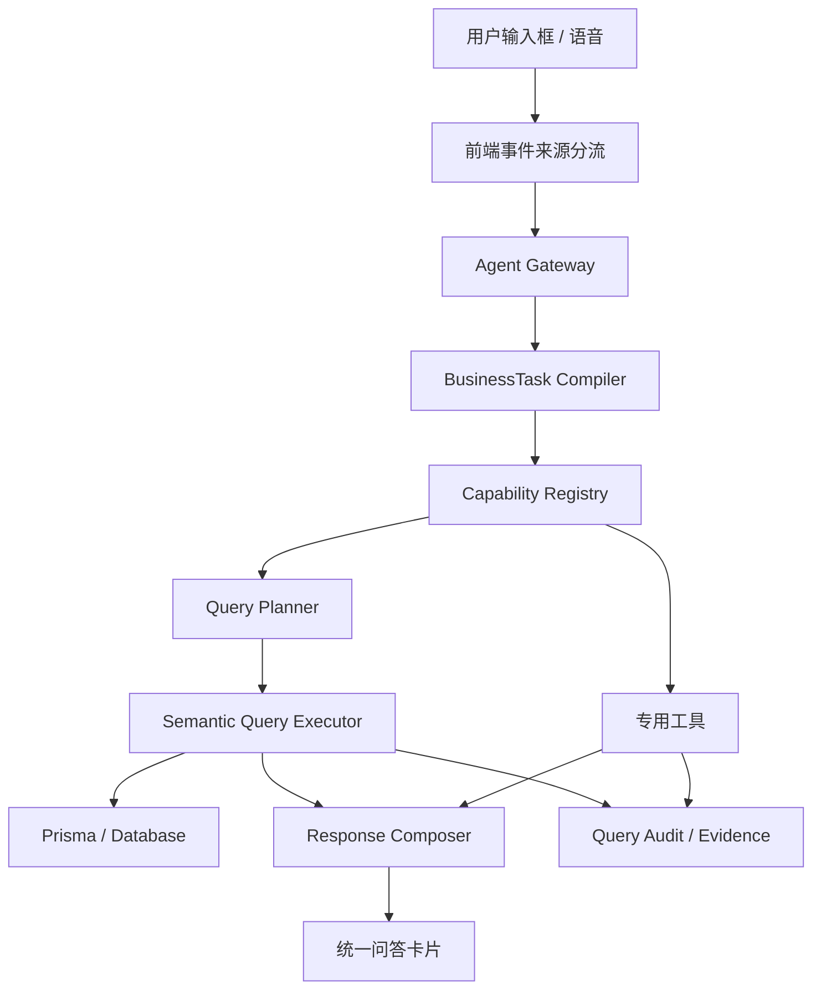

# Ami 智能问答查询中枢合并重构详细开发计划

更新时间：2026-06-18

## 1. 文档定位

本文档是独立开发计划，不基于 `Ami经营语义中枢详细开发计划.md` 增补，避免把历史阶段、已完成任务和本轮重构目标混在一起。

本计划只聚焦一件事：

```text
合并 BusinessQuery 与 Semantic SQL，形成统一的智能问答查询中枢。
```

目标是解决当前智能问答中“BusinessQuery 轻量问数”和“Semantic SQL 受控查询”职责重叠、能力重复、口径分散、维护成本高的问题。

## 2. 当前问题

### 2.1 现状结构

当前智能问答涉及三层能力：

```text
Agent 语义层
  - 识别用户经营意图
  - 规划工具调用
  - 执行专用工具

BusinessQuery
  - 自己识别领域
  - 自己识别能力
  - 自己解析时间
  - 自己查库
  - 自己生成卡片和 actions

Semantic SQL
  - 白名单指标查询
  - 受控只读聚合
  - 目前仍是 Beta 执行层
```

### 2.2 核心矛盾

`BusinessQuery` 与 `Semantic SQL` 都在做经营问数执行：

- 都需要识别指标。
- 都需要识别维度。
- 都需要解析时间范围。
- 都需要处理门店范围。
- 都需要查询数据库。
- 都需要返回 evidence。
- 都需要限制行数和权限。

如果继续分开维护，会导致：

1. 同一个问题在两套系统里命中不同能力。
2. 新增一个指标要在多个地方重复实现。
3. 问法稍有变化就需要补关键词。
4. BusinessQuery 的 `queryXXX` 方法越来越多，最终变成第二套报表系统。
5. Semantic SQL 无法成为真实主链路，只能长期停留在 Beta。
6. 卡片口径、证据、字段中文化很难统一。

### 2.3 典型问题

```text
最近七天收银趋势
```

这类问题本质是：

```text
指标：实收金额 / 收入
维度：日期
时间：最近 7 天
范围：当前门店
展示：趋势列表或折线图
```

它不应该靠 BusinessQuery 的关键词判断，也不应该单独写一个 `queryLast7DaysCashierTrend()`。正确方式是进入统一查询计划：

```text
BusinessTask -> Capability -> QueryPlan -> Semantic SQL Executor -> Response Composer
```

## 3. 重构目标

### 3.1 总目标

建立统一的智能问答查询中枢：

```text
用户自然语言
  -> Agent 语义识别
  -> Capability Registry
  -> Query Planner
  -> Semantic Query Executor
  -> Response Composer
```

### 3.2 具体目标

1. `BusinessQuery` 不再作为独立问数引擎。
2. `BusinessQuery` 能力迁移为 `Capability Registry` 中的查询能力模板。
3. `Semantic SQL` 升级为通用受控查询执行层。
4. 所有查询类能力统一走 `Query Planner`。
5. 所有指标统一进入 `Metric Registry`。
6. 所有维度统一进入 `Dimension Registry`。
7. 所有查询结果统一由 `Response Composer` 渲染。
8. 用户侧不展示内部字段、指标 key、数据表名、过滤条件、SQL 口径。
9. 审计侧保留完整 evidence、query plan、metric definition 和执行记录。
10. 不支持的问题明确澄清或拒答，不再瞎答。

## 4. 非目标

本轮不做以下事情：

1. 不开放任意 Text-to-SQL。
2. 不允许模型自由生成 SQL 并直接执行。
3. 不把写操作纳入 Semantic SQL。
4. 不自动发布活动、自动群发、自动扣款、自动核销。
5. 不把所有专用工具改成 SQL。
6. 不废弃 Agent Orchestrator。
7. 不废弃专用工具。
8. 不把内部 evidence 直接展示给美业用户。

## 5. 合并后目标架构



### 5.1 层级职责

| 层级 | 职责 | 说明 |
| --- | --- | --- |
| 前端事件来源分流 | 区分输入框、语音、快捷按钮、内部 action code | 不做业务语义识别 |
| Agent Gateway | 统一承接自然语言 | 创建 AgentRun，记录上下文 |
| BusinessTask Compiler | 把自然语言转成结构化经营任务 | 识别领域、任务类型、时间、数量、指标、维度 |
| Capability Registry | 查询能力目录 | 合并原 BusinessQuery capabilities |
| Query Planner | 生成可执行查询计划 | 指标、维度、过滤、排序、limit、展示模式 |
| Semantic Query Executor | 受控只读查询执行 | 白名单指标、维度、权限、行数限制 |
| 专用工具 | 处理复杂业务动作 | 草稿、审批、排班优化、跟进任务等 |
| Response Composer | 统一输出 | 概述、明细、下一步动作 |
| Audit / Evidence | 内部审计 | 不直接展示给用户 |

## 6. 保留、新增、优化清单

### 6.1 保留

| 模块 | 保留原因 |
| --- | --- |
| Agent Orchestrator | 已具备运行、步骤、工具、审批、审计能力，是经营 Agent 主骨架 |
| Agent Tool Registry | 专用工具适合处理草稿、审批、推荐、诊断等复杂业务动作 |
| DeviceAuthGuard / 角色权限 | 终端问答必须继承设备、门店、账号、角色权限 |
| AgentRun / AgentStep / AgentToolCall / AgentApproval | 需要保留全链路审计和问题追踪 |
| Semantic SQL Executor 的安全思路 | 白名单指标、维度限制、limit、auditId、fingerprint 是正确方向 |
| BusinessQuery 的能力目录数据 | 能力名称、角色、风险等级、卡片类型可迁移复用 |

### 6.2 新增

| 新增模块 | 作用 | 新增原因 |
| --- | --- | --- |
| Query Planner | 将 BusinessTask 转成 QueryPlan | Agent 不应直接拼查询，Executor 不应理解自然语言 |
| Metric Registry | 统一指标口径 | 解决收入、实收、收银、毛利等口径分散 |
| Dimension Registry | 统一维度定义 | 限制日期、商品、项目、员工、客户、门店等可用维度 |
| Query Template Registry | 定义查询模板 | 替代 BusinessQuery 中大量 `queryXXX` 方法 |
| Semantic Query Executor | 替代单一 Semantic SQL Beta | 支持更多白名单聚合查询 |
| Query Safety Guard | 查询安全校验 | 防止越权、慢查询、敏感字段泄露 |
| Response Composer | 统一用户侧表达 | 避免展示英文枚举、字段名、内部规则 |
| Query Audit Log | 查询审计 | 记录 query plan、指标、维度、耗时、样本量、拒绝原因 |
| Migration Adapter | 兼容旧 BusinessQuery API | 平滑迁移，不一次性打断前端 |

### 6.3 优化

| 优化项 | 优化前 | 优化后 | 原因 |
| --- | --- | --- | --- |
| BusinessQuery | 独立识别 + 独立查库 | 变成能力模板和兼容适配器 | 避免第二套问数引擎 |
| Semantic SQL | Beta 预览执行器 | 查询执行主层之一 | 承接通用聚合查询 |
| Capability | Agent 和 BusinessQuery 两套目录 | 统一能力目录 | 新增能力只维护一次 |
| 指标口径 | 散落在各个 service | Metric Registry 统一定义 | 防止同一指标不同算法 |
| 用户回复 | 多种卡片结构 | 概述、明细、下一步动作 | 提升美业用户可理解性 |
| evidence 展示 | 部分内部规则上屏 | 用户隐藏，审计可见 | 避免产品体验和安全问题 |
| 不支持处理 | 可能 fallback 到错误卡片 | 明确澄清/拒答/候选沉淀 | 防止答非所问 |

## 7. 目标数据结构

### 7.1 BusinessTask

```ts
type BusinessTask = {
  taskType: 'query' | 'ranking' | 'recommendation' | 'diagnosis' | 'forecast' | 'draft' | 'workflow' | 'clarify';
  domain: 'business' | 'customer' | 'product' | 'project' | 'reservation' | 'schedule' | 'order' | 'card' | 'memberCard' | 'inventory' | 'finance' | 'marketing' | 'promotion' | 'automation' | 'staff' | 'serviceQuality' | 'customerApp' | 'channel' | 'terminal' | 'store' | 'afterSales' | 'unknown';
  objective: string;
  metrics: string[];
  dimensions: string[];
  filters: Record<string, unknown>;
  timeRange?: BusinessTimeRange;
  sort?: Array<{ field: string; direction: 'asc' | 'desc' }>;
  limit?: number;
  outputMode: 'summary' | 'ranked_list' | 'table' | 'card' | 'chart' | 'draft' | 'workflow';
  riskLevel: 'low' | 'medium' | 'high';
  requiresApproval: boolean;
  missingSlots: string[];
  confidence: number;
};
```

### 7.2 QueryPlan

```ts
type QueryPlan = {
  queryId: string;
  capabilityId: string;
  taskId: string;
  storeScope: {
    storeIds: number[];
    scopeType: 'current_store' | 'authorized_stores';
  };
  metrics: Array<{
    key: string;
    aggregation: 'sum' | 'count' | 'avg' | 'max' | 'min' | 'ratio' | 'score';
  }>;
  dimensions: string[];
  filters: Record<string, unknown>;
  timeRange: BusinessTimeRange;
  orderBy: Array<{ key: string; direction: 'asc' | 'desc' }>;
  limit: number;
  outputShape: 'summary' | 'list' | 'table' | 'trend' | 'comparison';
  riskLevel: 'low' | 'medium' | 'high';
};
```

### 7.3 Metric Definition

```ts
type MetricDefinition = {
  key: string;
  label: string;
  description: string;
  domain: string;
  valueType: 'money' | 'count' | 'percent' | 'score' | 'duration';
  defaultAggregation: 'sum' | 'count' | 'avg' | 'ratio' | 'score';
  supportedDimensions: string[];
  requiredTables: string[];
  requiredPermissions: string[];
  allowedRoles: Array<'manager' | 'reception' | 'beautician'>;
  sensitiveLevel: 'public' | 'internal' | 'sensitive';
  userVisibleDefinition: string;
  auditDefinition: string;
};
```

### 7.4 QueryResult

```ts
type QueryResult = {
  status: 'success' | 'no_data' | 'unsupported' | 'rejected' | 'failed';
  queryId: string;
  title: string;
  summary: string;
  rows: Array<Record<string, unknown>>;
  kpis?: Array<{ label: string; value: string; hint?: string }>;
  actions: Array<{ label: string; action: string; riskLevel: 'low' | 'medium' | 'high' }>;
  userEvidence?: {
    dateRange?: string;
    dataSummary?: string;
  };
  auditEvidence: {
    source: string[];
    metricDefinition: string;
    filters: string[];
    sampleSize?: number;
    limitations?: string[];
    sqlFingerprint?: string;
    auditId?: string;
  };
};
```

## 8. 查询能力迁移清单

### 8.1 第一批必须迁移

这些能力是当前用户高频反馈，必须优先迁移。

| 能力 | 当前来源 | 目标执行层 | 示例问题 |
| --- | --- | --- | --- |
| 收入/收银趋势 | BusinessQuery / Agent tool | Semantic Query Executor | 最近七天收银趋势、今天收银多少 |
| 商品销量排行 | BusinessQuery / Agent tool | Semantic Query Executor | 最近销量好的商品有哪些 |
| 商品销量增长 | BusinessQuery / Semantic SQL | Semantic Query Executor | 近期销量增长最快的商品 |
| 库存风险排行 | BusinessQuery / Agent tool | Semantic Query Executor | 哪些商品库存不足 |
| 客户优先跟进 | Agent tool | 专用工具 | 今天最值得跟进的10个客户 |
| 员工表现排行 | Agent tool / BusinessQuery | Semantic Query Executor + 专用补充 | 近期表现较好的员工 |
| 预约排班诊断 | BusinessQuery / Agent tool | 专用工具 + Semantic Query Executor | 明天哪些时段忙 |
| 项目经营排行 | BusinessQuery / Agent tool | Semantic Query Executor | 最近做得好的项目 |
| 卡项核销分析 | BusinessQuery | Semantic Query Executor | 最近卡项核销情况 |
| 会员余额分析 | BusinessQuery / Semantic SQL | Semantic Query Executor | 会员卡余额排行 |

### 8.2 第二批迁移

| 能力 | 目标执行层 | 示例问题 |
| --- | --- | --- |
| 财务毛利诊断 | 专用工具 + Semantic Query Executor | 本月毛利怎么样 |
| 营销转化分析 | Semantic Query Executor | 最近活动转化怎么样 |
| 自动化执行复盘 | Semantic Query Executor | 自动化触达效果怎么样 |
| 供应链采购建议 | 专用工具 | 哪些商品该补货 |
| 退款售后诊断 | Semantic Query Executor | 最近退款多不多 |
| 服务质量诊断 | 专用工具 + Semantic Query Executor | 哪些服务记录不完整 |
| 门店对比 | Semantic Query Executor | 哪个门店表现最好 |
| 终端健康诊断 | 专用工具 | 哪些终端经常失败 |

## 9. 阶段计划

## 阶段 0：基线审计与冻结

周期：0.5 天

目标：

- 明确当前 `BusinessQuery`、`Semantic SQL`、`Agent Tool` 的边界。
- 冻结高频问题样例，作为重构回归基线。

任务：

1. 导出当前 BusinessQuery 能力目录。
2. 导出当前 Semantic SQL 支持指标。
3. 导出当前 Agent Capability Registry。
4. 汇总 30 条高频真实问法。
5. 标记每条问法当前命中路径和期望路径。

输出：

- `docs/03-开发计划/Ami智能问答查询中枢合并基线清单.md`
- 基线测试 fixture。

验收：

- 每条高频问法都有期望 capability。
- 每条高频问法都有期望指标、维度、时间、limit。

## 阶段 1：Metric Registry 与 Dimension Registry

周期：2-3 天

目标：

- 建立统一指标和维度口径。
- 为 Query Planner 和 Semantic Query Executor 提供确定性配置。

新增文件：

```text
packages/server-v2/src/semantic-data/
  metric-registry.service.ts
  dimension-registry.service.ts
  metric-definition.types.ts
  metric-registry.service.spec.ts
  dimension-registry.service.spec.ts
```

第一批指标：

| 指标 key | 中文名称 | 类型 | 说明 |
| --- | --- | --- | --- |
| `revenue` | 收入 | money | 有效订单金额 |
| `paid_amount` | 实收金额 | money | 支付成功金额，扣除退款视口径而定 |
| `order_count` | 订单数 | count | 有效订单数量 |
| `average_order_value` | 客单价 | money | 收入 / 订单数 |
| `product_sales_quantity` | 商品销量 | count | 商品订单明细数量 |
| `product_sales_amount` | 商品销售额 | money | 商品订单明细金额 |
| `product_sales_growth` | 商品销量增长 | percent/count | 当前周期对比上一周期 |
| `stock_risk_score` | 库存风险分 | score | 安全库存缺口、销量、临期综合 |
| `reservation_count` | 预约数 | count | 指定周期预约数量 |
| `arrival_rate` | 到店率 | percent | 到店预约 / 总预约 |
| `staff_performance_score` | 员工表现分 | score | 服务、销售、提成、完成率综合 |
| `card_usage_times` | 卡项核销次数 | count | 次卡核销次数 |
| `member_balance` | 会员余额 | money | 储值现金余额 + 赠送余额 |
| `campaign_conversion_rate` | 活动转化率 | percent | 转化数 / 触达或线索数 |
| `refund_amount` | 退款金额 | money | 退款记录金额 |
| `gross_margin` | 毛利 | money | 收入 - 成本 |

第一批维度：

```text
date
productId
productName
projectId
projectName
customerId
customerName
beauticianId
beauticianName
storeId
storeName
cardId
cardName
campaignId
campaignName
payMethod
channel
```

验收：

- 每个指标有中文名称、用户解释、审计解释。
- 每个指标声明支持维度。
- 不支持维度时明确拒绝。
- 单测覆盖指标存在性、角色权限、维度限制。

## 阶段 2：Query Planner

周期：3-4 天

目标：

- 新增统一查询计划层，替代 BusinessQuery 内部 `detectCapability + queryXXX` 的直接链路。

新增文件：

```text
packages/server-v2/src/semantic-query/
  query-plan.types.ts
  query-planner.service.ts
  query-planner.service.spec.ts
  query-safety-guard.service.ts
  query-safety-guard.service.spec.ts
```

Planner 输入：

```text
BusinessTask
CapabilityDefinition
ActorContext
```

Planner 输出：

```text
QueryPlan
```

Planner 规则：

1. 数量以用户输入为准。
2. 时间以用户输入为准。
3. 指标必须来自 Metric Registry。
4. 维度必须被指标支持。
5. 默认 limit 不超过 10，用户指定最大不超过 100。
6. 美容师角色默认只能看本人相关数据。
7. 前台不能看财务毛利、跨店对比等敏感能力。
8. 趋势类问题默认维度包含 `date`。
9. 排行类问题必须有排序字段。
10. 缺少必要槽位时返回 clarify。

验收样例：

```text
最近七天收银趋势
-> metrics: paid_amount/order_count
-> dimensions: date
-> timeRange: last_7_days
-> outputShape: trend

最近销量好的商品有哪些
-> metrics: product_sales_quantity/product_sales_amount
-> dimensions: productId/productName
-> timeRange: last_30_days
-> orderBy: product_sales_quantity desc

近期表现较好的员工
-> metrics: staff_performance_score
-> dimensions: beauticianId/beauticianName
-> timeRange: last_30_days
-> role scope applied
```

## 阶段 3：Semantic Query Executor

周期：5-7 天

目标：

- 将当前 `SemanticSqlExecutorService` 升级为更通用的 `SemanticQueryExecutorService`。
- 以白名单查询模板执行，不开放自由 SQL。

新增/调整文件：

```text
packages/server-v2/src/semantic-query/
  semantic-query-executor.service.ts
  semantic-query-executor.service.spec.ts
  query-template-registry.service.ts
  query-template-registry.service.spec.ts
```

保留：

```text
packages/server-v2/src/semantic-sql/
```

但用途调整为底层兼容模块，逐步迁移到 `semantic-query`。

第一批查询模板：

| 模板 | 支持指标 | 支持维度 |
| --- | --- | --- |
| `order_revenue_trend` | revenue, paid_amount, order_count, average_order_value | date, payMethod |
| `product_sales_rank` | product_sales_quantity, product_sales_amount, product_sales_growth | productId, productName, date |
| `inventory_risk_rank` | stock_risk_score | productId, productName |
| `staff_performance_rank` | staff_performance_score | beauticianId, beauticianName, date |
| `reservation_schedule_summary` | reservation_count, arrival_rate | date, beauticianId |
| `card_usage_summary` | card_usage_times | cardId, cardName, projectId |
| `member_balance_rank` | member_balance | customerId, customerName |
| `marketing_conversion_summary` | campaign_conversion_rate | campaignId, campaignName, channel |

执行保护：

1. 只读。
2. 禁止原始 SQL 输入。
3. 禁止非白名单表。
4. 禁止非白名单字段。
5. 禁止返回未脱敏手机号。
6. 禁止跨未授权门店。
7. 默认最大扫描 5000 行。
8. 默认最大返回 100 行。
9. 查询耗时超过阈值返回降级提示。
10. 所有执行写入 audit。

验收：

- `最近七天收银趋势` 返回按日期聚合列表。
- `最近销量好的商品有哪些` 返回商品排行。
- `哪些商品库存不足` 返回库存风险排行。
- `会员余额最高的客户` 不返回完整手机号。
- 前台问财务毛利返回权限不足。

## 阶段 4：BusinessQuery 迁移与兼容

周期：3-5 天

目标：

- BusinessQuery 不再独立查库。
- BusinessQuery API 保持兼容，但内部转发到新链路。

改造文件：

```text
packages/server-v2/src/business-query/business-query.service.ts
packages/server-v2/src/business-query/business-query.capabilities.ts
packages/server-v2/src/business-query/business-query.service.spec.ts
```

改造策略：

```text
BusinessQueryService.ask()
  -> BusinessTaskCompiler
  -> CapabilityRegistry
  -> QueryPlanner
  -> SemanticQueryExecutor / AgentTool
  -> BusinessQueryResponse Adapter
```

保留内容：

- `GET /api/business-query/capabilities`
- `POST /api/business-query/ask`
- `BusinessQueryResponse` 基本结构。

废弃内容：

- `detectDomain`
- `detectCapability`
- `detectContextualCapability`
- 大量直接查库的 `queryXXX` 方法。

迁移方式：

1. 第一阶段保留旧方法作为 fallback。
2. 新链路命中时走新链路。
3. 每迁移一个能力，就删除对应 fallback 分支。
4. 全部核心能力迁移后，BusinessQueryService 只保留 adapter。

验收：

- 旧前端调用不报错。
- 新链路结果与旧接口格式兼容。
- 不再出现两套能力命中不一致。
- 单测覆盖旧 API 兼容。

## 阶段 5：Capability Registry 合并

周期：2-3 天

目标：

- 把 BusinessQuery capabilities 迁移到 Agent Capability Registry。
- 建立统一能力定义。

统一 Capability 字段：

```ts
type CapabilityDefinition = {
  id: string;
  name: string;
  domain: BusinessTask['domain'];
  supportedTaskTypes: BusinessTask['taskType'][];
  description: string;
  examples: string[];
  negativeExamples: string[];
  allowedRoles: AgentRole[];
  requiredPermissions: string[];
  riskLevel: 'low' | 'medium' | 'high';
  executionMode: 'semantic_query' | 'agent_tool' | 'hybrid';
  metrics: string[];
  dimensions: string[];
  defaultTimeRange?: string;
  defaultLimit: number;
  outputShape: 'summary' | 'list' | 'table' | 'trend' | 'comparison' | 'draft';
  toolPlanFactory?: (task: BusinessTask) => AgentToolPlanItem[];
};
```

验收：

- 一个能力只有一个定义源。
- 查询类 capability 可生成 QueryPlan。
- 动作类 capability 可生成 ToolPlan。
- `business_query` 只作为低置信度兼容兜底，不再作为长期能力池。

## 阶段 6：Response Composer 统一

周期：3-4 天

目标：

- 统一所有问答结果展示结构。
- 避免内部字段、英文枚举、工程 key 上屏。

新增文件：

```text
packages/server-v2/src/agent/response/
  response-composer.service.ts
  response-composer.service.spec.ts
  response-localizer.service.ts
  response-localizer.service.spec.ts
```

用户侧统一结构：

```text
标题
副标题

概述
- 结论
- 原因
- 建议

明细
- 列表 / 表格 / 趋势

下一步动作
- 查看详情
- 生成草稿
- 创建跟进
- 查看管理端
```

必须隐藏：

```text
recommended
opportunity
agent:tool:*
business-query:*
marketing:activity:*
timeRange=
storeId=
limit=
role=
operatorId=
CustomerPredictionSnapshot
ProductOrder
OrderItem
SQL
Prisma
```

验收：

- 所有用户卡片无英文枚举。
- 所有用户卡片无内部 action code。
- 所有用户卡片无数据表名。
- evidence 只在审计详情可见。

## 阶段 7：前端接入调整

周期：2-3 天

目标：

- 前端继续保持事件来源分流。
- 问答卡片适配统一返回结构。

改造文件：

```text
packages/Ami-Aura-Lite-Kiosk/src/app/services/auraCoreService.ts
packages/Ami-Aura-Lite-Kiosk/src/app/components/RoleDashboards.tsx
packages/Ami-Aura-Lite-Kiosk/src/app/AppContent.tsx
packages/Ami-Aura-Lite-Kiosk/src/app/intent/intentRouter.ts
```

前端规则：

```text
输入框文本 -> Agent
语音文本 -> Agent
快捷按钮 -> quick_action 固定功能
内部 action code -> internal action handler
```

前端不做：

- 不识别“收银多少”应走哪个能力。
- 不识别“销量好”应走商品排行。
- 不把输入文本转成快捷按钮。
- 不展示内部 evidence。

验收：

- 输入“今天收银多少”不触发收银快捷功能。
- 输入“最近七天收银趋势”进入智能问答。
- 点击“收银”快捷按钮进入收银功能。
- 内部 `marketing:activity:<id>` 不作为用户消息展示。

## 阶段 8：评测与发布门禁

周期：3-5 天

目标：

- 用真实问法评测替代人工主观判断。
- 每次改动防止回归。

新增/扩展：

```text
packages/server-v2/src/agent/agent-eval.cases.ts
packages/server-v2/src/agent/agent-eval.service.spec.ts
packages/server-v2/src/semantic-query/semantic-query-executor.service.spec.ts
packages/Ami-Aura-Lite-Kiosk/e2e/business-agent.spec.ts
scripts/check-ami-query-hub.mjs
```

第一批评测问题：

```text
今天收银多少
最近七天收银趋势
本月收入怎么样
最近销量好的商品有哪些
近期销量增长最快的商品
哪些商品库存不足
今天最值得跟进的10个客户
下周重点关注哪些客户
近期表现较好的员工
最近做得好的项目
哪些次卡快到期了
会员余额最高的客户
最近活动转化怎么样
自动化执行效果怎么样
最近退款多不多
```

每条评测断言：

1. 命中正确 domain。
2. 命中正确 capability。
3. 解析正确 timeRange。
4. 解析正确 limit。
5. 生成正确 QueryPlan 或 ToolPlan。
6. 没有误触快捷按钮。
7. 没有内部字段上屏。
8. 不支持时明确说明原因。

验收：

- 后端核心测试通过。
- Kiosk 组件测试通过。
- Kiosk Browser Eval 通过。
- 一键门禁通过。

## 10. API 设计

### 10.1 编译经营任务

```http
POST /api/agent/business-task/compile
```

用途：

- 调试自然语言解析结果。
- 管理端 Agent Studio 使用。

### 10.2 预览查询计划

```http
POST /api/agent/query-plan/preview
```

用途：

- 输入 BusinessTask，返回 QueryPlan。
- 不执行查库。

### 10.3 执行语义查询

```http
POST /api/agent/semantic-query/execute
```

用途：

- 执行受控只读查询。
- 仅内部 Agent 调用，终端不直接调用。

### 10.4 旧 BusinessQuery 兼容

```http
POST /api/business-query/ask
```

用途：

- 保持旧调用不报错。
- 内部转发到新查询中枢。

## 11. 权限与安全

### 11.1 角色边界

| 角色 | 可查询范围 |
| --- | --- |
| 店长 | 当前门店经营数据，授权多门店时可看多门店 |
| 前台 | 预约、收银、客户基础、卡项、库存基础，不看毛利和敏感财务 |
| 美容师 | 本人预约、本人服务、本人提成、本人客户范围 |

### 11.2 查询安全规则

1. 所有查询必须带 `storeId`。
2. 所有查询必须带 actor role。
3. 所有查询必须经过 Metric Registry。
4. 所有查询必须经过 Dimension Registry。
5. 所有查询必须经过 Query Safety Guard。
6. 默认不返回完整手机号。
7. 默认不返回身份证、地址等敏感字段。
8. 不允许跨未授权门店。
9. 不允许写操作。
10. 不允许自由 SQL。

## 12. 兼容与迁移策略

### 12.1 不一次性删除 BusinessQuery

原因：

- 前端已有调用。
- 测试已有依赖。
- 风险较高。

策略：

```text
第 1 步：BusinessQueryService 内部调用新链路。
第 2 步：已迁移能力走新链路。
第 3 步：未迁移能力暂时走旧 fallback。
第 4 步：每迁移一个能力删除一个旧 queryXXX。
第 5 步：BusinessQuery 最终只保留兼容 API 和 response adapter。
```

### 12.2 Semantic SQL 不直接暴露给用户

原因：

- 用户输入随机。
- SQL 风险高。
- 容易越权或慢查询。

策略：

```text
用户自然语言 -> Agent -> Query Planner -> Semantic Query Executor
```

## 13. 里程碑

| 里程碑 | 周期 | 交付物 |
| --- | --- | --- |
| M0 基线清单 | 0.5 天 | 高频问法、当前路径、目标路径 |
| M1 指标与维度注册表 | 2-3 天 | Metric Registry、Dimension Registry |
| M2 Query Planner | 3-4 天 | QueryPlan 生成和安全校验 |
| M3 Semantic Query Executor | 5-7 天 | 第一批白名单查询模板 |
| M4 BusinessQuery 兼容迁移 | 3-5 天 | 旧 API 转新链路 |
| M5 Capability 合并 | 2-3 天 | 单一能力目录 |
| M6 Response Composer | 3-4 天 | 统一卡片结构 |
| M7 前端适配 | 2-3 天 | Kiosk 统一渲染 |
| M8 评测门禁 | 3-5 天 | 一键检查和 Browser Eval |

预计总周期：3-5 周。

## 14. 验收标准

### 14.1 功能验收

必须通过以下问题：

```text
今天收银多少
最近七天收银趋势
最近销量好的商品有哪些
哪些商品库存不足
今天最值得跟进的10个客户
近期表现较好的员工
哪些次卡快到期了
会员余额最高的客户
最近活动转化怎么样
```

每个问题必须：

1. 返回正确领域。
2. 返回正确能力。
3. 返回真实数据或明确无数据。
4. 尊重用户指定时间。
5. 尊重用户指定数量。
6. 给出概述、明细、下一步动作。
7. 不展示内部字段。
8. 不触发快捷按钮。

### 14.2 技术验收

必须满足：

1. BusinessQuery 核心能力迁移到统一 Capability。
2. BusinessQuery 不再维护重复的领域识别。
3. Semantic Query Executor 支持第一批核心指标。
4. Query Planner 有单测。
5. Query Safety Guard 有单测。
6. Response Composer 有中文化测试。
7. Kiosk Browser Eval 覆盖高频问法。
8. 一键门禁通过。

### 14.3 产品验收

用户侧体验必须满足：

1. 术语美业用户可理解。
2. 不出现英文枚举。
3. 不出现代码字段。
4. 不出现数据表名。
5. 不出现内部统计规则大段说明。
6. 不支持时说清楚缺什么条件。
7. 可操作建议明确。

## 15. 风险与应对

| 风险 | 影响 | 应对 |
| --- | --- | --- |
| 重构范围大 | 可能影响现有问答 | 采用 adapter 兼容和逐能力迁移 |
| 指标口径争议 | 影响结果可信度 | Metric Registry 明确用户口径和审计口径 |
| 查询性能风险 | 慢查询影响体验 | 白名单模板、limit、索引、超时保护 |
| 权限风险 | 敏感数据泄露 | Query Safety Guard + 字段脱敏 + Browser Eval |
| 前端展示回归 | 内部字段上屏 | Response Composer + 中文化黑名单 |
| 长尾问法无法覆盖 | 用户仍可能问不到 | 候选池沉淀，先澄清后转正式能力 |

## 16. 推荐开发顺序

建议按以下顺序推进：

1. 先做基线清单和评测 fixture。
2. 再做 Metric Registry 和 Dimension Registry。
3. 再做 Query Planner。
4. 再做 Semantic Query Executor 第一批模板。
5. 再把 BusinessQuery 的收入、商品、库存、会员余额迁过去。
6. 再做 Response Composer 统一。
7. 最后做前端卡片适配和一键门禁。

不要先大规模删除 BusinessQuery。正确做法是逐步迁移，迁移一个能力，验证一个能力，再删除对应旧分支。

## 17. 完成判断

本计划完成的判断标准不是“代码能跑”，而是：

```text
核心经营问数问题进入同一条链路；
BusinessQuery 不再作为第二套问数引擎；
Semantic Query Executor 成为受控查询执行层；
能力、指标、维度、权限、展示、审计全部统一；
高频真实问法通过自动化门禁。
```

达到以上条件，才算 BusinessQuery 与 Semantic SQL 合并重构完成。
