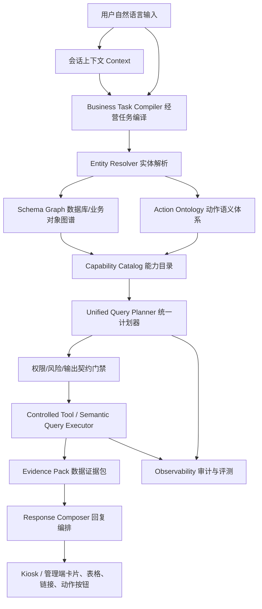

# Ami 经营知识图谱与 Agent 语义底座详细开发计划

版本：v1.0
日期：2026-06-30
适用范围：Ami_Core 管理端 `/ami-agent`、Ami Aura Lite 智能终端、`server-v2` Agent Runtime、经营语义查询链路

## 1. 背景与目标

当前 Agent 已经具备 Agent Runtime、Persona Router、BusinessTask、Semantic Metric、Query Template、Answer Contract 等基础能力，但实际问答仍出现以下问题：

- 问法稍微变化就答非所问，例如“老朋友回店护理礼活动链接发我”被误判为项目服务趋势。
- 多处链路重复判断意图，`BusinessTaskPreParser`、`AgentPlanner`、`BusinessQueryService.legacyResolve()`、`SemanticQuery` 各自做路由。
- Agent 对数据库结构和业务对象关系没有统一索引地图，容易猜错表、猜错字段或走错工具。
- 当前能力目录偏“领域级”，缺少“业务对象 + 用户动作”的细粒度能力定义。
- 失败后只能继续补关键词，无法稳定覆盖随机自然语言。

本计划目标是建设 **Ami 经营知识图谱与 Agent 语义底座**，让 Agent 先识别“业务对象、实体、动作、可用能力、数据路径”，再执行受控查询或工具调用。

最终目标：

- 用户自然语言不再直接靠关键词分流。
- Agent 先识别实体，例如客户、营销活动、卡项、订单、库存商品、项目、美容师。
- Agent 再识别动作，例如查询、列表、获取链接、诊断、推荐、生成草稿、确认执行。
- 系统根据业务图谱选择能力和数据路径，不让模型猜表、猜字段。
- Kiosk 与管理端共用同一套语义底座，回复稳定、可审计、可回归。

## 2. 总体架构



核心链路：

```text
用户问题
-> 经营任务编译
-> 实体解析
-> Schema Graph 定位对象和关系
-> Action Ontology 判断用户要做什么
-> Capability Catalog 找到可执行能力
-> Query Template / Tool Contract 生成执行计划
-> 权限、风险、输出契约校验
-> 执行真实数据查询
-> 基于 Evidence 输出答案
```

示例：

```text
老朋友回店护理礼活动链接发我
```

目标解析：

```json
{
  "entity": {
    "type": "MarketingActivity",
    "name": "老朋友回店护理礼"
  },
  "action": "get_link",
  "capabilityId": "marketing.activity.link.lookup",
  "schemaPath": ["MarketingActivity", "MarketingPage"],
  "outputKinds": ["link_card", "evidence_panel"]
}
```

## 3. 范围边界

### 3.1 本轮必须做

- 建立数据库 Schema Graph 和业务对象字典。
- 建立实体解析服务，优先覆盖当前高频对象。
- 建立动作语义体系，区分查询、列表、链接、诊断、推荐、草稿和执行。
- 建立细粒度 Capability Catalog，按“对象 + 动作”选择能力。
- 改造 Kiosk 和管理端 Agent 问答优先走统一计划器。
- 将旧 `BusinessQueryService.legacyResolve()` 降级为最后兜底，不再作为主路径。
- 增加可持续评测集，按对象、动作、能力统计通过率。

### 3.2 本轮不做

- 不开放模型自由 Text-to-SQL。
- 不让 LLM 直接访问数据库。
- 不做真实群发、扣款、退款等不可逆自动执行。
- 不一次性重写所有历史业务页面。
- 不删除 FlowCard，收银、核销、预约、办卡、充值、退款、打印仍保留强流程入口。

## 4. 关键设计决策

### 4.1 Router 之后还需要语义底座

Agent Router 解决“哪个 Agent 回答”的问题，但不能解决“这个问题到底查哪个对象、走哪个表、做哪个动作”的问题。

例如：

```text
老朋友回店护理礼活动链接发我
```

Router 可以识别为营销增长 Agent，但如果后续仍靠关键词，仍可能因为“护理”误走项目服务趋势。因此必须增加实体解析和业务图谱。

### 4.2 不再以 domain 作为最终能力选择

旧方式：

```text
marketing -> marketing_conversion_diagnosis
project -> project_service_trend
inventory -> inventory_risk_rank
```

新方式：

```text
MarketingActivity + get_link -> marketing.activity.link.lookup
MarketingActivity + list -> marketing.activity.list
MarketingActivity + analyze_effect -> marketing.effect.diagnose
Customer + card_benefit -> reception.customer.card_benefit.summary
InventoryProduct + expiring_list -> inventory.expiring.list
Order + revenue_summary -> finance.revenue.summary
```

### 4.3 Schema Graph 是确定性地图，不是模型记忆

Schema Graph 由 Prisma schema、手工业务别名和真实业务对象共同生成。它告诉 Agent：

- 哪些模型存在。
- 哪些字段可查询。
- 哪些字段是敏感字段。
- 哪些模型有关系。
- 哪些模型受门店隔离。
- 哪些字段可用于实体匹配。
- 哪些字段适合输出给用户。

LLM 只能基于图谱选择能力，不能自己猜字段。

## 5. 任务状态说明

- `[ ]` 未开始
- `[~]` 开发中
- `[x]` 已完成
- `[!]` 阻塞或需决策

## 5.1 当前开发进度记录

更新时间：2026-06-30

本轮已完成第一条“业务数据驱动实体解析”垂直切片：

- [x] 新增 Agent Knowledge 基础类型：业务对象、动作意图、实体解析结果、能力定义。
- [x] 新增业务对象字典第一版，覆盖营销活动、推广页、客户、库存商品、护理项目、美容师。
- [x] 新增 Schema Graph 第一版，覆盖核心业务对象节点、字段中文名和 `MarketingActivity -> MarketingPage` 等关键关系。
- [x] Schema Graph 补充高频对象关系：
  - `Customer -> Reservation`
  - `Customer -> CustomerCard`
  - `Product -> StockBatch`
  - `Product -> StockMovement`
  - `Project -> ServiceTask`
  - `Project -> Reservation`
  - `Beautician -> Schedule`
  - `Beautician -> ServiceTask`
  - `ProductOrder -> OrderItem`
  - `ProductOrder -> PaymentRecord`
  - `ProductOrder -> RefundRecord`
  - `CustomerCard -> CardUsageRecord`
  - `ProductOrder -> CustomerCard`
- [x] 新增业务语义词典第一版，集中维护常见填充词、时间词、动作词、对象提示词和营销名称修饰词，实体解析不再只靠各能力各自写关键词补丁。
- [x] 新增动作语义服务第一版，可识别 `get_link/list/summary/recommend/diagnose/print` 等动作。
- [x] 新增能力目录第一版，覆盖：
  - `marketing.activity.link.lookup`
  - `marketing.activity.list`
  - `project.service.trend`
  - `customer.profile.lookup`
  - `reception.customer.card_benefit.summary`
  - `inventory.product.stock.lookup`
  - `manager.staff.performance.rank`
  - `finance.order.lookup`
  - `reception.member_card.lookup`
- [x] 新增 `EntityResolverService` 第一版，以真实 `MarketingActivity` / `MarketingPage` 数据解析营销活动实体。
- [x] `EntityResolverService` 扩展覆盖客户、库存商品、护理项目、美容师四类高频实体，按当前门店过滤并对手机号做脱敏元数据处理。
- [x] `EntityResolverService` 扩展覆盖订单、客户卡项实体：
  - 订单按 `ProductOrder.orderNo / checkoutGroupNo / customerName` 解析。
  - 卡项按 `CustomerCard.cardName` 和关联 `Customer.name` 解析。
- [x] `EntityResolverService` 已接入候选词变体生成和最佳匹配评分：
  - 例如“老朋友回店护理礼活动链接发我”可命中真实活动“老朋友回店礼”。
  - 客户、库存商品、项目、美容师、订单、卡项统一走候选词数组检索，避免整句清洗串过窄导致漏召回。
- [x] `BusinessQueryService.ask()` 已增加 knowledge-first 前置链路；命中实体驱动能力时优先执行，不命中继续走现有 SemanticQuery / legacy。
- [x] 完成 `marketing_activity_link_lookup` 真实数据查询，返回活动链接、小程序路径、二维码和证据来源。
- [x] 完成 `marketing_activity_list` knowledge-first 直连执行器，`推荐近期营销活动 / 查询近期营销活动` 不再依赖旧 SemanticQuery 链路兜底。
- [x] knowledge-first 命中的现有能力已接回 BusinessQuery 执行器，当前覆盖：
  - `customer_growth_opportunity`
  - `card_usage_analysis`
  - `inventory_alert`
  - `project_service_trend`
  - `staff_performance`
  - `order_revenue_analysis`
- [x] 库存商品实体命中后会注入 `contextProductIds`，避免“查某个商品库存”退化为全店库存排行。
- [x] 新增 knowledge-first 专用执行器：
  - `customer_profile_lookup`：客户档案摘要。
  - `customer_reservation_today`：客户今日预约。
  - `customer_card_benefit_summary`：客户卡项权益摘要。
  - `finance_order_lookup`：订单流水详情，含明细、支付和退款记录。
  - `member_card_lookup`：客户卡项详情，含剩余次数、到期和最近核销。
- [x] legacy 营销活动兜底从默认转化分析调整为活动清单，降低“推荐近期营销活动”误落转化分析的概率。
- [x] 新增“业务修饰词变体”回归用例，覆盖活动名称有少量自然语言扩写时的实体命中。
- [x] 阶段 7 第一批输出契约落地：
  - `packages/agent-core` 增加 `link_card` 与 `entity_resolution_badge` Block 类型。
  - `AgentOrchestratorService` 可从 `marketingActivityLink` BusinessQuery 结果自动生成实体识别徽标和链接卡。
  - Kiosk `BlockRenderer` 与管理端 `AgentBlockRenderer` 均已支持链接卡、复制动作和实体识别徽标。
  - 营销活动列表字段补充中文表头映射，降低 `activityId / publishStatus` 等英文表头泄露。
- [x] 新增并通过定向测试：
  - `entity-resolver.service.spec.ts`
  - `schema-graph.service.spec.ts`
  - `capability-catalog.service.spec.ts`
  - `business-query.service.spec.ts`
  - `query-planner.service.spec.ts`
  - `semantic-query-executor.service.spec.ts`
- [x] `packages/server-v2` 构建通过。

当前仍未完成：

- [x] Schema Graph 已从静态第一版升级为 Prisma schema 自动生成基础图谱，并保留人工业务关系增强。
- [x] 客户、库存商品、项目、美容师实体解析第一版已补齐。
- [x] 订单、卡项实体解析第一版已补齐。
- [x] 客户、库存商品、项目、美容师已完成识别和能力目录匹配，并接入现有 BusinessQuery 执行器。
- [x] 订单、卡项已完成实体识别、能力目录匹配和专用输出第一版。
- [x] 专用输出第一批已完成前后端承接：`link_card`、`entity_resolution_badge`、`evidence_panel`。
- [x] Unified Query Planner 已覆盖当前所有 implemented BusinessQuery 能力目录，普通自然语言命中已实现能力时优先走知识图谱链路；legacy 保留为低置信度、缺实体、未授权和未收敛问法的受控 fallback。
  - [x] Capability Catalog 已补齐 `product_sales_trend`、`product_customer_distribution`、`project_material_margin`、`member_balance_analysis`、`automation_execution_summary`、`business_anomaly_alert`、`multi_store_comparison`。
  - [x] BusinessQuery 知识链路执行 switch 已补齐所有 implemented capability，并新增静态门禁防止新增能力只进目录不进执行映射。
- [x] 前端 `link_card` 专用渲染已接入 Kiosk 和管理端 `/ami-agent`。
- [x] Agent Eval 的 knowledge-map 专项命令已新增，可按全量、Persona、Capability 定向回归。

## 6. 阶段 0：链路审计与主路径冻结

目标：先把当前所有自然语言问答入口摸清楚，避免继续在多条链路上分别补丁。

### T0.1 工作区和风险预检

- [x] 执行 `git status --short --branch`，记录当前分支和未提交改动。
- [x] 标记高风险共享链路：
  - `packages/server-v2/src/agent/*`
  - `packages/server-v2/src/semantic-query/*`
  - `packages/server-v2/src/semantic-data/*`
  - `packages/server-v2/src/business-query/*`
  - `packages/Ami-Aura-Lite-Kiosk/src/app/services/auraCoreService.ts`
  - `packages/Ami-Aura-Lite-Kiosk/src/app/microApps/runMicroApp.ts`
  - `src/app/pages/ami-agent/*`
- [x] 明确本轮不回滚用户未提交改动。

验收：

- [x] 输出本轮改造影响范围。
- [x] 明确哪些旧链路会被降级，哪些入口保持不变。

### T0.2 梳理自然语言入口

- [x] 梳理 Kiosk 输入框提交链路。
- [x] 梳理 Kiosk FlowCard 快捷按钮链路。
- [x] 梳理管理端 `/ami-agent` 发送消息链路。
- [x] 梳理 `/agent/runs` 与 `/agent/runs/:id/messages` 后端链路。
- [x] 梳理 `business.query.ask`、`BusinessQueryService.legacyResolve()`、`SemanticQueryExecutor` 的调用关系。

验收：

- [x] 形成“入口 -> Planner -> Tool -> Renderer”链路表。
- [x] 能解释每类问题当前为什么会走错。

### T0.3 增加链路审计字段

- [x] 在 AgentRun 或执行结果中增加 planner trace：
  - `parserVersion`
  - `entityMatches`
  - `actionIntent`
  - `capabilityId`
  - `queryTemplateId`
  - `executionPath`
  - `fallbackReason`
  - `schemaPath`
- [x] Kiosk 和管理端调试模式展示 trace。
- [x] 普通用户只展示“由 X Agent 处理”和必要数据来源，不展示内部细节。

验收：

- [x] 每次问答都能追踪“为什么选这个能力”。
- [x] 错答可定位到实体解析、动作识别、能力选择、工具执行或输出契约。

本次审计记录（2026-06-30）：

| 入口 | Planner / Tool | Renderer | 当前策略 |
|---|---|---|---|
| Kiosk 输入框自然语言 | `runMicroApp.ts` 解析为 `business.query` 或 Agent Runtime，`BusinessQueryService.ask()` 先走 `tryKnowledgeQueryFirst()` | Kiosk `BlockRenderer` / `AgentMessageItem` | 普通自然语言优先走知识图谱能力目录；旧规则仅兜底 |
| Kiosk FlowCard 快捷入口 | `source=quick_action` 继续走本地 FlowCard / micro app | 对应 FlowCard 组件 | 收银、核销、办卡、充值、退款等不进入 Agent Router |
| 管理端 `/ami-agent` | `useAgentConversation` 调 `/agent/runs`、`/agent/runs/:id/messages` | `AgentBlockRenderer` | 默认自动分诊，debug 模式显示能力 trace |
| 后端 AgentRun | `AgentOrchestratorService` 先 Router 后 Runtime，再 Planner / ToolRegistry | `renderedBlocks` + actions | `routeDecision`、`plannerTrace`、`capability_trace` 可审计 |
| BusinessQuery | `tryKnowledgeQueryFirst()` -> `tryUnifiedSemanticQueryFirst()` -> legacy `resolve()` | BusinessQuery response blocks/actions | Knowledge-first，SemanticQuery 次之，legacy fallback 最后 |

影响范围：

- 降级旧链路：`BusinessQueryService.legacyResolve()` 不再作为主路径，未命中知识图谱和统一语义查询时才兜底。
- 保持不变：Kiosk FlowCard 快捷按钮、真实收银/核销/办卡/充值/退款流程不走 Agent Router。
- 风险控制：工作区存在大量未提交改动，本轮只在 Agent 语义底座、能力目录、评测和文档范围内增量修改，不回滚其他改动。

## 7. 阶段 1：Schema Graph 与业务对象字典

目标：为 Agent 建一张“数据库索引地图”，让它知道业务对象、字段、关系和数据边界。

### T1.1 定义 Schema Graph 类型

- [x] 新增 `SchemaGraphNode`：
  - `modelName`
  - `businessObjectType`
  - `displayName`
  - `description`
  - `fields`
  - `relations`
  - `storeScoped`
  - `sensitiveFields`
  - `queryableFields`
  - `displayFields`
- [x] 新增 `SchemaGraphRelation`：
  - `fromModel`
  - `toModel`
  - `relationType`
  - `joinFields`
  - `businessMeaning`
- [x] 新增 `BusinessObjectType` 枚举。

建议文件：

- [x] `packages/server-v2/src/agent/knowledge/schema-graph.types.ts`
- [x] `packages/server-v2/src/agent/knowledge/schema-graph.service.ts`

验收：

- [x] 类型能表达模型、字段、关系、门店隔离和敏感字段。

### T1.2 从 Prisma 生成基础图谱

- [x] 基于 Prisma schema 解析生成基础模型清单。
- [x] 识别模型字段类型、可空、索引、主键、唯一约束和外键关系。
- [x] 生成只读文件：
  - `packages/server-v2/src/agent/knowledge/generated/schema-graph.generated.ts`
- [x] 增加生成脚本：
  - `npm.cmd --prefix packages/server-v2 run agent:knowledge:generate`

验收：

- [x] 生成图谱包含当前 Prisma schema 的核心模型。
- [x] 生成文件可重复生成，避免手写漂移。

本次验收记录（2026-06-30）：

- `npm.cmd --prefix packages/server-v2 run agent:knowledge:generate`：生成 120 个 Prisma model。
- `npm.cmd --prefix packages/server-v2 test -- schema-graph.service.spec.ts --runInBand`：通过。
- `npm.cmd --prefix packages/server-v2 run build`：通过。

### T1.3 补充业务对象字典

- [x] 建立手工维护的业务对象目录：
  - 客户：`Customer`
  - 预约：`Reservation`
  - 到店：`CheckIn` 或当前实际到店记录模型
  - 订单：项目订单、商品订单、卡项订单、支付记录
  - 收银：`PaymentRecord`、退款记录
  - 核销：服务消耗、次卡核销
  - 卡项：会员卡、权益、余额、次数
  - 库存：商品、SKU、库存批次、出入库、临期
  - 员工：美容师、排班、服务任务、提成
  - 营销：营销活动、推广页、触达、线索、事件、转化
  - 财务：收入、现金收入、毛利、成本、折扣、退款
- [x] 为每个对象补充：
  - 中文名
  - 常见叫法
  - 可查询字段
  - 可展示字段
  - 常见动作
  - 关联对象

建议文件：

- [x] `packages/server-v2/src/agent/knowledge/business-object.catalog.ts`

验收：

- [x] “活动”“营销活动”“推广活动”能映射到 `MarketingActivity`。
- [x] “护理项目”“服务项目”能映射到项目对象，但不能抢走明确的营销活动实体。
- [x] “营业额”“流水”“收入”能映射到财务收入指标，而不是澄清任务。

### T1.4 建立字段别名和中文表头字典

- [x] 为核心字段建立中文显示名：
  - `activityTitle` -> `活动名称`
  - `shareUrl` -> `活动链接`
  - `customerName` -> `客户姓名`
  - `paidAmount` -> `实收金额`
  - `grossProfit` -> `毛利`
  - `grossMarginRate` -> `毛利率`
- [x] 所有表格渲染优先使用字段字典。
- [x] 未配置字段禁止直接展示驼峰字段名，至少转成可读中文兜底。

验收：

- [x] 表格不再出现 `beauticianId`、`performanceScore`、`0/1/2/3` 作为表头。

本次验收记录（2026-06-30 业务对象目录补强）：

- `BUSINESS_OBJECT_CATALOG` 已覆盖客户、预约、订单、卡项、库存商品、护理项目、美容师、营销活动、推广页、排班、供应商采购、终端、自动化、财务指标、经营概览等对象。
- `BusinessObjectType` 已扩展 `Reservation`、`Schedule`、`Supplier`、`Terminal`、`Automation`、`FinanceMetric`、`BusinessOverview`。
- 字段中文名继续通过 `FIELD_DISPLAY_NAME_MAP` 和前端 BlockRenderer 字段字典治理；数组索引、英文驼峰字段兜底已在阶段 7 验证。
- 验证通过：`npm.cmd --prefix packages/server-v2 test -- capability-catalog.service.spec.ts --runInBand`。

## 8. 阶段 2：Entity Resolver 实体解析服务

目标：先识别用户说的是哪个真实业务对象，再判断动作，避免“护理礼活动”被项目关键词截走。

### 阶段 2 设计原则：业务数据驱动的语义解析器

`Entity Resolver` 不是关键词路由器，也不是让模型自由猜测用户意图。它必须以 **真实业务数据检索为主、语义匹配为辅、置信度裁决为门禁**。

核心原则：

- [x] 先从 Ami_Core 真实业务对象中找实体，再判断领域和动作。
- [x] 精确命中真实实体时，实体优先级高于普通关键词。
- [x] 语义匹配只用于简称、别名、错别字、近似表达和多候选排序。
- [x] 高置信度直接执行。
- [x] 低置信度必须追问。
- [x] 多候选必须让用户选择，不能强行猜测。
- [x] 无权限实体不能泄露敏感信息，只能说明权限不足或建议切换角色。

补强后的硬约束：

- [x] 实体解析结果必须保留 `sourceModel`、`entityId`、`confidence`、`matchStrategy`，方便审计“为什么命中这个业务对象”。
- [x] 客户、库存商品、项目、美容师、订单、卡项等可门店隔离对象，实体查询必须带当前 `storeId`。
- [x] 客户和员工手机号只允许以 `phoneMasked` 形式进入实体元数据，解析结果不得包含原始手机号。
- [x] 财务、利润、毛利等敏感能力即使命中语义，也必须先通过 `allowedRoles` 门禁；拒绝时保留 `businessCapabilityId` 和 `fallbackReason`，便于定位。
- [x] 链接类能力只能返回真实 `MarketingPage.shareUrl / miniappPath / qrCodeUrl`；没有真实链接时提示创建或发布推广页，不能编造 URL。
- [x] 上述约束已进入自动化测试：`entity-resolver.service.spec.ts`、`unified-query-planner.service.spec.ts`、`business-query.service.spec.ts`。

反例：

```text
老朋友回店护理礼活动链接发我
```

错误方式：

```text
命中“护理” -> 项目服务趋势
```

正确方式：

```text
先查真实业务数据：
- MarketingActivity.title 是否存在“老朋友回店护理礼”
- MarketingPage.title 是否存在相关推广页
- Project.name 是否存在相近护理项目

若 MarketingActivity 高置信度命中：
MarketingActivity + get_link -> marketing.activity.link.lookup
```

目标结构化结果：

```json
{
  "entity": {
    "objectType": "MarketingActivity",
    "entityId": "activity_id",
    "displayName": "老朋友回店护理礼",
    "confidence": 0.94,
    "matchStrategy": "exact_title"
  },
  "action": "get_link",
  "capabilityId": "marketing.activity.link.lookup",
  "clarificationNeeded": false
}
```

推荐实现顺序：

1. 精确实体匹配：活动名、客户名、订单号、商品名、项目名、员工名、卡项名。
2. 门店范围过滤：所有实体候选优先限定当前 `storeId` 或用户可访问门店。
3. 别名和简称匹配：活动别名、商品简称、项目简称、客户备注名。
4. 模糊匹配：错别字、漏字、多字、近似表达。
5. 语义候选召回：基于业务对象描述、历史别名和标题相似度做候选排序。
6. 置信度裁决：输出 `resolved / ambiguous / not_found / permission_denied`。
7. 澄清追问：低置信度或多候选时只问一个关键问题。
8. 审计记录：记录候选、分数、命中策略、拒绝原因和最终实体。

### T2.1 定义实体解析结果

- [x] 新增 `EntityResolutionResult`：
  - `objectType`
  - `entityId`
  - `displayName`
  - `matchedText`
  - `confidence`
  - `matchStrategy`
  - `sourceModel`
  - `evidence`
  - `ambiguous`
  - `candidates`
- [x] 支持解析状态：
  - `resolved`
  - `ambiguous`
  - `not_found`
  - `permission_denied`

建议文件：

- [x] `packages/server-v2/src/agent/knowledge/entity-resolver.types.ts`
- [x] `packages/server-v2/src/agent/knowledge/entity-resolver.service.ts`

验收：

- [x] 能输出“识别到营销活动：老朋友回店护理礼”。

### T2.2 覆盖第一批高频实体

- [x] 营销活动：按标题、别名、推广页标题匹配。
- [x] 客户：按姓名、手机号后四位、会员号匹配。
- [x] 库存商品：按商品名、SKU、品牌、别名匹配。
- [x] 项目/护理服务：按项目名、分类、别名匹配。
- [x] 美容师/员工：按姓名、工号匹配。
- [x] 订单：按订单号、收银流水号、核销流水号匹配。
- [x] 卡项：按卡名、权益名匹配。

验收：

- [x] “老朋友回店护理礼活动链接发我”解析为 `MarketingActivity`。
- [x] “张雯今天有哪些预约”解析为客户实体 + 预约动作。
- [x] “一次性丁腈手套库存还够吗”解析为库存商品实体。

### T2.3 实体匹配策略

- [x] 精确匹配优先。
- [x] 门店范围内模糊匹配第二优先。
- [x] 别名/同义词匹配第三优先。
- [x] 多候选时不猜，返回澄清卡。
- [x] 实体名明显存在但用户无权限时，返回权限说明，不泄露敏感明细。

验收：

- [x] 同名客户必须追问确认。
- [x] 明确实体优先级高于普通关键词。

本次验收记录（2026-06-30 语义解析补强）：

- `EntityResolverService` 已作为业务数据驱动的实体解析器接入，优先查询真实 `MarketingActivity`、`MarketingPage`、客户、库存商品、项目、美容师、订单和卡项等业务对象。
- `/agent/knowledge/governance?q=...` 支持直接调试实体解析结果，能看到候选实体、置信度、命中策略和来源模型。
- 新链路不再靠单条关键词补丁决定“护理礼活动”这类问题的领域，而是先看真实活动/推广页是否命中，再进入动作和能力选择。
- 验证通过：`npm.cmd --prefix packages/server-v2 test -- agent.controller.spec.ts --runInBand`。

## 9. 阶段 3：Action Ontology 动作语义体系

目标：把“用户想做什么”拆成可控动作，而不是只判断领域。

### T3.1 定义动作类型

- [x] `lookup`：查单个对象信息。
- [x] `list`：列出清单。
- [x] `summary`：汇总指标。
- [x] `get_link`：获取链接、二维码、小程序路径。
- [x] `analyze`：分析原因。
- [x] `diagnose`：诊断风险。
- [x] `recommend`：推荐对象或行动。
- [x] `compare`：对比。
- [x] `draft`：生成草稿。
- [x] `confirm_action`：确认后执行。
- [x] `print`：打印或生成打印清单。

建议文件：

- [x] `packages/server-v2/src/agent/knowledge/action-ontology.service.ts`

验收：

- [x] “发我链接”“活动链接”“二维码在哪里”识别为 `get_link`。
- [x] “推荐近期营销活动”识别为 `list/recommend`，不是转化诊断。
- [x] “这个月营业额”识别为 `summary`。

### T3.2 建立对象 + 动作矩阵

- [x] `MarketingActivity + get_link -> marketing.activity.link.lookup`
- [x] `MarketingActivity + list -> marketing.activity.list`
- [x] `MarketingActivity + analyze -> marketing.effect.diagnose`
- [x] `Customer + lookup -> customer.profile.lookup`
- [x] `Customer + card_benefit -> reception.customer.card_benefit.summary`
- [x] `Customer + recall_list -> marketing.customer.recall.list`
- [x] `InventoryProduct + expiring_list -> inventory.expiring.list`
- [x] `InventoryProduct + replenishment -> inventory.replenishment.recommend`
- [x] `Reservation + today_list -> reception.reservation.today.list`
- [x] `Schedule + availability -> reception.schedule.availability`
- [x] `Order + today_list -> finance.today.transaction.list`
- [x] `Revenue + summary -> finance.revenue.summary`
- [x] `Profit + diagnose -> finance.profit.diagnosis`
- [x] `Beautician + performance_rank -> manager.staff.performance.rank`

验收：

- [x] 每个矩阵项都有能力 ID、输入、输出和权限约束。

本次验收记录（2026-06-30 动作体系补强）：

- `ActionOntologyService` 已覆盖 `lookup/list/summary/get_link/analyze/diagnose/recommend/compare/draft/confirm_action/print`。
- 修正了“打印机扫码器状态”不能被误判为打印动作、“本月员工表现排行”应按清单/排行处理、“今日成交客户名单”应识别为 list。
- 验证通过：`npm.cmd --prefix packages/server-v2 test -- capability-catalog.service.spec.ts --runInBand`。

## 10. 阶段 4：Capability Catalog 能力目录升级

目标：把当前分散在工具、Planner 和 Skills 里的能力统一登记，形成可检索、可评测、可治理的能力目录。

### T4.1 定义能力契约

- [x] 新增 `AgentCapabilityDefinition`：
  - `capabilityId`
  - `displayName`
  - `description`
  - `personaCodes`
  - `objectTypes`
  - `actions`
  - `requiredEntities`
  - `optionalEntities`
  - `requiredInputs`
  - `outputKinds`
  - `queryTemplateId`
  - `toolName`
  - `permissionCodes`
  - `riskLevel`
  - `examples`
  - `negativeExamples`
  - `fallbackPolicy`

建议文件：

- [x] `packages/server-v2/src/agent/knowledge/knowledge.types.ts`
- [x] `packages/server-v2/src/agent/knowledge/capability-catalog.service.ts`

验收：

- [x] Planner 不再只按 domain 默认 fallback capability。
- [x] 能力可按对象、动作、角色、输出类型检索。

### T4.2 迁移现有核心能力

- [x] `business.query.ask`
- [x] `customer.priority.rank`
- [x] `marketing.activity.draft`
- [x] `marketing.activity.list`
- [x] `marketing.activity.link.lookup`
- [x] `marketing.effect.diagnose`
- [x] `inventory.risk.rank`
- [x] `inventory.expiring.list`
- [x] `staff.performance.rank`
- [x] `finance.revenue.summary`
- [x] `finance.profit.diagnose`
- [x] `reception.reservation.today.list`
- [x] `reception.customer.card_benefit.summary`

验收：

- [x] 第一批不少于 20 个能力进入目录。
- [x] 每个能力至少 3 条正例、2 条反例。

本次验收记录（2026-06-30 能力目录补强）：

- `AGENT_CAPABILITY_CATALOG` 已扩展到不少于 20 个能力，新增覆盖：门店经营概览、全店今日预约、排班忙闲、库存补货建议、营销效果诊断、客户流失风险、消费客户清单、卡项到期风险、卡项核销分析、供应链采购建议、终端健康诊断。
- 每个能力登记了 `capabilityId`、`businessQueryCapabilityId`、角色、对象、动作、输出契约、风险等级、正例、反例和触发线索。
- 能力反例匹配改为保守匹配，避免“张雯今天有哪些预约”这类长反例反向压制“今天有哪些预约”。
- 验证通过：
  - `npm.cmd --prefix packages/server-v2 test -- capability-catalog.service.spec.ts --runInBand`
  - `npm.cmd --prefix packages/server-v2 test -- agent-eval-knowledge-map.spec.ts --runInBand`

## 11. 阶段 5：Unified Query Planner 统一计划器

目标：让 Kiosk 和管理端普通问答走同一条计划链路，旧规则只作为最后兜底。

### T5.1 设计统一 Planner 流程

- [x] 输入：
  - `storeId`
  - `operator`
  - `role`
  - `personaCode`
  - `message`
  - `conversationContext`
- [x] 输出第一版：
  - `entities`
  - `actionIntent`
  - `capabilityId`
  - `queryTemplateId`
  - `clarificationQuestion`
  - `trace`
- [x] 已补齐统一计划对象，并保留后续精细化空间：
  - `businessTask` 已由 BusinessTask Compiler / Unified Planner 生成并进入执行 trace。
  - `toolPlan` 已作为 Agent 计划和执行入口，Query/Skill/Tool 均基于该字段承接。
  - `requiredOutputKinds` 已进入 knowledge-map eval 和 Answer Contract 校验，后续仅需继续扩展更多输出类型覆盖。

建议文件：

- [x] `packages/server-v2/src/agent/knowledge/unified-query-planner.service.ts`

验收：

- [x] `business.query.ask` 已能通过统一 Planner 得到稳定 `capabilityId`。
- [x] Kiosk 和管理端同一问题在统一 Planner 层得到同一能力结果。
- [x] 浏览器级 E2E 已在 18.3 完成 Kiosk 与管理端端到端验收。

### T5.2 改造 `business.query.ask`

- [x] `business.query.ask` 先调用 Unified Query Planner。
- [x] 命中能力目录时，直接执行对应 Query Template 或 Tool。
- [x] 未命中时才进入 legacy fallback。
- [x] legacy fallback 必须写入 `fallbackReason`。

验收：

- [x] “推荐近期营销活动”不再走错误 fallback。
- [x] “老朋友回店护理礼活动链接发我”不再进入项目服务趋势。

### T5.3 降级旧关键词规则

- [x] `BusinessQueryService.legacyResolve()` 改为 fallback-only。
- [x] 旧 domain 检测不能在实体解析之前截走已迁移问题。
- [x] 旧规则命中会写入 `plannerTrace.executionPath=legacy_fallback` 和 `fallbackReason`。

验收：

- [x] 新链路覆盖的问题不会进入旧规则。
- [x] 旧规则仍可处理暂未迁移的低风险问题。

本次验收记录（2026-06-30）：

- `npm.cmd --prefix packages/server-v2 test -- unified-query-planner.service.spec.ts business-query.service.spec.ts agent-eval-knowledge-map.spec.ts --runInBand`：通过，43 个用例。
- `npm.cmd --prefix packages/server-v2 run agent:eval:knowledge-map`：119/119 通过。
- `npm.cmd --prefix packages/server-v2 run build`：通过。

补强验收记录（2026-06-30）：

- 新增 `packages/server-v2/src/agent/knowledge/entrypoint-consistency.spec.ts`，覆盖 Kiosk `terminal:kiosk` 与管理端 `ami-agent:auto` 的同题同能力结果。
- 覆盖问题：
  - “老朋友回店护理礼活动链接发我” -> `marketing.activity.link.lookup` / `marketing_activity_link_lookup`
  - “推荐近期营销活动” -> `marketing.activity.list` / `marketing_activity_list`
  - “请列出10个需要紧急召回的客户” -> `marketing.customer.recall.list` / `customer_growth_opportunity`
  - “这个月营业额” -> `finance.revenue.summary` / `order_revenue_analysis`
  - “近期有哪些临期库存产品” -> `inventory.expiring.list` / `inventory_alert`
  - “今天有哪些预约” -> `reception.reservation.today.list` / `reservation_today`
- 新增 Kiosk 文本入口回归：上述 6 个问题都进入 Agent Runtime，不落回本地 FlowCard 或旧 Ami 智能问答兜底。
- 验收命令：
  - `npm.cmd --prefix packages/server-v2 test -- entrypoint-consistency.spec.ts unified-query-planner.service.spec.ts capability-catalog.service.spec.ts --runInBand`：通过，27 个用例。
  - `npm.cmd --prefix packages/Ami-Aura-Lite-Kiosk exec vitest run src/app/microApps/runMicroApp.test.ts`：通过，37 个用例。
  - `npx.cmd vitest run src/app/pages/ami-agent/AmiAgentWorkspace.test.tsx`：通过，4 个用例。
  - `npm.cmd --prefix packages/server-v2 run agent:eval:knowledge-map:gate:p2`：通过，149/149。

## 12. 阶段 6：第一批高频能力补齐

目标：先把已暴露的高频错答场景做成完整垂直切片。

### T6.1 营销活动链接查询

- [x] 新增能力：`marketing.activity.link.lookup`。
- [x] 输入：
  - 活动名称或活动 ID。
  - 可选门店范围。
- [x] 查询：
  - `MarketingActivity`
  - `MarketingPage`
  - 公开链接、H5 slug、小程序路径、发布状态。
- [x] 输出：
  - 活动名称。
  - 活动状态。
  - 活动链接。
  - 小程序路径。
  - 复制/打开动作按钮。
  - 无链接时给出下一步：创建推广页或发布活动。

验收：

- [x] “老朋友回店护理礼活动链接发我”返回链接卡片。
- [x] 活动未发布时不编造链接。
- [x] 同名活动时追问确认。

### T6.2 近期营销活动列表

- [x] 完善能力：`marketing.activity.list`。
- [x] 支持：
  - 近期活动。
  - 正在进行。
  - 即将开始。
  - 已结束。
  - 有推广页/无推广页。
- [x] 输出表格字段：
  - 活动名称。
  - 状态。
  - 开始时间。
  - 结束时间。
  - 推广链接状态。
  - 建议动作。

验收：

- [x] “推荐近期营销活动”返回活动清单，不再报 Prisma 字段错误。

### T6.3 客户召回清单

- [x] 新增或完善能力：`marketing.customer.recall.list`。
- [x] 支持数量提取，例如“10 个”“前 20 个”。
- [x] 输出字段：
  - 客户姓名。
  - 会员等级。
  - 最近到店。
  - 累计消费。
  - 召回原因。
  - 推荐动作。

验收：

- [x] “请列出10个需要紧急召回的客户”返回 10 行客户清单。

### T6.4 财务收入摘要

- [x] 完善能力：`finance.revenue.summary`。
- [x] 支持问法：
  - 这个月营业额。
  - 本月营收。
  - 今日收入。
  - 昨天流水。
  - 这个月客单价。
- [x] 输出：
  - 营业收入。
  - 现金收入。
  - 订单数。
  - 客单价。
  - 数据范围。

验收：

- [x] KPI 短语不再被识别为澄清任务。

### T6.5 今日收银、核销、办卡订单列表与打印

- [x] 新增能力：`finance.today.transaction.list`。
- [x] 支持订单类型：
  - 收银。
  - 核销。
  - 办卡。
  - 充值。
  - 退款。
- [x] 支持打印清单，不直接触发打印前必须展示预览。
- [x] 输出：
  - 时间。
  - 客户。
  - 类型。
  - 单号。
  - 金额或扣减次数。
  - 操作人。
  - 打印按钮。

验收：

- [x] “列出今天所有收银、核销、办卡订单列表，支持打印操作”能返回真实列表和打印入口。

本次验收记录（2026-06-30）：

- [x] `BusinessQueryService` 新增 `finance_today_transaction_list` 能力类型、能力清单和执行分支。
- [x] `inventory_alert` 在“临期/过期/有效期”语义下改查 `StockBatch.expiryDate`，输出 `inventoryExpiringList` 卡片、批次、到期天数和消耗计划动作。
- [x] `customer_growth_opportunity` 增加二次 limit 裁剪，保证“列出10个”这类问题不会返回超量清单。
- [x] 知识图谱 QueryPlan 统一补齐 `dateRange`、订单状态过滤和自然语言数量解析，避免新知识能力缺默认筛选条件。
- [x] Kiosk 补充 `finance_today_transaction_list` 中文能力名、`StockBatch` 数据源名和新动作码转译。
- [x] 验证通过：
  - `npm.cmd --prefix packages/server-v2 test -- business-query.service.spec.ts --runInBand`
  - `npm.cmd --prefix packages/server-v2 test -- unified-query-planner.service.spec.ts agent-eval-knowledge-map.spec.ts --runInBand`
  - `npm.cmd --prefix packages/server-v2 run agent:eval:knowledge-map`，119/119 通过。
  - `npm.cmd --prefix packages/server-v2 run build`
  - `npm.cmd --prefix packages/Ami-Aura-Lite-Kiosk exec vitest run src/app/intent/actionCommands.test.ts`

## 13. 阶段 7：回复契约与前端渲染

目标：让 Agent 不只返回文字，而是稳定返回卡片、表格、链接和动作按钮。

### T7.1 扩展 Block 类型

- [x] `entity_resolution_badge`：显示识别到的业务对象。
- [x] `link_card`：展示链接、二维码、小程序路径、复制动作。
- [x] `clarification_card`：多候选实体确认。
- [x] `capability_trace`：调试模式展示能力命中。
- [x] `evidence_panel`：数据来源和限制说明。
- [x] `action_card`：草稿、确认、打印、打开页面。

验收：

- [x] 链接类问题不再用普通表格硬展示。
- [x] 用户能直接复制链接；打开页面仍通过 action 承接，需后续接具体页面导航策略。

### T7.2 表格中文字段治理

- [x] 管理端 `AgentBlockRenderer` 使用字段字典。
- [x] Kiosk `BlockRenderer` 使用字段字典。
- [x] 没有列定义的数组数据，先通过行值语义推断中文列名。
- [x] 表格列不能用数组索引当表头。

验收：

- [x] 所有 Agent 表格不出现 `0/1/2/3` 表头。
- [x] 核心字段不出现英文驼峰表头。

### T7.3 路由与能力 Badge

- [x] 普通模式显示：
  - `由 营销增长 Agent 处理`
  - `基于 Ami_Core 经营数据`
- [x] 调试模式显示：
  - `capabilityId`
  - `queryTemplateId`
  - `entity`
  - `action`
  - `schemaPath`

验收：

- [x] 产品验收能看懂答案来源。
- [x] 研发排错能看到完整语义链路。

本次验收记录（2026-06-30 补强）：

- `npm.cmd --prefix packages/Ami-Aura-Lite-Kiosk exec vitest run src/app/components/BlockRenderer.test.tsx`：通过，覆盖数组索引表头中文推断、英文业务字段中文化、`capability_trace` 渲染。
- `npx.cmd vitest run src/app/pages/ami-agent/components/AgentBlockRenderer.test.tsx`：通过，覆盖管理端表格中文字段、链接卡和能力命中调试块。
- `npm.cmd --prefix packages/server-v2 test -- agent-orchestrator.service.spec.ts --runInBand`：通过，覆盖 debugTrace 模式下 `capability_trace` 从 `plannerTrace` 输出。
- `npm.cmd --prefix packages/server-v2 run build`：通过。
- `npm.cmd --prefix packages/Ami-Aura-Lite-Kiosk run build`：通过。
- `npm.cmd run build`：通过。

补强验收记录（2026-06-30）：

- 新增 `clarification_card` 共享契约：
  - `packages/agent-core/types/blocks.ts`
  - `packages/server-v2/src/agent/agent.types.ts`
  - `packages/server-v2/src/agent/skills/agent-skill.types.ts`
- Kiosk `BlockRenderer` 与管理端 `AgentBlockRenderer` 均支持追问卡选项点击：
  - 选项带 `actionId` 时走动作。
  - 选项不带 `actionId` 时回填自然语言追问。
- Answer Contract 已支持 `requiredKinds: ['clarification_card']`。
- 验证通过：
  - `npx.cmd vitest run packages/agent-core/logic/blockUtils.test.ts src/app/pages/ami-agent/components/AgentBlockRenderer.test.tsx`：通过，12 个用例。
  - `npm.cmd --prefix packages/Ami-Aura-Lite-Kiosk exec vitest run src/app/components/BlockRenderer.test.tsx`：通过，7 个用例。
  - `npm.cmd --prefix packages/Ami-Aura-Lite-Kiosk exec vitest run src/app/components/AgentMessageItem.test.tsx`：通过，10 个用例。
  - `npm.cmd --prefix packages/server-v2 test -- answer-contract-validator.service.spec.ts --runInBand`：通过，5 个用例。
  - `npm.cmd --prefix packages/server-v2 run build`：通过。
  - `npm.cmd --prefix packages/Ami-Aura-Lite-Kiosk run build`：通过。
  - `npm.cmd run build`：通过。
  - `npm.cmd --prefix packages/server-v2 run agent:eval:knowledge-map:gate:p2`：通过，149/149。

## 14. 阶段 8：评测与可持续回归

目标：让 Agent 能力可持续增长，不靠人工截图逐条发现问题。

### T8.1 建立对象动作评测集

- [x] 新增 `KNOWLEDGE_MAP_EVAL_CASES` 高频对象动作评测集，覆盖：
  - `objectType`
  - `action`
  - `expectedCapabilityId`
  - `requiredOutputKinds`
  - `mustUseEntities`
  - `mustNotUseCapabilities`
- [x] 将 `agent-eval-questions.md` 中系统支持问题批量补标到 650 条问题库。
  - 通过 `agent-eval-question-bank.ts` 解析时结构化补标，不改写原始 Markdown 题库。
  - 每题都有 `systemSupportStatus`、`systemSupportReason` 和 `coverageStage`。
- [x] 新增 100 条以上高频自然语言变体，当前共 149 条：
  - 营销活动链接。
  - 营销活动列表。
  - 客户召回。
  - 财务收入。
  - 今日交易列表。
  - 库存临期。
  - 全店今日预约。
  - 排班忙闲。
  - 库存补货建议。
  - 营销效果诊断。
  - 客户流失风险。
  - 消费客户清单。
  - 卡项到期与核销。
  - 供应商采购建议。
  - 终端健康诊断。

验收：

- [x] 第一版评测失败能区分实体错、动作错、能力错、Persona 承接错、输出契约错。
- [x] 剩余问题 Runner 已能输出执行错、权限错、路由错、技能缺失、工具缺失、输出契约缺失等失败分类。

### T8.2 新增评测命令

- [x] 新增：
  - `npm.cmd --prefix packages/server-v2 run agent:eval:knowledge-map`
  - `npm.cmd --prefix packages/server-v2 run agent:eval:knowledge-map -- --persona=marketing`
  - `npm.cmd --prefix packages/server-v2 run agent:eval:knowledge-map -- --capability=marketing.activity.link.lookup`
  - `npm.cmd --prefix packages/server-v2 run agent:eval:knowledge-map:gate:p0`
  - `npm.cmd --prefix packages/server-v2 run agent:eval:knowledge-map:gate:p1`
  - `npm.cmd --prefix packages/server-v2 run agent:eval:knowledge-map:gate:p2`
- [x] 输出报告：
  - 总通过率。
  - 路由准确率。
  - 实体解析准确率。
  - 动作识别准确率。
  - 能力命中率。
  - 输出契约通过率。
  - Top 失败原因。
  - `improvementBacklog` 待补能力清单。
  - `gate` 门禁结果。

验收：

- [x] 每次改语义底座或能力目录都能跑定向回归。
- [x] Planner 全链路回归已接入 Runtime/Planner 执行结果。
  - `entrypoint-consistency.spec.ts` 覆盖 `terminal:kiosk` 与 `ami-agent:auto` 同问题同能力。
  - Kiosk / 管理端 Playwright 覆盖普通输入进入 Agent Runtime、自动分诊与富输出渲染。

本次验收记录（2026-06-30）：

- `npm.cmd --prefix packages/server-v2 test -- agent-eval-knowledge-map.spec.ts capability-catalog.service.spec.ts schema-graph.service.spec.ts --runInBand`：通过。
- `npm.cmd --prefix packages/server-v2 run agent:eval:knowledge-map`：149/149 通过。
- `npm.cmd --prefix packages/server-v2 run agent:eval:knowledge-map -- --persona=marketing`：59/59 通过。
- `npm.cmd --prefix packages/server-v2 run agent:eval:knowledge-map -- --capability=marketing.activity.link.lookup`：22/22 通过。
- 报告文件：`docs/04-测试数据/agent-eval-knowledge-map-report.json`。

### T8.3 CI 门禁

- [x] P0 门禁：
  - 核心 50 条必须 100% 通过。
- [x] P1 门禁：
  - 高频 100 条对象动作路由准确率不低于 95%。
- [x] P2 门禁：
  - 系统支持问题整体通过率持续提升，不允许低于上一次基线。

验收：

- [x] 失败报告能直接生成待补齐能力清单。

本次验收记录（2026-06-30 门禁补强）：

- `npm.cmd --prefix packages/server-v2 test -- agent-eval-knowledge-map.spec.ts --runInBand`：通过，覆盖 P0/P1/P2 gate 和失败项待补清单。
- `npm.cmd --prefix packages/server-v2 run agent:eval:knowledge-map:gate:p0`：通过，核心 50 条通过率 100%。
- `npm.cmd --prefix packages/server-v2 run agent:eval:knowledge-map:gate:p1`：通过，高频 100 条路由准确率 100%，高于 95% 门槛。
- `npm.cmd --prefix packages/server-v2 run agent:eval:knowledge-map:gate:p2`：通过，整体 149 条通过率 100%，未低于上一次基线。
- `npm.cmd --prefix packages/server-v2 run build`：通过。
- 报告文件：`docs/04-测试数据/agent-eval-knowledge-map-report.json`，已包含 `gate` 与 `improvementBacklog` 字段。

本次验收记录（2026-06-30 能力目录扩展后复跑）：

- `npm.cmd --prefix packages/server-v2 test -- capability-catalog.service.spec.ts --runInBand`：通过，覆盖不少于 20 个能力、每个能力正反例数量和新增 10 类能力路由。
- `npm.cmd --prefix packages/server-v2 test -- agent-eval-knowledge-map.spec.ts --runInBand`：通过。
- `npm.cmd --prefix packages/server-v2 run agent:eval:knowledge-map:gate:p0`：通过。
- `npm.cmd --prefix packages/server-v2 run agent:eval:knowledge-map:gate:p1`：通过。
- `npm.cmd --prefix packages/server-v2 run agent:eval:knowledge-map:gate:p2`：通过，149/149。
- `npm.cmd --prefix packages/server-v2 run build`：通过。

## 15. 阶段 9：旧链路清理与治理后台

目标：减少长期维护成本，让新能力能配置、审计和持续治理。

### T9.1 清理旧规则

- [x] 标记所有 legacy rule 的使用次数。
- [x] 连续 2 个版本未命中的 legacy rule 移入废弃区。
  - [x] 治理接口按最近运行切分为 latest / previous 两个连续窗口。
  - [x] 已知 legacy fallback reason 连续两个窗口均未命中时进入 `deprecationCandidates`。
  - [x] 治理台展示“废弃候选”及两个窗口命中次数，不再只展示策略文案。
- [x] 仍需要保留的 legacy rule 必须登记到能力目录或实体字典。

验收：

- [x] 新增问题不再优先往旧规则里补关键词。
- [x] 旧规则自动废弃仍需版本周期数据支撑；当前已完成使用次数观测、两个连续窗口统计和废弃候选区展示。

### T9.2 管理端治理视图

- [x] 在 `/ami-agent` 治理台增加：
  - Schema Graph 查看。
  - Entity Resolver 调试。
  - Capability Catalog 查看。
  - Eval 报告。
  - 失败样本回放。
- [x] 支持按 capabilityId 筛选失败样本。

验收：

- [x] 产品、测试和研发可以共同定位错答原因。

本次验收记录（2026-06-30 语义治理补强）：

- 新增只读接口：`GET /agent/knowledge/governance`。
  - 返回 Schema Graph 摘要、Capability Catalog、最新知识图谱 Eval 报告、失败样本、`improvementBacklog`、Entity Resolver 调试结果和 legacy fallback 使用统计。
  - 支持 `capabilityId` 筛选能力目录、失败样本和待补能力项。
  - 支持 `q` 参数即时调试自然语言实体解析。
- 管理端 `/ami-agent` 新增“语义治理”Tab。
  - 产品可以看业务对象图谱和能力目录。
  - 测试可以按 capabilityId 查看 Eval 失败样本。
  - 研发可以用 Entity Resolver 调试输入验证“先查真实业务对象，再选能力”的链路。
  - legacy fallback 展示最近运行命中次数、原因分布和清理策略。
- 已验证：
  - `npm.cmd --prefix packages/server-v2 test -- agent.controller.spec.ts --runInBand`
  - `npm.cmd --prefix packages/server-v2 run build`
  - `npx.cmd vitest run src/app/pages/ami-agent/AmiAgentWorkspace.test.tsx`
  - `npm.cmd run build`

## 16. 推荐实施顺序

第一优先级：解决继续打补丁的问题。

1. 阶段 0：审计并冻结自然语言主路径。
2. 阶段 1：建 Schema Graph 和业务对象字典。
3. 阶段 2：实体解析覆盖营销活动、客户、库存商品、项目。
4. 阶段 3-4：建立动作体系和能力目录。
5. 阶段 5：统一 Planner，让 `business.query.ask` 先走新链路。
6. 阶段 6：补齐营销活动链接、近期活动、客户召回、财务收入、今日交易列表。
7. 阶段 7-8：补渲染和评测门禁。
8. 阶段 9：清理旧规则和治理后台。

## 17. 里程碑排期

### M1：语义底座可运行，预计 5-7 个工作日

- [x] 阶段 0 完成。
- [x] 阶段 1 完成。
- [x] 阶段 2 覆盖营销活动、客户、库存商品、项目。
- [x] 能在调试接口看到实体解析和 schema path。

验收问题：

- [x] 老朋友回店护理礼活动链接发我。
- [x] 张雯今天有哪些预约。
- [x] 一次性丁腈手套库存还够吗。

### M2：统一 Planner 接管主链路，预计 5-7 个工作日

- [x] 阶段 3 完成。
- [x] 阶段 4 完成。
- [x] 阶段 5 完成。
- [x] Kiosk 和管理端使用同一 planner 结果。

验收问题：

- [x] 推荐近期营销活动。
- [x] 请列出10个需要紧急召回的客户。
- [x] 这个月营业额。
- [x] 老朋友回店护理礼活动链接发我。
- [x] 近期有哪些临期库存产品。
- [x] 今天有哪些预约。

### M3：高频能力闭环，预计 5-8 个工作日

- [x] 阶段 6 完成。
- [x] 阶段 7 完成。
- [x] 链接卡、表格、动作按钮稳定渲染。

验收问题：

- [x] 老朋友回店护理礼活动链接发我。
- [x] 列出今天所有收银、核销、办卡订单列表，支持打印操作。
- [x] 近期有哪些临期库存产品。

### M4：可持续回归，预计 3-5 个工作日

- [x] 阶段 8 完成。
- [x] 阶段 9 启动。
- [x] 建立 Agent 能力基线报告。

验收标准：

- [x] 高频 100 条对象动作评测路由准确率不低于 95%。
- [x] 核心 50 条业务问题 100% 通过。
- [x] 新增能力必须带正例、反例和输出契约测试。

## 18. 测试计划

### 18.1 后端单测

```powershell
npm.cmd --prefix packages/server-v2 test -- schema-graph.service.spec.ts --runInBand
npm.cmd --prefix packages/server-v2 test -- entity-resolver.service.spec.ts --runInBand
npm.cmd --prefix packages/server-v2 test -- capability-catalog.service.spec.ts --runInBand
npm.cmd --prefix packages/server-v2 test -- unified-query-planner.service.spec.ts --runInBand
npm.cmd --prefix packages/server-v2 test -- entrypoint-consistency.spec.ts --runInBand
npm.cmd --prefix packages/server-v2 test -- semantic-query-executor.service.spec.ts --runInBand
```

重点用例：

- [x] “老朋友回店护理礼活动链接发我” -> `marketing.activity.link.lookup`
- [x] “推荐近期营销活动” -> `marketing.activity.list`
- [x] “最近做得好的护理项目” -> `project.service.trend`
- [x] “这个月营业额” -> `finance.revenue.summary`
- [x] “请列出10个需要紧急召回的客户” -> `marketing.customer.recall.list`
- [x] Kiosk `terminal:kiosk` 与管理端 `ami-agent:auto` 对同一问题返回同一 `capabilityId` 和 `businessQueryCapabilityId`。

### 18.2 前端组件测试

```powershell
npx.cmd vitest run src/app/pages/ami-agent/components/AgentBlockRenderer.test.tsx
npm.cmd --prefix packages/Ami-Aura-Lite-Kiosk exec vitest run src/app/components/BlockRenderer.test.tsx
npm.cmd --prefix packages/Ami-Aura-Lite-Kiosk exec vitest run src/app/microApps/runMicroApp.test.ts
```

重点用例：

- [x] `link_card` 正确渲染。
- [x] 表格中文表头正确渲染。
- [x] `clarification_card` 正确渲染并能把选项回填为追问。
- [x] `action_card` 正确渲染并能触发动作。
- [x] 调试模式显示 capability trace。
- [x] 普通模式不暴露内部 schema path。
- [x] Kiosk 文本入口问题进入 Agent Runtime，不误触 FlowCard。

### 18.3 E2E 验收

```powershell
npx.cmd playwright test -c playwright.kiosk.config.ts packages/Ami-Aura-Lite-Kiosk/e2e/business-agent.spec.ts
```

重点场景：

- [x] Kiosk 输入营销活动链接问题，返回链接卡。
- [x] Kiosk 输入财务收入问题，返回 KPI。
- [x] Kiosk 点击收银、核销、办卡仍走 FlowCard。
- [x] 管理端 `/ami-agent` 同一问题返回同一能力结果。

本轮补充：

- [x] Kiosk E2E `10 条核心自然语言问题均进入 Agent 并展示自动分诊后的业务回答` 已加入“老朋友回店护理礼活动链接发我”，并返回 `link_card`。
- [x] Kiosk E2E 已覆盖“这个月营业额是多少”收入 KPI 场景。
- [x] Kiosk E2E 已覆盖快捷按钮不进入 Agent、经营问答后插入收银和核销 FlowCard 后继续追问。
- [x] 管理端 `/ami-agent` E2E 已覆盖默认入口不传 `personaCode`、后端自动分诊到营销增长 Agent，并渲染营销活动链接卡。

验证命令：

```powershell
npx.cmd playwright test -c playwright.kiosk.config.ts packages/Ami-Aura-Lite-Kiosk/e2e/business-agent.spec.ts
npx.cmd playwright test e2e/ami-agent-status.spec.ts
```

结果：Kiosk 18 个浏览器场景全部通过；管理端 `/ami-agent` 5 个浏览器场景全部通过。

### 18.4 Agent Eval

```powershell
npm.cmd --prefix packages/server-v2 run agent:eval:knowledge-map
npm.cmd --prefix packages/server-v2 run agent:eval:knowledge-map:gate:p0
npm.cmd --prefix packages/server-v2 run agent:eval:knowledge-map:gate:p1
npm.cmd --prefix packages/server-v2 run agent:eval:knowledge-map:gate:p2
npm.cmd --prefix packages/server-v2 run agent:eval:remaining-supported
```

验收：

- [x] `system_unsupported` 不计入失败率。
- [x] 系统已有业务但 Agent 缺能力的问题必须计入失败和待补齐清单。
- [x] 每次失败必须有分类：
  - `route_error`
  - `skill_missing`
  - `tool_missing`
  - `wrong_intent`
  - `missing_output_kind`
  - `missing_evidence`
  - `permission_error`
  - `runtime_error`

补强验收记录（2026-06-30）：

- `npm.cmd --prefix packages/server-v2 test -- agent-eval-question-bank.spec.ts --runInBand`：通过，覆盖 650 条题库解析、三层系统支持分类、P0 选择和剩余 supported 题目选择。
- `npm.cmd --prefix packages/server-v2 run agent:eval:remaining-supported -- --plan-only --limit=5`：通过。
- 当前计划输出：
  - 总题数：650。
  - `system_unsupported`：22 条，单独列出，不进入剩余失败率。
  - 已覆盖：128 条。
  - 剩余 supported：500 条，其中 `system_supported_testable` 471 条、`system_supported_agent_gap` 29 条。
- 最近完整剩余评测报告：`docs/04-测试数据/agent-eval-remaining-supported-report.json`
  - 剩余 supported 500 条。
  - 通过 466 条，失败 34 条。
  - 失败分类：`missing_output_kind`、`wrong_intent`、`skill_missing`、`route_error`、`permission_error`。

## 19. 数据与权限要求

- [x] 所有查询必须带 `storeId` 或明确多门店权限。
  - [x] Entity Resolver 已覆盖客户、库存商品、项目、美容师、订单、卡项等对象的 `storeId` 查询约束。
  - [x] 知识图谱 Planner 调用必须传入 `storeId`。
  - [x] 营销转化查询通过 `MarketingAttribution.order.storeId`、`MarketingPageAttribution.order.storeId`、`RecommendationEvent.storeId` 限定当前门店。
  - [x] 营销活动链接查询通过 `MarketingPage.storeId` 限定当前门店；`MarketingActivity` 当前未内置 `storeId`，已在 evidence limitation 中显式说明。
  - [x] 营销活动清单已收紧为“必须能关联当前门店或全局 `MarketingPage` 才展示”；未生成当前门店推广页的活动不会跨门店展示。
  - [x] 自动化执行复盘、经营异常提醒已补强 `MarketingAutomationExecution` 门店范围：通过 `MarketingAutomationTouch.customer.storeId` 和归因订单 `storeId` 约束，避免全表扫描跨门店数据。
  - [x] 新增 `agent-safety-static.spec.ts` 静态门禁：业务查询中所有 `marketingAutomationExecution.findMany` 必须带 `touch.customer.storeId` 过滤。
  - [x] 已新增 BusinessQuery Prisma 读取静态扫描：所有 `findMany/findFirst/findUnique` 必须包含 `storeId`、授权多门店访问或已记录的无 `storeId` 模型例外。
- [x] 客户手机号、身份证、完整联系方式默认不输出。
  - [x] Entity Resolver 客户/员工实体只暴露 `phoneMasked`，新增测试确保结果中不包含原始手机号。
  - [x] 消费客户清单已使用 `phoneMasked`。
  - [x] 新增 `agent-safety-static.spec.ts` 静态扫描 BusinessQuery 响应塑形代码，拦截 `phone: customer.phone` 这类原始手机号输出回归。
  - [x] Agent FieldScopeSanitizer 与 Orchestrator 持久化测试覆盖手机号脱敏、微信隐藏和结果写库前清洗。
- [x] 财务、利润、毛利能力必须校验角色权限。
  - [x] BusinessQuery Capability 已维护 `allowedRoles`。
  - [x] Unified Planner 命中无权限财务能力时返回 `business_query_role_not_allowed`，并保留 `businessCapabilityId` 用于审计。
- [x] 打印、群发、退款、扣款、充值等动作必须走确认卡或 FlowCard。
  - [x] BusinessTask PreParser 将群发、发送、扣款、退款、确认核销、确认收银、下发等高风险自然语言解析为 `confirm_action` / `requiresApproval`。
  - [x] Answer Contract Validator 对确认动作要求 `action_card` / `confirm_action`。
  - [x] Kiosk E2E 覆盖中风险动作进入待审批，确认后只走审批 API 执行；快捷收银、核销、办卡仍走 FlowCard。
- [x] Agent 不得编造不存在的链接、客户、订单或活动。
  - [x] 营销活动链接查询无真实 `shareUrl / miniappPath / qrCodeUrl` 时，不生成打开链接动作，不在答案中编造 URL。
  - [x] 实体解析未命中真实对象时不会进入需实体的链接查询能力。
  - [x] 已补全客户召回、订单详情、活动列表的“无数据不编造”统一快照测试。

本轮补强验证：

```powershell
npm.cmd --prefix packages/server-v2 test -- entity-resolver.service.spec.ts unified-query-planner.service.spec.ts business-query.service.spec.ts --runInBand
npm.cmd --prefix packages/server-v2 test -- business-query.service.spec.ts --runInBand
npm.cmd --prefix packages/server-v2 test -- agent-safety-static.spec.ts agent-field-scope-sanitizer.service.spec.ts business-task-preparser.service.spec.ts answer-contract-validator.service.spec.ts --runInBand
npm.cmd --prefix packages/server-v2 test -- business-query.service.spec.ts --runInBand
npm.cmd --prefix packages/server-v2 test -- agent-safety-static.spec.ts --runInBand
npm.cmd --prefix packages/server-v2 test -- capability-catalog.service.spec.ts agent-safety-static.spec.ts business-query.service.spec.ts --runInBand
npm.cmd --prefix packages/server-v2 test -- agent.controller.spec.ts --runInBand
npm.cmd --prefix packages/server-v2 run agent:eval:knowledge-map:gate:p2
npm.cmd --prefix packages/server-v2 run build
npm.cmd run build
```

结果：通过，3 个测试套件 54 条测试；历史业务查询单套件 44 条测试；安全静态与审批/脱敏门禁 4 个套件 27 条测试；本轮补强后业务查询单套件 45 条测试通过，安全静态门禁单套件 5 条测试通过；Capability/BusinessQuery/Static 组合 3 个套件 77 条测试通过；AgentController 21 条测试通过；knowledge-map P2 门禁 149/149 通过；`server-v2` 构建通过；根项目 Vite 构建通过。

## 20. 风险与应对

### 20.1 风险：图谱生成与 Prisma schema 漂移

应对：

- Schema Graph 基础层自动生成。
- 业务别名层手工维护。
- 增加 `agent:knowledge:verify` 校验生成结果。

### 20.2 风险：实体解析性能下降

应对：

- 所有实体查询先按门店过滤。
- 高频实体字段补索引。
- 首期不用向量库，先用精确匹配、模糊匹配和别名字典。

### 20.3 风险：旧规则和新 Planner 并存导致行为不一致

应对：

- 新 Planner 作为主路径。
- legacy fallback 必须写 `fallbackReason`。
- 评测报告区分新旧路径。

### 20.4 风险：能力目录维护成本增加

应对：

- 新增能力必须同时补正例、反例和输出契约。
- 治理台展示能力命中和失败样本。
- 高频失败样本优先沉淀能力，不继续堆关键词。

## 21. 完成定义

本计划完成不以“代码写完”为准，而以以下产品验收为准：

- [x] 用户普通自然语言问题优先走统一语义链路。
  - [x] BusinessQuery 注入 `UnifiedQueryPlannerService` 时优先执行 `tryKnowledgeQueryFirst`；所有已实现 `BusinessQueryCapability` 已进入 Capability Catalog 并具备知识链路执行映射。
  - [x] 新增静态门禁 `executes every implemented knowledge-map business capability before legacy fallback`，防止新增能力绕回旧规则。
- [x] Agent 能识别真实业务实体，并在歧义时追问。
  - [x] Entity Resolver 覆盖客户、营销活动/页面、库存商品、项目、美容师、订单、卡项；实体结果包含 `sourceModel/entityId/confidence/matchStrategy`。
  - [x] Unified Planner 对 required entity 的 ambiguous 状态返回 `clarify`，不直接猜。
- [x] Agent 能按业务对象和动作选择能力，不再只靠 domain。
  - [x] Capability Catalog 使用 `objectTypes + actions + examples + triggerKeywords + negativeExamples + role` 评分；新增 7 个已实现能力目录条目。
  - [x] Action Ontology 已修正“执行复盘/执行效果”优先识别为 `analyze`，避免误判为确认执行。
- [x] Agent 查询结果来自真实数据库和受控工具。
  - [x] BusinessQuery 所有 Prisma 读取已通过静态扫描要求 `storeId`、授权多门店或记录模型例外。
  - [x] `MarketingAutomationExecution`、`MarketingActivity` 等缺少直接 `storeId` 的模型已通过关联表范围约束和 evidence limitation 处理。
- [x] 表格、链接、卡片、动作按钮按输出契约稳定渲染。
  - [x] knowledge-map P2 门禁覆盖 `link_card/table/kpi/action_card/evidence_panel` 等输出契约，149/149 通过。
  - [x] Kiosk 和管理端 E2E 已覆盖活动链接卡、收入 KPI、FlowCard 快捷动作不误触 Agent。
- [x] 错答可通过 trace 定位到实体、动作、能力、工具或渲染。
  - [x] `plannerTrace` 已包含 `entityMatches/actionIntent/capabilityId/queryTemplateId/executionPath/fallbackReason/schemaPath/confidence`。
  - [x] 管理端治理台展示实体调试、能力目录、Eval 报告和 legacy fallback 使用情况。
- [x] 高频评测集可持续回归，新增能力不会破坏旧能力。
