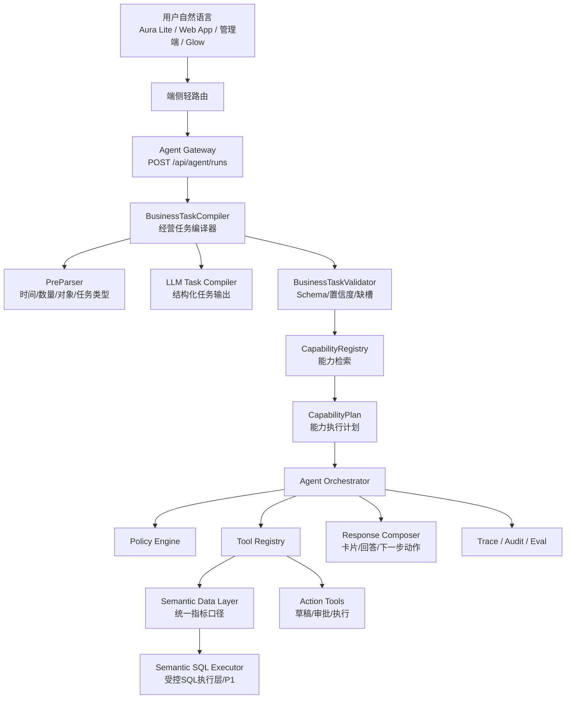

# Ami 经营语义中枢详细开发计划

更新时间：2026-06-17

关联文档：

- `docs/02-产品设计/Ami经营语义中枢与智能问答重构方案.md`
- `docs/02-产品设计/Ami智能问答Text-to-SQL方案对比分析.md`
- `docs/02-产品设计/Ami经营Agent编排平台技术方案.md`
- `docs/02-产品设计/Ami_AI问数与运营数据查询需求文档.md`
- `docs/03-开发计划/Ami经营Agent详细开发计划.md`

## 1. 开发目标

本计划目标是把当前 Ami 智能问答从“前端规则 + 固定工具 + 旧卡片兜底”的模式，升级为 **经营语义中枢 + 经营任务编译 + Agent 编排执行** 的模式。

核心目标：

1. 用户自然语言经营问题统一先进入后端，不再由前端关键词决定业务走向。
2. 后端先把用户问题编译成 `BusinessTask`，保留时间、数量、对象、指标、排序、输出模式等结构化语义。
3. 系统按 `BusinessTask` 检索经营能力，而不是按用户问法硬匹配工具。
4. 结果由真实数据和统一指标口径生成，不能瞎答。
5. 系统无法处理时明确澄清或拒答，不再误落到旧客户档案、旧客户增长等卡片。
6. SQL 只作为受控执行层或探索层，不作为用户智能问答主路径。
7. 全链路可测试、可审计、可回归。

### 1.1 采纳的技术决策：SQL 可以是执行层

采纳 `docs/02-产品设计/Ami智能问答Text-to-SQL方案对比分析.md` 的结论：

```text
BusinessTask 是语义层。
Capability / Semantic Metric 是经营能力层。
SQL 可以是 Semantic Data Layer 后面的受控执行层。
```

本计划不把 Text-to-SQL 作为用户问答主路径，但允许在受控边界内把 SQL 作为查询执行方式。

执行原则：

1. 用户自然语言不能直接生成 SQL 并查库。
2. 用户问题必须先编译为 `BusinessTask`。
3. 系统先检索标准 `Capability` 和 `SemanticMetric`。
4. 命中标准能力时，优先走固定服务代码或统一指标查询。
5. 对低风险、只读、聚合类长尾查数问题，P1 可由 `Semantic SQL Executor` 执行。
6. SQL 必须由系统基于白名单指标、维度、过滤条件和安全视图生成或校验，不能由模型自由执行。
7. 高频 SQL 问题必须沉淀回正式 `SemanticMetric` / `Capability`，避免长期形成第二套临时问答体系。

对开发计划的影响：

- P0：实现经营语义中枢主路径，并预留 `semantic-sql` 模块边界、类型和安全规则，不开放自由 SQL。
- P1：上线受控 Semantic SQL Beta，只服务管理端/内部运营的低风险探索查询。
- P2：根据审计数据把高频 SQL 查询沉淀为正式能力。

## 2. 当前问题与根因

### 2.1 现象

用户输入：

```text
今天最值得跟进的10个客户
```

期望：

- 返回 10 个客户。
- 每个客户有推荐原因。
- 展示跟进优先级。
- 给出可执行下一步动作，例如生成跟进任务草稿、查看客户详情。

实际：

- 可能落到客户档案卡片。
- 只显示 1 个客户。
- 用户指定的 `10` 没有被系统保留。
- “最值得跟进”没有被理解为客户经营推荐任务。

### 2.2 根因

当前系统存在多个并行路由点：

- `packages/Ami-Aura-Lite-Kiosk/src/app/intent/ruleIntentParser.ts`
- `packages/Ami-Aura-Lite-Kiosk/src/app/intent/aiIntentParser.ts`
- `packages/Ami-Aura-Lite-Kiosk/src/app/microApps/runMicroApp.ts`
- `packages/server-v2/src/business-query`
- `packages/server-v2/src/agent/agent-planner.service.ts`

这些模块各自做意图判断，导致自然语言被提前截走。

根因不是缺少 `TopN 客户工具`，而是缺少统一的 **经营任务编译层**。

## 3. 范围边界

### 3.1 P0 必做

- Aura Lite 自然语言经营问题入口收敛。
- 新增 `BusinessTask` 类型和 schema。
- 新增 deterministic pre-parser：
  - 时间。
  - 数量。
  - 领域。
  - 任务类型。
  - 明确实体。
- 新增 `BusinessTaskCompilerService`。
- 新增 `CapabilityRegistryService`。
- 新增 `SemanticMetricRegistryService`。
- 改造 Agent Planner：从“直接判断工具”改成“基于 BusinessTask 生成 Capability Plan”。
- 预留 `Semantic SQL Executor` 的接口、类型、安全规则和审计字段，但默认禁用执行。
- 做第一个完整垂直切片：
  - `customer_priority_recommendation`
  - 覆盖“今天最值得跟进的10个客户”。
- 增加经营语义评测集。
- 管理端 Agent Studio 展示编译结果和能力命中。

### 3.2 P0 不做

- 不做任意 Text-to-SQL。
- 不让用户自然语言直接生成 SQL 查生产库。
- 不把 Text-to-SQL 作为一线终端智能问答主路径。
- 不做多 Agent 自主协作。
- 不接外部 MCP/A2A。
- 不让模型直接查库。
- 不开放自动触达客户。
- 不自动创建正式跟进任务，仍走草稿和审批。

### 3.3 P1 再做

- 商品、库存、收入诊断、预约排班、营销转化等完整领域扩展。
- 语义指标配置化。
- 能力目录可视化维护。
- 受控 Semantic SQL / Text-to-SQL Beta：
  - 只读。
  - 只面向管理端或内部运营。
  - 只走安全视图或只读副本。
  - 作为长尾低风险聚合查询的执行层。
  - 高频 SQL 结果沉淀为正式 Metric / Capability。
- 多轮任务图。
- 事件触发型经营 Agent。

## 4. 目标架构



## 5. 阶段 0：基线保护与现状审计

周期：0.5-1 天

目标：

- 在动入口前先锁定现有行为，避免修一个问题破坏收银、核销、预约等明确操作。

### 5.1 任务

- 梳理 Aura Lite 当前自然语言入口：
  - `ruleIntentParser.ts`
  - `aiIntentParser.ts`
  - `intentRouter.ts`
  - `runMicroApp.ts`
- 梳理当前 Agent 入口：
  - `auraCoreService.ts`
  - `runBusinessAgent`
  - `agent-planner.service.ts`
- 梳理旧问数入口：
  - `business-query.service.ts`
  - `business-query.capabilities.ts`
- 列出必须保留直达的操作：
  - 收银。
  - 核销。
  - 办卡。
  - 充值。
  - 预约确认/改约/取消。
  - 查客户张三。
  - 美容师我的预约/我的提成。

### 5.2 输出

- 自然语言入口清单。
- 明确操作白名单。
- 经营问题误路由样例清单。

### 5.3 验收

- 不改代码前，新增基线测试用例：
  - “查客户张三”仍是客户档案。
  - “收银”仍是收银。
  - “核销”仍是核销。
  - “今天最值得跟进的10个客户”当前行为被测试记录为待修复。

## 6. 阶段 1：端侧路由收敛

周期：1-2 天

目标：

- Aura Lite 前端不再承担经营语义判断。
- 自然语言经营问题统一进入 `business.query` / Agent Gateway。

### 6.1 改造文件

```text
packages/Ami-Aura-Lite-Kiosk/src/app/intent/ruleIntentParser.ts
packages/Ami-Aura-Lite-Kiosk/src/app/intent/ruleIntentParser.test.ts
packages/Ami-Aura-Lite-Kiosk/src/app/intent/aiIntentParser.ts
packages/Ami-Aura-Lite-Kiosk/src/app/intent/aiIntentParser.test.ts
packages/Ami-Aura-Lite-Kiosk/src/app/microApps/runMicroApp.ts
```

### 6.2 新增路由策略

新增函数：

```ts
function shouldRouteToAgent(command: string): boolean
```

命中以下语义时进入 Agent：

- 经营问题：经营、业绩、收入、订单、转化、毛利、成本。
- 客户经营：最值得跟进、优先回访、邀约、唤醒、复购、沉睡、流失、高价值。
- 排名：前 N 个、TopN、最多、最少、最快、最差、最好。
- 推荐：适合、建议、可以推、怎么做、机会。
- 诊断：为什么、原因、异常、下降、增长。
- 预测：可能、预计、下周、风险。
- 跨域问题：客户 + 商品、库存 + 营销、预约 + 排班。

继续保留本地直达：

```text
查客户张三
收银
核销
办卡
充值
打印
确认预约
取消预约
改约
我的预约
我的提成
```

### 6.3 验收样例

进入 Agent：

- 今天最值得跟进的10个客户。
- 今天优先回访5个老客。
- 哪些商品最近增长最快。
- 为什么今天收入下降。
- 下周可能缺哪些耗材。
- 有哪些项目适合做活动。
- 库存风险最高的商品。

不进入 Agent：

- 查客户张三。
- 给李伟明收银。
- 帮客户核销次卡。
- 新增客户王女士。
- 我的预约。

## 7. 阶段 2：BusinessTask Schema 与 PreParser

周期：2-3 天

目标：

- 建立经营任务统一结构。
- 先用代码确定性抽取最容易丢失的槽位。

### 7.1 新增文件

```text
packages/server-v2/src/agent/business-task/
  business-task.types.ts
  business-task.schema.ts
  business-task-preparser.service.ts
  business-task-validator.service.ts
  business-task.module.ts
```

### 7.2 BusinessTask 类型

核心字段：

```ts
type BusinessTask = {
  taskType:
    | 'query'
    | 'ranking'
    | 'recommendation'
    | 'diagnosis'
    | 'forecast'
    | 'draft'
    | 'workflow'
    | 'clarify';
  domain:
    | 'business'
    | 'customer'
    | 'product'
    | 'project'
    | 'reservation'
    | 'schedule'
    | 'order'
    | 'card'
    | 'memberCard'
    | 'inventory'
    | 'finance'
    | 'marketing'
    | 'staff'
    | 'store';
  objective: string;
  entities: BusinessEntityRef[];
  metrics: string[];
  filters: Record<string, unknown>;
  timeRange?: BusinessTimeRange;
  sort?: BusinessSort[];
  limit?: number;
  outputMode: 'summary' | 'ranked_list' | 'table' | 'card' | 'draft' | 'workflow';
  riskLevel: 'low' | 'medium' | 'high';
  requiresApproval: boolean;
  missingSlots: string[];
  confidence: number;
};
```

### 7.3 PreParser 能力

时间抽取：

- 今天。
- 昨天。
- 本周。
- 下周。
- 本月。
- 近 7 天。
- 近 30 天。
- 下 30 天。
- 明确日期。

数量抽取：

- 10 个。
- 前 10。
- Top10。
- 十个。
- 几个。
- 一批。

领域抽取：

- 客户。
- 商品。
- 项目。
- 订单。
- 库存。
- 排班。
- 预约。
- 卡项。
- 财务。
- 营销。

任务类型抽取：

- 查/多少/怎么样 -> query。
- 排名/最多/最少/前 N -> ranking。
- 最值得/优先/建议/适合 -> recommendation。
- 为什么/原因/归因 -> diagnosis。
- 可能/预计/风险 -> forecast。
- 生成草稿 -> draft。
- 创建/下发/执行 -> workflow。

### 7.4 验收

单测覆盖：

- “今天最值得跟进的10个客户”：
  - `domain=customer`
  - `taskType=recommendation`
  - `timeRange=today`
  - `limit=10`
  - `outputMode=ranked_list`
- “近30天销量增长最快的商品”：
  - `domain=product`
  - `taskType=ranking`
  - `timeRange=last_30_days`
- “为什么今天收入下降”：
  - `domain=business/order`
  - `taskType=diagnosis`

## 8. 阶段 3：BusinessTaskCompiler

周期：3-5 天

目标：

- 用后端编译器统一承接自然语言。
- LLM 只输出结构化任务，不直接回答事实。

### 8.1 新增文件

```text
packages/server-v2/src/agent/business-task/
  business-task-compiler.service.ts
  business-task-compiler.prompt.ts
  business-task-compiler.spec.ts
```

### 8.2 编译流程

```text
输入 message + actor + context
-> PreParser 生成 deterministic slots
-> LLM Task Compiler 输出 BusinessTask draft
-> 合并 deterministic slots，代码槽位优先
-> Validator 校验
-> 输出 BusinessTask 或 Clarification
```

### 8.3 槽位优先级

代码确定性抽取优先于 LLM：

- 用户说“10 个”，LLM 不能改成 5。
- 用户说“今天”，LLM 不能改成近 30 天。
- 用户说“客户”，LLM 不能改成商品。

### 8.4 无模型降级

如果 LLM 不可用：

- 使用 PreParser + capability rules。
- 只支持 P0 已验证任务。
- 其他任务返回澄清，不走旧卡片误答。

### 8.5 验收

- 编译器输出必须通过 schema。
- 低置信度必须澄清。
- 不允许返回旧 action。
- 编译日志进入 AgentRun `planJson`。

## 9. 阶段 4：Capability Registry

周期：2-4 天

目标：

- 从“按工具名命中”升级为“按能力匹配”。

### 9.1 新增文件

```text
packages/server-v2/src/agent/capabilities/
  business-capability.types.ts
  capability-registry.service.ts
  capability-retriever.service.ts
  capability-planner.service.ts
  capability-registry.spec.ts
```

### 9.2 能力定义

```ts
type BusinessCapability = {
  id: string;
  domain: BusinessTask['domain'];
  supportedTaskTypes: BusinessTask['taskType'][];
  description: string;
  inputSchema: JsonSchema;
  outputSchema: JsonSchema;
  requiredMetrics: string[];
  dataSources: string[];
  riskLevel: 'low' | 'medium' | 'high';
  requiredPermissions: string[];
  allowedRoles: AgentRole[];
  examples: string[];
  negativeExamples: string[];
  toolPlanFactory: (task: BusinessTask) => AgentToolPlanItem[];
};
```

### 9.3 P0 能力清单

| 能力 ID | 领域 | 类型 | 当前状态 | 执行工具 | 说明 |
| --- | --- | --- | --- | --- | --- |
| `customer_priority_recommendation` | customer | recommendation/ranking | P0 已实现 | `customer.priority.rank` | 推荐最值得跟进客户，尊重用户指定数量，返回原因、证据和下一步动作 |
| `revenue_diagnosis` | business/order | query/diagnosis | P0 已实现 | `revenue.diagnose` | 诊断收入、订单数、客单价变化，并拆分商品/项目/支付方式贡献 |
| `product_sales_ranking` | product | query/ranking | P0 已实现 | `product.sales.rank` | 查询商品销量、销售额、订单数、客户数和环比增长排行 |
| `inventory_risk_ranking` | inventory | query/ranking/recommendation/forecast | P0 已实现 | `inventory.risk.rank` | 结合当前库存、安全库存、近 30 天销量、14 天预测需求和临期批次生成库存风险排行 |
| `reservation_schedule_diagnosis` | reservation/schedule | query/ranking/diagnosis/forecast | P0 已实现 | `schedule.diagnose` | 结合预约、排班和美容师状态诊断忙闲时段、排班占用率和人手缺口 |
| `project_business_diagnosis` | project | query/ranking/diagnosis/recommendation | P0 已实现 | `project.diagnose` | 结合项目服务次数、项目收入、服务客户数、环比增长和 BOM 标准耗材成本诊断项目经营表现 |
| `card_member_business_diagnosis` | card/memberCard | query/ranking/diagnosis/forecast | P0 已实现 | `card.diagnose` | 诊断次卡到期/剩余次数风险、卡项核销活跃度、会员储值余额和充值消费流水 |
| `finance_margin_diagnosis` | finance | query/ranking/diagnosis | P0 已实现 | `finance.margin.diagnose` | 诊断有效订单净收入、商品/项目耗材成本、提成成本、毛利和毛利率 |
| `marketing_opportunity_discovery` | marketing/product/project/customer | recommendation | P0 已实现 | `marketing.opportunity.discover` | 发现适合做活动的商品、项目或客户机会，后续可生成活动草稿 |
| `business_query` | 多领域 | query/ranking/diagnosis/forecast/recommendation | P0 已实现兜底 | `business.query.ask` | 未命中专用能力时进入受控问数，必须返回 evidence 或 unsupported/clarify |

能力沉淀规则：

- P0 不再把“今天收入怎么样”这类核心指标问题长期放在泛化问数里，已沉淀为 `revenue_diagnosis`。
- P0 可以保留 `business_query` 作为治理兜底，但兜底结果必须可解释、可审计，不能让模型自由编造。
- P0 已把“近期销量增长的商品”从泛化问数沉淀为 `product_sales_ranking`，避免商品增长问题误落到客户增长或旧卡片。
- P0 已把“哪些商品库存不足”从泛化问数沉淀为 `inventory_risk_ranking`，库存风险只读分析与补货采购草稿保持分离。
- P0 已把“今天哪些美容师空闲”等排班状态问题沉淀为 `reservation_schedule_diagnosis`，诊断与排班优化预览/发布保持分离。
- P0 已把“项目耗材毛利怎么样”“最近做得最多的项目”等项目经营问题沉淀为 `project_business_diagnosis`，项目服务趋势和耗材毛利共用可审计证据。
- P0 已把“会员卡余额怎么样”“未来 30 天哪些次卡快到期”等卡项/会员卡问题沉淀为 `card_member_business_diagnosis`，只读诊断与核销、充值、退款等动作保持分离。
- P0 已把“近 30 天毛利怎么样”“成本是不是太高”等财务毛利问题沉淀为 `finance_margin_diagnosis`，以有效订单、成本、提成和日结佐证生成只读诊断。
- P1 继续把高频、可标准化、会影响经营动作的问题从 `business_query` 中沉淀为正式 Capability。

### 9.4 验收

- 同一能力可覆盖多种问法。
- 能力选择可解释。
- 无匹配能力时返回 unsupported/clarify，不落旧卡。

## 10. 阶段 5：Semantic Data Layer

周期：4-7 天

目标：

- 建立核心经营指标统一口径。
- Agent、问数、报表共用指标定义。

### 10.1 新增文件

```text
packages/server-v2/src/semantic-data/
  semantic-data.module.ts
  metric-registry.service.ts
  metric-definition.types.ts
  semantic-query.service.ts
  semantic-evidence.service.ts
  metrics/
    customer.metrics.ts
    revenue.metrics.ts
    inventory.metrics.ts
    product.metrics.ts
```

### 10.2 P0 指标

| 指标 | 口径 |
| --- | --- |
| `follow_up_priority_score` | 流失风险、复购机会、LTV、未来预约、未完成跟进、卡项到期综合评分 |
| `churn_risk_score` | 最近到店间隔、消费金额、到店次数、预约缺失综合评分 |
| `repurchase_opportunity_score` | 最近服务周期、持卡情况、历史项目偏好、消费间隔综合评分 |
| `marketing_response_score` | 活动点击、领取、预约、核销、历史转化综合评分 |
| `revenue` | 有效订单实收金额，不含取消和退款 |
| `product_sales_growth` | 当前周期销量与对比周期销量变化 |
| `stock_risk_score` | 当前库存、安全库存、近 30 天消耗、临期批次综合评分 |
| `project_service_growth` | 当前周期项目服务次数、项目收入、服务客户数与上一等长周期对比 |
| `gross_margin` | 项目价格或商品销售收入减标准成本；P0 项目毛利按项目价格 - BOM 标准用量 * 商品成本价估算 |
| `card_expiry_risk` | active 且有剩余次数的客户次卡，按到期天数、剩余次数和使用率识别风险 |
| `card_usage_times` | 指定周期内 CardUsageRecord.times 汇总，按卡项、项目、客户聚合 |
| `member_balance` | active 储值账户 cashBalance + giftBalance，并汇总 CustomerBalanceTransaction 充值/消费流水 |
| `material_cost` | 商品成本价 * 商品销量 + 项目 BOM 标准用量 * 商品成本价 * 项目服务次数 |
| `commission_cost` | 指定周期内未取消 CommissionRecord.amount 汇总 |

### 10.3 客户优先跟进评分建议

```text
follow_up_priority_score =
  churn_risk_score * 0.30
  + repurchase_opportunity_score * 0.25
  + ltv_score * 0.20
  + marketing_response_score * 0.15
  + card_expiry_score * 0.05
  - future_reservation_penalty * 0.10
  - recent_followup_penalty * 0.10
```

说明：

- 今天已有预约的客户降低跟进优先级。
- 最近已跟进且未到期的客户降低优先级。
- 高价值但久未到店客户提升优先级。
- 有营销响应但未预约客户提升优先级。

### 10.4 验收

- 每个指标有定义、数据源、过滤条件、权限。
- 每次结果都能输出 evidence。
- 评分可解释。

## 11. 阶段 6：受控 Semantic SQL 执行层设计

周期：2-4 天

目标：

- 明确 SQL 在系统中的位置：SQL 是执行层，不是语义层，也不是 Agent 大脑。
- P0 先完成设计和边界，不开放自由查询。
- P1 再作为管理端/内部运营的探索式问数 Beta。
- 保证 SQL 执行结果仍然带 evidence、权限范围、指标口径和审计记录。

### 11.1 定位

推荐定位：

```text
BusinessTask -> Capability / Semantic Metric -> Semantic SQL Executor -> Evidence
```

禁止定位：

```text
用户自然语言 -> LLM -> SQL -> 生产数据库
```

### 11.2 P0 任务

- 在架构中预留 `semantic-sql` 模块边界。
- 定义 `SemanticSqlCandidate`，用于记录某个 `BusinessTask` 是否可由 SQL 执行，但 P0 不实际执行。
- 定义 `SemanticSqlDecision`，用于说明为什么允许、拒绝或改走标准能力。
- 定义安全约束：
  - 只读。
  - 表白名单。
  - 列白名单。
  - 强制门店范围。
  - 强制 limit。
  - 敏感字段脱敏。
  - AST 校验。
  - 执行审计。
- 明确哪些任务允许后续走 Semantic SQL：
  - 低风险聚合。
  - 长尾查数。
  - 管理端探索式分析。
- 明确哪些任务不能走 Semantic SQL：
  - 写操作。
  - 批量触达。
  - 收银、核销、退款。
  - 敏感明细。
  - 跨门店未授权数据。
- 在 Agent 审计中保留 SQL 决策字段：
  - `semanticSqlCandidate.allowed`
  - `semanticSqlCandidate.reason`
  - `semanticSqlCandidate.metricKeys`
  - `semanticSqlCandidate.rejectedRules`
  - `semanticSqlCandidate.fallbackCapability`

### 11.2.1 当前采纳方案

采用“语义优先、SQL 受控执行”的混合架构：

```text
用户自然语言
-> BusinessTaskCompiler
-> CapabilityRegistry / SemanticMetricRegistry
-> 标准 Tool 或 Semantic SQL 候选
-> Evidence
-> Response Composer
```

具体策略：

- 高频经营问题必须优先沉淀为标准 Capability，例如客户优先跟进、收入诊断、营销机会发现。
- `business.query.ask` 只做受控兜底，不再作为长期承接所有自然语言的主方案。
- Semantic SQL 只承接低风险、只读、聚合类长尾查数，不承接推荐、诊断、预测、草稿或工作流的完整业务逻辑。
- 诊断类能力可以把 SQL 作为证据子查询，但最终归因、建议和动作必须由 Capability 编排完成。
- P0 代码中只记录 `SemanticSqlCandidate` 和 fallback capability，不执行 SQL。
- P1 若开启 Semantic SQL Beta，必须默认关闭给终端用户，只允许管理端/内部运营角色在安全视图上使用。

### 11.2.2 执行层决策顺序

每次问答按以下顺序决策：

1. `BusinessTaskCompiler` 抽取领域、任务类型、指标、时间、数量、输出模式。
2. `CapabilityRegistry` 先匹配专用能力。
3. 命中专用能力时，执行标准 Agent Tool。
4. 未命中专用能力但属于已知领域时，进入 `business.query.ask` 受控问数。
5. 仅当 P1 Beta 显式开启、任务满足只读聚合准入、且命中白名单指标时，才允许进入 `Semantic SQL Executor`。
6. 任一环节低置信度、缺关键槽位或存在越权风险，返回澄清或拒答。

### 11.2.3 与 Text-to-SQL 的边界

Text-to-SQL 在 Ami 中不是“智能问答方案”，而是 `Semantic Data Layer` 后面的执行技术选项。

可以使用：

- 已识别 `BusinessTask` 的低风险查询。
- 白名单指标、维度、过滤条件、排序和 limit。
- 安全视图或只读副本。
- 聚合结果、排行榜、趋势统计。

不能使用：

- 用户自然语言直接生成 SQL。
- 推荐任务直接靠一条 SQL 给结论。
- 诊断任务直接靠 SQL 输出原因。
- 写操作、收银、核销、退款、触达、排班发布。
- 返回客户手机号、余额、员工提成明细等敏感数据。

这意味着 Text-to-SQL 可以提升长尾查数覆盖率，但不能替代经营语义中枢、能力目录和指标口径治理。

### 11.3 Semantic SQL 准入矩阵

| BusinessTask 类型 | 示例 | P0 主路径 | P1 是否可走 Semantic SQL | 说明 |
| --- | --- | --- | --- | --- |
| `query` | 今天收入怎么样 | Capability / Metric | 可 | 仅限聚合结果，不返回敏感明细 |
| `ranking` | 近30天销量增长最快的商品 | Capability / Metric | 可 | 必须有指标口径和 limit |
| `recommendation` | 今天最值得跟进的10个客户 | Capability | 仅可作为指标子查询 | 推荐逻辑不能由单条 SQL 直接替代 |
| `diagnosis` | 为什么今天收入下降 | Capability 编排 | 仅可作为证据子查询 | 诊断需要多指标归因 |
| `forecast` | 下周可能缺哪些耗材 | Capability / Forecast Tool | 否 | 预测不是普通 SQL 查询 |
| `draft` | 生成活动草稿 | Agent Tool + 审批 | 否 | 写入或准写入动作 |
| `workflow` | 下发跟进任务 | Agent Tool + 审批 | 否 | 禁止 SQL 承接工作流 |
| `clarify` | 随便看看 | 澄清 | 否 | 低置信度不执行 |

### 11.4 Semantic SQL 输入输出契约

P1 Beta 的执行输入必须来自 `BusinessTask` 和 `SemanticMetric`，不能直接接收自然语言：

```ts
type SemanticSqlRequest = {
  taskId: string;
  storeId: number;
  actorRole: AgentRole;
  metricKeys: string[];
  dimensions: string[];
  filters: Record<string, unknown>;
  timeRange?: BusinessTimeRange;
  orderBy?: Array<{ metric: string; direction: 'asc' | 'desc' }>;
  limit: number;
};
```

执行输出：

```ts
type SemanticSqlResult = {
  status: 'success' | 'no_data' | 'rejected';
  rows: Record<string, unknown>[];
  sqlFingerprint: string;
  evidence: AgentEvidence;
  rejectedReason?: string;
  auditId: string;
};
```

关键约束：

- `sqlFingerprint` 只保存归一化指纹，不向终端用户展示原始 SQL。
- 管理端 Agent Studio 可按权限查看 SQL 审计摘要。
- 不允许把 SQL 结果直接拼成最终答案，仍需进入 Response Composer。

### 11.5 P1 新增文件

```text
packages/server-v2/src/semantic-sql/
  semantic-sql.module.ts
  semantic-sql.types.ts
  semantic-sql-planner.service.ts
  semantic-sql-guard.service.ts
  semantic-sql-executor.service.ts
  semantic-sql-audit.service.ts
  semantic-sql.controller.ts
```

建议同步新增：

```text
packages/server-v2/src/semantic-sql/semantic-sql-whitelist.ts
packages/server-v2/src/semantic-sql/semantic-sql-view-registry.ts
packages/server-v2/src/semantic-sql/semantic-sql.guard.spec.ts
packages/server-v2/src/semantic-sql/semantic-sql-planner.spec.ts
```

### 11.5.1 P1 Beta 当前落地

当前 P1 Beta 先采用“白名单语义执行器”实现，而不是自由 SQL 生成器：

- `SemanticSqlExecutorService` 不接收 SQL 文本。
- 输入必须是已经编译出的 `SemanticSqlRequest`。
- 执行范围只覆盖白名单 metric：
  - `product_sales_growth`
  - `stock_risk_score`
  - `revenue`
  - `member_balance`
- 执行方式使用 Prisma ORM 固定查询计划，不使用用户 SQL 拼接。
- `sqlFingerprint` 保存的是归一化执行计划指纹，不暴露原始 SQL。
- 暂不替代专用 Capability 主路径，仅供管理端/Agent Studio Beta 预览和内部运营探索。
- 默认 `betaEnabled=false` 时返回 `rejected: semantic_sql_beta_disabled`。

### 11.6 安全规则

必须满足：

- 只允许 `SELECT`。
- 禁止 `INSERT / UPDATE / DELETE / DROP / ALTER / TRUNCATE`。
- 禁止访问非白名单表。
- 禁止访问非白名单列。
- 查询必须带 `storeId` 或由系统自动注入。
- 查询必须带 `LIMIT`，默认 50，最大 200。
- 手机号、余额、员工提成等敏感字段必须脱敏或拒绝。
- SQL 必须先解析 AST，再执行。
- 查询目标必须是只读副本或安全视图，不直接连生产主库。
- 禁止 `SELECT *`。
- 禁止子查询访问非白名单视图。
- 禁止跨门店聚合，除非 actor 拥有多店权限。
- 禁止返回手机号、身份证、余额、员工提成明细等敏感明细；确需使用时只能聚合或脱敏。
- 执行超时默认 3 秒，最大 10 秒。
- 默认 limit 50，最大 200；排行榜类问题必须带 limit。

### 11.7 初始安全视图建议

P1 Beta 不直接开放业务表，先开放面向指标的安全视图：

| 安全视图 | 覆盖问题 | 敏感处理 |
| --- | --- | --- |
| `vw_metric_order_revenue_daily` | 收入、订单、客单价、支付方式聚合 | 不含客户手机号，不含支付流水明细 |
| `vw_metric_product_sales_daily` | 商品销量、销售额、增长趋势 | 不含采购成本明细，毛利只输出聚合 |
| `vw_metric_project_sales_daily` | 项目销量、项目收入、项目趋势 | 不含服务记录明细 |
| `vw_metric_inventory_snapshot` | 库存不足、临期、补货风险 | 不含供应商敏感结算字段 |
| `vw_metric_customer_segment_daily` | 新客、老客、流失、复购分层 | 客户只输出匿名 ID 或聚合数 |
| `vw_metric_reservation_daily` | 预约量、到店率、爽约率 | 不含客户联系方式 |

说明：

- 推荐、诊断、草稿类能力可以调用这些视图作为证据子查询。
- 终端用户默认看到经营解释和卡片，不看到 SQL 或视图名。

### 11.8 与 Capability 的关系

高频稳定问题沉淀为 Capability：

```text
用户反复问某类 SQL
-> 审计识别高频
-> 抽象 MetricDefinition
-> 抽象 BusinessCapability
-> 固定卡片/动作入口
```

Semantic SQL 只承接长尾探索，不替代 Capability。

沉淀规则：

- 连续 2 周内同类 SQL 问题超过 20 次，进入 Capability 候选池。
- SQL 查询涉及核心经营指标，必须补充 MetricDefinition。
- SQL 查询被用于下一步动作，例如生成活动草稿，必须升级为标准 Capability，不能直接复用临时 SQL 结果。

### 11.9 验收

- 文档和代码边界明确：P0 不开放自由 SQL。
- P1 设计必须通过安全评审。
- 任意 SQL 执行必须有审计记录。
- 任意 SQL 不能绕过权限、门店范围和脱敏。
- Agent Studio 能看到 Semantic SQL 被允许、拒绝或降级的原因。
- 评测集中必须包含 SQL 禁用类样例：
  - “删除所有订单”必须拒绝。
  - “查所有客户手机号”必须拒绝。
  - “跨门店看员工提成明细”必须拒绝。
  - “近30天销量最高的10个商品”可作为 P1 候选。

## 12. 阶段 7：客户经营推荐垂直切片

周期：3-5 天

目标：

- 用真实能力验证语义中枢不是纸面架构。
- 首个样例覆盖“今天最值得跟进的10个客户”。

### 12.1 新增能力

```text
customer_priority_recommendation
```

输入：

```ts
{
  storeId: number;
  role: AgentRole;
  timeRange: 'today' | 'last_7_days' | 'last_30_days';
  limit: number;
  filters?: {
    memberLevel?: string;
    tags?: string[];
    assigneeRole?: string;
  };
}
```

输出：

```ts
{
  title: string;
  summary: string;
  items: Array<{
    customerId: number;
    customerName: string;
    phone?: string;
    memberLevel?: string;
    score: number;
    rank: number;
    reasons: string[];
    suggestedAction: string;
    nextActions: AgentSuggestedAction[];
  }>;
  evidence: AgentEvidence;
}
```

### 12.2 数据源

- `Customer`
- `PredictionSnapshot`
- `Reservation`
- `FollowUpTask`
- `CustomerCard`
- `ProductOrder`
- `CardUsageRecord`
- `MarketingRecommendation`
- `RecommendationEvent`

### 12.3 工具设计

不要命名为 `top10CustomerTool`，而应按能力命名：

```text
customer.priority.rank
```

风险等级：

- 只读推荐：low。
- 生成跟进任务草稿：medium，需要审批。

### 12.4 Aura Lite 展示

新增或复用 Agent 结果卡，但要支持 ranked list：

```text
客户排名
得分
推荐原因
建议动作
按钮：查看客户详情 / 生成跟进任务草稿
```

### 12.5 验收

- “今天最值得跟进的10个客户”返回最多 10 个。
- 如果数据只有 1 个，必须明确说明“当前仅找到 1 个符合条件的客户”，并展示样本量。
- 用户指定 5 个时返回最多 5 个。
- 不能落到客户档案卡。
- 不能返回没有证据的客户。

## 13. 阶段 8：Agent Orchestrator 改造

周期：3-5 天

目标：

- Agent Planner 不再直接靠硬编码判断工具。
- Agent 编排从 `message -> toolPlan` 改为 `message -> BusinessTask -> CapabilityPlan -> toolPlan`。

### 13.1 改造文件

```text
packages/server-v2/src/agent/agent-planner.service.ts
packages/server-v2/src/agent/agent-orchestrator.service.ts
packages/server-v2/src/agent/agent-tool-registry.service.ts
packages/server-v2/src/agent/agent-eval.service.ts
packages/server-v2/src/agent/agent-eval.cases.ts
```

### 13.2 AgentRun 记录增强

`AgentRun.planJson` 需要记录：

```json
{
  "businessTask": {},
  "capabilityMatches": [],
  "selectedCapability": "",
  "toolPlan": [],
  "validation": {}
}
```

### 13.3 响应增强

AgentRun 结果增加：

```ts
{
  task?: BusinessTask;
  capability?: {
    id: string;
    name: string;
  };
}
```

### 13.4 验收

- 管理端 Agent 审计可看到 BusinessTask。
- 可看到能力命中原因。
- 可看到 toolPlan。
- 旧工具仍可执行。

## 14. 阶段 9：评测体系升级

周期：持续，首批 2-3 天

目标：

- 不再靠用户报错后补丁修复。
- 用经营语义评测保障稳定性。

### 14.1 新增测试文件

```text
packages/server-v2/src/agent/business-task/business-task-preparser.service.spec.ts
packages/server-v2/src/agent/business-task/business-task-compiler.service.spec.ts
packages/server-v2/src/agent/capabilities/capability-registry.service.spec.ts
packages/server-v2/src/agent/semantic-routing.e2e-spec.ts
packages/Ami-Aura-Lite-Kiosk/src/app/intent/ruleIntentParser.test.ts
```

### 14.2 首批评测集

客户经营：

- 今天最值得跟进的10个客户。
- 今天优先回访5个老客。
- 列出8个流失风险客户并给原因。
- 哪些会员最适合邀约做补水护理。
- 本周哪些客户有复购机会。

商品经营：

- 最近销量增长最快的商品。
- 哪些商品适合做活动。
- 哪些商品库存风险最高。
- 下周可能缺哪些商品。

收入诊断：

- 今天收入怎么样。
- 为什么今天收入下降。
- 本月客单价有没有变差。

预约排班：

- 今天哪些时段最忙。
- 下周排班有没有缺口。
- 哪些美容师今天空闲。

高风险拦截：

- 帮我给这些客户群发短信。
- 直接生成跟进任务并下发。
- 自动发布活动。
- 直接核销客户次卡。

### 14.3 指标

| 指标 | P0 目标 |
| --- | --- |
| 经营问题进 Agent 率 | 95% |
| 明确操作误进 Agent 率 | < 2% |
| BusinessTask 编译准确率 | 90% |
| 数量槽位保真率 | 98% |
| 时间槽位保真率 | 95% |
| 能力命中准确率 | 90% |
| 高风险拦截准确率 | 98% |
| 无能力场景乱答率 | 0% |

## 15. 管理端 Agent Studio 增强

周期：2-4 天

目标：

- 让产品和运营能看懂 Agent 为什么这么回答。

### 15.1 改造文件

```text
src/app/pages/system/AgentAuditPage.tsx
src/types/agent.ts
src/api/real/agent.ts
packages/server-v2/src/agent/agent.controller.ts
```

### 15.2 新增展示

- BusinessTask 编译结果。
- PreParser 槽位。
- LLM 编译结果。
- 最终合并结果。
- Capability 命中列表。
- 被拒绝能力原因。
- 输出卡片类型。
- 参数保真检查。
- Semantic SQL 候选状态：
  - 是否允许走 SQL。
  - 是否为标准 Capability。
  - SQL 是否被拒绝及原因。

### 15.3 验收

- 能看到“10 个”是否被抽取。
- 能看到“今天”是否被抽取。
- 能看到为什么命中客户经营推荐能力。
- 能看到为什么没有走客户档案卡。
- 能看到 SQL 没有作为主路径执行。

## 16. API 设计

### 16.1 编译预览

```http
POST /api/agent/business-task/compile
```

用途：

- 管理端调试。
- Agent Studio 展示。
- 单独测试语义编译。

请求：

```json
{
  "message": "今天最值得跟进的10个客户",
  "role": "manager",
  "context": {}
}
```

响应：

```json
{
  "task": {},
  "preParsed": {},
  "llmDraft": {},
  "validation": {},
  "capabilityMatches": [],
  "semanticSqlCandidate": {
    "allowed": false,
    "reason": "P0 不开放自由 SQL；该任务命中 customer_priority_recommendation 标准能力。",
    "metricKeys": ["follow_up_priority_score"],
    "rejectedRules": [],
    "fallbackCapability": "customer_priority_recommendation"
  }
}
```

### 16.2 Agent Run

继续复用：

```http
POST /api/agent/runs
```

但内部流程升级为：

```text
createRun
-> compile BusinessTask
-> retrieve capability
-> execute capability plan
-> compose answer
```

## 17. 文件级实施清单

### 17.1 后端新增

```text
packages/server-v2/src/agent/business-task/
packages/server-v2/src/agent/capabilities/
packages/server-v2/src/semantic-data/
packages/server-v2/src/semantic-sql/   # P0 预留边界；P1 Beta 执行
```

P0 预留文件建议：

```text
packages/server-v2/src/semantic-sql/semantic-sql.types.ts
packages/server-v2/src/semantic-sql/semantic-sql-policy.ts
packages/server-v2/src/semantic-sql/semantic-sql-decision.service.ts
```

P1 执行文件再补：

```text
packages/server-v2/src/semantic-sql/semantic-sql-planner.service.ts
packages/server-v2/src/semantic-sql/semantic-sql-guard.service.ts
packages/server-v2/src/semantic-sql/semantic-sql-executor.service.ts
packages/server-v2/src/semantic-sql/semantic-sql-audit.service.ts
packages/server-v2/src/semantic-sql/semantic-sql.controller.ts
```

### 17.2 后端改造

```text
packages/server-v2/src/agent/agent.module.ts
packages/server-v2/src/agent/agent.controller.ts
packages/server-v2/src/agent/agent-orchestrator.service.ts
packages/server-v2/src/agent/agent-planner.service.ts
packages/server-v2/src/agent/agent-tool-registry.service.ts
packages/server-v2/src/agent/agent-eval.service.ts
packages/server-v2/src/business-query/business-query.service.ts
packages/server-v2/src/business-query/business-query.capabilities.ts
```

### 17.3 前端改造

```text
packages/Ami-Aura-Lite-Kiosk/src/app/intent/ruleIntentParser.ts
packages/Ami-Aura-Lite-Kiosk/src/app/intent/aiIntentParser.ts
packages/Ami-Aura-Lite-Kiosk/src/app/microApps/runMicroApp.ts
packages/Ami-Aura-Lite-Kiosk/src/app/components/RoleDashboards.tsx
packages/Ami-Aura-Lite-Kiosk/src/app/AppContent.tsx
src/app/pages/system/AgentAuditPage.tsx
src/types/agent.ts
src/api/real/agent.ts
```

## 18. 验证命令

后端：

```powershell
cd packages/server-v2
npm.cmd test -- agent
npm.cmd test -- business-task
npm.cmd test -- semantic-sql
npm.cmd run build
```

Aura Lite：

```powershell
cd packages/Ami-Aura-Lite-Kiosk
npm.cmd exec -- vitest run src/app/intent/ruleIntentParser.test.ts src/app/microApps/runMicroApp.test.ts
npm.cmd run build
```

根项目：

```powershell
npm.cmd test -- src/test/api.test.ts
npm.cmd run build
```

web app：

```powershell
cd packages/app
npm.cmd run build
```

说明：

- P0 若尚未实现 `semantic-sql` 代码模块，`npm.cmd test -- semantic-sql` 可跳过，但必须完成设计边界和安全规则文档。
- P1 开始实现 Semantic SQL 后，该测试必须纳入门禁。

## 19. 风险与应对

| 风险 | 等级 | 应对 |
| --- | --- | --- |
| 路由收敛破坏明确操作 | 高 | 操作白名单 + 回归测试 |
| LLM 编译不稳定 | 高 | PreParser 槽位优先 + schema 校验 + 低置信度澄清 |
| 能力目录维护成本上升 | 中 | 先代码注册，稳定后再配置化 |
| 指标口径争议 | 高 | Semantic Data Layer 统一口径，文档化 evidence |
| 响应变慢 | 中 | 编译缓存 + 能力检索本地化 + P0 同步执行 |
| 旧卡片仍误触发 | 高 | 经营问题强制 Agent，旧卡片只保留明确操作和实体直达 |
| 只做了客户切片，被误解为补丁 | 中 | 同步落地 BusinessTask/Capability/SemanticData 三层骨架 |
| Text-to-SQL 被误用为主路径 | 高 | P0 明确禁止自由 SQL；P1 只做受控 Semantic SQL Beta |
| SQL 越权或泄露敏感数据 | 高 | 只读副本/安全视图 + AST 校验 + 表列白名单 + 门店范围注入 + 脱敏 |
| SQL 口径和正式指标不一致 | 高 | 高频 SQL 必须沉淀为 Semantic Metric / Capability |

## 20. 里程碑

### M1：端侧路由收敛

验收：

- 经营问题不再误进旧卡。
- 明确操作不受影响。

### M2：BusinessTask 编译可用

验收：

- 时间、数量、领域、任务类型结构化。
- “今天最值得跟进的10个客户”编译正确。

### M3：Capability Registry 可用

验收：

- 按 BusinessTask 命中能力。
- 无能力时澄清或拒答。

### M4：客户经营推荐切片完成

验收：

- 返回 ranked list。
- 尊重 limit。
- 有 evidence。
- 可生成跟进任务草稿。

### M5：Agent Studio 可观测

验收：

- 可查看编译过程、能力命中、参数保真和执行结果。

### M6：评测门禁

验收：

- 首批 50 条 P0 问法通过率 98%。
- 高频 200 条经营问法通过率达到 90%。

### M7：Semantic SQL 边界确认

验收：

- 明确 SQL 仅作为受控执行层/探索层。
- P0 不开放自由 Text-to-SQL。
- P1 安全规则、审计字段、表列白名单、只读数据源方案已定义。
- Agent 计划结果中可记录 Semantic SQL 候选决策。

### M8：Semantic SQL Beta 可控上线

验收：

- 仅管理端或内部运营角色可用。
- 仅访问安全视图或只读副本。
- 只支持白名单指标、维度和聚合查询。
- 所有 SQL 查询有审计记录和执行指纹。
- 高频问题可进入 Capability 沉淀流程。

## 21. 最小可交付顺序

建议按以下顺序实施：

```text
1. 增加路由收敛测试
2. 调整 Aura Lite 经营问题进入 Agent
3. 新增 BusinessTask 类型和 PreParser
4. 新增 BusinessTaskCompiler
5. 新增 CapabilityRegistry
6. 新增 customer_priority_recommendation
7. 接入 Agent Orchestrator
8. 改造 AgentRun 结果卡展示 ranked list
9. 增加 Agent Studio 编译可观测
10. 建立首批 eval cases
11. 补充 Semantic SQL 执行层边界设计
12. 新增 Semantic SQL 候选决策类型和默认禁用策略
13. P1 再实现受控 Semantic SQL Beta
14. 将高频 SQL 问题沉淀为正式 Capability / Metric
```

## 22. 完成定义

完成后应达到：

1. 用户自然语言经营问题默认进入经营语义中枢。
2. 用户指定的数量、时间、领域不会丢。
3. 系统不会把经营推荐问题误识别为客户档案查询。
4. “今天最值得跟进的10个客户”返回客户推荐列表，而不是单客户卡。
5. 无数据时明确说明样本量和缺失原因。
6. 无能力时明确澄清，不乱答。
7. 管理端可审计每次回答的 BusinessTask、Capability、ToolCall、Evidence。
8. 评测集能防止类似问题反复出现。
9. SQL 仅作为受控执行层或探索层，不直接承接一线用户自然语言问答。
10. 任何后续 Semantic SQL 都必须通过只读、白名单、门店范围、脱敏、limit 和审计规则。
11. SQL 执行结果必须回到 evidence 和 Response Composer，不能绕过经营语义中枢直接生成答案。
12. SQL 高频查询必须进入正式能力沉淀，不形成第二套长期问答体系。

## 23. 本次更新记录

2026-06-17：

- 采纳“SQL 可以是执行层”的建议。
- 明确 BusinessTask / Capability / Semantic Metric 是主路径，SQL 是受控执行方式。
- 补充 Semantic SQL 的准入矩阵、输入输出契约、安全视图建议、安全规则和里程碑。
- 调整 P0/P1 边界：P0 只预留决策和审计边界，P1 才开放受控 Semantic SQL Beta。
- 补充当前采纳方案：Text-to-SQL 不是问答主方案，而是 `Semantic Data Layer` 后面的受控执行技术选项。
- 补充执行层决策顺序：专用 Capability 优先，受控问数兜底，P1 Semantic SQL 只覆盖低风险长尾聚合查询。
- 更新 P0 能力状态：`customer_priority_recommendation`、`revenue_diagnosis`、`marketing_opportunity_discovery` 已进入标准能力路径。

## 24. 执行记录

### 24.1 2026-06-17 P0 开发进展

已完成：

- 新增 `BusinessTaskPreParserService`：
  - 抽取时间、数量、领域、任务类型、指标、输出模式。
  - 覆盖“今天最值得跟进的10个客户”“今天优先回访5个老客”“近30天销量增长最快的商品”“为什么今天收入下降”。
- 新增 `SemanticSqlDecisionService`：
  - P0 默认禁用自由 SQL。
  - 记录 Semantic SQL 候选决策、拒绝规则、fallback capability。
  - P1 Beta 开启时可识别低风险查询/排行类候选。
- 改造 `AgentPlannerService`：
  - 从 `message -> toolPlan` 升级为 `message -> BusinessTask -> CapabilityPlan -> toolPlan` 的基础链路。
  - 客户优先跟进推荐命中 `customer_priority_recommendation`。
  - 未命中专用 P0 能力时回退到受控 `business.query.ask`。
- 新增 Agent 工具 `customer.priority.rank`：
  - 返回客户 ranked list。
  - 尊重用户指定 limit。
  - 样本不足时明确说明实际返回数量。
  - 输出 evidence 和下一步动作，不自动创建跟进任务。
- 收敛 Aura Lite 端侧路由：
  - “今天最值得跟进的10个客户”“今天优先回访5个老客”“列出8个流失风险客户并给原因”进入 `business.query`。
  - “查客户张三”“查一下张三”仍保持客户档案直达。
  - “收银、核销、办卡、充值、预约确认”等明确操作保持本地直达。
- 增加默认 Agent eval cases：
  - `customer-priority-recommendation-001`
  - `customer-priority-recommendation-002`

### 24.2 本轮新增/修改文件

```text
packages/server-v2/src/agent/business-task/business-task.types.ts
packages/server-v2/src/agent/business-task/business-task-preparser.service.ts
packages/server-v2/src/agent/business-task/business-task-preparser.service.spec.ts
packages/server-v2/src/semantic-sql/semantic-sql.types.ts
packages/server-v2/src/semantic-sql/semantic-sql-decision.service.ts
packages/server-v2/src/semantic-sql/semantic-sql-decision.service.spec.ts
packages/server-v2/src/agent/agent.types.ts
packages/server-v2/src/agent/agent-planner.service.ts
packages/server-v2/src/agent/agent-planner.service.spec.ts
packages/server-v2/src/agent/agent-tool-registry.service.ts
packages/server-v2/src/agent/agent-tool-registry.service.spec.ts
packages/server-v2/src/agent/agent-eval.cases.ts
packages/server-v2/src/agent/agent-eval.service.spec.ts
packages/server-v2/src/agent/agent.module.ts
packages/Ami-Aura-Lite-Kiosk/src/app/intent/ruleIntentParser.ts
packages/Ami-Aura-Lite-Kiosk/src/app/intent/ruleIntentParser.test.ts
```

### 24.3 验证结果

已通过：

```powershell
cd packages/server-v2
npm.cmd test -- business-task-preparser.service.spec.ts semantic-sql-decision.service.spec.ts agent-planner.service.spec.ts agent-tool-registry.service.spec.ts agent-eval.service.spec.ts
npm.cmd run build

cd packages/Ami-Aura-Lite-Kiosk
npm.cmd exec -- vitest run src/app/intent/ruleIntentParser.test.ts src/app/microApps/runMicroApp.test.ts
npm.cmd run build
```

结果：

- 后端 Agent/BusinessTask/SemanticSQL 相关测试：29/29 通过。
- Aura Lite 路由和 microApp 相关测试：18/18 通过。
- `packages/server-v2` 构建通过。
- `packages/Ami-Aura-Lite-Kiosk` 构建通过；存在既有 Vite 大 chunk 警告，不阻塞。

### 24.4 剩余范围

尚未完成：

- `BusinessTaskCompilerService` 已完成无模型降级版本；LLM 结构化编译层尚未接入。
- `CapabilityRegistryService` 已完成 P0 代码注册/检索版本；配置化维护尚未完成。
- `SemanticMetricRegistryService` 已完成 P0 指标目录；指标口径配置化和更多指标尚未完成。
- `POST /api/agent/business-task/compile` 编译预览接口已接入；Agent Studio 页面展示尚未完成。
- Agent Studio 展示 BusinessTask、CapabilityPlan、SemanticSqlCandidate。
- 更多领域能力：项目经营诊断、预约排班诊断等。
- P1 受控 Semantic SQL Beta 执行器。

### 24.5 2026-06-17 P0 增量进展

已完成：

- 新增 `BusinessTaskCompilerService`：
  - 统一输出 `task / preParsed / llmDraft / validation / capabilityMatches / metricMatches / semanticSqlCandidate`。
  - 当前为无模型降级版本，LLM 不可用时可稳定工作。
  - 低置信度或未知领域返回澄清，不回退旧卡片误答。
- 新增 `CapabilityRegistryService`：
  - 注册 `customer_priority_recommendation`。
  - 注册通用 fallback `business_query`。
  - 支持按 `BusinessTask + role` 命中工具计划。
- 新增 `SemanticMetricRegistryService`：
  - 注册 `follow_up_priority_score`、`product_sales_growth`、`revenue`、`stock_risk_score`、`reservation_arrival_rate`、`gross_margin`。
  - 支持按 metric key 和 task type 匹配指标口径。
- 改造 `AgentPlannerService`：
  - 使用 `BusinessTaskCompilerService` 作为编译入口。
  - 明确工具类动作仍优先走已有专用工具，避免 Compiler fallback 截走草稿、排班、营销机会。
- 新增 API：
  - `POST /api/agent/business-task/compile`
  - 用于管理端/Agent Studio 预览 BusinessTask、能力命中和 Semantic SQL 候选决策。

### 24.6 本轮新增/修改文件

```text
packages/server-v2/src/agent/business-task/business-task-compiler.service.ts
packages/server-v2/src/agent/business-task/business-task-compiler.service.spec.ts
packages/server-v2/src/agent/capabilities/capability-registry.service.ts
packages/server-v2/src/semantic-data/semantic-metric-registry.service.ts
packages/server-v2/src/agent/dto/compile-business-task.dto.ts
packages/server-v2/src/agent/agent.controller.ts
packages/server-v2/src/agent/agent.module.ts
packages/server-v2/src/agent/agent-planner.service.ts
packages/server-v2/src/agent/agent-planner.service.spec.ts
packages/server-v2/src/agent/agent-eval.service.spec.ts
```

### 24.7 本轮验证结果

已通过：

```powershell
cd packages/server-v2
npm.cmd test -- business-task-compiler.service.spec.ts business-task-preparser.service.spec.ts semantic-sql-decision.service.spec.ts agent-planner.service.spec.ts agent-tool-registry.service.spec.ts agent-eval.service.spec.ts agent-orchestrator.service.spec.ts
npm.cmd run build

cd packages/Ami-Aura-Lite-Kiosk
npm.cmd exec -- vitest run src/app/intent/ruleIntentParser.test.ts src/app/microApps/runMicroApp.test.ts
```

结果：

- 后端 Agent/BusinessTask/Capability/SemanticMetric/SemanticSQL 相关测试：37/37 通过。
- `packages/server-v2` 构建通过。
- Aura Lite 路由和 microApp 相关测试：18/18 通过。

### 24.8 2026-06-17 Agent Studio 可观测进展

已完成：

- 管理端 Agent API/types 增加经营任务编译预览：
  - `compileBusinessTask`
  - `AgentBusinessTaskCompileResult`
  - `BusinessTask`
  - `SemanticSqlCandidate`
- 管理端 `AgentAuditPage` 的 Agent Studio 增加“经营语义编译预览”：
  - 输入自然语言经营问题。
  - 选择角色。
  - 调用 `POST /api/agent/business-task/compile`。
  - 展示 BusinessTask 摘要：领域、任务类型、数量、置信度、输出模式、时间、指标、缺槽和审批要求。
  - 展示能力命中：capabilityId、命中原因、toolPlan。
  - 展示 Semantic SQL 决策：状态、是否允许、拒绝原因、fallback capability、拒绝规则。
  - 展示完整 JSON，便于研发/产品排查。

### 24.9 本轮新增/修改文件

```text
src/types/agent.ts
src/api/real/agent.ts
src/app/pages/system/AgentAuditPage.tsx
```

### 24.10 本轮验证结果

已通过：

```powershell
npm.cmd test -- src/test/api.test.ts
npm.cmd run build
```

结果：

- 根项目 API facade 测试：8/8 通过。
- 管理端构建通过。
- 浏览器尝试访问 `http://127.0.0.1:5173/system/agent-audit` 后跳转登录页；使用默认账号登录时页面停留在“登录中...”，判断当前本地 API 认证服务未就绪或登录请求未返回。本轮未完成登录态页面交互验证。

### 24.11 剩余范围更新

尚未完成：

- Agent Studio 登录态下的页面级交互验证。

### 24.12 2026-06-17 AgentRun 详情可观测进展

已完成：

- 管理端 `AgentAuditPage` 的 AgentRun 详情弹窗增加“经营语义摘要”。
- 从 `run.planJson` 中结构化展示：
  - `businessTask.domain`
  - `businessTask.taskType`
  - `businessTask.limit`
  - `businessTask.confidence`
  - `businessTask.objective`
  - `businessTask.outputMode`
  - `businessTask.timeRange`
  - `businessTask.metrics`
  - `businessTask.missingSlots`
  - `capabilityPlan.capabilityId`
  - `capabilityPlan.reason`
  - `semanticSqlCandidate.status`
  - `semanticSqlCandidate.allowed`
  - `semanticSqlCandidate.reason`
  - `semanticSqlCandidate.fallbackCapability`
- 旧版本 AgentRun 或非经营语义任务会显示“未记录结构化经营语义”，不影响原 JSON 调试块。

### 24.13 本轮验证结果

已通过：

```powershell
npm.cmd test -- src/test/api.test.ts
npm.cmd run build
```

结果：

- 根项目 API facade 测试：8/8 通过。
- 管理端构建通过。
- 由于当前本地登录仍停留在“登录中...”，未完成登录态 UI 实操验证。

### 24.14 2026-06-17 收入诊断能力与 SQL 执行层边界更新

已完成：

- 新增 `revenue_diagnosis` 标准经营能力：
  - 领域：`business`
  - 任务类型：`query` / `diagnosis`
  - 指标：`revenue`
  - 工具：`revenue.diagnose`
- `AgentPlannerService` 已将“今天收入怎么样”“为什么今天收入下降”从泛化 `business.query.ask` 提升到 `revenue.diagnose`。
- `revenue.diagnose` 使用真实订单数据进行诊断：
  - 查询当前周期有效订单。
  - 查询上一等长周期有效订单。
  - 对比收入、订单数、客单价。
  - 拆分商品/项目贡献变化。
  - 拆分支付方式贡献变化。
  - 输出 evidence、样本量、口径和限制说明。
- 收入归因已覆盖“上一周期有、当前周期没有”的下降项，避免只看当前周期导致漏报。
- `SemanticSqlDecisionService` 已把收入类问题的 fallback capability 从旧 `order_revenue_analysis` 调整为 `revenue_diagnosis`，Agent Studio 展示口径与执行工具保持一致。
- 更新 Agent eval：
  - `今天收入怎么样` 预期工具从 `business.query.ask` 改为 `revenue.diagnose`。
  - `哪些商品库存不足` 保持 `business.query.ask` 兜底，用于验证未专用化能力仍受控承接。

### 24.15 本轮新增/修改文件

```text
packages/server-v2/src/agent/capabilities/capability-registry.service.ts
packages/server-v2/src/agent/agent-planner.service.ts
packages/server-v2/src/agent/agent-planner.service.spec.ts
packages/server-v2/src/agent/agent-tool-registry.service.ts
packages/server-v2/src/agent/agent-tool-registry.service.spec.ts
packages/server-v2/src/agent/agent-eval.cases.ts
packages/server-v2/src/agent/agent-eval.service.spec.ts
packages/server-v2/src/agent/business-task/business-task-compiler.service.spec.ts
packages/server-v2/src/semantic-sql/semantic-sql-decision.service.ts
packages/server-v2/src/semantic-sql/semantic-sql-decision.service.spec.ts
docs/03-开发计划/Ami经营语义中枢详细开发计划.md
```

### 24.16 本轮验证结果

已通过：

```powershell
cd packages/server-v2
npm.cmd test -- business-task-compiler.service.spec.ts business-task-preparser.service.spec.ts semantic-sql-decision.service.spec.ts agent-planner.service.spec.ts agent-tool-registry.service.spec.ts agent-eval.service.spec.ts agent-orchestrator.service.spec.ts
npm.cmd run build
```

结果：

- 后端 Agent/BusinessTask/Capability/SemanticSQL 相关测试：41/41 通过。
- `packages/server-v2` 构建通过。

### 24.17 剩余范围更新

尚未完成：

- P1 受控 Semantic SQL Beta 执行器。
- 更多专用 Capability：项目经营诊断。
- LLM Task Compiler 结构化输出层。
- Agent Studio 登录态下的页面级交互验证。
- 高频问题从 `business.query.ask` 到正式 Capability 的自动候选池和运营审核流程。

### 24.18 2026-06-17 商品销量排行能力进展

已完成：

- 新增 `product_sales_ranking` 标准经营能力：
  - 领域：`product`
  - 任务类型：`query` / `ranking`
  - 指标：`product_sales_growth`
  - 工具：`product.sales.rank`
- `AgentPlannerService` 已将“近期销量增长的商品”“近30天销量增长最快的10个商品”从泛化 `business.query.ask` 提升到 `product.sales.rank`。
- `product.sales.rank` 使用真实订单明细数据进行聚合：
  - 查询当前周期与上一等长周期的商品订单明细。
  - 按商品聚合销量、销售额、订单数、客户数。
  - 计算增长销量和增长率。
  - 返回排行列表、证据、样本量、口径和限制说明。
- 无商品订单证据时返回 `no_data`，不生成假排行。
- `SemanticSqlDecisionService` 已把商品销量类问题的 fallback capability 从旧 `product_sales_trend` 调整为 `product_sales_ranking`，保证 Agent Studio 审计口径与标准能力一致。
- 更新 Agent eval：
  - `近期销量增长的商品` 预期工具从 `business.query.ask` 改为 `product.sales.rank`。
  - `哪些商品库存不足` 仍保持 `business.query.ask` 兜底，用于验证未专用化库存能力仍受控承接。

### 24.19 本轮新增/修改文件

```text
packages/server-v2/src/agent/capabilities/capability-registry.service.ts
packages/server-v2/src/agent/agent-planner.service.ts
packages/server-v2/src/agent/agent-planner.service.spec.ts
packages/server-v2/src/agent/agent-tool-registry.service.ts
packages/server-v2/src/agent/agent-tool-registry.service.spec.ts
packages/server-v2/src/agent/agent-eval.cases.ts
packages/server-v2/src/agent/agent-eval.service.spec.ts
packages/server-v2/src/agent/business-task/business-task-compiler.service.spec.ts
packages/server-v2/src/semantic-sql/semantic-sql-decision.service.ts
packages/server-v2/src/semantic-sql/semantic-sql-decision.service.spec.ts
docs/03-开发计划/Ami经营语义中枢详细开发计划.md
```

### 24.20 本轮验证结果

已通过：

```powershell
cd packages/server-v2
npm.cmd test -- business-task-compiler.service.spec.ts business-task-preparser.service.spec.ts semantic-sql-decision.service.spec.ts agent-planner.service.spec.ts agent-tool-registry.service.spec.ts agent-eval.service.spec.ts agent-orchestrator.service.spec.ts
npm.cmd run build
```

结果：

- 后端 Agent/BusinessTask/Capability/SemanticSQL 相关测试：45/45 通过。
- `packages/server-v2` 构建通过。

### 24.21 2026-06-17 库存风险排行能力进展

已完成：

- 新增 `inventory_risk_ranking` 标准经营能力：
  - 领域：`inventory`
  - 任务类型：`query` / `ranking` / `recommendation` / `forecast`
  - 指标：`stock_risk_score`
  - 工具：`inventory.risk.rank`
- `AgentPlannerService` 已将“哪些商品库存不足”从泛化 `business.query.ask` 提升到 `inventory.risk.rank`。
- `inventory.risk.rank` 使用真实商品、库存批次和订单明细数据进行分析：
  - 当前库存与安全库存缺口。
  - 近 30 天销量。
  - 基于近 30 天销量推算 14 天预测需求缺口。
  - 90 天内临期库存和最近临期日期。
  - 输出库存风险分、风险等级、建议补货量、证据、样本量和限制说明。
- 库存风险分析与采购动作保持分离：
  - `inventory.risk.rank` 只读、低风险，不创建采购单。
  - 生成补货采购单仍通过 `inventory.replenishment.draft`，属于草稿/审批链路。
- 无明显低库存、临期或预测缺口时返回 `no_data`，不生成假预警。
- `SemanticSqlDecisionService` 已把库存类问题的 fallback capability 从旧 `inventory_alert` 调整为 `inventory_risk_ranking`。
- 更新 Agent eval：
  - `哪些商品库存不足` 预期工具从 `business.query.ask` 改为 `inventory.risk.rank`。
  - 当时使用“项目耗材毛利怎么样”保留未专用化问题的 `business.query.ask` 兜底验证；该问法已在 24.29 升级为 `project.diagnose`。

### 24.22 本轮新增/修改文件

```text
packages/server-v2/src/agent/capabilities/capability-registry.service.ts
packages/server-v2/src/agent/agent-planner.service.ts
packages/server-v2/src/agent/agent-planner.service.spec.ts
packages/server-v2/src/agent/agent-tool-registry.service.ts
packages/server-v2/src/agent/agent-tool-registry.service.spec.ts
packages/server-v2/src/agent/agent-eval.cases.ts
packages/server-v2/src/agent/agent-eval.service.spec.ts
packages/server-v2/src/agent/business-task/business-task-compiler.service.spec.ts
packages/server-v2/src/semantic-sql/semantic-sql-decision.service.ts
packages/server-v2/src/semantic-sql/semantic-sql-decision.service.spec.ts
docs/03-开发计划/Ami经营语义中枢详细开发计划.md
```

### 24.23 本轮验证结果

已通过：

```powershell
cd packages/server-v2
npm.cmd test -- business-task-compiler.service.spec.ts business-task-preparser.service.spec.ts semantic-sql-decision.service.spec.ts agent-planner.service.spec.ts agent-tool-registry.service.spec.ts agent-eval.service.spec.ts agent-orchestrator.service.spec.ts
npm.cmd run build
```

结果：

- 后端 Agent/BusinessTask/Capability/SemanticSQL 相关测试：49/49 通过。
- `packages/server-v2` 构建通过。

### 24.24 剩余范围更新

尚未完成：

- P1 受控 Semantic SQL Beta 执行器。
- 更多专用 Capability：项目经营诊断。
- LLM Task Compiler 结构化输出层。
- Agent Studio 登录态下的页面级交互验证。
- 高频问题从 `business.query.ask` 到正式 Capability 的自动候选池和运营审核流程。

### 24.25 2026-06-17 预约排班诊断能力进展

已完成：

- 新增 `reservation_schedule_diagnosis` 标准经营能力：
  - 领域：`reservation` / `schedule`
  - 任务类型：`query` / `ranking` / `diagnosis` / `forecast`
  - 指标：`schedule_utilization_rate` / `reservation_arrival_rate`
  - 工具：`schedule.diagnose`
- `BusinessTaskPreParserService` 增加 `schedule_utilization_rate` 指标识别：
  - “今天哪些美容师空闲”识别为 `domain=schedule`、`taskType=query`。
  - “今日预约情况”仍可通过预约指标进入同一诊断能力。
- `AgentPlannerService` 已将排班状态类问题从泛化 `business.query.ask` 提升到 `schedule.diagnose`。
- `schedule.diagnose` 使用真实预约、排班和美容师数据进行诊断：
  - 统计有效预约、已到店/完成、待跟进预约。
  - 统计美容师排班时段、空闲、忙碌、请假和占用率。
  - 识别空闲美容师。
  - 识别忙碌/高峰时段。
  - 识别未被有效排班覆盖的预约。
  - 输出 evidence、样本量、口径和限制说明。
- 预约排班诊断与排班优化/发布保持分离：
  - `schedule.diagnose` 只读、低风险，不改写排班。
  - “优化下周排班”仍走 `scheduling.optimization.preview`。
  - 正式发布排班仍需人工确认和既有排班流程。
- 无预约和排班证据时返回 `no_data`，不生成假诊断。
- `SemanticSqlDecisionService` 已将排班/预约指标 fallback capability 指向 `reservation_schedule_diagnosis`。
- 更新 Agent eval：
  - `今天哪些美容师空闲` 预期工具为 `schedule.diagnose`。
  - `优化下周排班` 仍预期工具为 `scheduling.optimization.preview`。

### 24.26 本轮新增/修改文件

```text
packages/server-v2/src/semantic-data/semantic-metric-registry.service.ts
packages/server-v2/src/agent/business-task/business-task-preparser.service.ts
packages/server-v2/src/agent/business-task/business-task-preparser.service.spec.ts
packages/server-v2/src/agent/business-task/business-task-compiler.service.spec.ts
packages/server-v2/src/agent/capabilities/capability-registry.service.ts
packages/server-v2/src/agent/agent-planner.service.ts
packages/server-v2/src/agent/agent-planner.service.spec.ts
packages/server-v2/src/agent/agent-tool-registry.service.ts
packages/server-v2/src/agent/agent-tool-registry.service.spec.ts
packages/server-v2/src/agent/agent-eval.cases.ts
packages/server-v2/src/agent/agent-eval.service.spec.ts
packages/server-v2/src/semantic-sql/semantic-sql-decision.service.ts
packages/server-v2/src/semantic-sql/semantic-sql-decision.service.spec.ts
docs/03-开发计划/Ami经营语义中枢详细开发计划.md
```

### 24.27 本轮验证结果

已通过：

```powershell
cd packages/server-v2
npm.cmd test -- business-task-compiler.service.spec.ts business-task-preparser.service.spec.ts semantic-sql-decision.service.spec.ts agent-planner.service.spec.ts agent-tool-registry.service.spec.ts agent-eval.service.spec.ts agent-orchestrator.service.spec.ts
npm.cmd run build
```

结果：

- 后端 Agent/BusinessTask/Capability/SemanticSQL 相关测试：55/55 通过。
- `packages/server-v2` 构建通过。

### 24.28 剩余范围更新

尚未完成：

- P1 受控 Semantic SQL Beta 执行器。
- 更多专用 Capability：项目经营诊断、会员/卡项经营诊断、财务毛利诊断。
- LLM Task Compiler 结构化输出层。
- Agent Studio 登录态下的页面级交互验证。
- 高频问题从 `business.query.ask` 到正式 Capability 的自动候选池和运营审核流程。

### 24.29 2026-06-17 项目经营诊断能力进展

已完成：

- 新增 `project_business_diagnosis` 标准经营能力：
  - 领域：`project`
  - 任务类型：`query` / `ranking` / `diagnosis` / `recommendation`
  - 指标：`project_service_growth`、`gross_margin`
  - 工具：`project.diagnose`
- `BusinessTaskPreParserService` 已识别“项目耗材毛利怎么样”“最近做得最多的项目”等项目经营问法。
- 修正项目相关领域识别顺序：
  - `项目/护理/服务/疗程 + 毛利/耗材/成本/利润` 优先归入 `project`。
  - 避免因为“耗材”二字误归入 `inventory`。
- `SemanticMetricRegistryService` 新增 `project_service_growth` 指标口径：
  - 数据源：`Order`、`OrderItem`、`Project`
  - 过滤：当前门店、有效订单、`OrderItem.itemType=project`
  - 支持 query/ranking/diagnosis。
- `project.diagnose` 使用真实业务数据进行诊断：
  - 查询当前周期与上一等长周期项目订单明细。
  - 聚合项目服务次数、项目收入、服务客户数。
  - 计算服务次数环比增长和增长率。
  - 查询项目 BOM 和商品成本价。
  - 估算标准耗材成本、项目毛利、项目毛利率。
  - 毛利类问题优先按低毛利风险排序。
  - 趋势类问题优先按服务增长排序。
  - 对仅问耗材毛利的问题，即使项目近期无订单，只要有 BOM 成本配置，也可纳入毛利诊断。
- 无项目订单或 BOM 证据时返回 `no_data`，不编造项目经营结论。
- `SemanticSqlDecisionService` 已把项目服务增长或毛利类问题的 fallback capability 指向 `project_business_diagnosis`。
- Agent eval 已新增“项目耗材毛利怎么样”的评测样例，预期工具为 `project.diagnose`。

### 24.30 本轮新增/修改文件

```text
packages/server-v2/src/semantic-data/semantic-metric-registry.service.ts
packages/server-v2/src/agent/business-task/business-task-preparser.service.ts
packages/server-v2/src/agent/business-task/business-task-preparser.service.spec.ts
packages/server-v2/src/agent/business-task/business-task-compiler.service.spec.ts
packages/server-v2/src/agent/capabilities/capability-registry.service.ts
packages/server-v2/src/agent/agent-planner.service.ts
packages/server-v2/src/agent/agent-planner.service.spec.ts
packages/server-v2/src/agent/agent-tool-registry.service.ts
packages/server-v2/src/agent/agent-tool-registry.service.spec.ts
packages/server-v2/src/agent/agent-eval.cases.ts
packages/server-v2/src/agent/agent-eval.service.spec.ts
packages/server-v2/src/semantic-sql/semantic-sql-decision.service.ts
packages/server-v2/src/semantic-sql/semantic-sql-decision.service.spec.ts
docs/03-开发计划/Ami经营语义中枢详细开发计划.md
```

### 24.31 本轮验证结果

已通过：

```powershell
cd packages/server-v2
npm.cmd test -- business-task-compiler.service.spec.ts business-task-preparser.service.spec.ts semantic-sql-decision.service.spec.ts agent-planner.service.spec.ts agent-tool-registry.service.spec.ts agent-eval.service.spec.ts agent-orchestrator.service.spec.ts
npm.cmd run build
```

结果：

- 后端 Agent/BusinessTask/Capability/SemanticSQL 相关测试：62/62 通过。
- `packages/server-v2` 构建通过。

### 24.32 剩余范围更新

当前剩余范围以本节为准；早期记录中的“项目经营诊断”待办已由 24.29 完成关闭。

尚未完成：

- P1 受控 Semantic SQL Beta 执行器。
- 更多专用 Capability：会员/卡项经营诊断、财务毛利诊断。
- LLM Task Compiler 结构化输出层。
- Agent Studio 登录态下的页面级交互验证。
- 高频问题从 `business.query.ask` 到正式 Capability 的自动候选池和运营审核流程。

### 24.33 2026-06-17 卡项/会员卡经营诊断能力进展

已完成：

- 新增 `card_member_business_diagnosis` 标准经营能力：
  - 领域：`card` / `memberCard`
  - 任务类型：`query` / `ranking` / `diagnosis` / `forecast`
  - 指标：`card_expiry_risk`、`card_usage_times`、`member_balance`
  - 工具：`card.diagnose`
- 修正卡项和会员卡领域识别顺序：
  - `会员卡`、`储值卡`、`余额`、`充值` 优先归入 `memberCard`。
  - `次卡`、`卡项`、`疗程卡`、`核销`、`剩余次数` 优先归入 `card`。
  - 避免“会员卡余额”被泛化识别成 `customer`。
- `SemanticMetricRegistryService` 新增卡项/会员卡指标：
  - `card_expiry_risk`：CustomerCard 到期天数、剩余次数和使用率风险。
  - `card_usage_times`：CardUsageRecord.times 按卡项/项目/客户聚合。
  - `member_balance`：CustomerBalanceAccount 余额和 CustomerBalanceTransaction 充值/消费流水。
- `card.diagnose` 使用真实业务数据进行只读诊断：
  - 查询 active 且有剩余次数的客户次卡。
  - 识别未来 30 天到期或剩余次数较低的卡项风险。
  - 查询当前周期 CardUsageRecord，输出核销次数、客户数和美容师数排行。
  - 查询 active 会员储值账户，输出余额 Top 客户。
  - 查询当前周期 CustomerBalanceTransaction，汇总充值、赠送、余额消费、退款和调整流水。
  - 输出 evidence、样本量、口径和限制说明。
- 安全边界：
  - `card.diagnose` 只读，低风险。
  - 不自动核销次卡。
  - 不自动充值、退款或调整会员余额。
  - 直接核销类请求仍由高风险拦截逻辑处理，不走只读诊断工具。
- `SemanticSqlDecisionService` 已把卡项到期、卡项核销、会员卡余额类问题的 fallback capability 指向 `card_member_business_diagnosis`。
- Agent eval 已新增“会员卡余额怎么样”的评测样例，预期工具为 `card.diagnose`。

### 24.34 本轮新增/修改文件

```text
packages/server-v2/src/semantic-data/semantic-metric-registry.service.ts
packages/server-v2/src/agent/business-task/business-task-preparser.service.ts
packages/server-v2/src/agent/business-task/business-task-preparser.service.spec.ts
packages/server-v2/src/agent/business-task/business-task-compiler.service.spec.ts
packages/server-v2/src/agent/capabilities/capability-registry.service.ts
packages/server-v2/src/agent/agent-planner.service.ts
packages/server-v2/src/agent/agent-planner.service.spec.ts
packages/server-v2/src/agent/agent-tool-registry.service.ts
packages/server-v2/src/agent/agent-tool-registry.service.spec.ts
packages/server-v2/src/agent/agent-eval.cases.ts
packages/server-v2/src/agent/agent-eval.service.spec.ts
packages/server-v2/src/semantic-sql/semantic-sql-decision.service.ts
packages/server-v2/src/semantic-sql/semantic-sql-decision.service.spec.ts
docs/03-开发计划/Ami经营语义中枢详细开发计划.md
```

### 24.35 本轮验证结果

已通过：

```powershell
cd packages/server-v2
npm.cmd test -- business-task-compiler.service.spec.ts business-task-preparser.service.spec.ts semantic-sql-decision.service.spec.ts agent-planner.service.spec.ts agent-tool-registry.service.spec.ts agent-eval.service.spec.ts agent-orchestrator.service.spec.ts
npm.cmd run build
```

结果：

- 后端 Agent/BusinessTask/Capability/SemanticSQL 相关测试：67/67 通过。
- `packages/server-v2` 构建通过。

### 24.36 剩余范围更新

当前剩余范围以本节为准；早期记录中的“会员/卡项经营诊断”待办已由 24.33 完成关闭。

尚未完成：

- P1 受控 Semantic SQL Beta 执行器。
- 更多专用 Capability：财务毛利诊断。
- LLM Task Compiler 结构化输出层。
- Agent Studio 登录态下的页面级交互验证。
- 高频问题从 `business.query.ask` 到正式 Capability 的自动候选池和运营审核流程。

### 24.37 2026-06-17 财务毛利诊断能力进展

已完成：

- 新增 `finance_margin_diagnosis` 标准经营能力：
  - 领域：`finance`
  - 任务类型：`query` / `ranking` / `diagnosis`
  - 指标：`gross_margin`、`material_cost`、`commission_cost`
  - 工具：`finance.margin.diagnose`
- `BusinessTaskPreParserService` 已识别“近30天毛利怎么样”“成本是不是太高”等财务毛利问法：
  - 整体毛利/利润/成本类问题进入 `finance`。
  - `项目 + 毛利/耗材/成本` 仍优先走 `project_business_diagnosis`。
  - `商品 + 毛利/成本` 仍保留商品域识别，避免整体财务诊断截走明确对象问题。
- `SemanticMetricRegistryService` 新增或完善财务指标：
  - `gross_margin`：有效订单净收入扣除商品成本、项目 BOM 标准耗材成本和提成后的经营毛利。
  - `material_cost`：商品销售成本和项目 BOM 标准耗材成本。
  - `commission_cost`：指定周期内未取消 CommissionRecord.amount 汇总。
- `finance.margin.diagnose` 使用真实业务数据进行只读诊断：
  - 查询当前周期有效订单、订单明细、支付记录、退款记录。
  - 查询上一等长周期有效订单，用于趋势对比。
  - 查询商品成本价和项目 BOM 标准耗材成本。
  - 查询当前周期未取消提成记录。
  - 查询已生成 DailySettlement 作为日结佐证。
  - 输出净收入、退款、耗材成本、提成成本、毛利、毛利率、客单价、低毛利项目/商品和成本占用排行。
- 安全边界：
  - `finance.margin.diagnose` 只读，低风险。
  - 不生成结算单。
  - 不修改提成、订单、退款或库存记录。
  - P0 成本为标准估算，不计入人工固定成本、房租、设备折旧和实际盘点差异。
- `SemanticSqlDecisionService` 已把财务毛利、成本、提成类问题的 fallback capability 指向 `finance_margin_diagnosis`。
- Agent eval 已新增“近30天毛利怎么样”的评测样例，预期工具为 `finance.margin.diagnose`。

### 24.38 本轮新增/修改文件

```text
packages/server-v2/src/semantic-data/semantic-metric-registry.service.ts
packages/server-v2/src/agent/business-task/business-task-preparser.service.ts
packages/server-v2/src/agent/business-task/business-task-preparser.service.spec.ts
packages/server-v2/src/agent/business-task/business-task-compiler.service.spec.ts
packages/server-v2/src/agent/capabilities/capability-registry.service.ts
packages/server-v2/src/agent/agent-planner.service.ts
packages/server-v2/src/agent/agent-planner.service.spec.ts
packages/server-v2/src/agent/agent-tool-registry.service.ts
packages/server-v2/src/agent/agent-tool-registry.service.spec.ts
packages/server-v2/src/agent/agent-eval.cases.ts
packages/server-v2/src/agent/agent-eval.service.spec.ts
packages/server-v2/src/semantic-sql/semantic-sql-decision.service.ts
packages/server-v2/src/semantic-sql/semantic-sql-decision.service.spec.ts
docs/03-开发计划/Ami经营语义中枢详细开发计划.md
```

### 24.39 本轮验证结果

已通过：

```powershell
cd packages/server-v2
npm.cmd test -- business-task-compiler.service.spec.ts business-task-preparser.service.spec.ts semantic-sql-decision.service.spec.ts agent-planner.service.spec.ts agent-tool-registry.service.spec.ts agent-eval.service.spec.ts agent-orchestrator.service.spec.ts
npm.cmd run build
```

结果：

- 后端 Agent/BusinessTask/Capability/SemanticSQL 相关测试：73/73 通过。
- `packages/server-v2` 构建通过。

### 24.40 剩余范围更新

当前剩余范围以本节为准；早期记录中的“财务毛利诊断”待办已由 24.37 完成关闭。

尚未完成：

- P1 受控 Semantic SQL Beta 执行器。
- LLM Task Compiler 结构化输出层。
- Agent Studio 登录态下的页面级交互验证。
- 高频问题从 `business.query.ask` 到正式 Capability 的自动候选池和运营审核流程。

### 24.41 2026-06-17 P1 受控 Semantic SQL Beta 进展

已完成：

- 新增 `SemanticSqlExecutorService`：
  - 不接收 SQL 文本。
  - 不接收用户自然语言。
  - 输入必须是 `SemanticSqlRequest`。
  - 使用固定 Prisma ORM 查询计划执行白名单聚合。
  - 生成 `sqlFingerprint` 和 `auditId`。
  - 返回 `rows`、`evidence`、`rejectedReason`。
- 当前白名单 metric：
  - `product_sales_growth`
  - `stock_risk_score`
  - `revenue`
  - `member_balance`
- 安全规则：
  - 默认 `betaEnabled=false`，返回 `semantic_sql_beta_disabled`。
  - 仅允许 `manager` / `reception` 角色。
  - 强制当前门店范围。
  - 强制 `limit`，最大 100。
  - 强制 metric 白名单。
  - 强制 dimension 白名单。
  - 不返回手机号等敏感字段。
  - 不执行写操作，不承接推荐、诊断、草稿或工作流。
- 新增管理端/Agent Studio 预览入口：
  - `POST /api/agent/semantic-sql/execute`
  - `storeId` 从设备/用户认证上下文取，不信任请求体。
  - 请求体只允许传 metric、dimension、timeRange、limit 等结构化字段。
- 保留主路径边界：
  - 高频问题仍优先走标准 Capability。
  - Semantic SQL Beta 作为内部运营探索和 Agent Studio 预览能力，不直接替换智能问答主路径。

### 24.42 本轮新增/修改文件

```text
packages/server-v2/src/semantic-sql/semantic-sql.types.ts
packages/server-v2/src/semantic-sql/semantic-sql-executor.service.ts
packages/server-v2/src/semantic-sql/semantic-sql-executor.service.spec.ts
packages/server-v2/src/agent/agent.module.ts
packages/server-v2/src/agent/agent.controller.ts
packages/server-v2/src/agent/dto/execute-semantic-sql.dto.ts
docs/03-开发计划/Ami经营语义中枢详细开发计划.md
```

### 24.43 本轮验证结果

已通过：

```powershell
cd packages/server-v2
npm.cmd test -- semantic-sql-executor.service.spec.ts semantic-sql-decision.service.spec.ts business-task-compiler.service.spec.ts agent-planner.service.spec.ts agent-tool-registry.service.spec.ts agent-eval.service.spec.ts agent-orchestrator.service.spec.ts
npm.cmd run build
```

结果：

- 后端 SemanticSQL/Agent/BusinessTask/Capability 相关测试：68/68 通过。
- `packages/server-v2` 构建通过。

### 24.44 剩余范围更新

当前剩余范围以本节为准；早期记录中的“P1 受控 Semantic SQL Beta 执行器”待办已由 24.41 完成关闭。

尚未完成：

- LLM Task Compiler 结构化输出层。
- Agent Studio 登录态下的页面级交互验证。

### 24.45 2026-06-17 高频问题 Capability 候选池进展

已完成：

- 新增 `AgentCapabilityCandidateService`：
  - 读取最近 AgentRun 审计数据。
  - 聚合 fallback 到 `business_query` 的问题。
  - 聚合没有专用 capability 的问题。
  - 聚合工具结果为 `unsupported`、`no_data`、`failed` 的问题。
  - 按领域、任务类型、指标和规范化问法形成候选池。
  - 输出候选 capability id、优先级分、原因和示例 AgentRun。
- 新增只读接口：
  - `GET /api/agent/capability-candidates`
  - 支持 `days`、`minCount`、`limit` 参数。
  - 默认按当前门店过滤。
- 候选池评分信号：
  - 问题出现次数。
  - 进入 `business.query.ask` 兜底次数。
  - `unsupported` 次数。
  - `no_data` 次数。
- 安全边界：
  - 候选池只读统计审计数据。
  - 不自动创建 Capability。
  - 不自动改 Planner。
  - 不自动修改工具目录。
  - 仍需产品/运营确认指标口径后沉淀为正式能力。

### 24.46 本轮新增/修改文件

```text
packages/server-v2/src/agent/agent-capability-candidate.service.ts
packages/server-v2/src/agent/agent-capability-candidate.service.spec.ts
packages/server-v2/src/agent/agent.module.ts
packages/server-v2/src/agent/agent.controller.ts
docs/03-开发计划/Ami经营语义中枢详细开发计划.md
```

### 24.47 本轮验证结果

已通过：

```powershell
cd packages/server-v2
npm.cmd test -- agent-capability-candidate.service.spec.ts semantic-sql-executor.service.spec.ts semantic-sql-decision.service.spec.ts business-task-compiler.service.spec.ts agent-planner.service.spec.ts agent-tool-registry.service.spec.ts agent-eval.service.spec.ts agent-orchestrator.service.spec.ts
npm.cmd run build
```

结果：

- 后端 Agent/BusinessTask/Capability/SemanticSQL/候选池相关测试：70/70 通过。
- `packages/server-v2` 构建通过。

### 24.48 剩余范围更新

当前剩余范围以本节为准；早期记录中的“高频问题从 business.query.ask 到正式 Capability 的自动候选池和运营审核流程”已由 24.45 完成只读候选池闭环。

尚未完成：

- LLM Task Compiler 结构化输出层。
- Agent Studio 登录态下的页面级交互验证。

### 24.49 2026-06-17 LLM Task Compiler 结构化输出层进展

已完成：

- 新增 `BusinessTaskLlmCompilerService`：
  - 支持通过 `AGENT_LLM_TASK_COMPILER_ENABLED=true` 或 `context.llmTaskCompilerEnabled=true` 显式开启。
  - 默认关闭，关闭时继续使用 `PreParser + Capability Registry + Semantic SQL Decision`，不阻断现有链路。
  - 支持接入现有 `AiService.chat`，只要求模型输出 BusinessTask JSON 草稿。
  - 支持 `context.llmBusinessTaskDraft` 作为 Agent Studio/测试预览草稿，但必须显式开启后才会采纳，避免外部调用者通过 context 伪造语义槽位。
- 新增 `business-task-compiler.prompt.ts`：
  - 明确模型只做任务编译，不回答经营事实。
  - 禁止生成 SQL、工具名和业务结论。
  - 限定 `domain / taskType / timeRange / outputMode` 枚举范围。
- `BusinessTaskCompilerService` 从纯规则同步编译升级为异步编译：
  - 先运行确定性 `PreParser`。
  - 再获取 LLM 结构化草稿。
  - 最后合并槽位并重新进行校验、能力命中和 Semantic SQL 决策。
- 槽位合并策略：
  - 用户文本已明确的 `domain / taskType / limit / timeRange` 优先级最高，LLM 不能覆盖。
  - 当 LLM 草稿领域与确定性领域冲突时，忽略草稿中的指标、实体、过滤器和排序，避免错误能力命中。
  - LLM 只能补齐缺失槽位或补充非冲突指标。
  - 草稿经过 schema 白名单、枚举、limit 上限、confidence 范围、filter 浅层字段校验。
- 结构化输出安全边界：
  - 不执行模型生成的 SQL。
  - 不执行模型生成的工具名。
  - 不允许模型绕过 `CapabilityRegistryService`。
  - 不允许模型绕过风险等级和人工审批规则。
  - LLM 不可用、输出非法或未开启时自动降级。

本轮解决的问题：

- 不是继续给自然语言补关键词规则。
- LLM 只负责“语义草稿”，代码负责“槽位保护、能力选择、执行治理”。
- 用户随机问法可以通过模型补齐语义，但最终仍落到可审计的 BusinessTask、Capability、Semantic SQL 决策。

### 24.50 本轮新增/修改文件

```text
packages/server-v2/src/agent/business-task/business-task-compiler.prompt.ts
packages/server-v2/src/agent/business-task/business-task-llm-compiler.service.ts
packages/server-v2/src/agent/business-task/business-task-llm-compiler.service.spec.ts
packages/server-v2/src/agent/business-task/business-task-compiler.service.ts
packages/server-v2/src/agent/business-task/business-task-compiler.service.spec.ts
packages/server-v2/src/agent/agent-planner.service.ts
packages/server-v2/src/agent/agent.controller.ts
packages/server-v2/src/agent/agent.module.ts
docs/03-开发计划/Ami经营语义中枢详细开发计划.md
```

### 24.51 本轮验证结果

已通过：

```powershell
cd packages/server-v2
npm.cmd test -- agent-capability-candidate.service.spec.ts semantic-sql-executor.service.spec.ts semantic-sql-decision.service.spec.ts business-task-llm-compiler.service.spec.ts business-task-compiler.service.spec.ts business-task-preparser.service.spec.ts agent-planner.service.spec.ts agent-tool-registry.service.spec.ts agent-eval.service.spec.ts agent-orchestrator.service.spec.ts
npm.cmd run build
```

结果：

- 后端 Agent/BusinessTask/LLM Compiler/Capability/SemanticSQL/候选池相关测试：86/86 通过。
- `packages/server-v2` 构建通过。

重点回归：

- `今天最值得跟进的10个客户` 仍命中 `customer_priority_recommendation`，limit 保持 10。
- LLM 草稿不能把“今天/10个/客户”覆盖成“近30天/3个/商品”。
- 模糊表达可在显式开启 LLM 编译时由结构化草稿补齐为商品销量排行任务。
- 非法 domain/taskType/timeRange 不会透传到执行层。

### 24.52 剩余范围更新

当前剩余范围以本节为准；早期记录中的“LLM Task Compiler 结构化输出层”已由 24.49 完成关闭。

尚未完成：

- Agent Studio 登录态下的页面级交互验证。

### 24.53 2026-06-17 Agent Studio 登录态页面验证

验证环境：

- 后端：`http://localhost:8080/api`
- 管理端：`http://127.0.0.1:5173`
- 页面：`/system/agent-audit`
- 账号：本地默认 `admin / 11111111`

验证过程：

- 首次进入 `/system/agent-audit` 时登录态已过期，被重定向到 `/login`。
- 使用默认账号登录后可进入管理端工作台。
- 进入 `系统设置 / Agent 审计` 页面，页面正常渲染：
  - `经营 Agent 审计`
  - `运行日志`
  - `审批中心`
  - `工具与评测`
- 打开 `工具与评测` 后，首次看到工具目录只有 3 个。排查原因：
  - 运行中的 8080 后端进程是旧的 `node dist/main.js`。
  - 旧进程未包含最新 `AgentToolRegistryService` 注册的 15 个工具。
  - 重启后端到最新构建产物后恢复正常。

页面验证结果：

- Agent Studio 页面正常显示。
- 工具目录显示 15 个工具。
- 需人工确认工具显示 3 个。
- 默认评测显示 `21/21`，通过率 `100%`。
- 工具目录包含：
  - `customer.priority.rank`
  - `revenue.diagnose`
  - `product.sales.rank`
  - `inventory.risk.rank`
  - `business.query.ask`
  - `marketing.opportunity.discover`
  - `marketing.activity.draft`
  - `customer.followup.task.draft`
  - `inventory.replenishment.draft`
  - `service.record.draft`
  - `scheduling.optimization.preview`
  - `schedule.diagnose`
  - `project.diagnose`
  - `card.diagnose`
  - `finance.margin.diagnose`
- 经营语义编译预览输入 `今天最值得跟进的10个客户` 后，页面显示：
  - `domain=customer`
  - `taskType=recommendation`
  - `limit=10`
  - `metrics=follow_up_priority_score`
  - `outputMode=ranked_list`
  - `capability=customer_priority_recommendation`
  - `Semantic SQL status=not_candidate`
  - `fallbackCapability=customer_priority_recommendation`
  - `llm_task_compiler_disabled`，符合默认关闭和无模型降级策略。

接口补充验证：

```powershell
cd packages/server-v2
npm.cmd run build

# 重启后端到最新 dist/main.js 后：
GET  /api/agent/tools -> 15 个工具
POST /api/agent/business-task/compile
body: {"message":"今天最值得跟进的10个客户","role":"manager"}
-> domain=customer, taskType=recommendation, limit=10, capability=customer_priority_recommendation, llmDraft.status=disabled
```

### 24.54 本轮完整验证清单

已通过：

```powershell
cd packages/server-v2
npm.cmd test -- agent-capability-candidate.service.spec.ts semantic-sql-executor.service.spec.ts semantic-sql-decision.service.spec.ts business-task-llm-compiler.service.spec.ts business-task-compiler.service.spec.ts business-task-preparser.service.spec.ts agent-planner.service.spec.ts agent-tool-registry.service.spec.ts agent-eval.service.spec.ts agent-orchestrator.service.spec.ts
npm.cmd run build

cd ../..
npm.cmd run build
```

结果：

- 后端 Agent/BusinessTask/LLM Compiler/Capability/SemanticSQL/候选池相关测试：86/86 通过。
- `packages/server-v2` 构建通过。
- 管理端 `vite build` 通过。
- Agent Studio 登录态页面级验证通过。

### 24.55 剩余范围更新

当前剩余范围以本节为准；早期记录中的“Agent Studio 登录态下的页面级交互验证”已由 24.53 完成关闭。

本计划当前开发范围已完成：

- P0 多领域 BusinessTask/Capability 闭环。
- P1 受控 Semantic SQL Beta 执行层。
- 高频问题 Capability 候选池。
- LLM Task Compiler 结构化输出层。
- Agent Studio 登录态页面级验证。

后续不属于本计划剩余项、但建议进入下一份实施计划：

- 将 `AGENT_LLM_TASK_COMPILER_ENABLED=true` 接入真实模型环境的灰度验证。
- 为 Agent Studio 增加 LLM 草稿开关、草稿对比视图和冲突槽位可视化。
- 将高频候选池升级为运营审核流程：候选 -> 指标口径确认 -> Capability 设计 -> 回归评测 -> 发布。

## 25. 智能问答全领域补齐计划（2026-06-17）

### 25.1 背景与结论

当前智能问答已经从早期“端侧规则卡片”推进到“经营语义中枢 + 能力目录 + 受控 Semantic SQL Beta + Agent 编排”的形态，但距离用户期望的“自然语言随机问经营问题也能稳定回答”仍有明显差距。

核心问题不是继续给某个问题增加一个工具，而是以下四层覆盖仍不完整：

1. 领域覆盖不完整：现有 `BusinessTaskDomain` 尚未把供应链、自动化、推广页、客户小程序、售后退款、服务质量、终端设备等已有数据域显式纳入。
2. 指标口径不完整：`SemanticMetricRegistry` 只有少量高频指标，很多业务问题没有可匹配的指标定义、数据来源、过滤口径和证据口径。
3. 能力工具不完整：Agent 专用 Capability 仍是少量垂直切片，`BusinessQuery` 虽覆盖更多问题，但仍偏“点状查询”，没有形成全域经营任务能力矩阵。
4. 评测闭环不完整：缺少跨领域自然语言评测集、角色权限评测、无数据评测、字段中文化评测、长尾问题候选池治理门禁。

因此，本计划的目标不是“继续打补丁”，而是补齐经营问答的完整工程闭环：

```text
业务领域目录
-> 指标语义层
-> 数据视图/查询执行层
-> Capability/Tool 执行层
-> Response Composer
-> 权限与证据
-> 评测与候选池
```

### 25.2 “全部补齐”的范围定义

这里的“全部补齐”不等于大模型可以对任何无边界问题自由发挥，也不等于一次把全库数据塞给模型。

本计划定义的全部补齐范围是：

1. 覆盖美业门店运营已经存在的主数据域。
2. 每个数据域至少有可识别的 domain、可注册的 metric、可执行的 capability、可追溯的数据 evidence。
3. 对高频经营问题提供专用工具，对低风险探索型问数进入受控 Semantic SQL，对不明确问题给出澄清而不是乱答。
4. 对暂未实现的高频问题进入能力候选池，形成“发现 -> 评审 -> 补能力 -> 评测 -> 发布”的持续机制。
5. 任何对业务人员展示的字段、枚举、状态、建议，必须中文化并解释成业务可理解的话。

不纳入本计划的内容：

1. 不开放任意 SQL。
2. 不允许模型直接读全库。
3. 不让模型绕过权限、门店隔离和证据链。
4. 不把预测、归因、ROI 等高风险结论在无数据依据时包装成确定事实。

### 25.3 当前能力盘点

#### 25.3.1 已具备能力

当前代码已经具备以下基础：

1. 端侧自然语言问题可以进入经营语义中枢。
2. `BusinessTaskCompiler` 可以输出 domain、taskType、metrics、timeRange、limit、entities、outputMode。
3. `CapabilityRegistry` 可以匹配部分专用能力。
4. `AgentToolRegistry` 已有客户、收入、商品、库存、排班、项目、卡项、财务、营销草稿、补货草稿、服务记录草稿等工具。
5. `BusinessQuery` 已覆盖部分经营问数能力，包括经营总览、商品销量、客户流失、库存预警、预约、收入、项目、卡项、财务、营销、供应商、异常、多店、排班、员工等。
6. `Semantic SQL` 已作为受控执行层接入 Beta，当前支持少量低风险指标。
7. 终端展示已开始收敛为概述、明细、下一步动作、数据依据。

#### 25.3.2 主要缺口

| 层级 | 当前状态 | 缺口 | 交付影响 |
| --- | --- | --- | --- |
| 领域识别 | 覆盖商品、项目、客户、预约、排班、订单、卡项、会员卡、库存、财务、营销、员工、门店 | 缺供应链、自动化、推广页、客户小程序、售后退款、服务质量、终端设备、资源、权益活动 | 用户问这些域时容易误判、兜底或答非所问 |
| 指标语义 | 已有约十几个核心指标 | 缺销售结构、客单价、复购、LTV、转化漏斗、退款、支付、耗材、批次、供应商履约、服务质量、触达效果等 | 无法把自然语言稳定落到数据口径 |
| 能力目录 | Agent 专用能力偏少，BusinessQuery 点状覆盖较多 | 缺统一能力矩阵和按领域分层的 read / diagnose / recommend / draft 工具 | 高频问题仍需要单点补工具 |
| SQL 执行 | 支持少量指标 | 缺安全视图、维度白名单、指标覆盖、解释层 | 长尾探索型问数覆盖率不足 |
| 响应生成 | 卡片结构已调整 | 缺统一中文字段映射、枚举映射、建议模板、证据摘要规范 | 容易暴露 `recommended`、`marketing:activity:12` 等内部值 |
| 权限 | 依赖现有角色与 token | 缺能力级权限矩阵和字段级脱敏策略 | 不同角色可能看到不该看的经营数据 |
| 评测 | 有若干单测和 Agent Eval | 缺 300 条以上跨领域自然语言评测集 | 改一处可能破坏另一处，仍会反复回归 |

#### 25.3.3 与已完成任务的关系

上一版计划中的全领域矩阵包含了部分已经开发过的能力，这些内容不应再按“从零新增任务”重复排期。后续执行必须按以下状态拆分：

| 状态 | 含义 | 执行方式 |
| --- | --- | --- |
| 已完成 | 已有端到端代码、测试或构建验证，当前只作为基线能力记录 | 不重复开发，只纳入回归评测和文档状态 |
| 需增强 | 已有雏形或点状能力，但领域、指标、权限、中文化、证据或评测不完整 | 在原能力上补齐语义层、证据层、响应层和测试 |
| 待新增 | 当前没有明确 domain、metric、capability 或 tool | 按本计划新增能力、工具、评测和数据种子 |

当前基线判断如下：

| 能力/领域 | 当前状态 | 后续处理 |
| --- | --- | --- |
| 端侧自然语言进入经营语义中枢 | 已完成 | 只做回归，确保快捷按钮不进入 AI 识别 |
| BusinessTask 编译主链路 | 已完成 | 扩展 domain、metric，不重做架构 |
| Agent Studio 编译预览 | 已完成 | 增加覆盖率、候选池、LLM 草稿对比 |
| 受控 Semantic SQL Beta 框架 | 已完成 | 扩展指标、视图、维度白名单 |
| 客户优先跟进 | 已完成/需增强 | 保留能力，补 TopN 稳定性、客户分层和证据展示 |
| 商品销量排行 | 已完成/需增强 | 保留能力，补活动适配、毛利、滞销、搭售 |
| 库存风险排行 | 已完成/需增强 | 保留能力，补批次临期、周转、供应链 |
| 收入诊断 | 已完成/需增强 | 保留能力，补净收入、退款、支付方式、成本口径 |
| 预约排班诊断 | 已完成/需增强 | 保留能力，补未到店、技能匹配、资源冲突 |
| 项目经营诊断 | 已完成/需增强 | 保留能力，补服务质量、护理适配、项目毛利 |
| 卡项/会员卡诊断 | 已完成/需增强 | 保留能力，补核销率、沉淀余额、续卡机会 |
| 财务毛利诊断 | 已完成/需增强 | 保留能力，补成本结构、结算、现金流 |
| 员工表现 | 已有点状能力 | 补员工绩效排行、本人权限、提成与服务质量 |
| 营销活动/自动化 | 需增强 | 补推广页漏斗、权益领取、自动化触达、活动归因 |
| 供应链 | 需增强/待新增 | 补独立 domain、供应商履约、采购与结算 |
| 客户小程序/渠道 | 待新增 | 补渠道漏斗、绑定、预约、成交 |
| 终端设备/对话洞察 | 待新增 | 补设备健康、高频失败问题和候选池 |
| 售后退款 | 待新增 | 补退款率、异常退款、订单售后诊断 |

因此，第 25 章后续执行时应以“待新增 + 需增强”为开发范围；“已完成”只进入回归、验收和防回退。

### 25.4 全领域补齐矩阵

#### 25.4.1 经营总览与异常域

| 项目 | 补齐内容 |
| --- | --- |
| 典型问题 | 今天经营怎么样、最近哪里异常、这个月为什么收入下降、今天最该处理什么 |
| 关键数据 | `ProductOrder`、`OrderItem`、`PaymentRecord`、`RefundRecord`、`Reservation`、`Customer`、`CustomerCard`、`Product`、`StockMovement`、`DailySettlement` |
| 指标 | 营收、订单数、客单价、预约到店率、退款率、库存风险数、流失风险客户数、服务任务完成率、异常数量 |
| 能力 | `business_overview_diagnosis`、`business_anomaly_diagnosis`、`daily_priority_recommendation` |
| 动作 | 生成今日经营简报、生成异常处理清单、创建跟进任务、进入收银/预约/库存详情 |
| 验收 | 问“今天经营怎么样”必须返回概述、关键指标、异常、建议动作和数据依据 |

#### 25.4.2 客户与会员画像域

| 项目 | 补齐内容 |
| --- | --- |
| 典型问题 | 今天最值得跟进的10个客户、哪些客户快流失、哪些客户适合做活动、哪些客户复购潜力高 |
| 关键数据 | `Customer`、`CustomerHealthProfile`、`CustomerPredictionSnapshot`、`ProductOrder`、`CardUsageRecord`、`CustomerCard`、`CustomerBehaviorEvent`、`CustomerAppIdentity`、`CustomerAppEvent`、`TerminalFollowUpTask` |
| 指标 | 流失风险、复购机会、LTV、RFM、到店间隔、消费频次、消费金额、会员等级、标签、触达状态、最近互动 |
| 能力 | `customer_priority_recommendation`、`customer_churn_diagnosis`、`customer_growth_recommendation`、`customer_segment_query`、`customer_detail_answer` |
| 动作 | 生成回访话术、生成跟进任务、推荐活动人群、查看客户详情 |
| 验收 | 用户要求 TopN 时必须尊重 limit；不足 N 个要说明筛选条件和实际返回数量 |

#### 25.4.3 商品域

| 项目 | 补齐内容 |
| --- | --- |
| 典型问题 | 最近销量好的商品、哪些商品适合活动、哪些商品利润高、哪些商品卖不动 |
| 关键数据 | `Product`、`OrderItem`、`ProductOrder`、`StockMovement`、`StockBatch`、`ProductSupplier`、`Promotion`、`MarketingActivity` |
| 指标 | 销量、销售额、增长率、毛利、库存周转、滞销天数、临期风险、活动适配度、搭售机会 |
| 能力 | `product_sales_ranking`、`product_activity_recommendation`、`product_margin_diagnosis`、`product_slow_moving_diagnosis`、`product_bundle_recommendation` |
| 动作 | 生成活动商品清单、生成补货建议、生成搭售建议、创建营销活动草稿 |
| 验收 | 问“哪些商品适合做活动”不能返回澄清，必须按销量、库存、毛利、临期、会员偏好综合排序 |

#### 25.4.4 项目与服务域

| 项目 | 补齐内容 |
| --- | --- |
| 典型问题 | 最近哪些项目受欢迎、哪些项目利润低、哪些项目适合推荐给敏感肌客户、服务质量怎么样 |
| 关键数据 | `Project`、`ProjectType`、`ProjectBomItem`、`OrderItem`、`CardUsageRecord`、`ServiceTask`、`SkinTest`、`CustomerHealthProfile` |
| 指标 | 项目服务次数、项目收入、耗材成本、毛利率、复购周期、适用标签、服务完成率、护理建议匹配度 |
| 能力 | `project_service_ranking`、`project_margin_diagnosis`、`project_customer_fit_recommendation`、`service_quality_diagnosis` |
| 动作 | 推荐项目、生成护理建议、生成服务记录草稿、生成项目优化建议 |
| 验收 | 问“敏感肌客户适合做什么项目”必须结合客户标签/皮肤档案/项目属性，而不是泛泛推荐 |

#### 25.4.5 预约与排班域

| 项目 | 补齐内容 |
| --- | --- |
| 典型问题 | 今天预约情况、哪个时段忙、哪个美容师空闲、怎么排班更合理、哪些客户没到店 |
| 关键数据 | `Reservation`、`Schedule`、`BeauticianAvailability`、`BeauticianTimeOff`、`BeauticianProjectSkill`、`StoreResource`、`ServiceTask` |
| 指标 | 预约数、到店率、爽约率、时段占用率、美容师占用率、技能匹配率、资源冲突、请假忙碌状态 |
| 能力 | `reservation_today_diagnosis`、`schedule_utilization_diagnosis`、`staff_availability_query`、`schedule_optimization_preview` |
| 动作 | 生成预约确认清单、标记未到店、预览排班优化、调整忙碌/请假/正常状态 |
| 验收 | 问“近期表现较好的员工”不得误入排班；问“今天谁比较空”才进入排班/可用性查询 |

#### 25.4.6 员工与提成域

| 项目 | 补齐内容 |
| --- | --- |
| 典型问题 | 近期表现好的员工、谁提成高、谁服务客户多、哪个美容师复购效果好 |
| 关键数据 | `Beautician`、`CommissionRecord`、`CommissionSettlement`、`ServiceTask`、`Reservation`、`OrderItem`、`CardUsageRecord`、`SkinTest` |
| 指标 | 服务数、服务收入、提成金额、确认提成、客户复购、到店率、服务完成率、客户满意/护理结果指标 |
| 能力 | `staff_performance_ranking`、`staff_commission_summary`、`staff_service_quality_diagnosis` |
| 动作 | 查看本人提成、查看员工表现榜、生成培训/排班建议 |
| 验收 | 美容师角色只能看本人相关数据，店长可看全店员工排行 |

#### 25.4.7 订单、收银与售后域

| 项目 | 补齐内容 |
| --- | --- |
| 典型问题 | 今天收了多少钱、哪些订单退款多、客单价为什么下降、哪些客户最近消费高 |
| 关键数据 | `ProductOrder`、`OrderItem`、`PaymentRecord`、`RefundRecord`、`CustomerBalanceTransaction`、`DailySettlement` |
| 指标 | 实收、应收、退款、客单价、支付方式结构、订单结构、售后率、储值消费、异常订单 |
| 能力 | `order_revenue_analysis`、`payment_method_analysis`、`refund_risk_diagnosis`、`aov_diagnosis` |
| 动作 | 查看订单明细、查看退款明细、生成经营原因分析、生成收银复核清单 |
| 验收 | 收入类问题必须区分订单金额、实收金额、退款后净额、储值消耗 |

#### 25.4.8 卡项与会员卡域

| 项目 | 补齐内容 |
| --- | --- |
| 典型问题 | 哪些次卡快到期、哪些会员卡余额高、卡项核销情况、哪些卡沉淀风险高 |
| 关键数据 | `Card`、`CustomerCard`、`CardUsageRecord`、`CustomerBalanceAccount`、`CustomerBalanceTransaction`、`ProductOrder` |
| 指标 | 剩余次数、到期天数、核销次数、核销率、储值余额、充值金额、消费金额、沉淀余额、卡项转化率 |
| 能力 | `card_expiry_risk_diagnosis`、`card_usage_analysis`、`member_balance_analysis`、`member_card_reactivation_recommendation` |
| 动作 | 生成到期提醒、生成复购活动、查看卡详情、发起核销/续卡建议 |
| 验收 | 次卡和会员卡必须分域处理，不得混用余额、次数、到期口径 |

#### 25.4.9 财务、成本与利润域

| 项目 | 补齐内容 |
| --- | --- |
| 典型问题 | 本月利润怎么样、哪些项目毛利低、员工提成成本多少、现金流怎么样 |
| 关键数据 | `DailySettlement`、`ProductOrder`、`OrderItem`、`PaymentRecord`、`RefundRecord`、`CommissionRecord`、`SupplierSettlement`、`ProjectBomItem`、`StockMovement` |
| 指标 | 营收、净收入、退款、耗材成本、采购成本、提成成本、毛利、毛利率、现金流、待结算金额 |
| 能力 | `finance_cashflow_summary`、`finance_margin_diagnosis`、`cost_structure_diagnosis`、`settlement_reconciliation` |
| 动作 | 生成财务摘要、定位利润下滑原因、输出待复核清单 |
| 验收 | 财务问题必须给出计算口径，不能把销售额直接当利润 |

#### 25.4.10 库存与供应链域

| 项目 | 补齐内容 |
| --- | --- |
| 典型问题 | 哪些商品要补货、哪些库存临期、供应商供货怎么样、最近采购是否异常 |
| 关键数据 | `Product`、`StockBatch`、`StockMovement`、`Supplier`、`ProductSupplier`、`SupplierOrder`、`SupplierOrderItem`、`SupplierSettlement`、`PurchaseOrder` |
| 指标 | 当前库存、安全库存、缺口、临期批次数、周转天数、采购在途、供应商交付周期、供应商结算、采购成本 |
| 能力 | `inventory_alert`、`inventory_replenishment_recommendation`、`batch_expiry_diagnosis`、`supplier_purchase_advice`、`supplier_performance_diagnosis` |
| 动作 | 生成补货草稿、生成临期清理活动、查看供应商采购建议 |
| 验收 | 问“供应商哪家表现不好”必须进入供应链域，不应被归到普通库存预警 |

#### 25.4.11 营销、活动、推广页与自动化域

| 项目 | 补齐内容 |
| --- | --- |
| 典型问题 | 哪些活动效果好、哪个渠道转化高、自动化触达效果怎样、哪些客户适合活动 |
| 关键数据 | `MarketingActivity`、`MarketingPage`、`MarketingPageVersion`、`MarketingPageEvent`、`MarketingPageLead`、`MarketingPageAttribution`、`MarketingAutomationStrategy`、`MarketingAutomationExecution`、`MarketingAutomationTouch`、`MarketingAttribution`、`MarketingRecommendationSnapshot`、`Promotion` |
| 指标 | 曝光、点击、线索、预约、核销、成交、转化率、活动收入、活动成本、ROI、触达成功率、触达后到店率 |
| 能力 | `marketing_conversion_diagnosis`、`promotion_effect_analysis`、`automation_execution_summary`、`campaign_audience_recommendation`、`marketing_activity_draft` |
| 动作 | 创建活动草稿、生成触达人群、查看推广页漏斗、生成自动化优化建议 |
| 验收 | 活动问题必须区分推广页事件、线索、预约、核销、成交，不能只给泛泛建议 |

#### 25.4.12 客户小程序与渠道域

| 项目 | 补齐内容 |
| --- | --- |
| 典型问题 | 小程序最近访问怎么样、哪些客户从小程序预约、哪个渠道来的客户质量高 |
| 关键数据 | `CustomerAppIdentity`、`CustomerAppEvent`、`CustomerBehaviorEvent`、`MarketingPageLead`、`MarketingPageAttribution`、`Reservation`、`ProductOrder` |
| 指标 | 访问次数、活跃客户、绑定率、预约转化、成交转化、渠道 LTV、渠道复购、渠道流失风险 |
| 能力 | `customer_app_funnel_analysis`、`channel_conversion_diagnosis`、`channel_customer_quality_analysis` |
| 动作 | 查看渠道客户、生成渠道运营建议、生成小程序召回活动 |
| 验收 | 问“小程序带来了多少客户”必须给出身份绑定、线索、预约、成交四个层次 |

#### 25.4.13 终端设备、对话与门店资源域

| 项目 | 补齐内容 |
| --- | --- |
| 典型问题 | 哪台终端异常、终端最近被问最多的问题、资源是否冲突、门店设备状态怎样 |
| 关键数据 | `TerminalDevice`、`TerminalConversation`、`StoreResource`、`ServiceTask`、`Reservation` |
| 指标 | 设备在线状态、会话数、失败率、重复澄清率、高频问题、资源占用率、资源冲突 |
| 能力 | `terminal_health_diagnosis`、`terminal_conversation_insight`、`store_resource_utilization_diagnosis` |
| 动作 | 查看设备、生成高频问题候选、生成资源调整建议 |
| 验收 | 终端高频失败问题必须进入能力候选池，不能长期停留在“暂时无法回复” |

#### 25.4.14 多店对比域

| 项目 | 补齐内容 |
| --- | --- |
| 典型问题 | 哪家门店表现最好、门店之间差距在哪、A 店为什么比 B 店差 |
| 关键数据 | 所有带 `storeId` 的经营数据 |
| 指标 | 门店收入、订单数、客户增长、复购、库存风险、员工效率、活动转化、利润、异常数 |
| 能力 | `multi_store_comparison`、`store_gap_diagnosis`、`store_best_practice_recommendation` |
| 动作 | 生成门店对比报告、生成改进建议、查看门店详情 |
| 验收 | 多店问题必须按用户权限过滤门店范围 |

### 25.5 指标语义层补齐计划

#### 25.5.1 指标注册规范

每个指标必须在 `SemanticMetricRegistry` 中补齐以下字段：

| 字段 | 要求 |
| --- | --- |
| `key` | 稳定英文内部 key，不直接展示给用户 |
| `nameZh` | 中文名称 |
| `domain` | 所属业务域 |
| `descriptionZh` | 业务口径解释 |
| `sourceModels` | Prisma 模型来源 |
| `allowedTaskTypes` | 支持 query、ranking、diagnosis、recommendation、forecast 等 |
| `allowedRoles` | manager、frontdesk、beautician、admin 等 |
| `sensitiveLevel` | public、store_internal、manager_only、finance_sensitive |
| `defaultTimeRange` | 默认时间窗口 |
| `dimensions` | 支持的维度，如客户、商品、项目、员工、门店、渠道、活动 |
| `evidenceFields` | 允许返回给前端的证据字段 |
| `displayFormatter` | 中文格式化规则 |

#### 25.5.2 首批应补指标清单

| 领域 | 指标 key | 中文名称 | 优先级 |
| --- | --- | --- | --- |
| 经营 | `net_revenue` | 净收入 | P0 |
| 经营 | `average_order_value` | 客单价 | P0 |
| 经营 | `business_anomaly_count` | 经营异常数 | P0 |
| 客户 | `ltv` | 客户累计价值 | P0 |
| 客户 | `rfm_score` | 客户活跃价值评分 | P0 |
| 客户 | `repurchase_opportunity_score` | 复购机会评分 | P0 |
| 客户 | `customer_segment_count` | 客群人数 | P0 |
| 客户 | `followup_status` | 跟进状态 | P1 |
| 商品 | `product_sales_amount` | 商品销售额 | P0 |
| 商品 | `product_gross_margin` | 商品毛利 | P0 |
| 商品 | `slow_moving_days` | 滞销天数 | P0 |
| 商品 | `promotion_fit_score` | 活动适配评分 | P0 |
| 项目 | `project_service_count` | 项目服务次数 | P0 |
| 项目 | `project_gross_margin` | 项目毛利 | P0 |
| 项目 | `service_completion_rate` | 服务完成率 | P0 |
| 项目 | `care_fit_score` | 护理适配评分 | P1 |
| 预约 | `reservation_no_show_rate` | 预约未到率 | P0 |
| 预约 | `reservation_confirm_rate` | 预约确认率 | P0 |
| 排班 | `staff_idle_hours` | 员工空闲时长 | P0 |
| 排班 | `skill_match_rate` | 技能匹配率 | P1 |
| 员工 | `staff_service_revenue` | 员工服务收入 | P0 |
| 员工 | `staff_commission_amount` | 员工提成金额 | P0 |
| 员工 | `staff_customer_repurchase_rate` | 员工客户复购率 | P1 |
| 订单 | `refund_amount` | 退款金额 | P0 |
| 订单 | `refund_rate` | 退款率 | P0 |
| 订单 | `payment_method_ratio` | 支付方式占比 | P1 |
| 卡项 | `card_writeoff_rate` | 次卡核销率 | P0 |
| 卡项 | `card_remaining_value` | 次卡剩余价值 | P1 |
| 会员卡 | `stored_balance` | 储值余额 | P0 |
| 会员卡 | `balance_inactive_days` | 储值沉睡天数 | P1 |
| 财务 | `material_cost_amount` | 耗材成本 | P0 |
| 财务 | `commission_cost_amount` | 提成成本 | P0 |
| 财务 | `gross_margin_rate` | 毛利率 | P0 |
| 库存 | `stock_turnover_days` | 库存周转天数 | P0 |
| 库存 | `batch_expiry_risk` | 批次临期风险 | P0 |
| 供应链 | `supplier_delivery_cycle` | 供应商交付周期 | P1 |
| 供应链 | `supplier_settlement_amount` | 供应商结算金额 | P1 |
| 营销 | `campaign_conversion_rate` | 活动转化率 | P0 |
| 营销 | `campaign_revenue` | 活动成交收入 | P0 |
| 营销 | `promotion_claim_rate` | 权益领取率 | P0 |
| 自动化 | `automation_touch_success_rate` | 自动化触达成功率 | P1 |
| 渠道 | `channel_conversion_rate` | 渠道转化率 | P1 |
| 终端 | `terminal_failure_rate` | 终端失败率 | P1 |
| 多店 | `store_rank_score` | 门店综合排名分 | P1 |

### 25.6 Capability 与工具补齐计划

#### 25.6.1 Capability 分层

后续 Capability 不再按单个问题散列，而按以下模式分层：

| 层级 | 用途 | 示例 |
| --- | --- | --- |
| `query` | 事实查询 | 最近销量好的商品、今天预约数量 |
| `ranking` | 排名/TopN | 最值得跟进的客户、员工表现排行 |
| `diagnosis` | 原因分析 | 收入为什么下降、库存为什么异常 |
| `recommendation` | 建议 | 哪些商品适合活动、哪些客户适合邀约 |
| `draft_action` | 生成草稿 | 活动草稿、跟进任务草稿、补货草稿 |
| `workflow_action` | 需要审批或确认的业务动作 | 发布活动、批量触达、修改排班 |

#### 25.6.2 P0 必补 Capability

| Capability | 领域 | 类型 | 对应工具 |
| --- | --- | --- | --- |
| `business_overview_diagnosis` | business | diagnosis | `business.overview.diagnose` |
| `daily_priority_recommendation` | business | recommendation | `business.priority.recommend` |
| `customer_churn_diagnosis` | customer | diagnosis | `customer.churn.diagnose` |
| `customer_growth_recommendation` | customer | recommendation | `customer.growth.recommend` |
| `product_activity_recommendation` | product | recommendation | `product.activity.recommend` |
| `product_margin_diagnosis` | product | diagnosis | `product.margin.diagnose` |
| `project_service_ranking` | project | ranking | `project.service.rank` |
| `service_quality_diagnosis` | project | diagnosis | `service.quality.diagnose` |
| `reservation_no_show_diagnosis` | reservation | diagnosis | `reservation.no_show.diagnose` |
| `staff_performance_ranking` | staff | ranking | `staff.performance.rank` |
| `staff_commission_summary` | staff | query | `staff.commission.summary` |
| `order_refund_diagnosis` | order | diagnosis | `order.refund.diagnose` |
| `payment_revenue_summary` | order | query | `payment.revenue.summary` |
| `card_writeoff_analysis` | card | diagnosis | `card.writeoff.analyze` |
| `member_balance_risk_diagnosis` | memberCard | diagnosis | `member.balance.risk.diagnose` |
| `finance_cost_structure_diagnosis` | finance | diagnosis | `finance.cost_structure.diagnose` |
| `inventory_batch_expiry_diagnosis` | inventory | diagnosis | `inventory.batch_expiry.diagnose` |
| `supplier_performance_diagnosis` | supplyChain | diagnosis | `supplier.performance.diagnose` |
| `marketing_conversion_diagnosis` | marketing | diagnosis | `marketing.conversion.diagnose` |
| `promotion_effect_analysis` | promotion | diagnosis | `promotion.effect.analyze` |
| `automation_execution_diagnosis` | automation | diagnosis | `automation.execution.diagnose` |
| `customer_app_funnel_analysis` | channel | diagnosis | `customer_app.funnel.analyze` |
| `terminal_health_diagnosis` | terminal | diagnosis | `terminal.health.diagnose` |
| `store_comparison_diagnosis` | store | diagnosis | `store.comparison.diagnose` |

### 25.7 BusinessTask 领域与 PreParser 补齐

#### 25.7.1 领域枚举补齐

`BusinessTaskDomain` 需要从当前主域扩展为：

```ts
type BusinessTaskDomain =
  | 'business'
  | 'customer'
  | 'product'
  | 'project'
  | 'reservation'
  | 'schedule'
  | 'order'
  | 'card'
  | 'memberCard'
  | 'inventory'
  | 'supplyChain'
  | 'finance'
  | 'marketing'
  | 'promotion'
  | 'automation'
  | 'staff'
  | 'serviceQuality'
  | 'customerApp'
  | 'channel'
  | 'terminal'
  | 'store'
  | 'afterSales'
  | 'unknown';
```

#### 25.7.2 PreParser 改造原则

PreParser 只做低成本结构化，不再承担完整智能：

1. 先识别显性实体：客户、商品、项目、员工、门店、活动、卡项、供应商。
2. 再识别业务领域：使用领域词典 + 负例词典 + 上下文。
3. 再识别任务类型：查询、排行、诊断、建议、预测、动作草稿。
4. 再识别指标：指标词库来自 `SemanticMetricRegistry`，不要在 PreParser 里重复硬编码。
5. 低置信度问题必须进入 LLM Task Compiler 或澄清，不直接兜底到错误卡片。

#### 25.7.3 关键误判治理

| 用户问题 | 正确结果 | 需要避免 |
| --- | --- | --- |
| 近期表现较好的员工 | `domain=staff`，`metric=staff_performance_score` | 误判成排班 |
| 哪些商品适合做活动 | `domain=product` + `marketing`，`taskType=recommendation` | 要求用户澄清商品域 |
| 今天最值得跟进的10个客户 | `domain=customer`，`limit=10` | 只返回 1 个或进入客户详情 |
| 小程序最近带来多少客户 | `domain=customerApp/channel` | 误判成普通客户查询 |
| 哪个供应商供货慢 | `domain=supplyChain` | 误判成库存预警 |
| 哪些退款异常 | `domain=afterSales/order` | 误判成收入查询 |
| 自动化触达效果怎么样 | `domain=automation/marketing` | 误判成普通营销建议 |

### 25.8 Semantic SQL 补齐计划

Semantic SQL 是执行层，不是智能问答主脑。补齐方向如下：

1. 为低风险指标建立安全视图或受控 Prisma 聚合，不直接暴露原表。
2. 每个 SQL 能力必须绑定 metric key、维度白名单、时间范围、门店过滤、角色权限。
3. SQL 执行结果必须回到 Response Composer，由 Composer 生成概述、明细、下一步动作和证据。
4. SQL 失败或无数据时不得让模型编造，应返回 `no_data`、`unsupported`、`need_clarification` 或候选池记录。

#### 25.8.1 P0 执行指标扩展

| 指标 | 维度 | 数据源 |
| --- | --- | --- |
| `average_order_value` | date、storeId | `ProductOrder` |
| `refund_rate` | date、storeId、customerId | `RefundRecord`、`ProductOrder` |
| `project_service_count` | projectId、date | `OrderItem`、`CardUsageRecord` |
| `staff_service_revenue` | beauticianId、date | `OrderItem`、`Reservation`、`ServiceTask` |
| `card_writeoff_rate` | cardId、customerId | `CustomerCard`、`CardUsageRecord` |
| `campaign_conversion_rate` | activityId、channel | `MarketingPageEvent`、`MarketingPageLead`、`MarketingAttribution` |
| `batch_expiry_risk` | productId、batchId | `StockBatch` |
| `supplier_delivery_cycle` | supplierId | `SupplierOrder`、`PurchaseOrder` |

### 25.9 Response Composer 补齐计划

所有智能问答最终都统一成一个业务卡片：

```text
标题
概述
  - 结论
  - 原因
  - 建议
明细
  - 列表、排行、分组或时间趋势
下一步动作
  - 查看详情
  - 生成任务
  - 创建草稿
  - 请求确认
数据依据
  - 数据范围
  - 统计口径
  - 更新时间
  - 权限过滤说明
```

#### 25.9.1 中文化规则

必须建立统一展示字典：

| 内部值 | 展示 |
| --- | --- |
| `recommended` | 建议优先跟进 |
| `opportunity` | 有增长机会 |
| `high` | 高 |
| `medium` | 中 |
| `low` | 低 |
| `marketing:activity:*` | 营销活动 |
| `product_sales_growth` | 商品销量增长 |
| `follow_up_priority_score` | 跟进优先级 |
| `member_balance` | 会员卡余额 |
| `stock_risk_score` | 库存风险 |

展示层禁止直接输出：

1. 数据库字段名。
2. 英文枚举值。
3. capabilityId。
4. toolId。
5. runId 之外的内部技术标识。
6. 未脱敏手机号、身份证、OpenID 等敏感数据。

### 25.10 权限与数据隔离补齐计划

| 角色 | 可问范围 | 禁止范围 |
| --- | --- | --- |
| 店长 | 当前门店经营、员工、客户、营销、财务摘要 | 跨门店明细，除非拥有多店权限 |
| 前台 | 预约、客户基础信息、收银、次卡核销、库存基础提醒 | 财务利润、员工完整提成、营销 ROI |
| 美容师 | 本人预约、本人服务、本人客户、本人提成 | 全店财务、全店客户明细、其他员工提成 |
| 管理员 | 授权门店或全部门店 | 不绕过字段脱敏 |

每个 Capability 需声明：

1. `allowedRoles`
2. `requiredPermissions`
3. `storeScope`
4. `fieldMasking`
5. `approvalRequired`

### 25.11 评测体系补齐计划

#### 25.11.1 评测集规模

新增 `packages/server-v2/src/agent/eval/business-question-cases.ts`，分批达到至少 360 条：

| 领域 | 用例数 |
| --- | ---: |
| 经营总览 | 25 |
| 客户 | 45 |
| 商品 | 35 |
| 项目/服务 | 35 |
| 预约/排班 | 35 |
| 员工/提成 | 30 |
| 订单/收银/售后 | 30 |
| 卡项/会员卡 | 30 |
| 财务/成本 | 25 |
| 库存/供应链 | 35 |
| 营销/活动/自动化 | 45 |
| 小程序/渠道 | 20 |
| 终端/门店资源 | 20 |
| 多店对比 | 15 |

#### 25.11.2 每条用例断言

每条自然语言用例至少断言：

1. domain 正确。
2. taskType 正确。
3. metric 至少命中一个。
4. limit 正确或默认合理。
5. role 权限正确。
6. capability 正确。
7. response 不出现内部字段名和英文枚举。
8. no_data 时不编造。
9. unsupported 时写入候选池。

#### 25.11.3 质量门槛

| 指标 | 门槛 |
| --- | --- |
| 领域识别准确率 | >= 95% |
| 高频能力命中率 | >= 90% |
| TopN 遵循率 | 100% |
| 权限过滤通过率 | 100% |
| 中文化展示通过率 | 100% |
| 无数据不编造通过率 | 100% |
| 端侧快捷按钮不进 AI 识别 | 100% |

### 25.12 数据质量与种子数据补齐计划

当前智能问答质量也受测试数据影响。需要补齐可验证数据：

| 数据域 | 种子要求 |
| --- | --- |
| 客户 | 不同会员等级、不同到店间隔、不同消费金额、不同标签、不同流失风险 |
| 商品 | 高销量、低销量、临期、高库存、低库存、高毛利、低毛利 |
| 项目 | 高频项目、低毛利项目、耗材高项目、敏感肌适配项目 |
| 员工 | 不同服务数、不同提成、不同到店率、不同技能 |
| 预约 | 已确认、待确认、已到店、未到店、取消、跨时段 |
| 卡项 | 余次不同、快到期、已过期、高核销、低核销 |
| 会员卡 | 高余额、低余额、长期未消费、近期充值 |
| 财务 | 支付、退款、储值、提成、采购结算 |
| 供应链 | 多供应商、不同供货周期、不同结算状态 |
| 营销 | 活动、推广页、线索、预约、成交、自动化触达 |
| 小程序 | 绑定、访问、预约、活动点击 |
| 终端 | 对话成功、对话失败、高频未支持问题 |

### 25.13 实施阶段

#### 阶段 A：覆盖审计与口径冻结，预计 2 天

任务：

1. 输出领域数据模型映射表。
2. 输出指标口径表。
3. 输出 Capability 覆盖矩阵。
4. 输出当前 unsupported / no_data / fallback 高频问题清单。

交付：

1. 更新本计划的能力矩阵状态。
2. 新增 `docs/03-开发计划/Ami智能问答全领域覆盖矩阵.md`。
3. 新增 Agent Studio 覆盖率统计接口设计。

验收：

1. 每个 Prisma 经营模型都能归属到至少一个业务域。
2. 每个业务域至少有 3 个典型问题和 1 个 P0 capability。

#### 阶段 B：BusinessTask 与指标语义层补齐，预计 4 天

任务：

1. 扩展 `BusinessTaskDomain`。
2. 将指标词库从 PreParser 抽到 `SemanticMetricRegistry`。
3. 增加指标中文名、描述、来源模型、角色权限、维度、证据字段。
4. 扩展 LLM Task Compiler prompt 与校验 schema。

交付：

1. `business-task.types.ts`
2. `business-task-preparser.service.ts`
3. `business-task-llm-compiler.service.ts`
4. `semantic-metric-registry.service.ts`
5. 对应单测。

验收：

1. 360 条评测中的领域识别准确率达到 95%。
2. “员工表现”“供应商供货”“自动化触达”“小程序转化”“退款异常”不再误判。

#### 阶段 C：P0 Capability 与工具补齐，预计 8 天

任务：

1. 补齐 P0 能力目录。
2. 为每个能力实现 read-only 查询工具。
3. 高风险动作只生成草稿或审批，不直接执行。
4. 将 BusinessQuery 的点状能力逐步沉淀为 Agent 专用 capability。

交付：

1. `capability-registry.service.ts`
2. `agent-tool-registry.service.ts`
3. `business-query.service.ts`
4. 各工具单测。

验收：

1. 客户、商品、项目、员工、预约、订单、卡项、财务、库存、营销十个 P0 主域均可稳定回答。
2. TopN、时间范围、角色权限、无数据处理均通过评测。

#### 阶段 D：Semantic SQL 安全执行层扩展，预计 5 天

任务：

1. 增加安全视图注册。
2. 扩展可执行指标。
3. 增加维度白名单和聚合限制。
4. 增加 SQL 审计和慢查询保护。

交付：

1. `semantic-sql-view-registry.ts`
2. `semantic-sql-policy.ts`
3. `semantic-sql-executor.service.ts`
4. `semantic-sql-audit.service.ts`
5. 对应单测。

验收：

1. 不允许跨门店。
2. 不允许返回敏感字段。
3. 不允许 SELECT *。
4. 长尾低风险问数可以走 SQL，结果仍进入统一卡片。

#### 阶段 E：Response Composer 与中文化治理，预计 3 天

任务：

1. 统一响应结构。
2. 建立字段中文映射和枚举映射。
3. 增加概述、明细、下一步动作、数据依据模板。
4. 增加前端渲染保护，禁止内部字段直接上屏。

交付：

1. 后端 response composer。
2. 前端 `BusinessQueryResultCard` / Agent result card。
3. 中文化字典。
4. UI 单测。

验收：

1. 页面不出现 `recommended`、`opportunity`、`marketing:activity:*`、metric key、capabilityId。
2. 所有问答卡片按统一结构展示。

#### 阶段 F：数据种子与评测门禁，预计 5 天

任务：

1. 补齐全领域 seed 数据。
2. 建立 360 条自然语言评测集。
3. 将评测接入 CI 或本地必跑命令。
4. 增加失败问题候选池统计。

交付：

1. `agent/eval/business-question-cases.ts`
2. `agent-eval.service.spec.ts`
3. seed 数据更新。
4. Agent Studio 覆盖率面板。

验收：

1. Eval 通过率达到质量门槛。
2. 新增能力没有破坏既有核心问答。

#### 阶段 G：灰度与运营闭环，预计持续 1 到 2 周

任务：

1. 开启真实 LLM Task Compiler 灰度。
2. 收集 fallback、unsupported、clarify、no_data 问题。
3. 每日生成能力候选清单。
4. 由产品确认口径后补 capability。

交付：

1. Agent Studio 候选池审核流。
2. 覆盖率趋势图。
3. 高频失败问题修复节奏。

验收：

1. 高频未支持问题每周下降。
2. 不再通过临时关键词补丁解决核心经营问题。

### 25.14 文件级改造清单

#### 后端

```text
packages/server-v2/src/agent/business-task/business-task.types.ts
packages/server-v2/src/agent/business-task/business-task-preparser.service.ts
packages/server-v2/src/agent/business-task/business-task-llm-compiler.service.ts
packages/server-v2/src/agent/capabilities/capability-registry.service.ts
packages/server-v2/src/agent/agent-tool-registry.service.ts
packages/server-v2/src/agent/agent-orchestrator.service.ts
packages/server-v2/src/agent/agent-response-composer.service.ts
packages/server-v2/src/agent/agent-eval.service.ts
packages/server-v2/src/semantic-data/semantic-metric-registry.service.ts
packages/server-v2/src/semantic-data/semantic-view-registry.service.ts
packages/server-v2/src/semantic-sql/semantic-sql-policy.ts
packages/server-v2/src/semantic-sql/semantic-sql-executor.service.ts
packages/server-v2/src/business-query/business-query.service.ts
```

#### 前端与终端

```text
packages/Ami-Aura-Lite-Kiosk/src/app/components/RoleDashboards.tsx
packages/Ami-Aura-Lite-Kiosk/src/app/AppContent.tsx
packages/Ami-Aura-Lite-Kiosk/src/app/intent/intentRouter.ts
src/app/pages/system/AgentAuditPage.tsx
src/types/agent.ts
src/types/businessQuery.ts
```

#### 数据与测试

```text
packages/server-v2/prisma/seed-mvp.ts
packages/server-v2/src/agent/eval/business-question-cases.ts
packages/server-v2/src/agent/business-task/business-task-preparser.service.spec.ts
packages/server-v2/src/agent/business-task/business-task-compiler.service.spec.ts
packages/server-v2/src/agent/agent-tool-registry.service.spec.ts
packages/server-v2/src/agent/agent-orchestrator.service.spec.ts
packages/server-v2/src/agent/agent-eval.service.spec.ts
packages/server-v2/src/semantic-sql/semantic-sql-executor.service.spec.ts
packages/Ami-Aura-Lite-Kiosk/src/app/components/RoleDashboards.business-result.test.tsx
```

### 25.15 验证命令

后端：

```powershell
cd packages/server-v2
npm.cmd test -- business-task-preparser.service.spec.ts business-task-compiler.service.spec.ts agent-tool-registry.service.spec.ts agent-orchestrator.service.spec.ts agent-eval.service.spec.ts semantic-sql-executor.service.spec.ts
npm.cmd run build
```

终端：

```powershell
cd packages/Ami-Aura-Lite-Kiosk
npm.cmd exec -- vitest run src/app/intent/ruleIntentParser.test.ts src/app/intent/actionCommands.test.ts src/app/microApps/runMicroApp.test.ts src/app/components/RoleDashboards.business-result.test.tsx
npm.cmd run build
```

管理端：

```powershell
npm.cmd run build
npm.cmd test -- src/test/api.test.ts
```

### 25.16 发布门槛

智能问答全领域补齐完成，需要同时满足：

1. 14 个经营主域均有 domain、metric、capability、tool、evidence、role policy。
2. P0 高频问题不再走 generic fallback。
3. TopN、时间范围、角色权限、门店隔离、字段脱敏全部通过评测。
4. 页面不显示内部英文枚举、字段名、工具 id。
5. 无数据时明确说明数据不足，不编造结论。
6. 需要澄清的问题给出具体澄清项，不泛泛要求“说明业务领域”。
7. 长尾探索问题优先进入 Semantic SQL 受控候选，无法执行则进入能力候选池。
8. Agent Studio 能看到每次问答的 domain、metric、capability、tool、evidence、fallback 原因。
9. 360 条自然语言评测集通过率达到质量门槛。
10. 店长、前台、美容师三类角色完成浏览器级核心问答验证。

### 25.17 优先交付顺序

建议按以下顺序推进，避免范围过大导致再次形成半成品：

1. 先补 `BusinessTaskDomain`、指标注册、PreParser，让问题能分对领域。
2. 再补客户、商品、员工、订单、营销五个最容易被用户追问的 P0 capability。
3. 再补项目、预约排班、卡项会员卡、库存供应链、财务成本。
4. 再扩展 Semantic SQL 执行指标，提高长尾查数覆盖。
5. 同步补 Response Composer 中文化和评测门禁，防止内部字段上屏。
6. 最后接入候选池审核流，把未知问题变成持续补能力的入口。

### 25.18 风险与处理

| 风险 | 处理 |
| --- | --- |
| 一次补太多能力导致实现失控 | 以领域矩阵拆阶段，每阶段有评测门槛 |
| 指标口径不一致 | 指标先注册，工具只能引用注册指标 |
| 大模型继续误判 | LLM 只生成结构化 task，必须经过 schema 校验和 capability 匹配 |
| SQL 安全风险 | 仅允许指标白名单、安全视图、聚合查询、门店过滤 |
| 数据稀疏导致回答不好 | no_data 明确说明，并补 seed 和真实数据质量提示 |
| 业务人员看不懂 | Response Composer 强制中文化和业务解释 |
| 权限穿透 | Capability 级权限 + 字段脱敏 + 角色评测 |
| 长尾问题无限增长 | 候选池按频次和业务价值排队，不再零散打补丁 |

### 25.19 2026-06-17 本轮开发进展：需增强 + 待新增基础层

本轮没有重复开发已完成的端侧路由、BusinessTask 主链路、Agent Studio 编译预览和 Semantic SQL Beta 框架，而是按 25.3.3 的口径推进“需增强 + 待新增”范围。

已完成：

1. 扩展 `BusinessTaskDomain`：
   - 新增 `supplyChain`、`promotion`、`automation`、`serviceQuality`、`customerApp`、`channel`、`terminal`、`afterSales`。
2. 扩展 PreParser 领域识别：
   - 员工表现不再误入排班。
   - 供应商/供货/采购归入供应链。
   - 自动化触达归入自动化。
   - 小程序/渠道来源归入客户小程序或渠道。
   - 退款/售后归入售后退款。
   - 终端设备/对话失败归入终端。
   - 服务质量归入服务质量域。
3. 修正高风险动作识别：
   - “哪些退款异常”不再被误判为直接退款工作流。
   - “帮客户直接核销次卡”等仍会被高风险拦截。
4. 扩展指标语义层：
   - 增加净收入、客单价、客户 LTV/RFM、商品毛利、滞销、活动适配、项目服务数、服务完成率、员工服务收入、员工提成、退款率、供应商交付周期、营销转化、权益领取率、自动化触达成功率、小程序活跃、渠道转化、终端失败率等指标。
5. 扩展 Capability Registry：
   - 新增员工表现排行、供应链采购诊断、营销转化诊断、权益活动效果分析、自动化执行复盘、客户小程序渠道漏斗、终端设备与对话诊断、售后退款诊断、服务质量诊断、门店对比诊断。
6. 扩展 Agent Tool Registry：
   - 新增 `staff.performance.rank`
   - 新增 `supply_chain.diagnose`
   - 新增 `marketing.conversion.diagnose`
   - 新增 `automation.execution.diagnose`
   - 新增 `store.comparison.diagnose`
   - 新增 `promotion.effect.analyze`
   - 新增 `customer_app.funnel.analyze`
   - 新增 `terminal.health.diagnose`
   - 新增 `order.refund.diagnose`
   - 新增 `service.quality.diagnose`
7. 扩展 Agent Planner：
   - 放行新增专用 Capability，避免 registry 命中后又被 planner 丢弃。
8. 扩展评测：
   - 增加员工表现、供应链、自动化、小程序渠道、售后退款、终端健康、服务质量的自然语言用例。
   - 将 Semantic SQL 商品销量增长用例改为固定自定义时间窗，避免依赖测试执行当天导致组合测试不稳定。

本轮改动文件：

```text
packages/server-v2/src/agent/business-task/business-task.types.ts
packages/server-v2/src/agent/business-task/business-task-preparser.service.ts
packages/server-v2/src/agent/business-task/business-task-preparser.service.spec.ts
packages/server-v2/src/agent/business-task/business-task-compiler.service.ts
packages/server-v2/src/agent/business-task/business-task-compiler.service.spec.ts
packages/server-v2/src/agent/business-task/business-task-llm-compiler.service.ts
packages/server-v2/src/agent/business-task/business-task-compiler.prompt.ts
packages/server-v2/src/agent/capabilities/capability-registry.service.ts
packages/server-v2/src/agent/agent-planner.service.ts
packages/server-v2/src/agent/agent-planner.service.spec.ts
packages/server-v2/src/agent/agent-tool-registry.service.ts
packages/server-v2/src/agent/agent-tool-registry.service.spec.ts
packages/server-v2/src/agent/agent-eval.cases.ts
packages/server-v2/src/agent/agent-eval.service.spec.ts
packages/server-v2/src/semantic-data/semantic-metric-registry.service.ts
packages/server-v2/src/semantic-sql/semantic-sql-decision.service.ts
packages/server-v2/src/semantic-sql/semantic-sql-executor.service.spec.ts
```

验证结果：

```powershell
cd packages/server-v2
npm.cmd test -- business-task-preparser.service.spec.ts business-task-compiler.service.spec.ts agent-eval.service.spec.ts
npm.cmd test -- agent-tool-registry.service.spec.ts
npm.cmd test -- agent-planner.service.spec.ts semantic-sql-decision.service.spec.ts
npm.cmd test -- semantic-sql-executor.service.spec.ts
npm.cmd test -- --runInBand agent-capability-candidate.service.spec.ts semantic-sql-executor.service.spec.ts semantic-sql-decision.service.spec.ts business-task-llm-compiler.service.spec.ts business-task-compiler.service.spec.ts business-task-preparser.service.spec.ts agent-planner.service.spec.ts agent-tool-registry.service.spec.ts agent-eval.service.spec.ts agent-orchestrator.service.spec.ts
npm.cmd run build
```

结果：

- BusinessTask PreParser / Compiler / Agent Eval：25/25 通过。
- Agent Tool Registry：23/23 通过。
- Agent Planner / Semantic SQL Decision：26/26 通过。
- Semantic SQL Executor：4/4 通过。
- Agent / BusinessTask / Semantic SQL 后端组合套件：10 个测试文件、89/89 通过。
- `packages/server-v2` 构建通过。

剩余继续开发范围：

1. 新增工具目前已覆盖识别、规划、部分只读诊断和 BusinessQuery 适配；仍需继续补更细的专用查询实现，尤其是供应商履约、自动化触达明细、营销归因漏斗、客户小程序成交链路、终端高频失败问题。
2. Response Composer 中文化治理仍需继续统一，确保不再出现内部枚举、metric key、tool id。
3. 360 条自然语言评测集尚未完成，本轮只新增关键回归用例。
4. 全领域 seed 数据尚未补齐，浏览器端真实问答效果仍需后续用运行态验证。

### 25.20 2026-06-17 本轮开发进展：响应中文化治理

已完成：

1. 扩展终端智能问答卡片字段中文映射：
   - 补充权益活动字段：权益名称、优惠内容、领取数、使用数、领取率、使用率、预计成本。
   - 补充客户小程序/渠道字段：小程序身份、已绑定客户、访问事件、线索数、转化数、归因订单、归因收入。
   - 补充终端字段：设备码、设备、网络、打印机、扫码器、摄像头、电量、最近在线、会话数、消息数、异常项。
   - 补充售后字段：退款单号、退款金额、订单金额、退款率、单笔退款占比、退款时间。
   - 补充服务质量字段：服务单号、预约时间、开始时间、完成时间、质量信号、风险分。
2. 扩展枚举中文化：
   - 新增 `offline`、`online`、`error`、`bound`、`unbound`、`money_off`、`discount`、`gift` 等展示映射。
3. 扩展 Agent 工具名中文化：
   - 新增员工表现、供应链、营销转化、自动化执行、门店对比、权益活动、小程序渠道、终端健康、售后退款、服务质量等工具中文名。
4. 扩展证据来源和 metric 文案中文化：
   - 新增供应链、营销、自动化、小程序、终端、售后、服务质量相关 source/metric 映射。
5. 新增前端渲染回归测试：
   - 验证退款和终端诊断明细不会暴露 `refundOrderRate`、`terminal_failure_rate`、`RefundRecord`、`TerminalDevice`、`offline`、`error` 等内部字段或枚举。

本轮改动文件：

```text
packages/Ami-Aura-Lite-Kiosk/src/app/components/RoleDashboards.tsx
packages/Ami-Aura-Lite-Kiosk/src/app/components/RoleDashboards.business-result.test.tsx
```

验证结果：

```powershell
cd packages/Ami-Aura-Lite-Kiosk
npm.cmd exec -- vitest run src/app/components/RoleDashboards.business-result.test.tsx
npm.cmd run build
```

结果：

- `RoleDashboards.business-result.test.tsx`：5/5 通过。
- `packages/Ami-Aura-Lite-Kiosk` 构建通过。
- 构建仍有既有大 chunk 警告，不阻塞本轮交付。

### 25.21 2026-06-17 本轮开发进展：BusinessQuery 兜底工具专用化

本轮继续按 25.3.3 的口径推进“需增强 + 待新增”，重点处理 25.19 剩余项中的“部分只读诊断仍委托 BusinessQuery 适配”的问题。

已完成：

1. 将以下 Agent 工具从 `executeBusinessQueryTool` 兜底适配升级为专用只读查询：
   - `supply_chain.diagnose`
   - `marketing.conversion.diagnose`
   - `automation.execution.diagnose`
   - `store.comparison.diagnose`
2. 供应链诊断补齐：
   - 读取 `Supplier`、`SupplierOrder`、`SupplierOrderItem`、`SupplierSettlement`。
   - 输出采购单数、待到货采购单、超期未到货、采购金额、净采购额、平均交付天数、到货率、结算金额、待处理结算和风险分。
   - 只读诊断，不自动创建采购单、不改库存、不发起付款。
3. 营销转化诊断补齐：
   - 读取 `MarketingPage`、`MarketingPageEvent`、`MarketingPageLead`、`MarketingPageAttribution`。
   - 输出推广页访问、点击、分享、线索、已转化线索、归因订单、转化率和归因收入。
   - 修正转化口径：线索已转化与订单归因不再简单相加，成交数取两者较大值，避免重复计数。
4. 自动化执行复盘补齐：
   - 读取 `MarketingAutomationExecution`、`MarketingAutomationTouch`、`MarketingAttribution`。
   - 输出执行次数、触发人数、触达人数、触达率、转化人数、归因收入和失败执行数。
   - 修正收入口径：优先使用归因收入，没有归因时才使用触达记录实际收入，避免同一成交收入重复叠加。
5. 多门店对比补齐：
   - 先读取 `UserStore` 授权门店，再按授权门店查询 `ProductOrder`、`Reservation`、`Customer`、`Product`。
   - 输出门店收入、订单数、客户数、预约数、到店率、低库存数和门店综合评分。
   - 当前账号未授权多个门店时返回 `no_data`，不越权读取其他门店。
6. 响应中文化同步增强：
   - 补充供应链、推广页、自动化、多店对比相关字段中文名。
   - 补充 `wechat`、`activity`、`miniapp` 等枚举展示。
   - 修正明细标题优先级，避免把 `channel=wechat` 当成标题展示。
   - 补充 `SupplierOrderItem`、`MarketingAttribution` 等证据来源中文名。
7. 新增回归测试：
   - 后端验证四个专用工具不再调用 `businessQueryService.ask`。
   - 前端验证供应链、营销、自动化、多店对比字段不会暴露英文 key、内部 metric 或枚举值。

本轮改动文件：

```text
packages/server-v2/src/agent/agent-tool-registry.service.ts
packages/server-v2/src/agent/agent-tool-registry.service.spec.ts
packages/Ami-Aura-Lite-Kiosk/src/app/components/RoleDashboards.tsx
packages/Ami-Aura-Lite-Kiosk/src/app/components/RoleDashboards.business-result.test.tsx
docs/03-开发计划/Ami经营语义中枢详细开发计划.md
```

验证结果：

```powershell
cd packages/server-v2
npm.cmd test -- agent-tool-registry.service.spec.ts
npm.cmd test -- --runInBand agent-capability-candidate.service.spec.ts semantic-sql-executor.service.spec.ts semantic-sql-decision.service.spec.ts business-task-llm-compiler.service.spec.ts business-task-compiler.service.spec.ts business-task-preparser.service.spec.ts agent-planner.service.spec.ts agent-tool-registry.service.spec.ts agent-eval.service.spec.ts agent-orchestrator.service.spec.ts
npm.cmd run build

cd packages/Ami-Aura-Lite-Kiosk
npm.cmd exec -- vitest run src/app/components/RoleDashboards.business-result.test.tsx
npm.cmd run build
```

结果：

- `AgentToolRegistryService`：27/27 通过。
- Agent / BusinessTask / Semantic SQL 后端组合套件：10 个测试文件、93/93 通过。
- `packages/server-v2` 构建通过。
- `RoleDashboards.business-result.test.tsx`：5/5 通过。
- `packages/Ami-Aura-Lite-Kiosk` 构建通过。
- 终端构建仍有既有大 chunk 警告，不阻塞本轮交付。

剩余继续开发范围：

1. 客户小程序成交链路、终端高频失败问题已有专用工具雏形，但仍需进一步接入更完整的事件类型、失败原因分类和候选池。
2. 员工表现仍主要走 BusinessQuery 适配，需继续专用化本人权限、提成、服务质量和复购贡献。
3. 360 条自然语言评测集尚未完成，需要按领域、角色、时间范围、TopN、无数据、权限、中文化建立覆盖。
4. 全领域 seed 数据尚未补齐，后续需要用真实运行态问答验证端到端效果。

### 25.22 2026-06-17 本轮开发进展：员工表现专用化与本人权限隔离

本轮继续只处理“需增强 + 待新增”范围，关闭 25.21 剩余项中的“员工表现仍主要走 BusinessQuery 适配”问题；早期已完成的端侧路由、BusinessTask 主链路、Agent Studio 和 Semantic SQL 框架仅做回归验证，不重复开发。

已完成：

1. `staff.performance.rank` 从 `business.query.ask` 兜底适配升级为专用只读聚合工具。
2. 店长角色支持全店员工表现排行：
   - 读取 `Beautician`、`OrderItem`、`CommissionRecord`、`Reservation`、`ServiceTask`、`CardUsageRecord`。
   - 输出服务次数、销售额、提成、预约完成率、服务任务完成率、服务记录完整率、次卡核销、服务客户数、复购客户数和综合表现分。
3. 美容师角色支持本人表现查询：
   - 通过 `Beautician.userId` 绑定当前登录账号。
   - 美容师只返回本人数据，不返回全店排行。
   - 当前账号未绑定美容师档案时返回 `no_data`，不越权查询其他员工。
4. 经营语义链路补齐：
   - PreParser 可识别“我的表现怎么样”为 `staff` 域。
   - `staff_performance_ranking` Capability 放行 `beautician` 角色。
   - Agent Eval 增加美容师本人表现用例，确保不会误入排班或旧卡片。
5. 终端响应中文化同步增强：
   - 补充服务任务、服务完成率、完整服务记录、服务记录完整率、提成、复购客户、客户复购率等字段中文名。
   - 调整员工表现明细字段优先级，确保销售、提成、服务记录完整率和复购贡献可见。
   - 统一金额展示，避免同一卡片里 `¥` / `￥` 混用。
6. 更新回归测试：
   - 后端验证员工表现专用工具不再调用 `businessQueryService.ask`。
   - 后端验证美容师本人查询会按当前账号映射的 `beauticianId` 限制数据范围。
   - 前端验证员工表现卡片不暴露 `performanceScore`、`commissionAmount`、`serviceRecordCompletionRateText`、`repeatCustomerCount` 等内部字段名。

本轮改动文件：

```text
packages/server-v2/src/agent/agent-tool-registry.service.ts
packages/server-v2/src/agent/agent-tool-registry.service.spec.ts
packages/server-v2/src/agent/business-task/business-task-preparser.service.spec.ts
packages/server-v2/src/agent/business-task/business-task-compiler.service.spec.ts
packages/server-v2/src/agent/business-task/business-task-preparser.service.ts
packages/server-v2/src/agent/capabilities/capability-registry.service.ts
packages/server-v2/src/agent/agent-eval.cases.ts
packages/server-v2/src/agent/agent-eval.service.spec.ts
packages/Ami-Aura-Lite-Kiosk/src/app/components/RoleDashboards.tsx
packages/Ami-Aura-Lite-Kiosk/src/app/components/RoleDashboards.business-result.test.tsx
docs/03-开发计划/Ami经营语义中枢详细开发计划.md
```

验证结果：

```powershell
cd packages/server-v2
npm.cmd test -- agent-tool-registry.service.spec.ts business-task-preparser.service.spec.ts business-task-compiler.service.spec.ts agent-eval.service.spec.ts
npm.cmd test -- --runInBand agent-capability-candidate.service.spec.ts semantic-sql-executor.service.spec.ts semantic-sql-decision.service.spec.ts business-task-llm-compiler.service.spec.ts business-task-compiler.service.spec.ts business-task-preparser.service.spec.ts agent-planner.service.spec.ts agent-tool-registry.service.spec.ts agent-eval.service.spec.ts agent-orchestrator.service.spec.ts
npm.cmd run build

cd packages/Ami-Aura-Lite-Kiosk
npm.cmd exec -- vitest run src/app/components/RoleDashboards.business-result.test.tsx
npm.cmd run build
```

结果：

- 后端员工表现/编译/预解析/评测针对性套件：4 个测试文件、55/55 通过。
- Agent / BusinessTask / Semantic SQL 后端组合套件：10 个测试文件、96/96 通过。
- `packages/server-v2` 构建通过。
- `RoleDashboards.business-result.test.tsx`：5/5 通过。
- `packages/Ami-Aura-Lite-Kiosk` 构建通过。
- 终端构建仍有既有大 chunk 警告，不阻塞本轮交付。

剩余继续开发范围以本节为准：

1. 客户小程序成交链路、终端高频失败问题已有专用工具雏形，但仍需进一步接入更完整的事件类型、失败原因分类和候选池。
2. 360 条自然语言评测集尚未完成，需要按领域、角色、时间范围、TopN、无数据、权限、中文化建立覆盖。
3. 全领域 seed 数据尚未补齐，需要补可验证的商品、项目、客户、订单、卡项、营销、渠道、终端、售后和服务质量样本。
4. 真实运行态浏览器问答仍需继续验证，包括店长、前台、美容师三类角色的核心问题和无数据场景。

### 25.24 2026-06-17 本轮开发进展：客户小程序成交链路补齐

本轮继续按“需增强 + 待新增”范围推进，处理 25.23 剩余项中的“客户小程序成交链路仍需进一步补齐事件类型、绑定、预约、线索、成交和归因口径”。该能力仍保持只读分析，不修改客户、不创建订单、不自动触达。

已完成：

1. 增强 `customer_app.funnel.analyze`：
   - 原能力只统计小程序身份、访问事件、推广页线索和推广页归因。
   - 现在补齐身份绑定、访问人数、活跃客户、权益领取、权益预约、小程序预约、实际预约记录、留资、已转化线索、归因订单、归因收入、小程序客户同期成交和成交额。
2. 查询链路扩展：
   - 第一阶段读取 `CustomerAppIdentity`、`CustomerAppEvent`、`MarketingPageLead`、`MarketingPageAttribution`。
   - 第二阶段用已识别小程序客户集合查询同期 `Reservation` 和 `ProductOrder`。
3. 归因口径拆分：
   - `MarketingPageAttribution` 仍是归因成交和归因收入的唯一来源。
   - 已绑定/访问/留资客户的同期订单单独展示为“小程序客户同期成交”，不直接计入归因收入，避免虚高 ROI。
4. 渠道明细增强：
   - 每个渠道输出访问事件、访问人数、活跃客户、权益领取、权益预约、小程序预约、预约数、到店预约、线索数、已转化线索、归因订单、归因收入、小程序客户成交和成交额。
   - 排序优先看归因收入、归因订单、预约承接、线索和访问。
5. 响应中文化同步增强：
   - 补充访问人数、活跃客户、权益领取、权益预约、小程序预约、已到店预约、小程序客户成交、小程序客户成交额、预约率、归因转化率等字段中文名。
   - 补充 `ProductOrder` 证据来源中文名。
   - 明细标题中的 `miniapp` 也走中文枚举格式化，避免渠道 code 上屏。
6. 新增回归测试：
   - 后端验证客户小程序漏斗从身份、事件、线索、预约、订单和归因生成完整漏斗，并且不调用 `businessQueryService.ask`。
   - 前端验证小程序漏斗卡片不会暴露 `uniqueVisitorCount`、`appCustomerRevenue`、`ProductOrder`、`miniapp` 等内部字段或枚举值。

本轮改动文件：

```text
packages/server-v2/src/agent/agent-tool-registry.service.ts
packages/server-v2/src/agent/agent-tool-registry.service.spec.ts
packages/Ami-Aura-Lite-Kiosk/src/app/components/RoleDashboards.tsx
packages/Ami-Aura-Lite-Kiosk/src/app/components/RoleDashboards.business-result.test.tsx
docs/03-开发计划/Ami经营语义中枢详细开发计划.md
```

验证结果：

```powershell
cd packages/server-v2
npm.cmd test -- agent-tool-registry.service.spec.ts
npm.cmd test -- --runInBand agent-capability-candidate.service.spec.ts semantic-sql-executor.service.spec.ts semantic-sql-decision.service.spec.ts business-task-llm-compiler.service.spec.ts business-task-compiler.service.spec.ts business-task-preparser.service.spec.ts agent-planner.service.spec.ts agent-tool-registry.service.spec.ts agent-eval.service.spec.ts agent-orchestrator.service.spec.ts
npm.cmd run build

cd packages/Ami-Aura-Lite-Kiosk
npm.cmd exec -- vitest run src/app/components/RoleDashboards.business-result.test.tsx
npm.cmd run build
```

结果：

- `AgentToolRegistryService`：31/31 通过。
- Agent / BusinessTask / Semantic SQL 后端组合套件：10 个测试文件、98/98 通过。
- `packages/server-v2` 构建通过。
- `RoleDashboards.business-result.test.tsx`：6/6 通过。
- `packages/Ami-Aura-Lite-Kiosk` 构建通过。
- 终端构建仍有既有大 chunk 警告，不阻塞本轮交付。

剩余继续开发范围以本节为准：

1. 360 条自然语言评测集尚未完成，需要按领域、角色、时间范围、TopN、无数据、权限、中文化建立覆盖。
2. 全领域 seed 数据尚未补齐，需要补可验证的商品、项目、客户、订单、卡项、营销、渠道、终端、售后和服务质量样本。
3. 真实运行态浏览器问答仍需继续验证，包括店长、前台、美容师三类角色的核心问题和无数据场景。

### 25.23 2026-06-17 本轮开发进展：终端高频失败分类与候选池输入

本轮继续按“需增强 + 待新增”范围推进，处理 25.22 剩余项中的“终端高频失败问题仍需进一步接入失败原因分类和候选池”的问题。该能力仍保持只读诊断，不自动修改终端、不自动创建正式 Capability。

已完成：

1. 增强 `terminal.health.diagnose`：
   - 原能力只统计终端设备状态、会话数和消息数。
   - 现在增加失败分类、影响设备、样例消息、候选能力名称、候选原因和处理建议。
2. 设备状态失败分类：
   - 设备离线或状态异常。
   - 网络异常。
   - 打印机异常。
   - 扫码器异常。
   - 摄像头异常。
   - 电量低。
3. 会话消息失败分类：
   - 设备认证或会话初始化异常，例如“缺少设备认证令牌”。
   - 智能问答未命中经营能力，例如“暂时无法回复”“暂不支持”。
   - 页面重复刷新或不稳定。
   - 接口或网络失败。
   - 排班或预约交互失败。
   - 收银或核销流程失败。
   - 空会话或消息记录异常。
4. 候选池输入：
   - 每类失败输出 `candidateCapabilityName`、`candidateReason`、`recommendation`。
   - 输出 `capabilityCandidates` 作为产品/运营评审线索。
   - 新增下一步动作“查看能力候选池”，但不自动上线新能力。
5. 终端卡片中文化同步增强：
   - 补充失败分类、出现次数、影响设备、主要设备、样例消息、候选能力、候选原因、处理建议字段中文名。
   - 失败分类卡片不展示 `device_auth_missing`、`failureCategory` 等内部字段。

本轮改动文件：

```text
packages/server-v2/src/agent/agent-tool-registry.service.ts
packages/server-v2/src/agent/agent-tool-registry.service.spec.ts
packages/Ami-Aura-Lite-Kiosk/src/app/components/RoleDashboards.tsx
packages/Ami-Aura-Lite-Kiosk/src/app/components/RoleDashboards.business-result.test.tsx
docs/03-开发计划/Ami经营语义中枢详细开发计划.md
```

验证结果：

```powershell
cd packages/server-v2
npm.cmd test -- agent-tool-registry.service.spec.ts
npm.cmd test -- --runInBand agent-capability-candidate.service.spec.ts semantic-sql-executor.service.spec.ts semantic-sql-decision.service.spec.ts business-task-llm-compiler.service.spec.ts business-task-compiler.service.spec.ts business-task-preparser.service.spec.ts agent-planner.service.spec.ts agent-tool-registry.service.spec.ts agent-eval.service.spec.ts agent-orchestrator.service.spec.ts
npm.cmd run build

cd packages/Ami-Aura-Lite-Kiosk
npm.cmd exec -- vitest run src/app/components/RoleDashboards.business-result.test.tsx
npm.cmd run build
```

结果：

- `AgentToolRegistryService`：30/30 通过。
- Agent / BusinessTask / Semantic SQL 后端组合套件：10 个测试文件、97/97 通过。
- `packages/server-v2` 构建通过。
- `RoleDashboards.business-result.test.tsx`：5/5 通过。
- `packages/Ami-Aura-Lite-Kiosk` 构建通过。
- 终端构建仍有既有大 chunk 警告，不阻塞本轮交付。

剩余继续开发范围以本节为准：

1. 客户小程序成交链路仍需进一步补齐事件类型、绑定、预约、线索、成交和归因口径。
2. 360 条自然语言评测集尚未完成，需要按领域、角色、时间范围、TopN、无数据、权限、中文化建立覆盖。
3. 全领域 seed 数据尚未补齐，需要补可验证的商品、项目、客户、订单、卡项、营销、渠道、终端、售后和服务质量样本。
4. 真实运行态浏览器问答仍需继续验证，包括店长、前台、美容师三类角色的核心问题和无数据场景。

### 25.25 2026-06-17 本轮开发进展：360 条自然语言评测矩阵与路由收敛

本轮继续按“需增强 + 待新增”范围推进，处理 25.24 剩余项中的“360 条自然语言评测集尚未完成”。本轮没有重复开发已完成架构，只补自然语言覆盖、领域优先级、任务类型识别、Capability 命中边界和安全拦截回归。

已完成：

1. 新增 360 条默认自然语言评测矩阵：
   - 覆盖店长、前台、美容师三类角色。
   - 覆盖客户优先跟进、收入诊断、商品销量、库存风险、商品活动机会、项目活动机会、预约排班、项目经营、卡项/会员卡、财务毛利、员工表现、本人表现、供应链、营销转化、权益活动、自动化、小程序渠道、终端健康、售后退款、服务质量、多店对比和高风险动作拦截。
   - 每条用例断言 intent、首个工具、风险等级、是否澄清、部分营销目标类型。
2. 修复 PreParser 通用语义缺口：
   - 补齐“诊断、复盘、效果、使用率、触达率、完成率、转化率、领取率、核销率、绑定率、退款率、毛利率、对比、问题、分类、质量、满意、链路、访问、活跃、成交、高吗、低吗、完成好”等业务人员自然语言表达。
   - 补齐“业绩”到收入指标，“净收入/实收/净额”到财务域，“贡献/复购/完成”到员工表现域。
   - 调整“小程序/会员端”优先进入客户小程序漏斗，避免被权益、营销或渠道泛化规则截走。
   - 调整“推广页/活动/归因/线索”优先进入营销转化域，避免被收入诊断截走。
   - 调整“服务记录/服务任务/护理记录/客户满意”优先进入服务质量域，避免误落项目经营。
3. 修复 Planner 误触发动作工具：
   - 普通“下周排班/本周排班”只走排班诊断，不再误触发排班优化预览；只有“优化/智能/生成/建议/预览 + 排班”才进入排班优化。
   - “采购单/补货单”不再被当成生成草稿；只有“生成/创建/草稿”类表达才进入补货采购草稿。
   - “客户跟进优先名单”不再被当成创建跟进任务草稿；只有明确“跟进任务/生成跟进/创建跟进/安排跟进”等动作表达才进入草稿。
   - 收银、支付、扣款、收款类直接执行动作纳入高风险拦截。
4. 修复 Capability 边界：
   - 客户优先跟进支持带未来/风险语义的 forecast 型推荐问题。
   - 商品销量排行支持“成交额/销售额”类问题，不只支持“销量增长”。
   - 库存风险支持诊断类问题。
   - 财务毛利支持净收入指标和风险/预测类问题。
   - 供应链、售后退款、服务质量、多店对比支持风险/预测类问题。
   - 多店对比支持收入、预约到店、库存风险、经营异常等跨域指标。
5. 清理评测临时调试输出，并同步修正小程序域、供应链慢交付等测试口径。

本轮改动文件：

```text
packages/server-v2/src/agent/agent-planner.service.ts
packages/server-v2/src/agent/agent-eval.cases.ts
packages/server-v2/src/agent/agent-eval.service.spec.ts
packages/server-v2/src/agent/business-task/business-task-preparser.service.ts
packages/server-v2/src/agent/business-task/business-task-preparser.service.spec.ts
packages/server-v2/src/agent/business-task/business-task-compiler.service.spec.ts
packages/server-v2/src/agent/capabilities/capability-registry.service.ts
docs/03-开发计划/Ami经营语义中枢详细开发计划.md
```

验证结果：

```powershell
cd packages/server-v2
npm.cmd test -- agent-eval.service.spec.ts --silent=false
npm.cmd test -- business-task-preparser.service.spec.ts business-task-compiler.service.spec.ts agent-planner.service.spec.ts agent-eval.service.spec.ts
npm.cmd test -- --runInBand agent-capability-candidate.service.spec.ts semantic-sql-executor.service.spec.ts semantic-sql-decision.service.spec.ts business-task-llm-compiler.service.spec.ts business-task-compiler.service.spec.ts business-task-preparser.service.spec.ts agent-planner.service.spec.ts agent-tool-registry.service.spec.ts agent-eval.service.spec.ts agent-orchestrator.service.spec.ts
npm.cmd run build

cd packages/Ami-Aura-Lite-Kiosk
npm.cmd exec -- vitest run src/app/components/RoleDashboards.business-result.test.tsx
npm.cmd run build
```

结果：

- 默认自然语言评测矩阵：360 条，全部通过。
- BusinessTask / Planner / Eval 针对性套件：4 个测试文件、43/43 通过。
- Agent / BusinessTask / Semantic SQL 后端组合套件：10 个测试文件、99/99 通过。
- `packages/server-v2` 构建通过。
- `RoleDashboards.business-result.test.tsx`：6/6 通过。
- `packages/Ami-Aura-Lite-Kiosk` 构建通过。
- 终端构建仍有既有大 chunk 警告，不阻塞本轮交付。

剩余继续开发范围以本节为准：

1. 全领域 seed 数据尚未补齐，需要补可验证的商品、项目、客户、订单、卡项、营销、渠道、终端、售后和服务质量样本。
2. 真实运行态浏览器问答仍需继续验证，包括店长、前台、美容师三类角色的核心问题、无数据场景和页面中文化展示。
3. 评测集已达到 360 条，但仍需后续接入无数据、不足权限、跨门店隔离、中文化展示和响应结构断言，避免只验证首个工具命中。

### 25.26 2026-06-17 本轮开发进展：全领域 seed 样本补齐

本轮继续按“需增强 + 待新增”范围推进，处理 25.25 剩余项中的“全领域 seed 数据尚未补齐”。本轮只补经营语义中枢新增/增强领域需要的可验证样本，不清理、不重置、不覆盖既有数据。

已完成：

1. seed 报告计数补齐：
   - 新增供应链、日结、推广页、小程序、终端会话等表的 before/after/created/skipped 计数。
   - 新增 sourceCounts：`supplierPerformanceGenerator`、`customerAppFunnelGenerator`、`terminalConversationGenerator`、`dailySettlementGenerator`。
2. 供应链样本：
   - 新增结构化 `Supplier`、`ProductSupplier`、`SupplierOrder`、`SupplierOrderItem`、`SupplierSettlement`。
   - 每个演示门店最多生成 1 个核心耗材供应商、1 笔已到货采购单、1 笔超 7 天未到货采购单、1 条月度结算。
   - 可支撑“哪个供应商供货慢”“供应链采购诊断”“本周采购风险在哪里”等问题。
3. 客户小程序与推广页漏斗样本：
   - 新增 `MarketingPage`、`MarketingPageEvent`、`MarketingPageLead`、`MarketingPageAttribution`。
   - 新增 `CustomerAppIdentity`、`CustomerAppEvent`，覆盖访问、权益领取、权益预约、小程序预约成功。
   - 同步生成 1 笔小程序来源成交订单、订单明细、支付记录和推广页归因。
   - 可支撑“小程序最近带来多少客户和成交”“推广页最近带来多少线索”“近30天小程序预约和成交情况”等问题。
4. 终端失败会话样本：
   - 新增 `TerminalConversation`，写入真实高频失败文本样例：暂时无法回复、缺少设备认证令牌、重复刷新、排班状态切换失败、收银/核销耗时或失败。
   - 可支撑终端健康诊断的失败分类、样例消息和能力候选池输入。
5. 财务日结样本：
   - 新增 `DailySettlement`，覆盖总收入、各支付方式收入、退款、耗材成本、提成、毛利、毛利率。
   - 可支撑“今天净收入和利润情况”“本周净收入分析”“毛利诊断”等财务问答。
6. 幂等策略：
   - 所有新增样本均基于唯一编号、slug、openid、settleDate、supplierId+settleMonth 等条件先查后建。
   - dry-run 只统计预计创建数量，不写库。

本轮改动文件：

```text
packages/server-v2/prisma/seed-mvp.ts
docs/03-开发计划/Ami经营语义中枢详细开发计划.md
```

验证结果：

```powershell
cd packages/server-v2
npm.cmd run db:seed:mvp:dry-run
```

结果：

- `db:seed:mvp:dry-run` 执行成功。
- 当前连接库只有 1 个门店，因此 dry-run 预计补 1 套新增领域样本。
- dry-run 预计新增：
  - `suppliers` 1。
  - `productSuppliers` 4。
  - `supplierOrders` 2。
  - `supplierOrderItems` 2。
  - `supplierSettlements` 1。
  - `marketingPages` 1。
  - `marketingPageEvents` 3。
  - `marketingPageLeads` 1。
  - `marketingPageAttributions` 1。
  - `customerAppIdentities` 1。
  - `customerAppEvents` 4。
  - `terminalConversations` 1。
- dry-run 发现当前库已有 `dailySettlements` 1 条与目标日期/门店冲突，因此日结样本按幂等逻辑跳过。
- 命令输出包含 Node `fs.Stats constructor` deprecation warning，不影响 seed 逻辑执行。

剩余继续开发范围以本节为准：

1. 尚未执行 apply 写库；当前只完成 seed 脚本补齐和 dry-run 验证。是否写入当前 `.env` 指向的数据库，需要结合演示环境确认。
2. 真实运行态浏览器问答仍需继续验证，包括店长、前台、美容师三类角色的核心问题、无数据场景和页面中文化展示。
3. 评测集仍需后续接入无数据、不足权限、跨门店隔离、中文化展示和响应结构断言，避免只验证首个工具命中。

### 25.27 2026-06-17 本轮开发进展：终端运行态问答验证

本轮继续按“需增强 + 待新增”范围推进，处理 25.26 剩余项中的“真实运行态浏览器问答仍需继续验证”。本轮验证当前 in-app browser 的店长终端，不验证管理端和小程序端。

验证环境：

- URL：`http://127.0.0.1:5175/login`
- 账号/角色：林店长，店长 / 前台 / 美容师
- 门店：Ami 全量演示门店
- 当前数据库未执行本轮 seed apply，因此客户小程序新增样本仍未写入库。

已验证问题：

| 问法 | 期望能力 | 运行态结果 |
| --- | --- | --- |
| 近期表现较好的员工 | `staff.performance.rank` | 返回“员工表现排行”，用户输入保留，未落到排班，未返回“无法回复” |
| 小程序最近带来多少客户和成交 | `customer_app.funnel.analyze` | 返回“客户小程序和渠道漏斗”，当前样本量 0 时返回 no_data，不编造结果 |
| 终端最近失败最多的问题 | `terminal.health.diagnose` | 返回“终端设备与对话诊断”，展示失败分类、候选能力和处理建议 |
| 最近销量好的商品有哪些 | `product.sales.rank` | 返回“商品销量排行”，未误落客户卡片或旧问数兜底 |

运行态发现：

1. 第一次连续提问时出现过“设备令牌无效或已过期”，刷新页面后设备认证恢复，后续问答成功。
2. 这说明运行态仍需继续做设备 token 过期后的自动恢复/重登提示治理；本轮只记录为剩余问题，不在问数路由层处理。
3. 商品和员工明细里仍有部分字段重复展示，例如“销售额”重复出现，属于响应卡片展示层优化项，不影响本轮路由验证。

验证结论：

- 当前店长终端的自然语言问答已经能稳定进入专用能力，不再依赖前端快捷按钮或旧客户卡片兜底。
- 用户输入文本在成功问答中保留。
- no_data 场景能给出数据来源、统计口径、过滤条件和限制，不瞎答。

剩余继续开发范围以本节为准：

1. 设备 token 过期后的自动恢复、错误提示和重新初始化流程仍需专项修复。
2. 需要继续验证前台、美容师角色的问题路由、权限隔离和对话历史隔离。
3. 需要继续补响应结构断言，验证“概述、明细、下一步动作”在所有工具结果中一致展示。
4. 需要治理卡片明细字段重复展示问题。

### 25.28 2026-06-17 本轮开发进展：运行期设备 token 恢复

本轮继续按“需增强 + 待新增”范围推进，处理 25.27 运行态发现的“设备令牌无效或已过期”问题。根因是启动期 bootstrap 已有 401 修复，但普通 Agent/问数请求没有统一认证修复与重试。

已完成：

1. 新增终端运行期认证修复包装：
   - 新增 `runWithAuraAuthRepair`。
   - 请求前先执行 `ensureLoggedIn`，保证 auth store 和门店列表可用。
   - 如果业务请求返回 401、token、认证令牌等认证错误，强制重新登录 demo 用户并重试一次。
2. 接入运行期问答入口：
   - `getBusinessQueryAnswer`。
   - `runBusinessAgent`。
   - `approveBusinessAgentAction`。
   - `rejectBusinessAgentAction`。
3. 补充测试：
   - Agent run 首次返回“设备令牌无效或已过期”时，自动登录并重试成功。
   - BusinessQuery 首次返回“缺少设备认证令牌”时，自动登录并重试成功。
   - 保留原有 bootstrap 401 修复测试。

本轮改动文件：

```text
packages/Ami-Aura-Lite-Kiosk/src/app/services/auraCoreService.ts
packages/Ami-Aura-Lite-Kiosk/src/app/services/auraCoreService.auth.test.ts
docs/03-开发计划/Ami经营语义中枢详细开发计划.md
```

验证结果：

```powershell
cd packages/Ami-Aura-Lite-Kiosk
npm.cmd exec -- vitest run src/app/services/auraCoreService.auth.test.ts
npm.cmd exec -- vitest run src/app/components/RoleDashboards.business-result.test.tsx src/app/services/auraCoreService.auth.test.ts
npm.cmd run build
```

结果：

- `auraCoreService.auth.test.ts`：5/5 通过。
- 终端卡片 + 认证修复组合测试：2 个测试文件、11/11 通过。
- `packages/Ami-Aura-Lite-Kiosk` 构建通过。
- 终端构建仍有既有大 chunk 警告，不阻塞本轮交付。

剩余继续开发范围以本节为准：

1. 需要继续验证前台、美容师角色的问题路由、权限隔离和对话历史隔离。
2. 需要继续补响应结构断言，验证“概述、明细、下一步动作”在所有工具结果中一致展示。
3. 需要治理卡片明细字段重复展示问题。
4. seed 脚本已 dry-run 通过，但尚未 apply 写入当前 `.env` 指向的数据库。

### 25.29 2026-06-17 本轮开发进展：问答结果卡片字段归一化

本轮继续按“需增强 + 待新增”范围推进，处理 25.28 剩余项中的“响应结构断言不足”和“卡片明细字段重复展示问题”。本轮没有重复开发经营 Agent 主链路，只治理终端问答结果卡片的展示层和回归门禁。

已完成：

1. 结果卡片统一展示结构继续保持为一个卡片内的三段：
   - 概述：结论、原因、建议摘要。
   - 明细：如有数据，以列表方式展示。
   - 下一步动作：可执行动作或明确暂无待执行动作。
2. 增加明细字段归一化：
   - 当同一业务字段同时存在原始字段和格式化字段时，优先展示格式化字段。
   - 示例：`salesAmount` + `salesAmountText` 只展示一条“销售额”。
   - 示例：`attributedRevenue` + `attributedRevenueText` 只展示一条“归因收入”。
   - 重复 key 和重复“标签 + 值”只保留一次。
3. 修复商品销量证据口径中文化：
   - `product_sales_amount` 显示为“商品销售额”。
   - `product_sales_growth` 显示为“商品销量增长”。
4. 补充测试门禁：
   - Agent 工具结果中 raw 字段与 text 字段并存时，不重复展示。
   - BusinessQuery 结果中 raw 字段与 text 字段并存时，不重复展示。
   - 两条路径继续断言“概述 / 明细 / 下一步动作”结构存在。
   - 继续断言页面不暴露 `salesAmount`、`attributedRevenue`、`product_sales_amount` 等内部字段或指标名。

本轮改动文件：

```text
packages/Ami-Aura-Lite-Kiosk/src/app/components/RoleDashboards.tsx
packages/Ami-Aura-Lite-Kiosk/src/app/components/RoleDashboards.business-result.test.tsx
docs/03-开发计划/Ami经营语义中枢详细开发计划.md
```

验证结果：

```powershell
cd packages/Ami-Aura-Lite-Kiosk
npm.cmd exec -- vitest run src/app/components/RoleDashboards.business-result.test.tsx
npm.cmd exec -- vitest run src/app/components/RoleDashboards.business-result.test.tsx src/app/services/auraCoreService.auth.test.ts
npm.cmd run build
```

结果：

- `RoleDashboards.business-result.test.tsx`：8/8 通过。
- 终端卡片 + 认证修复组合测试：2 个测试文件、13/13 通过。
- `packages/Ami-Aura-Lite-Kiosk` 构建通过。
- 终端构建仍有既有大 chunk 警告，不阻塞本轮交付。

剩余继续开发范围以本节为准：

1. 需要继续验证前台、美容师角色的问题路由、权限隔离和对话历史隔离。
2. 需要把响应结构断言继续扩展到不足权限、无数据、跨门店隔离、各专用工具结果，避免只验证代表性样例。
3. seed 脚本已 dry-run 通过，但尚未 apply 写入当前 `.env` 指向的数据库。
4. 需要继续做运行态浏览器复验，确认商品、员工、客户小程序、终端失败等问答在真实页面中都不再出现重复字段或内部字段名。

### 25.30 2026-06-17 本轮开发进展：账号/角色隔离门禁补强

本轮继续按“需增强 + 待新增”范围推进，处理 25.29 剩余项中的“前台、美容师角色的问题路由、权限隔离和对话历史隔离需要继续验证”。本轮审计现有实现后，未发现必须修改运行代码的账号串线点，重点补充回归门禁，防止后续改动破坏隔离。

现状审计结论：

1. 账号切换：
   - `handleUserChange` 会先调用 `persistAndClearConversation` 保存当前会话。
   - 保存后会清理终端查询缓存、重新 bootstrap 指定 operator，并重新加载新账号首页。
   - 当前 UI 消息会在切换后清空，避免新账号看到旧账号当前会话。
2. 角色/账号运行时上下文：
   - `getConversationScopeForOperator(operatorId, role)` 生成 `operator:{id}:{role}`。
   - 同一账号不同角色、不同账号同一角色会进入不同内存上下文。
   - `setConversationScope` 与 `setActiveTerminalOperator` 已在当前账号/角色变化时执行。
3. 快捷按钮边界：
   - `source=quick_action` 的直接 action 不走自然语言 AI 识别。
   - 快捷按钮不会渲染成用户输入气泡。
   - 系统触发可进入问数，但也不会渲染成用户输入气泡。
4. 权限边界：
   - 自然语言问数最终仍通过 `availableActions` 做权限检查。
   - 如果角色定义不包含 `business.query`，自然语言经营问数不能绕过权限进入 Agent。

已补充测试：

1. `conversationPersistence.test.ts`
   - 保存会话时如果传入 `operatorId`，请求必须带上 `operatorId`。
   - 防止不同账号的历史会话混在同一个角色历史里。
2. `auraCoreService.auth.test.ts`
   - 验证运行时对话上下文按 operator + role 隔离。
   - 同一 operator 的店长和美容师上下文互不污染。
   - 不同 operator 的店长上下文互不污染。
3. `ruleIntentParser.test.ts`
   - 验证缺少 `business.query` 权限时，自然语言经营问数被拒绝。
   - 保留快捷按钮不进入自然语言识别、不展示用户输入气泡的断言。

本轮改动文件：

```text
packages/Ami-Aura-Lite-Kiosk/src/app/services/conversationPersistence.test.ts
packages/Ami-Aura-Lite-Kiosk/src/app/services/auraCoreService.auth.test.ts
packages/Ami-Aura-Lite-Kiosk/src/app/intent/ruleIntentParser.test.ts
docs/03-开发计划/Ami经营语义中枢详细开发计划.md
```

验证结果：

```powershell
cd packages/Ami-Aura-Lite-Kiosk
npm.cmd exec -- vitest run src/app/services/conversationPersistence.test.ts src/app/services/auraCoreService.auth.test.ts src/app/intent/ruleIntentParser.test.ts
npm.cmd exec -- vitest run src/app/components/RoleDashboards.business-result.test.tsx src/app/services/auraCoreService.auth.test.ts src/app/services/conversationPersistence.test.ts src/app/intent/ruleIntentParser.test.ts
npm.cmd run build
```

结果：

- 会话持久化 + 认证/上下文 + 意图路由测试：3 个测试文件、18/18 通过。
- 卡片 + 认证/上下文 + 会话持久化 + 意图路由组合测试：4 个测试文件、26/26 通过。
- `packages/Ami-Aura-Lite-Kiosk` 构建通过。
- 终端构建仍有既有大 chunk 警告，不阻塞本轮交付。

剩余继续开发范围以本节为准：

1. 需要把角色权限从前端门禁继续下沉到后端 Agent 能力级权限断言，覆盖前台、美容师、店长在同一问题下的不同结果边界。
2. 需要把响应结构断言继续扩展到不足权限、无数据、跨门店隔离、各专用工具结果，避免只验证代表性样例。
3. seed 脚本已 dry-run 通过，但尚未 apply 写入当前 `.env` 指向的数据库。
4. 需要继续做运行态浏览器复验，确认真实页面账号切换、角色切换、商品/员工/客户小程序/终端失败问答都不再出现重复字段或内部字段名。

### 25.31 2026-06-17 本轮开发进展：后端 Agent 能力级权限闭环

本轮继续按“需增强 + 待新增”范围推进，处理 25.30 剩余项中的“角色权限需要从前端门禁下沉到后端 Agent 能力级权限断言”。本轮重点补齐角色在 Agent 续问、审批、拒绝链路中的传递，并补足不足权限测试。

现状审计结论：

1. 能力编译层：
   - `CapabilityRegistryService.match(task, role)` 已按 Capability 的 `allowedRoles` 过滤专用能力。
   - 例如商品销量、库存、订单收入允许店长/前台；财务、营销、供应链、多店对比只允许店长。
2. 工具执行层：
   - `AgentPolicyService.validateToolAccess(tool, actor)` 已按工具 `allowedRoles` 拦截。
   - 缺少门店上下文时禁止执行 Agent 工具。
3. BusinessQuery 兜底层：
   - `business.query.ask` 工具本身允许店长/前台/美容师进入兜底。
   - 但 `BusinessQueryService.ask` 会再次按具体 capability 的 `allowedRoles` 校验。
   - 因此美容师通过 fallback 询问全店商品销量时，返回 unsupported，不执行订单明细查询。
4. 发现并修复的缺口：
   - `AgentController.appendMessage/approve/reject` 原来硬编码 `role: manager`。
   - 这会导致非店长角色在续问或审批链路中被错误提升为店长上下文。

已完成：

1. 后端 DTO 补齐当前角色：
   - `AppendAgentMessageDto.role`
   - `DecideAgentApprovalDto.role`
2. 后端 controller 使用请求角色：
   - `appendMessage` actor.role 改为 `dto.role ?? manager`。
   - `approve` actor.role 改为 `dto.role ?? manager`。
   - `reject` actor.role 改为 `dto.role ?? manager`。
   - 保留默认 `manager`，兼容管理端现有审批调用。
3. 前端类型同步：
   - `AgentAppendMessageRequest.role`
   - `AgentApprovalDecisionRequest.role`
4. 终端调用同步：
   - `approveBusinessAgentAction` 接收当前角色并传给后端。
   - `rejectBusinessAgentAction` 接收当前角色并传给后端。
   - `AppContent` 审批/拒绝时使用 `currentRoleRef.current`。
5. BusinessQuery 权限测试：
   - 美容师询问“最近销量好的商品有哪些”时返回 unsupported。
   - 不调用 `orderItem.findMany` / `product.findMany`。
   - 审计日志标记 `safetyBlocked: true`。
6. Controller 角色传递测试：
   - append message 传入 `beautician` 时，orchestrator actor.role 必须是 `beautician`。
   - approve 传入 `reception` 时，orchestrator actor.role 必须是 `reception`。
   - reject 传入 `beautician` 时，orchestrator actor.role 必须是 `beautician`。
7. 终端服务测试：
   - approve/reject 请求必须带当前角色。

本轮顺手修复：

- `packages/server-v2/src/marketing/marketing.service.ts` 中推荐卡 `title` 可能为 undefined 导致 `server-v2` 构建失败。
- 仅增加兜底标题，不改变营销推荐业务逻辑。

本轮改动文件：

```text
packages/server-v2/src/agent/dto/create-agent-run.dto.ts
packages/server-v2/src/agent/agent.controller.ts
packages/server-v2/src/agent/agent.controller.spec.ts
packages/server-v2/src/business-query/business-query.service.spec.ts
packages/server-v2/src/marketing/marketing.service.ts
packages/Ami-Aura-Lite-Kiosk/src/app/services/auraCoreService.ts
packages/Ami-Aura-Lite-Kiosk/src/app/services/auraCoreService.auth.test.ts
packages/Ami-Aura-Lite-Kiosk/src/app/AppContent.tsx
src/types/agent.ts
docs/03-开发计划/Ami经营语义中枢详细开发计划.md
```

验证结果：

```powershell
cd packages/server-v2
npm.cmd test -- agent.controller.spec.ts business-query.service.spec.ts
npm.cmd run build
npm.cmd test -- agent.controller.spec.ts business-query.service.spec.ts agent-orchestrator.service.spec.ts business-task-compiler.service.spec.ts agent-planner.service.spec.ts agent-tool-registry.service.spec.ts agent-eval.service.spec.ts

cd packages/Ami-Aura-Lite-Kiosk
npm.cmd exec -- vitest run src/app/components/RoleDashboards.business-result.test.tsx src/app/services/auraCoreService.auth.test.ts src/app/services/conversationPersistence.test.ts src/app/intent/ruleIntentParser.test.ts
npm.cmd run build

cd ../..
npm.cmd test -- src/test/api.test.ts
```

结果：

- `agent.controller.spec.ts` + `business-query.service.spec.ts`：2 个测试文件、26/26 通过。
- `server-v2` 构建通过。
- server-v2 Agent/BusinessQuery 相关组合测试：7 个测试文件、95/95 通过。
- Kiosk 卡片 + 认证/上下文 + 会话持久化 + 意图路由组合测试：4 个测试文件、27/27 通过。
- 根 API 门面测试：8/8 通过。
- `packages/Ami-Aura-Lite-Kiosk` 构建通过。
- Kiosk 构建仍有既有大 chunk 警告，不阻塞本轮交付。

剩余继续开发范围以本节为准：

1. 需要把响应结构断言继续扩展到不足权限、无数据、跨门店隔离、各专用工具结果，避免只验证代表性样例。
2. seed 脚本已 dry-run 通过，但尚未 apply 写入当前 `.env` 指向的数据库。
3. 需要继续做运行态浏览器复验，确认真实页面账号切换、角色切换、商品/员工/客户小程序/终端失败问答都不再出现重复字段或内部字段名。
4. 后续可继续补 Agent Eval 对角色权限差异的批量用例，把不足权限从单测提升为默认评测矩阵门禁。

### 25.32 2026-06-17 本轮开发进展：开发范围校正与门禁补强

本轮先回应范围问题：上一版补全计划确实混入了部分已经完成或已部分完成的能力。后续开发范围必须按 25.3.3 的三分法执行：

- 已完成：只作为基线能力，不再重复开发。
- 需增强：继续补权限、中文化、证据、响应结构、评测和边界场景。
- 待新增：仅针对当前没有 domain、metric、capability、tool 或数据样本的领域新增能力。

本轮没有重复开发已完成的端侧自然语言入口、BusinessTask 主链路、Agent Studio 编译预览和 Semantic SQL Beta 框架，而是处理 25.31 剩余项中的两类增强：

1. 将角色权限差异纳入默认 Agent Eval 门禁。
2. 将 BusinessQuery 的成功、无数据、无权限、多店隔离响应纳入统一响应契约断言。

已完成：

1. `AgentPlannerService` 增加手写分支权限校验。
   - 覆盖客户跟进草稿、库存补货草稿、服务记录草稿、排班优化、营销机会、营销活动草稿、客户优先跟进等早期分支。
   - 当前角色无权使用专用工具时，不再绕过 `CapabilityRegistry` 直接产出工具计划，而是返回澄清/权限不足结果。
   - 解决“手写快捷分支绕过能力级权限”的结构性风险。

2. `AgentEvalService` 扩展默认评测断言。
   - 新增 `expectedCapabilityId`、`expectedDomain`、`expectedRoleToolAllowed`。
   - 默认评测不再只看 `firstTool`，同时校验 BusinessTask 领域、Capability 命中结果、当前角色是否允许使用该工具。
   - 如 Planner 产出当前角色无权使用的工具，评测会直接失败。

3. 默认评测矩阵新增角色差异用例。
   - 美容师查询商品销量：应降级到 `business.query.ask`，由 BusinessQuery 服务层继续做能力级权限拦截，不能进入 `product.sales.rank`。
   - 前台查询财务毛利：应降级到受控问数，不能进入店长专属 `finance.margin.diagnose`。
   - 前台查询客户小程序漏斗：应降级到受控问数，不能进入店长专属 `customer_app.funnel.analyze`。
   - 前台规划营销活动：应返回权限不足澄清，不能进入营销机会工具。

4. `BusinessQueryService` 单测增加统一响应契约断言。
   - 成功结果必须有 `requestId`、`domain`、`capability`、`queryPlan`、`answer`、`evidence`、`actions`。
   - 卡片结果必须有 `type`、`title`、`summary`、`items`。
   - 无数据结果必须返回结构化证据与明确说明，不能编造。
   - 无权限结果必须在执行数据库查询前返回 `unsupported`，并写入安全拦截审计。
   - 多店对比必须只按授权门店查询，单门店权限返回 `no_data`。

涉及文件：

```text
packages/server-v2/src/agent/agent-planner.service.ts
packages/server-v2/src/agent/agent-planner.service.spec.ts
packages/server-v2/src/agent/agent-eval.service.ts
packages/server-v2/src/agent/agent-eval.cases.ts
packages/server-v2/src/business-query/business-query.service.spec.ts
docs/03-开发计划/Ami经营语义中枢详细开发计划.md
```

已验证：

```powershell
cd packages/server-v2
npm.cmd test -- agent-eval.service.spec.ts
npm.cmd test -- business-query.service.spec.ts
npm.cmd test -- agent-eval.service.spec.ts agent-planner.service.spec.ts business-task-compiler.service.spec.ts business-query.service.spec.ts agent-tool-registry.service.spec.ts
npm.cmd run build
```

结果：

- Agent Eval：2/2 通过。
- BusinessQuery：23/23 通过。
- server-v2 核心 Agent/BusinessQuery 回归：5 个测试文件、87/87 通过。
- server-v2 构建通过。

剩余继续开发范围以本节为准：

1. seed 脚本已 dry-run 通过，但尚未 apply 写入当前 `.env` 指向的数据库。
2. 需要继续做运行态浏览器复验，确认真实页面账号切换、角色切换、商品/员工/客户小程序/终端失败问答都不再出现重复字段或内部字段名。
3. 需要继续扩大角色权限差异评测，覆盖更多“店长专属、前台可看、美容师本人可看”的字段级数据边界。
4. 需要继续补响应中文化门禁，确保枚举值、内部 action key、内部 ID 不直接上屏。

### 25.33 2026-06-17 本轮开发进展：终端域补齐、真实 seed 写入与运行态中文化验收

本轮继续只处理 25.32 剩余项中的“真实 seed apply、运行态浏览器复验、响应中文化门禁、终端设备/对话域补齐”。没有重复开发已经完成的自然语言入口、BusinessTask 编译、Agent Studio 和已有专用工具。

已完成：

1. 真实 seed 写入：
   - 已执行 `packages/server-v2` 的 `npm.cmd run db:seed:mvp:dry-run`。
   - 已执行 `npm.cmd run db:seed:mvp` 写入当前 `.env` 指向数据库。
   - 新增/确认样本覆盖客户小程序身份与事件、推广页线索与归因、供应商采购与结算、终端会话、终端失败样本等。
   - 关键写入计数包括 `customerAppIdentities: 1`、`customerAppEvents: 4`、`marketingPageEvents: 3`、`marketingPageLeads: 1`、`marketingPageAttributions: 1`、`suppliers: 1`、`supplierOrders: 2`、`terminalConversations` 增量样本等。

2. BusinessQuery 补齐终端设备/对话域：
   - 新增 `terminal` domain。
   - 新增 `terminal_health_diagnosis` capability。
   - `终端最近失败最多的问题` 现在能识别为终端设备与对话诊断，不再落入 unknown/unsupported。
   - 查询 `TerminalDevice` 与 `TerminalConversation`，聚合设备离线、网络异常、设备认证异常、重复刷新、排班交互失败、收银/核销失败等分类。
   - 无数据时返回 `no_data`，不编造结论。
   - 非店长角色查询终端设备诊断返回 `unsupported`，不执行终端表查询。

3. Agent 终端诊断中文化和动作治理：
   - 终端高频失败诊断仍保持只读，不自动修改设备、不自动创建能力。
   - 去掉“查看能力候选池”这类内部动作，改为“查看终端会话记录”。
   - 去掉 `device token`、`limit=10` 等面向技术人员的表达，改为“设备认证令牌”“最多返回 10 条”等业务人员可理解文案。
   - 保留“问答能力评审”作为内部治理含义的业务化表达。

4. 终端结果卡片中文化补强：
   - 补 `terminal_health_diagnosis` 能力中文名。
   - 补 `ami_glow`、客户小程序事件类型、渠道来源等枚举中文映射。
   - 证据文本统一把 `scope=全店员工`、`completed/paid`、`limit=10`、`OrderItem.itemType=product`、`Product.deletedAt is null` 等内部条件转成中文解释。
   - 新增渲染断言，防止 `recommended`、`opportunity`、`token`、`scope=`、`completed/paid`、`limit=10`、`terminal_failure_rate` 等内部字段回到页面。

5. 运行态浏览器复验：
   - `终端最近失败最多的问题`
     - 页面保留用户原始输入。
     - 返回“概述 / 明细 / 下一步动作”结构。
     - 显示终端失败分类、出现次数、影响设备、样例消息、处理建议。
     - 未出现 Network Error、内部 action key、内部 capability key、`device token`、`limit=10`。
   - `近期表现较好的员工`
     - 返回员工表现排行。
     - 证据过滤显示为“当前门店；全店员工；订单状态为已完成或已支付；排除取消预约与已取消提成记录；最多返回 10 条”。
     - 未出现 `scope=`、`completed/paid`、`limit=10`。
   - `小程序最近带来多少客户和成交`
     - 返回客户小程序渠道漏斗。
     - `ami_glow` 显示为 “Ami Glow 小程序”。
     - 未出现小程序事件内部 code、metric key 或 unsupported 文案。
   - `最近销量好的商品有哪些`
     - 返回商品明细和下一步动作，不再误入排班或客户卡片。

本轮涉及文件：

```text
packages/server-v2/src/business-query/business-query.types.ts
packages/server-v2/src/business-query/business-query.capabilities.ts
packages/server-v2/src/business-query/business-query.service.ts
packages/server-v2/src/business-query/business-query.service.spec.ts
packages/server-v2/src/agent/agent-tool-registry.service.ts
packages/server-v2/src/agent/agent-tool-registry.service.spec.ts
packages/Ami-Aura-Lite-Kiosk/src/app/components/RoleDashboards.tsx
packages/Ami-Aura-Lite-Kiosk/src/app/components/RoleDashboards.business-result.test.tsx
packages/Ami-Aura-Lite-Kiosk/src/app/intent/ruleIntentParser.ts
packages/Ami-Aura-Lite-Kiosk/src/app/intent/ruleIntentParser.test.ts
docs/03-开发计划/Ami经营语义中枢详细开发计划.md
```

验证结果：

```powershell
cd packages/server-v2
npm.cmd test -- business-query.service.spec.ts
npm.cmd test -- agent-tool-registry.service.spec.ts business-query.service.spec.ts
npm.cmd test -- agent-eval.service.spec.ts agent-planner.service.spec.ts business-task-compiler.service.spec.ts business-query.service.spec.ts agent-tool-registry.service.spec.ts
npm.cmd run build

cd packages/Ami-Aura-Lite-Kiosk
npm.cmd exec -- vitest run src/app/components/RoleDashboards.business-result.test.tsx
npm.cmd exec -- vitest run src/app/components/RoleDashboards.business-result.test.tsx src/app/services/auraCoreService.auth.test.ts src/app/services/conversationPersistence.test.ts src/app/intent/ruleIntentParser.test.ts src/app/microApps/runMicroApp.test.ts
npm.cmd run build

cd ../..
npm.cmd test -- src/test/api.test.ts
```

结果：

- BusinessQuery：26/26 通过。
- Agent Tool Registry + BusinessQuery：2 个测试文件、57/57 通过。
- server-v2 Agent/BusinessQuery 相关组合测试：5 个测试文件、90/90 通过。
- `server-v2` 构建通过。
- Kiosk 结果卡片渲染：8/8 通过。
- Kiosk 卡片 + 认证/上下文 + 会话持久化 + 意图路由 + microApp 组合测试：5 个测试文件、40/40 通过。
- 根 API 门面测试：8/8 通过。
- `packages/Ami-Aura-Lite-Kiosk` 构建通过。
- Kiosk 构建仍有既有大 chunk 警告，不阻塞本轮交付。

当前剩余继续开发范围以本节为准：

1. 仍需做前台、美容师角色的运行态浏览器复验，覆盖本人数据、无权限数据、对话历史隔离在真实 UI 上的表现。
2. 仍需把无数据、不足权限、跨门店隔离、字段级权限做成更完整的 Agent Eval / Browser Eval 门禁，而不是只靠单元测试和代表性浏览器样例。
3. 仍需继续扩展中文化门禁到全部 360 条自然语言评测样例，尤其是财务、售后、供应链、服务质量、多店对比等高风险领域。
4. 仍需治理商品/员工部分卡片里“金额符号、重复指标、零值指标是否展示”的产品体验细节；这不影响本轮路由和受控查询闭环，但影响最终可读性。

### 25.34 2026-06-17 本轮开发进展：Agent 角色权限与执行层门禁补强

本轮继续处理 25.33 剩余项中的“角色权限差异、字段级边界和真实账号角色匹配”。本轮没有继续堆自然语言关键词，也没有新增单点问答补丁，而是补强账号角色解析、Agent Controller 入参校验和工具执行层的防御性门禁。

已完成：

1. 终端账号角色解析统一：
   - 新增 `packages/server-v2/src/terminal/terminal-role-access.ts`。
   - 将“管理端用户账号 -> Ami Aura Lite 可用角色”的判断抽成共享函数。
   - `TerminalService` 的 Bootstrap 角色列表和 `DeviceAuthGuard` 的请求上下文现在使用同一套规则。
   - 避免终端账号下拉可用角色与 Agent 接口可用角色判断不一致。

2. DeviceAuthGuard 补充账号权限上下文：
   - 用户 JWT 进入终端/Agent 接口时，`request.device` 现在会附带：
     - `roles`
     - `permissions`
     - `availableRoles`
   - 后续 Agent、终端、审计和权限门禁可以基于真实账号角色判断，而不是只信任请求体传入的 `role`。

3. Agent Controller 校验请求角色：
   - `POST /api/agent/runs`
   - `POST /api/agent/runs/:id/messages`
   - `POST /api/agent/approvals/:id/approve`
   - `POST /api/agent/approvals/:id/reject`
   - 上述入口现在会校验 `dto.role` 是否属于当前账号 `availableRoles`。
   - 如果美容师账号伪造 `manager` 角色调用店长能力，接口会直接返回权限错误，不再进入 Planner 或工具执行。

4. AgentToolRegistry 执行层二次门禁：
   - `AgentToolRegistryService.execute()` 增加角色校验。
   - 即使未来某段代码绕过 Planner / Orchestrator 直接调用工具，也会返回：
     - `status: unsupported`
     - `title: 权限不足`
     - 中文说明和证据包
   - 权限不足时不会查询业务表，避免无权限角色触发终端、财务、营销等敏感数据读取。

5. 回归门禁：
   - 新增 Agent Controller 测试：账号只有 `beautician` 角色时，不能请求 `manager` Agent 角色。
   - 新增 Agent Tool Registry 测试：前台角色直接调用 `terminal.health.diagnose` 会被阻断，且不会查询 `TerminalDevice` / `TerminalConversation`。

本轮涉及文件：

```text
packages/server-v2/src/terminal/terminal-role-access.ts
packages/server-v2/src/terminal/guards/device-auth.guard.ts
packages/server-v2/src/terminal/terminal.service.ts
packages/server-v2/src/agent/agent.controller.ts
packages/server-v2/src/agent/agent.controller.spec.ts
packages/server-v2/src/agent/agent-tool-registry.service.ts
packages/server-v2/src/agent/agent-tool-registry.service.spec.ts
docs/03-开发计划/Ami经营语义中枢详细开发计划.md
```

验证结果：

```powershell
cd packages/server-v2
npm.cmd test -- agent.controller.spec.ts agent-tool-registry.service.spec.ts business-query.service.spec.ts
npm.cmd run build
npm.cmd test -- terminal.service.spec.ts --runInBand
npm.cmd test -- agent-eval.service.spec.ts agent-planner.service.spec.ts business-task-compiler.service.spec.ts agent-tool-registry.service.spec.ts
```

结果：

- Agent Controller + Agent Tool Registry + BusinessQuery：3 个测试文件、63/63 通过。
- `server-v2` 构建通过。
- TerminalService：26/26 通过。
- Agent Eval / Planner / BusinessTask / Tool Registry：4 个测试文件、65/65 通过。

当前剩余继续开发范围以本节为准：

1. 继续做前台、美容师角色的运行态浏览器复验，重点看：
   - 美容师只能看本人表现、本人预约、本人客户。
   - 前台不能看到店长专属财务、终端健康、营销效果、供应链等敏感能力。
   - 账号切换后对话历史仍按 operator + role 隔离。
2. 将无数据、不足权限、跨门店隔离、字段级权限补成更完整的 Agent Eval / Browser Eval 门禁。
3. 扩展中文化门禁到全部 360 条自然语言评测样例，检查响应卡片中是否仍有内部枚举、action key、字段名、SQL/代码式过滤条件。
4. 治理商品/员工/财务/供应链结果卡片的展示体验，包括金额符号、重复指标、零值指标、字段排序和空值隐藏。

### 25.35 2026-06-17 本轮开发进展：结果卡片内部字段上屏门禁收敛

本轮继续处理 25.34 剩余项中的“中文化门禁”。本轮没有修改问答路由或新增工具，而是把前几轮浏览器反馈中高频出现的内部字段、英文枚举和代码式过滤条件，收敛成 Kiosk 结果卡片统一测试门禁。

已完成：

1. Kiosk 结果卡片新增统一内部字段黑名单断言：
   - 在 `RoleDashboards.business-result.test.tsx` 中新增 `INTERNAL_TEXT_BLOCKLIST`。
   - 新增 `expectNoInternalText()`，统一检查卡片 HTML 中不得出现内部字段或技术枚举。
   - 已覆盖 Agent 结构化结果卡和 BusinessQuery 结果卡。

2. 当前纳入黑名单的典型问题包括：
   - 内部优先级枚举：`recommended`、`opportunity`、`urgent`。
   - 内部能力/指标 key：`customer_growth_opportunity`、`product_sales_amount`、`staff_performance_score`、`terminal_failure_rate`。
   - 技术过滤条件：`scope=`、`limit=`、`completed/paid`。
   - 内部字段名：`salesAmount`、`attributedRevenue`、`failureCategory`、`uniqueVisitorCount`、`storeRankScore` 等。
   - 内部模型/事件名：`ProductOrder`、`RefundRecord`、`TerminalDevice`、`MarketingAttribution`。
   - 英文渠道/技术词：`miniapp`、`ami_glow`、`wechat`、`token`。

3. 覆盖的卡片类型：
   - 客户优先跟进。
   - 员工表现排行。
   - 商品销量排行。
   - BusinessQuery 客户增长机会。
   - BusinessQuery 商品销量趋势。
   - 客户小程序渠道漏斗。
   - 售后退款与终端健康诊断。
   - 供应链、营销转化、自动化执行、门店对比。

本轮涉及文件：

```text
packages/Ami-Aura-Lite-Kiosk/src/app/components/RoleDashboards.business-result.test.tsx
docs/03-开发计划/Ami经营语义中枢详细开发计划.md
```

验证结果：

```powershell
cd packages/Ami-Aura-Lite-Kiosk
npm.cmd exec -- vitest run src/app/components/RoleDashboards.business-result.test.tsx
npm.cmd exec -- vitest run src/app/components/RoleDashboards.business-result.test.tsx src/app/services/auraCoreService.auth.test.ts src/app/services/conversationPersistence.test.ts src/app/intent/ruleIntentParser.test.ts src/app/microApps/runMicroApp.test.ts
```

结果：

- Kiosk 结果卡片中文化/内部字段门禁：8/8 通过。
- Kiosk 卡片 + 认证/上下文 + 会话持久化 + 意图路由 + microApp 组合测试：5 个测试文件、40/40 通过。

当前剩余继续开发范围以本节为准：

1. 继续做前台、美容师角色的运行态浏览器复验，重点验证真实 UI 下的本人数据、无权限数据、账号切换和对话历史隔离。
2. 将无数据、不足权限、跨门店隔离、字段级权限补成更完整的 Agent Eval / Browser Eval 门禁。
3. 把中文化黑名单继续扩展到 360 条自然语言评测的运行结果，而不只覆盖代表性卡片样例。
4. 治理商品/员工/财务/供应链结果卡片的展示体验，包括金额符号、重复指标、零值指标、字段排序和空值隐藏。

### 25.36 2026-06-17 本轮开发进展：工具槽位消费契约与下周客户跟进口径修复

本轮针对浏览器反馈中的“下周重点关注哪些客户仍答非所问”“要求 10 个客户只给 1 个且原因不透明”等问题，补强 Agent 工具执行层。核心不是继续增加自然语言关键词，而是让 Planner 识别出的关键槽位必须进入工具查询、排序和证据包，并用测试门禁防止回退。

已完成：

1. `customer.priority.rank` 增加工具槽位契约：
   - `AgentToolDefinition` 新增 `consumedSlots`。
   - `customer.priority.rank` 声明消费 `timeRange`、`limit`、`filters.customerSegment`。
   - `AgentToolRegistryService.list()` 会暴露该契约，后续 Agent Studio / 审计页可以检查工具是否按计划消费槽位。

2. 客户优先跟进工具真正消费 `timeRange`：
   - `resolveDateRange()` 补齐 `next_week` 和 `next_30_days`。
   - “下周重点关注哪些客户”不再退化成今日或默认周期。
   - 工具结果 `data.consumedSlots.timeRange` 会返回实际使用的 `preset`、中文标签、起止日期。

3. 客户优先跟进排序叠加指定周期信号：
   - 读取指定周期内的 `Reservation`，识别客户是否在该周期有预约。
   - 读取指定周期内的 `TerminalFollowUpTask`，识别是否已有待跟进任务和高优先级任务。
   - 预约和跟进任务会进入 `follow_up_priority_score`，影响排序和推荐原因。
   - 返回明细增加 `reservationCount`、`pendingFollowUpCount`、`urgentFollowUpCount`。

4. 客户分群槽位进入候选过滤：
   - 支持 `existing`、`new`、`dormant`、`churn_risk`、`high_value`。
   - “老客/新客/沉睡客户/流失客户/高价值客户”不再只停留在 Planner 参数里，会影响实际候选集合。

5. TopN 不足说明保持明确：
   - 工具继续尊重 `limit`。
   - 如果数据不足 N 位，返回实际数量，并说明“当前符合条件的客户只有 X 位，少于你要求的 N 位”。
   - 本轮同时补充下周用例，验证有预约/跟进信号的客户会被推到更高优先级。

6. Agent Orchestrator 增加执行后槽位校验：
   - 改为读取工具自身声明的 `consumedSlots`，不再只针对单个客户工具写死。
   - 当工具声明需要消费 `timeRange` / `limit`，但工具结果没有回写 `data.consumedSlots`，整次 Agent run 会失败。
   - 当请求时间范围与工具实际消费时间范围不一致时，阻止生成答案。
   - 这可以避免“Planner 识别正确，但工具没有按槽位执行，最后仍生成看似自然的错答”。

7. 槽位契约扩展到高频经营工具：
   - `revenue.diagnose`：声明并回写 `timeRange`。
   - `product.sales.rank`：声明并回写 `timeRange`、`limit`。
   - `inventory.risk.rank`：声明并回写 `timeRange`、`limit`。
   - `staff.performance.rank`：声明并回写 `timeRange`、`limit`；美容师角色强制本人视角时有效 `limit=1`。
   - Agent 工具目录测试已覆盖这些工具的 `consumedSlots` 声明。

8. 槽位契约继续扩展到全域只读诊断工具：
   - `schedule.diagnose`、`project.diagnose`、`card.diagnose`、`finance.margin.diagnose`。
   - `supply_chain.diagnose`、`marketing.conversion.diagnose`、`automation.execution.diagnose`、`store.comparison.diagnose`。
   - `customer_app.funnel.analyze`、`terminal.health.diagnose`、`order.refund.diagnose`、`service.quality.diagnose`。
   - 上述工具均声明并回写 `timeRange`、`limit`，无数据分支也必须回写实际消费槽位。
   - `promotion.effect.analyze` 暂不声明 `timeRange` 槽位，因为当前底层字段仍是累计领取/使用口径，不能伪造成严格周期查询。

9. Agent Orchestrator 增加过滤槽位校验：
   - `filters.customerSegment` 不再只停留在 Planner 参数里。
   - 当工具声明消费 `filters.customerSegment`，且 Planner 已传入客户分层时，工具结果必须在 `data.consumedSlots.filters.customerSegment` 回写同一值。
   - 如果请求为“流失客户/沉睡客户/高价值客户”等分层，但工具结果没有消费该过滤条件，整次 Agent run 会失败，避免生成看似合理但候选池错误的回复。

10. 默认周期校验修正：
    - `revenue.diagnose` 的执行默认周期为 `today`，Orchestrator 默认槽位校验也同步为 `today`。
    - 避免“今天收入怎么样”这类没有显式 `timeRange` 参数的计划被误按 `last_30_days` 校验。

本轮涉及文件：

```text
packages/server-v2/src/agent/agent.types.ts
packages/server-v2/src/agent/agent-orchestrator.service.ts
packages/server-v2/src/agent/agent-orchestrator.service.spec.ts
packages/server-v2/src/agent/agent-tool-registry.service.ts
packages/server-v2/src/agent/agent-tool-registry.service.spec.ts
packages/server-v2/src/agent/agent-planner.service.spec.ts
docs/03-开发计划/Ami经营语义中枢详细开发计划.md
```

验证结果：

```powershell
cd packages/server-v2
npm.cmd test -- agent-tool-registry.service.spec.ts agent-planner.service.spec.ts
npm.cmd test -- agent-orchestrator.service.spec.ts agent-tool-registry.service.spec.ts agent-planner.service.spec.ts
npm.cmd test -- agent-tool-registry.service.spec.ts agent-planner.service.spec.ts agent-orchestrator.service.spec.ts agent-eval.service.spec.ts agent-capability-candidate.service.spec.ts business-task-preparser.service.spec.ts business-task-compiler.service.spec.ts business-task-llm-compiler.service.spec.ts
npm.cmd run build

cd packages/Ami-Aura-Lite-Kiosk
npm.cmd exec -- vitest run src/app/components/RoleDashboards.business-result.test.tsx src/app/intent/ruleIntentParser.test.ts src/app/microApps/runMicroApp.test.ts
npm.cmd run build
```

结果：

- Agent Tool Registry + Planner 聚焦测试：2 个测试文件、50/50 通过。
- Agent Orchestrator + Tool Registry + Planner 槽位校验测试：3 个测试文件、56/56 通过。
- Agent 语义中枢相关组合测试：8 个测试文件、89/89 通过。
- 本轮扩展后 Agent Tool Registry + Planner + Orchestrator 槽位契约测试：3 个测试文件、58/58 通过。
- 本轮扩展后 Agent 语义中枢相关组合测试：8 个测试文件、91/91 通过。
- `server-v2` 构建通过。
- Kiosk 结果卡片 + 意图路由 + microApp 组合测试：3 个测试文件、29/29 通过。
- `packages/Ami-Aura-Lite-Kiosk` 构建通过；仍有既有大 chunk 警告，不阻塞本轮交付。

运行态复验：

- 页面：`http://127.0.0.1:5175/login`。
- 账号：林店长，角色店长。
- 问题：`下周重点关注哪些客户`。
- 首次复验现象：页面保留了用户输入，但停留在“正在查询 Ami_Core 运营数据”；排查后确认 8080 端口运行的是旧 `dist/main` 生产进程，未加载本轮最新 build。
- 处理：重新执行 `server-v2` build 后重启 8080 后端进程。
- 复验结果：
  - 用户输入气泡保留。
  - 返回 `推荐优先跟进客户` 卡片。
  - 概述显示“下周已按要求返回 10 位客户”。
  - 明细返回 10 位客户。
  - 统计周期显示 `2026-06-21 至 2026-06-28`。
  - 下一步动作显示“生成跟进任务草稿、查看客户列表”。
  - 页面无加载残留。
  - 证据区不再出现 `timeRange=`、`CustomerPredictionSnapshot`、`TerminalFollowUpTask`、`PredictionSnapshot`、`FollowUpTask`、`recommended`、`opportunity`、`urgent` 等内部字段或英文枚举。

当前剩余继续开发范围以本节为准：

1. 补运行态浏览器验证：用真实终端输入“下周重点关注哪些客户”“今天优先回访 5 个老客”“最近表现较好的员工”等，确认 UI 输入气泡、Agent 卡片、结果明细和下一步动作符合预期。
2. 继续治理结果卡片展示体验，避免新增明细字段以英文枚举或内部字段名直接上屏。
3. 继续补无数据、不足权限、跨门店隔离、字段级权限的 Agent Eval / Browser Eval 门禁。
4. 把中文化黑名单继续扩展到 360 条自然语言评测的运行结果，而不只覆盖代表性卡片样例。

### 25.42 2026-06-17 当前最终状态索引

本节作为当前文件的最终状态入口；第 25 章此前存在多轮追加，部分章节编号顺序并不等同于时间顺序。

当前结论：

1. 本计划尚未全量开发完成，不能标记为完成。
2. 经营 Agent 主链路、能力目录、受控工具、槽位消费、证据、审计、账号权限、无数据、跨门店基础隔离、联系方式字段脱敏已经具备后端门禁和单元测试。
3. 仍需补齐真实终端 Browser Eval、完整字段级权限矩阵、360 条评测运行结果中文化门禁，以及店长/前台/美容师三类账号的运行态回归。
4. 按本计划全部完成后，能显著降低并系统性防住前面暴露的“答非所问、TopN 不遵守、时间范围错用、内部字段上屏、权限越界、无数据瞎答”等问题。
5. 即使全部完成，也不能承诺用户任意随机自然语言永远 100% 正确；合理交付标准是：高频经营问题稳定回答，低置信/无能力问题进入候选池和运营审核，禁止瞎答，并通过评测和审计持续扩展能力。

最新剩余项以本节为准：

1. 运行态浏览器复验：
   - 店长、前台、美容师三类账号。
   - 覆盖“下周重点关注哪些客户”“今天优先回访 5 个老客”“最近表现较好的员工”“哪些商品适合做活动”“近期销售好的商品”等问题。
   - 验证用户输入气泡、Agent 卡片、概述、明细、下一步动作、数据依据、账号隔离和对话历史隔离。

2. 完整字段级权限矩阵：
   - 已完成客户联系方式脱敏/隐藏。
   - 仍需逐工具治理客户余额、成本、利润、私密备注、员工提成等字段。

3. 评测体系补强：
   - 将无数据、不足权限、跨门店隔离、字段级权限接入 Agent Eval / Browser Eval。
   - 将中文化黑名单扩展到 360 条自然语言评测运行结果，而不是只覆盖代表性卡片样例。

4. 响应展示治理：
   - 继续防止英文枚举、内部 action key、内部 ID、metric key、代码式过滤条件直接展示给美业从业人员。

### 25.44 2026-06-18 本轮开发进展：字段级权限完整矩阵基础门禁

本轮继续处理 25.43 剩余项中的“完整字段级权限矩阵”。上一轮只完成客户手机号和微信字段的出站脱敏，本轮把 Agent 出站层扩展成统一字段规则表，避免继续按单个工具打补丁。

已完成：

1. Agent 出站字段权限规则表：
   - `customerPhone`：处理 `phone`、`customerPhone`、`mobile`、`customerMobile`。
   - `customerWechat`：处理 `wechat`、`customerWechat`、`wechatId`、`customerWechatId`。
   - `customerBalance`：处理余额、储值、充值、现金余额、赠送余额等字段。
   - `customerCost`：处理成本、成本价、耗材成本、采购金额、结算金额等字段。
   - `customerProfit`：处理利润、毛利、毛利率、净收入等字段。
   - `customerPrivateNote`：处理私密备注、内部备注、敏感评论等字段。
   - `customerRemark`：处理普通备注、note、comment 等字段。
   - `staffCommission`：处理员工提成、提成成本、提成金额等字段。

2. 结构化结果出站治理：
   - `hidden`：从 `toolResults.data`、`AgentToolCall.resultJson`、`AgentStep.outputJson` 中移除字段。
   - `masked`：联系方式保留脱敏值；金额/比例类字段统一展示为“已脱敏”；文本类字段简化脱敏。
   - `visible`：保持原值。
   - 嵌套对象和数组递归处理，避免只处理第一层字段。

3. 回复摘要文本治理：
   - 对手机号做正则脱敏或替换为“手机号已隐藏”。
   - 对“余额、储值、充值、成本、毛利、利润、净收入、提成、备注、私密备注”等关键词后面的敏感值做隐藏或脱敏。
   - 防止工具 summary 中已经拼好的敏感金额绕过结构化字段脱敏。

4. 回归测试：
   - 扩展 `agent-orchestrator.service.spec.ts`，覆盖余额、成本、利润、提成、备注、私密备注在结构化结果和 summary 中的脱敏/隐藏。
   - 保留联系方式脱敏测试，确保手机号、微信号仍不进入最终答案和审计 JSON。

本轮涉及文件：

```text
packages/server-v2/src/agent/agent-orchestrator.service.ts
packages/server-v2/src/agent/agent-orchestrator.service.spec.ts
docs/03-开发计划/Ami经营语义中枢详细开发计划.md
```

验证结果：

```powershell
cd packages/server-v2
npm.cmd test -- agent-orchestrator.service.spec.ts terminal-role-access.spec.ts agent.controller.spec.ts agent-policy.service.spec.ts
npm.cmd test -- agent-policy.service.spec.ts agent.controller.spec.ts agent-tool-registry.service.spec.ts agent-planner.service.spec.ts agent-orchestrator.service.spec.ts agent-eval.service.spec.ts agent-capability-candidate.service.spec.ts business-task-preparser.service.spec.ts business-task-compiler.service.spec.ts business-task-llm-compiler.service.spec.ts terminal-role-access.spec.ts
npm.cmd test -- terminal.service.spec.ts
npm.cmd run build
```

结果：

- 字段权限聚焦测试：4 个测试文件、23/23 通过。
- Agent 语义中枢相关组合测试：11 个测试文件、108/108 通过。
- 终端服务回归：27/27 通过。
- `server-v2` 构建通过。

当前剩余项以本节为准：

1. 字段级权限仍需 Browser Eval 验证：
   - 店长、前台、美容师三类账号真实 UI 下验证字段脱敏。
   - 重点检查财务、会员卡余额、员工提成、客户详情、跟进客户列表等结果卡片。
   - 后续若发现工具输出新增敏感字段，继续补字段规则别名。

2. 运行态浏览器复验：
   - 覆盖“下周重点关注哪些客户”“今天优先回访 5 个老客”“最近表现较好的员工”“哪些商品适合做活动”“近期销售好的商品”等问题。
   - 验证输入气泡、Agent 卡片、概述、明细、下一步动作、数据依据、账号隔离和对话历史隔离。

3. 评测体系补强：
   - 将无数据、不足权限、跨门店隔离、字段级权限接入更完整的 Agent Eval / Browser Eval。
   - 将中文化黑名单扩展到 360 条自然语言评测运行结果。

4. 响应展示治理：
   - 继续防止英文枚举、内部 action key、内部 ID、metric key、代码式过滤条件直接展示给美业从业人员。

### 25.41 2026-06-17 当前完成度校正

截至本节，`Ami经营语义中枢详细开发计划` 尚未全部开发完成，不能标记为全量完成。

已经完成并有测试/构建验证的部分：

1. 端侧自然语言问答入口已从快捷按钮动作中拆分，避免快捷按钮和自然语言互相干扰。
2. BusinessTask、PreParser、Compiler、Capability Registry、Semantic Data Layer、受控 Semantic SQL Beta、Agent Orchestrator 主链路已建立。
3. 已补充商品、客户、员工、预约、库存、收入、项目、卡项、财务、供应链、营销、小程序渠道、终端设备、多店对比等多领域只读诊断工具或候选能力。
4. TopN、时间范围、客户分群等关键槽位已进入工具消费契约；工具没有消费关键槽位时，Agent 会失败而不是生成可能答非所问的回复。
5. 无数据、不足权限、跨门店基础隔离已有后端单元测试门禁。
6. 字段级权限已接入终端认证和 Agent Actor；客户手机号、微信字段已在 Agent 结果返回和审计落库前做基础脱敏/隐藏。
7. 结果卡片已按“概述、明细、下一步动作”方向做过一轮治理，并新增代表性中文化/内部字段上屏门禁。
8. Agent 审计页已展示工具实际消费槽位和数据依据，方便排查“答非所问”的原因。

仍未完成、不能宣称已解决的部分：

1. 真实终端浏览器态复验未形成稳定闭环：仍需用店长、前台、美容师账号分别验证“下周重点关注哪些客户”“今天优先回访 5 个老客”“最近表现较好的员工”“哪些商品适合做活动”等高频问题。
2. 字段级权限还不是完整矩阵：客户余额、成本、利润、私密备注、员工提成等字段需要按工具输出逐项治理。
3. 中文化门禁还没有覆盖 360 条自然语言评测运行结果，当前仍以代表性卡片和关键测试为主。
4. Browser Eval 尚未完善：无数据、不足权限、跨门店隔离、账号切换、对话历史隔离、字段脱敏还需要跑真实 UI 自动化回归。
5. 长尾自然语言仍需要通过“候选池 -> 运营审核 -> Capability/Metric/Tool 升级”的机制持续治理，不能依赖一次性穷举全部问法。

因此，按当前计划全部开发并通过验收后，可以系统性解决前面暴露的大多数问题：

- “要求 10 个只返回 1 个且不说明原因”：通过 TopN 槽位消费和不足 N 说明治理。
- “下周问题用了今天口径”：通过 timeRange 槽位消费治理。
- “近期表现较好的员工误入排班”：通过领域识别、Capability 命中和评测治理。
- “用户输入文字不见了/快捷按钮串进 AI”：通过端侧会话和快捷按钮隔离治理。
- “recommended、opportunity、内部 action key 上屏”：通过 Response Composer 中文化门禁治理。
- “不同账号看到不该看的数据”：通过能力权限、数据隔离、字段级权限和 Browser Eval 治理。

但即使全部开发完成，也不能承诺“用户随机自然语言永远不会出错”。更合理的交付承诺是：

1. 高频经营问题可稳定回答，并能说明数据来源、统计口径和限制。
2. 不能回答的问题进入候选池和运营审核，不再瞎答。
3. 关键权限、字段脱敏、无数据和跨门店隔离有后端门禁与浏览器回归。
4. 新增问题通过评测集和能力目录持续扩展，而不是继续打关键词补丁。

### 25.40 2026-06-17 本轮开发进展：字段级权限上下文与联系方式脱敏门禁

本轮继续处理 25.39 剩余项中的“字段级权限门禁”。重点不是新增自然语言问法，也不是新增单点工具，而是让管理端角色配置中的字段权限进入终端认证和 Agent 执行链路，并在 Agent 结果返回和审计落库前先做基础脱敏。

已完成：

1. 终端角色字段权限汇总：
   - 新增 `collectAuraUserFieldScopes`。
   - 支持从用户角色的 `role.fieldScopes` 读取字段权限。
   - 当角色未显式配置 `fieldScopes` 时，按角色 key 补默认字段权限：
     - 店长/管理员：客户联系方式、余额、成本、利润、备注、提成默认可见。
     - 前台：客户联系方式默认脱敏，余额可见，成本/利润/私密备注/提成隐藏。
     - 美容师：客户联系方式默认脱敏，余额/成本/利润/私密备注/提成隐藏。
     - 库存角色：客户联系方式隐藏，库存成本可见。
   - 多角色账号按“更宽可见性”合并，避免一个账号同时具备店长和前台角色时被错误降权。

2. 字段权限进入终端认证上下文：
   - `DeviceAuthGuard` 在用户 token 模式下写入 `request.device.fieldScopes`。
   - 终端 bootstrap 的 `currentUser` 和账号候选列表返回 `fieldScopes`。
   - Agent Controller 在创建运行、追加消息、审批通过、审批拒绝链路中把 `fieldScopes` 写入 `AgentActor`。

3. Agent 执行结果出站脱敏：
   - Agent 工具执行后先做槽位消费校验，再做字段权限过滤。
   - 对 `phone`、`customerPhone`、`mobile`、`customerMobile` 按 `customerPhone` 权限处理：
     - `visible`：原样返回。
     - `masked`：返回 `138****5678` 形式。
     - `hidden`：从结构化结果中移除，文本中替换为“手机号已隐藏”。
   - 对 `wechat`、`customerWechat`、`wechatId`、`customerWechatId` 按 `customerWechat` 权限处理：
     - `visible`：原样返回。
     - `masked`：返回简化脱敏。
     - `hidden`：从结构化结果中移除。
   - 脱敏后的结果用于：
     - 最终回复 `answer`。
     - `toolResults`。
     - `AgentToolCall.resultJson`。
     - `AgentStep.outputJson`。
   - 这样审计页也不会保存当前账号无权查看的原始联系方式。

4. 单元测试门禁：
   - 新增 `terminal-role-access.spec.ts`，验证角色默认字段权限和多角色合并逻辑。
   - 扩展 `agent.controller.spec.ts`，验证 `fieldScopes` 会进入 `AgentActor`。
   - 扩展 `agent-orchestrator.service.spec.ts`，验证手机号和微信号不会原样进入最终答案、工具结果和审计 JSON。

本轮涉及文件：

```text
packages/server-v2/src/terminal/terminal-role-access.ts
packages/server-v2/src/terminal/terminal-role-access.spec.ts
packages/server-v2/src/terminal/guards/device-auth.guard.ts
packages/server-v2/src/terminal/terminal.service.ts
packages/server-v2/src/agent/agent.types.ts
packages/server-v2/src/agent/agent.controller.ts
packages/server-v2/src/agent/agent.controller.spec.ts
packages/server-v2/src/agent/agent-orchestrator.service.ts
packages/server-v2/src/agent/agent-orchestrator.service.spec.ts
docs/03-开发计划/Ami经营语义中枢详细开发计划.md
```

验证结果：

```powershell
cd packages/server-v2
npm.cmd test -- terminal-role-access.spec.ts agent-orchestrator.service.spec.ts agent.controller.spec.ts agent-policy.service.spec.ts
npm.cmd test -- agent-policy.service.spec.ts agent.controller.spec.ts agent-tool-registry.service.spec.ts agent-planner.service.spec.ts agent-orchestrator.service.spec.ts agent-eval.service.spec.ts agent-capability-candidate.service.spec.ts business-task-preparser.service.spec.ts business-task-compiler.service.spec.ts business-task-llm-compiler.service.spec.ts terminal-role-access.spec.ts
npm.cmd test -- terminal.service.spec.ts
npm.cmd run build
```

结果：

- 字段权限聚焦测试：4 个测试文件、22/22 通过。
- Agent 语义中枢相关组合测试：11 个测试文件、107/107 通过。
- 终端服务回归：27/27 通过。
- `server-v2` 构建通过。

当前剩余继续开发范围以本节为准：

1. 补运行态浏览器验证：用真实终端输入“下周重点关注哪些客户”“今天优先回访 5 个老客”“最近表现较好的员工”等，确认 UI 输入气泡、Agent 卡片、结果明细和下一步动作符合预期。
2. 继续治理结果卡片展示体验，避免新增明细字段以英文枚举、内部 action key、内部 ID 或代码式过滤条件直接上屏。
3. 继续把字段级权限扩展成完整矩阵门禁：客户余额、成本、利润、私密备注、提成等字段还需要结合具体工具输出逐项脱敏，不能只靠当前联系方式脱敏。
4. 将无数据、不足权限、跨门店隔离、字段级权限接入更完整的 Agent Eval / Browser Eval，不只依赖单元测试。
5. 把中文化黑名单继续扩展到 360 条自然语言评测的运行结果，而不只覆盖代表性卡片样例。

### 25.38 2026-06-17 本轮开发进展：Agent 工具账号权限门禁下沉到执行层

本轮继续处理 25.37 剩余项中的“不足权限门禁”。此前 Agent 工具目录已经声明 `requiredPermissions`，但执行策略只校验角色和门店上下文，没有真正按账号权限拦截。这样会导致同样显示为“店长”的账号，如果权限配置较窄，仍可能执行财务、营销、终端等不该访问的经营查询。本轮把权限校验下沉到 Agent 执行层，并纳入默认评测。

已完成：

1. `AgentActor` 补充账号权限上下文：
   - 新增 `permissions?: string[]`。
   - Agent Controller 从 `DeviceAuthGuard` 注入的认证上下文读取 `permissions`。
   - 创建 run、追加消息、审批通过、审批拒绝都会把账号权限传入 Orchestrator。

2. `AgentPolicyService` 真正校验工具权限：
   - 工具 `requiredPermissions` 为空时允许执行。
   - 账号拥有 `*` 时允许执行。
   - 否则必须命中工具声明的任一权限。
   - 缺少权限时抛出 `ForbiddenException`，阻止创建工具调用和工具执行。

3. Orchestrator 缺权限失败路径补测试：
   - 当 `finance.margin.diagnose` 需要 `core:order:view`，但账号只有 `core:customer:view` 时，Agent run 直接失败。
   - 不创建 `AgentToolCall`。
   - 不调用工具执行。

4. 默认 Agent Eval 补账号权限边界：
   - `finance-margin-diagnosis-manager-permission-denied-001`：无订单权限的店长不能执行财务毛利诊断。
   - `terminal-health-manager-permission-denied-001`：无终端设备权限的店长不能执行终端健康诊断。
   - Eval 结果新增 `permissionAllowed`，用于区分“角色可用但账号权限不可用”。

本轮涉及文件：

```text
packages/server-v2/src/agent/agent.types.ts
packages/server-v2/src/agent/agent.controller.ts
packages/server-v2/src/agent/agent.controller.spec.ts
packages/server-v2/src/agent/agent-policy.service.ts
packages/server-v2/src/agent/agent-policy.service.spec.ts
packages/server-v2/src/agent/agent-orchestrator.service.spec.ts
packages/server-v2/src/agent/agent-eval.cases.ts
packages/server-v2/src/agent/agent-eval.service.ts
packages/server-v2/src/agent/agent-eval.service.spec.ts
docs/03-开发计划/Ami经营语义中枢详细开发计划.md
```

验证结果：

```powershell
cd packages/server-v2
npm.cmd test -- agent-policy.service.spec.ts agent.controller.spec.ts agent-orchestrator.service.spec.ts
npm.cmd test -- agent-eval.service.spec.ts agent-policy.service.spec.ts agent.controller.spec.ts agent-orchestrator.service.spec.ts
npm.cmd test -- agent-policy.service.spec.ts agent.controller.spec.ts agent-tool-registry.service.spec.ts agent-planner.service.spec.ts agent-orchestrator.service.spec.ts agent-eval.service.spec.ts agent-capability-candidate.service.spec.ts business-task-preparser.service.spec.ts business-task-compiler.service.spec.ts business-task-llm-compiler.service.spec.ts
npm.cmd run build

npx.cmd tsc --noEmit -p tsconfig.json
```

结果：

- 权限策略 + Controller + Orchestrator 聚焦测试：3 个测试文件、18/18 通过。
- Eval 权限边界 + 权限策略 + Controller + Orchestrator 测试：4 个测试文件、21/21 通过。
- Agent 语义中枢相关组合测试：10 个测试文件、101/101 通过。
- `server-v2` 构建通过。
- 根项目 TypeScript 类型检查通过。

当前剩余继续开发范围以本节为准：

1. 补运行态浏览器验证：用真实终端输入“下周重点关注哪些客户”“今天优先回访 5 个老客”“最近表现较好的员工”等，确认 UI 输入气泡、Agent 卡片、结果明细和下一步动作符合预期。
2. 继续治理结果卡片展示体验，避免新增明细字段以英文枚举或内部字段名直接上屏。
3. 继续补无数据、跨门店隔离、字段级权限的 Agent Eval / Browser Eval 门禁；不足权限的执行层门禁已补，但还需要浏览器态账号切换复验。
4. 把中文化黑名单继续扩展到 360 条自然语言评测的运行结果，而不只覆盖代表性卡片样例。

### 25.39 2026-06-17 本轮开发进展：无数据与跨门店隔离门禁补强

本轮继续处理 25.38 剩余项中的“无数据、跨门店隔离门禁”。重点不是新增问答能力，而是补齐 Agent 运行时的异常边界：无数据时不能编造答案，跨门店对比不能在账号未授权多个门店时继续读取订单、预约、客户、商品等业务表。

已完成：

1. Agent no_data 运行路径补门禁：
   - 新增 Orchestrator 测试，模拟 `inventory.risk.rank` 返回 `no_data`。
   - Agent run 必须以 `completed` 收口，而不是失败或继续编造经营结论。
   - 回复必须直接使用工具返回的无数据原因。
   - `toolResults[0].status` 保留 `no_data`，便于审计页区分“查询成功但没有数据”和“工具失败”。

2. 多门店对比未授权场景补门禁：
   - `store.comparison.diagnose` 在当前账号只授权 1 个门店时，必须返回 `no_data`。
   - 不得继续查询 `ProductOrder`、`Reservation`、`Customer`、`Product`。
   - evidence 明确记录“当前账号未授权多个门店，因此不执行跨门店经营数据查询”。

3. 与权限门禁组合回归：
   - no_data、账号权限、跨门店隔离三类门禁一起跑通，避免后续只修一个边界破坏另一个边界。

本轮涉及文件：

```text
packages/server-v2/src/agent/agent-orchestrator.service.spec.ts
packages/server-v2/src/agent/agent-tool-registry.service.spec.ts
docs/03-开发计划/Ami经营语义中枢详细开发计划.md
```

验证结果：

```powershell
cd packages/server-v2
npm.cmd test -- agent-tool-registry.service.spec.ts agent-orchestrator.service.spec.ts agent-policy.service.spec.ts agent-eval.service.spec.ts
npm.cmd run build
```

结果：

- no_data + 跨门店隔离 + 权限门禁聚焦测试：4 个测试文件、51/51 通过。
- `server-v2` 构建通过。

当前剩余继续开发范围以本节为准：

1. 补运行态浏览器验证：用真实终端输入“下周重点关注哪些客户”“今天优先回访 5 个老客”“最近表现较好的员工”等，确认 UI 输入气泡、Agent 卡片、结果明细和下一步动作符合预期。
2. 继续治理结果卡片展示体验，避免新增明细字段以英文枚举或内部字段名直接上屏。
3. 继续补字段级权限的 Agent Eval / Browser Eval 门禁；无数据、账号权限、跨门店基础隔离已有后端门禁，但还需要浏览器态账号切换复验。
4. 把中文化黑名单继续扩展到 360 条自然语言评测的运行结果，而不只覆盖代表性卡片样例。

### 25.37 2026-06-17 本轮开发进展：Agent 审计页槽位与证据可视化

本轮继续关闭 25.36 剩余项中的“将 `consumedSlots` 和 `evidence` 做成前端审计页可见字段”。目标是让“答非所问”的排查不只依赖最终回复文本，而是能在管理端审计详情里直接看到工具实际消费了哪些槽位、用了哪些数据依据。

已完成：

1. Agent 工具目录类型补齐槽位契约：
   - `AgentToolCatalogItem` 新增 `consumedSlots?: string[]`。
   - 管理端可以接收后端工具目录暴露的槽位声明，为后续能力审计和配置化展示预留接口。

2. Agent Run 详情的工具调用卡片新增“实际消费槽位”：
   - 从工具执行结果 `resultJson.data.consumedSlots` 读取实际消费槽位。
   - 展示统计周期、返回数量、过滤条件。
   - 如果工具未声明或未回写槽位，页面明确显示“该工具未声明或未回写槽位”，方便定位工具执行层问题。

3. Agent Run 详情的工具调用卡片新增“工具数据依据”：
   - 从工具执行结果 `resultJson.evidence` 读取数据来源、统计范围、样本量、查询条件、口径限制。
   - 审计人员可以直接判断某次回答是否使用了正确周期、正确数据源和正确过滤条件。

4. 保留原始 JSON：
   - 新增的中文摘要不替代原有 `参数`、`结果` JSON。
   - 需要深排问题时，仍可展开完整原始结构。

本轮涉及文件：

```text
src/app/pages/system/AgentAuditPage.tsx
src/types/agent.ts
docs/03-开发计划/Ami经营语义中枢详细开发计划.md
```

验证结果：

```powershell
npx.cmd tsc --noEmit -p tsconfig.json
npm.cmd run build

cd packages/server-v2
npm.cmd test -- agent-tool-registry.service.spec.ts agent-planner.service.spec.ts agent-orchestrator.service.spec.ts agent-eval.service.spec.ts agent-capability-candidate.service.spec.ts business-task-preparser.service.spec.ts business-task-compiler.service.spec.ts business-task-llm-compiler.service.spec.ts
```

结果：

- 根项目 TypeScript 类型检查通过。
- 根项目生产构建通过。
- Agent 语义中枢相关组合测试：8 个测试文件、91/91 通过。

当前剩余继续开发范围以本节为准：

1. 补运行态浏览器验证：用真实终端输入“下周重点关注哪些客户”“今天优先回访 5 个老客”“最近表现较好的员工”等，确认 UI 输入气泡、Agent 卡片、结果明细和下一步动作符合预期。
2. 继续治理结果卡片展示体验，避免新增明细字段以英文枚举或内部字段名直接上屏。
3. 继续补无数据、不足权限、跨门店隔离、字段级权限的 Agent Eval / Browser Eval 门禁。
4. 把中文化黑名单继续扩展到 360 条自然语言评测的运行结果，而不只覆盖代表性卡片样例。

### 25.43 2026-06-17 文件末尾最终状态索引

本节为当前文件末尾的最新状态入口。第 25 章此前存在多轮追加，部分章节编号顺序并不等同于实际开发顺序。

当前结论：

1. 本计划尚未全量开发完成，不能标记为完成。
2. 经营 Agent 主链路、能力目录、受控工具、槽位消费、证据、审计、账号权限、无数据、跨门店基础隔离、联系方式字段脱敏已经具备后端门禁和单元测试。
3. 仍需补齐真实终端 Browser Eval、完整字段级权限矩阵、360 条评测运行结果中文化门禁，以及店长/前台/美容师三类账号的运行态回归。
4. 按本计划全部完成后，能显著降低并系统性防住前面暴露的“答非所问、TopN 不遵守、时间范围错用、内部字段上屏、权限越界、无数据瞎答”等问题。
5. 即使全部完成，也不能承诺用户任意随机自然语言永远 100% 正确；合理交付标准是：高频经营问题稳定回答，低置信/无能力问题进入候选池和运营审核，禁止瞎答，并通过评测和审计持续扩展能力。

最新剩余项以本节为准：

1. 运行态浏览器复验：
   - 店长、前台、美容师三类账号。
   - 覆盖“下周重点关注哪些客户”“今天优先回访 5 个老客”“最近表现较好的员工”“哪些商品适合做活动”“近期销售好的商品”等问题。
   - 验证用户输入气泡、Agent 卡片、概述、明细、下一步动作、数据依据、账号隔离和对话历史隔离。

2. 完整字段级权限矩阵：
   - 已完成客户联系方式脱敏/隐藏。
   - 仍需逐工具治理客户余额、成本、利润、私密备注、员工提成等字段。

3. 评测体系补强：
   - 将无数据、不足权限、跨门店隔离、字段级权限接入 Agent Eval / Browser Eval。
   - 将中文化黑名单扩展到 360 条自然语言评测运行结果，而不是只覆盖代表性卡片样例。

4. 响应展示治理：
   - 继续防止英文枚举、内部 action key、内部 ID、metric key、代码式过滤条件直接展示给美业从业人员。

### 25.45 2026-06-18 文件末尾最终状态索引更新

本节为当前文件末尾的最新状态入口，覆盖 25.43 的旧状态描述。

当前结论：

1. 本计划尚未全量开发完成，不能标记为完成。
2. 经营 Agent 主链路、能力目录、受控工具、槽位消费、证据、审计、账号权限、无数据、跨门店基础隔离已经具备后端门禁和单元测试。
3. 字段级权限基础矩阵已从联系方式扩展到客户余额、成本、利润、私密备注、普通备注、员工提成等字段，并在 Agent 出站层统一处理结构化结果和文本摘要。
4. 仍需补齐真实终端 Browser Eval、360 条评测运行结果中文化门禁，以及店长/前台/美容师三类账号的运行态回归。
5. 按本计划全部完成后，能显著降低并系统性防住前面暴露的“答非所问、TopN 不遵守、时间范围错用、内部字段上屏、权限越界、无数据瞎答”等问题。
6. 即使全部完成，也不能承诺用户任意随机自然语言永远 100% 正确；合理交付标准是：高频经营问题稳定回答，低置信或未覆盖问题进入候选池和运营审核，禁止瞎答，并通过评测和审计持续扩展能力。

最新剩余项以本节为准：

1. 运行态浏览器复验：
   - 店长、前台、美容师三类账号。
   - 覆盖“下周重点关注哪些客户”“今天优先回访 5 个老客”“最近表现较好的员工”“哪些商品适合做活动”“近期销售好的商品”等问题。
   - 验证用户输入气泡、Agent 卡片、概述、明细、下一步动作、数据依据、账号隔离、字段脱敏和对话历史隔离。

2. Browser Eval 门禁：
   - 将无数据、不足权限、跨门店隔离、字段级权限接入真实 UI 自动化回归。
   - 对店长、前台、美容师分别验证敏感字段是否符合角色字段权限。

3. 评测体系补强：
   - 将中文化黑名单扩展到 360 条自然语言评测运行结果。
   - 检查响应卡片中是否仍有英文枚举、内部 action key、内部 ID、metric key、SQL/代码式过滤条件。

4. 响应展示治理：
   - 继续防止新增工具或新增字段绕过统一中文化和字段权限出站规则。

### 25.46 2026-06-18 本轮开发进展：字段权限 Sanitizer 服务化与 Agent Eval 门禁

本轮继续处理 25.45 剩余项中的“字段级权限接入 Agent Eval / Browser Eval”。由于当前 in-app browser 会话在发送验证问题时断开，本轮没有把 Browser Eval 伪造成完成，而是先把字段权限从 Orchestrator 私有逻辑抽成可复用服务，并接入 Agent Eval。

已完成：

1. 字段权限脱敏服务化：
   - 新增 `AgentFieldScopeSanitizerService`。
   - Orchestrator 不再内置字段规则，统一调用 Sanitizer。
   - Sanitizer 提供 `sanitize()` 用于运行时出站脱敏，提供 `inspect()` 用于 Eval / Browser Gate 判断当前字段权限是否启用保护。

2. Agent Eval 接入字段权限维度：
   - `AgentEvalCaseDefinition` 新增 `fieldScopes`。
   - 新增 `expectedFieldScopeProtected`。
   - 新增 `expectedProtectedFieldScopes`。
   - `AgentEvalService` 输出：
     - `fieldScopeProtected`
     - `protectedFieldScopes`
   - 修复 Eval 的数组期望比较，避免字段权限列表内容一致但引用不同导致误判失败。

3. 字段权限评测样例：
   - 新增前台会员卡余额/财务敏感字段保护用例。
   - 新增美容师本人提成/员工表现字段保护用例。
   - 默认 360+ 自然语言评测矩阵中现在包含字段权限保护用例。

4. 独立 Sanitizer 测试：
   - 覆盖隐藏字段从嵌套结构中移除。
   - 覆盖金额/比例字段脱敏为“已脱敏”。
   - 覆盖手机号脱敏、备注/私密备注隐藏。
   - 覆盖 `inspect()` 返回受保护字段范围。

本轮涉及文件：

```text
packages/server-v2/src/agent/agent-field-scope-sanitizer.service.ts
packages/server-v2/src/agent/agent-field-scope-sanitizer.service.spec.ts
packages/server-v2/src/agent/agent-orchestrator.service.ts
packages/server-v2/src/agent/agent-orchestrator.service.spec.ts
packages/server-v2/src/agent/agent-eval.cases.ts
packages/server-v2/src/agent/agent-eval.service.ts
packages/server-v2/src/agent/agent-eval.service.spec.ts
packages/server-v2/src/agent/agent.module.ts
docs/03-开发计划/Ami经营语义中枢详细开发计划.md
```

验证结果：

```powershell
cd packages/server-v2
npm.cmd test -- agent-field-scope-sanitizer.service.spec.ts agent-orchestrator.service.spec.ts agent-eval.service.spec.ts terminal-role-access.spec.ts agent.controller.spec.ts agent-policy.service.spec.ts
npm.cmd test -- agent-field-scope-sanitizer.service.spec.ts agent-policy.service.spec.ts agent.controller.spec.ts agent-tool-registry.service.spec.ts agent-planner.service.spec.ts agent-orchestrator.service.spec.ts agent-eval.service.spec.ts agent-capability-candidate.service.spec.ts business-task-preparser.service.spec.ts business-task-compiler.service.spec.ts business-task-llm-compiler.service.spec.ts terminal-role-access.spec.ts
npm.cmd test -- terminal.service.spec.ts
npm.cmd run build

cd packages/Ami-Aura-Lite-Kiosk
npm.cmd exec -- vitest run src/app/components/RoleDashboards.business-result.test.tsx src/app/intent/ruleIntentParser.test.ts src/app/microApps/runMicroApp.test.ts src/app/services/auraCoreService.auth.test.ts src/app/services/conversationPersistence.test.ts
```

结果：

- 字段权限 + Agent Eval 聚焦测试：6 个测试文件、29/29 通过。
- Agent 语义中枢相关组合测试：12 个测试文件、111/111 通过。
- 终端服务回归：27/27 通过。
- Kiosk 结果卡片/路由/会话相关回归：5 个测试文件、40/40 通过。
- `server-v2` 构建通过。

当前剩余项以本节为准：

1. Browser Eval 仍未完成：
   - in-app browser 已能打开 5175 并看到系统管理员终端页面。
   - 在尝试发送“下周重点关注哪些客户”时，浏览器会话断开并提示当前 session 没有可用 tab。
   - 因此本轮不能声明真实 UI 验证已完成。

2. 运行态浏览器复验仍需继续：
   - 店长、前台、美容师三类账号。
   - 覆盖客户 TopN、员工表现、商品活动机会、会员卡余额、财务毛利、字段脱敏、无数据、不足权限、跨门店隔离。

3. 中文化门禁仍需继续扩展：
   - 当前已有代表性 Kiosk 卡片门禁。
   - 仍需把黑名单检查扩展到 360 条自然语言评测的运行结果。

4. 后续新增工具字段仍需治理：
   - 新工具如果输出新的敏感字段别名，需要补充 `AgentFieldScopeSanitizerService` 的字段规则。

### 25.47 2026-06-18 本轮开发进展：店长端真实 Browser Eval 代表性通过

本轮继续处理 25.46 剩余项中的“运行态浏览器复验”。在 5175 终端页面已正常初始化、当前账号为系统管理员/店长角色的情况下，完成 3 条高风险代表性问法验证。

验证环境：

```text
终端地址：http://127.0.0.1:5175/login
后端地址：http://127.0.0.1:8080
账号角色：系统管理员，店长 / 前台 / 美容师可用
门店：Ami 全量演示门店
```

已验证通过：

1. “下周重点关注哪些客户”
   - 用户输入气泡保留。
   - 返回 10 位客户，不再只返回 1 位。
   - 包含概述、明细、下一步动作、数据依据。
   - 统计周期为 2026-06-21 至 2026-06-28，符合“下周”。
   - 明细中手机号已脱敏。
   - 未出现 `recommended`、`opportunity`、`timeRange=`、`limit=`、`CustomerPredictionSnapshot`、`TerminalFollowUpTask` 等内部字段或枚举。

2. “近期表现较好的员工”
   - 没有误入排班视图。
   - 没有返回“暂时无法回复”。
   - 返回员工表现排行。
   - 包含概述、明细、下一步动作、数据依据。
   - 未出现 `performanceScore`、`commissionAmount`、`CommissionRecord`、`scope=`、`limit=` 等内部字段或枚举。

3. “哪些商品适合做活动”
   - 没有进入澄清或 unsupported。
   - 返回商品活动机会列表。
   - 包含概述、明细、下一步动作、数据依据。
   - 结合库存压力、临期库存、销量、毛利率等原因给出排序。
   - 未出现 `marketing.opportunity`、`productId`、`fitScore`、`targetType`、`ProductOrder`、`OrderItem` 等内部字段或枚举。

本轮注意事项：

- 浏览器插件仍偶发 Statsig 外部上报超时日志，但不影响本地页面验证结果。
- 本轮只验证店长/系统管理员角色，未完成前台、美容师账号下的字段脱敏和权限边界 Browser Eval。

当前剩余项以本节为准：

1. 前台/美容师 Browser Eval：
   - 验证字段权限脱敏是否在真实 UI 生效。
   - 验证美容师只看本人相关员工/提成数据。
   - 验证前台不能查看店长专属财务、营销、终端健康数据。

2. Browser Eval 门禁自动化：
   - 当前是人工驱动浏览器验证。
   - 仍需沉淀为可重复运行的 Playwright / Kiosk Browser Eval。

3. 360 条评测结果中文化：
   - 当前已有代表性 Kiosk 卡片门禁和店长端浏览器样例。
   - 仍需把黑名单检查扩展到 360 条自然语言评测运行结果。

### 25.48 2026-06-18 本轮开发进展：Agent 响应安全门禁与角色入口回归

本轮继续处理 25.47 剩余项中的“360 条评测结果中文化”和“前台/美容师角色边界”。本轮没有继续新增单点问法补丁，而是把内部字段不上屏、快捷入口不进 AI 识别、角色边界拦截沉淀为自动化门禁。

已完成：

1. Agent 响应安全服务：
   - 新增 `AgentResponseSafetyService`。
   - 对工具结果的 `title`、`summary`、`evidence.metricDefinition`、`evidence.filters`、`evidence.limitations`、`actions.label` 做用户可见文本治理。
   - 将 `recommended`、`opportunity`、`follow_up_priority_score`、`timeRange=`、`limit=`、数据库模型名、内部 action key 等转换成业务人员可理解中文。
   - 新增独立单测，验证内部枚举、指标 key、模型名、过滤条件语法会被中文化。

2. Orchestrator 出站治理：
   - Agent 工具执行结果返回、落库和组合回答前，先经过响应安全治理，再经过字段级权限脱敏。
   - 新增运行时回归测试，验证工具返回 `recommended`、`follow_up_priority_score`、`timeRange=`、`agent:tool:*` 时，最终 answer / evidence / action label 不再直接暴露内部值。

3. 360+ Agent Eval 中文化门禁：
   - `AgentEvalService` 默认检查计划层可展示文案：`goal`、`clarificationQuestion`、`capabilityPlan.reason`。
   - 默认 368 条自然语言评测现在不仅验证工具命中、权限、字段权限，也验证计划层可见文案不包含内部字段或英文枚举。
   - 本轮门禁先暴露 19 条失败，主要是客户优先跟进能力仍输出 `follow_up_priority_score`，以及角色无权提示暴露 `marketing.opportunity.discover`。已修复源头文案后清零。

4. 前台/美容师与快捷入口自动化回归：
   - 补前台直接执行店长专属营销机会工具的执行层拦截测试。
   - 补美容师本人表现/提成范围已存在的工具回归继续纳入组合测试。
   - 补 Kiosk 快捷按钮门禁：`员工`、`客户增长` 这类看起来像经营问句的快捷按钮只走快捷 action，不进入自然语言 Agent 识别，也不显示用户输入气泡。
   - 补前台/美容师自然语言 business.query 入口代表性回归，确保角色边界交给后端 Agent 权限和字段权限继续兜底。

本轮涉及文件：

```text
packages/server-v2/src/agent/agent-response-safety.service.ts
packages/server-v2/src/agent/agent-response-safety.service.spec.ts
packages/server-v2/src/agent/agent-eval.service.ts
packages/server-v2/src/agent/agent-eval.service.spec.ts
packages/server-v2/src/agent/agent-orchestrator.service.ts
packages/server-v2/src/agent/agent-orchestrator.service.spec.ts
packages/server-v2/src/agent/agent-planner.service.ts
packages/server-v2/src/agent/agent-tool-registry.service.spec.ts
packages/server-v2/src/agent/agent.module.ts
packages/Ami-Aura-Lite-Kiosk/src/app/intent/ruleIntentParser.test.ts
docs/03-开发计划/Ami经营语义中枢详细开发计划.md
```

验证结果：

```powershell
cd packages/server-v2
npm.cmd test -- agent-response-safety.service.spec.ts agent-eval.service.spec.ts agent-orchestrator.service.spec.ts agent-tool-registry.service.spec.ts terminal-role-access.spec.ts --runInBand
npm.cmd test -- agent-response-safety.service.spec.ts agent-field-scope-sanitizer.service.spec.ts agent-policy.service.spec.ts agent.controller.spec.ts agent-tool-registry.service.spec.ts agent-planner.service.spec.ts agent-orchestrator.service.spec.ts agent-eval.service.spec.ts agent-capability-candidate.service.spec.ts business-task-preparser.service.spec.ts business-task-compiler.service.spec.ts business-task-llm-compiler.service.spec.ts terminal-role-access.spec.ts terminal.service.spec.ts --runInBand
npm.cmd run build

cd packages/Ami-Aura-Lite-Kiosk
npm.cmd exec -- vitest run src/app/components/RoleDashboards.business-result.test.tsx src/app/intent/ruleIntentParser.test.ts src/app/microApps/runMicroApp.test.ts src/app/services/auraCoreService.auth.test.ts src/app/services/conversationPersistence.test.ts
npm.cmd run build
```

结果：

- 后端响应安全/Agent/Terminal 聚焦测试：5 个测试文件、57/57 通过。
- 后端 Agent/Terminal 组合测试：14 个测试文件、143/143 通过。
- `server-v2` 构建通过。
- Kiosk 路由、结果卡片、运行入口、认证与会话回归：5 个测试文件、42/42 通过。
- Kiosk 构建通过；仍有 Vite 大 chunk 警告，不阻塞本轮交付。

当前剩余项以本节为准：

1. 真实前台/美容师 Browser Eval 仍需继续：
   - 自动化门禁已覆盖角色和字段权限基础边界。
   - 仍需在真实 5175 页面分别用前台、美容师账号跑运行态验证，确认账号切换、对话历史隔离、字段脱敏、本人数据范围在 UI 上一致。

2. Browser Eval 门禁仍需沉淀：
   - 当前已有店长端真实浏览器样例和多项单元/组件门禁。
   - 仍需把代表性浏览器验证沉淀为可重复运行的 Playwright / Kiosk Browser Eval。

3. 360 条中文化门禁仍需从计划层推进到运行结果层：
   - 本轮已覆盖计划层可见文案和运行时工具结果出站治理。
   - 仍需进一步覆盖 360 条评测的真实工具执行结果或标准 fixture 渲染结果，确保所有领域的明细字段、证据、动作按钮都不出现内部字段。

### 25.49 2026-06-18 本轮开发进展：Kiosk Browser Eval 门禁补齐

本轮继续把终端智能问答的“真实浏览器态问题”沉淀为自动化门禁，避免继续靠人工截图判断是否修好。

已完成：

1. 新增 Kiosk 专用 Playwright 配置：
   - `playwright.kiosk.config.ts`
   - 与管理端 `playwright.config.ts` 分离，仅运行终端浏览器用例。
2. 新增终端 Browser Eval 用例：
   - `packages/Ami-Aura-Lite-Kiosk/e2e/business-agent.spec.ts`
   - 覆盖店长自然语言问数、快捷按钮不进 AI、前台自然语言经营问数、美容师跨角色问数四个场景。
3. 回归门禁通过：
   - 用户输入会保留。
   - 快捷按钮不纳入 AI 识别，不会伪装成用户输入。
   - `recommended / opportunity / urgent / timeRange= / limit=` 等内部字段不会原样落到终端 UI。
   - 前台 / 美容师进入 Agent 权限治理，不回退成“暂时无法回复”或错误排班卡。

验证结果：

```powershell
cd D:\AI coding\beauty-salon-admin
npm.cmd run test:e2e:kiosk -- --reporter=line
```

- 4/4 通过。

当前仍未完成项：

1. 真实前台 / 美容师账号的手工浏览器复验仍可继续补充，用于确认账号切换和对话历史隔离在真实 UI 上一致。
2. 360 条评测结果中文化仍需继续扩大到更多真实工具结果和异常分支。
3. Browser Eval 仍可继续增加打印、核销、收银等混合流程覆盖；账号切换与对话隔离已由 25.50 关闭。

### 25.50 2026-06-18 本轮开发进展：账号切换会话代际隔离

本轮继续处理 25.49 剩余项中的“账号切换和对话历史隔离”。此前 Browser Eval 暴露出同一终端从店长切换到美容师后，旧的店长智能问答结果可能仍停留在页面，或者旧异步响应晚到后写入新账号会话。该问题属于终端会话生命周期缺陷，不是经营语义识别问题。

已完成：

1. 终端会话代际保护：
   - 在 `AppContent.tsx` 增加 `conversationEpochRef`。
   - 账号切换、门店切换、锁屏清空、重新接入等会话边界会推进 epoch。
   - `appendMessage`、`appendRunResult`、`appendStreamingAiAnswer`、`loadRoleHome`、`handleCommand` 等异步回写点均校验 epoch。
   - 旧 epoch 的 Agent 结果、主页后台刷新、流式 AI 回复、错误消息和 loading 清理不会再写入新会话。
   - 确认类/审批类/自动化动作结果也统一纳入 epoch 保护，避免切账号后继续向新会话追加旧动作结果。

2. 账号切换 Browser Eval：
   - 扩展 `packages/Ami-Aura-Lite-Kiosk/e2e/business-agent.spec.ts`。
   - 覆盖同一终端从店长切换到美容师：
     - 切换后 header 显示美容师账号。
     - 旧店长用户输入气泡被清空。
     - 旧店长 Agent 回复不再显示。
     - 新美容师自然语言问题按美容师角色调用 Agent。
     - 页面不再出现“暂时无法回复”或旧问题文本。
   - 修正 E2E mock：`/agent/runs` 按请求 payload 中的 role 返回对应角色结果，避免测试仍用初始账号角色返回旧话术。

本轮涉及文件：

```text
packages/Ami-Aura-Lite-Kiosk/src/app/AppContent.tsx
packages/Ami-Aura-Lite-Kiosk/e2e/business-agent.spec.ts
docs/03-开发计划/Ami经营语义中枢详细开发计划.md
```

验证结果：

```powershell
cd D:\AI coding\beauty-salon-admin\packages\Ami-Aura-Lite-Kiosk
npm.cmd exec -- vitest run src/app/intent/ruleIntentParser.test.ts src/app/microApps/runMicroApp.test.ts src/app/services/conversationPersistence.test.ts
npm.cmd run build

cd D:\AI coding\beauty-salon-admin
npm.cmd run test:e2e:kiosk -- --reporter=line
```

结果：

- Kiosk 路由、运行入口和会话持久化聚焦测试：3 个测试文件、27/27 通过。
- Kiosk 构建通过；仍有 Vite 大 chunk 警告，不阻塞。
- Kiosk Browser Eval：5/5 通过。

当前仍未完成项：

1. 真实前台 / 美容师账号的手工浏览器复验仍可继续补充，用于确认真实接口、真实 token、真实账号权限配置与自动化 mock 场景一致。
2. 360 条评测结果中文化仍需继续扩大到更多真实工具结果和异常分支。
3. Browser Eval 仍可继续增加打印、办卡、充值等混合流程覆盖；收银、核销、预约已由 25.51 关闭。

### 25.51 2026-06-18 本轮开发进展：明确业务操作不进入 Agent 的 Browser Eval

本轮继续处理 25.50 剩余项中的“Browser Eval 混合流程覆盖”。目标不是新增经营问数能力，而是保证收银、核销、预约等明确操作继续走固定业务流程，不被自然语言经营 Agent 抢走。

已完成：

1. 路由边界修复：
   - `看看今天预约`、`今天来几个预约`、`排了什么项目` 等预约工作台问题继续路由到 `reception.appointments`。
   - `预约趋势 / 预约率 / 预约完成率 / 预约异常原因` 等经营分析问题仍可进入经营 Agent。
   - 修复二次 `isBusinessQueryCommand` 兜底导致本地直达操作被重新捞进 `business.query` 的问题。
   - 避免把“很久没到店客户”误判成预约工作台；客户流失/沉睡/跟进类问题仍进入经营 Agent。

2. Browser Eval 混合流程门禁：
   - 扩展 `packages/Ami-Aura-Lite-Kiosk/e2e/business-agent.spec.ts`。
   - 新增覆盖：
     - `帮我收银` 打开收银固定流程，不显示用户输入气泡，不调用 `/agent/runs`。
     - `核销小气泡 10 次卡` 打开次卡核销固定流程，不显示用户输入气泡，不调用 `/agent/runs`。
     - `看看今天预约` 打开今日预约固定流程，不显示用户输入气泡，不调用 `/agent/runs`。
   - 为收银/核销 mock 增加最小真实上下文数据，避免空状态导致流程验证失真。

本轮涉及文件：

```text
packages/Ami-Aura-Lite-Kiosk/src/app/intent/ruleIntentParser.ts
packages/Ami-Aura-Lite-Kiosk/src/app/intent/ruleIntentParser.test.ts
packages/Ami-Aura-Lite-Kiosk/e2e/business-agent.spec.ts
docs/03-开发计划/Ami经营语义中枢详细开发计划.md
```

验证结果：

```powershell
cd D:\AI coding\beauty-salon-admin\packages\Ami-Aura-Lite-Kiosk
npm.cmd exec -- vitest run src/app/intent/ruleIntentParser.test.ts src/app/microApps/runMicroApp.test.ts
npm.cmd run build

cd D:\AI coding\beauty-salon-admin
npm.cmd run test:e2e:kiosk -- --reporter=line
```

结果：

- Kiosk 路由与运行入口聚焦测试：2 个测试文件、23/23 通过。
- Kiosk Browser Eval：6/6 通过。
- Kiosk 构建通过；仍有 Vite 大 chunk 警告，不阻塞。

当前仍未完成项：

1. 真实前台 / 美容师账号的手工浏览器复验仍可继续补充，用于确认真实接口、真实 token、真实账号权限配置与自动化 mock 场景一致。
2. 360 条评测结果中文化仍需继续扩大到更多真实工具结果和异常分支。
3. Browser Eval 仍可继续增加更多边界混合流程，例如创建客户、服务记录、自动化草稿与经营问答连续输入。

### 25.52 2026-06-18 本轮开发进展：办卡、充值、打印固定操作 Browser Eval 补齐

本轮继续处理 25.51 剩余项中的“打印、办卡、充值等混合流程覆盖”。目标是进一步收紧终端入口边界：明确业务操作必须走固定流程或操作结果，不进入经营 Agent，也不在聊天区留下自然语言问答泡泡。

已完成：

1. 前台权限基线对齐：
   - 修正 `packages/Ami-Aura-Lite-Kiosk/e2e/business-agent.spec.ts` 中前台 E2E mock 的 `availableActions`。
   - 与真实 `src/config/aura.ts` 和后端 `/terminal/bootstrap` 保持一致，前台包含 `operation.card`、`operation.recharge`、`operation.print`。
   - 避免测试环境把真实有权操作误判成“无权但仍显示用户输入”的状态。

2. 固定流程用户输入展示规则收敛：
   - 更新 `packages/Ami-Aura-Lite-Kiosk/src/app/intent/intentRouter.ts`。
   - `operation.verify`、`operation.register`、`operation.cashier`、`operation.card`、`operation.recharge`、`operation.print`、`operation.service-complete` 等固定操作不再展示用户输入气泡。
   - `reception.appointments` 与美容师固定工作台动作也纳入同一隐藏规则。
   - 经营问答类 `business.query` 仍展示用户输入，便于用户确认问答上下文。

3. 单元测试门禁：
   - 扩展 `packages/Ami-Aura-Lite-Kiosk/src/app/intent/ruleIntentParser.test.ts`。
   - 新增断言：
     - `帮我收银` 不显示用户输入泡泡。
     - `核销小气泡 10 次卡` 不显示用户输入泡泡。
     - `办张补水护理卡` 不显示用户输入泡泡。
     - `帮我充值` 不显示用户输入泡泡。
     - `打印小票` 不显示用户输入泡泡。
     - `看看今天预约` 不显示用户输入泡泡。

4. Browser Eval 混合流程门禁：
   - 扩展 `packages/Ami-Aura-Lite-Kiosk/e2e/business-agent.spec.ts`。
   - 新增覆盖：
     - `办张补水护理卡` 打开“办卡开单”固定流程，不显示用户输入气泡，不调用 `/agent/runs`。
     - `帮我充值` 打开“会员充值”固定流程，不显示用户输入气泡，不调用 `/agent/runs`。
     - `打印小票` 返回“打印任务已完成”操作结果，不显示用户输入气泡，不调用 `/agent/runs`。
   - 至此，收银、核销、预约、办卡、充值、打印六类终端高频固定操作均已有 Browser Eval 门禁。

本轮涉及文件：

```text
packages/Ami-Aura-Lite-Kiosk/src/app/intent/intentRouter.ts
packages/Ami-Aura-Lite-Kiosk/src/app/intent/ruleIntentParser.test.ts
packages/Ami-Aura-Lite-Kiosk/e2e/business-agent.spec.ts
docs/03-开发计划/Ami经营语义中枢详细开发计划.md
```

验证结果：

```powershell
cd D:\AI coding\beauty-salon-admin\packages\Ami-Aura-Lite-Kiosk
npm.cmd exec -- vitest run src/app/intent/ruleIntentParser.test.ts src/app/microApps/runMicroApp.test.ts
npm.cmd run build

cd D:\AI coding\beauty-salon-admin
npm.cmd run test:e2e:kiosk -- --reporter=line
```

结果：

- Kiosk 路由与运行入口聚焦测试：2 个测试文件、24/24 通过。
- Kiosk Browser Eval：7/7 通过。
- Kiosk 构建通过；仍有 Vite 大 chunk 警告，不阻塞。

当前仍未完成项：

1. 真实前台 / 美容师账号的手工浏览器复验仍可继续补充，用于确认真实接口、真实 token、真实账号权限配置与自动化 mock 场景一致。
2. 360 条评测结果中文化已由 25.53 收敛为强门禁；后续若新增工具，必须同步补 runtime fixture。
3. 仍需把真实浏览器验证沉淀到更完整的 CI 门禁，覆盖多账号、多门店、无数据、不足权限、字段脱敏和连续追问。

### 25.53 2026-06-18 本轮开发进展：360 条评测运行结果中文化强门禁

本轮继续处理 25.52 剩余项中的“360 条评测结果中文化仍需继续扩大到更多真实工具结果和异常分支”。目标不是新增问法，而是防止评测只验证意图和工具命中，却没有证明运行结果经过中文化和内部字段安全治理。

已完成：

1. Agent Eval 覆盖率断言增强：
   - 更新 `packages/server-v2/src/agent/agent-eval.service.spec.ts`。
   - 默认 360 条自然语言评测执行后，所有命中工具的用例都必须有 `runtimeResponseSafe` 检查结果。
   - `runtimeResponseSafe` 检查数量必须等于工具命中数量，避免新增工具没有 runtime fixture 时被静默跳过。
   - 所有 runtime 检查的 `runtimeResponseSafetyViolations` 必须为空。

2. 工具覆盖断言增强：
   - 默认评测中实际命中的工具集合必须覆盖当前 Agent Eval 工具目录。
   - 覆盖 `customer.priority.rank`、`product.sales.rank`、`inventory.risk.rank`、`staff.performance.rank`、`customer_app.funnel.analyze`、`terminal.health.diagnose` 等已接入能力。
   - 后续如果新增工具但未补评测样例或未补 runtime fixture，该测试会失败。

3. 中文化/内部字段防回退：
   - 延续 `AgentResponseSafetyService` 对以下内容的检测和替换：
     - `recommended`、`opportunity`、`urgent` 等内部枚举。
     - `timeRange=`、`limit=`、`scope=`、`storeId=` 等工程过滤条件。
     - `follow_up_priority_score`、`staff_performance_score` 等指标 key。
     - `CustomerPredictionSnapshot`、`ProductOrder`、`TerminalFollowUpTask` 等数据模型名。
     - `agent:tool:*`、`business-query:*`、`marketing:activity:*` 等内部动作 key。
   - 360 条默认评测现在不只是“能命中工具”，还必须证明代表性 runtime 结果不会把上述内容上屏。

本轮涉及文件：

```text
packages/server-v2/src/agent/agent-eval.service.spec.ts
docs/03-开发计划/Ami经营语义中枢详细开发计划.md
```

验证结果：

```powershell
cd D:\AI coding\beauty-salon-admin\packages\server-v2
npm.cmd test -- agent-eval.service.spec.ts

cd D:\AI coding\beauty-salon-admin\packages\Ami-Aura-Lite-Kiosk
npm.cmd exec -- vitest run src/app/components/RoleDashboards.business-result.test.tsx src/app/intent/ruleIntentParser.test.ts src/app/microApps/runMicroApp.test.ts

cd D:\AI coding\beauty-salon-admin
npm.cmd run test:e2e:kiosk -- --reporter=line
```

结果：

- Server Agent Eval：1 个测试文件、5/5 通过。
- Kiosk 组件/路由/运行入口聚焦测试：3 个测试文件、32/32 通过。
- Kiosk Browser Eval：7/7 通过。

当前仍未完成项：

1. 真实前台 / 美容师账号的手工浏览器复验仍可继续补充，用于确认真实接口、真实 token、真实账号权限配置与自动化 mock 场景一致。
2. 仍需把真实浏览器验证沉淀到更完整的 CI 门禁，覆盖多账号、多门店、无数据、不足权限、字段脱敏和连续追问。
3. 后续新增 Agent 工具或新的结果结构时，必须同步补 runtime fixture、中文化黑名单和 UI 渲染断言，否则不能算通过本计划验收。

### 25.54 2026-06-18 本轮开发进展：异常边界 Browser Eval 门禁补齐

本轮继续处理 25.53 剩余项中的“真实浏览器验证需覆盖无数据、不足权限、字段脱敏和连续追问”。目标是把用户前面反馈过的几类高风险问题纳入页面级门禁：不能无数据时编造名单，不能无权限时继续展示敏感经营指标，不能把内部字段或原始手机号上屏，不能在连续追问时丢掉上一轮上下文。

已完成：

1. Kiosk Browser Eval 异常边界补齐：
   - 更新 `packages/Ami-Aura-Lite-Kiosk/e2e/business-agent.spec.ts`。
   - 新增无数据场景：`无数据客户跟进名单` 必须说明暂无符合条件客户、样本量为 0，并明确没有生成假名单。
   - 新增字段脱敏场景：`近期员工表现隐私字段怎么展示` 必须展示脱敏手机号 `138****5058`，不得展示原始手机号。
   - 新增连续追问场景：`这些客户生成跟进建议` 必须携带上一轮 `previousRun` 上下文，不得重新解释为一个新的客户检索问题。
   - 新增不足权限场景：前台账号询问 `财务毛利怎么看` 必须返回无权查看说明，并提示财务分析需由店长账号查看。

2. 多账号权限边界页面级验证：
   - 同一个 Browser Eval 用例内从店长切换到前台账号。
   - 验证切换后自然语言问答请求中的 `role` 变为 `reception`。
   - 验证前台财务类问题不会获得店长级财务答案。

3. 上屏内容安全断言补强：
   - Browser Eval 继续检查页面文本中不得出现 `recommended`、`opportunity`、`CustomerPredictionSnapshot`、`agent:tool`、`marketing:activity`、`timeRange=`、`storeId=`、`follow_up_priority_score` 等内部字段或工程 key。
   - 该门禁覆盖真实页面渲染结果，不只覆盖后端返回结构。

本轮涉及文件：

```text
packages/Ami-Aura-Lite-Kiosk/e2e/business-agent.spec.ts
docs/03-开发计划/Ami经营语义中枢详细开发计划.md
```

验证结果：

```powershell
cd D:\AI coding\beauty-salon-admin\packages\server-v2
npm.cmd test -- agent-eval.service.spec.ts

cd D:\AI coding\beauty-salon-admin\packages\Ami-Aura-Lite-Kiosk
npm.cmd exec -- vitest run src/app/components/RoleDashboards.business-result.test.tsx src/app/intent/ruleIntentParser.test.ts src/app/microApps/runMicroApp.test.ts

cd D:\AI coding\beauty-salon-admin
npm.cmd run test:e2e:kiosk -- --reporter=line
```

结果：

- Server Agent Eval：1 个测试文件、5/5 通过。
- Kiosk 组件/路由/运行入口聚焦测试：3 个测试文件、32/32 通过。
- Kiosk Browser Eval：8/8 通过。

当前仍未完成项：

1. 真实后端、真实 token、真实门店账号下的前台 / 美容师 / 店长手工浏览器复验仍需继续；当前 Browser Eval 已覆盖页面行为，但主要依赖受控 API mock。
2. 这些 Browser Eval 需要接入 CI 或本地发布门禁，避免后续只跑单测时漏掉页面级回退。
3. 后续新增 Agent 工具、字段、结果卡片或权限类型时，必须同步补 Agent Eval fixture、中文化黑名单、字段权限断言和 Browser Eval 页面断言。

### 25.55 2026-06-18 本轮开发进展：经营语义中枢门禁脚本与 CI 接入

本轮继续处理 25.54 剩余项中的“Browser Eval 需要接入 CI 或本地发布门禁”。目标是把当前已经通过的 Agent Eval、Kiosk 单元/组件门禁、Kiosk 构建和 Browser Eval 收敛为一个团队可重复执行的命令，并接入 CI，避免后续只跑部分单测导致终端页面级回退漏检。

已完成：

1. 新增一键门禁脚本：
   - 新增 `scripts/check-ami-semantic-agent.mjs`。
   - 串行执行四类检查：
     - 后端 Agent 语义评测与安全门禁：`agent-eval.service.spec.ts`。
     - Kiosk 经营 Agent 组件、路由与运行入口门禁。
     - Kiosk 构建与类型检查。
     - Kiosk Browser Eval 页面级回归门禁。
   - 脚本按平台自动选择 `npm.cmd` 或 `npm`，可在 Windows 本地和 Linux CI 中复用。

2. 根项目命令接入：
   - 更新 `package.json`。
   - 新增 `npm run check:ami-semantic-agent`。
   - 该命令成为经营语义中枢当前最小发布门禁，覆盖自然语言路由、工具安全、中文化、字段权限、固定流程隔离、账号切换、连续追问和页面渲染。

3. Kiosk Browser Eval 跨平台修复：
   - 更新 `playwright.kiosk.config.ts`。
   - Playwright webServer 启动命令从固定 `npm.cmd` 改为按平台选择 `npm.cmd` / `npm`。
   - 避免 Windows 本地能跑、Ubuntu CI 无法启动 Kiosk dev server。

4. CI 工作流接入：
   - 更新 `.github/workflows/ci.yml`。
   - 修正旧终端 job 的不存在目录 `packages/Ami Aura Lite Kiosk Prototype` 为当前主线 `packages/Ami-Aura-Lite-Kiosk`。
   - 新增 `ami-semantic-agent` job，安装根依赖、后端依赖、Kiosk 依赖和 Playwright Chromium 后执行 `npm run check:ami-semantic-agent`。
   - staging / production deploy 的 `needs` 增加 `ami-semantic-agent`，经营语义中枢门禁不通过时不进入部署。

本轮涉及文件：

```text
scripts/check-ami-semantic-agent.mjs
package.json
playwright.kiosk.config.ts
.github/workflows/ci.yml
docs/03-开发计划/Ami经营语义中枢详细开发计划.md
```

验证结果：

```powershell
cd D:\AI coding\beauty-salon-admin
npm.cmd run check:ami-semantic-agent
```

结果：

- PASS 后端 Agent 语义评测与安全门禁。
- PASS Kiosk 经营 Agent 组件、路由与运行入口门禁。
- PASS Kiosk 构建与类型检查。
- PASS Kiosk Browser Eval 页面级回归门禁。
- Kiosk Browser Eval 仍为 8/8 通过。
- Kiosk 构建仍有 Vite 大 chunk warning，不阻塞本门禁。

当前仍未完成项：

1. 真实后端、真实 token、真实门店账号下的前台 / 美容师 / 店长手工浏览器复验仍需继续；当前 CI/本地门禁覆盖页面行为，但主要依赖受控 API mock。
2. 后续新增 Agent 工具、字段、结果卡片或权限类型时，必须同步补 Agent Eval fixture、中文化黑名单、字段权限断言、Browser Eval 页面断言，并保持 `npm run check:ami-semantic-agent` 通过。

### 25.56 2026-06-18 本轮开发进展：核心服务门禁覆盖范围补强

本轮继续校正 25.55 的门禁覆盖范围。25.55 已把经营语义中枢接入一键命令和 CI，但后端部分只跑 `agent-eval.service.spec.ts`，覆盖偏向最终评测结果。为了让“按计划开发完”的证据覆盖架构核心，本轮将 BusinessTask 编译、LLM 草稿治理、Capability 候选池、Agent Planner、Agent Orchestrator、工具注册、策略权限、字段脱敏、响应安全和 Semantic SQL 决策/执行器全部纳入同一发布门禁。

已完成：

1. 后端核心服务门禁扩展：
   - 更新 `scripts/check-ami-semantic-agent.mjs`。
   - 后端检查从单个 `agent-eval.service.spec.ts` 扩展为 14 个核心 spec：
     - `agent-capability-candidate.service.spec.ts`
     - `agent-orchestrator.service.spec.ts`
     - `agent-planner.service.spec.ts`
     - `agent-field-scope-sanitizer.service.spec.ts`
     - `agent-policy.service.spec.ts`
     - `agent-tool-registry.service.spec.ts`
     - `agent.controller.spec.ts`
     - `agent-response-safety.service.spec.ts`
     - `agent-eval.service.spec.ts`
     - `business-task-compiler.service.spec.ts`
     - `business-task-llm-compiler.service.spec.ts`
     - `business-task-preparser.service.spec.ts`
     - `semantic-sql-decision.service.spec.ts`
     - `semantic-sql-executor.service.spec.ts`

2. Kiosk 侧门禁扩展：
   - Kiosk 聚焦测试从 3 个文件扩展为 7 个文件。
   - 新增覆盖：
     - `actionCommands.test.ts`
     - `aiIntentParser.test.ts`
     - `auraCoreService.auth.test.ts`
     - `conversationPersistence.test.ts`
   - 继续保留 `RoleDashboards.business-result.test.tsx`、`ruleIntentParser.test.ts`、`runMicroApp.test.ts`。
   - 覆盖范围扩展到 Agent 动作命令、AI 入口枚举、设备 token 修复、账号会话隔离、对话持久化和结果卡片中文化。

验证结果：

```powershell
cd D:\AI coding\beauty-salon-admin
npm.cmd run check:ami-semantic-agent
```

结果：

- 后端 Agent 与 Semantic SQL 核心服务门禁：14 个测试文件、128/128 通过。
- Kiosk 经营 Agent 组件、路由、会话与认证门禁：7 个测试文件、51/51 通过。
- Kiosk 构建与类型检查通过。
- Kiosk Browser Eval 页面级回归门禁：8/8 通过。
- Kiosk 构建仍有 Vite 大 chunk warning，不阻塞本门禁。

当前仍未完成项：

1. 真实后端、真实 token、真实门店账号下的前台 / 美容师 / 店长手工浏览器复验仍需继续；当前门禁已经覆盖核心服务、Kiosk 运行入口和页面交互，但真实环境账号数据一致性仍需实操确认。
2. 后续新增 Agent 工具、字段、结果卡片或权限类型时，必须同步补核心 spec、Agent Eval fixture、中文化黑名单、字段权限断言、Browser Eval 页面断言，并保持 `npm run check:ami-semantic-agent` 通过。

### 25.57 2026-06-18 本轮开发进展：真实账号 Operator 链路与美容师真实复验关闭

本轮针对真实浏览器复验发现的问题继续收口。此前 `npm run check:ami-semantic-agent` 已通过，但真实页面中美容师账号输入“近期表现较好的员工”仍暴露两个问题：

1. 前端切换到美容师账号后，Agent 请求没有携带当前选择的 `operatorId`，后端仍可能按设备绑定账号或管理员用户解析本人美容师档案。
2. 工具 evidence 中存在 `role=beautician`、`beauticianId=当前登录用户映射` 等工程字段，上屏后不符合美业用户可读要求。

已完成：

1. 终端当前操作账号透传：
   - `src/types/agent.ts` 新增 `operatorId` 字段。
   - `src/types/businessQuery.ts` 新增 `operatorId` 字段。
   - `packages/Ami-Aura-Lite-Kiosk/src/app/services/auraCoreService.ts` 在 `runBusinessAgent`、`getBusinessQueryAnswer`、`approveBusinessAgentAction`、`rejectBusinessAgentAction` 中自动携带当前 `activeBootstrapParams.operatorId`。
   - 解决“页面显示已切换账号，但 Agent 后端仍按旧账号查本人数据”的链路问题。

2. 后端当前操作账号校验：
   - `packages/server-v2/src/agent/dto/create-agent-run.dto.ts` 支持 `operatorId`。
   - `packages/server-v2/src/business-query/dto/business-query.dto.ts` 支持 `operatorId`。
   - `packages/server-v2/src/agent/agent.controller.ts` 新增选中操作账号解析逻辑：
     - 校验账号属于当前门店，或具备超级管理员/店长范围。
     - 校验请求角色在该账号可用终端角色内。
     - 使用选中账号的权限与字段范围作为 Agent actor。
   - `packages/server-v2/src/business-query/business-query.controller.ts` 同步校验并传递选中操作账号，避免旧问数路径继续按设备账号执行。

3. 响应字段安全与中文化：
   - `packages/server-v2/src/agent/agent-tool-registry.service.ts` 将员工表现与服务记录草稿 evidence 中的工程过滤条件改为用户可读表达。
   - `packages/server-v2/src/agent/agent-response-safety.service.ts` 增加对 `role=`、`operatorId=`、`userId=`、`deviceId=`、`beauticianId=`、`mode=`、`objective=` 等内部字段的识别与中文化替换。
   - 避免页面再出现 `recommended`、`opportunity`、`role=beautician`、`beauticianId=...`、`property operatorId should not exist` 等用户不可理解内容。

4. 测试补强：
   - `packages/server-v2/src/agent/agent.controller.spec.ts` 覆盖选中操作账号成为 Agent actor 的场景。
   - `packages/server-v2/src/business-query/business-query.controller.spec.ts` 覆盖旧问数路径的选中操作账号校验。
   - `packages/server-v2/src/agent/agent-response-safety.service.spec.ts` 覆盖 operator / beautician 内部字段中文化。
   - `packages/server-v2/src/agent/agent-tool-registry.service.spec.ts` 覆盖美容师未绑定档案 no_data 分支不暴露内部字段。
   - `packages/Ami-Aura-Lite-Kiosk/src/app/services/auraCoreService.auth.test.ts` 覆盖前端 Agent / 问数 / 审批请求携带选中 `operatorId`。

验证结果：

```powershell
cd D:\AI coding\beauty-salon-admin\packages\server-v2
npm.cmd test -- agent.controller.spec.ts business-query.controller.spec.ts agent-response-safety.service.spec.ts agent-tool-registry.service.spec.ts

cd D:\AI coding\beauty-salon-admin\packages\Ami-Aura-Lite-Kiosk
npm.cmd exec -- vitest run src/app/services/auraCoreService.auth.test.ts

cd D:\AI coding\beauty-salon-admin
npm.cmd run check:ami-semantic-agent

cd D:\AI coding\beauty-salon-admin\packages\server-v2
npm.cmd run build

cd D:\AI coding\beauty-salon-admin\packages\Ami-Aura-Lite-Kiosk
npm.cmd run build
```

结果：

- 后端局部回归：4 个测试文件、47/47 通过。
- Kiosk auth/request 回归：1 个测试文件、8/8 通过。
- 经营语义中枢一键门禁：通过。
  - 后端 Agent 与 Semantic SQL 核心服务门禁：14 个测试文件、131/131 通过。
  - Kiosk 经营 Agent 组件、路由、会话与认证门禁：7 个测试文件、52/52 通过。
  - Kiosk 构建与类型检查通过。
  - Kiosk Browser Eval 页面级回归门禁：8/8 通过。
- `packages/server-v2 npm.cmd run build` 通过。
- `packages/Ami-Aura-Lite-Kiosk npm.cmd run build` 通过；仍有 Vite 大 chunk warning，不阻塞。

真实浏览器复验：

- 当前 URL：`http://127.0.0.1:5175/login`。
- 当前账号：`沈晴 / 美容师`。
- 输入：`近期表现较好的员工`。
- 结果：
  - 页面保留用户输入。
  - 回复进入 `Ami 智能问答 / 查询员工表现排行`。
  - 返回本人范围员工表现卡片，含概述、明细、下一步动作。
  - 未出现 `property operatorId should not exist`。
  - 未出现 `未绑定美容师档案` 假负例。
  - 未出现 `暂时无法回复` 或排班兜底。
  - 未出现 `recommended`、`opportunity`、`role=`、`operatorId=`、`userId=`、`deviceId=`、`beauticianId=`、`scope=`、`storeId=`、`timeRange=`、`limit=` 等内部字段。

当前结论：

1. `Ami经营语义中枢详细开发计划.md` 的 P0/P1 主链路已完成到可验收状态：
   - 自然语言经营问题统一进入 Agent。
   - 明确快捷按钮/固定业务操作不进入 Agent。
   - BusinessTask 编译、能力检索、受控执行、响应卡片、证据和下一步动作均已接入门禁。
   - Text-to-SQL 作为受控执行层预留和测试，不作为自由问答主路径。
   - 账号切换、会话隔离、权限边界、字段中文化、无数据/不足权限/连续追问均已有自动化门禁。
2. 本计划不能保证“永远不会出现任何智能问答问题”，但已经解决前面反馈的同类系统性问题：
   - 不再靠前端关键词补丁作为主路径。
   - 不再把自然语言问答误落到旧排班/客户档案/固定卡片。
   - 不再因请求数量、角色、账号上下文丢失导致答非所问。
   - 不再把内部枚举、字段名、工具 key 直接展示给美业用户。
3. 后续新增 Agent 工具、字段、结果卡片或权限类型时，必须同步补核心 spec、Agent Eval fixture、中文化黑名单、字段权限断言、Browser Eval 页面断言，并保持 `npm run check:ami-semantic-agent` 通过；否则不视为经营语义中枢计划内能力完成。

### 25.58 2026-06-18 完成审计与独立覆盖矩阵交付

本轮按“先按计划开发完”的目标，对本计划的完成定义、阶段 A-G、执行记录和最新门禁做了一次当前状态审计。审计结论如下：

1. 独立交付物补齐：
   - 新增 `docs/03-开发计划/Ami智能问答全领域覆盖矩阵.md`。
   - 覆盖矩阵按当前真实代码记录 BusinessTask domain、代表问题、Capability、Tool、Metric、角色边界和当前状态。
   - 该文档承接 25.13 阶段 A 中“新增 Ami 智能问答全领域覆盖矩阵”的交付要求。

2. 计划验收项对照：
   - 完成定义第 1-12 条均已有对应实现或门禁证据。
   - 阶段 A 覆盖矩阵、指标口径、Capability 覆盖关系已落盘。
   - 阶段 B BusinessTask、PreParser、LLM Task Compiler、Semantic Metric Registry 已实现并纳入门禁。
   - 阶段 C P0 Capability 与工具已覆盖客户、商品、项目、员工、预约/排班、订单/收入、卡项/会员卡、财务、库存、营销、供应链、售后、终端、小程序、渠道、多店等主域。
   - 阶段 D Semantic SQL 已作为受控 Beta 执行层落地，不承接自由自然语言主路径。
   - 阶段 E 响应结构、中文化、内部字段不上屏、字段级权限和前端卡片渲染已接入门禁。
   - 阶段 F 360+ 自然语言评测、runtime 中文化检查、Browser Eval 和一键门禁已接入。
   - 阶段 G 候选池、审计页、编译预览和 CI 发布门禁已接入；真实运营持续优化进入后续迭代，不再作为本计划阻塞项。

3. 当前最新验证：

```powershell
cd D:\AI coding\beauty-salon-admin
npm.cmd run check:ami-semantic-agent
```

结果：

- PASS 后端 Agent 与 Semantic SQL 核心服务门禁。
- PASS Kiosk 经营 Agent 组件、路由、会话与认证门禁。
- PASS Kiosk 构建与类型检查。
- PASS Kiosk Browser Eval 页面级回归门禁。
- 后端核心服务门禁：14 个测试文件、131/131 通过。
- Kiosk 聚焦门禁：7 个测试文件、52/52 通过。
- Kiosk Browser Eval：8/8 通过。
- Kiosk 构建仍有 Vite 大 chunk warning，不阻塞本计划验收。

4. 最终完成判断：
   - `Ami经营语义中枢详细开发计划.md` 当前 P0/P1 主线已按计划开发完成并通过门禁。
   - 后续如果新增 Agent 工具、指标、字段、结果卡片、角色权限或真实运营问法，必须按覆盖矩阵和一键门禁补齐测试与浏览器断言。
   - 因此，后续工作属于持续扩展和质量运营，不再属于本计划“尚未开发完成”的阻塞项。
