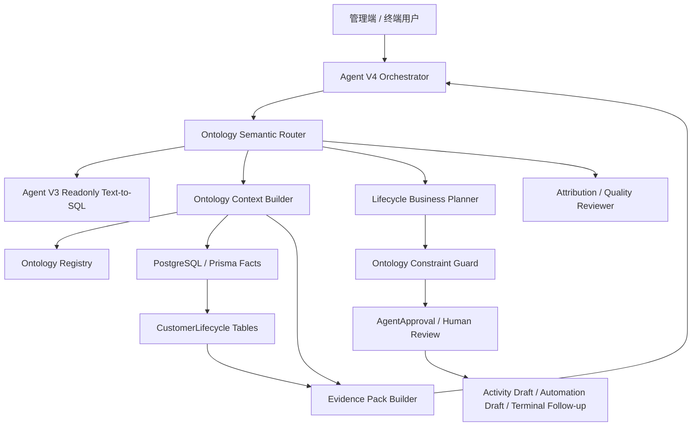

# Ontology 与 Agent 结合技术能力和项目落地方案

> 日期：2026-07-08
> 范围：外部技术研究、落地案例分析、Ami Core / Agent V4 / 客户生命周期小本体后续技术方案
> 结论：本项目不应先上重型图数据库，而应把当前客户生命周期小本体升级成 Agent V4 的“经营语义层 + 受控工具层 + 证据约束层”。图谱/GraphRAG 可作为 P2+ 的投影和增强能力。

## 1. 结论摘要

本体论和 Agent 结合的核心价值，不是“让 AI 多知道一些概念”，而是把业务对象、关系、规则、动作和风险边界变成 Agent 可查询、可计划、可校验、可审计的结构化世界模型。

对本项目最合适的路线是：

1. 保留 Agent V3 作为只读问数底座。
2. 保留 Agent V4 作为生命周期经营 Agent。
3. 把 `CustomerLifecycleOntologyService` 从“生成快照/机会的服务”升级为“本体语义运行时”。
4. 新增本体注册、语义路由、工具清单、约束校验、证据包和质量评估。
5. 仍然坚持安全边界：Agent 不直接发券、不群发、不改客户资产、不扣库存、不创建订单、不改排班。

短期要做的是增强 V4 的确定性和解释性；中期再考虑 GraphRAG；长期才考虑 RDF/OWL 或 Neo4j 这类独立图谱设施。

## 2. 外部技术趋势

### 2.1 从 RAG 到 GraphRAG，再到本体约束 Agent

传统 RAG 偏“文本召回”，适合查资料，但对经营 Agent 不够，因为业务问题通常是多跳关系：客户是谁、处于什么阶段、有什么卡项、做过什么项目、下次护理什么时候、库存能不能承接、触达后有没有预约或成交。

Microsoft GraphRAG 把知识图谱、社区层级和摘要引入 RAG，用于提升私有数据上的全局理解和多跳问题能力。Neo4j、LlamaIndex 也在围绕知识图谱构建、图检索和向量检索混合做工程化工具。这说明行业共识正在从“向量相似度”走向“结构化关系 + 语义召回”。

对本项目的启发：

- 客户生命周期、服务项目、卡项、库存、排期、触达、归因天然是关系网络。
- 但我们的数据主要已经在 PostgreSQL / Prisma 里，不需要一开始搬进图数据库。
- 更稳的做法是先把现有 SQL 数据投影成本体上下文包，给 Agent 使用。

### 2.2 Ontology-to-Tools：把本体变成 Agent 可用工具

2026 年的 `Ontology-to-tools compilation` 研究提出：把本体规格编译成可执行工具接口，让 LLM Agent 在生成和修改知识图谱实例时必须通过这些工具，从而在执行时强制满足语义约束，而不是事后人工检查。

对本项目的启发：

- 不要让 Agent 自由拼 prompt 或自由写 SQL 去决定客户触达。
- 应该把“查询机会、生成计划、提交审批、查看归因、查看规则质量”变成受控工具。
- 工具入参、输出、权限、风险等级都从本体注册表生成或校验。

### 2.3 本体增强 Agent 的典型能力

| 能力 | 说明 | 对本项目价值 |
| --- | --- | --- |
| 术语统一 | 同一业务对象有明确字段、别名、关系和指标口径 | 解决“沉睡客、流失客、高价值客户、护理周期”解释不一致 |
| 语义路由 | 根据问题识别应走问数、机会诊断、计划、归因还是规则治理 | 替代 V4 当前偏规则正则的 intent resolver |
| 受控工具选择 | Agent 只能调用注册过的工具，不直接触碰高风险写操作 | 保持营销、库存、订单边界 |
| 结构化证据包 | 每个结论都带来源表、筛选条件、样本、风险和限制 | 提升可解释性和审计能力 |
| 约束校验 | 用规则校验计划动作是否违反库存、产能、触达疲劳、权限 | 防止“看似合理但不可执行”的建议 |
| 多跳推理 | 从客户 -> 项目 -> 卡项 -> 触达 -> 预约 -> 订单串联证据 | 支撑经营复盘和客户跟进建议 |
| 质量治理 | 统计字段覆盖率、规则命中率、归因完整率 | 知道 Agent 不准是模型问题还是数据问题 |

## 3. 外部落地案例

### 3.1 Palantir AIP + Ontology

Palantir AIP 的核心不是单纯聊天，而是把 AI 连接到企业数据和运营流程。其 Foundry Ontology 强调对象、属性、关系、动作、函数和动态安全，把 AI 放在受控运营层上。

可借鉴点：

- Ontology 是 operational layer，不是只读知识库。
- Agent 要通过业务对象和动作工作，而不是直接暴露数据库。
- 安全、权限、动作边界和审计是本体的一部分。

本项目对应：

- `CustomerLifecycleSnapshot`、`CustomerOpportunity`、`LifecycleBusinessPlan` 是对象层。
- `createLifecycleBusinessPlan`、`submitLifecycleBusinessPlanActions` 是动作层。
- `AgentRun`、`AgentApproval`、`LifecycleAttributionEvent` 是审计和效果层。

### 3.2 ServiceNow Knowledge Graph + AI Agents

ServiceNow Knowledge Graph 把结构化记录、知识库和外部来源组织成语义层，增强 Now Assist、AI Agents 和生成式 AI 技能。它的定位是让 AI 理解企业实体、关系和上下文，而不是只拿文档片段回答。

可借鉴点：

- 企业 Agent 需要语义覆盖层理解业务如何运转。
- 知识图谱和工作流系统要绑定，否则只能问答不能落地。
- CMDB / 工单 / 知识库这类业务事实可以组成 Agent 的上下文网络。

本项目对应：

- 客户、会员卡、订单、服务项目、护理周期、库存、排期、触达、归因就是美业版业务上下文网络。
- V4 应该能回答“为什么这批客户该触达”“哪个动作不能承接”“归因哪里断了”。

### 3.3 Microsoft Copilot + Graph Connectors / GraphRAG

Microsoft 365 Copilot 通过 Graph Connectors 将外部内容同步到 Microsoft Graph 并进行语义索引；GraphRAG 则面向私有文本数据做知识图谱抽取和层级摘要。

可借鉴点：

- 企业 Agent 的知识来源需要被索引、授权、可引用。
- 图结构更适合回答全局问题和多跳关系问题。
- 连接器/索引层不等于执行层，高风险动作仍需工作流控制。

本项目对应：

- 文档、SOP、项目说明、营销规则适合进入 GraphRAG。
- 交易事实仍以 SQL / Prisma 为准。
- V4 回答必须区分“事实表数据”和“文档知识”。

### 3.4 OpenAI Agents SDK / MCP / LangGraph

OpenAI Agents SDK 强调工具循环、handoff、sessions、tracing、guardrails 和 approval flows；MCP 提供 AI 应用连接外部系统的开放协议；LangGraph 强调持久化、人类介入和可恢复的 Agent 工作流。

可借鉴点：

- Agent 不应该只是一次 prompt 调用，而是可追踪、可暂停、可审批的工作流。
- 工具定义、权限、上下文和审计要工程化。
- 对高风险动作应采用 human-in-the-loop。

本项目对应：

- 已有 `AgentRun` / `AgentApproval` 可作为审计和审批基础。
- 未来可把本体工具暴露为内部 tool registry 或 MCP server，但 P1 不必引入外部 MCP 运行时。

## 4. 本项目现状评估

### 4.1 已具备的基础

| 模块 | 当前状态 | 可复用价值 |
| --- | --- | --- |
| Agent V3 | 受控 Text-to-SQL，只读问数 | 做 V4 的数据分析工具，不复制 SQL 逻辑 |
| Agent V4 | 生命周期经营 Agent，支持诊断、计划、审批、归因、质量 | 作为本体增强 Agent 主入口 |
| 客户生命周期小本体 | 已有快照、事件、机会、服务周期、承接校验、归因、规则、质量、经营计划 | 可升级为本体运行时 |
| 智能推荐 | 已能消费生命周期机会，生成推荐卡 | 可作为本体动作落地入口 |
| 终端 Ami Aura | 已接入 V4 runtime | 可做一线门店经营建议和跟进入口 |
| 审批与审计 | 已复用 AgentRun / AgentApproval | 适合承接高风险动作审批 |

### 4.2 当前短板

1. V4 语义路由仍偏关键词和正则，无法稳定理解复杂经营问题。
2. 本体对象和工具没有独立注册表，能力边界散落在 service 代码里。
3. 证据包格式还不统一，不同 intent 的表格和 evidence_panel 粒度不一致。
4. 本体规则虽然有版本表，但还没有真正参与 V4 的计划生成和风险校验。
5. 归因已有轻量事件，但还需要机会级、动作级和计划级汇总。
6. 缺少本体质量诊断对 Agent 输出的显式影响，例如字段覆盖不足时自动降级回答。

## 5. 推荐目标架构



核心设计：

- `Ontology Registry`：登记对象、关系、规则、指标、工具、风险等级。
- `Ontology Context Builder`：按问题生成上下文包，不把全库数据塞给模型。
- `Ontology Semantic Router`：把用户意图映射到本体能力和工具。
- `Ontology Constraint Guard`：在生成计划和提交审批前做库存、产能、触达疲劳、权限校验。
- `Evidence Pack Builder`：统一输出 sources、filters、sampleSize、metrics、risks、limitations。
- `Agent V3 Readonly Tool`：所有临时问数继续走 V3。
- `Approval Runtime`：所有写动作必须进入审批或草稿。

## 6. 数据与模型方案

### 6.1 不建议 P1 立即引入 Neo4j/RDF

原因：

- 当前核心事实数据都在 PostgreSQL，迁移成本高。
- 生命周期小本体是业务闭环，不是开放知识图谱。
- 团队当前更需要稳定交付，而不是新增图数据库运维面。
- Agent 的主要问题是语义路由、证据、工具边界和质量治理，不是图查询性能。

### 6.2 新增轻量本体注册结构

建议优先用 Prisma 表或 JSON 配置，不新增图数据库：

```ts
type OntologyConcept = {
  code: string; // customer, lifecycle_opportunity, service_cycle
  label: string;
  aliases: string[];
  sourceTables: string[];
  keyFields: string[];
  piiLevel: 'none' | 'low' | 'medium' | 'high';
};

type OntologyRelation = {
  code: string; // customer_has_opportunity
  fromConcept: string;
  toConcept: string;
  joinPath: string[];
  cardinality: 'one_to_one' | 'one_to_many' | 'many_to_many';
};

type OntologyCapability = {
  code: string; // lifecycle_diagnosis, business_plan, attribution_review
  intentExamples: string[];
  requiredConcepts: string[];
  tools: string[];
  riskLevel: 'read' | 'draft' | 'approval_required' | 'blocked';
  evidenceRequired: boolean;
};
```

P1 可先写成代码内 registry；P2 再迁移到表：

- `AgentOntologyConcept`
- `AgentOntologyRelation`
- `AgentOntologyCapability`
- `AgentOntologyTool`
- `AgentOntologyConstraint`
- `AgentOntologyEvalCase`

如果担心新增表过多，第一版可放在 `packages/server-v2/src/agent-v4/ontology/*.ts`。

### 6.3 当前生命周期表继续作为事实层

现有表继续保留：

- `CustomerLifecycleSnapshot`
- `CustomerLifecycleEvent`
- `CustomerOpportunity`
- `CustomerServiceCycleState`
- `CustomerOpportunityFulfillmentCheck`
- `LifecycleAttributionEvent`
- `CustomerLifecycleRuleVersion`
- `CustomerLifecycleQualitySnapshot`
- `LifecycleBusinessPlan`

它们是经营本体的事实层，不要被 Agent 直接改写。Agent 只能读取或创建计划/审批。

## 7. Agent V4 升级方案

### 7.1 V4 Intent Resolver 升级为本体语义路由

当前：关键词判断。

目标：

```ts
type OntologyRoute = {
  intent: 'readonly_query' | 'lifecycle_diagnosis' | 'business_plan' | 'submit_business_plan' | 'attribution_review' | 'quality_review' | 'rule_explain';
  confidence: number;
  concepts: string[];
  requiredTools: string[];
  missingInputs: string[];
  riskLevel: 'read' | 'draft' | 'approval_required' | 'blocked';
};
```

路由策略：

1. 先用规则匹配高确定性意图，如“提交审批”“生成经营计划”。
2. 再用本体概念词典识别对象，如客户、护理周期、次卡、库存、产能、归因。
3. 最后可用小模型/LLM 做 route classification，但必须输出结构化 JSON。
4. confidence 低于阈值时让用户确认，不自动执行计划。

### 7.2 V4 工具清单本体化

建议形成工具注册：

| 工具 | 风险 | 说明 |
| --- | --- | --- |
| `lifecycle.listOpportunities` | read | 查询客户机会 |
| `lifecycle.getCustomerContext` | read | 单客户上下文 |
| `lifecycle.listServiceCycles` | read | 服务周期 |
| `lifecycle.listAttribution` | read | 归因事件 |
| `lifecycle.getQuality` | read | 本体质量 |
| `lifecycle.createBusinessPlan` | draft | 生成经营计划草稿 |
| `lifecycle.submitBusinessPlanActions` | approval_required | 提交审批 |
| `agentV3.readonlyQuery` | read | 受控 SQL 问数 |
| `marketing.createActivityDraft` | approval_required | 审批后创建活动草稿 |
| `terminal.createFollowupTask` | approval_required | 审批后创建跟进任务 |

禁止工具：

- 直接发券。
- 直接群发。
- 直接改客户资产。
- 直接扣库存。
- 直接创建订单。
- 直接改排班。

### 7.3 Evidence Pack 统一

所有 V4 输出统一附带：

```ts
type OntologyEvidencePack = {
  sources: string[];
  concepts: string[];
  filters: string[];
  sampleSize: number;
  metrics: Record<string, number | string>;
  facts: Array<{
    source: string;
    id?: string | number;
    label: string;
    value?: string | number;
    occurredAt?: string;
  }>;
  risks: string[];
  limitations: string[];
  quality: {
    fieldCoverageRate?: number;
    ruleHitRate?: number;
    attributionCompletenessRate?: number;
  };
};
```

这样产品上能解释：

- 为什么推荐这批客户。
- 数据来自哪里。
- 哪些字段缺失。
- 哪些风险导致不能直接承接。
- 为什么需要审批。

### 7.4 经营计划生成升级

从“拿机会生成动作”升级为四步：

1. 机会聚合：按机会类型、阶段、执行方式、风险聚合。
2. 承接校验：库存、产能、触达疲劳、权益成本。
3. 动作编排：活动草稿、自动规则草稿、顾问跟进任务。
4. 审批说明：收益预估、风险控制、证据链、禁止动作边界。

输出结构：

```ts
type OntologyBusinessPlanAction = {
  actionType: 'activity_draft' | 'automation_draft' | 'terminal_follow_up_task';
  opportunityType: string;
  targetCustomerCount: number;
  customerSegment: string;
  objective: string;
  evidence: OntologyEvidencePack;
  fulfillment: {
    inventoryReady: boolean;
    capacityReady: boolean;
    riskWarnings: string[];
  };
  approvalRequired: true;
};
```

### 7.5 归因复盘升级

当前已能汇总 `LifecycleAttributionEvent`。下一步建议做三层复盘：

| 层级 | 问题 | 口径 |
| --- | --- | --- |
| 事件层 | 发生了哪些触达、浏览、预约、核销、订单 | `LifecycleAttributionEvent` |
| 机会层 | 某类机会转化如何 | `CustomerOpportunity + LifecycleAttributionEvent` |
| 计划层 | 某个经营计划带来什么结果 | `LifecycleBusinessPlan.approvalJson + attribution recommendationKey` |

需要补充：

- `recommendationKey` 标准化：`lifecycle:{opportunityType}:{planId?}:{actionId?}`。
- 计划动作和归因事件关联。
- 推荐卡/经营计划展示转化漏斗。

## 8. 前端与终端体验

### 8.1 管理端 Ami Agent

V4 模式新增三类固定入口：

- “诊断本周客户机会”
- “生成经营计划”
- “复盘最近触达效果”

回答卡片要显示：

- 本体概念：机会类型、客户阶段、服务周期。
- 证据：来源表、筛选条件、样本数。
- 风险：库存、产能、触达疲劳、数据质量。
- 动作：生成草稿、提交审批、查看客户列表。

### 8.2 Ami Aura 终端

终端侧更适合做“轻动作”：

- 今日重点跟进客户。
- 哪些客户到护理周期。
- 哪些客户领券未核销。
- 哪些客户适合顾问一对一邀约。

终端禁止：

- 一键群发。
- 一键改卡。
- 一键扣库存。
- 一键创建订单。

### 8.3 智能推荐页

推荐卡应从“推荐原因”升级为“本体证据”：

- 机会类型。
- 目标客户数。
- 命中规则版本。
- 承接校验。
- 归因链。
- 可执行入口。

## 9. 分阶段实施计划

### P1：本体语义层增强，2-3 周

目标：不新增图数据库，增强 V4 的确定性。

任务：

1. 新增 `agent-v4/ontology` registry。
2. 抽象 `OntologySemanticRouterService`。
3. 抽象 `OntologyEvidencePackBuilder`。
4. 抽象 `OntologyToolRegistry`。
5. V4 intent 从正则升级为规则 + 概念词典 + 结构化分类。
6. 统一 V4 各类输出 evidence pack。
7. 给经营计划动作绑定 `recommendationKey`。
8. 单测覆盖路由、工具选择、证据包、禁止动作。

验收：

- V4 能稳定区分问数、诊断、计划、归因、质量。
- 每个回答都有统一 evidence pack。
- 高风险动作被阻断或进入审批。
- 旧 V3 不受影响。

### P2：本体治理和质量闭环，3-4 周

目标：让本体规则、质量和 Agent 输出形成闭环。

任务：

1. 规则版本真正参与计划生成。
2. 本体质量快照影响 V4 输出可信度。
3. 新增本体质量页或并入 Agent 治理中心。
4. 新增 V4 无用诊断：路由错、数据缺、规则缺、工具失败、审批失败。
5. 归因从事件层扩展到机会层、计划层。
6. 增加 eval case：同一问题在不同数据质量下的正确降级。

验收：

- 数据缺失时 V4 明确说缺什么，而不是泛泛回答。
- 规则变更可追踪、可回滚。
- 经营计划有计划级归因。
- Agent 治理中心能看到 V4 的失败原因分布。

### P3：GraphRAG / 图谱投影，4-6 周，可选

目标：增强多跳关系和文档知识，不替代主业务库。

适用场景：

- SOP、项目知识、产品说明、营销话术、护理禁忌需要语义检索。
- 需要跨文档、跨客户、跨项目做复杂关系探索。
- 需要可视化客户关系和经营关系网络。

建议路线：

1. 先做只读图谱投影，不作为交易事实源。
2. 从 PostgreSQL 生成 `Customer -> Opportunity -> Action -> Attribution` 图。
3. 文档知识用 GraphRAG；交易事实仍查 SQL。
4. 图谱结果只做证据增强，不直接驱动写操作。

技术选型：

- 轻量：PostgreSQL materialized view + JSON graph projection。
- 中量：Neo4j / Memgraph 作为只读投影。
- 文档知识：LlamaIndex / Microsoft GraphRAG 思路。

## 10. 风险与控制

| 风险 | 影响 | 控制方式 |
| --- | --- | --- |
| 本体过度设计 | 延误交付 | P1 只做 registry + router + evidence，不上重图数据库 |
| Agent 误执行动作 | 业务风险 | 工具风险分级 + 审批 + 禁止工具 |
| 数据质量不足 | 回答不准 | quality snapshot 参与回答可信度 |
| 归因被误当财务结算 | 经营误判 | 标注轻量归因，不作为财务结算依据 |
| 图谱与 SQL 不一致 | 决策错误 | 图谱只读投影，SQL 为事实源 |
| 工具过多导致上下文膨胀 | 成本上升 | 按本体路由动态加载工具 |

## 11. 推荐下一步

建议下一轮开发不直接上 Neo4j，也不新做“本体管理大页面”，而是做 Agent V4 的本体化增强：

1. `OntologySemanticRouterService`
2. `OntologyToolRegistry`
3. `OntologyEvidencePackBuilder`
4. `OntologyConstraintGuard`
5. V4 运行详情增强：显示 intent、concepts、tools、evidence、constraints、approval boundary。

这会直接提升当前产品体验：用户问“本周该做什么”“为什么推荐这些客户”“触达效果怎样”“哪些数据不完整”时，V4 会从业务语义层回答，而不是只靠关键词路由和零散表格。

## 12. 参考资料

- W3C RDF Primer：<https://www.w3.org/TR/rdf11-primer/>
- W3C OWL 2 Primer：<https://www.w3.org/TR/owl2-primer/>
- W3C SPARQL 1.1 Query Language：<https://www.w3.org/TR/sparql11-query/>
- Microsoft GraphRAG：<https://microsoft.github.io/graphrag/>
- Microsoft Research GraphRAG：<https://www.microsoft.com/en-us/research/project/graphrag/>
- Neo4j GraphRAG Python Package：<https://neo4j.com/developer/genai-ecosystem/graphrag-python/>
- LlamaIndex Knowledge Graph RAG Query Engine：<https://developers.llamaindex.ai/python/examples/query_engine/knowledge_graph_rag_query_engine/>
- Palantir AIP Overview：<https://palantir.com/docs/foundry/aip/overview/>
- ServiceNow Knowledge Graph：<https://www.servicenow.com/docs/r/intelligent-experiences/knowledge-graph/knowledge-graph-landing.html>
- Microsoft 365 Copilot Connectors：<https://learn.microsoft.com/en-us/microsoft-365/copilot/extensibility/overview-copilot-connector>
- OpenAI Agents SDK：<https://developers.openai.com/api/docs/guides/agents>
- Model Context Protocol：<https://modelcontextprotocol.io/docs/getting-started/intro>
- LangGraph Human-in-the-loop：<https://docs.langchain.com/oss/python/langchain/human-in-the-loop>
- Ontology-to-tools compilation for executable semantic constraint enforcement in LLM agents：<https://arxiv.org/abs/2602.03439>
- Graphs Meet AI Agents：<https://arxiv.org/html/2506.18019v1>
- Agent-OM: Leveraging LLM Agents for Ontology Matching：<https://arxiv.org/html/2312.00326v21>
- Ontology-Guided Evidence Path Inference for Multi-hop KGQA：<https://arxiv.org/html/2606.28076v1>
