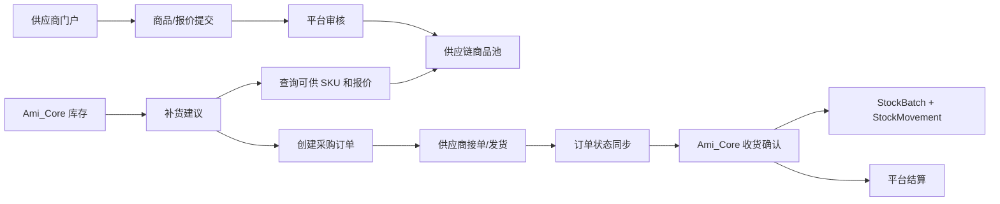

# 供应链平台 MVP 详细开发计划

版本：v1.2
日期：2026-06-21
关联方案：`docs/02-产品设计/供应链平台一站式供货方案.md`
适用范围：独立供应链平台、Ami_Core 管理端库存管理、server-v2、供应商门户、Ami Aura Lite 经营提醒

## 1. 开发结论

本次供应链建设不能继续按“管理端新增几个供应链页面”的方式推进。最新产品口径是：

> 供应链平台独立承载供应商、商品上架、报价、供货、履约、结算；Ami_Core 管理端只在库存管理中保留补货建议、采购下单、状态查询和收货入库。

因此开发计划分成两条主线：

1. 供应链平台主线：建设独立供应商门户、平台运营后台、商品中心、报价中心、采购履约、结算中心。
2. Ami_Core 集成主线：库存管理改造成供应链平台的调用方，保留真实库存主账和收货入库，不再承载供应商运营后台。

首期目标不是完整电商平台，而是打通最小闭环：

```text
供应商上架商品 -> 平台审核报价 -> Ami_Core 库存补货 -> 供应链平台接单发货 -> 门店收货入库 -> 供应商结算
```

## 1.1 当前执行状态

截至 2026-06-21，本计划已从“方案态”进入 MVP 落地态，当前完成情况如下：

| 范围 | 状态 | 交付影响 |
| --- | --- | --- |
| 供应链平台数据模型 | 已落地 | `SupplySupplier`、`SupplySku`、`SupplyQuote`、`SupplyCatalogMapping`、`ProcurementOrder`、`SupplierShipment`、`SupplySettlement` 已进入 Prisma schema 和 migration |
| 供应链平台后端 API | 已落地 P0 | 供应商、商品、报价、映射、平台采购单、发货、收货、结算接口已在 `server-v2` 暴露 |
| 库存补货接入 | 已落地 P0 | `InventoryService.getReplenishment()` 已读取平台 SKU/报价和平台在途数量 |
| 管理端库存采购 | 已落地 P0 | `/inventory/purchase` 可从补货建议生成平台供货订单，并查看平台订单状态/收货入库 |
| 供应链平台前端 | 已落地 MVP 入口 | `/supply-platform` 新增平台 MVP 页面，覆盖供应商、商品上架、报价审核、发货、结算的最小操作 |
| 供应商履约操作 | 已落地 MVP | 供应商账号可对自己的待确认订单接单/拒单，已接单订单可发货；供应商不能推进结算、取消等平台运营状态 |
| API 契约 | 已同步 | `docs/api-contract.md` 已写明供应链平台与 Ami_Core 库存边界 |
| 供应商独立账号体系 | 已落地 MVP | 新增 `supplier_admin` 角色、`core:supply:supplier` 权限、`User.supplySupplierId` 绑定、JWT 供应商身份和后端数据隔离 |
| 历史数据迁移 | 已有脚本，待真实执行 | 已新增 audit/backfill/verify 脚本；真实写库迁移需单独授权并执行 `--apply --yes` |
| 附件和驳回原因 UI | 已落地 MVP | `/supply-platform` 支持供应商资质 URL、商品图片 URL、商品资质 URL 录入，并支持商品/报价驳回原因填写和回显 |
| 端到端真实数据验收 | 脚本已就绪，待迁移/授权写库 | 已新增 `supply-platform:mvp-flow:*` 命令；dry-run 可返回阻断报告。当前连接数据库缺供应链平台表，演示门店/商品就绪检查因缺表被跳过；需先部署 migration，再授权执行真实闭环 |

## 2. 当前基线

### 2.1 当前已有代码基础

| 能力 | 当前位置 | 判断 |
| --- | --- | --- |
| 库存主账 | `Product.currentStock`、`StockBatch`、`StockMovement` | 保留在 Ami_Core |
| 低库存建议 | `packages/server-v2/src/inventory/inventory.service.ts#getReplenishment` | 保留入口，但改为读取供应链平台可供 SKU 和报价 |
| 旧采购单 | `PurchaseOrder`、`src/app/pages/PurchaseManagement.tsx` | 仅历史兼容，新增主线不再使用 |
| 供应商模型 | `Supplier`、`ProductSupplier` | 迁移/演进为供应链平台模型 |
| 供应链订单 | `SupplierOrder`、`SupplierOrderItem` | 过渡可复用，长期升级为平台采购订单 |
| 供应商结算 | `SupplierSettlement` | 迁移到供应链平台结算中心 |
| 管理端供应链页面 | `src/app/pages/supply-chain/*` | 标记为过渡后台，后续迁出 |
| 供应链 API | `packages/server-v2/src/supply-chain/*`、`src/api/real/supply-chain.ts` | 可作为 MVP 过渡实现，后续抽成独立 bounded context |

### 2.2 当前主要缺口

| 缺口 | 交付影响 |
| --- | --- |
| 无供应商自助账号和门户 | 供应商不能自行上架、报价、接单、发货 |
| 无平台级 `SupplySku` / `SupplyQuote` | 目前是门店商品绑定供应商，不是真正供货商品池 |
| 管理端仍有供应商/结算页面 | 产品边界会混乱，普通门店可能看到不该看的供应链运营能力 |
| 补货建议未读取供应链平台报价和在途履约 | 不能做到可信一键补货 |
| 收货入库与平台订单关系不完整 | 库存流水无法稳定追溯到平台订单、发货单、供应商 SKU |
| 结算未与供应商门户闭合 | 供应商无法自助对账，平台服务费和返利难运营 |

## 3. 目标架构

### 3.1 系统边界

| 系统 | 负责 | 不负责 |
| --- | --- | --- |
| 供应链平台 | 供应商、商品上架、报价、接单、发货、售后、结算、平台运营 | 门店库存主账、项目 BOM、服务扣耗、销售出库 |
| Ami_Core | 门店商品档案、库存数量、批次效期、服务/销售扣库存、补货建议、收货入库 | 供应商资质审核、报价管理、供应商结算 |
| Ami Aura Lite | 展示库存风险、待收货提醒、异常提醒 | 维护供应商、处理结算 |

### 3.2 数据流



## 4. 阶段总览

| 阶段 | 周期 | 目标 | 关键验收 |
| --- | --- | --- | --- |
| Phase 0 | 1 周 | 边界冻结和技术预备 | API 边界、迁移清单、菜单策略明确 |
| Phase 1 | 2 周 | 供应链平台数据底座 | Supplier、SupplySku、SupplyQuote、映射模型可用 |
| Phase 2 | 2 周 | 供应商门户和商品上架 | 供应商可提交商品和报价，平台可审核 |
| Phase 3 | 2 周 | Ami_Core 库存补货接入 | 库存补货可查询供应链 SKU 并创建采购订单 |
| Phase 4 | 2 周 | 履约、发货、收货入库 | 供应商发货后门店可收货入库并写库存流水 |
| Phase 5 | 2 周 | 结算和运营看板 | 已收货订单可生成结算，平台可看 GMV 和收入 |
| Phase 6 | 1 周 | 灰度、迁移、发布验收 | 历史采购兼容，新主线闭环稳定 |

建议总工期：12 周。若只做演示 MVP，可压缩到 6 周，优先完成 Phase 0、1、2、3、4 的 P0 子集。

## 5. Phase 0：边界冻结和技术预备

### 5.1 产品与权限边界

任务：

- 确认 `/supply-chain/*` 在 Ami_Core 管理端为过渡入口，不作为长期供应链平台主入口。
- 确认 `/inventory/purchase` 是门店侧唯一供货入口。
- 确认供应商、商品上架、报价、发货、结算都迁到独立供应链平台。
- 确认普通门店角色不可见供应商结算、平台服务费、供应商返利明细。

涉及文件：

- `docs/02-产品设计/供应链平台一站式供货方案.md`
- `docs/api-contract.md`
- `src/app/components/Layout.tsx`
- `src/app/routes.tsx`
- `src/config/permissions.ts`

交付物：

- API 边界文档。
- 管理端菜单迁移说明。
- 权限矩阵。
- 历史采购单兼容策略。

验收：

- 文档明确写出“供应链平台 owns 什么，Ami_Core owns 什么”。
- `/inventory/purchase` 和 `/supply-chain/*` 的长期定位不再冲突。

### 5.2 技术路径选择

推荐先采用“同仓库独立模块、后续可拆服务”的路径：

- MVP 阶段继续复用 `packages/server-v2`，新增 `supply-platform` bounded context。
- 前端可以先在主前端下新增独立路由和布局，后续再拆独立应用。
- 数据模型先在同一个 Prisma schema 内落地，但命名和权限按独立平台设计。

原因：

- 当前已有 `server-v2`、鉴权、权限、Prisma、API client 和页面框架。
- 首期重点是打通业务闭环，不应先耗在服务拆分和部署治理。
- 模型命名先隔离，可以降低未来拆服务成本。

## 6. Phase 1：供应链平台数据底座

### 6.1 Prisma 模型设计

新增或演进模型：

```text
SupplySupplier
- id
- name
- companyName
- contactName
- phone
- email
- serviceRegions
- categories
- qualificationStatus
- settlementMode
- paymentTerms
- status
- createdAt
- updatedAt
- deletedAt

SupplierQualification
- id
- supplierId
- type
- fileUrl
- fileName
- status
- reviewedBy
- reviewedAt
- rejectReason
- expiresAt

SupplySku
- id
- supplierId
- categoryId
- name
- brand
- spec
- unit
- barcode
- images
- shelfLife
- qualificationFiles
- status
- auditStatus
- reviewedBy
- reviewedAt
- rejectReason
- createdAt
- updatedAt

SupplyQuote
- id
- supplySkuId
- supplierId
- price
- taxIncluded
- moq
- leadDays
- stockStatus
- availableStock
- regionScope
- storeScope
- validFrom
- validTo
- status
- auditStatus

SupplyCatalogMapping
- id
- supplySkuId
- productId
- storeId
- standardProductTemplateId
- mappingStatus
- isPreferred
- createdAt
- updatedAt
```

可复用/演进现有模型：

- `Supplier` -> 可迁移为 `SupplySupplier` 或保留并增加平台字段。
- `ProductSupplier` -> 演进为 `SupplyQuote` + `SupplyCatalogMapping`。
- `SupplierOrder` -> Phase 3/4 演进为 `ProcurementOrder`。

涉及文件：

- `packages/server-v2/prisma/schema.prisma`
- `packages/server-v2/prisma/migrations/*`
- `packages/server-v2/src/supply-chain/*` 或新增 `packages/server-v2/src/supply-platform/*`

验收：

- Prisma migration 可执行。
- 新模型支持供应商、商品、报价、映射四类核心数据。
- 不破坏现有 `Product`、`StockMovement`、`PurchaseOrder` 查询。

### 6.2 后端模块

新增模块建议：

```text
packages/server-v2/src/supply-platform/
- supply-platform.module.ts
- suppliers.controller.ts
- suppliers.service.ts
- skus.controller.ts
- skus.service.ts
- quotes.controller.ts
- quotes.service.ts
- mappings.controller.ts
- mappings.service.ts
- dto/
```

P0 API：

| 方法 | 路径 | 说明 |
| --- | --- | --- |
| `GET` | `/supply-platform/suppliers` | 平台运营查询供应商 |
| `POST` | `/supply-platform/suppliers` | 创建供应商或供应商注册后补资料 |
| `PATCH` | `/supply-platform/suppliers/:id/status` | 审核/冻结/启用 |
| `GET` | `/supply-platform/skus` | 查询供应链 SKU |
| `POST` | `/supply-platform/skus` | 供应商提交商品 |
| `PATCH` | `/supply-platform/skus/:id/audit` | 平台审核商品 |
| `GET` | `/supply-platform/quotes` | 查询报价 |
| `POST` | `/supply-platform/quotes` | 供应商提交报价 |
| `PATCH` | `/supply-platform/quotes/:id/audit` | 平台审核报价 |
| `POST` | `/supply-platform/mappings` | 供应链 SKU 绑定 Ami_Core 商品 |

验收：

- API 支持门店隔离、供应商隔离和平台运营权限。
- 审核未通过的 SKU/报价不能被 Ami_Core 补货接口调用。

## 7. Phase 2：供应商门户和商品上架

### 7.1 供应商账号与登录

P0：

- 供应商注册。
- 供应商登录。
- 供应商资料页。
- 资质附件上传。
- 审核状态展示。

MVP 实现：

- 复用现有登录体系，新增 `supplier_admin` 角色。
- 新增 `core:supply:supplier` 权限，只允许供应商自助维护自己的资料、商品、报价、发货和对账。
- `User.supplySupplierId` 绑定供应商主档，登录和 JWT 返回 `supplySupplierId`、`supplySupplierName`。
- 后端 `supply-platform` service 按 `supplySupplierId` 自动收敛查询条件，供应商账号不能传入其他 `supplierId` 读取或写入数据。
- 平台审核、启停供应商、生成月结仍要求 `core:supply:manage`，供应商账号不可执行。

后续独立门户拆分时，可以沿用该账号绑定和作用域模型，只替换前端入口与登录页。

前端页面：

```text
src/app/pages/supply-platform/
- SupplierPortalLogin.tsx
- SupplierProfile.tsx
- SupplierQualification.tsx
- SupplierSkuManagement.tsx
- SupplierQuoteManagement.tsx
```

产品验收：

- 供应商只看自己的资料、商品、报价和订单。
- 供应商不能访问 Ami_Core 门店客户、订单、库存和财务。
- 当前 MVP 已在 `/supply-platform` 根据登录账号自动进入供应商视图；独立供应商登录页可作为 P1 UI 拆分项，不阻塞 MVP 闭环。

### 7.2 商品上架

P0 表单字段：

| 字段 | 说明 |
| --- | --- |
| 商品名称 | 必填 |
| 品牌 | 可选 |
| 规格 | 必填 |
| 单位 | 必填 |
| 类目 | 必填 |
| 条码 | 可选 |
| 图片 | 可选 |
| 保质期 | 可选 |
| 资质附件 | 部分品类必填 |
| 起订量 | 可在报价里维护 |
| 商品说明 | 可选 |

状态流转：

```text
草稿 -> 待审核 -> 已上架
草稿 -> 待审核 -> 驳回
已上架 -> 已下架
已上架 -> 锁定
```

验收：

- 供应商可提交商品。
- 平台运营可审核、驳回、下架。
- 未审核商品不进入 Ami_Core 可采购列表。

### 7.3 报价维护

P0 字段：

| 字段 | 说明 |
| --- | --- |
| 供货价 | 必填 |
| 是否含税 | 必填 |
| MOQ | 必填 |
| 交期天数 | 必填 |
| 可供库存 | 可选 |
| 区域范围 | 必填，可先全国 |
| 有效期 | 必填 |
| 报价状态 | 草稿、待审核、有效、过期、下架 |

验收：

- 供应商可对已审核 SKU 提交报价。
- 平台审核后，Ami_Core 才能查询到报价。
- 报价过期后不参与补货建议。

## 8. Phase 3：Ami_Core 库存补货接入

### 8.1 新增供应链平台 API client

建议新增：

```text
src/api/real/supplyPlatform.ts
src/api/supplyPlatform.ts
src/types/supplyPlatform.ts
```

如果后端仍在同一 `server-v2`，也要按“外部平台接口”封装，避免页面直接调用旧 `supply-chain` 业务对象。

P0 方法：

```text
getSupplySkus(params)
getSupplyQuotes(params)
createProcurementOrder(payload)
getProcurementOrder(id)
getProcurementOrders(params)
confirmProcurementReceipt(orderId, payload)
```

### 8.2 改造补货建议

后端：

- `InventoryService.getReplenishment()` 保留为 Ami_Core 入口。
- 新增供应链报价查询逻辑：
  - 先按 `SupplyCatalogMapping` 找本地 `Product` 绑定的 `SupplySku`。
  - 再找有效 `SupplyQuote`。
  - 计算 MOQ、交期、预计金额。
- 新增在途数量：
  - 从平台采购订单镜像或平台接口读取未收货数量。
  - 已取消、已拒单、已全部收货不计入。

涉及文件：

- `packages/server-v2/src/inventory/inventory.service.ts`
- `packages/server-v2/src/inventory/inventory.controller.ts`
- `src/api/real/inventory.ts`
- `src/types/inventory.ts`
- `src/app/pages/PurchaseManagement.tsx`

补货建议字段建议：

```text
productId
productName
sku
currentStock
safetyStock
recentConsumption30d
inTransitQty
suggestedQty
supplySkuId
supplySkuName
supplierId
supplierName
quoteId
supplyPrice
moq
leadDays
estimatedAmount
reason
availabilityStatus
```

验收：

- 有供应链报价时，补货建议展示供应商、价格、MOQ、交期。
- 无供应链报价时，展示“暂无平台供货，可手动采购”。
- 已在途采购会减少建议补货量。

### 8.3 改造 `/inventory/purchase`

页面定位：

- Tab 1：补货建议。
- Tab 2：平台供货订单。
- Tab 3：历史手动采购单。

P0 交互：

1. 店长选择补货建议。
2. 系统按供应商和报价分组。
3. 店长确认数量和期望到货日期。
4. 创建供应链平台采购订单。
5. 页面跳转到平台供货订单状态。

不做：

- 不在管理端维护供应商商品。
- 不在管理端维护报价。
- 不在管理端展示供应商结算。

验收：

- 新增采购主线不再创建旧 `PurchaseOrder`。
- 旧 `PurchaseOrder` 只作为历史数据可查。

## 9. Phase 4：履约、发货、收货入库

### 9.1 采购订单模型

建议新增或演进：

```text
ProcurementOrder
- id
- orderNo
- storeId
- supplierId
- status
- totalAmount
- expectedArrivalDate
- sourceType: replenishment | manual | bom_forecast
- createdBy
- createdAt
- updatedAt

ProcurementOrderItem
- id
- orderId
- productId
- supplySkuId
- quoteId
- quantity
- unitPrice
- subtotal
- receivedQty

SupplierShipment
- id
- orderId
- supplierId
- shipmentNo
- logisticsCompany
- trackingNo
- status
- shippedAt
- expectedArrivalAt

SupplierShipmentItem
- id
- shipmentId
- orderItemId
- supplySkuId
- shippedQty
- batchNo
- productionDate
- expiryDate
```

### 9.2 供应商接单和发货

供应商门户 P0：

- 待接单列表。
- 接单/拒单。
- 填写发货明细。
- 支持部分发货。
- 填物流、批次、生产日期、效期。

状态流转：

```text
pending_supplier_confirm -> accepted -> shipped -> partial_received -> received -> settlement_pending
pending_supplier_confirm -> rejected
accepted -> cancelled
```

验收：

- 供应商接单后，Ami_Core 采购状态同步为已接单。
- 供应商发货后，Ami_Core 可看到物流、发货数量、预计到货。

### 9.3 门店收货入库

Ami_Core 收货动作：

1. 读取采购订单和发货单。
2. 确认实收数量。
3. 若本地 `Product` 未映射，引导创建商品或绑定已有商品。
4. 写 `StockBatch`。
5. 写 `StockMovement`。
6. 更新 `Product.currentStock`。
7. 通知供应链平台确认收货。

涉及文件：

- `packages/server-v2/src/inventory/inventory.service.ts`
- `packages/server-v2/src/supply-platform/procurement.service.ts`
- `src/app/pages/PurchaseManagement.tsx`
- `src/api/real/inventory.ts`
- `src/api/real/supplyPlatform.ts`

库存流水口径：

```text
movementType = purchase_inbound
sourceType = supply_platform_order
sourceId = procurementOrderId 或本地镜像 ID
sourceNo = 平台采购订单号
remark = 收货差异和异常备注
```

验收：

- 收货后 `Product.currentStock` 增加。
- 新增 `StockBatch`。
- 新增 `StockMovement`。
- 库存流水能追溯平台订单号、供应商、发货批次。

## 10. Phase 5：结算和运营看板

### 10.1 供应商结算

P0：

- 按月生成供应商结算单。
- 汇总已收货订单。
- 计算订单金额、平台服务费、供应商返利、异常扣款、应付金额。
- 平台确认。
- 供应商查看并确认。
- 标记付款。

模型建议：

```text
SupplySettlement
- id
- supplierId
- settleMonth
- orderCount
- totalAmount
- rebateAmount
- platformFee
- adjustmentAmount
- netPayable
- status
- confirmedAt
- supplierConfirmedAt
- paidAt
```

页面：

- 平台运营：结算列表、结算详情、生成结算、确认、标记付款。
- 供应商门户：我的对账单、确认对账、导出。

不在 Ami_Core 展示：

- 供应商返利。
- 平台服务费。
- 供应商应收细节。

### 10.2 平台运营看板

P0 指标：

| 指标 | 说明 |
| --- | --- |
| 供货 GMV | 已收货采购订单金额 |
| 平台收入 | 平台服务费 + 返利 |
| 订单履约率 | 按时接单、按时发货、按时到货 |
| 缺货率 | 供应商拒单、缺货、少发占比 |
| 供应商评分 | 价格、履约、售后、质量 |
| 门店节省金额 | 平台供货价与门店历史采购价/市场价对比 |

## 11. Phase 6：迁移、灰度和发布

### 11.1 历史数据迁移

迁移策略：

- `PurchaseOrder` 保留历史查询，不删除。
- `Supplier`、`ProductSupplier` 可迁入供应链平台数据底座。
- `SupplierOrder` 可转换为 `ProcurementOrder` 或保留为历史平台订单。
- `SupplierSettlement` 可迁为 `SupplySettlement`。

脚本建议：

```text
packages/server-v2/prisma/supply-platform-migration-audit.ts
packages/server-v2/prisma/supply-platform-migration-backfill.ts
packages/server-v2/prisma/supply-platform-migration-verify.ts
```

验收：

- 迁移前可 dry-run。
- 迁移后供应商数量、商品映射数量、订单数量、结算数量可核对。
- 老采购单仍能查。

### 11.2 灰度策略

灰度顺序：

1. 内部演示门店。
2. 单门店真实测试。
3. 3-5 家门店试点。
4. 连锁总部试点。
5. 开放供应商自助入驻。

灰度开关：

| 开关 | 作用 |
| --- | --- |
| `supplyPlatformEnabled` | 是否启用供应链平台采购 |
| `legacyPurchaseOrderEnabled` | 是否允许创建旧采购单 |
| `supplierPortalEnabled` | 是否开放供应商门户 |
| `supplySettlementEnabled` | 是否启用供应商结算 |

## 12. 测试计划

### 12.1 后端单测

重点文件：

- `packages/server-v2/src/supply-platform/*.spec.ts`
- `packages/server-v2/src/inventory/inventory.service.spec.ts`

用例：

- 供应商提交商品。
- 平台审核商品。
- 供应商提交报价。
- 报价过期不参与补货。
- 补货建议读取 MOQ、交期和价格。
- 创建采购订单。
- 供应商接单/拒单。
- 供应商发货。
- 门店收货入库。
- 部分收货。
- 收货数量超过发货数量时报错。
- 已收货订单进入结算。

### 12.2 前端测试

重点：

- 供应商门户表单校验。
- 商品上架状态流转。
- 报价审核状态。
- `/inventory/purchase` 一键补货。
- 收货入库弹窗。
- 无可供 SKU 的降级展示。
- 权限不可见性。

### 12.3 集成验收

必须跑通：

```text
供应商注册
-> 商品上架
-> 报价审核
-> Ami_Core 低库存建议
-> 一键创建采购订单
-> 供应商接单发货
-> 门店收货入库
-> 库存流水追溯
-> 供应商结算
```

建议验证命令：

```powershell
npm.cmd run check:api
npx.cmd vitest run src/test/api.test.ts
Set-Location "packages/server-v2"; npm.cmd run test; npm.cmd run build
```

## 13. 发布门禁

上线前必须满足：

| 门禁 | 标准 |
| --- | --- |
| API 契约 | `docs/api-contract.md` 已更新 |
| 权限 | 供应商、平台运营、门店角色互相隔离 |
| 数据 | 迁移 dry-run 和 verify 通过 |
| 库存 | 收货入库能写批次、流水、当前库存 |
| 追溯 | 库存流水能追溯平台订单和发货单 |
| 兼容 | 旧采购单可查，新采购默认走供应链平台 |
| 测试 | 后端供应链和库存相关单测通过 |
| 前端 | 补货、下单、收货核心流程手动验收通过 |

## 14. 风险与处理

| 风险 | 影响 | 处理 |
| --- | --- | --- |
| 供应链平台和 Ami_Core 边界再次混淆 | 管理端继续膨胀，供应商无法自助运营 | Phase 0 先冻结边界，菜单和权限先标记过渡 |
| 供应商商品数据质量差 | 门店补货选择困难 | 平台审核、类目标准化、必填规格单位 |
| 报价频繁变化 | 补货金额不可信 | 报价有效期、历史价格、下单锁价 |
| 本地商品与供应链 SKU 映射困难 | 无法自动入库 | 收货时支持创建本地商品或绑定已有商品 |
| 门店不愿维护库存 | 补货建议不准 | 继续强化服务扣耗、销售扣库存、轻盘点 |
| 结算过早复杂化 | 工期膨胀 | MVP 先做已收货订单月结，不做复杂发票和退款 |

## 15. 任务拆分清单

### P0 任务

- [x] 更新 `docs/api-contract.md`，明确供应链平台和 Ami_Core 库存边界。
- [x] 新增供应链平台数据模型和 migration。
- [x] 新增供应商门户账号/权限。已新增 `supplier_admin`、`core:supply:supplier`、`User.supplySupplierId` 供应商绑定和 JWT 供应商身份。
- [x] 新增供应商资料和资质审核。后端接口已落地；前端 MVP 已支持供应商资料创建和资质 URL 提交。
- [x] 新增供应商商品上架。
- [x] 新增报价维护和审核。
- [x] 新增 Ami_Core 查询可供 SKU/报价接口。
- [x] 改造 `InventoryService.getReplenishment()`。
- [x] 改造 `/inventory/purchase`，新增平台供货订单主线。
- [x] 新增采购订单创建接口。
- [x] 新增供应商接单/发货接口。供应商自助账号可接单/拒单自己的待确认订单，已接单订单可发货。
- [x] 新增门店收货入库接口。
- [x] 新增库存流水追溯字段或展示。后端收货已写 `movementType=purchase_inbound`、`sourceType=supply_platform_order`、`sourceNo=平台采购单号`；`/inventory/purchase` 订单详情已按平台订单 ID 展示库存入库流水。
- [x] 新增供应商月结。
- [x] 补齐后端单测和 API 测试。已新增供应链平台 service 单测、供应商隔离单测、权限矩阵单测和前端 API facade 单测。

### P0 剩余收口

- [x] 供应商独立账号和只看自己数据的权限隔离。MVP 复用现有登录页，供应商账号通过 `supplier_admin + supplySupplierId` 绑定进入供应商视图；独立登录页作为 P1 UI 拆分。
- [x] 旧供应商、供应商商品、采购单、结算的迁移审计、backfill、verify 脚本。已新增 `supply-platform-migration-audit.ts`、`supply-platform-migration-backfill.ts`、`supply-platform-migration-verify.ts`，默认 dry-run。
- [x] 资质附件、商品图片和驳回原因 UI。MVP 先按 URL 录入，不引入对象存储上传服务；真实文件上传作为 P1 增强。
- [x] 平台订单详情接口在管理端按 ID 拉取，避免列表数据缺 shipment item 时影响收货。
- [ ] 用演示门店跑真实数据闭环：供应商 -> SKU -> 报价 -> 映射 -> 补货建议 -> 下单 -> 发货 -> 收货入库 -> 结算。脚本已新增，当前 dry-run 阻断为供应链平台表未部署；演示门店/商品就绪检查因缺表被跳过。待执行 Prisma migration 后，再检查演示门店和商品，授权执行 `npm.cmd run supply-platform:mvp-flow -- --storeName="Ami 全量演示门店"`，再跑 `npm.cmd run supply-platform:mvp-flow:verify -- --storeName="Ami 全量演示门店"`。
- [x] 补齐 `src/test/api.test.ts` 供应链平台 facade 用例。

### 已通过验证

- `npx.cmd prisma validate`
- `Set-Location "packages/server-v2"; npm.cmd test -- --runInBand supply-platform.service.spec.ts`
- `Set-Location "packages/server-v2"; npm.cmd test -- --runInBand supply-platform.mvp-flow.spec.ts`
- `Set-Location "packages/server-v2"; npm.cmd run supply-platform:mvp-flow:dry-run`
- dry-run 当前返回：`SupplySupplier`、`SupplySku`、`SupplyQuote`、`SupplyCatalogMapping`、`ProcurementOrder`、`SupplierShipment`、`SupplySettlement` 等供应链平台表缺失；演示门店/商品就绪检查因缺表被跳过。
- `npx.cmd vitest run src/test/permissions.test.ts`
- `npm.cmd exec tsc -- --noEmit --pretty false`
- `Set-Location "packages/server-v2"; npm.cmd run build`
- `npm.cmd run check:api`
- `npx.cmd vitest run src/test/api.test.ts`

### P1 任务

- [ ] 供应商商品类目标准化。
- [ ] SKU 与行业标准商品/BOM 模板映射。
- [ ] 阶梯价和连锁总部专属价。
- [ ] 缺货替代推荐。
- [ ] 部分发货、异常到货、售后退换货。
- [ ] 供应商评分。
- [ ] 平台收入看板。
- [ ] Ami Aura Lite 待收货和缺货提醒。

### P2 任务

- [ ] 多供应商自动拆单。
- [ ] 总部采购审批。
- [ ] 发票管理。
- [ ] 自动对账差异处理。
- [ ] 基于预约、BOM、季节、活动的智能补货预测。
- [ ] 供应链金融和账期服务。

## 16. 推荐实施顺序

建议先做最小闭环，不先追求完整平台：

1. 先冻结边界和 API 契约。
2. 先建供应商商品池和报价池。
3. 再让 Ami_Core 库存补货能查到供应链报价。
4. 再打通采购订单和供应商发货。
5. 最后补结算和运营看板。

只有当“低库存 -> 下单 -> 发货 -> 收货入库 -> 结算”跑通后，才继续扩展竞价、总部审批、替代品和预测式补货。
