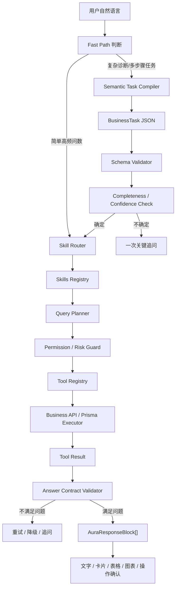

# 洞悉美业 Agent 最新改进方案

版本：v2.0
日期：2026-06-27
适用范围：Ami_Core 管理端 `/ami-agent`、`packages/server-v2/src/agent`、`packages/server-v2/src/business-query`，以及后续 Ami_Aura 智能终端升级。

---

## 1. 方案结论

洞悉美业不应继续按“聊天机器人 + 关键词规则 + 工具兜底”的方式演进，而应升级为“语义优先、Skills 驱动、受控执行、富输出渲染”的新一代美业门店运营智能体。

推荐路线：

- 保留 Ami_Core 现有业务 API、权限体系、数据模型和工具注册中心。
- 不推倒重建，但要在现有 Agent 链路上新增 `Skills Registry`、`Semantic Task Compiler`、`Query Planner`、`Answer Contract Validator`。
- 模型负责理解自然语言，系统负责结构化、权限、查询、校验和渲染。
- 不让模型直接写 SQL；模型只输出业务任务 JSON，查询由 Query Planner 和受控 Executor 执行。
- 不继续靠关键词规则打补丁；规则只做时间、金额、数量、权限、安全边界等确定性校验。

一句话目标：

> 让 Ami_Core 从“能聊天的后台助手”升级成“真正懂美业经营、能查准数据、能提示风险、能生成动作草稿的门店运营智能体”。

---

## 2. 当前问题

### 2.1 典型问题

用户问：

> 昨天有哪些消费的客户，列出清单

系统却答：

> 优先关注马美琳等高价值客户，结合最近服务记录做复购承接。

这个问题不是话术问题，而是链路问题：

- 系统把“消费客户清单”误判成“客户增长机会”。
- 当前能力路由偏向 `domain=customer`，没有识别“订单消费事件”。
- 工具返回了数据，但回复层没有强制按“清单/表格”输出。
- Agent 的目标从“回答用户原问题”漂移成“给经营建议”。

### 2.2 架构短板

| 短板 | 交付影响 |
|---|---|
| 语义任务层不稳定 | 用户自然表达一变，工具选择就容易偏 |
| 能力路由过早 fallback | 专用场景没覆盖时会落到宽泛能力，导致答非所问 |
| 缺少业务 Skills | 工具是散的，缺少可复用的业务场景包 |
| 缺少回复契约 | 用户要清单、趋势、诊断、建议时，输出形态不稳定 |
| 缺少自检机制 | Agent 不会校验“我是否真的回答了用户的问题” |
| 链路可能过长 | 如果每次都走 LLM + 多工具 + 总结，简单问题响应会慢 |

---

## 3. 目标架构



---

## 4. 核心设计

### 4.1 Semantic Task Compiler

把用户随机自然语言转换为稳定业务任务，而不是直接靠关键词选工具。

示例：

```json
{
  "objective": "昨天有哪些消费客户，列出清单",
  "domain": "order",
  "event": "paid_order",
  "taskType": "query",
  "entities": [
    { "type": "customer" },
    { "type": "order" }
  ],
  "metrics": ["paid_amount", "order_count"],
  "timeRange": { "preset": "yesterday" },
  "outputIntent": "table",
  "requiredFields": ["customerName", "phoneMasked", "paidAmount", "orderCount", "lastOrderTime"],
  "riskLevel": "low"
}
```

关键要求：

- LLM 负责理解自然语言。
- JSON Schema 负责校验结构。
- 缺关键字段才追问，不能每轮都追问。
- 时间、金额、数量、角色权限、风险等级由系统确定性校验。

### 4.2 Skills Registry

Skills 是“美业业务能力包”，不是关键词规则包。每个 Skill 包含业务对象、意图、指标、工具计划、输出契约、风险策略和评测样例。

建议结构：

```ts
type AmiBusinessSkill = {
  id: string;
  domain: string;
  intents: string[];
  examples: string[];
  entities: string[];
  metrics: string[];
  defaultTimeRange: string;
  requiredSlots: string[];
  clarificationPolicy: 'auto_assume' | 'ask_once' | 'must_confirm';
  toolPlan: string[];
  outputContract: Array<'text' | 'kpi' | 'table' | 'chart' | 'action_card' | 'document_link'>;
  riskPolicy: 'low' | 'medium' | 'high';
  evalCases: Array<{
    input: string;
    expectedSkill: string;
    expectedOutput: string;
  }>;
};
```

### 4.3 Query Planner

Query Planner 负责把业务任务转换成受控查询计划。

不采用“模型直接写 SQL”的原因：

- 权限和门店隔离风险高。
- 字段、表关系、金额口径容易错。
- 性能不可控，容易全表扫描。
- 难测试、难复盘、难解释。

推荐方式：

```text
模型输出 BusinessTask
→ Query Planner 生成受控查询计划
→ Executor 用 Prisma / 白名单 SQL 执行
→ Evidence 记录数据来源、时间范围、筛选条件、口径说明
```

### 4.4 Answer Contract Validator

回复必须先满足用户原问题，再补建议。

| 用户意图 | 必须输出 |
|---|---|
| 清单/哪些/列出 | 表格或列表，不能只给建议 |
| 多少/合计 | KPI 卡片 + 口径说明 |
| 趋势/变化 | 图表 + 同比/环比 |
| 为什么 | 诊断原因 + 数据证据 |
| 怎么办 | 操作步骤 + 风险提示 |
| 帮我生成 | 草稿卡片 + 人工确认 |

例如“昨天有哪些消费客户，列出清单”的正确输出顺序：

1. 昨天消费客户总数、总消费金额。
2. 客户清单表格。
3. 数据来源和统计口径。
4. 1-3 个关联问题或操作建议。

---

## 5. 必备 Skills 清单

### 5.1 P0：必须优先完成

| Skill | 目标 | 说明 |
|---|---|---|
| `business.intent.planning` | 语义任务规划 | 把自然语言转为 BusinessTask，替代关键词主导 |
| `order.customer.consumption.list` | 消费客户清单 | 解决“昨天哪些客户消费/成交/流水客户清单” |
| `answer.contract.rendering` | 回复契约 | 保证问清单出清单、问趋势出图表、问建议出步骤 |
| `customer.lifecycle.insight` | 客户生命周期洞察 | 高价值、流失、复购、疗程将尽、回访优先级 |

### 5.2 P1：经营分析主干

| Skill | 场景 |
|---|---|
| `revenue.order.analysis` | 营收、订单、客单价、支付方式、退款 |
| `reservation.capacity.schedule` | 预约、排班、空档、爽约、人手缺口 |
| `marketing.growth.execution` | 客群、权益、活动、话术、转化复盘 |
| `inventory.supply.risk` | 缺货、临期、BOM 耗材、补货、采购 |
| `finance.profit.risk` | 实收、毛利、成本、退款折扣、利润风险 |
| `staff.performance.management` | 美容师业绩、提成、服务完成率、排名 |

### 5.3 P2：扩展能力

| Skill | 场景 |
|---|---|
| `card.member.asset` | 次卡、储值、核销、到期、续卡 |
| `service.quality.record` | 服务记录、护理建议、服务质量 |
| `automation.event.trigger` | 主动提醒、每日简报、异常预警 |
| `store.comparison.benchmark` | 多门店排名和经营对比 |
| `terminal.health.ops` | 终端在线、外设、会话失败、高频问题 |

---

## 6. 快慢链路设计

为避免链路过长导致回复慢，需要把问题分为 Fast Path 和 Deep Path。

### 6.1 Fast Path

适用场景：

- 今日/昨日/本月营收。
- 今日预约。
- 昨天消费客户清单。
- 库存预警。
- 员工业绩排行。

链路：

```text
用户问题
→ 轻量语义分类 / Skill Router
→ Query Planner
→ 单工具查询
→ 直接结构化渲染
```

目标体验：

- 首屏核心结果 1-2 秒内返回。
- 不等待大模型长篇总结。
- 后续建议可以异步补充。

### 6.2 Deep Path

适用场景：

- “为什么利润下降？”
- “帮我制定本周营销计划。”
- “哪些客户适合召回，并生成话术？”
- “预约排班和库存有没有综合风险？”

链路：

```text
用户问题
→ Semantic Task Compiler
→ 多 Skill 编排
→ 多工具查询
→ 诊断/建议生成
→ 操作草稿/确认卡
```

目标体验：

- 先返回“正在分析哪些数据”。
- 分阶段输出结果。
- 高风险动作必须人工确认。

---

## 7. 分阶段开发计划

### 阶段 1：修正问答准确性底座

目标：先解决答非所问。

任务：

- 新增 `order.customer.consumption.list` Skill。
- 新增订单消费客户清单查询能力。
- 修复结果渲染：支持 `data.card.items` 进入表格。
- 新增 `Answer Contract Validator` 初版。
- 为“清单/哪些/列出/明细”类问题强制校验表格输出。
- 增加 eval case：昨天消费客户、上周成交客户、本月流水客户。

验收：

- “昨天有哪些消费客户，列出清单”必须返回客户清单表格。
- 不允许只输出“建议关注某客户”。
- 返回内容必须包含统计时间、数据来源和字段口径。

### 阶段 2：引入 Skills Registry

目标：把散落工具升级成业务 Skills。

任务：

- 新建 `skills` 目录和 Skill 定义类型。
- 将 P0 Skills 注册到 `Skills Registry`。
- Planner 从“直接匹配工具”改为“匹配 Skill，再生成 toolPlan”。
- 每个 Skill 维护 examples、requiredSlots、outputContract、riskPolicy。

验收：

- 相同业务问题不同表达，能命中同一个 Skill。
- 新增 Skill 不需要在多个关键词判断处打补丁。

### 阶段 3：Semantic Task Compiler 正式启用

目标：语义优先替代规则优先。

任务：

- 接入 LLM JSON structured output。
- 加 BusinessTask JSON Schema。
- 加低置信度追问机制。
- PreParser 降级为 slot enhancer，只负责时间、数量、金额等确定性补充。
- 编译失败时 fallback 到现有 business.query.ask。

验收：

- 随机自然语言问题能稳定产出 BusinessTask。
- 低置信度问题只问一个关键澄清问题。
- 不出现模型自由编造数据库结果。

### 阶段 4：Query Planner 和 Evidence 体系

目标：让查询可控、可解释、可复盘。

任务：

- 为 P0/P1 Skills 补 Query Plan 模板。
- 强制注入 `storeId`、角色权限、时间范围、limit。
- 输出 Evidence：数据表、时间范围、筛选条件、指标口径、样本量。
- 高风险查询和跨店查询走权限/审批网关。

验收：

- 每条经营分析回复都有数据来源。
- 多门店、财务、客户隐私类问题不越权。
- 查询计划可记录到 AgentRun，便于复盘。

### 阶段 5：富输出和主动运营

目标：从问答升级为运营工作台。

任务：

- 完善 `AuraResponseBlock[]`：text、kpi、table、chart、action_card、document_link。
- 前端按 block 类型渲染。
- 支持回答完成后生成 1-3 个关联问题。
- 引入主动提醒：每日简报、异常预警、客户跟进、库存风险。

验收：

- 同一问题可以组合输出文字、卡片、表格、图表和操作按钮。
- 高价值建议能转成草稿动作，但不自动执行高风险动作。

---

## 8. 推荐实施顺序

第一优先级：

1. 修复消费客户清单场景。
2. 增加 Answer Contract Validator。
3. 新增 P0 Skills Registry 雏形。
4. 建立 eval case，防止回归。

第二优先级：

1. 打通 Semantic Task Compiler。
2. Planner 改为 Skill-first。
3. 补齐 P1 经营分析 Skills。
4. 强化 Evidence 和权限校验。

第三优先级：

1. 多 Skill 编排。
2. 主动洞察与自动化触发。
3. 复杂报告和文档输出。
4. 终端 Ami_Aura 接入同一 Agent Runtime。

---

## 9. 成功标准

产品层：

- 店长能自然问经营问题，不需要知道菜单在哪。
- 前台能快速查客户、预约、权益和消费记录。
- 美容师能看到今日服务准备、客户注意事项和复购机会。
- 系统能主动提示经营风险，而不是等用户发现。

技术层：

- 语义任务结构化率达到 90% 以上。
- 高频问数首屏 2 秒内返回。
- 清单类问题表格命中率 95% 以上。
- AgentRun 可追踪工具、查询、证据和输出契约。
- 新增业务能力主要通过新增 Skill 完成，不再散落补规则。

业务层：

- 回答准确性优先于话术丰富度。
- 建议必须基于真实业务数据。
- 高风险动作必须人工确认。
- 每条关键结论都能说明数据来源和口径。

---

## 10. 最终建议

当前 Ami_Core 的方向不应是“继续增强聊天能力”，而是升级为：

> 以 Skills 为业务能力组织方式，以 Query Planner 为执行安全边界，以 Answer Contract 为回复质量底线的美业门店运营智能体。

这条路线能最大化复用现有系统，又能解决当前最大痛点：自然语言理解不稳、工具选择漂移、回复形式不对、建议先于事实。

下一步建议直接进入阶段 1，优先修复 `order.customer.consumption.list` 与 `answer.contract.rendering`。这是投入最小、对用户感知提升最大的切入点。
