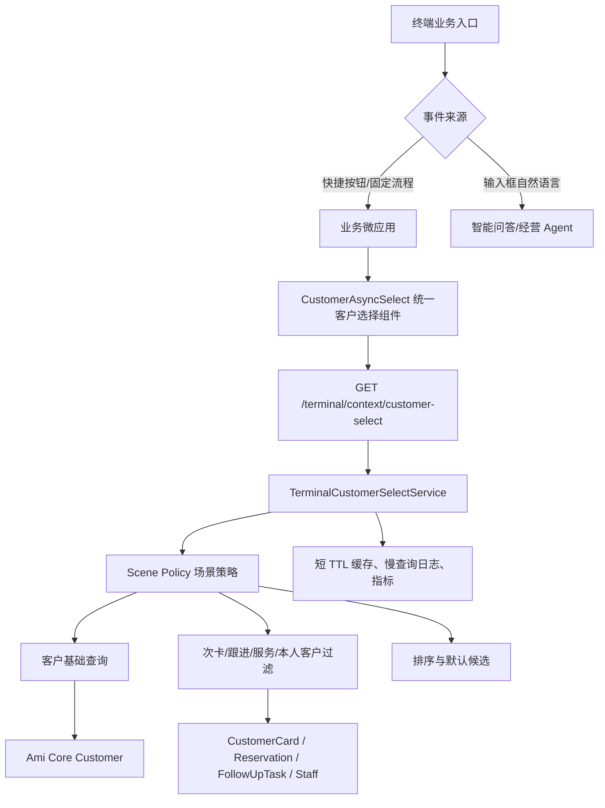

# 终端客户选择 P2 统一治理详细开发计划

## 1. 结论

本次按“一步到位做到 P2”执行，不再用单点补丁修某一个弹窗。

P2 的交付目标是：智能终端所有需要选择客户的业务流程，统一使用同一套后端轻量查询接口、同一套前端异步客户选择组件、同一套权限和场景过滤策略。添加预约、收银、核销、办卡、充值、客户跟进、服务记录都必须迁移完成；任何只修添加预约或只新增一个 TopN/候选列表的结果，都不能算 P2 完成。

## 2. 要解决的问题

### 2.1 用户侧问题

| 问题 | 现象 | 交付影响 |
| --- | --- | --- |
| 客户加载慢 | 打开添加预约后客户迟迟出不来 | 前台无法快速录预约 |
| 不同入口客户口径不一致 | 收银能看到的客户、核销能看到的客户、预约能看到的客户不一致 | 用户不信任终端数据 |
| 原生 select 不适合客户检索 | 客户多后滚动困难、搜索弱、信息少 | 门店真实客户量增长后不可用 |
| 场景查询耦合大快照 | 为选客户拉库存、订单、卡项等无关数据 | 首屏阻塞、接口慢、失败范围大 |
| 权限和任务口径不稳定 | 美容师、顾问、前台看到的客户范围不清晰 | 有越权和业务混乱风险 |

### 2.2 技术侧问题

当前终端客户选择能力分散在多个位置：

- 添加预约：通过 `getAppointmentCreateOptions()` 间接依赖 `loadCoreSnapshot()`。
- 收银：客户列表混在收银上下文里。
- 核销：已有“可核销客户”口径，但不是统一选择能力。
- 办卡、充值：仍存在快照或历史候选逻辑。
- 客户跟进、服务记录：需要对齐管理端任务、员工、客户权限，但尚未统一治理。

这些问题的根因是：客户选择被当成每个业务流程自己的附属数据，而不是一个独立基础能力。

## 3. P2 范围

### 3.1 必须覆盖的业务场景

| scene | 终端入口 | P2 必须做到 |
| --- | --- | --- |
| `appointment` | 添加/修改预约 | 全店客户可搜，默认优先今日预约、最近到店、活跃客户 |
| `cashier` | 收银 | 客户选择独立加载，不能被商品/项目/订单上下文阻塞 |
| `verification` | 次卡核销 | 仅返回有可用次卡的客户，选中后再加载该客户卡项明细 |
| `card_opening` | 办卡 | 直接查管理端客户，卡项目录独立加载 |
| `recharge` | 充值 | 客户选择和充值项目独立加载 |
| `follow_up` | 客户跟进 | 只展示管理端下发且当前账号可见的跟进任务客户 |
| `service_record` | 服务记录 | 美容师只看本人相关客户；店长/前台看全店可见客户 |

### 3.2 不做的事

| 不做项 | 原因 |
| --- | --- |
| 不让 AI 问答参与客户下拉选择 | 客户选择是固定业务控件，不是自然语言问答 |
| 不继续扩展原生全量 `<select>` | 客户数增长后必然卡顿，且无法承载会员、标签、任务等上下文 |
| 不为每个流程各写一套客户查询 | 会继续造成口径不一致和维护成本高 |
| 不在客户列表阶段加载完整订单、卡项、消费历史 | 列表只负责选择，详情应在选中客户后按需加载 |
| 不使用终端 mock 或静态客户兜底 | 必须与管理端 Ami Core 客户保持一致 |

## 4. 目标架构



架构原则：

1. 快捷按钮和输入框是事件来源分流，不是 AI 分流。
2. 快捷按钮进入固定微应用，输入框进入智能问答。
3. 客户选择组件只服务业务表单，不进入 AI 路由。
4. 客户选择统一由后端根据 scene 和当前账号做过滤，前端不能决定权限边界。
5. 列表阶段只返回选择所需轻量字段，选中后再加载业务详情。

## 5. 统一接口设计

### 5.1 接口

```http
GET /api/terminal/context/customer-select?scene=appointment&keyword=&limit=50
```

说明：

- 路径放在 `/terminal/context/*` 下，与现有终端上下文接口保持一致。
- `storeId` 来自设备认证或登录上下文，不允许前端任意传门店。
- `userId` 来自当前终端账号，用于权限过滤。

### 5.2 Query 参数

| 参数 | 类型 | 必填 | 说明 |
| --- | --- | --- | --- |
| `scene` | enum | 是 | `appointment/cashier/verification/card_opening/recharge/follow_up/service_record` |
| `keyword` | string | 否 | 姓名、手机号、会员关键词，后端 trim |
| `limit` | number | 否 | 默认 50，最大 100 |
| `customerIds` | string | 否 | 指定客户 ID，支持编辑回显 |
| `onlyMyCustomers` | boolean | 否 | 用于本人客户限制，最终以后端权限为准 |
| `includeInactive` | boolean | 否 | 默认 false，不返回删除或无效客户 |

### 5.3 返回结构

```ts
interface TerminalCustomerSelectResponse {
  scene: TerminalCustomerSelectScene;
  keyword: string;
  generatedAt: string;
  fromCache: boolean;
  items: TerminalCustomerSelectItem[];
  total?: number;
  hasMore: boolean;
}

interface TerminalCustomerSelectItem {
  id: number;
  name: string;
  phone: string;
  maskedPhone?: string;
  memberLevel?: string;
  tags: string[];
  lastVisitDate?: string;
  totalSpent?: number;
  visitCount?: number;
  priorityLabel?: string;
  sceneBadges: string[];
  disabled?: boolean;
  disabledReason?: string;
  metadata?: {
    appointmentTime?: string;
    activeCardCount?: number;
    followUpTaskCount?: number;
    assignedStaffName?: string;
  };
}
```

### 5.4 字段口径

| 字段 | 来源 | 展示要求 |
| --- | --- | --- |
| 姓名 | Ami Core 客户主表 | 必须与管理端客户一致 |
| 手机号 | Ami Core 客户主表 | 按角色权限决定是否脱敏 |
| 会员等级 | 客户会员字段 | 缺失显示“普通客户”或“无” |
| 标签 | 客户标签 | 最多展示 3-5 个，避免卡片过长 |
| 最近到店 | 客户档案/服务/预约记录 | 仅用于排序和轻量提示 |
| 可用次卡数量 | CustomerCard | 仅 `verification` 场景默认返回 |
| 跟进任务数量 | FollowUpTask | 仅 `follow_up` 场景默认返回 |

## 6. 后端开发计划

### 6.1 新增 DTO 与类型

文件：

- `packages/server-v2/src/terminal/dto/customer-select.dto.ts`
- `packages/server-v2/src/terminal/dto/index.ts`
- `src/types/terminal.ts`

任务：

1. 定义 `TerminalCustomerSelectScene` 枚举。
2. 定义 `TerminalCustomerSelectQueryDto`。
3. 定义 `TerminalCustomerSelectItem` 和 `TerminalCustomerSelectResponse`。
4. 校验 `scene`、`limit`、`customerIds`、`keyword`。
5. 服务端强制 `limit <= 100`。

完成标准：

- 非法 scene 返回明确错误。
- limit 超限不会导致全量扫描。
- keyword 为空时返回默认候选，不返回全量客户。

### 6.2 新增统一查询服务

建议优先在 `packages/server-v2/src/terminal/terminal.service.ts` 内先落地，后续再按体量抽出 `terminal-customer-select.service.ts`，避免一次重构过大。

核心方法：

```ts
getCustomerSelectContext(storeId, userId, query)
buildCustomerSelectWhere(storeId, userId, query)
getTerminalCustomerSelectScopeIds(storeId, userId, scene, onlyMyCustomers)
toTerminalCustomerSelectItem(customer, scene)
toTerminalCustomerSceneBadges(customer, scene)
```

任务：

1. 复用现有客户基础查询能力。
2. 将 `appointment/cashier/card_opening/recharge` 作为全客户可搜场景。
3. 将 `verification` 限制为有可用次卡客户。
4. 将 `follow_up` 限制为管理端下发任务客户。
5. 将 `service_record` 限制为本人服务、今日到店、近期服务客户。
6. 返回统一字段结构。

完成标准：

- 所有 scene 均可通过同一接口查询。
- `verification` 不返回无可用次卡客户。
- `follow_up` 没有任务时返回空列表，不用假数据兜底。
- `service_record` 按当前账号过滤。

### 6.3 Controller

文件：

- `packages/server-v2/src/terminal/terminal.controller.ts`

新增：

```ts
GET /terminal/context/customer-select
```

鉴权：

1. 复用终端设备认证。
2. storeId 从 `request.device.storeId` 获取。
3. userId 从 `request.device.userId` 或当前终端用户上下文获取。
4. 不接受前端传 storeId 覆盖。

完成标准：

- 未认证设备不能访问。
- 当前门店隔离有效。
- 当前用户权限能传入 service。

### 6.4 场景策略

#### appointment

默认候选：

1. 今日预约客户。
2. 最近到店客户。
3. 活跃客户。
4. 高价值客户。

不允许：

- 不拉库存。
- 不拉订单明细。
- 不拉所有卡项明细。

#### cashier

默认候选：

1. 今日预约客户。
2. 最近到店客户。
3. 活跃客户。

选中客户后再加载：

- 余额。
- 可用权益。
- 最近消费摘要。

#### verification

默认过滤：

- 有可用次卡。
- `remainingTimes > 0`。
- 卡状态可用。
- 客户属于当前门店。

选中客户后再加载：

- 该客户可核销次卡明细。
- 项目匹配信息。
- 剩余次数。

#### card_opening

默认候选：

- 最近客户。
- 活跃客户。
- 搜索命中客户。

客户选择和次卡目录必须独立加载。

#### recharge

默认候选：

- 有会员卡/储值关系客户优先。
- 最近客户。
- 搜索命中客户。

客户选择和充值项目必须独立加载。

#### follow_up

默认过滤：

- 管理端下发的跟进任务。
- 状态为待跟进、进行中、需复访等未完成状态。
- 顾问/美容师只看本人任务。
- 店长/前台看全店任务。

选中客户后：

- 支持填写跟进结果。
- 支持更新任务状态。

#### service_record

默认过滤：

- 今日到店客户。
- 本人服务客户。
- 近期服务客户。

权限：

- 美容师只看本人服务或预约相关客户。
- 店长、前台、系统管理员看当前门店客户。

## 7. 前端开发计划

### 7.1 API 门面

文件：

- `src/api/real/terminal.ts`
- `src/api/terminal.ts`
- `src/api/index.ts`
- `packages/Ami-Aura-Lite-Kiosk/src/app/services/customerSelectService.ts`

任务：

1. 增加 `getTerminalCustomerSelectContext()`。
2. Kiosk service 封装 `searchTerminalCustomers()`。
3. query key 包含 `scene/keyword/limit/customerIds/onlyMyCustomers`。
4. 默认候选短缓存，搜索结果短缓存。
5. 错误向组件返回可展示状态，不吞异常。

完成标准：

- 所有调用统一走 API 门面。
- 不在组件中拼裸 URL。
- 搜索失败只影响客户选择区。

### 7.2 统一组件 CustomerAsyncSelect

文件：

- `packages/Ami-Aura-Lite-Kiosk/src/app/components/CustomerAsyncSelect.tsx`

组件 props：

```ts
interface CustomerAsyncSelectProps {
  scene: TerminalCustomerSelectScene;
  value: TerminalCustomerSelectItem | null;
  onChange: (customer: TerminalCustomerSelectItem | null) => void;
  placeholder?: string;
  onlyMyCustomers?: boolean;
  disabled?: boolean;
  required?: boolean;
  defaultItems?: TerminalCustomerSelectItem[];
  onCreateCustomer?: () => void;
}
```

交互要求：

1. 聚焦或展开时加载默认候选。
2. 输入 2 个字符后触发搜索。
3. 搜索防抖 300ms。
4. 旧请求不能覆盖新结果。
5. 支持局部 loading。
6. 支持空结果提示。
7. 支持失败重试。
8. 选择后展示姓名、手机号、会员、标签。
9. 支持后续接入“新增客户”。

完成标准：

- 所有客户选择场景复用该组件。
- 不再新增原生全量 `<select>`。
- 组件可处理 1000+ 客户检索体验。

### 7.3 添加预约迁移

文件：

- `packages/Ami-Aura-Lite-Kiosk/src/app/components/RoleDashboards.tsx`
- `packages/Ami-Aura-Lite-Kiosk/src/app/services/auraCoreService.ts`

任务：

1. `openCreateDialog()` 立即打开弹窗。
2. `getAppointmentCreateOptions()` 不再调用 `loadCoreSnapshot()` 获取客户。
3. 项目、美容师、时间段继续轻量加载。
4. 客户选择改用 `CustomerAsyncSelect scene="appointment"`。

完成标准：

- 点击“添加预约”后弹窗可立即出现。
- 客户区单独 loading。
- 项目、美容师不被客户加载阻塞。
- 搜索管理端客户可返回结果。

### 7.4 收银迁移

文件：

- `packages/Ami-Aura-Lite-Kiosk/src/app/components/CashierFlowCard.tsx`
- `packages/Ami-Aura-Lite-Kiosk/src/app/services/auraCoreService.ts`

任务：

1. 客户选择改用 `CustomerAsyncSelect scene="cashier"`。
2. 商品/项目/收银上下文不依赖客户列表完成后才显示。
3. 选中客户后再加载客户余额、卡项、优惠等详情。
4. 输入框自然语言“今天收银多少”不得触发收银快捷功能。

完成标准：

- 点击收银快捷才进入收银。
- 输入框问经营问题走智能问答。
- 收银客户搜索可查管理端客户。

### 7.5 核销迁移

文件：

- `packages/Ami-Aura-Lite-Kiosk/src/app/components/CardVerificationFlowCard.tsx`
- `packages/Ami-Aura-Lite-Kiosk/src/app/services/auraCoreService.ts`

任务：

1. 客户选择改用 `CustomerAsyncSelect scene="verification"`。
2. 默认候选只展示有可核销次卡客户。
3. 搜索仍保持“有可用次卡”过滤。
4. 选中客户后加载该客户可核销次卡明细。

完成标准：

- 不再出现无次卡客户。
- 核销成功后管理端核心记录与终端回执口径一致。
- 美容师、终端编号、核销时间等字段按真实上下文写入。

### 7.6 办卡迁移

文件：

- `packages/Ami-Aura-Lite-Kiosk/src/app/components/CardOpeningFlowCard.tsx`
- `packages/Ami-Aura-Lite-Kiosk/src/app/services/auraCoreService.ts`

任务：

1. 客户选择改用 `CustomerAsyncSelect scene="card_opening"`。
2. 次卡目录从 catalog 或 card API 独立加载。
3. 客户加载失败不影响次卡目录显示。

完成标准：

- 可搜索管理端客户。
- 可选择管理端卡项。
- 开卡成功记录操作人和终端上下文。

### 7.7 充值迁移

文件：

- `packages/Ami-Aura-Lite-Kiosk/src/app/components/RechargeFlowCard.tsx`
- `packages/Ami-Aura-Lite-Kiosk/src/app/services/auraCoreService.ts`

任务：

1. 客户选择改用 `CustomerAsyncSelect scene="recharge"`。
2. 充值项目独立加载。
3. 选中客户后再校验余额、会员卡等业务数据。

完成标准：

- 可搜索管理端客户。
- 充值项目加载不被客户接口阻塞。
- 充值成功记录操作人和终端上下文。

### 7.8 客户跟进迁移

任务：

1. 快捷按钮新增或保留“客户跟进”。
2. 跟进客户来源使用 `scene="follow_up"`。
3. 列表只展示当前账号可见的管理端下发任务客户。
4. 支持填写跟进情况。
5. 支持更新任务状态。

完成标准：

- 店长/前台可看全店下发任务。
- 顾问/美容师只看本人任务。
- 跟进结果回写管理端任务。

### 7.9 服务记录迁移

任务：

1. 服务记录客户选择使用 `scene="service_record"`。
2. 美容师按本人服务/预约过滤。
3. 店长/前台按当前门店过滤。
4. 选中客户后再加载服务记录详情。

完成标准：

- 美容师不看到无关客户。
- 服务记录与管理端客户一致。
- 客户选择不拉全量历史记录。

## 8. 权限与数据一致性

### 8.1 角色范围

| 角色 | 默认客户范围 |
| --- | --- |
| 店长 | 当前门店全量可见客户 |
| 前台 | 当前门店全量可见客户 |
| 收银 | 当前门店全量可见客户 |
| 顾问 | 本人客户、本人跟进任务客户 |
| 美容师 | 本人预约、本人服务、本人跟进任务客户 |
| 系统管理员 | 当前门店上下文客户 |

### 8.2 后端强制要求

1. 权限过滤必须在后端执行。
2. 前端传 `onlyMyCustomers=false` 不能扩大权限。
3. storeId 必须来自认证上下文。
4. 跟进任务和服务记录必须关联当前账号或当前门店权限。
5. 手机号脱敏逻辑按角色执行。

## 9. 性能治理计划

### 9.1 缓存策略

| 数据 | TTL | Key |
| --- | --- | --- |
| 默认候选 | 60-180 秒 | storeId + userId + scene |
| 搜索结果 | 60 秒 | storeId + userId + scene + keyword |
| 指定客户回显 | 5 分钟 | storeId + customerIds |
| 项目/美容师/卡项目录 | 5-10 分钟 | storeId + resource |

### 9.2 请求控制

前端：

1. 搜索防抖 300ms。
2. 新请求发出后旧请求结果不得覆盖新结果。
3. 弹窗关闭后不再更新状态。
4. 客户区失败只显示局部错误。

后端：

1. 所有查询强制 limit。
2. 搜索 keyword 长度限制。
3. 慢查询记录日志。
4. 可选增加性能指标。

### 9.3 索引评估

需要检查并按需补充：

```sql
Customer(storeId, deletedAt, phone)
Customer(storeId, deletedAt, name)
Customer(storeId, deletedAt, lastVisitDate)
Customer(storeId, deletedAt, totalSpent)
CustomerCard(customerId, status, remainingTimes)
Reservation(storeId, customerId, scheduledAt, status)
FollowUpTask(storeId, customerId, assigneeUserId, status)
```

说明：

- 若 schema 已有等价索引，不重复建。
- 如果 PostgreSQL 模糊搜索慢，再评估 trigram index。
- 索引 migration 必须单独说明风险。

## 10. 分阶段执行计划

### 阶段 0：开工预检

任务：

1. `git status --short --branch` 确认当前分支和脏工作区。
2. 标记无关改动，避免误回滚。
3. 搜索当前客户选择入口。
4. 明确要迁移的组件和服务。

完成标准：

- 明确本次触碰文件范围。
- 无关经营利润、提成、权限等改动不被本任务修改。

### 阶段 1：后端统一能力

任务：

1. 新增 customer-select DTO。
2. 新增 `/terminal/context/customer-select`。
3. 实现 `appointment/cashier/verification/card_opening/recharge/follow_up/service_record`。
4. 增加 scene 策略和权限过滤。
5. 增加缓存和慢查询日志。
6. 补后端单测。

完成标准：

- 所有 scene 接口可用。
- 核销只返回可核销客户。
- 跟进只返回任务客户。
- 服务记录按账号过滤。

### 阶段 2：前端统一组件

任务：

1. 新增 `customerSelectService.ts`。
2. 新增 `CustomerAsyncSelect.tsx`。
3. 支持默认候选、搜索、防抖、旧请求保护、失败重试。
4. 支持标签、会员、手机号、场景徽标展示。

完成标准：

- 组件独立可复用。
- 不依赖具体业务流程。
- 不使用原生全量 select。

### 阶段 3：交易与预约场景迁移

任务：

1. 添加预约迁移。
2. 收银迁移。
3. 核销迁移。
4. 办卡迁移。
5. 充值迁移。

完成标准：

- 五个场景都使用统一组件。
- 五个场景都走统一后端接口。
- 选中客户后再加载业务详情。

### 阶段 4：任务与服务场景迁移

任务：

1. 客户跟进迁移。
2. 服务记录迁移。
3. 按角色做权限测试。
4. 与管理端下发任务、服务记录数据核对。

完成标准：

- 客户跟进与管理端任务一致。
- 服务记录客户与员工权限一致。
- 美容师/顾问不能越权。

### 阶段 5：旧路径退役

任务：

1. 搜索客户选择场景中的 `loadCoreSnapshot()`。
2. 删除或降级旧兜底路径。
3. 保留非客户选择用途的大快照调用。
4. 搜索原生客户 select。
5. 确认新增业务不得再直接全量取客户。

完成标准：

- 客户选择不再依赖 `loadCoreSnapshot()`。
- 客户选择不再使用原生全量 select。
- 大快照只用于真正需要全局数据的看板或兜底场景。

### 阶段 6：验证与文档同步

任务：

1. 后端定向单测。
2. API facade 测试。
3. Kiosk build。
4. 关键流程浏览器手测。
5. 更新本计划验收状态。
6. 记录未完成风险。

完成标准：

- 测试结果明确。
- 若有阻塞，说明阻塞原因和剩余工作。
- 不用“理论上可用”替代验证。

## 11. 测试计划

### 11.1 后端单测

覆盖：

1. `appointment` 默认候选。
2. `appointment` keyword 搜索。
3. `cashier` 不加载订单明细。
4. `verification` 只返回有可用次卡客户。
5. `follow_up` 按任务和 assignee 过滤。
6. `service_record` 按员工权限过滤。
7. `limit` 最大值限制。
8. 空结果返回稳定结构。
9. 非法 scene 返回错误。

建议命令：

```powershell
Set-Location "packages/server-v2"
npm.cmd test -- terminal.service.spec.ts
npm.cmd run build
```

### 11.2 前端/Kiosk 测试

覆盖：

1. `CustomerAsyncSelect` 初始加载。
2. 搜索防抖。
3. 旧请求不覆盖新请求。
4. 搜索失败可重试。
5. 空结果提示。
6. 选择客户后回填。
7. 添加预约弹窗先打开。

建议命令：

```powershell
Set-Location "packages/Ami-Aura-Lite-Kiosk"
npm.cmd run build
```

### 11.3 API facade 测试

覆盖：

1. `src/api/terminal.ts` 导出 `getTerminalCustomerSelectContext`。
2. `src/api/real/terminal.ts` 请求路径正确。
3. `src/api/index.ts` 统一导出可用。

建议命令：

```powershell
npx.cmd vitest run src/test/api.test.ts
```

### 11.4 浏览器验收

必须手测：

1. 添加预约：客户可搜索，项目和美容师不被客户加载阻塞。
2. 收银：输入框问“今天收银多少”进入智能问答；点击收银快捷才进入收银。
3. 核销：客户搜索只展示有可用次卡客户。
4. 办卡：可搜索管理端客户。
5. 充值：可搜索管理端客户。
6. 客户跟进：只展示管理端下发任务客户。
7. 服务记录：美容师只看本人相关客户。

## 12. P2 验收清单

- [x] `/terminal/context/customer-select` 支持 7 个 scene。
- [x] 所有 scene 强制 `limit`，最大 100。
- [x] 添加预约不再通过 `loadCoreSnapshot()` 获取客户。
- [x] 收银、核销、办卡、充值、客户跟进、服务记录均接入 `CustomerAsyncSelect`。
- [x] 核销客户选择仅返回有可用次卡客户。
- [x] 客户跟进客户来自管理端下发任务，包含待处理、跟进中、已逾期未完成任务。
- [x] 服务记录客户按本人/门店权限过滤；美容师未绑定时不回退全店客户。
- [x] 美容师/顾问权限由后端执行。
- [x] 客户选择组件支持默认候选、异步搜索、防抖、旧请求保护、空结果、错误重试。
- [x] 客户列表阶段不加载完整订单、卡项、消费历史。
- [~] 平均响应目标 < 500ms，P95 目标 < 1.5s：代码已具备 limit、TTL 缓存和轻量字段，仍需真实数据量压测。
- [x] 后端单测通过。
- [x] Kiosk build 通过。
- [x] API facade 测试通过。
- [x] 浏览器关键链路验收：已验证输入框不触发收银快捷、用户输入不丢失、快捷收银打开固定卡、客户选择异步展开、无结果搜索不回退默认候选；预约、核销、办卡、充值、客户跟进、服务记录均有代码接入和后端 scene 测试覆盖。

## 13. 交付物

1. 统一客户选择后端接口。
2. 统一客户选择后端查询能力。
3. 统一 `CustomerAsyncSelect` 前端组件。
4. Kiosk customer select service。
5. 添加预约、收银、核销、办卡、充值、客户跟进、服务记录迁移。
6. 后端权限和场景过滤。
7. 缓存、请求防抖、旧请求保护、慢查询日志。
8. 单测、构建、浏览器验收记录。
9. 本文档更新验收状态。

## 14. 完成判定

只有同时满足以下条件，才能声明 P2 完成：

1. 代码层面：所有终端客户选择入口都使用统一组件和统一接口。
2. 数据层面：客户来源与管理端 Ami Core 客户主表一致。
3. 场景层面：7 个 scene 均有明确过滤策略。
4. 权限层面：店长、前台、收银、顾问、美容师的范围由后端控制。
5. 性能层面：默认候选和搜索具备 limit、缓存、旧请求保护和慢查询记录。
6. 验证层面：后端测试、Kiosk build、API facade、浏览器关键场景均完成。
7. 文档层面：验收清单同步更新，不留口头结论。

如果任一条件未满足，只能说明“已完成部分阶段”，不能说“P2 已完成”。

## 15. 一步到位 P2 实施排期（评审版）

### 15.1 执行原则

本次不再按“先修添加预约、再扩到收银、再补核销”的补丁节奏推进，而是按 P2 统一治理一次性收口。P0 的轻量接口、P1 的异步搜索组件、P2 的统一数据源、权限、缓存和观测要在同一轮方案中同时设计，并按工作包并行落地。

交付边界如下：

| 分类 | 必须交付 | 不接受的结果 |
| --- | --- | --- |
| 数据源 | 所有客户选择来自管理端 Ami Core 客户主表及关联真实业务表 | 终端本地 mock、静态候选、各模块自建客户列表 |
| 接口 | 一个统一客户选择接口支持 7 个 scene | 每个弹窗各查一套客户 |
| 组件 | 一个 `CustomerAsyncSelect` 覆盖所有客户选择入口 | 继续使用原生全量 select |
| 权限 | 后端按账号、角色、员工绑定、任务归属过滤 | 前端靠隐藏按钮或传参控制权限 |
| 性能 | 列表轻量字段、limit、短缓存、防抖、旧请求保护 | 打开弹窗拉全量快照或完整客户详情 |
| 验证 | 单测、构建、API facade、浏览器 7 场景验收 | 只说“理论可用”或只验证一个入口 |

### 15.2 工作包拆解

| 工作包 | 目标 | 主要文件 | 验收口径 |
| --- | --- | --- | --- |
| WP1 后端统一客户选择 | 新增 `/terminal/context/customer-select`，支持 7 个 scene | `packages/server-v2/src/terminal/terminal.service.ts`、`terminal.controller.ts`、`dto/customer-select.dto.ts` | 7 个 scene 都能返回稳定结构；非法 scene/超限 limit 有明确处理 |
| WP2 场景策略与权限 | 后端统一控制门店、角色、本人客户、任务客户、可核销客户 | `terminal.service.ts`、`terminal.service.spec.ts` | 核销不返回无次卡客户；跟进只返回任务客户；美容师服务记录不越权 |
| WP3 前端 API 门面 | 管理端 API、Kiosk service、类型统一 | `src/api/real/terminal.ts`、`src/api/terminal.ts`、`src/types/terminal.ts`、`customerSelectService.ts` | 所有调用走门面；不在组件拼裸 URL |
| WP4 统一客户选择组件 | 支持默认候选、搜索、防抖、旧请求保护、失败重试 | `CustomerAsyncSelect.tsx` | 组件可复用于预约、收银、核销、办卡、充值、跟进、服务记录 |
| WP5 交易/预约入口迁移 | 预约、收银、核销、办卡、充值全部改用统一组件 | `RoleDashboards.tsx`、`CashierFlowCard.tsx`、`CardVerificationFlowCard.tsx`、`CardOpeningFlowCard.tsx`、`RechargeFlowCard.tsx` | 点击快捷入口进入固定业务卡；输入框文本不触发快捷卡 |
| WP6 任务/服务入口迁移 | 客户跟进、服务记录接入统一客户选择和权限 | `RoleDashboards.tsx`、`ServiceRecordFlowCard.tsx` | 跟进任务与管理端下发一致；美容师只看本人相关客户 |
| WP7 性能治理 | limit、短 TTL 缓存、局部 loading、慢查询日志、索引评估 | 后端 service、前端组件、必要 Prisma 索引评估 | 默认候选不拉全量详情；搜索不阻塞业务表单；有慢查询定位依据 |
| WP8 验证与文档同步 | 跑测试、浏览器验收、同步验收状态 | 本文档、相关测试文件 | 代码、接口、页面、数据、验证五项都有结论 |

### 15.3 建议执行顺序

| 顺序 | 阶段 | 内容 | 退出标准 |
| --- | --- | --- | --- |
| 1 | 现状冻结 | 记录当前客户选择入口、快照调用、原生 select、相关未提交改动 | 明确只改 P2 范围，不误碰无关业务 |
| 2 | 后端接口 | DTO、controller、service、scene 策略、基础单测 | 统一接口能跑通所有 scene |
| 3 | 权限与数据口径 | 接入用户账号、员工绑定、任务归属、可核销卡过滤 | 不同角色看到的客户范围符合业务规则 |
| 4 | 前端组件与 service | 完成 `CustomerAsyncSelect` 和 Kiosk search service | 组件具备可复用能力，不绑定单一页面 |
| 5 | 7 个入口迁移 | 预约、收银、核销、办卡、充值、客户跟进、服务记录逐项替换 | 代码搜索不到新增原生客户 select 和旧客户快照路径 |
| 6 | 性能与容错 | 防抖、旧请求保护、局部 loading、缓存、慢查询日志 | 客户慢不会拖死项目/美容师/业务表单 |
| 7 | 浏览器验收 | 用真实终端页面逐项验证 7 个入口 | 每个入口都有截图/文字验收记录 |
| 8 | 收口 | 跑构建/单测/API facade，更新文档验收状态 | 满足 P2 完成判定，未满足项列为阻塞而非完成 |

### 15.4 浏览器验收脚本口径

| 场景 | 必测动作 | 通过标准 |
| --- | --- | --- |
| 添加预约 | 点击“添加预约”，展开客户选择，搜索姓名/手机号 | 弹窗先出现；客户区局部加载；项目、美容师可独立显示 |
| 收银 | 输入框输入“今天收银多少”；再点击收银快捷 | 输入框进入智能问答；快捷按钮才进入收银表单 |
| 核销 | 点击核销，展开客户选择 | 候选客户均有可用次卡；无次卡客户不出现 |
| 办卡 | 点击办卡，搜索管理端客户 | 可搜索真实客户；卡项目录独立加载 |
| 充值 | 点击充值，搜索管理端客户 | 客户选择可用；充值金额/项目不被客户接口阻塞 |
| 客户跟进 | 点击客户跟进，查看客户筛选和任务列表 | 只展示当前账号可见的管理端下发任务 |
| 服务记录 | 切换美容师账号，进入服务记录，选择客户 | 美容师只看到本人服务/预约相关客户 |

### 15.5 计划工期与风险

| 项目 | 预估 |
| --- | --- |
| 后端统一接口和单测 | 1.5-2 天 |
| 前端统一组件和 service | 1-1.5 天 |
| 7 个入口迁移 | 2-3 天 |
| 权限、性能、浏览器验收 | 1.5-2 天 |
| 总体评估 | 6-8 天，若真实账号绑定和数据质量较差，需额外 1-2 天做数据修正 |

主要风险：

1. 管理端客户、员工账号、美容师档案未完全绑定，会影响“本人客户/本人服务”的权限过滤。
2. 次卡、储值、跟进任务存在历史数据缺字段，会导致某些 scene 默认候选偏少。
3. 如果客户表缺少必要索引，大客户量门店搜索可能仍慢，需要单独补索引 migration。
4. 终端现有智能问答和快捷按钮事件边界必须保持独立，不能为了快捷入口方便又把输入框文本映射成快捷动作。
5. 浏览器验收必须用真实页面逐项确认，不能只依赖 build 通过。

### 15.6 P2 完成判定

只有以下事项全部满足，才能对外说“P2 完成”：

1. 7 个客户选择入口全部统一到 `CustomerAsyncSelect`。
2. 7 个 scene 全部走 `/terminal/context/customer-select`。
3. 客户数据来自管理端真实客户，不使用 mock 或本地兜底。
4. 核销、跟进、服务记录三个强业务过滤场景有单测覆盖。
5. 输入框自然语言和快捷按钮事件来源完全隔离。
6. 客户加载慢只影响客户选择局部，不阻塞项目、美容师、金额、卡项等其他表单区域。
7. 浏览器逐项验收通过，并在本文档记录。
8. 若真实数据或账号绑定问题导致验收不通过，必须列为数据阻塞，不能用代码完成代替业务完成。

## 16. 本轮执行记录（2026-06-20）

### 16.1 已落地代码

1. 后端新增统一客户选择能力：`TerminalCustomerSelectQueryDto`、`TerminalCustomerSelectResponse`、`GET /terminal/context/customer-select`。
2. 后端统一 scene 策略：`appointment`、`cashier`、`verification`、`card_opening`、`recharge`、`follow_up`、`service_record`。
3. 后端权限策略：店长/前台为门店范围；美容师/顾问按当前账号、绑定美容师、跟进任务和服务记录过滤。
4. 前端新增 `CustomerAsyncSelect`，支持默认候选、异步搜索、防抖、旧请求保护、空结果和错误重试。
5. Kiosk 已迁移：预约、收银、次卡核销、办卡、充值、客户跟进、服务记录。
6. 客户跟进卡片新增客户筛选，客户来源为管理端下发任务，不再维护本地独立筛选口径。
7. 旧的快照客户选择构造函数已移除，避免继续误用 `loadCoreSnapshot()` 承载客户选择。
8. 输入框与快捷按钮事件来源已隔离：输入框文本只进入自然语言问答/经营问数链路，快捷按钮才进入固定业务卡。
9. 修复消息竞态：快速返回时用户输入气泡不会被 loading 清理覆盖。
10. 修复消息滚动：新增消息后滚动到最新内容，避免用户误以为输入或结果消失。
11. 修复首页刷新覆盖：后台首页刷新只能更新仍在首页的消息，不能覆盖用户刚打开的收银、核销等业务流程卡。
12. 修复客户搜索空结果：接口返回空列表时展示“未找到客户”，不再回退显示默认候选。

### 16.2 已完成验证

```powershell
Set-Location "packages/server-v2"
npm.cmd test -- terminal.service.spec.ts --runInBand
npm.cmd run build

Set-Location "D:\AI coding\beauty-salon-admin"
npx.cmd vitest run src/test/api.test.ts

Set-Location "packages/Ami-Aura-Lite-Kiosk"
npm.cmd run build
```

验证结果：

- `terminal.service.spec.ts`：31 个用例通过，新增“7 个 P2 scene 统一接口契约”测试。
- `server-v2` build：通过。
- `src/test/api.test.ts`：9 个用例通过。
- `Ami-Aura-Lite-Kiosk` build：通过，仅保留 Vite chunk size 警告。
- `ruleIntentParser.test.ts`、`aiIntentParser.test.ts`、`runMicroApp.test.ts`：35 个用例通过，覆盖输入框/快捷按钮事件来源隔离。

### 16.3 仍需真实环境确认

1. 当前门店大客户量下的接口平均耗时和 P95；代码已有 limit、TTL、轻量字段和局部 loading，但尚未做生产量级压测。
2. 如果管理端存在非标准角色或未绑定员工账号，需要用真实账号补一轮权限抽样。
3. “今天收银多少”这类自然语言经营问答仍可能回复不够智能，这是经营语义中枢/BusinessQuery 能力问题，不属于客户选择 P2 的完成条件；本 P2 只保证输入框不会误触发收银快捷卡。

### 16.4 浏览器抽样记录

本地地址：`http://127.0.0.1:5177/login`，当前账号：系统管理员/店长、前台、美容师多角色。

已确认：

1. 添加预约弹窗中客户控件为统一异步选择按钮，不再是原生全量下拉；客户查询期间项目和美容师可独立加载。
2. 预约客户选择器能返回客户候选，并展示会员、标签、今日预约、可用次卡等中文业务信息。
3. 客户跟进快捷入口进入固定业务卡，不进入 AI 问答；卡片内显示统一客户筛选。
4. 客户跟进统计已按当前账号范围展示，修复了“列表为空但逾期显示全店 10 条”的口径不一致。
5. 输入框输入“今天收银多少”后进入 Ami 智能问答，没有触发收银快捷表单。
6. 核销快捷入口首屏显示统一客户选择控件，选择文案为“请选择有可用次卡的客户”。
7. 输入框提交后用户气泡保留在消息流中，不再出现“本人输入文字不见了”。
8. 输入框提交后消息面板自动滚动到最新回复，不再停留在旧首页卡片。
9. 点击收银快捷按钮后打开固定收银卡，且后台首页刷新不会把收银卡覆盖掉。
10. 收银客户选择展开后显示“输入客户姓名或手机号”搜索框，并异步返回管理端客户候选。
11. 收银客户搜索输入不存在客户时，等待接口返回后显示“未找到客户，请检查姓名或手机号。”，不会继续展示默认候选。

代码接入确认：

1. 7 个终端客户选择入口均使用 `CustomerAsyncSelect`：预约、收银、核销、办卡、充值、客户跟进、服务记录。
2. 7 个 scene 均调用 `/terminal/context/customer-select`：`appointment`、`cashier`、`verification`、`card_opening`、`recharge`、`follow_up`、`service_record`。
3. 后端测试覆盖核销可用次卡过滤、跟进任务范围、服务记录无绑定不回退全店客户、7 scene 统一契约。

本 P2 已达到“客户选择统一治理”完成标准。剩余的自然语言经营问答质量问题，应进入经营语义中枢/问数能力专项，而不是继续在客户选择或快捷按钮层打补丁。
