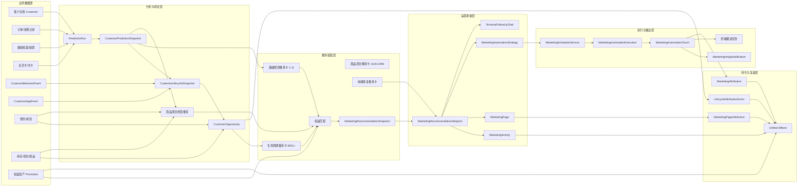
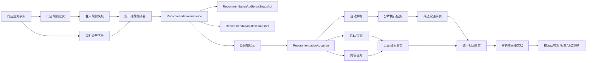

# 智能推荐模块业务架构与数据流审计

> 审计日期：2026-07-13
>
> 审计范围：管理端智能推荐、预测批次、生命周期机会、商品/项目推荐、权益匹配、推荐采纳、自动触达、终端跟进、营销页面、订单归因和数据复盘。
>
> 证据来源：当前工作区代码、Prisma Schema、当前真实数据库只读查询。
>
> 本文只做现状审计和整改设计，不执行数据修复。

## 1. 结论摘要

当前智能推荐已经具备从客户数据到活动、自动触达、终端任务和效果归因的主要组件，但尚未形成单一、稳定、可审计的推荐主链路。

系统当前实际运行的是四套推荐源、三套承接入口、三套行为事件和两套订单归因逻辑。各链路通过固定数字 ID、动态数字 ID、`recommendationKey`、`sourceRecommendationId` 和 JSON 快照交叉关联，缺少统一的“推荐实例”事实表。

本次审计确认 6 个 P0 问题：

1. 手动刷新预测未使用 `X-Store-Id`，已经产生 `storeId=null` 的全局预测批次，并被门店生命周期机会引用。
2. 自动策略受众计算未按门店过滤，执行时读取全局最新预测批次和全量客户。
3. 推荐采纳按门店创建对象，但重新读取推荐时没有携带门店，商品/项目推荐无法被统一采纳，生命周期推荐存在取错门店和取错卡片的风险。
4. 自动执行逐客户串行写库和投递，无断点续跑；真实数据库已有 2 条执行长期停留在 `running`，每条只完成约 60 多位客户，计划受众约 1000 位。
5. 数据复盘把活动、页面、权益、自动触达和推荐来源对同一业务事实重复求和，“全部”汇总会重复计算曝光、转化和收入。
6. 自动触达效果把全部 touch 记录当作已触达，包括 `failed`、`queued` 和旧 `reached`；当前 3705 条 touch 中，符合新归因口径的仅 1869 条，汇总口径多计 1836 条。

因此，当前模块的产品判断是：

- 推荐展示：可用，但总量和新鲜度存在口径混用。
- 推荐受众：基础预测卡可用；生命周期卡、商品项目卡与采纳链路没有统一身份。
- 推荐承接：活动和自动策略具备新事务接口，但旧入口仍在使用；终端跟进未切换统一采纳接口。
- 自动执行：具备调度和真实渠道适配，但不具备大批量稳定执行和失败恢复能力。
- 效果复盘：具备数据来源标签，但“全部汇总”不可信，部分 `actual` 实际来自估算或历史字段。
- 门店隔离：活动、策略、执行主表已隔离；预测、受众、推荐读取、规则模板和部分归因仍存在跨店缺口。

## 2. 当前业务架构



## 3. 当前核心业务流

### 3.1 推荐生成

1. 每天 02:15，`MarketingSchedulerService` 查询启用门店并调用 `runPredictions(storeId)`。
2. 管理端点击“刷新推荐”时，先调用 `/marketing/predictions/run`，再读取 `/marketing/recommendations`。
3. `runPredictions` 读取客户、消费记录、会员卡、健康档案和最近营销转化，生成：
   - RFM/流失评分；
   - 30 天复购评分；
   - 营销响应评分；
   - 6/12 个月 LTV；
   - `CustomerPredictionSnapshot`。
4. 预测完成后同步重建客户生命周期快照和机会。
5. 推荐接口同时装配：
   - 基础预测推荐；
   - 生命周期机会推荐；
   - 商品/项目经营推荐；
   - 权益匹配结果；
   - 5 分钟推荐快照缓存。
6. 前端在服务端推荐之外，再执行逐卡权益匹配；接口失败时使用前端恢复卡。

### 3.2 推荐采纳

当前存在三套入口：

| 入口 | 当前用途 | 现状 |
|---|---|---|
| `POST /recommendations/:id/adoptions` | 新统一采纳接口 | 活动、自动策略已使用 |
| `POST /recommendations/:id/adopt` | 旧采纳事件接口 | 仍保留且不强制门店 |
| `activity-draft` / `automation-draft` / `follow-up-tasks` | 旧分步承接接口 | 仍保留；终端跟进页面仍直接使用 `follow-up-tasks` |

活动模式理论上在一个事务中创建：

`MarketingRecommendationAdoption -> MarketingActivity -> MarketingPage -> MarketingPageVersion`

自动模式创建：

`MarketingAutomationStrategy -> MarketingRecommendationAdoption`

终端模式当前页面没有使用统一采纳接口，而是直接创建 `TerminalFollowUpTask`。

### 3.3 自动触达

1. 调度器每分钟扫描 `status=enabled` 且到达计划时间的策略。
2. 使用“策略 ID + 业务日期 + 时间”作为执行幂等键。
3. 运行时重新计算受众，创建 `MarketingAutomationExecution`。
4. 对每个客户依次创建 `MarketingAutomationTouch` 并调用渠道适配器。
5. `terminal` 创建真实终端任务；`in_app` 创建站内通知；`sms/wechat` 返回未配置失败。
6. 全部客户处理结束后，将执行标记为 `success / partial_failed / failed`。

### 3.4 订单归因和复盘

订单支付后存在两条归因：

- 自动触达：订单匹配最近一次有效 `MarketingAutomationTouch`，写 `MarketingAttribution`。
- 营销页面：订单匹配最近一次 `MarketingPageLead`，写 `MarketingPageAttribution`。

统一复盘再把以下对象分别装配为效果行：

- 活动；
- 自动策略；
- 营销页面；
- 权益资产；
- 智能推荐来源；
- Ami Glow 展示对象。

## 4. 当前数据流和单一真相源

| 业务事实 | 当前主要表 | 当前辅助/重复来源 | 判断 |
|---|---|---|---|
| 门店客户总数 | `Customer` | 推荐卡 `totalCustomers`、预测批次 `customerCount` | 三者含义不同，页面混用 |
| 算法覆盖人数 | `PredictionRun.customerCount` + 快照数 | 推荐卡第一项 `totalCustomers` | 页面当前取错 |
| 推荐命中人数 | 推荐实例受众快照 | 生命周期机会条数、动态查询结果 | 缺少持久化推荐实例 |
| 推荐身份 | 无统一事实表 | 数字 `id`、`recommendationKey`、`sourceRecommendationId` | 核心缺口 |
| 推荐采纳 | `MarketingRecommendationAdoption` | `RecommendationEvent`、活动/策略 JSON | 新旧并存 |
| 真实触达 | `MarketingAutomationTouch.status`、通知/任务状态 | execution `reachedCount` | 历史状态未归一 |
| 自动营销收入 | `MarketingAttribution.attributedRevenue` | touch `actualRevenue` | 可对账，但终端和订单服务实现不一致 |
| 页面营销收入 | `MarketingPageAttribution.attributedRevenue` | lead 状态 | 退款未同步冲减 |
| 推荐来源效果 | 应以 adoption 聚合 | 当前按 `sourceRecommendationId` 和 JSON 提取 | adoption 尚无真实数据 |
| 权益效果 | 权益领取/核销事件 + 订单权益使用 | 活动人数、策略 touch、`usedCount` | 汇总存在重叠 |

## 5. 冗余、交叉和错乱问题

### P0-1：预测刷新绕过门店头，已产生全局批次

**证据**

- 管理端 `runPredictions()` 默认提交空 body。
- Controller 只读取 `dto.storeId`，不读取 `X-Store-Id`。
- 当前真实数据库存在 `storeId=null` 的预测批次 42 个。
- 门店 6 有 39,817 条预测快照挂在全局预测批次下。
- 门店 6 有 228 条生命周期机会挂在全局预测批次下。
- 当前推荐快照的基础卡使用门店批次 43，生命周期卡同时出现全局批次 55，一屏推荐来自不同预测批次。

**产品影响**

- 同一页面不同卡片的数据时间和客户范围不一致。
- 多门店启用后，人工刷新会把多店客户放入同一个预测批次。
- “预测新鲜度”无法代表整屏推荐的新鲜度。

### P0-2：自动策略受众计算没有门店条件

`buildAutomationAudience` 读取：

- 全部未删除客户；
- 全系统最新 completed 预测批次；
- 该批次全部预测快照。

它没有接收或过滤策略的 `storeId`。`executeStrategy` 虽然按门店读取策略，后续受众计算却重新回到全局范围。

**产品影响**

- 多门店环境会跨店触达客户。
- 策略预估人数、执行人数和门店客户数无法对账。
- 当前数据库只有门店 6 有客户，因此问题暂未表现为跨店短信/通知，但代码边界已经失守。

### P0-3：推荐卡没有稳定身份，采纳时会重建并取错

当前推荐 ID 规则：

- 基础预测卡：固定 `1-11`；
- 商品项目卡：按本次数组顺序生成 `2100-2499`；
- 生命周期卡：按本次分组顺序生成 `9001+`；
- 前端恢复卡：临时负数或兼容 ID。

统一采纳服务重新执行 `getRecommendations()`，但未传 `storeId`，也不会查询 `product-project` scope。

**直接结果**

- 商品/项目推荐卡点击统一采纳后无法重新找到。
- 生命周期数字 ID 会随分组顺序变化，同一个 `9001` 不保证始终代表同一机会类型。
- 同一个固定 ID 在不同门店代表不同受众，但采纳读取没有门店范围。
- `recommendationKey` 比数字 ID 稳定，但 adoption 表仍以 `recommendationId Int` 为主关联。

### P0-4：大受众自动执行不可恢复

执行服务当前对客户逐个串行完成：

`create touch -> 调渠道 -> update touch`

缺少：

- 分批领取；
- worker lease；
- 执行心跳；
- 超时回收；
- 从 queued/failed 断点续跑；
- 有限次数重试；
- 单客户幂等唯一键。

当前真实数据：

- 执行 108：计划排队 1009 人，只产生 65 条 touch，状态仍为 `running`。
- 执行 110：计划排队 1008 人，只产生 62 条 touch，状态仍为 `running`。
- 两条执行均开始于 2026-07-13 10:00（Asia/Shanghai）。

这说明当前实现能处理小受众，但无法稳定承载约 1000 人的真实自动任务。

### P0-5：统一效果“全部”汇总重复计算同一事实

同一笔订单收入可能同时出现在：

- 自动策略效果；
- 权益资产效果；
- 智能推荐来源效果。

同一次页面访问可能同时出现在：

- 活动效果；
- 营销页面效果；
- 智能推荐来源效果。

`summarizeUnifiedEffectItems` 直接把所有对象行相加，因此“全部”不是门店去重后的经营总效果，而是多视角对象数据之和。

**产品影响**

- 总收入、总转化、总曝光被重复放大。
- 切换单类型时数据可作为对象分析；停留在“全部”时不能作为经营汇总。

### P0-6：触达数包含失败和排队记录

自动策略效果使用 `strategy.touches.length` 作为 `reachedCount`。当前真实数据库：

| Touch 状态 | 数量 |
|---|---:|
| converted | 99 |
| delivered | 1770 |
| failed | 1374 |
| queued | 2 |
| reached（旧状态） | 460 |
| 合计 | 3705 |

按当前新归因状态，只能确认 `delivered + converted = 1869` 条进入真实触达口径。现有效果汇总会把其余 1836 条也计入触达。

### P1-1：服务端和前端重复匹配权益

- 服务端推荐构建阶段已经匹配权益并生成 `offer`、`primaryPromotion` 和备选权益。
- 管理端拿到推荐后，又对每张卡调用一次 `matchPromotions`。

**影响**

- 推荐列表形成 N+1 请求。
- 页面展示的权益可能与服务端 adoption 重新读取到的权益不同。
- 用户看到的方案和最终创建的活动/策略不能保证一致。

### P1-2：统一采纳接口和旧承接接口并存

当前数据库 `MarketingRecommendationAdoption` 为 0 条，但已有：

- 14 个带 `sourceRecommendationId` 的活动；
- 16 个带 `recommendationId` 的终端跟进任务；
- 434 条推荐事件。

说明业务历史和当前页面仍主要依赖旧事件/旧分步接口，新 adoption 尚未成为推荐闭环的真实主索引。

### P1-3：订单归因逻辑重复且口径不一致

`orders.service.ts` 与 `terminal.service.ts` 各自实现了一套自动营销归因。

- 订单服务只接受 `sent/delivered/opened/clicked/converted`。
- 终端服务仍接受旧 `reached`。

同一业务事实由两个服务维护，后续修改一端容易再次出现口径漂移。

### P1-4：退款只冲减自动触达归因，没有冲减页面归因

`reverseMarketingAttribution` 只更新：

- `MarketingAttribution.attributedRevenue`；
- `MarketingAutomationTouch.actualRevenue`。

没有同步更新 `MarketingPageAttribution.attributedRevenue`。页面效果和活动效果在退款后仍会保留原收入。

### P1-5：指标来源标签与真实计算方法不一致

统一效果给所有对象统一标注：

- 曝光 `actual`；
- 转化 `actual`；
- 收入 `actual`；
- 成本 `estimated`。

但部分活动在没有页面事件时使用 `participants` 作为曝光、使用“参与人数 × 转化率文本”推算转化；权益也会回退到 `usedCount`。这些值不是事件级 actual。

### P1-6：生命周期机会和推荐缓存使用不同失效依据

推荐缓存 key 主要依赖预测批次 ID，缓存 5 分钟；生命周期机会、库存、排班、预约和权益状态可以在预测批次不变时变化。

因此相同预测批次下，缓存不能准确表达所有推荐源的新鲜度。

### P1-7：预测“同店同业务日唯一成功批次”只靠代码检查

Schema 没有业务日字段或数据库唯一约束。多实例、人工刷新和定时任务并发时，仍可同时创建多个 running 批次并分别完成。

### P1-8：执行失败没有重试实现

Touch 有 `attemptCount/errorCode/errorMessage`，但当前首次创建直接写 `attemptCount=1`，失败后不再领取和重试。字段已经存在，执行机制没有落地。

### P2-1：页面本地客户画像与后端预测画像重复

管理端后台加载最多 2000 位客户、健康档案和消费记录，并在浏览器中重新计算 `behaviorProfiles`。它主要用于受众接口失败时的降级，但会带来：

- 大门店前端计算压力；
- 与后端评分口径不一致；
- 降级名单不是推荐生成时的受众快照。

### P2-2：页面总客户数取第一张卡

页面使用 `recommendations[0].totalCustomers`。当第一张卡是生命周期机会时，显示的是该机会命中人数，而不是预测覆盖人数。当前页面显示“1 位客户”即由此产生。

### P2-3：查看权限用户仍能看到执行按钮

路由要求 `core:marketing:view`，页面没有按 `create/update` 权限隐藏或禁用“发布活动、开启自动触达、下发终端任务”等操作，最终依赖后端返回 403。

### P2-4：历史状态没有完成归一

数据库仍存在：

- 460 条 `reached` touch；
- 7 条 `completed` execution；
- 2 条 `running` execution。

新状态机已经启用，但旧状态仍参与汇总和归因，导致统计口径分叉。

## 6. 真实数据库快照

### 6.1 客户和预测

| 项目 | 当前值 |
|---|---:|
| 门店 6 有效客户 | 1252 |
| 最新门店级成功批次 | 43 |
| 批次 43 客户/快照 | 1244 / 1244 |
| 批次 43 完成时间 | 2026-06-17 00:03:28（Asia/Shanghai） |
| 最新全局成功批次 | 55 |
| 批次 55 客户数 | 1252 |
| 批次 55 storeId | null |
| 门店 6 开放机会 | 1454 |

### 6.2 推荐和承接

| 项目 | 当前值 |
|---|---:|
| 最新客户推荐缓存卡片 | 6 |
| 最新商品项目推荐缓存卡片 | 3 |
| Recommendation Adoption | 0 |
| 带推荐来源的活动 | 14 |
| 带推荐来源的终端任务 | 16 |
| RecommendationEvent | 434 |

### 6.3 执行和效果

| 项目 | 当前值 |
|---|---:|
| 自动策略 | 11 |
| enabled | 8 |
| 执行记录 | 104 |
| success | 92 |
| failed | 3 |
| completed（旧状态） | 7 |
| running | 2 |
| Touch 总数 | 3705 |
| 自动归因 | 123 |
| 页面归因 | 1 |

## 7. 建议的目标架构

核心原则：先生成持久化推荐实例，再展示、采纳和归因；任何后续动作都只引用推荐实例，不重新按动态规则猜测原推荐。



### 7.1 推荐实例必须包含

```ts
type RecommendationInstance = {
  id: string;                 // UUID，稳定且全局唯一
  storeId: number;
  recommendationKey: string;  // 业务规则身份
  sourceType: 'prediction' | 'lifecycle' | 'product_project' | 'recovery';
  sourceVersion: string;
  predictionRunId: number | null;
  businessDate: string;
  generatedAt: string;
  expiresAt: string;
  status: 'active' | 'expired' | 'superseded';
  title: string;
  evidenceSnapshot: unknown;
  audienceCount: number;
  audienceSnapshotId: string;
  offerSnapshotId: string | null;
};
```

### 7.2 效果事实必须去重

建立统一营销事实层：

| 事实 | 唯一键示例 |
|---|---|
| 曝光/投递 | `channel + externalDeliveryId` |
| 点击/打开 | `eventSource + eventId` |
| 线索 | `leadId` |
| 订单归因 | `orderId + attributionModel` |
| 退款冲减 | `refundId + attributionId` |

“全部”汇总只汇总事实层一次；活动、推荐、权益、页面和渠道只是切片维度，不再次相加。

## 8. 整改优先级

### 第一批：立即止损

1. 预测 controller 统一从 `X-Store-Id` 取门店，禁止 body/query 覆盖。
2. `buildAutomationAudience` 强制接收 `storeId`，客户、预测批次、快照全部按店过滤。
3. `getRecommendationCardById` 改为按 `storeId + recommendationInstanceId` 查询持久化快照，禁止无门店重建。
4. 商品项目卡、生命周期卡改用稳定推荐实例 ID。
5. 自动效果仅统计 `sent/delivered/opened/clicked/converted`；旧 `reached` 先迁移再退出口径。
6. 暂停或限制单次受众超过安全阈值的自动执行，避免继续产生长期 running。

### 第二批：收敛主链路

1. 页面终端跟进切换到统一 `/adoptions`。
2. 旧 `/adopt`、`activity-draft`、`automation-draft`、`follow-up-tasks` 改为兼容转发并记录弃用日志。
3. 移除前端逐卡权益匹配，服务端返回最终权益快照。
4. adoption 成为活动、策略、页面、终端任务的强关联主索引。
5. 合并 orders/terminal 的营销归因服务，统一有效触达状态。
6. 退款同时冲减自动触达和页面归因。

### 第三批：执行引擎生产化

1. 执行拆为 execution + delivery job 分片。
2. 增加 lease、heartbeat、retryAt、maxAttempts 和 dead-letter 状态。
3. 单客户唯一键：`executionId + customerId + channel`。
4. 批量插入 touch，worker 并发投递，限制单店和单渠道并发。
5. 超时 running 自动恢复或标记 partial_failed。

### 第四批：可信复盘

1. 建立去重事实层，修复“全部”汇总重复计算。
2. 指标 source 由每个计算分支返回，禁止统一硬编码 actual。
3. 分开展示：真实收入、预测收入、估算成本。
4. 推荐效果只按 adoption/recommendation instance 聚合。

## 9. 验收标准

1. 切换门店后，预测批次、推荐实例、受众、采纳对象和效果事实全部改变且无交叉。
2. 人工刷新只生成/复用当前门店当前业务日批次，不再出现新的 `storeId=null` 批次。
3. 任一推荐卡展示、查看受众、采纳和复盘使用同一个 recommendation instance ID。
4. 商品项目推荐可以成功创建活动、自动策略或终端任务。
5. 1000 人受众执行可分片完成；中途重启后继续执行，不重复投递。
6. failed/queued 不计入真实触达。
7. 同一订单在“全部”效果中只计一次收入；切换活动/推荐/权益时只是维度切片。
8. 退款后自动触达和营销页面归因收入同时下降。
9. view-only 用户看不到执行按钮。
10. 历史 `reached/completed/running` 状态完成迁移或被明确排除。

## 10. 最终判断

智能推荐模块的组件完整度已经较高，主要问题不是缺功能，而是缺少统一身份、统一事实层和统一执行边界。继续在现有卡片 JSON、动态 ID 和多套归因上叠加功能，会进一步放大跨店、重复统计和不可恢复执行问题。

下一阶段不应继续增加新的推荐类型，应先完成以下三项架构收敛：

1. 推荐实例化；
2. 门店范围贯穿预测、受众和采纳；
3. 效果事实去重与执行任务分片。

完成这三项后，现有基础预测、生命周期、商品项目、权益、活动、自动触达和终端任务才能真正成为一条稳定的智能营销闭环。
