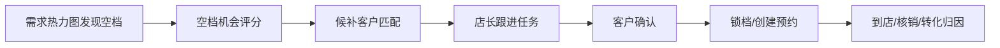

# 需求热力图空档转化自动化升级方案

日期：2026-06-30
适用模块：门店管理 / 排班管理 / 需求热力图 / 项目预约 / 客户营销
目标版本：V1.5 半自动机会闭环，V2 自动确认锁档，V3 全自动补位

## 1. 背景与目标

当前排班页的“需求热力图”已经能基于当前预约、历史预约和原始排班输出“预估客流 / 建议员工 / 已排员工”。但它仍停留在诊断层：告诉店长哪里人手不足或哪里有空档，却没有继续把空档转化为可执行动作。

下一步应升级为“空档经营引擎”：发现未来可售空档后，自动识别最适合补位的客户，提醒店长跟进；再逐步升级到自动发送确认消息、客户确认后锁档、最终无人值守自动补位。

产品目标：

- 降低空档率：把未来 1-7 天可售空档转成预约机会。
- 提升复购：优先触达“该回店但还没约”的客户。
- 减少店长手工筛人：从热力图直接给出候补客户和推荐话术。
- 控制自动化风险：先人工确认，再短信/小程序确认，最后才全自动。

## 2. 外部参考与可借鉴点

Boulevard 公开资料里可参考两类能力：

- Waitlist：客户在没有合适时间时加入候补名单，店家可在日历/看板中管理候补请求，并查看客户、电话、员工、服务、偏好时间和备注；客户也可从自助预约入口加入候补名单。参考：https://support.boulevard.io/en/articles/5941433-waitlist
- REACH.ai / Boulevard 集成：实时扫描未来 7 天的临时空档、取消和预约间隙，自动给“该回店且最可能预约”的客户发邮件或短信，客户通过链接完成预约，预约再回写日历。参考：https://support.boulevard.io/en/articles/7880786-boulevard-integrations

对 Ami 的启发不是单独做一个候补列表，而是把候补、热力图、客户预测、跟进任务、营销触达、小程序预约串起来：



## 3. 当前系统基础

### 已具备

- 排班与预约：`Schedule`、`Reservation`、`SchedulingRuleConfig`、`SmartSchedulingRun`。
- 热力图：`GET /api/scheduling/demand` 已能输出预测时段、建议员工和已排员工。
- 客户预测：`CustomerPredictionSnapshot` 已有流失风险、30 天复购评分、营销响应评分、LTV。
- 终端跟进任务：`TerminalFollowUpTask` 已支持任务、优先级、负责人、状态、关联预约。
- 营销触达记录：`MarketingAutomationTouch`、`MarketingAttribution` 已支持触达和转化归因。
- 小程序预约：客户侧已有可用时间查询与创建预约能力，预约创建会校验占用。
- Agent/终端能力：已有客户优先级排序、营销话术生成、跟进任务创建等基础工具。

### 主要缺口

- 没有“空档机会”对象，无法沉淀空档、候补客户、触达、锁档、转化结果。
- 热力图只展示供需，不输出可执行客户名单。
- 候补客户缺少偏好时间、偏好项目、可触达渠道、同意状态。
- 暂无锁档机制，自动触达后可能出现多人抢同一空档。
- 短信/企微/小程序消息没有统一的预约确认状态机。
- 自动化策略没有风险阈值，容易误触达或误锁档。

## 4. 产品定义

### 4.1 新增概念

#### 空档机会 AppointmentGapOpportunity

系统在未来时间窗口内识别出的可售空档。

核心字段建议：

- `storeId`
- `date`
- `startTime`
- `endTime`
- `beauticianId?`
- `projectIds?`
- `durationMinutes`
- `capacity`
- `source`：heatmap / cancellation / manual / smart_schedule
- `gapType`：underbooked / cancellation / low_utilization / high_demand_unfilled
- `score`
- `status`：open / matching / notified / locked / booked / expired / ignored
- `expiresAt`
- `payload`

#### 候补意向 WaitlistIntent

客户表达或系统推断出的可预约意向。

来源包括：

- 客户自助预约无合适时间后加入候补。
- 店长手工把客户加入候补。
- 系统从客户预测、卡项剩余次数、近期到期、历史项目周期中推断。

核心字段建议：

- `storeId`
- `customerId`
- `preferredProjectIds`
- `preferredBeauticianIds`
- `preferredWeekdays`
- `preferredTimeRanges`
- `minNoticeMinutes`
- `channelConsent`
- `source`：customer_app / manager / prediction / terminal
- `status`：waiting / matched / contacted / confirmed / booked / cancelled / expired
- `payload`

#### 空档匹配 GapCandidate

某个空档下的一名候选客户及评分。

核心字段建议：

- `opportunityId`
- `customerId`
- `waitlistIntentId?`
- `projectId?`
- `score`
- `scoreBreakdown`
- `recommendedChannel`
- `messageTemplate`
- `status`：candidate / task_created / notified / accepted / declined / timeout / booked

#### 空档锁定 GapHold

客户确认或即将确认时，临时锁住空档，防止多人同时占用。

核心字段建议：

- `opportunityId`
- `customerId`
- `reservationId?`
- `holdToken`
- `status`：held / booked / released / expired
- `expiresAt`
- `createdBy`：system / manager / customer

## 5. 业务流程

### V1.5：半自动机会闭环

目标：先让店长看到“这个空档应该找谁”，并一键生成跟进任务。

流程：

1. 热力图加载未来 1-7 天时段。
2. 系统识别空档：
   - 已排员工数 > 已预约占用。
   - 未来有效时段，非过期。
   - 排除请假、非营业时间、资源不可用。
3. 系统匹配候补客户：
   - 有卡项剩余或项目周期到期。
   - 复购评分高。
   - 营销响应评分高。
   - 近期没有未来预约。
   - 偏好时间/美容师/项目匹配。
   - 未被近期频繁触达。
4. 热力图单元格显示：
   - 可售空档数量。
   - 推荐候补客户 Top 3。
   - 预计转化概率。
   - 推荐动作：建任务 / 发短信草稿 / 忽略。
5. 店长点击“生成跟进任务”。
6. 系统创建 `TerminalFollowUpTask`，来源为 `gap_fill`，并关联空档机会。

V1.5 不自动发短信、不锁档，避免过早引入外部渠道和合规风险。

### V2：客户确认与锁档闭环

目标：客户确认后自动锁档，并将候补意向转为正式预约。

流程：

1. 店长从空档机会中选择候选客户。
2. 系统生成短信/小程序确认链接。
3. 客户点击确认。
4. 系统校验空档仍可用：
   - 排班仍可用。
   - 美容师未请假。
   - 时段未被新预约占用。
   - 资源容量未超限。
5. 创建 `GapHold`，锁定 5-10 分钟。
6. 客户确认项目/时间后创建 `Reservation`。
7. `GapHold` 转为 booked，`GapCandidate` 转为 booked。
8. 写入 `MarketingAutomationTouch` / `RecommendationEvent` 做归因。

### V3：全自动补位

目标：系统无人值守补空档，但只在低风险规则下执行。

自动执行前置条件：

- 客户已同意接收营销/预约消息。
- 空档开始时间距离当前时间大于门店配置阈值，例如 6 小时。
- 客户有明确项目意向或系统高置信推荐项目。
- 转化评分达到阈值。
- 最近 N 天未触达超过次数限制。
- 门店开启“自动补空档”策略。
- 高客单/侵入性项目默认不自动预约，只自动邀请。

执行方式：

- 系统扫描未来 7 天空档。
- 每个空档选择 Top N 客户，按批次触达。
- 第 1 个客户确认前不触达下一批，或采用短时间竞价式候补但必须锁档。
- 客户确认后自动创建预约。
- 无响应超时后释放锁档并触达下一位。

## 6. 候补客户匹配算法

### 6.1 输入

- 空档：日期、时间、时长、可用美容师、资源、项目可承接范围。
- 客户：最近到店、历史项目、卡项剩余、卡项到期、消费能力、偏好美容师。
- 预测：`repurchase30dScore`、`marketingResponseScore`、`churnScore`、`ltvTier`。
- 约束：未来已有预约、触达频次、黑名单、渠道同意状态。

### 6.2 评分建议

```text
candidateScore =
  0.25 * timeFitScore
  + 0.20 * projectFitScore
  + 0.20 * repurchaseScore
  + 0.15 * marketingResponseScore
  + 0.10 * cardUrgencyScore
  + 0.05 * beauticianPreferenceScore
  + 0.05 * ltvScore
  - 0.20 * recentTouchPenalty
  - 0.30 * futureReservationPenalty
```

### 6.3 排除规则

- 客户已有同周期未来预约。
- 客户手机号缺失且无小程序身份。
- 客户退订或未授权营销触达。
- 最近 7 天已触达超过配置上限。
- 项目禁忌或美容师技能不匹配。
- 客户被标记为不再营销或黑名单。

## 7. 页面升级

### 7.1 热力图单元格升级

当前：

- 预估客流
- 建议员工
- 已排员工

升级后：

- 空档机会：2 个
- 推荐客户：3 人
- 预计补位率：42%
- 推荐收益：￥688
- 操作：查看候补 / 建任务 / 发确认

### 7.2 右侧机会抽屉

点击热力图单元格后打开：

- 空档信息：时间、可用美容师、可承接项目、预计价值。
- 推荐客户列表：
  - 客户名、电话脱敏、最近到店、推荐项目。
  - 复购评分、响应评分、卡项到期、候补原因。
  - 推荐话术。
  - 操作：建任务、发送确认、加入忽略。
- 风险提示：
  - 未授权短信。
  - 近期已触达。
  - 该客户已有未来预约。
  - 项目与美容师技能不匹配。

### 7.3 经营看板指标

- 未来 7 天空档数。
- 已生成跟进任务数。
- 已触达客户数。
- 客户确认数。
- 成功补位预约数。
- 预计增收 / 实际增收。
- 退订率 / 投诉风险 / 爽约率。

## 8. API 设计

### 查询空档机会

`GET /api/scheduling/gap-opportunities?weekStart=2026-06-29`

返回：

- `opportunities`
- `summary`
- `generatedAt`

### 生成候补客户

`POST /api/scheduling/gap-opportunities/:id/candidates`

参数：

- `limit`
- `projectIds?`
- `channel?`
- `includePredictedIntent`

### 创建跟进任务

`POST /api/scheduling/gap-opportunities/:id/follow-up-tasks`

参数：

- `candidateIds`
- `assigneeRole`
- `dueAt`
- `scriptTemplate`

### 发送确认

`POST /api/scheduling/gap-opportunities/:id/send-confirmation`

参数：

- `candidateId`
- `channel`
- `templateId`
- `holdMinutes`

V1.5 仅生成草稿；V2 开启真实发送。

### 客户确认锁档

`POST /api/customer-app/gap-holds/confirm`

参数：

- `holdToken`
- `customerId`
- `projectId`
- `idempotencyKey`

## 9. 数据模型增量

建议新增：

- `AppointmentGapOpportunity`
- `WaitlistIntent`
- `GapCandidate`
- `GapHold`
- `GapAutomationRule`
- `GapOpportunityEvent`

建议复用：

- `Schedule`
- `Reservation`
- `Customer`
- `CustomerPredictionSnapshot`
- `CustomerCard`
- `TerminalFollowUpTask`
- `MarketingAutomationTouch`
- `RecommendationEvent`
- `CustomerAppEvent`

## 10. 自动化策略与权限

### 策略配置

- 机会扫描窗口：默认未来 7 天。
- 最小空档时长：默认 60 分钟。
- 最短提前触达时间：默认 6 小时。
- 锁档时长：默认 10 分钟。
- 单客户触达频控：7 天不超过 2 次。
- 自动发送渠道：短信 / 小程序服务通知 / 企微，按门店启用。
- 自动创建预约：默认关闭。

### 权限

- `core:store:scheduling:gap:view`
- `core:store:scheduling:gap:task`
- `core:store:scheduling:gap:send`
- `core:store:scheduling:gap:auto`
- `core:store:scheduling:gap:config`

V1.5 可沿用 `core:store:scheduling`，但配置和自动发送必须独立权限。

## 11. 风险与合规

- 短信营销必须有客户授权与退订机制。
- 锁档不能长期占用，否则会降低真实预约转化。
- 自动预约必须保留幂等键，防止重复下单。
- 自动触达必须有频控，避免骚扰客户。
- 高风险项目不应直接自动预约。
- 店长需要能查看每次自动触达的理由、证据和结果。

## 12. 分阶段开发计划

### 阶段 1：V1.5 半自动机会闭环

范围：

- 新增空档机会识别服务。
- 热力图展示空档机会数。
- 点击单元格展示推荐候补客户。
- 一键创建 `TerminalFollowUpTask`。
- 记录机会事件和任务结果。

验收：

- 对未来空档能列出 Top 3 候补客户。
- 推荐客户不能包含已有未来预约客户。
- 任务能在终端/营销跟进任务列表中看到。
- 构建和定向测试通过。

### 阶段 2：V2 确认消息与锁档

范围：

- 新增 `GapHold`。
- 生成客户确认链接。
- 小程序确认后锁档并创建预约。
- 触达和预约转化归因。

验收：

- 同一空档只能被一个客户确认成功。
- 超时未确认自动释放锁档。
- 预约创建仍复用现有可用性校验。
- 转化能回写空档机会和营销触达记录。

### 阶段 3：V3 全自动补位

范围：

- 新增自动补位策略。
- 定时扫描未来 7 天空档。
- 自动触达符合条件客户。
- 客户确认后自动预约。
- 自动化效果看板。

验收：

- 门店未开启策略时不自动触达。
- 命中频控和授权规则。
- 自动预约全链路有审计记录。
- 可按门店关闭、暂停、回滚策略。

## 13. 建议优先级

建议先开发 V1.5，不直接做 V3。

原因：

- 当前系统已有热力图、客户预测、跟进任务，V1.5 能最快形成交付价值。
- 自动短信和锁档需要补齐合规、授权、幂等和消息通道，不宜一步到位。
- 店长先使用半自动任务一段时间，可以反向验证候补评分是否准确。
- 有了任务转化数据后，再训练或调优 V2/V3 的自动匹配阈值更稳。

## 14. 下一步任务卡

1. 后端新增 `GapOpportunityService`，从 `Schedule + Reservation + SchedulingRuleConfig` 生成未来 7 天空档机会。
2. 后端新增候补客户匹配器，复用 `CustomerPredictionSnapshot + CustomerCard + Reservation + TerminalFollowUpTask`。
3. 前端热力图单元格增加空档机会入口和候补客户抽屉。
4. 对接 `TerminalFollowUpTask`，支持从空档机会一键生成店长跟进任务。
5. 增加单测：空档识别、已有预约排除、触达频控、候补评分排序。
6. 增加运行记录：机会生成、候选客户、任务创建、转化结果。

## 15. V1.5 实施落地说明

本轮先完成“半自动机会闭环”，目标是让需求热力图不仅提示人手不足，还能把未来可售空档转成店长可跟进的客户机会。V1.5 不发送真实短信、不锁档、不自动创建预约。

### 15.1 数据表

新增三张持久化表：

- `AppointmentGapOpportunity`：空档机会，按门店、日期、开始时间、结束时间唯一记录可售容量、已预约数、候选客户数、预计补位率和推荐收益。
- `AppointmentGapCandidate`：机会候选客户，记录客户、推荐项目、分数、预计补位率、推荐收益、推荐原因、风险提示、话术草稿和任务状态。
- `AppointmentGapOpportunityEvent`：机会事件，记录机会生成、候选刷新、跟进任务创建、确认草稿生成等动作。

V1.5 未新增 `GapHold`、`WaitlistIntent`。锁档、客户确认链接、自助候补意愿留到 V2。

### 15.2 API 实际口径

- `GET /api/scheduling/gap-opportunities?weekStart=YYYY-MM-DD`
  - 生成或刷新当前门店指定周的未来空档机会。
  - 返回机会列表、每个机会 Top 候选客户和周汇总指标。
  - 只统计未来时段；过期时段、请假时段、已被有效预约占满的时段不生成机会。

- `POST /api/scheduling/gap-opportunities/:id/candidates`
  - 重算并持久化指定机会候选客户。
  - 候选客户会排除已有未来预约、近期高频触达、无可触达信息的客户。

- `POST /api/scheduling/gap-opportunities/:id/follow-up-tasks`
  - 为选中候选客户创建 `TerminalFollowUpTask`。
  - 写入 `source=gap_fill`、`triggerType=appointment_gap`、`sourceRecommendationKey=gap:{opportunityId}:{customerId}`。
  - 同一个机会和客户重复创建时按幂等键返回既有任务，不重复打扰店长。

- `POST /api/scheduling/gap-opportunities/:id/confirmation-draft`
  - 只生成确认消息草稿并写入事件。
  - 返回字段包含 `sent=false`，前端明确展示“未发送”。
  - 不调用短信、企微、小程序或任何真实触达通道。

### 15.3 候选评分口径

候选评分综合以下信号：

- 时间匹配：客户历史预约偏好是否接近当前空档时段。
- 项目匹配：客户预测项目、卡项项目、历史项目是否与可售项目匹配。
- 复购分：来自 `CustomerPredictionSnapshot.repurchaseProbability`，无快照时按卡项和历史预约降级估算。
- 营销响应分：来自预测快照的响应概率；无快照时使用保守默认值。
- 卡项紧迫度：客户卡剩余次数、有效期和权益可用性。
- 美容师偏好：历史预约中是否偏好当前可用美容师。
- LTV：客户累计消费或预测价值。
- 惩罚项：已有未来预约、近期触达过多、待处理跟进任务过多会被排除或降权。

### 15.4 前端体验

需求热力图维持与原始周视图一致的表格结构：

- 单元格只显示需求和排班负荷信息：预估客流、建议员工、已排员工、负荷状态或人手缺口。
- 空档机会、推荐客户、预计补位率和预计收益不再塞进格子，避免热力图阅读负担过重。
- 在热力图右侧新增固定区域「空档推荐客户名单」，按当前查看周聚合推荐客户。
- 右侧名单以“客户”为主对象，而不是以“时段格子”为主对象，默认按补位概率、预计收益、推荐分排序。
- 每条推荐展示客户名称、补位概率、推荐原因、推荐项目、建议预约日期和时段。
- 每条推荐提供「客户详情」和「下发跟进」两个操作。
- 「客户详情」打开弹窗，展示客户基础信息、推荐项目、建议预约时段、补位概率、推荐原因、风险提示和推荐话术。
- 「下发跟进」打开确认弹窗，确认后创建 `TerminalFollowUpTask`，来源为 `gap_fill`，触发类型为 `appointment_gap`。
- 确认消息草稿仍可保留为后续操作，但 V1.5 页面主操作先聚焦“下发跟进”，不展示任何已发送或锁档成功状态。
- 草稿只显示“未发送”，不展示任何已发送或锁档成功状态。

推荐名单的信息结构建议如下：

```text
空档推荐客户名单（本周）
客户名称 | 补位概率 | 推荐原因 | 推荐项目 | 建议预约时段 | 操作
张三     | 72%      | 卡项即将到期、常约下午 | 肩颈舒压养护 | 07-02 14:00~15:00 | 客户详情 / 下发跟进
```

交互优先级：

1. 热力图格子用于判断“这个时段负荷是否合理”。
2. 右侧名单用于处理“本周哪些客户最适合补位”。
3. 店长不需要先点击某个格子才能看到候选客户，降低发现机会的操作成本。
4. 如果店长需要按时段筛选，后续可在名单上方增加“全部 / 上午 / 下午 / 晚上 / 指定日期”筛选，不回退到格子内堆信息。

### 15.5 验收清单

- 有未来可用排班且未被预约占用时，能生成空档机会。
- 已预约、请假、过期和非营业时间不生成可售机会。
- 候选客户不包含已有未来预约客户。
- 候选客户不包含近期高频触达或无可触达信息客户。
- 候选排序能体现预测复购、营销响应、卡项紧迫度和历史偏好。
- 从机会创建跟进任务后，候选状态变为 `task_created`。
- 生成确认草稿后只展示草稿和“未发送”，不触发真实发送。
- 需求热力图格子只展示需求和排班负荷指标。
- 右侧「空档推荐客户名单」能按周展示推荐客户、补位概率、推荐原因、推荐项目和建议预约时段。
- 点击「客户详情」能打开客户详情弹窗。
- 点击「下发跟进」能打开确认弹窗，并成功创建 `TerminalFollowUpTask`。

### 15.6 V2 遗留项

- 客户确认链接和小程序确认页。
- `GapHold` 锁档、超时释放和并发确认控制。
- 自动发送短信、企微或小程序订阅消息。
- 客户确认后自动创建预约。
- 空档机会转化归因看板。
- 门店级自动补位策略、频控策略和灰度开关。
