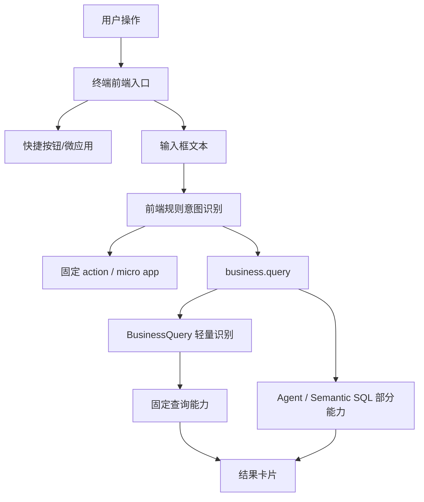
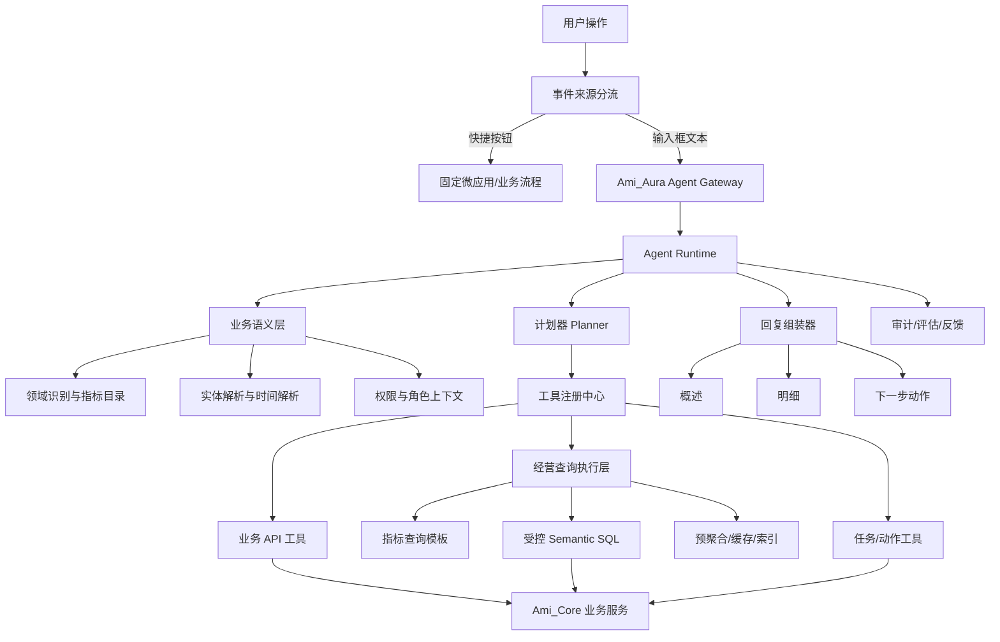
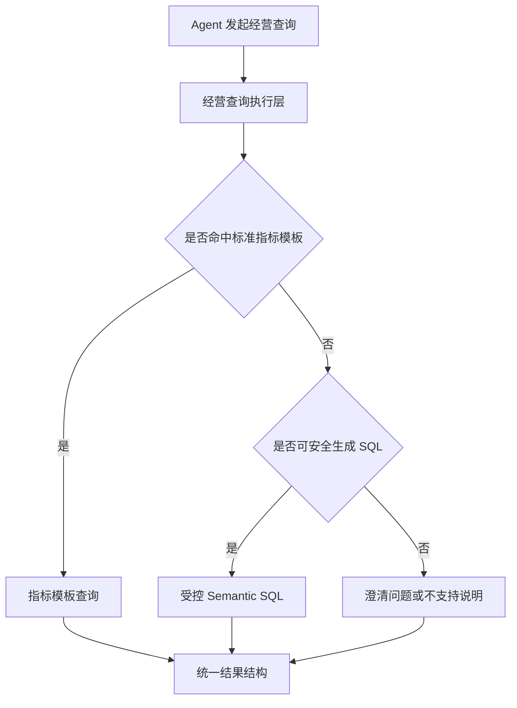

# Ami_Aura 智能体升级方案

版本：v1.0  
日期：2026-06-25  
适用范围：Ami_Aura Lite 智能终端、Ami_Core 后端、经营问答、快捷操作、业务工具、语义查询、审计与评估  
文档目标：基于当前终端智能问答的真实问题，结合最新企业级 Agent 落地趋势，给出可执行的 Ami_Aura 智能体升级方案，替代“关键词补丁 + 局部问数工具”的现状。

## 1. 背景与结论

当前 Ami_Aura 智能问答的问题不是某几个问法没覆盖，而是架构上仍偏“前端意图规则 + 少量固定问数能力 + 兜底回复”。这种模式面对美业门店自然语言经营问题时，会持续出现以下问题：

1. 用户输入随机，关键词规则无法穷举。
2. “输入框问答”和“快捷按钮固定操作”曾经互相干扰，说明入口事件边界不够强。
3. BusinessQuery、Semantic SQL、Agent 工具边界重叠，容易出现同一问题多套识别、不同结果。
4. 回复形态不稳定，有时像报表，有时像内部调试输出，有时答非所问。
5. 查询结果缺少统一证据、权限、口径和质量评估链路，用户难以判断是否可信。
6. 每次用户提出新问法就补一个工具或关键词，会造成维护成本线性上升，最终不可控。

结论：Ami_Aura 应升级为“事件来源分流 + 经营 Agent Runtime + 业务语义层 + 受控工具/查询层 + 可观测评估”的智能体架构。自然语言只进入 Agent Runtime；快捷按钮只进入固定业务流程；数据库查询、BusinessQuery 和 Semantic SQL 不再并列，而是合并为 Agent 的受控执行层。

## 2. 行业趋势借鉴

### 2.1 主流趋势

| 趋势 | 行业做法 | 对 Ami_Aura 的启示 |
| --- | --- | --- |
| Agent 不等于聊天框 | OpenAI、Anthropic 等都强调模型需要通过工具、上下文、规划和执行完成任务 | Ami_Aura 不能只做“问一句答一句”，必须能选择工具、解释数据、生成下一步动作 |
| 工具调用成为核心 | OpenAI Agents SDK、MCP、企业 Agent 平台都把工具注册、调用、追踪作为基础能力 | 把客户、订单、预约、库存、财务等封装成可治理工具，而不是让模型自由猜 |
| 工作流与 Agent 分层 | Anthropic 区分 workflows 和 agents：明确流程用工作流，开放问题用 agent | 收银、预约、核销等固定动作走工作流；经营问答、分析建议走 Agent |
| 多 Agent / 跨系统协作 | Google A2A、MCP 等推动 Agent 与工具、Agent 与 Agent 之间互操作 | 后续可扩展店长 Agent、前台 Agent、美容师 Agent、财务 Agent，但先从单 Runtime + 多能力域做起 |
| 企业级权限与审计 | Microsoft Copilot Studio、Salesforce Agentforce、ServiceNow AI Agents 都强调权限、审批、审计、可控执行 | Ami_Aura 必须继承当前账号、门店、角色权限，所有查询和动作可追溯 |
| 结果可验证 | 企业 Agent 落地强调 grounding、数据来源、执行日志和质量评估 | 回复不能只给自然语言，要有数据依据、查询口径、工具调用记录和用户可理解结论 |
| 人在回路 | 对高风险动作引入确认、审批、人工接管 | 群发营销、退款、改价、批量任务等必须确认后执行 |

### 2.2 可借鉴来源

- OpenAI Agents：强调 Agent 构建由模型、工具、指令、交接、护栏和追踪组成，适合 Ami_Aura 的 Runtime 与工具治理。
- Anthropic effective agents：强调先用简单、可组合的模式，区分固定 workflow 与自主 agent，适合解决当前“快捷按钮和问答混用”的问题。
- Model Context Protocol：提供统一工具/资源/上下文接入模式，适合后续把 Ami_Core 能力标准化开放给 Agent。
- Google Agent2Agent：强调 Agent 之间的互操作和任务协作，适合后续多角色 Agent 扩展。
- Microsoft Copilot Studio、Salesforce Agentforce、ServiceNow AI Agents、UiPath agentic automation：共同指向企业 Agent 的权限、动作、流程、审计、人工确认和自动化治理。

## 3. 当前 Ami_Aura 智能问答架构缺陷

### 3.1 当前结构



### 3.2 主要问题

| 问题 | 表现 | 产品影响 |
| --- | --- | --- |
| 多套识别并存 | 前端规则、BusinessQuery、Agent、Semantic SQL 都在判断用户意图 | 同一句话可能走不同路径，导致答非所问 |
| 关键词补丁过多 | 新问法依赖新增规则 | 维护成本高，覆盖不了自然语言 |
| 查询层重复 | BusinessQuery 和 Semantic SQL 都在承担“问数”职责 | 能力边界不清，数据口径容易不一致 |
| 快捷操作与自然语言边界弱 | 输入框文本可能误触发快捷功能 | 用户输入消失、结果错位，体验不可信 |
| 回复结构不统一 | 概述、明细、下一步动作不稳定 | 用户看不懂，无法行动 |
| 内部信息外露 | 字段名、规则、执行口径、英文枚举展示给美业用户 | 产品显得不专业 |
| 缺少质量评估闭环 | 失败原因、命中工具、用户反馈未形成可运营数据 | 只能被动修 bug，不能系统提升 |

## 4. 目标架构

### 4.1 架构原则

1. 输入框自然语言只进入 Agent Runtime，不再直接映射快捷 action。
2. 快捷按钮只进入固定微应用或固定业务流程，不进入 AI 语义识别。
3. BusinessQuery 与 Semantic SQL 合并为“经营查询执行层”，由 Agent 调度。
4. Agent 不直接裸查数据库，不绕过业务权限，不直接生成高风险动作。
5. 所有回复统一为“概述、明细、下一步动作”三段结构。
6. 对用户隐藏内部规则、字段名、SQL、调试信息，仅展示可理解的业务口径。
7. 每次问答必须留存：原始问题、识别结果、工具调用、查询证据、权限过滤、回复质量、用户反馈。

### 4.2 升级后结构



### 4.3 合并后的关键模块

| 模块 | 定位 | 是否新增 | 原因 |
| --- | --- | --- | --- |
| 事件来源分流 | 区分快捷按钮和输入框 | 优化 | 从交互源头杜绝互相干扰 |
| Agent Gateway | 终端自然语言唯一入口 | 新增 | 统一上下文、账号、门店、会话、权限 |
| Agent Runtime | 负责理解、规划、工具调用、回复 | 新增 | 替代前端关键词和 BusinessQuery 自识别 |
| 业务语义层 | 管理领域、指标、实体、时间、口径 | 新增 | 解决自然语言随机性与业务口径不一致 |
| 工具注册中心 | 管理可调用业务能力 | 新增 | 防止模型越权或乱调接口 |
| 经营查询执行层 | 合并 BusinessQuery 与 Semantic SQL | 优化 | 一个问数入口，多种执行方式 |
| 业务 API 工具 | 封装预约、客户、订单、库存等 API | 保留并重封装 | 复用 Ami_Core 能力，但以 Agent 工具形式开放 |
| 回复组装器 | 统一概述、明细、下一步动作 | 新增 | 保证用户体验一致 |
| 审计与评估 | 记录、评测、回放、持续优化 | 新增 | 从被动修补变成可运营优化 |

## 5. 经营查询执行层设计

### 5.1 为什么合并 BusinessQuery 与 Semantic SQL

BusinessQuery 和 Semantic SQL 本质都在解决“把用户经营问题转成可信数据结果”。如果继续并列，会出现两个问题：

1. 能力重复：都要识别领域、时间、指标、筛选条件。
2. 口径分裂：同一问题可能走模板，也可能走 SQL，结果不一致。

合并后，Agent 只看到一个“经营查询工具”。工具内部再决定执行方式：



### 5.2 执行策略

| 问题类型 | 推荐执行方式 | 示例 |
| --- | --- | --- |
| 高频指标 | 标准指标模板 | 今日营业额、近 7 天收银趋势、最近销量好的商品 |
| 排行/TopN | 标准查询模板 | 今天最值得跟进的 10 个客户、员工业绩排行 |
| 多条件筛选 | 受控查询构造器 | 最近 60 天未到店且有可用次卡的客户 |
| 临时分析 | 受控 Semantic SQL | 上周综合养护次卡收入增长原因 |
| 写操作 | 业务 API 工具 + 确认 | 创建跟进任务、生成活动草稿 |
| 高风险动作 | 审批/人工确认 | 群发、退款、批量改价、删除 |

### 5.3 安全边界

1. 只允许查询白名单表、白名单字段、白名单聚合函数。
2. SQL 必须只读，禁止 INSERT、UPDATE、DELETE、DDL。
3. 必须自动注入 storeId、角色权限、字段权限。
4. 限制行数、超时、扫描范围和时间窗口。
5. 查询结果必须转换成业务字段中文名。
6. 对手机号、身份证、隐私备注等字段按权限脱敏。
7. 无法确认口径时必须追问，不允许编造。

## 6. Ami_Aura 角色与能力域

### 6.1 首期角色

| 角色 | 自然语言问答能力 | 可执行动作 |
| --- | --- | --- |
| 店长 | 经营概览、收入变化、客户跟进、员工业绩、库存风险、预约异常 | 生成跟进任务、查看明细、生成活动草稿 |
| 前台 | 今日预约、客户查询、权益查询、收银核销上下文、到店登记 | 跳转收银、创建预约、登记到店、创建跟进 |
| 美容师 | 我的预约、我的客户、护理建议、个人提成、服务记录 | 填写服务记录、更新客户跟进、查看护理建议 |
| 收银 | 今日收银、订单明细、核销记录、充值办卡、异常流水 | 跳转收银、查看订单、打印小票 |
| 管理员 | 用户、权限、门店配置、工具授权、审计 | 配置 Agent 工具、查看问答日志、调整权限 |

### 6.2 借鉴六大角色 Agent 的能力包

`Ami_Agent_六大角色Agent详细开发计划.md` 中的六大角色设计可以作为 Ami_Aura 的后台能力包，但不建议在终端上直接做 6 个独立 Agent 入口。Ami_Aura 的用户交互应保持一个输入框和一组固定快捷操作，底层根据当前账号、门店、权限和问题语义自动选择能力包。

| 能力包 | Ami_Aura 中的使用方式 | 直接借鉴内容 | 改造点 |
| --- | --- | --- | --- |
| 店长经营 Agent | 店长账号默认启用，回答经营、预约、客户、员工、库存综合问题 | 今日经营简报、客户风险、预约异常、员工表现、库存提醒 | 不做独立 Workspace，转为终端结果卡片 |
| 营销增长 Agent | 店长、运营、管理员可用，用于客群、活动、话术和复盘 | 客群筛选、活动草稿、触达话术、效果复盘 | 群发、发券、活动发布必须确认或审批 |
| 前台接待 Agent | 前台和店长可用，服务查客户、查预约、解释权益、建跟进 | 客户摘要、预约上下文、卡项权益、收银/核销跳转 | 固定业务动作仍进入快捷流程，不让 Agent 模拟点击 |
| 美容师服务 Agent | 美容师只看本人预约、客户、服务记录、提成相关数据 | 今日服务准备、护理建议、服务记录草稿、复购机会 | 严格限制本人数据，店长查看需管理权限 |
| 库存采购 Agent | 店长、库存、采购角色可用 | 缺货、临期、消耗趋势、补货草稿、供应商建议 | 终端只生成建议/草稿，不自动采购 |
| 财务风控 Agent | 店长、财务、老板、管理员按权限启用 | 收入、退款、成本、毛利、提成、异常流水 | 成本、毛利、提成必须字段级授权和脱敏 |

### 6.3 角色工具包与权限矩阵

六大角色计划里的“工具清单 + 风险等级 + 权限要求”应下沉为 Ami_Aura 的工具注册配置。终端不直接暴露复杂工具名，但 Agent Runtime 必须知道每个工具的适用角色、输入输出、风险等级和审批策略。

| 工具包 | 代表工具 | 默认可用角色 | 风险等级 | 执行策略 |
| --- | --- | --- | --- | --- |
| 经营分析 | 今日经营、收入诊断、预约异常、客户风险排行 | 店长、老板、管理员 | 低 | 权限通过后直接查询 |
| 客户跟进 | 跟进客户推荐、跟进任务草稿、跟进记录查询 | 店长、前台、美容师 | 中 | 查询直接执行，创建任务需确认 |
| 营销增长 | 客群筛选、活动草稿、话术生成、活动复盘 | 店长、运营、老板 | 中/高 | 生成草稿直接执行，触达/发券需审批 |
| 前台接待 | 查客户、查预约、查权益、收银/核销跳转 | 前台、店长 | 低/中 | 查询直接执行，写操作进入固定流程 |
| 美容师服务 | 今日服务、护理建议、服务记录草稿、个人提成 | 美容师、店长 | 低/中 | 本人数据直接查询，跨人查看需权限 |
| 库存采购 | 库存风险、补货建议、临期处理、耗材消耗 | 店长、库存、采购 | 中 | 只生成建议或采购草稿 |
| 财务风控 | 收入、退款、利润、提成、异常流水 | 财务、老板、店长 | 高 | 字段权限校验，敏感动作只建议不执行 |
| 系统治理 | Agent 工具授权、审计、评测、账号权限 | 管理员 | 高 | 只允许管理端执行，终端不开放 |

### 6.4 业务领域覆盖

| 领域 | 必须覆盖的问题 |
| --- | --- |
| 商品 | 销量、趋势、活动适合度、库存、毛利、滞销、热销 |
| 项目 | 项目销量、耗材、服务时长、复购、满意度、搭配推荐 |
| 客户 | 新客、活跃、沉睡、流失、复购、会员、标签、跟进优先级 |
| 预约 | 今日/明日/下周预约、到店率、爽约、排班冲突 |
| 排班 | 员工排班、忙闲状态、占用率、请假、服务负载 |
| 订单 | 收入、订单数、客单价、订单明细、退款、异常 |
| 卡项 | 次卡、会员卡、充值、余额、有效期、核销、消耗 |
| 财务 | 收入、成本、利润、提成、费用、结算、现金流 |
| 库存 | 库存不足、临期、消耗、补货、供应商、耗材联动 |
| 营销 | 活动建议、目标客群、权益、话术、触达、复盘 |
| 员工 | 业绩、提成、服务客户、复购贡献、服务质量 |
| 系统 | 用户、权限、门店、终端、审计、工具配置 |

## 7. 回复体验规范

所有 Agent 回复统一成一个卡片，固定结构：

1. 概述：直接回答用户问题，包含结论、原因、关键数字和建议。
2. 明细：如果有数据，展示列表、排行、趋势或明细卡；没有数据时说明无数据原因。
3. 下一步动作：最多 3 个按钮，进入固定功能或创建可确认任务。

示例：

```text
概述
最近 7 天收银收入为 ¥36,160，比前 7 天增加 ¥8,240，主要来自次卡订单增加和客单价提升。

明细
1. 6月18日：收入 ¥8,616，订单 3 笔
2. 6月17日：收入 ¥5,280，订单 2 笔
3. 6月16日：收入 ¥4,920，订单 2 笔

下一步动作
[查看订单明细] [查看收入来源] [生成复盘建议]
```

展示要求：

1. 不展示英文枚举，如 recommended、opportunity。
2. 不展示内部字段名，如 customerPredictionSnapshot、riskScoreFormula。
3. 不展示 SQL、内部路由、工具 code、debug 信息。
4. 数据口径放到“数据说明”折叠区，默认收起。
5. 复杂规则只展示用户可理解版本，例如“按最近到店、消费金额、复购机会综合排序”。

## 8. 分阶段开发计划

### 8.1 P0：止血与架构收口

目标：解决当前最影响信任的问题，停止继续打关键词补丁。

| 任务 | 交付物 | 验收标准 |
| --- | --- | --- |
| 事件来源分流固化 | 输入框、快捷按钮事件协议 | 输入框任何文本不触发快捷功能；快捷按钮不进入问答 |
| Agent Gateway 统一入口 | `/agent/run` 或现有 Agent 入口升级 | 自然语言统一进入 Agent，不再由前端规则决定业务工具 |
| 合并查询入口 | 经营查询工具 facade | BusinessQuery 与 Semantic SQL 不再由前端分别调用 |
| 回复卡片统一 | AgentResultCard v2 | 所有问答显示概述、明细、下一步动作 |
| 中文化与内部信息隐藏 | 字段映射、枚举映射、调试信息过滤 | 页面不出现英文枚举、字段名、SQL、内部规则 |
| 基础评测集 | 50 条真实门店问法 fixture | 常见问法正确路由、无误触发、无编造 |

建议周期：1 到 2 周。

### 8.2 P1：经营语义层与高频能力覆盖

目标：让常规经营问题稳定可用。

| 任务 | 交付物 | 验收标准 |
| --- | --- | --- |
| 领域与指标目录 | 商品、项目、客户、订单、财务、库存、预约等指标字典 | 每个指标有中文名、口径、权限、执行方式 |
| 时间解析 | 今日、昨天、本周、下周、近 7 天、近 30 天等解析器 | 时间表达不再靠关键词硬编码 |
| 实体解析 | 客户、员工、商品、项目、卡项实体识别 | 支持同名、手机号、别名、模糊匹配 |
| 高频查询模板 | 收入趋势、商品趋势、客户跟进、员工业绩、库存风险等 | 100 条真实问法通过率不低于 85% |
| 角色权限上下文 | 店长、前台、美容师、收银、管理员 | 不同角色只能看到授权数据 |
| 问答日志与回放 | AgentRun、ToolCall、AnswerFeedback | 可追踪每次失败原因 |

建议周期：2 到 4 周。

### 8.3 P2：受控 Semantic SQL 与复杂分析

目标：支持非穷举经营问法，但仍保持安全可控。

| 任务 | 交付物 | 验收标准 |
| --- | --- | --- |
| 语义 SQL 白名单 | 表、字段、JOIN、聚合、排序、限制规则 | 禁止越权、写操作和大范围扫描 |
| SQL 生成与校验 | 生成、静态检查、解释、执行、结果归一 | SQL 必须经过校验才能执行 |
| 查询成本控制 | timeout、limit、采样、缓存 | 慢查询不拖垮终端体验 |
| 复杂问题澄清 | 不明确时追问 | 不再用“暂时无法回复”替代澄清 |
| 多步分析 | 查询、归因、建议、动作串联 | 能回答“为什么增长/下降”“该跟进谁”“怎么做活动” |
| 评估门禁 | 自动评测 + 浏览器回归 | 新增工具必须带评测样例 |

建议周期：4 到 6 周。

### 8.4 P3：轻量任务画布与可执行经营 Agent

目标：从问答升级为可执行经营助手。

| 任务 | 交付物 | 验收标准 |
| --- | --- | --- |
| 轻量任务画布 | 结果卡片 + 明细组件 + 动作按钮 + 折叠数据说明 | 终端不做独立 Workspace，但能承接复杂结果 |
| 跟进任务 Agent | 推荐客户、生成跟进任务、记录跟进结果 | 能闭环管理端下发任务和终端执行 |
| 营销活动 Agent | 客群筛选、活动草稿、话术、复盘 | 高风险动作需确认，不自动群发 |
| 库存采购 Agent | 补货建议、采购草稿、耗材联动 | 只生成建议或草稿，不自动采购 |
| 服务建议 Agent | 美容师客户护理建议、复购机会 | 与服务记录、客户标签、项目历史联动 |
| 多角色协同 | 店长下发、员工执行、系统追踪 | 权限和审计完整 |

建议周期：6 到 10 周。

## 9. 技术实施拆解

### 9.1 后端

| 模块 | 主要工作 |
| --- | --- |
| Agent Runtime | 统一请求协议、上下文、计划、工具调用、错误处理 |
| Agent Tool Registry | 工具 schema、权限、风险等级、输入输出规范 |
| Business Query Executor | 合并 BusinessQuery 与 Semantic SQL，输出统一 QueryResult |
| Semantic Layer | 领域、指标、实体、时间、同义词、口径配置 |
| Permission Guard | 账号、角色、门店、字段、动作权限注入 |
| Audit & Eval | AgentRun、ToolCall、QueryEvidence、Feedback、EvalCase |
| Safety Layer | 中文化、脱敏、内部信息过滤、幻觉检查 |
| Approval Policy | 查询、草稿、确认、审批、禁止动作的分级策略 |

### 9.2 终端前端

| 模块 | 主要工作 |
| --- | --- |
| 输入框 | 只提交自然语言，不再映射快捷 action |
| 快捷按钮 | 只触发固定微应用，带 eventSource=quickAction |
| Agent 卡片 | 概述、明细、下一步动作、折叠数据说明 |
| 轻量任务画布 | 承接客户列表、趋势、草稿、审批状态、执行结果 |
| 会话 | 按账号隔离历史，保留用户原始输入 |
| 操作按钮 | Agent 返回动作按钮，但点击后进入固定业务流程 |
| 反馈 | 有用/无用、答非所问、数据不对、缺少明细 |

### 9.3 管理端

| 模块 | 主要工作 |
| --- | --- |
| Agent 审计 | 查看问答、工具调用、查询结果、失败原因 |
| 工具授权 | 按角色配置可用工具和风险等级 |
| 指标口径 | 配置或查看指标定义 |
| 评测集管理 | 录入真实问题、期望领域、期望工具、期望回答结构 |
| 反馈运营 | 聚合低分问题，生成修复优先级 |

## 10. 数据模型建议

| 表/模型 | 用途 |
| --- | --- |
| AgentRun | 一次用户问答或任务运行 |
| AgentMessage | 用户输入、系统回复、工具摘要 |
| AgentToolCall | 工具调用记录、耗时、状态、错误 |
| AgentQueryEvidence | 查询来源、口径、时间范围、结果摘要 |
| AgentFeedback | 用户反馈、纠错、采纳情况 |
| AgentCapability | 工具能力目录 |
| AgentPersona | 角色能力包配置，不作为终端强制入口 |
| AgentToolDefinition | 工具目录、schema、权限、风险等级、启用状态 |
| AgentApproval | 高风险动作确认、审批、驳回记录 |
| AgentRenderedBlock | 终端轻量任务画布的结构化输出块 |
| BusinessMetric | 指标定义、口径、权限、默认执行方式 |
| BusinessEntityAlias | 客户、员工、商品、项目等同义词和别名 |
| AgentEvalCase | 评测样例、预期结果、回归状态 |

### 10.1 数据模型取舍

| 六大角色计划中的模型 | Ami_Aura 是否采用 | 说明 |
| --- | --- | --- |
| AgentDefinition / AgentRun / AgentMessage / AgentToolCall | 采用 | 是问答、工具调用、审计的基础 |
| AgentPersona | 采用但弱化前端入口 | 用于后台能力包和权限配置，不要求用户手动切 Agent |
| AgentRenderedBlock | 采用轻量版 | 用于统一结果卡片、明细、动作按钮，不做完整独立任务画布 |
| AgentApproval | 采用 | 支撑营销、财务、采购、批量任务等高风险动作 |
| AgentEvalCase / AgentEvalRun | 采用 | 作为智能问答质量门禁 |
| AgentMemory / AgentDailyArchive | 后续采用 | 首期只做账号隔离和会话保留，长期记忆放到 P3 后 |
| AgentAutomationDefinition / AgentAutomationRun / AgentAutomationEffect | 暂不首期采用 | 自动化执行风险高，放到 P3/P4，先做草稿和确认 |

## 11. 质量指标

| 指标 | P0 目标 | P1 目标 | P2 目标 |
| --- | --- | --- | --- |
| 输入框误触发快捷功能 | 0 | 0 | 0 |
| 高频问法正确路由率 | 70% | 85% | 92% |
| 有数据问题可回答率 | 60% | 80% | 90% |
| 无编造率 | 95% | 98% | 99% |
| 回复中文化通过率 | 95% | 98% | 99% |
| 平均首屏响应 | 2 秒内 | 2 秒内 | 2 秒内 |
| 工具调用成功率 | 85% | 92% | 95% |
| 用户采纳/点击下一步动作率 | 20% | 30% | 40% |

## 12. 风险与控制

| 风险 | 控制策略 |
| --- | --- |
| 模型误判业务意图 | 语义层 + 工具 schema + 评测集，不靠单次 prompt |
| SQL 越权或慢查询 | 白名单、只读、权限注入、limit、timeout、缓存 |
| 用户看到内部字段 | 输出安全层统一中文化和过滤 |
| 业务口径不一致 | 指标目录统一维护，工具只返回标准结构 |
| 多角色权限混乱 | Agent actor 绑定当前账号、门店、角色 |
| 成本过高 | 高频模板优先，LLM 只做理解/归纳，不做所有查询 |
| 持续维护困难 | 评测集驱动迭代，新增能力必须带 fixture 和门禁 |

## 13. 与当前方案及六大角色 Agent 计划的取舍

| 当前做法 | 升级后做法 | 原因 |
| --- | --- | --- |
| 前端规则识别大量自然语言 | 前端只做事件来源分流 | 前端不适合承担语义理解 |
| BusinessQuery 自己识别能力 | 合并到经营查询执行层 | 避免多套识别 |
| Semantic SQL 独立存在 | 作为查询执行方式之一 | SQL 是执行层，不是产品入口 |
| 回复里展示证据规则 | 默认隐藏内部规则，只显示业务说明 | 用户是美业从业者，不是开发者 |
| 缺少失败反馈闭环 | AgentRun + Eval + Feedback | 让质量可衡量、可回归 |
| 新问法就补关键词 | 新问法进入评测集，补语义层/工具能力 | 从补丁模式转为能力建设 |

### 13.1 从六大角色计划中直接借鉴

1. 六大角色能力包：店长经营、营销增长、前台接待、美容师服务、库存采购、财务风控。
2. 工具注册中心：工具必须有 schema、权限、风险等级、输入输出规范。
3. 审批策略：写操作必须先草稿、预览、确认或审批。
4. 审计与评估：每次运行记录消息、计划、工具调用、证据、结果和反馈。
5. 字段权限：财务、客户隐私、员工提成等敏感字段必须按角色脱敏。

### 13.2 需要改造后借鉴

1. 独立 Agent Workspace 改为终端轻量任务画布。
2. 六个独立 Agent 入口改为后台能力包自动路由。
3. 完整自动化执行引擎改为先生成草稿和待确认动作。
4. 长期记忆与归档改为后续阶段，首期只保证账号隔离、会话保留和原始输入不丢。

### 13.3 不建议照搬

1. 不照搬“全新独立产品入口”。Ami_Aura 是终端，不应变成复杂后台工作台。
2. 不照搬“六大 Agent 显性切换”。终端用户应该直接问问题，系统自动选择能力。
3. 不照搬“首期完整自动化执行”。当前问答质量还未稳定，直接自动化会放大风险。
4. 不照搬“完全不复用旧能力”。Ami_Aura 应复用已验证的 Ami_Core API、Agent 骨架和审计模型，但必须重封装为受控工具。

## 14. 首批验收问法

P0/P1 必须覆盖以下真实问题：

1. 今天收银多少？
2. 最近七天收银趋势。
3. 最近销量好的商品有哪些？
4. 有哪些商品适合做活动？
5. 今天最值得跟进的 10 个客户。
6. 下周重点关注哪些客户？
7. 近期表现较好的员工。
8. 哪些项目最近消耗耗材较多？
9. 哪些商品库存不足？
10. 今天预约客户还有几个没到店？
11. 沈晴今天有哪些服务？
12. 哪些客户有次卡快过期？
13. 最近收入增长的原因是什么？
14. 本月提成最高的员工是谁？
15. 帮我生成一批客户跟进任务草稿。

每条验收必须记录：

1. 原始用户输入。
2. 识别领域。
3. 使用工具。
4. 数据来源。
5. 回复卡片截图或结构化 JSON。
6. 是否出现内部字段/英文枚举。
7. 是否误触发快捷功能。

## 15. 推荐推进顺序

建议不要再按“用户反馈一个问题，补一个关键词/工具”的方式推进。推荐顺序如下：

1. 先做 P0：入口边界、统一 Agent Gateway、查询入口合并、回复结构统一、中文化过滤。
2. 再做 P1：经营语义层、指标目录、实体/时间解析、高频查询模板、评测集，并引入六大角色能力包配置。
3. 再做 P2：受控 Semantic SQL，解决长尾经营问法，同时补齐工具权限矩阵和审批策略。
4. 最后做 P3：轻量任务画布和可执行任务 Agent，把问答升级为跟进、营销、库存、服务建议等闭环动作。

本方案完成后，不能承诺“任何自然语言都 100% 回答正确”，但可以把当前不可控的补丁模式，升级为可评测、可治理、可扩展的智能体系统。后续新增问法不再优先改前端关键词，而是进入“评测集 -> 语义层/指标目录 -> 工具能力 -> 回归门禁”的闭环。

## 16. 参考资料

- OpenAI Agents 文档：https://platform.openai.com/docs/guides/agents
- Anthropic Building Effective Agents：https://www.anthropic.com/engineering/building-effective-agents
- Model Context Protocol：https://modelcontextprotocol.io/introduction
- Google Agent2Agent Protocol：https://developers.googleblog.com/en/a2a-a-new-era-of-agent-interoperability/
- Microsoft Copilot Studio：https://learn.microsoft.com/en-us/microsoft-copilot-studio/fundamentals-what-is-copilot-studio
- Salesforce Agentforce：https://www.salesforce.com/agentforce/
- ServiceNow AI Agents：https://www.servicenow.com/products/ai-agents.html
- UiPath Agentic Automation：https://www.uipath.com/agentic-automation
