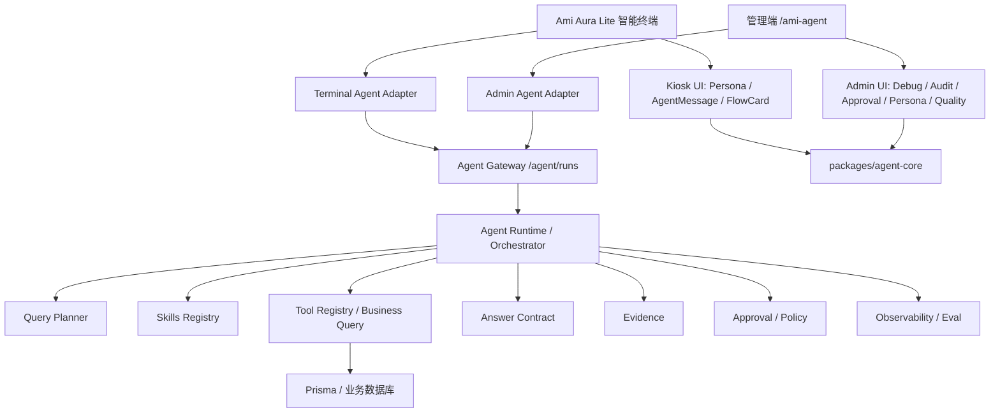

# 洞悉美业 Agent Runtime 统一升级详细开发计划 tasks

版本：v3.1  
日期：2026-06-28  
适用范围：Ami Aura Lite 智能终端、管理端 `/ami-agent`、`packages/server-v2` Agent Runtime、`packages/agent-core` 前端对话内核。

---

## 0. 任务状态说明

- `[ ]` 未开始
- `[~]` 开发中
- `[x]` 已完成
- `[!]` 阻塞或需决策

本文件是当前推荐的唯一执行清单。历史方案保留作背景参考，后续开发、验收和打钩以本文件为准。

当前执行重点：

1. 先收口 P0 真实问答：临期库存、昨日消费客户清单、消费清单后的追问优先联系。
2. 再标准化 Query Planner + Skills，减少关键词补丁，靠结构化业务意图和工具契约提升自然语言泛化能力。
3. 同步完善管理端治理后台：审计、反馈、Eval、审批、Persona 配置。
4. 最后做灰度、性能、发布验收和文档同步。

---

## 1. 最新结论

### 1.1 产品定位

洞悉美业定位为：**新一代美业门店运营智能体**。

- Ami Aura Lite 智能终端：一线门店经营问答与现场操作主入口。
- 管理端 `/ami-agent`：Agent 治理后台，负责调试、审计、审批、Persona 配置、Eval 和质量大盘。
- 不建议重新独立开发一套新智能体应用；应基于 Ami Aura Lite 升级，并让管理端成为治理与能力运营中心。

### 1.2 技术路线

不再靠关键词补丁堆能力，也不把“模型直接写 SQL”作为主路径。

推荐链路：

```text
自然语言输入
  -> Terminal/Admin Adapter
  -> Agent Gateway
  -> Query Planner
  -> Skills Registry
  -> Tool Registry / Business Query
  -> Evidence
  -> Answer Contract
  -> Kiosk / Admin 渲染
  -> Feedback / Eval / Observability
```

核心原则：

- 经营问答走 Agent Runtime。
- 收银、核销、扫码、打印、预约确认等强流程继续走 FlowCard。
- 高风险动作必须确认或审批，不允许 AI 自动执行。
- 回答必须有业务事实、数据来源、限制说明和可追踪审计记录。

### 1.3 目标架构



---

## 2. 当前完成度总览

| 模块 | 状态 | 当前判断 | 主要缺口 |
| --- | --- | --- | --- |
| Kiosk 接入 `/agent/runs` | `[~]` | 主链路已接入，真实页面可创建 `terminal:kiosk` AgentRun。 | 追问 append、小屏截图、管理端页面验收待补。 |
| `personaCode` 一等字段 | `[x]` | create/append、DTO、orchestrator、runtime、前端 payload 已支持。 | 发布前需确保运行进程不是 stale build。 |
| FlowCard 与 Agent 分流 | `[x]` | 收银/核销等强流程保留 FlowCard，经营问答进入 Agent。 | 需持续补负例 Eval。 |
| 临期库存问答 | `[~]` | Tool/Eval/API/Kiosk 运行态已验证，富 block 可展示。 | 小屏表格、空态、供应商/批次字段继续补齐。 |
| 昨日消费客户清单 | `[~]` | Tool/Eval/API/Kiosk 运行态已验证，表格和动作已去重，append 已进入同一 AgentRun。 | 追问仍可能跳到通用客户池，需要把上一轮消费清单作为工具查询范围。 |
| `packages/agent-core` | `[~]` | 类型、Hooks、Persona、conversationContext、blockUtils、Answer Contract 已共享化。 | Kiosk hook 与 shared hook 还可进一步收敛。 |
| Kiosk 富消息 | `[~]` | AgentMessage、反馈、追问、Persona、BlockRenderer 已落地。 | 小屏验收、表格横向滚动、输入框遮挡待验。 |
| `/ami-agent` 治理后台 | `[~]` | Tab、审计、审批、Persona、质量大盘已有代码。 | 运行态页面复验、高风险审批闭环待补。 |
| Query Planner / Skills | `[~]` | 已有 planner/tool 基础和部分 P0 能力。 | 需要标准化 BusinessTaskPlan 与 Skill 定义。 |
| Eval 与观测 | `[~]` | 已有基础 Eval、质量报表和负反馈汇总。 | 缺 Skill 维度、Planner 归因、输出契约断言扩展。 |
| 灰度开关 | `[x]` | 前后端开关均已支持。 | 新旧链路质量对比待补。 |

---

## 3. 阶段 0：基线冻结与运行态收口

目标：先确保当前开发不被 stale server、旧链路或无关脏文件干扰。

### T0.1 工作区预检

- [x] 执行 `git status --short --branch`。
- [x] 标记本轮相关改动集中在 Agent、Kiosk、server-v2、agent-core、文档。
- [x] 标记无关脏文件，不在本任务中修改：
  - `src/api/real/customer.ts`
  - `src/app/pages/CardOrderManagement.tsx`
  - `src/app/pages/GoodsProductManagement.tsx`
  - `src/app/pages/MemberCardManagement.tsx`
  - `src/app/pages/ProductOrderManagement.tsx`
  - `src/app/pages/ProjectOrderManagement.tsx`
  - `src/app/pages/ProjectReservation.tsx`
  - `src/app/components/CustomerPicker.tsx`
  - `src/app/components/PaymentMethodSelector.tsx`
  - `src/app/components/ProductCatalogPicker.tsx`

验收：

- [x] 不覆盖用户未提交改动。
- [ ] 提交或 PR 前再次确认文件归属。

### T0.2 8080 运行态一致性

- [x] 确认旧 8080 进程曾拒绝 `personaCode`，属于 stale build。
- [x] 重新构建 `packages/server-v2`。
- [x] 替换 stale 8080 进程。
- [x] 当前 8080 健康检查正常。
- [x] Kiosk 代理默认 8080 可创建 `entrypoint=terminal:kiosk` AgentRun。

待办：

- [ ] 更新运行说明，明确修改 DTO/schema 后必须重启 server-v2。
- [ ] 增加开发态健康检查提示：发现 DTO 校验异常时先检查 dist 与进程时间。

验收：

- [x] 不再依赖临时 8081 才能验证主链路。
- [ ] 开发文档避免后续继续连接旧进程。

---

## 4. 阶段 1：P0 真实问答闭环

目标：证明 P0 场景不是单测可用，而是真实终端页面可问、可答、可展示、可审计。

### T1.1 临期库存真实问答

已完成：

- [x] Tool 层支持临期库存。
- [x] Eval 覆盖临期库存问法。
- [x] API 可创建 `entrypoint=terminal:kiosk` 临期库存 AgentRun。
- [x] Kiosk 页面提问“近期有哪些临期库存产品”触发 `/api/agent/runs`。
- [x] 页面能展示结构化答案、数据来源、限制说明和建议动作。
- [x] 修复富 block 长时间 loading 问题。
- [x] 修复 answer、evidence、action、follow-up 重复展示。

待办：

- [ ] 小屏截图确认库存表格横向滚动正常。
- [ ] 空态回答统一：未来 N 天暂无临期库存，并说明数据来源。
- [ ] 字段补齐：SKU、批次、到期日、剩余天数、当前库存、单位、成本金额、零售价、供应商。
- [ ] follow-up 保持 1-3 个，并且不与动作按钮重复。

验收：

- [x] 有临期数据时不能回答“系统未提供临期库存信息”。
- [x] 临期问法不被低库存排行抢答。
- [ ] 小屏不遮挡输入框。
- [ ] 无数据时不泛化成失败。

### T1.2 昨日消费客户清单

已完成：

- [x] Tool 层命中 `order_customer_consumption_list`。
- [x] Eval 覆盖“昨天有哪些消费的客户，列出清单”。
- [x] API 可创建 `entrypoint=terminal:kiosk` 昨日消费客户 AgentRun。
- [x] Kiosk 页面提问后触发 `/api/agent/runs`。
- [x] 页面能展示客户清单表格、数据来源和复购 action。
- [x] 修复同名 action 与 follow-up 重复展示。
- [x] 追问“优先联系哪些客户？”已复用当前 AgentRun append：Kiosk 页面第二轮请求为 `POST /api/agent/runs/156/messages`。

待办：

- [ ] 表格字段确认：客户姓名、手机号脱敏、会员等级、消费金额、消费项目/商品、最近服务记录、复购建议。
- [ ] 高价值客户优先排序。
- [x] 追问语义继续收敛：append 追问已基于上一轮消费客户清单排序，不再跳到通用流失客户优先级。
  - [x] `appendMessage` 已把上一轮 `conversationFocus` 合并到新一轮上下文。
  - [x] `BusinessTaskPreParser` 已识别上一轮 `currentItems`，把“优先联系哪些客户？”限定为上一轮客户清单范围。
  - [x] `AgentPlanner` 已把 `filters.customerIds`、`filters.focusedCustomers`、`filters.contextScope` 透传到 `customer.priority.rank`。
  - [x] `customer.priority.rank` 已支持限定客户 ID，只在上一轮消费客户中排序，不再回退到全店流失客户池。
  - [x] 返回证据中标明 `scope=上一轮消费客户清单`，并展示排序依据。
  - [x] 增加单测：PreParser、Planner、Tool Registry。
  - [x] API 真实复验：`runId=157` 第一轮问消费清单，第二轮 append 问优先联系，第二轮只返回上一轮 4 位客户：罗紫萱、刘伟明、黄梦瑶、马佳慧。
- [ ] 空数据时返回统计周期和查询口径，不泛化成“系统未提供”。

验收：

- [x] 不再答成“客户流失建议”。
- [x] 不只给建议，必须列出清单。
- [x] 能解释为什么优先关注某些客户。
- [x] append 追问进入同一条 AgentRun 审计链路。

### T1.3 管理端审计页面复验

已完成：

- [x] 审计 API 可按 `entrypoint=terminal:kiosk` 查到终端 AgentRun。
- [x] Detail API 可看到 messages、steps、toolCalls、approvals、evidence、renderedBlocks、actions。
- [x] 修复审计列表接口过重：列表不再返回 `planJson/resultJson/contextJson/evidenceJson`，完整快照只在 detail 中加载。
- [x] 管理端页面 `/ami-agent` 审计 Tab 可显示 `terminal:kiosk` run，例如 `ar_mqwk592a_0dmo9a`。
- [x] 点击 run 后可打开详情，页面展示消息、执行步骤、工具调用、证据与输出契约、RenderedBlocks、ResponseMode 和原始结果快照。

待办：

- [x] 打开管理端 `/ami-agent`。
- [x] 进入“运行审计”。
- [x] 按 `entrypoint=terminal:kiosk` 筛选。
- [x] 找到临期库存与昨日消费客户的 AgentRun。
- [x] 打开详情查看 messages、steps、toolCalls、approvals。
- [x] 查看 evidence、renderedBlocks、responseMode、actions。
- [ ] 对其中一次回答点“无用”，确认质量大盘出现负反馈候选。

验收：

- [x] 能定位答非所问发生在 Planner、Skill、Tool、数据还是渲染层。
- [ ] 负反馈能进入质量大盘和 Eval 候选池。

---

## 5. 阶段 2：Answer Contract 与富消息收口

目标：同一份 AgentRun 在 Kiosk 和管理端看到同一份结构化内容，只是 UI 样式不同。

### T2.1 Answer Contract 统一

已完成：

- [x] 新增共享展示适配逻辑。
- [x] 统一提取 `renderedBlocks`、`followUpSuggestions`、`evidence`、`actions`、`limitations`。
- [x] Kiosk `AgentMessageItem` 使用共享适配。
- [x] 管理端调试对话使用共享适配。
- [x] 审计详情保留原始 `resultJson`。

待办：

- [ ] 后端所有回答统一补齐：
  - `answer`
  - `status`
  - `responseMode`
  - `renderedBlocks`
  - `actions`
  - `evidence`
  - `followUpSuggestions`
  - `confidence`
  - `limitations`
- [ ] 对 `no_data`、`unsupported`、`failed` 统一前端展示。
- [ ] 对高风险 actions 挂审批信息。

验收：

- [x] 顶层 follow-up 和 block follow-up 不重复显示。
- [x] Evidence 在两端展示口径一致。
- [x] Action 在两端都能看见。
- [ ] no_data 不显示成普通失败。
- [ ] failed 有明确错误提示和 fallback。

### T2.2 Kiosk 富消息渲染

已完成：

- [x] `AgentMessageItem` 支持文本、blocks、evidence、actions、limitations、follow-up、feedback。
- [x] `BlockRenderer` 支持 summary、KPI、table、chart、customer、inventory、opportunity、activity、confirm action、evidence、copy variants、supplier purchase 等核心 block。
- [x] `BlockRenderer` 已懒加载，避免图表进入首屏主包。
- [x] 真实页面验证懒加载不会卡住。

待办：

- [ ] 桌面宽屏截图验收。
- [ ] 终端常见小屏截图验收。
- [ ] 表格横向滚动和 action chip 不遮挡输入框。
- [ ] 图表、表格、长客户名、长商品名做溢出测试。

验收：

- [ ] 文本不溢出。
- [ ] 卡片不遮挡。
- [ ] 输入框始终可用。
- [ ] FlowCard 与 Agent 消息不会互相挤占。

---

## 6. 阶段 3：Query Planner 与 Skills 标准化

目标：把自然语言理解从规则补丁升级为结构化业务计划，解决随机自然语言答非所问问题。

### T3.1 BusinessTaskPlan 标准定义

待办：

- [ ] 定义 `BusinessTaskPlan`。
- [ ] 字段包含：
  - `intentType`: query / analysis / suggestion / draft / execute / approval
  - `skillCode`
  - `slots`
  - `toolPlan`
  - `riskLevel`
  - `confidence`
  - `needsClarification`
  - `needsApproval`
- [ ] Planner 输出写入 AgentRun step。
- [ ] 低置信度时只追问一个关键问题。
- [ ] 高风险动作进入 approval。
- [ ] 支持多轮上下文引用：
  - [ ] `currentCustomer`：上一轮当前客户。
  - [ ] `currentItems`：上一轮表格/清单对象。
  - [ ] `currentActivity`：上一轮活动草稿或活动详情。
  - [ ] `timeRange`：上一轮查询周期。
  - [ ] `contextScope`：上一轮数据范围，例如上一轮消费客户清单。
- [ ] 支持 Planner 快路径：
  - [ ] 低风险高频查询直接命中 Skill。
  - [ ] 不确定意图进入一次澄清。
  - [ ] 高风险执行先出确认卡或审批草稿。

建议文件：

- `packages/server-v2/src/agent/agent-planner.service.ts`
- `packages/server-v2/src/agent/agent.types.ts`
- `packages/server-v2/src/agent/agent-workflow-runtime.service.ts`

验收：

- [ ] “昨天又哪些消费客户”“昨日成交会员清单”“昨天流水客户”命中同一 `customer.consumption.list`。
- [ ] “临期库存”“快过期产品”“效期风险”命中同一 `inventory.expiring.list`。
- [ ] 消费清单后的“优先联系哪些客户”命中 `customer.priority.followup`，并带上上一轮客户 ID。
- [ ] “她/这个客户/这些客户/这批客户”能复用上一轮上下文。
- [ ] Planner 结果可在审计详情看到。
- [ ] 不再靠新增关键词规则解决每个自然语言变体。

### T3.2 Skills Registry 标准结构

待办：

- [ ] 新增 Skill 定义结构。
- [ ] 每个 Skill 声明：
  - 适用 Persona
  - 可用工具
  - 必填 slots
  - 可选 slots
  - 风险等级
  - 输出 block 契约
  - no_data 口径
  - Eval cases
- [ ] Tool Registry 只接受 Skill 传入的结构化参数。
- [ ] Tool 输出统一 Evidence。

P0 Skills：

- [ ] `customer.consumption.list`：消费客户清单。
- [ ] `inventory.expiring.list`：临期库存清单。
- [ ] `customer.priority.followup`：高价值客户复购承接。
- [ ] `store.daily.risk`：今日经营风险。
- [ ] `inventory.replenishment.suggest`：库存补货建议。

验收：

- [ ] 每个 Skill 至少 5 条 Eval。
- [ ] 每个 Skill 有 no_data / failed / unsupported 口径。
- [ ] 每个 Skill 能在 Kiosk 和管理端一致调用。
- [ ] 每个 Skill 的输入参数、输出 block、evidence 和 actions 都能在审计详情查看。
- [ ] 每个 Skill 都能定义是否允许追问复用上一轮结果。

### T3.3 Fast Path 与响应速度

待办：

- [ ] 高频查询直接走预定义 Skill + Tool，不走深度多轮规划。
- [ ] 经营概览、库存风险、昨日消费客户增加短 TTL 缓存。
- [ ] 增加分阶段 loading：理解问题、查询数据、生成建议。
- [ ] 支持先返回核心结论，再补明细卡片。
- [ ] 深度分析设置超时和 fallback。

验收：

- [ ] 高频问题首屏反馈小于 2 秒。
- [ ] 深度问题有可见进度，不空等。
- [ ] 超时不会白屏，审计中记录 fallback reason。

---

## 7. 阶段 4：P0/P1 美业核心 Skills 补齐

目标：从“能聊天”升级为“真正懂美业经营”。

### T4.1 消费客户清单 Skill

- [x] Tool 层返回消费客户清单、统计周期、表格明细、数据来源和复购承接 action。
- [ ] 抽象为标准 Skill：`customer.consumption.list`。
- [ ] 输出契约固定为：summary + KPI + table + evidence + action + follow-up。
- [ ] 增加高价值客户排序规则。
- [ ] 支持最近服务记录和复购承接建议。
- [ ] 支持导出或生成跟进草稿，但不自动群发。

验收：

- [ ] 输出清单，而不是泛化建议。
- [ ] 可解释排序原因。
- [ ] 高风险触达只生成草稿或审批，不自动发送。

### T4.2 临期库存 Skill

- [x] Tool 层返回临期商品、最近到期日、剩余天数、库存、建议动作。
- [ ] 抽象为标准 Skill：`inventory.expiring.list`。
- [ ] 输出契约固定为：summary + inventory item card + table + evidence + action + follow-up。
- [ ] 字段补齐：SKU/批次、到期日、剩余天数、当前库存、临期库存、单位、成本金额、零售价、风险等级、供应商。
- [ ] 输出处置建议：优先消耗、搭配项目、员工提醒、促销草稿、暂停采购。
- [ ] 高风险动作只生成草稿或确认卡，不自动调价、不自动发布、不自动采购。

验收：

- [ ] 能列出临期明细。
- [ ] 能区分临期、低库存、缺货。
- [ ] 能给出处置动作但不越权执行。

### T4.3 今日经营风险 Skill

- [~] 已有经营风险回答基础。
- [ ] 标准化为 `store.daily.risk`。
- [ ] 聚合预约、客户、库存、员工、财务风险。
- [ ] 输出风险等级、影响对象、建议动作、负责人建议。
- [ ] 支持每天开机主动推送。

验收：

- [ ] 店长开机能看到今日最重要的 3 件事。
- [ ] 每个风险有依据和建议动作。

### T4.4 高价值客户复购承接 Skill

- [~] 已有客户优先关注和复购 action 基础。
- [ ] 标准化为 `customer.priority.followup`。
- [ ] 结合会员等级、历史消费、最近服务、未到店天数、活动响应。
- [ ] 输出优先联系名单、原因、建议话术、触达风险。
- [ ] 高风险触达必须进入确认或审批。

验收：

- [ ] 能回答“优先联系哪些客户”。
- [ ] 能解释每个客户为什么值得联系。
- [ ] 不能自动群发营销信息。

### T4.5 库存补货建议 Skill

- [~] 已有库存风险和采购草稿基础。
- [ ] 标准化为 `inventory.replenishment.suggest`。
- [ ] 结合安全库存、近 30 天消耗、预约项目、供应商。
- [ ] 输出建议补货数量、预计可用天数、采购单草稿。
- [ ] 采购单生成必须确认。

验收：

- [ ] 能给出补货清单和依据。
- [ ] 采购动作必须人工确认。

### T4.6 P1 扩展 Skills

- [ ] `appointment.capacity.fill_gap`：预约容量与空档填补。
- [ ] `staff.performance.review`：员工业绩与绩效建议。
- [ ] `finance.margin.risk`：财务利润与毛利风险。
- [ ] `marketing.recall.campaign_draft`：营销召回活动草稿。
- [ ] `member.card.expiry.followup`：卡项到期与会员资产。

验收：

- [ ] 可输出卡片、表格、图表、草稿、确认动作。
- [ ] 每个 Skill 有定义、字段需求、工具计划、输出契约、风险策略、Eval case。

---

## 8. 阶段 5：管理端治理后台闭环

目标：让 `/ami-agent` 真正成为 Agent 运营治理中心。

### T5.1 运行审计增强

已完成：

- [x] 支持 status、role、personaCode、entrypoint、keyword 筛选。
- [x] 支持查看 messages、steps、toolCalls、approvals、evidence、renderedBlocks。
- [x] 支持 `entrypoint=terminal:kiosk`。
- [x] 页面运行态已复验终端问答记录：列表请求 `GET /api/agent/runs?page=1&pageSize=20&entrypoint=terminal:kiosk` 返回 200，点击 run 后 `GET /api/agent/runs/155/detail` 返回 200。

待办：

- [ ] 审计详情展示 Planner plan、Skill 命中、Tool 输入摘要。
- [ ] 支持从某次失败回答一键加入 Eval 草稿。

验收：

- [ ] 终端问答可在管理端按入口检索。
- [ ] 详情能判断问题发生在哪一层。

### T5.2 审批管理与高风险 Action 联动

待办：

- [ ] 定义高风险 action 类型：
  - 批量客户触达
  - 创建营销活动
  - 发布优惠券
  - 生成采购单
  - 调整价格
  - 财务敏感导出
- [ ] Kiosk 端只展示确认卡或提交审批。
- [ ] 后端创建 approval。
- [ ] 管理端审批 Tab 可批准/拒绝并填写原因。
- [ ] 审批结果回写 AgentRun。
- [ ] Kiosk 可看到审批结果或后续状态。

验收：

- [ ] AI 不会绕过审批直接执行高风险动作。
- [ ] 审批全链路可审计。

### T5.3 Persona 配置运行态同步

已完成：

- [x] 管理端可编辑推荐问题。
- [x] 后端 `AgentPersonaService` 接入 `agent_personas` 表。
- [x] Kiosk 启动后优先读取后端 Persona 配置，失败回退内置配置。

待办：

- [ ] 修改某 Persona 推荐问题后，刷新 Kiosk 并验证快捷问题同步变化。
- [ ] 角色权限变更后不可用 Persona 自动隐藏。
- [ ] 配置保存失败时前端给出明确提示。

验收：

- [ ] 推荐问题真正由管理端配置驱动。
- [ ] Kiosk 不因配置接口失败而影响收银、核销等强流程。

### T5.4 质量大盘增强

已完成：

- [x] 按 entrypoint 展示运行数、成功率、失败数。
- [x] 终端负反馈可进入质量报表。

待办：

- [ ] 按 Skill 展示成功率、失败率、低置信度问题。
- [ ] 按 Persona 展示有用率、无用率。
- [ ] 增加 no_data 率。
- [ ] 增加 fallback 率。
- [ ] 支持从负反馈一键生成 Eval 草稿。

验收：

- [ ] 质量大盘能指导下一轮开发，不只是展示 KPI。

---

## 9. 阶段 6：Eval、观测与可信回答

目标：让智能体可持续迭代，不靠人工体验发现问题。

### T6.1 Eval 集建设

已完成：

- [x] 默认 Eval 覆盖临期库存、库存补货、客户复购承接等核心场景。
- [x] 增加负例：收银/核销不应进入 Agent 问答。

待办：

- [ ] P0 高频问法不少于 50 条。
- [ ] 每个 P0/P1 Skill 至少 5 条 Eval。
- [ ] 覆盖同义问法、错别字、口语表达、模糊时间、指代问题。
- [ ] 增加输出契约断言：必须有 table/action/evidence/follow-up。
- [ ] 增加 no_data 断言：不能泛化说“系统未提供”。

验收：

- [ ] `agent:eval` 能输出按 Skill 的通过率。
- [ ] 技能命中率、工具正确率、输出契约正确率可单独统计。

### T6.2 观测指标

待办：

- [ ] 记录 Planner 输出。
- [ ] 记录 Skill 命中。
- [ ] 记录 Tool 输入输出摘要。
- [ ] 记录 Evidence。
- [ ] 记录 fallback reason。
- [ ] 记录用户反馈和后续动作。

验收：

- [ ] 任意一次答非所问都能定位是意图、Planner、Skill、Tool、数据还是渲染问题。

### T6.3 可信回答策略

待办：

- [ ] 无数据时明确查询范围，不编造。
- [ ] 数据不完整时声明 limitations。
- [ ] 低置信度时追问一个关键问题。
- [ ] 涉及财务、客户触达、采购、批量操作必须确认。
- [ ] 展示“为什么这么建议”的依据。

验收：

- [ ] 用户能看到建议依据。
- [ ] 高风险动作不会被 AI 直接执行。

---

## 10. 阶段 7：灰度、性能与发布

目标：稳定把新 Agent Runtime 推到终端现场，而不是一次性大切换。

### T7.1 灰度开关

已完成：

- [x] 前端开关：`VITE_KIOSK_AGENT_RUNTIME_ENABLED`。
- [x] 后端开关：`AGENT_TERMINAL_RUNTIME_ENABLED`。
- [x] 开关关闭时回到旧链路。
- [x] 开关开启时经营问答进入 AgentRun。

待办：

- [ ] 灰度期间新旧回答质量对比。
- [ ] 质量大盘展示新旧链路表现差异。
- [ ] Runtime disabled 时给出明确运营提示，不显示 Internal server error。

### T7.2 性能优化

待办：

- [ ] 高频 Skill 增加短 TTL 缓存。
- [ ] Planner 和 Tool 调用增加分阶段 loading。
- [ ] 复杂分析支持流式或先结论后明细。
- [ ] 审计写入不阻塞首屏回答。
- [ ] 图表和重组件继续懒加载。

验收：

- [ ] 高频问题首屏反馈小于 2 秒。
- [ ] 复杂问题有进度提示。
- [ ] 超时可降级且审计可追踪。

### T7.3 发布前验证命令

发布前必须跑：

```powershell
npm.cmd run build
npm.cmd --prefix packages/server-v2 run build
npm.cmd --prefix packages/server-v2 run agent:eval
npm.cmd --prefix packages/Ami-Aura-Lite-Kiosk run build
npm.cmd --prefix packages/Ami-Aura-Lite-Kiosk exec vitest run src/app/intent/aiIntentParser.test.ts src/app/microApps/runMicroApp.test.ts src/app/components/AgentMessageItem.test.tsx src/app/components/BlockRenderer.test.tsx --runInBand
npx.cmd vitest run packages/agent-core/logic/answerContract.test.ts packages/agent-core/logic/blockUtils.test.ts packages/agent-core/hooks/useAgentConversation.test.tsx
git diff --check
```

验收：

- [ ] 管理端 build 通过。
- [ ] 后端 build 通过。
- [ ] Kiosk build 通过。
- [ ] Agent Runtime 关键单测通过。
- [ ] Kiosk 分流测试通过。
- [ ] agent-core 测试通过。
- [ ] `git diff --check` 无新增空白错误。

---

## 11. 阶段 8：文档同步

目标：让后续维护者知道“终端智能问答”和“管理端智能体”已经是统一 Runtime，而不是两套孤立系统。

待办：

- [ ] 更新 `CLAUDE.md` / `AGENTS.md` 中的智能体链路说明。
- [ ] 更新 `docs/terminal-api.md` 中的 Agent Runtime 入口。
- [ ] 更新 `docs/api-contract.md` 中的 Answer Contract。
- [ ] 更新 `docs/03-开发计划/Agent_Runtime与前端对话内核统一_tasks.md` 的完成状态。
- [x] 更新 `docs/03-开发计划/tasks.md` 为当前唯一执行清单 v3.1。
- [ ] 补充运行态验收截图路径和 runId。

验收：

- [ ] 新人能按文档启动后端、Kiosk、管理端并复验 P0 问答。
- [ ] 文档不会继续引导使用旧 `/ai/chat/messages` 作为主路径。

---

## 12. 下一轮推荐执行顺序

1. [x] 追问语义收敛：`优先联系哪些客户？` 已基于上一轮消费客户清单排序，而不是跳到通用流失客户池。
2. [x] 后端定向测试：PreParser、Planner、Tool Registry 覆盖上一轮清单限定排序。
3. [x] API 真实复验：创建消费客户清单 AgentRun，再 append 追问优先联系。
4. [ ] Kiosk 小屏截图验收临期库存和消费客户表格。
5. [ ] 对一次终端回答点“无用”，验证质量大盘与负反馈候选。
6. [ ] 抽象 `BusinessTaskPlan`，让自然语言先进入结构化 Planner。
7. [ ] 抽象 P0 Skills：消费客户清单、临期库存、客户复购、今日经营风险、补货建议。
8. [ ] 扩充 Eval：同义问法、错别字、口语、模糊时间、指代、输出契约。
9. [ ] 打通高风险 Action 审批：营销触达、采购单、活动发布。
10. [ ] 更新 API/终端/协作文档，收口发布前验证。

---

## 13. 完成定义

本计划不能只以“代码已写”作为完成标准。最终完成必须同时满足：

- Kiosk 和 `/ami-agent` 都走统一 Agent Runtime。
- 终端经营问答产生可审计 AgentRun。
- 管理端能看到终端问答、工具调用、证据、反馈。
- P0 问题不答非所问。
- 临期库存、昨日消费客户、客户回访、今日经营风险、补货建议等核心场景有真实数据明细。
- 回答支持文本、卡片、表格、图表、确认动作和 follow-up。
- 高风险动作不自动执行。
- Eval、单测、构建、手动验收都有记录。
