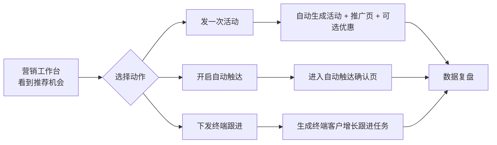

# 智能营销阶段 1-2 简化改造详细开发计划

更新时间：2026-06-14  
关联产品文档：`docs/02-产品设计/智能营销当前状态与简化建议.md`  
目标范围：管理端智能营销、Ami Aura Lite 客户增长连接点、统一效果入口  
实施原则：先收敛入口和流程，不删除旧路由，不合并底层数据模型。

## 1. 改造目标

本轮只完成两个阶段：

1. 第 1 阶段：不动接口，先降低用户理解成本。
2. 第 2 阶段：统一主流程，让用户从“看推荐”直接进入“发活动、开自动触达、下发终端跟进、看复盘”。

本轮不是新增一个复杂营销系统，而是把当前已经存在的能力重新组织成更容易理解的增长路径：

```text
营销工作台 -> 自动触达 / 推广资产 / 终端跟进 -> 数据复盘
```

## 2. 当前基础

### 2.1 已有页面

| 当前页面 | 文件 | 当前状态 |
| --- | --- | --- |
| 智能推荐 | `src/app/pages/MarketingRecommendation.tsx` | 已能跑预测、看推荐、创建活动、跳自动营销 |
| 自动营销 | `src/app/pages/CreateMarketing.tsx` | 已能管理策略、创建/编辑/启用/执行、读取 URL 草稿参数 |
| 规则库 | `src/app/pages/MarketingRuleLibrary.tsx` | 已能管理规则模板、启用后生成自动营销策略 |
| 营销资产 | `src/app/pages/MarketingAssets.tsx` | 已聚合营销页面、优惠活动、Ami Glow、行为事件 |
| 效果分析 | `src/app/pages/MarketingAnalytics.tsx` | 已统一查看活动、自动营销、页面、优惠、Ami Glow 效果 |
| 活动管理旧页 | `src/app/pages/MarketingStrategy.tsx` | 旧入口，仍用于活动列表和活动页预览 |
| 活动效果旧页 | `src/app/pages/MarketingActivityEffect.tsx` | 当前偏模拟数据，应逐步被统一效果复盘替代 |

### 2.2 已有路由

当前 `src/app/routes.tsx` 保留这些智能营销路由：

```text
/customer-marketing/activity-management
/customer-marketing/ami-glow
/customer-marketing/pages
/customer-marketing/promotions
/customer-marketing/activity-effect/:id
/customer-marketing/intelligent-recommendation
/customer-marketing/assets
/customer-marketing/automation
/customer-marketing/strategy-templates
/customer-marketing/rule-library
/customer-marketing/effect-analysis
```

### 2.3 终端客户增长连接点

当前已经有这些终端 API 和类型，可在第 2 阶段复用：

| 能力 | 前端 API | 后端接口 |
| --- | --- | --- |
| 客户增长候选 | `getTerminalCustomerGrowthCandidates` | `GET /terminal/customers/growth-candidates` |
| 客户增长看板 | `getTerminalCustomerGrowthDashboard` | `GET /terminal/dashboard/customer-growth` |
| 单客户下一步动作 | `getTerminalCustomerNextBestActions` | `GET /terminal/customers/:id/next-best-actions` |
| 推荐反馈 | `recordTerminalRecommendationEvent` | `POST /terminal/recommendation-events` |
| 创建跟进任务 | `createTerminalFollowUpTask` | `POST /terminal/follow-up-tasks` |
| 完成跟进任务 | `completeTerminalFollowUpTask` | `PATCH /terminal/follow-up-tasks/:id/complete` |
| 可用优惠 | `getTerminalPromotions` | `GET /terminal/promotions/available` |

## 3. 目标信息架构

### 3.1 第 1 阶段目标菜单

把当前 5 个入口：

```text
智能推荐
规则库
自动营销
营销资产
效果分析
```

调整为 4 个面向业务动作的入口：

```text
营销工作台
自动触达
推广资产
数据复盘
```

旧能力映射：

| 新入口 | 承接当前能力 | 主要用户 |
| --- | --- | --- |
| 营销工作台 | 智能推荐 + 进行中活动摘要 + 客户增长提示 | 店长、运营 |
| 自动触达 | 自动营销 + 规则库模板 | 店长、运营、总部 |
| 推广资产 | 营销页面 + 优惠活动 + Ami Glow + 数据明细 | 运营、店长 |
| 数据复盘 | 统一效果分析 + 页面/活动效果摘要 | 店长、总部 |

### 3.2 第 2 阶段目标主流程



## 4. 第 1 阶段开发计划：不动接口，先降复杂度

### 4.1 交付目标

- 左侧菜单从 5 个智能营销入口变为 4 个业务入口。
- 新增“营销工作台”页面，作为智能营销默认入口。
- “规则库”不再单独作为主菜单入口，改到“自动触达”内。
- “营销资产”改名为“推广资产”，“效果分析”改名为“数据复盘”。
- 所有旧路由保留可访问，不影响历史链接、跳转和权限。

### 4.2 任务 1：新增营销工作台页面

建议新增文件：

```text
src/app/pages/MarketingWorkbench.tsx
```

页面定位：

- 不做复杂新业务逻辑。
- 复用已有推荐、活动、效果和终端增长数据的摘要。
- 只回答“今天该经营哪些客户、建议做什么动作、当前活动表现如何”。

首版模块：

| 模块 | 数据来源 | 首版做法 |
| --- | --- | --- |
| 今日推荐机会 | `getMarketingRecommendations` | 展示前 3-5 条推荐卡摘要 |
| 客户增长提醒 | `getTerminalCustomerGrowthCandidates` | 展示高优先级客户数量和前 3 条 |
| 进行中活动 | `getMarketingActivities` | 展示进行中活动数量和最近活动 |
| 自动触达摘要 | `getAutomationStrategiesPaginated` | 展示启用策略数、草稿数、暂停数 |
| 数据复盘摘要 | `getUnifiedMarketingEffects` | 展示曝光/转化/收入/ROI 四个核心指标 |

页面主要按钮：

| 按钮 | 跳转 |
| --- | --- |
| 查看全部机会 | `/customer-marketing/workbench` 内展开或跳推荐列表区 |
| 开启自动触达 | `/customer-marketing/automation` |
| 创建推广活动 | 触发已有 `CreateActivityDialog` 或跳推荐动作 |
| 管理推广资产 | `/customer-marketing/assets` |
| 查看数据复盘 | `/customer-marketing/effect-analysis` |

首版建议：

- 如果时间紧，营销工作台可以先用 3 个摘要区块 + 4 个快捷入口，不嵌入完整表格。
- 不要把原 `MarketingRecommendation` 全量塞进工作台，否则仍然复杂。

### 4.3 任务 2：调整路由

修改文件：

```text
src/app/routes.tsx
```

新增路由：

```text
/customer-marketing/workbench -> MarketingWorkbench
```

建议保留并兼容：

```text
/customer-marketing/intelligent-recommendation
/customer-marketing/rule-library
/customer-marketing/assets
/customer-marketing/effect-analysis
/customer-marketing/automation
```

可选增强：

- 访问 `/customer-marketing` 时重定向或渲染 `MarketingWorkbench`。
- 暂不删除 `/customer-marketing/intelligent-recommendation`，可作为工作台里的“推荐明细”入口。

### 4.4 任务 3：调整左侧菜单

修改文件：

```text
src/app/components/Layout.tsx
```

目标菜单：

| 菜单名 | 路由 | 权限 | 图标建议 |
| --- | --- | --- | --- |
| 营销工作台 | `/customer-marketing/workbench` | `core:marketing:view` 或 `core:marketing:recommend` | `Sparkles` |
| 自动触达 | `/customer-marketing/automation` | `core:marketing:template` | `Zap` 或 `FileText` |
| 推广资产 | `/customer-marketing/assets` | `core:marketing:view` | `Megaphone` |
| 数据复盘 | `/customer-marketing/effect-analysis` | `core:marketing:analytics` | `BarChart3` |

菜单隐藏：

| 旧菜单 | 处理 |
| --- | --- |
| 智能推荐 | 从主菜单隐藏，可从工作台进入推荐明细 |
| 规则库 | 从主菜单隐藏，移入自动触达页面 Tab |
| 营销资产 | 文案改为推广资产 |
| 效果分析 | 文案改为数据复盘 |

### 4.5 任务 4：自动触达页面增加规则模板 Tab

修改文件：

```text
src/app/pages/CreateMarketing.tsx
src/app/pages/MarketingRuleLibrary.tsx
```

建议做法：

1. `MarketingRuleLibrary` 增加 `embedded?: boolean` 属性。
2. embedded 模式隐藏大标题和页面级刷新按钮，保留筛选、表格、抽屉和启用能力。
3. `CreateMarketing` 页面顶部增加 Tab：

```text
运行策略
规则模板
执行记录（可选，首版不做）
```

首版只要求：

- 默认进入“运行策略”。
- 点击“规则模板”显示嵌入版 `MarketingRuleLibrary`。
- 规则启用后仍提示“查看自动触达”，并停留/跳转到运行策略 Tab。

### 4.6 任务 5：推广资产改名与 Tab 文案调整

修改文件：

```text
src/app/pages/MarketingAssets.tsx
src/app/pages/MarketingPageManagement.tsx
src/app/pages/PromotionManagement.tsx
src/app/pages/AmiGlowManagement.tsx
```

文案替换：

| 当前文案 | 新文案 |
| --- | --- |
| 营销资产 | 推广资产 |
| 营销页面 | 推广页 |
| 优惠活动 | 优惠权益 |
| 小程序推荐位 | 小程序展示 |
| 行为事件 | 数据明细 |

首版交互：

- 默认 Tab 仍是页面/推广页。
- “数据明细”可以作为最后一个 Tab，文案弱化，不在页面说明中突出。
- “查看当前类型效果”按钮文案改为“查看该类数据复盘”。

### 4.7 任务 6：效果分析改名为数据复盘

修改文件：

```text
src/app/pages/MarketingAnalytics.tsx
```

文案替换：

| 当前文案 | 新文案 |
| --- | --- |
| 营销效果分析 | 数据复盘 |
| 营销对象 | 推广对象 |
| 总曝光触达 | 触达/访问 |
| 转化收入 | 成交收入 |
| 综合 ROI | 投放回报 |

首版不改接口：

- 继续使用 `getUnifiedMarketingEffects`。
- 保留对象类型筛选，但展示文案更业务化。
- 高级字段和空数据原因继续保留。

### 4.8 第 1 阶段验收标准

- 左侧智能营销菜单只显示 4 个入口：营销工作台、自动触达、推广资产、数据复盘。
- `/customer-marketing/workbench` 可正常打开并展示摘要。
- `/customer-marketing/intelligent-recommendation`、`/customer-marketing/rule-library` 等旧路由直接访问不 404。
- 自动触达页面可以切换到规则模板，规则启用流程不受影响。
- 推广资产和数据复盘文案完成业务化，不再突出“营销资产/效果分析/行为事件”等运营后台词。
- 不改数据库，不新增必需后端接口。

## 5. 第 2 阶段开发计划：统一主流程

### 5.1 交付目标

- 营销工作台和推荐卡只保留清晰主动作。
- “发一次活动”走已有活动 + 推广页发布能力。
- “开启自动触达”走已有 URL 草稿参数和自动触达确认流程。
- 新增“下发终端跟进”，把高价值沉默、流失风险、复购窗口客户下发到 Ami Aura Lite 客户增长任务。
- 所有效果入口统一到数据复盘，并纳入终端跟进结果展示规划。

### 5.2 任务 1：智能推荐卡动作收敛

修改文件：

```text
src/app/pages/MarketingRecommendation.tsx
src/app/pages/MarketingWorkbench.tsx
```

当前推荐卡已有：

- `创建自动规则`
- `创建活动`
- 查看目标客户
- 数据依据折叠

调整为三类主动作：

| 动作 | 使用场景 | 技术实现 |
| --- | --- | --- |
| 发一次活动 | 节日活动、新客转化、活动响应高人群 | 复用 `openMiniPreview(createInitialDataFromRecommendation(rec))` |
| 开启自动触达 | 流失风险、复购窗口、生日、护理周期、卡项到期 | 复用跳转 `/customer-marketing/automation?...` |
| 下发终端跟进 | 高价值沉默、极高流失风险、需要顾问人工解释 | 调用 `createTerminalFollowUpTask` 或批量创建任务 |

推荐卡信息简化：

- 默认展示：推荐标题、覆盖客户数、建议动作、预计收入、推荐权益、推荐渠道。
- 折叠展示：数据依据、预测批次、模型字段、客户明细。
- 避免默认展示 LTV、算法、命中、策略等术语。

### 5.3 任务 2：新增下发终端跟进动作

涉及文件：

```text
src/app/pages/MarketingRecommendation.tsx
src/app/pages/MarketingWorkbench.tsx
src/api/terminal.ts
src/types/terminal.ts
```

现有前端 API 已有：

```ts
createTerminalFollowUpTask(data)
recordTerminalRecommendationEvent(data)
getTerminalCustomerGrowthCandidates(limit)
```

建议先做单客户/样本客户下发，不做复杂批量调度：

1. 推荐卡点击“下发终端跟进”。
2. 弹窗展示推荐命中客户列表，默认勾选前 10 个。
3. 用户确认后，为勾选客户调用 `createTerminalFollowUpTask`。
4. 同时调用 `recordTerminalRecommendationEvent` 记录 `accepted` 或 `shown`。
5. 成功后提示“已同步到 Ami Aura Lite 客户增长”。

任务字段建议：

| 字段 | 来源 |
| --- | --- |
| `customerId` | 推荐受众客户 ID |
| `recommendationId` | 推荐卡 ID |
| `channel` | 默认 `phone` 或 `wechat` |
| `script` | 推荐策略 + 推荐权益 + 客户话术模板 |
| `dueAt` | 默认今天 18:00 或次日 12:00 |
| `note` | 推荐标题、推荐原因、推荐项目、优惠 |

如果推荐卡没有稳定客户 ID：

- 先提示“请先查看目标客户并选择客户”。
- 或只下发一条门店级跟进提醒，后续再批量拆客户任务。

### 5.4 任务 3：自动触达确认页业务化

修改文件：

```text
src/app/pages/CreateMarketing.tsx
```

当前从智能推荐跳自动营销时，会通过 URL 参数带入：

```text
name
desc
trigger
triggerParams
actions
channels
sourceRecommendationId
predictionRunId
targetAudience
offer
strategyText
recommendedItems
sourceSignals
autoGenerate
```

优化方向：

- 进入页面后如果是推荐来源，顶部展示“来自营销工作台推荐”。
- 自动打开创建/编辑弹窗，并定位到确认步骤。
- 将表单步骤文案从规则语言改为业务语言：

| 当前步骤 | 新步骤 |
| --- | --- |
| 规则 | 什么时候提醒 |
| 动作 | 怎么联系客户 |
| 预估 | 覆盖多少客户 |

首版不强制重构全部表单，只要求推荐来源时降低配置感。

### 5.5 任务 4：发一次活动主流程确认

涉及文件：

```text
src/app/pages/MarketingRecommendation.tsx
src/app/components/CreateActivityDialog.tsx
src/app/pages/MarketingAssets.tsx
```

当前 `CreateActivityDialog` 已经可以：

- 创建 `MarketingActivity`
- 生成/保存 `pageSchema`
- 创建 `MarketingPage`
- 发布 H5

第 2 阶段要求：

- 从推荐卡发起时，默认文案改为“发一次活动”。
- 发布成功后 toast 增加两个动作：
  - “查看推广页” -> `/customer-marketing/assets?tab=pages`
  - “查看数据复盘” -> `/customer-marketing/effect-analysis?objectType=activity`
- 活动创建弹窗中的内部词继续过滤，不向客户暴露“流失风险、LTV、算法、预测”等词。

### 5.6 任务 5：统一效果入口到数据复盘

涉及文件：

```text
src/app/pages/MarketingAssets.tsx
src/app/pages/MarketingPageManagement.tsx
src/app/pages/MarketingStrategy.tsx
src/app/pages/MarketingAnalytics.tsx
packages/server-v2/src/marketing/marketing.service.ts
```

前端调整：

- 页面、优惠、小程序展示、活动列表里的“查看效果”统一跳 `/customer-marketing/effect-analysis`。
- 如果有对象类型，带 `objectType` 参数。
- 如果有对象 ID，可规划 `objectId` 参数，但首版后端不一定处理。

后端首版可不改：

- 当前 `getUnifiedMarketingEffects` 已按 `activity/auto/page/promotion/glow` 聚合。
- 首版先统一入口，后续再做对象 ID 级详情。

需要注意：

- `MarketingActivityEffect` 当前是独立详情页，且偏模拟数据。第 2 阶段建议不再新增入口，保留旧链接兼容。

### 5.7 任务 6：营销工作台接入终端客户增长摘要

涉及文件：

```text
src/app/pages/MarketingWorkbench.tsx
src/api/terminal.ts
```

展示内容：

| 字段 | 来源 |
| --- | --- |
| 客户姓名 | `TerminalGrowthCandidate.name` |
| 流失等级 | `churnLevel` |
| 复购分 | `repurchase30dScore` |
| 推荐原因 | `reason` |
| 推荐动作 | `recommendedActions` |

首版交互：

- 点击客户，打开轻量抽屉。
- 抽屉展示推荐原因、最近到店、累计消费、建议动作。
- 提供“下发终端跟进”按钮。

### 5.8 第 2 阶段验收标准

- 推荐卡主动作清晰为：发一次活动、开启自动触达、下发终端跟进。
- 从营销工作台或推荐页发起“开启自动触达”后，自动触达页面能识别推荐来源并带入草稿内容。
- 从推荐卡“发一次活动”后，活动和推广页发布成功，且能跳到推广资产或数据复盘。
- “下发终端跟进”至少支持选择客户并创建终端跟进任务。
- 数据复盘成为主效果入口，页面和活动旧效果入口不再作为新增主路径。
- 不破坏旧路由和旧 API。

## 6. 开发拆分任务卡

### 任务卡 A：营销工作台页面

- 新增 `MarketingWorkbench.tsx`。
- 聚合推荐、客户增长、活动、自动触达、效果摘要。
- 增加加载、失败、空数据状态。
- 增加快捷入口。

验收：

- 页面能在无数据、接口失败、部分接口失败时正常展示。
- 不因为某个摘要接口失败导致整个工作台白屏。

### 任务卡 B：菜单和路由收口

- 新增 `/customer-marketing/workbench`。
- 调整 `Layout.tsx` 菜单文案和入口。
- 保留旧路由。
- 可选：`/customer-marketing` 指向工作台。

验收：

- 菜单只显示 4 个入口。
- 旧路由可直接访问。

### 任务卡 C：自动触达 + 规则模板 Tab

- `MarketingRuleLibrary` 支持 embedded。
- `CreateMarketing` 增加 Tab。
- 规则启用后提示跳运行策略。

验收：

- 规则库不再作为主菜单，但可在自动触达内使用。
- 启用规则后策略列表可看到生成结果。

### 任务卡 D：推广资产和数据复盘文案业务化

- `MarketingAssets` 改名推广资产。
- Tab 改为推广页、优惠权益、小程序展示、数据明细。
- `MarketingAnalytics` 改名数据复盘。

验收：

- 页面文案对店长更容易理解。
- 原有功能不丢。

### 任务卡 E：推荐主动作收敛

- 推荐卡按钮调整为三类主动作。
- 默认展示信息减少，技术字段折叠。
- 保持目标客户查看能力。

验收：

- 普通用户能明确下一步：发活动、开自动触达、下发终端跟进。

### 任务卡 F：终端跟进下发

- 推荐卡和工作台增加“下发终端跟进”。
- 选择客户并调用 `createTerminalFollowUpTask`。
- 调用 `recordTerminalRecommendationEvent` 记录采纳。

验收：

- 成功创建终端跟进任务。
- 失败时保留选择状态并展示错误。

### 任务卡 G：效果入口统一

- 推广资产、活动列表、营销页面效果按钮统一跳数据复盘。
- 保留旧 `MarketingActivityEffect` 兼容。

验收：

- 新流程不再把用户引向多个复盘页面。

## 7. 影响文件清单

### 7.1 前端页面

```text
src/app/pages/MarketingWorkbench.tsx
src/app/pages/MarketingRecommendation.tsx
src/app/pages/CreateMarketing.tsx
src/app/pages/MarketingRuleLibrary.tsx
src/app/pages/MarketingAssets.tsx
src/app/pages/MarketingAnalytics.tsx
src/app/pages/MarketingStrategy.tsx
src/app/components/CreateActivityDialog.tsx
```

### 7.2 路由和菜单

```text
src/app/routes.tsx
src/app/components/Layout.tsx
```

### 7.3 API 和类型

```text
src/api/marketing.ts
src/api/recommendation.ts
src/api/marketingPage.ts
src/api/terminal.ts
src/types/marketing.ts
src/types/terminal.ts
```

### 7.4 测试建议文件

```text
src/test/permissions.test.ts
src/test/api.test.ts
src/app/components/MarketingPageGeneratorDialog.test.tsx
```

可新增：

```text
src/app/pages/MarketingWorkbench.test.tsx
src/app/pages/MarketingRecommendation.actions.test.tsx
```

## 8. 测试与验证计划

### 8.1 自动化测试

优先跑：

```powershell
npm.cmd run lint
npm.cmd run test
```

针对性测试：

```powershell
npx vitest run src/test/api.test.ts
npx vitest run src/test/permissions.test.ts
```

如新增页面测试：

```powershell
npx vitest run src/app/pages/MarketingWorkbench.test.tsx
npx vitest run src/app/pages/MarketingRecommendation.actions.test.tsx
```

### 8.2 手动验证

管理端：

1. 登录 `admin / 11111111`。
2. 进入智能营销，确认菜单只有 4 个入口。
3. 打开营销工作台，确认推荐、客户增长、活动、效果摘要能展示。
4. 进入自动触达，切换运行策略/规则模板。
5. 在规则模板启用规则，确认策略生成。
6. 从推荐卡创建活动，确认活动和推广页发布。
7. 从推荐卡开启自动触达，确认表单带入推荐内容。
8. 从推荐卡下发终端跟进，确认成功 toast 和接口记录。
9. 打开推广资产，确认推广页/优惠权益/小程序展示/数据明细可切换。
10. 打开数据复盘，确认统一效果入口可用。

终端侧：

1. 启动 Ami Aura Lite。
2. 店长角色进入客户增长。
3. 确认客户增长候选可展示。
4. 如果后台下发跟进任务，确认终端能看到相关客户或任务记录。

## 9. 风险与处理

| 风险 | 影响 | 处理 |
| --- | --- | --- |
| 工作台聚合接口多，任一接口失败导致页面不可用 | 首页白屏 | 每个摘要独立加载和错误兜底 |
| 规则库嵌入自动触达后样式冲突 | 页面拥挤 | 增加 embedded 模式，隐藏重复标题 |
| 推荐卡动作变少后高级用户找不到详情 | 运营效率下降 | 数据依据和客户明细保留折叠入口 |
| 下发终端跟进缺少稳定客户 ID | 无法批量创建任务 | 首版要求先选择目标客户，无法解析时提示 |
| 数据复盘和旧活动效果口径不一致 | 用户不信任数据 | 新流程统一跳数据复盘，旧页只兼容访问 |
| 权限不同导致菜单消失 | 用户误以为功能丢失 | 工作台权限建议使用较宽的 `core:marketing:view`，动作按钮再按权限控制 |

## 10. 发布策略

建议分两个小 PR 或两个提交域：

1. 阶段 1 PR：菜单、路由、工作台、自动触达 Tab、文案改名。
2. 阶段 2 PR：推荐动作收敛、终端跟进下发、效果入口统一。

每个阶段都保持旧路由可访问。若出现问题，可先回退菜单入口，旧页面仍能独立使用。

## 11. 交付完成定义

第 1 阶段完成定义：

- 用户打开智能营销时，默认进入营销工作台。
- 左侧菜单理解成本明显降低。
- 自动触达内可使用规则模板。
- 推广资产和数据复盘文案完成业务化。

第 2 阶段完成定义：

- 营销工作台/推荐卡形成统一动作：发活动、开自动触达、下发终端跟进。
- 发活动后能进入推广资产和数据复盘。
- 开自动触达后能进入确认流程。
- 终端客户增长能承接后台下发的跟进任务。
- 数据复盘成为新增流程的唯一主复盘入口。
