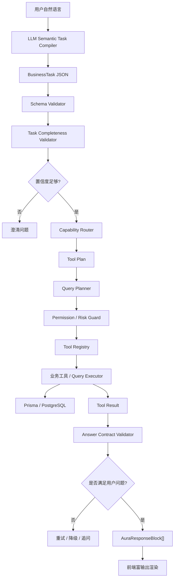

# 洞悉美业 Agent 语义优先架构改进方案

版本：v1.0  
日期：2026-06-27  
适用范围：管理端 `/ami-agent`、`packages/server-v2/src/agent`、`packages/server-v2/src/business-query`、后续 Ami_Aura 智能终端 Agent 化升级。

---

## 1. 背景与问题

当前 Agent 已具备基本工作台、Persona、工具注册、经营问数、结构化输出、记忆归档和自动化执行引擎。但在随机自然语言问题上，仍容易出现“看似回答了，实际答偏”的情况。

典型案例：

> 用户问：昨天有哪些消费的客户，列出清单  
> 系统答：优先关注马美琳等高价值客户，结合最近服务记录做复购承接

这不是模型语气问题，而是链路问题：

- 自然语言被解析成 `domain=customer`，但没有识别出“消费/订单/成交客户”这个事件和指标。
- fallback 到 `customer_growth_opportunity`，查询的是客户历史总消费排行，不是昨天订单消费客户。
- 工具结果中的客户列表藏在 `data.card.items`，渲染层只识别 `data.items`，导致页面只展示一句摘要。

结论：当前架构是“规则预解析 + 能力 fallback”，还不是“语义优先 + 结构化执行”。

---

## 2. 改进目标

目标不是继续补关键词规则，而是建立稳定的语义任务层，让 Agent 能把自然语言转成可执行的业务任务。

核心目标：

- 用户自然语言表达随机变化时，仍能识别业务对象、事件、指标、时间、筛选和输出要求。
- 模型负责理解，系统负责约束、校验和执行。
- 业务工具按能力边界执行，不允许模型直接拼 SQL 或绕过权限。
- 回答必须对齐用户问题：问清单就出表格，问原因就出诊断，问建议才出行动建议。
- 低置信度时追问，不要自信答偏。

一句话原则：

> 理解靠语义，执行靠结构，安全靠护栏，答案靠校验。

---

## 3. 目标架构



---

## 4. 核心设计

### 4.1 Semantic Task Compiler

把自然语言编译成稳定 JSON，而不是直接用关键词决定工具。

示例：

```json
{
  "intent": "query",
  "domain": "order",
  "primaryObject": "customer",
  "event": "paid_order",
  "timeRange": {
    "preset": "yesterday"
  },
  "metrics": [
    "paid_amount",
    "order_count",
    "last_service_record",
    "repurchase_opportunity"
  ],
  "filters": {
    "customerSegment": "high_value_first",
    "namedCustomers": ["马美琳"]
  },
  "outputMode": "table",
  "riskLevel": "low",
  "requiresApproval": false
}
```

这层要做的是“理解问题”，不是查库。

### 4.2 Business Ontology 业务语义字典

建立统一业务语义，不靠散落在代码里的正则。

建议先覆盖：

| 语义层 | 示例 |
|---|---|
| 对象 | customer、order、reservation、service_task、card、product、inventory、beautician |
| 事件 | paid_order、visit、reservation_created、card_writeoff、refund、followup_created |
| 指标 | paid_amount、order_count、average_order_value、repurchase_score、last_service_date |
| 时间 | today、yesterday、this_week、this_month、last_30_days |
| 输出 | summary、table、ranked_list、chart、action_draft、document |
| 风险 | read_only、draft、approval_required、blocked |

### 4.3 Capability Router

能力路由从“关键词命中”改为“结构化任务匹配”。

示例能力：

| Capability | 输入语义 | 输出 |
|---|---|---|
| `order.customer.consumption.list` | `domain=order` + `primaryObject=customer` + `event=paid_order` | 消费客户清单 |
| `customer.repurchase.recommendation` | `domain=customer` + `metrics includes repurchase_opportunity` | 复购建议 |
| `service.customer.recent.summary` | `primaryObject=customer` + `event=service_task` | 最近服务记录 |
| `customer.followup.task.draft` | `intent=draft` + `risk=medium` | 跟进任务草稿 |

### 4.4 Query Planner

由结构化任务生成受控查询计划，不允许模型直接写 SQL。

示例：

```json
{
  "source": ["ProductOrder", "OrderItem", "Customer", "ServiceTask"],
  "filters": {
    "storeId": 6,
    "ProductOrder.status": ["completed", "paid"],
    "ProductOrder.createdAt": {
      "preset": "yesterday"
    }
  },
  "groupBy": ["customerId"],
  "select": [
    "customerName",
    "memberLevel",
    "orderCount",
    "paidAmount",
    "lastOrderAt",
    "lastServiceProject",
    "repurchaseSuggestion"
  ],
  "orderBy": [
    { "field": "isNamedCustomer", "direction": "desc" },
    { "field": "paidAmount", "direction": "desc" }
  ],
  "limit": 20
}
```

### 4.5 Answer Contract Validator

回答前做验收，避免“答非所问”。

例如用户问“列出清单”：

- 必须有 `table` 或 `ranked_list`。
- 必须包含用户指定时间范围。
- 必须包含客户名。
- 如果问“消费客户”，必须包含订单/消费金额或订单数。
- 如果工具结果没有这些字段，不能只输出建议，应触发重试或追问。

---

## 5. 当前架构到目标架构的改造路径

### 阶段 1：止血但不堆补丁

目标：修复明显答偏，同时为语义层铺路。

任务：

- 新增 `order.customer.consumption.list` 能力。
- 支持查询指定周期消费客户清单。
- 输出 `data.items` 和 `table` block，不再只返回 `data.card.items`。
- 对“清单/列表/哪些客户”增加输出契约校验。
- 保留少量确定性槽位解析：时间、数量、高风险动作。

验收：

- “昨天消费的客户有哪些”
- “昨日成交客户名单”
- “昨天买过单的会员”
- “昨天谁来店里花钱了”
- “昨天有哪些客户消费，按金额排序”

以上都应输出客户消费表格。

### 阶段 2：启用 LLM Task Compiler

目标：让自然语言理解从规则主导变成语义主导。

任务：

- 启用 `BusinessTaskLlmCompilerService` 主链路。
- 设计严格 JSON Schema。
- 模型输出必须经过 zod/schema 校验。
- 校验失败自动重试一次。
- 仍保留 `BusinessTaskPreParser` 作为 deterministic slot enhancer，而不是主路由。

建议结构：

```text
LLM 初稿
  -> Schema 校验
  -> 确定性槽位补强
  -> 业务语义校验
  -> Capability Router
```

验收：

- 同义问法不再依赖关键词。
- 任务 JSON 可解释、可审计。
- 低置信度会追问。

### 阶段 3：建立业务语义测试集

目标：从“功能测试”升级为“语义理解测试”。

任务：

- 为六大 Persona 建立自然语言语义集。
- 每个能力至少 20 条随机表达。
- 每条用例断言：
  - `domain`
  - `event`
  - `metrics`
  - `outputMode`
  - `capabilityId`
  - 是否追问

示例：

| 用户表达 | 期望 capability |
|---|---|
| 昨天消费客户有哪些 | `order.customer.consumption.list` |
| 昨日有流水的顾客 | `order.customer.consumption.list` |
| 昨天买过单的会员 | `order.customer.consumption.list` |
| 本月高价值客户谁该复购 | `customer.repurchase.recommendation` |
| 马美琳最近做了什么项目 | `service.customer.recent.summary` |

### 阶段 4：多工具编排

目标：一个问题可以拆成多个工具，而不是只能命中一个工具。

用户问题：

> 昨天有哪些消费客户，优先关注马美琳等高价值客户，结合最近服务记录做复购承接

应拆成：

```text
1. order.customer.consumption.list
2. service.customer.recent.summary
3. customer.repurchase.recommendation
4. customer.followup.task.draft 可选
```

输出顺序：

1. 昨天消费客户清单表格。
2. 高价值客户高亮。
3. 最近服务记录摘要。
4. 复购承接建议。
5. 可选动作：生成跟进任务草稿。

### 阶段 5：观测与自我修正

目标：让 Agent 错误可发现、可复盘、可持续优化。

任务：

- 记录每次任务编译 JSON。
- 记录 capability 路由原因。
- 记录 answer contract 校验结果。
- 用户点“无用”时保存失败类型：
  - 意图错
  - 数据错
  - 格式错
  - 建议无价值
  - 缺少操作入口
- 将高频失败聚合成候选能力，而不是人工翻聊天记录。

---

## 6. 不建议的做法

不建议继续这样做：

- 每个问法补一条正则。
- 把“消费客户”硬塞进 `customer_growth_opportunity`。
- 让模型直接生成 SQL。
- 只优化回答文案，不修工具口径。
- 只输出文字摘要，不输出可扫读表格。

这些都会让系统看起来更会说话，但不会真正更懂业务。

---

## 7. 推荐优先级

### P0：必须先做

- 新增消费客户清单能力。
- 修复 `data.card.items` 无法渲染成表格的问题。
- 增加 answer contract：问清单必须输出表格。
- 建立 20 条“消费客户清单”语义测试。

### P1：语义主链路

- 启用 LLM Task Compiler。
- 增加 BusinessTask JSON Schema。
- 增加语义校验和低置信度追问。
- 将 PreParser 降级为槽位增强器。

### P2：多工具编排

- 支持一个问题拆多个工具。
- 支持主任务 + 辅助任务 + 可选动作。
- 支持工具结果合并为一个结构化答案。

### P3：持续学习

- 用户反馈归因。
- 高频失败聚合。
- 候选能力生成。
- Eval 自动扩展。

---

## 8. 成功标准

### 业务成功标准

- 店长问经营问题，80% 以上能直接落到正确业务能力。
- “清单类问题”必须输出表格或卡片列表。
- “建议类问题”必须给出可执行步骤。
- “不明确问题”必须追问，不能猜。
- 用户点“无用”的原因可被归类。

### 技术成功标准

- 每次回答都有可追踪的 `BusinessTask`。
- 每次工具调用都有 capability 和 query plan。
- 每个回答都通过 answer contract。
- 每个能力有语义测试集。
- 新增能力不需要改大量散落正则。

---

## 9. 结论

当前系统不应该继续靠识别规则打补丁，也不应该完全放弃规则。

正确方向是：

> 语义理解做主链路，规则做护栏和槽位补强，工具做确定性执行，校验器保证回答对题。

第一步建议直接从 `order.customer.consumption.list` 和 `Answer Contract Validator` 开始，因为它能立刻解决当前“答非所问”的真实问题，同时为后续语义优先架构铺底。
