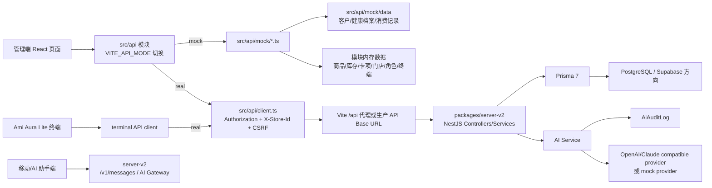
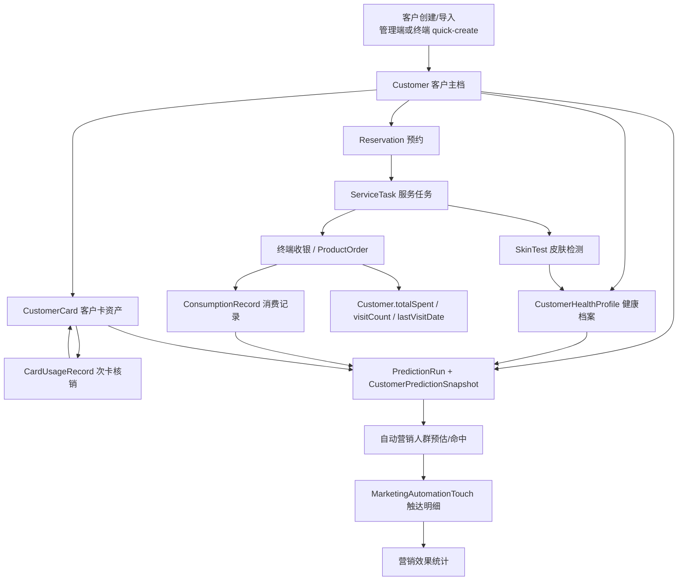
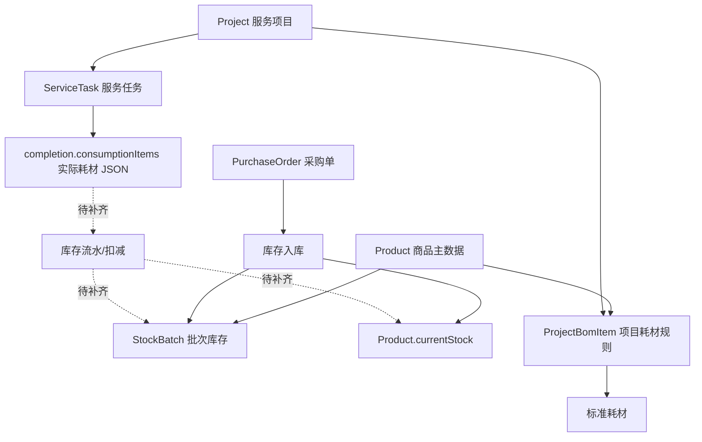
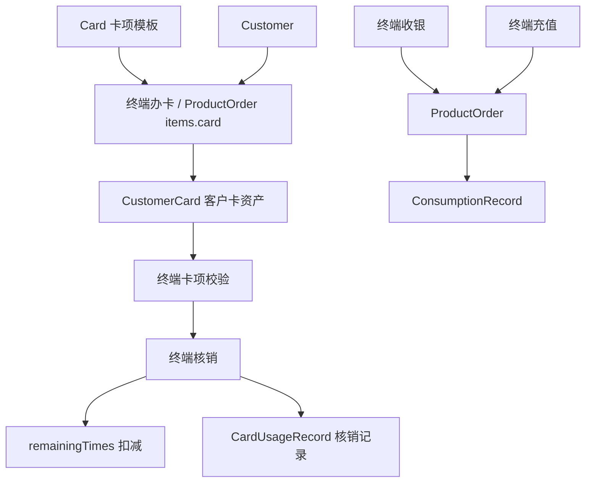
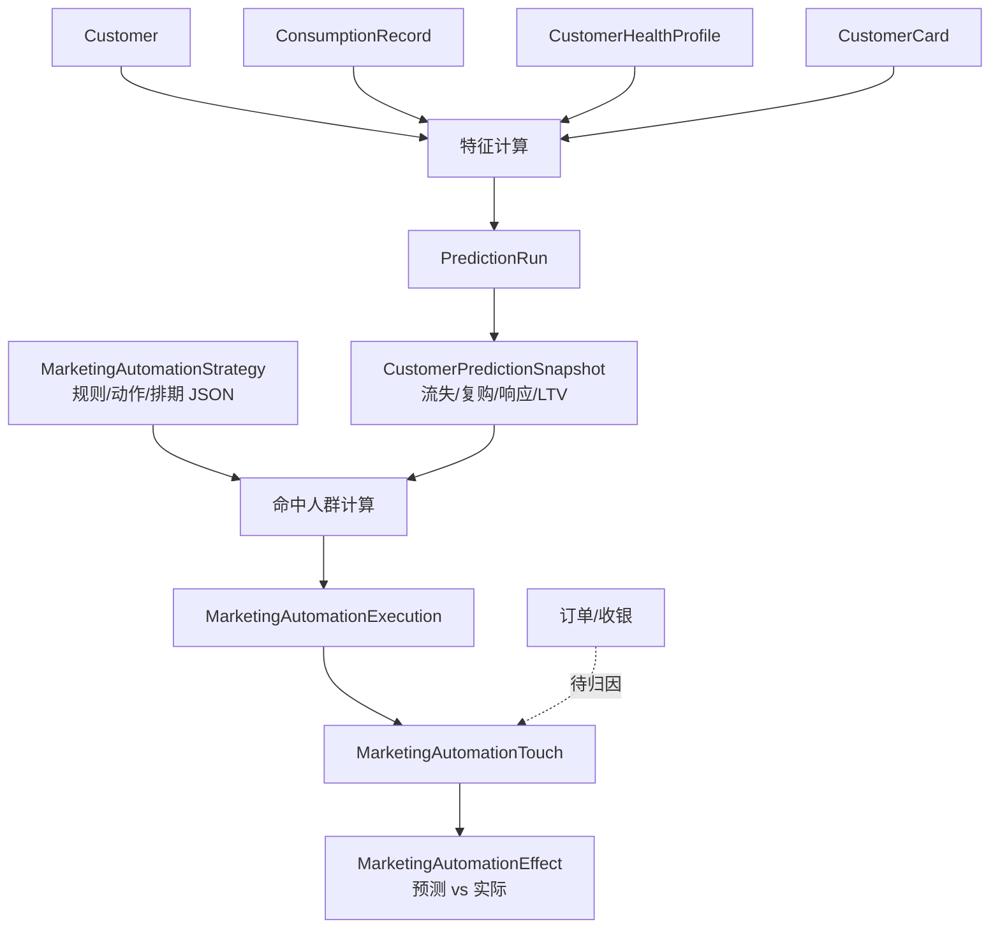
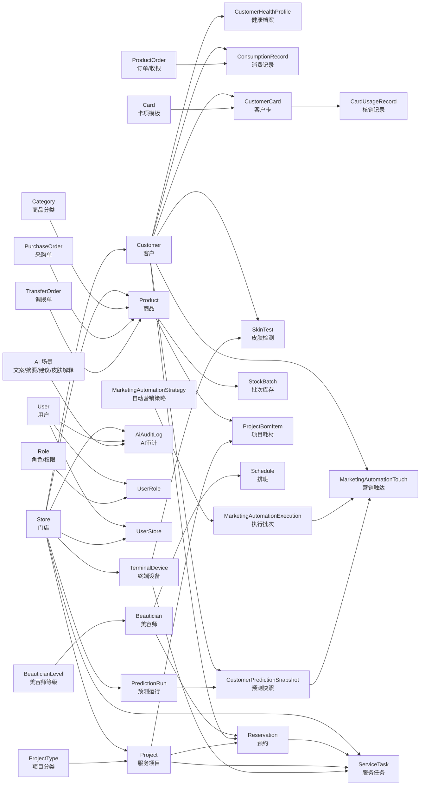

# 数据现状分析：主数据清单、数据流程图及数据图谱

更新时间：2026-06-01  
适用范围：Ami_Core 管理端、NestJS 后端、Ami Aura Lite 终端、AI/营销能力当前集成分支

## 1. 分析结论

当前项目已经具备较完整的美业门店经营数据骨架：门店、用户权限、客户档案、健康档案、消费记录、商品库存、服务项目、BOM、预约、排班、次卡、服务任务、皮肤检测、营销预测、自动营销、AI 审计等数据域均有前端 API、Mock 数据或后端模型承接。

但从“可生产化的数据资产”角度看，当前仍处于“模型基本成型、交易闭环部分打通、数据治理待收口”的阶段：

- 数据底座以 `packages/server-v2/prisma/schema.prisma` 为准，目前有 35 个 Prisma 模型。
- 管理端 `src/api` 有 20 个业务 API 模块，均采用 `mock / real / export` 切换结构。
- 演示 Mock 的大样本客户数据主要在 `src/api/mock/data/`：客户 1240 条、健康档案 673 条、消费记录 5353 条。
- 终端 real API 与后端控制器基本对齐，但 `docs/terminal-api.md` 仍有旧路径，存在联调误导风险。
- 商品库存、服务消耗、订单支付、营销转化归因等核心经营链路还缺“统一流水/事件表”，部分信息仍存放在 JSON 字段或临时返回对象中。

## 2. 数据来源现状

| 数据来源 | 当前内容 | 产品含义 | 现状判断 |
| --- | --- | --- | --- |
| `packages/server-v2/prisma/schema.prisma` | 35 个核心业务模型、4 个枚举 | 当前真实数据库模型的主依据 | 已覆盖 MVP 主链路，但部分外键关系未建、部分明细仍 JSON 化 |
| `src/api/*` | 20 个前端 API 切换模块 | 管理端页面的数据入口 | Mock/Real 双实现完整，适合继续按模块推进 |
| `src/api/mock/data/*.json` | 客户、健康档案、消费记录大样本 | 演示、推荐、画像、营销预测的样本池 | 数据量足够演示，但与真实 schema 有字段映射差异 |
| `src/api/mock/*.ts` | 商品、库存、卡项、门店、角色、终端等内存 Mock | 无后端时保持页面可用 | 适合演示，不应作为主数据源 |
| `packages/server-v2/src/*` | 控制器与服务逻辑 | 真实数据写入与查询行为 | 终端、营销、客户、库存等链路已开始形成真实闭环 |
| `packages/Ami Aura Lite Kiosk Prototype/src/app/services/auraCoreService.ts` | 终端主线 API 适配层 | 终端可通过 `/api` 接入真实后端 | 后续联调以 Prototype 主线为准 |
| `packages/server-v2/src/ai` | AI Gateway 与 legacy `/v1/messages` 兼容入口 | 兼容移动/助手端及 AI 网关方向 | 已收口到主线后端，旧轻量网关不再作为数据或部署事实源 |
| `docs/api-contract.md`、`docs/terminal-api.md` | 接口契约说明 | 联调文档 | 部分路径已经落后于实现，需要同步 |

## 3. 主数据清单

### 3.1 组织、账号与权限

| 数据对象 | 类型 | 当前系统事实 | 关键关系/消费者 | 现状判断 |
| --- | --- | --- | --- | --- |
| Store 门店 | 主数据 | DB 模型含名称、城市、地址、电话、状态、软删除；前端通过 `X-Store-Id` 做门店上下文 | Customer、Product、Project、TerminalDevice、ServiceTask、PredictionRun、AiAuditLog | 是多门店隔离的根节点，需继续强化所有业务表的门店归属 |
| User 用户 | 主数据 | 支持用户名、手机号、邮箱、状态、软删除、角色和门店授权 | Role、UserRole、UserStore、AiAuditLog、RefreshToken | 已具备 RBAC 基础 |
| Role 角色 | 权限主数据 | permissions 数组，加 platformScopes/dataScopes/fieldScopes/approvalScopes JSON | UserRole、权限守卫、菜单、字段脱敏 | 权限模型比页面复杂，后续要保持页面、API、数据权限同步 |
| UserRole / UserStore | 关系数据 | 用户到角色、门店的多对多映射 | 登录态、门店切换、数据范围过滤 | 已建联合主键，适合作为授权事实 |
| RefreshToken | 会话数据 | 用户 refresh token、过期时间 | Auth 模块 | 生产认证链路已具备基础 |

### 3.2 客户、画像与消费

| 数据对象 | 类型 | 当前系统事实 | 关键关系/消费者 | 现状判断 |
| --- | --- | --- | --- | --- |
| Customer 客户 | 核心主数据 | 包含联系方式、微信、生日、身高体重、职业、地址、过敏/手术、肤质、会员等级、来源、累计消费、到店次数、最近到店、标签 | Store、HealthProfile、ConsumptionRecord、CustomerCard、SkinTest、PredictionSnapshot、MarketingTouch | 是营销、终端、经营分析的核心实体 |
| CustomerHealthProfile 健康档案 | 客户扩展主数据 | 一客一档，肤质、肤况、问题、过敏史、护理目标、建议、仪器、最近检测 | Customer、SkinTest、AI 皮肤解释、营销肤质规则 | 终端皮肤检测会 upsert 更新该档案，方向正确 |
| ConsumptionRecord 消费记录 | 交易事实 | 记录客户、消费类型、内容、支付方式、金额、活动、时间 | Customer、营销推荐、客户画像、预测模型 | 是画像与预测的关键事实表 |
| CustomerTag | 前端概念/参考数据 | `src/types/customer.ts` 有类型，但当前 Prisma 未独立建表，客户标签用 `String[]` | 客户分群、筛选、营销 | 短期够用，后续如需运营标签治理应独立成表 |
| CustomerPredictionSnapshot | 派生画像 | 每次预测运行生成客户流失、复购、营销响应、LTV、原因、建议动作 | PredictionRun、Customer、Store、MarketingTouch | 已具备“可解释预测”基础，是营销自动化的重要输入 |

### 3.3 商品、库存与服务目录

| 数据对象 | 类型 | 当前系统事实 | 关键关系/消费者 | 现状判断 |
| --- | --- | --- | --- | --- |
| Category 商品分类 | 参考主数据 | 支持父子分类 | Product | 基础够用 |
| Product 商品 | 核心主数据 | SKU 唯一、门店归属、价格、供应商、库存、安全库存、保质期、状态、软删除 | StockBatch、ProjectBomItem、Inventory、Terminal catalog | 商品与库存共用一张主表，适合 MVP |
| StockBatch 批次库存 | 库存事实 | 商品批号、库存、生产日期、过期日期 | Product、库存预警、效期管理 | 有批次基础，但缺库存流水 |
| PurchaseOrder 采购单 | 交易单据 | 单号、供应商、总金额、状态、items JSON | Inventory | 明细 JSON 化，适合快速演示，后续报表/对账会受限 |
| TransferOrder 调拨单 | 交易单据 | 单号、调出/调入门店、商品数、状态、items JSON | Inventory | fromStoreId/toStoreId 当前未建 Prisma 外键关系 |
| ProjectType 项目分类 | 参考主数据 | 项目类别、描述、状态 | Project | 基础够用 |
| Project 服务项目 | 核心主数据 | 门店归属、类别、价格、时长、状态、软删除 | ProjectBomItem、ServiceTask、Reservation、Terminal catalog | 是预约、服务任务、BOM、终端推荐的核心目录 |
| ProjectBomItem 项目耗材 | 关系/规则数据 | 项目到商品的标准耗材量、单位 | Project、Product、服务消耗 | 已有 BOM 结构，但服务完成后库存扣减尚未闭环 |

### 3.4 员工、排班与预约服务

| 数据对象 | 类型 | 当前系统事实 | 关键关系/消费者 | 现状判断 |
| --- | --- | --- | --- | --- |
| Beautician 美容师 | 主数据 | 门店 ID、姓名、手机号、等级、头像、状态 | BeauticianLevel、Schedule、Reservation、ServiceTask、CardUsageRecord | `storeId` 是逻辑字段，Prisma 未建 Store 关系 |
| BeauticianLevel 美容师等级 | 参考主数据 | 名称、描述、排序 | Beautician | 基础够用 |
| Schedule 排班 | 计划事实 | 门店、美容师、日期、开始/结束、状态 | 预约、终端角色看板 | 当前未建 Store/Beautician 外键关系 |
| Reservation 预约 | 交易事实 | 门店、客户、项目、美容师、日期、时间、状态、签到时间 | Customer、Project、Beautician、Terminal 今日预约 | 预约主链路已具备，但 FK 关系未显式建立 |
| ServiceTask 服务任务 | 执行事实 | 任务号、客户、项目、美容师、设备、门店、预约时间、状态、开始/完成、耗材、图片 | Terminal、Project、Customer、Inventory、AI 服务建议 | 终端可创建/开始/完成/取消；完成时保存耗材 JSON，但未自动扣库存 |

### 3.5 卡项、订单与收银

| 数据对象 | 类型 | 当前系统事实 | 关键关系/消费者 | 现状判断 |
| --- | --- | --- | --- | --- |
| Card 卡项模板 | 主数据 | 名称、描述、总次数、价格、适用项目 JSON、状态 | CustomerCard、Terminal card order | 卡模板已建，适用项目 JSON 后续可规范为关系表 |
| CustomerCard 客户卡 | 客户资产 | 客户、卡模板、卡名、总次数、剩余次数、到期日、状态 | Customer、Card、CardUsageRecord、Terminal 核销 | 次卡资产闭环已形成 |
| CardUsageRecord 核销记录 | 交易事实 | 客户、卡名、项目名、核销次数、剩余次数、美容师、设备、时间 | CustomerCard、Terminal、订单报表 | 核销会扣减 CustomerCard，但部分引用为快照字段而非外键 |
| ProductOrder 商品/收银订单 | 交易单据 | 单号、客户、门店、总额、状态、支付方式、items JSON、备注 | 订单页、终端收银、办卡/充值复用 | MVP 复用度高；后续需要区分商品订单、服务订单、卡订单、充值订单或建立统一订单明细 |
| TerminalCashierOrder / CardOrder / RechargeOrder | API 返回对象 | 终端类型中存在，后端多复用 ProductOrder 或 CustomerCard 返回 | Ami Aura Lite | 当前不是独立持久模型，财务对账会需要进一步建模 |

### 3.6 终端、皮肤检测与推荐

| 数据对象 | 类型 | 当前系统事实 | 关键关系/消费者 | 现状判断 |
| --- | --- | --- | --- | --- |
| TerminalDevice 终端设备 | 主数据/设备资产 | 设备编码、激活码、门店、型号、状态、版本、电量、网络、在线时间、绑定时间 | Store、ServiceTask、SkinTest、Terminal Auth | 设备登录会校验编码/激活码并更新在线状态 |
| SkinTest 皮肤检测 | 交易/检测事实 | 客户、任务、设备、图片、metrics JSON、肤质、肤况、问题、推荐文本 | CustomerHealthProfile、AI 解释、终端推荐 | 创建时会同步更新健康档案，闭环较好 |
| TerminalRecommendationEvent | 行为事件 | 前端类型和 API 存在，后端当前返回临时对象，不落库 | 推荐反馈、转化归因 | 若要评估推荐效果，建议建表 |
| TerminalPromotion | 运营配置/临时数据 | 后端当前返回固定数组 | 终端可用促销 | 还不是可运营配置 |
| TerminalPrintJob | 打印任务/临时数据 | 后端当前即时返回 completed，不落库 | 小票打印 | 如需重打、审计、失败重试，需建表 |

### 3.7 营销、预测与 AI

| 数据对象 | 类型 | 当前系统事实 | 关键关系/消费者 | 现状判断 |
| --- | --- | --- | --- | --- |
| MarketingActivity 活动 | 运营主数据/活动记录 | 标题、描述、状态、参与人数、转化、周期、目标客户、优惠 | 营销活动页 | 与自动营销策略暂无强关联外键 |
| MarketingAutomationStrategy 自动营销策略 | 规则主数据 | 名称、状态、执行方式、schedule/triggerRules/actions JSON、命中人数、最近执行时间 | Execution、Touch、营销页面 | 规则灵活，但 JSON 化对审计、版本和可解释性提出更高要求 |
| MarketingAutomationExecution 执行记录 | 交易事实 | 策略、状态、触发数、触达数、渠道、执行时间、消息 | Strategy、Touch | 已能记录策略执行批次 |
| MarketingAutomationTouch 触达明细 | 交易事实/归因基础 | 执行、策略、客户、预测快照、预测转化分、预测收入、状态、触达/转化时间、实际收入 | Customer、PredictionSnapshot、营销效果 | 当前执行会写触达；实际转化尚未自动接入订单/收银 |
| PredictionRun 预测运行 | 模型运行记录 | 门店、模型版本、状态、开始/结束、客户数、汇总 JSON | CustomerPredictionSnapshot、营销页 | 已支持按门店跑预测 |
| CustomerPredictionSnapshot 预测快照 | 派生画像 | 流失、复购、响应、LTV、feature/reason/actions JSON | Customer、MarketingTouch | 具备可解释特征，适合驱动自动营销 |
| AiAuditLog AI 审计日志 | 审计事实 | 用户、设备、门店、场景、模板、模型、token、摘要、延迟、状态 | AI 管理、成本与风控 | 已建表；服务端脱敏、prompt 版本治理还需继续收口 |

## 4. 全局数据流程图

## 5. 核心业务数据流程图

### 5.1 客户经营闭环

关键说明：

- 终端皮肤检测会同步更新健康档案，这是客户画像闭环里完成度较高的一段。
- 收银会更新客户累计消费、到店次数、最近到店，并写入消费记录。
- 自动营销已能从客户、消费、卡项、健康档案生成预测快照，再生成触达记录。
- 订单/核销与营销触达之间暂未形成自动归因，实际转化、实际收入仍需要后续事件打通。

### 5.2 商品库存与服务耗材

关键说明：

- 入库链路会创建批次并累加商品当前库存。
- 项目 BOM 已能定义标准耗材。
- 服务完成时保存实际耗材，但目前未看到自动扣减 `Product.currentStock` / `StockBatch.stock` 的完整库存流水链路。
- 建议后续新增 `StockMovement` 或类似库存流水，统一承接入库、调拨、服务消耗、盘点、报损。

### 5.3 次卡与收银

关键说明：

- 次卡“模板 -> 客户持卡 -> 核销 -> 剩余次数”链路已成型。
- 办卡、充值、普通收银当前多复用 `ProductOrder`，通过 `items` JSON 区分类型。
- 若后续要做财务对账、支付退款、卡资产账务，建议拆出订单明细、支付流水、会员账户/卡权益流水。

### 5.4 营销预测与自动触达

关键说明：

- 后端预测会读取客户、消费记录、客户卡、健康档案，生成带原因的客户预测快照。
- 策略执行会写入批次执行记录和触达明细。
- 当前 mock 会模拟部分转化；real 链路还缺订单到触达的自动归因更新。

## 6. 核心数据图谱

## 7. 当前主要数据风险与缺口

### 7.1 接口文档与实现不一致

`docs/terminal-api.md` 中仍有旧路径，例如：

- 文档：`POST /terminal/device/login`；当前实现：`POST /terminal/devices/login`
- 文档：`GET /terminal/service-tasks`；当前实现：`GET /terminal/tasks`
- 文档：`POST /terminal/card-usage/verify`；当前实现：`POST /terminal/cards/consume`

产品影响：终端联调、测试用例、第三方对接如果按旧文档执行，会出现“前端可跑但接口不通”的沟通成本。建议把 `docs/terminal-api.md` 更新为当前后端和 `src/api/real/terminal.ts` 的版本。

### 7.2 部分业务关系只有 ID，没有数据库外键

当前 schema 中一些关键字段是逻辑引用，但没有 Prisma relation，例如：

- `Beautician.storeId`
- `Schedule.storeId`、`Schedule.beauticianId`
- `Reservation.storeId/customerId/projectId/beauticianId`
- `ProductOrder.customerId/storeId`
- `CardUsageRecord.customerId/beauticianId/deviceId`
- `ServiceTask.customerId/beauticianId`
- `SkinTest.taskId`
- `TransferOrder.fromStoreId/toStoreId`
- `AiAuditLog.deviceId`

产品影响：短期不影响页面演示；长期会影响数据一致性、删除保护、联表查询、报表可信度。

### 7.3 关键明细 JSON 化，灵活但不利于治理

当前 JSON 字段包括：

- `PurchaseOrder.items`
- `TransferOrder.items`
- `ProductOrder.items`
- `Card.projects`
- `ServiceTask.consumptionItems`
- `SkinTest.metrics`
- `MarketingAutomationStrategy.schedule/triggerRules/actions`
- `PredictionRun.summaryJson`
- `CustomerPredictionSnapshot.featureJson/reasonJson/recommendedActionsJson`

产品影响：MVP 迭代快，但如果要做精细统计、权限控制、审计、搜索、 BI 分析，需要逐步抽出高频字段和明细表。

### 7.4 库存消耗闭环未完全打通

已具备：商品主数据、批次库存、采购入库、项目 BOM、服务任务实际耗材。  
待补齐：服务完成后自动生成库存流水并扣减商品/批次库存。

产品影响：当前可以展示库存、BOM、服务耗材，但“服务消耗 -> 实时库存”还不是财务级可信。

### 7.5 营销实际转化归因未接订单

已具备：预测、策略、执行、触达、效果统计结构。  
待补齐：订单/收银/办卡/充值与营销触达的归因关联。

产品影响：可以演示“预测触达”和“效果看板”，但真实 ROI 要等订单归因闭环。

### 7.6 Mock 数据源存在多份

当前至少有三类 Mock：

- 管理端 Mock：`src/api/mock/*`
- 管理端大样本 JSON：`src/api/mock/data/*`
- 终端主线适配层：`packages/Ami Aura Lite Kiosk Prototype/src/app/services/auraCoreService.ts`

产品影响：演示方便，但跨端演示时可能出现客户、预约、卡项、库存不一致。建议统一“演示数据源”或明确 mock 场景边界。

## 8. 建议的数据治理优先级

| 优先级 | 建议 | 交付收益 |
| --- | --- | --- |
| P0 | 统一终端接口文档，以 `src/api/real/terminal.ts` 和后端 controller 为准 | 降低终端联调风险 |
| P0 | 明确 `packages/server-v2/prisma/schema.prisma` 为主数据模型单一事实源 | 避免 mock、文档、历史网关口径冲突 |
| P1 | 补关键外键关系：预约、排班、服务任务、订单、核销、调拨、美容师、AI 设备审计 | 提升数据一致性和报表可信度 |
| P1 | 新增库存流水模型，打通入库、调拨、服务消耗、盘点、报损 | 让库存从“展示型”变成“经营可信” |
| P1 | 新增订单明细/支付流水/退款流水，减少 ProductOrder.items JSON 承担过多职责 | 支撑财务、收银、卡项、充值对账 |
| P1 | 建立营销归因事件：订单支付后回写 Touch converted/actualRevenue | 让营销 ROI 从预测值变成真实经营指标 |
| P2 | 统一 Mock 数据工厂，管理端与终端共享同一演示数据 | 改善跨端演示一致性 |
| P2 | 对营销规则、AI Prompt、推荐反馈建立版本与审计数据 | 支撑长期运营优化和模型评估 |

## 9. 可作为“主数据治理”的第一批对象

第一批建议锁定以下主数据，作为后续导入模板、权限、审计和报表的统一口径：

1. 门店：Store
2. 用户与角色：User、Role、UserStore、UserRole
3. 客户主档：Customer
4. 客户健康档案：CustomerHealthProfile
5. 服务项目与分类：Project、ProjectType
6. 商品与分类：Product、Category
7. 项目耗材规则：ProjectBomItem
8. 美容师与等级：Beautician、BeauticianLevel
9. 卡项模板：Card
10. 终端设备：TerminalDevice
11. 自动营销策略：MarketingAutomationStrategy

这些对象变化频率低、复用范围广，是客户经营、库存、服务、营销和终端协同的基础。

## 10. 可作为“经营事实”的第一批对象

第一批建议锁定以下经营事实，作为后续看板、经营分析和 AI 推荐的可信输入：

1. 消费记录：ConsumptionRecord
2. 订单/收银：ProductOrder
3. 客户持卡：CustomerCard
4. 卡项核销：CardUsageRecord
5. 预约：Reservation
6. 服务任务：ServiceTask
7. 皮肤检测：SkinTest
8. 批次库存：StockBatch
9. 采购单：PurchaseOrder
10. 调拨单：TransferOrder
11. 预测运行与快照：PredictionRun、CustomerPredictionSnapshot
12. 营销执行与触达：MarketingAutomationExecution、MarketingAutomationTouch
13. AI 调用审计：AiAuditLog

这些数据决定经营结果能否被准确复盘，也决定 AI/营销推荐能否持续优化。
